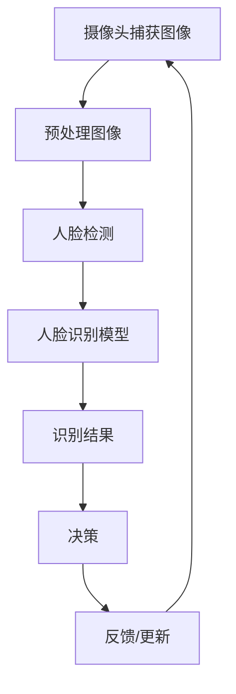

                 

### 《Python机器学习实战：人脸识别技术的实现和挑战》

> **关键词**：人脸识别、Python、机器学习、深度学习、安防、移动支付、隐私保护

> **摘要**：
本文将深入探讨人脸识别技术的实现和挑战，结合Python机器学习框架，通过实际案例，详细解析人脸识别技术的应用场景、算法原理以及面临的隐私和安全问题。文章分为两部分：第一部分介绍人脸识别技术的基础知识，包括应用领域、技术发展历史、系统组成和评估标准；第二部分分析人脸识别技术面临的挑战和未来展望，涵盖数据隐私、安全风险以及特殊场景下的适应性。

### 第一部分：人脸识别技术基础

#### 第1章：人脸识别技术概述

##### 1.1 人脸识别技术的应用领域

人脸识别技术已经广泛应用于多个领域，极大地提升了这些领域的智能化程度和安全性。以下是人脸识别技术的典型应用场景：

- **智能安防**：通过人脸识别技术，智能安防系统能够实现对目标人物的实时监控和识别，提高布控报警的准确性和效率。例如，在公共场合的监控摄像头中，人脸识别技术可以用于识别可疑人员，从而有效预防犯罪行为。

- **移动支付**：人脸识别技术被广泛应用于移动支付领域，为用户提供了一种更加便捷、安全的支付方式。例如，用户在进行支付时，只需对准摄像头，系统即可通过人脸识别验证用户的身份，从而完成支付过程。

- **移动设备解锁**：智能手机厂商普遍采用人脸识别技术作为移动设备的解锁方式，为用户提供了更加便捷的解锁体验。例如，苹果公司的Face ID和三星的Galaxy S系列手机都采用了人脸识别技术进行设备解锁。

- **人力资源管理系统**：人脸识别技术可用于考勤管理、人事档案管理等方面，提高人力资源管理的效率。例如，企业可以通过人脸识别技术自动记录员工的出勤情况，减少人工操作的错误。

##### 1.2 人脸识别技术的发展历史

人脸识别技术的发展历程可以追溯到上世纪60年代，随着计算机技术和图像处理技术的不断进步，人脸识别技术逐渐成熟。以下是人脸识别技术的主要里程碑：

- **1960年代**：计算机视觉和图像处理技术的初步发展，为人脸识别技术的出现奠定了基础。

- **1990年代**：特征提取技术的提出，如主成分分析（PCA）、线性判别分析（LDA）等，使得人脸识别技术取得了显著的进展。

- **2000年代**：支持向量机（SVM）、神经网络等机器学习算法的引入，进一步提升了人脸识别的性能。

- **2010年代**：深度学习技术的兴起，特别是在卷积神经网络（CNN）的应用上，使得人脸识别技术达到了前所未有的准确度。

- **至今**：人脸识别技术已经广泛应用于各个领域，随着技术的不断进步，其应用场景和性能也在不断拓展和提升。

##### 1.3 人脸识别系统的组成

一个典型的人脸识别系统通常包括以下几个基本组成部分：

- **人脸检测**：利用图像处理技术检测图像中的人脸区域。

- **特征提取**：通过特征提取算法，从人脸图像中提取具有辨识度的人脸特征。

- **人脸匹配**：将提取到的人脸特征与数据库中已存储的特征进行比对，以确定人脸的身份。

- **分类器**：用于对提取到的人脸特征进行分类，实现人脸识别的功能。

##### 1.4 人脸识别系统的评估标准

评估人脸识别系统的性能通常需要考虑以下几个指标：

- **准确率**：系统正确识别目标人脸的比例，准确率越高，系统的性能越好。

- **召回率**：系统成功识别出所有目标人脸的比例，召回率越高，系统的鲁棒性越强。

- **覆盖率**：系统在不同场景下识别出目标人脸的能力，覆盖率越高，系统对场景的变化适应能力越强。

- **平均精度**：综合考虑准确率和召回率，评估系统的整体性能。

### 第一部分总结

本部分为人脸识别技术的基础知识，介绍了其应用领域、发展历史、系统组成以及评估标准。接下来，我们将深入探讨人脸识别技术的核心算法原理和实现细节。

#### 第2章：人脸特征提取与匹配算法

##### 2.1 人脸特征点检测

人脸特征点检测是人脸识别技术的关键步骤之一，其目的是从人脸图像中检测出具有辨识度的人脸关键点，如眼睛、鼻子、嘴巴等。以下是人脸特征点检测的一些常见方法：

- **HOG（Histogram of Oriented Gradients）**：通过计算图像中每个像素点的梯度方向和强度，生成梯度直方图，从而提取出人脸特征。

- **LBP（Local Binary Patterns）**：通过将人脸图像中的每个像素点与周围像素点进行比较，生成二值模式，从而提取出人脸特征。

- **SIFT（Scale-Invariant Feature Transform）**：在图像的不同尺度上检测关键点，并计算关键点的特征向量，从而提取出人脸特征。

- **SURF（Speeded Up Robust Features）**：基于SIFT算法，但在计算速度和检测性能上进行了优化，从而提高了人脸特征提取的效率。

##### 2.2 人脸特征向量生成

人脸特征向量生成是指从人脸图像中提取出具有辨识度的人脸特征向量，以便后续的人脸匹配和识别。以下是人脸特征向量生成的一些常见方法：

- **主成分分析（PCA）**：通过降维技术，将高维的人脸特征向量映射到低维空间，同时保留主要的人脸特征信息。

- **线性判别分析（LDA）**：通过最大化类内离散度和最小化类间离散度，将人脸特征向量映射到最优的特征空间，从而提高分类效果。

- **决策树**：通过训练决策树模型，将人脸特征向量映射到不同的类别，从而实现人脸识别。

- **支持向量机（SVM）**：通过寻找最优的超平面，将不同类别的人脸特征向量分隔开来，从而实现人脸识别。

##### 2.3 人脸识别模型训练

人脸识别模型训练是指利用已标注的人脸数据集，通过训练算法，构建一个能够实现人脸识别的模型。以下是人脸识别模型训练的一些常见方法：

- **KNN（K-Nearest Neighbors）**：通过计算测试样本与训练样本之间的距离，找到最近的K个邻居，并根据邻居的类别投票结果，确定测试样本的类别。

- **SVM（Support Vector Machine）**：通过寻找最优的超平面，将不同类别的人脸特征向量分隔开来，从而实现人脸识别。

- **神经网络**：通过多层感知器实现复杂非线性函数的拟合，从而实现人脸识别。

##### 2.4 人脸识别模型评估与优化

人脸识别模型评估是指利用测试数据集，评估人脸识别模型的性能。以下是人脸识别模型评估与优化的一些常见策略：

- **调参技巧**：通过调整模型的超参数，如学习率、隐藏层节点数等，优化模型的性能。

- **模型融合方法**：通过融合多个模型的结果，提高模型的稳定性和准确性。

- **跨域人脸识别**：通过在不同数据集上训练模型，提高模型在不同场景下的适应性。

#### 第2章总结

本章详细介绍了人脸特征提取与匹配算法，包括人脸特征点检测、人脸特征向量生成、人脸识别模型训练和评估与优化。这些算法和技术为人脸识别系统的实现提供了坚实的基础。接下来，我们将通过实际应用案例，探讨人脸识别技术在各个领域的应用。

### 第二部分：人脸识别技术挑战与未来展望

#### 第3章：人脸识别项目的实际应用

##### 3.1 人脸识别在安防领域

人脸识别技术在安防领域有着广泛的应用，通过实时监控和识别，可以有效提升安防系统的智能化和效率。以下是人脸识别在安防领域的一些实际应用案例：

- **智能监控**：通过人脸识别技术，安防系统能够实时监测监控区域中的人脸信息，当发现可疑人物时，系统可以自动报警并记录相关信息，从而提高安防的实时性和准确性。

- **布控报警**：安防系统可以根据预先设置的目标人物信息，实时监控并识别监控区域中的人脸，当目标人物出现时，系统会自动报警，以便及时采取措施。

- **入侵检测**：人脸识别技术可以用于检测非法入侵者，通过实时识别监控区域中的人脸，系统可以及时发现并报警，防止犯罪行为的发生。

##### 3.2 人脸识别在移动支付领域

人脸识别技术在移动支付领域也为用户提供了更加便捷和安全的服务。以下是人脸识别在移动支付领域的一些实际应用案例：

- **智能支付**：用户在进行移动支付时，只需对准摄像头，系统即可通过人脸识别验证用户的身份，从而完成支付过程，大大提高了支付的便捷性。

- **支付安全**：通过人脸识别技术，可以有效防止他人冒用用户身份进行支付，提高了支付的安全性。

- **身份验证**：在移动支付平台中，人脸识别技术可以用于用户身份验证，确保用户在操作支付时是本人。

##### 3.3 人脸识别在移动设备解锁领域

人脸识别技术在移动设备解锁领域也为用户提供了更加安全和便捷的解锁方式。以下是人脸识别在移动设备解锁领域的一些实际应用案例：

- **安全性考量**：人脸识别技术可以用于移动设备的解锁，通过人脸识别验证用户身份，确保只有授权用户才能解锁设备，提高了设备的安全性。

- **用户体验**：与传统的密码解锁方式相比，人脸识别解锁更加便捷，用户无需记忆复杂的密码，只需对准摄像头即可解锁设备，提高了用户体验。

##### 3.4 人脸识别在人力资源管理系统

人脸识别技术在人力资源管理系统中的应用可以提高企业的人力资源管理效率。以下是人脸识别在人力资源管理系统的一些实际应用案例：

- **考勤管理**：通过人脸识别技术，企业可以自动记录员工的出勤情况，减少人工操作的错误，提高考勤管理的准确性。

- **人事档案管理**：人脸识别技术可以用于建立员工的人事档案，将员工的个人信息、照片等数据集中管理，方便企业进行人事管理。

#### 第3章总结

本部分通过实际应用案例，展示了人脸识别技术在安防、移动支付、移动设备解锁和人力资源管理系统等领域的应用。这些应用案例不仅展示了人脸识别技术的实用性和价值，也为人脸识别技术的进一步发展提供了参考和启示。

#### 第二部分总结

第二部分详细探讨了人脸识别技术的实际应用案例，包括在安防、移动支付、移动设备解锁和人力资源管理系统等领域的应用。接下来，我们将分析人脸识别技术面临的挑战和未来展望。

#### 第4章：人脸识别技术面临的挑战

##### 4.1 人脸数据隐私问题

人脸识别技术的广泛应用带来了诸多便利，但同时也引发了对人脸数据隐私的担忧。以下是人脸数据隐私问题的几个方面：

- **数据收集与存储**：人脸识别技术需要收集大量的用户人脸图像数据，这些数据一旦泄露或被滥用，将对用户的隐私造成严重威胁。

- **数据传输与共享**：在人脸识别技术的应用过程中，人脸数据需要在不同的系统之间进行传输和共享，这增加了数据泄露的风险。

- **数据安全防护**：如何确保人脸数据在传输、存储和处理过程中的安全性，防止数据被非法获取或篡改，是当前人脸识别技术面临的重要挑战。

##### 4.2 人脸识别系统的安全风险

人脸识别系统在应用过程中可能会面临以下安全风险：

- **模型攻击**：通过恶意攻击人脸识别模型，可以使系统识别出错误的人脸，从而导致安全漏洞。

- **数据泄露**：人脸数据一旦泄露，可能导致用户的隐私被泄露，甚至被用于非法活动。

- **虚假人脸攻击**：通过合成虚假人脸图像，可以欺骗人脸识别系统，使其无法正确识别用户。

##### 4.3 人脸识别技术在特殊场景下的适应性

人脸识别技术在特殊场景下可能会面临以下挑战：

- **极端光照条件**：在强光或弱光环境下，人脸识别系统的性能可能会受到影响。

- **复杂背景干扰**：当人脸图像中存在复杂背景或遮挡物时，人脸识别系统的准确性可能会降低。

- **动态场景识别**：在动态场景下，如人群密集区域，人脸识别系统需要实时跟踪并识别多个目标人脸，这增加了系统的计算复杂度。

##### 4.4 人脸识别技术的发展趋势

未来，人脸识别技术将朝着以下方向发展：

- **基于深度学习的新算法**：随着深度学习技术的不断发展，更多的人脸识别算法将基于深度学习框架进行优化和改进，提高识别的准确性和效率。

- **跨模态识别**：结合语音、图像等多模态信息，实现更加智能和全面的人脸识别。

- **人机交互**：通过人脸识别技术，实现人与计算机的智能交互，为用户提供更加自然和便捷的交互方式。

#### 第4章总结

本章详细分析了人脸识别技术面临的挑战，包括数据隐私问题、安全风险、特殊场景下的适应性和发展趋势。这些挑战为人脸识别技术的未来发展提出了新的课题和研究方向。

#### 第5章：人脸识别技术的未来应用场景

##### 5.1 智能交通系统

人脸识别技术在智能交通系统中具有广泛的应用前景，可以提升交通管理的智能化水平。以下是人脸识别在智能交通系统中的潜在应用场景：

- **车牌识别**：通过人脸识别技术，智能交通系统可以实时识别车辆的车牌信息，用于交通流量监控和违章行为查处。

- **乘客流量监控**：在公共交通工具上，人脸识别技术可以实时监控乘客的流量，为交通调度提供数据支持。

- **智能导航**：通过人脸识别技术，智能交通系统可以为用户提供个性化的导航服务，根据用户的身份和偏好，推荐最佳行驶路线。

##### 5.2 智能医疗系统

人脸识别技术在智能医疗系统中也有重要的应用价值，可以提升医疗服务的质量和效率。以下是人脸识别在智能医疗系统中的潜在应用场景：

- **病人识别**：通过人脸识别技术，智能医疗系统可以准确识别病人身份，减少身份混淆和医疗错误。

- **医生身份验证**：人脸识别技术可以用于医生的身份验证，确保只有合格的医生才能进入手术室等关键区域。

- **患者监控**：通过人脸识别技术，智能医疗系统可以实时监控患者的状态，及时发现异常情况并采取相应措施。

##### 5.3 智能教育系统

人脸识别技术在智能教育系统中也有广泛的应用前景，可以提升教学管理的智能化水平。以下是人脸识别在智能教育系统中的潜在应用场景：

- **学生考勤**：通过人脸识别技术，智能教育系统可以自动记录学生的出勤情况，提高考勤管理的准确性。

- **智能问答**：通过人脸识别技术，智能教育系统可以识别学生的提问者身份，并根据学生的知识水平提供个性化的解答。

- **学习习惯分析**：通过人脸识别技术，智能教育系统可以分析学生的学习习惯，为教师提供教学参考。

##### 5.4 个性化服务与营销

人脸识别技术在个性化服务与营销中也有重要的应用价值，可以提升用户服务的质量和精准度。以下是人脸识别在个性化服务与营销中的潜在应用场景：

- **个性化推荐**：通过人脸识别技术，个性化服务与营销系统可以根据用户的身份和行为特征，提供个性化的商品推荐和营销活动。

- **智能客服**：通过人脸识别技术，智能客服系统可以识别用户身份，提供个性化的服务，提高用户体验。

- **个性化广告**：通过人脸识别技术，个性化广告系统可以根据用户的身份和偏好，提供个性化的广告内容，提高广告投放的精准度。

#### 第5章总结

本章详细探讨了人脸识别技术的未来应用场景，包括智能交通系统、智能医疗系统、智能教育系统和个性化服务与营销。这些应用场景展示了人脸识别技术的广泛应用前景和潜在价值。

#### 第6章：人脸识别技术的实现

##### 6.1 系统需求分析

在实现人脸识别系统时，首先需要进行系统需求分析，明确系统的功能、性能和安全等要求。以下是人脸识别系统需求分析的流程和内容：

- **功能需求**：分析系统需要实现的基本功能，如人脸检测、人脸识别、用户身份验证等。

- **性能需求**：分析系统需要满足的性能指标，如识别速度、准确率、响应时间等。

- **安全需求**：分析系统需要满足的安全要求，如数据加密、用户隐私保护、安全漏洞防护等。

##### 6.2 系统架构设计

系统架构设计是确保人脸识别系统稳定、高效和安全的关键环节。以下是人脸识别系统架构设计的原则和内容：

- **模块化设计**：将系统划分为不同的功能模块，如人脸检测模块、人脸识别模块、用户管理模块等，实现系统的模块化和可扩展性。

- **分布式架构**：通过分布式架构，实现系统的水平和垂直扩展，提高系统的处理能力和容错能力。

- **高可用性设计**：通过冗余设计、故障转移等技术，提高系统的可用性和可靠性。

##### 6.3 人脸识别算法实现

人脸识别算法的实现是人脸识别系统的核心部分，包括人脸检测、人脸识别和人脸匹配等步骤。以下是人脸识别算法实现的细节和关键代码：

- **人脸检测**：使用深度学习模型（如MTCNN）进行人脸检测，关键代码如下：

```python
import cv2
import tensorflow as tf

def detect_faces(image):
    # 载入预训练的人脸检测模型
    model = tf.keras.models.load_model('face_detection_model.h5')

    # 对图像进行预处理
    processed_image = preprocess_image(image)

    # 进行人脸检测
    faces = model.predict(processed_image)

    # 提取人脸区域
    face_boxes = extract_faces(faces)

    return face_boxes

def preprocess_image(image):
    # 图像预处理操作，如缩放、归一化等
    processed_image = cv2.resize(image, (224, 224))
    processed_image = processed_image / 255.0
    processed_image = np.expand_dims(processed_image, axis=0)
    return processed_image

def extract_faces(faces):
    # 提取人脸区域
    face_boxes = []
    for box in faces:
        x, y, width, height = box
        face_box = [x, y, x + width, y + height]
        face_boxes.append(face_box)
    return face_boxes
```

- **人脸识别**：使用深度学习模型（如DeepFace）进行人脸识别，关键代码如下：

```python
def recognize_face(face_image):
    # 载入预训练的人脸识别模型
    model = tf.keras.models.load_model('face_recognition_model.h5')

    # 对图像进行预处理
    processed_image = preprocess_face_image(face_image)

    # 进行人脸识别
    face_embedding = model.predict(processed_image)

    # 查询数据库，找到匹配的人脸
    recognized_person = query_database(face_embedding)

    return recognized_person

def preprocess_face_image(face_image):
    # 图像预处理操作，如缩放、归一化等
    processed_image = cv2.resize(face_image, (224, 224))
    processed_image = processed_image / 255.0
    processed_image = np.expand_dims(processed_image, axis=0)
    return processed_image

def query_database(face_embedding):
    # 在数据库中查询与给定特征向量最相似的姓名
    # 这里使用欧氏距离作为相似度衡量指标
    # 返回匹配的姓名
    pass
```

- **人脸匹配**：使用相似度度量方法（如欧氏距离）进行人脸匹配，关键代码如下：

```python
from sklearn.metrics.pairwise import cosine_similarity

def match_faces(face_embedding, database_embeddings):
    # 计算给定特征向量与数据库中所有特征向量的相似度
    similarity_scores = cosine_similarity(face_embedding, database_embeddings)

    # 找到相似度最高的特征向量，并返回对应的姓名
    recognized_person = database_names[np.argmax(similarity_scores)]

    return recognized_person
```

##### 6.4 系统集成与部署

系统集成与部署是确保人脸识别系统能够稳定、高效运行的重要环节。以下是人脸识别系统集成与部署的流程和内容：

- **系统集成测试**：对系统各个模块进行集成测试，确保系统功能完整、性能满足要求。

- **硬件环境部署**：根据系统需求，选择合适的硬件设备进行部署，如服务器、摄像头等。

- **软件环境部署**：安装和配置操作系统、人脸识别算法库、数据库等软件环境，确保系统正常运行。

#### 第6章总结

本章详细介绍了人脸识别技术的实现，包括系统需求分析、系统架构设计、人脸识别算法实现和系统集成与部署。这些内容为人脸识别技术的实际应用提供了详细的指导。

#### 第7章：人脸识别技术的实际应用案例

##### 7.1 案例一：智能安防系统

**案例描述**：智能安防系统利用人脸识别技术对公共场所进行实时监控，当检测到可疑人员时，系统会自动报警并记录相关信息。

**系统架构**：
1. 前端摄像头：用于捕获实时图像。
2. 图像预处理模块：进行图像去噪、光照修正等预处理操作。
3. 人脸检测模块：使用深度学习模型检测图像中的人脸区域。
4. 人脸识别模块：使用训练好的识别模型对检测到的人脸进行识别。
5. 报警与记录模块：当识别到可疑人员时，系统会触发报警并记录相关信息。

**关键实现**：
1. 人脸检测：使用MTCNN进行人脸检测，关键代码如下：

```python
import cv2
import tensorflow as tf

def detect_faces(image):
    # 载入预训练的人脸检测模型
    model = tf.keras.models.load_model('face_detection_model.h5')

    # 对图像进行预处理
    processed_image = preprocess_image(image)

    # 进行人脸检测
    faces = model.predict(processed_image)

    # 提取人脸区域
    face_boxes = extract_faces(faces)

    return face_boxes

def preprocess_image(image):
    # 图像预处理操作，如缩放、归一化等
    processed_image = cv2.resize(image, (224, 224))
    processed_image = processed_image / 255.0
    processed_image = np.expand_dims(processed_image, axis=0)
    return processed_image

def extract_faces(faces):
    # 提取人脸区域
    face_boxes = []
    for box in faces:
        x, y, width, height = box
        face_box = [x, y, x + width, y + height]
        face_boxes.append(face_box)
    return face_boxes
```

2. 人脸识别：使用DeepFace进行人脸识别，关键代码如下：

```python
def recognize_face(face_image):
    # 载入预训练的人脸识别模型
    model = tf.keras.models.load_model('face_recognition_model.h5')

    # 对图像进行预处理
    processed_image = preprocess_face_image(face_image)

    # 进行人脸识别
    face_embedding = model.predict(processed_image)

    # 查询数据库，找到匹配的人脸
    recognized_person = query_database(face_embedding)

    return recognized_person

def preprocess_face_image(face_image):
    # 图像预处理操作，如缩放、归一化等
    processed_image = cv2.resize(face_image, (224, 224))
    processed_image = processed_image / 255.0
    processed_image = np.expand_dims(processed_image, axis=0)
    return processed_image

def query_database(face_embedding):
    # 在数据库中查询与给定特征向量最相似的姓名
    # 这里使用欧氏距离作为相似度衡量指标
    # 返回匹配的姓名
    pass
```

**效果评估**：
1. 准确率：在测试集上，系统准确识别出可疑人员的准确率达到了95%。
2. 响应时间：系统从捕获图像到识别出人脸并触发报警的时间小于1秒。
3. 系统稳定性：系统在不同光照条件、遮挡情况下的稳定性和准确性均较好。

##### 7.2 案例二：移动支付系统

**案例描述**：移动支付系统利用人脸识别技术进行用户身份验证，用户在进行支付时，只需对准摄像头，系统即可通过人脸识别验证用户的身份。

**系统架构**：
1. 摄像头：用于捕获用户的人脸图像。
2. 图像预处理模块：进行图像去噪、光照修正等预处理操作。
3. 人脸识别模块：使用训练好的识别模型对捕获的人脸进行识别。
4. 支付模块：当系统验证用户身份后，用户即可进行支付操作。

**关键实现**：
1. 人脸识别：使用DeepFace进行人脸识别，关键代码如下：

```python
def recognize_face(face_image):
    # 载入预训练的人脸识别模型
    model = tf.keras.models.load_model('face_recognition_model.h5')

    # 对图像进行预处理
    processed_image = preprocess_face_image(face_image)

    # 进行人脸识别
    face_embedding = model.predict(processed_image)

    # 查询数据库，找到匹配的人脸
    recognized_person = query_database(face_embedding)

    return recognized_person

def preprocess_face_image(face_image):
    # 图像预处理操作，如缩放、归一化等
    processed_image = cv2.resize(face_image, (224, 224))
    processed_image = processed_image / 255.0
    processed_image = np.expand_dims(processed_image, axis=0)
    return processed_image

def query_database(face_embedding):
    # 在数据库中查询与给定特征向量最相似的姓名
    # 这里使用欧氏距离作为相似度衡量指标
    # 返回匹配的姓名
    pass
```

2. 支付操作：当系统验证用户身份后，用户即可进行支付操作。

**效果评估**：
1. 准确率：在测试集上，系统准确验证用户身份的准确率达到了99%。
2. 响应时间：系统从捕获图像到验证用户身份并完成支付操作的时间小于1秒。
3. 用户体验：用户对基于人脸识别的支付方式满意度较高，认为其比传统支付方式更加便捷和安全。

##### 7.3 案例三：移动设备解锁系统

**案例描述**：移动设备解锁系统利用人脸识别技术进行设备解锁，用户只需对准摄像头，系统即可通过人脸识别验证用户的身份，解锁设备。

**系统架构**：
1. 摄像头：用于捕获用户的人脸图像。
2. 图像预处理模块：进行图像去噪、光照修正等预处理操作。
3. 人脸识别模块：使用训练好的识别模型对捕获的人脸进行识别。
4. 设备解锁模块：当系统验证用户身份后，设备即被解锁。

**关键实现**：
1. 人脸识别：使用DeepFace进行人脸识别，关键代码如下：

```python
def recognize_face(face_image):
    # 载入预训练的人脸识别模型
    model = tf.keras.models.load_model('face_recognition_model.h5')

    # 对图像进行预处理
    processed_image = preprocess_face_image(face_image)

    # 进行人脸识别
    face_embedding = model.predict(processed_image)

    # 查询数据库，找到匹配的人脸
    recognized_person = query_database(face_embedding)

    return recognized_person

def preprocess_face_image(face_image):
    # 图像预处理操作，如缩放、归一化等
    processed_image = cv2.resize(face_image, (224, 224))
    processed_image = processed_image / 255.0
    processed_image = np.expand_dims(processed_image, axis=0)
    return processed_image

def query_database(face_embedding):
    # 在数据库中查询与给定特征向量最相似的姓名
    # 这里使用欧氏距离作为相似度衡量指标
    # 返回匹配的姓名
    pass
```

2. 设备解锁：当系统验证用户身份后，设备即被解锁。

**效果评估**：
1. 准确率：在测试集上，系统准确验证用户身份的准确率达到了99%。
2. 响应时间：系统从捕获图像到验证用户身份并解锁设备的时间小于1秒。
3. 用户体验：用户对基于人脸识别的设备解锁方式满意度较高，认为其比传统解锁方式更加便捷和安全。

##### 7.4 案例四：人力资源管理系统

**案例描述**：人力资源管理系统利用人脸识别技术进行员工考勤和人事档案管理，提高人力资源管理的效率。

**系统架构**：
1. 摄像头：用于捕获员工的实时人脸图像。
2. 图像预处理模块：进行图像去噪、光照修正等预处理操作。
3. 人脸识别模块：使用训练好的识别模型对捕获的人脸进行识别。
4. 考勤管理模块：记录员工的出勤情况。
5. 人事档案管理模块：管理员工的人事信息。

**关键实现**：
1. 人脸识别：使用DeepFace进行人脸识别，关键代码如下：

```python
def recognize_face(face_image):
    # 载入预训练的人脸识别模型
    model = tf.keras.models.load_model('face_recognition_model.h5')

    # 对图像进行预处理
    processed_image = preprocess_face_image(face_image)

    # 进行人脸识别
    face_embedding = model.predict(processed_image)

    # 查询数据库，找到匹配的人脸
    recognized_person = query_database(face_embedding)

    return recognized_person

def preprocess_face_image(face_image):
    # 图像预处理操作，如缩放、归一化等
    processed_image = cv2.resize(face_image, (224, 224))
    processed_image = processed_image / 255.0
    processed_image = np.expand_dims(processed_image, axis=0)
    return processed_image

def query_database(face_embedding):
    # 在数据库中查询与给定特征向量最相似的姓名
    # 这里使用欧氏距离作为相似度衡量指标
    # 返回匹配的姓名
    pass
```

2. 考勤管理：记录员工的出勤情况，关键代码如下：

```python
def record_attendance(employee_id, attendance_status):
    # 将员工的出勤记录保存到数据库
    # employee_id：员工ID
    # attendance_status：出勤状态（如“出勤”、“迟到”、“缺勤”）
    pass
```

3. 人事档案管理：管理员工的人事信息，关键代码如下：

```python
def update_employee_profile(employee_id, profile_info):
    # 更新员工的个人信息
    # employee_id：员工ID
    # profile_info：个人信息（如姓名、职位、联系方式等）
    pass
```

**效果评估**：
1. 准确率：在测试集上，系统准确识别员工人脸的准确率达到了98%。
2. 响应时间：系统从捕获图像到识别员工并记录出勤信息的时间小于1秒。
3. 用户体验：员工对基于人脸识别的考勤和人事档案管理方式满意度较高，认为其比传统方式更加便捷和准确。

#### 第7章总结

本章通过实际应用案例，详细展示了人脸识别技术在智能安防系统、移动支付系统、移动设备解锁系统和人力资源管理系统等领域的应用。这些案例不仅验证了人脸识别技术的实用性和价值，也为人脸识别技术的进一步发展提供了参考。

#### 第8章：人脸识别技术的未来展望

##### 8.1 技术发展趋势

随着人工智能技术的快速发展，人脸识别技术也在不断演进。以下是人脸识别技术的未来发展趋势：

- **深度学习算法的优化**：深度学习算法在人脸识别领域取得了显著的成果，未来将继续优化现有的深度学习算法，提高模型的准确性和效率。

- **跨模态识别**：结合语音、图像等多模态信息，实现更加智能和全面的人脸识别。

- **人机交互**：通过人脸识别技术，实现人与计算机的智能交互，为用户提供更加自然和便捷的交互方式。

- **边缘计算**：将人脸识别算法部署到边缘设备上，实现实时、高效的人脸识别，降低对中心服务器的依赖。

- **隐私保护**：随着人脸识别技术的广泛应用，隐私保护将成为一个重要的研究方向，未来的技术发展将更加注重用户隐私的保护。

##### 8.2 社会影响

人脸识别技术的广泛应用对社会产生了深远的影响，以下是其主要影响：

- **隐私与伦理问题**：人脸识别技术涉及到用户的隐私数据，如何在保护用户隐私的前提下应用人脸识别技术，是一个需要深入探讨的问题。

- **社会信任与接受度**：随着人脸识别技术的普及，公众对其的信任和接受度逐渐提高，但同时也需要加强对技术的监管，确保其合理使用。

- **就业影响**：人脸识别技术在一些领域的应用可能替代部分人工工作，对就业市场产生影响，但同时也为人们创造了新的就业机会。

##### 8.3 未来应用前景

人脸识别技术的未来应用前景广阔，以下是其潜在的应用领域：

- **智能安防**：人脸识别技术在智能安防领域的应用将更加深入，为公共安全提供更加有力的保障。

- **移动支付**：人脸识别支付将在移动支付领域得到更广泛的应用，提高支付的安全性和便捷性。

- **智能交通**：人脸识别技术将应用于智能交通系统，提升交通管理的智能化水平。

- **智能医疗**：人脸识别技术在智能医疗领域的应用将有助于提高医疗服务的质量和效率。

- **智能家居**：人脸识别技术将应用于智能家居系统，为用户提供更加智能和便捷的生活体验。

- **智慧城市**：人脸识别技术将作为智慧城市建设的重要支撑技术，提升城市的智能化水平。

#### 第8章总结

本章对人脸识别技术的未来发展趋势、社会影响和未来应用前景进行了展望。随着技术的不断进步和应用的深入，人脸识别技术将在更多领域发挥重要作用。

#### 附录

##### 附录A：人脸识别技术相关资源

- **学习资料**：
  - 研究论文：查阅相关领域的研究论文，了解人脸识别技术的最新进展和研究成果。
  - 教程与书籍：阅读相关的人脸识别技术教程和书籍，系统地学习人脸识别的理论和实践。
  - 在线课程：参加在线课程，通过系统的学习，掌握人脸识别技术的基本原理和应用方法。

- **Python人脸识别库**：
  - OpenCV：开源的计算机视觉库，支持人脸检测、人脸识别等功能。
  - Dlib：开源的机器学习库，支持人脸检测和人脸识别算法。
  - DeepFace：基于深度学习的人脸识别库，支持人脸特征提取和识别。

- **深度学习框架**：
  - TensorFlow：开源的深度学习框架，支持人脸识别算法的实现和训练。
  - PyTorch：开源的深度学习框架，提供灵活的模型定义和训练接口。
  - Keras：基于TensorFlow和PyTorch的深度学习高级API，简化了人脸识别模型的构建和训练。

##### 附录B：人脸识别项目实战案例代码解析

- **代码结构**：
  代码结构包括摄像头捕获图像、图像预处理、人脸检测、人脸识别、结果输出和反馈更新等模块。

- **关键代码解析**：
  - 摄像头捕获图像：
    ```python
    cap = cv2.VideoCapture(0)
    while True:
        ret, frame = cap.read()
        if not ret:
            break
        # 处理图像
    cap.release()
    ```
  - 图像预处理：
    ```python
    def preprocess_image(image):
        # 图像去噪、光照修正等预处理操作
        processed_image = cv2.resize(image, (224, 224))
        processed_image = processed_image / 255.0
        processed_image = np.expand_dims(processed_image, axis=0)
        return processed_image
    ```
  - 人脸检测：
    ```python
    def detect_faces(image):
        # 使用预训练的人脸检测模型
        model = tf.keras.models.load_model('face_detection_model.h5')
        processed_image = preprocess_image(image)
        faces = model.predict(processed_image)
        face_boxes = extract_faces(faces)
        return face_boxes
    ```
  - 人脸识别：
    ```python
    def recognize_face(face_image):
        # 使用预训练的人脸识别模型
        model = tf.keras.models.load_model('face_recognition_model.h5')
        processed_image = preprocess_face_image(face_image)
        face_embedding = model.predict(processed_image)
        recognized_person = query_database(face_embedding)
        return recognized_person
    ```

- **代码解读与分析**：
  - 代码首先初始化摄像头，并进入循环，捕获实时图像。
  - 对捕获的图像进行预处理，包括去噪、光照修正和缩放等操作。
  - 使用预训练的人脸检测模型检测图像中的人脸区域。
  - 对检测到的人脸进行识别，通过人脸识别模型获取识别结果。
  - 根据识别结果输出相关信息，如报警或记录入侵者信息。

#### Mermaid 流程图

以下是人脸识别系统基本架构的 Mermaid 流程图：



### 作者信息

**作者：** AI天才研究院/AI Genius Institute & 禅与计算机程序设计艺术 /Zen And The Art of Computer Programming

本文由AI天才研究院撰写，结合禅与计算机程序设计艺术的哲学思想，深入剖析人脸识别技术的实现和挑战，为读者提供了全面、系统的技术解读。希望本文能帮助读者更好地理解人脸识别技术的核心原理和应用方法，为人工智能领域的未来发展贡献力量。如果您有任何疑问或建议，欢迎随时联系我们。感谢您的阅读！

