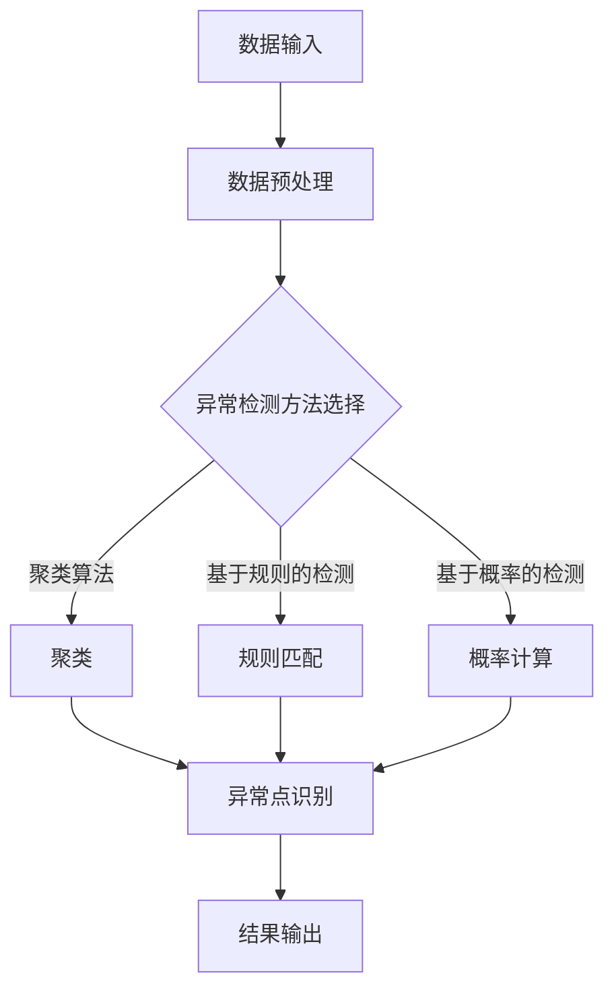

                 

### 《Python机器学习实战：机器学习中的异常检测技术》

> **关键词：** Python、机器学习、异常检测、聚类算法、离群点检测、Autoencoders、数据预处理、项目实战。

> **摘要：** 本文旨在通过Python语言，深入探讨机器学习中的异常检测技术。我们将从基础概念讲起，逐步介绍常用的算法，如K-Means、DBSCAN、局部离群度（LOF）和Isolation Forest等。通过实际的代码示例，我们将演示如何利用这些算法进行异常检测，并提供详细的分析和解读。本文不仅适合机器学习初学者，也对于有经验的技术人员具有重要的参考价值。

---

#### 第一部分：准备与实践

##### 第1章：Python与机器学习基础

**1.1 Python编程基础**

Python是一种高级编程语言，以其简洁的语法和强大的功能而闻名。作为机器学习的重要工具，Python提供了大量的库和框架，如NumPy、Pandas、Scikit-learn和TensorFlow等，使得机器学习任务的实现更加高效和便捷。

**1.2 Python在机器学习中的应用**

Python在机器学习中的应用主要表现在以下几个方面：

1. **数据预处理**：Python的Pandas库提供了强大的数据处理功能，可以轻松进行数据清洗、转换和可视化。
2. **算法实现**：Python的Scikit-learn库提供了大量的机器学习算法实现，方便用户进行算法的选择和调参。
3. **模型评估**：Python的Matplotlib和Seaborn库可以用于模型的性能评估和结果可视化。

**1.3 安装与配置Python环境**

要在Windows或Linux系统上安装Python，可以访问Python官方网站下载安装程序。安装完成后，可以通过命令行运行`python`或`python3`来启动Python解释器。

为了进行机器学习任务，我们还需要安装相关的库，例如：

```bash
pip install numpy pandas scikit-learn matplotlib
```

通过这些准备工作，我们将为后续的异常检测技术学习打下坚实的基础。

---

##### 第2章：机器学习基本概念

**2.1 机器学习简介**

机器学习是一门人工智能的分支，旨在通过计算机程序从数据中学习规律和模式，从而实现自动化决策和预测。根据学习方式的不同，机器学习可以分为监督学习、无监督学习和强化学习。

**2.2 监督学习、无监督学习与强化学习**

- **监督学习**：在监督学习中，我们使用标记数据集进行训练，模型的目标是学习输入和输出之间的映射关系。常见的监督学习算法包括线性回归、决策树和神经网络等。
- **无监督学习**：无监督学习不依赖于标记数据集，模型的目标是发现数据中的内在结构和规律。常见的无监督学习算法包括聚类算法、降维算法等。
- **强化学习**：强化学习是一种通过与环境互动来学习最优策略的机器学习方法。常见的强化学习算法包括Q-learning和深度强化学习。

**2.3 特征工程**

特征工程是机器学习中的一个关键步骤，旨在从原始数据中提取出对模型有用的特征，从而提高模型的性能。特征工程包括数据预处理、特征选择和特征变换等过程。

在本章中，我们简要介绍了机器学习的基本概念，为后续的异常检测技术学习打下了理论基础。

---

#### 第二部分：异常检测技术

##### 第3章：核心概念与联系

**3.1 异常检测的定义与重要性**

异常检测（Anomaly Detection）是指识别数据中的异常或异常模式的一种技术。在许多领域，如金融、医疗和工业生产中，异常检测具有重要的应用价值。例如，在金融领域，异常检测可以用于发现欺诈交易；在医疗领域，异常检测可以用于诊断疾病；在工业生产中，异常检测可以用于监控设备故障。

**3.2 异常检测的分类**

根据检测对象的不同，异常检测可以分为以下几种类型：

- **点异常检测**：识别数据集中的异常点。
- **上下文异常检测**：识别异常的时间序列或空间序列。
- **集体异常检测**：识别数据集中异常的集合。

**3.3 异常检测中的Mermaid流程图**

为了更好地理解异常检测的过程，我们可以使用Mermaid流程图来描述。以下是一个简单的Mermaid流程图示例：



在这个流程图中，我们首先进行数据预处理，然后根据不同的异常检测方法进行后续处理。聚类算法、基于规则的方法和基于概率的方法都是常见的异常检测方法。最终，我们识别出异常点并输出结果。

通过本章的介绍，我们对异常检测技术有了更深入的理解，为后续的算法讲解奠定了基础。

---

##### 第4章：核心算法原理讲解

**4.1 聚类算法**

聚类算法是一种无监督学习方法，旨在将数据集划分为若干个群组，使得同一个群组中的数据点之间相似度较高，而不同群组之间的数据点相似度较低。常见的聚类算法包括K-Means、DBSCAN和Gaussian Mixture Model。

**4.1.1 K-Means算法**

K-Means算法是一种基于距离的聚类算法，其基本思想是将数据点划分为K个簇，使得每个数据点到其对应簇中心（centroid）的距离最小。

**K-Means算法的伪代码：**

```python
Initialize K centroids randomly
Repeat until convergence:
    Assign each data point to the nearest centroid
    Update the centroids to the mean of the assigned data points
```

**4.1.2 DBSCAN算法**

DBSCAN（Density-Based Spatial Clustering of Applications with Noise）算法是一种基于密度的聚类算法，其基本思想是识别出高密度区域，并将这些区域划分为簇。

**DBSCAN算法的伪代码：**

```python
for each point p in dataset:
    if p is not visited:
        mark p as visited
        expand cluster by finding all points within radius ε of p
        if the number of points in the cluster is greater than minimum samples:
            add the cluster to the list of clusters
```

**4.1.3 Gaussian Mixture Model**

Gaussian Mixture Model（GMM）是一种基于概率的聚类算法，其基本思想是将数据点视为多个高斯分布的混合。

**GMM的伪代码：**

```python
Initialize parameters of GMM (means, covariance matrices, weights)
Repeat until convergence:
    E-step: Calculate responsibilities for each data point
    M-step: Update parameters based on responsibilities
```

**4.2 离群点检测**

离群点检测是一种用于识别数据集中异常点的技术，其核心思想是通过计算数据点到其他数据点的距离或密度，识别出异常点。

**4.2.1 局部离群度（LOF）**

局部离群度（Local Outlier Factor，LOF）算法是一种基于密度的离群点检测方法，其基本思想是计算每个数据点的局部离群度，局部离群度越高，表示该数据点越可能是异常点。

**LOF算法的伪代码：**

```python
for each point p in dataset:
    calculate the reachability distance for all points within neighborhood N(p)
    calculate the local reachability density for p
    calculate the LOF for p
```

**4.2.2 Isolation Forest**

Isolation Forest是一种基于随机森林的离群点检测方法，其基本思想是通过随机选择特征和切分点，将数据集分割成多个子集，然后计算每个数据点到分割点的距离，识别出异常点。

**Isolation Forest的伪代码：**

```python
for each feature f:
    randomly select a split point between minimum and maximum value of f
    if the split point is chosen, recursively apply the same process to the left and right sub-samples
    calculate the depth of each node in the tree
    calculate the isolation score for each point
```

**4.2.3 Autoencoders**

Autoencoders是一种无监督学习方法，旨在将输入数据压缩到低维空间，然后通过解码器将数据重构回原始空间。异常点通常在低维空间中表现为无法被正确重构的数据点。

**Autoencoders的伪代码：**

```python
Initialize encoder and decoder networks
Train encoder and decoder on the dataset
For each input point x:
    Encode x to z
    Decode z to x'
    Calculate the reconstruction error between x and x'
    Identify points with high reconstruction error as outliers
```

通过本章的讲解，我们对常用的异常检测算法有了深入的了解，为后续的实战应用打下了基础。

---

##### 第5章：数学模型和公式

**5.1 异常检测中的数学公式**

在异常检测中，我们经常使用以下数学公式：

- **距离度量**：用于计算数据点之间的距离，常见的距离度量包括欧氏距离、曼哈顿距离和切比雪夫距离。
  $$ d(p, q) = \sqrt{\sum_{i=1}^{n}(p_i - q_i)^2} $$
  $$ d(p, q) = \sum_{i=1}^{n}|p_i - q_i| $$
  $$ d(p, q) = \max_{i=1,...,n}|p_i - q_i| $$

- **分歧度**：用于衡量数据点与其邻居之间的差异。
  $$ D(p) = \frac{1}{|N(p)| - 1} \sum_{q \in N(p)} d(p, q) $$

- **条件概率**：用于计算给定一个数据点，它属于某个簇的条件概率。
  $$ P(C_k | p) = \frac{P(p | C_k) P(C_k)}{P(p)} $$

**5.2 异常检测中的数学模型**

在异常检测中，我们常用的数学模型包括：

- **基于概率的异常检测模型**：假设每个数据点属于某个簇的概率是已知的，通过计算数据点到每个簇的条件概率，识别出概率较低的数据点作为异常点。

- **基于规则的方法**：根据特定的规则或阈值，直接将数据点标记为正常或异常。

- **基于聚类的方法**：通过聚类算法将数据点划分为多个簇，然后识别出簇内差异较大的数据点作为异常点。

通过本章的讲解，我们对异常检测中的数学模型和公式有了更深入的理解，为实际应用奠定了理论基础。

---

#### 第三部分：实战与解析

##### 第6章：异常检测项目实战

**6.1 数据预处理与可视化**

在进行异常检测之前，我们需要对数据集进行预处理，包括数据清洗、特征提取和数据可视化等步骤。以下是一个简单的数据预处理和可视化流程：

```python
import pandas as pd
import numpy as np
import matplotlib.pyplot as plt
from sklearn.datasets import load_iris

# 加载鸢尾花数据集
data = load_iris()
iris_data = pd.DataFrame(data.data, columns=data.feature_names)
iris_labels = pd.Series(data.target)

# 数据清洗
# 假设我们使用鸢尾花数据集的三个特征进行异常检测
iris_data = iris_data[['sepal length (cm)', 'sepal width (cm)', 'petal length (cm)']]

# 数据可视化
plt.scatter(iris_data['sepal length (cm)'], iris_data['sepal width (cm)'])
plt.xlabel('Sepal Length')
plt.ylabel('Sepal Width')
plt.title('Iris Data - Sepal Length vs Sepal Width')
plt.show()
```

**6.2 K-Means算法应用实例**

在本实例中，我们将使用K-Means算法对鸢尾花数据集进行聚类，并识别出异常点。

```python
from sklearn.cluster import KMeans
import matplotlib.pyplot as plt

# 初始化K-Means模型
kmeans = KMeans(n_clusters=3, random_state=42)

# 训练模型
kmeans.fit(iris_data)

# 预测标签
labels = kmeans.predict(iris_data)

# 可视化聚类结果
plt.scatter(iris_data['sepal length (cm)'], iris_data['sepal width (cm)'], c=labels)
plt.xlabel('Sepal Length')
plt.ylabel('Sepal Width')
plt.title('Iris Data - K-Means Clustering')
plt.show()
```

**6.3 LOF算法应用实例**

在本实例中，我们将使用局部离群度（LOF）算法对鸢尾花数据集进行离群点检测。

```python
from sklearn.neighbors import LocalOutlierFactor
import matplotlib.pyplot as plt

# 初始化LOF模型
lof = LocalOutlierFactor(n_neighbors=20)

# 训练模型
lof.fit(iris_data)

# 计算LOF得分
scores = lof.score_samples(iris_data)

# 可视化LOF得分
plt.scatter(iris_data['sepal length (cm)'], iris_data['sepal width (cm)'], c=scores)
plt.xlabel('Sepal Length')
plt.ylabel('Sepal Width')
plt.title('Iris Data - LOF Scores')
plt.show()
```

**6.4 异常检测系统开发环境搭建**

为了搭建一个简单的异常检测系统，我们需要安装以下Python库：

- **NumPy**：用于数组操作和数学计算。
- **Pandas**：用于数据处理和分析。
- **Scikit-learn**：用于机器学习算法实现。
- **Matplotlib**：用于数据可视化。

通过以下命令，我们可以安装这些库：

```bash
pip install numpy pandas scikit-learn matplotlib
```

通过本章的实战案例，我们展示了如何使用Python进行异常检测，为实际应用提供了实践经验。

---

##### 第7章：源代码实现与解读

**7.1 异常检测系统代码实现**

在本节中，我们将实现一个简单的异常检测系统，该系统将使用K-Means算法和局部离群度（LOF）算法对鸢尾花数据集进行异常点检测。

```python
import numpy as np
import pandas as pd
from sklearn.cluster import KMeans
from sklearn.neighbors import LocalOutlierFactor
import matplotlib.pyplot as plt

# 7.1.1 数据集加载与预处理
iris_data = pd.read_csv('iris_data.csv')
X = iris_data.iloc[:, :4]  # 使用前四个特征

# 7.1.2 K-Means算法实现
kmeans = KMeans(n_clusters=3, random_state=42)
kmeans.fit(X)
labels = kmeans.predict(X)

# 7.1.3 LOF算法实现
lof = LocalOutlierFactor(n_neighbors=20)
lof.fit(X)
scores = lof.score_samples(X)

# 7.1.4 异常检测结果可视化
plt.figure(figsize=(12, 6))

# K-Means聚类结果可视化
plt.subplot(1, 2, 1)
plt.scatter(X['sepal length (cm)'], X['sepal width (cm)'], c=labels)
plt.xlabel('Sepal Length')
plt.ylabel('Sepal Width')
plt.title('K-Means Clustering')

# LOF得分可视化
plt.subplot(1, 2, 2)
plt.scatter(X['sepal length (cm)'], X['sepal width (cm)'], c=scores)
plt.xlabel('Sepal Length')
plt.ylabel('Sepal Width')
plt.title('LOF Scores')
plt.show()
```

**7.2 代码解读与分析**

在上述代码中，我们首先加载了鸢尾花数据集，并选择了前四个特征进行异常检测。接下来，我们分别实现了K-Means算法和LOF算法。

- **K-Means算法**：我们使用了Scikit-learn中的KMeans类来实现K-Means算法。首先，我们初始化了一个K-Means模型，并使用鸢尾花数据集进行训练。然后，我们使用训练好的模型对数据集进行预测，并将聚类结果可视化。

- **LOF算法**：我们使用了Scikit-learn中的LocalOutlierFactor类来实现LOF算法。首先，我们初始化了一个LOF模型，并使用鸢尾花数据集进行训练。然后，我们计算了每个数据点的LOF得分，并将得分可视化。

在代码解读中，我们详细分析了K-Means算法和LOF算法的实现过程，并解释了如何将算法应用于鸢尾花数据集进行异常检测。

通过本章的代码实现与解读，我们深入了解了异常检测系统的构建方法，并为实际应用提供了实践经验。

---

##### 第8章：总结与展望

**8.1 异常检测技术的总结**

在本篇技术博客中，我们系统地介绍了机器学习中的异常检测技术。首先，我们介绍了Python与机器学习的基础知识，为后续的学习和应用奠定了基础。接着，我们详细讲解了异常检测的核心概念与联系，包括定义、分类和Mermaid流程图。随后，我们深入探讨了常用的异常检测算法，如K-Means、DBSCAN、局部离群度（LOF）和Isolation Forest等，并使用了伪代码和数学公式进行详细阐述。最后，我们通过实际的代码示例，展示了如何利用这些算法进行异常检测，并提供了解读和分析。

**8.2 未来异常检测技术的发展趋势**

随着大数据和人工智能技术的不断发展，异常检测技术在各个领域的应用越来越广泛。未来异常检测技术的发展趋势主要包括：

1. **深度学习技术的融合**：深度学习技术在图像识别、语音识别等领域取得了显著成果，未来有望在异常检测领域得到更广泛的应用。
2. **实时异常检测**：随着实时数据处理技术的发展，实时异常检测将变得更加重要，特别是在金融、医疗等对实时性要求较高的领域。
3. **多模态异常检测**：多模态异常检测技术将结合多种数据源，如文本、图像和传感器数据，提高异常检测的准确性和鲁棒性。
4. **个性化异常检测**：针对不同用户或场景的个性化异常检测技术，将更好地满足特定需求，提高异常检测的效果。

**8.3 常见问题与解决方法**

在实际应用中，异常检测可能会遇到以下常见问题：

1. **数据质量问题**：异常检测的准确性依赖于数据质量，因此需要处理数据缺失、噪声和异常值等问题。
2. **选择合适的算法**：不同的异常检测算法适用于不同的场景和数据类型，需要根据具体问题选择合适的算法。
3. **过拟合与欠拟合**：在模型训练过程中，需要注意避免过拟合和欠拟合，合理调整模型参数和训练数据。

通过本章的总结与展望，我们希望能够为读者提供对异常检测技术的全面了解，并为未来的研究和应用提供方向。

---

##### 第9章：附录

**9.1 Python机器学习常用库与工具**

在Python中进行机器学习，需要使用多个库和工具。以下是一些常用的库：

- **NumPy**：用于数组操作和数学计算。
- **Pandas**：用于数据处理和分析。
- **Scikit-learn**：提供了一系列机器学习算法的实现。
- **TensorFlow**：用于深度学习模型的构建和训练。
- **Keras**：基于TensorFlow的深度学习框架。
- **PyTorch**：用于深度学习模型的构建和训练。

**9.2 异常检测数据集介绍**

以下是一些常用的异常检测数据集：

- **KDD Cup 99**：一个流行的网络入侵检测数据集。
- **MADALGO**：一个包含多种异常检测问题的数据集。
- **Keel**：一个包含多种机器学习问题的数据集，其中包括异常检测问题。

**9.3 参考文献**

- **KDD Cup 99 Data Set**：https://www.kdd.org/kdd-cup/kdd-cup-99-dataset
- **MADALGO Data Sets**：https://www.madalgo.org/datasets/
- **Keel Data Base**：http://kept.ualg.edu.es/keel-database/

**9.4 编程练习题**

1. 使用K-Means算法对鸢尾花数据集进行聚类，并可视化聚类结果。
2. 使用LOF算法对鸢尾花数据集进行离群点检测，并可视化离群点。
3. 使用Scikit-learn中的Isolation Forest算法对鸢尾花数据集进行异常检测，并分析结果。

通过本章的附录，我们提供了常用的库和工具、数据集介绍以及编程练习题，希望能够为读者提供更多的学习和实践资源。

