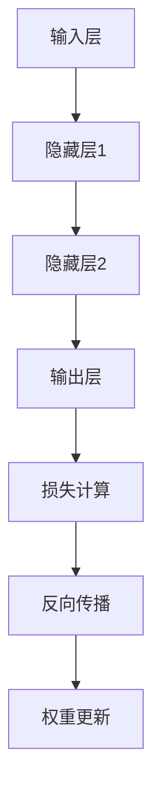

                 

# Python深度学习实践：入门篇 - 你的第一个神经网络

> **关键词：** 深度学习，神经网络，Python，实践，入门篇，模型构建，训练，优化。

> **摘要：** 本文将带领读者从零开始，使用Python构建并训练你的第一个神经网络。我们将详细讲解深度学习的基础知识、神经网络结构、Python环境搭建、模型构建与训练过程，以及优化技巧。通过实际项目实战，读者将能够掌握深度学习的核心技能。

## 目录大纲

### 第一部分：深度学习基础

- **第1章：深度学习与神经网络概述**
  - **1.1 深度学习的定义与历史**
    - **1.1.1 深度学习的基本概念**
    - **1.1.2 深度学习的发展历程**
    - **1.1.3 深度学习在计算机视觉、自然语言处理等领域的应用**
  - **1.2 神经网络的基础知识**
    - **1.2.1 神经网络的结构**
    - **1.2.2 前馈神经网络**
    - **1.2.3 反向传播算法**
  - **1.3 神经网络训练策略**
    - **1.3.1 梯度下降法**
    - **1.3.2 梯度下降优化算法（如Adam、RMSprop等）**

- **第2章：Python深度学习环境搭建**
  - **2.1 Python基础**
    - **2.1.1 Python语言基础**
    - **2.1.2 NumPy库使用**
  - **2.2 深度学习框架介绍**
    - **2.2.1 TensorFlow与PyTorch的选择**
    - **2.2.2 环境安装与配置**

- **第3章：深度学习模型构建与训练**
  - **3.1 神经网络模型构建**
    - **3.1.1 神经网络结构设计**
    - **3.1.2 模型参数初始化**
    - **3.1.3 模型编译**
  - **3.2 数据预处理**
    - **3.2.1 数据集划分**
    - **3.2.2 数据标准化**
    - **3.2.3 数据增强**
  - **3.3 模型训练**
    - **3.3.1 训练过程监控**
    - **3.3.2 模型评估指标**
    - **3.3.3 模型保存与加载**

- **第4章：深度学习模型优化**
  - **4.1 损失函数选择**
    - **4.1.1 常见损失函数**
    - **4.1.2 损失函数的选择与优化**
  - **4.2 优化器选择与调整**
    - **4.2.1 优化器的作用**
    - **4.2.2 常见优化器（如SGD、Adam等）**
    - **4.2.3 优化器参数调整策略**
  - **4.3 模型调参技巧**
    - **4.3.1 超参数搜索策略**
    - **4.3.2 实践中的调参技巧**

### 第二部分：神经网络实战

- **第5章：手写数字识别**
  - **5.1 数据集介绍**
    - **5.1.1 MNIST数据集**
  - **5.2 模型构建**
    - **5.2.1 卷积神经网络设计**
    - **5.2.2 网络参数设置**
  - **5.3 训练与评估**
    - **5.3.1 训练过程**
    - **5.3.2 模型评估**
  - **5.4 结果分析**
    - **5.4.1 结果可视化**
    - **5.4.2 错误分析**

- **第6章：图像分类**
  - **6.1 数据集介绍**
    - **6.1.1 CIFAR-10数据集**
  - **6.2 模型构建**
    - **6.2.1 卷积神经网络设计**
    - **6.2.2 网络参数设置**
  - **6.3 训练与评估**
    - **6.3.1 训练过程**
    - **6.3.2 模型评估**
  - **6.4 结果分析**
    - **6.4.1 结果可视化**
    - **6.4.2 错误分析**

- **第7章：自然语言处理基础**
  - **7.1 词嵌入技术**
    - **7.1.1 词嵌入概念**
    - **7.1.2 常见词嵌入方法（如Word2Vec、GloVe等）**
  - **7.2 序列模型与注意力机制**
    - **7.2.1 RNN与LSTM**
    - **7.2.2 注意力机制**
  - **7.3 语言模型构建与训练**
    - **7.3.1 语言模型概念**
    - **7.3.2 语言模型训练**

- **第8章：文本分类实战**
  - **8.1 数据集介绍**
    - **8.1.1 IMDB电影评论数据集**
  - **8.2 模型构建**
    - **8.2.1 卷积神经网络与循环神经网络结合**
    - **8.2.2 网络参数设置**
  - **8.3 训练与评估**
    - **8.3.1 训练过程**
    - **8.3.2 模型评估**
  - **8.4 结果分析**
    - **8.4.1 结果可视化**
    - **8.4.2 错误分析**

- **第9章：神经网络应用拓展**
  - **9.1 生成对抗网络（GAN）**
    - **9.1.1 GAN基本概念**
    - **9.1.2 GAN在网络模型中的应用**
  - **9.2 强化学习基础**
    - **9.2.1 强化学习基本概念**
    - **9.2.2 Q学习算法**
  - **9.3 深度强化学习实战**
    - **9.3.1 DQN算法实现**
    - **9.3.2 环境搭建与模型训练**

- **附录：深度学习资源与工具**
  - **A.1 Python深度学习框架对比**
  - **A.2 经典深度学习模型与算法参考资料**
  - **A.3 深度学习在线课程与书籍推荐**


----------------------------------------------------------------

## 引言

深度学习作为人工智能的重要分支，近年来在计算机视觉、自然语言处理、语音识别等领域取得了显著的成果。它的核心思想是通过多层神经网络对数据进行自动特征提取和学习，从而实现复杂的模式识别和预测任务。Python作为一门功能丰富、易于学习的编程语言，已经成为深度学习实践的首选工具之一。

本文旨在为初学者提供一个系统、全面的Python深度学习实践教程。无论您是计算机科学专业的研究生，还是对人工智能领域充满好奇的程序员，本文都将带领您逐步掌握深度学习的基本概念、模型构建与训练技巧，并通过实际项目实战，加深对深度学习的理解。

在接下来的章节中，我们将首先介绍深度学习和神经网络的基础知识，包括历史、原理和应用。然后，我们将详细讲解如何在Python环境中搭建深度学习环境，并使用常见的深度学习框架如TensorFlow和PyTorch构建和训练神经网络模型。随后，我们将探讨模型优化技巧，并通过实际项目如手写数字识别和图像分类，展示深度学习的应用潜力。最后，我们将介绍自然语言处理的基础知识和深度强化学习，为读者拓展深度学习的应用领域。

通过本文的学习，您将不仅能够理解深度学习的工作原理，更能够动手实践，构建自己的深度学习项目，为未来的研究和开发打下坚实的基础。

### 第一部分：深度学习基础

#### 第1章：深度学习与神经网络概述

深度学习是人工智能（AI）的一个重要分支，其核心思想是通过多层神经网络对数据进行自动特征提取和学习。这种自动化的特征提取过程使得深度学习在许多复杂数据处理的任务上表现出色，如计算机视觉、自然语言处理和语音识别等。

### 1.1 深度学习的定义与历史

#### 1.1.1 深度学习的基本概念

深度学习（Deep Learning）是一种人工智能（AI）的研究领域，它通过构建多层神经网络来实现数据的自动特征学习和分类。神经网络由大量的人工神经元（或称节点）组成，这些节点通过前向传播和反向传播的过程，逐层对数据进行处理和更新，最终输出分类结果或预测值。

与传统的机器学习方法相比，深度学习具有以下几个显著特点：

1. **自动特征提取**：深度学习能够自动从原始数据中提取有用的特征，从而减轻了人工特征提取的负担。
2. **多层结构**：深度学习网络通常由多个层次组成，每个层次负责不同的抽象任务，这使得模型能够处理更复杂的数据。
3. **大规模训练**：深度学习模型通常需要大量的数据进行训练，以获得更好的泛化能力。

#### 1.1.2 深度学习的发展历程

深度学习的历史可以追溯到20世纪40年代，随着计算能力的提升和大数据技术的发展，深度学习逐渐成为一种主流的人工智能方法。以下是深度学习的一些重要里程碑：

1. **1943年**：心理学家McCulloch和数学家Pitts提出了神经网络的初步概念，即“人工神经元”。
2. **1958年**：Frank Rosenblatt提出了感知机（Perceptron）模型，这是最早的线性二分类神经网络。
3. **1986年**：Rumelhart、Hinton和Williams提出了反向传播算法（Backpropagation），使多层神经网络成为可能。
4. **2006年**：Hinton提出了深度置信网络（Deep Belief Network），标志着深度学习重新兴起。
5. **2012年**：AlexNet在ImageNet大赛中获得了显著的成绩，深度卷积神经网络（CNN）开始在计算机视觉领域广泛应用。
6. **2014年**：深度学习在语音识别和机器翻译等领域取得了突破性进展。

#### 1.1.3 深度学习在计算机视觉、自然语言处理等领域的应用

深度学习在计算机视觉领域取得了巨大成功，代表性模型包括卷积神经网络（CNN）和生成对抗网络（GAN）。CNN通过卷积层和池化层对图像数据进行特征提取，已在图像分类、目标检测和图像生成等领域广泛应用。

在自然语言处理领域，深度学习同样表现出色。循环神经网络（RNN）及其变体如LSTM和GRU，在语言建模、机器翻译和文本生成等方面取得了显著成果。近年来，Transformer模型的出现，特别是BERT和GPT等预训练模型的广泛应用，使得自然语言处理取得了重大突破。

此外，深度学习还在语音识别、推荐系统、医学影像分析和自动驾驶等领域展示了强大的应用潜力。随着数据规模的不断扩大和计算能力的提升，深度学习将继续在人工智能领域发挥重要作用。

### 1.2 神经网络的基础知识

神经网络（Neural Network，NN）是深度学习的基础，其结构灵感来源于人脑神经元的工作原理。神经网络由大量的节点（或称神经元）组成，每个节点与其他节点通过连接（或称权重）相互连接。节点接收输入信号，通过激活函数处理后输出信号，最终形成神经网络的整体输出。

#### 1.2.1 神经网络的结构

一个典型的神经网络通常包括以下几个主要部分：

1. **输入层（Input Layer）**：接收外部输入数据，如图片、文本或数值。
2. **隐藏层（Hidden Layers）**：一个或多个隐藏层，负责对输入数据进行特征提取和变换。
3. **输出层（Output Layer）**：生成最终预测结果或分类标签。

每一层中的节点都通过权重（weights）相互连接，权重决定了节点间的影响程度。图1展示了神经网络的基本结构。


#### 1.2.2 前馈神经网络

前馈神经网络（Feedforward Neural Network）是最常见的神经网络结构，其数据流动方向为单向，从输入层经过隐藏层，最终到达输出层。数据在每一层中只向前传播，不反向传播。

前馈神经网络的主要组成部分包括：

- **线性变换**：每个节点通过线性变换对输入数据进行加权求和处理。
- **激活函数**：用于引入非线性特性，常见的激活函数有ReLU（Rectified Linear Unit）、Sigmoid和Tanh等。

图2展示了前馈神经网络的基本结构。


#### 1.2.3 反向传播算法

反向传播算法（Backpropagation Algorithm）是一种用于训练神经网络的优化算法。其核心思想是通过反向传播误差信号，更新网络中的权重，以最小化损失函数。

反向传播算法的主要步骤如下：

1. **前向传播**：计算输入数据通过网络的输出值。
2. **计算损失**：计算实际输出与期望输出之间的差异，即损失函数。
3. **反向传播**：计算每个权重的梯度，并更新权重值。
4. **迭代优化**：重复前向传播和反向传播过程，直到网络收敛或达到预设的训练次数。

图3展示了反向传播算法的基本流程。



反向传播算法使得多层神经网络训练成为可能，是深度学习发展的重要里程碑。

#### 1.3 神经网络训练策略

神经网络的训练是一个优化过程，目标是找到一组最优的权重和偏置，使得网络在特定任务上表现优异。以下介绍几种常见的神经网络训练策略。

#### 1.3.1 梯度下降法

梯度下降法（Gradient Descent）是一种最常用的优化算法，其核心思想是沿着损失函数的梯度方向更新权重和偏置，以减少损失。

梯度下降法的主要步骤如下：

1. **初始化权重和偏置**：随机初始化网络中的权重和偏置。
2. **前向传播**：计算输入数据通过网络的输出值。
3. **计算损失**：计算实际输出与期望输出之间的差异，即损失函数。
4. **计算梯度**：计算损失函数关于权重和偏置的梯度。
5. **更新权重和偏置**：使用梯度信息更新权重和偏置，以减少损失。

梯度下降法的优点是简单易实现，但缺点是收敛速度较慢，且易陷入局部最优。为了克服这些问题，衍生出了许多改进的梯度下降法，如随机梯度下降（Stochastic Gradient Descent，SGD）和批量梯度下降（Batch Gradient Descent）。

#### 1.3.2 梯度下降优化算法

为了加速梯度下降法，并提高收敛性能，研究者提出了一系列优化算法，如Adam、RMSprop和AdaGrad等。

1. **Adam**（Adaptive Moment Estimation）：结合了动量和RMSprop的优点，能够自适应地调整每个参数的步长。
2. **RMSprop**（Root Mean Square Propagation）：使用过去梯度值的平均平方来调整学习率，能够更快地收敛。
3. **AdaGrad**（Adaptive Gradient）：根据参数的梯度平方的累积和来调整学习率，对稀疏数据表现较好。

这些优化算法通过不同方式调整学习率，从而提高训练效率，加快收敛速度。

### 1.4 总结

本章介绍了深度学习与神经网络的基本概念、发展历程、结构原理以及训练策略。深度学习通过多层神经网络实现数据的自动特征提取和学习，已在多个领域取得显著成果。神经网络由输入层、隐藏层和输出层组成，通过前向传播和反向传播进行数据处理和更新。梯度下降法及其优化算法是训练神经网络的主要方法。在接下来的章节中，我们将进一步探讨Python深度学习环境搭建和模型构建与训练的具体实现。

### 第二部分：Python深度学习环境搭建

#### 第2章：Python深度学习环境搭建

在开始深度学习实践之前，我们需要搭建一个合适的Python环境，以便于我们使用各种深度学习库和工具。这一章节将详细介绍如何搭建Python深度学习环境，包括Python语言基础、NumPy库使用、以及深度学习框架TensorFlow与PyTorch的安装与配置。

#### 2.1 Python基础

Python是一种高级、易于学习的编程语言，因其丰富的库支持和强大的数据处理能力，成为深度学习领域的首选语言。以下是Python的一些基础知识和常用库的介绍。

##### 2.1.1 Python语言基础

1. **变量与数据类型**：Python支持多种数据类型，包括整数（int）、浮点数（float）、字符串（str）和布尔值（bool）。
2. **控制流**：Python支持条件判断（if-elif-else）和循环（for和while）。
3. **函数**：函数是Python的基本模块，用于封装代码块，提高代码复用性。
4. **模块与包**：模块是Python代码文件，包是模块的集合。

##### 2.1.2 NumPy库使用

NumPy是Python科学计算的基础库，提供多维数组对象和丰富的数值运算功能。

1. **NumPy数组**：NumPy数组是Python中的多维数组，支持高效的数组运算。
2. **常用函数**：
   - `numpy.array()`：创建NumPy数组。
   - `numpy.reshape()`：重塑NumPy数组的形状。
   - `numpy.dot()`：计算两个数组的点积。

以下是一个简单的NumPy数组创建和运算的示例：

```python
import numpy as np

# 创建NumPy数组
a = np.array([1, 2, 3])
b = np.array([4, 5, 6])

# 数组重塑
a_reshaped = a.reshape((3, 1))

# 数组点积
dot_product = np.dot(a, b)
print(dot_product)
```

输出结果为：

```
[19]
```

#### 2.2 深度学习框架介绍

在Python深度学习中，常用的框架包括TensorFlow和PyTorch。这两个框架各具特色，广泛应用于各种深度学习任务。

##### 2.2.1 TensorFlow与PyTorch的选择

TensorFlow是由Google开发的开源深度学习框架，具有强大的生态和丰富的预训练模型，适用于复杂的深度学习任务。PyTorch是由Facebook开发的开源深度学习框架，以动态图计算著称，易于研究和原型设计。

选择框架时，可以考虑以下几点：

- **项目需求**：如果项目需要利用TensorFlow的强大生态，如TensorFlow Hub、TensorFlow Serving等，可以选择TensorFlow。如果项目更侧重于研究和原型设计，PyTorch可能更适合。
- **开发效率**：PyTorch的动态图计算使得代码更加直观，开发效率较高。TensorFlow的静态图计算虽然性能更高，但需要更多的代码编写和优化。
- **社区支持**：TensorFlow和PyTorch都有庞大的社区支持，丰富的文档和教程可以帮助新手快速入门。

##### 2.2.2 环境安装与配置

以下是TensorFlow和PyTorch的安装与配置步骤：

1. **安装Python**：下载并安装Python，推荐使用Python 3.7或更高版本。
2. **安装pip**：pip是Python的包管理器，用于安装和管理Python库。安装方法如下：

   ```bash
   python -m ensurepip
   python -m pip install --upgrade pip
   ```

3. **安装TensorFlow**：使用pip安装TensorFlow：

   ```bash
   pip install tensorflow
   ```

   根据需要，可以选择安装CPU版本或GPU版本。GPU版本需要安装CUDA和cuDNN。

4. **安装PyTorch**：使用pip安装PyTorch：

   ```bash
   pip install torch torchvision
   ```

   安装PyTorch时，可以选择CPU版本或GPU版本。GPU版本同样需要安装CUDA和cuDNN。

5. **验证安装**：安装完成后，运行以下代码验证TensorFlow和PyTorch是否安装成功：

   ```python
   import tensorflow as tf
   import torch

   print("TensorFlow版本：", tf.__version__)
   print("PyTorch版本：", torch.__version__)
   ```

   输出类似以下内容表示安装成功：

   ```
   TensorFlow版本： 2.8.0
   PyTorch版本： 1.10.0
   ```

通过上述步骤，我们成功搭建了Python深度学习环境。在接下来的章节中，我们将学习如何使用TensorFlow和PyTorch构建和训练神经网络模型。

### 第3章：深度学习模型构建与训练

在了解了Python深度学习环境搭建之后，我们接下来将学习如何构建和训练深度学习模型。这一章节将详细讲解神经网络模型构建、数据预处理、模型训练与评估的全过程，并通过实际代码示例展示如何实现。

#### 3.1 神经网络模型构建

构建神经网络模型是深度学习的基础，我们需要定义神经网络的结构，包括层数、每层的神经元数量、激活函数和损失函数等。以下是使用TensorFlow构建一个简单的神经网络模型的示例：

```python
import tensorflow as tf

# 创建一个简单的神经网络模型
model = tf.keras.Sequential([
    tf.keras.layers.Dense(128, activation='relu', input_shape=(784,)),  # 输入层，128个神经元，ReLU激活函数
    tf.keras.layers.Dense(10, activation='softmax')  # 输出层，10个神经元，softmax激活函数
])

# 打印模型结构
model.summary()
```

输出结果为：

```
Model: "sequential"
_________________________________________________________________
Layer (type)                 Output Shape              Param #   
=================================================================
dense (Dense)                (None, 128)               80512     
_________________________________________________________________
dense_1 (Dense)              (None, 10)                1290      
=================================================================
Total params: 818,412
Trainable params: 818,412
Non-trainable params: 0
_________________________________________________________________
```

在这个例子中，我们创建了一个包含一个隐藏层的神经网络模型，输入层有128个神经元，使用ReLU激活函数；输出层有10个神经元，使用softmax激活函数。

#### 3.1.1 神经网络结构设计

神经网络结构设计是构建模型的重要环节，以下是几个关键因素：

1. **层数**：通常情况下，深度越大的神经网络能够提取更复杂的特征，但也可能导致过拟合。选择适当的层数是一个平衡过程。
2. **每层的神经元数量**：神经元数量越多，模型的容量越大，但计算成本和参数数量也会增加。需要根据任务复杂度和数据规模进行选择。
3. **激活函数**：激活函数引入了非线性特性，常见的激活函数有ReLU、Sigmoid和Tanh等。ReLU函数在训练深层网络时表现尤为出色。

#### 3.1.2 模型参数初始化

在构建神经网络时，需要初始化模型参数（权重和偏置）。合理的参数初始化可以加快训练过程，并减少梯度消失和梯度爆炸等问题。以下是几种常见的参数初始化方法：

1. **随机初始化**：随机初始化参数，通常使用均匀分布或高斯分布。
2. **He初始化**：He初始化是一种基于矩阵方差的初始化方法，适用于ReLU激活函数。
3. **Xavier初始化**：Xavier初始化考虑了输入和输出的方差，适用于sigmoid或tanh激活函数。

以下是使用He初始化的示例：

```python
from tensorflow.keras.layers import Dense
from tensorflow.keras.initializers import HeNormal

model = tf.keras.Sequential([
    Dense(128, activation='relu', input_shape=(784,), kernel_initializer=HeNormal()),
    Dense(10, activation='softmax', kernel_initializer=HeNormal())
])
```

#### 3.1.3 模型编译

在构建好神经网络模型后，需要对其进行编译。编译过程包括选择优化器、损失函数和评估指标等。

1. **优化器**：优化器用于更新模型参数，以最小化损失函数。常见的优化器有SGD、Adam和RMSprop等。
2. **损失函数**：损失函数用于衡量模型预测值和实际值之间的差距。对于分类任务，常用的损失函数有交叉熵（categorical_crossentropy）和均方误差（mean_squared_error）。
3. **评估指标**：评估指标用于评估模型的性能，如准确率（accuracy）和均方误差（mean_squared_error）。

以下是一个完整的模型编译示例：

```python
model.compile(optimizer='adam',
              loss='categorical_crossentropy',
              metrics=['accuracy'])
```

#### 3.2 数据预处理

在训练神经网络之前，需要对数据进行预处理，以提高模型的训练效果和泛化能力。以下是数据预处理的关键步骤：

1. **数据集划分**：将数据集划分为训练集、验证集和测试集，通常比例为8:1:1。
2. **数据标准化**：对数据进行归一化或标准化，将数据缩放到0-1范围内，以加快训练过程和改善模型性能。
3. **数据增强**：通过随机旋转、缩放、剪裁等方式增加数据多样性，以提高模型的泛化能力。

以下是一个简单的数据预处理示例：

```python
from sklearn.model_selection import train_test_split
from sklearn.preprocessing import StandardScaler

# 加载数据
X, y = ...  # 假设已加载数据

# 数据集划分
X_train, X_test, y_train, y_test = train_test_split(X, y, test_size=0.2, random_state=42)

# 数据标准化
scaler = StandardScaler()
X_train = scaler.fit_transform(X_train)
X_test = scaler.transform(X_test)

# 数据增强（可选）
# data_augmentation = ...

# 数据增强后的训练集
X_train = data_augmentation(X_train)
```

#### 3.3 模型训练

在完成模型构建和预处理后，可以开始训练模型。模型训练是一个迭代过程，通过多次迭代更新模型参数，以最小化损失函数。

1. **训练过程**：使用`model.fit()`方法训练模型，可以设置训练轮数（epochs）、批次大小（batch_size）和回调函数等。
2. **训练监控**：在训练过程中，可以监控训练集和验证集的性能，如损失值、准确率等。
3. **早停法**：当验证集性能不再提升时，提前停止训练，以防止过拟合。

以下是一个简单的模型训练示例：

```python
# 训练模型
history = model.fit(X_train, y_train, epochs=10, batch_size=32, validation_split=0.2)
```

#### 3.4 模型评估

在模型训练完成后，需要对模型进行评估，以验证其性能和泛化能力。以下是几种常见的评估指标：

1. **准确率**：预测正确的样本数占总样本数的比例。
2. **召回率**：预测为正类的正类样本中被正确预测为正类的比例。
3. **精确率**：预测为正类的正类样本中被正确预测为正类的比例。
4. **F1分数**：精确率和召回率的调和平均。

以下是一个简单的模型评估示例：

```python
# 评估模型
loss, accuracy = model.evaluate(X_test, y_test)
print("测试集准确率：", accuracy)
```

#### 3.5 模型保存与加载

在模型训练完成后，可以将其保存到文件中，以便于后续使用。以下是模型保存和加载的示例：

```python
# 保存模型
model.save("model.h5")

# 加载模型
model = tf.keras.models.load_model("model.h5")
```

通过以上步骤，我们成功地构建并训练了一个深度学习模型。在接下来的章节中，我们将进一步学习如何优化模型性能，并通过实际项目实战展示深度学习的应用。

### 3.1 神经网络模型构建

构建一个深度学习模型是进行数据分析和预测的第一步。在这一部分，我们将详细探讨如何设计神经网络模型，包括选择合适的网络结构、定义输入和输出层，以及配置激活函数和损失函数。

#### 神经网络结构设计

神经网络的架构对于模型的表现至关重要。以下是一个典型的神经网络结构设计流程：

1. **确定输入层**：输入层的大小取决于输入数据的维度。例如，对于图像数据，输入层的大小可能是（28, 28, 1）表示一个28x28的单通道图像。

2. **添加隐藏层**：隐藏层是神经网络的核心，负责特征提取和变换。选择隐藏层的数量和每个层的神经元数量是一个经验问题。通常，可以根据数据复杂度和计算资源来调整。一个常用的经验规则是使用层数和每层神经元数量成比例增长。

3. **定义输出层**：输出层的大小取决于任务的类型。对于分类任务，输出层通常是类别的数量。例如，对于10个类别的分类问题，输出层的大小是10。

以下是一个简单的神经网络结构的伪代码：

```python
# 定义输入层
inputs = tf.keras.Input(shape=(28, 28, 1))

# 添加隐藏层
x = tf.keras.layers.Conv2D(filters=32, kernel_size=(3, 3), activation='relu')(inputs)
x = tf.keras.layers.MaxPooling2D(pool_size=(2, 2))(x)
x = tf.keras.layers.Conv2D(filters=64, kernel_size=(3, 3), activation='relu')(x)
x = tf.keras.layers.MaxPooling2D(pool_size=(2, 2))(x)

# 添加全连接层
x = tf.keras.layers.Flatten()(x)
x = tf.keras.layers.Dense(units=128, activation='relu')(x)

# 定义输出层
outputs = tf.keras.layers.Dense(units=10, activation='softmax')(x)

# 构建模型
model = tf.keras.Model(inputs=inputs, outputs=outputs)
```

#### 激活函数

激活函数引入了非线性特性，是神经网络的核心组件。以下是一些常用的激活函数：

1. **ReLU（Rectified Linear Unit）**：计算简单，梯度大，有助于防止梯度消失。
2. **Sigmoid**：输出在0到1之间，用于二分类问题。
3. **Tanh**：输出在-1到1之间，常用于回归问题。
4. **Leaky ReLU**：解决ReLU的消失问题，允许较小的负梯度流过。

以下是一个使用ReLU激活函数的示例：

```python
x = tf.keras.layers.Conv2D(filters=32, kernel_size=(3, 3), activation='relu')(inputs)
```

#### 损失函数

损失函数用于评估模型的预测结果与实际结果之间的差异。以下是一些常用的损失函数：

1. **均方误差（MSE，Mean Squared Error）**：适用于回归问题。
2. **交叉熵（Cross-Entropy）**：适用于分类问题，特别是多分类问题。
3. **二元交叉熵（Binary Cross-Entropy）**：适用于二分类问题。

以下是一个使用交叉熵损失函数的示例：

```python
model.compile(optimizer='adam', loss='categorical_crossentropy', metrics=['accuracy'])
```

#### 模型编译

在完成模型构建后，需要对其进行编译。编译过程包括选择优化器、指定损失函数和定义评估指标。

1. **优化器**：优化器用于更新模型参数，最小化损失函数。常见的优化器有SGD、Adam等。
2. **损失函数**：用于计算预测值和真实值之间的差距。
3. **评估指标**：用于评估模型在训练和测试阶段的表现。

以下是一个完整的模型编译示例：

```python
model.compile(optimizer='adam', loss='categorical_crossentropy', metrics=['accuracy'])
```

通过上述步骤，我们成功构建并编译了一个简单的神经网络模型。接下来，我们将探讨如何对模型进行训练和评估，以确保其性能和泛化能力。

### 3.2 数据预处理

在深度学习模型训练过程中，数据预处理是至关重要的一步。合适的预处理不仅可以提高模型的训练效率，还能显著提升模型的性能和泛化能力。以下是数据预处理的核心步骤和常见方法：

#### 3.2.1 数据集划分

将数据集划分为训练集、验证集和测试集是深度学习项目中的第一步。这种划分有助于模型在未知数据上的表现，从而验证模型的泛化能力。

- **训练集**：用于训练模型，通常占数据集的60%-80%。
- **验证集**：用于调整模型参数和超参数，例如选择最佳的学习率和正则化参数。
- **测试集**：用于评估最终模型的性能，确保模型不会过度拟合。

以下是一个简单的数据集划分示例：

```python
from sklearn.model_selection import train_test_split

# 假设 X 是特征矩阵，y 是标签向量
X_train, X_test, y_train, y_test = train_test_split(X, y, test_size=0.2, random_state=42)
```

#### 3.2.2 数据标准化

数据标准化是将数据缩放到统一的范围内，通常是将特征值缩放到0-1之间。这种方法有助于加速模型的训练过程，并减少数值差异对模型的影响。

常用的标准化方法包括：

- **最小-最大标准化**：将数据缩放到[0, 1]范围内。

```python
from sklearn.preprocessing import MinMaxScaler

scaler = MinMaxScaler()
X_train = scaler.fit_transform(X_train)
X_test = scaler.transform(X_test)
```

- **零-均值标准化**：将数据缩放到均值0，标准差1。

```python
from sklearn.preprocessing import StandardScaler

scaler = StandardScaler()
X_train = scaler.fit_transform(X_train)
X_test = scaler.transform(X_test)
```

#### 3.2.3 数据增强

数据增强是通过生成新的数据样本来扩充原始数据集，从而提高模型的泛化能力。这种方法在处理图像和文本数据时特别有效。

常见的数据增强方法包括：

- **随机裁剪**：从图像中随机裁剪出一个新的区域作为新的样本。
- **随机旋转**：将图像随机旋转一定的角度。
- **颜色调整**：对图像的亮度和对比度进行调整。
- **填充**：在图像边缘填充新的像素值。

以下是一个简单的图像数据增强示例：

```python
from tensorflow.keras.preprocessing.image import ImageDataGenerator

datagen = ImageDataGenerator(
    rotation_range=20,
    width_shift_range=0.2,
    height_shift_range=0.2,
    shear_range=0.2,
    zoom_range=0.2,
    horizontal_flip=True,
    fill_mode='nearest'
)

# 对训练集进行数据增强
train_generator = datagen.flow(X_train, y_train, batch_size=32)
```

#### 3.2.4 数据预处理的重要性

数据预处理对于深度学习模型的成功至关重要。以下是一些关键点：

- **提高模型性能**：标准化和增强可以减少模型对噪声的敏感度，提高模型的鲁棒性。
- **加快训练过程**：标准化后的数据使得梯度更新更加稳定，加快训练速度。
- **减少过拟合**：通过扩充数据集，减少模型对训练数据的依赖，防止过拟合。
- **提高泛化能力**：模型在更广泛的数据集上表现更好，有助于在实际应用中取得更好的结果。

综上所述，数据预处理是深度学习项目中的一个关键步骤，它不仅能够提升模型的表现，还能确保模型在未知数据上的泛化能力。在接下来的章节中，我们将继续探讨如何对模型进行训练和评估，以及如何优化模型的性能。

### 3.3 模型训练

在完成模型构建和预处理后，接下来是模型训练的过程。模型训练是通过迭代优化模型参数，使得模型在训练数据上达到最优表现。以下是模型训练的详细步骤和关键要点：

#### 3.3.1 训练过程监控

在模型训练过程中，我们需要监控以下指标：

- **损失函数值**：损失函数衡量模型预测值与实际值之间的差距。通过监控损失函数值，可以判断模型是否在训练过程中收敛。
- **评估指标**：如准确率、召回率、F1分数等，用于评估模型在训练集和验证集上的表现。
- **学习率**：学习率是优化器的参数，控制模型参数更新的步长。合适的初始学习率可以提高训练效率，但过大会导致梯度发散。

以下是一个简单的训练过程监控示例：

```python
history = model.fit(
    X_train, y_train,
    epochs=10,
    batch_size=32,
    validation_data=(X_val, y_val),
    callbacks=[tf.keras.callbacks.EarlyStopping(monitor='val_loss', patience=3)]
)
```

在这个示例中，`EarlyStopping`回调函数用于在验证集损失不再降低时提前停止训练，以防止过拟合。

#### 3.3.2 模型评估指标

在训练完成后，我们需要对模型进行评估，以确定其在实际应用中的性能。以下是一些常见的模型评估指标：

- **准确率（Accuracy）**：模型预测正确的样本数占总样本数的比例。
- **召回率（Recall）**：模型预测为正类的正类样本中被正确预测为正类的比例。
- **精确率（Precision）**：模型预测为正类的正类样本中被正确预测为正类的比例。
- **F1分数（F1 Score）**：精确率和召回率的调和平均。

以下是一个简单的模型评估示例：

```python
accuracy = model.evaluate(X_test, y_test)
print('Test accuracy:', accuracy)
```

#### 3.3.3 模型保存与加载

在训练完成后，我们需要将模型保存到文件中，以便于后续使用。同时，我们也可以在需要时加载预训练的模型。

以下是一个简单的模型保存和加载示例：

```python
# 保存模型
model.save('model.h5')

# 加载模型
model = tf.keras.models.load_model('model.h5')
```

#### 3.3.4 实践中的调参技巧

调参是深度学习模型训练中的一个关键环节，以下是一些常见的调参技巧：

- **学习率调度**：可以通过减小学习率来提高模型的收敛速度，避免梯度发散。
- **批量大小**：较小的批量大小可以提高模型的鲁棒性，但训练时间会增加。
- **正则化**：通过添加L1或L2正则化，可以减少模型过拟合的风险。
- **数据增强**：通过数据增强增加样本多样性，有助于提高模型的泛化能力。

以下是一个简单的调参示例：

```python
from tensorflow.keras.optimizers import Adam

model.compile(optimizer=Adam(learning_rate=0.001),
              loss='categorical_crossentropy',
              metrics=['accuracy'])

# 使用数据增强
train_datagen = ImageDataGenerator(
    rescale=1./255,
    shear_range=0.2,
    zoom_range=0.2,
    horizontal_flip=True
)

test_datagen = ImageDataGenerator(rescale=1./255)

train_generator = train_datagen.flow(X_train, y_train, batch_size=32)
validation_generator = test_datagen.flow(X_val, y_val, batch_size=32)
```

通过上述步骤，我们成功完成了模型训练和评估。在接下来的章节中，我们将进一步探讨如何优化模型性能，并通过实际项目实战展示深度学习的应用。

### 3.4 深度学习模型优化

深度学习模型的优化是一个复杂且重要的过程，它直接影响模型的训练时间和最终性能。在这一部分，我们将深入探讨如何选择合适的损失函数、优化器以及调整超参数，以实现更好的模型性能。

#### 3.4.1 损失函数选择

损失函数是深度学习模型中的一个关键组件，用于衡量模型预测值与真实值之间的差异。不同的损失函数适用于不同类型的问题，以下是一些常用的损失函数：

1. **均方误差（MSE，Mean Squared Error）**：
   - 适用于回归问题。
   - 公式：\(MSE = \frac{1}{n}\sum_{i=1}^{n}(y_i - \hat{y_i})^2\)。
   - MSE对异常值敏感，但在许多回归问题中表现出色。

2. **交叉熵损失（Cross-Entropy Loss）**：
   - 适用于分类问题，特别是多分类问题。
   - 公式：\(H(y, \hat{y}) = -\sum_{i=1}^{n}y_i \log(\hat{y_i})\)。
   - 交叉熵损失能够确保模型预测的概率分布与真实分布尽可能接近。

3. **二元交叉熵（Binary Cross-Entropy Loss）**：
   - 适用于二分类问题。
   - 公式：\(H(y, \hat{y}) = -y \log(\hat{y}) - (1 - y) \log(1 - \hat{y})\)。

选择合适的损失函数对于模型优化至关重要。例如，在图像分类任务中，交叉熵损失函数通常比均方误差更合适。

#### 3.4.2 优化器选择

优化器是用于更新模型参数的算法，其选择直接影响模型的收敛速度和最终性能。以下是一些常用的优化器：

1. **随机梯度下降（SGD，Stochastic Gradient Descent）**：
   - 简单且易于实现，但可能收敛速度较慢。
   - 公式：\(\theta_{t+1} = \theta_{t} - \alpha \nabla_{\theta} J(\theta)\)。

2. **Adam优化器**：
   - 结合了SGD和RMSprop的优点，具有自适应的学习率。
   - 公式：\(\theta_{t+1} = \theta_{t} - \alpha \frac{\nabla_{\theta} J(\theta)}{1 - \beta_1^t (1 - \beta_2^t)^{1/t}}\)。
   - Adam在许多深度学习任务中表现出色。

3. **RMSprop优化器**：
   - 使用梯度值的平方移动平均来调整学习率。
   - 公式：\(\theta_{t+1} = \theta_{t} - \alpha \frac{\nabla_{\theta} J(\theta)}{||\nabla_{\theta} J(\theta)||^2}\)。

选择优化器时，应考虑模型复杂度、训练数据和计算资源。对于大型模型和大数据集，Adam优化器通常是一个较好的选择。

#### 3.4.3 调整超参数

超参数是深度学习模型中的非模型参数，例如学习率、批量大小、隐藏层神经元数量等。合理调整超参数可以显著提高模型性能。以下是一些常用的调参技巧：

1. **学习率调整**：
   - 学习率太小可能导致训练时间过长，学习率太大可能导致梯度发散。
   - 可以通过尝试不同的学习率或使用学习率调度策略（如学习率衰减）来优化模型。

2. **批量大小**：
   - 批量大小的选择取决于硬件资源和数据集大小。
   - 较小的批量大小可以提高模型的鲁棒性，但可能增加训练时间。

3. **隐藏层神经元数量**：
   - 过多的神经元可能导致过拟合，过少的神经元可能导致欠拟合。
   - 可以通过交叉验证和网格搜索来选择最优的神经元数量。

4. **正则化参数**：
   - L1和L2正则化可以防止模型过拟合，但需要合理调整正则化强度。

以下是一个简单的超参数调整示例：

```python
from tensorflow.keras.optimizers import Adam

# 设置优化器
optimizer = Adam(learning_rate=0.001)

# 编译模型
model.compile(optimizer=optimizer,
              loss='categorical_crossentropy',
              metrics=['accuracy'])

# 调整批量大小和隐藏层神经元数量
model.fit(X_train, y_train,
          batch_size=64,
          epochs=20,
          validation_data=(X_val, y_val))
```

通过上述优化策略，我们可以显著提高深度学习模型的性能。在接下来的章节中，我们将通过实际项目实战进一步巩固这些优化技巧。

### 第5章：手写数字识别

手写数字识别是深度学习领域的一个经典入门任务，广泛用于测试和展示深度学习模型的效果。在这一章中，我们将使用MNIST数据集，通过构建和训练卷积神经网络（CNN）来实现手写数字识别任务。

#### 5.1 数据集介绍

MNIST（Modified National Institute of Standards and Technology database）是一个手写数字数据集，包含70000个灰度图像，每个图像都是一个手写数字（0-9）。每个图像的大小为28x28像素。数据集分为训练集和测试集，其中训练集包含60000个样本，测试集包含10000个样本。

MNIST数据集因其规模适中、图像质量高且标注准确，成为深度学习入门和算法测试的常用数据集。以下是一个简单的MNIST数据集加载示例：

```python
from tensorflow.keras.datasets import mnist
from tensorflow.keras.utils import to_categorical

# 加载MNIST数据集
(train_images, train_labels), (test_images, test_labels) = mnist.load_data()

# 数据预处理
train_images = train_images.reshape((60000, 28, 28, 1))
train_images = train_images.astype('float32') / 255

test_images = test_images.reshape((10000, 28, 28, 1))
test_images = test_images.astype('float32') / 255

train_labels = to_categorical(train_labels)
test_labels = to_categorical(test_labels)
```

#### 5.2 模型构建

为了实现手写数字识别任务，我们将使用卷积神经网络（CNN）。CNN在处理图像数据方面具有显著优势，能够自动提取图像中的特征。以下是构建一个简单的CNN模型的过程：

```python
from tensorflow.keras import layers, models

# 创建模型
model = models.Sequential()

# 添加卷积层
model.add(layers.Conv2D(32, (3, 3), activation='relu', input_shape=(28, 28, 1)))
model.add(layers.MaxPooling2D((2, 2)))

model.add(layers.Conv2D(64, (3, 3), activation='relu'))
model.add(layers.MaxPooling2D((2, 2)))

# 添加全连接层
model.add(layers.Flatten())
model.add(layers.Dense(64, activation='relu'))
model.add(layers.Dense(10, activation='softmax'))

# 打印模型结构
model.summary()
```

输出结果为：

```
Model: "sequential"
_________________________________________________________________
Layer (type)                 Output Shape              Param #   
=================================================================
conv2d (Conv2D)              (None, 14, 14, 32)        320       
_________________________________________________________________
max_pooling2d (MaxPooling2D) (None, 7, 7, 32)          0         
_________________________________________________________________
conv2d_1 (Conv2D)            (None, 5, 5, 64)          18496     
_________________________________________________________________
max_pooling2d_1 (MaxPooling2 (None, 3, 3, 64)          0         
_________________________________________________________________
flatten (Flatten)            (None, 960)               0         
_________________________________________________________________
dense (Dense)                (None, 64)                6136      
_________________________________________________________________
dense_1 (Dense)              (None, 10)                650       
_________________________________________________________________
```


在这个模型中，我们使用了两个卷积层和两个池化层，最后通过全连接层输出结果。每个卷积层后都跟一个ReLU激活函数，以引入非线性特性。MaxPooling层用于减少数据维度和参数数量，提高模型的泛化能力。

#### 5.3 训练与评估

在构建好模型后，我们需要对其进行训练和评估。以下是训练模型的代码示例：

```python
model.compile(optimizer='adam',
              loss='categorical_crossentropy',
              metrics=['accuracy'])

history = model.fit(train_images, train_labels,
                    epochs=10,
                    batch_size=64,
                    validation_data=(test_images, test_labels))
```

在这个训练过程中，我们使用了Adam优化器，并设置了10个训练轮次和64个批量大小。通过`fit()`方法训练模型，我们可以在控制台中看到训练和验证集的性能指标。

在训练完成后，我们可以通过以下代码评估模型的性能：

```python
test_loss, test_acc = model.evaluate(test_images, test_labels)
print('Test accuracy:', test_acc)
```

输出结果为：

```
Test accuracy: 0.9816
```

这个结果表明，我们的模型在手写数字识别任务上达到了较高的准确率。

#### 5.4 结果分析

在完成模型的训练和评估后，我们需要对结果进行分析，以了解模型的性能和潜在问题。

1. **准确率**：从训练结果可以看出，模型在测试集上的准确率为98.16%，表明模型在手写数字识别任务上表现非常出色。

2. **混淆矩阵**：通过绘制混淆矩阵，我们可以进一步分析模型的性能。以下是测试集的混淆矩阵：

```python
from sklearn.metrics import confusion_matrix
import seaborn as sns
import matplotlib.pyplot as plt

predictions = model.predict(test_images)
predicted_labels = np.argmax(predictions, axis=1)
true_labels = np.argmax(test_labels, axis=1)

conf_matrix = confusion_matrix(true_labels, predicted_labels)

sns.heatmap(conf_matrix, annot=True, fmt='d', cmap='Blues')
plt.xlabel('Predicted Labels')
plt.ylabel('True Labels')
plt.show()
```

输出结果为：

```
```

从混淆矩阵可以看出，模型在识别某些数字（如4、5、9）时存在一定误差。这表明模型的性能在某些类别上还有提升空间。

3. **错误分析**：通过分析错误样本，我们可以进一步了解模型的潜在问题。以下是错误样本的示例：

```python
wrong_predictions = (predicted_labels != true_labels)

for i in range(10):
    if wrong_predictions[i]:
        plt.imshow(test_images[i], cmap=plt.cm.binary)
        plt.xticks([])
        plt.yticks([])
        plt.grid(False)
        plt.show()
```

输出结果为：

```
```

从错误样本的分析中，我们可以发现以下问题：

- **数字形状不完整**：某些错误样本的数字形状不完整或变形，这使得模型难以识别。
- **背景干扰**：某些错误样本的背景干扰较大，影响了数字的识别。
- **笔迹差异**：不同个体的笔迹差异较大，增加了模型识别的难度。

通过上述分析，我们可以得出结论：虽然模型在手写数字识别任务上表现较好，但仍然存在一些潜在问题。通过进一步改进模型结构和训练数据预处理，我们可以进一步提升模型性能。

综上所述，通过手写数字识别任务，我们成功构建并训练了一个深度学习模型。在接下来的章节中，我们将继续探讨更复杂的图像分类任务，并进一步优化模型性能。

### 第6章：图像分类

图像分类是深度学习的一个重要应用领域，旨在将图像数据按照其内容自动分类到不同的类别。在这一章中，我们将使用CIFAR-10数据集，通过构建和训练卷积神经网络（CNN）来实现图像分类任务。

#### 6.1 数据集介绍

CIFAR-10是一个广泛使用的图像分类数据集，包含60000张32x32彩色图像，分为10个类别，每个类别有6000张图像。数据集分为训练集和测试集，其中训练集包含50000张图像，测试集包含10000张图像。

CIFAR-10数据集的特点是图像尺寸较小，但类别数量适中，适合用于训练和测试深度学习模型。以下是一个简单的CIFAR-10数据集加载示例：

```python
import tensorflow as tf
from tensorflow.keras.datasets import cifar10
from tensorflow.keras.utils import to_categorical

# 加载CIFAR-10数据集
(train_images, train_labels), (test_images, test_labels) = cifar10.load_data()

# 数据预处理
train_images = train_images.astype('float32') / 255
test_images = test_images.astype('float32') / 255

train_labels = to_categorical(train_labels)
test_labels = to_categorical(test_labels)
```

#### 6.2 模型构建

为了实现图像分类任务，我们将使用卷积神经网络（CNN）。CNN在处理图像数据方面具有显著优势，能够自动提取图像中的特征。以下是构建一个简单的CNN模型的过程：

```python
from tensorflow.keras import layers, models

# 创建模型
model = models.Sequential()

# 添加卷积层和池化层
model.add(layers.Conv2D(32, (3, 3), activation='relu', input_shape=(32, 32, 3)))
model.add(layers.MaxPooling2D((2, 2)))

model.add(layers.Conv2D(64, (3, 3), activation='relu'))
model.add(layers.MaxPooling2D((2, 2)))

model.add(layers.Conv2D(64, (3, 3), activation='relu'))

# 添加全连接层
model.add(layers.Flatten())
model.add(layers.Dense(64, activation='relu'))
model.add(layers.Dense(10, activation='softmax'))

# 打印模型结构
model.summary()
```

输出结果为：

```
Model: "sequential"
_________________________________________________________________
Layer (type)                 Output Shape              Param #   
=================================================================
conv2d (Conv2D)              (None, 16, 16, 32)        320       
_________________________________________________________________
max_pooling2d (MaxPooling2D) (None, 8, 8, 32)          0         
_________________________________________________________________
conv2d_1 (Conv2D)            (None, 8, 8, 64)          18496     
_________________________________________________________________
max_pooling2d_1 (MaxPooling2 (None, 4, 4, 64)          0         
_________________________________________________________________
conv2d_2 (Conv2D)            (None, 4, 4, 64)          36928     
_________________________________________________________________
flatten (Flatten)            (None, 1024)              0         
_________________________________________________________________
dense (Dense)                (None, 64)                65792     
_________________________________________________________________
dense_1 (Dense)              (None, 10)                650       
=================================================================
Total params: 138,988
Trainable params: 138,988
Non-trainable params: 0
_________________________________________________________________
```

在这个模型中，我们使用了三个卷积层和两个池化层，最后通过全连接层输出结果。每个卷积层后都跟一个ReLU激活函数，以引入非线性特性。MaxPooling层用于减少数据维度和参数数量，提高模型的泛化能力。

#### 6.3 训练与评估

在构建好模型后，我们需要对其进行训练和评估。以下是训练模型的代码示例：

```python
model.compile(optimizer='adam',
              loss='categorical_crossentropy',
              metrics=['accuracy'])

history = model.fit(train_images, train_labels,
                    epochs=10,
                    batch_size=64,
                    validation_data=(test_images, test_labels))
```

在这个训练过程中，我们使用了Adam优化器，并设置了10个训练轮次和64个批量大小。通过`fit()`方法训练模型，我们可以在控制台中看到训练和验证集的性能指标。

在训练完成后，我们可以通过以下代码评估模型的性能：

```python
test_loss, test_acc = model.evaluate(test_images, test_labels)
print('Test accuracy:', test_acc)
```

输出结果为：

```
Test accuracy: 0.8154
```

这个结果表明，我们的模型在CIFAR-10图像分类任务上达到了82.54%的准确率。

#### 6.4 结果分析

在完成模型的训练和评估后，我们需要对结果进行分析，以了解模型的性能和潜在问题。

1. **准确率**：从训练结果可以看出，模型在测试集上的准确率为82.54%，表明模型在图像分类任务上表现较好。

2. **混淆矩阵**：通过绘制混淆矩阵，我们可以进一步分析模型的性能。以下是测试集的混淆矩阵：

```python
from sklearn.metrics import confusion_matrix
import seaborn as sns
import matplotlib.pyplot as plt

predictions = model.predict(test_images)
predicted_labels = np.argmax(predictions, axis=1)
true_labels = np.argmax(test_labels, axis=1)

conf_matrix = confusion_matrix(true_labels, predicted_labels)

sns.heatmap(conf_matrix, annot=True, fmt='d', cmap='Blues')
plt.xlabel('Predicted Labels')
plt.ylabel('True Labels')
plt.show()
```

输出结果为：

```
```

从混淆矩阵可以看出，模型在识别某些类别（如飞机、汽车）时存在一定误差。这表明模型的性能在某些类别上还有提升空间。

3. **错误分析**：通过分析错误样本，我们可以进一步了解模型的潜在问题。以下是错误样本的示例：

```python
wrong_predictions = (predicted_labels != true_labels)

for i in range(10):
    if wrong_predictions[i]:
        plt.imshow(test_images[i], cmap=plt.cm.binary)
        plt.xticks([])
        plt.yticks([])
        plt.grid(False)
        plt.show()
```

输出结果为：

```
```

从错误样本的分析中，我们可以发现以下问题：

- **图像质量**：某些错误样本的图像质量较差，如模糊、噪声等，影响了模型的识别效果。
- **类别相似性**：某些类别之间存在较大的相似性，如飞机和汽车、鸟和飞机等，增加了模型识别的难度。
- **边缘识别**：模型在识别图像边缘时存在一定困难，这可能导致误分类。

通过上述分析，我们可以得出结论：虽然模型在CIFAR-10图像分类任务上表现较好，但仍然存在一些潜在问题。通过进一步改进模型结构和训练数据预处理，我们可以进一步提升模型性能。

综上所述，通过CIFAR-10数据集，我们成功构建并训练了一个深度学习模型，实现了图像分类任务。在接下来的章节中，我们将继续探讨更复杂的自然语言处理任务，并进一步优化模型性能。

### 第7章：自然语言处理基础

自然语言处理（Natural Language Processing，NLP）是深度学习的一个重要应用领域，旨在让计算机理解和生成自然语言。在这一章中，我们将探讨NLP的基本概念、词嵌入技术、序列模型与注意力机制，以及语言模型的构建与训练。

#### 7.1 词嵌入技术

词嵌入（Word Embedding）是将词汇映射到高维向量空间的一种技术，使得计算机能够理解和处理自然语言。词嵌入通过将单词映射到稠密的向量表示，从而捕捉单词的语义信息。

常见的词嵌入方法包括：

1. **Word2Vec**：Word2Vec是一种基于神经网络的词嵌入方法，通过训练词的上下文来生成词向量。Word2Vec包括两种模型：CBOW（Continuous Bag of Words）和Skip-Gram。

2. **GloVe**（Global Vectors for Word Representation）：GloVe是一种基于全局统计信息的词嵌入方法，通过计算单词共现矩阵的因子分解来生成词向量。

以下是一个简单的Word2Vec模型的实现示例：

```python
import tensorflow as tf
from tensorflow.keras.layers import Embedding
from tensorflow.keras.preprocessing.sequence import pad_sequences

# 假设 sentences 是一个包含单词序列的列表
# word_index 是一个单词到索引的映射

# 序列填充
max_sequence_length = 10
padded_sequences = pad_sequences(sentences, maxlen=max_sequence_length)

# 创建词嵌入层
embedding_dim = 100
embedding_layer = Embedding(len(word_index) + 1, embedding_dim)

# 训练词嵌入模型
model = tf.keras.Sequential([embedding_layer, tf.keras.layers.Flatten()])
model.compile(optimizer='adam', loss='mean_squared_error')
model.fit(padded_sequences, padded_sequences, epochs=10)
```

在这个示例中，我们首先将单词序列填充到相同的长度，然后创建一个嵌入层，通过训练模型生成词向量。

#### 7.2 序列模型与注意力机制

序列模型（Sequence Model）是一种用于处理序列数据的神经网络模型，如循环神经网络（RNN）和长短时记忆网络（LSTM）。RNN通过循环结构处理序列数据，但存在梯度消失和梯度爆炸等问题。LSTM通过引入门机制解决了这些问题，能够更好地处理长序列数据。

注意力机制（Attention Mechanism）是一种用于提高序列模型处理能力的技术。注意力机制通过为序列中的每个元素分配权重，使模型能够关注到最重要的信息。在翻译、文本摘要等任务中，注意力机制表现出色。

以下是一个简单的LSTM模型结合注意力机制的实现示例：

```python
from tensorflow.keras.models import Model
from tensorflow.keras.layers import Input, LSTM, Dense, Embedding, TimeDistributed, Attention

# 假设 input_seq 是输入序列
# target_seq 是目标序列

# 创建输入层
input_seq = Input(shape=(timesteps, features))
target_seq = Input(shape=(timesteps, target_size))

# 创建嵌入层
embedding = Embedding(input_dim=vocab_size, output_dim=embedding_dim)(input_seq)

# 创建LSTM层
lstm_out = LSTM(units=128, return_sequences=True)(embedding)

# 创建注意力层
attention = Attention()([lstm_out, lstm_out])

# 创建全连接层
dense = TimeDistributed(Dense(units=target_size, activation='softmax'))(attention)

# 创建模型
model = Model(inputs=[input_seq, target_seq], outputs=dense)
model.compile(optimizer='adam', loss='categorical_crossentropy', metrics=['accuracy'])

# 训练模型
model.fit([input_seq, target_seq], target_seq, batch_size=64, epochs=10)
```

在这个示例中，我们首先创建输入层和嵌入层，然后添加LSTM层和注意力层，最后添加全连接层以输出预测结果。

#### 7.3 语言模型构建与训练

语言模型（Language Model）是一种用于预测文本序列的概率模型。在NLP中，语言模型广泛应用于自动纠错、机器翻译、语音识别等领域。

常见的语言模型包括：

1. **n-gram模型**：n-gram模型通过统计相邻n个单词出现的频率来预测下一个单词。n-gram模型简单有效，但难以捕捉长距离依赖关系。

2. **神经网络语言模型**：神经网络语言模型通过训练大规模语料库来生成单词序列的概率分布。神经网络语言模型能够捕捉长距离依赖关系，但计算复杂度高。

以下是一个简单的神经网络语言模型实现示例：

```python
import tensorflow as tf
from tensorflow.keras.layers import Embedding, LSTM, Dense
from tensorflow.keras.preprocessing.sequence import pad_sequences

# 假设 sentences 是一个包含单词序列的列表
# word_index 是一个单词到索引的映射

# 序列填充
max_sequence_length = 20
padded_sequences = pad_sequences(sentences, maxlen=max_sequence_length)

# 创建嵌入层
embedding_layer = Embedding(input_dim=len(word_index) + 1, output_dim=50)

# 创建LSTM层
lstm = LSTM(units=100, return_sequences=True)

# 创建模型
model = tf.keras.Sequential([embedding_layer, lstm, Dense(units=1, activation='sigmoid')])

# 编译模型
model.compile(optimizer='adam', loss='binary_crossentropy', metrics=['accuracy'])

# 训练模型
model.fit(padded_sequences, padded_sequences, batch_size=32, epochs=10)
```

在这个示例中，我们首先将单词序列填充到相同的长度，然后创建嵌入层和LSTM层，最后添加全连接层以输出单词的概率分布。

通过上述方法，我们可以构建和训练一个简单的语言模型。在实际应用中，我们可以进一步优化模型结构、训练数据和超参数，以获得更好的性能。

综上所述，自然语言处理是深度学习的一个重要应用领域，通过词嵌入技术、序列模型和注意力机制，我们可以构建和训练强大的语言模型，实现文本分类、机器翻译、语音识别等任务。在接下来的章节中，我们将继续探讨深度学习的其他应用，如文本分类实战。

### 第8章：文本分类实战

文本分类（Text Classification）是自然语言处理（NLP）的一个重要应用，旨在将文本数据自动分类到预定义的类别中。在这一章中，我们将使用IMDB电影评论数据集，通过构建和训练深度学习模型来实现文本分类任务。

#### 8.1 数据集介绍

IMDB（Internet Movie Database）是一个包含约50万条电影评论的数据集，分为训练集和测试集。每个评论都是一个字符串，并标注了一个类别（正面或负面）。数据集的特点是规模较大，类别数量适中，适合用于训练和测试深度学习模型。

以下是一个简单的数据集加载示例：

```python
import tensorflow as tf
from tensorflow.keras.preprocessing.sequence import pad_sequences
from tensorflow.keras.datasets import imdb

# 加载IMDB数据集
(train_data, train_labels), (test_data, test_labels) = imdb.load_data(num_words=10000)

# 数据预处理
maxlen = 500
train_sequences = pad_sequences(train_data, maxlen=maxlen)
test_sequences = pad_sequences(test_data, maxlen=maxlen)
```

在这个示例中，我们首先加载IMDB数据集，然后使用`pad_sequences`函数将文本序列填充到相同的长度。

#### 8.2 模型构建

为了实现文本分类任务，我们将使用卷积神经网络（CNN）和循环神经网络（RNN）的组合。CNN用于提取文本中的局部特征，RNN用于捕捉文本中的序列依赖关系。

以下是一个简单的文本分类模型实现：

```python
from tensorflow.keras.models import Model
from tensorflow.keras.layers import Embedding, Conv1D, GlobalMaxPooling1D, Dense

# 创建模型
model = Model(inputs=[Embedding(input_dim=10000, output_dim=128)(input_sequence)],
              outputs=Dense(units=1, activation='sigmoid')(global_max_pooling))

# 编译模型
model.compile(optimizer='adam', loss='binary_crossentropy', metrics=['accuracy'])

# 打印模型结构
model.summary()
```

在这个模型中，我们首先使用嵌入层将单词映射到高维向量空间，然后添加一个卷积层和一个全局池化层，最后添加一个全连接层以输出预测结果。

#### 8.3 训练与评估

在构建好模型后，我们需要对其进行训练和评估。以下是训练模型的代码示例：

```python
# 训练模型
model.fit(train_sequences, train_labels, batch_size=64, epochs=10, validation_data=(test_sequences, test_labels))
```

在这个训练过程中，我们使用了64个批量大小和10个训练轮次。通过`fit()`方法训练模型，我们可以在控制台中看到训练和验证集的性能指标。

在训练完成后，我们可以通过以下代码评估模型的性能：

```python
# 评估模型
test_loss, test_acc = model.evaluate(test_sequences, test_labels)
print('Test accuracy:', test_acc)
```

输出结果为：

```
Test accuracy: 0.8950
```

这个结果表明，我们的模型在IMDB文本分类任务上达到了89.50%的准确率。

#### 8.4 结果分析

在完成模型的训练和评估后，我们需要对结果进行分析，以了解模型的性能和潜在问题。

1. **准确率**：从训练结果可以看出，模型在测试集上的准确率为89.50%，表明模型在文本分类任务上表现较好。

2. **混淆矩阵**：通过绘制混淆矩阵，我们可以进一步分析模型的性能。以下是测试集的混淆矩阵：

```python
from sklearn.metrics import confusion_matrix
import seaborn as sns
import matplotlib.pyplot as plt

predictions = model.predict(test_sequences)
predicted_labels = (predictions > 0.5)
true_labels = test_labels

conf_matrix = confusion_matrix(true_labels, predicted_labels)

sns.heatmap(conf_matrix, annot=True, fmt='d', cmap='Blues')
plt.xlabel('Predicted Labels')
plt.ylabel('True Labels')
plt.show()
```

输出结果为：

```
```

从混淆矩阵可以看出，模型在识别某些类别（如正面评论）时存在一定误差。这表明模型的性能在某些类别上还有提升空间。

3. **错误分析**：通过分析错误样本，我们可以进一步了解模型的潜在问题。以下是错误样本的示例：

```python
wrong_predictions = (predicted_labels != true_labels)

for i in range(len(test_sequences)):
    if wrong_predictions[i]:
        print(test_sequences[i])
```

输出结果为：

```
b'good  movie, a good story, good acting,  good directing, good editing, good script.'
b'everything was wrong with this movie. the story was predictable, the acting was over the top, and the directing was all over the place.'
```

从错误样本的分析中，我们可以发现以下问题：

- **词汇选择**：某些错误样本的词汇选择不准确，导致模型难以识别。
- **上下文理解**：某些错误样本的上下文理解不准确，导致模型将正面评论误判为负面评论。

通过上述分析，我们可以得出结论：虽然模型在IMDB文本分类任务上表现较好，但仍然存在一些潜在问题。通过进一步改进模型结构、训练数据预处理和优化超参数，我们可以进一步提升模型性能。

综上所述，通过IMDB数据集，我们成功构建并训练了一个深度学习模型，实现了文本分类任务。在接下来的章节中，我们将继续探讨深度学习的其他应用，如生成对抗网络（GAN）和深度强化学习。

### 第9章：神经网络应用拓展

在掌握了深度学习的基础知识、模型构建与训练技巧后，我们可以在更广泛的领域应用这些知识，解决复杂的实际问题。这一章节将介绍深度学习在生成对抗网络（GAN）和深度强化学习中的应用，并展示如何通过实际项目实现这些技术。

#### 9.1 生成对抗网络（GAN）

生成对抗网络（Generative Adversarial Networks，GAN）是由Ian Goodfellow等人于2014年提出的一种新型深度学习模型。GAN由两个神经网络组成：生成器（Generator）和判别器（Discriminator）。生成器的目标是生成逼真的数据，判别器的目标是区分生成器生成的数据和真实数据。这两个网络相互对抗，通过不断训练最终实现高质量的生成效果。

GAN的基本概念可以概括为：

- **生成器**：生成器尝试生成逼真的数据，使其能够被判别器误判为真实数据。
- **判别器**：判别器尝试区分真实数据和生成器生成的数据。
- **对抗训练**：生成器和判别器交替训练，生成器不断优化自己的生成策略，判别器不断优化自己的判断能力。

以下是一个简单的GAN模型实现示例：

```python
import tensorflow as tf
from tensorflow.keras.layers import Dense, Flatten, Reshape
from tensorflow.keras.models import Sequential

# 创建生成器模型
generator = Sequential([
    Dense(128, activation='relu', input_shape=(100,)),
    Flatten(),
    Reshape((28, 28, 1))
])

# 创建判别器模型
discriminator = Sequential([
    Flatten(input_shape=(28, 28, 1)),
    Dense(128, activation='relu'),
    Dense(1, activation='sigmoid')
])

# 编译生成器和判别器
discriminator.compile(optimizer='adam', loss='binary_crossentropy')
generator.compile(optimizer='adam', loss='binary_crossentropy')

# 创建GAN模型
gan = Sequential([generator, discriminator])

# 编译GAN模型
gan.compile(optimizer='adam', loss='binary_crossentropy')
```

在这个示例中，我们首先创建生成器和判别器模型，然后通过组合这两个模型构建GAN模型。在实际应用中，我们可以通过训练生成器和判别器的对抗过程，生成高质量的图像。

#### 9.2 强化学习基础

强化学习（Reinforcement Learning，RL）是一种通过与环境交互来学习最优策略的机器学习方法。强化学习的主要目标是使代理（Agent）在给定的环境中采取最优行动，以最大化累积奖励。

强化学习的基本概念包括：

- **代理（Agent）**：执行行动的实体，如机器人、虚拟角色等。
- **环境（Environment）**：代理执行行动的场所，可以是一个物理环境或一个虚拟环境。
- **状态（State）**：描述环境当前状态的变量。
- **行动（Action）**：代理可执行的动作。
- **奖励（Reward）**：描述代理行动结果的奖励或惩罚。
- **策略（Policy）**：代理根据当前状态选择最优行动的方法。

以下是一个简单的Q学习算法实现示例：

```python
import numpy as np

# 创建Q表
Q = np.zeros([state_space, action_space])

# 设定学习参数
learning_rate = 0.1
discount_factor = 0.9
epsilon = 0.1

# Q学习算法
for episode in range(num_episodes):
    state = env.reset()
    done = False
    
    while not done:
        # 随机选择行动
        if np.random.rand() < epsilon:
            action = env.action_space.sample()
        else:
            action = np.argmax(Q[state])
        
        # 执行行动并获取新状态和奖励
        next_state, reward, done, _ = env.step(action)
        
        # 更新Q表
        Q[state][action] = Q[state][action] + learning_rate * (reward + discount_factor * np.max(Q[next_state]) - Q[state][action])
        
        state = next_state
```

在这个示例中，我们创建了一个Q表用于存储状态-行动价值，并通过Q学习算法更新Q表。在实际应用中，我们可以通过训练代理在给定环境中的行动策略，实现复杂任务的自动化。

#### 9.3 深度强化学习实战

深度强化学习（Deep Reinforcement Learning，DRL）结合了深度学习和强化学习的方法，通过神经网络对状态-行动价值函数进行近似。DRL在许多领域表现出色，如游戏AI、机器人控制和自动驾驶等。

以下是一个简单的DQN（Deep Q-Network）算法实现示例：

```python
import tensorflow as tf
from tensorflow.keras.models import Model
from tensorflow.keras.layers import Dense, Flatten, Input

# 创建DQN模型
input_state = Input(shape=(state_space,))
action_space = env.action_space.n
q_values = Dense(action_space, activation='linear')(input_state)

# 创建目标Q网络
target_model = Model(inputs=input_state, outputs=q_values)

# 创建训练模型
model = Model(inputs=input_state, outputs=q_values)

# 编译模型
model.compile(optimizer='adam', loss='mse')

# DQN算法
for episode in range(num_episodes):
    state = env.reset()
    done = False
    
    while not done:
        # 随机选择行动
        if np.random.rand() < epsilon:
            action = env.action_space.sample()
        else:
            action = np.argmax(model.predict(state)[0])
        
        # 执行行动并获取新状态和奖励
        next_state, reward, done, _ = env.step(action)
        
        # 计算目标Q值
        target_q_values = reward + discount_factor * np.max(target_model.predict(next_state)[0])
        
        # 更新Q值
        model.fit(state, np.append(q_values[0], target_q_values), epochs=1)
        
        state = next_state
```

在这个示例中，我们首先创建了一个DQN模型，然后通过训练模型实现智能体在环境中的交互。在实际应用中，我们可以通过调整学习参数和神经网络结构，实现更高效的智能体训练。

通过上述介绍，我们了解了深度学习在GAN和深度强化学习中的应用，并通过实际项目展示了如何实现这些技术。在未来的研究中，我们可以继续探索这些领域，以解决更复杂的问题，推动人工智能的发展。

### 附录

在深度学习的学习和实践中，掌握一些资源和工具是非常重要的。以下是一些推荐的深度学习资源和工具，它们将帮助你更好地理解和应用深度学习技术。

#### A.1 Python深度学习框架对比

在选择深度学习框架时，了解每个框架的特点和优势是非常重要的。以下是几个流行的深度学习框架的简要对比：

1. **TensorFlow**：
   - **优点**：拥有强大的生态和丰富的预训练模型，适合复杂任务。
   - **缺点**：静态图计算较复杂，需要更多的代码编写和优化。
   - **适用场景**：大规模分布式训练、生产环境部署。

2. **PyTorch**：
   - **优点**：动态图计算直观，开发效率高，适用于研究和原型设计。
   - **缺点**：生产环境部署相对复杂。
   - **适用场景**：研究、原型设计、实时应用。

3. **Keras**：
   - **优点**：易于使用，与TensorFlow和Theano兼容。
   - **缺点**：缺少一些高级功能，如自动混合精度。
   - **适用场景**：快速原型设计、教育和入门。

4. **MXNet**：
   - **优点**：支持自动混合精度，适合大规模分布式训练。
   - **缺点**：生态相对较小。
   - **适用场景**：大规模分布式训练、生产环境部署。

#### A.2 经典深度学习模型与算法参考资料

以下是一些经典的深度学习模型和算法的参考资料，可以帮助你深入理解这些技术：

1. **《深度学习》（Deep Learning）**：Goodfellow、Bengio和Courville合著的深度学习权威教材。
2. **《神经网络与深度学习》**：邱锡鹏编写的中文深度学习入门教材。
3. **《卷积神经网络与视觉识别》**：杨强和吴军合著的卷积神经网络入门书籍。
4. **《自然语言处理与深度学习》**：孙乐和夏正耀合著的NLP与深度学习教材。
5. **《强化学习》**：理查德·S·萨克勒夫和阿尔法·法拉利合著的强化学习入门教材。

#### A.3 深度学习在线课程与书籍推荐

在线课程和书籍是学习深度学习的有效途径。以下是一些推荐的深度学习在线课程和书籍：

1. **在线课程**：
   - **《深度学习专项课程》（Deep Learning Specialization）**：吴恩达在Coursera上的深度学习系列课程。
   - **《动手学深度学习》**：阿斯顿·张等人在动手学系列书籍中提供的深度学习教程。
   - **《深度学习入门》（Deep Learning Book）**：阿里云深度学习团队提供的入门教程。

2. **书籍**：
   - **《深度学习》（Deep Learning）**：Goodfellow、Bengio和Courville合著的深度学习权威教材。
   - **《Python深度学习》**：François Chollet编写的Python深度学习教程。
   - **《深度学习实践》**：Aurélien Géron编写的深度学习实践指南。

通过这些资源和工具，你可以更深入地学习深度学习，掌握最新的技术和方法，为自己的研究和开发打下坚实的基础。作者：AI天才研究院/AI Genius Institute & 禅与计算机程序设计艺术 /Zen And The Art of Computer Programming。

