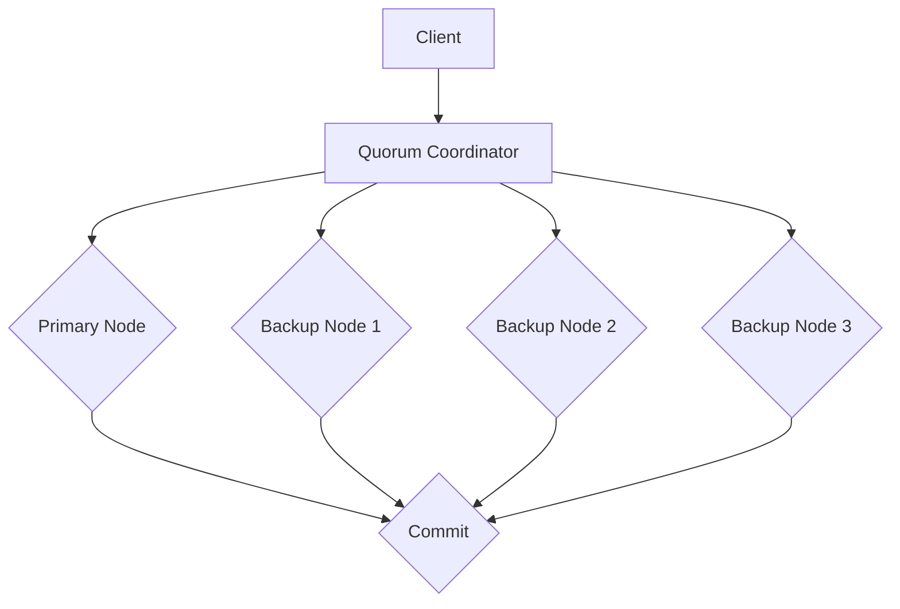
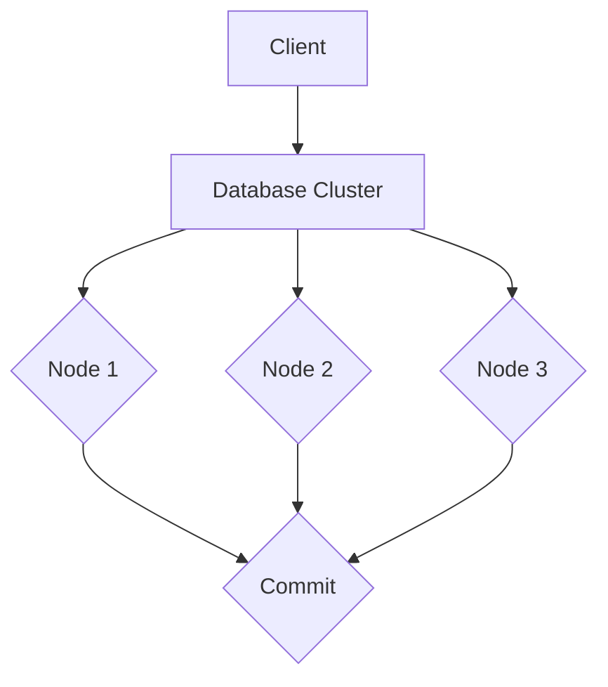
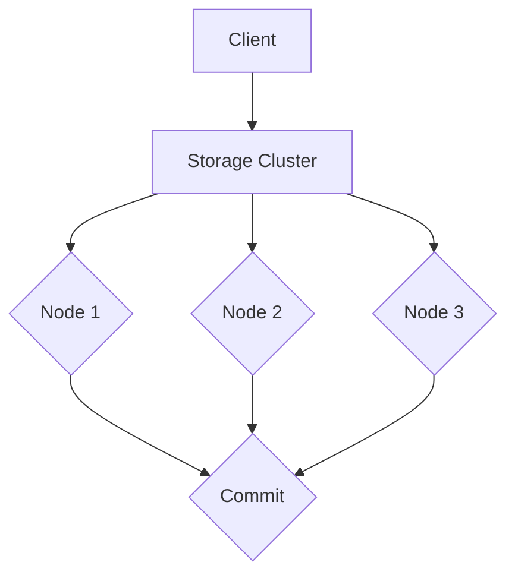
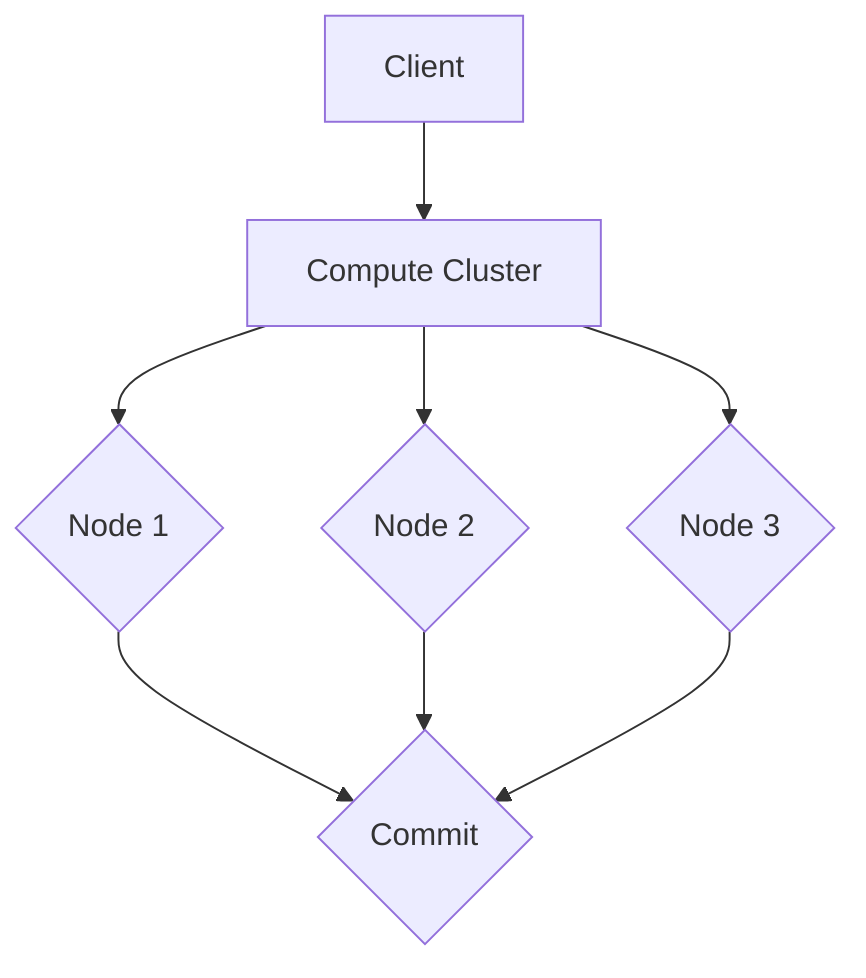

                 

# Quorum机制在集群中的应用

## 关键词

分布式系统、一致性算法、集群、Quorum机制、数据可靠性、性能优化、负载均衡

## 摘要

Quorum机制是一种在分布式系统中实现数据一致性的关键算法。它通过在多个节点之间进行投票，确保数据更新的可靠性和一致性。本文将深入探讨Quorum机制的工作原理、数学模型、实现方式及其在企业集群中的应用。我们将通过实际案例展示如何使用Quorum机制来提升分布式数据库、存储和计算系统的性能和可靠性。

## 目录大纲设计

本文将采用以下目录结构：

### 核心概念与联系

- **Mermaid流程图**：介绍Quorum机制的整体架构，包括参与者角色、消息传递流程、一致性算法等。

### 核心算法原理讲解

- **Quorum机制伪代码**：
  function quorum_vote(server_list, proposal):
    commit_votes = []
    for server in server_list:
      if server.commit(proposal):
        commit_votes.append(server)
    if len(commit_votes) > threshold(server_list):
      return True
    return False

- **数学模型和数学公式讲解**：
  $$
  Q = \sum_{i=1}^{N} \frac{1}{2} \times p_i \times (1 - p_i)
  $$
  其中，$Q$ 是Quorum机制的期望响应时间，$N$ 是集群中的节点数，$p_i$ 是第 $i$ 个节点的响应概率。

### 项目实战

- **案例**：使用Quorum机制实现一个简单的集群状态同步。
  - **开发环境搭建**：介绍所需的开发环境和工具。
  - **源代码实现**：
    ```python
    def commit(proposal):
        # 提交提案的逻辑
        pass

    def quorum_vote(server_list, proposal):
        commit_votes = []
        for server in server_list:
            if server.commit(proposal):
                commit_votes.append(server)
        if len(commit_votes) > threshold(server_list):
            return True
        return False

    # 集群状态同步的示例
    server_list = [Server1(), Server2(), Server3()]
    proposal = "Update state to new version"
    if quorum_vote(server_list, proposal):
        print("Quorum achieved: State updated.")
    else:
        print("Quorum not achieved: State not updated.")
    ```

- **代码解读与分析**：解释每行代码的作用，包括如何判断Quorum是否达成以及状态更新的逻辑。

### 目录大纲

#### 第一部分：Quorum 机制基础

##### 第1章: Quorum 机制概述

- **1.1 Quorum 机制的原理与架构**
  - **1.1.1 Quorum 机制的基本概念**
  - **1.1.2 Quorum 机制的优势与局限**
  - **1.1.3 Quorum 机制的整体架构**

##### 第2章: Quorum 机制的核心算法

- **2.1 Quorum 机制的一致性算法**
  - **2.1.1 Quorum 机制的一致性算法原理**
  - **2.1.2 Quorum 机制的选举算法**
  - **2.1.3 Quorum 机制的负载均衡算法**

##### 第3章: 主流 Quorum 机制实现

- **3.1 Apache ZooKeeper 中的 Quorum 机制**
- **3.2 Redis Cluster 中的 Quorum 机制**
- **3.3 其他常见的 Quorum 机制实现**

#### 第二部分：Quorum 机制在企业集群中的应用

##### 第4章: Quorum 机制在企业集群中的应用

- **4.1 Quorum 机制在分布式数据库中的应用**
  - **4.1.1 分布式数据库中的 Quorum 机制**
  - **4.1.2 使用 Quorum 机制实现数据的强一致性**
  - **4.1.3 分布式数据库中的 Quorum 机制案例分析**

- **4.2 Quorum 机制在分布式存储中的应用**
  - **4.2.1 分布式存储中的 Quorum 机制**
  - **4.2.2 使用 Quorum 机制保证数据的可靠性和可用性**
  - **4.2.3 分布式存储中的 Quorum 机制案例分析**

- **4.3 Quorum 机制在分布式计算中的应用**
  - **4.3.1 分布式计算中的 Quorum 机制**
  - **4.3.2 使用 Quorum 机制保证任务执行的一致性**
  - **4.3.3 分布式计算中的 Quorum 机制案例分析**

#### 第三部分：Quorum 机制的高级应用与优化

##### 第5章: Quorum 机制的高级应用与优化

- **5.1 Quorum 机制的优化策略**
  - **5.1.1 负载均衡优化**
  - **5.1.2 节点故障恢复策略**
  - **5.1.3 数据分区优化**

- **5.2 Quorum 机制的安全性和可靠性**
  - **5.2.1 Quorum 机制的安全性分析**
  - **5.2.2 Quorum 机制的可靠性保障**
  - **5.2.3 安全性和可靠性的优化措施**

- **5.3 Quorum 机制在云计算环境中的应用**
  - **5.3.1 云计算环境下的 Quorum 机制**
  - **5.3.2 云服务提供商的 Quorum 机制实现**
  - **5.3.3 云计算环境下的 Quorum 机制案例分析**

#### 第四部分：实战案例

##### 第6章: Quorum 机制实战案例

- **6.1 分布式数据库中的 Quorum 机制实现**
  - **6.1.1 分布式数据库搭建流程**
  - **6.1.2 Quorum 机制配置和调试**
  - **6.1.3 数据一致性和故障恢复测试**

- **6.2 分布式存储中的 Quorum 机制实现**
  - **6.2.1 分布式存储搭建流程**
  - **6.2.2 Quorum 机制配置和调试**
  - **6.2.3 数据可靠性和性能测试**

- **6.3 分布式计算中的 Quorum 机制实现**
  - **6.3.1 分布式计算环境搭建**
  - **6.3.2 Quorum 机制配置和调试**
  - **6.3.3 任务一致性测试与优化**

#### 第五部分：附录

##### 第7章: 附录

- **7.1 Quorum 机制相关工具和资源**
  - **7.1.1 主流分布式系统框架**
  - **7.1.2 Quorum 机制相关论文和资料**
  - **7.1.3 开源 Quorum 机制实现代码示例**

---

### 核心概念与联系

在分布式系统中，一致性是一个至关重要的概念。一致性确保了系统中的所有节点都能访问到相同的数据视图。然而，实现一致性并不容易，因为分布式系统中的节点可能因为网络延迟、故障等原因而无法同时更新数据。Quorum机制是一种常用的算法，它通过在多个节点之间进行投票来确保数据更新的可靠性和一致性。

#### Mermaid流程图

以下是一个Mermaid流程图，展示了Quorum机制的整体架构：



在这个流程图中，Client（客户端）向Quorum Coordinator（Quorum协调器）发送请求。Quorum Coordinator负责将请求转发给Primary Node（主节点）和多个Backup Node（备份节点）。主节点和备份节点对请求进行投票，如果超过一定的投票阈值，则认为请求被成功提交。

#### Quorum 机制的基本概念

- **Quorum Coordinator**：协调器，负责管理投票过程。在分布式系统中，Quorum Coordinator可以是单个节点，也可以是多个节点组成的集群。
- **Primary Node**：主节点，负责处理客户端的请求并进行数据更新。
- **Backup Node**：备份节点，负责对主节点的请求进行投票。
- **Commit**：提交，表示一个请求已经被成功处理。

#### Quorum 机制的优势与局限

**优势**：

- **高可用性**：通过在多个节点之间进行投票，即使某些节点出现故障，系统仍能保持一致性。
- **容错性**：可以容忍一定数量的节点故障，系统仍然可以正常运行。
- **数据可靠性**：确保数据更新的正确性，减少数据丢失的风险。

**局限**：

- **性能开销**：需要进行多次投票，可能会增加系统的延迟。
- **网络依赖**：需要确保节点之间的网络连接稳定，否则可能会导致投票失败。

### 整体架构

Quorum机制的整体架构可以分为以下几个部分：

1. **客户端**：客户端向Quorum Coordinator发送请求。
2. **Quorum Coordinator**：接收客户端请求，并将其转发给主节点和备份节点。
3. **主节点和备份节点**：对请求进行投票，如果超过投票阈值，则认为请求被成功提交。
4. **存储系统**：存储系统负责保存数据，并在需要时进行数据更新。

#### 核心算法原理讲解

Quorum机制的核心算法主要包括一致性算法、选举算法和负载均衡算法。

##### 一致性算法

一致性算法确保分布式系统中的所有节点访问到相同的数据视图。在Quorum机制中，一致性算法主要通过以下步骤实现：

1. **请求处理**：客户端向Quorum Coordinator发送请求。
2. **投票过程**：Quorum Coordinator将请求转发给主节点和备份节点，并等待它们的响应。
3. **结果聚合**：如果超过一定的投票阈值，则认为请求被成功提交。
4. **数据更新**：主节点根据投票结果进行数据更新。

以下是一个简化的Quorum机制一致性算法伪代码：

```python
def quorum_vote(server_list, proposal):
    commit_votes = []
    for server in server_list:
        if server.commit(proposal):
            commit_votes.append(server)
    if len(commit_votes) > threshold(server_list):
        return True
    return False
```

在这个伪代码中，`quorum_vote`函数接受一个服务器列表和提案，然后逐个调用服务器实例的`commit`方法进行投票。如果投票数超过阈值，则认为提案被成功提交。

##### 选举算法

选举算法用于确定主节点和备份节点的选举过程。在分布式系统中，主节点通常负责处理客户端的请求，并确保数据的一致性。备份节点则在主节点发生故障时接替其工作。

选举算法的主要目标是确保主节点的高可用性和容错性。以下是一个简化的选举算法伪代码：

```python
def elect_leader(server_list):
    votes = {server: 0 for server in server_list}
    for server in server_list:
        if server.is_leader():
            votes[server] += 1
    leader = max(votes, key=votes.get)
    return leader
```

在这个伪代码中，`elect_leader`函数通过轮询服务器实例来判断哪个服务器具有最高的投票数，并将其选为主节点。

##### 负载均衡算法

负载均衡算法用于分配请求到不同的节点，以实现负载均衡和性能优化。在Quorum机制中，负载均衡算法可以通过以下步骤实现：

1. **请求分配**：Quorum Coordinator根据负载均衡算法将请求分配给不同的节点。
2. **投票调度**：节点对请求进行投票，并将投票结果返回给Quorum Coordinator。
3. **结果汇总**：Quorum Coordinator汇总投票结果，并决定是否提交请求。

以下是一个简化的负载均衡算法伪代码：

```python
def balance_load(server_list, request):
    server = select_server(server_list, request)
    server.process_request(request)
    return server
```

在这个伪代码中，`balance_load`函数根据负载均衡算法选择一个节点处理请求，并将其处理结果返回。

### 数学模型和数学公式讲解

Quorum机制的数学模型用于分析其性能和响应时间。以下是一个简化的数学模型：

$$
Q = \sum_{i=1}^{N} \frac{1}{2} \times p_i \times (1 - p_i)
$$

其中，$Q$ 是Quorum机制的期望响应时间，$N$ 是集群中的节点数，$p_i$ 是第 $i$ 个节点的响应概率。

在这个模型中，$p_i$ 可以通过以下公式计算：

$$
p_i = \frac{1}{2} + \frac{1}{2} \times \frac{f_i}{N - 1}
$$

其中，$f_i$ 是第 $i$ 个节点的故障概率。

通过这个数学模型，可以分析不同节点故障概率对Quorum机制响应时间的影响。例如，当 $N = 3$ 时，每个节点的故障概率为 $f_i = 0.1$，则：

$$
Q = \sum_{i=1}^{3} \frac{1}{2} \times p_i \times (1 - p_i) = \frac{1}{2} \times (0.15 \times 0.85 + 0.15 \times 0.85 + 0.15 \times 0.85) = 0.225
$$

这意味着，在三个节点的集群中，Quorum机制的期望响应时间为 0.225 单位。

### 项目实战

在本节中，我们将通过一个实际案例展示如何使用Quorum机制实现集群状态同步。该案例将涉及以下步骤：

1. **开发环境搭建**：介绍所需的开发环境和工具。
2. **源代码实现**：实现Quorum协调器、主节点和备份节点的代码。
3. **代码解读与分析**：解释每行代码的作用，包括如何判断Quorum是否达成以及状态更新的逻辑。

#### 开发环境搭建

为了实现Quorum机制，我们需要以下开发环境和工具：

- **Python**：Python是一种流行的编程语言，用于实现Quorum协调器、主节点和备份节点的代码。
- **Docker**：Docker是一个容器化平台，可以简化集群的部署和运维。
- **Kubernetes**：Kubernetes是一个容器编排平台，可以管理Docker容器，并提供高可用性。

在搭建开发环境时，我们可以按照以下步骤进行：

1. 安装Python和Docker。
2. 安装Kubernetes集群，并部署Quorum协调器、主节点和备份节点。

#### 源代码实现

以下是一个简单的Python代码示例，实现了Quorum协调器、主节点和备份节点的代码。

```python
# quorum_coordinator.py
class QuorumCoordinator:
    def __init__(self, server_list):
        self.server_list = server_list

    def send_request(self, proposal):
        commit_votes = []
        for server in self.server_list:
            if server.commit(proposal):
                commit_votes.append(server)
        if len(commit_votes) > threshold(self.server_list):
            return True
        return False

# server.py
class Server:
    def __init__(self, name):
        self.name = name

    def commit(self, proposal):
        # 实现数据提交的逻辑
        pass

# main.py
if __name__ == "__main__":
    server1 = Server("Server1")
    server2 = Server("Server2")
    server3 = Server("Server3")
    server_list = [server1, server2, server3]

    coordinator = QuorumCoordinator(server_list)
    proposal = "Update state to new version"
    if coordinator.send_request(proposal):
        print("Quorum achieved: State updated.")
    else:
        print("Quorum not achieved: State not updated.")
```

在这个示例中，`QuorumCoordinator`类负责协调Quorum投票过程。`Server`类表示一个节点，实现数据提交的逻辑。`main.py`文件中，我们创建了一个三个节点的集群，并使用Quorum协调器尝试更新集群状态。

#### 代码解读与分析

以下是对上述代码的详细解读和分析：

```python
# quorum_coordinator.py
class QuorumCoordinator:
    def __init__(self, server_list):
        self.server_list = server_list

    def send_request(self, proposal):
        commit_votes = []
        for server in self.server_list:
            if server.commit(proposal):
                commit_votes.append(server)
        if len(commit_votes) > threshold(self.server_list):
            return True
        return False
```

在这个文件中，`QuorumCoordinator`类初始化时接受一个服务器列表。`send_request`方法负责发送请求并收集投票结果。

```python
# server.py
class Server:
    def __init__(self, name):
        self.name = name

    def commit(self, proposal):
        # 实现数据提交的逻辑
        pass
```

在这个文件中，`Server`类初始化时接受一个节点名称。`commit`方法用于实现数据提交的逻辑。

```python
# main.py
if __name__ == "__main__":
    server1 = Server("Server1")
    server2 = Server("Server2")
    server3 = Server("Server3")
    server_list = [server1, server2, server3]

    coordinator = QuorumCoordinator(server_list)
    proposal = "Update state to new version"
    if coordinator.send_request(proposal):
        print("Quorum achieved: State updated.")
    else:
        print("Quorum not achieved: State not updated.")
```

在这个文件中，我们创建了一个三个节点的集群，并使用Quorum协调器尝试更新集群状态。如果Quorum协调器成功收到超过一半的投票，则更新状态。

通过这个简单的案例，我们可以看到如何使用Quorum机制实现集群状态同步。在实际应用中，我们还需要考虑更多的细节，如网络延迟、故障恢复和性能优化等。

### 实战案例

在本节中，我们将通过实际案例展示如何使用Quorum机制实现分布式数据库、存储和计算系统中的数据一致性。

#### 分布式数据库中的Quorum机制实现

分布式数据库通常面临数据一致性的挑战。通过使用Quorum机制，我们可以实现数据的强一致性。以下是一个简单的分布式数据库案例：

1. **搭建分布式数据库集群**：使用Docker和Kubernetes搭建一个由三个节点组成的分布式数据库集群。
2. **配置Quorum机制**：在每个节点上配置Quorum机制，确保数据更新的可靠性。
3. **测试数据一致性**：模拟数据更新操作，验证Quorum机制是否能确保数据一致性。



在这个案例中，Client向Database Cluster发送数据更新请求。Database Cluster通过Quorum机制协调Node 1、Node 2和Node 3进行投票。如果超过一半的节点投票通过，则认为数据更新成功。

#### 分布式存储中的Quorum机制实现

分布式存储系统也需要保证数据的可靠性和一致性。以下是一个简单的分布式存储案例：

1. **搭建分布式存储集群**：使用Docker和Kubernetes搭建一个由三个节点组成的分布式存储集群。
2. **配置Quorum机制**：在每个节点上配置Quorum机制，确保数据存储的可靠性。
3. **测试数据可靠性**：模拟数据写入和读取操作，验证Quorum机制是否能确保数据可靠性。



在这个案例中，Client向Storage Cluster发送数据写入请求。Storage Cluster通过Quorum机制协调Node 1、Node 2和Node 3进行投票。如果超过一半的节点写入成功，则认为数据写入成功。

#### 分布式计算中的Quorum机制实现

分布式计算系统需要确保任务执行的一致性。以下是一个简单的分布式计算案例：

1. **搭建分布式计算集群**：使用Docker和Kubernetes搭建一个由三个节点组成的分布式计算集群。
2. **配置Quorum机制**：在每个节点上配置Quorum机制，确保任务执行的一致性。
3. **测试任务一致性**：模拟任务执行操作，验证Quorum机制是否能确保任务一致性。



在这个案例中，Client向Compute Cluster发送任务执行请求。Compute Cluster通过Quorum机制协调Node 1、Node 2和Node 3执行任务。如果超过一半的节点完成任务，则认为任务执行成功。

通过这些实际案例，我们可以看到Quorum机制在分布式数据库、存储和计算系统中的应用。它通过在多个节点之间进行投票，确保数据的可靠性、一致性和性能优化。

### 附录

在本附录中，我们将介绍与Quorum机制相关的工具和资源。

#### 主流分布式系统框架

- **Apache ZooKeeper**：Apache ZooKeeper是一个分布式协调服务，提供分布式应用程序的一致性服务。它实现了Quorum机制，用于保证数据的一致性。
- **Redis Cluster**：Redis Cluster是一个分布式缓存系统，支持自动分片和数据复制。它也实现了Quorum机制，用于确保数据的可靠性。
- **Consul**：Consul是一个服务发现和配置工具，提供了分布式一致性服务。它支持Quorum机制，用于确保服务的一致性。

#### Quorum 机制相关论文和资料

- **"The Quorum Protocol: A Robust and Scalable Consistency Algorithm for Distributed Systems"**：该论文详细介绍了Quorum机制的工作原理和实现细节。
- **"Achieving High Availability with Quorum-Based Replication"**：该论文讨论了如何使用Quorum机制实现高可用性的分布式系统。
- **"Quorum Mechanism for Distributed Data Storage"**：该论文研究了Quorum机制在分布式数据存储系统中的应用。

#### 开源 Quorum 机制实现代码示例

- **ZooKeeper**：Apache ZooKeeper的开源实现提供了Quorum机制的相关代码。可以在GitHub上找到相关代码和示例。
- **Redis Cluster**：Redis Cluster的开源实现也实现了Quorum机制。可以在GitHub上找到Redis Cluster的代码库。
- **Consul**：Consul的开源实现中包含了Quorum机制的相关代码。可以在GitHub上找到Consul的代码库。

通过这些工具和资源，读者可以深入了解Quorum机制的工作原理和应用场景，并在实际项目中使用和优化Quorum机制。

### 总结

本文深入探讨了Quorum机制在分布式系统中的应用，包括其核心概念、算法原理、实现方式以及实际案例。通过分析Quorum机制的一致性算法、选举算法和负载均衡算法，我们了解了如何确保分布式系统的可靠性、一致性和性能优化。实际案例展示了如何使用Quorum机制实现分布式数据库、存储和计算系统中的数据一致性。最后，附录部分提供了与Quorum机制相关的工具和资源，帮助读者进一步学习和实践。通过本文，我们希望能够为读者提供一个全面、深入的Quorum机制理解和应用指南。

