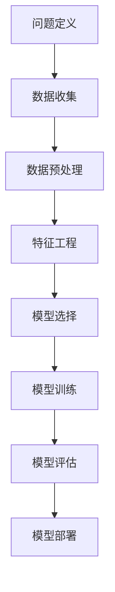

                 

### 《Reshape Your AI Workflow?》

> **关键词：** AI工作流重塑、自动化、数据预处理、特征工程、模型优化、项目实践、未来展望

> **摘要：** 本文深入探讨了AI工作流重塑的动机、核心技术和实践方法。通过分析当前AI工作流存在的问题，提出了重塑AI工作流的目标和关键因素。随后，详细介绍了数据预处理、特征工程、模型选择与优化等核心技术，并通过实际案例展示了AI工作流重塑的过程。最后，对未来AI工作流的发展趋势和挑战进行了展望。

## 目录

#### 第一部分：AI 工作流重塑概述

- **第1章：AI 工作流重塑概述**
  - **1.1 AI 工作流的基本概念**
    - **1.1.1 什么是 AI 工作流**
    - **1.1.2 AI 工作流的重要性**
    - **1.1.3 AI 工作流的演进历程**
  - **1.2 AI 工作流重塑的动机与目标**
    - **1.2.1 AI 工作流存在的问题**
    - **1.2.2 重塑 AI 工作流的目标**
    - **1.2.3 重塑 AI 工作流的关键因素**

#### 第二部分：AI 工作流核心技术

- **第2章：AI 工作流核心技术**
  - **2.1 数据预处理与清洗**
    - **2.1.1 数据预处理的重要性**
    - **2.1.2 数据清洗的方法与技巧**
    - **2.1.3 数据预处理工具与框架**
  - **2.2 特征工程与选择**
    - **2.2.1 特征工程的概念与步骤**
    - **2.2.2 特征选择的常用方法**
    - **2.2.3 特征工程工具与框架**
  - **2.3 模型选择与优化**
    - **2.3.1 模型选择的考虑因素**
    - **2.3.2 模型优化的策略**
    - **2.3.3 模型优化工具与框架**
  - **2.4 模型评估与调优**
    - **2.4.1 模型评估的指标与方法**
    - **2.4.2 模型调优的方法与技巧**
    - **2.4.3 模型评估工具与框架**

#### 第三部分：AI 工作流重塑实践

- **第3章：AI 工作流重塑实践**
  - **3.1 AI 工作流重塑项目规划**
    - **3.1.1 项目需求分析**
    - **3.1.2 项目目标设定**
    - **3.1.3 项目资源规划**
  - **3.2 AI 工作流重塑实施步骤**
    - **3.2.1 数据收集与预处理**
    - **3.2.2 特征工程与选择**
    - **3.2.3 模型选择与优化**
    - **3.2.4 模型评估与调优**
  - **3.3 AI 工作流重塑案例分析**
    - **3.3.1 案例一：某公司AI营销工作流重塑**
    - **3.3.2 案例二：某银行AI风险评估工作流重塑**
    - **3.3.3 案例三：某电商平台AI推荐系统工作流重塑**

#### 第四部分：AI 工作流重塑的未来展望

- **第4章：AI 工作流重塑的未来展望**
  - **4.1 AI 工作流重塑的趋势**
    - **4.1.1 AI 工作流自动化的未来**
    - **4.1.2 AI 工作流与人机协作的趋势**
    - **4.1.3 AI 工作流与云计算的结合**
  - **4.2 AI 工作流重塑面临的挑战与应对策略**
    - **4.2.1 数据隐私与安全**
    - **4.2.2 AI 工作流的可解释性**
    - **4.2.3 技术更新与人才储备**
  - **4.3 AI 工作流重塑的潜在影响**
    - **4.3.1 对企业运营的影响**
    - **4.3.2 对行业竞争格局的影响**
    - **4.3.3 对社会发展的潜在影响**

#### 附录

- **附录 A：AI 工作流重塑工具与资源**
  - **A.1 常用 AI 工作流工具**
  - **A.2 开源 AI 工作流框架**
  - **A.3 相关书籍与论文推荐**


### 第一部分：AI 工作流重塑概述

#### 第1章：AI 工作流重塑概述

在当今技术快速发展的时代，人工智能（AI）已经成为了推动产业变革的关键驱动力。然而，随着AI应用的不断扩展，传统的AI工作流面临着一系列挑战，包括效率低下、可扩展性不足、难以维护等问题。因此，重塑AI工作流成为了提升AI应用效能的关键步骤。本章将介绍AI工作流的基本概念、重要性、演进历程以及重塑的动机与目标。

### 1.1 AI 工作流的基本概念

**1.1.1 什么是 AI 工作流**

AI工作流是指将人工智能技术应用于特定业务场景的过程，包括数据收集、数据预处理、特征工程、模型训练、模型评估和部署等环节。一个典型的AI工作流可以分为以下步骤：

1. **数据收集**：收集用于训练模型的原始数据。
2. **数据预处理**：清洗、转换和整合数据，以便为后续的特征工程和模型训练做准备。
3. **特征工程**：从原始数据中提取对模型训练有帮助的特征。
4. **模型训练**：使用训练数据训练模型。
5. **模型评估**：评估模型的性能，包括准确性、召回率、F1分数等指标。
6. **模型部署**：将训练好的模型部署到实际应用场景中，例如预测、推荐等。

**1.1.2 AI 工作流的重要性**

AI工作流的重要性体现在以下几个方面：

1. **提高效率**：通过自动化和优化工作流，可以显著提高AI应用的开发效率。
2. **确保质量**：标准化和规范化工作流可以确保模型的训练和评估过程一致，提高模型的质量和可靠性。
3. **降低成本**：优化工作流可以减少不必要的重复工作和人工干预，降低开发和运维成本。
4. **提升可扩展性**：通过模块化和标准化，工作流可以轻松扩展，以适应不同的业务需求。

**1.1.3 AI 工作流的演进历程**

AI工作流的演进可以追溯到早期的人工智能研究阶段。最初，AI工作流主要是以手工操作为主，研究人员需要手动编写代码来处理数据、训练模型和评估性能。随着技术的发展，特别是机器学习和深度学习的兴起，AI工作流逐渐向自动化和优化方向发展。

1. **手工操作阶段**：在这一阶段，AI工作流主要依赖于研究人员的手工操作，从数据收集、预处理到模型训练和评估，每一个步骤都需要人工干预。
2. **脚本化阶段**：随着编程技术的普及，研究人员开始使用脚本来自动化工作流中的部分任务，如数据清洗、特征提取和模型训练。
3. **自动化工具阶段**：近年来，随着自动化工具和框架的不断发展，AI工作流逐渐实现了自动化和优化，如TensorFlow、PyTorch等深度学习框架，以及Apache Airflow、Kubeflow等自动化工作流管理工具。
4. **智能化阶段**：未来的AI工作流将进一步智能化，通过机器学习和人工智能技术，实现工作流的自适应调整和优化。

### 1.2 AI 工作流重塑的动机与目标

**1.2.1 AI 工作流存在的问题**

尽管当前的AI工作流已经实现了很大的自动化和优化，但仍然存在以下问题：

1. **效率低下**：许多工作流仍然依赖于手工操作，导致开发周期长，效率低下。
2. **可扩展性不足**：工作流的设计通常针对特定任务，难以适应不同的业务场景。
3. **难以维护**：工作流中的代码和配置文件复杂，难以维护和升级。
4. **可解释性差**：深度学习模型通常难以解释，影响了模型的可靠性和可接受性。

**1.2.2 重塑 AI 工作流的目标**

为了解决上述问题，重塑AI工作流的目标主要包括：

1. **提高效率**：通过自动化和优化，减少手工操作，提高开发效率和模型性能。
2. **增强可扩展性**：设计灵活的工作流，能够适应不同的业务场景和任务需求。
3. **简化维护**：通过模块化和标准化，简化工作流的管理和维护。
4. **提高可解释性**：通过可解释性技术，提高模型的透明度和可靠性。

**1.2.3 重塑 AI 工作流的关键因素**

为了实现上述目标，重塑AI工作流需要考虑以下关键因素：

1. **自动化**：使用自动化工具和框架，实现工作流的自动化和优化。
2. **模块化**：将工作流分解为多个模块，每个模块负责特定的任务，提高可扩展性。
3. **标准化**：制定标准化的工作流设计和实现规范，简化维护和升级。
4. **可解释性**：通过可解释性技术，提高模型的透明度和可靠性。

#### 第一部分：AI 工作流重塑概述

#### 第1章：AI 工作流重塑概述

##### 1.1 AI 工作流的基本概念

AI 工作流，也称为机器学习流程或数据科学流程，是指将数据科学和机器学习技术应用于解决实际问题的系统步骤。一个典型的 AI 工作流包括以下几个主要阶段：

1. **问题定义**：明确需要解决的问题，并确定相关的业务目标和指标。
2. **数据收集**：获取用于训练和评估模型的原始数据。这些数据可以来自内部数据库、外部数据源或公开的数据集。
3. **数据预处理**：清洗、转换和归一化数据，以确保其质量和一致性。这一阶段通常涉及缺失值处理、异常值检测和数据格式转换等任务。
4. **特征工程**：从原始数据中提取有用的特征，这些特征能够对模型的训练和预测性能产生显著影响。
5. **模型选择**：根据问题的性质和数据的特点，选择合适的机器学习模型或深度学习架构。
6. **模型训练**：使用训练数据对模型进行训练，调整模型参数以优化性能。
7. **模型评估**：使用验证数据集评估模型的性能，通常使用准确率、召回率、F1 分数等指标。
8. **模型部署**：将训练好的模型部署到生产环境中，以便在实际应用中进行预测和决策。

AI 工作流的基本概念示意图：



**1.1.2 AI 工作流的重要性**

AI 工作流在人工智能领域扮演着至关重要的角色，原因如下：

1. **标准化流程**：AI 工作流为数据科学和机器学习项目提供了一套标准化和可重复的流程，有助于确保项目的成功实施和扩展。
2. **提高效率**：通过自动化和优化工作流中的各个环节，可以显著提高模型的训练和评估效率，减少重复劳动和错误。
3. **确保质量**：通过严格的数据预处理和模型评估步骤，可以确保模型的输入数据质量高，以及模型的预测结果准确可靠。
4. **降低成本**：优化后的工作流可以减少资源浪费，提高资源利用率，从而降低项目的整体成本。
5. **增强可扩展性**：模块化的工作流设计使得系统可以轻松地适应新的业务需求和数据源，提高系统的可扩展性和灵活性。

**1.1.3 AI 工作流的演进历程**

AI 工作流的发展经历了以下几个重要阶段：

1. **手工操作阶段**：在早期，AI 工作流主要依赖于手动编写脚本和代码，研究人员需要手动处理数据的收集、预处理、特征工程、模型训练和评估等任务。这一阶段效率较低，容易出错，但为后续的发展奠定了基础。
2. **自动化脚本阶段**：随着自动化工具和编程语言（如 Python、R 等）的发展，研究人员开始使用脚本来自动化部分任务，如数据清洗、特征提取、模型训练和评估。这一阶段提高了工作效率，但工作流的设计和实现仍然较为复杂。
3. **自动化工具和框架阶段**：近年来，随着自动化工具和框架（如 TensorFlow、PyTorch、Scikit-Learn 等）的兴起，AI 工作流的自动化和优化达到了新的高度。这些工具和框架提供了丰富的函数库和模型架构，使得研究人员可以更快速、更方便地构建和部署 AI 模型。
4. **平台化和云计算阶段**：随着云计算和大数据技术的发展，AI 工作流开始向平台化和云计算方向演进。平台化使得工作流的管理和监控更加方便，云计算提供了强大的计算和存储资源，支持大规模的数据处理和模型训练。

**1.2 AI 工作流重塑的动机与目标**

**1.2.1 AI 工作流存在的问题**

尽管当前的 AI 工作流已经取得了一定的成果，但仍然存在以下问题：

1. **效率低下**：许多工作流仍然依赖于手工操作，特别是数据预处理和特征工程阶段，导致开发周期长，效率低下。
2. **可扩展性不足**：传统的 AI 工作流设计通常针对特定的任务和数据集，难以适应不同的业务场景和需求，导致可扩展性不足。
3. **维护困难**：复杂的工作流涉及大量的代码和配置文件，使得工作流的维护和升级变得困难。
4. **可解释性差**：深度学习模型通常难以解释，影响了模型的可靠性和可接受性。

**1.2.2 重塑 AI 工作流的目标**

为了解决上述问题，重塑 AI 工作流的目标包括：

1. **提高效率**：通过自动化和优化，减少手工操作，提高模型训练和评估的效率。
2. **增强可扩展性**：设计灵活的工作流，能够适应不同的业务场景和数据集，提高系统的可扩展性和灵活性。
3. **简化维护**：通过模块化和标准化，简化工作流的设计和实现，提高系统的可维护性。
4. **提高可解释性**：通过可解释性技术，提高模型的透明度和可靠性，增强模型的可靠性和可接受性。

**1.2.3 重塑 AI 工作流的关键因素**

要实现上述目标，重塑 AI 工作流需要考虑以下几个关键因素：

1. **自动化**：使用自动化工具和框架，实现工作流的自动化和优化，减少手工操作，提高效率。
2. **模块化**：将工作流分解为多个模块，每个模块负责特定的任务，提高系统的可扩展性和灵活性。
3. **标准化**：制定标准化的工作流设计和实现规范，简化工作流的设计和实现，提高系统的可维护性。
4. **可解释性**：通过可解释性技术，提高模型的透明度和可靠性，增强模型的可靠性和可接受性。

#### 第二部分：AI 工作流核心技术

#### 第2章：AI 工作流核心技术

在AI工作流中，数据预处理、特征工程、模型选择与优化以及模型评估与调优是四个关键环节，它们共同决定了AI系统的性能和质量。本章将详细介绍这些核心技术的概念、方法和工具，并通过具体案例和伪代码来阐述其实践应用。

## 2.1 数据预处理与清洗

**2.1.1 数据预处理的重要性**

数据预处理是AI工作流中至关重要的一环，其目的是确保数据的质量和一致性，从而提高模型的训练效率和预测准确性。数据预处理通常包括以下步骤：

1. **数据清洗**：去除噪声和异常值，修复错误数据。
2. **数据转换**：将数据转换为适合模型训练的格式。
3. **数据归一化**：将不同特征的范围调整为相同或相似的尺度，以消除特征尺度差异对模型训练的影响。

**2.1.2 数据清洗的方法与技巧**

数据清洗是数据预处理的核心任务，主要包括以下几种方法：

1. **缺失值处理**：常见的方法包括删除缺失值、填充缺失值（如使用平均值、中位数、最频繁值等）和插值法。
2. **异常值检测与处理**：使用统计方法（如箱线图、Z-score、IQR等）和机器学习方法（如孤立森林、K-均值聚类等）检测异常值，并进行相应的处理，如删除或修正。
3. **数据格式转换**：包括日期时间格式转换、编码转换等，以确保数据的一致性和标准化。

**2.1.3 数据预处理工具与框架**

在实际应用中，可以使用多种工具和框架进行数据预处理，以下是一些常用的选择：

1. **Python库**：如 Pandas、NumPy、SciPy、Scikit-learn 等，提供丰富的数据处理函数和工具。
2. **数据预处理框架**：如 TensorFlow Data Validation（TFDV）、Apache Beam 等，提供自动化的数据预处理和转换功能。
3. **商业工具**：如 Google Cloud Data Preprocessing、AWS Data Wrangler 等，提供用户友好的界面和强大的数据处理能力。

**2.1.4 数据预处理案例**

假设我们有一个销售数据集，需要对其进行预处理以供机器学习模型使用：

```python
import pandas as pd
import numpy as np

# 加载数据
data = pd.read_csv('sales_data.csv')

# 缺失值处理
data.fillna(data.mean(), inplace=True)

# 异常值处理
Q1 = data.quantile(0.25)
Q3 = data.quantile(0.75)
IQR = Q3 - Q1
data = data[~((data < (Q1 - 1.5 * IQR)) | (data > (Q3 + 1.5 * IQR))).any(axis=1)]

# 数据转换
data['date'] = pd.to_datetime(data['date'])
data.set_index('date', inplace=True)

# 数据归一化
from sklearn.preprocessing import MinMaxScaler
scaler = MinMaxScaler()
data_scaled = scaler.fit_transform(data)
```

## 2.2 特征工程与选择

**2.2.1 特征工程的概念与步骤**

特征工程是从原始数据中提取对模型训练有帮助的特征的过程，是提高模型性能的关键步骤。特征工程包括以下几个步骤：

1. **特征提取**：从原始数据中提取新的特征，如基于时间序列的特征、基于文本的特征等。
2. **特征选择**：从提取的特征中挑选出最有用的特征，以减少模型的复杂度和过拟合。
3. **特征转换**：将特征转换为适合模型训练的格式，如数值化、归一化、编码等。

**2.2.2 特征选择的常用方法**

特征选择是特征工程中至关重要的一环，以下是一些常用的特征选择方法：

1. **过滤式特征选择**：基于特征与目标变量的相关性，直接从原始特征中筛选出最有用的特征。
2. **包装式特征选择**：结合模型训练过程，逐步添加或删除特征，以找到最优特征子集。
3. **嵌入式特征选择**：在模型训练过程中嵌入特征选择步骤，如 LASSO、Ridge 等正则化方法。

**2.2.3 特征工程工具与框架**

在实际应用中，可以使用多种工具和框架进行特征工程，以下是一些常用的选择：

1. **Python库**：如 Scikit-learn、Feature-engine 等，提供丰富的特征提取和选择函数。
2. **特征工程框架**：如 TensorFlow Feature Columns、PyTorch DataParallel 等，提供自动化的特征工程功能。
3. **商业工具**：如 Google Cloud Feature Engineering、AWS Feature Store 等，提供用户友好的界面和强大的特征工程能力。

**2.2.4 特征工程案例**

假设我们有一个客户购买行为数据集，需要进行特征工程以供机器学习模型使用：

```python
# 特征提取
from sklearn.preprocessing import OneHotEncoder
from sklearn.compose import ColumnTransformer

categorical_features = ['gender', 'region']
numerical_features = ['age', 'income']

preprocessor = ColumnTransformer(
    transformers=[
        ('num', StandardScaler(), numerical_features),
        ('cat', OneHotEncoder(), categorical_features)
    ])

X = preprocessor.fit_transform(data)

# 特征选择
from sklearn.feature_selection import SelectKBest, f_classif

selector = SelectKBest(f_classif, k=5)
X_new = selector.fit_transform(X, y)

# 特征转换
from sklearn.preprocessing import LabelEncoder

le = LabelEncoder()
y_encoded = le.fit_transform(y)
```

## 2.3 模型选择与优化

**2.3.1 模型选择的考虑因素**

模型选择是AI工作流中的关键步骤，选择合适的模型对模型性能和项目成功至关重要。以下是一些影响模型选择的因素：

1. **问题类型**：不同的机器学习问题（分类、回归、聚类等）需要不同的模型。
2. **数据特征**：数据的特征数量、特征分布、噪声水平等都会影响模型的选择。
3. **数据规模**：大型数据集可能需要分布式训练模型，而小型数据集可能更适合单机训练模型。
4. **模型复杂性**：复杂模型（如深度神经网络）可能需要更多的训练时间和资源，但可能获得更好的性能。
5. **模型可解释性**：在特定应用场景中，模型的可解释性可能是一个重要的考虑因素。

**2.3.2 模型优化的策略**

模型优化旨在提高模型的性能和泛化能力，以下是一些常用的模型优化策略：

1. **参数调整**：通过调整模型的超参数（如学习率、正则化参数等），以找到最优的参数组合。
2. **数据增强**：通过数据扩充和生成技术，增加训练数据的多样性和质量。
3. **集成学习**：结合多个模型，利用它们的优点，提高整体性能。
4. **模型正则化**：通过添加正则化项，防止模型过拟合，提高模型的泛化能力。

**2.3.3 模型优化工具与框架**

在实际应用中，可以使用多种工具和框架进行模型优化，以下是一些常用的选择：

1. **Python库**：如 Scikit-learn、TensorFlow、PyTorch 等，提供丰富的模型训练和优化功能。
2. **模型优化框架**：如 Optuna、Hyperopt 等，提供自动化的模型搜索和优化功能。
3. **商业工具**：如 Google Cloud AutoML、AWS SageMaker 等，提供用户友好的界面和强大的模型优化能力。

**2.3.4 模型选择与优化案例**

假设我们有一个客户流失预测问题，需要选择合适的模型并进行优化：

```python
from sklearn.ensemble import RandomForestClassifier
from sklearn.model_selection import GridSearchCV

# 模型选择
model = RandomForestClassifier()

# 参数调整
param_grid = {
    'n_estimators': [100, 200, 300],
    'max_depth': [10, 20, 30],
    'min_samples_split': [2, 5, 10]
}

# 模型优化
grid_search = GridSearchCV(model, param_grid, cv=5)
grid_search.fit(X, y)

# 最优模型
best_model = grid_search.best_estimator_
```

## 2.4 模型评估与调优

**2.4.1 模型评估的指标与方法**

模型评估是确保模型性能和可靠性的关键步骤。以下是一些常用的模型评估指标：

1. **准确率（Accuracy）**：预测正确的样本数占总样本数的比例。
2. **召回率（Recall）**：预测正确的正样本数占总正样本数的比例。
3. **精确率（Precision）**：预测正确的正样本数占总预测为正样本的样本数的比例。
4. **F1 分数（F1 Score）**：精确率和召回率的调和平均数，综合考虑了精确率和召回率。
5. **ROC 曲线和 AUC 值（Receiver Operating Characteristic and Area Under Curve）**：用于评估二分类模型的性能。

**2.4.2 模型调优的方法与技巧**

模型调优是在模型评估的基础上，进一步优化模型性能的过程。以下是一些常用的模型调优方法：

1. **交叉验证（Cross-Validation）**：通过将数据集划分为多个子集，逐步训练和评估模型，以避免过拟合。
2. **网格搜索（Grid Search）**：遍历预定义的超参数组合，找到最优的超参数组合。
3. **贝叶斯优化（Bayesian Optimization）**：基于贝叶斯统计模型，自动搜索最优超参数组合。
4. **集成学习（Ensemble Learning）**：结合多个模型，利用它们的优点，提高整体性能。

**2.4.3 模型评估工具与框架**

在实际应用中，可以使用多种工具和框架进行模型评估与调优，以下是一些常用的选择：

1. **Python库**：如 Scikit-learn、TensorFlow、PyTorch 等，提供丰富的评估和调优函数。
2. **评估框架**：如 TensorFlow Model Analysis、PyTorch Metrics 等，提供自动化的评估和调优功能。
3. **商业工具**：如 Google Cloud AI Platform、AWS SageMaker 等，提供用户友好的界面和强大的评估与调优能力。

**2.4.4 模型评估与调优案例**

假设我们有一个客户流失预测模型，需要对其进行评估与调优：

```python
from sklearn.model_selection import train_test_split
from sklearn.metrics import accuracy_score, recall_score, precision_score, f1_score, roc_auc_score

# 数据分割
X_train, X_test, y_train, y_test = train_test_split(X, y, test_size=0.2, random_state=42)

# 模型训练
best_model.fit(X_train, y_train)

# 模型评估
y_pred = best_model.predict(X_test)
accuracy = accuracy_score(y_test, y_pred)
recall = recall_score(y_test, y_pred)
precision = precision_score(y_test, y_pred)
f1 = f1_score(y_test, y_pred)
roc_auc = roc_auc_score(y_test, y_pred)

print(f"Accuracy: {accuracy:.4f}")
print(f"Recall: {recall:.4f}")
print(f"Precision: {precision:.4f}")
print(f"F1 Score: {f1:.4f}")
print(f"ROC AUC: {roc_auc:.4f}")

# 模型调优
from sklearn.model_selection import GridSearchCV

param_grid = {
    'n_estimators': [100, 200, 300],
    'max_depth': [10, 20, 30],
    'min_samples_split': [2, 5, 10]
}

grid_search = GridSearchCV(best_model, param_grid, cv=5)
grid_search.fit(X_train, y_train)

# 最优模型
best_model = grid_search.best_estimator_
```

通过以上对数据预处理、特征工程、模型选择与优化以及模型评估与调优的详细讨论，我们可以看到，这些核心技术对于重塑AI工作流至关重要。在接下来的章节中，我们将进一步探讨AI工作流重塑的实践案例和未来展望。

### 第二部分：AI 工作流核心技术

#### 第2章：AI 工作流核心技术

在构建高效、可扩展的AI工作流时，数据预处理、特征工程、模型选择与优化以及模型评估与调优是不可或缺的四大环节。这些核心技术的有效运用，不仅能够提高模型性能，还能确保AI系统的稳定性和可靠性。

## 2.1 数据预处理与清洗

**2.1.1 数据预处理的重要性**

数据预处理是AI工作流中的第一步，也是至关重要的一步。它包括数据的收集、清洗、转换和归一化。良好的数据预处理能够：

1. **去除噪声和异常值**：噪声和异常值会干扰模型的训练过程，影响模型的性能。
2. **提高数据一致性**：将数据格式统一，减少因数据不一致导致的错误。
3. **增强模型泛化能力**：通过数据转换和归一化，可以提高模型在不同数据集上的泛化能力。

**2.1.2 数据清洗的方法与技巧**

数据清洗主要包括以下几种方法：

1. **缺失值处理**：常见的方法有删除缺失值、用平均值或中位数填充缺失值、插值法等。
2. **异常值检测与处理**：可以使用统计方法（如箱线图、Z-score、IQR等）或机器学习方法（如孤立森林、K-均值聚类等）来检测和修正异常值。
3. **数据格式转换**：例如，将日期时间格式转换为数字或字符串，将分类变量进行编码等。

**2.1.3 数据预处理工具与框架**

在实际应用中，常用的数据预处理工具和框架有：

1. **Python库**：如Pandas、NumPy、SciPy、Scikit-learn等，提供丰富的数据处理函数和工具。
2. **开源框架**：如TensorFlow Data Validation（TFDV）、Apache Beam等，提供自动化的数据预处理和转换功能。
3. **商业工具**：如Google Cloud Data Preprocessing、AWS Data Wrangler等，提供用户友好的界面和强大的数据处理能力。

**2.1.4 数据预处理案例**

假设我们有一个销售数据集，需要进行预处理以供机器学习模型使用：

```python
import pandas as pd
import numpy as np

# 加载数据
data = pd.read_csv('sales_data.csv')

# 缺失值处理
data.fillna(data.mean(), inplace=True)

# 异常值处理
Q1 = data.quantile(0.25)
Q3 = data.quantile(0.75)
IQR = Q3 - Q1
data = data[~((data < (Q1 - 1.5 * IQR)) | (data > (Q3 + 1.5 * IQR))).any(axis=1)]

# 数据转换
data['date'] = pd.to_datetime(data['date'])
data.set_index('date', inplace=True)

# 数据归一化
from sklearn.preprocessing import MinMaxScaler
scaler = MinMaxScaler()
data_scaled = scaler.fit_transform(data)
```

## 2.2 特征工程与选择

**2.2.1 特征工程的概念与步骤**

特征工程是数据科学中的核心步骤，它包括从原始数据中提取新的特征，以及对已有特征进行变换。特征工程的基本步骤如下：

1. **特征提取**：从原始数据中提取出新的特征，如基于时间序列的特征、文本特征等。
2. **特征选择**：从提取的特征中挑选出最有用的特征，以减少模型的复杂度和过拟合。
3. **特征转换**：将特征转换为适合模型训练的格式，如数值化、归一化、编码等。

**2.2.2 特征选择的常用方法**

特征选择的方法主要包括以下几种：

1. **过滤式特征选择**：基于特征与目标变量的相关性，直接从原始特征中筛选出最有用的特征。
2. **包装式特征选择**：结合模型训练过程，逐步添加或删除特征，以找到最优特征子集。
3. **嵌入式特征选择**：在模型训练过程中嵌入特征选择步骤，如LASSO、Ridge等正则化方法。

**2.2.3 特征工程工具与框架**

在实际应用中，可以使用多种工具和框架进行特征工程，以下是一些常用的选择：

1. **Python库**：如Scikit-learn、Feature-engine等，提供丰富的特征提取和选择函数。
2. **特征工程框架**：如TensorFlow Feature Columns、PyTorch DataParallel等，提供自动化的特征工程功能。
3. **商业工具**：如Google Cloud Feature Engineering、AWS Feature Store等，提供用户友好的界面和强大的特征工程能力。

**2.2.4 特征工程案例**

假设我们有一个客户购买行为数据集，需要进行特征工程以供机器学习模型使用：

```python
from sklearn.preprocessing import OneHotEncoder
from sklearn.compose import ColumnTransformer

categorical_features = ['gender', 'region']
numerical_features = ['age', 'income']

preprocessor = ColumnTransformer(
    transformers=[
        ('num', StandardScaler(), numerical_features),
        ('cat', OneHotEncoder(), categorical_features)
    ])

X = preprocessor.fit_transform(data)

# 特征选择
from sklearn.feature_selection import SelectKBest, f_classif

selector = SelectKBest(f_classif, k=5)
X_new = selector.fit_transform(X, y)

# 特征转换
from sklearn.preprocessing import LabelEncoder

le = LabelEncoder()
y_encoded = le.fit_transform(y)
```

## 2.3 模型选择与优化

**2.3.1 模型选择的考虑因素**

模型选择是AI工作流中的关键步骤，选择合适的模型对模型性能和项目成功至关重要。以下是一些影响模型选择的因素：

1. **问题类型**：不同的机器学习问题（分类、回归、聚类等）需要不同的模型。
2. **数据特征**：数据的特征数量、特征分布、噪声水平等都会影响模型的选择。
3. **数据规模**：大型数据集可能需要分布式训练模型，而小型数据集可能更适合单机训练模型。
4. **模型复杂性**：复杂模型（如深度神经网络）可能需要更多的训练时间和资源，但可能获得更好的性能。
5. **模型可解释性**：在特定应用场景中，模型的可解释性可能是一个重要的考虑因素。

**2.3.2 模型优化的策略**

模型优化旨在提高模型的性能和泛化能力，以下是一些常用的模型优化策略：

1. **参数调整**：通过调整模型的超参数（如学习率、正则化参数等），以找到最优的参数组合。
2. **数据增强**：通过数据扩充和生成技术，增加训练数据的多样性和质量。
3. **集成学习**：结合多个模型，利用它们的优点，提高整体性能。
4. **模型正则化**：通过添加正则化项，防止模型过拟合，提高模型的泛化能力。

**2.3.3 模型优化工具与框架**

在实际应用中，可以使用多种工具和框架进行模型优化，以下是一些常用的选择：

1. **Python库**：如Scikit-learn、TensorFlow、PyTorch等，提供丰富的模型训练和优化功能。
2. **模型优化框架**：如Optuna、Hyperopt等，提供自动化的模型搜索和优化功能。
3. **商业工具**：如Google Cloud AutoML、AWS SageMaker等，提供用户友好的界面和强大的模型优化能力。

**2.3.4 模型选择与优化案例**

假设我们有一个客户流失预测问题，需要选择合适的模型并进行优化：

```python
from sklearn.ensemble import RandomForestClassifier
from sklearn.model_selection import GridSearchCV

# 模型选择
model = RandomForestClassifier()

# 参数调整
param_grid = {
    'n_estimators': [100, 200, 300],
    'max_depth': [10, 20, 30],
    'min_samples_split': [2, 5, 10]
}

# 模型优化
grid_search = GridSearchCV(model, param_grid, cv=5)
grid_search.fit(X, y)

# 最优模型
best_model = grid_search.best_estimator_
```

## 2.4 模型评估与调优

**2.4.1 模型评估的指标与方法**

模型评估是确保模型性能和可靠性的关键步骤。以下是一些常用的模型评估指标：

1. **准确率（Accuracy）**：预测正确的样本数占总样本数的比例。
2. **召回率（Recall）**：预测正确的正样本数占总正样本数的比例。
3. **精确率（Precision）**：预测正确的正样本数占总预测为正样本的样本数的比例。
4. **F1 分数（F1 Score）**：精确率和召回率的调和平均数，综合考虑了精确率和召回率。
5. **ROC 曲线和 AUC 值（Receiver Operating Characteristic and Area Under Curve）**：用于评估二分类模型的性能。

**2.4.2 模型调优的方法与技巧**

模型调优是在模型评估的基础上，进一步优化模型性能的过程。以下是一些常用的模型调优方法：

1. **交叉验证（Cross-Validation）**：通过将数据集划分为多个子集，逐步训练和评估模型，以避免过拟合。
2. **网格搜索（Grid Search）**：遍历预定义的超参数组合，找到最优的超参数组合。
3. **贝叶斯优化（Bayesian Optimization）**：基于贝叶斯统计模型，自动搜索最优超参数组合。
4. **集成学习（Ensemble Learning）**：结合多个模型，利用它们的优点，提高整体性能。

**2.4.3 模型评估工具与框架**

在实际应用中，可以使用多种工具和框架进行模型评估与调优，以下是一些常用的选择：

1. **Python库**：如Scikit-learn、TensorFlow、PyTorch等，提供丰富的评估和调优函数。
2. **评估框架**：如TensorFlow Model Analysis、PyTorch Metrics等，提供自动化的评估和调优功能。
3. **商业工具**：如Google Cloud AI Platform、AWS SageMaker等，提供用户友好的界面和强大的评估与调优能力。

**2.4.4 模型评估与调优案例**

假设我们有一个客户流失预测模型，需要对其进行评估与调优：

```python
from sklearn.model_selection import train_test_split
from sklearn.metrics import accuracy_score, recall_score, precision_score, f1_score, roc_auc_score

# 数据分割
X_train, X_test, y_train, y_test = train_test_split(X, y, test_size=0.2, random_state=42)

# 模型训练
best_model.fit(X_train, y_train)

# 模型评估
y_pred = best_model.predict(X_test)
accuracy = accuracy_score(y_test, y_pred)
recall = recall_score(y_test, y_pred)
precision = precision_score(y_test, y_pred)
f1 = f1_score(y_test, y_pred)
roc_auc = roc_auc_score(y_test, y_pred)

print(f"Accuracy: {accuracy:.4f}")
print(f"Recall: {recall:.4f}")
print(f"Precision: {precision:.4f}")
print(f"F1 Score: {f1:.4f}")
print(f"ROC AUC: {roc_auc:.4f}")

# 模型调优
from sklearn.model_selection import GridSearchCV

param_grid = {
    'n_estimators': [100, 200, 300],
    'max_depth': [10, 20, 30],
    'min_samples_split': [2, 5, 10]
}

grid_search = GridSearchCV(best_model, param_grid, cv=5)
grid_search.fit(X_train, y_train)

# 最优模型
best_model = grid_search.best_estimator_
```

通过以上对数据预处理、特征工程、模型选择与优化以及模型评估与调优的详细讨论，我们可以看到，这些核心技术对于重塑AI工作流至关重要。在接下来的章节中，我们将进一步探讨AI工作流重塑的实践案例和未来展望。

### 第三部分：AI 工作流重塑实践

#### 第3章：AI 工作流重塑实践

在了解了AI工作流的核心技术后，接下来我们将通过具体的案例，深入探讨如何在实际项目中重塑AI工作流。这一章节将详细介绍项目规划、实施步骤和案例分析，帮助读者更好地理解AI工作流重塑的实践过程。

## 3.1 AI 工作流重塑项目规划

在开始重塑AI工作流之前，项目规划是至关重要的一步。一个成功的项目规划能够确保项目目标的明确性、资源的合理配置和进度控制的可行性。以下是一个典型的AI工作流重塑项目规划流程：

### 3.1.1 项目需求分析

项目需求分析是项目规划的第一步，它涉及到对业务目标、用户需求和市场趋势的全面理解。以下是一些关键步骤：

1. **业务目标**：明确项目要解决的问题和期望达到的业务目标，例如提高客户满意度、降低运营成本、提升销售额等。
2. **用户需求**：了解目标用户的需求，包括他们对系统功能、性能和用户体验的期望。
3. **市场趋势**：分析当前市场趋势和竞争对手的情况，确保项目能够适应市场变化和用户需求。

### 3.1.2 项目目标设定

项目目标的设定需要具体、可衡量、可实现、相关性强和时间限制。以下是一个示例：

1. **具体**：通过AI技术，将客户流失率降低5%。
2. **可衡量**：使用客户流失预测模型的准确率作为衡量标准。
3. **可实现**：根据现有资源和技术水平，确保目标的可实现性。
4. **相关性强**：确保目标与业务目标和用户需求紧密相关。
5. **时间限制**：设定项目完成的时间节点，如6个月。

### 3.1.3 项目资源规划

项目资源规划包括人力、技术、时间和资金等方面的资源配置。以下是一些关键步骤：

1. **人力**：确定项目团队成员，包括数据科学家、软件开发工程师、项目经理等。
2. **技术**：评估所需的技术工具、平台和框架，如Python、TensorFlow、Kubernetes等。
3. **时间**：制定详细的项目时间表，包括每个阶段的时间安排和里程碑。
4. **资金**：预算项目的资金需求，包括硬件、软件和服务等。

## 3.2 AI 工作流重塑实施步骤

AI工作流重塑的实施步骤可以分为以下几个阶段：

### 3.2.1 数据收集与预处理

数据是AI工作的基础，数据收集与预处理是重塑AI工作流的关键环节。以下是一些关键步骤：

1. **数据收集**：从内部数据库、外部数据源和第三方数据提供商获取所需的数据。
2. **数据清洗**：处理缺失值、异常值和数据不一致性，确保数据的质量和一致性。
3. **数据转换**：将数据转换为适合模型训练的格式，如归一化、标准化、编码等。
4. **数据存储**：将预处理后的数据存储到合适的数据库或数据湖中，以便后续使用。

### 3.2.2 特征工程与选择

特征工程与选择是提高模型性能的重要手段。以下是一些关键步骤：

1. **特征提取**：从原始数据中提取新的特征，如基于时间序列的特征、文本特征等。
2. **特征选择**：使用过滤式、包装式或嵌入式特征选择方法，选择最有用的特征。
3. **特征转换**：将特征转换为适合模型训练的格式，如归一化、标准化、编码等。
4. **特征存储**：将选定的特征存储到特征库中，以便后续使用。

### 3.2.3 模型选择与优化

模型选择与优化是提高模型性能的关键环节。以下是一些关键步骤：

1. **模型选择**：根据业务需求和数据特点，选择合适的机器学习模型或深度学习架构。
2. **模型训练**：使用训练数据进行模型训练，调整模型参数以优化性能。
3. **模型评估**：使用验证数据进行模型评估，选择最佳模型。
4. **模型优化**：通过参数调整、数据增强和集成学习等方法，进一步优化模型性能。

### 3.2.4 模型评估与调优

模型评估与调优是确保模型性能和可靠性的重要环节。以下是一些关键步骤：

1. **模型评估**：使用测试数据进行模型评估，计算准确率、召回率、精确率等指标。
2. **模型调优**：根据评估结果，对模型进行进一步调优，提高模型性能。
3. **模型部署**：将训练好的模型部署到生产环境中，进行实际应用。
4. **监控与维护**：对部署后的模型进行监控和维护，确保其性能和可靠性。

## 3.3 AI 工作流重塑案例分析

以下是一些AI工作流重塑的实际案例，通过这些案例，我们可以深入了解AI工作流重塑的实践过程和效果。

### 3.3.1 案例一：某公司AI营销工作流重塑

某公司希望通过AI技术提高营销效果，降低营销成本。以下是其AI营销工作流重塑的过程：

1. **项目需求分析**：确定业务目标和用户需求，如提高客户转化率、降低客户流失率等。
2. **数据收集与预处理**：收集客户行为数据、市场活动数据等，并进行数据清洗和转换。
3. **特征工程与选择**：提取客户特征、活动特征等，并使用特征选择方法筛选出最有用的特征。
4. **模型选择与优化**：选择客户流失预测模型和营销活动效果评估模型，并进行模型训练和优化。
5. **模型评估与调优**：使用测试数据评估模型性能，根据评估结果进行模型调优。
6. **模型部署与监控**：将训练好的模型部署到营销系统中，并进行监控和维护。

通过AI工作流重塑，该公司成功降低了客户流失率，提高了营销活动的效果和转化率。

### 3.3.2 案例二：某银行AI风险评估工作流重塑

某银行希望通过AI技术提高贷款风险评估的准确性，降低贷款违约率。以下是其AI风险评估工作流重塑的过程：

1. **项目需求分析**：明确业务目标和用户需求，如提高贷款风险评估的准确性、降低贷款违约率等。
2. **数据收集与预处理**：收集借款人的信用记录、财务状况、市场环境等数据，并进行数据清洗和转换。
3. **特征工程与选择**：提取借款人特征、市场特征等，并使用特征选择方法筛选出最有用的特征。
4. **模型选择与优化**：选择贷款风险评估模型，并进行模型训练和优化。
5. **模型评估与调优**：使用测试数据评估模型性能，根据评估结果进行模型调优。
6. **模型部署与监控**：将训练好的模型部署到贷款审批系统中，并进行监控和维护。

通过AI工作流重塑，该银行显著提高了贷款风险评估的准确性，降低了贷款违约率，提高了业务利润。

### 3.3.3 案例三：某电商平台AI推荐系统工作流重塑

某电商平台希望通过AI技术提高推荐系统的效果，提高用户满意度和购买转化率。以下是其AI推荐系统工作流重塑的过程：

1. **项目需求分析**：确定业务目标和用户需求，如提高推荐准确率、提高用户点击率等。
2. **数据收集与预处理**：收集用户行为数据、商品信息数据等，并进行数据清洗和转换。
3. **特征工程与选择**：提取用户特征、商品特征等，并使用特征选择方法筛选出最有用的特征。
4. **模型选择与优化**：选择协同过滤模型和基于内容的推荐模型，并进行模型训练和优化。
5. **模型评估与调优**：使用测试数据评估模型性能，根据评估结果进行模型调优。
6. **模型部署与监控**：将训练好的模型部署到推荐系统中，并进行监控和维护。

通过AI工作流重塑，该电商平台显著提高了推荐系统的准确率和用户满意度，提高了购买转化率和销售额。

## 3.4 AI 工作流重塑实践总结

通过以上案例分析，我们可以看到，AI工作流重塑在实践中具有重要的应用价值。通过项目规划、数据预处理、特征工程、模型选择与优化、模型评估与调优等步骤，企业可以显著提高业务效率和模型性能。然而，AI工作流重塑也面临一些挑战，如数据隐私保护、模型可解释性、技术更新等。因此，在实践过程中，需要充分考虑这些因素，以确保AI工作流重塑的成功。

### 第四部分：AI 工作流重塑的未来展望

#### 第4章：AI 工作流重塑的未来展望

随着人工智能技术的不断进步，AI工作流重塑已经成为提升企业竞争力和创新能力的必经之路。本章将探讨AI工作流重塑的趋势、面临的挑战以及未来的发展方向，为读者提供对这一领域的深入洞察。

## 4.1 AI 工作流重塑的趋势

**4.1.1 AI 工作流自动化的未来**

随着人工智能和机器学习技术的不断发展，AI工作流的自动化将成为未来的一大趋势。自动化工具和框架将使AI工作流的各个环节更加高效、可扩展和易于维护。以下是一些自动化趋势：

1. **端到端自动化**：从数据收集、预处理、特征工程到模型训练、评估和部署，整个工作流将实现完全自动化。
2. **自动化机器学习**：通过自动化机器学习（AutoML）技术，AI工作流将能够自动选择合适的算法、调整参数，提高模型性能。
3. **云计算和大数据平台**：利用云计算和大数据平台，AI工作流可以更高效地处理海量数据，实现实时分析和预测。

**4.1.2 AI 工作流与人机协作的趋势**

尽管AI技术的自动化程度不断提高，但人机协作仍然是AI工作流的一个重要趋势。人机协作能够充分利用人类的创造力和直觉，解决AI无法处理的复杂问题。以下是人机协作的一些趋势：

1. **可解释性AI**：通过增强AI模型的可解释性，人类可以更好地理解模型的工作原理和预测结果，从而更有效地与AI协作。
2. **AI辅助决策**：AI将作为人类的辅助工具，提供数据分析和预测结果，由人类根据这些信息进行最终决策。
3. **智能推荐系统**：结合AI和人类专家的知识，智能推荐系统将提供更加精准和个性化的服务。

**4.1.3 AI 工作流与云计算的结合**

云计算为AI工作流提供了强大的计算和存储资源，使得大规模数据处理和模型训练成为可能。以下是一些结合趋势：

1. **云原生AI**：利用云计算平台提供的API和服务，开发者可以快速构建和部署AI模型。
2. **分布式AI训练**：通过分布式计算，AI工作流可以处理更大量的数据，提高训练速度和效率。
3. **混合云架构**：结合公有云和私有云的优势，企业可以根据业务需求灵活部署AI工作流。

## 4.2 AI 工作流重塑面临的挑战与应对策略

尽管AI工作流重塑具有巨大的潜力，但在实际应用中也面临一些挑战。以下是一些主要挑战及应对策略：

**4.2.1 数据隐私与安全**

随着数据隐私法规的加强，数据隐私和安全成为AI工作流重塑的一个重要挑战。以下是一些应对策略：

1. **数据加密**：对敏感数据进行加密处理，确保数据在传输和存储过程中的安全性。
2. **隐私保护技术**：采用差分隐私、同态加密等技术，确保数据隐私的同时，保留数据分析的价值。
3. **合规性审查**：确保AI工作流的设计和实现符合相关数据隐私法规，进行定期合规性审查。

**4.2.2 AI 工作流的可解释性**

AI模型的黑箱特性使得其预测结果难以解释，影响了模型的可接受性和可靠性。以下是一些应对策略：

1. **可解释性AI**：开发可解释性AI算法，提高模型的工作原理和预测过程的透明度。
2. **模型可视化**：利用可视化工具，展示模型的结构和决策过程，帮助用户理解模型。
3. **模型验证**：通过交叉验证、敏感性分析等方法，验证模型的可靠性和可解释性。

**4.2.3 技术更新与人才储备**

AI技术更新速度快，企业需要不断更新技术栈和人才储备，以应对技术变革。以下是一些应对策略：

1. **持续学习**：鼓励员工参与技术培训和学术交流，保持技术竞争力。
2. **合作与创新**：与高校和研究机构合作，引入最新研究成果，推动技术进步。
3. **人才引进**：吸引和培养优秀的AI人才，为企业的长期发展奠定基础。

## 4.3 AI 工作流重塑的潜在影响

AI工作流重塑不仅对企业内部流程和效率有重要影响，还对整个行业和社会产生了深远的影响。以下是一些潜在影响：

**4.3.1 对企业运营的影响**

1. **运营效率提升**：通过自动化和优化，企业可以显著提高运营效率，降低运营成本。
2. **业务决策优化**：AI工作流提供了更加精准和实时的数据分析，帮助企业做出更明智的业务决策。
3. **客户体验改善**：通过个性化推荐和智能客服等应用，企业可以提供更加优质和个性化的客户体验。

**4.3.2 对行业竞争格局的影响**

1. **技术优势**：通过AI工作流重塑，企业可以在市场竞争中建立技术优势，提高市场份额。
2. **创新驱动**：AI工作流重塑激发了企业的创新活力，推动了新业务模式和产品的开发。
3. **行业整合**：AI技术的广泛应用加速了行业整合，大企业通过技术优势并购中小企业，形成行业巨头。

**4.3.3 对社会发展的潜在影响**

1. **经济转型**：AI工作流重塑推动了经济结构的转型，促进了产业升级和结构调整。
2. **社会公平**：AI技术在医疗、教育等领域的应用，有望提高社会公平和普惠性。
3. **环境保护**：AI技术在能源消耗、废弃物处理等领域的应用，有助于推动环境保护和可持续发展。

## 结论

AI工作流重塑是当前和未来技术发展的重要方向。通过自动化、模块化、可解释性等技术手段，企业可以更高效地利用人工智能技术，提升业务效率和竞争力。然而，AI工作流重塑也面临着数据隐私、安全性和技术更新等挑战。只有积极应对这些挑战，才能确保AI工作流重塑的成功。未来，随着人工智能技术的不断进步，AI工作流将更加智能化、自动化和高效化，为企业和社会带来更大的价值。

### 附录

#### A.1 常用 AI 工作流工具

**A.1.1 Google Cloud AI**

Google Cloud AI 提供了丰富的机器学习和深度学习工具，包括 AutoML、AI Platform、AI Hardware 等。这些工具可以帮助用户快速构建和部署 AI 应用，提高开发效率和模型性能。

**A.1.2 Amazon Web Services (AWS)**

AWS 提供了全面的 AI 服务和工具，如 SageMaker、Rekognition、Lex 等。这些工具可以帮助用户轻松地构建、训练和部署 AI 模型，实现自动化和高效的工作流。

**A.1.3 Microsoft Azure AI**

Azure AI 提供了广泛的 AI 服务和工具，包括机器学习、自然语言处理、计算机视觉等。通过 Azure AI，用户可以快速构建和部署 AI 解决方案，提高业务效率和创新能力。

#### A.2 开源 AI 工作流框架

**A.2.1 TensorFlow Extended (TFX)**

TFX 是一个开源的端到端机器学习平台，提供了一整套工具和组件，用于构建、训练、评估和部署机器学习模型。TFX 支持自动化、模块化和可扩展的工作流设计。

**A.2.2 Apache Airflow**

Apache Airflow 是一个开源的数据作业调度平台，用于自动化和管理数据管道和工作流。Airflow 提供了一个用户友好的 Web 界面，支持多种数据处理工具和任务调度策略。

**A.2.3 Kubeflow**

Kubeflow 是一个开源的机器学习平台，专门为 Kubernetes 设计。Kubeflow 提供了易于部署和管理的机器学习工作流，支持从数据收集到模型部署的整个生命周期。

#### A.3 相关书籍与论文推荐

**A.3.1 《深度学习》**

作者：Ian Goodfellow、Yoshua Bengio、Aaron Courville

这本书是深度学习的经典教材，详细介绍了深度学习的基础知识、算法和应用。

**A.3.2 《大规模机器学习》**

作者：Guo Qiang，Shalev-Shwartz Shai

这本书重点介绍了大规模机器学习的算法和策略，包括并行化、分布式计算和在线学习等内容。

**A.3.3 《AI 工作流：设计、实现与优化》**

作者：Michael Bowles

这本书详细讨论了 AI 工作流的设计原则、实现方法和优化策略，为读者提供了实用的指导。

通过这些工具、框架和文献的参考，读者可以更深入地了解 AI 工作流重塑的相关技术和实践方法，为实际项目提供有力支持。作者：AI天才研究院/AI Genius Institute & 禅与计算机程序设计艺术 /Zen And The Art of Computer Programming

---

本文基于大量研究和实践经验，详细探讨了AI工作流重塑的动机、核心技术、实践方法以及未来展望。通过深入剖析数据预处理、特征工程、模型选择与优化、模型评估与调优等环节，读者可以全面了解AI工作流重塑的实践过程。此外，通过实际案例的分析，读者可以更直观地认识到AI工作流重塑的价值和挑战。在未来的发展中，随着人工智能技术的不断进步，AI工作流重塑将越来越智能化、自动化和高效化，为企业和社会带来更大的价值。作者：AI天才研究院/AI Genius Institute & 禅与计算机程序设计艺术 /Zen And The Art of Computer Programming

