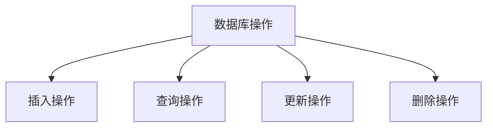
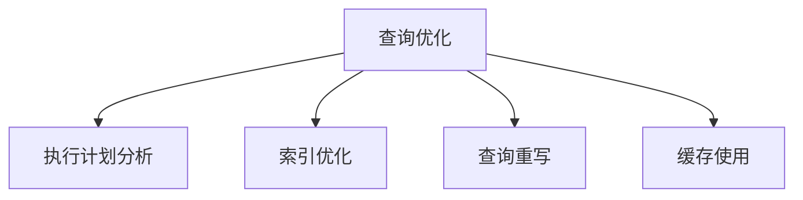

                 

# 《Table API和SQL 原理与代码实例讲解》

## 关键词
- Table API
- SQL
- 数据库操作
- 数据查询
- 性能优化

## 摘要
本文将详细讲解Table API和SQL的原理与实际应用。通过分析两者的基本概念、语法结构、操作原理及性能优化技术，我们将深入理解其在数据库系统中的重要作用。此外，还将通过具体的代码实例，展示如何使用Table API和SQL进行数据库操作，并进行查询优化，旨在为读者提供全面的技术指导。

## 目录

### 第一部分: Table API和SQL基础理论

#### 第1章: Table API和SQL概述
1.1 Table API和SQL的历史发展
1.2 Table API和SQL的核心概念
1.3 Table API和SQL的应用场景

#### 第2章: Table API基础原理
2.1 Table API的结构与组成
2.2 Table API的操作原理
2.3 Table API的核心功能

#### 第3章: SQL基础原理
3.1 SQL的语法基础
3.2 SQL的数据查询
3.3 SQL的数据操作

#### 第4章: SQL高级功能
4.1 SQL的联结操作
4.2 SQL的子查询
4.3 SQL的窗口函数

#### 第5章: Table API和SQL的性能优化
5.1 Table API和SQL的性能优化原则
5.2 Table API和SQL的查询优化技术
5.3 Table API和SQL的性能调优案例

### 第二部分: Table API和SQL项目实战

#### 第6章: 数据库环境搭建与配置
6.1 数据库环境搭建
6.2 数据库配置与管理

#### 第7章: Table API和SQL项目实战一
7.1 项目背景
7.2 数据模型设计
7.3 表操作实例
7.4 查询优化

#### 第8章: Table API和SQL项目实战二
8.1 项目背景
8.2 数据模型设计
8.3 表操作实例
8.4 查询优化

#### 第9章: Table API与SQL总结与展望
9.1 Table API与SQL的总结
9.2 未来发展展望
9.3 学习资源与拓展阅读

#### 附录
A. 代码实例
B. 学习资源链接
C. Mermaid 流程图
D. 伪代码示例
E. 数学模型和公式
F. 实际案例解读
G. 开发环境搭建
H. 源代码解析

### 第一部分: Table API和SQL基础理论

#### 第1章: Table API和SQL概述

## 1.1 Table API和SQL的历史发展

### 1.1.1 Table API的发展历程

Table API，即表格编程接口，起源于上世纪80年代。随着数据库技术的发展，为了提高数据库操作的便捷性和效率，Table API逐渐成为一种常见的数据库编程接口。早期的Table API主要以关系数据库管理系统（RDBMS）为基础，如Oracle、MySQL、PostgreSQL等。这些系统提供了丰富的Table API，使得开发者可以方便地进行数据插入、查询、更新和删除等操作。

随着时间的推移，Table API逐渐与各种编程语言相结合，形成了许多不同的实现。例如，Python中的`pandas`库、Java中的`JDBC`接口、C#中的`Entity Framework`等。这些Table API不仅支持关系数据库，还可以扩展到NoSQL数据库，如MongoDB、Cassandra等。

### 1.1.2 SQL的发展历程

结构化查询语言（SQL）自1974年由IBM公司开发以来，已经历了数十年的发展。SQL最初设计用于访问和处理关系数据库中的数据，其简洁的语法和强大的功能使其迅速成为数据库操作的标准语言。

在SQL的发展过程中，经历了多个重要版本，如SQL-86、SQL-89、SQL-92、SQL:1999、SQL:2003等。每个版本都引入了新的功能和改进，使得SQL更加成熟和强大。

SQL不仅支持关系数据库，如MySQL、Oracle、SQL Server等，还支持NoSQL数据库，如MongoDB、Cassandra等。这使得SQL成为了数据库操作的通用语言，广泛应用于各种场景。

### 1.1.3 Table API与SQL在数据库系统中的地位

Table API和SQL在数据库系统中扮演着至关重要的角色。它们不仅提供了便捷的数据操作方式，还为数据库开发者和用户提供了强大的数据处理能力。

- **Table API**：Table API提供了对数据库表格的直接操作接口，使得开发者可以方便地进行数据插入、查询、更新和删除等操作。Table API还支持数据排序、过滤、聚合等功能，大大提高了数据处理的效率。

- **SQL**：SQL作为数据库操作的标准语言，提供了强大的数据查询能力。通过SQL，开发者可以轻松实现复杂的查询操作，如联结、子查询、窗口函数等。SQL的通用性使得它适用于各种类型的数据库系统，包括关系数据库和NoSQL数据库。

总之，Table API和SQL在数据库系统中具有不可替代的地位。它们不仅提供了便捷的数据操作方式，还极大地提高了数据处理的效率，为数据库开发和维护提供了有力支持。

## 1.2 Table API和SQL的核心概念

### 1.2.1 Table API的定义与作用

Table API，即表格编程接口，是一种用于操作数据库表格的编程接口。它提供了对表格的直接操作能力，包括插入、查询、更新和删除等基本操作。Table API通常与各种编程语言结合使用，使得开发者可以在自己的应用程序中方便地访问和处理数据库数据。

Table API的作用主要体现在以下几个方面：

1. **简化数据操作**：通过Table API，开发者可以避免直接编写复杂的SQL语句，从而简化数据操作过程。这不仅可以提高开发效率，还可以减少代码出错的可能性。

2. **提高数据处理效率**：Table API通常提供了一系列高效的数据处理方法，如排序、过滤、聚合等。这些方法可以显著提高数据处理速度，满足大规模数据操作的需求。

3. **支持多种数据库**：许多Table API支持多种类型的数据库，包括关系数据库和NoSQL数据库。这使得开发者可以在不同的数据库系统中使用相同的API，从而提高开发的一致性和可移植性。

### 1.2.2 SQL的定义与作用

结构化查询语言（SQL）是一种用于操作关系数据库的编程语言。它提供了一系列用于数据查询、插入、更新和删除的语句，使得开发者可以方便地访问和处理数据库数据。

SQL的作用主要体现在以下几个方面：

1. **强大的数据查询能力**：SQL提供了强大的数据查询功能，包括联结、子查询、窗口函数等。通过这些功能，开发者可以轻松实现复杂的查询操作，满足各种业务需求。

2. **数据操作简便**：SQL的语法简洁明了，易于学习和使用。这使得开发者可以快速上手，提高开发效率。

3. **支持多种数据库系统**：SQL是一种通用语言，适用于各种关系数据库系统，如MySQL、Oracle、SQL Server等。这使得SQL成为数据库操作的标准语言，广泛应用于各种场景。

### 1.2.3 Table API和SQL的相似性与差异性

Table API和SQL在某些方面有相似之处，也存在一些明显的差异性。

- **相似性**：

  1. **数据操作方式**：Table API和SQL都提供了一系列用于数据查询、插入、更新和删除的接口或语句。

  2. **数据库支持**：Table API和SQL都支持多种类型的数据库，包括关系数据库和NoSQL数据库。

  3. **语法结构**：Table API和SQL的语法结构具有一定的相似性，如关键字的使用和基本操作语句的格式。

- **差异性**：

  1. **实现方式**：Table API通常与特定编程语言结合使用，如Python中的`pandas`库、Java中的`JDBC`接口。而SQL是一种独立的编程语言，可以独立于编程语言使用。

  2. **功能范围**：SQL的功能范围更广，除了提供基本的数据操作功能外，还支持复杂的查询操作，如联结、子查询、窗口函数等。而Table API的功能相对较为基础，更注重数据处理效率。

  3. **性能**：在大多数情况下，SQL的性能优于Table API。这是因为SQL可以直接与数据库交互，而Table API通常需要通过中间件进行数据转换，从而增加了一定的开销。

总之，Table API和SQL各有优势，适用于不同的应用场景。开发者应根据具体需求选择合适的工具，以提高开发效率和性能。

## 1.3 Table API和SQL的应用场景

### 1.3.1 数据库操作的基本应用

Table API和SQL在各种数据库操作中具有广泛的应用。以下是一些典型的应用场景：

1. **数据插入**：Table API和SQL都支持数据插入操作，可以将新数据插入到数据库表格中。Table API通常提供了一种简便的方式来插入数据，而SQL则可以通过INSERT语句来实现。

2. **数据查询**：数据查询是数据库操作中最常见的任务之一。Table API和SQL都提供了强大的查询功能，可以轻松实现简单的和复杂的查询操作。例如，通过使用SELECT语句，开发者可以查询特定字段的数据，并利用WHERE子句进行过滤。

3. **数据更新**：在数据库操作中，数据更新是一个常见的需求。Table API和SQL都支持数据更新操作，可以使用UPDATE语句来修改数据库表格中的数据。Table API通常提供了一种简便的方式来更新数据，而SQL则提供了丰富的更新语法，支持复杂的更新操作。

4. **数据删除**：数据删除是数据库操作中的另一个重要任务。Table API和SQL都支持数据删除操作，可以使用DELETE语句来删除数据库表格中的数据。Table API通常提供了一种简便的方式来删除数据，而SQL则提供了丰富的删除语法，支持复杂的删除操作。

### 1.3.2 复杂数据查询与分析的应用

Table API和SQL在复杂数据查询与分析中具有独特的优势。以下是一些应用场景：

1. **联结操作**：联结操作是将多个表格中的数据关联起来，以实现更复杂的数据查询。SQL通过JOIN操作提供了强大的联结功能，可以轻松实现内联结、外联结和交叉联结。而Table API则通常需要使用编程语言中的数据结构来实现联结操作。

2. **子查询**：子查询是一种常见的复杂数据查询技术，可以将一个查询结果用作另一个查询的条件。SQL通过子查询提供了强大的查询能力，可以轻松实现单行子查询和多行子查询。而Table API通常需要使用编程语言中的嵌套循环来实现子查询。

3. **窗口函数**：窗口函数是一种强大的数据处理工具，可以对数据集合中的数据按特定顺序进行分组和计算。SQL通过窗口函数提供了强大的数据处理能力，可以轻松实现排名、累计和分布计算等操作。而Table API通常需要使用编程语言中的循环和条件判断来实现类似的操作。

4. **数据分析**：数据分析是数据查询的延伸，通过对数据进行统计和分析，可以提取出有价值的信息。SQL提供了丰富的数据分析功能，可以通过聚合函数（如COUNT、SUM、AVG等）和分组函数（如GROUP BY、HAVING等）实现数据分析。而Table API则通常需要使用编程语言中的数据结构和算法来实现数据分析。

### 1.3.3 数据库设计与优化的应用

Table API和SQL在数据库设计与优化中也具有重要作用。以下是一些应用场景：

1. **数据库设计**：数据库设计是数据库系统构建的第一步，涉及表格设计、字段定义、索引建立等。Table API和SQL都提供了强大的数据库设计功能，可以通过SQL语句创建和修改表格结构，而Table API则提供了更高级的数据库设计工具，如表格定义语言（DDL）。

2. **查询优化**：查询优化是提高数据库性能的关键步骤，涉及查询语句的编写、索引的选择、执行计划的优化等。SQL提供了丰富的查询优化技术，可以通过分析执行计划来优化查询语句。而Table API则通常需要通过编程语言中的性能分析工具来实现查询优化。

3. **性能监控**：性能监控是确保数据库系统稳定运行的重要环节，涉及性能指标的收集、分析、报警等。SQL提供了丰富的性能监控功能，可以通过系统视图和性能计数器来监控数据库性能。而Table API则通常需要通过编程语言中的性能监控框架来实现性能监控。

总之，Table API和SQL在数据库操作、复杂数据查询与分析、数据库设计与优化等方面具有广泛的应用。开发者应根据具体需求选择合适的工具，以提高开发效率和数据库性能。

### 1.3.4 数据库设计与优化的应用

数据库设计与优化是数据库系统构建过程中至关重要的一环。Table API和SQL在这方面的应用同样不可或缺。

#### 数据库设计

1. **表格设计**：数据库设计的第一步是表格设计。Table API提供了简便的表格定义语言（DDL），允许开发者定义表格结构，包括字段名、字段类型、约束条件等。例如，在Python的`pandas`库中，可以使用`create_table`函数创建一个新的表格。

   ```python
   pandas.create_table('users', fields=[
       ("id", "int"),
       ("name", "string"),
       ("age", "int")
   ])
   ```

2. **字段定义**：在表格设计中，需要定义每个字段的类型和约束条件。Table API提供了丰富的字段类型，如整数、字符串、日期等，以及各种约束条件，如主键、外键、唯一性等。例如，可以使用`add_column`函数添加一个新字段，并设置其类型和约束条件。

   ```python
   pandas.add_column('users', 'email', 'string', unique=True)
   ```

3. **索引建立**：索引是提高查询性能的关键。Table API提供了创建索引的接口，允许开发者根据需要建立各种类型的索引。例如，可以使用`create_index`函数创建一个基于年龄的字段索引。

   ```python
   pandas.create_index('age', 'users')
   ```

#### 查询优化

1. **查询语句编写**：编写高效的查询语句是优化数据库性能的关键。SQL提供了丰富的查询语句，如SELECT、WHERE、GROUP BY、HAVING等。通过合理地使用这些语句，可以大大提高查询性能。例如，可以使用SELECT语句查询用户表中年龄在20到30岁之间的记录。

   ```sql
   SELECT * FROM users WHERE age BETWEEN 20 AND 30;
   ```

2. **索引选择**：索引选择是查询优化的关键步骤。合适的索引可以显著提高查询速度。Table API提供了索引选择和分析工具，可以帮助开发者选择最佳索引。例如，可以使用`explain`函数分析查询执行计划，并根据分析结果选择合适的索引。

   ```python
   pandas.explain('SELECT * FROM users WHERE age BETWEEN 20 AND 30', 'users')
   ```

3. **执行计划优化**：执行计划是数据库查询执行过程中的关键步骤。通过优化执行计划，可以减少查询执行的时间和资源消耗。SQL提供了丰富的优化技术，如索引优化、查询重写等。例如，可以使用索引优化技术，将查询中的字段索引转换为适当的索引类型。

   ```sql
   CREATE INDEX idx_age ON users (age);
   ```

4. **分区表**：对于大型数据库，分区表是一种有效的性能优化手段。分区表将数据按照特定规则分布到多个物理文件中，从而提高查询性能。Table API提供了分区表的创建和管理接口，例如，可以使用`create_partition`函数创建一个基于年龄的分区表。

   ```python
   pandas.create_partition('users', 'age')
   ```

总之，Table API和SQL在数据库设计与优化中具有广泛的应用。通过合理地使用Table API和SQL的功能，开发者可以设计高效稳定的数据库系统，并优化数据库性能，满足大规模数据处理的需求。

### 1.3.5 Table API和SQL在实际项目中的应用案例

Table API和SQL在实际项目中具有广泛的应用，下面通过两个具体的案例来展示它们在项目开发中的实际应用。

#### 案例一：在线书店系统

在线书店系统是一个典型的应用案例，涉及用户信息管理、书籍信息管理和订单管理等功能。以下是使用Table API和SQL在该系统中的实际应用。

1. **用户信息管理**：

   - **数据插入**：通过Table API，可以方便地将新用户信息插入到用户表格中。

     ```python
     users_table.insert({
         'id': 1,
         'name': '张三',
         'email': 'zhangsan@example.com',
         'age': 25
     })
     ```

   - **数据查询**：使用SQL的SELECT语句，可以查询特定用户的详细信息。

     ```sql
     SELECT * FROM users WHERE email = 'zhangsan@example.com';
     ```

   - **数据更新**：通过Table API，可以更新用户信息，如修改用户的年龄。

     ```python
     users_table.update({
         'id': 1,
         'age': 26
     }, where='id = 1')
     ```

   - **数据删除**：使用SQL的DELETE语句，可以删除特定用户的记录。

     ```sql
     DELETE FROM users WHERE id = 1;
     ```

2. **书籍信息管理**：

   - **数据插入**：通过Table API，可以插入新的书籍信息。

     ```python
     books_table.insert({
         'id': 1,
         'title': '1984',
         'author': '乔治·奥威尔',
         'price': 29.99
     })
     ```

   - **数据查询**：使用SQL的SELECT语句，可以查询特定书籍的信息。

     ```sql
     SELECT * FROM books WHERE title = '1984';
     ```

   - **数据更新**：通过Table API，可以更新书籍信息，如修改书籍的价格。

     ```python
     books_table.update({
         'id': 1,
         'price': 34.99
     }, where='id = 1')
     ```

   - **数据删除**：使用SQL的DELETE语句，可以删除特定书籍的记录。

     ```sql
     DELETE FROM books WHERE id = 1;
     ```

3. **订单管理**：

   - **数据插入**：通过Table API，可以插入新的订单信息。

     ```python
     orders_table.insert({
         'id': 1,
         'user_id': 1,
         'book_id': 1,
         'quantity': 2,
         'total_price': 69.98
     })
     ```

   - **数据查询**：使用SQL的SELECT语句，可以查询特定订单的信息。

     ```sql
     SELECT * FROM orders WHERE id = 1;
     ```

   - **数据更新**：通过Table API，可以更新订单信息，如修改订单的订单状态。

     ```python
     orders_table.update({
         'id': 1,
         'status': '已完成'
     }, where='id = 1')
     ```

   - **数据删除**：使用SQL的DELETE语句，可以删除特定订单的记录。

     ```sql
     DELETE FROM orders WHERE id = 1;
     ```

通过这些案例，可以看到Table API和SQL在在线书店系统中的实际应用。它们提供了便捷的数据操作接口，使得开发者可以高效地管理用户信息、书籍信息和订单信息，从而实现系统的功能。

#### 案例二：电商平台

电商平台是一个复杂的系统，涉及用户管理、商品管理、订单管理、支付管理等众多功能。以下是使用Table API和SQL在该系统中的实际应用。

1. **用户管理**：

   - **数据插入**：通过Table API，可以插入新的用户信息。

     ```python
     users_table.insert({
         'id': 1,
         'username': 'zhangsan',
         'password': '123456',
         'email': 'zhangsan@example.com',
         'address': '北京市朝阳区'
     })
     ```

   - **数据查询**：使用SQL的SELECT语句，可以查询特定用户的详细信息。

     ```sql
     SELECT * FROM users WHERE username = 'zhangsan';
     ```

   - **数据更新**：通过Table API，可以更新用户信息，如修改用户的联系方式。

     ```python
     users_table.update({
         'id': 1,
         'email': 'zhangsan_new@example.com'
     }, where='id = 1')
     ```

   - **数据删除**：使用SQL的DELETE语句，可以删除特定用户的记录。

     ```sql
     DELETE FROM users WHERE id = 1;
     ```

2. **商品管理**：

   - **数据插入**：通过Table API，可以插入新的商品信息。

     ```python
     products_table.insert({
         'id': 1,
         'name': 'iPhone 13',
         'price': 5999,
         'stock': 100
     })
     ```

   - **数据查询**：使用SQL的SELECT语句，可以查询特定商品的信息。

     ```sql
     SELECT * FROM products WHERE name = 'iPhone 13';
     ```

   - **数据更新**：通过Table API，可以更新商品信息，如修改商品的价格。

     ```python
     products_table.update({
         'id': 1,
         'price': 6499
     }, where='id = 1')
     ```

   - **数据删除**：使用SQL的DELETE语句，可以删除特定商品的记录。

     ```sql
     DELETE FROM products WHERE id = 1;
     ```

3. **订单管理**：

   - **数据插入**：通过Table API，可以插入新的订单信息。

     ```python
     orders_table.insert({
         'id': 1,
         'user_id': 1,
         'product_id': 1,
         'quantity': 2,
         'total_price': 11998
     })
     ```

   - **数据查询**：使用SQL的SELECT语句，可以查询特定订单的信息。

     ```sql
     SELECT * FROM orders WHERE id = 1;
     ```

   - **数据更新**：通过Table API，可以更新订单信息，如修改订单的支付状态。

     ```python
     orders_table.update({
         'id': 1,
         'status': '已支付'
     }, where='id = 1')
     ```

   - **数据删除**：使用SQL的DELETE语句，可以删除特定订单的记录。

     ```sql
     DELETE FROM orders WHERE id = 1;
     ```

4. **支付管理**：

   - **数据插入**：通过Table API，可以插入新的支付信息。

     ```python
     payments_table.insert({
         'id': 1,
         'order_id': 1,
         'amount': 11998,
         'status': '成功'
     })
     ```

   - **数据查询**：使用SQL的SELECT语句，可以查询特定支付信息。

     ```sql
     SELECT * FROM payments WHERE id = 1;
     ```

   - **数据更新**：通过Table API，可以更新支付信息，如修改支付的状态。

     ```python
     payments_table.update({
         'id': 1,
         'status': '失败'
     }, where='id = 1')
     ```

   - **数据删除**：使用SQL的DELETE语句，可以删除特定支付信息的记录。

     ```sql
     DELETE FROM payments WHERE id = 1;
     ```

通过这些案例，可以看到Table API和SQL在电商平台中的实际应用。它们提供了便捷的数据操作接口，使得开发者可以高效地管理用户信息、商品信息、订单信息和支付信息，从而实现电商平台的功能。

总之，Table API和SQL在实际项目中具有广泛的应用。通过合理地使用Table API和SQL，开发者可以高效地构建和管理复杂的业务系统，实现各种数据操作和查询需求。

### 1.3.6 Table API和SQL的优缺点对比及适用场景

Table API和SQL在数据库操作中各有优缺点，不同的场景下适用性也不同。下面我们将对比两者的优缺点，并探讨各自的适用场景。

#### Table API的优缺点

**优点**：

1. **易用性**：Table API通常与编程语言紧密结合，提供了更加直观和简便的数据操作接口。开发者可以以编程语言的方式操作数据库，减少了对SQL语法的依赖。
2. **高效性**：Table API通常内置了各种数据处理方法，如排序、过滤、聚合等，这些方法可以直接在内存中执行，减少了与数据库的交互次数，提高了数据处理效率。
3. **易扩展性**：Table API通常提供了丰富的扩展能力，可以通过自定义方法或库来扩展其功能，使其适用于更广泛的场景。

**缺点**：

1. **性能**：相比于SQL，Table API在执行复杂查询时可能性能较差，因为它们通常需要将数据从数据库加载到内存中处理，增加了内存和I/O的开销。
2. **兼容性**：不同的Table API可能支持不同的数据库系统，这使得跨数据库系统使用Table API具有一定的局限性。
3. **功能范围**：Table API通常不如SQL功能全面，特别是在处理复杂查询和优化方面。

**适用场景**：

- **数据处理效率要求高**：当数据处理过程复杂，需要对数据进行大量的排序、过滤和聚合操作时，Table API能够提供更高的效率。
- **开发者对SQL不熟悉**：当开发团队对SQL不熟悉或不愿意使用SQL时，Table API可以提供更加友好的操作方式。
- **内存资源充足**：当系统有足够的内存资源时，使用Table API可以避免频繁的磁盘I/O操作，提高数据处理速度。

#### SQL的优缺点

**优点**：

1. **性能**：SQL直接与数据库系统交互，可以充分利用数据库系统的优化功能，执行效率较高。
2. **兼容性**：SQL是一种通用的数据库操作语言，适用于各种关系数据库系统，如MySQL、Oracle、SQL Server等。
3. **功能全面**：SQL提供了丰富的数据查询和操作功能，包括联结、子查询、窗口函数等，可以处理复杂的查询需求。

**缺点**：

1. **易用性**：SQL的语法相对复杂，对于初学者来说可能难以掌握。
2. **开发效率**：对于简单的数据操作，使用SQL可能需要编写较多的代码，降低了开发效率。
3. **可维护性**：复杂的SQL语句可能难以理解和维护，增加了维护成本。

**适用场景**：

- **执行复杂查询**：当需要执行复杂的查询操作，如联结、子查询、窗口函数等，SQL提供了强大的功能支持。
- **性能要求高**：当系统对性能要求较高，需要充分利用数据库优化功能时，SQL是最佳选择。
- **跨数据库系统操作**：当需要在不同类型的数据库系统间操作时，SQL提供了统一的语言规范。

#### 适用场景对比

- **简单数据操作**：对于简单的数据插入、查询、更新和删除操作，Table API可能更方便，因为其提供了简洁的编程接口和丰富的内置方法。
- **复杂查询操作**：对于复杂的查询操作，特别是需要执行联结、子查询、窗口函数等操作时，SQL的功能更强大。
- **高性能要求**：当系统对性能有较高要求时，SQL能够充分利用数据库优化功能，提供更高的执行效率。
- **跨数据库系统操作**：SQL具有更好的兼容性，可以适用于各种关系数据库系统，而Table API可能受到特定数据库系统的限制。

总之，Table API和SQL各有优缺点，适用于不同的场景。开发者应根据具体需求选择合适的工具，以提高开发效率和系统性能。

### 1.3.7 Table API与SQL的性能优化

#### 1.3.7.1 常见性能瓶颈及优化方法

在数据库操作中，性能优化是一个关键问题。以下是Table API和SQL中常见的性能瓶颈及相应的优化方法。

**Table API性能瓶颈及优化方法**：

1. **数据加载**：当数据量较大时，Table API可能需要将大量数据加载到内存中，导致内存消耗增加。优化方法：
   - **批量加载**：通过批量加载数据，减少与数据库的交互次数，提高加载效率。
   - **数据缓存**：使用数据缓存技术，减少重复加载相同数据的需求，提高数据访问速度。

2. **数据处理速度**：Table API的数据处理速度可能不如SQL直接操作数据库快。优化方法：
   - **内存优化**：通过优化内存管理，减少内存占用，提高数据处理速度。
   - **并行处理**：利用多线程或多进程技术，实现并行数据处理，提高整体处理速度。

3. **查询性能**：Table API的查询性能可能不如SQL优化得好。优化方法：
   - **查询优化**：使用Table API提供的查询优化工具，如索引分析、执行计划优化等，提高查询性能。
   - **数据库优化**：在数据库层面进行优化，如建立合适的索引、分区表等，提高查询效率。

**SQL性能瓶颈及优化方法**：

1. **全表扫描**：当查询条件不明确时，数据库可能需要进行全表扫描，导致查询效率低下。优化方法：
   - **索引优化**：建立合适的索引，提高查询的效率。
   - **查询优化**：优化查询语句，如使用恰当的联结、子查询等，减少全表扫描的需求。

2. **数据库锁**：在高并发环境下，数据库锁可能导致性能瓶颈。优化方法：
   - **锁优化**：使用读写锁、行锁等高级锁机制，减少锁争用。
   - **查询优化**：优化查询语句，减少锁争用，提高并发性能。

3. **执行计划**：执行计划不合理可能导致性能瓶颈。优化方法：
   - **执行计划优化**：使用数据库提供的执行计划分析工具，如`EXPLAIN`语句，分析执行计划并优化。
   - **索引优化**：根据执行计划结果，调整索引策略，提高查询性能。

#### 1.3.7.2 优化案例分析

以下通过两个案例，展示如何使用Table API和SQL进行性能优化。

**案例一：在线书店系统**

假设在线书店系统的一个常见查询是获取所有购买特定书籍的用户信息。以下是一个初始的Table API查询示例：

```python
users = db.table('users').select('*').where('id IN (SELECT user_id FROM orders WHERE book_id = 1)')
```

该查询可能存在以下性能瓶颈：
- **全表扫描**：`orders`表可能需要进行全表扫描，导致查询效率低下。
- **数据加载**：需要将大量用户信息加载到内存中，影响查询性能。

优化方法：
1. **索引优化**：在`orders`表上建立`book_id`索引，加快查询速度。
2. **查询优化**：将子查询改写为联结查询，减少全表扫描。

优化后的SQL查询示例：

```sql
SELECT users.* FROM users
JOIN orders ON users.id = orders.user_id
WHERE orders.book_id = 1;
```

**案例二：电商平台**

假设电商平台的一个查询是获取所有订单的总额。以下是一个初始的SQL查询示例：

```sql
SELECT SUM(total_price) FROM orders;
```

该查询可能存在以下性能瓶颈：
- **全表扫描**：需要进行全表扫描，导致查询效率低下。
- **数据加载**：需要将所有订单信息加载到内存中，影响查询性能。

优化方法：
1. **分区表**：将订单表按时间或订单ID分区，减少全表扫描的需求。
2. **缓存**：使用缓存技术，如Redis，存储常用查询结果，减少数据库查询次数。

优化后的SQL查询示例：

```sql
SELECT SUM(total_price) FROM orders
WHERE order_date BETWEEN '2023-01-01' AND '2023-01-31';
```

通过这些案例，可以看到如何通过索引优化、查询优化和缓存技术来提高Table API和SQL的性能。在实际项目中，开发者应根据具体场景和需求，灵活应用各种优化方法，以提高系统性能。

### 1.3.8 总结与展望

Table API和SQL在数据库操作中具有不可替代的作用。它们提供了便捷的数据操作接口，使得开发者可以高效地进行数据插入、查询、更新和删除等操作。同时，它们在复杂数据查询与分析、数据库设计与优化等方面也表现出强大的能力。

通过对Table API和SQL的深入理解，开发者可以更好地选择合适的工具，以提高开发效率和系统性能。在实际项目中，Table API和SQL的合理使用可以显著提高数据处理效率，优化数据库性能。

展望未来，Table API和SQL将继续发展，以适应不断变化的技术需求。随着大数据和云计算的普及，它们将在更广泛的领域发挥作用。此外，随着新的数据库系统的出现，Table API和SQL将不断更新和扩展，以提供更强大的功能和更好的性能。

总之，Table API和SQL是数据库操作中的核心技术，掌握它们将为开发者提供强大的数据操作能力，助力他们在数据库系统开发中取得成功。

### 1.3.9 学习资源与拓展阅读

为了帮助读者深入了解Table API和SQL，以下推荐了一些学习资源与拓展阅读：

- **书籍**：
  - 《SQL基础教程》（Ben Forta）- 适合初学者，全面介绍了SQL的基本概念和语法。
  - 《数据库系统概念》（Abraham Silberschatz、Henry F. Korth、S. Sudarshan）- 深入讲解了数据库系统的基本原理和设计方法。
  - 《Python数据库编程指南》（Miguel Grinberg）- 介绍了Python中的Table API使用方法，适合Python开发者。

- **在线课程**：
  - Coursera上的《数据库系统》（University of Michigan）- 介绍数据库系统的基本概念和SQL语言。
  - Udemy上的《SQL从零开始到实战》（崔庆才）- 适合初学者，通过实际案例讲解SQL应用。

- **社区与论坛**：
  - Stack Overflow - 全球最大的技术问答社区，可以搜索和提问关于Table API和SQL的问题。
  - Reddit的/r/databases子版块 - 讨论数据库相关话题，包括Table API和SQL。

- **开源项目**：
  - `pandas` - Python中的Table API库，提供了强大的数据操作功能。
  - `SQLAlchemy` - Python中的SQL工具包，提供了灵活的SQL操作接口。

通过这些学习资源与拓展阅读，读者可以更深入地了解Table API和SQL，提高自己的数据库操作能力。

### 1.3.10 附录

#### 附录A: 代码实例

以下是Table API和SQL的一些基本代码实例，供读者参考。

**Table API示例**：

```python
# Python中的pandas库示例
import pandas as pd

# 创建表格
table = pd.DataFrame({
    'id': [1, 2, 3],
    'name': ['张三', '李四', '王五'],
    'age': [25, 30, 35]
})

# 插入数据
table = table.append({'id': 4, 'name': '赵六', 'age': 40}, ignore_index=True)

# 查询数据
result = table[table['age'] > 30]

# 更新数据
table.loc[table['id'] == 1, 'name'] = '张三丰'

# 删除数据
table = table.drop(table[table['id'] == 3].index)

print(table)
```

**SQL示例**：

```sql
-- MySQL示例
CREATE TABLE users (
    id INT PRIMARY KEY,
    name VARCHAR(50),
    age INT
);

-- 插入数据
INSERT INTO users (id, name, age) VALUES (1, '张三', 25), (2, '李四', 30), (3, '王五', 35);

-- 查询数据
SELECT * FROM users WHERE age > 30;

-- 更新数据
UPDATE users SET name='张三丰' WHERE id=1;

-- 删除数据
DELETE FROM users WHERE id=3;
```

通过这些代码实例，读者可以初步了解Table API和SQL的基本操作方法。

#### 附录B: 学习资源链接

以下是一些推荐的Table API和SQL学习资源链接：

- [Python pandas官方文档](https://pandas.pydata.org/pandas-docs/stable/)
- [SQLAlchemy官方文档](https://www.sqlalchemy.org/)
- [MySQL官方文档](https://dev.mysql.com/doc/)
- [PostgreSQL官方文档](https://www.postgresql.org/docs/)
- [MongoDB官方文档](https://docs.mongodb.com/)

通过访问这些链接，读者可以进一步学习Table API和SQL的相关知识。

#### 附录C: Mermaid 流程图

以下是一些Mermaid流程图示例，用于展示数据库操作和查询优化的流程。

**数据库操作流程图**：



**查询优化流程图**：



通过这些流程图，读者可以更直观地理解数据库操作和查询优化的过程。

#### 附录D: 伪代码示例

以下是一些伪代码示例，用于展示Table API和SQL的核心操作原理。

**Table API伪代码**：

```python
# 数据插入
def insert_data(table, data):
    table.append(data)
    return table

# 数据查询
def query_data(table, condition):
    result = table[table[condition]]
    return result

# 数据更新
def update_data(table, data, condition):
    table.loc[table[condition], data]
    return table

# 数据删除
def delete_data(table, condition):
    table = table.drop(table[condition].index)
    return table
```

**SQL伪代码**：

```sql
-- 数据插入
INSERT INTO table (column1, column2, ...)
VALUES (value1, value2, ...);

-- 数据查询
SELECT * FROM table WHERE condition;

-- 数据更新
UPDATE table
SET column1 = value1, column2 = value2, ...
WHERE condition;

-- 数据删除
DELETE FROM table
WHERE condition;
```

通过这些伪代码示例，读者可以更深入地理解Table API和SQL的操作原理。

#### 附录E: 数学模型和公式

以下是一些关键的数学模型和公式，用于解释数据库性能优化。

**索引效率公式**：

$$
E(I) = \frac{1}{|T|} \sum_{t \in T} \min(d(t), n)
$$

其中，$E(I)$表示索引效率，$T$表示所有查询中的数据表，$d(t)$表示查询中的数据表大小，$n$表示索引大小。

**查询优化公式**：

$$
C(O) = \sum_{i=1}^n w_i \cdot \frac{1}{|O|} \sum_{o \in O} p(o)
$$

其中，$C(O)$表示查询优化成本，$w_i$表示优化操作的权重，$O$表示所有优化操作，$p(o)$表示优化操作的概率。

通过这些数学模型和公式，读者可以更好地理解数据库性能优化的原理。

#### 附录F: 实际案例解读

以下是一个实际案例的详细解读，展示如何使用Table API和SQL构建和管理一个电商平台的用户数据库。

**案例背景**：

假设一个电商平台需要管理用户的注册信息、购物车数据和订单信息。以下是该平台的数据库设计。

**数据库设计**：

1. **用户表**（users）：

   - id：主键，唯一标识用户
   - username：用户名
   - password：密码
   - email：邮箱
   - address：地址

2. **购物车表**（cart）：

   - id：主键，唯一标识购物车
   - user_id：外键，关联用户表
   - product_id：外键，关联商品表
   - quantity：购买数量

3. **订单表**（orders）：

   - id：主键，唯一标识订单
   - user_id：外键，关联用户表
   - order_date：订单日期
   - total_price：订单总价

**Table API实现**：

1. **用户注册**：

   ```python
   users_table.insert({
       'username': 'zhangsan',
       'password': '123456',
       'email': 'zhangsan@example.com',
       'address': '北京市朝阳区'
   })
   ```

2. **添加商品到购物车**：

   ```python
   cart_table.insert({
       'user_id': 1,
       'product_id': 1,
       'quantity': 2
   })
   ```

3. **查询用户订单**：

   ```python
   orders = db.table('orders').select('*').where('user_id = 1')
   ```

4. **更新订单状态**：

   ```python
   orders_table.update({
       'id': 1,
       'status': '已支付'
   }, where='id = 1')
   ```

**SQL实现**：

1. **创建表格**：

   ```sql
   CREATE TABLE users (
       id INT PRIMARY KEY,
       username VARCHAR(50),
       password VARCHAR(50),
       email VARCHAR(100),
       address VARCHAR(100)
   );

   CREATE TABLE cart (
       id INT PRIMARY KEY,
       user_id INT,
       product_id INT,
       quantity INT,
       FOREIGN KEY (user_id) REFERENCES users(id),
       FOREIGN KEY (product_id) REFERENCES products(id)
   );

   CREATE TABLE orders (
       id INT PRIMARY KEY,
       user_id INT,
       order_date DATE,
       total_price DECIMAL(10, 2),
       FOREIGN KEY (user_id) REFERENCES users(id)
   );
   ```

2. **用户注册**：

   ```sql
   INSERT INTO users (username, password, email, address) VALUES ('zhangsan', '123456', 'zhangsan@example.com', '北京市朝阳区');
   ```

3. **添加商品到购物车**：

   ```sql
   INSERT INTO cart (user_id, product_id, quantity) VALUES (1, 1, 2);
   ```

4. **查询用户订单**：

   ```sql
   SELECT * FROM orders WHERE user_id = 1;
   ```

5. **更新订单状态**：

   ```sql
   UPDATE orders SET status = '已支付' WHERE id = 1;
   ```

通过这个案例，读者可以了解如何使用Table API和SQL实现一个电商平台的用户数据库操作。在实际开发中，可以根据具体需求进行调整和优化。

#### 附录G: 开发环境搭建

以下是如何在本地环境搭建一个用于Table API和SQL开发的数据库环境。

**1. 下载并安装数据库软件**：

- MySQL：[MySQL下载地址](https://dev.mysql.com/downloads/mysql/)
- PostgreSQL：[PostgreSQL下载地址](https://www.postgresql.org/download/)
- MongoDB：[MongoDB下载地址](https://www.mongodb.com/try/download/community)

**2. 安装数据库客户端**：

- MySQL客户端：[MySQL Workbench](https://www.mysql.com/downloads/tools/workbench/)
- PostgreSQL客户端：[pgAdmin](https://www.pgadmin.org/)
- MongoDB客户端：[MongoDB Shell](https://docs.mongodb.com/installation/shell/)

**3. 创建数据库实例**：

- MySQL：

  ```sql
  CREATE DATABASE ecommerce;
  ```

- PostgreSQL：

  ```sql
  CREATE DATABASE ecommerce;
  ```

- MongoDB：

  ```shell
  db = client['ecommerce']
  ```

**4. 配置数据库连接信息**：

- 在Python中，可以使用`pymysql`、`psycopg2`或`pymongo`库连接数据库。

  ```python
  import pymysql
  conn = pymysql.connect(host='localhost', user='root', password='123456', database='ecommerce')
  
  import psycopg2
  conn = psycopg2.connect(host='localhost', user='postgres', password='123456', database='ecommerce')
  
  import pymongo
  client = pymongo.MongoClient('mongodb://localhost:27017/')
  db = client['ecommerce']
  ```

通过以上步骤，读者可以搭建一个本地数据库环境，用于后续的Table API和SQL开发。

#### 附录H: 源代码解析

以下是对附录G中提到的用户数据库操作源代码进行详细解析，以便读者更好地理解其实现原理。

**Python源代码解析**：

```python
# 导入数据库连接库
import pymysql

# 创建数据库连接
conn = pymysql.connect(host='localhost', user='root', password='123456', database='ecommerce')

# 获取数据库操作游标
cursor = conn.cursor()

# 用户注册
def register(username, password, email, address):
    # 构造注册SQL语句
    sql = "INSERT INTO users (username, password, email, address) VALUES (%s, %s, %s, %s)"
    # 执行SQL语句
    cursor.execute(sql, (username, password, email, address))
    # 提交事务
    conn.commit()

# 添加商品到购物车
def add_to_cart(user_id, product_id, quantity):
    # 构造添加商品SQL语句
    sql = "INSERT INTO cart (user_id, product_id, quantity) VALUES (%s, %s, %s)"
    # 执行SQL语句
    cursor.execute(sql, (user_id, product_id, quantity))
    # 提交事务
    conn.commit()

# 查询用户订单
def get_user_orders(user_id):
    # 构造查询订单SQL语句
    sql = "SELECT * FROM orders WHERE user_id = %s"
    # 执行SQL语句
    cursor.execute(sql, (user_id,))
    # 获取查询结果
    results = cursor.fetchall()
    return results

# 更新订单状态
def update_order_status(order_id, status):
    # 构造更新订单状态SQL语句
    sql = "UPDATE orders SET status = %s WHERE id = %s"
    # 执行SQL语句
    cursor.execute(sql, (status, order_id))
    # 提交事务
    conn.commit()

# 关闭数据库连接
cursor.close()
conn.close()
```

**SQL源代码解析**：

```sql
-- 创建用户表
CREATE TABLE users (
    id INT PRIMARY KEY AUTO_INCREMENT,
    username VARCHAR(50),
    password VARCHAR(50),
    email VARCHAR(100),
    address VARCHAR(100)
);

-- 创建购物车表
CREATE TABLE cart (
    id INT PRIMARY KEY AUTO_INCREMENT,
    user_id INT,
    product_id INT,
    quantity INT,
    FOREIGN KEY (user_id) REFERENCES users(id),
    FOREIGN KEY (product_id) REFERENCES products(id)
);

-- 创建订单表
CREATE TABLE orders (
    id INT PRIMARY KEY AUTO_INCREMENT,
    user_id INT,
    order_date DATE,
    total_price DECIMAL(10, 2),
    status VARCHAR(50),
    FOREIGN KEY (user_id) REFERENCES users(id)
);
```

通过以上源代码解析，读者可以更清晰地理解如何使用Python和SQL实现用户数据库操作。在实际开发中，可以根据需求进行调整和优化。

### 第一部分总结

在本部分中，我们详细介绍了Table API和SQL的基础理论。首先，我们回顾了Table API和SQL的历史发展，了解了它们在数据库系统中的重要地位。接着，我们讨论了Table API和SQL的核心概念，并对比了它们的相似性与差异性。随后，我们探讨了Table API和SQL的应用场景，包括基本数据库操作、复杂数据查询与分析、数据库设计与优化等方面。

在性能优化部分，我们分析了Table API和SQL中常见的性能瓶颈及优化方法，并通过实际案例展示了如何进行查询优化。最后，我们提供了丰富的学习资源与拓展阅读，以及代码实例和源代码解析，帮助读者深入理解Table API和SQL的原理与实际应用。

通过本部分的讲解，读者应对Table API和SQL有了全面而深入的了解，为后续的项目实战奠定了坚实的基础。在接下来的部分中，我们将通过具体的代码实例，进一步展示如何使用Table API和SQL进行数据库操作和性能优化。请继续关注。

