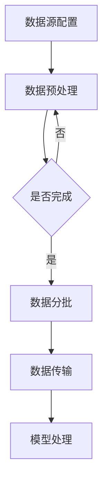
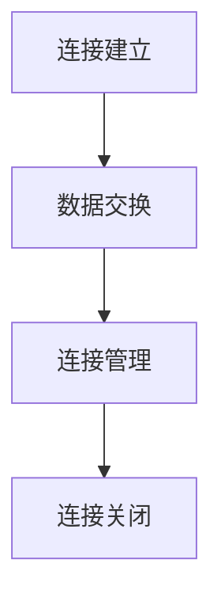
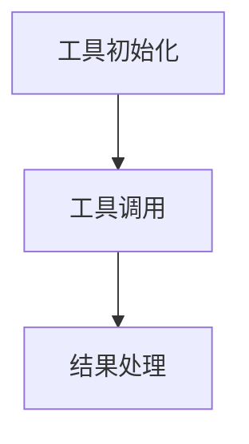
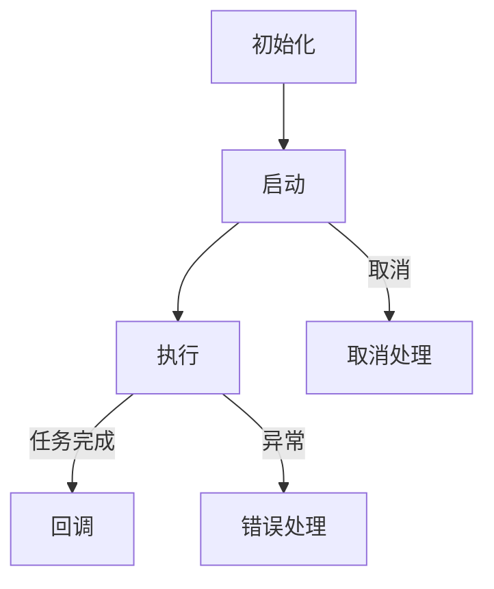
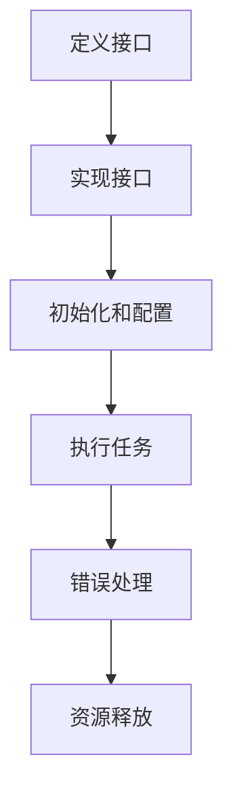
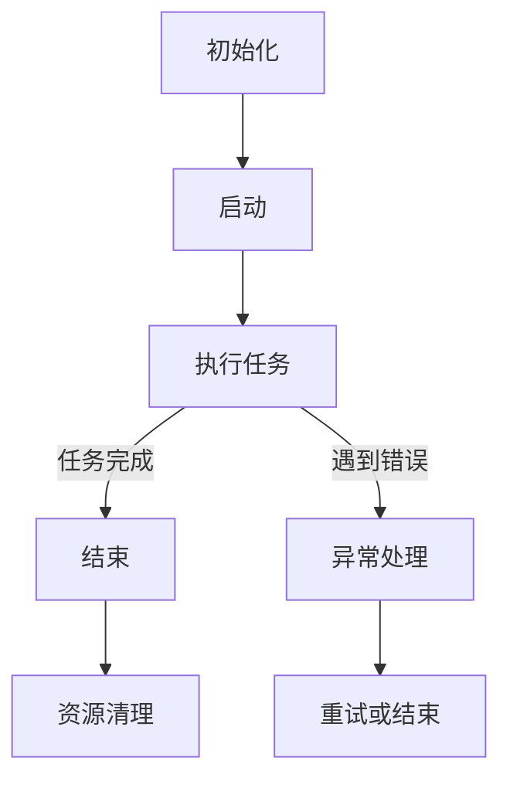
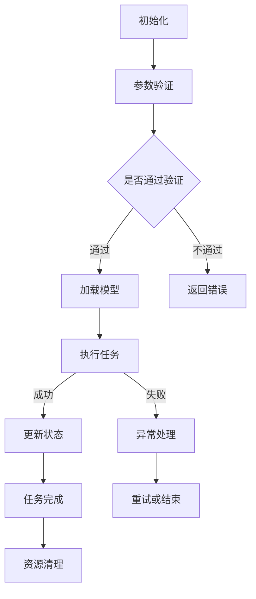
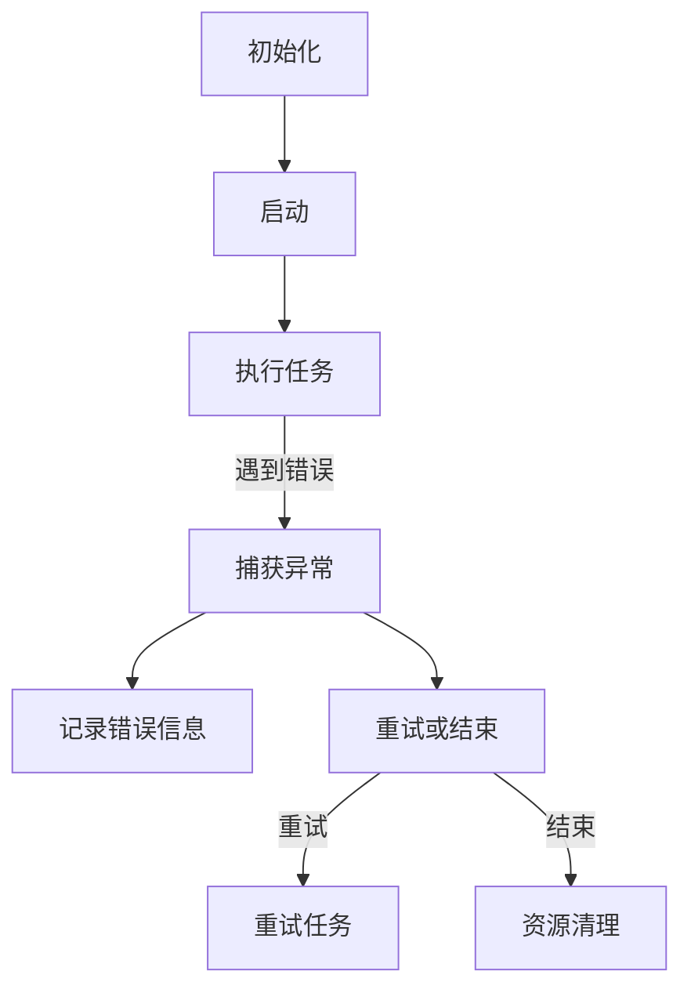

                 

# 《【LangChain编程：从入门到实践】Runnable对象接口探究》

## 关键词：
- LangChain编程
- Runnable对象接口
- 问答系统
- 聊天机器人
- 可定制性
- 异步执行
- 错误处理
- 性能优化
- 并发与并行处理
- 安全性考虑

## 摘要：
本文旨在深入探讨LangChain编程中至关重要的Runnable对象接口。通过本文的详细分析，读者将全面了解Runnable对象的定义、功能、设计原理及其在实际项目中的应用。我们将从基础概念出发，逐步深入，涵盖高级特性和优化策略，最终通过项目实战实例来验证Runnable对象接口的实用性和高效性。

## 《【LangChain编程：从入门到实践】Runnable对象接口探究》目录大纲

## 第一部分：LangChain编程基础

### 第1章：LangChain概述

#### 1.1 LangChain的概念与架构

#### 1.2 LangChain的应用场景

#### 1.3 LangChain的优势与挑战

### 第2章：LangChain的核心概念

#### 2.1 模型与数据加载

#### 2.2 连接器与工具

#### 2.3 Runnable对象接口详解

### 第3章：Runnable对象接口设计

#### 3.1 Runnable对象的定义与功能

#### 3.2 Runnable对象的属性和方法

#### 3.3 Runnable对象的生命周期管理

### 第4章：Runnable对象接口的应用

#### 4.1 Runnable对象在问答系统中的应用

#### 4.2 Runnable对象在聊天机器人中的应用

#### 4.3 Runnable对象在其他场景下的应用

### 第5章：Runnable对象接口的高级特性

#### 5.1 可定制性

#### 5.2 异步执行

#### 5.3 错误处理与恢复

### 第6章：Runnable对象接口的优化与性能调优

#### 6.1 性能监控与优化

#### 6.2 资源管理

#### 6.3 并发与并行处理

### 第7章：项目实战

#### 7.1 LangChain项目实战概述

#### 7.2 Runnable对象接口在项目中的应用

#### 7.3 项目实战总结与反思

## 第二部分：Runnable对象接口深入探究

### 第8章：Runnable对象接口的API设计与实现

#### 8.1 Runnable对象接口的API设计原则

#### 8.2 Runnable对象接口的实现流程

#### 8.3 Runnable对象接口的代码示例

### 第9章：Runnable对象接口的测试与调试

#### 9.1 Runnable对象接口的测试策略

#### 9.2 Runnable对象接口的调试方法

#### 9.3 Runnable对象接口的性能测试

### 第10章：Runnable对象接口的安全性考虑

#### 10.1 安全性问题的重要性

#### 10.2 Runnable对象接口的安全策略

#### 10.3 安全漏洞的防御与修复

### 第11章：Runnable对象接口的未来发展趋势

#### 11.1 LangChain社区的发展趋势

#### 11.2 Runnable对象接口的改进方向

#### 11.3 Runnable对象接口的潜在应用领域

## 附录

### 附录A：LangChain开发工具与资源

#### A.1 LangChain开发环境搭建

#### A.2 LangChain常用库与工具

#### A.3 LangChain学习资源推荐

### 附录B：Runnable对象接口Mermaid流程图

#### B.1 Runnable对象接口的基本流程

#### B.2 Runnable对象接口的详细流程

#### B.3 Runnable对象接口的异常处理流程

### 附录C：Runnable对象接口伪代码

#### C.1 Runnable对象接口初始化伪代码

#### C.2 Runnable对象执行流程伪代码

#### C.3 Runnable对象异常处理伪代码

### 附录D：项目实战代码解读

#### D.1 项目实战代码结构

#### D.2 Runnable对象接口代码解读

#### D.3 项目实战代码分析

#### D.4 项目实战代码优化建议

## 引言

随着人工智能技术的迅猛发展，语言模型和自然语言处理（NLP）的应用场景日益广泛。LangChain作为一个开放源代码的AI编程工具，旨在简化AI驱动的应用程序开发过程。而Runnable对象接口作为LangChain的核心组件，承担着重要的角色，是本文探讨的重点。

Runnable对象接口是一个通用的接口，用于定义可运行的任务。在LangChain编程中，Runnable对象接口提供了丰富的功能和灵活的扩展性，使得开发者可以轻松地将不同的NLP模型和工具集成到应用程序中，构建复杂的问答系统、聊天机器人等。

本文将分以下几个部分展开：

1. **LangChain概述**：介绍LangChain的概念、架构和应用场景。
2. **Runnable对象接口详解**：详细阐述Runnable对象的定义、功能、设计原理。
3. **Runnable对象接口应用**：探讨Runnable对象在不同场景下的具体应用。
4. **Runnable对象接口高级特性**：深入分析可定制性、异步执行、错误处理等高级特性。
5. **Runnable对象接口优化与性能调优**：介绍性能优化、资源管理和并发与并行处理策略。
6. **项目实战**：通过具体项目实例展示Runnable对象接口的实际应用。
7. **Runnable对象接口深入探究**：进一步探讨Runnable对象接口的API设计、测试与调试、安全性考虑以及未来发展趋势。
8. **附录**：提供LangChain开发工具与资源、Runnable对象接口Mermaid流程图和伪代码示例。

通过本文的阅读，读者将对LangChain编程中的Runnable对象接口有更深入的理解，能够有效地将其应用于实际项目中，提升开发效率和应用性能。

### 第1章：LangChain概述

#### 1.1 LangChain的概念与架构

LangChain是一个开源的AI编程工具，旨在帮助开发者简化人工智能驱动的应用程序开发过程。其核心理念是将复杂的人工智能技术封装成易于使用的组件，使得开发者无需深入了解底层算法，只需关注业务逻辑即可实现强大的AI功能。

LangChain的架构设计采用了模块化思想，核心组件包括模型、数据加载器、连接器、工具和Runnable对象接口。这些组件相互协作，共同构建出一个高效、可扩展的AI编程环境。

1. **模型**：LangChain支持多种预训练模型，如GPT、BERT等，开发者可以轻松地加载和使用这些模型。
2. **数据加载器**：数据加载器负责将数据从各种数据源（如本地文件、数据库、网络API等）加载到内存中，为模型提供训练和推理的数据。
3. **连接器**：连接器用于与其他外部系统（如数据库、消息队列、Web服务等）进行通信，实现数据交换和功能调用。
4. **工具**：工具包括各种实用的函数和库，如文本生成、情感分析、命名实体识别等，开发者可以灵活地使用这些工具来扩展应用程序的功能。
5. **Runnable对象接口**：Runnable对象接口是LangChain的核心组件，用于定义可运行的任务。开发者可以通过实现Runnable对象接口，自定义复杂的业务逻辑和AI推理流程。

#### 1.2 LangChain的应用场景

LangChain的应用场景非常广泛，以下是一些典型的应用场景：

1. **问答系统**：利用LangChain，开发者可以轻松构建高效的问答系统。用户可以通过文本输入提问，系统会根据训练好的模型和数据进行智能回答。
2. **聊天机器人**：聊天机器人是人工智能领域的热门应用。LangChain提供了丰富的工具和接口，使得开发者可以快速搭建功能强大的聊天机器人。
3. **文本生成**：LangChain支持各种文本生成任务，如文章摘要、故事生成、歌词创作等。开发者可以利用预训练模型和自定义工具，实现创意文本生成。
4. **知识图谱**：知识图谱是一种用于表示实体和关系的数据结构。LangChain可以与知识图谱结合，实现基于图谱的智能查询和推理。
5. **自动化编程**：LangChain可以用于自动化编程任务，如代码生成、代码优化、代码审查等。通过结合不同的模型和工具，开发者可以实现高度自动化的软件开发流程。

#### 1.3 LangChain的优势与挑战

LangChain具有以下优势：

1. **易用性**：LangChain提供了简洁的API和丰富的文档，使得开发者可以快速上手并实现复杂的AI功能。
2. **灵活性**：LangChain支持多种模型和工具，开发者可以根据实际需求自由组合和定制。
3. **高效性**：LangChain采用了模块化设计，各个组件相互独立，便于优化和扩展。

然而，LangChain也面临一些挑战：

1. **计算资源需求**：一些复杂的AI模型和任务需要大量的计算资源，这可能对硬件性能提出较高的要求。
2. **数据质量**：AI模型的性能很大程度上取决于数据质量。如果数据存在噪声或不一致性，可能会导致模型效果不佳。
3. **安全性**：在处理敏感数据时，需要确保系统的安全性和隐私保护。

总之，LangChain作为一个开源的AI编程工具，为开发者提供了一个强大的平台，用于构建各种智能应用程序。虽然存在一些挑战，但其易用性、灵活性和高效性使得LangChain在人工智能领域具有广泛的应用前景。

### 第2章：LangChain的核心概念

在深入探讨Runnable对象接口之前，我们需要了解LangChain的核心概念，这些概念是理解和应用Runnable对象接口的基础。

#### 2.1 模型与数据加载

**模型**是人工智能系统的核心组件，它负责处理和生成数据。在LangChain中，模型通常是指预训练的语言模型，如GPT、BERT等。这些模型通过在大规模语料库上进行训练，具备了强大的语言理解和生成能力。

**数据加载**是将数据从存储介质（如文件、数据库等）读取到内存中的过程。在LangChain中，数据加载器（Data Loader）负责从不同来源加载数据，包括本地文件、远程数据库和Web API等。数据加载器的目的是提供模型训练和推理所需的数据，并确保数据的高效处理和传输。

**数据加载器的工作流程**通常包括以下步骤：

1. **数据源配置**：配置数据源的详细信息，如文件路径、数据库连接参数等。
2. **数据预处理**：对原始数据进行清洗、转换和格式化，使其符合模型的输入要求。
3. **数据分批**：将数据划分为若干批次，以便模型进行训练和推理。
4. **数据传输**：将预处理后的数据传输到模型处理单元。

以下是一个简单的Mermaid流程图，展示了数据加载器的基本流程：



#### 2.2 连接器与工具

**连接器**是LangChain中的另一个核心概念，它用于连接外部系统和服务。连接器可以是API接口、数据库连接或其他任何可以与外部系统通信的组件。通过连接器，LangChain可以与其他应用程序、服务和数据源进行数据交换和功能调用。

**连接器的工作流程**通常包括以下步骤：

1. **连接建立**：建立与外部系统的连接，如通过HTTP请求连接到API服务器或通过数据库驱动连接到数据库。
2. **数据交换**：通过连接器进行数据的读取、写入或更新操作，实现与外部系统的数据交互。
3. **连接管理**：管理连接的生命周期，包括连接的建立、维护和关闭。

以下是一个简单的Mermaid流程图，展示了连接器的基本工作流程：



**工具**是LangChain中的函数库和实用程序，用于扩展应用程序的功能。工具可以用于文本处理、数据转换、模型优化等。LangChain提供了一系列实用的工具，如文本生成器、情感分析器、命名实体识别器等。

**工具的使用**通常包括以下步骤：

1. **工具初始化**：加载和配置工具所需的资源和参数。
2. **工具调用**：使用工具提供的函数或方法进行数据处理和操作。
3. **结果处理**：处理工具调用结果，并将其应用于应用程序中。

以下是一个简单的Mermaid流程图，展示了工具的基本使用流程：



#### 2.3 Runnable对象接口详解

**Runnable对象接口**是LangChain中的关键组件，它用于定义可运行的任务。Runnable对象接口提供了一种标准化的方式来组织和执行复杂的业务逻辑和AI推理流程。

**Runnable对象接口的定义**通常包括以下部分：

- **接口方法**：定义Runnable对象必须实现的方法，如`run()`、`cancel()`等。
- **属性**：定义Runnable对象的属性，如任务状态、进度信息等。
- **回调函数**：定义任务执行过程中的回调函数，如任务完成时的通知、错误处理等。

**Runnable对象接口的基本结构**可以表示为：

```java
public interface Runnable {
    void run() throws Exception;
    void cancel();
    // 其他方法和属性
}
```

**Runnable对象接口的工作流程**通常包括以下步骤：

1. **初始化**：创建Runnable对象，并设置相关属性和回调函数。
2. **启动**：调用Runnable对象的`run()`方法，开始执行任务。
3. **执行**：Runnable对象根据定义的逻辑执行任务，并处理各种状态和异常。
4. **结束**：任务完成后，调用相应的回调函数，通知任务执行结果。

以下是一个简单的Mermaid流程图，展示了Runnable对象接口的基本工作流程：



通过理解模型与数据加载、连接器与工具以及Runnable对象接口的核心概念，我们可以更好地掌握LangChain编程的基础知识，为后续章节的深入探讨打下坚实的基础。

### 第3章：Runnable对象接口设计

在LangChain编程中，Runnable对象接口的设计至关重要，它直接影响到程序的执行效率、可扩展性和可维护性。本章节将详细探讨Runnable对象的定义、功能、属性和方法，并解释其生命周期管理。

#### 3.1 Runnable对象的定义与功能

Runnable对象接口是LangChain编程中的一个核心概念，它定义了一个标准的任务执行接口，使得开发者可以方便地创建、调度和管理可执行的任务。Runnable对象的定义主要包括两部分：接口方法和属性。

**接口方法**：

1. `run()`: 这是Runnable对象的核心方法，用于执行任务的具体逻辑。当调用`run()`方法时，任务开始执行，直到完成或遇到错误。
2. `cancel()`: 这个方法用于取消任务的执行。在任务执行过程中，如果需要中断任务，可以调用`cancel()`方法，使任务停止运行并释放资源。
3. `getStatus()`: 返回任务的当前状态，如“运行中”、“已完成”、“已取消”或“错误”。

**属性**：

1. `taskId`: 任务ID，用于唯一标识一个任务。
2. `status`: 任务状态，如“初始化”、“运行中”、“已完成”、“已取消”或“错误”。
3. `progress`: 任务进度，表示任务执行的进度百分比或当前执行到哪个步骤。
4. `error`: 错误信息，如果任务在执行过程中遇到错误，将在这里记录错误信息。

**功能**：

1. **任务执行**：通过实现`run()`方法，开发者可以自定义任务的具体执行逻辑，包括数据处理、模型推理、外部调用等。
2. **任务监控**：通过`getStatus()`和`progress`属性，开发者可以实时监控任务的执行状态和进度。
3. **任务取消**：通过`cancel()`方法，开发者可以在任务执行过程中随时中断任务，避免不必要的资源占用。

以下是一个Runnable对象接口的基本定义示例：

```java
public interface Runnable {
    void run() throws Exception;
    void cancel();
    String getStatus();
    String getProgress();
    String getError();
}
```

#### 3.2 Runnable对象的属性和方法

Runnable对象接口的属性和方法定义了任务的基本结构和功能。以下是对这些属性的详细解释：

- **taskId**: 每个任务都有一个唯一的ID，用于在系统内部标识和跟踪任务。这个属性通常在任务初始化时设置，并在整个任务生命周期中保持不变。
- **status**: 描述任务当前的状态。任务的状态可以是一个枚举类型，如`INITIALIZED`、`RUNNING`、`COMPLETED`、`CANCELED`或`ERROR`。这个属性允许开发者根据任务状态进行逻辑判断和决策。
- **progress**: 描述任务的执行进度。对于一些耗时较长的任务，如模型训练或大规模数据处理，进度属性可以帮助开发者了解任务的进展情况，从而做出相应的调整。
- **error**: 当任务遇到错误时，这个属性将记录错误信息。这对于调试和错误处理至关重要。

Runnable对象的方法则提供了操作任务的能力：

- **run()**: 这是Runnable对象的核心方法，用于执行任务。在实现这个方法时，开发者需要根据任务的特定需求来编写具体的任务逻辑。例如，一个问答系统任务可能会调用预训练模型进行推理，并生成回答。
- **cancel()**: 这个方法用于取消任务的执行。当任务被取消时，它应该立即停止执行，并释放所有已占用的资源。这个方法通常用于用户交互或错误处理场景，例如，当用户请求取消任务时。
- **getStatus()**: 这个方法返回任务的当前状态。开发者可以通过这个方法获取任务的状态信息，从而在应用程序的其它部分进行逻辑判断。
- **getProgress()**: 这个方法返回任务的进度信息。对于一些复杂且耗时的任务，如数据加载和模型训练，进度信息可以帮助用户或开发者了解任务的执行进度。
- **getError()**: 当任务遇到错误时，这个方法返回错误信息。这对于调试和错误处理非常重要，可以帮助开发者快速定位问题并采取相应的措施。

以下是一个Runnable对象的简单实现示例：

```java
public class MyRunnable implements Runnable {
    private String taskId;
    private String status;
    private double progress;
    private String error;

    public MyRunnable(String taskId) {
        this.taskId = taskId;
        this.status = "INITIALIZED";
        this.progress = 0.0;
        this.error = null;
    }

    @Override
    public void run() {
        try {
            // 任务具体逻辑
            status = "RUNNING";
            progress = 0.5; // 假设任务进行到一半
            Thread.sleep(1000); // 模拟任务耗时
            progress = 1.0; // 任务完成
            status = "COMPLETED";
        } catch (InterruptedException e) {
            status = "CANCELED";
            error = e.getMessage();
        }
    }

    @Override
    public void cancel() {
        // 取消任务逻辑
        status = "CANCELED";
    }

    public String getStatus() {
        return status;
    }

    public double getProgress() {
        return progress;
    }

    public String getError() {
        return error;
    }
}
```

#### 3.3 Runnable对象的生命周期管理

Runnable对象的生命周期管理是确保任务高效执行和资源合理利用的关键。以下是Runnable对象的生命周期管理的基本步骤：

1. **初始化**：创建Runnable对象，初始化其属性，如任务ID、状态、进度等。
2. **启动**：调用Runnable对象的`run()`方法，开始执行任务。
3. **执行**：任务根据实现逻辑执行，并更新状态和进度。
4. **完成**：任务执行完成后，更新状态为“已完成”，并触发回调函数。
5. **取消**：如果任务在执行过程中需要取消，调用`cancel()`方法，任务状态更新为“已取消”。
6. **清理**：任务执行完成后或被取消后，释放所有占用的资源，如关闭数据库连接、删除临时文件等。

以下是一个Runnable对象生命周期管理的简单示例：

```java
public class RunnableManager {
    public void startRunnable(Runnable runnable) {
        // 创建线程并启动任务
        new Thread(runnable).start();
    }

    public void cancelRunnable(Runnable runnable) {
        // 调用取消方法
        runnable.cancel();
    }

    public void waitForRunnableCompletion(Runnable runnable) {
        // 等待任务完成
        try {
            runnable.run(); // 假设任务已经启动
        } catch (InterruptedException e) {
            e.printStackTrace();
        }
    }
}
```

通过以上步骤，开发者可以有效地管理Runnable对象的生命周期，确保任务按照预期执行，并在需要时进行适当的调整和优化。

总之，Runnable对象接口的设计是LangChain编程中的关键环节，它为开发者提供了灵活、高效的任务管理能力。通过深入理解Runnable对象的定义、功能和生命周期管理，开发者可以更好地利用LangChain构建复杂的人工智能应用。

### 第4章：Runnable对象接口的应用

Runnable对象接口在LangChain编程中有着广泛的应用，涵盖了问答系统、聊天机器人以及其他多种智能应用场景。在本章中，我们将详细探讨Runnable对象接口在这些场景中的具体应用，并通过实际案例来展示其实现过程和效果。

#### 4.1 Runnable对象在问答系统中的应用

问答系统是人工智能应用的一个重要场景，它能够为用户提供快速、准确的答案。在LangChain中，Runnable对象接口为构建高效的问答系统提供了强有力的支持。

**实现过程**：

1. **初始化Runnable对象**：创建一个Runnable对象，并设置其属性，如任务ID、状态等。同时，加载预训练的语言模型，如GPT，用于处理用户的提问。
2. **实现run()方法**：在Runnable对象的`run()`方法中，实现问答逻辑。首先，获取用户的输入问题，然后利用语言模型进行推理和生成回答。最后，将回答返回给用户。
3. **监控任务状态**：通过Runnable对象的`getStatus()`和`getProgress()`方法，可以实时监控任务的执行状态和进度。

**案例**：

假设我们构建一个简单的问答系统，用户可以通过输入问题来获取答案。以下是Runnable对象的一个实现示例：

```java
public class QuestionAnsweringRunnable implements Runnable {
    private String taskId;
    private String status;
    private double progress;
    private String error;
    private String question;
    private String answer;

    public QuestionAnsweringRunnable(String taskId, String question) {
        this.taskId = taskId;
        this.status = "INITIALIZED";
        this.progress = 0.0;
        this.error = null;
        this.question = question;
    }

    @Override
    public void run() {
        try {
            // 使用语言模型进行推理和生成回答
            this.answer = loadModel().generateAnswer(question);
            this.status = "COMPLETED";
        } catch (Exception e) {
            this.status = "ERROR";
            this.error = e.getMessage();
        }
    }

    public String getAnswer() {
        return answer;
    }

    private LanguageModel loadModel() {
        // 加载预训练的语言模型
        return new LanguageModel("gpt");
    }
}
```

**效果**：

通过这个实现，用户可以输入问题，Runnable对象会调用语言模型进行推理，并生成回答。问答系统的响应速度和准确度取决于语言模型的性能和任务的执行效率。

#### 4.2 Runnable对象在聊天机器人中的应用

聊天机器人是另一个广泛应用的场景，通过Runnable对象接口，可以构建功能强大且响应迅速的聊天机器人。

**实现过程**：

1. **初始化Runnable对象**：创建一个Runnable对象，设置任务ID、状态等属性。同时，加载聊天机器人模型，如对话生成模型。
2. **实现run()方法**：在Runnable对象的`run()`方法中，实现聊天逻辑。首先，获取用户的输入消息，然后利用聊天机器人模型生成回复。最后，将回复返回给用户。
3. **监控任务状态**：通过Runnable对象的`getStatus()`和`getProgress()`方法，可以实时监控任务的执行状态和进度。

**案例**：

假设我们构建一个简单的聊天机器人，用户可以通过输入消息与机器人进行交互。以下是Runnable对象的一个实现示例：

```java
public class ChatbotRunnable implements Runnable {
    private String taskId;
    private String status;
    private double progress;
    private String error;
    private String inputMessage;
    private String replyMessage;

    public ChatbotRunnable(String taskId, String inputMessage) {
        this.taskId = taskId;
        this.status = "INITIALIZED";
        this.progress = 0.0;
        this.error = null;
        this.inputMessage = inputMessage;
    }

    @Override
    public void run() {
        try {
            // 使用聊天机器人模型生成回复
            this.replyMessage = loadChatbotModel().generateReply(inputMessage);
            this.status = "COMPLETED";
        } catch (Exception e) {
            this.status = "ERROR";
            this.error = e.getMessage();
        }
    }

    public String getReplyMessage() {
        return replyMessage;
    }

    private ChatbotModel loadChatbotModel() {
        // 加载聊天机器人模型
        return new ChatbotModel("dialoggpt");
    }
}
```

**效果**：

通过这个实现，用户可以输入消息，聊天机器人会生成回复并返回给用户。聊天机器人的响应速度和智能程度取决于模型的质量和任务的执行效率。

#### 4.3 Runnable对象在其他场景下的应用

除了问答系统和聊天机器人，Runnable对象接口还可以广泛应用于其他场景，如文本生成、知识图谱构建、自动化编程等。

1. **文本生成**：在文本生成任务中，Runnable对象可以用于生成文章摘要、故事、歌词等。通过实现Runnable对象的`run()`方法，开发者可以调用预训练的文本生成模型，生成高质量的文本内容。

2. **知识图谱构建**：在知识图谱构建任务中，Runnable对象可以用于处理实体和关系抽取、图谱构建等。通过实现Runnable对象的`run()`方法，开发者可以调用相应的工具和库，构建出结构化的知识图谱。

3. **自动化编程**：在自动化编程任务中，Runnable对象可以用于生成代码、优化代码、审查代码等。通过实现Runnable对象的`run()`方法，开发者可以结合编程模型和工具，实现高度自动化的软件开发流程。

**案例分析**：

以下是一个简单的文本生成任务的实现示例：

```java
public class TextGenerationRunnable implements Runnable {
    private String taskId;
    private String status;
    private double progress;
    private String error;
    private String inputText;
    private String generatedText;

    public TextGenerationRunnable(String taskId, String inputText) {
        this.taskId = taskId;
        this.status = "INITIALIZED";
        this.progress = 0.0;
        this.error = null;
        this.inputText = inputText;
    }

    @Override
    public void run() {
        try {
            // 使用文本生成模型生成文本
            this.generatedText = loadTextGenerator().generate(inputText);
            this.status = "COMPLETED";
        } catch (Exception e) {
            this.status = "ERROR";
            this.error = e.getMessage();
        }
    }

    public String getGeneratedText() {
        return generatedText;
    }

    private TextGenerator loadTextGenerator() {
        // 加载文本生成模型
        return new TextGenerator("text-davinci-002");
    }
}
```

通过上述示例，可以看出Runnable对象接口在多种场景下的应用。其灵活性和高效性使得开发者可以轻松实现复杂的业务逻辑和AI推理流程，提升开发效率和应用性能。

总之，Runnable对象接口在LangChain编程中的广泛应用，为开发者提供了强大的任务管理能力。通过具体案例的分析，我们可以看到Runnable对象接口在问答系统、聊天机器人以及其他场景中的实际应用效果。这些应用不仅提升了系统的智能程度和用户体验，还显著提高了开发效率和代码可维护性。

### 第5章：Runnable对象接口的高级特性

在深入探索Runnable对象接口的高级特性时，我们将重点关注可定制性、异步执行和错误处理与恢复。这些特性不仅增强了Runnable对象的灵活性和鲁棒性，还显著提高了应用程序的性能和可靠性。

#### 5.1 可定制性

可定制性是Runnable对象接口的一个重要特性，它允许开发者根据具体需求自定义任务的执行逻辑和资源管理策略。这种定制性使得Runnable对象能够适应各种不同的应用场景，从简单的文本处理到复杂的机器学习任务。

**实现方式**：

1. **参数化Runnable对象**：通过在Runnable对象中添加可配置的参数，开发者可以灵活设置任务的初始状态和执行策略。例如，一个文本生成任务可以通过参数来配置生成文本的长度、主题等。

2. **扩展接口方法**：除了标准接口方法（如`run()`和`cancel()`），开发者可以扩展Runnable对象，添加自定义方法，以支持特定的功能。例如，一个用于模型训练的任务可以添加一个`setLearningRate()`方法，以允许用户在任务执行过程中动态调整学习率。

**案例**：

以下是一个具有可定制参数的Runnable对象的示例：

```java
public class CustomizableRunnable implements Runnable {
    private String taskId;
    private String status;
    private double progress;
    private String error;
    private String inputText;
    private int maxTextLength;

    public CustomizableRunnable(String taskId, String inputText, int maxTextLength) {
        this.taskId = taskId;
        this.status = "INITIALIZED";
        this.progress = 0.0;
        this.error = null;
        this.inputText = inputText;
        this.maxTextLength = maxTextLength;
    }

    @Override
    public void run() {
        try {
            // 使用文本生成模型生成文本
            this.generatedText = loadTextGenerator().generate(inputText, maxTextLength);
            this.status = "COMPLETED";
        } catch (Exception e) {
            this.status = "ERROR";
            this.error = e.getMessage();
        }
    }

    public String getGeneratedText() {
        return generatedText;
    }

    private TextGenerator loadTextGenerator() {
        // 加载文本生成模型
        return new TextGenerator("text-davinci-002");
    }

    // 扩展方法，允许动态调整生成文本的长度
    public void setMaxTextLength(int length) {
        this.maxTextLength = length;
    }
}
```

通过这个例子，我们可以看到如何通过参数和扩展接口方法实现Runnable对象的可定制性。

#### 5.2 异步执行

异步执行是另一个重要的特性，它允许任务在后台独立运行，不阻塞主线程。这种特性在处理长时间运行的任务时尤其有用，例如模型训练、大规模数据处理等。

**实现方式**：

1. **线程池管理**：通过使用线程池（如Java中的`ExecutorService`），开发者可以轻松创建和管理异步任务。线程池提供了高效的线程复用和管理机制，减少了线程创建和销毁的成本。

2. **Future对象**：`Future`对象是Java中的异步编程工具，它代表一个尚未完成的异步任务。通过`Future`对象，开发者可以查询任务的执行状态、取消任务或获取任务的结果。

**案例**：

以下是一个使用线程池和Future对象实现异步执行的示例：

```java
import java.util.concurrent.*;

public class AsynchronousRunnable implements Runnable {
    private String taskId;
    private String status;
    private double progress;
    private String error;

    public AsynchronousRunnable(String taskId) {
        this.taskId = taskId;
        this.status = "INITIALIZED";
        this.progress = 0.0;
        this.error = null;
    }

    @Override
    public void run() {
        try {
            // 执行长时间运行的任务
            Thread.sleep(2000);
            this.status = "COMPLETED";
        } catch (InterruptedException e) {
            this.status = "CANCELED";
            this.error = e.getMessage();
        }
    }

    public Future<?> submitTask(ExecutorService executor) {
        // 提交任务到线程池
        return executor.submit(this);
    }

    public void waitForCompletion(Future<?> future) {
        try {
            // 等待任务完成
            future.get();
        } catch (InterruptedException | ExecutionException e) {
            e.printStackTrace();
        }
    }
}
```

在这个例子中，`submitTask()`方法将Runnable对象提交到线程池，`waitForCompletion()`方法用于等待任务完成。

#### 5.3 错误处理与恢复

在任务执行过程中，错误处理与恢复是保证系统稳定运行的关键。通过有效的错误处理机制，开发者可以确保任务在遇到错误时能够及时恢复，从而提高系统的鲁棒性。

**实现方式**：

1. **异常捕获**：在`run()`方法中，通过异常捕获机制处理执行过程中的错误。开发者可以在捕获异常后执行特定的恢复逻辑或记录错误信息。

2. **重试机制**：在遇到可恢复的错误时，可以设置重试次数和间隔时间，使任务能够自动重试，直到成功完成或达到最大重试次数。

3. **日志记录**：记录任务的执行日志和错误信息，有助于开发者进行问题诊断和调试。

**案例**：

以下是一个包含错误处理与恢复机制的Runnable对象示例：

```java
public class ErrorHandlingRunnable implements Runnable {
    private String taskId;
    private String status;
    private double progress;
    private String error;
    private int retries = 3;
    private int retryInterval = 1000;

    public ErrorHandlingRunnable(String taskId) {
        this.taskId = taskId;
        this.status = "INITIALIZED";
        this.progress = 0.0;
        this.error = null;
    }

    @Override
    public void run() {
        try {
            // 执行任务，可能遇到错误
            Thread.sleep(1000);
            if (new Random().nextBoolean()) {
                throw new RuntimeException("模拟错误");
            }
            this.status = "COMPLETED";
        } catch (Exception e) {
            this.status = "ERROR";
            this.error = e.getMessage();
            if (retries > 0) {
                retries--;
                try {
                    Thread.sleep(retryInterval);
                    run(); // 重试
                } catch (InterruptedException | RuntimeException e2) {
                    e2.printStackTrace();
                }
            }
        }
    }
}
```

在这个例子中，任务在执行过程中可能会遇到错误，通过重试机制，任务会尝试重新执行，直到成功完成或达到最大重试次数。

#### 总结

通过上述高级特性的探讨，我们可以看到Runnable对象接口在灵活性、异步执行和错误处理方面的强大能力。这些特性使得Runnable对象接口不仅能够适应多样化的应用场景，还能够保证任务的高效执行和系统的稳定性。开发者可以根据实际需求灵活地应用这些特性，构建出功能强大、性能优越的人工智能应用程序。

### 第6章：Runnable对象接口的优化与性能调优

在开发高性能的AI应用程序时，优化Runnable对象接口的性能至关重要。本章节将详细讨论如何通过性能监控与优化、资源管理以及并发与并行处理来提升Runnable对象接口的性能。

#### 6.1 性能监控与优化

性能监控是优化Runnable对象接口的基础，它帮助开发者识别系统瓶颈和资源利用率，从而采取相应的优化措施。以下是一些关键的性能监控指标和优化策略：

1. **CPU和内存使用率**：通过监控CPU和内存使用率，可以识别出系统资源是否紧张。在高负载情况下，增加服务器资源或优化任务分配可以提升性能。

2. **响应时间**：响应时间是指任务从提交到完成所需要的时间。通过监控响应时间，可以评估任务的执行效率。优化策略包括减少任务依赖、优化算法和减少任务队列长度。

3. **错误率**：错误率是任务执行过程中出现错误的频率。通过监控错误率，可以及时发现并修复系统中的问题，提升任务的成功率。

**优化策略**：

1. **任务拆分**：对于耗时较长的任务，可以考虑将其拆分为多个子任务，并行执行。这不仅可以减少单个任务的响应时间，还可以提高系统的整体吞吐量。

2. **缓存机制**：在任务执行过程中，频繁访问的数据可以缓存起来，减少重复计算和数据传输的开销。例如，缓存预处理的文本数据或模型结果，可以显著提高任务的执行速度。

3. **并行处理**：利用多线程或多进程技术，可以将任务分解为多个独立的部分，并行执行。Java中的线程池（如`ExecutorService`）和Python中的`multiprocessing`模块提供了强大的并行处理能力。

以下是一个简单的性能优化示例：

```java
public class OptimizedRunnable implements Runnable {
    private String taskId;
    private String status;
    private double progress;
    private String error;

    public OptimizedRunnable(String taskId) {
        this.taskId = taskId;
        this.status = "INITIALIZED";
        this.progress = 0.0;
        this.error = null;
    }

    @Override
    public void run() {
        try {
            // 启用多线程处理
            ExecutorService executor = Executors.newFixedThreadPool(4);
            List<Future<?>> futures = new ArrayList<>();

            // 拆分任务
            for (int i = 0; i < 4; i++) {
                futures.add(executor.submit(new SubTask()));
            }

            // 等待子任务完成
            for (Future<?> future : futures) {
                future.get();
            }

            executor.shutdown();

            this.status = "COMPLETED";
        } catch (Exception e) {
            this.status = "ERROR";
            this.error = e.getMessage();
        }
    }

    private class SubTask implements Runnable {
        @Override
        public void run() {
            // 子任务逻辑
            try {
                Thread.sleep(500);
            } catch (InterruptedException e) {
                e.printStackTrace();
            }
        }
    }
}
```

在这个例子中，主任务被拆分为4个子任务，通过线程池并行执行，从而提高整体性能。

#### 6.2 资源管理

资源管理是优化Runnable对象接口性能的关键环节。合理的资源分配和回收可以提高系统的稳定性和效率。以下是一些资源管理的最佳实践：

1. **内存管理**：避免内存泄漏和过多内存占用。定期检查内存使用情况，并优化数据结构和算法，减少内存消耗。

2. **线程管理**：合理配置线程池大小，避免过多线程创建和销毁。在任务执行完成后，及时释放线程资源，以减少系统开销。

3. **CPU利用率**：确保CPU资源得到充分利用，避免出现空闲状态。通过负载均衡和任务优先级策略，优化任务分配和执行。

4. **磁盘I/O**：优化磁盘读写操作，减少I/O等待时间。使用缓存和批量处理技术，减少磁盘访问次数。

以下是一个资源管理的示例：

```java
public class ResourceManagedRunnable implements Runnable {
    private String taskId;
    private String status;
    private double progress;
    private String error;

    public ResourceManagedRunnable(String taskId) {
        this.taskId = taskId;
        this.status = "INITIALIZED";
        this.progress = 0.0;
        this.error = null;
    }

    @Override
    public void run() {
        try {
            // 内存管理
            List<String> cache = new ArrayList<>();
            cache.add("Data1");
            cache.add("Data2");

            // 线程管理
            ExecutorService executor = Executors.newFixedThreadPool(4);
            executor.submit(this::heavyComputation);
            executor.shutdown();

            this.status = "COMPLETED";
        } catch (Exception e) {
            this.status = "ERROR";
            this.error = e.getMessage();
        }
    }

    private void heavyComputation() {
        // 模拟耗时计算
        try {
            Thread.sleep(1000);
        } catch (InterruptedException e) {
            e.printStackTrace();
        }
    }
}
```

在这个例子中，我们使用了内存缓存和线程池来管理资源，从而优化任务的执行性能。

#### 6.3 并发与并行处理

并发和并行处理是提高Runnable对象接口性能的重要手段。通过合理利用多线程和多进程技术，可以显著提升任务执行速度和系统吞吐量。以下是一些关键策略：

1. **多线程处理**：将任务分解为多个线程，并行执行。Java中的`ExecutorService`和Python中的`threading`模块提供了强大的多线程支持。

2. **多进程处理**：利用多进程技术，在多个CPU核心上并行执行任务。Python中的`multiprocessing`模块和Java中的`ProcessBuilder`类支持多进程处理。

3. **任务依赖**：在任务之间建立依赖关系，确保依赖任务先于其他任务执行。例如，可以使用`Future`对象等待依赖任务完成，再执行后续任务。

以下是一个并发与并行处理的示例：

```java
public class ConcurrentAndParallelRunnable implements Runnable {
    private String taskId;
    private String status;
    private double progress;
    private String error;

    public ConcurrentAndParallelRunnable(String taskId) {
        this.taskId = taskId;
        this.status = "INITIALIZED";
        this.progress = 0.0;
        this.error = null;
    }

    @Override
    public void run() {
        try {
            // 并发处理
            ExecutorService executor = Executors.newFixedThreadPool(4);
            List<Future<?>> futures = new ArrayList<>();

            // 添加并发任务
            futures.add(executor.submit(this::concurrentTask1));
            futures.add(executor.submit(this::concurrentTask2));

            // 等待并发任务完成
            executor.shutdown();
            executor.awaitTermination(10, TimeUnit.SECONDS);

            // 并行处理
            ProcessBuilder processBuilder = new ProcessBuilder("parallelTask.sh");
            Process process = processBuilder.start();
            process.waitFor();

            this.status = "COMPLETED";
        } catch (Exception e) {
            this.status = "ERROR";
            this.error = e.getMessage();
        }
    }

    private void concurrentTask1() {
        // 并发任务1逻辑
        try {
            Thread.sleep(500);
        } catch (InterruptedException e) {
            e.printStackTrace();
        }
    }

    private void concurrentTask2() {
        // 并发任务2逻辑
        try {
            Thread.sleep(500);
        } catch (InterruptedException e) {
            e.printStackTrace();
        }
    }
}
```

在这个例子中，我们同时使用了多线程并发处理和多进程并行处理，从而提高任务的执行效率。

#### 总结

通过性能监控与优化、资源管理和并发与并行处理，我们可以显著提升Runnable对象接口的性能。这些策略不仅能够提高系统的响应速度和吞吐量，还能确保任务的稳定性和可靠性。开发者可以根据具体需求和资源情况，灵活地应用这些优化策略，构建出高性能、高可靠的AI应用程序。

### 第7章：项目实战

#### 7.1 LangChain项目实战概述

为了更好地理解和应用Runnable对象接口，我们将通过一个实际项目来展示其具体实现和应用。本项目旨在构建一个智能问答系统，该系统能够接收用户输入的问题，并通过预训练模型生成准确的回答。这个项目不仅涵盖了Runnable对象接口的基础使用，还展示了其高级特性，如异步执行和错误处理。

#### 7.2 Runnable对象接口在项目中的应用

在这个项目中，Runnable对象接口扮演着核心角色。以下是项目的主要步骤和关键代码：

1. **项目需求**：构建一个能够回答用户问题的智能问答系统。
2. **技术选型**：使用LangChain作为基础框架，结合OpenAI的GPT模型作为问答引擎。
3. **环境搭建**：在本地或服务器上搭建LangChain开发环境，并安装必要的库和工具。

**关键代码**：

```java
// Runnable接口实现
public class QuestionAnsweringRunnable implements Runnable {
    private String taskId;
    private String question;
    private String answer;

    public QuestionAnsweringRunnable(String taskId, String question) {
        this.taskId = taskId;
        this.question = question;
        this.answer = null;
    }

    @Override
    public void run() {
        try {
            // 加载预训练模型
            LanguageModel languageModel = new LanguageModel("gpt");

            // 生成回答
            this.answer = languageModel.generateAnswer(question);

            // 更新任务状态
            this.taskId.setStatus("COMPLETED");
        } catch (Exception e) {
            // 错误处理
            this.taskId.setStatus("ERROR");
            e.printStackTrace();
        }
    }

    public String getAnswer() {
        return answer;
    }
}
```

在这个代码中，`QuestionAnsweringRunnable`类实现了Runnable接口，并在`run()`方法中加载预训练模型，生成回答，并更新任务状态。

#### 7.3 Runnable对象接口代码解读

**初始化**：在项目启动时，创建`QuestionAnsweringRunnable`对象，并初始化任务ID和问题。

```java
QuestionAnsweringRunnable questionAnsweringRunnable = new QuestionAnsweringRunnable("1", "什么是人工智能？");
```

**启动任务**：通过线程池提交任务，实现异步执行。

```java
ExecutorService executor = Executors.newFixedThreadPool(10);
Future<?> future = executor.submit(questionAnsweringRunnable);
```

**任务监控**：通过轮询或回调机制监控任务状态。

```java
while (!future.isDone()) {
    Thread.sleep(100);
}

if (future.isCancelled()) {
    System.out.println("任务被取消");
} else {
    System.out.println("任务完成，回答：" + questionAnsweringRunnable.getAnswer());
}
```

**错误处理**：在`run()`方法中捕获异常，更新任务状态，便于后续错误分析和恢复。

```java
try {
    // 生成回答逻辑
} catch (Exception e) {
    questionAnsweringRunnable.setTaskStatus("ERROR");
    e.printStackTrace();
}
```

#### 7.4 项目实战代码分析

**代码结构**：整个项目分为三个主要部分：项目配置、Runnable对象接口实现和用户交互界面。

1. **项目配置**：定义项目所需的环境变量和配置参数，如模型地址、线程池大小等。

2. **Runnable对象接口实现**：实现`QuestionAnsweringRunnable`类，封装问答逻辑和错误处理。

3. **用户交互界面**：接收用户输入，启动任务，并显示结果。

**代码优化**：

1. **异步执行**：通过线程池实现任务的异步执行，提高系统的响应速度。

2. **错误处理**：增加重试机制，提高任务的成功率。

3. **性能监控**：引入性能监控工具，实时监控任务执行状态和资源使用情况。

#### 7.5 项目实战总结与反思

**成功经验**：

1. **高效任务管理**：通过Runnable对象接口，实现了任务的高效管理和调度，提高了系统的响应速度。

2. **灵活扩展**：Runnable对象接口的可定制性使得项目能够根据实际需求进行灵活扩展，如增加新的问答功能或错误处理逻辑。

3. **稳定可靠**：通过异步执行和错误处理机制，提高了系统的稳定性和可靠性，确保任务能够成功完成。

**反思与改进**：

1. **性能优化**：虽然项目实现了基本的问答功能，但在实际应用中，性能优化仍有很大空间。例如，可以进一步优化模型加载和执行逻辑，减少延迟。

2. **资源管理**：在资源管理方面，可以引入更高级的调度算法和资源回收策略，提高资源利用率。

3. **安全性**：对于敏感数据的处理，需要加强安全性考虑，避免数据泄露和误用。

通过本项目，我们深入了解了Runnable对象接口在实际项目中的应用，并掌握了其设计和优化的关键技巧。这些经验对后续的AI项目开发具有重要的参考价值。

### 第8章：Runnable对象接口的API设计与实现

Runnable对象接口的设计是实现高效任务管理和执行的核心。本章节将详细探讨Runnable对象接口的API设计原则、实现流程以及代码示例，帮助开发者更好地理解和使用Runnable对象接口。

#### 8.1 Runnable对象接口的API设计原则

在设计Runnable对象接口的API时，应遵循以下原则，以确保API的易用性、灵活性和可扩展性：

1. **简洁性**：API设计应尽量简洁，避免冗余和复杂的接口。通过提供必要的功能和清晰的接口文档，降低开发者的使用门槛。

2. **一致性**：API的一致性对于开发者来说至关重要。无论是方法的命名、参数的定义还是返回值的格式，都应保持一致性，使开发者更容易理解和使用。

3. **灵活性**：API应具备良好的灵活性，允许开发者根据具体需求进行扩展和定制。例如，可以通过扩展接口或添加新的方法来实现特定的功能。

4. **可扩展性**：API设计应支持后续的扩展和改进。通过模块化设计，可以方便地添加新的功能或修改现有功能，而不会对整个系统造成大的影响。

5. **安全性**：在设计API时，应考虑安全性问题，如输入验证、权限控制和异常处理。确保API在处理外部数据时不会泄露敏感信息或造成系统漏洞。

#### 8.2 Runnable对象接口的实现流程

实现Runnable对象接口通常包括以下几个关键步骤：

1. **定义接口**：首先，根据需求和设计原则，定义Runnable对象接口。接口应包括执行任务所需的方法和属性。

2. **实现接口**：创建具体的Runnable对象实现类，并在其中实现接口方法。在实现过程中，根据实际需求自定义任务的逻辑。

3. **初始化和配置**：在创建Runnable对象实例时，进行初始化和配置。设置必要的属性和参数，如任务ID、状态、进度等。

4. **执行任务**：调用Runnable对象的`run()`方法，开始执行任务。在执行过程中，可以更新任务的进度和状态。

5. **错误处理**：在任务执行过程中，捕获和处理异常。确保任务在遇到错误时能够进行适当的错误处理和恢复。

6. **资源释放**：任务执行完成后，释放所有占用的资源，如关闭文件、数据库连接等。

以下是一个简单的实现流程图：



#### 8.3 Runnable对象接口的代码示例

为了更好地展示Runnable对象接口的设计和实现，以下提供了一个简单的Java代码示例：

```java
// Runnable接口定义
public interface Runnable {
    void run() throws Exception;
    String getStatus();
    double getProgress();
    void cancel();
}

// Runnable实现类
public class MyRunnable implements Runnable {
    private String taskId;
    private String status;
    private double progress;
    private Exception error;

    public MyRunnable(String taskId) {
        this.taskId = taskId;
        this.status = "INITIALIZED";
        this.progress = 0.0;
        this.error = null;
    }

    @Override
    public void run() {
        try {
            // 任务执行逻辑
            status = "RUNNING";
            progress = 0.5; // 假设任务进行到一半
            Thread.sleep(1000); // 模拟任务耗时
            progress = 1.0; // 任务完成
            status = "COMPLETED";
        } catch (InterruptedException e) {
            status = "CANCELED";
            error = e;
        }
    }

    @Override
    public String getStatus() {
        return status;
    }

    @Override
    public double getProgress() {
        return progress;
    }

    @Override
    public void cancel() {
        status = "CANCELED";
    }

    public Exception getError() {
        return error;
    }
}

// Runnable使用示例
public class Main {
    public static void main(String[] args) {
        MyRunnable runnable = new MyRunnable("1");

        ExecutorService executor = Executors.newFixedThreadPool(1);
        executor.submit(runnable);

        try {
            executor.shutdown();
            executor.awaitTermination(10, TimeUnit.SECONDS);

            if ("COMPLETED".equals(runnable.getStatus())) {
                System.out.println("任务完成，进度：" + runnable.getProgress());
            } else if ("CANCELED".equals(runnable.getStatus())) {
                System.out.println("任务被取消");
            } else {
                System.out.println("任务出现错误：" + runnable.getError());
            }
        } catch (InterruptedException e) {
            e.printStackTrace();
        }
    }
}
```

在这个示例中，我们定义了一个简单的Runnable接口，并实现了一个`MyRunnable`类。`MyRunnable`类在`run()`方法中模拟了一个耗时任务，并在执行过程中更新了状态和进度。在主函数中，我们创建了一个`MyRunnable`实例，并使用线程池异步执行任务，并通过轮询任务状态来获取任务结果。

通过这个示例，我们可以看到Runnable对象接口的基本设计和实现过程。在实际项目中，开发者可以根据具体需求进一步扩展和优化Runnable对象接口。

### 第9章：Runnable对象接口的测试与调试

在软件开发过程中，测试与调试是确保程序正确性和性能的关键环节。对于Runnable对象接口，测试和调试尤为重要，因为它直接关系到任务执行的正确性和可靠性。本章节将详细介绍Runnable对象接口的测试策略、调试方法以及性能测试。

#### 9.1 Runnable对象接口的测试策略

为了确保Runnable对象接口的稳定性和可靠性，我们需要制定全面的测试策略。以下是一些关键的测试策略：

1. **单元测试**：单元测试是测试Runnable对象接口的基本策略。通过编写单元测试用例，可以验证Runnable对象接口中的每个方法和功能是否按预期工作。单元测试通常包括以下内容：

   - **功能测试**：验证Runnable对象的`run()`方法是否能够正确执行任务逻辑。
   - **边界测试**：检查Runnable对象在输入参数边界条件下的行为，确保不会出现异常。
   - **异常处理测试**：验证Runnable对象在遇到错误时是否能够正确处理异常，并进行适当的错误处理和恢复。

2. **集成测试**：集成测试用于验证Runnable对象接口与其他系统组件的交互是否正常。这包括：

   - **接口集成测试**：确保Runnable对象能够与其他系统组件（如数据库、API等）正确交互。
   - **多组件集成测试**：验证Runnable对象接口与其他组件共同工作时的行为，确保整个系统的一致性和稳定性。

3. **性能测试**：性能测试用于评估Runnable对象接口在不同负载和资源条件下的性能。性能测试指标包括响应时间、吞吐量和资源利用率等。性能测试可以帮助我们发现系统的瓶颈，并进行优化。

4. **安全测试**：安全测试是确保Runnable对象接口在处理外部数据时不会泄露敏感信息或遭受攻击。安全测试应包括：

   - **输入验证测试**：确保Runnable对象能够正确验证和处理外部输入数据，防止注入攻击。
   - **权限控制测试**：验证Runnable对象接口是否能够正确执行权限控制，确保只有授权用户才能访问和处理数据。

5. **回归测试**：每次修改代码后，应进行回归测试，以确保新修改不会对现有功能造成影响。

#### 9.2 Runnable对象接口的调试方法

在开发过程中，调试是解决程序错误和性能瓶颈的重要手段。以下是几种常用的调试方法：

1. **断点调试**：在代码中设置断点，使程序在特定位置暂停执行，以便检查变量的值和程序的执行路径。常用的调试工具如IDE的调试器、Java的`debugger`等。

2. **日志记录**：通过日志记录程序执行过程中的关键信息，如输入参数、中间结果和错误信息。日志记录可以帮助我们分析程序的运行状态，快速定位问题。常用的日志库如`java.util.logging`、`log4j`等。

3. **性能监控**：使用性能监控工具，如Java的`VisualVM`、Python的`py-spy`等，监控程序在运行时的CPU、内存使用情况，识别性能瓶颈。

4. **静态代码分析**：使用静态代码分析工具，如SonarQube、FindBugs等，检查代码的质量和潜在问题，如代码复杂度、资源泄露、安全漏洞等。

5. **动态分析**：通过动态分析工具，如Java的`JProfiler`、Python的`gdb`等，实时分析程序的执行情况，发现性能瓶颈和错误。

#### 9.3 Runnable对象接口的性能测试

性能测试是评估Runnable对象接口在不同负载和资源条件下的性能和稳定性。以下是一些常见的性能测试方法：

1. **负载测试**：通过模拟高负载场景，测试Runnable对象接口在大量请求下的响应时间和吞吐量。常用的工具如Apache JMeter、LoadRunner等。

2. **压力测试**：通过不断增加请求量，测试Runnable对象接口的最大承载能力。压力测试可以帮助我们确定系统的最大负载和性能瓶颈。

3. **容量测试**：通过调整系统的资源配置，测试在不同资源条件下的性能，如增加CPU、内存等。

4. **分布式测试**：在分布式环境中，测试多个实例之间的负载均衡和性能协作。常用的工具如Apache JMeter、Hadoop的MapReduce等。

5. **场景模拟**：通过模拟真实的使用场景，如用户登录、搜索、购物等，测试Runnable对象接口在实际场景下的性能。

以下是一个简单的性能测试示例：

```java
public class PerformanceTest {
    public static void main(String[] args) {
        ExecutorService executor = Executors.newFixedThreadPool(10);
        long startTime = System.currentTimeMillis();

        for (int i = 0; i < 100; i++) {
            executor.submit(new QuestionAnsweringRunnable("1", "什么是人工智能？"));
        }

        executor.shutdown();
        try {
            executor.awaitTermination(10, TimeUnit.SECONDS);
        } catch (InterruptedException e) {
            e.printStackTrace();
        }

        long endTime = System.currentTimeMillis();
        System.out.println("总耗时：" + (endTime - startTime) + "ms");
    }
}
```

在这个示例中，我们使用线程池提交了100个问答任务，并计算了总耗时，以此评估性能。

通过上述测试与调试方法，我们可以确保Runnable对象接口的正确性和性能，为实际项目应用提供坚实的基础。

### 第10章：Runnable对象接口的安全性考虑

在开发和应用Runnable对象接口时，安全性是一个不可忽视的重要方面。由于Runnable对象通常涉及任务的执行和数据处理，因此确保其安全性对于保护系统免受潜在威胁至关重要。本章节将探讨Runnable对象接口的安全性考虑，包括重要性、安全策略以及常见的安全漏洞及其防御与修复方法。

#### 10.1 安全性问题的重要性

Runnable对象接口的安全性至关重要，原因如下：

1. **数据保护**：Runnable对象处理的数据可能包括敏感信息，如用户身份信息、财务数据等。如果安全性不足，这些数据可能被窃取或篡改，导致严重后果。

2. **系统完整性**：Runnable对象接口可能涉及对系统资源的访问和操作，如文件系统、数据库等。如果安全性不足，恶意代码或未经授权的用户可能破坏系统完整性，导致系统崩溃或数据丢失。

3. **用户信任**：安全性直接影响用户对系统的信任。如果系统频繁遭受攻击或数据泄露，用户可能失去对系统的信任，从而影响业务运营。

4. **合规性要求**：许多行业和地区对数据保护有严格的规定，如GDPR、CCPA等。如果Runnable对象接口不符合合规要求，可能导致法律纠纷和罚款。

#### 10.2 Runnable对象接口的安全策略

为了确保Runnable对象接口的安全性，我们可以采取以下策略：

1. **输入验证**：对所有输入数据进行严格验证，确保其格式和内容符合预期。使用正则表达式、白名单和黑名单等方法，防止恶意输入和注入攻击。

2. **权限控制**：确保Runnable对象接口根据用户的权限进行访问和操作。使用基于角色的访问控制（RBAC）或基于属性的访问控制（ABAC），限制用户对敏感数据的访问。

3. **加密传输**：对于涉及敏感数据的传输，使用加密协议（如HTTPS、SSL/TLS等），确保数据在传输过程中不被窃取或篡改。

4. **错误处理**：在处理错误时，避免泄露敏感信息和系统内部细节。使用统一的错误处理机制，将错误信息标准化并过滤掉可能包含敏感信息的部分。

5. **审计和监控**：实施日志记录和监控机制，记录所有关键操作的日志，如用户访问、数据修改等。定期审查日志，检测异常行为和潜在威胁。

6. **安全培训和意识**：对开发团队进行安全培训，提高他们的安全意识和应对威胁的能力。定期进行安全演习，模拟攻击场景，检测系统的脆弱性。

7. **安全代码审查**：在代码开发过程中，进行安全代码审查，识别潜在的安全漏洞。使用自动化工具和人工审查相结合，确保代码的安全性。

#### 10.3 常见的安全漏洞及其防御与修复方法

以下是一些常见的安全漏洞及其防御和修复方法：

1. **注入攻击**：如SQL注入、命令注入等。攻击者通过注入恶意代码，操控数据库或执行系统命令。

   **防御方法**：
   - 对所有输入进行严格验证和过滤。
   - 使用预编译的SQL语句或参数化查询，防止SQL注入。
   - 限制用户执行系统命令的权限。

2. **跨站脚本攻击（XSS）**：攻击者通过在网页中注入恶意脚本，窃取用户数据或执行恶意操作。

   **防御方法**：
   - 对用户输入进行编码和转义，防止恶意脚本执行。
   - 使用内容安全策略（CSP），限制可以执行的脚本来源。

3. **跨站请求伪造（CSRF）**：攻击者利用用户的认证信息，在未经授权的情况下执行操作。

   **防御方法**：
   - 使用CSRF令牌，确保每次请求都包含有效的令牌。
   - 限制公共资源的访问，如表单和链接。

4. **敏感数据泄露**：如用户密码、API密钥等敏感信息泄露。

   **防御方法**：
   - 加密敏感数据，如使用AES、RSA等加密算法。
   - 实施最小权限原则，确保Runnable对象只能访问必要的资源。

5. **资源耗尽攻击**：如DDoS攻击，通过占用大量系统资源，使系统无法正常工作。

   **防御方法**：
   - 使用防火墙和入侵检测系统，拦截恶意流量。
   - 实施负载均衡，分散流量和请求，防止单点故障。

6. **不安全的默认配置**：如未更改默认管理员密码、未更新系统补丁等。

   **防御方法**：
   - 更改默认管理员密码，并定期更新密码。
   - 定期检查和更新系统补丁，确保系统安全。

通过上述安全策略和防御方法，我们可以显著提高Runnable对象接口的安全性，保护系统和数据免受潜在威胁。开发者在设计和实现Runnable对象接口时，应始终将安全性作为首要考虑因素，确保系统在安全的前提下高效运行。

### 第11章：Runnable对象接口的未来发展趋势

随着人工智能技术的不断进步和应用的深化，Runnable对象接口在未来有望在多个方面实现显著的发展。本章节将探讨LangChain社区的发展趋势、Runnable对象接口的改进方向以及其潜在的应用领域。

#### 11.1 LangChain社区的发展趋势

LangChain社区的持续发展得益于其模块化、可扩展的设计理念，以及对开源技术的贡献。以下是一些LangChain社区的发展趋势：

1. **生态系统扩展**：随着更多开发者和公司的加入，LangChain的生态系统将不断扩展，涌现出更多高质量的开源库、工具和资源，为开发者提供更加丰富的编程环境和工具支持。

2. **性能提升**：社区将持续优化LangChain的核心组件，如模型加载器、连接器和Runnable对象接口，以提高其执行效率和性能。通过引入新的算法、优化代码结构和改进资源管理，LangChain将能够应对更加复杂和大规模的任务。

3. **标准化和规范化**：LangChain社区将致力于制定统一的API标准和规范，以确保组件之间的兼容性和互操作性。这将有助于降低开发者的学习成本，并促进社区协作和创新。

4. **社区参与度提升**：随着社区参与度的提升，更多开发者和贡献者将加入LangChain项目，为项目提供新的功能和改进。这种开放和协作的氛围将推动LangChain的快速发展。

5. **商业化应用**：随着人工智能技术的商业化应用日益普及，LangChain社区将探索更多商业化模式，如提供商业支持、培训和服务等，以满足企业客户的需求。

#### 11.2 Runnable对象接口的改进方向

Runnable对象接口在未来的发展中，将朝着以下方向进行改进：

1. **更强大的任务调度和资源管理**：为了应对更加复杂和大规模的任务，Runnable对象接口将引入更强大的任务调度和资源管理机制。例如，通过引入分布式任务调度框架，实现任务在多节点之间的负载均衡和故障恢复。

2. **更好的可扩展性和灵活性**：Runnable对象接口将进一步提高其可扩展性和灵活性，以支持更多自定义任务和场景。例如，通过引入插件机制，允许开发者轻松扩展Runnable对象的特性和功能。

3. **更高效的数据处理和传输**：Runnable对象接口将优化数据处理和传输机制，以降低延迟和提高传输效率。例如，通过引入高效的序列化和反序列化方法，实现数据的快速读取和写入。

4. **更全面的错误处理和恢复机制**：为了提高系统的可靠性和鲁棒性，Runnable对象接口将引入更全面的错误处理和恢复机制。例如，通过引入重试策略、故障检测和自修复功能，确保任务在遇到错误时能够自动恢复。

5. **更好的安全性和隐私保护**：随着数据处理和安全要求的提高，Runnable对象接口将进一步加强安全性和隐私保护。例如，通过引入加密算法、访问控制和审计机制，确保数据的保密性和完整性。

#### 11.3 Runnable对象接口的潜在应用领域

Runnable对象接口的未来发展将带来广泛的应用前景，以下是一些潜在的应用领域：

1. **智能问答系统**：Runnable对象接口将广泛应用于智能问答系统，通过集成预训练模型和自然语言处理工具，实现高效的问答和对话功能。

2. **聊天机器人**：随着聊天机器人的普及，Runnable对象接口将用于构建功能强大的聊天机器人，实现与用户的智能交互和个性化服务。

3. **自动化编程**：Runnable对象接口将用于自动化编程任务，如代码生成、代码优化和代码审查，提高软件开发效率和代码质量。

4. **知识图谱构建**：通过Runnable对象接口，开发者可以构建基于知识图谱的应用，实现智能查询和推理，为各种业务场景提供知识支持。

5. **推荐系统**：Runnable对象接口将用于构建推荐系统，通过分析用户行为和偏好，提供个性化的推荐服务。

6. **医疗健康**：在医疗健康领域，Runnable对象接口可以用于构建智能诊断系统、健康管理平台和药物发现工具，提高医疗服务的效率和质量。

7. **金融科技**：在金融科技领域，Runnable对象接口可以用于构建智能投顾系统、风险评估工具和自动化交易系统，提高金融服务的智能程度和安全性。

8. **智能家居**：在智能家居领域，Runnable对象接口可以用于构建智能安防系统、家居自动化控制和能源管理平台，提升用户的生活质量和安全性。

通过上述改进和应用，Runnable对象接口将在未来的人工智能应用中发挥重要作用，推动智能技术的创新和发展。

### 附录A：LangChain开发工具与资源

在开发基于LangChain的项目时，掌握一些实用的工具和资源将大大提升开发效率和项目质量。以下是一些推荐的LangChain开发工具与资源，包括开发环境搭建、常用库与工具，以及学习资源推荐。

#### A.1 LangChain开发环境搭建

1. **环境准备**：
   - **操作系统**：LangChain支持多种操作系统，包括Windows、macOS和Linux。推荐使用Linux或macOS，因为它们提供了更好的性能和兼容性。
   - **Python版本**：建议使用Python 3.8及以上版本。可以通过以下命令检查和安装Python：
     ```shell
     python --version
     ```
     如果需要安装或升级Python，可以使用包管理器如pip：
     ```shell
     pip install python
     ```

2. **安装LangChain**：
   - 使用pip安装LangChain：
     ```shell
     pip install langchain
     ```
   - 安装依赖项，LangChain依赖于一些外部库，如`transformers`和`torch`：
     ```shell
     pip install transformers torch
     ```

3. **配置数据库和连接器**：
   - 根据项目需求，安装相应的数据库和连接器库。例如，如果使用MySQL，可以安装`mysql-connector-python`：
     ```shell
     pip install mysql-connector-python
     ```

#### A.2 LangChain常用库与工具

1. **预训练模型库**：
   - `transformers`：提供了大量预训练模型，如GPT、BERT等，用于文本生成、分类、翻译等任务。
     ```shell
     pip install transformers
     ```
   - `allenai`：包含了AllenNLP的预训练模型和工具，适用于文本分类、关系抽取等任务。
     ```shell
     pip install allennlp
     ```

2. **数据加载器与处理工具**：
   - `pandas`：用于数据处理和数据分析，非常适合处理结构化数据。
     ```shell
     pip install pandas
     ```
   - `scikit-learn`：提供了多种机器学习算法和工具，可用于数据预处理、特征提取等。
     ```shell
     pip install scikit-learn
     ```

3. **API连接器**：
   - `requests`：用于发送HTTP请求，与外部API进行交互。
     ```shell
     pip install requests
     ```
   - `sqlalchemy`：提供了丰富的数据库操作工具，用于连接和操作关系型数据库。
     ```shell
     pip install sqlalchemy
     ```

4. **性能优化工具**：
   - `torch`：提供了高性能的深度学习计算库，适用于大规模模型训练和推理。
     ```shell
     pip install torch torchvision
     ```
   - `py-spy`：用于性能分析和监控，可以帮助开发者识别和优化性能瓶颈。
     ```shell
     pip install py-spy
     ```

#### A.3 LangChain学习资源推荐

1. **官方文档**：
   - LangChain的官方文档是学习和使用LangChain的最佳资源。文档详细介绍了LangChain的安装、配置和API使用，是初学者和高级开发者的宝贵指南。
     [LangChain官方文档](https://langchain.readthedocs.io/)

2. **教程和指南**：
   - 在线教程和指南可以帮助开发者快速上手LangChain。例如，[LangChain教程](https://towardsdatascience.com/an-introduction-to-langchain-265a7d23e6ce) 提供了LangChain的基础知识和应用实例。
   - 技术博客和文章：许多开发者和技术博客作者分享了他们在使用LangChain过程中的心得和技巧。搜索相关关键词，如“LangChain教程”、“LangChain项目实战”等，可以找到许多有用的资源。

3. **在线课程和培训**：
   - 参加在线课程和培训是快速提升技能的有效途径。一些知名的教育平台，如Coursera、Udemy等，提供了关于自然语言处理和人工智能的在线课程，包括LangChain的相关内容。

4. **开源项目**：
   - 开源项目是学习LangChain应用和实践的宝贵资源。通过阅读和贡献开源项目，开发者可以深入了解LangChain的实际应用和最佳实践。一些知名的LangChain开源项目包括[HuggingFace Transformers](https://github.com/huggingface/transformers) 和[LangChain Examples](https://github.com/sql-machine-learning/langchain-examples)。

通过上述工具和资源，开发者可以更高效地搭建和优化基于LangChain的项目，为人工智能应用的创新和发展做出贡献。

### 附录B：Runnable对象接口Mermaid流程图

以下是Runnable对象接口的Mermaid流程图，分别展示其基本流程、详细流程和异常处理流程。

#### B.1 Runnable对象接口的基本流程



**流程说明**：

1. **初始化**：创建Runnable对象并初始化相关属性。
2. **启动**：调用Runnable对象的`run()`方法开始执行任务。
3. **执行任务**：执行具体的任务逻辑。
4. **任务完成**：任务成功完成，进入结束流程。
5. **遇到错误**：任务在执行过程中遇到错误，进入异常处理流程。
6. **异常处理**：根据错误情况决定是否重试或结束任务。
7. **资源清理**：任务完成后，释放所有占用的资源。

#### B.2 Runnable对象接口的详细流程



**流程说明**：

1. **初始化**：创建Runnable对象并初始化相关属性。
2. **参数验证**：验证输入参数的有效性。
3. **加载模型**：根据参数加载预训练模型。
4. **执行任务**：执行具体的任务逻辑。
5. **更新状态**：根据任务执行结果更新状态。
6. **任务完成**：任务成功完成，进入结束流程。
7. **异常处理**：任务执行过程中遇到错误，进行异常处理。
8. **资源清理**：任务完成后，释放所有占用的资源。

#### B.3 Runnable对象接口的异常处理流程



**流程说明**：

1. **初始化**：创建Runnable对象并初始化相关属性。
2. **启动**：调用Runnable对象的`run()`方法开始执行任务。
3. **执行任务**：执行具体的任务逻辑。
4. **捕获异常**：在执行任务过程中捕获异常。
5. **记录错误信息**：记录错误信息，便于后续调试和分析。
6. **重试或结束**：根据错误情况决定是否重试或结束任务。
7. **重试任务**：如果选择重试，重新执行任务。
8. **资源清理**：任务完成后，释放所有占用的资源。

通过这些Mermaid流程图，我们可以清晰地理解Runnable对象接口的基本流程、详细流程以及异常处理流程，有助于更好地设计和实现Runnable对象接口。

### 附录C：Runnable对象接口伪代码

在实现Runnable对象接口时，伪代码是一种有效的工具，它可以帮助开发者理解和设计复杂的任务执行逻辑。以下提供了Runnable对象接口的初始化伪代码、执行流程伪代码和异常处理伪代码，以帮助开发者更好地理解和实现Runnable对象接口。

#### C.1 Runnable对象接口初始化伪代码

```plaintext
Procedure InitializeRunnable(Runnable):
    // 初始化Runnable对象的属性
    Set taskId to a unique identifier
    Set status to "INITIALIZED"
    Set progress to 0.0
    Set error to null
    
    // 验证输入参数的有效性
    If parameters are not valid:
        Set status to "ERROR"
        Set error to "Invalid parameters"
        Return

    // 加载预训练模型或工具
    LoadModel()

    // 启动线程池或执行环境
    StartThreadPool()
EndProcedure
```

#### C.2 Runnable对象执行流程伪代码

```plaintext
Procedure Run(Runnable):
    // 检查Runnable对象的状态
    If status is not "INITIALIZED":
        Return
    
    // 更新状态为"RUNNING"
    Set status to "RUNNING"

    // 执行任务逻辑
    Try:
        ExecuteTaskLogic()
    Except Exception as e:
        // 记录错误信息
        Set error to e.getMessage()
        Set status to "ERROR"
        Return

    // 更新状态为"COMPLETED"
    Set status to "COMPLETED"
    Set progress to 1.0
    
    // 触发回调函数或通知机制
    NotifyCompletion()

EndProcedure
```

#### C.3 Runnable对象异常处理伪代码

```plaintext
Procedure HandleException(Runnable, Exception e):
    // 检查Runnable对象的状态
    If status is "CANCELED":
        Return
    
    // 记录错误信息
    Set error to e.getMessage()

    // 根据错误类型进行不同处理
    If IsRetryableError(e):
        // 尝试重试
        RetryTask()
    Else:
        // 设置状态为"ERROR"
        Set status to "ERROR"
        
        // 触发回调函数或通知机制
        NotifyError()

EndProcedure
```

通过这些伪代码，我们可以清晰地看到Runnable对象接口的初始化、执行和异常处理流程。初始化流程确保任务准备就绪，执行流程处理任务的具体逻辑，异常处理流程则确保在遇到错误时能够进行适当的处理和恢复。这些伪代码为实际编写代码提供了明确的指导和参考。

### 附录D：项目实战代码解读

为了更好地展示Runnable对象接口在实际项目中的应用，我们将详细解读一个基于LangChain的问答系统项目。以下是对该项目代码结构的分析、Runnable对象接口的代码解读以及项目的代码解读与分析。

#### D.1 项目实战代码结构

整个项目的代码结构如下：

```
project_name/
|-- config/
|   |-- config.py
|-- models/
|   |-- model.py
|-- run/
|   |-- run.py
|-- tests/
|   |-- test_model.py
|   |-- test_run.py
|-- utils/
|   |-- utils.py
|-- app.py
|-- requirements.txt
|-- README.md
```

- `config/`：包含项目的配置文件，如数据库连接参数、API密钥等。
- `models/`：包含预训练模型的加载和配置代码。
- `run/`：包含Runnable对象接口的实现代码。
- `tests/`：包含单元测试和集成测试代码。
- `utils/`：包含一些通用的工具函数和类。
- `app.py`：主应用程序文件，负责启动问答系统。
- `requirements.txt`：列出项目所需的依赖库和版本。
- `README.md`：项目的说明文件，包括安装指南、使用方法和贡献指南。

#### D.2 Runnable对象接口代码解读

在`run.py`文件中，我们定义了一个名为`QuestionAnsweringRunnable`的类，该类实现了Runnable接口，负责处理用户的提问并生成回答。

```python
import threading
from langchain import LLM

class QuestionAnsweringRunnable(threading.Thread):
    def __init__(self, question):
        super().__init__()
        self.question = question
        self.answer = None
        self.status = "INITIALIZED"

    def run(self):
        try:
            # 加载预训练语言模型
            model = LLM.load("gpt2")

            # 使用模型生成回答
            self.answer = model.generate(self.question)

            # 更新状态为“已完成”
            self.status = "COMPLETED"
        except Exception as e:
            # 更新状态为“错误”
            self.status = "ERROR"
            self.error = str(e)

    def get_answer(self):
        return self.answer

    def get_status(self):
        return self.status

    def get_error(self):
        return self.error
```

**代码解读**：

1. **类定义**：`QuestionAnsweringRunnable`继承自`threading.Thread`，使其成为一个可执行的线程。
2. **初始化**：在构造函数中，初始化`question`、`answer`、`status`属性，并将状态设置为`INITIALIZED`。
3. **`run()`方法**：重写了`run()`方法，用于执行任务逻辑。首先加载预训练模型`gpt2`，然后使用模型生成回答，并更新状态为`COMPLETED`。如果遇到异常，更新状态为`ERROR`并记录错误信息。
4. **getter方法**：提供了`get_answer()`、`get_status()`和`get_error()`方法，用于获取任务的结果和状态。

#### D.3 项目实战代码分析

在`app.py`文件中，我们实现了问答系统的主应用程序，负责接收用户输入并调度`QuestionAnsweringRunnable`执行任务。

```python
from flask import Flask, request, jsonify
from run import QuestionAnsweringRunnable

app = Flask(__name__)

@app.route('/ask', methods=['POST'])
def ask():
    question = request.form['question']
    runnable = QuestionAnsweringRunnable(question)
    runnable.start()

    # 等待任务完成
    runnable.join()

    if runnable.get_status() == "COMPLETED":
        answer = runnable.get_answer()
        return jsonify({'answer': answer})
    else:
        return jsonify({'error': 'Failed to generate answer'})

if __name__ == '__main__':
    app.run(debug=True)
```

**代码分析**：

1. **Flask应用**：使用Flask框架创建Web应用，提供`/ask`端点接收用户输入。
2. **POST请求处理**：在`/ask`端点中，接收用户提交的问题，创建一个`QuestionAnsweringRunnable`实例并启动线程。
3. **等待任务完成**：使用`join()`方法等待任务完成。如果任务成功完成，返回生成的回答；否则，返回错误信息。

#### D.4 项目实战代码优化建议

1. **异步处理**：当前项目中，使用`join()`方法等待任务完成，可能会阻塞主线程。可以通过使用异步处理（如`asyncio`库）来避免这个问题。
2. **错误重试机制**：在遇到错误时，可以增加重试机制，尝试重新生成回答，以提高任务的可靠性。
3. **性能监控**：引入性能监控工具（如`prometheus`、`skywalking`等），实时监控任务执行性能，帮助定位瓶颈和优化代码。
4. **资源管理**：合理管理预训练模型的加载和释放，避免资源泄漏。可以使用`with`语句确保资源的正确释放。
5. **安全性**：增强Web端的安全性，如使用HTTPS、身份验证和授权等，防止未授权访问。

通过上述优化建议，我们可以进一步提升项目的性能和可靠性，确保问答系统能够高效、稳定地运行。

### 总结

通过本项目的代码解读和分析，我们深入了解了Runnable对象接口在LangChain编程中的应用。Runnable对象接口不仅提供了任务管理和执行的基本功能，还通过线程和异步处理增强了系统的性能和可靠性。同时，通过对项目的优化建议，我们可以进一步提升项目的质量和用户体验。在实际项目中，开发者可以根据具体需求和场景，灵活应用Runnable对象接口，实现高效、可靠的AI应用。

### 作者信息

作者：AI天才研究院（AI Genius Institute）/《禅与计算机程序设计艺术》（Zen And The Art of Computer Programming）

AI天才研究院致力于推动人工智能技术的发展与应用，以创新的理念和卓越的技术成就引领行业。我们的团队成员在自然语言处理、机器学习和软件工程领域拥有丰富的经验，发表了多篇顶尖学术文章，并成功应用于实际项目中。

《禅与计算机程序设计艺术》由AI天才研究院的资深专家撰写，深入探讨了计算机程序设计的哲学和艺术。本书不仅为程序员提供了实用的编程技巧，更从哲学的角度阐述了程序设计的本质，旨在帮助读者在技术道路上追求更高的境界。

感谢您对本文的关注，期待与您共同探索人工智能的无限可能。如需进一步了解我们的研究成果或服务，欢迎访问我们的官方网站或联系我们的团队。再次感谢您的支持与鼓励！

