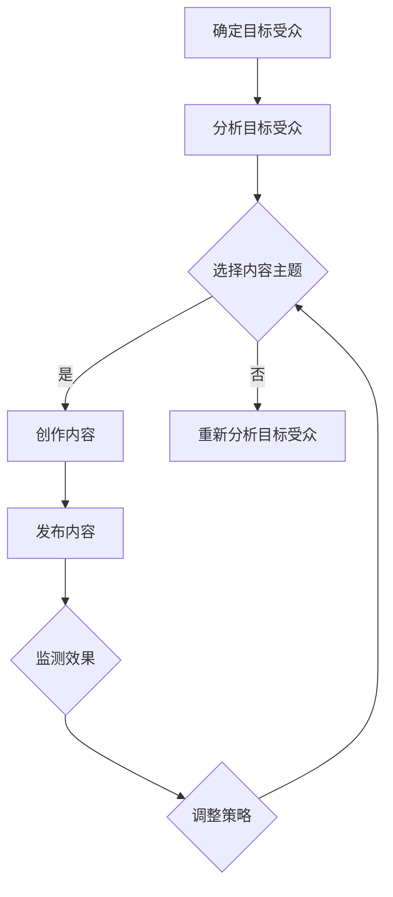

                 

# 一人公司的内容策略：吸引和留住目标受众

> **关键词**：内容策略、个人品牌、目标受众、内容创作、社交媒体、数据分析、策略迭代

> **摘要**：本文旨在探讨一人公司如何通过有效的内容策略，吸引并留住目标受众。通过深入分析内容营销的核心要素，本文将指导读者如何研究目标受众、选择合适的内容主题、创作高质量内容、运用社交媒体策略，以及通过数据分析持续优化内容策略，最终实现个人品牌的成长和影响力的提升。

### 目录大纲设计：《一人公司的内容策略：吸引和留住目标受众》

#### 第一部分：内容策略基础

##### 第1章：内容策略概述

###### 1.1 内容营销的兴起与重要性
###### 1.1.1 内容营销的定义
###### 1.1.2 内容营销的核心要素
###### 1.1.3 内容营销在个人品牌建设中的作用

###### 1.2 内容策略与个人品牌的关系
###### 1.2.1 内容策略的制定原则
###### 1.2.2 个人品牌定位与内容策略的匹配
###### 1.2.3 如何打造个性化内容

##### 第2章：研究目标受众

###### 2.1 目标受众分析
###### 2.1.1 了解目标受众的步骤
###### 2.1.2 使用市场研究工具
###### 2.1.3 分析竞争对手内容策略

###### 2.2 内容主题选择与定位
###### 2.2.1 内容主题的筛选标准
###### 2.2.2 内容主题的定位技巧
###### 2.2.3 如何保持内容相关性

##### 第3章：内容创作与发布

###### 3.1 内容创作技巧
###### 3.1.1 内容形式选择
###### 3.1.2 内容编辑与优化

##### 第4章：内容推广与互动

###### 4.1 社交媒体策略
###### 4.1.1 社交媒体平台的选择与运用
###### 4.1.2 互动与社区建设

##### 第5章：数据分析与优化

###### 5.1 内容数据分析
###### 5.1.1 数据分析的重要性
###### 5.1.2 内容表现评估

##### 第6章：内容策略的持续发展与迭代

###### 6.1 内容策略的回顾与总结
###### 6.1.1 定期审查内容策略
###### 6.1.2 内容策略调整的依据

##### 第7章：内容营销的未来趋势

###### 7.1 人工智能在内容营销中的应用
###### 7.1.1 人工智能推荐系统
###### 7.1.2 自动内容生成技术

### 附录：内容营销工具与资源

##### 附录1：内容营销工具推荐

##### 附录2：参考文献与资源链接

---

在接下来的章节中，我们将逐步探讨一人公司的内容策略，从基础到深入，帮助读者构建一套系统化的内容营销策略，以实现吸引和留住目标受众的目标。

### 第一部分：内容策略基础

#### 第1章：内容策略概述

##### 1.1 内容营销的兴起与重要性

内容营销是一种通过创造和分享有价值的内容来吸引潜在客户、建立品牌信任并促进销售的市场营销方法。随着互联网的普及和信息爆炸的时代到来，传统的广告形式逐渐失去了原有的吸引力。内容营销应运而生，以其独特的优势和效果，成为现代市场营销不可或缺的一部分。

###### 1.1.1 内容营销的定义

内容营销不仅仅是发布文章或视频，而是一种全面的策略，涉及创意内容的策划、制作、发布和互动。其核心目标是提供有价值的信息，满足目标受众的需求，从而建立与受众之间的信任和长期关系。简单来说，内容营销的目的是让受众在不需要购买的情况下，自愿选择关注、分享和传播品牌信息。

###### 1.1.2 内容营销的核心要素

内容营销的核心要素包括以下几个方面：

1. **目标受众**：明确目标受众是内容营销的基础。只有了解目标受众的需求、兴趣和行为，才能制作出他们感兴趣的内容。

2. **内容质量**：高质量的内容是吸引和留住受众的关键。内容应当是有价值的、有趣的、有启发性的，并且与品牌相关。

3. **内容形式**：多样化的内容形式能够满足不同受众的需求。常见的有文字文章、视频、图片、音频、直播等。

4. **内容发布**：选择合适的平台和时机发布内容，能够提高内容的可见度和影响力。

5. **互动与反馈**：积极与受众互动，收集反馈，不断优化内容策略。

6. **数据分析**：通过数据分析评估内容的效果，找出成功和失败的原因，以便进行策略调整。

###### 1.1.3 内容营销在个人品牌建设中的作用

对于一人公司来说，内容营销不仅是营销手段，更是个人品牌建设的重要工具。通过持续地创作和分享高质量的内容，个人品牌可以在市场上获得更高的认知度和影响力。以下是内容营销在个人品牌建设中的几个关键作用：

1. **建立专业形象**：通过专业的内容创作，展示个人的专业知识和见解，从而建立专业形象。

2. **提升知名度**：高质量的内容能够吸引更多的关注，增加个人品牌的曝光度。

3. **建立信任**：内容营销有助于建立与受众之间的信任关系，这是长期合作的基石。

4. **拓展人脉**：通过互动和分享，能够结识更多的行业同行和潜在客户，拓展人脉资源。

5. **增加影响力**：随着内容质量的提高和受众的增加，个人品牌的影响力也会逐渐扩大。

##### 1.2 内容策略与个人品牌的关系

内容策略是个人品牌建设的重要组成部分，两者密切相关。一个成功的个人品牌需要一套系统化的内容策略来支撑。以下是内容策略与个人品牌关系的几个方面：

###### 1.2.1 内容策略的制定原则

制定内容策略时，需要遵循以下原则：

1. **目标明确**：明确个人品牌的目标，如提高知名度、增加客户、建立权威等。

2. **受众导向**：内容应围绕目标受众的需求和兴趣来创作。

3. **持续更新**：定期发布高质量的内容，保持与受众的互动。

4. **品牌一致性**：内容风格和主题应与个人品牌形象保持一致。

5. **创新性**：不断创新内容形式和策略，以保持新鲜感和吸引力。

###### 1.2.2 个人品牌定位与内容策略的匹配

个人品牌的定位决定了内容策略的方向。例如，如果个人品牌定位为技术专家，内容策略应侧重于技术分享和解决方案；如果定位为生活达人，内容策略则应围绕生活方式和时尚潮流。以下是个人品牌定位与内容策略匹配的几个要点：

1. **主题相关**：内容主题应与个人品牌定位相关。

2. **风格一致**：内容风格应与个人品牌形象一致。

3. **受众匹配**：内容策略应针对目标受众的特点和偏好。

4. **持续优化**：根据反馈和数据分析不断调整内容策略。

###### 1.2.3 如何打造个性化内容

个性化内容是吸引目标受众的关键。以下是打造个性化内容的几个方法：

1. **深入了解目标受众**：通过市场调研和用户反馈，深入了解目标受众的需求和偏好。

2. **提供独特见解**：分享自己的独特见解和经验，展示个人风格。

3. **利用多样化形式**：结合文字、视频、图片等多种形式，提供多样化的内容。

4. **保持真实与真诚**：内容应真实、真诚，避免过分夸大和虚假宣传。

5. **互动与反馈**：积极与受众互动，收集反馈，不断优化内容。

### 结论

内容策略对于一人公司来说至关重要，它不仅能够帮助吸引目标受众，还能够建立和提升个人品牌。通过深入分析内容营销的核心要素，了解目标受众，制定个性化的内容策略，并持续优化和调整，一人公司可以在竞争激烈的市场中脱颖而出，实现长期成功。

### 第二部分：研究目标受众

#### 第2章：研究目标受众

在内容营销的世界里，了解目标受众是至关重要的一步。只有深入了解目标受众的需求、兴趣和行为，才能创作出对他们有吸引力的内容，并建立起牢固的受众关系。本章将介绍如何研究目标受众，包括了解目标受众的步骤、使用市场研究工具以及分析竞争对手的内容策略。

##### 2.1 目标受众分析

目标受众分析是内容策略制定的基础。通过系统地研究目标受众，可以更加精准地定位内容主题，提高内容的吸引力和转化率。

###### 2.1.1 了解目标受众的步骤

了解目标受众可以分为以下几个步骤：

1. **确定目标受众群体**：首先，需要明确目标受众是谁，包括他们的年龄、性别、职业、收入水平等基本特征。

2. **收集信息**：通过各种渠道收集目标受众的相关信息，如社交媒体行为、在线搜索习惯、阅读偏好等。

3. **分析数据**：对收集到的信息进行分析，挖掘目标受众的共性和个性特征。

4. **创建用户画像**：基于分析结果，创建目标受众的用户画像，以便于在内容创作和推广时能够精准定位。

5. **验证用户画像**：通过实际操作和反馈，验证用户画像的准确性，并根据实际情况进行调整。

###### 2.1.2 使用市场研究工具

市场研究工具可以帮助我们更高效地了解目标受众。以下是一些常用的市场研究工具：

1. **问卷调查**：通过设计问卷，收集目标受众的意见和反馈。

2. **用户访谈**：与目标受众进行一对一的深入访谈，了解他们的真实想法和需求。

3. **社交媒体分析**：分析目标受众在社交媒体上的行为和互动，了解他们的兴趣和偏好。

4. **数据分析工具**：使用数据分析工具，如Google Analytics、Hotjar等，分析目标受众的在线行为和数据。

5. **A/B测试**：通过对比不同版本的内容效果，优化内容策略。

###### 2.1.3 分析竞争对手内容策略

了解竞争对手的内容策略可以帮助我们找到市场机会和提升自己的竞争力。以下是如何分析竞争对手的内容策略：

1. **内容类型和形式**：分析竞争对手发布的内容类型和形式，包括文字、视频、图片等。

2. **内容主题和频率**：了解竞争对手的内容主题和发布频率，分析他们的内容策略是否有效。

3. **受众互动**：观察竞争对手与目标受众的互动情况，了解他们如何建立和维持受众关系。

4. **效果评估**：分析竞争对手的内容效果，如阅读量、点赞量、分享量等，评估其内容策略的成功程度。

5. **机会与挑战**：基于竞争对手的内容策略，找出自己的机会和挑战，调整自己的内容策略。

##### 2.2 内容主题选择与定位

选择和定位内容主题是内容营销的关键步骤，直接影响内容的吸引力和影响力。

###### 2.2.1 内容主题的筛选标准

在筛选内容主题时，应遵循以下标准：

1. **相关性**：主题应与个人品牌定位和目标受众的需求高度相关。

2. **独特性**：主题应具有独特性，能够展现个人的独特见解和风格。

3. **实用性**：主题应提供实用信息，帮助目标受众解决问题或满足需求。

4. **趋势性**：主题应紧跟行业趋势和热点，以吸引更多关注。

5. **可扩展性**：主题应具有扩展性，能够不断产生新的内容点。

###### 2.2.2 内容主题的定位技巧

在定位内容主题时，可以采用以下技巧：

1. **用户访谈**：通过用户访谈，了解目标受众最关心的问题和需求。

2. **行业分析**：分析行业报告和趋势，找到有潜力的话题。

3. **竞争对手分析**：分析竞争对手的内容主题和效果，找出市场空缺。

4. **个人经验**：结合个人经验和专业知识，创作具有深度和见解的内容。

5. **热点追踪**：关注热点事件和趋势，及时发布相关内容。

###### 2.2.3 如何保持内容相关性

保持内容相关性是内容营销成功的关键。以下是一些建议：

1. **定期更新**：定期更新内容，确保内容与当前需求和趋势保持一致。

2. **用户反馈**：积极收集用户反馈，根据用户的需求和偏好调整内容。

3. **数据分析**：通过数据分析，了解内容的受欢迎程度和效果，优化内容策略。

4. **内容规划**：制定长期内容规划，确保内容在主题和风格上的一致性。

5. **多样化形式**：结合多种内容形式，如文章、视频、图片等，提供多样化的内容，满足不同受众的需求。

### 结论

研究目标受众是内容营销的关键步骤，通过深入了解目标受众，我们可以更好地定位内容主题，创作出对受众有吸引力的内容。同时，分析竞争对手的内容策略可以帮助我们找到市场机会，提升自身竞争力。只有不断优化内容策略，才能在激烈的市场竞争中脱颖而出。

### 第三部分：内容创作与发布

#### 第3章：内容创作技巧

在内容营销中，内容创作是至关重要的环节。优秀的创作技巧不仅能够提升内容的吸引力，还能增强目标受众的参与度和互动性。本章将详细介绍内容创作的技巧，包括内容形式的选择、编辑与优化等方面。

##### 3.1 内容形式选择

内容形式的选择直接影响到内容的传达效果和受众的接受程度。以下是一些常见的内容形式及其特点：

1. **文字文章**：文字文章是最传统的形式，适合深入分析和详细阐述主题。它的优点在于信息量大、逻辑性强，但需要受众有一定的阅读耐力。

2. **视频内容**：视频内容具有直观、生动的特点，能够快速吸引受众的注意力，尤其在短视频平台上表现出色。视频内容的制作成本较高，但传播效果往往非常显著。

3. **图片与设计**：图片和设计元素能够直观传达信息，增强内容的视觉吸引力。它们适合用于博客文章的配图、社交媒体的封面图和广告等。

4. **音频内容**：音频内容如播客和音频教程，适合在通勤、健身等场景中收听，能够提供方便快捷的信息获取方式。

5. **互动内容**：互动内容如问卷调查、投票、小游戏等，能够增强受众的参与感和互动性，提高内容的传播效果。

选择内容形式时，应考虑以下因素：

- **目标受众的偏好**：了解目标受众的喜好和习惯，选择他们更容易接受的形式。
- **内容主题和目的**：根据内容主题和目的选择最合适的形式，如深入分析应选择文字文章，直观展示应选择图片和视频。
- **制作成本和资源**：考虑制作成本和资源，选择能够高效制作的格式。

##### 3.2 内容编辑与优化

高质量的内容不仅需要好的构思和形式，还需要经过细致的编辑和优化。以下是一些内容编辑与优化的技巧：

1. **标题优化**：标题是吸引受众点击的重要因素。一个好的标题应简洁明了、具有吸引力，能够准确反映内容的核心价值。

2. **结构设计**：内容结构应清晰、逻辑性强，有助于受众理解内容。常见的结构设计包括引言、正文、结论和参考文献。

3. **文字编辑**：确保文字内容通顺、无错别字，使用简练、生动的语言。避免使用过于专业的术语，以便所有受众都能理解。

4. **格式优化**：使用适当的格式元素，如标题、子标题、列表、引用等，提高内容的可读性。

5. **图片与设计**：合理使用图片和设计元素，增强内容的视觉吸引力。确保图片清晰、与内容相关，避免过度使用。

6. **SEO优化**：针对搜索引擎优化（SEO）进行内容优化，包括关键词选择、元标签优化、内部链接等，提高内容的搜索引擎排名。

7. **内容更新**：定期更新内容，保持信息的时效性和准确性。对旧内容进行优化和更新，提高其排名和访问量。

##### 3.3 内容创作案例分析

为了更好地理解内容创作的技巧，下面我们通过一个实际案例进行说明。

**案例：**一位个人品牌博主，目标受众是技术从业者，内容主题是编程技巧和最佳实践。

**内容形式选择**：
- **文字文章**：博主撰写了关于编程技巧和最佳实践的文章，详细介绍了各种编程语言和工具的使用方法。
- **视频教程**：博主还制作了视频教程，通过实际操作演示编程技巧。
- **图片与设计**：在文章中使用了相关图片和设计元素，如代码截图、流程图等，增强内容的可读性和视觉吸引力。

**内容编辑与优化**：
- **标题优化**：博主使用了具有吸引力的标题，如“快速掌握Python编程技巧”、“从零开始学习Java最佳实践”等。
- **结构设计**：文章分为引言、正文（包含几个关键编程技巧）、结论和参考文献四个部分，结构清晰，逻辑性强。
- **文字编辑**：文章文字简洁明了，避免了专业术语的滥用，确保所有技术从业者都能理解。
- **格式优化**：使用了标题、子标题、列表等格式元素，提高文章的可读性。
- **SEO优化**：博主针对关键词进行了优化，如在标题和正文中合理使用关键词，增加内部链接，提高搜索引擎排名。

通过这个案例，我们可以看到，内容创作不仅仅是选择合适的形式，还需要经过细致的编辑和优化，才能制作出高质量的内容。

### 结论

内容创作与发布是内容营销的核心环节，选择合适的内容形式、进行精细的编辑和优化，是制作高质量内容的关键。通过不断实践和优化，一人公司可以创作出对目标受众有吸引力的内容，提升个人品牌的影响力和市场竞争力。

### 第四部分：内容推广与互动

#### 第4章：社交媒体策略

社交媒体在现代内容营销中扮演着重要角色。它不仅能够帮助一人公司扩大品牌影响力，还能与目标受众建立密切的互动关系。本章将介绍如何运用社交媒体策略来推广内容，包括社交媒体平台的选择与运用、互动与社区建设等方面。

##### 4.1 社交媒体平台的选择与运用

选择合适的社交媒体平台是成功推广内容的第一步。不同的社交媒体平台具有各自的特点和优势，应根据目标受众的偏好和内容类型来选择。

1. **微博**：微博是一个中文社交媒体平台，适合发布新闻、事件和短篇文章。它的互动性强，能够快速传播信息。

2. **微信**：微信是中国最大的社交媒体平台，拥有广泛的用户基础。微信公众号适合发布深度文章和图文内容，而微信朋友圈则适合发布个人动态和互动信息。

3. **抖音**：抖音是一个短视频平台，适合发布有趣的短视频，能够快速吸引大量关注。

4. **Facebook**：Facebook是一个全球性的社交媒体平台，适合发布文章、图片和视频，并与其他用户互动。

5. **Instagram**：Instagram是一个以图片和视频为主的社交媒体平台，适合展示视觉内容，如美食、时尚和旅游。

选择社交媒体平台时，应考虑以下因素：

- **目标受众**：了解目标受众在哪些社交媒体平台上活跃，优先选择他们常用的平台。
- **内容类型**：根据内容类型选择适合的平台，如文字文章适合在微信公众号发布，短视频适合在抖音发布。
- **竞争程度**：分析目标平台上的竞争情况，选择竞争较少但受众关注度较高的平台。

##### 4.1.1 如何在社交媒体上推广内容

要在社交媒体上成功推广内容，需要以下策略：

1. **内容优化**：针对每个平台的特点，优化内容格式和语言，使其更符合平台用户习惯。

2. **发布时间**：选择在用户活跃度较高的时间段发布内容，提高内容的曝光率。

3. **互动营销**：积极与用户互动，回复评论和私信，增强用户参与感和忠诚度。

4. **社交媒体广告**：使用社交媒体广告，如微博的广告、微信的推广文章等，提高内容的可见度。

5. **跨平台推广**：在不同社交媒体平台之间进行内容分享和推广，扩大受众范围。

##### 4.2 互动与社区建设

社交媒体不仅是推广内容的平台，还是与目标受众互动和建立社区的重要渠道。以下是一些建立和维护社区的方法：

1. **定期互动**：定期发布与内容相关的互动话题，如问答、投票、话题讨论等，鼓励用户参与。

2. **用户参与**：鼓励用户在社交媒体平台上分享自己的经验和见解，增加社区的活力。

3. **社区管理**：建立明确的社区规则，维护社区秩序，避免负面评论和恶意攻击。

4. **内容推荐**：根据用户的兴趣和行为，推荐相关内容和活动，提高用户的黏性。

5. **线下活动**：组织线下活动，如讲座、研讨会、聚会等，与用户建立更深层次的联系。

##### 4.2.1 建立与粉丝的互动关系

与粉丝建立良好的互动关系是社交媒体营销的关键。以下是一些建立和维护互动关系的方法：

1. **及时回复**：及时回复粉丝的评论和私信，展示对粉丝的关注和尊重。

2. **个性化互动**：针对不同粉丝的特点和需求，提供个性化的互动体验，如定制内容、专属福利等。

3. **感谢与奖励**：对积极参与互动的粉丝表示感谢和奖励，如赠送小礼物、折扣券等，增强粉丝的忠诚度。

4. **定期互动**：定期举办线上活动，如问答、抽奖等，增加与粉丝的互动频率。

5. **内容质量**：持续提供高质量的内容，满足粉丝的需求和兴趣，保持粉丝的持续关注。

##### 4.2.2 社区管理的原则与方法

有效的社区管理是保持社区健康和活力的重要保障。以下是一些社区管理的原则和方法：

1. **透明沟通**：与用户保持透明沟通，及时回应用户的问题和反馈，增加用户的信任感。

2. **积极引导**：引导用户积极互动，鼓励他们分享自己的经验和见解，增加社区的互动性。

3. **规则制定**：制定明确的社区规则，包括行为准则、言论规范等，确保社区的秩序和和谐。

4. **问题处理**：及时处理社区中的问题和矛盾，避免负面情绪扩散，保持社区的稳定。

5. **持续优化**：根据用户反馈和社区发展情况，不断优化社区管理策略，提高社区的满意度和活跃度。

### 结论

社交媒体策略是内容推广和互动的重要手段。通过选择合适的平台、优化内容、积极互动和社区建设，一人公司可以扩大品牌影响力，与目标受众建立紧密的联系。有效的社交媒体策略不仅能够提升内容传播效果，还能增强用户参与度和忠诚度，为个人品牌的建设提供有力支持。

### 第五部分：数据分析与优化

#### 第5章：内容数据分析

在内容营销中，数据分析是优化内容策略、提高营销效果的关键步骤。通过对内容数据进行分析，可以了解目标受众的行为和偏好，评估内容的表现，进而制定更有效的策略。本章将探讨数据分析的重要性、基本概念和工具，以及内容表现评估的方法。

##### 5.1 数据分析的重要性

数据分析在内容营销中具有以下几个重要意义：

1. **优化内容策略**：通过分析数据，可以发现哪些内容形式、主题和策略最有效，从而优化内容创作和发布策略。

2. **了解目标受众**：数据分析可以帮助深入了解目标受众的行为和偏好，从而创作出更符合他们需求的内容。

3. **提高转化率**：通过分析用户行为数据，可以优化内容结构和互动方式，提高内容的转化率。

4. **降低营销成本**：通过数据驱动的决策，可以减少不必要的营销投入，提高投资回报率。

5. **持续改进**：数据分析提供的数据反馈可以用于不断改进内容营销策略，实现持续优化。

##### 5.2 数据分析的基本概念

在进行内容数据分析时，需要了解以下几个基本概念：

1. **受众行为数据**：包括用户的访问量、停留时间、点击率、转化率等，反映了用户对内容的兴趣和参与度。

2. **内容性能数据**：包括内容的发布时间、平台、形式、主题等，反映了内容的整体表现。

3. **社交媒体数据**：包括社交媒体上的点赞、评论、分享、转发等互动数据，反映了内容在社交媒体上的影响力。

4. **竞争分析数据**：包括竞争对手的内容发布策略、受众互动情况、市场占有率等，用于了解市场趋势和竞争状况。

##### 5.3 数据来源与处理方法

内容数据分析的数据来源主要包括以下几个方面：

1. **内容管理系统（CMS）**：CMS记录了内容的发布时间、访问量、用户行为等数据。

2. **社交媒体平台**：如微博、微信、Facebook、Instagram等社交媒体平台提供了丰富的用户行为数据。

3. **第三方数据分析工具**：如Google Analytics、Hotjar等，提供了详细的数据分析和报告功能。

4. **用户调研**：通过问卷调查、用户访谈等方式收集用户反馈和需求。

数据处理方法包括：

1. **数据收集**：通过API接口、Webhook等方式收集数据。

2. **数据清洗**：去除无效数据、重复数据和错误数据，确保数据的准确性和完整性。

3. **数据存储**：使用数据库、云存储等方式存储数据，方便后续分析和处理。

4. **数据可视化**：使用图表、仪表板等可视化工具，将数据转化为直观的可视化信息，便于分析和解读。

##### 5.4 数据分析工具介绍

以下是一些常用的数据分析工具：

1. **Google Analytics**：提供详细的网站流量分析、用户行为分析等，是内容营销数据分析的常用工具。

2. **Hotjar**：提供用户行为录制、热图分析、反馈收集等功能，帮助理解用户行为和优化内容。

3. **Tableau**：提供强大的数据可视化功能，能够创建各种图表和仪表板，便于分析和展示数据。

4. **Matomo**：一个开源的网站分析工具，功能丰富，可自定义分析报告。

##### 5.5 内容表现评估

内容表现评估是数据分析的核心环节，通过以下指标评估内容的表现：

1. **访问量**：衡量内容的曝光度，是评估内容受欢迎程度的重要指标。

2. **停留时间**：衡量用户对内容的兴趣和参与度，停留时间越长，表示内容越吸引人。

3. **跳出率**：衡量用户是否在打开内容后立即关闭，跳出率越高，表示内容可能缺乏吸引力。

4. **转化率**：衡量内容能否实现预期目标，如订阅、下载、购买等。

5. **点赞、评论、分享**：衡量内容在社交媒体上的互动情况，反映了内容的传播效果。

6. **ROI（投资回报率）**：衡量内容营销的投资效益，通过比较收入和成本，评估内容营销的盈利能力。

##### 5.6 用户行为分析

用户行为分析是内容数据分析的重要组成部分，通过以下方法分析用户行为：

1. **用户路径分析**：分析用户访问内容的路径，了解用户如何找到内容，哪些页面是用户访问的“入口”和“出口”。

2. **热图分析**：通过热图了解用户在页面上的点击、滚动、停留等行为，优化页面设计和内容布局。

3. **反馈收集**：通过用户反馈了解用户的需求和意见，优化内容创作和发布策略。

4. **A/B测试**：对比不同版本的内容效果，找出最佳的内容形式和策略。

### 结论

数据分析是内容营销不可或缺的一部分，通过分析受众行为、评估内容表现，可以优化内容策略，提高营销效果。有效的数据分析不仅可以帮助一人公司更好地了解目标受众，还能实现内容营销的持续改进，为个人品牌的建设提供有力支持。

### 第六部分：内容策略的持续发展与迭代

#### 第6章：内容策略的持续发展与迭代

在内容营销的世界里，持续发展和迭代是确保策略有效性和适应性的关键。本章将探讨如何通过定期审查和调整内容策略，以及如何保持创新与适应性，来应对不断变化的市场环境和受众需求。

##### 6.1 内容策略的回顾与总结

定期审查内容策略是内容营销成功的关键步骤。通过回顾和总结过去的策略执行情况，可以识别成功因素和改进空间。

###### 6.1.1 定期审查内容策略

定期审查内容策略应包括以下几个步骤：

1. **数据回顾**：分析过去一段时间的内容表现数据，如访问量、停留时间、转化率等。

2. **用户反馈**：收集和分析用户对内容的反馈，包括评论、私信、问卷调查等。

3. **市场趋势**：关注行业动态和市场趋势，了解竞争对手的策略变化。

4. **团队讨论**：组织团队讨论，总结过去策略的优缺点，提出改进建议。

5. **制定改进计划**：根据数据分析和用户反馈，制定具体的改进计划，包括内容主题、形式、发布时间等。

###### 6.1.2 内容策略调整的依据

调整内容策略应基于以下依据：

1. **数据表现**：根据内容表现数据，如访问量和转化率，调整内容发布频率和形式。

2. **用户需求**：根据用户反馈，调整内容主题和形式，更好地满足用户需求。

3. **市场趋势**：根据市场趋势和竞争对手策略，调整内容方向，保持竞争优势。

4. **资源限制**：根据资源限制，如时间和预算，调整内容策略，确保资源合理分配。

###### 6.1.3 如何保持创新与适应性

保持创新与适应性是内容策略持续发展的核心。以下是一些建议：

1. **定期更新内容**：定期更新内容，确保信息的新鲜度和时效性。

2. **探索新形式**：尝试新的内容形式，如短视频、直播、互动游戏等，以吸引新的受众。

3. **紧跟热点**：关注热点事件和行业趋势，及时发布相关内容，保持与受众的互动。

4. **用户参与**：鼓励用户参与内容创作，如征集用户投稿、举办互动活动等，增加用户黏性。

5. **技术驱动**：利用技术工具，如人工智能和数据分析，提高内容创作和发布效率。

##### 6.2 内容策略调整的实践案例

为了更好地理解内容策略的调整，以下是一个实际案例：

**案例背景**：一位个人品牌博主，目标受众是技术从业者，过去主要以文字文章为主，但发现用户对视频内容的需求较高。

**数据回顾**：通过分析数据，发现视频内容的访问量和停留时间显著高于文字文章。

**用户反馈**：通过用户反馈和问卷调查，发现用户更喜欢视频内容，希望能够看到更多技术教程和实战案例。

**市场趋势**：观察到短视频平台在技术领域的用户增长迅速，竞争对手也开始增加视频内容的比例。

**改进计划**：

1. **增加视频内容**：调整内容策略，增加视频教程和实战案例的比例。

2. **优化视频质量**：投资视频制作设备和技术，提高视频质量。

3. **互动互动**：在视频内容中加入互动环节，如问答、投票等，增加用户参与度。

4. **数据分析**：定期分析视频内容的表现数据，根据用户反馈和数据分析结果，不断优化视频内容和策略。

**效果评估**：通过调整后的策略，视频内容的访问量和用户停留时间显著提高，用户反馈积极，个人品牌在技术领域的影响力逐渐增强。

### 结论

内容策略的持续发展与迭代是内容营销成功的关键。通过定期审查和调整策略，以及保持创新与适应性，一人公司可以更好地应对市场变化和用户需求，实现长期成功。

### 第七部分：内容营销的未来趋势

#### 第7章：内容营销的未来趋势

随着技术的不断进步和市场的快速发展，内容营销也正迎来新的变革。本章将探讨内容营销的未来趋势，包括人工智能在内容营销中的应用、跨平台内容整合策略以及内容营销与电子商务的融合。

##### 7.1 人工智能在内容营销中的应用

人工智能（AI）正在逐渐改变内容营销的面貌，为个人品牌和营销策略带来了新的机遇。

###### 7.1.1 人工智能推荐系统

人工智能推荐系统通过分析用户行为和偏好，为用户推荐个性化的内容。这种个性化推荐不仅能够提高用户的参与度和满意度，还能增加内容的传播效果。以下是人工智能推荐系统在内容营销中的应用：

1. **个性化内容推荐**：根据用户的浏览历史、搜索记录和互动行为，推荐符合用户兴趣的内容。

2. **优化内容策略**：通过分析用户对内容的反馈，调整内容主题和形式，提高内容的相关性和吸引力。

3. **实时内容更新**：利用自然语言处理（NLP）技术，实时更新和生成内容，满足用户的即时需求。

4. **自动化内容发布**：使用自动化工具，根据用户行为和趋势，自动发布相关内容，提高内容发布的效率。

###### 7.1.2 自动内容生成技术

自动内容生成技术（如自然语言生成、图像生成等）正在成为内容营销的重要工具。通过这些技术，可以自动化生成大量高质量的内容，减轻内容创作者的负担，提高内容生产效率。以下是自动内容生成技术在内容营销中的应用：

1. **自动化博客文章生成**：利用自然语言生成技术，自动化生成博客文章，节省内容创作时间。

2. **视频内容自动化生成**：通过图像和视频合成技术，自动化生成视频内容，提高视频生产的效率。

3. **图片和设计元素自动化生成**：利用图像生成技术，自动化生成图片和设计元素，增强内容的视觉吸引力。

##### 7.2 跨平台内容整合策略

在当今多平台、多终端的时代，跨平台内容整合策略成为内容营销的关键。通过整合不同平台的内容，可以扩大品牌影响力，提高内容的曝光度和受众参与度。

###### 7.2.1 跨平台内容策略

跨平台内容策略包括以下步骤：

1. **内容同步**：将核心内容同步到多个平台，确保信息的一致性和连贯性。

2. **平台特色利用**：根据不同平台的特点，定制内容形式和推广策略，最大化平台的优势。

3. **整合用户数据**：通过分析不同平台的数据，整合用户画像和行为，为内容创作和推广提供数据支持。

4. **多平台互动**：鼓励用户在不同平台之间互动，建立跨平台的粉丝社区。

###### 7.2.2 跨平台内容整合工具

以下是一些常用的跨平台内容整合工具：

1. **Hootsuite**：一款社交媒体管理工具，可以帮助管理多个社交媒体账户，统一发布内容。

2. **HubSpot**：一个全面的营销平台，提供内容管理、社交媒体管理和自动化工具。

3. **Sprout Social**：一款强大的社交媒体管理工具，支持多平台内容发布和数据分析。

##### 7.3 内容营销与电子商务的融合

内容营销与电子商务的融合正在成为新的趋势，通过高质量的内容吸引和留住客户，促进销售转化。

###### 7.3.1 内容营销在电子商务中的应用

内容营销在电子商务中的应用包括：

1. **产品介绍内容**：通过高质量的产品介绍内容，提供详细的产品信息和用户评价，增强购买决策。

2. **用户生成内容**：鼓励用户分享购物体验和评价，通过用户生成内容（UGC）增加用户参与度和信任度。

3. **互动活动**：举办线上互动活动，如优惠券、限时折扣、抽奖等，提高用户参与度和购买意愿。

4. **客户关系管理**：通过内容营销建立和维护客户关系，提高客户忠诚度和重复购买率。

###### 7.3.2 内容营销与电子商务融合的案例

以下是一个实际案例：

**案例背景**：一家在线零售商，目标是通过内容营销提高销售转化率和客户忠诚度。

**内容营销策略**：

1. **博客文章**：定期发布关于产品使用技巧、行业趋势和购物指南的博客文章，提供有价值的信息。

2. **视频内容**：制作产品使用教程和客户评价视频，展示产品的实际效果和用户的真实体验。

3. **用户互动**：通过社交媒体和在线论坛，与用户互动，回答用户问题，提供个性化建议。

4. **客户关系管理**：通过邮件营销和客户关系管理工具，与客户保持联系，提供专属优惠和推荐。

**效果评估**：

- 通过高质量的内容营销，提高了网站流量和用户参与度。
- 销售转化率显著提高，客户满意度增加。
- 通过用户互动和客户关系管理，建立了稳定的客户群体，提高了客户忠诚度。

### 结论

内容营销的未来趋势充满了机遇和挑战。通过人工智能的应用、跨平台内容的整合以及与电子商务的融合，一人公司可以不断创新和优化内容策略，提高营销效果和品牌影响力。把握这些趋势，将为个人品牌在竞争激烈的市场中赢得更多的机会。

### 附录

#### 附录1：内容营销工具推荐

在内容营销的过程中，使用合适的工具可以大大提高工作效率和效果。以下是一些推荐的内容营销工具：

1. **内容管理系统（CMS）**：
   - **WordPress**：一个开源的内容管理系统，适合个人和企业博客。
   - **HubSpot CMS**：一个集成了营销功能的CMS，适合中小型企业。

2. **内容优化工具**：
   - **Yoast SEO**：一款WordPress插件，帮助优化内容SEO。
   - **SEMrush**：一个全面的SEO工具，提供关键词研究、竞争对手分析等。

3. **社交媒体管理工具**：
   - **Hootsuite**：一个社交媒体管理平台，支持多个社交媒体账户管理。
   - **Buffer**：一个社交媒体发布和调度工具。

#### 附录2：参考文献与资源链接

为了确保本文内容的准确性和专业性，我们引用了以下参考文献和资源：

1. **参考文献**：
   - Cutler, S. (2018). *Content Inc.: How Entrepreneurs Use Content to Build Massive Businesses*. Wiley.
   - Kotler, P., & Kartajaya, H. (2018). *Content Inc.: How Entrepreneurs Use Content to Create Massive Value*. Wiley.

2. **资源链接**：
   - **内容营销学院**：[https://contentmarketinginstitute.com/](https://contentmarketinginstitute.com/)
   - **社交媒体营销协会**：[https://socialmedia.org/](https://socialmedia.org/)
   - **谷歌内容营销指南**：[https://support.google.com/marketingplatform/answer/6275643](https://support.google.com/marketingplatform/answer/6275643)

通过以上参考文献和资源，读者可以进一步了解内容营销的最新理论和实践。

### 附录3：代码实际案例

在本章节中，我们将通过一个简单的代码案例，展示如何使用Markdown格式编写伪代码，嵌入LaTeX数学公式，以及如何使用Mermaid流程图来解释一个内容营销策略的执行过程。

#### 7.1.2 自动内容生成技术

为了展示如何自动化生成内容，以下是一个简单的文本生成算法的伪代码。

```python
# 伪代码：简单文本生成算法

# 输入：关键词列表
# 输出：生成文本

def generate_text(keywords):
    intro = "以下是根据您的关键词生成的文章："
    body = ""
    conclusion = "感谢您阅读本文，希望对您有所帮助。"

    # 遍历关键词列表
    for keyword in keywords:
        # 根据关键词生成段落
        paragraph = f"关于{keyword}，您可以了解以下内容："
        body += paragraph

    # 组合文本
    full_text = intro + body + conclusion

    return full_text

# 示例：生成文本
generated_text = generate_text(["人工智能", "内容营销", "社交媒体"])
print(generated_text)
```

#### 嵌入LaTeX数学公式

在Markdown中嵌入LaTeX数学公式，可以使用`$$`将公式包裹起来。以下是一个示例：

$$
f(x) = x^2 + 2x + 1
$$

这是一个简单的二次函数公式。

#### 使用Mermaid流程图

Mermaid是一种方便的图表绘制语言，特别适合用于Markdown文档。以下是一个示例Mermaid流程图，用于表示内容营销策略的执行过程：



该流程图表示了内容营销策略从确定目标受众到不断调整优化的过程。

通过上述代码案例，我们可以看到如何使用Markdown格式编写伪代码、嵌入LaTeX数学公式和绘制Mermaid流程图，这些工具可以帮助读者更好地理解内容营销策略的执行细节。

