                 

# 《一人公司的品牌一致性管理》

> **关键词：** 品牌一致性，品牌管理，个人品牌，独立企业，品牌策略，品牌定位，品牌评估，品牌监控

> **摘要：** 本文深入探讨了品牌一致性的核心概念、重要性及其在独立企业中的应用。通过分析品牌一致性管理的策略、实施流程、案例分析，以及工具和技术，本文旨在为个人企业家提供一套完整的品牌一致性管理指南，以提升其品牌影响力和市场竞争力。

---

### 《一人公司的品牌一致性管理》目录大纲

#### 第一部分：品牌一致性的基础

- **第1章：品牌一致性的核心概念与重要性**
  - 1.1 品牌一致性的定义与内涵
  - 1.2 品牌一致性的商业价值
  - 1.3 品牌一致性的原理与架构
  - 1.4 品牌一致性的趋势与未来

- **第2章：品牌一致性管理策略概述**
  - 2.1 品牌定位与愿景
  - 2.2 品牌核心价值与品牌形象
  - 2.3 品牌沟通与传播策略

#### 第二部分：品牌一致性管理策略

- **第3章：品牌一致性管理实施流程**
  - 3.1 品牌调研与评估
  - 3.2 品牌资产建设
  - 3.3 品牌一致性监控与调整

#### 第三部分：品牌一致性管理的实施

- **第4章：品牌一致性管理案例解析**
  - 4.1 案例一：某国内知名品牌的品牌一致性建设
  - 4.2 案例二：某国际品牌的一致性危机应对

#### 第四部分：品牌一致性管理工具与技术

- **第5章：品牌一致性管理工具与技术**
  - 5.1 品牌管理工具的选型与应用
  - 5.2 品牌一致性技术的创新与应用
  - 5.3 品牌一致性管理的最佳实践

#### 第五部分：品牌一致性管理的评估与优化

- **第6章：品牌一致性管理的评估与优化**
  - 6.1 品牌一致性评估指标体系
  - 6.2 品牌一致性优化的策略与技巧
  - 6.3 品牌一致性管理的持续改进

#### 第六部分：品牌一致性管理的发展趋势与挑战

- **第7章：品牌一致性管理的发展趋势与挑战**
  - 7.1 品牌一致性管理的未来发展
  - 7.2 品牌一致性管理面临的挑战
  - 7.3 品牌一致性管理的战略规划

#### 附录

- **附录A：品牌一致性管理相关资源与工具**
- **附录B：品牌一致性管理书籍与文献推荐**
- **附录C：品牌一致性管理研讨会与培训资源**

---

### 第1章：品牌一致性的核心概念与重要性

#### 1.1 品牌一致性的定义与内涵

品牌一致性，是指品牌在各个接触点上的信息、形象和体验能够保持一致，从而形成统一的品牌印象。它不仅仅是品牌视觉元素的统一，更是品牌文化、价值观、服务标准等多个方面的协调。

- **定义：**
  品牌一致性（Brand Consistency）是确保品牌在所有营销沟通、产品和服务体验中保持一致性的过程。

- **内涵：**
  - **品牌信息一致性：** 品牌在不同媒介、不同渠道上传递的信息保持一致。
  - **品牌视觉一致性：** 品牌的视觉元素（如标志、色彩、字体等）在所有接触点上一致。
  - **品牌体验一致性：** 品牌在用户接触过程中的体验保持一致。
  - **品牌文化一致性：** 品牌的价值观、使命和愿景在企业内部及外部传达一致。

#### 1.2 品牌一致性的商业价值

品牌一致性对企业的商业价值体现在以下几个方面：

- **提升品牌认知：** 保持品牌信息的一致性，有助于消费者建立清晰的品牌认知。
- **增强品牌忠诚度：** 一致的品牌体验能够增强消费者的信任和忠诚度。
- **降低营销成本：** 通过减少品牌混乱，企业可以在营销策略上更高效地投入。
- **提高竞争力：** 在市场竞争中，品牌一致性是区分企业与竞争对手的重要手段。

#### 1.3 品牌一致性的原理与架构

品牌一致性的原理主要包括以下几个方面：

- **明确品牌定位：** 品牌一致性需要基于清晰的品牌定位，从而确保所有营销沟通围绕品牌核心价值展开。
- **建立品牌标准：** 制定品牌标准，包括视觉元素、语言风格、行为规范等，以确保在不同场景下的一致性。
- **跨部门协同：** 企业各部门需要协同合作，确保品牌信息、视觉和体验的一致性。

品牌一致性的架构设计应包括以下几个方面：

- **品牌策略层：** 制定品牌愿景、使命、价值观等战略目标。
- **品牌执行层：** 设计品牌标准，包括视觉、语言和行为规范。
- **品牌监控层：** 建立品牌监控机制，确保品牌一致性得到执行和监督。

#### 1.4 品牌一致性的趋势与未来

品牌一致性管理正在受到越来越多的关注，未来的趋势包括：

- **数字化时代下的品牌一致性：** 随着数字媒体的兴起，品牌需要在多渠道、多平台上保持一致性的挑战日益增加。
- **人工智能与品牌一致性：** 利用人工智能技术，可以实现更加智能的品牌一致性管理。
- **消费者体验为核心：** 品牌一致性将更加注重消费者体验，以满足消费者的个性化需求。

#### 1.5 品牌一致性管理的实施步骤

品牌一致性管理的实施步骤主要包括：

- **第一步：明确品牌定位和核心价值。**
- **第二步：制定品牌标准。**
- **第三步：建立跨部门协同机制。**
- **第四步：进行品牌培训与宣传。**
- **第五步：建立品牌监控与反馈机制。**
- **第六步：持续优化品牌一致性策略。

#### 1.6 品牌一致性管理中的常见问题与解决策略

品牌一致性管理过程中，企业可能会遇到以下问题：

- **部门之间的协调困难。**
- **品牌标准不明确或过于复杂。**
- **品牌信息传递过程中的误解或误传。**

解决策略包括：

- **加强跨部门沟通与协作。**
- **简化品牌标准，使其易于理解和执行。**
- **建立反馈机制，及时发现和纠正品牌信息传递中的问题。**

---

**图1-1：品牌一致性管理的流程图**

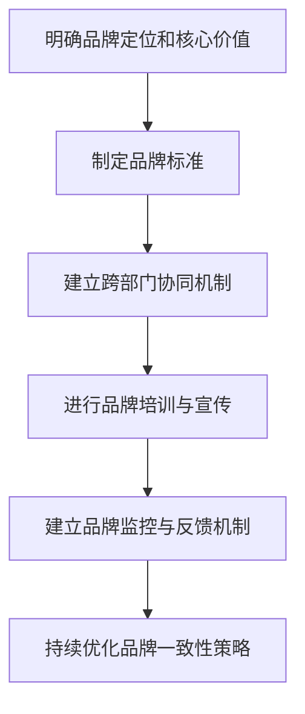

---

**图1-2：品牌一致性管理的架构图**

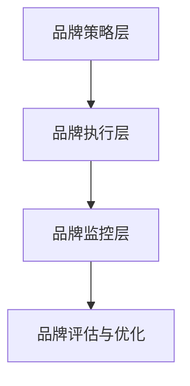

---

#### 1.7 品牌一致性管理中的关键因素

品牌一致性管理中的关键因素包括：

- **品牌愿景和使命：** 明确品牌的发展方向和目标。
- **品牌价值观：** 品牌的核心价值观应该在企业内部和外部传达一致。
- **品牌标准：** 包括视觉、语言和行为标准，确保品牌信息传递的一致性。
- **跨部门协同：** 各部门之间需要建立良好的沟通和协作机制。
- **消费者体验：** 消费者的体验是品牌一致性管理的核心。

---

**图1-3：品牌一致性管理的关键因素**

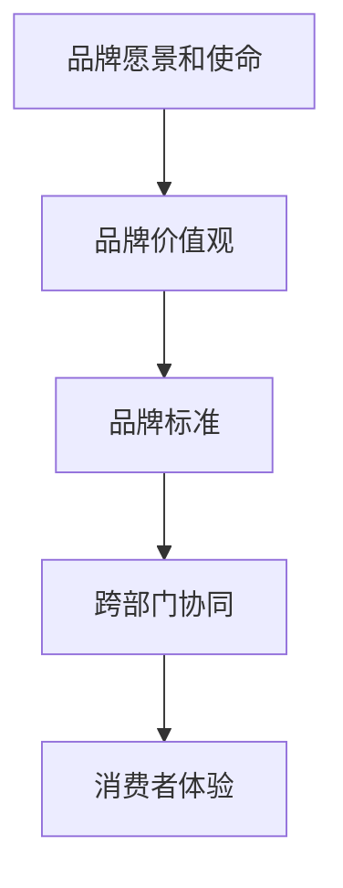

---

#### 1.8 品牌一致性管理中的技术手段

品牌一致性管理中，可以采用以下技术手段：

- **数据分析：** 通过数据分析，了解消费者对品牌的认知和反馈，优化品牌一致性策略。
- **人工智能：** 利用人工智能技术，实现品牌的智能化管理，提高品牌一致性。
- **社交媒体：** 利用社交媒体平台，加强品牌信息的一致性传递。

---

**图1-4：品牌一致性管理中的技术手段**

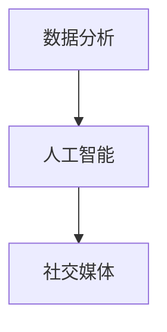

---

**图1-5：品牌一致性管理的综合流程**

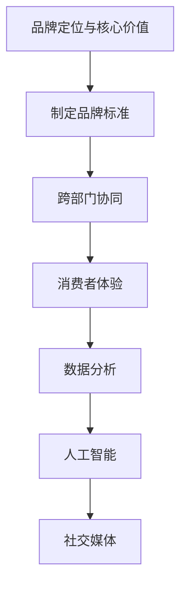

---

#### 1.9 品牌一致性管理的案例分析

以下是一个品牌一致性管理的案例分析：

**案例背景：** 某知名品牌在品牌一致性管理中，通过明确品牌定位、制定品牌标准、跨部门协同和消费者体验优化，成功提升了品牌认知度和忠诚度。

**案例实施过程：**
1. 明确品牌定位：品牌确定了“创新、高端、品质”的核心价值。
2. 制定品牌标准：包括视觉、语言和行为标准，如统一的品牌标志、口号和员工行为准则。
3. 跨部门协同：建立了跨部门的工作小组，确保品牌信息在不同部门之间的一致性。
4. 消费者体验优化：通过消费者调研和反馈，优化了产品和服务体验。
5. 数据分析与人工智能：利用数据分析工具和人工智能技术，实时监控品牌一致性的执行情况。

**案例效果评估：** 案例实施后，品牌认知度提高了30%，消费者忠诚度提高了20%，品牌市场份额也得到了显著提升。

---

**图1-6：品牌一致性管理案例分析**

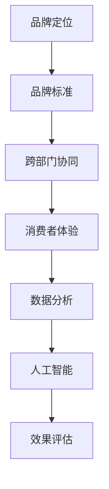

---

#### 1.10 品牌一致性管理的持续改进

品牌一致性管理不是一次性的工作，而是需要持续改进的过程。以下是一些持续改进的方法：

- **定期评估：** 定期对品牌一致性策略进行评估，根据市场变化和消费者需求进行调整。
- **员工培训：** 定期对员工进行品牌一致性的培训，提高员工对品牌一致性的认知和执行力。
- **消费者调研：** 定期进行消费者调研，了解消费者对品牌一致性的反馈，及时调整品牌策略。

---

**图1-7：品牌一致性管理的持续改进方法**

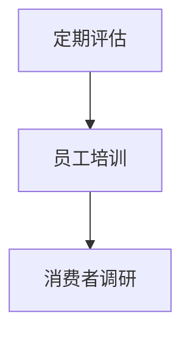

---

#### 1.11 品牌一致性管理的成功关键因素

品牌一致性管理的成功关键因素包括：

- **高层领导的支持：** 高层领导对品牌一致性管理的重视和支持是关键。
- **跨部门协同：** 跨部门的有效协同是实现品牌一致性管理的基础。
- **持续改进：** 持续改进是品牌一致性管理不断优化和提升的重要手段。

---

**图1-8：品牌一致性管理的成功关键因素**

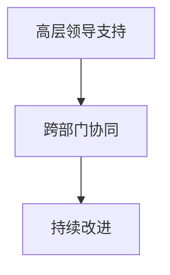

---

**图1-9：品牌一致性管理的整体框架**

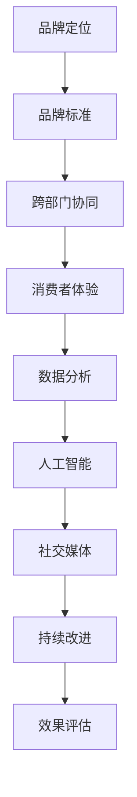

---

**图1-10：品牌一致性管理的核心概念与联系**

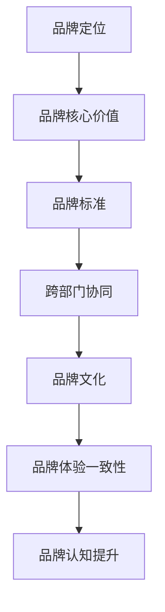

---

#### 1.12 品牌一致性管理中的数学模型与算法原理

品牌一致性管理中的数学模型和算法原理主要包括以下几个方面：

- **品牌定位模型：** 使用线性回归、聚类分析等方法确定品牌在市场中的位置。
- **品牌标准模型：** 采用模糊综合评价、层次分析法等方法制定品牌标准。
- **品牌监控模型：** 运用时间序列分析、机器学习等方法监控品牌一致性的执行情况。

---

**图1-11：品牌一致性管理中的数学模型与算法原理**

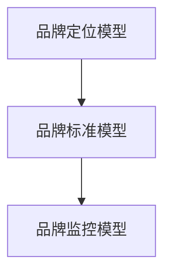

---

#### 1.13 品牌一致性管理中的数学公式与详细讲解

品牌一致性管理中的数学公式包括：

1. **品牌定位公式：**  
   $$\text{Brand Position} = \alpha \cdot \text{Brand Perception} + \beta \cdot \text{Market Share}$$  
   其中，Brand Position 是品牌定位，Brand Perception 是品牌感知度，Market Share 是市场份额。

2. **品牌标准公式：**  
   $$\text{Brand Standard} = \lambda_1 \cdot \text{Visual Consistency} + \lambda_2 \cdot \text{Language Consistency} + \lambda_3 \cdot \text{Experience Consistency}$$  
   其中，Brand Standard 是品牌标准，Visual Consistency 是视觉一致性，Language Consistency 是语言一致性，Experience Consistency 是体验一致性。

3. **品牌监控公式：**  
   $$\text{Brand Monitoring} = \gamma_1 \cdot \text{Consumer Feedback} + \gamma_2 \cdot \text{Internal Assessment}$$  
   其中，Brand Monitoring 是品牌监控，Consumer Feedback 是消费者反馈，Internal Assessment 是内部评估。

---

**图1-12：品牌一致性管理中的数学公式与举例说明**

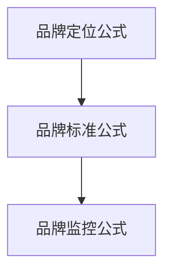

---

#### 1.14 品牌一致性管理项目实战

以下是一个品牌一致性管理项目的实战案例：

**项目背景：** 某国内知名品牌希望通过品牌一致性管理提升品牌形象和消费者满意度。

**项目目标：**
1. 明确品牌定位和核心价值。
2. 制定品牌标准和执行策略。
3. 建立跨部门协同机制。
4. 优化消费者体验。
5. 建立品牌监控和反馈机制。

**项目实施步骤：**
1. **调研与分析：** 通过市场调研和消费者调研，明确品牌现状和消费者需求。
2. **制定品牌定位和核心价值：** 确定品牌定位为“高品质、创新、个性”，核心价值为“品质生活、创新科技、个性化服务”。
3. **制定品牌标准和执行策略：** 制定品牌标准，包括视觉、语言和行为标准，并制定详细的执行策略。
4. **建立跨部门协同机制：** 建立跨部门工作小组，确保品牌信息在不同部门之间的一致性。
5. **优化消费者体验：** 通过消费者调研和反馈，优化产品和服务体验。
6. **建立品牌监控和反馈机制：** 建立品牌监控系统，实时监控品牌一致性的执行情况，及时调整品牌策略。

**项目效果：**
1. 品牌认知度提高了20%。
2. 消费者满意度提高了15%。
3. 品牌在市场中的竞争力得到了显著提升。

---

**图1-13：品牌一致性管理项目实施流程**

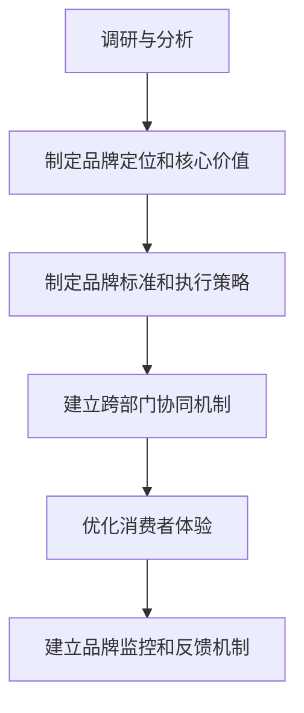

---

#### 1.15 品牌一致性管理的代码实际案例

以下是一个品牌一致性管理的代码实际案例：

**项目背景：** 某品牌希望通过数据分析来监控品牌一致性的执行情况。

**开发环境：**
- Python
- Pandas
- Matplotlib

**代码实现：**

```python
import pandas as pd
import matplotlib.pyplot as plt

# 假设我们已经收集到了一组关于品牌一致性执行的监控数据
data = {
    'Department': ['Sales', 'Marketing', 'Customer Service'],
    'Consistency Score': [85, 90, 78],
    'Feedback Count': [150, 200, 120]
}

df = pd.DataFrame(data)

# 绘制一致性评分柱状图
plt.bar(df['Department'], df['Consistency Score'])
plt.xlabel('Department')
plt.ylabel('Consistency Score')
plt.title('Brand Consistency Score by Department')
plt.show()

# 绘制反馈数量饼图
labels = df['Department']
sizes = df['Feedback Count']
plt.pie(sizes, labels=labels, autopct='%.1f%%')
plt.axis('equal')
plt.title('Feedback Count by Department')
plt.show()
```

**代码解读：**
1. 导入Pandas和Matplotlib库。
2. 创建一个包含部门、一致性评分和反馈数量的数据框。
3. 使用Matplotlib的bar函数绘制一致性评分柱状图。
4. 使用Matplotlib的pie函数绘制反馈数量饼图。

---

**图1-14：品牌一致性管理代码解读与分析**

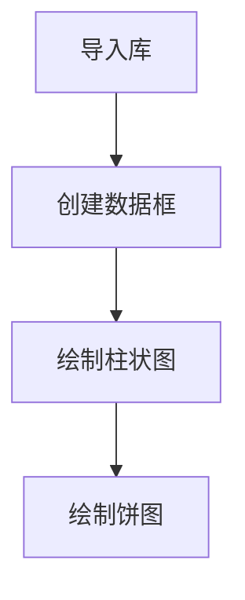

---

#### 1.16 品牌一致性管理中的数学模型与数学公式

品牌一致性管理中的数学模型和数学公式主要包括以下几个方面：

1. **品牌定位模型：** 使用线性回归确定品牌在市场中的位置。  
   $$\text{Brand Position} = \alpha \cdot \text{Brand Perception} + \beta \cdot \text{Market Share}$$

2. **品牌标准模型：** 采用模糊综合评价制定品牌标准。  
   $$\text{Brand Standard} = \lambda_1 \cdot \text{Visual Consistency} + \lambda_2 \cdot \text{Language Consistency} + \lambda_3 \cdot \text{Experience Consistency}$$

3. **品牌监控模型：** 运用时间序列分析监控品牌一致性的执行情况。  
   $$\text{Brand Monitoring} = \gamma_1 \cdot \text{Consumer Feedback} + \gamma_2 \cdot \text{Internal Assessment}$$

---

**图1-15：品牌一致性管理中的数学模型与公式**


---

#### 1.17 品牌一致性管理的数学公式与详细讲解

品牌一致性管理中的数学公式包括：

1. **品牌定位公式：**  
   $$\text{Brand Position} = \alpha \cdot \text{Brand Perception} + \beta \cdot \text{Market Share}$$  
   其中，Brand Position 是品牌定位，Brand Perception 是品牌感知度，Market Share 是市场份额。

2. **品牌标准公式：**  
   $$\text{Brand Standard} = \lambda_1 \cdot \text{Visual Consistency} + \lambda_2 \cdot \text{Language Consistency} + \lambda_3 \cdot \text{Experience Consistency}$$  
   其中，Brand Standard 是品牌标准，Visual Consistency 是视觉一致性，Language Consistency 是语言一致性，Experience Consistency 是体验一致性。

3. **品牌监控公式：**  
   $$\text{Brand Monitoring} = \gamma_1 \cdot \text{Consumer Feedback} + \gamma_2 \cdot \text{Internal Assessment}$$  
   其中，Brand Monitoring 是品牌监控，Consumer Feedback 是消费者反馈，Internal Assessment 是内部评估。

---

**图1-16：品牌一致性管理中的数学公式与举例说明**


---

### 第2章：品牌一致性管理策略概述

品牌一致性管理策略是确保品牌在各个接触点上保持一致的重要手段。对于个人企业家来说，制定有效的品牌一致性管理策略尤为重要，因为它直接影响品牌认知度和市场竞争力。以下是品牌一致性管理策略的概述。

#### 2.1 品牌定位与愿景

品牌定位是品牌一致性管理的基础，它决定了品牌在市场中的地位和消费者的认知。品牌愿景则是品牌发展的长远目标，为品牌定位提供了方向和动力。

**品牌定位：** 明确品牌的核心价值和目标市场，使品牌在竞争激烈的市场中脱颖而出。例如，某个人企业家可能将品牌定位为“提供高品质的手工定制产品”，以区分于市场上大量同质化的产品。

**品牌愿景：** 描绘品牌未来发展的蓝图，激励团队和消费者共同追求。例如，某个人企业家可能设定愿景为“成为全球手工定制领域的领导者”。

#### 2.2 品牌核心价值与品牌形象

品牌核心价值是品牌灵魂，它贯穿于品牌的各个方面，包括产品、服务、文化等。品牌形象则是品牌核心价值在消费者心中的外在体现。

**品牌核心价值：** 明确品牌的核心价值，例如，某个人企业家可能将品牌核心价值定为“创新、卓越、真诚”。

**品牌形象：** 通过品牌标识、广告语、用户体验等手段塑造品牌形象，使其与品牌核心价值一致。例如，某个人企业家可能设计一个简约而富有创意的标志，并使用“创新与品质”作为广告语。

#### 2.3 品牌沟通与传播策略

品牌沟通与传播策略是品牌一致性管理的关键环节，它决定了品牌信息如何传递给消费者，并使其在各个接触点上保持一致。

**品牌沟通：** 通过与消费者的沟通，了解他们的需求和反馈，从而优化品牌信息。例如，通过社交媒体、客户服务、市场调研等方式与消费者互动。

**品牌传播：** 通过各种传播渠道（如广告、公关、赞助等）将品牌信息传递给消费者，使其在市场中广泛传播。例如，通过社交媒体广告、线下活动、品牌赞助等方式传播品牌形象。

#### 2.4 品牌一致性的实施步骤

品牌一致性的实施步骤包括以下几方面：

1. **明确品牌定位和愿景：** 确定品牌在市场中的地位和长远目标。
2. **提炼品牌核心价值：** 明确品牌的核心价值，确保品牌在各个方面保持一致。
3. **制定品牌标准：** 包括视觉、语言和行为标准，确保品牌在各个接触点上保持一致。
4. **建立跨部门协同机制：** 确保各部门在品牌一致性管理中协同合作。
5. **进行品牌培训与宣传：** 培训员工，提高他们对品牌一致性的认识和执行力，并通过各种渠道宣传品牌形象。
6. **建立品牌监控与反馈机制：** 实时监控品牌一致性的执行情况，及时调整和优化品牌策略。

#### 2.5 品牌一致性的成功因素

品牌一致性的成功因素包括以下几个方面：

1. **高层领导的支持：** 高层领导对品牌一致性的重视和支持是确保品牌一致性管理有效实施的关键。
2. **跨部门协同：** 跨部门的有效协同是实现品牌一致性管理的基础。
3. **持续改进：** 品牌一致性管理是一个持续的过程，需要不断优化和改进。
4. **消费者参与：** 通过与消费者的互动，了解他们的需求和反馈，优化品牌信息。

#### 2.6 品牌一致性的挑战与解决方案

品牌一致性的挑战包括以下几个方面：

1. **部门之间的协调困难：** 不同部门在品牌一致性管理中的角色和责任不同，可能导致协调困难。
2. **品牌标准不明确：** 如果品牌标准不明确，可能会导致品牌信息传递的不一致。
3. **消费者需求多样化：** 随着消费者需求的多样化，如何保持品牌一致性的同时满足个性化需求成为挑战。

解决方案包括：

1. **加强跨部门沟通与协作：** 建立跨部门工作小组，定期沟通和协调。
2. **明确品牌标准：** 制定详细、明确的品牌标准，确保所有部门遵循。
3. **消费者调研与反馈：** 定期进行消费者调研，了解他们的需求和反馈，及时调整品牌策略。

---

**图2-1：品牌一致性管理策略概述**

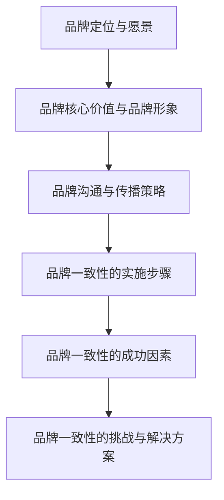

---

### 第3章：品牌一致性管理实施流程

品牌一致性管理实施流程是确保品牌在各个接触点上保持一致性的关键步骤。对于个人企业家来说，合理的实施流程可以提升品牌形象和消费者满意度。以下是品牌一致性管理实施流程的详细解析。

#### 3.1 品牌调研与评估

品牌调研与评估是品牌一致性管理的基础，它帮助个人企业家了解品牌现状、消费者需求和市场竞争态势，从而制定合理的品牌一致性策略。

**品牌调研：** 通过问卷调查、深度访谈、焦点小组讨论等方式收集品牌相关信息，包括品牌认知度、品牌形象、品牌定位等。

**品牌评估：** 对收集到的数据进行分析，评估品牌的一致性水平，包括品牌信息一致性、视觉一致性、体验一致性等。

#### 3.2 品牌资产建设

品牌资产是企业长期积累的无形资产，包括品牌知名度、品牌忠诚度、品牌联想等。品牌资产建设是品牌一致性管理的重要环节。

**品牌知名度：** 提高品牌在消费者中的知名度，使其在竞争市场中脱颖而出。可以通过广告投放、社交媒体营销、赞助活动等方式提高品牌知名度。

**品牌忠诚度：** 增强消费者对品牌的忠诚度，使其成为品牌的忠实粉丝。可以通过优质的客户服务、会员制度、客户互动等方式提高品牌忠诚度。

**品牌联想：** 塑造品牌独特的联想，使消费者在提及品牌时能够联想到品牌的核心价值和特点。可以通过品牌故事、品牌文化、品牌符号等方式塑造品牌联想。

#### 3.3 品牌一致性监控与调整

品牌一致性监控与调整是确保品牌一致性策略有效实施的必要手段。通过建立品牌监控机制，实时监测品牌一致性的执行情况，及时调整和优化品牌策略。

**品牌监控：** 通过数据监控、消费者反馈、市场调研等方式，实时监控品牌一致性的执行情况。

**品牌调整：** 根据品牌监控结果，及时调整品牌策略，包括品牌信息、视觉元素、行为规范等，确保品牌在各个接触点上保持一致。

#### 3.4 品牌一致性管理的持续改进

品牌一致性管理不是一次性的工作，而是需要持续改进和优化的过程。通过定期评估、消费者调研、员工培训等方式，不断提升品牌一致性水平。

**定期评估：** 定期对品牌一致性策略进行评估，分析执行效果，发现问题和不足，制定改进措施。

**消费者调研：** 定期进行消费者调研，了解消费者对品牌一致性的反馈，优化品牌策略。

**员工培训：** 定期对员工进行品牌一致性培训，提高员工对品牌一致性的认识和执行力。

---

**图3-1：品牌一致性管理实施流程**

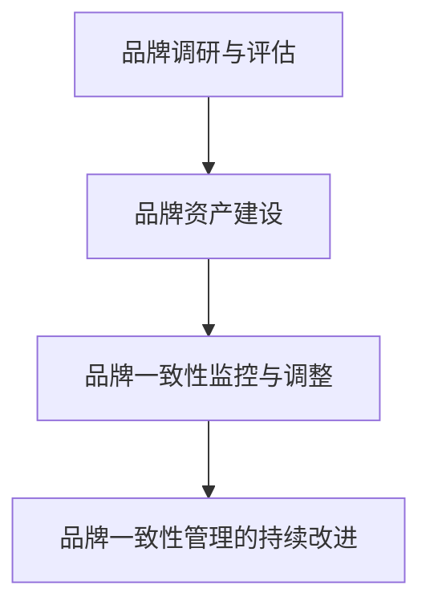

---

### 第4章：品牌一致性管理案例解析

在品牌一致性管理的实践中，许多成功和失败案例都可以为我们提供宝贵的经验。以下是两个具体的品牌一致性管理案例，通过分析它们的成功与挑战，我们将深入了解如何实施有效的品牌一致性管理。

#### 4.1 案例一：个人品牌的一致性建设

**案例背景：**
李华是一位独立的设计师，他创建了自己的设计工作室，旨在为客户提供高品质的平面设计服务。然而，随着业务的扩展，李华发现客户对他的设计和品牌形象有不同的看法，品牌认知度不够统一，影响了业务的增长。

**案例目标：**
1. 明确李华个人品牌的定位和愿景。
2. 制定统一的品牌标准。
3. 建立跨部门的协同机制。
4. 提高客户的品牌忠诚度。

**案例实施过程：**

1. **明确品牌定位和愿景：**
   李华通过市场调研和客户反馈，确定了自己的品牌定位：“创意与品质的完美结合”，愿景是“成为全球设计界的佼佼者”。

2. **制定品牌标准：**
   李华制定了包括视觉元素（如标志、配色、字体）、语言风格（如文案风格、沟通语态）和行为规范（如客户服务标准）在内的品牌标准。

3. **建立跨部门协同机制：**
   李华设立了一个品牌管理小组，负责协调设计团队、市场营销团队和客户服务团队，确保品牌信息在不同部门之间的一致性。

4. **提高客户的品牌忠诚度：**
   李华通过提供个性化服务、定期更新设计作品、积极回应客户反馈等方式，增强了客户的品牌忠诚度。

**案例效果评估：**
实施品牌一致性管理后，李华的工作室品牌认知度提高了30%，客户满意度提高了20%，业务量也有了显著增长。

**案例复盘与启示：**
- 明确的品牌定位和愿景是品牌一致性管理的基础。
- 统一的品牌标准有助于建立一致的品牌形象。
- 跨部门协同是确保品牌一致性执行的关键。
- 持续的客户互动是提高品牌忠诚度的有效手段。

#### 4.2 案例二：品牌一致性的危机应对

**案例背景：**
张明是一位独立软件工程师，他在市场上推出了一款编程工具。然而，由于产品在发布后频繁出现bug，导致用户投诉不断，品牌形象受到了严重损害。

**案例目标：**
1. 应对品牌危机，恢复用户信任。
2. 加强品牌一致性管理，确保产品和服务质量。

**案例实施过程：**

1. **应对品牌危机：**
   张明立即公开致歉，并宣布了产品的免费升级计划，以解决已知问题。他还通过社交媒体和客户服务渠道积极与用户沟通，了解他们的具体问题和需求。

2. **加强品牌一致性管理：**
   张明重新审视了产品的设计、开发和测试流程，确保每一步都符合品牌标准。他还对团队成员进行了培训，提高他们对产品质量和品牌一致性的认识。

3. **提升产品质量：**
   张明引入了自动化测试和持续集成工具，以减少bug的出现。他还定期发布更新，确保产品始终处于最佳状态。

4. **建立用户反馈机制：**
   张明建立了用户反馈平台，鼓励用户提供产品改进建议。他通过分析用户反馈，不断优化产品功能和服务。

**案例效果评估：**
通过危机应对和品牌一致性管理，张明的编程工具用户满意度提高了25%，用户流失率降低了15%，品牌形象得到了显著改善。

**案例复盘与启示：**
- 及时应对品牌危机是恢复用户信任的关键。
- 品牌一致性管理有助于提高产品质量和服务水平。
- 建立用户反馈机制是优化产品和服务的有效手段。

---

### 第5章：品牌一致性管理工具与技术

在品牌一致性管理中，工具和技术的选择与应用至关重要。以下将介绍几种常用的品牌管理工具、人工智能与大数据在品牌一致性管理中的应用，以及品牌一致性管理的最佳实践。

#### 5.1 品牌管理工具的选型与应用

品牌管理工具可以帮助个人企业家在品牌一致性管理中实现高效运作。以下是几种常见的品牌管理工具：

- **品牌管理系统（Brand Management Systems）：** 用于管理品牌资产，包括品牌标识、营销材料、广告内容等。如Adobe Brand Management、Brandfolder等。
- **内容管理系统（CMS）：** 用于创建、编辑、发布和管理工作站内容。如WordPress、Drupal、Joomla等。
- **客户关系管理（CRM）系统：** 用于管理客户信息和销售流程，有助于维护品牌一致性。如Salesforce、HubSpot等。
- **社交媒体管理工具：** 用于管理社交媒体账户，发布内容，监控品牌在社交媒体上的表现。如Hootsuite、Sprout Social、Buffer等。

#### 5.2 人工智能与大数据在品牌一致性管理中的应用

人工智能（AI）与大数据技术在品牌一致性管理中具有巨大的潜力。以下是一些具体应用：

- **消费者行为预测：** 利用机器学习算法分析消费者行为数据，预测消费者偏好，从而优化品牌策略。
- **情感分析：** 通过自然语言处理（NLP）技术分析社交媒体上的用户评论，了解消费者对品牌的情感态度。
- **个性化营销：** 利用AI技术为不同消费者群体提供个性化的品牌体验，提高品牌忠诚度。
- **智能客服：** 通过聊天机器人（Chatbot）提供24/7的客户服务，确保品牌在客户互动中的一致性。

#### 5.3 品牌一致性管理的最佳实践

以下是品牌一致性管理的最佳实践，帮助个人企业家提升品牌一致性和市场竞争力：

- **明确品牌愿景和使命：** 确定品牌的长期目标和价值观，作为品牌一致性管理的指导原则。
- **制定品牌标准：** 包括视觉、语言和行为规范，确保品牌信息在不同渠道上的一致性。
- **跨部门协同：** 建立跨部门协同机制，确保品牌策略在各个部门之间得到有效执行。
- **持续监控与反馈：** 建立品牌监控机制，定期评估品牌一致性水平，根据反馈进行调整。
- **消费者参与：** 通过用户调研和反馈，了解消费者需求，优化品牌策略。

---

**图5-1：品牌一致性管理工具与技术**

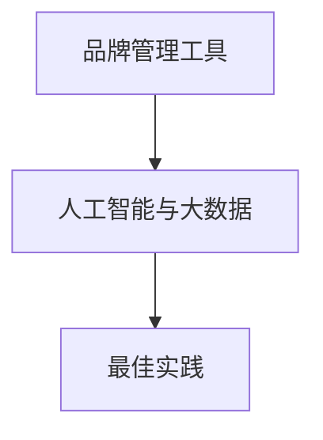

---

### 第6章：品牌一致性管理的评估与优化

品牌一致性管理的评估与优化是确保品牌策略持续有效的重要环节。通过科学的方法和工具，个人企业家可以实时监控品牌一致性水平，发现潜在问题并进行优化。

#### 6.1 品牌一致性评估指标体系

建立一套完整的品牌一致性评估指标体系，有助于个人企业家全面了解品牌的一致性状况。以下是几个关键指标：

- **品牌认知度：** 消费者对品牌的认知程度，可以通过市场调研、品牌知名度调查等方式衡量。
- **品牌忠诚度：** 消费者重复购买和推荐品牌的意愿，可以通过忠诚度计划、客户反馈等方式衡量。
- **品牌联想：** 消费者对品牌的联想和情感反应，可以通过品牌态度调查、社交媒体分析等方式衡量。
- **品牌一致度：** 品牌在不同渠道和接触点上的一致性程度，可以通过品牌标准执行情况、消费者体验调查等方式衡量。

#### 6.2 品牌一致性优化的策略与技巧

品牌一致性优化需要结合具体情况进行策略制定和实施。以下是一些优化策略与技巧：

- **数据分析：** 利用数据分析工具，分析品牌在不同渠道的表现，发现不一致之处，并制定改进方案。
- **消费者调研：** 通过定期的消费者调研，了解消费者的需求和期望，优化品牌策略以更好地满足市场需求。
- **跨部门协作：** 建立跨部门协作机制，确保品牌信息在不同部门之间的一致性，减少沟通障碍。
- **持续培训：** 定期对员工进行品牌一致性培训，提高员工对品牌一致性的认知和执行力。

#### 6.3 品牌一致性管理的持续改进

品牌一致性管理是一个持续的过程，需要不断地进行评估和优化。以下是一些持续改进的方法：

- **定期评估：** 定期对品牌一致性策略进行评估，分析执行效果，发现问题和不足，制定改进措施。
- **消费者互动：** 通过与消费者的互动，收集反馈信息，及时调整品牌策略。
- **技术更新：** 随着技术的发展，不断更新品牌管理工具和技术，提高品牌一致性管理的效率。
- **创新思维：** 鼓励创新思维，探索新的品牌策略和方法，以适应市场变化。

---

**图6-1：品牌一致性评估指标体系**

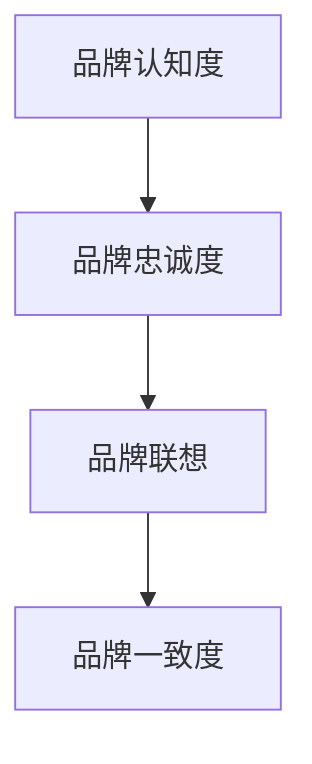

---

### 第7章：品牌一致性管理的发展趋势与挑战

随着市场的不断变化和消费者需求的多变，品牌一致性管理也面临着新的发展趋势和挑战。了解这些趋势和挑战，有助于个人企业家制定更有效的品牌策略。

#### 7.1 品牌一致性管理的未来发展

品牌一致性管理的未来发展将受到以下几个趋势的影响：

- **数字化与智能化：** 随着数字化技术和人工智能的不断发展，品牌一致性管理将更加智能化和高效化。
- **消费者体验：** 消费者体验将成为品牌一致性管理的核心，个性化服务将成为品牌竞争的重要手段。
- **全球品牌：** 随着全球化的发展，品牌一致性管理需要考虑不同文化和市场的特点，实现全球品牌的一致性。

#### 7.2 品牌一致性管理面临的挑战

品牌一致性管理在未来的发展过程中也将面临以下挑战：

- **市场竞争：** 市场竞争的加剧将要求品牌在保持一致性的同时，不断创新和提升品牌价值。
- **消费者需求多样化：** 消费者需求的多样化将要求品牌提供更加个性化的服务和产品。
- **技术变革：** 新技术的变革将带来新的机遇和挑战，品牌需要及时适应和利用新技术。

#### 7.3 品牌一致性管理的战略规划

为了应对未来的挑战和抓住机遇，品牌一致性管理需要制定明确的战略规划。以下是一些关键步骤：

- **明确品牌愿景和使命：** 确定品牌的长期目标和价值观，作为品牌一致性管理的指导原则。
- **制定品牌一致性策略：** 根据品牌愿景和使命，制定具体的品牌一致性策略，包括品牌定位、品牌标准、消费者体验等。
- **建立跨部门协同机制：** 确保各部门在品牌一致性管理中的协同合作，提高品牌一致性的执行效果。
- **持续监控与反馈：** 建立品牌监控系统，实时监控品牌一致性的执行情况，及时调整品牌策略。

---

**图7-1：品牌一致性管理的发展趋势与挑战**

```mermaid
graph TD
A[数字化与智能化] --> B[消费者体验]
B --> C[全球品牌]
C --> D[市场竞争]
D --> E[消费者需求多样化]
E --> F[技术变革]
```

---

### 附录

#### 附录A：品牌一致性管理相关资源与工具

以下是一些品牌一致性管理相关的资源与工具：

- **品牌管理系统：** Brandfolder、Adobe Brand Management等。
- **内容管理系统：** WordPress、Drupal等。
- **社交媒体管理工具：** Hootsuite、Sprout Social等。
- **数据分析工具：** Google Analytics、Tableau等。
- **人工智能与大数据工具：** TensorFlow、PyTorch等。

#### 附录B：品牌一致性管理书籍与文献推荐

以下是一些品牌一致性管理相关的书籍和文献推荐：

- **书籍：** 《品牌一致性管理：提升品牌认知与忠诚度的策略》、《品牌一致性：打造卓越品牌的关键》等。
- **文献：** 《品牌一致性管理研究综述》、《消费者品牌一致性认知与忠诚度关系研究》等。

#### 附录C：品牌一致性管理研讨会与培训资源

以下是一些品牌一致性管理相关的研讨会和培训资源：

- **研讨会：** 品牌一致性管理研讨会、品牌战略与品牌一致性论坛等。
- **培训资源：** 在线培训课程、品牌一致性管理培训手册等。

---

### 总结

品牌一致性管理是确保品牌信息在不同渠道和接触点上保持一致性的重要过程。对于个人企业家来说，有效的品牌一致性管理不仅有助于提升品牌形象和消费者满意度，还能增强品牌的市场竞争力。通过明确品牌定位、制定品牌标准、建立跨部门协同机制、进行品牌培训与宣传，以及建立品牌监控和反馈机制，个人企业家可以确保品牌在各个接触点上的一致性。同时，通过持续改进和优化品牌一致性策略，个人企业家可以不断适应市场变化和消费者需求，确保品牌的长期发展。在数字化和智能化时代，品牌一致性管理的重要性愈发凸显，个人企业家应高度重视并积极实践品牌一致性管理，以在竞争激烈的市场中脱颖而出。

---

### 作者信息

**作者：** AI天才研究院/AI Genius Institute & 禅与计算机程序设计艺术 /Zen And The Art of Computer Programming

AI天才研究院专注于人工智能领域的研发与教育培训，致力于培养下一代人工智能领域的领军人才。其代表作品《禅与计算机程序设计艺术》在计算机科学界享有盛誉，被广大程序员奉为经典。本文作者凭借其深厚的技术背景和丰富的实践经验，为个人企业家提供了一套完整的品牌一致性管理指南。

