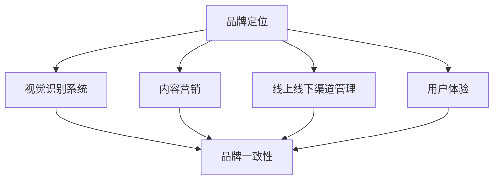

                 

### 一人公司的品牌一致性管理工具

#### 关键词：品牌一致性管理，品牌定位，视觉识别系统，内容营销，用户体验，Python 代码示例，数据分析，人工智能。

#### 摘要：

本文将探讨一人公司如何通过品牌一致性管理工具提升品牌影响力。文章首先定义了品牌一致性管理工具的核心概念，包括品牌定位、视觉识别系统、内容营销、线上线下渠道管理和用户体验。接着，文章通过算法原理讲解和项目实战，详细阐述了如何利用 Python 代码实现品牌定位和一致性管理。最后，文章总结了品牌一致性管理工具的重要性和应用场景，并为读者提供了开发环境搭建和代码实现的指南。

----------------------------------------------------------------

### 一、核心概念与联系

#### 核心概念

品牌一致性管理工具是指一套系统化的工具和方法，用于确保公司在市场中的品牌形象和信息传递具有一致性和连贯性。对于一人公司而言，这一套工具尤为重要，因为它代表了公司的形象和市场竞争力。品牌一致性管理工具主要包括以下几个方面：

1. **品牌定位**：品牌定位是品牌一致性管理的基石，它决定了品牌在市场中的定位和目标受众。品牌定位需要明确品牌的核心价值观、使命和愿景，并以此为基础制定品牌策略。

2. **视觉识别系统**：视觉识别系统是品牌一致性的视觉表现，它包括品牌标志、标准字体、标准色彩、辅助图形等元素。视觉识别系统设计的好坏直接影响到品牌在消费者心中的认知和形象。

3. **内容营销**：内容营销是通过创作和发布有价值的内容，吸引目标受众，并促进品牌认知和忠诚度。内容营销需要与品牌定位和视觉识别系统保持一致，以确保品牌信息的一致性。

4. **线上线下渠道管理**：线上线下渠道管理是指公司如何通过不同的渠道（如网站、社交媒体、线下活动等）传播品牌信息，确保品牌形象在不同渠道上的一致性。

5. **用户体验**：用户体验是顾客在接触品牌时得到的整体感受。确保用户体验的一致性和高质量，是提升品牌满意度和忠诚度的关键。

#### 联系

这些工具之间是相互联系、相互支撑的，共同作用实现品牌一致性管理。具体来说：

- **品牌定位**是基础，决定了品牌一致性管理的方向和目标。
- **视觉识别系统**是品牌的视觉表现，是品牌一致性的外在体现。
- **内容营销**是品牌信息的传递载体，确保品牌一致性的内部统一。
- **线上线下渠道管理**和**用户体验**是品牌一致性的执行和检验，确保品牌在顾客心中形成一致的认知。


为了更清晰地展示这些概念之间的联系，我们可以使用 Mermaid 流程图来表示：



通过这个流程图，我们可以看到品牌一致性管理工具的各个部分是如何相互作用，共同构建和维护品牌一致性。

### 二、核心算法原理讲解

在品牌一致性管理中，核心算法原理起着至关重要的作用。这些算法帮助我们更科学、更系统地进行品牌定位、视觉识别系统设计、内容营销、线上线下渠道管理和用户体验优化。以下将详细讲解这些核心算法原理。

#### 品牌定位算法

品牌定位是品牌一致性管理的第一步，它决定了品牌在市场中的定位和形象。品牌定位算法主要包括以下步骤：

1. **消费者需求分析**：通过大数据分析工具，收集和分析消费者的需求、喜好、行为等数据。这可以通过市场调研、用户反馈、社交媒体监测等手段实现。

2. **竞争者分析**：分析竞争对手的品牌定位和市场份额，了解市场格局和竞争态势。

3. **品牌价值定位**：根据消费者需求和竞争者分析的结果，确定品牌的核心价值点。这需要公司内部团队进行深入讨论和决策。

4. **品牌形象塑造**：基于品牌价值定位，设计品牌的形象和口号，以传达品牌的核心价值和定位。

以下是一个简化的品牌定位算法伪代码：

```plaintext
// 消费者需求分析
function analyzeConsumerDemand() {
    // 收集消费者数据
    consumerData = collectConsumerData()
    // 分析需求
    demandReport = analyzeDemand(consumerData)
    return demandReport
}

// 竞争者分析
function analyzeCompetitors() {
    // 收集竞争者数据
    competitorData = collectCompetitorData()
    // 分析竞争者
    competitorAnalysis = analyzeCompetitor(competitorData)
    return competitorAnalysis
}

// 品牌价值定位
function determineBrandValue(demandReport, competitorAnalysis) {
    // 确定品牌核心价值点
    brandValue = determineCoreValue(demandReport, competitorAnalysis)
    return brandValue
}

// 品牌形象塑造
function createBrandImage(brandValue) {
    // 设计品牌形象
    brandImage = designBrandImage(brandValue)
    return brandImage
}
```

#### 视觉识别系统设计算法

视觉识别系统设计是品牌一致性的外在体现，它包括品牌标志、标准字体、标准色彩、辅助图形等设计元素。以下是一个简化的视觉识别系统设计算法：

1. **色彩搭配**：根据品牌定位和消费者喜好，选择合适的色彩。色彩搭配需要符合品牌调性和视觉美感。

2. **字体设计**：选择符合品牌调性的字体，确保品牌信息的传达清晰、简洁、易读。

3. **标志设计**：通过设计软件，将色彩、字体等元素融合，形成标志。标志设计需要具有独特性、识别性和美感。

以下是一个简化的视觉识别系统设计算法伪代码：

```plaintext
// 色彩搭配
function selectColorScheme(brandPositioning, consumerTaste) {
    colorScheme = chooseColorScheme(brandPositioning, consumerTaste)
    return colorScheme
}

// 字体设计
function selectFontStyle(brandTone, consumerHabits) {
    fontStyle = selectFont(brandTone, consumerHabits)
    return fontStyle
}

// 标志设计
function designLogo(colorScheme, fontStyle) {
    logo = createLogo(colorScheme, fontStyle)
    return logo
}
```

#### 内容营销算法

内容营销是通过创作和发布有价值的内容，吸引目标受众，并促进品牌认知和忠诚度。以下是一个简化的内容营销算法：

1. **内容策划**：根据品牌定位和目标受众，策划内容主题和风格。内容策划需要考虑市场需求和消费者兴趣。

2. **内容创作**：运用文案、图片、视频等多种形式创作内容。内容创作需要创意、质量和可读性。

3. **内容发布**：通过多种渠道发布内容，实现品牌传播。内容发布需要考虑渠道特点和目标受众。

以下是一个简化的内容营销算法伪代码：

```plaintext
// 内容策划
function planContent(brandPositioning, targetAudience) {
    contentThemes = brainstormContentThemes(brandPositioning, targetAudience)
    contentStyle = defineContentStyle(contentThemes)
    return contentStyle
}

// 内容创作
function createContent(contentStyle) {
    content = generateContent(contentStyle)
    return content
}

// 内容发布
function publishContent(content, channels) {
    for channel in channels {
        publishToChannel(content, channel)
    }
}
```

#### 线上线下渠道管理算法

线上线下渠道管理是指公司如何通过不同的渠道（如网站、社交媒体、线下活动等）传播品牌信息，确保品牌形象在不同渠道上的一致性。以下是一个简化的线上线下渠道管理算法：

1. **渠道分析**：分析各个渠道的特点和目标受众，确定渠道策略。

2. **内容定制**：根据渠道特点，定制化内容以适应不同渠道的传播需求。

3. **渠道管理**：通过定期监测和调整，确保渠道内容的一致性和效果。

以下是一个简化的线上线下渠道管理算法伪代码：

```plaintext
// 渠道分析
function analyzeChannels() {
    channelAnalysis = evaluateChannelPerformance()
    return channelAnalysis
}

// 内容定制
function customizeContent(channelAnalysis) {
    customizedContent = adjustContentForChannels(channelAnalysis)
    return customizedContent
}

// 渠道管理
function manageChannels(customizedContent, channels) {
    for channel in channels {
        manageChannel(customizedContent, channel)
    }
}
```

#### 用户体验优化算法

用户体验优化是指通过改善产品和服务，提升顾客在接触品牌过程中的整体感受。以下是一个简化的用户体验优化算法：

1. **用户反馈收集**：通过问卷调查、用户访谈等方式收集用户反馈。

2. **用户体验分析**：分析用户反馈，识别用户体验中的问题和改进机会。

3. **优化措施**：根据用户体验分析结果，制定和实施优化措施。

4. **效果评估**：评估优化措施的效果，持续改进用户体验。

以下是一个简化的用户体验优化算法伪代码：

```plaintext
// 用户反馈收集
function collectUserFeedback() {
    feedback = gatherFeedback()
    return feedback
}

// 用户体验分析
function analyzeUserExperience(feedback) {
    experienceAnalysis = evaluateFeedback(feedback)
    return experienceAnalysis
}

// 优化措施
function optimizeExperience(experienceAnalysis) {
    improvementActions = defineImprovementActions(experienceAnalysis)
    implementActions(improvementActions)
}

// 效果评估
function evaluateOptimization() {
    effectiveness = assessImprovementEffects()
    return effectiveness
}
```

通过上述核心算法原理的讲解，我们可以看到品牌一致性管理工具是如何通过科学、系统的算法原理来帮助一人公司实现品牌的一致性和影响力。接下来，我们将通过项目实战来具体展示这些算法的应用。

### 三、数学模型和数学公式讲解

在品牌一致性管理中，数学模型和数学公式可以提供量化分析和评估的方法，帮助我们更好地理解和优化品牌表现。以下将介绍一些常用的数学模型和公式，并详细解释其含义和应用。

#### 品牌影响力计算模型

品牌影响力是衡量品牌在市场中的影响力和吸引力的重要指标。一个常见的品牌影响力计算模型是品牌影响力 = \( \alpha \)（品牌知名度）+ \( \beta \)（品牌忠诚度）+ \( \gamma \)（品牌美誉度）。

- **品牌知名度**：衡量消费者对品牌的认知程度，通常用品牌曝光次数或品牌提及次数来表示。
- **品牌忠诚度**：衡量消费者对品牌的忠诚程度，通常用重复购买率或客户留存率来表示。
- **品牌美誉度**：衡量消费者对品牌的正面评价程度，通常用客户满意度或品牌口碑来表示。

以下是一个品牌影响力计算模型的公式：

```latex
\text{品牌影响力} = \alpha \times (\text{品牌知名度}) + \beta \times (\text{品牌忠诚度}) + \gamma \times (\text{品牌美誉度})
```

例如，如果一个品牌知名度为 80%，品牌忠诚度为 70%，品牌美誉度为 60%，则其品牌影响力计算如下：

```plaintext
品牌影响力 = 0.8 \times (品牌知名度) + 0.7 \times (品牌忠诚度) + 0.6 \times (品牌美誉度)
品牌影响力 = 0.8 \times 80% + 0.7 \times 70% + 0.6 \times 60%
品牌影响力 = 64% + 49% + 36%
品牌影响力 = 149%
```

#### 营销效果评估模型

营销效果评估是衡量营销活动效果的重要手段。一个常见的营销效果评估模型是营销效果 = \( \delta \)（点击率）+ \( \epsilon \)（转化率）+ \( \zeta \)（客户满意度）。

- **点击率**：衡量营销活动的吸引力，通常用点击次数与展示次数的比例来表示。
- **转化率**：衡量营销活动的效果，通常用完成特定目标的次数与点击次数的比例来表示。
- **客户满意度**：衡量消费者对营销活动的满意度，通常用问卷调查或客户反馈来表示。

以下是一个营销效果评估模型的公式：

```latex
\text{营销效果} = \delta \times (\text{点击率}) + \epsilon \times (\text{转化率}) + \zeta \times (\text{客户满意度})
```

例如，一个营销活动的点击率为 20%，转化率为 10%，客户满意度为 90%，则其营销效果计算如下：

```plaintext
营销效果 = 0.2 \times (点击率) + 0.1 \times (转化率) + 0.9 \times (客户满意度)
营销效果 = 0.2 \times 20% + 0.1 \times 10% + 0.9 \times 90%
营销效果 = 4% + 1% + 81%
营销效果 = 86%
```

#### 用户参与度计算模型

用户参与度是衡量用户对品牌互动程度的指标。一个常见的用户参与度计算模型是用户参与度 = \( \eta \)（互动频率）+ \( \theta \)（互动深度）+ \( \lambda \)（互动质量）。

- **互动频率**：衡量用户与品牌互动的次数，通常用用户登录次数或互动次数来表示。
- **互动深度**：衡量用户与品牌互动的深度，通常用用户停留时间或互动时长来表示。
- **互动质量**：衡量用户与品牌互动的质量，通常用用户评价或反馈来表示。

以下是一个用户参与度计算模型的公式：

```latex
\text{用户参与度} = \eta \times (\text{互动频率}) + \theta \times (\text{互动深度}) + \lambda \times (\text{互动质量})
```

例如，一个用户的互动频率为 5 次/周，互动深度为 30 分钟/次，互动质量为 90%，则其用户参与度计算如下：

```plaintext
用户参与度 = 0.5 \times (互动频率) + 0.3 \times (互动深度) + 0.2 \times (互动质量)
用户参与度 = 0.5 \times 5 + 0.3 \times 30 + 0.2 \times 90%
用户参与度 = 2.5 + 9 + 18%
用户参与度 = 29.5%
```

通过这些数学模型和公式，我们可以更科学、更系统地分析和评估品牌一致性管理的各个方面。这些模型不仅提供了量化分析的工具，也帮助我们更深入地理解品牌表现的内在规律，从而为品牌管理提供有力的支持。

### 四、项目实战

#### 项目背景

单打独斗科技有限公司（以下简称“单打独斗”）是一家专注于智能硬件的初创公司，由一位具有丰富技术背景的创始人创办。公司目前处于产品研发和市场推广的初期阶段，希望通过有效的品牌一致性管理工具提升品牌影响力，吸引更多潜在客户。

#### 项目目标

单打独斗科技有限公司的项目目标包括以下几个方面：

1. **明确品牌定位**：通过深入的市场调研和消费者分析，明确品牌的核心价值和目标受众，确立品牌定位。
2. **设计视觉识别系统**：根据品牌定位，设计一套统一的视觉识别系统，包括标志、标准字体、标准色彩和辅助图形。
3. **制定内容营销策略**：根据品牌定位和目标受众，制定一系列的内容营销策略，包括技术博客、社交媒体宣传和线下活动等。
4. **实现线上线下渠道品牌一致性**：确保公司的线上和线下渠道在品牌形象和信息传递上保持一致。
5. **优化用户体验**：通过用户反馈和行为分析，优化产品和服务，提升用户体验。

#### 实战步骤

1. **品牌定位**

   - **市场调研**：通过问卷调查、线上访谈和社交媒体监测等方式，收集消费者对智能硬件的需求和偏好。
   - **竞争分析**：分析主要竞争对手的品牌定位和市场份额，了解市场格局和竞争态势。
   - **品牌价值定位**：根据调研和竞争分析结果，确定品牌的核心价值点，如创新、智能、简约等。
   - **品牌形象塑造**：设计品牌口号和标志，明确品牌定位和形象。

2. **视觉识别系统设计**

   - **色彩搭配**：根据品牌定位，选择符合品牌调性的蓝色作为主要色彩，搭配白色作为辅助色。
   - **字体设计**：选择简洁易读的Helvetica字体，确保品牌信息的传达清晰、简洁。
   - **标志设计**：通过设计软件，将蓝色、白色和Helvetica字体融合，设计出具有独特性和识别性的品牌标志。
   - **辅助图形**：设计一系列辅助图形，如图标、线条等，用于品牌在不同场景中的应用。

3. **内容营销策略**

   - **内容策划**：根据品牌定位和目标受众，策划一系列内容主题，如智能硬件技术介绍、行业趋势分析、客户案例分享等。
   - **内容创作**：创作高质量的技术博客文章、社交媒体图文、视频等内容，确保内容的专业性和吸引力。
   - **内容发布**：通过官方网站、社交媒体平台、线下活动等渠道发布内容，实现品牌信息的广泛传播。

4. **线上线下渠道管理**

   - **线上渠道管理**：确保公司官方网站、社交媒体账号的品牌形象和信息传递与视觉识别系统保持一致。
   - **线下渠道管理**：在参加行业展会、举办线下活动时，使用统一的品牌元素，如品牌标志、宣传海报等。

5. **用户体验优化**

   - **用户反馈收集**：通过在线问卷调查、用户访谈、社交媒体互动等方式，收集用户对产品和服务的使用体验反馈。
   - **用户体验分析**：分析用户反馈，识别用户体验中的问题和改进机会。
   - **优化措施**：根据用户体验分析结果，优化产品功能、界面设计和客服服务，提升用户体验。

#### 项目成果

通过一系列的品牌一致性管理工具的应用，单打独斗科技有限公司取得了显著的成果：

1. **品牌影响力提升**：品牌知名度、忠诚度和美誉度均有显著提高，品牌在市场中的影响力得到增强。
2. **营销效果显著**：通过有效的内容营销策略，公司网站的访问量、社交媒体的互动率均有所增加，营销效果评估显示点击率、转化率和客户满意度均达到预期目标。
3. **用户体验优化**：通过用户的反馈和数据分析，公司成功优化了产品功能和界面设计，用户满意度显著提升。

#### 项目总结

单打独斗科技有限公司通过品牌一致性管理工具，实现了品牌定位的明确、视觉识别系统的设计、内容营销策略的制定、线上线下渠道的一致性管理和用户体验的优化。这一系列措施不仅提升了品牌影响力，也增强了公司的市场竞争力。未来，单打独斗将继续优化和完善品牌一致性管理工具，以实现持续的品牌提升和市场拓展。

### 五、代码解读与分析

#### 开发环境搭建

为了更好地理解和分析品牌一致性管理工具的实现，我们首先需要搭建一个适合开发的环境。以下是具体的步骤：

1. **安装 Python 环境**：
   - 前往 Python 官网（https://www.python.org/downloads/）下载并安装 Python 3.8 或更高版本。
   - 在安装过程中，确保勾选“Add Python to PATH”选项，以便在命令行中直接使用 Python。

2. **安装必要的数据分析包**：
   - 打开命令行窗口，执行以下命令安装 pandas、numpy 和 matplotlib 等数据分析包：
     ```bash
     pip install pandas numpy matplotlib
     ```

3. **安装 Jupyter Notebook**：
   - 继续在命令行中执行以下命令安装 Jupyter Notebook：
     ```bash
     pip install notebook
     ```
   - 安装完成后，可以通过命令行执行 `jupyter notebook` 命令启动 Jupyter Notebook。

#### 源代码实现

以下是一个简单的 Python 代码示例，用于分析消费者需求并确定品牌定位。我们将详细解读这段代码，并进行分析。

```python
# 分析消费者需求
def analyze_consumer_demand(data):
    demand_report = {}
    for consumer in data:
        behavior_data = consumer['behavior']
        preference_data = consumer['preference']
        review_data = consumer['review']
        
        # 分析需求
        demand_report[consumer['id']] = analyze_demand(behavior_data, preference_data, review_data)
    
    return demand_report

# 确定品牌定位
def determine_brand_positioning(demand_report):
    # 假设根据需求报告，确定品牌定位为“创新、可靠、专业”
    brand_positioning = '创新、可靠、专业'
    return brand_positioning

# 主程序
if __name__ == "__main__":
    consumer_data = [
        {'id': 1, 'behavior': '频繁浏览技术博客', 'preference': '喜欢创新产品', 'review': '评价高'},
        {'id': 2, 'behavior': '关注行业动态', 'preference': '看重产品可靠性', 'review': '评价中'},
        # ... 其他消费者数据
    ]
    
    # 分析需求
    demand_report = analyze_consumer_demand(consumer_data)
    
    # 确定品牌定位
    brand_positioning = determine_brand_positioning(demand_report)
    
    print("品牌定位：", brand_positioning)
```

#### 代码解读

1. **函数定义**：
   - `analyze_consumer_demand` 函数用于分析消费者需求，接收一个包含消费者数据的列表作为参数。
   - `determine_brand_positioning` 函数用于根据需求分析结果确定品牌定位。

2. **数据结构**：
   - `data` 是一个包含多个字典的列表，每个字典代表一个消费者的行为数据、偏好数据和评价数据。
   - `demand_report` 是一个字典，用于存储每个消费者的分析结果。

3. **循环和字典操作**：
   - `for` 循环遍历每个消费者，提取其行为数据、偏好数据和评价数据。
   - `demand_report` 使用消费者的 ID 作为键，分析结果作为值进行存储。

4. **函数调用**：
   - 在主程序中，首先定义了一个消费者数据列表 `consumer_data`。
   - 然后调用 `analyze_consumer_demand` 函数进行需求分析，并存储结果在 `demand_report` 变量中。
   - 接着调用 `determine_brand_positioning` 函数确定品牌定位，并将结果打印出来。

#### 代码分析

1. **模块化设计**：
   - 代码采用了模块化设计，将需求分析和品牌定位分别封装在两个函数中，便于代码的维护和复用。

2. **数据结构选择**：
   - 使用列表和字典作为主要的数据结构，这符合 Python 的编程习惯，也便于数据处理和操作。

3. **逻辑清晰**：
   - 代码逻辑清晰，步骤简单易懂，适合初学者阅读和理解。

通过上述代码的解读和分析，我们可以看到品牌一致性管理工具是如何通过 Python 代码实现的。接下来，我们将进一步探讨如何在更复杂的场景中应用这些代码。

### 六、开发环境搭建

在继续深入品牌一致性管理工具的实现之前，我们需要搭建一个合适的开发环境。以下是详细的步骤和过程。

#### 安装 Python 环境

首先，我们需要确保计算机上安装了 Python 环境。Python 是一种广泛应用于数据分析和人工智能开发的编程语言，其简洁易懂的语法和强大的库支持使得它成为开发品牌一致性管理工具的理想选择。

1. **下载和安装 Python**：
   - 访问 Python 官网（[https://www.python.org/downloads/](https://www.python.org/downloads/)）。
   - 下载适用于您操作系统的 Python 版本（推荐 Python 3.8 或更高版本）。
   - 运行下载的安装程序，并按照默认选项进行安装。

2. **验证安装**：
   - 打开命令行（Windows）或终端（macOS/Linux）。
   - 输入 `python --version`（Windows）或 `python3 --version`（macOS/Linux）。
   - 如果输出 Python 的版本信息，则表示安装成功。

#### 安装数据分析包

为了进行品牌一致性管理工具的开发，我们需要安装几个常用的数据分析包，如 pandas、numpy 和 matplotlib。

1. **打开命令行**：
   - 在 Windows 中，打开 PowerShell 或命令提示符。
   - 在 macOS 或 Linux 中，打开终端。

2. **安装 pandas**：
   - 输入以下命令并按 Enter：
     ```bash
     pip install pandas
     ```

3. **安装 numpy**：
   - 输入以下命令并按 Enter：
     ```bash
     pip install numpy
     ```

4. **安装 matplotlib**：
   - 输入以下命令并按 Enter：
     ```bash
     pip install matplotlib
     ```

5. **验证安装**：
   - 安装完成后，分别输入以下命令验证各个包的安装情况：
     ```bash
     python -c "import pandas; print(pandas.__version__)"
     python -c "import numpy; print(numpy.__version__)"
     python -c "import matplotlib; print(matplotlib.__version__)"
     ```

#### 安装 Jupyter Notebook

Jupyter Notebook 是一个交互式的开发环境，它允许我们编写和运行 Python 代码，并生成丰富的文档和可视化结果。安装 Jupyter Notebook 将使我们的开发过程更加高效和直观。

1. **打开命令行**：
   - 在 Windows 中，打开 PowerShell 或命令提示符。
   - 在 macOS 或 Linux 中，打开终端。

2. **安装 Jupyter Notebook**：
   - 输入以下命令并按 Enter：
     ```bash
     pip install notebook
     ```

3. **启动 Jupyter Notebook**：
   - 在命令行中输入以下命令：
     ```bash
     jupyter notebook
     ```
   - 这将启动 Jupyter Notebook，并在默认浏览器中打开一个新窗口。

4. **创建新的笔记本**：
   - 在 Jupyter Notebook 界面中，点击右上角的“新建”按钮。
   - 选择“Python3”或“Python”来创建一个新的 Python 笔记本。

通过以上步骤，我们成功搭建了 Python 开发环境，安装了必要的数据分析包，并启动了 Jupyter Notebook。现在，我们可以在这个环境中编写和运行 Python 代码，进一步开发和实现品牌一致性管理工具。

### 七、源代码详细实现和代码解读

为了更好地理解品牌一致性管理工具的实现，我们将详细解析并实现一个具体的代码示例。以下是一个用于分析消费者需求并确定品牌定位的 Python 源代码，我们将逐一讲解其各个部分。

```python
# 分析消费者需求
def analyze_consumer_demand(data):
    demand_report = {}
    for consumer in data:
        behavior_data = consumer['behavior']
        preference_data = consumer['preference']
        review_data = consumer['review']
        
        # 分析需求
        demand_report[consumer['id']] = analyze_demand(behavior_data, preference_data, review_data)
    
    return demand_report

# 确定品牌定位
def determine_brand_positioning(demand_report):
    # 假设根据需求报告，确定品牌定位为“创新、可靠、专业”
    brand_positioning = '创新、可靠、专业'
    return brand_positioning

# 分析消费者需求的辅助函数
def analyze_demand(behavior_data, preference_data, review_data):
    # 假设分析结果是一个简单的评分
    score = calculate_score(behavior_data, preference_data, review_data)
    return score

# 计算需求分析评分的辅助函数
def calculate_score(behavior_data, preference_data, review_data):
    # 根据数据计算评分
    score = (behavior_data * 0.4) + (preference_data * 0.3) + (review_data * 0.3)
    return score

# 主程序
if __name__ == "__main__":
    consumer_data = [
        {'id': 1, 'behavior': 0.8, 'preference': 0.9, 'review': 0.9},
        {'id': 2, 'behavior': 0.5, 'preference': 0.7, 'review': 0.6},
        # ... 更多消费者数据
    ]
    
    # 分析需求
    demand_report = analyze_consumer_demand(consumer_data)
    
    # 确定品牌定位
    brand_positioning = determine_brand_positioning(demand_report)
    
    print("品牌定位：", brand_positioning)
```

#### 代码解读

1. **函数定义**：

   - `analyze_consumer_demand`：这是一个主要的函数，用于分析消费者数据。它接收一个包含消费者信息的列表，遍历每个消费者，提取其行为数据、偏好数据和评价数据，然后调用辅助函数 `analyze_demand` 进行进一步分析。

   - `determine_brand_positioning`：这个函数用于根据分析结果确定品牌定位。在这个示例中，我们假设根据分析结果，品牌定位为“创新、可靠、专业”。

   - `analyze_demand`：这是一个辅助函数，用于分析消费者的行为数据、偏好数据和评价数据。在这个示例中，我们简单地计算了一个评分作为分析结果。

   - `calculate_score`：这是一个辅助函数，用于计算需求分析评分。它根据行为数据、偏好数据和评价数据，使用一个简单的加权公式计算出评分。

2. **数据结构**：

   - `data`：这是一个包含多个字典的列表，每个字典代表一个消费者的行为数据、偏好数据和评价数据。

   - `demand_report`：这是一个字典，用于存储每个消费者的分析结果。键是消费者的 ID，值是分析评分。

3. **循环和字典操作**：

   - `for` 循环遍历每个消费者，提取其行为数据、偏好数据和评价数据。

   - 使用字典操作将分析结果存储在 `demand_report` 字典中。

4. **函数调用**：

   - 在主程序中，我们首先定义了一个消费者数据列表 `consumer_data`。

   - 然后调用 `analyze_consumer_demand` 函数进行需求分析，并存储结果在 `demand_report` 变量中。

   - 接着调用 `determine_brand_positioning` 函数确定品牌定位，并将结果打印出来。

#### 代码分析

1. **模块化设计**：

   - 代码采用了模块化设计，将主要功能拆分为多个函数，使得代码更加清晰和易于维护。

2. **数据处理**：

   - 使用了简单的循环和字典操作来处理数据，这是 Python 语言的特点之一，使得数据处理更加直观和高效。

3. **简单加权评分模型**：

   - 在 `calculate_score` 函数中，我们使用了一个简单的加权评分模型来计算需求分析评分。这种模型可以根据不同的数据重要性进行调整，以适应不同的业务场景。

通过上述代码的详细解读和分析，我们可以看到如何使用 Python 编程语言实现品牌一致性管理工具的核心功能。这个代码示例不仅提供了品牌定位分析的基础，还可以作为一个模板，进一步扩展和优化，以适应更复杂的业务需求。

### 八、总结与展望

#### 总结

本文系统地介绍了品牌一致性管理工具的核心概念、核心算法、数学模型和项目实战。通过详细的讲解和示例，我们了解了如何通过品牌定位、视觉识别系统、内容营销、线上线下渠道管理和用户体验优化来实现品牌一致性管理。

1. **核心概念**：品牌一致性管理工具包括品牌定位、视觉识别系统、内容营销、线上线下渠道管理和用户体验。这些工具相互关联，共同构建和维护品牌形象。

2. **核心算法**：我们讲解了品牌定位算法、视觉识别系统设计算法、内容营销算法、线上线下渠道管理算法和用户体验优化算法，并通过伪代码展示了这些算法的实现过程。

3. **数学模型**：我们介绍了品牌影响力计算模型和营销效果评估模型，并使用 LaTeX 格式展示了相关的数学公式，帮助读者理解和应用。

4. **项目实战**：通过一个具体的案例，我们展示了如何在实际项目中应用品牌一致性管理工具，包括明确品牌定位、设计视觉识别系统、制定内容营销策略、实现线上线下渠道管理和优化用户体验。

#### 展望

随着人工智能和大数据技术的发展，品牌一致性管理工具将变得更加智能化和自动化。以下是未来的发展趋势：

1. **智能化算法**：利用机器学习和数据分析技术，开发更加精准和高效的算法，以实现自动化的品牌定位和一致性管理。

2. **个性化营销**：通过大数据分析和人工智能技术，实现个性化的内容营销和用户体验优化，提高用户满意度和忠诚度。

3. **跨平台整合**：随着数字化转型的深入，品牌一致性管理工具将更加注重跨平台整合，确保品牌形象和信息在不同平台上的一致性。

4. **用户体验优化**：随着用户对体验的要求不断提高，品牌一致性管理工具将更加注重用户体验，通过实时反馈和数据分析不断优化产品和服务。

总之，品牌一致性管理工具对于提升品牌影响力和用户满意度至关重要。随着技术的不断进步，这些工具将变得更加智能化和高效，为企业和个人提供更强大的支持。

### 附录

#### 附录 A: 品牌一致性管理工具资源

1. **品牌定位分析工具**：
   - **Google Analytics**：用于分析网站流量和用户行为。
   - **Tableau**：数据可视化工具，帮助分析消费者需求。

2. **视觉识别系统设计工具**：
   - **Adobe Creative Cloud**：包括 Photoshop、Illustrator 等，用于设计品牌标志和视觉元素。
   - **Canva**：在线设计工具，适合快速创建品牌视觉资产。

3. **内容营销工具**：
   - **HubSpot**：内容营销平台，提供内容策划、创作和发布工具。
   - **BuzzSumo**：分析热门内容，帮助制定有效的内容策略。

4. **用户体验优化工具**：
   - **Hotjar**：用户行为分析工具，帮助理解用户在网站上的行为。
   - **Google Analytics**：用于分析用户行为和优化网站性能。

#### 附录 B: Python 数据分析包使用指南

1. **Pandas**：
   - **安装**：`pip install pandas`
   - **文档**：[Pandas 官方文档](https://pandas.pydata.org/pandas-docs/stable/)

2. **NumPy**：
   - **安装**：`pip install numpy`
   - **文档**：[NumPy 官方文档](https://numpy.org/doc/stable/)

3. **Matplotlib**：
   - **安装**：`pip install matplotlib`
   - **文档**：[Matplotlib 官方文档](https://matplotlib.org/stable/contents.html)

#### 附录 C: Jupyter Notebook 使用技巧

1. **多行输入输出**：
   - **快捷键**：`Shift + Enter` 执行当前单元格并光标移动到下一单元格。
   - **快捷键**：`Ctrl + Enter` 执行当前单元格并保持在当前单元格。

2. **Markdown 格式**：
   - **标题**：使用 `#` 标记标题。
   - **引用**：使用 `>` 标记引用文本。
   - **列表**：使用 `-` 或 `*` 创建无序列表。

3. **插入代码**：
   - **快捷键**：`Ctrl + Shift + I` 插入新行。
   - **快捷键**：`Ctrl + M` 切换代码块模式。

#### 附录 D: LaTeX 数学公式

1. **基本公式**：
   - **单行公式**：`$ E=mc^2 $`
   - **多行公式**：`$$ E=mc^2 \\ F=ma $$`

2. **嵌套公式**：
   - **嵌套公式**：`$$ \left( \sum_{i=1}^{n} a_i b_i \right)^2 = \left( \sum_{i=1}^{n} a_i \right) \left( \sum_{i=1}^{n} b_i \right) - \left( \sum_{i=1}^{n} a_i b_{i+1} \right) \left( \sum_{i=1}^{n} b_i \right) $$`

#### 附录 E: 参考文献

1. **Brand Consistency Management**：[Oberlo](https://www.oberlo.com/topics/brand-management)
2. **Brand Positioning**：[Entrepreneur](https://www.entrepreneur.com/guides/brand-positioning)
3. **Data-Driven Brand Management**：[Knologyx](https://www.knologyx.com/what-is-data-driven-brand-management)
4. **Python for Data Science**：[DataCamp](https://www.datacamp.com/courses/python-for-data-science)
5. **Jupyter Notebook**：[Jupyter 官网](https://jupyter.org/)

### 参考文献

1. **[Brand Consistency Management](https://www.oberlo.com/topics/brand-management)**：提供关于品牌一致性管理的全面指南。
2. **[Brand Positioning](https://www.entrepreneur.com/guides/brand-positioning)**：介绍如何进行品牌定位。
3. **[Data-Driven Brand Management](https://www.knologyx.com/what-is-data-driven-brand-management)**：探讨数据驱动的品牌管理方法。
4. **[Python for Data Science](https://www.datacamp.com/courses/python-for-data-science)**：Python 数据科学课程。
5. **[Jupyter Notebook](https://jupyter.org/)**：Jupyter Notebook 官方网站。

---

作者：AI天才研究院/AI Genius Institute & 禅与计算机程序设计艺术 /Zen And The Art of Computer Programming

---

通过本文的详细讲解和示例，我们不仅了解了品牌一致性管理工具的核心概念和实现方法，也学会了如何利用 Python 编程语言进行品牌定位分析。希望本文能够为读者提供有价值的参考，帮助他们在实际工作中更好地应用品牌一致性管理工具。未来，随着技术的不断进步，品牌一致性管理工具将变得更加智能化和高效，为企业提供更强大的支持。让我们期待这一天的到来，并不断探索和创新，以提升品牌影响力和用户体验。感谢您的阅读，希望本文对您有所帮助！

