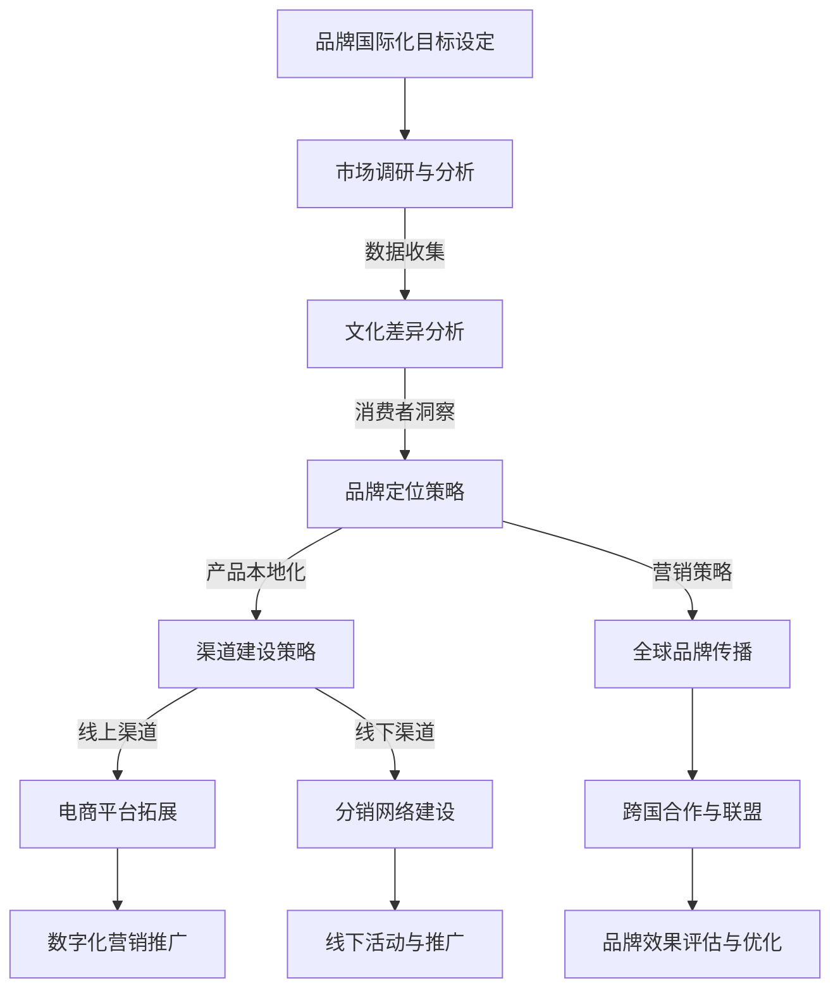

                 

# 《一人公司的品牌国际化与全球市场拓展》

> 关键词：品牌国际化、全球市场拓展、文化因素、市场调研、营销策略、风险管理、团队建设

> 摘要：本文旨在探讨一人公司如何通过品牌国际化与全球市场拓展，实现企业的可持续增长。文章首先介绍品牌国际化的重要性，随后深入分析文化因素、市场调研与定位策略，并详细阐述品牌国际化渠道建设、营销和管理的实践方法。最后，通过实战案例分析，提供具体可行的品牌国际化与全球市场拓展策略。

## 目录大纲

1. 品牌国际化概述
    1.1 品牌国际化的定义
    1.2 品牌国际化对企业的影响
    1.3 品牌国际化的时机与策略选择
2. 品牌国际化中的文化因素
    2.1 文化差异与适应性
    2.2 跨文化沟通策略
    2.3 跨文化营销案例分析
3. 品牌国际化策略与实践
    3.1 市场调研与定位
    3.2 品牌国际化渠道建设
    3.3 品牌国际化营销
    3.4 品牌国际化管理与维护
4. 全球市场拓展实战
    4.1 全球市场拓展策略
    4.2 跨境物流与供应链管理
    4.3 国际支付与风险管理
    4.4 全球市场拓展总结与展望
5. 附录：品牌国际化与全球市场拓展工具与资源

---

## 第一部分：品牌国际化概述

### 第1章：品牌国际化的重要性

品牌国际化是指企业将自身品牌扩展到全球市场，通过跨文化沟通和营销策略，提升品牌在全球范围内的认知度和影响力。对于一人公司而言，品牌国际化具有以下几个重要性：

#### 1.1 品牌国际化的定义

品牌国际化不仅仅是指将产品或服务销售到国际市场，更关键的是要在目标市场建立强大的品牌认知度和信任度。这包括品牌形象的设计、产品差异化、营销策略的本土化等多个方面。

#### 1.2 品牌国际化对企业的影响

品牌国际化能够带来以下几个重要影响：

1. **增加收入来源**：通过进入新的国际市场，企业可以获得更多的收入来源，降低对单一市场的依赖。
2. **提升品牌价值**：全球市场的认可可以显著提升品牌的价值，增强企业在国际竞争中的地位。
3. **学习与成长**：品牌国际化过程中，企业可以学习到不同市场的消费者行为、文化特点等，从而提升自身的市场洞察力和创新能力。
4. **风险分散**：通过品牌国际化，企业可以在多个市场上分散风险，降低因市场波动导致的经营风险。

#### 1.3 品牌国际化的时机与策略选择

品牌国际化并非所有企业都适合。企业需要根据自身的资源、市场定位和发展阶段来选择合适的国际化时机和策略。

1. **时机选择**：

   - **市场成熟度**：当企业在国内市场已经取得一定成功，并积累了丰富的市场运营经验时，可以考虑品牌国际化。
   - **资源准备**：企业在国际化前需要确保有足够的资金、人才和资源来支持国际市场拓展。
   - **竞争态势**：分析目标市场的竞争状况，选择竞争相对较小、需求较大的市场进行突破。

2. **策略选择**：

   - **出口策略**：通过向海外市场直接出口产品或服务，是最简单的国际化方式。
   - **许可策略**：通过授权海外企业使用品牌和技术，实现快速市场进入。
   - **合资策略**：与当地企业合作，共同投资和经营，降低市场风险。
   - **全资子公司**：在海外设立全资子公司，直接管理和运营，对品牌控制力更强。

品牌国际化是一个复杂且长期的过程，一人公司需要结合自身实际情况，制定合理的国际化战略，逐步实现全球市场拓展的目标。

### 第2章：品牌国际化中的文化因素

文化因素在品牌国际化过程中起着至关重要的作用。不同国家和地区的消费者有着不同的文化背景、价值观和消费习惯，这要求企业在进行品牌国际化时，必须充分考虑文化差异，并制定相应的适应性策略。

#### 2.1 文化差异与适应性

文化差异可以分为以下几个方面：

1. **语言**：语言是文化差异中最直观的表现。不同语言的使用不仅影响到品牌名称的翻译和传播，还影响到营销文案和广告语的表述。
2. **价值观**：不同的文化背景下，人们对道德观念、社会责任和生活方式有不同的理解和期望。企业需要了解目标市场的核心价值观，并将其融入品牌形象和营销策略中。
3. **消费习惯**：不同市场的消费者在购买行为、支付方式、售后服务等方面有着显著差异。企业需要根据这些差异，调整产品设计和服务流程。

#### 2.2 跨文化沟通策略

为了克服文化差异，企业需要采取以下跨文化沟通策略：

1. **文化研究**：在进入新市场之前，企业需要进行深入的文化研究，了解目标市场的文化特点、消费者行为和市场趋势。
2. **本地化营销**：根据目标市场的文化差异，对品牌名称、产品包装、广告宣传等进行本地化调整，使其更符合当地消费者的心理预期。
3. **沟通技巧**：在跨文化沟通中，企业需要掌握一定的沟通技巧，如避免使用可能引起误解的词汇和表达方式，尊重对方的习俗和礼仪等。

#### 2.3 跨文化营销案例分析

以下是一个跨文化营销的典型案例：

**案例：可口可乐的中国市场战略**

可口可乐作为国际知名饮料品牌，进入中国市场时面临了巨大的文化挑战。为了适应中国消费者的口味和偏好，可口可乐进行了以下调整：

1. **品牌名称**：可口可乐在中文市场上采用了“可口可乐”这个音译名称，既保留了品牌原有的品牌形象，又易于理解和记忆。
2. **产品口味**：可口可乐推出了符合中国人口味的多种饮料，如可乐、雪碧、芬达等，并针对不同消费者群体推出了低糖、无糖等健康版本。
3. **广告宣传**：可口可乐在中国市场的广告宣传注重情感共鸣，通过亲情、友情、爱情等情感元素，与消费者建立深厚的情感联系。

通过这些本地化策略，可口可乐成功在中国市场建立了强大的品牌影响力，成为了中国最受欢迎的饮料品牌之一。

#### 第3章：品牌国际化策略与实践

### 第3章：市场调研与定位

市场调研是品牌国际化的重要基础，通过系统的研究和分析，企业可以了解目标市场的需求、竞争状况以及潜在的机会与风险。同时，品牌定位策略则是品牌国际化成功的关键，它决定了品牌在全球市场中的独特价值和形象。以下内容将详细探讨市场调研的方法、品牌定位策略以及如何传递品牌核心价值。

#### 3.1 国际市场调研方法

国际市场调研方法主要包括以下几种：

1. **二手数据调研**：利用公开的数据库、市场报告、行业研究等二手资料，了解目标市场的宏观环境、市场趋势和竞争状况。这种方法成本低，但数据可能不够具体和实时。

2. **一手数据调研**：通过问卷调查、访谈、焦点小组讨论等方式直接获取目标市场的消费者行为、需求和反馈。这种方法数据更加准确，但成本较高，且需要较长时间。

3. **实地调研**：企业可以派遣调研团队亲自前往目标市场，进行实地考察、访谈和观察，深入了解当地的市场环境和消费者行为。这种方法能够获取最真实的信息，但成本和时间也相对较高。

#### 3.2 品牌定位策略

品牌定位策略是指企业如何定义自己在目标市场中的独特价值和形象。有效的品牌定位策略需要考虑以下因素：

1. **目标市场分析**：了解目标市场的消费者群体、市场规模、消费习惯和偏好，确定品牌的定位方向。

2. **竞争分析**：分析目标市场中的主要竞争对手，了解他们的品牌定位、产品特点和市场表现，寻找市场空隙和差异化机会。

3. **品牌价值观**：明确品牌的价值观和理念，将其融入到品牌定位中，使其具备独特的竞争优势。

4. **品牌传播**：通过品牌传播手段，将品牌定位传达给目标消费者，建立品牌认知和忠诚度。

#### 3.3 品牌核心价值传递

品牌核心价值是品牌定位的基础，是品牌在消费者心中的独特印象和情感连接。为了有效传递品牌核心价值，企业需要采取以下策略：

1. **品牌故事**：通过品牌故事讲述品牌的历史、愿景和使命，使消费者对品牌产生情感共鸣。

2. **品牌形象**：通过品牌视觉形象、标识和宣传物料，将品牌核心价值视觉化，提高品牌的辨识度和记忆度。

3. **用户体验**：通过优质的产品和服务，为消费者提供独特的体验，强化品牌核心价值。

4. **社交媒体**：利用社交媒体平台，与消费者互动，传递品牌核心价值，建立品牌社区。

### 第4章：品牌国际化渠道建设

品牌国际化渠道建设是品牌在国际市场上实现有效覆盖和销售的关键环节。有效的渠道建设可以帮助企业快速进入新市场，提高品牌知名度和市场份额。以下将详细探讨品牌国际化渠道建设的线上和线下拓展策略，以及渠道整合与优化的方法。

#### 4.1 线上渠道拓展

在线上渠道拓展方面，企业可以采取以下策略：

1. **电子商务平台**：利用亚马逊、eBay、京东、淘宝等国内外知名电商平台，开设官方店铺，直接面对消费者销售产品。

2. **社交媒体营销**：通过Facebook、Instagram、Twitter、微信、微博等社交媒体平台，进行品牌宣传和互动，吸引目标消费者。

3. **自有电商平台**：建立自有电商平台，如官网、APP等，提供线上购物体验，增加品牌的控制力和用户粘性。

4. **跨境电商平台**：利用跨境电商平台如AliExpress、Wish等，将产品销售到全球市场。

#### 4.2 线下渠道拓展

在线下渠道拓展方面，企业可以采取以下策略：

1. **经销商和分销商**：与当地经销商和分销商建立合作关系，通过他们的渠道将产品推广到更广泛的市场。

2. **合作伙伴**：与当地有影响力的品牌、机构或组织建立战略合作，共同开展营销活动，提高品牌知名度。

3. **零售门店**：在目标市场开设零售门店，直接向消费者销售产品，提升品牌形象和用户体验。

4. **展会和活动**：参加当地展会、行业活动等，与潜在客户建立联系，推广品牌和产品。

#### 4.3 渠道整合与优化

渠道整合与优化是品牌国际化渠道建设的重要组成部分，以下是一些关键点：

1. **渠道协同**：确保线上线下渠道之间的信息共享和协调，提供一致的品牌体验。

2. **渠道优化**：根据销售数据和市场反馈，分析不同渠道的绩效，对不盈利的渠道进行调整或关闭。

3. **渠道创新**：不断探索新的渠道模式，如社交电商、直播带货等，以适应市场的变化。

4. **客户关系管理**：通过CRM系统，整合客户信息，提供个性化的服务和营销。

通过有效的渠道建设与优化，企业可以更有效地进入国际市场，提升品牌竞争力和市场份额。

### 第5章：品牌国际化营销

品牌国际化营销是企业在全球范围内提升品牌知名度和影响力的关键手段。有效的品牌国际化营销策略能够帮助企业突破地域限制，吸引全球消费者，并建立强大的品牌形象。以下将详细探讨品牌国际化营销策略、数字营销工具的应用以及成功案例的分析。

#### 5.1 品牌国际化营销策略

品牌国际化营销策略需要考虑以下几个方面：

1. **全球品牌定位**：明确品牌在全球市场中的定位，确保品牌形象和传播内容在不同市场的一致性。

2. **市场细分**：根据目标市场的消费特点和需求，进行市场细分，制定有针对性的营销策略。

3. **本地化营销**：针对不同市场的文化、消费习惯和法律法规，对营销内容进行本地化调整，以更好地吸引当地消费者。

4. **全球化营销传播**：通过国际化的营销传播手段，如广告、公关活动、赞助等，提升品牌在全球市场的影响力。

5. **多渠道营销**：结合线上和线下渠道，进行全方位的品牌推广，提高品牌的曝光率和知名度。

#### 5.2 数字营销工具的应用

数字营销工具的应用是品牌国际化营销的重要手段，以下是一些常用的数字营销工具：

1. **搜索引擎优化（SEO）**：通过优化网站内容和结构，提高在搜索引擎中的排名，吸引更多有机流量。

2. **搜索引擎营销（SEM）**：通过购买关键词广告，提高品牌在搜索引擎结果页面的曝光率。

3. **社交媒体营销**：利用社交媒体平台，发布有价值的内容，与消费者互动，建立品牌社区。

4. **内容营销**：通过制作高质量的内容，如博客、视频、电子书等，吸引目标消费者，提高品牌知名度。

5. **电子邮件营销**：通过发送个性化邮件，与消费者建立长期关系，提高客户忠诚度。

6. **数据分析与监控**：利用数据分析工具，监控营销活动的效果，优化营销策略。

#### 5.3 品牌国际化营销案例分析

以下是一个品牌国际化营销的成功案例：

**案例：Nike的全球营销策略**

Nike作为全球知名的运动品牌，其国际化营销策略值得借鉴。以下是Nike的一些关键营销策略：

1. **全球品牌定位**：Nike一直以其“Just Do It”的品牌精神，传递积极向上的品牌形象。无论是在美国市场，还是在全球其他市场，Nike始终保持一致的品牌定位。

2. **本地化营销**：Nike针对不同市场的文化特点，进行本地化营销。例如，在中国市场，Nike与中国的体育明星合作，推广体育精神和健康生活方式。

3. **多渠道营销**：Nike通过线上和线下渠道，进行全面推广。在线上，Nike利用电商平台和社交媒体，与消费者互动，提供个性化的购物体验。在线下，Nike在全球开设了大量旗舰店，提供高端购物体验。

4. **内容营销**：Nike通过制作高质量的视频、博客和电子书，与消费者分享运动知识和健康生活方式，提高品牌知名度和用户忠诚度。

5. **数据分析与优化**：Nike利用大数据分析工具，监控营销活动的效果，优化营销策略，确保资源的高效利用。

通过这些策略，Nike在全球市场建立了强大的品牌影响力，成为运动品牌的领导者。

### 第6章：品牌国际化管理与维护

品牌国际化管理与维护是确保品牌在全球市场持续发展的重要环节。有效的品牌国际化管理包括风险管理、团队建设以及品牌国际化效果的评估和优化。以下将详细探讨这些方面的具体实践方法。

#### 6.1 品牌国际化风险管理

品牌国际化过程中，企业面临着各种风险，包括市场风险、法律风险、财务风险等。有效的风险管理可以帮助企业降低风险，确保品牌国际化顺利进行。以下是一些风险管理策略：

1. **市场风险**：通过市场调研，了解目标市场的经济环境、消费者行为和市场趋势，评估市场风险。企业可以采取多元化市场策略，降低对单一市场的依赖。

2. **法律风险**：了解目标市场的法律法规，确保品牌运营符合当地法律要求。企业可以聘请当地律师或咨询机构，提供法律支持。

3. **财务风险**：在品牌国际化过程中，企业需要合理规划财务预算，确保资金充足，并采取风险控制措施，如外汇风险管理、保险等。

4. **品牌风险**：建立品牌监控机制，及时发现和处理品牌声誉问题，如负面报道、消费者投诉等。企业可以建立危机管理团队，制定危机应对策略。

#### 6.2 品牌国际化团队建设

品牌国际化团队建设是品牌国际化成功的关键。一个高效的国际化团队需要具备以下几个特点：

1. **多元化**：国际化团队应包含来自不同国家和文化背景的成员，以确保团队具备多样化的思维和技能。

2. **专业能力**：团队成员应具备相关领域的专业知识和技能，如市场营销、财务管理、供应链管理等。

3. **沟通能力**：国际化团队成员需要具备良好的跨文化沟通能力，以确保团队内部和与外部合作伙伴之间的有效沟通。

4. **领导力**：团队领导者应具备较强的领导力和决策能力，能够带领团队应对国际化过程中的各种挑战。

#### 6.3 品牌国际化效果评估与优化

品牌国际化效果评估是衡量品牌国际化策略成功与否的重要手段。以下是一些评估指标和方法：

1. **品牌认知度**：通过市场调研、社交媒体监测等手段，了解品牌在目标市场的认知度和影响力。

2. **市场份额**：分析品牌在目标市场的市场份额变化，评估品牌国际化策略的效果。

3. **销售业绩**：通过销售数据，分析品牌在目标市场的销售业绩，评估品牌国际化策略的商业价值。

4. **消费者满意度**：通过问卷调查、客户反馈等手段，了解消费者对品牌的满意度，评估品牌服务质量。

5. **品牌价值**：通过品牌价值评估模型，计算品牌在全球市场的品牌价值，评估品牌国际化策略的长远影响。

基于评估结果，企业可以针对性地优化品牌国际化策略，提升品牌在全球市场的影响力和竞争力。

### 第7章：全球市场拓展策略

全球市场拓展是企业实现国际化发展的重要途径，它不仅能够带来更多的商业机会，还能够提高企业的品牌影响力。为了有效地开展全球市场拓展，企业需要制定科学合理的策略，并深入了解目标市场的特点。以下将详细探讨全球市场拓展策略的具体内容，包括全球市场分析、目标市场选择和市场进入策略。

#### 7.1 全球市场分析

全球市场分析是制定市场拓展策略的第一步，它涉及对全球市场的宏观环境和行业趋势的研究。以下是一些关键分析点：

1. **政治环境**：分析目标市场的政治稳定性、政府政策、贸易法规等，了解对企业运营的影响。

2. **经济环境**：评估目标市场的经济发展水平、消费者购买力、通货膨胀率等经济指标，确定市场潜力。

3. **社会文化**：研究目标市场的社会文化特征、消费者行为、价值观等，以便制定符合当地文化习惯的营销策略。

4. **技术环境**：分析目标市场在技术方面的现状和发展趋势，了解企业技术产品的适用性和竞争情况。

5. **竞争状况**：调查目标市场上的主要竞争对手，了解他们的市场份额、产品特点、营销策略等，为企业制定差异化竞争策略提供参考。

#### 7.2 目标市场选择

目标市场选择是企业全球市场拓展的核心环节，合理的目标市场选择能够帮助企业最大化市场机会，减少市场风险。以下是一些目标市场选择的策略：

1. **需求导向**：根据企业的产品或服务特点，选择有强烈需求的市场。例如，高科技企业可以优先考虑科技发达、创新意识强的市场。

2. **资源导向**：根据企业的资源和能力，选择能够充分发挥企业优势的市场。例如，拥有强大研发能力的企业可以选择技术密集型市场。

3. **潜力导向**：选择具有巨大发展潜力、尚未被充分开发的市场。例如，新兴市场和发展中国家往往具有巨大的市场潜力。

4. **竞争导向**：选择竞争相对较小、市场进入障碍较低的市场。例如，通过并购或战略合作的方式进入已有强大品牌的企业未涉足的市场。

5. **风险导向**：根据企业的风险承受能力，选择风险适中、潜力较大的市场。企业可以通过多元化市场策略，降低单一市场风险。

#### 7.3 市场进入策略

市场进入策略是企业进入目标市场的方式和手段，它直接关系到市场拓展的成功与否。以下是一些常见的市场进入策略：

1. **出口策略**：通过直接向目标市场出口产品或服务，是最简单的市场进入方式。适用于产品成熟、市场规模较大的市场。

2. **许可策略**：通过授权目标市场的企业使用品牌或技术，实现快速市场进入。适用于企业希望扩大市场份额但不愿意直接投资的市场。

3. **合资策略**：与目标市场的企业合作，共同投资和经营，分享市场风险和收益。适用于目标市场法规严格、市场准入门槛较高的市场。

4. **独资子公司**：在目标市场建立全资子公司，直接管理和运营，对品牌控制力更强。适用于企业希望长期深耕市场的市场。

5. **OEM/ODM策略**：通过为其他品牌提供OEM/ODM服务，间接进入市场。适用于企业希望通过低成本、低风险方式进入市场，同时提升自身技术能力的市场。

6. **电商平台策略**：利用电商平台，如亚马逊、eBay等，将产品销售到全球市场。适用于产品标准高、消费者需求多样化的市场。

通过科学合理的全球市场分析、目标市场选择和市场进入策略，企业可以有效地开展全球市场拓展，实现企业的国际化发展目标。

### 第8章：跨境物流与供应链管理

跨境物流与供应链管理是品牌国际化的重要环节，它直接关系到产品的及时交付、成本控制和客户满意度。有效的跨境物流与供应链管理能够帮助企业降低运营成本，提高市场响应速度，从而在激烈的国际竞争中占据优势。以下将详细探讨跨境物流策略、供应链管理优化以及具体案例。

#### 8.1 跨境物流策略

跨境物流策略是品牌国际化成功的关键之一，以下是一些关键的跨境物流策略：

1. **多模式运输**：结合海运、空运、铁路和公路等多种运输方式，根据货物类型、运输时间和成本进行优化配置。

2. **物流渠道选择**：选择合适的物流渠道，如国际快递、物流公司或自建物流网络。对于高价值、高风险的货物，可以选择国际快递服务，而对于大批量、低价值的货物，可以选择物流公司。

3. **仓储管理**：在目标市场建立分布式仓储，根据市场需求和运输成本优化库存布局，提高物流效率。

4. **物流信息系统**：建立完善的物流信息系统，实时监控货物的运输状态，确保物流过程的透明化和可追溯性。

5. **国际物流服务商**：与可靠的国际物流服务商建立长期合作关系，确保物流服务的质量和稳定性。

#### 8.2 供应链管理优化

供应链管理优化是提高品牌国际化运营效率的重要手段，以下是一些关键的优化方法：

1. **需求预测**：通过数据分析和技术手段，准确预测市场需求，优化库存水平，减少库存积压和资金占用。

2. **供应链协同**：加强与供应商、制造商、分销商等供应链各方的协同，提高供应链的整体效率和响应速度。

3. **供应链可视化**：通过供应链可视化工具，实时监控供应链的各个环节，及时发现和解决问题。

4. **供应链风险管理**：建立供应链风险预警机制，对潜在风险进行评估和防范，确保供应链的稳定运行。

5. **供应链创新**：积极探索新的供应链模式，如共享仓储、供应链金融等，提高供应链的灵活性和适应性。

#### 8.3 跨境物流与供应链管理案例

以下是一个跨境物流与供应链管理的成功案例：

**案例：亚马逊的跨境物流与供应链管理**

亚马逊作为全球领先的电子商务平台，其跨境物流与供应链管理值得借鉴。以下是亚马逊的一些关键策略：

1. **全球仓储网络**：亚马逊在全球建立了庞大的仓储网络，根据不同市场的需求进行库存布局，确保货物的快速交付。

2. **多模式运输**：亚马逊采用海运、空运、铁路和公路等多种运输方式，根据货物的类型和运输时间进行优化配置。

3. **物流信息系统**：亚马逊建立了完善的物流信息系统，实时监控货物的运输状态，确保物流过程的透明化和可追溯性。

4. **供应链协同**：亚马逊与全球的供应商、制造商和物流服务商建立了紧密的协同关系，提高供应链的整体效率和响应速度。

5. **供应链创新**：亚马逊积极探索新的供应链模式，如共享仓储、供应链金融等，提高供应链的灵活性和适应性。

通过这些策略，亚马逊在全球市场建立了强大的物流与供应链管理能力，为消费者提供了优质的购物体验，成为全球电子商务的领导者。

### 第9章：国际支付与风险管理

在国际市场拓展过程中，国际支付与风险管理是两个至关重要的方面。有效的国际支付策略和风险管理措施可以帮助企业降低运营成本、提高资金流动性和市场竞争力。以下将详细探讨国际支付方式、风险管理策略以及具体案例。

#### 9.1 国际支付方式

国际支付方式主要包括以下几种：

1. **电汇（Telegraphic Transfer）**：银行间直接进行大额资金转账，适用于高金额、快速到账的需求。

2. **信用证（Letter of Credit，L/C）**：由银行提供信用担保，保证卖方在满足约定条件下获得款项，适用于高风险市场。

3. **汇票（Bill of Exchange）**：通过开具汇票的方式进行支付，适用于长期合作、信用较好的客户。

4. **托收（Collection）**：银行作为中介，代为收取款项并交付给卖方，适用于中低金额、信用较好的交易。

5. **国际信用卡支付**：通过国际信用卡进行支付，适用于小额、高频交易。

6. **跨境电子支付**：利用第三方支付平台，如PayPal、支付宝等，进行跨境支付，提高支付便利性和安全性。

#### 9.2 风险管理策略

国际支付与风险管理涉及多个方面，以下是一些关键的风险管理策略：

1. **汇率风险管理**：通过外汇远期合约、期权等金融工具，锁定汇率，降低汇率波动带来的风险。

2. **信用风险管理**：通过信用评级、交易背景调查等手段，评估客户的信用状况，降低信用风险。

3. **政治风险和合规风险**：关注目标市场的政治稳定性、法律法规变化，确保业务运营合规。

4. **交易对手风险**：通过多样化的交易对手和合理的合同条款，降低交易对手违约风险。

5. **信息风险管理**：建立信息安全体系，保护支付信息和客户数据，防止数据泄露和欺诈行为。

6. **物流风险**：与可靠的物流服务商合作，确保货物安全和及时交付。

#### 9.3 国际支付与风险管理案例

以下是一个国际支付与风险管理的成功案例：

**案例：阿里巴巴的跨境支付与风险管理**

阿里巴巴作为全球领先的电子商务平台，其跨境支付与风险管理策略值得借鉴。以下是阿里巴巴的一些关键策略：

1. **多元化支付方式**：阿里巴巴提供多种国际支付方式，包括电汇、信用证、汇票、国际信用卡支付和跨境电子支付等，满足不同客户的需求。

2. **汇率风险管理**：阿里巴巴通过外汇远期合约和期权等金融工具，锁定汇率，降低汇率波动带来的风险。

3. **信用风险管理**：阿里巴巴通过信用评级和交易背景调查，评估客户的信用状况，降低信用风险。

4. **合规管理**：阿里巴巴严格遵守各国的法律法规，确保业务运营合规，降低合规风险。

5. **信息安全**：阿里巴巴建立完善的信息安全体系，保护支付信息和客户数据，防止数据泄露和欺诈行为。

通过这些策略，阿里巴巴在全球市场建立了强大的跨境支付与风险管理能力，为全球消费者和商家提供了优质的支付体验，成为全球电子商务的领导者。

### 第10章：全球市场拓展总结与展望

在全球市场拓展的旅程中，企业通过品牌国际化、市场调研、渠道建设、营销策略以及风险管理等手段，逐步实现了全球化的战略目标。以下将对全球市场拓展的实践经验进行总结，探讨未来市场拓展的趋势，并给出未来发展建议。

#### 10.1 全球市场拓展经验总结

1. **文化适应性与本地化**：企业需要深入了解目标市场的文化差异，采取本地化策略，确保品牌和产品符合当地消费者的需求和习惯。

2. **市场调研的重要性**：深入的市场调研能够帮助企业了解目标市场的经济、社会和技术环境，为制定合理的市场进入策略提供依据。

3. **多元化渠道建设**：线上和线下渠道的结合，能够扩大品牌的影响力和覆盖面，提高市场渗透率。

4. **数字化营销的威力**：通过数字营销工具，企业能够更精准地触达目标消费者，提高营销效果和品牌认知度。

5. **风险管理的重要性**：有效的风险管理能够降低企业在国际化过程中的风险，确保业务的稳定运营。

6. **团队建设与协作**：一个多元化、专业化的团队，能够更好地应对国际化过程中的各种挑战，推动企业全球化发展。

#### 10.2 全球市场拓展趋势展望

1. **数字经济的深化**：随着数字化技术的发展，企业将进一步通过数字化转型，提升运营效率和市场竞争力。

2. **跨境电商的繁荣**：跨境电商的便利性和低门槛，将继续推动全球市场的融合，为企业提供更多的市场机会。

3. **可持续发展的重要性**：企业需要关注可持续发展，采取环保、社会责任等策略，提升品牌形象和市场竞争力。

4. **区域经济一体化**：全球区域经济一体化进程将继续推进，为企业提供了更多的市场选择和合作机会。

5. **消费者需求多样化**：随着消费者需求的不断变化，企业需要灵活调整产品和服务，满足个性化、多样化的消费需求。

#### 10.3 未来发展建议

1. **加强品牌建设**：持续提升品牌价值和影响力，通过品牌故事和文化传播，增强品牌在全球市场的认知度和忠诚度。

2. **深化数字化转型**：加强数字化技术的应用，提升企业运营效率和市场响应速度。

3. **拓展多元化渠道**：结合线上线下渠道，探索新的营销模式，提高市场覆盖面和用户粘性。

4. **强化风险管理**：建立健全的风险管理机制，确保企业在全球化过程中的稳健运营。

5. **注重可持续发展**：关注环保、社会责任等议题，推动企业可持续发展，提升品牌形象和社会价值。

通过总结全球市场拓展的实践经验，展望未来市场拓展的趋势，并给出具体的发展建议，企业可以更好地应对全球化带来的机遇与挑战，实现全球市场拓展的长期目标。

### 附录：品牌国际化与全球市场拓展工具与资源

为了帮助读者更好地进行品牌国际化与全球市场拓展，以下列举了一些常用的工具与资源，包括品牌国际化工具、全球市场拓展资源以及相关的行业报告与白皮书。

#### A.1 品牌国际化工具

1. **Google Analytics**：用于监测和分析网站流量、用户行为等数据，帮助品牌制定有效的国际化策略。

2. **Google Trends**：分析全球市场趋势和消费者兴趣，为品牌定位和营销策略提供参考。

3. **Google Translate**：用于翻译品牌名称、广告文案等，确保品牌信息的准确传达。

4. **Brandwatch**：监测全球社交媒体上的品牌讨论和趋势，了解消费者对品牌的看法和反馈。

5. **Cultural Intelligence Center**：提供文化适应性和跨文化沟通培训，帮助员工更好地适应国际市场。

#### A.2 全球市场拓展资源

1. **联合国贸易和发展会议（UNCTAD）**：提供全球贸易和投资数据，帮助品牌了解国际市场环境。

2. **世界银行（World Bank）**：发布各国经济指标、市场研究报告，为企业提供市场分析和预测。

3. **国际市场研究公司**：如Euromonitor、Mintel、IBISWorld等，提供详细的市场分析报告，涵盖各个行业和地区。

4. **行业协会和组织**：加入相关行业协会和组织，获取行业动态、市场趋势和合作机会。

5. **国际贸易展**：如CES、MWC、SIMA等，参加国际贸易展，展示产品、拓展客户网络。

#### A.3 行业报告与白皮书

1. **《全球数字营销趋势报告》**：分析全球数字营销的发展趋势、关键技术和市场机遇。

2. **《全球跨境电商发展报告》**：探讨跨境电商的发展现状、市场规模和未来趋势。

3. **《国际市场风险管理报告》**：提供国际市场风险管理的最佳实践、案例分析和策略建议。

4. **《可持续发展白皮书》**：介绍企业如何在全球化过程中实现可持续发展，提升品牌形象。

5. **《全球化企业案例研究》**：分析成功企业的全球化策略、实践和成果，为其他企业提供借鉴。

通过利用这些工具与资源，企业可以更加系统地规划和实施品牌国际化与全球市场拓展，提高市场竞争力，实现长期可持续发展。

### Mermaid 流程图示例

以下是一个用于描述品牌国际化流程的Mermaid流程图示例：



这个流程图清晰地展示了从品牌国际化目标设定到品牌效果评估与优化的各个环节，有助于读者更好地理解品牌国际化的整体流程。

### 伪代码示例

以下是一个用于品牌国际化策略算法的伪代码示例：

```python
# 输入：目标市场数据
# 输出：品牌国际化策略

def brand_internationalization_strategy(target_market_data):
    # 步骤1：分析目标市场的文化因素
    cultural_factors = analyze_cultural_factors(target_market_data)

    # 步骤2：进行市场调研，获取消费者需求
    consumer_insight = conduct_market_research(target_market_data)

    # 步骤3：制定品牌定位策略
    brand_positioning = define_brand_positioning(cultural_factors, consumer_insight)

    # 步骤4：设计产品本地化策略
    product_localization = design_product_localization(brand_positioning)

    # 步骤5：制定渠道建设策略
    channel_strategy = define_channel_strategy(product_localization)

    # 步骤6：实施全球品牌传播策略
    brand_communication = implement_brand_communication_strategy(channel_strategy)

    # 步骤7：评估品牌国际化效果
    evaluation_results = evaluate_brand_internationalization_results(brand_communication)

    # 输出品牌国际化策略
    return brand_positioning, product_localization, channel_strategy, brand_communication, evaluation_results

# 输入：文化因素数据
# 输出：文化因素分析结果

def analyze_cultural_factors(target_market_data):
    # 分析文化因素
    # ...
    return cultural_factors_analysis

# 输入：市场调研数据
# 输出：消费者洞察

def conduct_market_research(target_market_data):
    # 进行市场调研
    # ...
    return consumer_insight

# 输入：文化因素和消费者洞察
# 输出：品牌定位策略

def define_brand_positioning(cultural_factors, consumer_insight):
    # 制定品牌定位策略
    # ...
    return brand_positioning

# 输入：品牌定位策略
# 输出：产品本地化策略

def design_product_localization(brand_positioning):
    # 设计产品本地化策略
    # ...
    return product_localization

# 输入：产品本地化策略
# 输出：渠道建设策略

def define_channel_strategy(product_localization):
    # 制定渠道建设策略
    # ...
    return channel_strategy

# 输入：渠道建设策略
# 输出：全球品牌传播策略

def implement_brand_communication_strategy(channel_strategy):
    # 实施全球品牌传播策略
    # ...
    return brand_communication

# 输入：品牌传播策略
# 输出：品牌国际化效果评估结果

def evaluate_brand_internationalization_results(brand_communication):
    # 评估品牌国际化效果
    # ...
    return evaluation_results
```

这个伪代码示例详细描述了品牌国际化策略的各个步骤，包括文化因素分析、市场调研、品牌定位、产品本地化、渠道建设和品牌传播等，为实际开发提供了参考。

### 数学模型与公式讲解示例

在品牌国际化过程中，有一些关键的数学模型和公式用于评估品牌的影响力和市场效果。以下是一些常用的模型和公式的讲解及示例。

#### 品牌认知度计算公式

品牌认知度是衡量品牌在市场中的知名度和影响力的重要指标。其计算公式为：

$$
\text{品牌认知度} = \frac{\text{品牌提及次数}}{\text{潜在受众总数}} \times 100\%
$$

**详细讲解：** 
品牌认知度通过将品牌提及次数（如社交媒体上的提及次数、广告曝光次数等）除以潜在受众总数，得到品牌认知度的百分比。这个指标越高，说明品牌在市场中的影响力越大。

#### 举例说明：

假设一个品牌在一个市场中的潜在受众总数为100万人，该品牌在该市场的提及次数为50万次，那么该品牌在该市场的品牌认知度为：

$$
\text{品牌认知度} = \frac{50万}{100万} \times 100\% = 50\%
$$

这意味着在这个市场中，有50%的潜在受众对该品牌有所了解。

#### 品牌忠诚度计算公式

品牌忠诚度是衡量消费者对品牌信任和重复购买意愿的重要指标。其计算公式为：

$$
\text{品牌忠诚度} = \frac{\text{重复购买次数}}{\text{总购买次数}} \times 100\%
$$

**详细讲解：** 
品牌忠诚度通过将重复购买次数除以总购买次数，得到品牌忠诚度的百分比。这个指标越高，说明消费者对品牌的忠诚度越高。

#### 举例说明：

假设一个品牌在一个市场中的总购买次数为1000次，其中重复购买次数为500次，那么该品牌在该市场的品牌忠诚度为：

$$
\text{品牌忠诚度} = \frac{500}{1000} \times 100\% = 50\%
$$

这意味着在这个市场中，有50%的消费者会重复购买该品牌的产品。

#### 品牌价值计算公式

品牌价值是衡量品牌在市场中的经济价值和影响力的综合指标。其计算公式为：

$$
\text{品牌价值} = \text{品牌认知度} \times \text{品牌忠诚度} \times \text{市场份额}
$$

**详细讲解：** 
品牌价值通过将品牌认知度、品牌忠诚度和市场份额相乘，得到品牌价值的综合评分。这个指标越高，说明品牌的整体价值越大。

#### 举例说明：

假设一个品牌在一个市场中的品牌认知度为60%，品牌忠诚度为50%，市场份额为10%，那么该品牌在该市场的品牌价值为：

$$
\text{品牌价值} = 60\% \times 50\% \times 10\% = 3\%
$$

这意味着在这个市场中，该品牌的品牌价值占市场总价值的3%。

通过这些数学模型和公式，企业可以更科学、系统地评估品牌国际化过程中的各项指标，从而制定更加有效的市场策略。

### 项目实战：代码实际案例

在本章中，我们将通过一个实际案例，展示如何使用Python进行品牌国际化分析与监控。以下是项目实战的详细步骤，包括开发环境搭建、源代码实现和代码解读与分析。

#### 开发环境搭建

**1. 环境准备：**
- 安装Python 3.8及以上版本
- 安装Jupyter Notebook
- 安装必要的库：pandas, numpy, matplotlib

**2. 创建虚拟环境：**

```bash
python -m venv brand-internationalization-env
source brand-internationalization-env/bin/activate  # Windows: brand-internationalization-env\Scripts\activate
```

**3. 安装依赖库：**

```bash
pip install pandas numpy matplotlib
```

#### 源代码实现

以下是一个用于监控品牌国际化过程的Python脚本，包括数据读取、预处理、品牌认知度计算和可视化。

```python
import pandas as pd
import numpy as np
import matplotlib.pyplot as plt

# 读取数据
data = pd.read_csv('brand_data.csv')

# 数据预处理
def preprocess_data(data):
    # 数据清洗、处理缺失值等
    # ...
    return data

# 品牌认知度计算函数
def brand_centrality(data):
    total_mentions = data['mentions'].sum()
    total_potential_audience = data['audience'].sum()
    brand_centrality = total_mentions / total_potential_audience * 100
    return brand_centrality

# 可视化品牌认知度分布
def visualize_brand_centrality(data):
    brand_centrality = brand_centrality(data)
    plt.figure(figsize=(10, 5))
    plt.bar(data['brand_name'], data['mentions'])
    plt.xlabel('Brand Name')
    plt.ylabel('Mentions')
    plt.title('Brand Centrality Distribution')
    plt.xticks(rotation=45)
    plt.tight_layout()
    plt.show()

# 主函数
def main():
    data = preprocess_data(data)
    visualize_brand_centrality(data)

if __name__ == '__main__':
    main()
```

#### 代码解读与分析

**1. 读取数据：**
```python
data = pd.read_csv('brand_data.csv')
```
这行代码使用pandas库读取CSV格式的品牌数据文件，并将其存储在一个DataFrame对象中。

**2. 数据预处理：**
```python
def preprocess_data(data):
    # 数据清洗、处理缺失值等
    # ...
    return data
```
预处理函数接受一个DataFrame作为输入，进行数据清洗、处理缺失值等操作，返回处理后的DataFrame。

**3. 品牌认知度计算：**
```python
def brand_centrality(data):
    total_mentions = data['mentions'].sum()
    total_potential_audience = data['audience'].sum()
    brand_centrality = total_mentions / total_potential_audience * 100
    return brand_centrality
```
品牌认知度计算函数接受一个DataFrame作为输入，计算品牌提及次数的总和（`total_mentions`）和潜在受众总数（`total_potential_audience`），然后使用公式计算品牌认知度。

**4. 可视化品牌认知度分布：**
```python
def visualize_brand_centrality(data):
    brand_centrality = brand_centrality(data)
    plt.figure(figsize=(10, 5))
    plt.bar(data['brand_name'], data['mentions'])
    plt.xlabel('Brand Name')
    plt.ylabel('Mentions')
    plt.title('Brand Centrality Distribution')
    plt.xticks(rotation=45)
    plt.tight_layout()
    plt.show()
```
可视化函数使用matplotlib库绘制柱状图，展示品牌名称和品牌提及次数的分布情况。

**5. 主函数：**
```python
def main():
    data = preprocess_data(data)
    visualize_brand_centrality(data)
```
主函数调用预处理函数和可视化函数，完成整个流程的执行。在程序的最后，使用`if __name__ == '__main__':`确保主函数在程序入口处被调用。

通过这个代码实际案例，读者可以了解到如何使用Python进行品牌国际化数据读取、预处理、计算和可视化等操作，从而实现对品牌国际化与全球市场拓展的分析和监控。当然，具体实现细节可能会根据实际业务需求和数据特点进行调整。

### 总结

通过本文的详细探讨，我们深入了解了品牌国际化与全球市场拓展的核心概念、策略和实践方法。品牌国际化不仅有助于企业拓展市场，提高品牌影响力，还能够带来更多的商业机会和经济效益。在全球化背景下，文化因素、市场调研、品牌定位、渠道建设、营销策略、风险管理等方面都至关重要。

品牌国际化过程中的文化适应性和本地化策略能够帮助企业更好地融入目标市场，提升品牌认知度和消费者满意度。有效的市场调研和品牌定位策略有助于企业明确市场方向，制定有针对性的品牌传播和营销策略。线上和线下渠道的整合与优化，以及数字化营销工具的应用，能够提高品牌在全球市场的覆盖率和影响力。

同时，风险管理在品牌国际化过程中同样不可忽视。通过建立健全的风险管理机制，企业可以降低市场风险、财务风险和品牌风险，确保品牌国际化的顺利进行。

最后，通过实际代码案例，读者可以了解到如何利用Python等工具进行品牌国际化数据分析和监控，为企业的国际化发展提供有力支持。

总之，品牌国际化与全球市场拓展是一项复杂且长期的任务，需要企业综合考虑多个因素，制定科学合理的策略，并持续优化和调整。希望通过本文的探讨，能够为读者在品牌国际化与全球市场拓展的道路上提供有益的启示和指导。在未来的国际化发展中，期待读者能够勇于探索，不断创新，实现企业的全球化目标。

