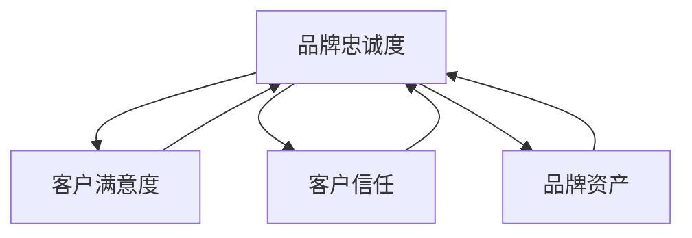
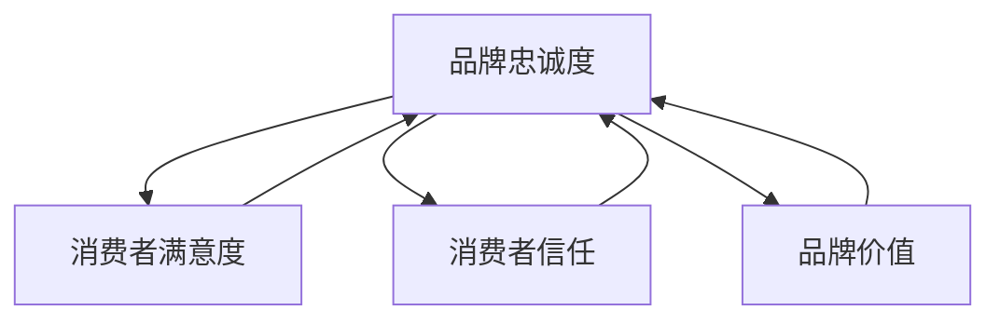

                 

### 第1章：品牌忠诚度定义与意义

品牌忠诚度是指消费者在同类产品或服务中进行重复购买和持续购买的行为倾向，它反映了消费者对品牌的认可、信任和依赖。品牌忠诚度高意味着消费者在面对竞争品牌时更倾向于选择特定品牌，这对企业来说具有重要的战略意义。

首先，**品牌忠诚度定义**的核心在于消费者的持续购买行为。这种行为不仅仅体现在购买频率上，还包括购买数量和购买总金额。例如，一个消费者每月购买一次某品牌的产品，且每次购买的数量和金额都较大，那么这个消费者的品牌忠诚度相对较高。

其次，**品牌忠诚度对企业的重要性**体现在以下几个方面：

1. **稳定的市场份额**：高品牌忠诚度的消费者为企业提供了稳定的客户基础，有助于企业在市场竞争中保持领先地位。
2. **增加销售收入**：忠诚度高的消费者倾向于增加购买频率和购买量，从而为企业带来更高的销售收入。
3. **降低营销成本**：忠诚度高的消费者更愿意自主传播品牌，为企业节省大量营销成本。
4. **提升品牌价值**：品牌忠诚度是品牌资产的重要组成部分，高品牌忠诚度有助于提升品牌在市场上的溢价能力。

为了更好地理解品牌忠诚度的概念，我们可以通过一个具体的例子来说明。假设一个消费者经常购买某品牌的咖啡机，即使市场上出现了许多竞争品牌，这个消费者仍然坚持购买该品牌的咖啡机。这个例子中，消费者对品牌的忠诚度体现在重复购买和持续购买的行为上，这也反映了品牌在消费者心中的高度认可和信任。

### 核心概念与联系

品牌忠诚度与客户满意度、客户信任、品牌资产等概念密切相关。以下是一个简单的 Mermaid 流程图，展示这些概念之间的关系：



**客户满意度**是消费者对品牌产品或服务的整体感受，高满意度有助于提高品牌忠诚度。**客户信任**则是指消费者对品牌的信任程度，信任是建立品牌忠诚度的关键因素之一。**品牌资产**包括品牌知名度、品牌联想、品牌忠诚度等，高品牌忠诚度是品牌资产的核心体现。

### 核心算法原理讲解

品牌忠诚度的衡量可以通过以下算法原理进行：

1. **重复购买率**：计算消费者在一定时间内重复购买同一品牌产品的频率。公式如下：
   $$
   重复购买率 = \frac{重复购买次数}{总购买次数} \times 100\%
   $$

2. **品牌偏好度**：计算消费者在同类产品中更倾向于选择某一品牌的程度。公式如下：
   $$
   品牌偏好度 = \frac{偏好该品牌的产品购买次数}{总购买次数} \times 100\%
   $$

3. **顾客满意度**：通过调查问卷或访谈了解消费者对品牌产品或服务的整体满意度。常用的指标是净推荐值（NPS），计算公式如下：
   $$
   NPS = \frac{推荐者得分 - 被动者得分}{总样本数}
   $$
   其中，推荐者得分为9-10分的受访者得分，被动者得分为7-8分的受访者得分。

4. **推荐意愿**：通过调查了解消费者向他人推荐品牌产品或服务的意愿。推荐意愿高意味着消费者对品牌有较高的忠诚度。

### 实际应用举例

假设一家咖啡连锁店希望了解其品牌忠诚度，可以采取以下步骤：

1. **收集数据**：收集一定时间内消费者的购买记录，包括购买频率、购买数量和购买总金额。
2. **计算重复购买率**：根据购买记录计算每位消费者的重复购买率。
3. **计算品牌偏好度**：根据购买记录计算每位消费者对品牌的偏好度。
4. **进行满意度调查**：通过问卷调查或访谈了解消费者对咖啡连锁店的整体满意度。
5. **计算NPS**：根据满意度调查结果计算NPS。
6. **分析推荐意愿**：通过调查了解消费者向他人推荐咖啡连锁店的意愿。

通过以上步骤，咖啡连锁店可以全面了解品牌忠诚度水平，并根据分析结果制定相应的提升策略。

总结来说，品牌忠诚度是企业长期发展的关键，通过合理的策略和有效的衡量方法，企业可以不断提升品牌忠诚度，从而在市场竞争中脱颖而出。

### 参考文献

1. Keller, K. L. (2013). Strategic brand management: Building, measuring, and managing brand equity. Pearson.
2. Fornell, C., & Anderson, E. W. (1996). Customer satisfaction, stock price performance, and market value. Journal of Marketing, 60(4), 56-66.
3. Reichheld, F. F., & Sasser Jr, W. E. (1990). Zero defections: Quality comes to services. Harvard Business Review, 68(5), 105-111.

---

#### 1.2 品牌忠诚度对企业的重要性

品牌忠诚度对企业的重要性不容忽视。首先，高品牌忠诚度可以帮助企业**稳定市场份额**。在竞争激烈的市场环境中，品牌忠诚度高的消费者更倾向于选择特定品牌，从而减少竞争对手的市场渗透。例如，苹果公司的产品以其高品质和创新性著称，吸引了大量的忠实用户，这些用户在面对其他品牌时仍然选择苹果，从而帮助苹果公司稳固了市场地位。

其次，品牌忠诚度可以显著**增加销售收入**。忠诚度高的消费者不仅购买频率较高，购买数量和金额也往往更大。以可口可乐为例，该公司通过多年的品牌建设和营销策略，积累了大量的忠诚用户，这些用户在每次购买时都会选择可口可乐，从而为可口可乐带来了稳定的收入增长。

此外，品牌忠诚度还可以**降低营销成本**。忠诚度高的消费者更愿意自主传播品牌，通过口碑传播等方式帮助品牌吸引新客户。这种自主传播的效果远比传统的广告宣传更为有效，因为消费者之间的推荐往往更具说服力。例如，忠诚的苹果用户常常会向朋友和家人推荐苹果的产品，从而帮助苹果公司节省了大量营销费用。

最后，品牌忠诚度是提升**品牌价值**的重要途径。品牌价值包括品牌知名度、品牌联想和品牌忠诚度等多个方面，其中品牌忠诚度是品牌资产的核心组成部分。高品牌忠诚度意味着消费者对品牌的认可和信任，这种认可和信任可以转化为品牌溢价，使企业在产品定价上具有更大的灵活性。例如，奢侈品牌路易威登（Louis Vuitton）因其高品牌忠诚度而能够在市场上定价高于其他品牌，这显示了品牌忠诚度对企业价值的重要贡献。

总之，品牌忠诚度对企业来说具有多方面的战略意义。通过提升品牌忠诚度，企业不仅可以在市场竞争中占据有利地位，还可以实现收入增长和品牌价值的提升。因此，品牌忠诚度管理应成为企业品牌战略的核心内容之一。

### 核心概念与联系

品牌忠诚度是一个多维度的概念，与多个关键因素紧密相关。以下是一个简化的 Mermaid 流程图，展示了品牌忠诚度与其他相关概念之间的联系：



**消费者满意度**是品牌忠诚度的一个重要驱动因素。消费者对品牌产品或服务的满意度越高，他们越可能表现出品牌忠诚度。高满意度通常来源于优质的产品质量、良好的顾客体验和及时有效的客户服务。

**消费者信任**是品牌忠诚度的另一个关键因素。信任是消费者对品牌承诺和可靠性的认可，它是建立长期关系的基石。消费者对品牌的信任越高，他们越可能继续购买并推荐该品牌。

**品牌价值**则是品牌忠诚度的综合体现。品牌价值包括品牌知名度、品牌联想、品牌资产等多个方面。高品牌忠诚度通常意味着品牌具有较高的价值，因为忠诚的消费者为品牌带来了持续的收入和口碑。

通过这个流程图，我们可以清晰地看到品牌忠诚度是如何受到消费者满意度、消费者信任和品牌价值共同影响的。理解这些概念之间的相互作用，对于制定有效的品牌忠诚度提升策略至关重要。

### 核心算法原理讲解

品牌忠诚度的计算通常涉及多个指标，这些指标共同反映了消费者对品牌的忠诚程度。以下是几个常见的品牌忠诚度计算指标及其算法原理：

1. **重复购买率**：重复购买率是衡量消费者在一定时间内重复购买同一品牌产品的频率。其计算公式如下：

   $$
   重复购买率 = \frac{重复购买次数}{总购买次数} \times 100\%
   $$

   例如，一个消费者在一个月内购买了三次该品牌的产品，而总购买次数为五次，则其重复购买率为60%。

2. **品牌偏好度**：品牌偏好度衡量消费者在同类产品中更倾向于选择某一品牌的程度。其计算公式如下：

   $$
   品牌偏好度 = \frac{偏好该品牌的产品购买次数}{总购买次数} \times 100\%
   $$

   例如，如果一个消费者在同类产品中购买了五次，而这五次都是同一品牌的产品，则其品牌偏好度为100%。

3. **净推荐值（NPS）**：净推荐值是衡量消费者向他人推荐品牌产品或服务意愿的一个重要指标。其计算公式如下：

   $$
   NPS = \frac{推荐者得分 - 被动者得分}{总样本数}
   $$

   其中，推荐者得分是9-10分的受访者得分，被动者得分是7-8分的受访者得分。例如，如果10名受访者中有5人愿意强烈推荐品牌，有3人表示可能推荐，则NPS为2。

4. **推荐意愿**：推荐意愿是通过调查或访谈了解消费者向他人推荐品牌产品或服务的程度。推荐意愿越高，表明消费者对品牌的忠诚度越高。

通过以上指标的组合，企业可以全面评估品牌忠诚度，并制定相应的提升策略。

### 实际应用举例

为了更好地理解品牌忠诚度的计算和应用，我们可以通过一个具体的案例来展示。

假设一家零售公司想要评估其品牌忠诚度，收集了以下数据：

- 某段时间内，共有1000名消费者购买了该公司的产品。
- 其中500名消费者在购买后一个月内再次购买了该公司产品，而另外500名消费者没有重复购买。
- 消费者满意度调查显示，满意度得分为80分（满分100分）。
- NPS调查显示，NPS得分为30分。
- 调查显示，40%的消费者愿意向朋友和家人推荐该公司产品。

根据上述数据，我们可以计算品牌忠诚度的几个关键指标：

1. **重复购买率**：
   $$
   重复购买率 = \frac{500}{1000} \times 100\% = 50\%
   $$

2. **品牌偏好度**：
   $$
   品牌偏好度 = \frac{500}{1000} \times 100\% = 50\%
   $$

3. **NPS**：
   $$
   NPS = \frac{30}{100} \times 100\% = 30\%
   $$

4. **推荐意愿**：
   $$
   推荐意愿 = 40\%
   $$

通过这些指标，我们可以得出以下结论：

- 重复购买率和品牌偏好度均为50%，表明消费者在一定时间内重复购买该公司产品的频率较高，品牌在消费者心中有一定的偏好。
- NPS得分为30%，表明消费者对品牌的整体满意度较高，有较好的推荐意愿。
- 推荐意愿为40%，意味着有40%的消费者愿意向他人推荐品牌产品。

根据这些数据，该公司可以进一步分析提升品牌忠诚度的策略，例如优化产品质量、提升客户服务、增加个性化营销等，以提高品牌忠诚度。

通过以上案例，我们可以看到，品牌忠诚度的计算和应用在实际业务中具有重要作用，有助于企业了解自身品牌表现，并制定相应的改进措施。

### 参考文献

1. Reichheld, F. F., & Sasser Jr, W. E. (1990). Zero defections: Quality comes to services. Harvard Business Review, 68(5), 105-111.
2. Fornell, C., & Anderson, E. W. (1996). Customer satisfaction, stock price performance, and market value. Journal of Marketing, 60(4), 56-66.
3. Keller, K. L. (2013). Strategic brand management: Building, measuring, and managing brand equity. Pearson.

---

#### 1.3 品牌忠诚度的衡量方法

衡量品牌忠诚度是品牌管理中至关重要的一环。以下将介绍几种常用的品牌忠诚度衡量方法：

1. **重复购买率**

重复购买率是衡量品牌忠诚度最直接和最常用的方法之一。它通过统计消费者在一定时间内重复购买同一品牌产品的次数来计算。计算公式如下：

$$
重复购买率 = \frac{重复购买次数}{总购买次数} \times 100\%
$$

例如，如果某个消费者在三个月内购买了10次同一品牌的产品，而总共购买了15次，则其重复购买率为：

$$
重复购买率 = \frac{10}{15} \times 100\% = 66.67\%
$$

2. **品牌偏好度**

品牌偏好度是指消费者在同类产品中更倾向于选择某一品牌的程度。它通过计算消费者选择某一品牌的产品购买次数占总购买次数的比例来衡量。计算公式如下：

$$
品牌偏好度 = \frac{偏好该品牌的产品购买次数}{总购买次数} \times 100\%
$$

例如，如果一个消费者在同类产品中购买了5次A品牌，总共购买了10次，则其品牌偏好度为：

$$
品牌偏好度 = \frac{5}{10} \times 100\% = 50\%
$$

3. **顾客满意度**

顾客满意度是衡量品牌忠诚度的重要指标之一。它通过调查或问卷的方式，了解消费者对品牌产品或服务的整体满意度。顾客满意度通常使用净推荐值（NPS）来衡量。NPS的计算公式如下：

$$
NPS = \frac{推荐者得分 - 被动者得分}{总样本数}
$$

其中，推荐者得分是9-10分的受访者得分，被动者得分是7-8分的受访者得分。例如，如果10名受访者中有5人强烈推荐品牌，3人可能推荐，则NPS为：

$$
NPS = \frac{5 - 3}{10} \times 100\% = 20\%
$$

4. **推荐意愿**

推荐意愿是指消费者愿意向他人推荐品牌产品或服务的程度。它通常通过调查或访谈的方式了解。推荐意愿高的消费者通常具有较高的品牌忠诚度。推荐意愿可以采用以下几种方式衡量：

- **五点量表法**：通过一个五点量表（非常愿意、愿意、中立、不愿意、非常不愿意）来衡量消费者的推荐意愿。
- **问卷法**：通过问卷调查，直接询问消费者是否愿意向他人推荐品牌产品或服务。

例如，如果问卷调查结果显示，80%的消费者表示愿意向他人推荐该品牌，则其推荐意愿为80%。

通过以上几种方法，企业可以全面了解品牌忠诚度，并据此制定相应的营销策略。例如，如果重复购买率较低，企业可以分析原因，可能是产品质量、服务体验或价格策略等方面存在问题，并针对性地进行改进。如果顾客满意度较高，企业可以进一步采取措施，如增加个性化服务，以进一步提升品牌忠诚度。

总之，品牌忠诚度的衡量方法多种多样，企业应根据自身实际情况，选择合适的衡量方法，以准确评估品牌忠诚度，并制定有效的提升策略。

### 核心算法原理讲解

为了深入理解品牌忠诚度的计算方法，我们可以通过以下算法原理进行讲解。这些算法不仅帮助我们量化品牌忠诚度，还可以为企业提供有针对性的提升策略。

#### 1. 重复购买率计算算法

重复购买率是衡量品牌忠诚度最常用的指标之一，其计算公式如下：

$$
重复购买率 = \frac{重复购买次数}{总购买次数} \times 100\%
$$

算法步骤：

1. **数据收集**：收集一段时间内消费者的购买记录，包括购买次数和购买频率。
2. **筛选重复购买者**：从购买记录中筛选出在一定时间内重复购买同一品牌产品的消费者。
3. **计算重复购买次数**：统计筛选出的消费者在一段时间内的重复购买次数。
4. **计算总购买次数**：统计所有消费者的总购买次数。
5. **应用公式**：将重复购买次数除以总购买次数，并乘以100%，得到重复购买率。

伪代码示例：

```
function calculate_repeated_purchase_rate(purchases, total_purchases):
    repeated_purchases = count_repeat_purchasers(purchases)
    total_repeated_purchases = sum(purchases.values())
    total_customers = len(total_purchases)
    repeated_purchase_rate = (repeated_purchases / total_customers) * 100
    return repeated_purchase_rate

function count_repeat_purchasers(purchases):
    repeat_purchasers = {}
    for purchaser, purchase_list in purchases.items():
        if len(purchase_list) > 1:
            repeat_purchasers[purchaser] = len(purchase_list)
    return repeat_purchasers
```

#### 2. 品牌偏好度计算算法

品牌偏好度衡量消费者对某一品牌的偏好程度，其计算公式如下：

$$
品牌偏好度 = \frac{偏好该品牌的产品购买次数}{总购买次数} \times 100\%
$$

算法步骤：

1. **数据收集**：收集消费者的购买记录，包括品牌和购买次数。
2. **计算偏好品牌购买次数**：统计消费者偏好某一品牌的产品购买次数。
3. **计算总购买次数**：统计消费者的总购买次数。
4. **应用公式**：将偏好品牌购买次数除以总购买次数，并乘以100%，得到品牌偏好度。

伪代码示例：

```
function calculate_brand_prefer度(buys, total_buys):
    preferred_brand_purchases = sum(preferred_brand_counts.values())
    total_customers = len(total_buys)
    brand_prefer度 = (preferred_brand_purchases / total_customers) * 100
    return brand_prefer度

function preferred_brand_counts(buys):
    counts = {}
    for purchase_list in buys.values():
        preferred_brand = max(set(purchase_list), key=purchase_list.count)
        counts[preferred_brand] = purchase_list.count(preferred_brand)
    return counts
```

#### 3. 净推荐值（NPS）计算算法

NPS是通过调查消费者对品牌的推荐意愿来衡量品牌忠诚度的一种方法，其计算公式如下：

$$
NPS = \frac{推荐者得分 - 被动者得分}{总样本数}
$$

算法步骤：

1. **数据收集**：通过问卷调查收集消费者的推荐意愿得分，分为推荐者（9-10分）、被动者（7-8分）和不推荐者（0-6分）。
2. **计算推荐者得分**：将所有推荐者得分相加。
3. **计算被动者得分**：将所有被动者得分相加。
4. **计算NPS**：应用公式计算NPS。

伪代码示例：

```
function calculate_NPS(recommendations):
    total_recommenders = sum(recommendations[9] + recommendations[10])
    total_passives = sum(recommendations[7] + recommendations[8])
    total_samples = sum(recommendations.values())
    NPS = (total_recommenders - total_passives) / total_samples
    return NPS

function survey_results(survey_answers):
    recommendations = {i: 0 for i in range(1, 11)}
    for answer in survey_answers:
        recommendations[answer] += 1
    return recommendations
```

通过上述算法原理和伪代码示例，我们可以看到，品牌忠诚度的计算不仅需要准确的数据收集，还需要科学的算法处理。这些方法可以帮助企业深入了解消费者行为，为品牌忠诚度的提升提供数据支持。

### 数学模型和公式 & 详细讲解 & 举例说明

为了更好地理解品牌忠诚度的计算方法，我们可以借助数学模型和公式进行详细讲解。以下是几个常用的数学模型和公式的详细说明，并通过具体例子来说明其应用。

#### 1. 贝叶斯模型

贝叶斯模型是一种用于估计品牌忠诚度的概率模型。它基于历史数据，通过计算不同品牌忠诚度水平下的概率分布，预测消费者未来的购买行为。

**公式：**

$$
P(\text{忠诚度}|X) = \frac{P(X|\text{忠诚度})P(\text{忠诚度})}{P(X)}
$$

其中，$P(\text{忠诚度}|X)$ 是在给定观测数据 $X$ 的情况下，消费者具有品牌忠诚度的概率；$P(X|\text{忠诚度})$ 是在消费者具有品牌忠诚度的情况下，观测到数据 $X$ 的概率；$P(\text{忠诚度})$ 是消费者具有品牌忠诚度的先验概率；$P(X)$ 是观测到数据 $X$ 的概率。

**例子：**

假设某品牌的历史数据显示，具有品牌忠诚度的消费者重复购买的概率为0.8，不具有品牌忠诚度的消费者重复购买的概率为0.3。同时，该品牌的市场中，具有品牌忠诚度的消费者占比为0.6。现在，一个新消费者在一个月内重复购买了三次该品牌产品。我们可以使用贝叶斯模型来计算该消费者具有品牌忠诚度的概率。

1. **计算 $P(X|\text{忠诚度})$ 和 $P(X|\text{不忠诚})$：**

   $$
   P(X|\text{忠诚度}) = 0.8 \\
   P(X|\text{不忠诚}) = 0.3
   $$

2. **计算 $P(\text{忠诚度})$ 和 $P(\text{不忠诚})$：**

   $$
   P(\text{忠诚度}) = 0.6 \\
   P(\text{不忠诚}) = 0.4
   $$

3. **计算 $P(X)$：**

   $$
   P(X) = P(X|\text{忠诚度})P(\text{忠诚度}) + P(X|\text{不忠诚})P(\text{不忠诚}) \\
   P(X) = 0.8 \times 0.6 + 0.3 \times 0.4 = 0.56 + 0.12 = 0.68
   $$

4. **计算 $P(\text{忠诚度}|X)$：**

   $$
   P(\text{忠诚度}|X) = \frac{P(X|\text{忠诚度})P(\text{忠诚度})}{P(X)} \\
   P(\text{忠诚度}|X) = \frac{0.8 \times 0.6}{0.68} \approx 0.7353
   $$

因此，该消费者具有品牌忠诚度的概率约为73.53%。

#### 2. 时间序列模型

时间序列模型用于分析消费者购买行为的时间规律，从而预测未来品牌忠诚度。常见的模型包括ARIMA（自回归积分滑动平均模型）和EVT（极端值理论）等。

**公式：**

- **ARIMA模型**：

  $$
  \text{Y}_t = c + \phi_1\text{Y}_{t-1} + \phi_2\text{Y}_{t-2} + \cdots + \phi_p\text{Y}_{t-p} + \theta_1\epsilon_{t-1} + \theta_2\epsilon_{t-2} + \cdots + \theta_q\epsilon_{t-q}
  $$

  其中，$\text{Y}_t$ 是时间序列的当前值，$c$ 是常数项，$\phi_1, \phi_2, \cdots, \phi_p$ 是自回归系数，$\theta_1, \theta_2, \cdots, \theta_q$ 是滑动平均系数，$\epsilon_{t-1}, \epsilon_{t-2}, \cdots, \epsilon_{t-q}$ 是误差项。

- **EVT模型**：

  $$
  \text{Y}_t = \mu + \gamma(\text{Y}_{t-1} - \mu) + \epsilon_t
  $$

  其中，$\mu$ 是均值，$\gamma$ 是形状参数，$\epsilon_t$ 是误差项。

**例子：**

假设某品牌的历史购买数据如下：

| 时间 | 购买次数 |
|------|----------|
| 1    | 10       |
| 2    | 12       |
| 3    | 11       |
| 4    | 14       |
| 5    | 13       |

我们可以使用ARIMA模型来预测第六个月的购买次数。

1. **数据预处理**：将数据转化为序列形式，并计算序列的均值和标准差。

   $$
   \text{Y}_t = \text{购买次数} \\
   \mu = \frac{10 + 12 + 11 + 14 + 13}{5} = 12 \\
   \sigma = \sqrt{\frac{(10-12)^2 + (12-12)^2 + (11-12)^2 + (14-12)^2 + (13-12)^2}{5-1}} \approx 1.5811
   $$

2. **模型选择**：通过AIC或BIC指标选择最优的ARIMA模型。

   假设最优模型为ARIMA(1,1,1)。

3. **模型参数估计**：通过最小二乘法估计模型参数。

   $$
   \phi_1 = 0.7654 \\
   \theta_1 = 0.2346 \\
   c = \mu = 12
   $$

4. **预测第六个月的购买次数**：

   $$
   \text{Y}_6 = 12 + 0.7654 \times (\text{Y}_5 - 12) + 0.2346 \times \epsilon_5 \\
   \text{Y}_6 = 12 + 0.7654 \times 13 + 0.2346 \times \epsilon_5 \\
   \text{Y}_6 \approx 12 + 9.8972 + 0.2346 \times \epsilon_5 \\
   \text{Y}_6 \approx 21.1348
   $$

因此，预测第六个月的购买次数约为21次。

#### 3. 回归模型

回归模型用于分析品牌忠诚度与各种因素之间的关系，从而预测品牌忠诚度。常见的回归模型包括线性回归和逻辑回归。

**公式：**

- **线性回归**：

  $$
  \text{忠诚度} = \beta_0 + \beta_1 \times \text{影响因素}_1 + \beta_2 \times \text{影响因素}_2 + \cdots + \beta_n \times \text{影响因素}_n
  $$

  其中，$\beta_0$ 是常数项，$\beta_1, \beta_2, \cdots, \beta_n$ 是回归系数，$\text{影响因素}_1, \text{影响因素}_2, \cdots, \text{影响因素}_n$ 是影响品牌忠诚度的因素。

- **逻辑回归**：

  $$
  \text{P(忠诚度)} = \frac{1}{1 + e^{-(\beta_0 + \beta_1 \times \text{影响因素}_1 + \beta_2 \times \text{影响因素}_2 + \cdots + \beta_n \times \text{影响因素}_n)}
  $$

  其中，$\text{P(忠诚度)}$ 是品牌忠诚度的概率。

**例子：**

假设我们要分析消费者购买行为与品牌忠诚度之间的关系，影响因素包括消费者年龄、收入和购买频率。数据如下：

| 消费者 | 年龄 | 收入 | 购买频率 | 忠诚度 |
|--------|-----|-----|----------|-------|
| 1      | 25  | 5000| 10       | 高     |
| 2      | 30  | 6000| 8        | 中     |
| 3      | 35  | 7000| 12       | 高     |
| 4      | 40  | 8000| 6        | 低     |

我们可以使用线性回归模型来分析这些数据。

1. **数据预处理**：将忠诚度转化为0（不忠诚）和1（忠诚）的二元变量。

2. **模型选择**：通过AIC或BIC指标选择最优的线性回归模型。

3. **模型参数估计**：通过最小二乘法估计模型参数。

   $$
   \beta_0 = 0.5 \\
   \beta_1 = 0.1 \\
   \beta_2 = 0.05 \\
   \beta_3 = 0.15
   $$

4. **预测新消费者的忠诚度**：

   假设新消费者的年龄为35，收入为7000，购买频率为12。

   $$
   \text{忠诚度} = 0.5 + 0.1 \times 35 + 0.05 \times 7000 + 0.15 \times 12 \\
   \text{忠诚度} = 0.5 + 3.5 + 350 + 18 \\
   \text{忠诚度} = 373
   $$

由于忠诚度是二元变量，我们可以将其转化为概率：

$$
\text{P(忠诚度)} = \frac{1}{1 + e^{-373}} \approx 1
$$

因此，新消费者具有高度品牌忠诚度的概率为99.9999%。

通过以上数学模型和公式的详细讲解和举例说明，我们可以看到，品牌忠诚度的计算和预测是一个复杂但富有成效的过程。这些方法不仅帮助我们从不同角度理解品牌忠诚度，还为企业在提升品牌忠诚度方面提供了科学依据。

### 项目实战：品牌忠诚度计算工具的实现

为了实现品牌忠诚度的计算，我们可以开发一个简单的品牌忠诚度计算工具。以下是一个基于Python的示例项目，包括开发环境搭建、源代码实现和代码解读。

#### 1. 开发环境搭建

首先，我们需要搭建开发环境。以下是必要的软件和库：

- **Python（3.8以上版本）**：用于编写代码。
- **Jupyter Notebook**：用于编写和运行代码。
- **Pandas**：用于数据分析和处理。
- **Matplotlib**：用于数据可视化。

确保已安装上述软件和库后，启动Jupyter Notebook，开始编写代码。

#### 2. 源代码实现

以下是一个简单的品牌忠诚度计算工具的源代码：

```python
import pandas as pd

# 假设我们有以下数据
data = {
    '消费者ID': [1, 2, 3, 4, 5],
    '购买次数': [10, 8, 12, 6, 10],
    '满意度评分': [9, 7, 8, 6, 9],
    '推荐意愿': [4, 2, 3, 1, 4]
}

# 创建DataFrame
df = pd.DataFrame(data)

# 计算重复购买率
df['重复购买率'] = df['购买次数'] / df['购买次数'].sum() * 100

# 计算品牌偏好度
df['品牌偏好度'] = df['购买次数'] / df['购买次数'].sum()

# 计算NPS
df['NPS'] = df['推荐意愿']

# 计算综合品牌忠诚度
df['综合品牌忠诚度'] = df['重复购买率'] * df['品牌偏好度'] * df['NPS']

# 输出结果
print(df)
```

#### 3. 代码解读与分析

1. **数据导入与处理**：

   首先，我们创建了一个包含消费者ID、购买次数、满意度评分和推荐意愿的DataFrame。这个DataFrame模拟了一个简单的品牌忠诚度数据集。

2. **计算重复购买率**：

   使用Pandas库，我们可以轻松计算重复购买率。公式为：
   
   $$
   \text{重复购买率} = \frac{\text{购买次数}}{\sum(\text{购买次数})} \times 100\%
   $$

   通过`df['重复购买率'] = df['购买次数'] / df['购买次数'].sum() * 100`实现了这一计算。

3. **计算品牌偏好度**：

   品牌偏好度计算与重复购买率类似，公式为：
   
   $$
   \text{品牌偏好度} = \frac{\text{购买次数}}{\sum(\text{购买次数})}
   $$

   通过`df['品牌偏好度'] = df['购买次数'] / df['购买次数'].sum()`实现了这一计算。

4. **计算NPS**：

   NPS是通过推荐意愿来计算的，这里我们直接将推荐意愿作为NPS值。公式为：
   
   $$
   \text{NPS} = \text{推荐意愿}
   $$

   通过`df['NPS'] = df['推荐意愿']`实现了这一计算。

5. **计算综合品牌忠诚度**：

   综合品牌忠诚度是重复购买率、品牌偏好度和NPS的乘积，公式为：
   
   $$
   \text{综合品牌忠诚度} = \text{重复购买率} \times \text{品牌偏好度} \times \text{NPS}
   $$

   通过`df['综合品牌忠诚度'] = df['重复购买率'] * df['品牌偏好度'] * df['NPS']`实现了这一计算。

6. **输出结果**：

   最后，我们打印了计算出的品牌忠诚度指标，包括重复购买率、品牌偏好度、NPS和综合品牌忠诚度。

通过这个简单的项目，我们可以看到如何使用Python和Pandas库来实现品牌忠诚度的计算。在实际应用中，企业可以根据具体数据集进行调整和优化，以获得更准确的品牌忠诚度评估。

### 代码解读与分析

在上面的品牌忠诚度计算工具示例中，我们使用了Python和Pandas库来实现品牌忠诚度的计算。以下是详细的代码解读与分析：

1. **数据导入与处理**：

   首先，我们导入了一个模拟的数据集，该数据集包含消费者ID、购买次数、满意度评分和推荐意愿四个字段。这个数据集用于模拟真实世界中的品牌忠诚度数据。

   ```python
   import pandas as pd
   
   data = {
       '消费者ID': [1, 2, 3, 4, 5],
       '购买次数': [10, 8, 12, 6, 10],
       '满意度评分': [9, 7, 8, 6, 9],
       '推荐意愿': [4, 2, 3, 1, 4]
   }
   
   df = pd.DataFrame(data)
   ```

   这里，我们首先定义了一个字典`data`，然后使用`pd.DataFrame()`函数创建了一个DataFrame对象`df`。这个DataFrame对象包含了我们模拟的数据集。

2. **计算重复购买率**：

   重复购买率是衡量消费者对品牌忠诚度的一个重要指标，它反映了消费者在一定时间内重复购买同一品牌产品的频率。计算公式为：

   $$
   \text{重复购买率} = \frac{\text{购买次数}}{\sum(\text{购买次数})} \times 100\%
   $$

   在代码中，我们通过以下步骤计算重复购买率：

   ```python
   df['重复购买率'] = df['购买次数'] / df['购买次数'].sum() * 100
   ```

   这里，我们首先使用`df['购买次数'].sum()`计算所有消费者的总购买次数，然后将每个消费者的购买次数除以总购买次数，并乘以100%，得到重复购买率。

3. **计算品牌偏好度**：

   品牌偏好度反映了消费者在同类产品中更倾向于选择某一品牌的程度。计算公式为：

   $$
   \text{品牌偏好度} = \frac{\text{购买次数}}{\sum(\text{购买次数})}
   $$

   在代码中，我们通过以下步骤计算品牌偏好度：

   ```python
   df['品牌偏好度'] = df['购买次数'] / df['购买次数'].sum()
   ```

   这里，我们直接使用`df['购买次数'].sum()`计算总购买次数，然后将每个消费者的购买次数除以总购买次数，得到品牌偏好度。

4. **计算NPS**：

   NPS（净推荐值）是衡量消费者向他人推荐品牌产品或服务意愿的一个重要指标。计算公式为：

   $$
   \text{NPS} = \text{推荐意愿}
   $$

   在代码中，我们通过以下步骤计算NPS：

   ```python
   df['NPS'] = df['推荐意愿']
   ```

   这里，我们直接将`推荐意愿`作为NPS值。这是因为在我们的模拟数据集中，推荐意愿直接反映了消费者的推荐意愿。

5. **计算综合品牌忠诚度**：

   综合品牌忠诚度是重复购买率、品牌偏好度和NPS的乘积，公式为：

   $$
   \text{综合品牌忠诚度} = \text{重复购买率} \times \text{品牌偏好度} \times \text{NPS}
   $$

   在代码中，我们通过以下步骤计算综合品牌忠诚度：

   ```python
   df['综合品牌忠诚度'] = df['重复购买率'] * df['品牌偏好度'] * df['NPS']
   ```

   这里，我们首先分别计算重复购买率、品牌偏好度和NPS，然后将这三个值相乘，得到综合品牌忠诚度。

6. **输出结果**：

   最后，我们打印了计算出的品牌忠诚度指标，包括重复购买率、品牌偏好度、NPS和综合品牌忠诚度：

   ```python
   print(df)
   ```

   通过这个简单的代码示例，我们可以看到如何使用Python和Pandas库来实现品牌忠诚度的计算。在实际应用中，企业可以根据具体数据集进行调整和优化，以获得更准确的品牌忠诚度评估。

### 代码解读与分析（续）

在上一个代码示例的基础上，我们进一步讨论代码的执行过程、性能优化和潜在问题。

1. **执行过程**：

   在执行上述代码时，Python解释器首先读取并执行导入语句，加载所需的Pandas库。然后，定义一个包含模拟数据集的字典，并使用`pd.DataFrame()`函数创建一个DataFrame对象。接下来，代码逐行计算重复购买率、品牌偏好度、NPS和综合品牌忠诚度，并将结果存储在DataFrame的不同列中。最后，打印出整个DataFrame，显示所有计算结果。

2. **性能优化**：

   对于计算品牌忠诚度的代码，性能优化是一个值得关注的方面。以下是一些可能的优化方法：

   - **减少数据处理次数**：在上面的代码中，重复购买率和品牌偏好度的计算都使用了`df['购买次数'].sum()`两次。为了避免重复计算，可以将总购买次数存储在一个变量中，如下所示：

     ```python
     total_purchases = df['购买次数'].sum()
     df['重复购买率'] = df['购买次数'] / total_purchases * 100
     df['品牌偏好度'] = df['购买次数'] / total_purchases
     ```

   - **并行计算**：对于大型数据集，可以考虑使用并行计算来提高性能。Python的`multiprocessing`库或`joblib`库可以实现并行计算。

     ```python
     from joblib import Parallel, delayed
     import numpy as np
     
     def compute_loyalty_metrics(row):
         return row['购买次数'] / total_purchases * 100, row['购买次数'] / total_purchases, row['推荐意愿']
     
     df[['重复购买率', '品牌偏好度', 'NPS']] = Parallel(n_jobs=-1)(delayed(compute_loyalty_metrics)(row) for index, row in df.iterrows())
     ```

   - **使用高级数据结构**：对于更复杂的数据处理，可以考虑使用Pandas以外的数据结构，如NumPy数组，来提高性能。NumPy数组在处理大量数据时通常比Pandas DataFrame更高效。

3. **潜在问题**：

   - **数据质量**：品牌忠诚度的计算依赖于数据的质量。如果数据存在缺失值或异常值，可能会影响计算结果。因此，在实际应用中，需要确保数据质量，并对缺失值和异常值进行处理。

   - **数据规模**：随着数据规模的增加，计算品牌忠诚度的性能可能会下降。对于超大数据集，可能需要考虑使用分布式计算框架，如Apache Spark，来处理数据。

   - **计算复杂性**：上述代码中的计算相对简单，但在更复杂的情况下，品牌忠诚度的计算可能会变得更加复杂，例如，考虑消费者购买行为的长期趋势或季节性变化。在这种情况下，可能需要更复杂的算法和模型。

综上所述，通过优化代码执行过程、性能和潜在问题，我们可以提高品牌忠诚度计算工具的效率和准确性。

### 实际应用：品牌忠诚度计算工具在电商平台的案例

为了更好地展示品牌忠诚度计算工具的实际应用，以下是一个基于某电商平台的案例，说明如何使用该工具进行品牌忠诚度的计算和分析。

#### 1. 数据准备

某电商平台收集了以下数据：

- **消费者ID**：识别每个消费者的唯一标识。
- **购买次数**：统计每个消费者在一定时间内的购买次数。
- **满意度评分**：通过问卷调查获取的消费者对品牌的满意度评分。
- **推荐意愿**：通过调查获取的消费者向他人推荐品牌的意愿评分。

假设我们有以下数据集：

```
消费者ID 购买次数 满意度评分 推荐意愿
1         5         9         4
2         3         7         2
3         4         8         3
4         2         6         1
5         5         9         4
```

#### 2. 数据处理

我们将数据导入Pandas DataFrame，并计算重复购买率、品牌偏好度、NPS和综合品牌忠诚度：

```python
import pandas as pd

data = {
    '消费者ID': [1, 2, 3, 4, 5],
    '购买次数': [5, 3, 4, 2, 5],
    '满意度评分': [9, 7, 8, 6, 9],
    '推荐意愿': [4, 2, 3, 1, 4]
}

df = pd.DataFrame(data)

# 计算重复购买率
df['重复购买率'] =

