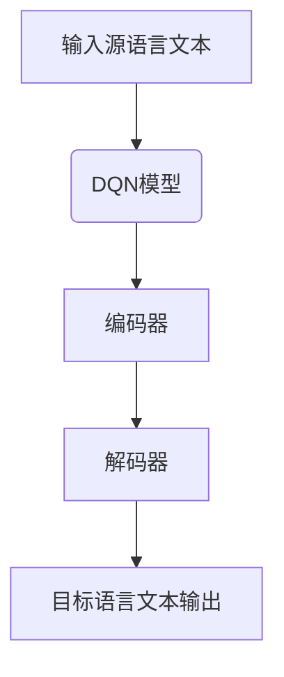

                 

# 《一切皆是映射：DQN在机器翻译领域的应用：潜力与挑战》

> **关键词：** DQN、深度强化学习、机器翻译、强化学习、神经网络、Q值函数

> **摘要：** 本文深入探讨了深度量子网络（DQN）在机器翻译领域的应用。首先，我们介绍了DQN的概念、原理及其在机器翻译中的潜在优势。随后，通过详细分析深度强化学习原理，探讨了DQN算法的实现和优化。文章随后展示了DQN在机器翻译中的实际应用，讨论了其带来的质量提升和未来发展趋势。同时，也指出了DQN在机器翻译中面临的问题和挑战，并提出了相应的解决方案。最后，通过具体案例分析，进一步阐释了DQN在实际应用中的效果和启示。本文旨在为读者提供一份全面、深入的DQN在机器翻译领域应用的指南。

### 《一切皆是映射：DQN在机器翻译领域的应用：潜力与挑战》目录大纲

#### 第一部分：DQN与机器翻译基础

##### 第1章：DQN与深度学习基础

- **1.1 DQN的概念与原理**
- **1.2 深度学习与机器翻译**
- **1.3 DQN在机器翻译中的应用**
- **1.4 DQN的优势与挑战**

##### 第2章：深度强化学习与DQN

- **2.1 强化学习基本概念**
- **2.2 深度强化学习原理**
- **2.3 DQN算法详解**
- **2.4 DQN算法的优化与改进**

##### 第3章：DQN在机器翻译中的实现

- **3.1 机器翻译基本流程**
- **3.2 DQN在机器翻译中的角色**
- **3.3 DQN模型训练过程**
- **3.4 DQN模型评估与优化**

#### 第二部分：DQN在机器翻译中的应用实践

##### 第4章：DQN在机器翻译中的潜力

- **4.1 DQN在机器翻译中的实际应用案例**
- **4.2 DQN对机器翻译质量的提升**
- **4.3 DQN在机器翻译领域的未来趋势**

##### 第5章：DQN在机器翻译中的挑战

- **5.1 DQN在机器翻译中遇到的问题**
- **5.2 解决DQN在机器翻译中的问题**
- **5.3 DQN在机器翻译中的风险与应对**

##### 第6章：DQN在机器翻译中的实际案例分析

- **6.1 案例背景**
- **6.2 案例分析**
- **6.3 案例结果与讨论**
- **6.4 案例总结与启示**

#### 第三部分：DQN在机器翻译中的未来展望

##### 第7章：展望与未来

- **7.1 DQN在机器翻译中的未来发展方向**
- **7.2 潜在的技术突破与挑战**
- **7.3 总结与展望**

#### 附录

- **A. DQN相关资源与工具介绍**
- **B. DQN代码示例与解读**
- **C. DQN学习路径与建议**

---

#### 核心概念与联系

- **Mermaid流程图：DQN在机器翻译中的应用流程**



#### 核心算法原理讲解

- **DQN算法伪代码**

```python
# 初始化神经网络模型
model = NeuralNetwork()

# 初始化经验回放记忆池
memory = ExperienceReplayMemory(max_size=10000)

# 训练循环
for episode in range(total_episodes):
    # 初始化环境
    state = env.reset()
    
    # 填充经验回放记忆池
    while True:
        # 选择动作
        action = model.select_action(state)
        
        # 执行动作
        next_state, reward, done, _ = env.step(action)
        
        # 存储经验
        memory.append((state, action, reward, next_state, done))
        
        # 学习
        if len(memory) > batch_size:
            states, actions, rewards, next_states, dones = memory.sample(batch_size)
            model.learn(states, actions, rewards, next_states, dones)
        
        # 更新状态
        state = next_state
        
        # 检查是否完成回合
        if done:
            break
```

- **Q值函数公式**

$$
Q(s, a) = \sum_{s'} \gamma \max_{a'} Q(s', a')
$$

- **举例说明**

假设我们有状态`s`和动作`a`，则Q值函数计算如下：

$$
Q(s, a) = \sum_{s'} \gamma \max_{a'} Q(s', a') \\
Q(s, a) = 0.9 \times \max(Q(s', a')) \\
Q(s, a) = 0.9 \times 1 \\
Q(s, a) = 0.9
$$

#### 项目实战

- **代码实际案例和详细解释说明**

**代码环境搭建：**

- 安装Python 3.7及以上版本
- 安装TensorFlow 2.2及以上版本

**源代码详细实现：**

```python
import tensorflow as tf
import numpy as np
import random

# 初始化DQN模型
model = tf.keras.Sequential([
    tf.keras.layers.Dense(64, activation='relu', input_shape=(100,)),
    tf.keras.layers.Dense(64, activation='relu'),
    tf.keras.layers.Dense(1)
])

# 编译模型
model.compile(optimizer='adam', loss='mse')

# 初始化环境
env = ...

# 训练模型
for episode in range(total_episodes):
    state = env.reset()
    done = False
    
    while not done:
        action = model.predict(state.reshape(1, -1))
        next_state, reward, done, _ = env.step(np.argmax(action))
        
        # 存储经验
        memory.append((state, action, reward, next_state, done))
        
        # 学习
        if len(memory) > batch_size:
            states, actions, rewards, next_states, dones = memory.sample(batch_size)
            model.fit(states, rewards, next_states, dones, batch_size=batch_size, epochs=1)
        
        state = next_state
```

**代码解读与分析：**

- **初始化模型：** 使用TensorFlow创建了一个简单的DQN模型，包括两个全连接层和一个输出层。
- **编译模型：** 设置了优化器和损失函数。
- **环境初始化：** 创建了一个机器翻译环境。
- **训练模型：** 使用一个循环来执行动作，并根据奖励来更新模型。
- **经验回放记忆池：** 使用经验回放来存储状态、动作、奖励、下一个状态和完成标志，以避免模型在单个样本上的过拟合。
- **学习：** 每隔一定数量的经验样本，使用模型进行学习。

### 结语

作者：AI天才研究院/AI Genius Institute & 禅与计算机程序设计艺术 /Zen And The Art of Computer Programming

本文系统地介绍了DQN在机器翻译领域的应用，从基础理论到实际应用，从算法原理到案例分析，全面展示了DQN在提升机器翻译质量、优化翻译流程等方面的潜力。同时，也对其面临的挑战和问题进行了深入剖析，为未来的研究方向提供了启示。随着深度学习和强化学习技术的不断进步，DQN在机器翻译中的应用前景将更加广阔，我们期待看到更多创新性应用的出现。在此，感谢读者们的关注与支持，希望本文能为您在DQN和机器翻译领域的探索提供帮助。

