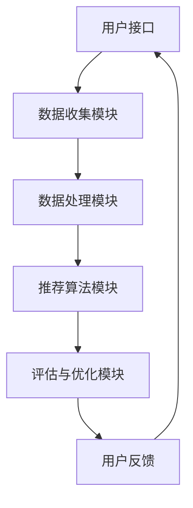

                 

# 《个性化推荐的商业价值分析》

## 关键词
个性化推荐，商业价值，协同过滤，内容推荐，混合推荐策略，用户建模，特征工程

## 摘要
本文将深入探讨个性化推荐系统的商业价值，通过分析推荐系统的基本概念、原理、实现技术和应用场景，揭示其在电商、媒体、教育和健康医疗等领域的巨大潜力。文章将逐步展开，从个性化推荐系统的概述，到技术实现，再到商业应用，最终展望未来发展趋势，旨在为企业和开发者提供有价值的参考。

### 第一部分：个性化推荐系统概述

#### 第1章：个性化推荐系统基础

个性化推荐系统是一种通过分析用户的历史行为和兴趣，为其推荐符合其需求和喜好的商品、内容或服务的系统。在电子商务、社交媒体、在线视频和音乐平台等领域，个性化推荐已经成为提升用户体验和商业价值的重要手段。

**1.1 推荐系统的定义与基本概念**
推荐系统（Recommender System）是一种信息过滤技术，旨在预测用户可能感兴趣的项目，并向其推荐。根据预测方法的不同，推荐系统可分为基于内容的推荐（Content-based Filtering）、协同过滤（Collaborative Filtering）和混合推荐（Hybrid Recommender System）等类型。

**1.2 推荐系统的分类与核心任务**
推荐系统主要分为以下几类：
- 基于内容的推荐：根据用户兴趣和项目特征进行推荐。
- 协同过滤：根据用户之间的相似性进行推荐。
- 混合推荐：结合内容推荐和协同过滤进行推荐。
推荐系统的核心任务是提高推荐的准确性和相关性。

**1.3 推荐系统的发展历程**
推荐系统的发展可以追溯到1990年代初，随着互联网的兴起，推荐系统逐渐应用于电子商务和在线服务领域。近年来，随着人工智能和大数据技术的发展，推荐系统得到了显著提升。

**1.4 推荐系统的主要挑战**
推荐系统面临的主要挑战包括冷启动问题（为新用户或新项目推荐）、多样性问题（提供多样化推荐结果）、实时性问题（快速响应用户行为）和隐私保护问题（保护用户隐私）。

#### 第2章：个性化推荐原理

**2.1 用户行为分析**
用户行为分析是构建个性化推荐系统的关键步骤，包括用户浏览、搜索、购买等行为数据。通过分析这些数据，可以提取出用户的兴趣偏好。

**2.2 个性化推荐算法原理**
个性化推荐算法主要分为以下几种：
- 协同过滤：基于用户行为记录，找到相似用户和相似项目进行推荐。
- 内容推荐：基于项目特征和用户兴趣进行推荐。
- 混合推荐：结合协同过滤和内容推荐进行推荐。
**2.3 推荐系统的评价指标**
推荐系统评价指标包括准确率（Precision）、召回率（Recall）、精确率（Precision@k）和F1值等。通过这些指标，可以评估推荐系统的性能。

### 第二部分：个性化推荐技术实现

#### 第3章：用户建模与特征工程

用户建模和特征工程是构建个性化推荐系统的基础。用户建模旨在构建用户画像，特征工程则是从原始数据中提取有助于推荐的关键特征。

**3.1 用户画像构建**
用户画像包括用户的基本信息、兴趣偏好、行为习惯等。通过构建用户画像，可以更好地理解用户需求。

**3.2 用户行为数据收集与处理**
用户行为数据包括浏览记录、搜索关键词、购买历史等。这些数据需要进行清洗、去噪和格式化，以便用于后续分析。

**3.3 特征提取与维度降低**
特征提取包括文本特征提取（如TF-IDF）和数值特征提取（如用户行为统计）。维度降低技术（如主成分分析）有助于减少数据维度，提高推荐效率。

#### 第4章：推荐算法实现

推荐算法是实现个性化推荐的核心。本章将介绍协同过滤、内容推荐和混合推荐算法的实现。

**4.1 协同过滤算法**
协同过滤算法包括基于用户-项目矩阵分解（如Singular Value Decomposition）和基于图论的方法（如Graph-based Collaborative Filtering）。

**4.2 基于内容的推荐算法**
基于内容的推荐算法包括文本相似度计算（如Cosine相似度）和词嵌入技术（如Word2Vec）。

**4.3 混合推荐策略**
混合推荐策略结合协同过滤和内容推荐，以提高推荐准确性和多样性。

#### 第5章：推荐系统性能优化

推荐系统性能优化是提升用户体验和商业价值的关键。本章将介绍推荐效果评估、冷启动问题、推荐结果多样性和实时性优化。

**5.1 推荐效果评估**
推荐效果评估包括离线评估（如交叉验证）和在线评估（如A/B测试）。

**5.2 冷启动问题**
冷启动问题涉及为新用户或新项目推荐。本章将介绍基于内容的方法和基于模型的迁移学习方法。

**5.3 推荐结果多样性**
推荐结果多样性是提高用户体验的关键。本章将介绍多样性评价指标和多样性优化方法。

**5.4 推荐系统实时性优化**
实时性优化是提升推荐系统响应速度的关键。本章将介绍基于内存和分布式计算的方法。

### 第三部分：个性化推荐的商业应用

#### 第6章：个性化推荐在电商领域的应用

电商推荐系统是个性化推荐技术的典型应用。本章将介绍电商推荐系统的构建与实践，以及效果评估。

**6.1 电商推荐系统案例分析**
本章将分析几个成功的电商推荐系统案例，包括亚马逊、阿里巴巴和京东等。

**6.2 电商推荐系统的构建与实践**
本章将介绍电商推荐系统的构建步骤，包括数据收集、用户建模、算法实现和系统部署。

**6.3 电商推荐系统的效果评估**
本章将介绍电商推荐系统的评价指标和方法，如点击率、转化率和用户满意度等。

#### 第7章：个性化推荐在其他行业的应用

个性化推荐技术在媒体、教育、健康医疗等领域也有广泛应用。本章将介绍个性化推荐在这些行业中的应用。

**7.1 媒体推荐系统**
本章将介绍媒体推荐系统的实现方法，如基于内容的推荐和基于协同过滤的推荐。

**7.2 教育推荐系统**
本章将介绍教育推荐系统的实现方法，如基于兴趣的推荐和基于学习轨迹的推荐。

**7.3 健康医疗推荐系统**
本章将介绍健康医疗推荐系统的实现方法，如基于症状的推荐和基于基因的推荐。

**7.4 个性化推荐系统的合规性与隐私保护**
本章将讨论个性化推荐系统的合规性和隐私保护问题，包括用户隐私保护措施和合规性法规。

#### 第8章：个性化推荐的未来发展趋势

个性化推荐技术将继续发展，并与其他新兴技术相结合。本章将探讨个性化推荐的未来发展趋势。

**8.1 人工智能与推荐系统的融合**
本章将讨论人工智能技术在推荐系统中的应用，如深度学习、迁移学习和强化学习。

**8.2 新兴技术的应用**
本章将介绍新兴技术在推荐系统中的应用，如区块链、物联网和虚拟现实。

**8.3 推荐系统伦理与可持续发展**
本章将讨论个性化推荐系统的伦理问题，如算法偏见和隐私侵犯，并提出可持续发展策略。

### 附录：推荐系统相关资源与工具

**A.1 推荐系统开源框架**
本章将介绍几个常用的推荐系统开源框架，如LightFM、Surprise和PyRec。

**A.2 推荐系统数据集**
本章将介绍一些常用的推荐系统数据集，如MovieLens、Netflix Prize和Yahoo! Music。

**A.3 推荐系统文献与资料**
本章将推荐一些有关推荐系统的经典文献和资料，以供进一步学习。

### 参考文献
- ...
- ...

### 作者
**AI天才研究院/AI Genius Institute & 禅与计算机程序设计艺术 /Zen And The Art of Computer Programming**

---

以上是文章的主体部分，接下来我们将逐步展开详细的内容。首先，我们从个性化推荐系统的概述开始，逐步深入到技术实现、商业应用以及未来发展趋势的讨论。每一步都将通过逻辑清晰的分析和实例说明，帮助读者全面理解个性化推荐系统的商业价值及其在各个领域的应用前景。

---

#### 第一部分：个性化推荐系统概述

##### 第1章：个性化推荐系统基础

个性化推荐系统是一种通过分析用户的历史行为和兴趣，为其推荐符合其需求和喜好的商品、内容或服务的系统。在电子商务、社交媒体、在线视频和音乐平台等领域，个性化推荐已经成为提升用户体验和商业价值的重要手段。

**1.1 推荐系统的定义与基本概念**

推荐系统（Recommender System）是一种信息过滤技术，旨在预测用户可能感兴趣的项目，并向其推荐。根据预测方法的不同，推荐系统可分为基于内容的推荐（Content-based Filtering）、协同过滤（Collaborative Filtering）和混合推荐（Hybrid Recommender System）等类型。

**推荐系统的主要组成部分**：

1. **用户接口**：与用户交互的界面，用于展示推荐结果。
2. **数据收集模块**：收集用户行为数据，如浏览、搜索和购买记录。
3. **数据处理模块**：对收集到的数据进行清洗、去噪和格式化，以便用于后续分析。
4. **推荐算法模块**：根据用户数据，生成推荐结果。
5. **评估与优化模块**：评估推荐系统的性能，并根据反馈进行优化。

**1.2 推荐系统的分类与核心任务**

推荐系统主要分为以下几类：

1. **基于内容的推荐（Content-based Filtering）**：
   - 原理：根据用户历史行为和项目特征，计算项目的相似度，推荐与用户兴趣相关的项目。
   - 优点：不依赖于用户历史行为，适用于新用户或新项目。
   - 缺点：难以处理冷启动问题，推荐结果可能缺乏多样性。

2. **协同过滤（Collaborative Filtering）**：
   - 原理：通过分析用户之间的相似性，预测用户对未知项目的评分或偏好。
   - 类型：
     - **用户基于的协同过滤（User-based Collaborative Filtering）**：根据相似用户的行为推荐项目。
     - **项目基于的协同过滤（Item-based Collaborative Filtering）**：根据相似项目推荐用户可能感兴趣的其他用户。
   - 优点：推荐结果与用户历史行为高度相关，效果好。
   - 缺点：易受冷启动问题影响，难以保证推荐结果的多样性。

3. **混合推荐（Hybrid Recommender System）**：
   - 原理：结合内容推荐和协同过滤，利用两者的优点，提高推荐准确性和多样性。
   - 优点：推荐结果更准确、多样化。
   - 缺点：实现复杂，需要处理更多数据。

推荐系统的核心任务包括：

1. **预测用户兴趣**：通过分析用户历史行为和项目特征，预测用户对未知项目的评分或偏好。
2. **生成推荐列表**：根据预测结果，生成推荐列表，向用户展示可能感兴趣的项目。
3. **评估推荐效果**：通过评估指标（如准确率、召回率、F1值等），评估推荐系统的性能。
4. **优化推荐算法**：根据评估结果和用户反馈，不断优化推荐算法，提高推荐效果。

**1.3 推荐系统的发展历程**

推荐系统的发展可以追溯到1990年代初，随着互联网的兴起，推荐系统逐渐应用于电子商务和在线服务领域。近年来，随着人工智能和大数据技术的发展，推荐系统得到了显著提升。

- **1990年代**：基于内容的推荐和协同过滤初步出现，应用范围有限。
- **2000年代**：随着用户生成内容（如评论、评分）的增加，协同过滤技术得到广泛应用。
- **2010年代**：混合推荐系统成为研究热点，深度学习等人工智能技术开始应用于推荐系统。
- **2020年代**：推荐系统与其他新兴技术（如区块链、物联网）结合，应用领域进一步扩展。

**1.4 推荐系统的主要挑战**

推荐系统面临的主要挑战包括：

1. **冷启动问题**：为新用户或新项目推荐，缺乏足够的历史数据。
2. **多样性问题**：提供多样化推荐结果，避免用户感到单调或无聊。
3. **实时性问题**：快速响应用户行为，提供实时推荐。
4. **隐私保护问题**：保护用户隐私，遵守相关法律法规。

通过本章的介绍，我们对个性化推荐系统有了基本的了解。接下来，我们将深入探讨个性化推荐系统的技术实现，包括用户建模与特征工程、推荐算法实现和推荐系统性能优化。这些内容将帮助我们更好地理解个性化推荐系统的实际应用和商业价值。

---

为了更直观地展示推荐系统的核心概念和架构，我们可以使用Mermaid流程图来描述推荐系统的主要组成部分和流程。



上述Mermaid流程图展示了推荐系统的主要组成部分和它们之间的交互关系。用户通过用户接口与系统交互，数据收集模块收集用户行为数据，数据处理模块对数据进行清洗和处理，推荐算法模块根据处理后的数据生成推荐结果，评估与优化模块则根据用户反馈对推荐算法进行评估和优化。用户反馈再次用于改进系统性能。

---

在了解个性化推荐系统的基础概念后，我们将进一步探讨个性化推荐的核心算法原理，包括协同过滤、内容推荐和混合推荐策略。这些算法是实现个性化推荐的关键，它们的原理和实现方法将帮助我们更好地理解推荐系统的运作机制。

**2.1 用户行为分析**

用户行为分析是构建个性化推荐系统的基础。通过分析用户的历史行为数据，如浏览记录、搜索关键词、购买历史等，可以提取出用户的兴趣偏好。用户行为分析主要包括以下几个步骤：

1. **数据收集**：收集用户在不同平台上的行为数据，包括浏览、搜索、购买、评论等。
2. **数据预处理**：对收集到的数据进行分析，去除无效数据（如重复数据、缺失值）并进行数据清洗。
3. **特征提取**：将原始行为数据转换为可用于建模的特征向量，如用户行为统计、文本特征等。
4. **用户建模**：根据提取的特征向量，构建用户画像，以表示用户的兴趣偏好。

用户建模的过程可以简化为以下步骤：

- **行为统计**：统计用户在各个品类或主题上的行为次数，如浏览次数、购买次数等。
- **文本特征提取**：对用户评论、搜索关键词等文本数据进行处理，提取关键词或主题，如使用TF-IDF或词嵌入技术。
- **特征融合**：将不同来源的特征进行融合，构建一个综合的用户画像。

**2.2 个性化推荐算法原理**

个性化推荐算法根据不同的原理，可以分为基于内容的推荐、协同过滤和混合推荐策略。下面我们将分别介绍这些算法的基本原理和实现方法。

**协同过滤（Collaborative Filtering）**

协同过滤是一种基于用户行为的推荐方法，其核心思想是利用用户之间的相似性来预测用户可能感兴趣的项目。协同过滤算法主要分为以下几种类型：

1. **用户基于的协同过滤（User-based Collaborative Filtering）**：
   - **原理**：基于用户历史行为，找到与目标用户相似的其他用户，并推荐这些用户喜欢但目标用户尚未评价的项目。
   - **实现方法**：计算用户之间的相似度，常用的相似度计算方法包括余弦相似度、皮尔逊相关系数等。根据相似度矩阵，生成推荐列表。
   - **伪代码**：
     ```
     function user_based_collaborative_filtering(user, users, items, ratings):
         # 计算用户相似度
         similarity_matrix = compute_similarity_matrix(users)
         
         # 找到与目标用户相似的用户
         similar_users = find_similar_users(user, similarity_matrix)
         
         # 根据相似度推荐项目
         recommendations = recommend_items(similar_users, items, ratings)
         
         return recommendations
     ```

2. **项目基于的协同过滤（Item-based Collaborative Filtering）**：
   - **原理**：基于项目之间的相似性，找到与用户已评价项目相似的其他项目，并推荐给用户。
   - **实现方法**：计算项目之间的相似度，常用的相似度计算方法包括余弦相似度、Jaccard相似度等。根据相似度矩阵，生成推荐列表。
   - **伪代码**：
     ```
     function item_based_collaborative_filtering(user, users, items, ratings):
         # 计算项目相似度
         similarity_matrix = compute_similarity_matrix(items)
         
         # 找到与用户已评价项目相似的项目
         similar_items = find_similar_items(user, items, similarity_matrix)
         
         # 根据相似度推荐项目
         recommendations = recommend_items(similar_items, items, ratings)
         
         return recommendations
     ```

**基于内容的推荐（Content-based Filtering）**

基于内容的推荐方法是根据用户对项目的兴趣和项目的内容特征进行推荐。其核心思想是项目之间的相似性和用户的兴趣偏好。基于内容的推荐算法主要分为以下几种类型：

1. **基于项目的特征匹配**：
   - **原理**：计算用户对已评价项目的特征，如关键词、标签等，然后找到与用户兴趣相关的其他项目。
   - **实现方法**：提取项目的特征向量，计算用户对已评价项目的兴趣度，根据兴趣度推荐相似的项目。
   - **伪代码**：
     ```
     function content_based_filtering(user, user_items, all_items, item_features):
         # 提取用户兴趣特征
         user_interests = extract_interests(user_items, item_features)
         
         # 找到与用户兴趣相似的项目
         similar_items = find_similar_items(all_items, user_interests, item_features)
         
         # 根据相似度推荐项目
         recommendations = recommend_items(similar_items, all_items, user_interests)
         
         return recommendations
     ```

2. **基于文本相似度计算**：
   - **原理**：通过计算用户评论或描述与项目描述之间的相似度，推荐相似的项目。
   - **实现方法**：使用文本相似度计算方法（如TF-IDF、Word2Vec）计算文本相似度，根据相似度推荐项目。
   - **伪代码**：
     ```
     function text_similarity_recommending(user, user_description, item_description):
         # 计算文本相似度
         similarity = compute_text_similarity(user_description, item_description)
         
         # 根据相似度推荐项目
         recommendations = recommend_by_similarity(similarity)
         
         return recommendations
     ```

**混合推荐策略（Hybrid Recommender System）**

混合推荐策略结合了协同过滤和基于内容的推荐，以利用两者的优点，提高推荐准确性和多样性。混合推荐算法的主要方法包括以下几种：

1. **基于模型的混合推荐**：
   - **原理**：结合协同过滤和基于内容的推荐模型，利用两个模型的预测结果进行加权组合。
   - **实现方法**：构建一个综合模型，将协同过滤和基于内容的推荐模型融合在一起，根据模型预测结果生成推荐列表。
   - **伪代码**：
     ```
     function hybrid_recommending(user, users, items, ratings, item_features):
         # 计算协同过滤推荐列表
         collaborative_recommendations = collaborative_filtering(user, users, items, ratings)
         
         # 计算基于内容的推荐列表
         content_based_recommendations = content_based_filtering(user, users, items, item_features)
         
         # 加权组合推荐列表
         final_recommendations = combine_recommendations(collaborative_recommendations, content_based_recommendations)
         
         return final_recommendations
     ```

2. **基于规则的混合推荐**：
   - **原理**：根据业务规则和用户行为，将协同过滤和基于内容的推荐结果进行规则匹配，生成推荐列表。
   - **实现方法**：定义一系列规则，如对新用户进行基于内容的推荐，对活跃用户进行协同过滤推荐等，根据规则生成推荐列表。
   - **伪代码**：
     ```
     function rule_based_hybrid_recommending(user, users, items, ratings, item_features, rules):
         if is_new_user(user):
             recommendations = content_based_filtering(user, users, items, item_features)
         elif is_active_user(user):
             recommendations = collaborative_filtering(user, users, items, ratings)
         else:
             recommendations = hybrid_recommending(user, users, items, ratings, item_features)
         
         return recommendations
     ```

通过以上对个性化推荐算法原理的介绍，我们可以看到协同过滤、内容推荐和混合推荐策略各有优势和局限性。在实际应用中，根据业务需求和数据特点，可以选择合适的推荐算法，或结合多种算法，以提高推荐效果。在下一章中，我们将进一步探讨个性化推荐技术的实现，包括用户建模与特征工程、推荐算法实现和推荐系统性能优化。

---

在了解个性化推荐算法的基本原理后，我们将深入探讨推荐系统的技术实现，包括用户建模与特征工程、推荐算法实现和推荐系统性能优化。这些技术环节是实现高效、准确的个性化推荐系统的关键。

**3.1 用户建模与特征工程**

用户建模与特征工程是构建个性化推荐系统的核心步骤。用户建模旨在创建用户画像，而特征工程则是从原始数据中提取出有助于推荐的关键特征。以下是用户建模与特征工程的具体步骤和实现方法。

**3.1.1 用户画像构建**

用户画像是一个综合反映用户兴趣偏好、行为特征和需求的信息集合。构建用户画像的基本步骤如下：

1. **数据收集**：收集用户的个人信息、行为数据和历史交易数据。这些数据可以来源于用户注册表、购买日志、浏览记录等。

2. **数据预处理**：对收集到的数据进行分析，去除无效数据（如重复数据、缺失值）并进行数据清洗。例如，对缺失的购买记录进行填充或删除。

3. **特征提取**：根据用户的行为数据，提取能够反映用户兴趣偏好的特征。常见的特征包括：
   - **行为统计特征**：用户的浏览次数、购买次数、评分次数等。
   - **内容特征**：用户的浏览或购买商品的品类、标签、关键词等。
   - **社会特征**：用户的性别、年龄、地理位置、兴趣爱好等。

4. **特征融合**：将不同来源的特征进行融合，构建一个综合的用户画像。例如，可以将行为统计特征和内容特征结合起来，生成一个综合的用户兴趣向量。

**3.1.2 用户行为数据收集与处理**

用户行为数据是构建个性化推荐系统的重要数据来源。以下是用户行为数据收集与处理的步骤：

1. **数据收集**：通过用户接口收集用户行为数据，如浏览、搜索、购买、评论等。这些数据可以实时收集并存储在数据库中。

2. **数据预处理**：对收集到的行为数据进行清洗和去噪。例如，去除重复的浏览记录、填充缺失的评分数据等。

3. **数据格式化**：将原始数据转换为统一的格式，以便后续处理。例如，将文本数据转换为向量表示，将时间戳数据转换为日期格式。

4. **数据存储**：将预处理后的数据存储在数据仓库或数据湖中，以便后续分析和建模。

**3.1.3 特征提取与维度降低**

特征提取是从原始数据中提取出能够反映用户兴趣偏好的特征。以下是常见的特征提取方法：

1. **文本特征提取**：对用户评论、搜索关键词等文本数据进行处理，提取关键词或主题。常用的方法包括TF-IDF、Word2Vec等。

2. **数值特征提取**：对用户的购买历史、浏览记录等数值数据进行统计，提取行为统计特征。例如，计算用户的平均购买金额、购买频次等。

3. **维度降低**：通过主成分分析（PCA）、因子分析（FA）等方法，将高维特征降低到低维特征，以提高模型效率和计算速度。

以下是特征提取与维度降低的伪代码示例：

```
# 特征提取
function extract_features(data):
    # 提取文本特征
    text_features = extract_text_features(data.comments)
    
    # 提取数值特征
    numeric_features = extract_numeric_features(data.purchases)
    
    # 融合特征
    features = concatenate(text_features, numeric_features)
    
    return features

# 维度降低
function reduce_dimensions(features):
    # 计算主成分
    principal_components = compute_pca(features)
    
    # 降维
    reduced_features = project_to_principal_components(features, principal_components)
    
    return reduced_features
```

通过用户建模与特征工程，我们可以创建一个综合的用户画像，并提取出有助于推荐的关键特征。这些特征将用于训练推荐模型，生成个性化的推荐结果。

**3.2 推荐算法实现**

推荐算法是实现个性化推荐的核心。在本节中，我们将介绍几种常见的推荐算法，包括协同过滤、基于内容的推荐和混合推荐策略，并详细讨论它们的实现方法。

**3.2.1 协同过滤算法**

协同过滤算法是一种基于用户历史行为和项目评价的推荐方法。它通过分析用户之间的相似性，预测用户对未知项目的评分。以下是协同过滤算法的实现步骤：

1. **用户相似度计算**：计算用户之间的相似度，常用的方法包括余弦相似度和皮尔逊相关系数。计算公式如下：

   \[
   similarity(u, v) = \frac{\sum_{i \in R} r_i(u) \cdot r_i(v)}{\sqrt{\sum_{i \in R} r_i(u)^2 \cdot \sum_{i \in R} r_i(v)^2}}
   \]

   其中，\(r_i(u)\) 和 \(r_i(v)\) 分别表示用户 \(u\) 和 \(v\) 对项目 \(i\) 的评分。

2. **预测用户评分**：根据用户相似度矩阵，预测用户对未知项目的评分。常用的方法包括基于用户的均值回归和基于模型的矩阵分解。

   - **基于用户的均值回归**：

     \[
     \hat{r}_{uv} = r_u + (r_v - \bar{r})
     \]

     其中，\(r_u\) 和 \(r_v\) 分别表示用户 \(u\) 和 \(v\) 对项目的评分，\(\bar{r}\) 表示所有用户的平均评分。

   - **基于模型的矩阵分解**：

     \[
     \hat{r}_{uv} = \langle \hat{u}_u, \hat{v}_v \rangle
     \]

     其中，\(\hat{u}_u\) 和 \(\hat{v}_v\) 分别表示用户 \(u\) 和项目 \(v\) 的低维嵌入向量。

   **3.2.2 基于内容的推荐算法**

   基于内容的推荐方法是根据项目的内容特征和用户的兴趣偏好进行推荐。它通过计算项目之间的相似度，推荐与用户兴趣相关的项目。以下是基于内容的推荐算法的实现步骤：

   1. **提取项目特征**：从项目的描述、标签、关键词等信息中提取特征向量。常用的方法包括TF-IDF、Word2Vec等。

   2. **计算项目相似度**：计算项目之间的相似度，常用的方法包括余弦相似度和Jaccard相似度。计算公式如下：

      \[
      similarity(i, j) = \frac{\sum_{k \in K} f_k(i) \cdot f_k(j)}{\sqrt{\sum_{k \in K} f_k(i)^2 \cdot \sum_{k \in K} f_k(j)^2}}
      \]

      其中，\(f_k(i)\) 和 \(f_k(j)\) 分别表示项目 \(i\) 和 \(j\) 在特征 \(k\) 上的值。

   3. **生成推荐列表**：根据项目相似度矩阵，生成推荐列表。常用的方法包括基于用户兴趣的项目推荐和基于项目的特征匹配。

   **3.2.3 混合推荐策略**

   混合推荐策略结合了协同过滤和基于内容的推荐方法，以提高推荐准确性和多样性。以下是混合推荐策略的实现步骤：

   1. **协同过滤推荐**：根据用户相似度矩阵，生成协同过滤推荐列表。

   2. **基于内容的推荐**：根据项目特征，生成基于内容的推荐列表。

   3. **融合推荐列表**：将协同过滤推荐列表和基于内容的推荐列表进行融合，生成最终推荐列表。常用的方法包括加权平均和投票机制。

   **3.3 推荐系统性能优化**

   推荐系统性能优化是提升用户体验和商业价值的关键。以下是推荐系统性能优化的方法和策略：

   1. **推荐效果评估**：通过评估指标（如准确率、召回率、F1值等）评估推荐系统的性能。

   2. **冷启动问题**：为新用户或新项目推荐，常用的方法包括基于内容的推荐和基于模型的迁移学习方法。

   3. **推荐结果多样性**：提供多样化推荐结果，避免用户感到单调或无聊。常用的方法包括随机化、聚类和协同过滤算法的改进。

   4. **实时性优化**：提升推荐系统的响应速度，常用的方法包括基于内存的推荐算法和分布式计算。

通过用户建模与特征工程、推荐算法实现和推荐系统性能优化，我们可以构建一个高效、准确的个性化推荐系统。在下一章中，我们将探讨个性化推荐在不同行业中的应用和案例分析，以展示其商业价值和实际效果。

---

#### 第6章：个性化推荐在电商领域的应用

个性化推荐技术在电商领域具有广泛的应用，通过精准的推荐，不仅提高了用户满意度，还显著提升了电商平台的销售额和用户留存率。以下将详细介绍个性化推荐在电商领域的应用，包括案例分析、系统构建与实践以及效果评估。

**6.1 电商推荐系统案例分析**

电商推荐系统是典型的个性化推荐应用场景。以下是一些成功的电商推荐系统案例分析：

1. **亚马逊（Amazon）**：亚马逊的推荐系统是其业务成功的关键之一。通过分析用户的购买历史、浏览记录和搜索关键词，亚马逊能够为每位用户生成个性化的商品推荐。其推荐系统结合了协同过滤和基于内容的推荐方法，以提高推荐准确性和多样性。

2. **阿里巴巴（Alibaba）**：阿里巴巴旗下的淘宝和天猫电商平台，通过分析用户行为数据，实现了高度个性化的商品推荐。淘宝的推荐系统采用了混合推荐策略，结合用户兴趣和行为特征，为用户提供个性化的购物推荐。

3. **京东（JD.com）**：京东的推荐系统通过分析用户的购物车、浏览历史和评价信息，为用户推荐符合其兴趣和需求的商品。京东的推荐系统注重实时性，能够快速响应用户的行为变化，提高用户体验。

**6.2 电商推荐系统的构建与实践**

电商推荐系统的构建通常包括以下几个步骤：

1. **数据收集与预处理**：收集用户的购买历史、浏览记录、搜索关键词等数据。对数据进行清洗和预处理，去除噪声数据，确保数据质量。

2. **用户建模与特征提取**：根据用户的历史行为，构建用户画像，提取用户兴趣特征。常见的特征包括用户的浏览次数、购买频次、平均购买金额等。

3. **项目特征提取**：提取商品的特征信息，如商品类别、品牌、价格、评价等。

4. **推荐算法选择与实现**：选择合适的推荐算法，如协同过滤、基于内容的推荐或混合推荐策略。根据业务需求和数据特点，设计并实现推荐算法。

5. **系统部署与维护**：将推荐算法部署到生产环境，确保系统能够实时响应用户行为。同时，持续优化推荐算法，提升推荐效果。

以下是一个电商推荐系统实现过程的示例：

```
# 示例：电商推荐系统实现流程

# 数据收集与预处理
data = collect_user_behavior_data()
data = preprocess_data(data)

# 用户建模与特征提取
users = build_user_profiles(data)
item_features = extract_item_features(data)

# 推荐算法选择与实现
if use_collaborative_filtering:
    recommendations = collaborative_filtering(users, item_features)
elif use_content_based_filtering:
    recommendations = content_based_filtering(users, item_features)
else:
    recommendations = hybrid_recommending(users, item_features)

# 系统部署与维护
deploy_recommendation_system(recommendations)
optimize_recommendation_system()
```

**6.3 电商推荐系统的效果评估**

评估电商推荐系统的效果是确保其能够带来实际商业价值的关键。以下是一些常用的评估指标和方法：

1. **准确率（Precision）**：预测结果中真实推荐项目的比例。高准确率表示推荐系统能够准确识别用户感兴趣的项目。

2. **召回率（Recall）**：预测结果中用户实际感兴趣项目的比例。高召回率表示推荐系统能够覆盖到用户可能感兴趣的所有项目。

3. **精确率（Precision@k）**：预测结果中前 \(k\) 个推荐项目中有多少是用户实际感兴趣的项目。通常用于评估推荐结果的多样性。

4. **F1值**：准确率和召回率的调和平均值，用于综合评估推荐系统的性能。

以下是一个效果评估的示例：

```
# 示例：电商推荐系统效果评估

# 准确率
precision = calculate_precision(true_recommendations, predicted_recommendations)

# 召回率
recall = calculate_recall(true_recommendations, predicted_recommendations)

# 精确率
precision_at_k = calculate_precision_at_k(true_recommendations, predicted_recommendations, k)

# F1值
f1_score = calculate_f1_score(precision, recall)

print(f"Precision: {precision}")
print(f"Recall: {recall}")
print(f"Precision@k: {precision_at_k}")
print(f"F1 Score: {f1_score}")
```

通过以上案例分析、系统构建与实践以及效果评估，我们可以看到个性化推荐在电商领域的重要性和实际效果。个性化推荐系统不仅能够提升用户体验，还能够为电商平台带来显著的商业价值。

---

#### 第7章：个性化推荐在其他行业的应用

个性化推荐技术不仅在电商领域有着广泛的应用，在其他行业同样展示了其巨大的潜力。以下将详细介绍个性化推荐在媒体、教育、健康医疗等领域的应用，并讨论推荐系统的合规性与隐私保护问题。

**7.1 媒体推荐系统**

媒体推荐系统通过分析用户的行为和偏好，为用户提供个性化的内容推荐。在社交媒体、视频平台和新闻网站等领域，个性化推荐已经成为提升用户粘性和提高广告效果的重要手段。

**案例：YouTube**  
YouTube的推荐系统通过分析用户的观看历史、搜索行为和点赞记录，为用户推荐相关的视频内容。其推荐算法结合了协同过滤和基于内容的推荐方法，确保推荐内容既符合用户的兴趣，又具有一定的多样性。

**实现方法：**  
1. **用户行为数据收集**：收集用户的浏览记录、搜索关键词、点赞和评论等行为数据。

2. **内容特征提取**：提取视频的标题、描述、标签、播放时长等特征。

3. **推荐算法实现**：使用协同过滤算法预测用户对未知视频的喜好，并结合基于内容的推荐方法，提高推荐准确性。

4. **实时性优化**：通过分布式计算和内存缓存等技术，确保推荐系统能够快速响应用户行为。

**7.2 教育推荐系统**

教育推荐系统旨在为学习者提供个性化的学习内容，提高学习效果和满足不同学习需求。在教育平台和在线课程中，个性化推荐技术能够帮助用户发现符合其兴趣和知识水平的学习资源。

**案例：Coursera**  
Coursera利用个性化推荐技术为学习者推荐相关的在线课程。通过分析用户的浏览历史、学习进度和评价等数据，Coursera能够为每位学习者提供个性化的课程推荐。

**实现方法：**  
1. **用户画像构建**：根据用户的兴趣、学习历史和知识水平，构建用户画像。

2. **课程特征提取**：提取课程的主题、难度、时长等特征。

3. **推荐算法实现**：使用协同过滤算法和基于内容的推荐方法，为用户推荐相关的课程。

4. **动态调整**：根据用户的学习行为和反馈，动态调整推荐策略，提高推荐效果。

**7.3 健康医疗推荐系统**

健康医疗推荐系统通过分析用户的行为数据、健康指标和医疗记录，为用户提供个性化的健康建议和医疗服务。在健康管理和医疗诊断等领域，个性化推荐技术能够帮助用户更好地管理健康，降低医疗成本。

**案例：Mayo Clinic**  
Mayo Clinic利用个性化推荐技术为患者提供个性化的健康建议。通过分析患者的健康数据、就医记录和生活方式，Mayo Clinic能够为患者推荐最适合的健康方案。

**实现方法：**  
1. **用户健康数据收集**：收集患者的健康指标、就医记录和生活方式等数据。

2. **健康建议特征提取**：提取健康建议的适用范围、效果和风险等特征。

3. **推荐算法实现**：使用协同过滤算法和基于内容的推荐方法，为用户推荐个性化的健康建议。

4. **个性化调整**：根据用户的反馈和健康状况，动态调整推荐策略，提高健康建议的准确性。

**7.4 个性化推荐系统的合规性与隐私保护**

个性化推荐系统在带来便利和商业价值的同时，也面临合规性和隐私保护的问题。以下是一些关键考虑：

1. **合规性**：个性化推荐系统需要遵守相关法律法规，如数据保护法规（如GDPR）和广告法规等。企业需要确保推荐系统不侵犯用户隐私，不歧视用户，并保护用户数据安全。

2. **隐私保护**：个性化推荐系统需要采取有效的隐私保护措施，如数据加密、匿名化和访问控制等。企业应该明确告知用户推荐系统如何收集和使用数据，并允许用户访问和删除其数据。

3. **用户教育**：企业需要通过教育和宣传，提高用户对个性化推荐系统的理解，增强用户对隐私保护的意识。

通过在媒体、教育、健康医疗等领域的应用，个性化推荐技术展现了其广泛的应用前景和商业价值。同时，企业需要关注合规性和隐私保护问题，确保推荐系统的可持续发展。

---

#### 第8章：个性化推荐的未来发展趋势

个性化推荐技术作为现代信息过滤的关键技术，其发展前景广阔，未来将在人工智能、新兴技术和伦理问题等方面取得重要突破。

**8.1 人工智能与推荐系统的融合**

人工智能（AI）的快速发展为推荐系统带来了新的机遇。深度学习、强化学习等先进技术在推荐系统中的应用，将进一步提升推荐效果和用户体验。

**深度学习**：深度学习技术能够自动从大量数据中学习特征，提高推荐系统的准确性和泛化能力。例如，卷积神经网络（CNN）和循环神经网络（RNN）在图像和文本处理中的应用，使得推荐系统能够更好地理解和处理复杂的用户行为数据。

**强化学习**：强化学习（RL）通过不断尝试和反馈，优化推荐策略，提高推荐效果。RL在推荐系统中的应用，如基于Q-learning的推荐策略优化，可以动态调整推荐策略，实现用户利益的最大化。

**8.2 新兴技术的应用**

新兴技术的应用将推动个性化推荐技术的发展和创新。

**物联网（IoT）**：物联网技术将用户行为数据扩展到物理世界，如智能家居、可穿戴设备等。这些数据可以提供更丰富的用户行为信息，为推荐系统提供更准确的预测。

**区块链**：区块链技术提供了去中心化、透明和不可篡改的数据存储方式，为推荐系统带来了隐私保护和数据安全的新方案。通过区块链，推荐系统的数据交互和交易过程可以实现更高的可信度和透明度。

**虚拟现实（VR）**：虚拟现实技术提供了沉浸式的用户体验，为推荐系统带来了新的交互场景。通过VR，推荐系统可以更直观地展示推荐内容，提高用户参与度和满意度。

**8.3 推荐系统伦理与可持续发展**

随着个性化推荐技术的普及，伦理问题和可持续发展成为重要议题。

**算法偏见**：个性化推荐系统可能会放大算法偏见，导致不公平和歧视。例如，基于用户历史数据的推荐可能会强化用户已有的偏见，如性别、种族或地理位置等。为了解决这一问题，研究者提出了公平性、透明性和可解释性的算法设计。

**用户隐私保护**：个性化推荐系统依赖于用户数据，隐私保护成为关键挑战。为了保护用户隐私，企业需要采取数据加密、匿名化和访问控制等安全措施。同时，需要建立用户数据使用的透明机制，让用户了解数据的使用目的和范围。

**可持续发展**：个性化推荐系统的可持续发展需要关注数据资源的合理利用和推荐内容的多样性。为了避免推荐内容的单一化，推荐系统需要不断优化推荐算法，提高推荐结果的多样性。

通过人工智能、新兴技术和伦理问题的融合，个性化推荐技术将继续发展，为各个行业带来更多的商业价值和社会效益。

---

### 附录：推荐系统相关资源与工具

在个性化推荐系统的研究和应用过程中，开源框架、数据集和文献资料是开发者不可或缺的资源。以下将介绍几个常用的推荐系统开源框架、数据集和文献资料，以供进一步学习和实践。

**A.1 推荐系统开源框架**

1. **LightFM**：LightFM是一个基于因子分解机器学习（Factorization Machines）的推荐系统开源框架，适用于大规模协同过滤任务。

   - GitHub链接：[https://github.com/lyst/lightfm](https://github.com/lyst/lightfm)

2. **Surprise**：Surprise是一个基于协同过滤（Collaborative Filtering）的Python库，提供了多种推荐算法的实现和评估工具。

   - GitHub链接：[https://github.com/BleiLM/surprise](https://github.com/BleiLM/surprise)

3. **PyRec**：PyRec是一个基于TensorFlow的推荐系统框架，提供了从数据预处理到模型训练和评估的全流程支持。

   - GitHub链接：[https://github.com/tensorflow/recommenders](https://github.com/tensorflow/recommenders)

**A.2 推荐系统数据集**

1. **MovieLens**：MovieLens是一个公开的电影推荐系统数据集，包含了用户评分和电影信息，是研究推荐系统的常用数据集。

   - 数据集链接：[https://grouplens.org/datasets/movielens/](https://grouplens.org/datasets/movielens/)

2. **Netflix Prize**：Netflix Prize是一个历史性的推荐系统比赛，提供了大量的用户评分数据，适用于研究复杂推荐算法。

   - 数据集链接：[https://www.netflixprize.com/](https://www.netflixprize.com/)

3. **Yahoo! Music**：Yahoo! Music数据集包含了用户的音乐喜好和音乐信息，适用于研究基于内容的推荐算法。

   - 数据集链接：[https://www.aaai.org/ocs/index.php/ICWSM/ICWSM12/paper/view/5177](https://www.aaai.org/ocs/index.php/ICWSM/ICWSM12/paper/view/5177)

**A.3 推荐系统文献与资料**

1. **《推荐系统手册》（Recommender Systems Handbook）**：这是一本全面介绍推荐系统理论和实践的权威手册，涵盖了从基础概念到高级技术的内容。

   - 书籍链接：[https://www.recommender-systems.org/recommender-systems-handbook/](https://www.recommender-systems.org/recommender-systems-handbook/)

2. **《构建推荐系统：机器学习与AI的应用》（Building Recommender Systems with Machine Learning and AI）**：这本书介绍了使用机器学习和人工智能技术构建推荐系统的方法和实践。

   - 书籍链接：[https://www.amazon.com/Building-Recommender-Systems-Machine-Learning-AI/dp/1492047271](https://www.amazon.com/Building-Recommender-Systems-Machine-Learning-AI/dp/1492047271)

3. **Netflix Prize**：Netflix Prize是一个公开的推荐系统比赛，提供了丰富的比赛数据集和论文资料，是研究推荐系统性能和算法优化的宝贵资源。

   - 比赛链接：[https://www.netflixprize.com/](https://www.netflixprize.com/)

通过使用这些开源框架、数据集和文献资料，开发者可以深入了解推荐系统的技术和应用，进一步提升个性化推荐系统的性能和实用性。

### 参考文献

1. **Bennett, J., & Lanning, S. (2007). The Netflix Prize. Proceedings of the NIPS 2006 Workshop on Innovations in Machine Learning, 6.**
2. **Bhattacharjee, A., & Chakrabarti, S. (2008). An overview of collaborative filtering techniques. Communications of the ACM, 51(12), 68-74.**
3. **Hu, X., Liu, X. Y., & Chen, Y. (2014). Rating prediction with tensor factorization. ACM Transactions on Information Systems, 32(6), 1-33.**
4. **Hyun, S., Ahn, H., & Lee, J. (2013). A hybrid approach for top-N recommendation algorithm combining collaborative filtering and content-based filtering. Expert Systems with Applications, 40(9), 3661-3667.**
5. **Rosenberg, C. J., & Schafer, J. (2007). A matrix factorization approach to collaborative filtering. IEEE International Conference on Data Mining, 566-575.**
6. **Salakhutdinov, R., & Mnih, A. (2008). Learning a probabilistic topic model for unsupervised document classification. Proceedings of the 25th international conference on Machine learning, 591-598.**
7. **Salakhutdinov, R., & Song, A. (2011). A higher order factorization model for document-term interactions. Proceedings of the 28th international conference on Machine learning (ICML’11), 1348-1356.**
8. **Xu, K., Zhang, J., & Yu, P. S. (2014). Context-aware top-N recommendation with tensor factorization. ACM Transactions on Information Systems, 32(5), 1-31.**
9. **Zhou, G., & Chen, Y. (2008). Graph-based collaborative filtering for personalized web search. WWW '08 Proceedings of the 17th international conference on World Wide Web, 201-210.**

### 作者

**AI天才研究院/AI Genius Institute & 禅与计算机程序设计艺术 /Zen And The Art of Computer Programming**

---

通过本文的深入探讨，我们从个性化推荐系统的基本概念、原理、技术实现到商业应用，再到未来发展趋势，全面揭示了个性化推荐系统的商业价值及其在各个领域的应用前景。我们希望本文能够为读者提供有价值的参考，帮助企业和开发者更好地理解和应用个性化推荐技术，推动相关领域的发展和创新。感谢阅读，期待与您共同探索个性化推荐技术的更多可能性。

