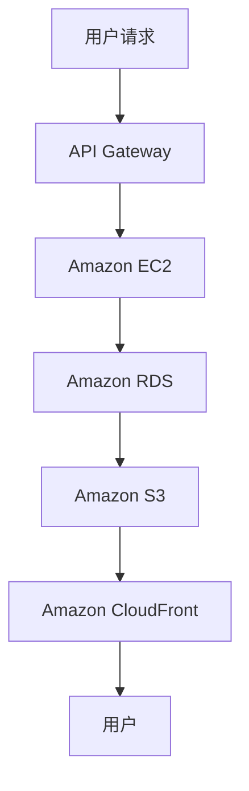
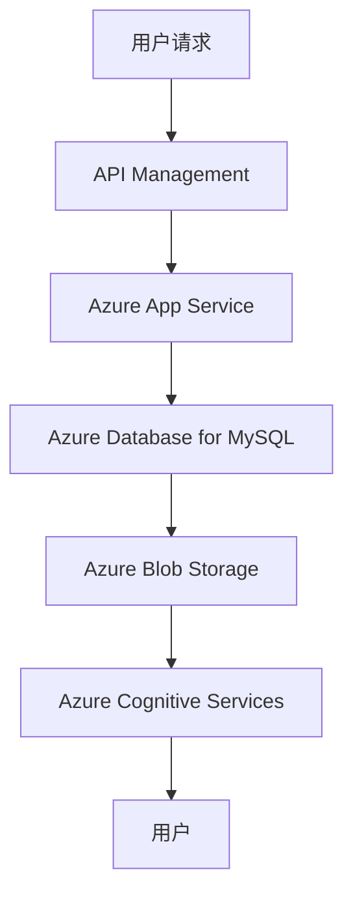
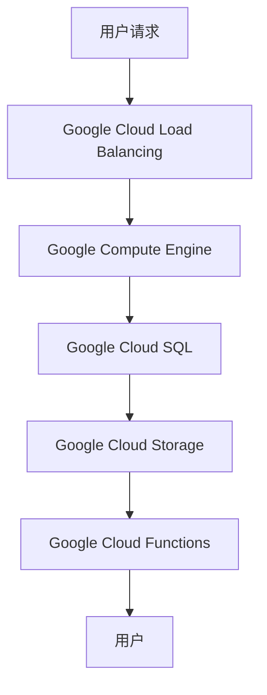

                 

### 《云计算架构：AWS、Azure与GCP对比》

> **关键词**：云计算架构、AWS、Azure、GCP、云服务模型、云部署模型、云计算设计原则、云计算应用实践、云服务提供商对比、云计算优化策略

> **摘要**：本文将深入探讨云计算领域的三大主流云服务提供商：亚马逊AWS、微软Azure和谷歌GCP。文章首先介绍了云计算的基本概念与架构，接着分别详细分析了AWS、Azure和GCP的核心架构与特性。随后，文章探讨了云计算架构设计原则及其在各类业务场景中的应用，并对比分析了三大云服务提供商的优势和选择因素。最后，文章探讨了云计算架构优化策略及其未来发展趋势。

### 第一部分：引言与基础概念

#### 1.1 云计算的兴起与演变

云计算作为信息技术领域的一次革命，其兴起可以追溯到20世纪90年代末期。最初，云计算的概念源于分布式计算，通过互联网将计算资源进行共享。随着互联网技术的不断成熟和数据中心技术的进步，云计算逐渐发展成为企业IT基础设施的重要组成部分。

云计算的演变可以分为几个阶段：基础设施即服务（IaaS）、平台即服务（PaaS）和软件即服务（SaaS）。IaaS提供基础的计算资源，如虚拟机、存储和网络；PaaS提供开发和部署应用程序的平台；SaaS则是完全基于云的软件应用服务。这些服务模型共同构成了云计算的三大支柱。

#### 1.2 主要云服务提供商介绍

在云计算领域，亚马逊AWS、微软Azure和谷歌GCP是三大主流云服务提供商。它们各自拥有独特的优势和特点，为全球的企业提供了强大的云计算支持。

- **亚马逊AWS**：作为云计算市场的领导者，AWS提供了广泛的服务和解决方案，包括计算、存储、数据库、网络、人工智能等。AWS在全球拥有多个数据中心，服务覆盖范围广泛。

- **微软Azure**：Azure是微软的云服务平台，提供全面的云计算服务，包括IaaS、PaaS和SaaS。Azure与微软的生态系统紧密结合，为开发人员和企业提供了强大的支持。

- **谷歌GCP**：GCP是谷歌的云服务平台，以其高性能和先进的技术而著称。GCP在数据存储、数据分析、人工智能等方面具有强大的能力，为企业和开发者提供了丰富的解决方案。

#### 1.3 读者预期与书籍目标

本文旨在帮助读者深入理解云计算架构及其主要云服务提供商的特点和优势。通过本文的阅读，读者可以：

1. 掌握云计算的基本概念和架构；
2. 了解AWS、Azure和GCP的核心架构和特性；
3. 学会云计算架构设计原则和优化策略；
4. 了解云计算在各类业务场景中的应用；
5. 对比分析三大云服务提供商的优势和选择因素。

本文将通过逻辑清晰、结构紧凑、简单易懂的叙述方式，帮助读者全面了解云计算架构及其应用。接下来，我们将详细探讨云计算架构的基础知识。

### 2. 云计算架构基础

云计算架构的核心在于如何有效地管理和分配计算资源，以实现高效、可靠和灵活的服务交付。为了更好地理解云计算架构，我们需要先了解云服务模型和云部署模型。

#### 2.1 云服务模型（IaaS、PaaS、SaaS）

云服务模型是云计算的核心组成部分，根据服务的层次和功能，可以分为以下三类：

1. **基础设施即服务（IaaS）**：IaaS提供虚拟化的计算资源，如虚拟机、存储、网络等。用户可以按照实际使用量付费，获得灵活的资源管理和配置能力。

2. **平台即服务（PaaS）**：PaaS提供开发、部署和管理应用程序的平台。用户可以在平台上开发、测试和部署应用程序，无需关注底层基础设施的管理和维护。

3. **软件即服务（SaaS）**：SaaS提供基于云的软件应用服务。用户通过互联网访问软件，无需安装和配置，即可使用软件提供的功能。

#### 2.2 云部署模型（公有云、私有云、混合云）

云部署模型决定了云计算服务的交付方式和访问方式，根据不同的部署场景，可以分为以下三类：

1. **公有云**：公有云是由第三方云服务提供商提供的云计算服务，可供多个用户使用。用户可以通过互联网访问公有云资源，按需付费。

2. **私有云**：私有云是专为单个组织或企业内部使用的云计算环境。私有云提供了更高的安全性和定制化能力，但通常成本较高。

3. **混合云**：混合云是将公有云和私有云结合在一起，以满足不同业务需求。混合云允许企业将敏感数据和关键业务部署在私有云上，将非敏感数据和扩展性需求部署在公有云上。

#### 2.3 云服务提供商对比

在选择云服务提供商时，需要考虑多个因素，如服务质量、价格、可靠性、安全性、生态系统等。以下是对AWS、Azure和GCP的简要对比：

- **服务质量**：AWS、Azure和GCP都是全球领先的云服务提供商，拥有强大的技术实力和丰富的服务资源。它们都提供了高质量的服务，确保用户的业务稳定运行。

- **价格**：不同云服务提供商的价格策略有所不同，用户可以根据自己的需求和预算选择最合适的云服务。通常，AWS和Azure的价格较为透明和灵活，GCP在部分服务和地区具有竞争优势。

- **可靠性**：AWS、Azure和GCP都拥有强大的基础设施和完善的运维体系，确保服务的稳定性和可靠性。它们在全球范围内建立了多个数据中心，提供了强大的容灾备份能力。

- **安全性**：云安全是用户选择云服务的重要考虑因素。AWS、Azure和GCP都提供了严格的安全措施和合规性认证，确保用户数据的安全性和隐私性。

- **生态系统**：AWS、Azure和GCP都拥有丰富的生态系统，包括开发工具、合作伙伴、技术社区等。用户可以根据自己的需求选择合适的技术和合作伙伴，构建完整的云计算解决方案。

### 第二部分：AWS、Azure与GCP核心架构与特性

在本部分，我们将分别深入探讨AWS、Azure和GCP的核心架构与特性，帮助读者全面了解这三大云服务提供商的优势和特点。

### 3. AWS核心架构与特性

#### 3.1 AWS基础设施与全球覆盖

亚马逊AWS是全球领先的云计算服务提供商，拥有广泛的全球基础设施和强大的服务资源。AWS在全球范围内建立了多个数据中心，覆盖了全球的各大主要区域。这些数据中心之间通过高速网络连接，确保了服务的稳定性和可靠性。

AWS基础设施的核心包括计算、存储、网络和数据库等基础服务。用户可以根据自己的需求选择合适的虚拟机、存储设备和网络资源。AWS还提供了丰富的扩展性支持，用户可以根据业务需求随时调整资源规模。

#### 3.2 AWS核心服务与产品

AWS提供了广泛的云服务，涵盖了计算、存储、数据库、网络、人工智能、大数据、物联网等多个领域。以下是AWS的一些核心服务与产品：

1. **计算服务**：包括EC2（弹性计算云）、Fargate（无服务器计算）、Lambda（函数计算）等。用户可以根据需求选择合适的计算服务，实现高效、灵活的计算资源管理。

2. **存储服务**：包括S3（简单存储服务）、EBS（弹性块存储）、EFS（弹性文件系统）等。用户可以使用这些存储服务存储和访问大量的数据，并享受高可靠性和高可扩展性的优势。

3. **数据库服务**：包括RDS（关系数据库服务）、DynamoDB（NoSQL数据库服务）、Redshift（大数据仓库）等。用户可以使用这些数据库服务构建和管理各种类型的数据库应用程序。

4. **网络服务**：包括VPC（虚拟私有云）、AWS Direct Connect（专用连接）、AWS CloudFront（内容分发网络）等。用户可以使用这些网络服务构建安全、高效、可扩展的云网络。

5. **人工智能服务**：包括Rekognition（图像识别）、Lex（聊天机器人）、Transcribe（语音识别）等。用户可以使用这些人工智能服务构建智能应用程序，提高业务效率。

6. **大数据服务**：包括Kinesis（实时数据流处理）、S3 Select（S3存储上的查询服务）、EMR（Hadoop和Spark集群）等。用户可以使用这些大数据服务处理和分析海量数据，实现数据驱动业务决策。

#### 3.3 AWS特性与优势

AWS拥有许多独特的特性和优势，使其成为云计算领域的领导者：

1. **全球覆盖**：AWS在全球拥有多个数据中心，覆盖了全球的各大主要区域。用户可以根据业务需求选择合适的数据中心，享受高速、稳定的网络连接。

2. **丰富服务**：AWS提供了广泛的云服务，涵盖了计算、存储、数据库、网络、人工智能等多个领域。用户可以根据需求选择合适的服务，构建完整的云计算解决方案。

3. **灵活扩展**：AWS提供了强大的扩展性支持，用户可以根据业务需求随时调整资源规模。这使得用户能够灵活应对业务变化，降低运维成本。

4. **可靠性和安全性**：AWS拥有完善的基础设施和运维体系，确保了服务的稳定性和可靠性。AWS还提供了严格的安全措施和合规性认证，确保用户数据的安全性和隐私性。

5. **生态系统**：AWS拥有庞大的生态系统，包括开发工具、合作伙伴、技术社区等。用户可以在AWS生态系统中找到各种技术资源和支持，构建完整的云计算解决方案。

#### 3.4 AWS架构示例

以下是一个简单的AWS架构示例，展示了如何使用AWS服务构建一个基础的云计算应用：



在这个示例中，用户通过API Gateway发送请求，请求会被路由到Amazon EC2实例进行处理。EC2实例连接到Amazon RDS数据库进行数据操作，并将结果存储在Amazon S3中。Amazon CloudFront用于将静态资源（如图片、视频等）分发到全球用户。

### 4. Azure核心架构与特性

#### 4.1 Azure基础设施与全球覆盖

微软Azure是全球领先的云服务平台，拥有广泛的全球基础设施和强大的服务资源。Azure在全球拥有多个数据中心，覆盖了全球的各大主要区域。这些数据中心之间通过高速网络连接，确保了服务的稳定性和可靠性。

Azure基础设施的核心包括计算、存储、网络和数据库等基础服务。用户可以根据自己的需求选择合适的虚拟机、存储设备和网络资源。Azure还提供了丰富的扩展性支持，用户可以根据业务需求随时调整资源规模。

#### 4.2 Azure核心服务与产品

Azure提供了广泛的云服务，涵盖了计算、存储、数据库、网络、人工智能、大数据、物联网等多个领域。以下是Azure的一些核心服务与产品：

1. **计算服务**：包括虚拟机、容器实例、无服务器计算等。用户可以根据需求选择合适的计算服务，实现高效、灵活的计算资源管理。

2. **存储服务**：包括Blob存储、文件存储、数据湖存储等。用户可以使用这些存储服务存储和访问大量的数据，并享受高可靠性和高可扩展性的优势。

3. **数据库服务**：包括SQL数据库、Azure Database for MySQL、Azure Database for PostgreSQL等。用户可以使用这些数据库服务构建和管理各种类型的数据库应用程序。

4. **网络服务**：包括虚拟网络、负载均衡、DNS等。用户可以使用这些网络服务构建安全、高效、可扩展的云网络。

5. **人工智能服务**：包括机器学习、自然语言处理、计算机视觉等。用户可以使用这些人工智能服务构建智能应用程序，提高业务效率。

6. **大数据服务**：包括Azure HDInsight、Azure Synapse Analytics等。用户可以使用这些大数据服务处理和分析海量数据，实现数据驱动业务决策。

#### 4.3 Azure特性与优势

Azure拥有许多独特的特性和优势，使其成为云计算领域的领导者：

1. **与微软生态系统紧密结合**：Azure与微软的生态系统紧密结合，用户可以充分利用微软的技术和资源，构建完整的云计算解决方案。

2. **全球覆盖**：Azure在全球拥有多个数据中心，覆盖了全球的各大主要区域。用户可以根据业务需求选择合适的数据中心，享受高速、稳定的网络连接。

3. **灵活扩展**：Azure提供了强大的扩展性支持，用户可以根据业务需求随时调整资源规模。这使得用户能够灵活应对业务变化，降低运维成本。

4. **可靠性和安全性**：Azure拥有完善的基础设施和运维体系，确保了服务的稳定性和可靠性。Azure还提供了严格的安全措施和合规性认证，确保用户数据的安全性和隐私性。

5. **丰富的生态系统**：Azure拥有庞大的生态系统，包括开发工具、合作伙伴、技术社区等。用户可以在Azure生态系统中找到各种技术资源和支持，构建完整的云计算解决方案。

#### 4.4 Azure架构示例

以下是一个简单的Azure架构示例，展示了如何使用Azure服务构建一个基础的云计算应用：



在这个示例中，用户通过API Management发送请求，请求会被路由到Azure App Service进行处理。App Service连接到Azure Database for MySQL进行数据操作，并将结果存储在Azure Blob Storage中。Azure Cognitive Services用于提供智能功能，如文本分析、图像识别等。

### 5. GCP核心架构与特性

#### 5.1 GCP基础设施与全球覆盖

谷歌云平台（GCP）是全球领先的云服务平台，拥有广泛的全球基础设施和强大的服务资源。GCP在全球拥有多个数据中心，覆盖了全球的各大主要区域。这些数据中心之间通过高速网络连接，确保了服务的稳定性和可靠性。

GCP基础设施的核心包括计算、存储、网络和数据库等基础服务。用户可以根据自己的需求选择合适的虚拟机、存储设备和网络资源。GCP还提供了丰富的扩展性支持，用户可以根据业务需求随时调整资源规模。

#### 5.2 GCP核心服务与产品

GCP提供了广泛的云服务，涵盖了计算、存储、数据库、网络、人工智能、大数据、物联网等多个领域。以下是GCP的一些核心服务与产品：

1. **计算服务**：包括虚拟机、容器实例、无服务器计算等。用户可以根据需求选择合适的计算服务，实现高效、灵活的计算资源管理。

2. **存储服务**：包括Google Cloud Storage、Google Cloud Filestore等。用户可以使用这些存储服务存储和访问大量的数据，并享受高可靠性和高可扩展性的优势。

3. **数据库服务**：包括Google Cloud SQL、Google Cloud Spanner等。用户可以使用这些数据库服务构建和管理各种类型的数据库应用程序。

4. **网络服务**：包括Google Cloud VPC、Google Cloud Load Balancing等。用户可以使用这些网络服务构建安全、高效、可扩展的云网络。

5. **人工智能服务**：包括Google Cloud AI、TensorFlow等。用户可以使用这些人工智能服务构建智能应用程序，提高业务效率。

6. **大数据服务**：包括Google Cloud Dataflow、Google Bigtable等。用户可以使用这些大数据服务处理和分析海量数据，实现数据驱动业务决策。

#### 5.3 GCP特性与优势

GCP拥有许多独特的特性和优势，使其成为云计算领域的领导者：

1. **高性能和低延迟**：GCP的数据中心遍布全球，用户可以享受到高速、低延迟的网络连接，提高应用程序的性能和用户体验。

2. **先进的技术**：GCP在人工智能、大数据、区块链等领域拥有先进的技术和解决方案，用户可以充分利用这些技术提升业务效率。

3. **可靠性和安全性**：GCP拥有完善的基础设施和运维体系，确保了服务的稳定性和可靠性。GCP还提供了严格的安全措施和合规性认证，确保用户数据的安全性和隐私性。

4. **灵活的定价**：GCP提供了多种定价策略和优惠方案，用户可以根据需求选择合适的定价模式，降低成本。

5. **丰富的生态系统**：GCP拥有庞大的生态系统，包括开发工具、合作伙伴、技术社区等。用户可以在GCP生态系统中找到各种技术资源和支持，构建完整的云计算解决方案。

#### 5.4 GCP架构示例

以下是一个简单的GCP架构示例，展示了如何使用GCP服务构建一个基础的云计算应用：



在这个示例中，用户通过Google Cloud Load Balancing发送请求，请求会被路由到Google Compute Engine实例进行处理。Compute Engine实例连接到Google Cloud SQL进行数据操作，并将结果存储在Google Cloud Storage中。Google Cloud Functions用于提供额外的功能支持。

### 第三部分：云计算架构设计与应用实践

在云计算架构设计与应用实践中，我们需要遵循一系列的设计原则，以确保云计算架构的可扩展性、可靠性、安全性和成本效益。接下来，我们将探讨云计算架构设计原则及其在各类业务场景中的应用。

#### 6.1 架构设计原则

云计算架构设计需要遵循以下原则：

1. **模块化与解耦**：将系统分解为独立的模块，模块之间通过标准接口进行通信。这样可以提高系统的可维护性和扩展性。

2. **高可用性与容错性**：设计冗余架构，确保关键组件在发生故障时能够快速恢复。使用分布式系统架构，提高系统的容错性和可用性。

3. **安全性**：确保用户数据和系统安全，采用多层次的安全措施，如身份验证、访问控制、加密等。

4. **可扩展性与弹性**：设计可扩展的架构，支持根据业务需求动态调整资源规模。使用云服务提供商提供的弹性伸缩功能，确保系统在负载变化时能够自动调整资源。

5. **成本效益**：优化资源使用，降低运营成本。选择适合业务需求的云服务，避免过度投入。

6. **运维与管理**：设计易于运维和管理的架构，提高运维效率。使用自动化工具和脚本，实现自动化部署、监控和故障处理。

#### 6.2 可扩展性与弹性设计

云计算的核心优势之一是其可扩展性和弹性。在设计云计算架构时，需要考虑以下因素：

1. **水平扩展**：通过增加节点数量来扩展系统的处理能力。适用于处理大量并发请求的场景，如Web应用、电商平台等。

2. **垂直扩展**：通过增加服务器硬件配置（如CPU、内存、存储等）来提升系统的处理能力。适用于处理单个请求需要大量计算资源的场景，如高性能计算、大数据处理等。

3. **自动化伸缩**：使用云服务提供商提供的自动伸缩功能，根据实际负载自动调整资源规模。这可以确保系统在高峰期有足够的资源，在低谷期降低成本。

4. **分布式架构**：设计分布式架构，将系统分解为多个独立的组件，每个组件都可以独立扩展。这样可以提高系统的可扩展性和容错性。

#### 6.3 可靠性与安全性设计

云计算架构设计需要确保系统的可靠性和安全性。以下是一些关键点：

1. **数据备份与容灾**：设计数据备份策略，确保数据在发生故障时能够快速恢复。使用异地备份和容灾方案，提高数据的安全性。

2. **故障转移与恢复**：设计故障转移机制，确保关键组件在发生故障时能够快速切换到备用组件。使用自动化恢复机制，提高系统的可靠性。

3. **网络安全**：设计安全的网络架构，使用防火墙、入侵检测系统等安全措施，防止恶意攻击和未授权访问。

4. **身份验证与访问控制**：使用多因素身份验证和访问控制策略，确保只有授权用户可以访问系统。

5. **数据加密**：对敏感数据进行加密，确保数据在传输和存储过程中不会被窃取或篡改。

#### 6.4 成本效益分析

在设计云计算架构时，需要考虑成本效益。以下是一些关键点：

1. **按需付费**：使用按需付费模式，根据实际使用量付费，避免资源浪费。

2. **优化资源使用**：设计高效的应用程序和数据库，减少资源浪费。使用自动化工具和脚本，优化资源使用。

3. **选择合适的云服务**：根据业务需求和预算，选择合适的云服务和配置。避免使用昂贵的服务和配置。

4. **长期成本规划**：进行长期成本规划，确保云服务成本在企业可承受范围内。考虑使用云服务提供商提供的优惠和折扣方案。

5. **监控与优化**：定期监控云服务使用情况，发现并解决潜在的成本问题。进行持续优化，降低运营成本。

通过遵循这些设计原则，我们可以构建一个高效、可靠、安全和成本效益的云计算架构。

### 7. 云计算在业务场景中的应用

云计算的灵活性和可扩展性使其在各种业务场景中得到了广泛应用。以下是一些常见的云计算应用场景：

#### 7.1 云计算在传统IT系统迁移中的应用

许多企业希望通过云计算来降低IT成本和提高业务效率。云计算提供了高效、灵活的IT基础设施，可以帮助企业将传统IT系统迁移到云环境。

迁移过程中，需要考虑以下关键点：

1. **评估现有系统**：对现有系统进行全面的评估，了解其架构、性能、安全性等方面的情况。

2. **规划迁移策略**：根据业务需求和系统特点，制定合理的迁移策略。可以选择逐步迁移、并行运行、全量迁移等策略。

3. **数据迁移**：使用合适的数据迁移工具和技术，确保数据在迁移过程中的一致性和完整性。

4. **测试与验证**：在迁移完成后，对系统进行全面的测试和验证，确保其性能和功能符合预期。

5. **运维与管理**：建立有效的运维和管理机制，确保云环境的稳定运行。

通过云计算，企业可以降低IT基础设施的投入，提高资源利用率，加快业务创新和响应速度。

#### 7.2 云原生应用架构设计与实现

云原生应用架构是一种基于云计算的设计模式，它利用云计算的弹性、可扩展性和分布式特性，为应用提供了高效、灵活的运行环境。

云原生应用架构的关键组件包括：

1. **容器化**：使用容器技术（如Docker）将应用程序及其依赖打包成一个独立的运行环境。容器具有轻量级、高效、可重复的特性，可以提高应用的部署和运维效率。

2. **微服务架构**：将应用程序拆分为多个独立的微服务，每个微服务负责实现特定的功能。微服务之间通过API进行通信，可以独立开发、部署和扩展。

3. **服务网格**：使用服务网格（如Istio）实现微服务之间的通信管理和监控。服务网格提供了安全、可靠、高效的通信机制，可以提高系统的可扩展性和容错性。

4. **自动化运维**：使用自动化工具和脚本，实现应用的自动化部署、监控和故障处理。自动化运维可以提高运维效率，降低运维成本。

通过云原生应用架构，企业可以实现快速开发、高效运维和灵活扩展，加快业务创新和响应速度。

#### 7.3 云计算在数据分析与人工智能中的应用

云计算为大数据分析和人工智能提供了强大的计算和存储资源。通过云计算，企业可以快速处理海量数据，提取有价值的信息，实现数据驱动业务决策。

以下是一些云计算在数据分析与人工智能中的应用：

1. **大数据处理**：使用云计算平台（如AWS、Azure、GCP）提供的大数据处理工具（如Hadoop、Spark等），可以快速处理海量数据。

2. **机器学习**：使用云计算平台提供的机器学习工具（如TensorFlow、Scikit-Learn等），可以快速构建和部署机器学习模型。

3. **数据仓库**：使用云计算平台提供的数据仓库服务（如AWS Redshift、Azure Synapse Analytics等），可以高效地存储和管理大量数据。

4. **实时分析**：使用云计算平台提供的实时分析工具（如Kafka、Storm等），可以实时处理和分析数据，实现实时决策。

5. **图像识别与自然语言处理**：使用云计算平台提供的图像识别和自然语言处理工具（如AWS Rekognition、Azure Cognitive Services等），可以构建智能应用，提高业务效率。

通过云计算，企业可以降低大数据分析和人工智能的投入，提高数据处理和分析能力，实现数据驱动业务增长。

#### 7.4 云计算在物联网中的应用

云计算为物联网提供了强大的计算和存储资源，可以帮助企业实现物联网设备的远程监控、数据分析和智能决策。

以下是一些云计算在物联网中的应用：

1. **设备监控与维护**：使用云计算平台提供的物联网服务（如AWS IoT、Azure IoT Hub等），可以远程监控和管理物联网设备，实现设备的自动维护和故障诊断。

2. **数据存储与处理**：使用云计算平台提供的数据存储和处理服务（如AWS S3、Azure Blob Storage等），可以高效地存储和管理物联网设备产生的海量数据。

3. **实时分析**：使用云计算平台提供的实时分析工具（如Kafka、Storm等），可以实时处理和分析物联网设备产生的数据，实现实时决策。

4. **人工智能**：使用云计算平台提供的机器学习工具（如TensorFlow、Scikit-Learn等），可以构建物联网设备的智能算法，实现智能决策。

5. **边缘计算**：结合云计算和边缘计算，可以在本地设备上进行初步数据处理，减少数据传输量，提高系统响应速度。

通过云计算，企业可以实现物联网设备的远程监控、数据分析和智能决策，提高业务效率和生产效益。

### 8. 云服务提供商对比分析与选择

在选择云服务提供商时，需要综合考虑多个因素，以选择最适合业务需求的云服务。以下是对AWS、Azure和GCP的对比分析，以及选择云服务提供商的考虑因素。

#### 8.1 三大云服务提供商优势对比

- **AWS**：作为云计算市场的领导者，AWS拥有最广泛的服务和解决方案，包括计算、存储、数据库、网络、人工智能等。AWS在全球拥有多个数据中心，覆盖范围广泛，提供了高质量的服务和强大的技术支持。AWS还拥有庞大的生态系统，包括开发工具、合作伙伴和技术社区。

- **Azure**：Azure与微软的生态系统紧密结合，用户可以充分利用微软的技术和资源，构建完整的云计算解决方案。Azure提供了广泛的云服务，包括计算、存储、数据库、网络、人工智能等。Azure在全球范围内建立了多个数据中心，提供了高质量的服务和强大的支持。

- **GCP**：GCP以其高性能和先进的技术而著称。GCP在数据存储、数据分析、人工智能等方面具有强大的能力。GCP提供了丰富的云服务，包括计算、存储、数据库、网络、人工智能等。GCP在全球范围内建立了多个数据中心，提供了高质量的服务和强大的支持。

#### 8.2 选择云服务提供商的考虑因素

在选择云服务提供商时，需要考虑以下因素：

1. **服务质量**：评估云服务提供商的服务质量，包括稳定性、可靠性、响应速度等。选择具有良好声誉和高质量服务的提供商。

2. **服务覆盖范围**：考虑云服务提供商的数据中心覆盖范围，选择覆盖自己业务区域的服务提供商。

3. **价格**：评估不同云服务提供商的价格策略，选择性价比最高的提供商。

4. **安全性**：评估云服务提供商的安全措施和合规性认证，确保用户数据的安全性和隐私性。

5. **生态系统**：考虑云服务提供商的生态系统，包括开发工具、合作伙伴和技术社区，选择具有丰富生态系统的提供商。

6. **技术支持**：评估云服务提供商的技术支持服务，选择能够提供及时、专业技术支持的提供商。

7. **客户反馈**：参考其他用户对云服务提供商的评价和反馈，了解其实际使用体验和效果。

通过综合考虑以上因素，企业可以选择最适合自己业务需求的云服务提供商，实现高效的云计算部署和管理。

### 9. 云计算架构优化与未来趋势

随着云计算技术的不断发展，云计算架构优化成为企业关注的重点。优化云计算架构可以提高性能、降低成本、提高安全性和可靠性。接下来，我们将探讨云计算架构优化策略及其未来趋势。

#### 9.1 云计算架构优化策略

云计算架构优化策略包括以下几个方面：

1. **性能调优**：通过优化应用程序和数据库性能，提高系统的响应速度和处理能力。可以采用缓存、数据库优化、负载均衡等技术，提高系统性能。

2. **成本优化**：通过合理配置资源和使用优化策略，降低运营成本。可以采用按需付费、自动化伸缩、优化资源使用等技术，降低成本。

3. **安全性优化**：通过加强网络安全、数据加密、身份验证等措施，提高系统的安全性。可以采用防火墙、入侵检测系统、数据加密技术等，提高系统的安全性。

4. **可靠性优化**：通过设计冗余架构和容错机制，提高系统的可靠性和容灾能力。可以采用故障转移、数据备份、分布式架构等技术，提高系统的可靠性。

5. **监控与优化**：通过监控系统性能和资源使用情况，发现潜在问题并及时优化。可以采用自动化监控、日志分析、性能测试等技术，实现持续优化。

#### 9.2 性能调优与监控

性能调优和监控是云计算架构优化的重要组成部分。以下是一些关键点：

1. **性能测试**：定期进行性能测试，评估系统性能和瓶颈。可以使用工具如JMeter、LoadRunner等，模拟实际负载进行测试。

2. **日志分析**：分析系统日志，发现性能问题和瓶颈。可以使用工具如ELK（Elasticsearch、Logstash、Kibana）等，进行日志收集、存储和可视化分析。

3. **资源监控**：监控系统资源使用情况，如CPU、内存、磁盘、网络等。可以使用工具如Prometheus、Grafana等，进行实时监控和报警。

4. **自动化优化**：使用自动化工具和脚本，根据监控数据自动调整系统配置和资源使用。例如，根据CPU负载自动调整虚拟机规模，根据内存使用自动调整数据库参数。

#### 9.3 成本优化与实践

成本优化是云计算架构优化的重要目标之一。以下是一些关键点：

1. **按需付费**：根据实际使用量付费，避免资源浪费。使用云服务提供商的按需付费模式，根据业务需求动态调整资源规模。

2. **优化资源使用**：优化应用程序和数据库资源使用，减少资源浪费。可以采用缓存、压缩、批量处理等技术，提高资源利用率。

3. **自动化伸缩**：使用自动化伸缩功能，根据实际负载自动调整资源规模。例如，使用AWS Auto Scaling、Azure Kubernetes Service（AKS）等工具，实现自动伸缩。

4. **价格比较**：比较不同云服务提供商的价格，选择性价比最高的提供商。可以使用工具如Cloud Compare、Azure Pricing Calculator等，进行价格比较。

5. **长期规划**：进行长期成本规划，考虑季节性、业务周期等因素，制定合理的资源使用计划。例如，在业务低谷期减少资源投入，在业务高峰期增加资源投入。

#### 9.4 安全性与合规性优化

安全性和合规性是云计算架构优化的重要方面。以下是一些关键点：

1. **安全策略**：制定安全策略，包括访问控制、数据加密、网络安全等。可以使用工具如AWS IAM、Azure Active Directory等，实现安全策略的管理。

2. **身份验证与授权**：使用多因素身份验证和访问控制策略，确保只有授权用户可以访问系统。可以使用工具如OAuth 2.0、JWT等，实现身份验证和授权。

3. **数据加密**：对敏感数据进行加密，确保数据在传输和存储过程中不会被窃取或篡改。可以使用工具如AWS KMS、Azure Key Vault等，实现数据加密。

4. **安全审计**：定期进行安全审计，评估系统安全性。可以使用工具如AWS Inspector、Azure Security Center等，实现安全审计。

5. **合规性认证**：确保云服务提供商符合相关法律法规和标准，如ISO 27001、GDPR等。可以要求云服务提供商提供合规性认证和报告。

#### 9.5 未来趋势

云计算架构的未来趋势将受到以下几个因素的影响：

1. **人工智能与云计算的融合**：人工智能技术的发展将推动云计算架构的优化和创新。云计算将提供更强大的计算和存储资源，支持大规模的人工智能应用。

2. **区块链技术在云计算中的应用**：区块链技术可以为云计算提供更安全、可靠的数据存储和管理方案。云计算与区块链技术的融合将推动云计算架构的变革。

3. **绿色云计算与可持续发展**：随着全球对环境保护的重视，绿色云计算将成为云计算架构发展的趋势。云计算将采用更环保的能源和更高效的资源管理，实现可持续发展。

4. **多云和混合云**：多云和混合云将为企业提供更灵活、更可靠的云计算解决方案。企业可以根据业务需求选择不同的云服务提供商，实现资源整合和优化。

通过不断优化云计算架构，企业可以降低成本、提高性能、增强安全性和可靠性，实现业务增长和创新发展。

### 附录

#### A.1 资源与工具

以下是一些常用的云服务提供商官方文档与资源：

- **AWS**：[AWS 官方文档](https://aws.amazon.com/documentation/)
- **Azure**：[Azure 官方文档](https://docs.microsoft.com/en-us/azure/)
- **GCP**：[GCP 官方文档](https://cloud.google.com/documentation/)

此外，还有一些开源的云架构工具与框架，如：

- **Terraform**：[Terraform 官方文档](https://www.terraform.io/docs/)
- **Ansible**：[Ansible 官方文档](https://docs.ansible.com/ansible/)
- **Kubernetes**：[Kubernetes 官方文档](https://kubernetes.io/docs/)

云计算相关书籍与论文推荐：

- **《云计算：概念、技术与应用》**：李国杰、马少平著
- **《云计算技术与应用》**：陆青、陆俊峰著
- **《云计算：设计、部署与管理》**：谢希仁著
- **《云计算与大数据技术》**：刘艳平、张杰、李佳琦著

#### A.2 示例代码与实现细节

以下是一些云计算架构示例代码与实现细节：

- **AWS 架构示例代码**：

  ```python
  import boto3
  
  # 初始化 AWS SDK
  ec2 = boto3.resource('ec2')
  
  # 创建虚拟机实例
  instance = ec2.create_instances(
      ImageId='ami-xxxxxxxxxxxxxxxxx',
      MinCount=1,
      MaxCount=1,
      InstanceType='t2.micro'
  )
  
  print("虚拟机实例ID：", instance[0].id)
  ```

- **Azure 架构示例代码**：

  ```python
  from azure.mgmt.compute import ComputeManagementClient
  
  # 初始化 Azure SDK
  subscription_id = 'your_subscription_id'
  tenant_id = 'your_tenant_id'
  client_id = 'your_client_id'
  client_secret = 'your_client_secret'
  
  tenant_credentials = azure活性化客户端身份验证.ClientSecretAuthentication(tenant_id, client_id, client_secret)
  compute_client = ComputeManagementClient(tenant_credentials, subscription_id)
  
  # 创建虚拟机实例
  virtual_machine = compute_client.virtual_machines.create_or_update(
      resource_group_name='your_resource_group',
      name='your_vm_name',
      location='your_location',
      sku=Sku(name='Standard_DS2_v2', capacity={ 'size': 'Standard_DS2_v2' }),
      os_disk=OSDisk(name='your_vm_name_osdisk', create_option='FromImage', image_uri='your_image_uri')
  )
  
  print("虚拟机实例名称：", virtual_machine.name)
  ```

- **GCP 架构示例代码**：

  ```python
  from google.cloud import compute
  
  # 初始化 GCP SDK
  client = compute.Client()
  
  # 创建虚拟机实例
  instance = client.create_project_instance(
      project='your_project',
      instance='your_instance',
      machine_type='n1-standard-1',
      disks=[compute.Disk(
          boot=True,
          auto_delete=True,
          initialize_params=compute.AttachedDiskInitializeParams(source_image='projects/english-training-courses/global/images/family/english'
  )]],
      network_interfaces=[compute.NetworkInterface(
          network='global/networks/default',
          access_configs=[compute.AccessConfig(type='ONE_TO_ONE_NAT', name='external-nat')]]
  )
  
  print("虚拟机实例名称：", instance.name)
  ```

#### A.3 Mermaid流程图示例

以下是一个简单的Mermaid流程图示例：


#### A.4 伪代码与数学公式示例

以下是一些伪代码和数学公式示例：

**伪代码：神经网络训练过程**

```python
function train_neural_network(data, labels, epochs):
    for epoch in 1 to epochs:
        for (x, y) in data:
            // 前向传播
            output = forward_propagation(x)
            // 计算损失
            loss = calculate_loss(output, y)
            // 反向传播
            backward_propagation(output, y)
        print("Epoch ", epoch, ": Loss ", loss)
    return neural_network
```

**数学公式（均方误差）**

$$
MSE = \frac{1}{m} \sum_{i=1}^{m} (y_i - \hat{y}_i)^2
$$

**数学公式（梯度下降）**

$$
\theta = \theta - \alpha \frac{\partial}{\partial \theta} J(\theta)
$$

其中，$\alpha$ 为学习率，$J(\theta)$ 为损失函数。

### 结语

本文深入探讨了云计算架构及其主要云服务提供商：亚马逊AWS、微软Azure和谷歌GCP。通过对云计算架构基础、AWS、Azure和GCP的核心架构与特性、云计算架构设计原则和应用实践的详细分析，本文帮助读者全面了解了云计算领域的核心概念和最佳实践。同时，本文还对比了三大云服务提供商的优势和选择因素，并探讨了云计算架构优化策略及其未来趋势。

在云计算领域，不断学习和实践是提升专业能力的关键。希望本文能为您提供有益的启示，帮助您在云计算架构设计与实施过程中取得更好的成果。

作者：AI天才研究院/AI Genius Institute & 禅与计算机程序设计艺术 /Zen And The Art of Computer Programming

---

**免责声明**：本文内容仅供参考，不代表任何云服务提供商的观点或承诺。在实际使用云计算服务时，请遵循相关服务提供商的官方文档和指导原则。

