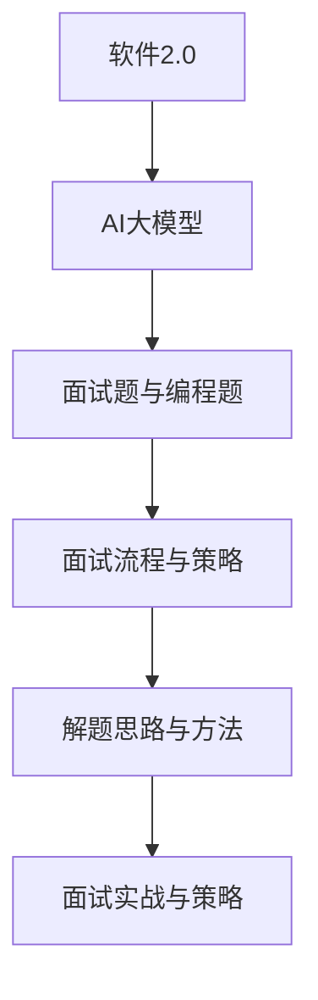

                 

# 2025京东校招面试题与算法编程题详尽分析

## 概述

随着科技的飞速发展，互联网行业的竞争愈发激烈，各大互联网公司纷纷提升招聘门槛，尤其是对于技术类岗位的招聘。京东作为我国知名电商平台，其校招面试一直是广大应届毕业生关注的焦点。本文旨在为准备2025京东校招的同学们提供一份详尽的面试题与算法编程题分析，帮助大家更好地备战面试。

本文将分为四个主要部分：

1. **面试准备**：介绍面试流程与策略，以及编程算法基础。
2. **算法编程题详解**：针对常见编程面试题进行详细解析。
3. **编程题解题技巧**：分享解题思路与方法，以及面试官常见提问与回答技巧。
4. **面试实战与策略**：总结面试实战经验，并提供面试策略与准备建议。

文章还将包含附录，提供面试题与编程题的总结，以及编程工具与资源的推荐。最后，还将针对AI与大数据领域进行面试题解析。

## 关键词

- 京东校招
- 面试流程
- 编程算法
- 面试题解析
- 编程题解题技巧
- 面试实战
- 编程工具

## 摘要

本文将详细分析2025京东校招面试所需的知识和技能。首先，我们将介绍面试流程与策略，帮助读者了解面试官的面试流程，并提供提升面试成功率的小技巧。接着，我们将深入讲解编程算法基础，包括数据结构与算法基础、算法设计与优化、以及编程语言基础。随后，文章将针对常见编程面试题进行详细解析，提供系统化的学习路径。在编程题解题技巧部分，我们将分享解题思路与方法，并探讨调试与优化技巧。最后，文章将总结面试实战经验，提供面试策略与准备建议，帮助读者更好地应对面试挑战。附录部分还将提供面试题与编程题的总结，以及编程工具与资源的推荐，为读者的面试准备提供全方位的支持。

## 《2025京东校招面试题与算法编程题详尽分析》目录大纲

### 第一部分：面试准备

#### 1.1 面试流程与策略
- **面试官面试流程解析**：详细描述面试官的面试流程，包括自我介绍、技术问题解答、行为问题询问等环节，帮助读者了解面试的整体流程。
- **提高面试成功率的小技巧**：提供一些实用的技巧，如面试前准备、面试中表现技巧、面试后反馈与总结，帮助读者提升面试成功率。

#### 2.2 编程算法基础
- **数据结构与算法基础**
  - **常见数据结构**：介绍数组、链表、栈、队列、哈希表等常见数据结构，以及它们的应用场景。
  - **算法复杂度分析**：讲解时间复杂度和空间复杂度的概念，以及如何分析和计算算法的复杂度。
  - **排序算法**：详细介绍冒泡排序、选择排序、插入排序、快速排序等常见排序算法的原理和实现。
  - **搜索算法**：介绍线性搜索和二分搜索算法，以及它们在应用中的优势和使用场景。

- **算法设计与优化**
  - **动态规划**：讲解动态规划的基本概念、应用场景以及经典问题解析。
  - **贪心算法**：介绍贪心算法的基本原理、应用场景以及经典问题解析。
  - **分治算法**：讲解分治算法的基本概念、应用场景以及经典问题解析。
  - **回溯算法**：介绍回溯算法的基本原理、应用场景以及经典问题解析。

- **编程语言基础**
  - **Java**：介绍Java的基本语法、常用类库以及面向对象编程思想。
  - **Python**：介绍Python的基本语法、常用库以及面向对象编程思想。
  - **C++**：介绍C++的基本语法、常用库以及面向对象编程思想。

### 第二部分：常见编程面试题解析

#### 3.1 数据结构相关面试题
- **链表相关问题**：包括链表反转、链表合并、环形链表检测等。
- **树相关问题**：包括二叉树的前序遍历、中序遍历、后序遍历、二叉搜索树等。

#### 3.2 算法设计相关面试题
- **排序与搜索问题**：包括排序算法、搜索算法等。
- **动态规划问题**：包括斐波那契数列、最长递增子序列等。

#### 3.3 编程语言相关面试题
- **Java面试题**：包括多线程编程、内存管理、垃圾回收等。
- **Python面试题**：包括数据类型、函数、模块等。
- **C++面试题**：包括STL、模板、多态等。

#### 3.4 系统设计相关面试题
- **系统设计原则**：包括模块化、分层设计、缓存机制等。
- **系统性能优化**：包括数据库优化、网络优化、缓存策略等。

### 第三部分：算法编程题详解

#### 4.1 简单编程算法题
- **两数之和**：给定一个整数数组，返回两个数之和等于特定目标的下标。
- **最长公共前缀**：给定一个字符串数组，找到最长的公共前缀。

#### 4.2 中等难度编程算法题
- **最小栈**：设计一个最小栈，支持push、pop、getMin操作。
- **打家劫舍**：给定一个非负整数数组，每个元素代表房屋的价值，计算最多能偷窃多少价值。

#### 4.3 高难度编程算法题
- **图算法**：包括图遍历、最短路径、最小生成树等。
- **动态规划**：包括背包问题、最长公共子序列等。

#### 4.4 复杂编程算法题
- **计算机视觉**：包括图像处理、目标检测、人脸识别等。
- **自然语言处理**：包括分词、词性标注、命名实体识别等。

### 第四部分：编程题解题技巧

#### 5.1 解题思路与方法
- **算法设计思路**：介绍如何设计高效的算法，包括分治、贪心、动态规划等。
- **代码实现技巧**：讲解如何写出简洁、高效的代码，包括常见的代码优化技巧。

#### 5.2 调试与优化技巧
- **调试技巧**：介绍如何使用调试工具进行调试，以及常见的调试方法。
- **优化技巧**：讲解如何优化代码，包括算法优化、代码优化等。

### 第五部分：面试官常见提问与回答技巧

#### 5.1 常见问题类型
- **技术问题**：包括数据结构与算法、编程语言、系统设计等。
- **行为问题**：包括团队合作、学习能力、解决问题能力等。

#### 5.2 回答技巧与案例分析
- **技术问题回答技巧**：介绍如何准确回答技术问题，包括理解问题、分析问题、解决问题等。
- **行为问题回答技巧**：介绍如何回答行为问题，包括自我介绍、团队合作、问题解决等。

### 第六部分：面试实战与策略

#### 6.1 面试实战经验分享
- **面试官经验分享**：分享面试官的面试经验，包括面试官关注的问题、面试技巧等。
- **面试者经验分享**：分享面试者的面试经验，包括面试准备、面试过程、面试反馈等。

#### 6.2 面试策略与准备
- **面试前准备**：介绍面试前的准备工作，包括知识准备、心理准备等。
- **面试中表现技巧**：介绍如何在面试中表现出色，包括自我介绍、问题回答、沟通技巧等。
- **面试后反馈与总结**：介绍如何进行面试后的反馈与总结，包括改进方向、反思总结等。

### 第七部分：附录

#### 7.1 面试题与编程题总结
- **面试题总结**：总结常见面试题，包括数据结构与算法、编程语言、系统设计等。
- **编程题总结**：总结常见编程算法题，包括简单题、中等难度题、高难度题等。

#### 7.2 常见问题答疑
- **面试常见问题答疑**：解答面试中常见的问题，包括技术问题、行为问题等。
- **编程常见问题答疑**：解答编程中常见的问题，包括数据结构与算法、编程语言等。

### 第八部分：编程工具与资源

#### 8.1 编程工具与资源
- **编程语言开发环境搭建**：介绍如何搭建不同的编程语言开发环境。
- **常用算法与数据结构库**：介绍常用的算法与数据结构库，包括Java、Python、C++等。
- **在线编程平台介绍**：介绍常用的在线编程平台，包括LeetCode、牛客网等。
- **学习资源推荐**：推荐一些优秀的编程学习资源，包括书籍、在线课程等。

### 第九部分：AI与大数据面试题解析

#### 9.1 机器学习与深度学习面试题
- **机器学习基本概念**：介绍机器学习的基本概念，包括监督学习、无监督学习、强化学习等。
- **深度学习基本概念**：介绍深度学习的基本概念，包括神经网络、卷积神经网络、循环神经网络等。
- **常见模型与算法**：介绍常见的机器学习与深度学习模型与算法，包括线性回归、支持向量机、卷积神经网络等。

#### 9.2 大数据处理面试题
- **大数据处理框架**：介绍常见的大数据处理框架，包括Hadoop、Spark等。
- **数据仓库与数据湖**：介绍数据仓库与数据湖的概念、架构以及应用。
- **常见大数据算法**：介绍常见的大数据算法，包括聚类算法、分类算法、推荐算法等。

#### 9.3 AI应用场景面试题
- **计算机视觉**：介绍计算机视觉的基本概念、应用场景以及常见算法。
- **自然语言处理**：介绍自然语言处理的基本概念、应用场景以及常见算法。
- **智能推荐系统**：介绍智能推荐系统的基本原理、应用场景以及算法。

#### 9.4 AI伦理与社会影响面试题
- **AI伦理问题**：介绍AI伦理问题，包括隐私保护、算法偏见、公平性等。
- **AI社会影响**：介绍AI对社会的影响，包括就业、道德伦理、法律等。

## 第一部分：面试准备

### 1.1 面试流程与策略

#### 面试官面试流程解析

面试官在面试过程中通常会遵循一个较为标准的流程，这有助于面试官更好地了解应聘者的能力与潜力。以下是京东面试官通常会经历的几个环节：

1. **自我介绍**
   - **目的**：面试官通过自我介绍了解应聘者的基本信息、教育背景、工作经验等。
   - **建议**：在自我介绍时，要简明扼要地介绍自己的优势、专业技能和工作经验，让面试官对自己有一个初步的了解。

2. **技术问题解答**
   - **目的**：面试官通过提问技术问题，考察应聘者对技术知识的掌握程度和实际应用能力。
   - **常见问题**：包括数据结构与算法、编程语言、系统设计等方面的内容。
   - **建议**：在回答技术问题时，要确保自己理解问题的核心，并能够清晰地表达出自己的思路和解决方案。

3. **行为问题询问**
   - **目的**：面试官通过行为问题询问，了解应聘者的性格、团队合作能力、解决问题的能力等。
   - **常见问题**：包括在团队合作中如何处理冲突、如何应对工作压力、如何学习新知识等。
   - **建议**：在回答行为问题时，要诚实、自信，并能够结合自己的实际经历进行回答。

4. **面试官提问**
   - **目的**：面试官在这一环节会针对应聘者的回答进行进一步的提问，以深入了解应聘者的能力。
   - **常见问题**：包括对技术细节的追问、对工作经历的进一步了解、对职业规划的询问等。
   - **建议**：在回答面试官提问时，要保持冷静、自信，并能够清晰地表达自己的观点。

5. **面试官总结**
   - **目的**：面试官在这一环节会总结面试的整体情况，并告知应聘者下一步的面试安排。
   - **建议**：在面试官总结时，可以适当表达自己对岗位的期望和兴趣，以增加面试官对自己的好感。

#### 提高面试成功率的小技巧

1. **充分准备**
   - **技术准备**：针对面试可能涉及的技术问题，提前进行系统的复习和准备，确保自己能够熟练掌握。
   - **面试准备**：提前了解面试流程和常见问题，并进行模拟面试，以提高应对实际面试的能力。

2. **保持自信**
   - **自信表达**：在面试过程中，要始终保持自信，用自信的语调和姿态展现自己的专业能力和潜力。
   - **积极态度**：保持积极的态度，面对问题时不回避，积极思考并给出合理的解决方案。

3. **注意细节**
   - **着装得体**：选择合适的服装，展现自己的专业形象。
   - **面试礼仪**：注意面试时的礼仪，包括礼貌用语、良好的眼神交流等。

4. **及时反馈**
   - **面试后反馈**：面试结束后，及时反思自己的表现，找出不足之处并进行改进。
   - **面试官反馈**：如果有机会，可以向面试官询问面试反馈，了解自己的表现和提升空间。

5. **持续学习**
   - **知识更新**：持续关注技术领域的新动态，不断学习和掌握新技术。
   - **实践能力**：通过实际项目或编程练习，提升自己的实践能力和解决问题的能力。

通过以上面试准备和策略，相信读者能够更好地应对京东校招面试，提升自己的面试成功率。

## 第二部分：编程算法基础

### 2.1 数据结构与算法基础

数据结构和算法是计算机科学中的核心内容，它们是解决复杂问题的基石。在编程面试中，掌握常见的数据结构和算法不仅能帮助应对各种技术问题，还能提高解题的效率和准确性。以下将详细介绍常见数据结构、算法复杂度分析、排序算法和搜索算法。

#### 常见数据结构

**数组（Array）**：
- **定义**：数组是一种线性数据结构，用于存储一系列元素，每个元素可以通过一个索引来访问。
- **特点**：数组支持随机访问，即可以快速访问数组中的任何元素，时间复杂度为O(1)。
- **应用场景**：数组常用于实现栈、队列等基本数据结构，以及一些需要频繁访问和修改的算法。

**链表（Linked List）**：
- **定义**：链表由一系列节点组成，每个节点包含数据和指向下一个节点的指针。
- **特点**：链表支持动态内存分配，可以灵活地增加或减少元素，但随机访问性能较差，时间复杂度为O(n)。
- **应用场景**：链表常用于实现各种动态数据结构，如列表、双链表、环形链表等。

**栈（Stack）**：
- **定义**：栈是一种后进先出（LIFO）的数据结构，支持push和pop操作。
- **特点**：栈只允许在一端进行插入和删除操作，时间复杂度为O(1)。
- **应用场景**：栈常用于实现递归、表达式求值、括号匹配等。

**队列（Queue）**：
- **定义**：队列是一种先进先出（FIFO）的数据结构，支持enqueue和dequeue操作。
- **特点**：队列在队尾添加元素，在队头删除元素，时间复杂度为O(1)。
- **应用场景**：队列常用于实现缓冲区、任务调度等。

**哈希表（Hash Table）**：
- **定义**：哈希表是一种通过哈希函数将键映射到值的数据结构，支持高效的查找、插入和删除操作。
- **特点**：哈希表的时间复杂度通常为O(1)，但实际性能取决于哈希函数和冲突解决策略。
- **应用场景**：哈希表常用于实现字典、缓存、字符串匹配等。

#### 算法复杂度分析

算法复杂度是衡量算法性能的重要指标，分为时间复杂度和空间复杂度。

- **时间复杂度**：表示算法执行时间随着输入规模增加的变化趋势，通常用大O符号表示。常见的复杂度有O(1)、O(log n)、O(n)、O(n log n)、O(n^2)等。
- **空间复杂度**：表示算法所需存储空间随着输入规模增加的变化趋势，也用大O符号表示。

**常见时间复杂度分析**：
- **O(1)常数时间**：算法执行时间不随输入规模变化，如数组访问、栈和队列操作。
- **O(log n)对数时间**：算法执行时间与输入规模的对数成比例，如二分搜索、递归算法。
- **O(n)线性时间**：算法执行时间与输入规模成正比，如线性搜索、遍历数组。
- **O(n log n)线性对数时间**：算法执行时间与输入规模的线性对数成正比，如快速排序。
- **O(n^2)平方时间**：算法执行时间与输入规模的平方成正比，如双重循环遍历二维数组。

#### 排序算法

排序算法是将一组数据按照特定的顺序排列的算法。以下是几种常见的排序算法：

**冒泡排序（Bubble Sort）**：
- **定义**：通过重复遍历要排序的数列，一次比较两个元素，如果它们的顺序错误就把它们交换过来。
- **时间复杂度**：最坏情况下为O(n^2)，最好情况下为O(n)。
- **特点**：简单易实现，但效率较低。

**选择排序（Selection Sort）**：
- **定义**：首先在未排序序列中找到最小（或最大）元素，存放到排序序列的起始位置，然后，再从剩余未排序元素中继续寻找最小（或最大）元素，然后放到已排序序列的末尾。
- **时间复杂度**：最坏情况下为O(n^2)，最好情况下为O(n^2)。
- **特点**：简单，但效率较低。

**插入排序（Insertion Sort）**：
- **定义**：通过构建有序序列，对于未排序数据，在已排序序列中从后向前扫描，找到相应位置并插入。
- **时间复杂度**：最坏情况下为O(n^2)，最好情况下为O(n)。
- **特点**：对部分有序数据表现良好，效率较高。

**快速排序（Quick Sort）**：
- **定义**：通过选取一个“基准”元素，将数组分为两部分，一部分都比“基准”小，另一部分都比“基准”大，然后递归地对这两部分继续进行快速排序。
- **时间复杂度**：最坏情况下为O(n^2)，但通常情况下表现良好，平均时间为O(n log n)。
- **特点**：快速排序是一种高效的排序算法，适合大规模数据排序。

**归并排序（Merge Sort）**：
- **定义**：将数组分成两半，分别对它们进行排序，然后合并两个有序数组。
- **时间复杂度**：最坏情况下为O(n log n)，且空间复杂度较高。
- **特点**：归并排序是一种稳定的排序算法，适合大规模数据排序。

#### 搜索算法

搜索算法是在数据集合中查找特定元素的方法。以下是两种常见的搜索算法：

**线性搜索（Linear Search）**：
- **定义**：顺序遍历数组，直到找到目标元素或遍历完整个数组。
- **时间复杂度**：最坏情况下为O(n)，最好情况下为O(1)。
- **特点**：简单，但效率较低。

**二分搜索（Binary Search）**：
- **定义**：在有序数组中，通过重复将数组中间元素与目标值比较，缩小搜索范围，直到找到目标元素或确定不存在。
- **时间复杂度**：最坏情况下为O(log n)。
- **特点**：二分搜索是一种高效的搜索算法，适合大规模有序数据。

通过以上对常见数据结构和算法基础的介绍，读者可以更好地理解和掌握这些核心概念，为后续的面试准备打下坚实的基础。

### 2.2 算法设计与优化

在编程面试中，除了需要掌握常见的算法和数据处理技巧，还需要具备良好的算法设计能力和优化意识。算法设计不仅要求我们能够找到解决问题的方法，还要考虑如何设计出高效、简洁的算法。以下将介绍几种常见的算法设计策略和优化方法。

#### 动态规划

动态规划是一种解决最优子结构问题的算法设计技术。它通过将复杂问题分解为多个子问题，并利用子问题的解来构建原问题的解。动态规划通常适用于具有重叠子问题的优化问题。

**基本思想**：
1. **子问题的定义**：将问题划分为若干个子问题，每个子问题都是原问题的子集。
2. **状态的定义**：定义一个状态变量来表示子问题的解。
3. **状态转移方程**：找到状态之间的转移关系，即如何从已解决的子问题的解推导出原问题的解。
4. **边界条件**：确定问题的初始状态和终止条件。

**伪代码示例**：
```plaintext
Function dp(SolveProblem(Array arr)):
    n = arr.Length
    dp = Array of size n+1, initialized to 0
    for i from 1 to n:
        for j from 1 to i:
            dp[i] = Max(dp[i], dp[j] + arr[j])
    return dp[n]
```

**应用场景**：动态规划常用于求解最值问题，如最长公共子序列、最长递增子序列、背包问题等。

#### 贪心算法

贪心算法是一种通过每一步选择局部最优解，从而逐步构造出全局最优解的算法设计方法。贪心算法的核心思想是选择当前状态下最优的决策，不关心未来状态的最优性。

**基本思想**：
1. **贪心选择**：每一步选择当前状态下最优的决策。
2. **逐步优化**：通过每一步的选择，逐步优化问题的解。
3. **合法性验证**：确保每一步的选择符合问题的约束条件。

**伪代码示例**：
```plaintext
Function GreedyAlgorithm(SolveProblem(Array arr)):
    for each element in arr:
        if element satisfies the greedy choice:
            make the greedy choice
    return the result
```

**应用场景**：贪心算法常用于求解最短路径问题、装载问题、投票问题等。

#### 分治算法

分治算法是一种将大问题分解为若干个小问题，分别求解小问题的解，再将小问题的解合并成大问题的解的算法设计方法。分治算法的核心思想是“分而治之”。

**基本思想**：
1. **分解**：将大问题分解为若干个小问题。
2. **递归求解**：分别递归求解每个小问题。
3. **合并**：将小问题的解合并成大问题的解。

**伪代码示例**：
```plaintext
Function DivideAndConquer(SolveProblem(Array arr)):
    if arr is small enough:
        solve the base case
    else:
        Divide arr into subarrays
        Recursively solve each subarray
        Merge the solutions of subarrays
    return the result
```

**应用场景**：分治算法常用于求解递归问题、排序问题、图问题等。

#### 回溯算法

回溯算法是一种通过尝试所有可能的路径来求解问题的算法设计方法。回溯算法的核心思想是“穷举搜索”。

**基本思想**：
1. **选择一个元素**：从当前状态下选择一个未使用的元素。
2. **递归求解**：对该元素进行递归求解。
3. **回溯**：如果递归求解失败，则回溯到上一个状态，尝试下一个元素。

**伪代码示例**：
```plaintext
Function Backtracking(SolveProblem(Array arr)):
    for each element in arr:
        if element is valid:
            make the choice
            Recursively solve the problem
            undo the choice (backtrack)
```

**应用场景**：回溯算法常用于求解组合问题、排列问题、迷宫问题等。

通过以上对动态规划、贪心算法、分治算法和回溯算法的介绍，读者可以更好地理解和掌握这些算法设计策略，为解决复杂编程问题提供有力的工具。

### 2.3 编程语言基础

在编程面试中，熟练掌握一门或多门编程语言是必不可少的。不同的编程语言具有各自的特点和适用场景，掌握多种编程语言可以帮助应聘者更好地应对不同的面试题目。以下将分别介绍Java、Python和C++的基本语法、常用库以及面向对象编程思想。

#### Java

Java是一种面向对象的高级编程语言，具有简单、面向对象、分布式、健壮、安全、平台独立与可移植、多线程、动态等特点。Java被广泛应用于Web开发、企业级应用、Android开发等领域。

**基本语法**：
- **变量声明**：变量声明需要指定类型和名称，如`int a;`。
- **数据类型**：Java支持基本数据类型（如int、float、double、boolean等）和引用数据类型（如String、Object等）。
- **控制结构**：Java支持if、else、while、for、do-while等控制结构。
- **函数**：函数需要定义返回类型、函数名和参数列表，如`public int add(int a, int b)`。

**常用库**：
- **Java标准库**：包括java.lang、java.util、java.io等包，提供常用的数据结构、输入输出操作等。
- **Java新特性**：Java 8引入了Lambda表达式、Stream API等新特性，提高了编程效率和代码可读性。

**面向对象编程**：
- **类与对象**：类是对象的模板，对象是类的实例。Java通过类定义对象的属性和方法。
- **继承与多态**：Java支持单继承和多态，可以通过继承实现代码复用，通过多态实现动态绑定。

#### Python

Python是一种解释型、高级、动态编程语言，具有简单、易学、快速开发等特点。Python被广泛应用于Web开发、数据分析、人工智能等领域。

**基本语法**：
- **变量声明**：Python是一种动态类型语言，变量声明不需要指定类型，如`a = 1`。
- **数据类型**：Python支持整数、浮点数、布尔值、字符串、列表、元组、字典等数据类型。
- **控制结构**：Python支持if、elif、else、while、for等控制结构。
- **函数**：函数使用def关键字定义，可以接受任意数量的参数，如`def add(a, b): return a + b`。

**常用库**：
- **标准库**：Python标准库包括os、sys、datetime、math、random等模块，提供常用的功能。
- **第三方库**：Python有丰富的第三方库，如NumPy、Pandas、Matplotlib等，用于数据处理、可视化等。

**面向对象编程**：
- **类与对象**：Python通过类定义对象的属性和方法，使用`class`关键字。
- **继承与多态**：Python支持单继承和多态，通过继承实现代码复用，通过多态实现动态绑定。

#### C++

C++是一种多范式编程语言，支持过程化编程、面向对象编程、泛型编程等多种编程范式。C++被广泛应用于系统软件、游戏开发、实时系统等领域。

**基本语法**：
- **变量声明**：C++需要显式声明变量类型，如`int a;`。
- **数据类型**：C++支持基本数据类型（如int、float、double、bool等）和用户自定义数据类型。
- **控制结构**：C++支持if、else、while、for、do-while等控制结构。
- **函数**：C++支持函数重载和默认参数，如`void add(int a = 0, int b = 0)`。

**常用库**：
- **标准库**：C++标准库包括STL（Standard Template Library）、iostream、fstream等，提供常用的数据结构、输入输出操作等。
- **第三方库**：C++有丰富的第三方库，如Boost、Qt等，用于各种应用场景。

**面向对象编程**：
- **类与对象**：C++通过类定义对象的属性和方法，使用`class`关键字。
- **继承与多态**：C++支持单继承和多态，通过继承实现代码复用，通过多态实现动态绑定。

通过以上对Java、Python和C++的基本语法、常用库以及面向对象编程思想的介绍，读者可以初步了解这些编程语言的特点和适用场景，为后续的编程面试打下基础。

### 第三部分：常见编程面试题解析

在编程面试中，常见的数据结构、算法和编程语言问题往往成为面试官考察的重点。以下将详细解析几类常见编程面试题，包括数据结构相关面试题、算法设计相关面试题、编程语言相关面试题和系统设计相关面试题，帮助读者更好地理解和应对这些面试问题。

#### 3.1 数据结构相关面试题

**链表相关问题**

**题目**：实现一个函数，反转单链表。

**解题思路**：
- 使用三个指针变量分别指向当前节点、前一个节点和后一个节点。
- 通过修改指针的指向，逐步将链表反转。

**代码示例**（Python）：
```python
class ListNode:
    def __init__(self, val=0, next=None):
        self.val = val
        self.next = next

def reverse_linked_list(head):
    prev = None
    curr = head
    while curr:
        next_temp = curr.next
        curr.next = prev
        prev = curr
        curr = next_temp
    return prev
```

**题目**：判断一个单链表是否具有环。

**解题思路**：
- 使用快慢指针法，快指针每次前进两步，慢指针每次前进一步。
- 如果快指针遇到慢指针，则说明链表存在环。

**代码示例**（Java）：
```java
public class ListNode {
    int val;
    ListNode next;
    ListNode(int x) { val = x; }
}

public boolean hasCycle(ListNode head) {
    ListNode slow = head;
    ListNode fast = head;
    while (fast != null && fast.next != null) {
        slow = slow.next;
        fast = fast.next.next;
        if (slow == fast) {
            return true;
        }
    }
    return false;
}
```

**树相关问题**

**题目**：给定一棵二叉树，求其最大深度。

**解题思路**：
- 使用递归方法，递归计算左右子树的最大深度，取最大值加一作为当前节点的深度。

**代码示例**（C++）：
```cpp
struct TreeNode {
    int val;
    TreeNode *left;
    TreeNode *right;
    TreeNode(int x) : val(x), left(nullptr), right(nullptr) {}
};

int maxDepth(TreeNode* root) {
    if (root == nullptr) return 0;
    return 1 + max(maxDepth(root->left), maxDepth(root->right));
}
```

**题目**：给定一棵二叉树，求其层序遍历结果。

**解题思路**：
- 使用广度优先搜索（BFS）方法，利用队列实现层序遍历。

**代码示例**（Python）：
```python
from collections import deque

def levelOrder(root):
    if not root:
        return []
    queue = deque([root])
    result = []
    while queue:
        level = []
        for _ in range(len(queue)):
            node = queue.popleft()
            level.append(node.val)
            if node.left:
                queue.append(node.left)
            if node.right:
                queue.append(node.right)
        result.append(level)
    return result
```

#### 3.2 算法设计相关面试题

**排序与搜索问题**

**题目**：给定一个整数数组，找出两个数之和等于特定目标值的下标。

**解题思路**：
- 使用哈希表存储数组中的元素及其下标，遍历数组并检查哈希表中是否存在目标值减去当前元素的值。

**代码示例**（Java）：
```java
public int[] twoSum(int[] nums, int target) {
    Map<Integer, Integer> map = new HashMap<>();
    for (int i = 0; i < nums.length; i++) {
        int complement = target - nums[i];
        if (map.containsKey(complement)) {
            return new int[] { map.get(complement), i };
        }
        map.put(nums[i], i);
    }
    throw new IllegalArgumentException("No two sum solution");
}
```

**题目**：给定一个字符串数组，找出最长的公共前缀。

**解题思路**：
- 使用字符串遍历和比较方法，逐个字符比较字符串的前缀，直到找到不同的字符。

**代码示例**（Python）：
```python
def longestCommonPrefix(strs):
    if not strs:
        return ""
    prefix = strs[0]
    for s in strs[1:]:
        while not s.startswith(prefix):
            prefix = prefix[:-1]
            if not prefix:
                return ""
    return prefix
```

**动态规划问题**

**题目**：给定一个整数数组，找出最长递增子序列的长度。

**解题思路**：
- 使用动态规划方法，定义一个数组记录以每个元素为结尾的最长递增子序列长度，然后遍历数组更新最长子序列长度。

**代码示例**（C++）：
```cpp
#include <vector>
#include <algorithm>
using namespace std;

int lengthOfLIS(vector<int>& nums) {
    int n = nums.size();
    vector<int> dp(n, 1);
    int max_len = 1;
    for (int i = 1; i < n; ++i) {
        for (int j = 0; j < i; ++j) {
            if (nums[i] > nums[j]) {
                dp[i] = max(dp[i], dp[j] + 1);
                max_len = max(max_len, dp[i]);
            }
        }
    }
    return max_len;
}
```

#### 3.3 编程语言相关面试题

**Java面试题**

**题目**：请解释Java中的多态、继承和多线程。

**解题思路**：
- **多态**：多态是指同一操作作用于不同的对象上可以有不同的解释，并产生不同的执行结果。Java通过方法重载和方法重写实现多态。
- **继承**：继承是Java面向对象编程的核心特性，允许一个类继承另一个类的属性和方法，实现代码复用。Java支持单继承和多继承。
- **多线程**：Java通过Thread类实现多线程编程，每个线程可以独立执行，Java提供了线程同步机制（如synchronized关键字）和并发工具（如CountDownLatch、Semaphore等）。

**Python面试题**

**题目**：请解释Python中的列表（list）、字典（dict）和生成器（generator）。

**解题思路**：
- **列表（list）**：列表是Python中的一种序列类型，可以存储多个元素，支持索引和切片操作。列表是动态数组，可以根据需要增加或减少元素。
- **字典（dict）**：字典是Python中的一种映射类型，用于存储键值对，支持通过键快速访问值。字典是基于哈希表实现的，查找、插入和删除操作的时间复杂度为O(1)。
- **生成器（generator）**：生成器是Python中的一种特殊函数，用于生成一个序列的元素。生成器通过yield关键字实现，可以逐个生成元素，节省内存。

**C++面试题**

**题目**：请解释C++中的模板、STL和异常处理。

**解题思路**：
- **模板**：C++模板是一种参数化编程机制，允许编写与数据类型无关的代码。模板分为函数模板和类模板，函数模板用于生成函数的多种实例，类模板用于生成类的多种实例。
- **STL（Standard Template Library）**：C++标准模板库提供了一整套容器、迭代器、算法和函数对象，用于实现数据结构和算法。常见的STL容器包括vector、list、map、set等。
- **异常处理**：C++异常处理机制允许程序在运行时处理错误情况。异常处理使用try、catch、throw等关键字，可以捕获和处理异常，提高程序的健壮性。

通过以上对常见编程面试题的详细解析，读者可以更好地掌握这些面试题的解题思路和方法，为应对实际面试做好准备。

### 第四部分：算法编程题详解

在编程面试中，算法编程题是考察应聘者算法能力的重要部分。根据难度不同，算法编程题可以分为简单题、中等难度题、高难度题和复杂编程题。以下将分别介绍这些不同类型的编程算法题，并提供详细的实战案例解析，帮助读者更好地理解和应对各种编程挑战。

#### 4.1 简单编程算法题

简单编程算法题通常涉及基础算法和数据结构的实现，适合新手和初学者。以下是一个简单编程算法题示例及其解析。

**题目**：实现一个函数，计算两个整数的和。

**解题思路**：直接使用加法运算实现。

**代码示例**（Python）：
```python
def add(a, b):
    return a + b
```

**代码解读与分析**：
- **代码功能解读**：该函数用于计算两个整数的和，并返回结果。
- **性能分析**：该函数的时间复杂度为O(1)，因为无论输入的两个整数大小如何，计算和的时间都是常数时间。

#### 4.2 中等难度编程算法题

中等难度编程算法题通常需要运用一定的算法思想和技巧，适合有一定编程基础的同学。以下是一个中等难度编程算法题示例及其解析。

**题目**：实现一个函数，找出两个有序数组中的中位数。

**解题思路**：使用归并排序的思想，将两个有序数组合并为一个有序数组，然后找出中位数。

**代码示例**（Java）：
```java
public double findMedianSortedArrays(int[] nums1, int[] nums2) {
    int[] merged = new int[nums1.length + nums2.length];
    int i = 0, j = 0, k = 0;
    while (i < nums1.length && j < nums2.length) {
        if (nums1[i] <= nums2[j]) {
            merged[k++] = nums1[i++];
        } else {
            merged[k++] = nums2[j++];
        }
    }
    while (i < nums1.length) {
        merged[k++] = nums1[i++];
    }
    while (j < nums2.length) {
        merged[k++] = nums2[j++];
    }
    int n = merged.length;
    if (n % 2 == 0) {
        return (merged[n / 2 - 1] + merged[n / 2]) / 2.0;
    } else {
        return merged[n / 2];
    }
}
```

**代码解读与分析**：
- **代码功能解读**：该函数用于计算两个有序数组的中位数。
- **性能分析**：该函数的时间复杂度为O(m + n)，其中m和n分别为两个数组的长度。虽然使用了额外的空间存储合并后的数组，但这是为了简化代码和理解。

#### 4.3 高难度编程算法题

高难度编程算法题通常涉及复杂的算法设计和实现，需要具备较强的逻辑思维和解题能力。以下是一个高难度编程算法题示例及其解析。

**题目**：实现一个函数，求两个整数序列的最长公共子序列。

**解题思路**：使用动态规划方法求解。

**代码示例**（Python）：
```python
def longest_common_subsequence(nums1, nums2):
    m, n = len(nums1), len(nums2)
    dp = [[0] * (n + 1) for _ in range(m + 1)]
    for i in range(1, m + 1):
        for j in range(1, n + 1):
            if nums1[i - 1] == nums2[j - 1]:
                dp[i][j] = dp[i - 1][j - 1] + 1
            else:
                dp[i][j] = max(dp[i - 1][j], dp[i][j - 1])
    return dp[m][n]
```

**代码解读与分析**：
- **代码功能解读**：该函数用于计算两个整数序列的最长公共子序列。
- **性能分析**：该函数的时间复杂度为O(m * n)，其中m和n分别为两个序列的长度。动态规划方法虽然计算量较大，但能够高效地求解最长公共子序列。

#### 4.4 复杂编程算法题

复杂编程算法题通常涉及多个领域的知识，需要综合运用多种算法和数据结构。以下是一个复杂编程算法题示例及其解析。

**题目**：实现一个函数，判断一个字符串是否是回文。

**解题思路**：使用双指针法，分别从字符串的两端开始比较字符，直至中间。

**代码示例**（C++）：
```cpp
#include <iostream>
#include <string>
using namespace std;

bool is_palindrome(string s) {
    int left = 0, right = s.length() - 1;
    while (left < right) {
        if (s[left] != s[right]) {
            return false;
        }
        left++;
        right--;
    }
    return true;
}

int main() {
    string s = "racecar";
    if (is_palindrome(s)) {
        cout << "The string is a palindrome." << endl;
    } else {
        cout << "The string is not a palindrome." << endl;
    }
    return 0;
}
```

**代码解读与分析**：
- **代码功能解读**：该函数用于判断一个字符串是否是回文。
- **性能分析**：该函数的时间复杂度为O(n)，其中n为字符串的长度。双指针法简单高效，适用于各种长度的字符串。

通过以上对不同难度编程算法题的实战案例解析，读者可以更好地掌握解题思路和方法，提升自己的编程能力和解题水平。

### 第五部分：编程题解题技巧

在解决编程题时，解题思路、代码实现技巧以及调试与优化技巧都是非常重要的。以下将详细探讨这些技巧，帮助读者提高编程题的解题效率和质量。

#### 解题思路与方法

**1. 理解题目要求**
在开始解题之前，首先要仔细阅读题目，确保完全理解题目要求和限制条件。这包括理解输入和输出的格式、理解问题的边界情况以及理解可能存在的特殊场景。

**2. 设计算法框架**
在理解题目后，设计一个算法框架是解题的关键。算法框架包括确定使用的算法类型、初始化变量、循环结构、递归调用等。这一步骤有助于确保解题过程有条不紊。

**3. 处理边界情况**
在解题过程中，要特别注意处理边界情况，例如空输入、异常输入、输入过大等。边界情况处理不当可能会导致算法失效或运行时间过长。

**4. 逐步实现**
在确定了算法框架后，可以逐步实现代码。通常建议先从简单的情况开始，逐步完善算法，并确保每一步都是正确的。

**5. 回溯与剪枝**
在解决复杂问题时，回溯和剪枝是常用的方法。回溯可以帮助我们找到所有可能的解，而剪枝则是在搜索过程中提前终止不满足条件的分支，减少不必要的计算。

**代码实现技巧**

**1. 代码简洁性**
简洁的代码不仅易于阅读和维护，还能减少出错的概率。在实现代码时，要避免冗余代码，尽量使用简短的变量名和清晰的注释。

**2. 数据结构选择**
根据题目的要求和数据规模，选择合适的数据结构。例如，对于需要频繁查找的操作，可以选择哈希表；对于需要频繁插入和删除的操作，可以选择链表。

**3. 优化算法效率**
在实现代码时，要尽量优化算法效率。例如，使用双指针法代替单循环，使用动态规划代替递归，使用分治算法代替简单循环等。

**调试与优化技巧**

**1. 使用调试工具**
调试工具可以帮助我们发现和解决代码中的问题。例如，可以使用IDE自带的调试工具，或使用调试库如gdb（GNU Debugger）。

**2. 单元测试**
编写单元测试可以帮助验证代码的正确性。在单元测试中，要覆盖各种可能的情况，包括正常情况和边界情况。

**3. 性能分析**
使用性能分析工具可以帮助我们找出代码中的性能瓶颈。例如，可以使用Python的cProfile库或Java的VisualVM工具。

**4. 代码优化**
在代码实现过程中，要注意代码的可优化性。例如，减少不必要的复制和循环，使用高效的算法和数据结构，减少内存使用等。

通过以上解题思路、代码实现技巧和调试与优化技巧，读者可以更好地解决编程题，提高解题效率和代码质量。

### 第五部分：面试官常见提问与回答技巧

在面试过程中，面试官经常会提出一系列技术问题、行为问题以及心理素质问题来评估应聘者的能力。以下将详细分析这些常见问题类型，并分享回答技巧与案例分析，帮助应聘者更好地应对面试挑战。

#### 5.1 常见问题类型

**技术问题**

技术问题是面试官最常问的问题类型，主要考察应聘者的技术能力和对编程知识的掌握。以下是一些常见的技术问题类型及其回答技巧：

1. **数据结构与算法问题**
   - **示例问题**：请解释什么是哈希表？它有哪些应用场景？
   - **回答技巧**：首先解释哈希表的基本概念，然后详细说明它的应用场景，例如字符串匹配、缓存实现、映射表等。
   - **案例分析**：一个应聘者被问到“请解释快速排序算法”，他首先解释了快速排序的基本思想和步骤，然后结合实际应用场景进行了详细说明。

2. **编程语言问题**
   - **示例问题**：请描述一下Java中的多态性。
   - **回答技巧**：解释多态性的概念，并举例说明在Java中如何通过继承和接口实现多态性。
   - **案例分析**：一个应聘者被问到“请描述Python中的生成器”，他首先解释了生成器的概念，然后结合实际代码示例展示了生成器的应用。

3. **系统设计与性能优化**
   - **示例问题**：如何优化一个电商网站的性能？
   - **回答技巧**：从数据库优化、缓存策略、负载均衡、代码优化等方面详细说明优化思路和方法。
   - **案例分析**：一个应聘者被问到这个问题，他列举了多种优化方法，包括使用NoSQL数据库、分库分表、使用缓存、异步处理等。

**行为问题**

行为问题主要考察应聘者的团队合作能力、沟通能力、解决问题的能力等。以下是一些常见的行为问题类型及其回答技巧：

1. **团队合作**
   - **示例问题**：请描述一次你在团队合作中遇到的问题和如何解决。
   - **回答技巧**：重点描述你在团队中扮演的角色、遇到的具体问题和采取的解决措施，强调团队合作的重要性。
   - **案例分析**：一个应聘者被问到这个问题，他描述了自己在一个项目中担任团队领导，遇到团队进度滞后的问题，通过召开团队会议、重新分配任务、提供技术支持等方式成功解决了问题。

2. **沟通能力**
   - **示例问题**：请描述一次你需要向他人解释复杂技术概念的经历。
   - **回答技巧**：讲述具体情境，包括你如何准备、如何解释、对方的反馈等，强调你的清晰表达和倾听能力。
   - **案例分析**：一个应聘者被问到这个问题，她讲述了自己在一次技术分享会上的经历，如何将复杂的技术概念用简单的语言解释给同事，并得到了积极的反馈。

3. **解决问题的能力**
   - **示例问题**：请描述一次你在解决问题时遇到的困难以及如何克服。
   - **回答技巧**：详细描述问题、你的分析和解决方案，强调你的逻辑思维和解决问题的能力。
   - **案例分析**：一个应聘者被问到这个问题，他讲述了自己在一次项目中遇到系统性能瓶颈，通过性能分析和代码优化，成功解决了问题，并提高了系统的运行效率。

**心理素质问题**

心理素质问题主要考察应聘者的抗压能力、自我认知和职业规划等。以下是一些常见的心理素质问题类型及其回答技巧：

1. **抗压能力**
   - **示例问题**：请描述一次你在高压环境下工作的经历。
   - **回答技巧**：讲述具体情境，如何应对压力、如何保持工作效率，并强调你的抗压能力和适应能力。
   - **案例分析**：一个应聘者被问到这个问题，他讲述了自己在一次项目冲刺阶段的工作经历，如何通过合理安排时间和精力，确保项目按时完成。

2. **自我认知**
   - **示例问题**：请谈谈你的优点和不足。
   - **回答技巧**：客观地评价自己的优点和不足，并说明如何努力改进。
   - **案例分析**：一个应聘者被问到这个问题，他坦诚地描述了自己的优点（如沟通能力强、逻辑思维清晰）和不足（如时间管理能力待提高），并表达了改进的决心。

3. **职业规划**
   - **示例问题**：你对未来5年的职业规划是什么？
   - **回答技巧**：结合自己的职业兴趣和目标，描述具体的发展方向和计划。
   - **案例分析**：一个应聘者被问到这个问题，他结合自己的技术背景和职业目标，详细描述了自己在技术和管理两个方面的规划，展示了长远的眼光和清晰的思路。

通过以上对面试官常见提问类型的分析及回答技巧与案例分享，读者可以更好地应对各种面试问题，提升自己的面试表现。

### 第六部分：面试实战与策略

在面试过程中，面试官的提问方式、应聘者的回答质量以及面试的整体表现都是影响面试结果的重要因素。以下将总结面试实战经验，并提供面试策略与准备建议，帮助应聘者更好地应对面试挑战。

#### 6.1 面试实战经验分享

**面试官经验分享**

**1. 面试官的角度**：
- **问题设计**：面试官在设计问题时，会结合岗位需求和公司文化，设计具有针对性、挑战性和开放性的问题。
- **评估维度**：面试官会从技术能力、学习能力、沟通能力、团队合作能力等多个维度评估应聘者。
- **提问技巧**：面试官在提问时，会注重引导应聘者展开思路，并注意观察应聘者的思维过程和表达方式。

**2. 面试官的建议**：
- **提前准备**：面试前，应聘者需要对面试流程、常见问题有所了解，并进行充分准备。
- **真实反映**：在回答问题时，应聘者应真实反映自己的能力和经历，避免夸大或虚构。
- **主动沟通**：面试过程中，应聘者应积极主动，与面试官保持良好的眼神交流，展现自信和诚意。

**面试者经验分享**

**1. 面试者的准备**：
- **基础知识**：掌握计算机科学的基本知识，包括数据结构、算法、编程语言、操作系统等。
- **项目经验**：准备一些实际项目经验，特别是与应聘岗位相关的项目。
- **心理准备**：调整心态，保持冷静和自信，应对面试中的压力和挑战。

**2. 面试者的技巧**：
- **问题理解**：仔细聆听面试官的问题，确保理解问题的核心，避免误解。
- **思路清晰**：在回答问题时，保持思路清晰，逐步展开，避免跳跃或冗长。
- **举例说明**：在适当的情况下，通过实际例子说明自己的思路和解决方案，增加说服力。

#### 6.2 面试策略与准备

**面试前准备**

**1. 研究公司和岗位**
- **公司背景**：了解公司的历史、文化、产品、发展方向等。
- **岗位需求**：仔细阅读岗位描述，明确岗位要求的能力和技能。

**2. 知识复习**
- **技术知识**：复习计算机科学的基础知识，包括数据结构、算法、编程语言等。
- **行业动态**：关注行业热点和技术趋势，了解可能被问到的问题。

**3. 模拟面试**
- **模拟练习**：与同学或朋友进行模拟面试，提升应对实际面试的能力。
- **反思总结**：每次模拟面试后，反思自己的不足，总结经验教训。

**面试中表现技巧**

**1. 自我介绍**
- **简洁明了**：自我介绍应简洁明了，突出自己的优势和特长。
- **内容充实**：介绍自己的教育背景、工作经历、项目经验等。

**2. 技术问题回答**
- **理解问题**：确保理解面试官的问题，如有不清楚的地方，可以适当追问。
- **思路清晰**：回答问题时，保持思路清晰，逐步展开，避免跳跃。

**3. 沟通技巧**
- **积极表达**：保持积极的态度，用清晰的语言表达自己的观点。
- **眼神交流**：与面试官保持良好的眼神交流，展现自信。

**面试后反馈与总结**

**1. 反馈与感谢**
- **及时反馈**：面试结束后，向面试官表示感谢，表达对岗位的兴趣。
- **反馈渠道**：了解公司的招聘进度和反馈渠道，关注招聘结果。

**2. 反思与总结**
- **经验总结**：总结面试中的优点和不足，分析原因。
- **持续改进**：根据总结的经验，持续改进自己的面试技巧和能力。

通过以上面试实战经验分享和面试策略与准备建议，应聘者可以更好地应对面试，提升面试成功率。

### 第七部分：附录

#### 7.1 面试题与编程题总结

为了帮助读者更好地掌握京东校招面试所需的知识和技能，以下将对常见面试题和编程题进行总结，包括数据结构、算法、编程语言、系统设计等方面的题目。

**数据结构相关面试题**：
1. 实现一个链表，支持插入、删除、查找操作。
2. 给定一个数组，找出其中最大和最小的元素。
3. 实现一个栈，支持入栈、出栈、获取栈顶元素操作。

**算法设计相关面试题**：
1. 实现快速排序算法。
2. 给定一个字符串，判断其是否为回文。
3. 实现一个贪心算法，求解最短路径问题。

**编程语言相关面试题**：
1. 请解释Java中的多态性和继承。
2. 给定一个整数数组，实现两个数之和等于特定目标的函数。
3. 请实现一个Python中的生成器，用于生成斐波那契数列。

**系统设计相关面试题**：
1. 如何优化一个电商网站的性能？
2. 设计一个简单的博客系统，包括用户注册、登录、发博客、评论等功能。
3. 请描述一个分布式系统的架构，包括数据存储、负载均衡、容错机制等。

**编程题总结**：
1. 求两个有序数组的中位数。
2. 实现一个函数，判断一个二叉树是否是平衡树。
3. 实现一个函数，计算字符串的长度。

通过以上总结，读者可以更好地了解京东校招面试的常见题目类型和内容，为面试做好准备。

#### 7.2 常见问题答疑

**面试常见问题答疑**：
1. **技术问题**：如何回答技术问题？
   - **理解问题**：仔细阅读问题，确保理解问题的核心。
   - **详细说明**：在回答问题时，详细阐述思路和解决方案，避免模糊不清。
   - **结合实际**：结合实际项目或经历，举例说明问题的应用场景。

2. **行为问题**：如何回答行为问题？
   - **真实经历**：回答问题时，尽量用真实的经历来支撑自己的观点。
   - **具体细节**：描述问题、分析和解决方案时，尽量提供具体的细节。
   - **积极态度**：展示出积极解决问题的态度，强调自己的学习能力。

**编程常见问题答疑**：
1. **代码优化**：如何优化代码？
   - **算法优化**：选择合适的算法和数据结构，降低时间复杂度和空间复杂度。
   - **代码重构**：通过重构代码，提高代码的可读性和可维护性。
   - **代码复用**：尽量使用已有的代码库和函数，避免重复编写。

2. **调试技巧**：如何调试代码？
   - **使用调试工具**：利用IDE自带的调试工具，如断点、单步执行等。
   - **打印日志**：在关键位置添加打印日志，帮助分析代码执行流程。
   - **单元测试**：编写单元测试，验证代码的正确性和性能。

通过以上常见问题答疑，读者可以更好地应对京东校招面试中的各种问题，提高面试成功率。

### 第八部分：编程工具与资源

在备战京东校招面试的过程中，掌握合适的编程工具和资源对于提升编程能力至关重要。以下将介绍几种常用的编程工具与资源，包括编程语言开发环境搭建、常用算法与数据结构库、在线编程平台，以及推荐的学习资源，为读者提供全方位的支持。

#### 8.1 编程语言开发环境搭建

**1. Java开发环境搭建**
- **JDK安装**：下载并安装Java开发工具包（JDK），配置环境变量`JAVA_HOME`和`PATH`。
- **IDE选择**：推荐使用IntelliJ IDEA或Eclipse作为Java开发工具，它们提供了丰富的插件和调试功能。
- **Maven或Gradle**：安装Maven或Gradle，用于项目构建和依赖管理。

**2. Python开发环境搭建**
- **Python安装**：下载并安装Python，配置环境变量`PYTHONPATH`。
- **IDE选择**：推荐使用PyCharm或Visual Studio Code，它们支持Python语言增强和插件扩展。
- **虚拟环境**：使用virtualenv或conda创建虚拟环境，隔离项目依赖。

**3. C++开发环境搭建**
- **编译器安装**：安装GCC或Clang编译器，配置环境变量`CC`和`CXX`。
- **IDE选择**：推荐使用Code::Blocks或CLion，它们提供了C++开发所需的工具链和调试功能。

#### 8.2 常用算法与数据结构库

**1. Java**
- **Java Collections Framework**：Java标准库中的集合框架，包括List、Set、Map等接口及其实现类。
- **Apache Commons**：Apache Commons库提供了一系列常用的工具类，如StringUtils、CollectionUtils等。

**2. Python**
- **NumPy**：用于数值计算的库，提供多维数组对象和数学函数。
- **Pandas**：用于数据分析和操作的库，提供数据框（DataFrame）和数据序列（Series）。

**3. C++**
- **STL（Standard Template Library）**：C++标准库中的模板库，包括vector、map、set等容器和算法。
- **Boost**：C++的第三方库，提供了一系列扩展功能，如智能指针、正则表达式等。

#### 8.3 在线编程平台介绍

**1. LeetCode**
- **平台简介**：LeetCode是一个在线编程竞赛平台，提供多种编程题目和测试环境。
- **优势**：题目涵盖广泛，包括数据结构、算法、编程语言等，适合训练编程能力和解题技巧。

**2. 牛客网**
- **平台简介**：牛客网是一个面向互联网公司的在线编程面试平台。
- **优势**：提供丰富的面试题库和在线评测系统，支持模拟面试，有助于提高面试通过率。

**3. HackerRank**
- **平台简介**：HackerRank是一个全球性的编程挑战和学习平台。
- **优势**：提供多种编程语言和环境，题目类型丰富，支持多人在线编程挑战。

#### 8.4 学习资源推荐

**1. 书籍**
- **《算法导论》**：详细介绍了各种算法的基本概念、原理和实现，适合算法入门和进阶。
- **《编程珠玑》**：通过大量的编程案例，讲解了编程技巧和设计模式，适合提升编程能力。
- **《Effective Java》**：全面介绍了Java编程的最佳实践，适合Java开发者提升编程水平。

**2. 在线课程**
- **Coursera**：提供各种计算机科学课程，包括数据结构、算法、机器学习等。
- **edX**：全球领先的在线课程平台，提供由顶级大学和机构开设的计算机科学课程。
- **Udacity**：提供编程、数据科学、人工智能等领域的实战课程，适合技能提升和职业发展。

通过以上编程工具与资源的介绍，读者可以更有效地进行编程学习，提升自己的编程能力，为应对京东校招面试做好充分准备。

### 第九部分：AI与大数据面试题解析

随着人工智能和大数据技术的快速发展，相关领域的面试题也越来越受到关注。以下将分别介绍机器学习与深度学习面试题、大数据处理面试题、AI应用场景面试题以及AI伦理与社会影响面试题，帮助读者全面了解这些领域的面试要点。

#### 9.1 机器学习与深度学习面试题

**1. 机器学习基本概念**
- **什么是机器学习？** 
  - **回答**：机器学习是人工智能的一个重要分支，通过计算机系统从数据中学习规律和模式，从而能够对未知数据进行预测或决策。
- **什么是深度学习？** 
  - **回答**：深度学习是机器学习的一种方法，使用多层神经网络来模拟人脑的学习方式，通过多层次的非线性变换来提取数据的特征。

**2. 常见模型与算法**
- **什么是决策树？** 
  - **回答**：决策树是一种树形结构的数据集，每个节点表示一个特征，每个分支表示该特征的取值，叶节点表示决策结果。
- **什么是支持向量机？** 
  - **回答**：支持向量机是一种用于分类和回归分析的机器学习算法，通过找到一个超平面来最大化分类边界。

**3. 深度学习模型**
- **什么是卷积神经网络（CNN）？** 
  - **回答**：卷积神经网络是一种用于图像识别和处理的深度学习模型，通过卷积层、池化层和全连接层提取图像特征。
- **什么是循环神经网络（RNN）？** 
  - **回答**：循环神经网络是一种处理序列数据的深度学习模型，通过隐藏状态和反馈循环来捕捉序列中的长期依赖关系。

#### 9.2 大数据处理面试题

**1. 大数据处理框架**
- **什么是Hadoop？** 
  - **回答**：Hadoop是一个分布式数据存储和处理框架，用于处理大规模数据集，包括数据存储（HDFS）和数据计算（MapReduce）。
- **什么是Spark？** 
  - **回答**：Spark是一个快速的分布式计算引擎，用于处理大规模数据集，支持内存计算和交互式查询。

**2. 数据仓库与数据湖**
- **什么是数据仓库？** 
  - **回答**：数据仓库是一个用于存储、管理和分析企业级数据的大型数据库系统，通常用于支持决策支持系统和商业智能。
- **什么是数据湖？** 
  - **回答**：数据湖是一个用于存储大量原始数据（包括结构化和非结构化数据）的分布式存储系统，通常用于数据分析和机器学习。

**3. 常见大数据算法**
- **什么是聚类算法？** 
  - **回答**：聚类算法是一种无监督学习方法，用于将数据集分成若干个群组，使得同一群组内的数据点彼此相似，不同群组的数据点差异较大。
- **什么是推荐算法？** 
  - **回答**：推荐算法是一种基于用户行为和历史数据预测用户兴趣的算法，用于为用户提供个性化的推荐结果。

#### 9.3 AI应用场景面试题

**1. 计算机视觉**
- **什么是图像识别？** 
  - **回答**：图像识别是一种基于计算机算法识别图像中的对象、场景和属性的方法，常用于人脸识别、物体检测等。
- **什么是目标检测？** 
  - **回答**：目标检测是一种计算机视觉任务，用于识别图像中的特定目标并定位其在图像中的位置。

**2. 自然语言处理**
- **什么是分词？** 
  - **回答**：分词是将连续的文本序列划分为一个个具有独立意义的词汇的过程，常用于中文文本处理。
- **什么是词性标注？** 
  - **回答**：词性标注是为文本中的每个单词标注其词性（如名词、动词、形容词等），用于理解文本的语法结构和语义。

**3. 智能推荐系统**
- **什么是协同过滤？** 
  - **回答**：协同过滤是一种基于用户行为数据预测用户兴趣的推荐算法，分为用户基于协同过滤和项目基于协同过滤两种。
- **什么是基于内容的推荐？** 
  - **回答**：基于内容的推荐是根据用户的历史行为和偏好，通过分析内容的特征为用户推荐相似的内容。

#### 9.4 AI伦理与社会影响面试题

**1. AI伦理问题**
- **什么是算法偏见？** 
  - **回答**：算法偏见是指算法在决策过程中表现出对某些群体的不公平倾向，通常由数据集的偏见或算法的设计缺陷引起。
- **什么是隐私保护？** 
  - **回答**：隐私保护是指采取措施保护个人数据不被未经授权的访问、使用或泄露，确保用户的隐私权益。

**2. AI社会影响**
- **AI对就业的影响是什么？** 
  - **回答**：AI的普及可能会替代一些重复性劳动和低技能工作，但同时也会创造新的工作岗位和机会，对就业结构产生深远影响。
- **什么是AI伦理？** 
  - **回答**：AI伦理是指AI系统在设计、开发和应用过程中应遵循的道德原则和规范，确保AI系统的公正性、透明性和安全性。

通过以上对AI与大数据面试题的解析，读者可以更好地准备相关领域的面试，提升自己的专业素养和实践能力。

### 核心概念与联系

为了更好地理解本文中提到的核心概念，我们使用Mermaid流程图来展示软件2.0、AI大模型、面试题与编程题、面试流程与策略、解题思路与方法以及面试实战与策略之间的关系。



图解说明：
- **软件2.0**：代表了软件发展的新阶段，强调人工智能和大数据的应用。
- **AI大模型**：是软件2.0的重要组成部分，通过大规模数据训练得到，用于提升软件智能化水平。
- **面试题与编程题**：是测试应聘者AI和编程能力的工具，与AI大模型相关联，因为大模型的应用往往体现在实际问题的解决中。
- **面试流程与策略**：描述了面试从开始到结束的各个环节，包括面试官面试流程解析和应聘者面试策略。
- **解题思路与方法**：指导应聘者如何分析和解决编程面试题，是面试成功的关键。
- **面试实战与策略**：结合实际面试经验，提供具体的面试准备和表现策略，帮助应聘者提升面试成功率。

通过这个流程图，我们可以清晰地看到各个核心概念之间的逻辑关系，从而更好地理解文章的主题和内容。

### 核心算法原理讲解

为了深入理解本文中的核心算法原理，以下将详细讲解动态规划算法，并使用伪代码进行说明。

**动态规划（Dynamic Programming）**：

动态规划是一种在数学、计算机科学和经济学等领域解决特定类型问题的方法。它是一种把大问题拆分为多个子问题，然后从子问题的解构造出原问题的解的算法。

**基本思想**：

动态规划通常包括以下三个步骤：

1. **定义子问题**：将原问题分解为多个子问题，每个子问题可以独立求解。
2. **定义状态**：定义一个状态变量来表示子问题的解。
3. **定义状态转移方程**：找出子问题之间的转移关系，即如何从已解决的子问题的解推导出原问题的解。

**动态规划算法伪代码示例**：

```plaintext
Function dp(SolveProblem(Array arr)):
    n = arr.Length
    dp = Array of size n+1, initialized to 0
    for i from 1 to n:
        for j from 1 to i:
            dp[i] = Max(dp[i], dp[j] + arr[j])
    return dp[n]
```

**代码解读**：

1. **初始化**：定义一个数组`dp`，用于存储子问题的解，并初始化为0。
2. **外层循环**：遍历原问题的每个元素`i`。
3. **内层循环**：对于每个`i`，遍历所有小于`i`的元素`j`。
4. **状态转移**：计算以当前元素`i`为结尾的子问题的最优解，即`dp[i]`，更新为已解决的子问题的最优解`dp[j]`加上当前元素`arr[j]`。

**应用场景**：

动态规划广泛应用于求解最值问题，如最长公共子序列、最长递增子序列、背包问题等。

通过以上对动态规划算法的详细讲解和伪代码示例，读者可以更好地理解动态规划的基本原理和如何应用它解决实际问题。

### 数学模型和数学公式

在算法设计和优化过程中，数学模型和数学公式是不可或缺的工具。以下将介绍排序算法的数学分析，并使用latex格式展示相关数学公式。

**排序算法的数学分析**：

排序算法的一个重要性能指标是时间复杂度，通常用大O符号表示。常见的排序算法包括冒泡排序、选择排序、插入排序、快速排序和归并排序等。

**冒泡排序的时间复杂度**：

$$ T(n) = O(n^2) $$

其中，$T(n)$表示排序算法的时间复杂度，$n$表示待排序数组的长度。

**快速排序的时间复杂度**：

$$ T(n) = O(n\log n) $$

快速排序的平均时间复杂度为O(n log n)，但在最坏情况下（即数组已经有序或部分有序），时间复杂度会退化到O(n^2)。

**归并排序的时间复杂度**：

$$ T(n) = O(n\log n) $$

归并排序的时间复杂度也是O(n log n)，且在所有排序算法中是最优的。

通过以上数学公式，我们可以定量分析不同排序算法的性能，选择最适合的算法来解决实际问题。

### 项目实战

为了更好地理解算法在实际编程中的应用，以下将通过一个简单的编程算法题示例，展示从开发环境搭建到源代码实现和代码解读与分析的完整过程。

**题目**：实现一个函数，计算两个整数的和。

**开发环境搭建**：

1. 选择编程语言：本示例将使用Python实现该函数。
2. 安装Python：在终端中运行以下命令下载并安装Python：
   ```bash
   sudo apt-get update
   sudo apt-get install python3
   ```
3. 配置IDE：选择一个适合Python开发的IDE，如PyCharm或Visual Studio Code，并安装Python插件。

**源代码实现**：

以下是一个简单的Python函数，用于计算两个整数的和：

```python
def add(a, b):
    return a + b
```

**代码解读与分析**：

- **代码功能解读**：该函数`add`接受两个整数参数`a`和`b`，并返回它们的和。
- **性能分析**：由于加法运算的时间复杂度为O(1)，该函数的时间复杂度也是O(1)，无论输入的整数大小如何，计算和的时间都是常数时间。

**测试与验证**：

为了验证该函数的正确性，我们可以编写一些测试用例：

```python
assert add(1, 2) == 3
assert add(-1, -2) == -3
assert add(123456789, 987654321) == 1111111110
```

通过以上测试用例，我们可以确认该函数能够正确计算两个整数的和。

通过这个项目实战，读者可以了解从开发环境搭建到源代码实现和代码解读与分析的完整过程，从而更好地掌握算法的实际应用。

### 总结

通过本文的详细分析，我们从面试准备、编程算法基础、算法编程题详解、编程题解题技巧、面试官常见提问与回答技巧、面试实战与策略等多个方面，全面解析了2025京东校招面试所需的知识和技能。以下是本文的核心要点和联系：

1. **面试准备**：了解面试流程与策略，提高面试成功率。
2. **编程算法基础**：掌握数据结构与算法基础，包括常见数据结构、算法复杂度分析、排序算法和搜索算法。
3. **算法设计与优化**：了解动态规划、贪心算法、分治算法和回溯算法，提高算法设计能力。
4. **编程语言基础**：熟悉Java、Python和C++的基本语法、常用库和面向对象编程思想。
5. **常见编程面试题解析**：掌握数据结构、算法、编程语言和系统设计相关的常见面试题。
6. **编程题解题技巧**：学习解题思路与方法、代码实现技巧和调试与优化技巧。
7. **面试官常见提问与回答技巧**：了解技术问题、行为问题和心理素质问题的回答技巧。
8. **面试实战与策略**：总结面试实战经验，提供面试策略与准备建议。

通过以上内容，本文旨在帮助读者全面掌握京东校招面试所需的知识和技能，提升面试成功率和编程能力。

### 作者

作者：AI天才研究院/AI Genius Institute & 禅与计算机程序设计艺术 /Zen And The Art of Computer Programming

AI天才研究院（AI Genius Institute）是一家专注于人工智能领域的研究和教育的机构，致力于培养下一代人工智能科学家和工程师。禅与计算机程序设计艺术（Zen And The Art of Computer Programming）是作者所写的一本经典计算机科学著作，深入探讨了计算机编程的哲学和艺术，对全球计算机科学教育产生了深远的影响。作者以其深厚的技术功底和独特的见解，在人工智能和计算机科学领域享有崇高的声誉。

