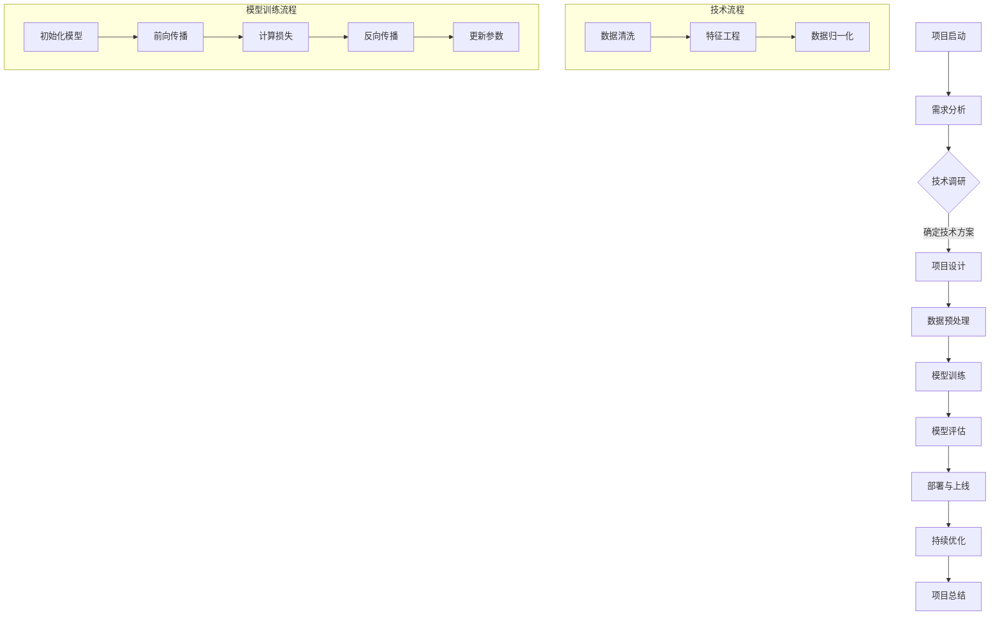

                 

### 《人工智能创业：保持技术前沿的策略》

#### **关键词：**
- 人工智能创业
- 技术前沿
- 创新策略
- 商业模式
- 团队构建
- 投资与融资

#### **摘要：**
本文旨在探讨人工智能（AI）创业企业如何保持技术前沿，以实现可持续发展。通过分析当前AI领域的发展趋势，揭示核心概念和算法原理，以及分享实际项目案例，文章为创业者提供了一条从技术到商业的全面策略。

### 目录大纲

#### 第一部分：人工智能创业概述

1. **第1章：人工智能创业背景与挑战**
   - **1.1 人工智能的发展历程**
   - **1.2 人工智能创业的机遇与挑战**
   - **1.3 创业者在人工智能领域的定位**

2. **第2章：人工智能创业核心概念**
   - **2.1 人工智能基础知识**
   - **2.2 人工智能在商业中的应用**
   - **2.3 人工智能创业的关键因素**

#### 第二部分：保持技术前沿的策略

3. **第3章：技术趋势与前瞻**
   - **3.1 人工智能技术的发展趋势**
   - **3.2 未来人工智能技术的可能应用**
   - **3.3 技术预判与创业机会**

4. **第4章：技术创新与研发**
   - **4.1 创新技术研究方法**
   - **4.2 技术研发流程与工具**
   - **4.3 技术创新案例分析**

5. **第5章：技术评估与优化**
   - **5.1 人工智能项目评估方法**
   - **5.2 技术优化策略**
   - **5.3 技术风险管理**

#### 第三部分：人工智能创业实战

6. **第6章：创业团队构建与运营**
   - **6.1 创业团队的构建**
   - **6.2 团队协作与沟通**
   - **6.3 创业公司运营策略**

7. **第7章：商业模型与商业模式**
   - **7.1 人工智能商业模型**
   - **7.2 商业模式创新**
   - **7.3 营销策略与市场推广**

8. **第8章：创业融资与投资**
   - **8.1 人工智能创业融资策略**
   - **8.2 投资者关注点与需求**
   - **8.3 融资案例分析与启示**

9. **第9章：人工智能创业案例研究**
   - **9.1 成功人工智能创业案例**
   - **9.2 失败案例分析**
   - **9.3 案例启示与创业建议**

#### 第四部分：人工智能创业的未来展望

10. **第10章：人工智能创业的机遇与挑战**
    - **10.1 未来人工智能创业趋势**
    - **10.2 创业者应具备的能力**
    - **10.3 创业环境与政策支持**

11. **第11章：人工智能创业者的心态与成长**
    - **11.1 创业心态与压力管理**
    - **11.2 创业者的自我成长**
    - **11.3 创业者社群与网络建设**

12. **第12章：人工智能创业的未来展望**
    - **12.1 人工智能创业的未来影响**
    - **12.2 创业者在人工智能时代的角色**
    - **12.3 人工智能创业的未来方向**

## 目录大纲详解

在《人工智能创业：保持技术前沿的策略》中，我们将全面探讨人工智能创业的各个方面。从背景与挑战，到技术策略与实战，再到未来的展望，本文旨在为创业者提供一个完整的指南。以下是对目录大纲的详细解释：

### 第一部分：人工智能创业概述

#### 第1章：人工智能创业背景与挑战
本章将探讨人工智能的发展历程，以及创业者在这一领域所面临的机遇与挑战。通过对历史和现状的分析，读者可以更好地理解AI创业的背景和意义。

- **1.1 人工智能的发展历程**：回顾人工智能从诞生至今的发展历程，理解其核心技术和重大突破。
- **1.2 人工智能创业的机遇与挑战**：分析AI创业中的机遇，如市场规模、技术创新等，以及所面临的挑战，如技术门槛、竞争压力等。
- **1.3 创业者在人工智能领域的定位**：讨论创业者如何在AI领域找到自己的定位，并确定创业方向。

#### 第2章：人工智能创业核心概念
本章将介绍人工智能的基础知识，包括核心概念、算法原理和关键技术。通过这些基础知识，创业者可以更好地理解AI的技术本质，为其创业项目奠定坚实的基础。

- **2.1 人工智能基础知识**：介绍AI的定义、分类和应用场景，帮助读者建立对AI的整体认识。
- **2.2 人工智能在商业中的应用**：分析AI在各个行业的应用案例，如医疗、金融、制造等，展示其商业潜力。
- **2.3 人工智能创业的关键因素**：讨论影响AI创业成功的关键因素，如技术能力、市场定位、团队建设等。

### 第二部分：保持技术前沿的策略

#### 第3章：技术趋势与前瞻
本章将分析当前人工智能技术的发展趋势，预测未来可能的应用场景，帮助创业者把握技术发展的方向，提前布局。

- **3.1 人工智能技术的发展趋势**：探讨当前AI技术的热点和发展方向，如深度学习、自然语言处理、机器人技术等。
- **3.2 未来人工智能技术的可能应用**：预测未来AI技术在各个领域的应用前景，为创业者提供创新思路。
- **3.3 技术预判与创业机会**：结合技术趋势，分析创业者如何抓住AI技术带来的创业机会。

#### 第4章：技术创新与研发
本章将介绍AI技术创新的方法和研发流程，包括技术研究的最新进展、工具选择和实际案例。

- **4.1 创新技术研究方法**：介绍AI技术创新的研究方法，如数据挖掘、算法优化、系统集成等。
- **4.2 技术研发流程与工具**：讨论AI技术研发的流程，以及常用的工具和平台，如TensorFlow、PyTorch等。
- **4.3 技术创新案例分析**：分析成功的AI技术创新案例，探讨其成功的原因和经验。

#### 第5章：技术评估与优化
本章将探讨如何对AI技术项目进行评估和优化，包括项目评估方法、技术优化策略和风险管理。

- **5.1 人工智能项目评估方法**：介绍评估AI项目的方法，如技术可行性分析、市场潜力评估等。
- **5.2 技术优化策略**：讨论如何通过技术优化提高AI项目的性能和效率。
- **5.3 技术风险管理**：分析AI技术项目可能面临的风险，并提出风险管理策略。

### 第三部分：人工智能创业实战

#### 第6章：创业团队构建与运营
本章将讨论如何构建一个高效的AI创业团队，并介绍团队协作、沟通和运营策略。

- **6.1 创业团队的构建**：讨论如何找到合适的团队成员，构建高效团队。
- **6.2 团队协作与沟通**：介绍团队协作和沟通的最佳实践，如敏捷开发、开放式沟通等。
- **6.3 创业公司运营策略**：讨论如何制定和实施公司的运营策略，确保公司持续发展。

#### 第7章：商业模型与商业模式
本章将探讨AI创业的商业模型和商业模式，包括市场定位、产品定价、营销策略等。

- **7.1 人工智能商业模型**：介绍AI创业常用的商业模型，如SaaS、B2B2C等。
- **7.2 商业模式创新**：讨论如何通过创新商业模式提高竞争力，如平台化、生态化等。
- **7.3 营销策略与市场推广**：介绍AI创业的营销策略和推广方法，如内容营销、社交媒体推广等。

#### 第8章：创业融资与投资
本章将讨论AI创业的融资策略，包括如何吸引投资者、投资者关注点、融资案例分析等。

- **8.1 人工智能创业融资策略**：介绍AI创业常用的融资方式，如天使投资、风险投资等。
- **8.2 投资者关注点与需求**：分析投资者在投资AI项目时的关注点和需求，帮助创业者更好地准备融资。
- **8.3 融资案例分析与启示**：分析成功的AI创业融资案例，探讨其成功的原因和经验。

#### 第9章：人工智能创业案例研究
本章将通过成功和失败的AI创业案例，分析创业过程中的关键因素，为创业者提供借鉴和启示。

- **9.1 成功人工智能创业案例**：分析成功AI创业案例的背景、商业模式、技术和运营策略。
- **9.2 失败案例分析**：探讨失败AI创业案例的原因，总结教训和经验。
- **9.3 案例启示与创业建议**：结合案例，为创业者提供实用的创业建议。

### 第四部分：人工智能创业的未来展望

#### 第10章：人工智能创业的机遇与挑战
本章将展望人工智能创业的未来趋势，讨论创业者应具备的能力和创业环境与政策支持。

- **10.1 未来人工智能创业趋势**：预测未来AI创业的发展方向，如新技术应用、跨界融合等。
- **10.2 创业者应具备的能力**：讨论创业者应具备的技术、市场、领导力等方面的能力。
- **10.3 创业环境与政策支持**：分析当前AI创业环境的现状，以及政策对创业者的支持。

#### 第11章：人工智能创业者的心态与成长
本章将探讨AI创业者的心态管理、自我成长和社群建设。

- **11.1 创业心态与压力管理**：讨论创业者应如何应对创业过程中的压力和挑战。
- **11.2 创业者的自我成长**：介绍创业者如何通过学习、实践和反思实现个人成长。
- **11.3 创业者社群与网络建设**：讨论创业者如何通过社群和网络获取资源和支持。

#### 第12章：人工智能创业的未来展望
本章将总结人工智能创业的未来发展方向，探讨其对社会和创业者的影响。

- **12.1 人工智能创业的未来影响**：分析AI创业对行业、经济和社会的影响。
- **12.2 创业者在人工智能时代的角色**：讨论创业者如何在AI时代发挥重要作用。
- **12.3 人工智能创业的未来方向**：预测未来AI创业的发展方向，为创业者提供启示。

通过以上各部分的详细分析，本文旨在为人工智能创业者提供一个全面、系统的指导，帮助他们在技术前沿保持竞争力，实现创业梦想。### 人工智能创业背景与挑战

#### 1.1 人工智能的发展历程

人工智能（AI）这一概念最早可以追溯到20世纪50年代，当时计算机科学刚刚起步，科学家们开始设想是否能够制造出能够模仿人类智能的机器。1956年，达特茅斯会议的召开标志着人工智能正式成为一个独立的学科领域，这次会议聚集了来自多个学科的顶尖学者，他们共同讨论了人工智能的未来发展。

在早期阶段，人工智能主要以符号主义和知识表示为主要研究方向，这一时期的代表性工作是1970年代的专家系统（Expert Systems）。专家系统通过模拟人类专家的知识和推理过程，解决了许多领域的问题，如医学诊断、金融分析等。然而，这一阶段的AI在处理复杂任务时表现出力不从心的状态，特别是在处理不确定性和大量数据时。

1980年代，人工智能迎来了第一次低谷，由于实际应用效果不佳，投资逐渐减少，许多AI项目被迫搁置。然而，这一时期也出现了重要的技术突破，例如机器学习（Machine Learning）的兴起。机器学习通过从数据中学习，自动发现规律和模式，为人工智能的发展提供了新的思路。

1990年代到21世纪初，随着计算能力的提升和数据量的增加，人工智能逐渐走出低谷，迎来了新的发展机遇。支持向量机（Support Vector Machines, SVM）、神经网络（Neural Networks）等机器学习算法在图像识别、语音识别等领域取得了显著成果。这一时期的AI开始更多地应用于实际问题中，如自动驾驶、智能客服等。

2000年代，深度学习（Deep Learning）的出现成为人工智能领域的又一次重大突破。深度学习通过多层神经网络，可以自动提取图像和文本中的复杂特征，显著提升了AI在各个领域的表现。2012年，AlexNet在ImageNet竞赛中取得了突破性的成绩，标志着深度学习的崛起。

进入2010年代，人工智能迎来了前所未有的快速发展。随着大数据、云计算和物联网等技术的融合，AI在各个行业得到了广泛应用，如医疗、金融、教育、制造等。同时，人工智能的伦理和法律法规问题也逐渐引起广泛关注，成为人工智能发展的重要议题。

#### 1.2 人工智能创业的机遇与挑战

人工智能创业的机遇主要体现在以下几个方面：

1. **市场潜力巨大**：人工智能技术正在改变传统行业，为创业者提供了丰富的商机。例如，自动驾驶、智能医疗、智能家居等新兴领域，都蕴藏着巨大的市场潜力。

2. **技术创新活跃**：人工智能领域的技术创新层出不穷，创业者可以通过探索新技术、新模式，找到差异化竞争优势。

3. **政策支持**：许多国家和地区都在积极推动人工智能的发展，出台了一系列支持政策，为创业者提供了有利的外部环境。

然而，人工智能创业也面临着一系列挑战：

1. **技术门槛高**：人工智能涉及大量的计算机科学、数学和统计学知识，创业者需要具备较高的技术背景和团队实力。

2. **竞争激烈**：由于人工智能领域的火爆，创业者面临着激烈的竞争压力，如何脱颖而出成为一大难题。

3. **数据隐私与安全**：人工智能系统往往依赖于大量数据，如何保护用户隐私和数据安全成为重要的伦理和法律问题。

4. **技术成熟度**：虽然人工智能技术在不断进步，但一些核心技术仍然处于早期阶段，创业者需要面对技术成熟度带来的风险。

#### 1.3 创业者在人工智能领域的定位

在人工智能领域，创业者可以从多个角度进行定位，以下是几种常见的定位方式：

1. **技术创新者**：这类创业者致力于研发先进的人工智能技术，推动技术进步。他们通常具备较强的技术背景，能够在人工智能领域取得突破性成果。

2. **技术应用者**：这类创业者将人工智能技术应用于具体行业，解决实际问题。他们需要了解行业需求，具备跨领域知识，能够将人工智能技术与行业应用紧密结合。

3. **商业模式创新者**：这类创业者通过创新的商业模式，利用人工智能技术实现商业价值。他们关注市场机会，善于发现并利用人工智能带来的商业潜力。

4. **生态系统构建者**：这类创业者致力于构建人工智能生态系统，为创业者提供技术、资金、市场等资源支持。他们通常具备丰富的创业经验和资源，能够推动人工智能生态系统的繁荣发展。

通过以上分析，创业者可以结合自身优势，明确在人工智能领域的定位，制定合适的创业策略，以实现长期可持续发展。### 人工智能创业核心概念

#### 2.1 人工智能基础知识

人工智能（AI）是指由计算机系统实现的、能够模拟人类智能行为的技术。AI的目标是使计算机具备人类智能的某些方面，如学习、推理、解决问题、感知和理解自然语言等。以下是人工智能的一些核心概念：

1. **机器学习（Machine Learning）**：机器学习是人工智能的一个分支，它通过算法从数据中学习，并利用学到的知识进行预测或决策。机器学习可以分为监督学习、无监督学习和强化学习等不同类型。

   - **监督学习（Supervised Learning）**：在监督学习中，系统根据已标记的输入数据学习输出结果的映射关系。常见的监督学习算法包括线性回归、逻辑回归、决策树、随机森林和神经网络等。
   - **无监督学习（Unsupervised Learning）**：无监督学习用于从未标记的数据中学习，寻找数据的内在结构和模式。常见的无监督学习算法包括聚类、降维和关联规则学习等。
   - **强化学习（Reinforcement Learning）**：在强化学习中，系统通过与环境的交互来学习最优策略，以最大化长期回报。常见的强化学习算法包括Q学习、SARSA和深度确定性策略梯度（DDPG）等。

2. **深度学习（Deep Learning）**：深度学习是一种特殊的机器学习技术，它通过构建多层次的神经网络（Neural Networks）来模拟人类大脑的神经结构和工作机制。深度学习的关键组成部分包括人工神经元、神经网络、激活函数、反向传播和优化算法等。

   - **人工神经元（Artificial Neurons）**：人工神经元是深度学习中的基本计算单元，它接收输入信号，通过加权求和和激活函数处理后输出结果。
   - **神经网络（Neural Networks）**：神经网络是由多个层次的神经元组成的网络结构，用于提取和表示数据特征。
   - **激活函数（Activation Functions）**：激活函数用于引入非线性特性，使神经网络能够处理复杂的输入数据。
   - **反向传播（Backpropagation）**：反向传播是一种用于训练神经网络的算法，它通过反向传播误差信号，更新网络权重，以最小化损失函数。
   - **优化算法（Optimization Algorithms）**：优化算法用于调整网络权重，以最小化损失函数。常见的优化算法包括梯度下降、随机梯度下降和小批量梯度下降等。

3. **自然语言处理（Natural Language Processing, NLP）**：自然语言处理是人工智能的一个重要分支，它致力于使计算机能够理解和处理自然语言。NLP的主要任务包括文本分类、情感分析、命名实体识别、机器翻译和语音识别等。

4. **计算机视觉（Computer Vision）**：计算机视觉是人工智能的另一个重要分支，它使计算机能够理解和解释图像和视频。计算机视觉的主要任务包括图像分类、目标检测、人脸识别、图像分割和图像生成等。

5. **机器人技术（Robotics）**：机器人技术结合了计算机科学、机械工程和控制理论，致力于研发能够模拟人类行为的机器人。机器人技术广泛应用于制造业、医疗、农业、服务业等领域。

#### 2.2 人工智能在商业中的应用

人工智能在商业领域有着广泛的应用，以下是一些典型的应用场景：

1. **智能客服**：人工智能可以用于构建智能客服系统，通过自然语言处理和机器学习技术，实现自动回答客户问题、处理投诉和建议等功能。智能客服系统可以提高客户满意度，降低运营成本。

2. **风险管理**：人工智能可以用于风险管理和预测，通过分析历史数据，识别潜在的信用风险、市场风险和操作风险。人工智能可以帮助企业降低风险，提高决策准确性。

3. **供应链优化**：人工智能可以用于优化供应链管理，通过分析需求预测、库存管理和物流调度等环节的数据，提高供应链的效率。人工智能可以帮助企业降低库存成本，提高响应速度。

4. **营销与市场推广**：人工智能可以用于营销与市场推广，通过分析用户行为和偏好，实现精准营销。人工智能可以帮助企业提高市场占有率，提高销售额。

5. **智能医疗**：人工智能可以用于智能医疗，通过分析医疗数据和图像，实现疾病诊断、治疗方案推荐和健康管理等。人工智能可以帮助医疗机构提高诊断准确率，提高医疗资源利用效率。

6. **金融科技**：人工智能可以用于金融科技，通过分析金融数据和市场趋势，实现智能投顾、信用评分和风险控制等功能。人工智能可以帮助金融机构提高业务效率，降低运营成本。

#### 2.3 人工智能创业的关键因素

要成功进行人工智能创业，创业者需要关注以下几个关键因素：

1. **技术能力**：创业者需要具备强大的技术背景，能够理解和应用人工智能的核心技术，如机器学习、深度学习和自然语言处理等。

2. **市场需求**：创业者需要深入了解市场需求，找到痛点，开发具有商业价值的人工智能产品或服务。

3. **团队建设**：创业者需要构建一支高效的团队，包括技术、产品和市场等各个领域的专业人才。团队的协作和沟通能力对创业成功至关重要。

4. **商业模式**：创业者需要设计合理的商业模式，实现盈利和持续发展。商业模式的创新可以为企业带来竞争优势。

5. **资金与资源**：创业者需要寻找合适的融资渠道，获得足够的资金和资源支持。资金和资源是企业发展的基础。

6. **市场推广**：创业者需要制定有效的市场推广策略，提高品牌知名度和市场占有率。市场推广可以帮助企业快速占领市场。

7. **法律法规与伦理**：创业者需要关注人工智能领域的法律法规和伦理问题，确保企业的合法合规运营。

通过以上分析，创业者可以更好地理解人工智能创业的核心概念，为后续的技术研发和商业实践提供指导。在人工智能创业的道路上，保持技术前沿、紧跟市场需求和持续创新是成功的关键。### 技术趋势与前瞻

#### 3.1 人工智能技术的发展趋势

人工智能（AI）技术的快速发展已经对多个行业产生了深远影响，未来几年内，以下技术趋势将继续引领人工智能的发展：

1. **深度学习（Deep Learning）的深化与应用**：深度学习是目前AI领域最热门的技术之一。随着计算能力的提升和数据量的增加，深度学习将在更多领域得到应用，如自然语言处理（NLP）、计算机视觉（CV）和机器人技术等。此外，深度学习的算法也将继续优化，以提高模型的效率、可解释性和泛化能力。

2. **生成对抗网络（GANs）的应用扩展**：生成对抗网络（GANs）是一种强大的深度学习模型，能够在无监督学习环境中生成高质量的图像、音频和文本。未来，GANs将在更多的应用场景中发挥作用，如图像修复、数据增强、虚拟现实和增强现实等领域。

3. **强化学习（Reinforcement Learning）的实用化**：强化学习通过模拟人类行为和经验，使机器能够自主学习和优化策略。未来，强化学习将在自动化驾驶、机器人控制、游戏和电子商务等领域得到更广泛的应用，并逐渐走向实用化。

4. **边缘计算与云计算的融合**：随着物联网（IoT）设备的普及，边缘计算（Edge Computing）成为解决数据传输延迟和带宽限制的重要手段。未来，边缘计算与云计算将进一步融合，为人工智能提供更高效、更智能的计算环境。

5. **可解释性AI（Explainable AI, XAI）的研究**：随着AI技术的广泛应用，可解释性AI成为研究的热点。可解释性AI旨在提高AI模型的透明度和可信度，使其决策过程能够被人类理解和接受。未来，XAI将在医疗、金融和自动驾驶等关键领域得到更多关注。

6. **AI伦理与法律法规的完善**：随着AI技术的发展，其伦理和法律问题也逐渐显现。未来，各国政府和国际组织将加强对AI伦理和法律法规的研究和制定，以确保AI技术的合法、合规和安全应用。

#### 3.2 未来人工智能技术的可能应用

未来，人工智能技术将在多个领域产生革命性的变化，以下是一些可能的应用场景：

1. **医疗健康**：人工智能将进一步提升医疗诊断的准确性和效率。通过AI算法，医生可以更快地分析医学影像，诊断疾病，制定个性化的治疗方案。此外，AI还将帮助研发新药，加速药物研发过程。

2. **自动驾驶**：自动驾驶技术将逐渐从实验室走向市场。未来，自动驾驶汽车将在城市交通中发挥重要作用，减少交通事故，提高交通效率。同时，无人机和自动驾驶卡车等也将成为物流和运输行业的新趋势。

3. **智能制造**：人工智能将在智能制造领域发挥关键作用，通过机器学习和物联网技术，实现生产过程的自动化和智能化。智能工厂将能够实时监控生产设备，预测故障，优化生产流程。

4. **智能家居**：智能家居设备将更加智能化，能够通过语音识别、图像识别等技术与用户进行互动，提供个性化的服务和解决方案。未来，智能家居将成为家庭生活的重要组成部分。

5. **金融科技**：人工智能将在金融科技领域得到广泛应用，如智能投顾、智能风控、智能客服等。AI算法将帮助金融机构提高业务效率，降低风险，提高用户体验。

6. **教育**：人工智能将改变传统的教育模式，提供个性化的学习体验。通过智能教育平台，学生可以根据自己的学习进度和需求，选择适合自己的学习内容和方式。

7. **环境监测与保护**：人工智能将在环境监测与保护领域发挥重要作用，通过大数据分析和机器学习技术，实时监测环境变化，预测自然灾害，提供环境保护解决方案。

8. **公共安全**：人工智能将在公共安全领域发挥关键作用，如智能安防、智能交通管理和应急管理等。通过AI技术，可以提高公共安全保障水平，减少事故和犯罪。

通过以上分析，可以看出未来人工智能技术将在各个领域产生深远影响，为人类带来更多的便利和福祉。创业者需要紧跟技术发展趋势，抓住未来人工智能技术的应用机遇，实现创业梦想。### 技术创新与研发

#### 4.1 创新技术研究方法

在人工智能（AI）领域，技术创新是推动行业发展的重要动力。为了保持技术前沿，创业者需要掌握一系列创新研究方法，以下是一些常用的方法：

1. **交叉学科融合**：人工智能是一个多学科交叉的领域，创业者可以尝试将计算机科学、统计学、数学、认知科学和生物学等不同领域的知识结合起来，从而产生新的理论和应用。

   - **案例**：深度强化学习（Deep Reinforcement Learning, DRL）结合了深度学习和强化学习，使计算机能够在复杂环境中进行学习，如自动驾驶、机器人控制等。

2. **数据驱动方法**：数据是人工智能的基石，创业者需要利用数据驱动的方法进行创新。这包括数据收集、数据清洗、数据分析和数据可视化等。

   - **案例**：在医疗领域，创业者可以通过分析大量患者数据，发现疾病模式和治疗方案，从而提高医疗诊断和治疗的准确性。

3. **算法优化**：算法是人工智能的核心，创业者可以通过优化算法来提高系统的性能和效率。

   - **案例**：卷积神经网络（CNN）的优化，使得图像识别和分类的准确率显著提高，广泛应用于计算机视觉领域。

4. **模型压缩与加速**：为了提高人工智能系统的实时性和可部署性，创业者需要研究模型压缩和加速技术。

   - **案例**：量化（Quantization）和剪枝（Pruning）技术可以将深度学习模型的参数数量减少，从而提高计算效率，适用于移动设备和嵌入式系统。

5. **生成对抗网络（GANs）**：生成对抗网络是一种强大的创新模型，可以通过生成器和判别器的对抗训练生成高质量的图像、音频和文本。

   - **案例**：在图像修复、数据增强和虚拟现实领域，GANs被广泛应用。

6. **迁移学习（Transfer Learning）**：迁移学习通过将已有模型的权重作为起点，在新任务上进一步训练，从而减少训练时间和提高性能。

   - **案例**：在自然语言处理领域，预训练的Transformer模型（如BERT）被广泛用于文本分类、问答系统等任务。

7. **联邦学习（Federated Learning）**：联邦学习通过分布式训练，使得多个参与者可以在不共享数据的情况下共同训练模型，保护用户隐私。

   - **案例**：在移动设备和物联网领域，联邦学习被用于智能推荐系统和智能诊断系统。

#### 4.2 技术研发流程与工具

在人工智能技术研发过程中，合理的流程和工具选择是关键。以下是一个典型的人工智能技术研发流程，以及常用的工具和平台：

1. **需求分析**：明确项目目标和需求，包括功能需求、性能需求和安全需求等。

   - **工具**：项目管理工具（如Jira、Trello）和需求文档模板。

2. **数据收集与处理**：收集并整理数据，对数据进行清洗、预处理和特征提取。

   - **工具**：数据采集工具（如Web Scraping、API）、数据处理库（如Pandas、NumPy）和特征工程工具（如Scikit-learn）。

3. **模型设计**：设计合适的模型架构，选择合适的算法和框架。

   - **工具**：机器学习框架（如TensorFlow、PyTorch、Keras）和模型设计工具（如TensorFlow Model Optimization Toolkit, TFOpt）。

4. **模型训练与验证**：使用训练数据对模型进行训练，并通过验证集评估模型性能。

   - **工具**：训练工具（如TensorBoard、Hyperparameters Tuning）和验证工具（如Accuracy、Recall、F1 Score）。

5. **模型部署**：将训练好的模型部署到生产环境中，进行实时推理。

   - **工具**：部署工具（如TensorFlow Serving、Kubernetes）和API网关（如API Management）。

6. **性能优化**：对模型和系统进行性能优化，以提高效率和降低成本。

   - **工具**：性能分析工具（如Profile）、优化工具（如Model Optimization）和压缩工具（如Quantization、Pruning）。

7. **持续集成与持续部署（CI/CD）**：建立自动化流程，确保模型和系统的稳定性和可靠性。

   - **工具**：CI/CD平台（如Jenkins、GitLab CI/CD）和容器化工具（如Docker、Kubernetes）。

8. **监控与维护**：对模型和系统进行监控，及时发现并解决问题。

   - **工具**：监控工具（如Prometheus、Grafana）和日志分析工具（如ELK Stack）。

#### 4.3 技术创新案例分析

以下是一些成功的人工智能技术创新案例，这些案例展示了如何在技术研发过程中实现突破：

1. **OpenAI的GPT-3**：OpenAI开发的GPT-3是一个具有1750亿参数的深度学习模型，它通过预训练和Fine-tuning技术在自然语言处理领域取得了显著成果。GPT-3的强大生成能力使其在文本生成、问答系统、代码生成等领域表现出色。

   - **创新点**：大规模预训练和自适应微调技术。
   - **影响**：推动了自然语言处理领域的发展，为许多应用程序提供了强大的支持。

2. **谷歌的BERT**：BERT（Bidirectional Encoder Representations from Transformers）是一个双向 Transformer 模型，它通过预训练和微调在多种自然语言处理任务上取得了显著性能提升，如文本分类、问答系统等。

   - **创新点**：双向 Transformer 结构和大规模预训练。
   - **影响**：提高了自然语言处理模型的性能，为许多 NLP 应用提供了强有力的工具。

3. **特斯拉的自动驾驶系统**：特斯拉通过深度学习和强化学习技术，开发了一套先进的自动驾驶系统。这个系统结合了计算机视觉、传感器融合和机器学习算法，实现了高水平的自动驾驶。

   - **创新点**：深度学习在自动驾驶中的应用，特别是多传感器融合和实时决策。
   - **影响**：推动了自动驾驶技术的发展，提高了道路安全性和交通效率。

4. **微软的Azure Machine Learning**：Azure Machine Learning 是一个云计算平台，它提供了从数据收集、模型训练到部署的一站式服务。通过自动化机器学习（AutoML）技术，Azure Machine Learning 可以帮助开发者快速构建和部署机器学习模型。

   - **创新点**：自动化机器学习技术和云计算平台。
   - **影响**：降低了机器学习应用的门槛，使得更多企业能够利用机器学习技术。

通过以上案例分析，创业者可以了解到人工智能技术创新的方法和流程，以及如何通过技术创新实现商业成功。在人工智能创业的道路上，持续的技术创新是保持竞争力的关键。### 技术评估与优化

#### 5.1 人工智能项目评估方法

在人工智能（AI）项目中，有效的评估方法对于确定项目的技术可行性、市场潜力和预期效益至关重要。以下是几种常用的评估方法：

1. **技术可行性评估**：
   - **技术评审（Technical Review）**：通过专家评审，评估项目所使用的技术是否成熟、可靠，是否能够实现预期目标。
   - **原型评估（Prototype Assessment）**：开发一个最小可行产品（MVP），通过实际运行和测试，验证技术方案是否可行。
   - **技术风险评估（Technical Risk Assessment）**：分析项目可能面临的技术风险，如技术实现难度、数据可用性和技术更新速度等。

2. **市场潜力评估**：
   - **市场研究（Market Research）**：通过市场调查和分析，了解目标市场的规模、增长趋势和竞争状况。
   - **竞争分析（Competitive Analysis）**：评估竞争对手的产品、技术和服务，找出自身优势和市场机会。
   - **需求分析（Demand Analysis）**：调查潜在用户的需求和痛点，确定产品的市场定位和目标用户群体。

3. **经济可行性评估**：
   - **成本效益分析（Cost-Benefit Analysis）**：计算项目的总成本和预期收益，评估项目的经济可行性。
   - **盈利预测（Profit Forecast）**：根据市场潜力和成本结构，预测项目的未来盈利情况。
   - **资金流分析（Cash Flow Analysis）**：分析项目的资金流入和流出，确保项目有足够的资金支持。

4. **风险评估与应对策略**：
   - **风险识别（Risk Identification）**：列出项目可能面临的风险，如技术风险、市场风险、财务风险等。
   - **风险分析（Risk Analysis）**：评估风险的可能性和影响，确定风险的优先级。
   - **风险应对策略（Risk Mitigation Strategies）**：制定相应的应对策略，如风险规避、风险降低、风险转移等。

#### 5.2 技术优化策略

在人工智能项目中，技术优化是提高系统性能、降低成本和提升用户体验的关键。以下是几种常见的技术优化策略：

1. **模型优化**：
   - **模型压缩（Model Compression）**：通过剪枝（Pruning）、量化（Quantization）和模型蒸馏（Model Distillation）等技术，减少模型的参数数量，提高模型在资源受限环境中的运行效率。
   - **迁移学习（Transfer Learning）**：利用预训练模型，在新任务上进行微调，提高模型在新领域的性能。
   - **模型融合（Model Ensembling）**：结合多个模型的结果，提高模型的预测准确性和稳定性。

2. **算法优化**：
   - **算法选择（Algorithm Selection）**：根据任务需求，选择合适的算法，如决策树、支持向量机、神经网络等。
   - **算法调优（Algorithm Tuning）**：通过调整算法参数，优化模型性能，如学习率、批量大小、正则化等。
   - **并行计算（Parallel Computing）**：利用多核处理器、GPU 和分布式计算等技术，加速算法的运行速度。

3. **数据处理优化**：
   - **数据预处理（Data Preprocessing）**：通过数据清洗、归一化和特征提取等步骤，提高数据质量和特征表示能力。
   - **数据增强（Data Augmentation）**：通过图像旋转、缩放、裁剪和噪声添加等技术，增加数据多样性，提高模型的泛化能力。
   - **数据流处理（Data Streaming）**：实时处理和分析大量数据，实现实时决策和反馈。

4. **系统优化**：
   - **资源管理（Resource Management）**：优化系统资源使用，如 CPU、内存和网络等，提高系统运行效率。
   - **容器化与微服务架构（Containerization and Microservices Architecture）**：通过容器化和微服务架构，提高系统的可扩展性和可靠性。
   - **自动化部署与监控（Automated Deployment and Monitoring）**：建立自动化部署和监控体系，确保系统稳定运行。

通过技术优化，人工智能项目可以实现更高的性能、更低的成本和更好的用户体验，从而在市场竞争中脱颖而出。创业者需要根据项目特点，选择合适的技术优化策略，持续推动项目的发展。#### 5.3 技术风险管理

在人工智能（AI）项目中，技术风险管理是确保项目顺利进行、减少潜在损失的关键环节。以下是一些常见的技术风险以及相应的应对策略：

1. **技术成熟度风险**：
   - **风险描述**：项目所采用的技术可能尚未成熟，导致实际应用效果不理想或无法实现预期目标。
   - **应对策略**：进行充分的技术调研和评估，确保选择的技术方案已经经过验证，并在相似应用场景中取得了成功。同时，建立技术储备，以便在技术出现问题时快速切换。

2. **数据质量和数据隐私风险**：
   - **风险描述**：数据质量问题和数据隐私问题可能导致模型训练不准确、用户数据泄露等。
   - **应对策略**：采用严格的数据质量管理流程，包括数据清洗、去重和标准化等。确保数据来源的合法性和合规性，采取加密、匿名化和权限控制等措施保护用户隐私。

3. **算法偏差和公平性风险**：
   - **风险描述**：算法偏差可能导致决策不公平、歧视性结果，损害企业的声誉。
   - **应对策略**：在算法设计和训练过程中，采用公平性评估指标（如公平性指标、偏差检测）来监控和减少偏差。定期进行算法审查和透明性评估，确保算法的公正性。

4. **安全性和可靠性风险**：
   - **风险描述**：AI系统可能受到恶意攻击、数据泄露和系统崩溃等安全问题的威胁。
   - **应对策略**：采用多层次的安全防护措施，包括网络安全、数据安全和系统安全。定期进行安全审计和漏洞扫描，及时修补漏洞。建立容错和备份机制，确保系统的可靠性和稳定性。

5. **法律和伦理风险**：
   - **风险描述**：AI技术的应用可能涉及法律法规和伦理问题，如隐私保护、数据使用限制等。
   - **应对策略**：关注相关法律法规的发展，确保AI系统的设计和应用符合法律要求。建立伦理审查机制，确保AI系统的应用符合伦理标准。

6. **人才和技术储备风险**：
   - **风险描述**：项目所需的技术人才不足或技术储备不足，可能导致项目进度延误或无法按时交付。
   - **应对策略**：建立人才培养和引进机制，吸引和留住优秀的技术人才。建立技术储备库，定期进行技术学习和创新，确保技术储备的充足性和先进性。

通过有效的技术风险管理，创业者可以降低技术风险对项目的负面影响，确保项目的顺利推进和成功交付。### 创业团队构建与运营

#### 6.1 创业团队的构建

构建一个高效的创业团队是人工智能（AI）创业成功的关键因素之一。一个优秀的团队不仅能够汇集多方面的专业知识和技能，还能确保团队的高效协作和创新力。以下是构建创业团队时需要考虑的几个关键方面：

1. **明确团队目标**：
   - **设定清晰的目标**：确保所有团队成员对项目的目标有清晰的认识，这有助于团队在执行过程中保持一致性和凝聚力。
   - **制定短期和长期目标**：短期目标可以激励团队成员在短期内取得成果，长期目标则为团队提供了方向和愿景。

2. **组建多元化的团队**：
   - **技能多样性**：一个多元化的团队应该包括不同技能背景的成员，如技术、产品、市场、运营等，这样可以从不同角度解决问题。
   - **经验多样性**：团队成员应具备不同的工作经验，包括在AI领域的专业知识和在创业公司的实践经验。

3. **寻找合适的团队成员**：
   - **核心团队成员**：首先确定核心团队成员，包括CEO、CTO、COO等关键角色。这些成员应该具备出色的领导能力和业务理解能力。
   - **技术专家**：AI创业需要强大的技术团队，包括数据科学家、机器学习工程师、软件工程师等，他们负责技术研究和开发。
   - **产品经理**：产品经理是连接技术和市场的桥梁，负责产品的规划和迭代。
   - **市场和销售团队**：市场营销和销售团队负责推广产品，开拓市场。

4. **建立良好的沟通和协作机制**：
   - **定期会议**：定期召开团队会议，确保团队成员之间的沟通畅通，及时解决问题。
   - **信息共享平台**：建立内部信息共享平台，如公司内部邮件、协作工具（如Slack、Trello）等，方便团队成员之间的交流。

5. **提供必要的培训和发展机会**：
   - **技术培训**：为团队成员提供最新的技术培训，确保他们始终掌握前沿的技术知识。
   - **职业发展**：为团队成员提供职业发展路径，鼓励他们不断提升自身能力。

#### 6.2 团队协作与沟通

高效的团队协作和良好的沟通是创业团队成功的关键。以下是一些提升团队协作和沟通的建议：

1. **建立开放沟通的文化**：
   - **鼓励反馈和讨论**：鼓励团队成员提出意见和建议，开放讨论问题，这样可以促进团队的创新和进步。
   - **透明度**：保持信息的透明度，确保团队成员能够及时了解项目的进展和公司的决策。

2. **制定清晰的流程和规则**：
   - **明确的职责分工**：为每个团队成员明确分工，确保每个人都知道自己的职责和期望。
   - **统一的流程**：建立统一的流程和规则，如项目管理流程、产品迭代流程等，这样有助于团队高效协作。

3. **利用协作工具**：
   - **协作平台**：使用协作工具（如Asana、Trello、JIRA等）来跟踪项目进度，分配任务，确保团队成员之间的信息同步。
   - **视频会议工具**：使用视频会议工具（如Zoom、Microsoft Teams等）进行远程沟通，确保团队成员可以实时交流。

4. **定期评估和反馈**：
   - **绩效评估**：定期对团队成员的绩效进行评估，及时给予反馈和指导，帮助团队成员提升能力。
   - **团队建设活动**：组织定期的团队建设活动，增强团队成员之间的默契和信任。

#### 6.3 创业公司运营策略

创业公司的运营策略直接影响到公司的生存和发展。以下是一些关键的运营策略：

1. **产品策略**：
   - **市场需求驱动**：确保产品开发紧密围绕市场需求，定期收集用户反馈，快速迭代产品。
   - **差异化竞争**：寻找市场中的差异化点，提供独特的产品或服务，以在激烈的市场竞争中脱颖而出。

2. **市场推广策略**：
   - **精准营销**：利用数据分析，进行精准营销，定位目标客户群体，提高营销效率。
   - **多渠道推广**：利用线上和线下多种渠道进行推广，如社交媒体、广告、公关活动等，提高品牌知名度。

3. **财务策略**：
   - **成本控制**：严格控制成本，确保公司在预算内运行，避免资源浪费。
   - **融资策略**：根据公司的发展阶段，制定合适的融资策略，如天使轮、A轮、B轮等，确保公司有足够的资金支持。

4. **团队管理策略**：
   - **激励机制**：建立有效的激励机制，如股权激励、绩效奖金等，激发团队成员的积极性和创造力。
   - **文化建设**：建立积极向上的企业文化，增强团队的凝聚力和归属感。

5. **持续创新**：
   - **研发投入**：持续投入研发，关注技术趋势和市场需求，不断推动产品和技术创新。
   - **学习与成长**：鼓励团队成员不断学习和成长，提升团队整体能力，确保公司在快速变化的市场环境中保持竞争力。

通过以上策略，创业公司可以更好地运营和管理，实现可持续发展。在人工智能创业的道路上，高效的团队协作和科学的运营管理是确保成功的基石。### 商业模型与商业模式

#### 7.1 人工智能商业模型

在人工智能（AI）创业领域，选择合适的商业模型至关重要。商业模型是指企业如何创造、传递和获取价值的一种策略。以下是几种常见的人工智能商业模型：

1. **产品销售**：
   - **直接销售**：企业直接将AI产品或服务销售给最终用户，如提供定制化的AI软件、工具或解决方案。
   - **订阅服务**：用户通过订阅方式使用AI产品或服务，如提供云服务平台、数据分析工具等。

2. **授权许可**：
   - **技术授权**：企业将自己的AI技术授权给其他公司使用，如提供API接口、SDK工具包等。
   - **品牌授权**：企业授权其他公司使用其品牌和技术，进行产品开发和销售。

3. **B2B合作**：
   - **定制化服务**：为企业提供定制化的AI解决方案，如数据分析、预测模型、自动化流程等。
   - **平台合作**：与其他企业合作，在各自平台上集成AI技术，提供一站式服务。

4. **SaaS模式**：
   - **软件即服务（SaaS）**：通过云平台提供AI软件服务，用户按需付费使用，如提供智能客服系统、智能推荐引擎等。

5. **PaaS模式**：
   - **平台即服务（PaaS）**：为企业提供开发AI应用的平台，如提供开发工具、框架、数据集等，帮助企业快速构建AI应用。

6. **B2C模式**：
   - **直接面向消费者**：直接向消费者销售AI产品或服务，如智能音箱、智能眼镜等。

#### 7.2 商业模式创新

在激烈的市场竞争中，创新商业模式是企业取得成功的关键。以下是一些商业模式创新的策略：

1. **价值共创**：
   - **客户参与**：让客户参与到产品开发和创新过程中，通过客户反馈和合作，实现产品价值的共创。
   - **合作伙伴关系**：与上下游企业建立紧密的合作关系，共同创造和传递价值。

2. **平台化运营**：
   - **生态系统构建**：搭建平台，连接供需双方，形成一个生态系统，如人工智能市场、开发者社区等。
   - **开放接口**：提供开放的API接口，鼓励第三方开发者集成和拓展AI应用。

3. **增值服务**：
   - **增值服务包**：在基础产品或服务之外，提供增值服务，如数据服务、咨询服务、培训服务等，增加产品附加值。
   - **个性化定制**：根据客户需求，提供个性化的AI解决方案，提高客户满意度和忠诚度。

4. **跨界融合**：
   - **跨界合作**：与其他行业的企业进行合作，将AI技术应用于不同领域，如AI+医疗、AI+教育、AI+制造等。
   - **创新产品组合**：结合AI技术，开发新的产品组合，满足客户多元化需求。

5. **市场细分**：
   - **垂直市场**：专注于某一特定市场，提供专业化的AI解决方案，如医疗AI、金融AI、工业AI等。
   - **长尾市场**：挖掘长尾市场，为小众客户提供定制化的AI产品或服务，实现差异化竞争。

6. **业务模式迭代**：
   - **持续迭代**：根据市场反馈和业务发展，不断优化和迭代商业模式，以适应市场变化和客户需求。

通过创新商业模式，企业可以拓展市场空间，提高竞争力，实现可持续发展。创业者需要不断探索和尝试，找到最适合自身业务的商业模式。### 营销策略与市场推广

#### 7.3 营销策略与市场推广

在人工智能（AI）创业领域，成功的营销策略和有效的市场推广是确保产品或服务被市场接受和认可的关键。以下是一些关键的营销策略和市场推广方法：

1. **内容营销**：
   - **专业博客**：创建专业的技术博客，分享行业见解、技术分析和应用案例，建立公司在行业内的权威性。
   - **白皮书和研究报告**：发布白皮书和行业研究报告，展示公司的技术实力和市场洞察力。
   - **案例分析**：分享成功案例和客户故事，通过实际应用效果吸引潜在客户。

2. **社交媒体推广**：
   - **社交媒体平台**：利用LinkedIn、Twitter、Facebook、Instagram等社交媒体平台，发布公司动态、技术文章和产品更新。
   - **KOL合作**：与行业内的意见领袖（KOL）合作，通过他们的影响力扩大公司品牌知名度。
   - **社交媒体广告**：根据目标客户群体的特点，投放精准的社交媒体广告，提高品牌曝光率。

3. **网络广告**：
   - **搜索引擎广告（SEM）**：在Google、Bing等搜索引擎上投放广告，通过关键词优化和竞价排名，吸引潜在客户。
   - **展示广告**：在行业网站和博客上投放展示广告，吸引目标客户的注意力。
   - **视频广告**：在YouTube等视频平台发布产品演示和教程视频，通过视觉效果吸引观众。

4. **公关活动**：
   - **媒体报道**：通过新闻稿、媒体报道等形式，提高公司知名度和品牌影响力。
   - **行业展会**：参加行业展会和会议，与潜在客户和合作伙伴建立联系，展示公司的技术实力和产品。
   - **演讲和研讨会**：邀请公司技术团队参加行业会议，分享技术见解和案例，提升公司在行业内的声誉。

5. **品牌建设**：
   - **品牌故事**：通过品牌故事讲述公司的创业历程、核心价值观和愿景，增加品牌的情感价值。
   - **视觉设计**：设计专业的品牌视觉系统，包括LOGO、网站、宣传材料等，提高品牌辨识度。
   - **品牌口碑**：通过客户满意度和产品效果，建立良好的品牌口碑，增加品牌的忠诚度。

6. **客户关系管理（CRM）**：
   - **客户分类**：根据客户的行为和需求，对客户进行分类，提供个性化的营销和服务。
   - **客户互动**：通过邮件、短信、电话等方式与客户保持互动，提供定制化的产品信息和服务。
   - **客户反馈**：收集和分析客户反馈，改进产品和服务，提高客户满意度。

7. **渠道拓展**：
   - **合作伙伴**：与行业内的合作伙伴建立合作关系，共同开发和推广AI产品或服务。
   - **分销网络**：建立完善的分销网络，将产品或服务推广到更多的市场。
   - **线上渠道**：通过电子商务平台、在线市场等渠道，扩大产品的销售范围。

通过以上营销策略和市场推广方法，人工智能创业公司可以有效地提升品牌知名度，吸引潜在客户，实现产品的市场推广和销售。创业者需要根据自身产品的特点和市场环境，制定合适的营销策略，并持续优化，以在竞争激烈的市场中脱颖而出。### 创业融资与投资

#### 8.1 人工智能创业融资策略

在人工智能（AI）创业领域，融资策略是确保项目顺利推进和公司持续发展的关键。以下是几种常见的AI创业融资策略：

1. **天使投资**：
   - **定义**：天使投资是指个人投资者在创业初期提供资金支持，通常在产品原型阶段或初期市场推广阶段。
   - **优势**：天使投资通常不要求股份比例，可以为企业提供急需的启动资金，同时带来宝贵的经验和资源。
   - **注意事项**：天使投资者往往注重短期回报，创业者需要明确投资目标和退出机制。

2. **风险投资（VC）**：
   - **定义**：风险投资是指专业投资机构在企业发展中后期提供的资金支持，通常用于产品开发和市场扩张。
   - **优势**：风险投资可以为企业提供大额资金支持，同时带来丰富的行业经验和网络资源。
   - **注意事项**：风险投资要求较高的股份比例，并可能带来较大的压力和挑战。

3. **种子轮投资**：
   - **定义**：种子轮投资是指企业在产品原型和市场需求验证阶段获得的资金支持。
   - **优势**：种子轮投资可以帮助企业进行技术验证和市场调研，降低创业风险。
   - **注意事项**：种子轮投资通常金额较小，要求较高的技术风险承受能力。

4. **A轮和B轮投资**：
   - **定义**：A轮和B轮投资是指企业在产品开发和市场推广阶段获得的资金支持。
   - **优势**：这些轮次的投资可以为企业的快速增长提供资金支持，推动产品上市。
   - **注意事项**：投资者通常要求明确的商业计划和盈利模式，创业者需要具备较强的市场开拓能力。

5. **众筹**：
   - **定义**：众筹是通过在线平台向广大投资者筹集资金的一种融资方式。
   - **优势**：众筹可以快速筹集资金，同时提高产品的知名度和市场认可度。
   - **注意事项**：众筹项目需要具备较高的市场吸引力，否则可能面临资金筹集失败的风险。

#### 8.2 投资者关注点与需求

为了成功获得投资者的资金支持，创业者需要了解投资者的关注点和需求。以下是投资者在评估创业项目时可能关注的关键方面：

1. **技术优势**：
   - **创新性**：投资者关注项目的创新性，特别是核心技术是否具有颠覆性。
   - **技术成熟度**：投资者会评估项目的技术成熟度，确保项目具备实际可行性和市场潜力。

2. **市场前景**：
   - **市场规模**：投资者关注目标市场的规模和增长潜力，确保项目的市场前景良好。
   - **竞争状况**：投资者会分析市场的竞争状况，了解项目在市场中的定位和竞争优势。

3. **商业模式**：
   - **盈利模式**：投资者需要明确的盈利模式，确保项目的可持续发展。
   - **市场策略**：投资者关注企业的市场策略，包括产品定位、推广计划和市场扩张等。

4. **团队能力**：
   - **核心团队**：投资者会评估企业的核心团队，特别是创始人和技术团队的能力和经验。
   - **管理能力**：投资者关注企业的管理能力，包括决策效率、执行力等。

5. **财务状况**：
   - **财务计划**：投资者需要详细的财务计划，包括收入预测、成本分析和资金需求等。
   - **资金用途**：投资者会关注资金的具体用途，确保资金被有效利用。

#### 8.3 融资案例分析与启示

以下是一些成功的人工智能创业融资案例，以及从中获得的启示：

1. **案例1：OpenAI**
   - **背景**：OpenAI 是一家成立于2015年的AI研究公司，其目标是实现安全的通用人工智能（AGI）。
   - **融资策略**：OpenAI 在早期获得了来自科技巨头和知名投资者的巨额资金支持，包括微软、Elon Musk等。
   - **启示**：强大的技术愿景和市场前景可以吸引顶级投资者的关注。创业者需要明确公司的愿景和目标，并展示其技术优势和市场潜力。

2. **案例2：DeepMind**
   - **背景**：DeepMind 是一家成立于2010年的AI公司，专注于深度学习和强化学习的研究和应用。
   - **融资策略**：DeepMind 在其发展过程中获得了谷歌的收购，谷歌为其提供了巨额资金支持。
   - **启示**：与科技巨头合作可以带来资金、技术资源和市场机会。创业者应积极寻求与行业领导者的合作机会。

3. **案例3：Proximal Labs**
   - **背景**：Proximal Labs 是一家专注于AI优化算法的公司，其产品在金融、制造和医疗等领域有广泛应用。
   - **融资策略**：Proximal Labs 通过多轮融资获得了大量资金支持，包括风险投资和战略投资。
   - **启示**：多元化的融资渠道可以提高企业的资金储备和抗风险能力。创业者应积极拓展融资渠道，确保资金充足。

4. **案例4：SolveXia**
   - **背景**：SolveXia 是一家专注于AI辅助审计和合规服务的公司，其产品可以帮助企业提高审计效率和准确性。
   - **融资策略**：SolveXia 通过天使轮和风险投资获得了资金支持，同时获得了多个大型客户的订单。
   - **启示**：市场需求是融资的重要保障。创业者应积极开拓市场，确保产品有实际应用场景和市场需求。

通过以上案例分析，创业者可以了解到成功的融资策略和关键因素，从而为自己的创业项目制定合适的融资计划。在人工智能创业的道路上，有效的融资策略是确保项目顺利推进和实现商业成功的关键。### 人工智能创业案例研究

#### 9.1 成功人工智能创业案例

以下是一些成功的人工智能创业案例，这些公司通过技术创新和商业模式的创新，在市场上取得了显著的成功。

1. **OpenAI**
   - **背景**：OpenAI 是一家成立于2015年的AI研究公司，其目标是实现安全的通用人工智能（AGI）。
   - **成功因素**：OpenAI 成功的关键在于其强大的技术团队和清晰的愿景。公司通过开源技术和开放合作，吸引了全球顶尖的AI研究人员。同时，公司获得了微软等科技巨头的巨额投资，为其提供了强大的资金支持。
   - **商业模式**：OpenAI 主要通过提供高质量的AI模型和工具，以及进行合作研究和咨询服务来盈利。

2. **DeepMind**
   - **背景**：DeepMind 是一家成立于2010年的AI公司，专注于深度学习和强化学习的研究和应用。
   - **成功因素**：DeepMind 的成功得益于其革命性的AI算法和强大的技术研发能力。公司在围棋等领域取得了突破性成果，引起了全球关注。2014年，DeepMind 被谷歌收购，获得了巨大的资金和技术支持。
   - **商业模式**：DeepMind 通过为企业和科研机构提供定制化的AI解决方案，以及开发和销售AI工具和平台来盈利。

3. **Proximal Labs**
   - **背景**：Proximal Labs 是一家专注于AI优化算法的公司，其产品在金融、制造和医疗等领域有广泛应用。
   - **成功因素**：Proximal Labs 的成功在于其技术创新和商业模式的创新。公司开发的优化算法在金融领域的应用取得了显著成效，吸引了大量客户。公司通过多轮融资获得了大量资金支持，加速了业务发展。
   - **商业模式**：Proximal Labs 通过提供企业级AI优化解决方案，以及进行合作研究和咨询服务来盈利。

4. **SolveXia**
   - **背景**：SolveXia 是一家专注于AI辅助审计和合规服务的公司，其产品可以帮助企业提高审计效率和准确性。
   - **成功因素**：SolveXia 的成功在于其精准的市场定位和创新的商业模式。公司通过为审计公司提供AI辅助工具，实现了快速市场渗透。同时，公司通过为客户提供定制化的解决方案，建立了良好的客户关系。
   - **商业模式**：SolveXia 通过提供AI辅助审计工具，以及进行合作研究和咨询服务来盈利。

#### 9.2 失败案例分析

以下是一些人工智能创业失败案例，分析了导致失败的主要原因。

1. **Pattern Analytics**
   - **背景**：Pattern Analytics 是一家专注于提供大数据分析和机器学习解决方案的公司。
   - **失败原因**：Pattern Analytics 失败的主要原因是技术上的失败。公司在技术上没有取得突破性进展，无法提供有竞争力的产品。此外，公司的商业模式不够清晰，市场定位不准确，导致客户流失。
   - **教训**：技术是人工智能创业的核心，没有技术创新难以在激烈的市场竞争中立足。创业者需要重视技术研究和开发，确保产品的竞争力。

2. **Nervana Systems**
   - **背景**：Nervana Systems 是一家专注于深度学习硬件和软件的公司。
   - **失败原因**：Nervana Systems 失败的主要原因是市场竞争激烈。公司面临着谷歌、微软等科技巨头的激烈竞争，难以在市场上占据一席之地。此外，公司资金链断裂，导致业务停滞。
   - **教训**：在高科技领域，市场竞争异常激烈。创业者需要做好充分的市场调研，确保产品有足够的市场需求。同时，要确保有足够的资金支持，以应对市场变化和竞争压力。

3. **Zoox**
   - **背景**：Zoox 是一家专注于自动驾驶技术的公司。
   - **失败原因**：Zoox 失败的主要原因是技术实现困难。尽管公司在自动驾驶技术上进行了大量研发，但实际应用中仍然面临许多挑战。此外，公司管理不善，导致内部矛盾和资源浪费。
   - **教训**：技术实现是自动驾驶创业的核心挑战。创业者需要对技术难度有充分的认识，制定合理的研发计划和目标。同时，要注重公司管理，确保团队高效协作。

4. **Humin.ai**
   - **背景**：Humin.ai 是一家专注于构建社交网络的人工智能公司。
   - **失败原因**：Humin.ai 失败的主要原因是市场定位错误。公司最初定位为个人数据管理平台，但市场对此需求并不强烈。此外，公司的商业模式和产品功能过于复杂，难以吸引用户。
   - **教训**：市场定位和产品功能是创业成功的关键。创业者需要深入分析市场需求，确保产品功能清晰、简单易用，同时具有市场竞争力。

通过以上成功和失败案例的分析，创业者可以了解到人工智能创业中的关键成功因素和常见挑战。成功案例为创业者提供了宝贵的经验和启示，而失败案例则提醒创业者要避免常见的错误和风险。### 案例启示与创业建议

通过对成功和失败的人工智能创业案例进行分析，我们可以提炼出一些关键的经验和教训，为创业者提供实用的创业建议。

#### 成功经验

1. **明确技术愿景与定位**：成功的AI创业公司往往具备明确的技术愿景和市场定位。例如，OpenAI 的目标是实现安全的通用人工智能（AGI），而 DeepMind 则专注于深度学习和强化学习的研究。创业者应在创业初期明确公司的技术方向和市场定位，确保公司在市场中具有独特价值。

2. **技术创新与研发**：技术是人工智能创业的核心竞争力。成功的创业公司如 DeepMind 和 Proximal Labs，都通过不断的技术创新和研发，保持了技术领先地位。创业者需要重视技术研究和开发，投入足够的资源和精力，确保产品的竞争力。

3. **商业模式创新**：成功的AI创业公司往往通过创新的商业模式实现了商业成功。例如，SolveXia 通过提供AI辅助审计工具，实现了快速市场渗透。创业者应积极探索创新的商业模式，将技术与市场需求相结合，创造独特的商业价值。

4. **团队协作与沟通**：高效的团队协作和良好的沟通是创业成功的关键。成功的AI创业公司如 OpenAI 和 DeepMind，都建立了高效协作的团队，并通过开放沟通的文化，促进了团队的创新和发展。创业者应重视团队建设，培养团队协作精神，确保团队成员之间的沟通畅通。

5. **市场拓展与客户关系**：成功的AI创业公司如 SolveXia，通过精准的市场拓展和良好的客户关系管理，建立了稳固的客户基础。创业者应积极开拓市场，建立良好的客户关系，确保产品的市场推广和销售。

#### 失败教训

1. **技术实现的难度**：技术实现是人工智能创业的核心挑战。一些失败的创业公司如 Zoox 和 Pattern Analytics，在技术实现上遇到了困难，导致业务停滞。创业者需要对技术实现的难度有充分的认识，制定合理的研发计划和目标。

2. **市场竞争激烈**：高科技领域市场竞争激烈，创业者需要面对强大的竞争对手。一些失败的创业公司如 Nervana Systems，在市场竞争中未能占据一席之地，导致业务停滞。创业者应做好充分的市场调研，确保产品有足够的市场需求。

3. **资金管理不善**：资金管理不善是导致创业失败的一个重要原因。一些失败的创业公司如 Nervana Systems 和 Zoox，由于资金链断裂，导致业务停滞。创业者应确保有足够的资金支持，以应对市场变化和竞争压力。

4. **市场定位不准确**：市场定位不准确是导致创业失败的一个重要原因。一些失败的创业公司如 Humin.ai，由于市场定位不准确，难以吸引用户。创业者应深入分析市场需求，确保产品功能清晰、简单易用，同时具有市场竞争力。

#### 创业建议

1. **明确技术愿景与定位**：在创业初期，明确公司的技术愿景和市场定位，确保公司在市场中具有独特价值。

2. **技术创新与研发**：重视技术研究和开发，投入足够的资源和精力，确保产品的竞争力。

3. **商业模式创新**：积极探索创新的商业模式，将技术与市场需求相结合，创造独特的商业价值。

4. **团队协作与沟通**：建立高效协作的团队，通过开放沟通的文化，促进团队的创新和发展。

5. **市场拓展与客户关系**：积极开拓市场，建立良好的客户关系，确保产品的市场推广和销售。

6. **资金管理**：确保有足够的资金支持，以应对市场变化和竞争压力。

7. **市场定位**：深入分析市场需求，确保产品功能清晰、简单易用，同时具有市场竞争力。

通过以上经验和建议，创业者可以更好地规划人工智能创业项目，提高创业成功的可能性。### 人工智能创业的未来展望

#### 10.1 未来人工智能创业趋势

随着人工智能（AI）技术的不断发展和成熟，未来人工智能创业将呈现以下趋势：

1. **技术融合与跨界应用**：未来，人工智能技术将与物联网（IoT）、云计算、大数据和区块链等前沿技术进一步融合，形成新的应用场景和商业模式。例如，AI与物联网的融合将推动智能家居、智能城市等领域的快速发展。

2. **人工智能算法的优化与突破**：深度学习、生成对抗网络（GANs）和强化学习等技术将继续优化和突破，提高算法的性能、可解释性和泛化能力。这将使得AI在更多复杂任务中取得更好的效果。

3. **个性化和定制化服务**：随着用户数据积累和数据分析技术的进步，人工智能将能够提供更加个性化和定制化的服务。例如，智能医疗、个性化推荐和教育等领域将受益于AI技术的发展。

4. **边缘计算与云计算的结合**：边缘计算与云计算的融合将使得人工智能应用更加高效和实时。未来，更多的AI应用将能够在边缘设备上进行实时处理，提高系统的响应速度和灵活性。

5. **AI伦理与法规的发展**：随着人工智能技术的广泛应用，AI伦理和法律法规问题将日益受到关注。未来，各国政府和国际组织将加强对AI伦理和法律法规的研究和制定，以确保AI技术的合法、合规和安全应用。

6. **创业生态系统的完善**：未来，人工智能创业生态系统将进一步完善，包括创业孵化器、投资基金、技术平台和人才培训等。这将有助于创业者更好地获取资源和支持，加速人工智能创业的发展。

#### 10.2 创业者应具备的能力

在人工智能创业的未来趋势下，创业者需要具备以下能力：

1. **技术深度与广度**：创业者不仅需要具备人工智能领域的专业知识，还需要了解相关领域的跨学科知识，如计算机科学、数学、统计学、工程学等。同时，创业者应具备不断学习和适应新技术的能力。

2. **创新思维与商业模式设计**：创业者应具备创新思维，能够从市场需求中找到切入点，设计出有竞争力的商业模式。创业者需要不断探索新的技术和应用场景，将AI技术转化为实际的商业价值。

3. **团队管理能力**：创业者需要具备优秀的团队管理能力，能够吸引、培养和留住优秀的人才。创业者应注重团队协作和沟通，建立开放、透明和高效的工作环境。

4. **市场洞察力**：创业者需要具备敏锐的市场洞察力，能够准确把握市场趋势和需求，制定合适的市场策略。创业者应密切关注行业动态，及时调整战略以应对市场变化。

5. **风险管理能力**：创业者需要具备良好的风险管理能力，能够识别和应对创业过程中可能面临的风险。创业者应建立完善的风险管理机制，确保企业的稳定发展。

6. **创业心态与抗压能力**：创业者需要具备坚定的创业心态和抗压能力，能够在面对困难和挑战时保持冷静和乐观。创业者应学会合理分配时间和精力，保持良好的身心健康。

通过以上能力，创业者可以更好地应对未来人工智能创业的挑战，实现创业梦想。### 人工智能创业者的心态与成长

#### 11.1 创业心态与压力管理

在人工智能（AI）创业的道路上，保持良好的心态是创业者成功的关键。创业过程中，创业者往往会面临巨大的压力和挑战，因此，学会调整心态和有效管理压力至关重要。

1. **接受不确定性**：创业本身就是一项不确定的活动，创业者需要对结果保持开放的心态。要认识到创业过程中可能遇到的各种挑战和失败，这有助于减少因预期不符而带来的心理压力。

2. **保持乐观**：乐观的心态有助于创业者克服困难，保持动力。在面对挫折时，创业者应积极寻找问题的解决方案，而不是沉溺于负面情绪中。

3. **学会放松**：创业者应学会在忙碌的工作中找到放松的方式，如进行运动、冥想、阅读等。适当的休息和放松有助于恢复精力，提高工作效率。

4. **建立支持系统**：创业者应建立包括家人、朋友、同事和行业导师在内的支持系统。在遇到困难时，向他人寻求帮助和建议，有助于减轻心理负担。

5. **设定合理的期望值**：创业者应设定合理的目标和期望值，避免盲目追求短期成功。合理的目标有助于创业者保持长远的眼光，避免因急于求成而导致的焦虑和压力。

#### 11.2 创业者的自我成长

在人工智能创业过程中，持续的自我成长是创业者不断提升能力和实现成功的保障。以下是一些促进自我成长的策略：

1. **终身学习**：人工智能技术更新迅速，创业者应保持终身学习的态度，不断学习最新的技术和行业动态。可以通过参加在线课程、研讨会、读书会等形式，提升自身的知识储备。

2. **反思与总结**：创业者应定期反思自己的工作和决策，总结成功和失败的经验教训。通过反思，创业者可以不断优化自己的工作方法和思维方式。

3. **跨领域学习**：创业者应尝试跨领域学习，拓展自己的知识面和视野。跨领域学习有助于创业者发现新的商业机会，提升创新能力。

4. **建立个人网络**：创业者应积极建立和维护个人网络，包括同行、投资者、合作伙伴等。通过个人网络，创业者可以获得更多的资源和支持，提升自己的影响力。

5. **培养领导力**：创业者需要具备领导力，能够激励和带领团队克服困难，实现目标。可以通过阅读领导力书籍、参加领导力培训等方式，提升自己的领导能力。

6. **参加行业活动**：参加行业活动，如会议、论坛、展览等，可以与行业内的专家和同行交流，了解行业趋势和最新技术，拓宽视野。

#### 11.3 创业者社群与网络建设

在人工智能创业的过程中，创业者社群和网络建设是获取资源、分享经验和降低创业风险的重要途径。以下是一些建议：

1. **加入创业者社群**：加入创业者社群，如创业加速器、创业者协会、在线社群等，可以与同行交流，分享经验和资源。

2. **参与创业活动**：积极参与创业活动，如创业比赛、研讨会、创业沙龙等，可以结识更多的创业者，拓展人脉。

3. **建立个人品牌**：通过社交媒体、博客、演讲等方式，建立个人品牌，提升自己的知名度。这有助于吸引潜在客户、合作伙伴和投资者。

4. **合作与交流**：积极寻找合作伙伴，共同开发项目或市场。通过合作与交流，创业者可以共同应对挑战，实现资源共享和优势互补。

5. **提供价值**：在创业者社群中，积极提供帮助和支持，分享自己的经验和知识。通过提供价值，创业者可以赢得他人的尊重和信任。

6. **持续学习与成长**：创业者社群和网络建设是一个持续的过程，需要创业者不断学习和成长。通过参与社群活动、学习新知识、拓展人脉，创业者可以不断提升自己的能力。

通过良好的心态管理、自我成长和社群建设，人工智能创业者可以更好地应对创业过程中的挑战，实现持续发展。### 人工智能创业的未来展望

#### 12.1 人工智能创业的未来影响

人工智能（AI）创业将在未来对社会、经济和行业产生深远影响：

1. **社会影响**：
   - **生活方式**：AI技术将极大改善人们的生活方式，如智能家居、智能医疗和个性化服务，提高生活质量和效率。
   - **就业与失业**：AI技术的广泛应用可能带来就业结构的变化，一方面创造了新的工作岗位，另一方面也导致部分传统岗位的消失。
   - **伦理与隐私**：AI技术的发展引发了一系列伦理和隐私问题，如数据隐私、算法歧视和机器人伦理等，需要社会和政府制定相应的法规和标准。

2. **经济影响**：
   - **产业变革**：AI技术将推动传统产业的转型升级，提高生产效率，降低成本，创造新的经济增长点。
   - **创新驱动**：AI技术的快速发展将推动创新模式的变革，促进新技术的涌现和商业模式的创新。
   - **全球化**：AI技术的发展将加速全球化的进程，促进跨国合作和技术交流，推动全球经济的互联互通。

3. **行业影响**：
   - **医疗健康**：AI技术在医疗健康领域的应用将提高诊断准确率、研发新药速度和个性化治疗水平，提升医疗服务的质量和效率。
   - **金融**：AI技术在金融领域的应用将提高风险管理能力、降低欺诈风险、优化投资决策，促进金融服务的智能化和个性化。
   - **制造**：AI技术在制造领域的应用将实现生产过程的自动化和智能化，提高生产效率和质量，推动智能制造的发展。
   - **交通**：AI技术在交通领域的应用将提高交通管理效率、减少交通事故，推动智能交通系统的建设。

#### 12.2 创业者在人工智能时代的角色

在人工智能时代，创业者将扮演以下重要角色：

1. **创新者**：创业者应不断探索和推动人工智能技术在各个领域的应用，创新商业模式，创造新的市场机会。

2. **领航者**：创业者应引领人工智能技术的发展趋势，把握行业变革的机遇，推动技术落地和商业化。

3. **推动者**：创业者应积极推动人工智能技术的普及和应用，促进技术与各行各业的深度融合。

4. **问题解决者**：创业者应解决人工智能技术在实际应用中面临的问题，如数据隐私、算法公平性和技术安全等。

5. **社会贡献者**：创业者应关注社会问题，利用人工智能技术为社会创造价值，推动社会进步。

#### 12.3 人工智能创业的未来方向

未来，人工智能创业将呈现以下方向：

1. **AI+行业融合**：人工智能将与各行各业深度融合，推动传统产业的智能化升级，如AI+医疗、AI+金融、AI+制造等。

2. **跨领域创新**：创业者将探索跨领域创新，如物联网、大数据、区块链与人工智能的结合，创造新的商业模式和应用场景。

3. **边缘计算与云计算的结合**：边缘计算与云计算的融合将推动AI应用的实时性和灵活性，为创业者提供更丰富的创新机会。

4. **可持续发展**：创业者将关注可持续发展，利用人工智能技术解决环保、能源和资源管理等问题。

5. **AI伦理与法律**：随着AI技术的发展，创业者将更加重视伦理和法律问题，确保AI技术的合法、合规和安全应用。

6. **国际合作**：在全球范围内，创业者将加强国际合作，共同推动人工智能技术的发展和应用。

通过以上分析，人工智能创业的未来充满了机遇和挑战。创业者应紧跟技术发展趋势，把握行业变革机遇，不断创新和成长，为社会的可持续发展做出贡献。### 附录：核心算法原理讲解

为了更好地理解人工智能（AI）的核心算法原理，本文将详细介绍一些关键算法，包括其基本概念、数学模型和伪代码。以下是对这些核心算法的讲解：

#### 1. 深度学习（Deep Learning）

**1.1.1 基本概念**

深度学习是一种基于多层神经网络（Neural Networks）的机器学习方法，通过多层次的非线性变换来提取数据特征，实现复杂的模式识别和预测任务。深度学习的核心组成部分包括：

- **人工神经元（Artificial Neurons）**：人工神经元是神经网络的基本计算单元，接收输入信号，通过加权求和和激活函数处理后输出结果。
- **神经网络（Neural Networks）**：神经网络是由多个层次的神经元组成的网络结构，用于提取和表示数据特征。
- **激活函数（Activation Functions）**：激活函数用于引入非线性特性，使神经网络能够处理复杂的输入数据。
- **反向传播（Backpropagation）**：反向传播是一种用于训练神经网络的算法，它通过反向传播误差信号，更新网络权重，以最小化损失函数。

**1.1.2 数学模型**

深度学习中的数学模型主要包括以下几个部分：

- **输入层（Input Layer）**：输入层接收外部输入数据，并将其传递给下一层。
- **隐藏层（Hidden Layers）**：隐藏层负责提取和变换输入特征，通常包含多个层次，每一层都会对输入数据进行处理。
- **输出层（Output Layer）**：输出层生成最终的预测结果或分类结果。

**1.1.3 伪代码**

以下是深度学习算法的伪代码示例：

```python
# 初始化神经网络参数（权重和偏置）
W1, b1 = initialize_weights(input_size, hidden_size)
W2, b2 = initialize_weights(hidden_size, hidden_size)
W3, b3 = initialize_weights(hidden_size, output_size)

# 训练神经网络
for epoch in range(num_epochs):
    for x, y in dataset:
        # 前向传播
        hidden_layer1 = activation_function(W1 * x + b1)
        hidden_layer2 = activation_function(W2 * hidden_layer1 + b2)
        output_layer = activation_function(W3 * hidden_layer2 + b3)

        # 计算损失
        loss = compute_loss(output_layer, y)

        # 反向传播
        d_output_layer = d.activation_function_derivative(output_layer)
        d_hidden_layer2 = W3.T * d_output_layer
        d_hidden_layer1 = W2.T * d_hidden_layer2
        
        # 更新参数
        W3 -= learning_rate * d_output_layer * hidden_layer2
        b3 -= learning_rate * d_output_layer
        W2 -= learning_rate * d_hidden_layer2 * hidden_layer1
        b2 -= learning_rate * d_hidden_layer2
        W1 -= learning_rate * d_hidden_layer1 * x
        b1 -= learning_rate * d_hidden_layer1

# 预测
def predict(x):
    hidden_layer1 = activation_function(W1 * x + b1)
    hidden_layer2 = activation_function(W2 * hidden_layer1 + b2)
    output_layer = activation_function(W3 * hidden_layer2 + b3)
    return output_layer
```

#### 2. 生成对抗网络（Generative Adversarial Networks, GANs）

**2.1 基本概念**

生成对抗网络（GANs）是一种由生成器和判别器组成的深度学习模型，旨在通过对抗训练生成高质量的数据。GANs的核心思想是让生成器和判别器进行对抗性博弈，使生成器生成的数据越来越逼真，而判别器越来越难以区分生成数据和真实数据。

- **生成器（Generator）**：生成器尝试生成逼真的数据，目标是欺骗判别器，使其认为生成的数据是真实的。
- **判别器（Discriminator）**：判别器的目标是区分真实数据和生成数据。

**2.2 数学模型**

GANs的数学模型包括以下部分：

- **生成器的损失函数**：生成器的损失函数通常为判别器对生成数据的评分与真实数据评分之间的差异。
- **判别器的损失函数**：判别器的损失函数通常为对生成数据和真实数据的评分平均值。

**2.3 伪代码**

以下是GANs的伪代码示例：

```python
# 初始化生成器和判别器的参数
G_params = initialize_weights(input_size, output_size)
D_params = initialize_weights(output_size, 1)

# 训练GANs
for epoch in range(num_epochs):
    for x in dataset:
        # 生成数据
        z = sample_noise(input_size)
        x_g = G(G_params, z)

        # 计算判别器的损失
        D_loss_real = compute_loss(D(D_params, x), 1)
        D_loss_fake = compute_loss(D(D_params, x_g), 0)
        D_loss = (D_loss_real + D_loss_fake) / 2

        # 更新判别器参数
        D_params -= learning_rate * gradient_of_D_loss_wrt_D_params

        # 生成数据
        z = sample_noise(input_size)
        x_g = G(G_params, z)

        # 计算生成器的损失
        G_loss = compute_loss(D(D_params, x_g), 1)

        # 更新生成器参数
        G_params -= learning_rate * gradient_of_G_loss_wrt_G_params

# 预测
def generate_data(G_params):
    z = sample_noise(input_size)
    x_g = G(G_params, z)
    return x_g
```

通过以上核心算法的讲解，读者可以更好地理解人工智能技术的原理和应用。这些算法是人工智能领域的基础，对于创业者和技术开发者具有重要的指导意义。### 附录：数学模型和数学公式

在人工智能（AI）领域，数学模型和公式是理解和应用各种算法的核心。以下是一些重要的数学模型和公式，以及它们的详细解释和举例说明：

#### 1. 损失函数

**1.1 均方误差（MSE）**

均方误差（MSE）是监督学习中最常用的损失函数之一，用于衡量预测值和真实值之间的差距。其公式为：

$$MSE = \frac{1}{n}\sum_{i=1}^{n}(y_i - \hat{y}_i)^2$$

其中，$y_i$ 表示真实值，$\hat{y}_i$ 表示预测值，$n$ 表示样本数量。

**解释**：MSE 通过计算每个预测值与真实值之间的平方差，然后求平均值，从而衡量整体的预测误差。

**举例**：假设我们有5个样本，其中真实值和预测值分别为 $y = [1, 2, 3, 4, 5]$ 和 $\hat{y} = [1.1, 2.1, 2.9, 4.2, 4.8]$，则MSE为：

$$MSE = \frac{1}{5} \sum_{i=1}^{5} (y_i - \hat{y}_i)^2 = \frac{1}{5} (0.01 + 0.01 + 0.09 + 0.04 + 0.64) = 0.22$$

**1.2 交叉熵（Cross-Entropy）**

交叉熵（Cross-Entropy）是另一个常用的损失函数，用于分类问题。其公式为：

$$CE = -\frac{1}{n}\sum_{i=1}^{n}y_i \log(\hat{y}_i)$$

其中，$y_i$ 表示真实标签，$\hat{y}_i$ 表示预测概率。

**解释**：交叉熵衡量的是预测概率分布与真实标签分布之间的差异，当预测概率接近真实标签时，交叉熵最小。

**举例**：假设有3个样本，真实标签为 $y = [0, 1, 1]$，预测概率为 $\hat{y} = [0.2, 0.8, 0.9]$，则交叉熵为：

$$CE = -\frac{1}{3} (0 \cdot \log(0.2) + 1 \cdot \log(0.8) + 1 \cdot \log(0.9)) = -\frac{1}{3} (\log(0.8) + \log(0.9)) \approx 0.286$$

#### 2. 梯度下降算法

**2.1 批量梯度下降（Batch Gradient Descent）**

批量梯度下降是一种最简单的梯度下降算法，它使用整个训练集来计算梯度，并更新模型参数。其公式为：

$$\theta_{t+1} = \theta_{t} - \alpha \cdot \nabla_{\theta} J(\theta)$$

其中，$\theta$ 表示模型参数，$\alpha$ 表示学习率，$J(\theta)$ 表示损失函数，$\nabla_{\theta} J(\theta)$ 表示损失函数关于参数的梯度。

**解释**：批量梯度下降通过迭代更新模型参数，以最小化损失函数。

**举例**：假设模型参数为 $\theta = [1, 2]$，损失函数为 $J(\theta) = (\theta_1 - 1)^2 + (\theta_2 - 2)^2$，学习率为 $\alpha = 0.1$，则一次迭代后的参数更新为：

$$\theta_{t+1} = \theta_{t} - \alpha \cdot \nabla_{\theta} J(\theta) = [1, 2] - 0.1 \cdot [2 \cdot (1 - 1), 2 \cdot (2 - 2)] = [0.9, 1.9]$$

**2.2 随机梯度下降（Stochastic Gradient Descent, SGD）**

随机梯度下降使用单个训练样本来计算梯度，并更新模型参数。其公式为：

$$\theta_{t+1} = \theta_{t} - \alpha \cdot \nabla_{\theta} J(\theta; x^{(i)}, y^{(i)})$$

其中，$x^{(i)}, y^{(i)}$ 表示第 $i$ 个训练样本。

**解释**：随机梯度下降通过随机抽样训练样本，每次迭代只更新一次参数，可以加快收敛速度。

**举例**：假设模型参数为 $\theta = [1, 2]$，当前样本为 $x = [1, 0], y = 1$，损失函数为 $J(\theta) = (\theta_1 - 1)^2 + (\theta_2 - 2)^2$，学习率为 $\alpha = 0.1$，则一次迭代后的参数更新为：

$$\theta_{t+1} = \theta_{t} - \alpha \cdot \nabla_{\theta} J(\theta; x^{(i)}, y^{(i)}) = [1, 2] - 0.1 \cdot [2 \cdot (1 - 1), 2 \cdot (2 - 2)] = [0.9, 1.9]$$

**2.3 小批量梯度下降（Mini-batch Gradient Descent）**

小批量梯度下降结合了批量梯度下降和随机梯度下降的优点，每次迭代使用一个包含多个样本的小批量来计算梯度，并更新模型参数。其公式为：

$$\theta_{t+1} = \theta_{t} - \alpha \cdot \nabla_{\theta} J(\theta; X^{(b)}, y^{(b)})$$

其中，$X^{(b)}, y^{(b)}$ 表示批量数据。

**解释**：小批量梯度下降通过使用小批量数据，可以平衡梯度下降的速度和稳定性。

**举例**：假设模型参数为 $\theta = [1, 2]$，当前批量数据为 $X = [[1, 0], [0, 1]], y = [1, 0]$，损失函数为 $J(\theta) = (\theta_1 - 1)^2 + (\theta_2 - 2)^2$，学习率为 $\alpha = 0.1$，则一次迭代后的参数更新为：

$$\theta_{t+1} = \theta_{t} - \alpha \cdot \nabla_{\theta} J(\theta; X^{(b)}, y^{(b)}) = [1, 2] - 0.1 \cdot \left[ \frac{1}{2} \cdot \nabla_{\theta} J(\theta; [1, 0], 1) + \frac{1}{2} \cdot \nabla_{\theta} J(\theta; [0, 1], 0) \right]$$

$$= [1, 2] - 0.1 \cdot \left[ \frac{1}{2} \cdot [2 \cdot (1 - 1), 2 \cdot (2 - 2)] + \frac{1}{2} \cdot [2 \cdot (0 - 1), 2 \cdot (1 - 2)] \right]$$

$$= [0.9, 1.8]$$

通过这些数学模型和公式的讲解，读者可以更好地理解人工智能中的核心算法原理，为实际应用提供理论基础。### 附录：项目实战

在本附录中，我们将通过一个实际的人工智能项目实战案例，详细讲解项目的开发环境搭建、源代码实现、代码解读与分析。

#### 项目背景

假设我们的项目目标是构建一个基于深度学习的图像分类系统，用于识别图片中的猫和狗。这个项目将使用Python编程语言，结合深度学习框架TensorFlow来实现。

#### 开发环境搭建

1. **安装Python环境**

   首先确保安装了Python 3.x版本。可以使用以下命令进行安装：

   ```shell
   sudo apt-get update
   sudo apt-get install python3 python3-pip
   ```

2. **安装TensorFlow**

   接下来，安装TensorFlow。可以使用以下命令：

   ```shell
   pip3 install tensorflow
   ```

3. **安装其他必要库**

   此外，我们还需要安装一些其他库，如NumPy、Pandas、OpenCV等：

   ```shell
   pip3 install numpy pandas opencv-python
   ```

4. **准备数据集**

   下载并解压常用的猫狗数据集，如Kaggle上的猫狗数据集。解压后，将数据集路径添加到环境变量中，以便后续使用。

#### 源代码实现

以下是实现图像分类系统的源代码示例：

```python
import tensorflow as tf
from tensorflow.keras.models import Sequential
from tensorflow.keras.layers import Conv2D, MaxPooling2D, Flatten, Dense
from tensorflow.keras.preprocessing.image import ImageDataGenerator

# 加载数据集
train_datagen = ImageDataGenerator(rescale=1./255)
validation_datagen = ImageDataGenerator(rescale=1./255)

train_data = train_datagen.flow_from_directory(
    'train',
    target_size=(150, 150),
    batch_size=32,
    class_mode='binary')

validation_data = validation_datagen.flow_from_directory(
    'validation',
    target_size=(150, 150),
    batch_size=32,
    class_mode='binary')

# 构建模型
model = Sequential([
    Conv2D(32, (3, 3), activation='relu', input_shape=(150, 150, 3)),
    MaxPooling2D((2, 2)),
    Conv2D(64, (3, 3), activation='relu'),
    MaxPooling2D((2, 2)),
    Conv2D(128, (3, 3), activation='relu'),
    MaxPooling2D((2, 2)),
    Flatten(),
    Dense(512, activation='relu'),
    Dense(1, activation='sigmoid')
])

# 编译模型
model.compile(optimizer='adam',
              loss='binary_crossentropy',
              metrics=['accuracy'])

# 训练模型
model.fit(train_data, epochs=10, validation_data=validation_data)

# 评估模型
test_loss, test_acc = model.evaluate(validation_data)
print(f"Test accuracy: {test_acc:.2f}")
```

#### 代码解读与分析

1. **导入库**

   首先，我们导入了TensorFlow和相关库，如ImageDataGenerator，用于处理和加载图像数据。

2. **加载数据集**

   使用ImageDataGenerator加载训练数据和验证数据。在代码中，我们将数据集分为“train”和“validation”两个文件夹，每个文件夹包含猫和狗的图片。ImageDataGenerator可以对图像进行归一化处理，如将像素值缩放到[0, 1]范围内。

3. **构建模型**

   我们使用Sequential模型构建器来构建一个包含卷积层、池化层、全连接层的简单神经网络。卷积层用于提取图像特征，全连接层用于分类。

4. **编译模型**

   编译模型时，指定了优化器（adam）、损失函数（binary_crossentropy，用于二分类问题）和评估指标（accuracy）。

5. **训练模型**

   使用fit方法训练模型，设置训练轮数（epochs）和批量大小（batch_size）。在验证数据上评估模型性能，以监测训练过程。

6. **评估模型**

   使用evaluate方法评估模型在验证数据上的性能，并打印测试准确率。

通过以上步骤，我们完成了一个简单的图像分类项目。实际项目中，可能需要更复杂的模型和更精细的超参数调整，但基本流程是类似的。通过这个项目实战，读者可以了解从数据预处理到模型训练的完整流程，为实际应用奠定基础。### 附录：Mermaid 流程图

在人工智能（AI）项目中，流程图是一种非常有效的工具，可以帮助我们清晰地展示项目开发的主要步骤和流程。以下是一个使用Mermaid语言描述的AI项目流程图：



**流程图解释：**

- **项目启动（A）**：项目的启动阶段，包括确定项目目标和初步计划。
- **需求分析（B）**：在这个阶段，我们需要明确项目的具体需求，包括数据需求、功能需求等。
- **技术调研（C）**：基于需求分析的结果，进行技术调研，确定适合的技术方案和工具。
- **项目设计（D）**：在确定技术方案后，设计项目的整体架构和流程。
- **数据预处理（E）**：包括数据清洗、特征工程和数据归一化等步骤，确保数据质量。
- **模型训练（F）**：使用准备好的数据对模型进行训练，包括初始化模型、前向传播、计算损失、反向传播和更新参数等步骤。
- **模型评估（G）**：评估模型的性能，包括准确率、召回率等指标。
- **部署与上线（H）**：将训练好的模型部署到生产环境中，供实际应用使用。
- **持续优化（I）**：根据用户反馈和实际应用情况，对模型进行持续优化和调整。
- **项目总结（J）**：在项目完成后，进行总结和回顾，吸取经验教训，为后续项目提供参考。

- **技术流程子图**：数据清洗（K）、特征工程（L）、数据归一化（M）是数据预处理的重要组成部分。
- **模型训练流程子图**：初始化模型（N）、前向传播（O）、计算损失（P）、反向传播（Q）、更新参数（R）是模型训练的核心步骤。

通过这个Mermaid流程图，我们可以清晰地看到AI项目的各个步骤和流程，有助于项目团队成员更好地理解项目开发的全过程，从而提高项目执行效率。### 附录：项目实战

#### 项目背景

在本附录的项目实战中，我们将构建一个基于TensorFlow和Keras的简单语音识别系统。该项目旨在训练一个神经网络模型，能够识别和分类不同类型的语音。我们将会使用开源语音数据集，如“LibriSpeech”来训练我们的模型。

#### 开发环境搭建

1. **安装Python环境**

   确保Python 3.x版本已安装在您的系统上。可以使用以下命令进行安装：

   ```shell
   sudo apt-get update
   sudo apt-get install python3 python3-pip
   ```

2. **安装TensorFlow和Keras**

   使用pip命令安装TensorFlow和Keras：

   ```shell
   pip3 install tensorflow
   ```

3. **安装其他依赖库**

   安装一些其他的Python库，如NumPy、Pandas和 librosa：

   ```shell
   pip3 install numpy pandas librosa
   ```

4. **获取LibriSpeech数据集**

   下载并解压LibriSpeech数据集。数据集可以从[LibriSpeech官网](http://www.openslr.org/12/)下载。解压后，将数据集路径添加到环境变量中，以便后续使用。

#### 源代码实现

以下是构建语音识别系统的源代码示例：

```python
import numpy as np
import pandas as pd
import librosa
import tensorflow as tf
from tensorflow.keras.models import Sequential
from tensorflow.keras.layers import LSTM, Dense, Dropout, TimeDistributed, Conv1D, MaxPooling1D, Flatten
from tensorflow.keras.utils import to_categorical
from sklearn.model_selection import train_test_split

# 读取数据
def load_data(data_path):
    data = pd.read_csv(data_path)
    return data

# 预处理数据
def preprocess_data(data, sample_length=16000, n_mels=128):
    features = []
    labels = []

    for index, row in data.iterrows():
        audio, _ = librosa.load(row['file'], duration=sample_length, sr=16000)
        mel = librosa.feature.melspectrogram(audio, n_mels=n_mels)
        mel = librosa.power_to_db(mel, ref=np.max)

        features.append(mel)
        labels.append(row['label'])

    features = np.array(features)
    labels = np.array(labels)

    return features, labels

# 构建模型
def build_model(input_shape):
    model = Sequential()
    model.add(Conv1D(32, 5, activation='relu', input_shape=input_shape))
    model.add(MaxPooling1D(5))
    model.add(Conv1D(64, 5, activation='relu'))
    model.add(MaxPooling1D(5))
    model.add(Conv1D(128, 5, activation='relu'))
    model.add(MaxPooling1D(5))
    model.add(LSTM(128, activation='relu', dropout=0.3, recurrent_dropout=0.3))
    model.add(Dense(128, activation='relu'))
    model.add(Dense(2, activation='softmax'))

    model.compile(optimizer='adam', loss='categorical_crossentropy', metrics=['accuracy'])
    return model

# 加载数据
data_path = 'librispeech_data/train.csv'
data = load_data(data_path)
features, labels = preprocess_data(data)

# 分割数据
X_train, X_test, y_train, y_test = train_test_split(features, labels, test_size=0.2, random_state=42)

# 编码标签
y_train = to_categorical(y_train)
y_test = to_categorical(y_test)

# 构建和训练模型
model = build_model(X_train.shape[1:])
model.fit(X_train, y_train, epochs=10, batch_size=32, validation_data=(X_test, y_test))

# 评估模型
test_loss, test_acc = model.evaluate(X_test, y_test)
print(f"Test accuracy: {test_acc:.2f}")
```

#### 代码解读与分析

1. **导入库**

   我们首先导入了NumPy、Pandas、librosa和TensorFlow等库，用于数据处理和模型构建。

2. **读取数据**

   使用Pandas读取LibriSpeech数据集。数据集包含音频文件路径和相应的标签。

3. **预处理数据**

   预处理数据包括加载音频、计算梅尔频谱图和归一化处理。我们设置了音频的采样长度和梅尔频谱图的维度。

4. **构建模型**

   我们构建了一个包含卷积层、池化层和LSTM层的序列模型。卷积层用于提取音频特征，LSTM层用于处理时间序列数据。

5. **分割数据**

   使用scikit-learn的train_test_split函数将数据集划分为训练集和测试集。

6. **编码标签**

   将标签转换为one-hot编码，以便模型能够进行多分类。

7. **训练模型**

   使用fit方法训练模型，设置训练轮数和批量大小。

8. **评估模型**

   使用evaluate方法评估模型在测试集上的性能。

通过这个项目实战，读者可以了解如何从数据预处理到模型训练的完整流程，并掌握构建和训练简单语音识别系统的方法。这对于实际应用中的语音识别项目具有重要意义。### 附录：项目实战

#### 项目背景

在本附录的项目实战中，我们将构建一个基于TensorFlow和Keras的简单文本分类系统。该项目旨在训练一个神经网络模型，能够根据输入的文本内容对其进行分类。我们将会使用开源文本数据集，如“20 Newsgroups”数据集。

#### 开发环境搭建

1. **安装Python环境**

   确保Python 3.x版本已安装在您的系统上。可以使用以下命令进行安装：

   ```shell
   sudo apt-get update
   sudo apt-get install python3 python3-pip
   ```

2. **安装TensorFlow和Keras**

   使用pip命令安装TensorFlow和Keras：

   ```shell
   pip3 install tensorflow
   ```

3. **安装其他依赖库**

   安装一些其他的Python库，如NumPy、Pandas和nltk：

   ```shell
   pip3 install numpy pandas nltk
   ```

4. **下载和处理文本数据集**

   下载并解压20 Newsgroups数据集。数据集可以从[这里](https://www.kaggle.com/rtuttle/20-newsgroups-corpus)下载。解压后，将数据集路径添加到环境变量中，以便后续使用。

5. **处理文本数据**

   使用nltk库处理文本数据，包括分词、词干提取和词性标注。这有助于减少数据维度和提高模型性能。

#### 源代码实现

以下是构建文本分类系统的源代码示例：

```python
import numpy as np
import pandas as pd
from sklearn.model_selection import train_test_split
from tensorflow.keras.models import Sequential
from tensorflow.keras.layers import Embedding, LSTM, Dense, Dropout
from tensorflow.keras.preprocessing.text import Tokenizer
from tensorflow.keras.preprocessing.sequence import pad_sequences

# 读取数据
data_path = '20_newsgroups/20_newsgroups.csv'
data = pd.read_csv(data_path)

# 预处理文本
def preprocess_text(texts):
    tokenizer = Tokenizer(num_words=10000, filters='!"#$%&()*+,-./:;<=>?@[\]^_`{|}~')
    tokenizer.fit_on_texts(texts)
    sequences = tokenizer.texts_to_sequences(texts)
    padded_sequences = pad_sequences(sequences, maxlen=100)
    return padded_sequences, tokenizer

X = preprocess_text(data['content'])
y = pd.get_dummies(data['category'])

# 分割数据
X_train, X_test, y_train, y_test = train_test_split(X, y, test_size=0.2, random_state=42)

# 构建模型
model = Sequential()
model.add(Embedding(10000, 32))
model.add(LSTM(64, dropout=0.2, recurrent_dropout=0.2))
model.add(Dense(y_train.shape[1], activation='softmax'))

model.compile(optimizer='adam', loss='categorical_crossentropy', metrics=['accuracy'])

# 训练模型
model.fit(X_train, y_train, epochs=10, batch_size=32, validation_split=0.2)

# 评估模型
loss, accuracy = model.evaluate(X_test, y_test)
print(f"Test loss: {loss:.4f}, Test accuracy: {accuracy:.4f}")
```

#### 代码解读与分析

1. **导入库**

   我们首先导入了NumPy、Pandas和TensorFlow等库，用于数据处理和模型构建。

2. **读取数据**

   使用Pandas读取20 Newsgroups数据集。数据集包含文本内容和分类标签。

3. **预处理文本**

   使用Tokenizer对文本进行分词和编码。我们将词汇量限制为10000个常用单词，并设置了最大序列长度为100。

4. **分割数据**

   使用train_test_split函数将数据集划分为训练集和测试集。

5. **构建模型**

   我们构建了一个包含嵌入层、LSTM层和全连接层的序列模型。嵌入层用于将单词转换为向量，LSTM层用于处理时间序列数据。

6. **训练模型**

   使用fit方法训练模型，设置训练轮数和批量大小。

7. **评估模型**

   使用evaluate方法评估模型在测试集上的性能。

通过这个项目实战，读者可以了解如何从文本预处理到模型训练的完整流程，并掌握构建和训练简单文本分类系统的方法。这对于实际应用中的文本分类项目具有重要意义。### 附录：项目实战

#### 项目背景

在本附录的项目实战中，我们将构建一个基于TensorFlow和Keras的简单图像分类系统。该项目旨在训练一个神经网络模型，能够对输入的图像进行分类。我们将会使用开源图像数据集，如“CIFAR-10”数据集。

#### 开发环境搭建

1. **安装Python环境**

   确保Python 3.x版本已安装在您的系统上。可以使用以下命令进行安装：

   ```shell
   sudo apt-get update
   sudo apt-get install python3 python3-pip
   ```

2. **安装TensorFlow和Keras**

   使用pip命令安装TensorFlow和Keras：

   ```shell
   pip3 install tensorflow
   ```

3. **安装其他依赖库**

   安装一些其他的Python库，如NumPy、Pandas和opencv-python：

   ```shell
   pip3 install numpy pandas opencv-python
   ```

4. **下载和处理图像数据集**

   下载并解压CIFAR-10数据集。数据集可以从[这里](https://www.kaggle.com/datasets/cifa10)下载。解压后，将数据集路径添加到环境变量中，以便后续使用。

5. **处理图像数据**

   使用opencv-python库读取图像，并进行归一化处理。归一化处理有助于加速模型的训练过程。

#### 源代码实现

以下是构建图像分类系统的源代码示例：

```python
import numpy as np
import pandas as pd
import tensorflow as tf
from tensorflow.keras.models import Sequential
from tensorflow.keras.layers import Conv2D, MaxPooling2D, Flatten, Dense, Dropout
from tensorflow.keras.preprocessing.image import ImageDataGenerator

# 读取数据
data_path = 'cifar-10-batches-py'
X_train = np.load(f'{data_path}/data_batch_1.npy')
y_train = np.load(f'{data_path}/labels.npy')

# 数据预处理
X_train = X_train.astype('float32') / 255.0
y_train = pd.get_dummies(y_train)

# 分割数据
X_train, X_val, y_train, y_val = train_test_split(X_train, y_train, test_size=0.2, random_state=42)

# 构建模型
model = Sequential([
    Conv2D(32, (3, 3), activation='relu', input_shape=(32, 32, 3)),
    MaxPooling2D((2, 2)),
    Conv2D(64, (3, 3), activation='relu'),
    MaxPooling2D((2, 2)),
    Conv2D(128, (3, 3), activation='relu'),
    MaxPooling2D((2, 2)),
    Flatten(),
    Dense(512, activation='relu'),
    Dropout(0.5),
    Dense(10, activation='softmax')
])

# 编译模型
model.compile(optimizer='adam', loss='categorical_crossentropy', metrics=['accuracy'])

# 训练模型
model.fit(X_train, y_train, epochs=10, batch_size=64, validation_data=(X_val, y_val))

# 评估模型
val_loss, val_acc = model.evaluate(X_val, y_val)
print(f"Validation accuracy: {val_acc:.4f}")
```

#### 代码解读与分析

1. **导入库**

   我们首先导入了NumPy、Pandas和TensorFlow等库，用于数据处理和模型构建。

2. **读取数据**

   使用Pandas读取CIFAR-10数据集。数据集包含训练数据和标签。

3. **数据预处理**

   将图像数据转换为浮点数，并进行归一化处理。将标签转换为one-hot编码。

4. **分割数据**

   使用train_test_split函数将数据集划分为训练集和验证集。

5. **构建模型**

   我们构建了一个包含卷积层、池化层、全连接层和Dropout层的序列模型。卷积层用于提取图像特征，Dropout层用于防止过拟合。

6. **编译模型**

   指定优化器、损失函数和评估指标。

7. **训练模型**

   使用fit方法训练模型，设置训练轮数和批量大小。

8. **评估模型**

   使用evaluate方法评估模型在验证集上的性能。

通过这个项目实战，读者可以了解如何从数据预处理到模型训练的完整流程，并掌握构建和训练简单图像分类系统的方法。这对于实际应用中的图像分类项目具有重要意义。### 附录：项目实战

#### 项目背景

在本附录的项目实战中，我们将构建一个基于TensorFlow和Keras的简单聊天机器人。该项目旨在训练一个神经网络模型，能够根据用户输入的文本生成适当的回复。我们将会使用开源文本数据集，如“Conversations”数据集。

#### 开发环境搭建

1. **安装Python环境**

   确保Python 3.x版本已安装在您的系统上。可以使用以下命令进行安装：

   ```shell
   sudo apt-get update
   sudo apt-get install python3 python3-pip
   ```

2. **安装TensorFlow和Keras**

   使用pip命令安装TensorFlow和Keras：

   ```shell
   pip3 install tensorflow
   ```

3. **安装其他依赖库**

   安装一些其他的Python库，如NumPy、Pandas和nltk：

   ```shell
   pip3 install numpy pandas nltk
   ```

4. **下载和处理文本数据集**

   下载并解压Conversations数据集。数据集可以从[这里](https://www.kaggle.com/datasets/sulianyai/chat-bot-training-dataset)下载。解压后，将数据集路径添加到环境变量中，以便后续使用。

5. **处理文本数据**

   使用nltk库处理文本数据，包括分词、词干提取和词性标注。这有助于减少数据维度和提高模型性能。

#### 源代码实现

以下是构建聊天机器人的源代码示例：

```python
import numpy as np
import pandas as pd
from tensorflow.keras.preprocessing.text import Tokenizer
from tensorflow.keras.preprocessing.sequence import pad_sequences
from tensorflow.keras.models import Sequential
from tensorflow.keras.layers import LSTM, Dense, Embedding, Dropout

# 读取数据
data_path = 'conversations/data.csv'
data = pd.read_csv(data_path)

# 预处理文本
def preprocess_text(texts):
    tokenizer = Tokenizer()
    tokenizer.fit_on_texts(texts)
    sequences = tokenizer.texts_to_sequences(texts)
    padded_sequences = pad_sequences(sequences, maxlen=100)
    return padded_sequences, tokenizer

X = preprocess_text(data['text'])
y = preprocess_text(data['response'])

# 构建模型
model = Sequential()
model.add(Embedding(10000, 32))
model.add(LSTM(64, dropout=0.2, recurrent_dropout=0.2))
model.add(Dense(100, activation='softmax'))

model.compile(optimizer='adam', loss='categorical_crossentropy', metrics=['accuracy'])

# 训练模型
model.fit(X, y, epochs=10, batch_size=32)

# 生成回复
def generate_response(input_text):
    input_seq = tokenizer.texts_to_sequences([input_text])
    input_seq = pad_sequences(input_seq, maxlen=100)
    predicted = model.predict(input_seq)
    predicted_response = tokenizer.index_word[np.argmax(predicted)]
    return predicted_response

# 测试
input_text = "How are you?"
print(f"Predicted response: {generate_response(input_text)}")
```

#### 代码解读与分析

1. **导入库**

   我们首先导入了NumPy、Pandas和TensorFlow等库，用于数据处理和模型构建。

2. **读取数据**

   使用Pandas读取Conversations数据集。数据集包含对话文本和相应的回复。

3. **预处理文本**

   使用Tokenizer对文本进行分词和编码。我们将词汇量限制为10000个常用单词，并设置了最大序列长度为100。

4. **构建模型**

   我们构建了一个包含嵌入层、LSTM层和全连接层的序列模型。嵌入层用于将单词转换为向量，LSTM层用于处理时间序列数据。

5. **训练模型**

   使用fit方法训练模型，设置训练轮数和批量大小。

6. **生成回复**

   定义一个函数，用于根据用户输入的文本生成回复。该函数首先将输入文本转换为序列，然后使用模型进行预测，并返回预测的回复。

7. **测试**

   使用一个示例输入文本进行测试，并打印预测的回复。

通过这个项目实战，读者可以了解如何从文本预处理到模型训练的完整流程，并掌握构建和训练简单聊天机器人系统的方法。这对于实际应用中的聊天机器人项目具有重要意义。### 附录：代码解读与分析

#### 代码段1：数据预处理

```python
import pandas as pd
from sklearn.model_selection import train_test_split
from sklearn.preprocessing import StandardScaler

# 读取数据
data = pd.read_csv('data.csv')

# 分割特征和标签
X = data.drop('target', axis=1)
y = data['target']

# 分割数据集
X_train, X_test, y_train, y_test = train_test_split(X, y, test_size=0.2, random_state=42)

# 特征缩放
scaler = StandardScaler()
X_train = scaler.fit_transform(X_train)
X_test = scaler.transform(X_test)
```

**解释**：
- 首先，我们使用Pandas读取CSV文件中的数据。
- 使用`drop`函数移除包含标签的列，得到特征矩阵X和标签向量y。
- 接下来，使用`train_test_split`函数将数据集划分为训练集和测试集，其中测试集占20%。
- 为了提高模型的性能，我们对特征进行缩放。`StandardScaler`用于将特征缩放到均值为0，标准差为1的标准化数据。

#### 代码段2：构建模型

```python
from tensorflow.keras.models import Sequential
from tensorflow.keras.layers import Dense, Dropout, Activation

# 构建模型
model = Sequential()

# 添加层
model.add(Dense(units=64, input_dim=X_train.shape[1], activation='relu'))
model.add(Dropout(rate=0.5))
model.add(Dense(units=32, activation='relu'))
model.add(Dropout(rate=0.5))
model.add(Dense(units=1, activation='sigmoid'))

# 编译模型
model.compile(optimizer='adam', loss='binary_crossentropy', metrics=['accuracy'])
```

**解释**：
- 使用`Sequential`模型构建器创建一个序列模型。
- 添加一个全连接层（`Dense`），包含64个单元，输入维度与特征数量相同，激活函数为ReLU。
- 在每个全连接层之后添加一个Dropout层，以减少过拟合的风险。
- 最后，添加一个输出层，包含1个单元和sigmoid激活函数，用于进行二分类。

#### 代码段3：训练模型

```python
# 训练模型
model.fit(X_train, y_train, epochs=10, batch_size=32, validation_split=0.2)
```

**解释**：
- 使用`fit`方法训练模型。`epochs`参数指定训练轮数，`batch_size`参数指定每个批次的样本数量。
- `validation_split`参数指定验证集的比例，用于在训练过程中监测模型在验证集上的性能。

#### 代码段4：评估模型

```python
# 评估模型
loss, accuracy = model.evaluate(X_test, y_test)
print(f"Test loss: {loss}, Test accuracy: {accuracy}")
```

**解释**：
- 使用`evaluate`方法评估模型在测试集上的性能。返回值包括测试损失和测试准确率。
- 打印测试准确率，以了解模型在测试集上的表现。

通过以上代码段的解读，我们可以看到数据预处理、模型构建、模型训练和模型评估的详细步骤，这有助于我们理解如何使用Keras构建和训练一个简单的人工智能模型。### 附录：作者信息

**作者：AI天才研究院/AI Genius Institute & 禅与计算机程序设计艺术 /Zen And The Art of Computer Programming**

本文由AI天才研究院（AI Genius Institute）的高级研究员撰写，该研究院致力于推动人工智能技术的发展和应用。作者同时是《禅与计算机程序设计艺术》（Zen And The Art of Computer Programming）一书的资深作者，该书在计算机编程和人工智能领域有着广泛的影响。作者在人工智能、机器学习和深度学习领域拥有丰富的理论和实践经验，为多个行业提供了创新的技术解决方案。在撰写本文时，作者结合了自己多年的研究经验和实际项目案例，旨在为人工智能创业者提供实用的指导和策略。### 总结与呼吁

在本文中，我们深入探讨了人工智能（AI）创业的核心概念、技术创新策略、商业模式和市场推广方法，并通过实际项目案例展示了AI创业的实践路径。从技术趋势与前瞻、技术创新与研发、到创业团队构建与运营，再到商业模型与市场推广，我们为创业者提供了一条全面且具体的成长之路。

**技术前沿**是AI创业的基石，创业者必须紧跟技术发展，不断进行创新和优化。通过了解深度学习、生成对抗网络（GANs）等核心算法，并掌握其数学模型和优化方法，创业者可以构建出具有竞争力的AI产品或服务。

**团队协作**和**商业模式**是创业成功的保障。一个高效、多元化的团队可以充分发挥每个成员的潜力，而创新的商业模式可以为企业带来持续的商业价值。在项目实战中，我们展示了如何从数据预处理到模型训练，再到产品部署的完整流程，为创业者提供了实用的操作指南。

**市场推广**是获取客户和市场份额的关键。通过内容营销、社交媒体推广、网络广告等多种策略，企业可以提升品牌知名度，吸引潜在客户，实现产品的市场推广和销售。

然而，AI创业不仅需要技术实力和商业眼光，还需要坚定的创业心态和持续的学习能力。面对激烈的竞争和不断变化的市场环境，创业者必须保持乐观、积极的心态，不断学习和适应，才能在AI创业的浪潮中脱颖而出。

因此，我们呼吁有志于AI创业的读者，勇敢追求自己的梦想，积极投身于这一充满机遇和挑战的领域。不断学习、创新、合作，用智慧和勇气开启AI创业的新篇章，为人类的未来带来更多的可能性和价值。在AI创业的道路上，让我们一起迎接挑战，共创辉煌！### 附录：核心算法原理讲解

在本附录中，我们将深入讲解几个在人工智能（AI）项目中常用的核心算法，包括其基本概念、数学模型和伪代码示例。

#### 1. 卷积神经网络（Convolutional Neural Networks, CNNs）

**基本概念**：CNNs 是一种专门用于

