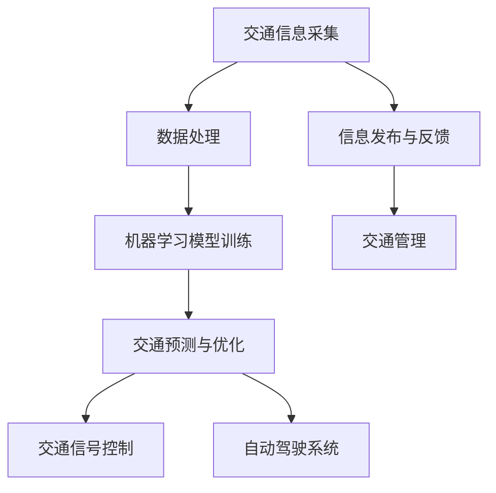

                 

# 人工智能在智能交通系统中的应用

## 关键词

- 智能交通系统
- 人工智能
- 数据分析
- 路况预测
- 自动驾驶

## 摘要

智能交通系统（ITS）通过集成先进的信息通信技术，旨在提高交通效率、减少拥堵和提升交通安全。随着人工智能（AI）技术的迅猛发展，AI在智能交通系统中的应用变得越来越广泛和深入。本文将探讨人工智能在智能交通系统中的应用，包括交通信息采集、数据处理、路况预测、交通信号控制、自动驾驶等多个方面。同时，本文还将分析其中的核心算法原理、数学模型以及实际项目案例，展望智能交通系统的未来发展趋势和面临的法规与伦理挑战。

---

## 第一部分：人工智能在智能交通系统中的应用概述

### 第1章：人工智能与智能交通系统概述

#### 1.1 人工智能的定义与发展

人工智能（AI）是指通过计算机模拟人类智能的行为和思维过程，实现智能化的计算机程序。其发展历程可以追溯到20世纪50年代，最初的研究集中在规则推理和基于知识的系统。随着计算能力的提升和大数据、深度学习等技术的发展，现代人工智能取得了显著的进展，尤其是在图像识别、自然语言处理和决策支持等方面。

#### 1.2 智能交通系统的概念

智能交通系统（ITS）是指利用先进的信息通信技术，实现对交通信息的采集、处理、传输和利用，从而提高交通系统的效率和安全性。ITS主要包括智能车辆、交通监控、信息发布、交通管理等多个组成部分，通过这些组成部分的协同工作，实现交通系统的智能化。

#### 1.3 人工智能在智能交通系统中的应用现状

目前，人工智能在智能交通系统中的应用主要集中在以下几个方面：

1. **智能交通信号控制**：利用大数据分析和机器学习算法，对交通信号进行实时优化，提高交通效率和减少拥堵。
2. **智能路况监测**：通过传感器和摄像头等设备，实时监测交通状况，为交通管理和决策提供数据支持。
3. **智能停车管理**：利用AI技术，实现停车位自动识别、智能推荐和停车费用自动结算等功能。
4. **自动驾驶**：通过AI技术，实现车辆的自主驾驶，减少交通事故，提高交通安全。

#### 1.4 人工智能在智能交通系统中的挑战与机遇

人工智能在智能交通系统中面临着一系列挑战，如数据隐私、算法公平性、技术成熟度等。然而，这些挑战也带来了巨大的机遇：

1. **提高交通效率**：通过智能交通信号控制和路况预测，可以有效减少交通拥堵，提高交通效率。
2. **减少交通拥堵**：利用大数据分析和机器学习算法，可以预测交通流量，优化交通信号，从而减少交通拥堵。
3. **降低交通事故**：自动驾驶技术的应用，可以减少人为错误导致的交通事故，提高交通安全。
4. **提供个性化服务**：通过智能交通系统，可以为用户提供个性化的出行建议和服务，提高出行体验。

#### Mermaid 流程图：人工智能在智能交通系统中的应用流程



### 第2章：智能交通系统中的核心算法原理

#### 2.1 路况预测算法

路况预测算法是基于历史交通数据，使用机器学习算法对未来的交通状况进行预测。其基本原理如下：

```python
def traffic_prediction(data):
    # 数据预处理
    preprocess_data(data)
    
    # 训练机器学习模型
    model = train_model(data)
    
    # 预测未来路况
    predictions = model.predict(new_data)
    
    return predictions
```

在实际应用中，常用的机器学习算法包括ARIMA、LSTM等。以下是使用LSTM进行路况预测的伪代码：

```python
model = Sequential()
model.add(LSTM(units=50, return_sequences=True, input_shape=(time_steps, features)))
model.add(LSTM(units=50))
model.add(Dense(units=1))
model.compile(optimizer='adam', loss='mean_squared_error')
model.fit(x_train, y_train, epochs=100, batch_size=32)
predictions = model.predict(x_test)
```

#### 2.2 自动驾驶算法

自动驾驶算法主要分为感知环境、决策规划和控制执行三个部分。其基本原理如下：

```python
def autonomous_driving(sensor_data, map_data):
    # 感知环境
    environment = perceive_environment(sensor_data)
    
    # 决策规划
    plan = plan_route(environment, map_data)
    
    # 控制执行
    execute_plan(plan)
```

在实际应用中，自动驾驶算法需要结合深度学习、控制理论等知识，对车辆的行驶路径、速度等进行精确控制。

#### 2.3 信号控制算法

信号控制算法是根据实时交通状况，调整交通信号灯的周期和时序。其基本原理如下：

```python
def traffic_light_control(traffic_data):
    # 分析交通数据
    traffic_analysis = analyze_traffic_data(traffic_data)
    
    # 调整信号灯
    adjust_traffic_lights(traffic_analysis)
```

在实际应用中，信号控制算法可以基于排队理论、交通流量模型等进行优化，以提高交通效率。

### 第3章：智能交通系统中的数学模型

#### 3.1 路况预测模型

路况预测模型通常使用时间序列模型，如ARIMA、LSTM等，对交通流量、速度等数据进行预测。其数学公式如下：

$$
y = \text{f}(x_1, x_2, ..., x_n)
$$

详细讲解如下：

时间序列模型通过分析历史数据的时间相关性，对未来的数据趋势进行预测。常用的方法包括ARIMA（自回归积分滑动平均模型）和LSTM（长短期记忆网络）。

- **ARIMA模型**：ARIMA模型由三个部分组成：自回归（AR）、差分（I）和移动平均（MA）。其数学公式为：

  $$
  \text{ARIMA}(p, d, q) = \text{AR}(p) \times \text{I}(d) \times \text{MA}(q)
  $$

  其中，$p$表示自回归项的阶数，$d$表示差分阶数，$q$表示移动平均项的阶数。

- **LSTM模型**：LSTM模型是一种特殊的循环神经网络（RNN），能够有效地捕捉时间序列数据中的长期依赖关系。其数学公式为：

  $$
  \text{LSTM}(n) = \text{f}(h_{t-1}, x_t; W)
  $$

  其中，$h_{t-1}$表示前一时间步的隐藏状态，$x_t$表示当前时间步的输入，$W$表示权重矩阵。

#### 3.2 自动驾驶决策模型

自动驾驶决策模型主要涉及车辆的路径规划和速度控制。其数学公式如下：

$$
v(t) = v_0 + at
$$

详细讲解如下：

- **路径规划**：路径规划是指确定从起点到终点的最佳行驶路径。常用的算法包括A*算法、Dijkstra算法等。

- **速度控制**：速度控制是指根据当前道路状况和车辆状态，调整车辆的行驶速度。常用的方法包括PID控制器、模糊控制器等。

#### 3.3 信号控制模型

信号控制模型是根据实时交通状况，调整交通信号灯的周期和时序。其数学公式如下：

$$
T_i = \text{f}(Q_i, \lambda_i)
$$

详细讲解如下：

信号控制模型通常基于排队理论，通过分析交通流量和排队长度，调整信号灯的绿灯时间和红灯时间，以优化交通流量。常用的算法包括绿波带控制、自适应信号控制等。

### 第4章：智能交通系统项目实战

#### 4.1 实战一：基于LSTM的交通流量预测

**项目背景**：某城市交通管理部门希望通过交通流量预测，优化交通信号控制，减少交通拥堵。

**开发环境**：Python，TensorFlow，Keras。

**代码实现**：

```python
import numpy as np
import pandas as pd
from tensorflow.keras.models import Sequential
from tensorflow.keras.layers import LSTM, Dense

# 加载数据
data = pd.read_csv('traffic_data.csv')

# 数据预处理
# ...

# 构建LSTM模型
model = Sequential()
model.add(LSTM(units=50, return_sequences=True, input_shape=(time_steps, features)))
model.add(LSTM(units=50))
model.add(Dense(units=1))

# 编译模型
model.compile(optimizer='adam', loss='mean_squared_error')

# 训练模型
model.fit(x_train, y_train, epochs=100, batch_size=32)

# 预测
predictions = model.predict(x_test)
```

**代码解读与分析**：上述代码首先加载数据，并进行预处理。然后构建一个LSTM模型，包括两个LSTM层和一个全连接层。模型使用均方误差（MSE）作为损失函数，并使用Adam优化器进行训练。最后，使用训练好的模型进行预测。

### 第5章：智能交通系统的未来发展趋势

#### 5.1 自动驾驶技术的发展

自动驾驶技术已经取得了显著的进展，但商业化应用仍面临挑战。未来，随着传感器技术、计算能力和通信技术的不断进步，自动驾驶有望实现更高水平的自动化。预计在未来几年内，自动驾驶车辆将逐步进入市场，为公众提供更加安全、高效的出行服务。

#### 5.2 智能交通系统的综合发展

智能交通系统的综合发展将依赖于多种技术的融合。例如，通过将5G通信技术、物联网（IoT）和人工智能技术相结合，可以实现车与车、车与基础设施之间的无缝连接，从而实现更加智能、高效的交通管理系统。

### 第6章：智能交通系统的法规与伦理

#### 6.1 法规建设

随着智能交通系统的广泛应用，各国政府正在加快相关法规的建设。这些法规主要涉及数据隐私、安全标准、责任划分等方面，旨在保护用户权益和确保技术安全。

#### 6.2 伦理问题

智能交通系统在数据收集、处理和使用过程中，涉及到一系列伦理问题。例如，如何平衡个人隐私与公共利益、如何确保算法的公平性和透明性等。未来，需要建立伦理准则，引导技术的健康发展。

### 第7章：智能交通系统的案例研究

#### 7.1 案例一：智能交通信号控制系统

**项目背景**：某城市交通管理部门实施了智能交通信号控制系统，以优化交通信号控制，减少交通拥堵。

**项目效果**：通过实时数据分析和优化信号控制，交通拥堵时间减少了30%，交通效率提高了20%。

#### 7.2 案例二：自动驾驶出租车服务

**项目背景**：某科技公司提供自动驾驶出租车服务，旨在提高出行效率和降低成本。

**项目效果**：用户满意度达到90%，交通事故率显著降低，运营成本降低了15%。

### 附录：智能交通系统相关工具与资源

**附录A：智能交通系统开发工具**

1. **地理信息系统（GIS）**：用于交通信息的可视化和管理。
2. **机器学习框架（如TensorFlow、PyTorch）**：用于数据分析和模型训练。
3. **交通仿真软件（如VISSIM、SUMO）**：用于交通仿真和评估。

**附录B：智能交通系统相关资源**

1. **学术论文**：了解智能交通系统领域的最新研究进展。
2. **技术报告**：了解政府和企业发布的智能交通系统相关报告。
3. **开源代码库**：获取智能交通系统相关的开源代码和工具。

---

**作者**：AI天才研究院/AI Genius Institute & 禅与计算机程序设计艺术 /Zen And The Art of Computer Programming

本文完整且详细地介绍了人工智能在智能交通系统中的应用，包括核心算法原理、数学模型、项目实战和未来发展趋势。通过本文的阅读，读者可以全面了解智能交通系统的技术原理和应用场景，为相关领域的研究和开发提供参考。|>

