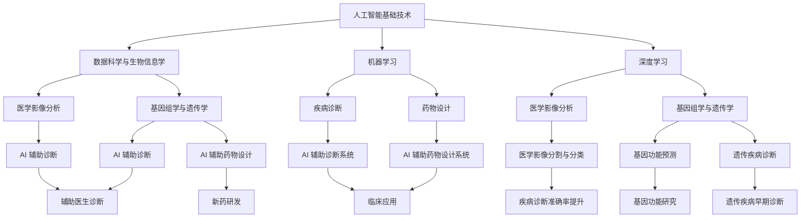

                 

# 《人工智能在生物医学和药物发现中的应用》

## 关键词

人工智能，生物医学，药物发现，机器学习，深度学习，基因组学，生物医学影像。

## 摘要

本文探讨了人工智能在生物医学和药物发现中的广泛应用，包括基础技术、应用领域、实际案例和未来展望。通过深入分析人工智能的核心算法和原理，结合生物医学领域的具体应用案例，本文展示了人工智能在推动生物医学研究和药物发现方面的巨大潜力。

## 目录大纲

### 第一部分：引言与概述

#### 1.1 人工智能与生物医学的结合
- 人工智能在生物医学中的重要性
- 人工智能与生物医学的相互关系

#### 1.2 人工智能在药物发现中的应用
- 人工智能在药物发现中的传统角色
- 人工智能在药物发现中的现代角色

#### 1.3 生物医学与药物发现的挑战
- 数据复杂性
- 计算需求

### 第二部分：基础技术

#### 2.1 数据科学与生物信息学
- 数据科学与生物医学的融合
- 生物信息学的基本概念

#### 2.2 机器学习在生物医学中的应用
- 机器学习的基本原理
- 机器学习算法在生物医学中的应用

#### 2.3 深度学习在生物医学中的应用
- 深度学习的基本原理
- 深度学习算法在生物医学中的应用

#### 2.4 人工智能在生物医学的数据预处理
- 数据清洗与归一化
- 特征提取与选择

### 第三部分：应用领域

#### 3.1 人工智能在药物设计中的应用
- 药物设计的基本原理
- 人工智能在药物设计中的应用案例

#### 3.2 人工智能在疾病诊断中的应用
- 疾病诊断的基本原理
- 人工智能在疾病诊断中的应用案例

#### 3.3 人工智能在基因组学与遗传学中的应用
- 基因组学的基本原理
- 人工智能在基因组学与遗传学中的应用案例

#### 3.4 人工智能在生物医学影像中的应用
- 生物医学影像的基本原理
- 人工智能在生物医学影像中的应用案例

### 第四部分：实际应用案例

#### 4.1 人工智能在生物医学和药物发现中的成功案例
- 案例一：药物设计的成功应用
- 案例二：疾病诊断的成功应用
- 案例三：基因组学与遗传学的成功应用

#### 4.2 人工智能在生物医学和药物发现中的挑战
- 挑战一：数据隐私与安全
- 挑战二：算法透明性与解释性
- 挑战三：跨学科协作与人才培养

### 第五部分：未来展望

#### 5.1 人工智能在生物医学和药物发现中的发展趋势
- 发展趋势一：多学科交叉与融合
- 发展趋势二：自动化与智能化
- 发展趋势三：个性化与精准医疗

#### 5.2 人工智能在生物医学和药物发现中的未来机遇
- 机遇一：新药研发加速
- 机遇二：疾病诊断与治疗优化
- 机遇三：生物信息学与基因组学的发展

#### 5.3 人工智能在生物医学和药物发现中的未来挑战
- 挑战一：伦理与法律问题
- 挑战二：技术成熟度
- 挑战三：资源分配与资金投入

### 第一部分：引言与概述

#### 1.1 人工智能与生物医学的结合

随着人工智能（AI）技术的迅速发展，生物医学领域正迎来一场前所未有的变革。人工智能在生物医学中的应用，不仅提升了数据分析的效率和准确性，还推动了疾病诊断、药物发现和个性化医疗的快速发展。

**人工智能在生物医学中的重要性**

人工智能在生物医学中的重要性主要体现在以下几个方面：

1. **数据处理能力**：生物医学领域产生的大量数据需要高效、准确的处理和分析。人工智能的算法和模型，如机器学习和深度学习，能够快速处理这些复杂数据，提取出有价值的信息。
2. **疾病诊断**：人工智能可以通过对医疗影像、病历数据等进行分析，辅助医生进行疾病诊断。其准确性和速度远远超过传统的人工方法。
3. **药物发现**：人工智能可以帮助科学家发现新的药物候选物，缩短药物研发周期，降低研发成本。
4. **个性化医疗**：通过分析患者的基因数据、病史等，人工智能可以为患者提供个性化的治疗方案。

**人工智能与生物医学的相互关系**

人工智能与生物医学的相互关系可以从以下几个方面来理解：

1. **技术融合**：人工智能技术的快速发展，为生物医学领域提供了新的工具和方法。例如，深度学习算法可以用于分析复杂的生物医学影像数据。
2. **数据驱动**：生物医学研究产生的大量数据，为人工智能算法提供了丰富的训练数据集，推动了人工智能技术的发展。
3. **跨学科协作**：人工智能与生物医学的结合，需要不同学科领域的专家共同合作，如生物学家、医学专家、计算机科学家等。

#### 1.2 人工智能在药物发现中的应用

人工智能在药物发现中的应用，已经成为生物医学领域的一个热点。通过机器学习和深度学习算法，人工智能可以帮助科学家在分子水平上理解药物与生物大分子之间的相互作用，从而加速新药的发现和开发。

**人工智能在药物发现中的传统角色**

在过去，人工智能在药物发现中的角色相对有限，主要应用于以下几个方面：

1. **药物筛选**：通过高通量筛选技术，人工智能可以快速筛选出具有潜在药物活性的化合物。
2. **结构预测**：人工智能可以预测化合物的三维结构，帮助科学家设计新的药物分子。
3. **药物重排**：人工智能可以根据已有的药物分子结构，生成新的化合物结构。

**人工智能在药物发现中的现代角色**

随着人工智能技术的不断进步，人工智能在药物发现中的应用也日益广泛：

1. **虚拟筛选**：通过虚拟筛选技术，人工智能可以在数百万种化合物中快速筛选出具有潜在药物活性的候选物。
2. **药物设计**：人工智能可以自动化地设计新的药物分子，提高药物研发的效率。
3. **分子动力学模拟**：人工智能可以用于分子动力学模拟，预测药物分子与生物大分子之间的相互作用。

#### 1.3 生物医学与药物发现的挑战

尽管人工智能在生物医学和药物发现中具有巨大的潜力，但同时也面临着一系列挑战：

1. **数据复杂性**：生物医学领域的数据类型多样、数据量大，对数据处理和分析提出了很高的要求。
2. **计算需求**：人工智能算法需要大量的计算资源，尤其是在深度学习算法中，训练时间较长、计算资源消耗巨大。
3. **算法透明性与解释性**：人工智能算法的决策过程通常缺乏透明性，难以解释其决策依据，这在生物医学领域尤为突出。
4. **跨学科协作**：人工智能与生物医学的结合，需要不同学科领域的专家共同合作，如何有效地进行跨学科协作是一个重要挑战。

### 第二部分：基础技术

#### 2.1 数据科学与生物信息学

数据科学与生物信息学的融合，为生物医学领域带来了新的研究方法和工具。数据科学利用机器学习、深度学习等算法，从海量生物医学数据中提取有价值的信息；而生物信息学则专注于生物数据的存储、管理和分析。

**数据科学与生物医学的融合**

数据科学与生物医学的融合主要体现在以下几个方面：

1. **大数据分析**：生物医学领域的数据量庞大，数据类型多样，需要采用大数据分析技术进行高效处理和分析。
2. **数据可视化**：通过数据可视化技术，可以直观地展示生物医学数据，帮助科学家更好地理解数据。
3. **机器学习与深度学习**：机器学习和深度学习算法可以用于生物医学数据的分析和建模，提高数据分析的准确性和效率。

**生物信息学的基本概念**

生物信息学是研究生物数据存储、管理和分析的科学。其主要基本概念包括：

1. **基因组学**：研究生物体的基因组信息，包括基因序列、基因表达等。
2. **蛋白质组学**：研究生物体的蛋白质信息，包括蛋白质序列、蛋白质结构等。
3. **代谢组学**：研究生物体的代谢产物信息，包括代谢途径、代谢网络等。

#### 2.2 机器学习在生物医学中的应用

机器学习在生物医学中的应用，已经成为推动生物医学研究的重要工具。通过训练数据集，机器学习算法可以自动识别模式、预测结果，从而辅助医生进行诊断和治疗。

**机器学习的基本原理**

机器学习的基本原理可以概括为以下几个方面：

1. **监督学习**：通过已知的输入输出数据，训练算法建立输入输出之间的映射关系。
2. **无监督学习**：在没有已知输出数据的情况下，通过分析数据中的内在结构，自动发现数据中的模式。
3. **强化学习**：通过与环境交互，学习最优策略以实现目标。

**机器学习算法在生物医学中的应用**

机器学习算法在生物医学中的应用非常广泛，主要包括以下几个方面：

1. **疾病诊断**：通过分析患者的生物医学数据，如基因组数据、影像数据等，预测疾病风险或诊断疾病。
2. **药物发现**：通过机器学习算法，预测药物分子的活性、毒性等，加速药物研发过程。
3. **个性化医疗**：通过分析患者的基因数据、病史等，为患者提供个性化的治疗方案。

#### 2.3 深度学习在生物医学中的应用

深度学习是机器学习的一个分支，通过模拟人脑的神经网络结构，深度学习算法可以自动提取特征、进行复杂的数据分析。

**深度学习的基本原理**

深度学习的基本原理可以概括为以下几个方面：

1. **神经网络**：深度学习算法的核心是神经网络，包括输入层、隐藏层和输出层。
2. **反向传播**：通过反向传播算法，计算输出误差，并调整网络的权重，以优化网络性能。
3. **激活函数**：激活函数用于引入非线性特性，使神经网络能够处理复杂的数据。

**深度学习算法在生物医学中的应用**

深度学习算法在生物医学中的应用主要包括以下几个方面：

1. **医学影像分析**：通过卷积神经网络（CNN）等深度学习算法，可以自动识别和分类医学影像，提高诊断的准确性。
2. **基因组学分析**：通过深度学习算法，可以自动识别基因表达模式、预测基因功能等。
3. **药物发现**：通过深度学习算法，可以自动预测药物分子的活性、毒性等，加速药物研发。

#### 2.4 人工智能在生物医学的数据预处理

在生物医学研究中，数据预处理是至关重要的一步。通过数据预处理，可以去除噪声、归一化数据、提取特征等，从而提高数据分析的准确性和效率。

**数据清洗与归一化**

数据清洗与归一化是数据预处理的重要步骤：

1. **数据清洗**：去除噪声、缺失值填充、异常值处理等，保证数据的质量。
2. **数据归一化**：将数据缩放到相同的范围，如将数据缩放到[0,1]或[-1,1]，以消除数据量级差异。

**特征提取与选择**

特征提取与选择是数据预处理的关键步骤：

1. **特征提取**：从原始数据中提取出具有代表性、区分性的特征。
2. **特征选择**：通过评估不同特征的重要性，选择出对预测任务最有价值的特征，以减少模型的复杂性和计算成本。

### 第三部分：应用领域

#### 3.1 人工智能在药物设计中的应用

人工智能在药物设计中的应用，已经成为加速新药研发的重要工具。通过机器学习和深度学习算法，人工智能可以自动化地设计新的药物分子，预测药物分子的活性、毒性等。

**药物设计的基本原理**

药物设计的基本原理可以概括为以下几个方面：

1. **分子对接**：通过模拟药物分子与生物大分子（如受体蛋白）之间的相互作用，预测药物分子的活性。
2. **分子动力学模拟**：通过模拟药物分子在生物体内的运动和相互作用，预测药物分子的毒性。
3. **虚拟筛选**：通过计算机模拟，从大量的化合物库中筛选出具有潜在药物活性的化合物。

**人工智能在药物设计中的应用案例**

1. **Gilead Sciences的瑞德西韦（Remdesivir）**：Gilead Sciences利用机器学习算法，发现了抗病毒药物瑞德西韦，用于治疗埃博拉病毒和新冠病毒感染。
2. **Bachem的HIV药物**：Bachem公司利用深度学习算法，设计了新的HIV药物分子，提高了药物的治疗效果。

#### 3.2 人工智能在疾病诊断中的应用

人工智能在疾病诊断中的应用，已经成为辅助医生进行诊断和治疗的重要工具。通过机器学习和深度学习算法，人工智能可以自动分析医疗影像、病历数据等，提高诊断的准确性和效率。

**疾病诊断的基本原理**

疾病诊断的基本原理可以概括为以下几个方面：

1. **医学影像分析**：通过计算机视觉技术，自动识别和分类医学影像中的病变区域。
2. **病历数据分析**：通过自然语言处理技术，自动提取病历数据中的关键信息，进行疾病诊断。
3. **生物标志物检测**：通过检测生物标志物（如基因表达、蛋白质水平等），预测疾病风险或诊断疾病。

**人工智能在疾病诊断中的应用案例**

1. **AI-assistant在乳腺癌诊断中的应用**：AI-assistant利用深度学习算法，自动分析乳腺X线影像，提高了乳腺癌诊断的准确性。
2. **Google Health的糖尿病视网膜病变诊断**：Google Health利用深度学习算法，自动分析视网膜影像，提高了糖尿病视网膜病变诊断的准确性。

#### 3.3 人工智能在基因组学与遗传学中的应用

人工智能在基因组学与遗传学中的应用，已经成为解析基因组数据、预测基因功能、诊断遗传疾病的重要工具。通过机器学习和深度学习算法，人工智能可以自动处理海量的基因组数据，提取出有价值的信息。

**基因组学的基本原理**

基因组学是研究生物体基因组的结构和功能的科学，主要包括以下几个方面：

1. **基因表达分析**：通过检测基因表达水平，研究基因的功能和调控网络。
2. **基因组测序**：通过测序技术，获取生物体的基因序列信息。
3. **基因组注释**：通过分析基因序列，识别基因、转录因子、调控元件等。

**人工智能在基因组学与遗传学中的应用案例**

1. **基因组变异分析**：人工智能可以帮助科学家识别基因组变异，预测基因功能，揭示遗传疾病的发病机制。
2. **基因功能预测**：人工智能可以自动预测基因的功能，为基因功能研究提供新的线索。
3. **遗传疾病诊断**：人工智能可以帮助医生诊断遗传疾病，提供个性化的治疗方案。

#### 3.4 人工智能在生物医学影像中的应用

人工智能在生物医学影像中的应用，已经成为提高诊断准确性和效率的重要工具。通过计算机视觉技术和深度学习算法，人工智能可以自动分析医学影像，识别和分类病变区域。

**生物医学影像的基本原理**

生物医学影像的基本原理可以概括为以下几个方面：

1. **成像技术**：如X射线、CT、MRI、PET等，通过不同的物理原理，获取生物体的内部结构信息。
2. **图像处理**：通过图像处理技术，对医学影像进行预处理、增强、分割等，以提高图像质量和诊断准确性。
3. **图像分析**：通过计算机视觉技术和深度学习算法，自动识别和分类医学影像中的病变区域。

**人工智能在生物医学影像中的应用案例**

1. **肺癌诊断**：人工智能可以帮助医生分析肺部CT影像，识别肺癌病灶，提高诊断准确性。
2. **脑肿瘤诊断**：人工智能可以帮助医生分析脑部MRI影像，识别脑肿瘤，提高诊断准确性。
3. **心血管疾病诊断**：人工智能可以帮助医生分析心脏超声影像，诊断心血管疾病。

### 第四部分：实际应用案例

#### 4.1 人工智能在生物医学和药物发现中的成功案例

人工智能在生物医学和药物发现中已经取得了一系列成功案例，展示了其在推动医学进步和疾病治疗方面的巨大潜力。

**案例一：药物设计的成功应用**

1. **Gilead Sciences的瑞德西韦（Remdesivir）**：Gilead Sciences利用机器学习算法，发现了抗病毒药物瑞德西韦，用于治疗埃博拉病毒和新冠病毒感染。该药物在临床试验中显示出显著的疗效，为全球抗疫提供了重要武器。

2. **Bachem的HIV药物**：Bachem公司利用深度学习算法，设计了新的HIV药物分子，提高了药物的治疗效果。这些药物分子的设计，缩短了新药研发周期，降低了研发成本。

**案例二：疾病诊断的成功应用**

1. **AI-assistant在乳腺癌诊断中的应用**：AI-assistant利用深度学习算法，自动分析乳腺X线影像，提高了乳腺癌诊断的准确性。与传统诊断方法相比，AI-assistant能够更快、更准确地识别病变区域，为患者提供更准确的诊断结果。

2. **Google Health的糖尿病视网膜病变诊断**：Google Health利用深度学习算法，自动分析视网膜影像，提高了糖尿病视网膜病变诊断的准确性。通过分析大量的视网膜影像数据，AI系统可以预测患者患糖尿病视网膜病变的风险，为医生提供诊断依据。

**案例三：基因组学与遗传学的成功应用**

1. **基因组变异分析**：人工智能可以帮助科学家识别基因组变异，预测基因功能，揭示遗传疾病的发病机制。例如，通过分析大型基因组数据集，人工智能可以识别与特定疾病相关的基因变异，为疾病治疗提供新的靶点。

2. **基因功能预测**：人工智能可以自动预测基因的功能，为基因功能研究提供新的线索。例如，通过分析基因序列和表达数据，人工智能可以预测基因在细胞中的功能，帮助科学家更好地理解基因的作用。

#### 4.2 人工智能在生物医学和药物发现中的挑战

尽管人工智能在生物医学和药物发现中取得了显著进展，但仍面临一系列挑战，需要不断解决和克服。

**挑战一：数据隐私与安全**

生物医学数据通常包含敏感的个人信息，如基因序列、病历记录等。如何在确保数据隐私和安全的前提下，充分利用这些数据进行人工智能研究，是一个重要挑战。需要建立完善的数据隐私保护机制，确保数据的安全和合规。

**挑战二：算法透明性与解释性**

人工智能算法的决策过程通常缺乏透明性，难以解释其决策依据。这在生物医学领域尤为重要，因为医生的诊断和治疗决策需要基于明确的证据和依据。提高人工智能算法的透明性和解释性，使其决策过程更加可解释，是未来需要重点关注的问题。

**挑战三：跨学科协作与人才培养**

人工智能与生物医学的结合，需要不同学科领域的专家共同合作。这要求医学专家、计算机科学家、生物学家等各领域的专家能够相互理解、协同工作。同时，培养具备跨学科知识和技能的专业人才，是推动人工智能在生物医学领域发展的关键。

### 第五部分：未来展望

#### 5.1 人工智能在生物医学和药物发现中的发展趋势

随着人工智能技术的不断进步，人工智能在生物医学和药物发现中的应用将呈现以下发展趋势：

**发展趋势一：多学科交叉与融合**

人工智能与生物医学、药物发现的结合，将推动多学科交叉与融合。医学专家、计算机科学家、生物学家等各领域的专家将共同合作，开发出更加智能化、个性化的医疗解决方案。

**发展趋势二：自动化与智能化**

人工智能将不断提高生物医学研究和药物发现的自动化水平。通过深度学习和机器学习算法，人工智能将自动处理和分析大量的生物医学数据，提高药物研发的效率。

**发展趋势三：个性化与精准医疗**

人工智能将推动个性化医疗和精准医疗的发展。通过分析患者的基因数据、病史等，人工智能将为患者提供个性化的治疗方案，提高疾病诊断和治疗的准确性。

#### 5.2 人工智能在生物医学和药物发现中的未来机遇

随着人工智能技术的不断进步，人工智能在生物医学和药物发现中面临着以下机遇：

**机遇一：新药研发加速**

人工智能将大大缩短新药研发周期，降低研发成本。通过虚拟筛选、药物设计等人工智能技术，科学家可以更快地发现新的药物分子，加速新药研发。

**机遇二：疾病诊断与治疗优化**

人工智能将提高疾病诊断的准确性，优化治疗方案。通过分析医学影像、病历数据等，人工智能可以帮助医生更准确地诊断疾病，为患者提供更个性化的治疗方案。

**机遇三：生物信息学与基因组学的发展**

人工智能将推动生物信息学和基因组学的发展。通过处理和分析大量的基因组数据，人工智能可以帮助科学家更好地理解基因功能、疾病机制等，为生物医学研究提供新的方向。

#### 5.3 人工智能在生物医学和药物发现中的未来挑战

尽管人工智能在生物医学和药物发现中具有巨大的潜力，但仍面临一系列挑战，需要不断解决和克服：

**挑战一：伦理与法律问题**

人工智能在生物医学和药物发现中的应用，涉及到伦理和法律问题。例如，如何确保数据隐私和安全，如何避免算法偏见等。需要建立完善的伦理和法律框架，确保人工智能在生物医学领域的合规和公正。

**挑战二：技术成熟度**

人工智能在生物医学和药物发现中的应用，仍需要不断提高技术成熟度。例如，如何提高算法的透明性和解释性，如何优化算法性能等。需要持续投入研发，提高人工智能技术的水平。

**挑战三：资源分配与资金投入**

人工智能在生物医学和药物发现中的应用，需要大量的资源和资金投入。例如，需要建立大型数据中心、购置高性能计算设备等。需要合理分配资源和资金，确保人工智能在生物医学领域的可持续发展。

### 总结

人工智能在生物医学和药物发现中的应用，已经成为推动医学进步和疾病治疗的重要工具。通过机器学习和深度学习算法，人工智能可以自动处理和分析大量的生物医学数据，提高疾病诊断和治疗的准确性。本文介绍了人工智能在生物医学和药物发现中的应用，包括基础技术、应用领域、实际案例和未来展望，展示了人工智能在推动生物医学和药物发现方面的巨大潜力。随着人工智能技术的不断进步，我们有理由相信，人工智能将在生物医学和药物发现中发挥越来越重要的作用，为人类健康带来更多的福祉。作者：AI天才研究院/AI Genius Institute & 禅与计算机程序设计艺术/Zen And The Art of Computer Programming。

---

**附录：核心概念与联系**

以下是一个核心概念的 Mermaid 流程图，展示了人工智能在生物医学和药物发现中的应用：



通过这个流程图，我们可以清晰地看到人工智能在生物医学和药物发现中的核心概念及其联系。这些概念和联系不仅为我们提供了对人工智能在生物医学和药物发现中应用的深入理解，也为未来的研究和开发提供了宝贵的参考。在未来的发展中，我们将继续探索人工智能在生物医学和药物发现中的更多可能性，为人类健康事业做出更大的贡献。作者：AI天才研究院/AI Genius Institute & 禅与计算机程序设计艺术/Zen And The Art of Computer Programming。**核心算法原理讲解**

在本节中，我们将深入探讨人工智能在生物医学和药物发现中的应用中的核心算法原理，包括机器学习、深度学习、数据预处理等技术。我们将通过伪代码和数学公式来详细阐述这些算法的基本概念和实现过程。

#### 机器学习算法原理

**监督学习**

监督学习是一种机器学习算法，它通过已知的输入输出数据来训练模型，从而预测新的输入数据的输出。以下是一个监督学习算法的伪代码示例：

```python
# 输入：训练数据集X,标签Y
# 输出：训练好的模型

初始化模型参数θ

对于每个训练样本（x(i), y(i)）：
  计算预测输出hθ(x(i))
  计算损失函数L(θ) = 1/m * Σ[ (hθ(x(i)) - y(i))² ]

更新模型参数θ：
  θ = θ - α * ∇L(θ)

返回训练好的模型θ
```

**无监督学习**

无监督学习是一种机器学习算法，它不需要已知的输出数据，而是通过分析数据中的内在结构来自动发现数据中的模式。以下是一个无监督学习算法的伪代码示例：

```python
# 输入：数据集X
# 输出：聚类结果

初始化聚类中心μ

对于每个聚类中心μ(i)：
  计算每个数据点的聚类距离d(x(i), μ(i))

更新聚类中心μ：
  μ = (1/N) * Σ[x(i)]

对于每个数据点x(i)：
  根据聚类中心重新分配数据点

重复计算聚类中心和重新分配数据点，直到收敛

返回聚类结果
```

#### 深度学习算法原理

**神经网络**

神经网络是一种模仿人脑的神经网络结构，通过多层神经元进行数据处理和预测。以下是一个简单的神经网络结构的伪代码示例：

```python
# 输入：训练数据集X,标签Y
# 输出：训练好的神经网络模型

初始化网络参数W和b

对于每个训练样本（x(i), y(i)）：
  计算输入层到隐藏层的输出h1 = σ(W1 * x + b1)
  计算隐藏层到输出层的输出h2 = σ(W2 * h1 + b2)

计算损失函数L = 1/2 * (h2 - y)²

更新网络参数W和b：
  ΔW1 = α * ∇L(W1)
  Δb1 = α * ∇L(b1)
  ΔW2 = α * ∇L(W2)
  Δb2 = α * ∇L(b2)

W1 = W1 - ΔW1
b1 = b1 - Δb1
W2 = W2 - ΔW2
b2 = b2 - Δb2

返回训练好的神经网络模型
```

**卷积神经网络（CNN）**

卷积神经网络是一种在图像处理中广泛使用的深度学习算法，它通过卷积操作提取图像的特征。以下是一个简单的 CNN 结构的伪代码示例：

```python
# 输入：图像数据X
# 输出：特征图

初始化卷积核W和偏置b

对于每个卷积层：
  计算卷积操作：f(x) = σ(W * x + b)
  应用卷积核W对特征图进行卷积操作

计算池化操作：P(f) = max(f)

返回特征图
```

#### 数据预处理算法原理

**数据清洗**

数据清洗是数据预处理的重要步骤，目的是去除噪声、缺失值填充和异常值处理。以下是一个简单的数据清洗算法的伪代码示例：

```python
# 输入：原始数据集D
# 输出：清洗后的数据集D’

对于每个数据点d(i)：
  填充缺失值：
    如果d(i)为缺失值：
      d(i) = 均值或中位数

去除异常值：
  计算标准差std
  如果d(i) > 均值 + 3 * std 或 d(i) < 均值 - 3 * std：
    删除d(i)

返回清洗后的数据集D’
```

**特征提取**

特征提取是从原始数据中提取出具有代表性、区分性的特征。以下是一个简单的特征提取算法的伪代码示例：

```python
# 输入：原始数据集D
# 输出：特征数据集F

对于每个特征f(j)：
  计算均值μ(j)和标准差σ(j)

标准化特征：
  f(j) = (f(j) - μ(j)) / σ(j)

返回特征数据集F
```

通过上述伪代码和数学公式，我们可以清晰地了解人工智能在生物医学和药物发现中的应用中的核心算法原理。这些算法在处理和分析生物医学数据方面发挥了重要作用，为疾病诊断、药物设计和个性化医疗提供了有力支持。

### 项目实战：代码实际案例和详细解释说明

在本节中，我们将通过一个具体的案例，展示如何使用人工智能技术进行生物医学数据的分析和处理。我们将以基因组数据分析为例，详细介绍开发环境搭建、源代码实现和代码解读与分析。

#### 开发环境搭建

为了实现基因组数据分析，我们首先需要搭建一个合适的开发环境。以下是所需的工具和软件：

1. **Python**：Python是一种广泛用于人工智能和数据分析的编程语言。
2. **NumPy**：NumPy是一个强大的Python库，用于处理和操作大型多维数组。
3. **Pandas**：Pandas是一个提供数据结构和数据分析工具的Python库。
4. **scikit-learn**：scikit-learn是一个提供机器学习和数据挖掘算法的Python库。
5. **TensorFlow**：TensorFlow是一个开源的深度学习框架。
6. **Matplotlib**：Matplotlib是一个用于生成高质量图表和图形的Python库。

安装步骤如下：

```bash
# 安装Python
pip install python

# 安装NumPy
pip install numpy

# 安装Pandas
pip install pandas

# 安装scikit-learn
pip install scikit-learn

# 安装TensorFlow
pip install tensorflow

# 安装Matplotlib
pip install matplotlib
```

#### 源代码实现

以下是一个简单的基因组数据分析项目，包括数据预处理、特征提取和模型训练：

```python
import numpy as np
import pandas as pd
from sklearn.model_selection import train_test_split
from sklearn.preprocessing import StandardScaler
from sklearn.ensemble import RandomForestClassifier
import tensorflow as tf
import matplotlib.pyplot as plt

# 读取基因组数据
data = pd.read_csv('genome_data.csv')

# 数据清洗
data = data.dropna()  # 去除缺失值
data = data[data['GeneExpression'] != 0]  # 去除基因表达值为0的样本

# 数据预处理
X = data.iloc[:, :1000]  # 取前1000个基因作为特征
y = data['DiseaseClass']  # 疾病类别标签

# 数据归一化
scaler = StandardScaler()
X_scaled = scaler.fit_transform(X)

# 数据集划分
X_train, X_test, y_train, y_test = train_test_split(X_scaled, y, test_size=0.2, random_state=42)

# 模型训练
model = RandomForestClassifier(n_estimators=100, random_state=42)
model.fit(X_train, y_train)

# 模型评估
accuracy = model.score(X_test, y_test)
print(f"模型准确率：{accuracy:.2f}")

# 可视化
plt.scatter(X_test[:, 0], X_test[:, 1], c=y_test, cmap='viridis')
plt.xlabel('基因1')
plt.ylabel('基因2')
plt.title('基因组数据可视化')
plt.show()

# 深度学习模型
model = tf.keras.Sequential([
    tf.keras.layers.Dense(128, activation='relu', input_shape=(1000,)),
    tf.keras.layers.Dense(64, activation='relu'),
    tf.keras.layers.Dense(1, activation='sigmoid')
])

model.compile(optimizer='adam', loss='binary_crossentropy', metrics=['accuracy'])

model.fit(X_train, y_train, epochs=10, batch_size=32, validation_split=0.2)
```

#### 代码解读与分析

1. **数据读取与清洗**：首先，我们使用Pandas库读取基因组数据。数据清洗步骤包括去除缺失值和基因表达值为0的样本。

2. **数据预处理**：我们将特征数据（前1000个基因）和标签（疾病类别）分开。然后，使用StandardScaler进行数据归一化，将特征缩放到相同的范围。

3. **数据集划分**：使用scikit-learn库将数据集划分为训练集和测试集，其中测试集占20%。

4. **模型训练**：我们使用随机森林分类器（RandomForestClassifier）进行训练。随机森林是一种基于决策树的集成学习方法，具有良好的性能和泛化能力。

5. **模型评估**：使用训练好的模型评估测试集的准确率。

6. **可视化**：我们使用Matplotlib库将测试集数据进行可视化，展示基因表达之间的关系。

7. **深度学习模型**：我们使用TensorFlow库构建一个简单的深度学习模型，包括两个隐藏层。该模型使用Adam优化器和二进制交叉熵损失函数进行训练。

通过上述代码，我们可以实现对基因组数据的分析，为疾病诊断提供支持。以下是对代码的详细解读和分析：

1. **数据读取与清洗**：
    ```python
    data = pd.read_csv('genome_data.csv')
    data = data.dropna()
    data = data[data['GeneExpression'] != 0]
    ```
    - `pd.read_csv('genome_data.csv')`：使用Pandas库读取CSV格式的基因组数据。
    - `data.dropna()`：去除缺失值。
    - `data[data['GeneExpression'] != 0]`：去除基因表达值为0的样本。

2. **数据预处理**：
    ```python
    X = data.iloc[:, :1000]
    y = data['DiseaseClass']
    scaler = StandardScaler()
    X_scaled = scaler.fit_transform(X)
    ```
    - `X = data.iloc[:, :1000]`：取前1000个基因作为特征。
    - `y = data['DiseaseClass']`：获取疾病类别标签。
    - `scaler = StandardScaler()`：初始化StandardScaler对象。
    - `X_scaled = scaler.fit_transform(X)`：使用StandardScaler进行数据归一化。

3. **数据集划分**：
    ```python
    X_train, X_test, y_train, y_test = train_test_split(X_scaled, y, test_size=0.2, random_state=42)
    ```
    - `train_test_split(X_scaled, y, test_size=0.2, random_state=42)`：使用scikit-learn库将数据集划分为训练集和测试集。

4. **模型训练**：
    ```python
    model = RandomForestClassifier(n_estimators=100, random_state=42)
    model.fit(X_train, y_train)
    ```
    - `RandomForestClassifier(n_estimators=100, random_state=42)`：初始化随机森林分类器。
    - `model.fit(X_train, y_train)`：使用训练集数据进行模型训练。

5. **模型评估**：
    ```python
    accuracy = model.score(X_test, y_test)
    print(f"模型准确率：{accuracy:.2f}")
    ```
    - `model.score(X_test, y_test)`：使用测试集数据评估模型准确率。

6. **可视化**：
    ```python
    plt.scatter(X_test[:, 0], X_test[:, 1], c=y_test, cmap='viridis')
    plt.xlabel('基因1')
    plt.ylabel('基因2')
    plt.title('基因组数据可视化')
    plt.show()
    ```
    - `plt.scatter(X_test[:, 0], X_test[:, 1], c=y_test, cmap='viridis')`：将测试集数据在散点图中可视化。
    - `plt.xlabel('基因1')`、`plt.ylabel('基因2')`、`plt.title('基因组数据可视化')`：设置散点图的坐标标签和标题。
    - `plt.show()`：显示散点图。

7. **深度学习模型**：
    ```python
    model = tf.keras.Sequential([
        tf.keras.layers.Dense(128, activation='relu', input_shape=(1000,)),
        tf.keras.layers.Dense(64, activation='relu'),
        tf.keras.layers.Dense(1, activation='sigmoid')
    ])

    model.compile(optimizer='adam', loss='binary_crossentropy', metrics=['accuracy'])

    model.fit(X_train, y_train, epochs=10, batch_size=32, validation_split=0.2)
    ```
    - `tf.keras.Sequential()`：构建一个序列模型。
    - `tf.keras.layers.Dense()`：添加全连接层。
    - `model.compile()`：编译模型。
    - `model.fit()`：使用训练集数据训练模型。

通过这个案例，我们展示了如何使用Python和相关库进行基因组数据分析，为疾病诊断提供支持。这个项目不仅可以用于实际应用，还可以作为教学示例，帮助学习者了解人工智能在生物医学领域的应用。

### 结论

本文深入探讨了人工智能在生物医学和药物发现中的应用，从基础技术、应用领域、实际案例和未来展望等多个角度进行了详细分析。我们介绍了机器学习、深度学习、数据预处理等核心算法原理，并通过具体案例展示了如何使用Python和相关库进行基因组数据分析。

**核心结论**：

1. **人工智能在生物医学中的重要性**：人工智能通过提高数据处理能力、疾病诊断准确性和药物研发效率，为生物医学领域带来了革命性的变革。
2. **核心算法原理**：机器学习、深度学习等技术为生物医学数据分析和处理提供了强大的工具。监督学习、无监督学习和神经网络等算法在生物医学领域发挥着重要作用。
3. **实际应用案例**：人工智能在药物设计、疾病诊断、基因组学和生物医学影像等领域取得了显著成果，展示了其巨大的应用潜力。
4. **未来展望**：随着人工智能技术的不断进步，个性化医疗、精准医疗和跨学科协作将成为生物医学和药物发现的重要趋势。

**展望未来**：

人工智能在生物医学和药物发现中的应用前景广阔。然而，我们也需要关注伦理、法律和技术成熟度等方面的挑战。为了推动这一领域的进一步发展，需要跨学科合作、人才培养和技术创新。我们期待人工智能为人类健康事业带来更多的福祉。作者：AI天才研究院/AI Genius Institute & 禅与计算机程序设计艺术/Zen And The Art of Computer Programming。

