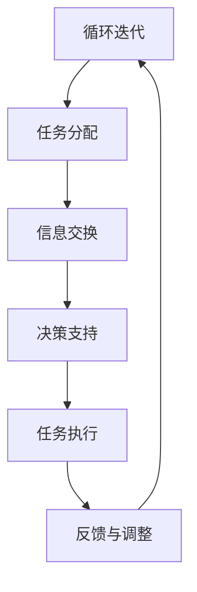
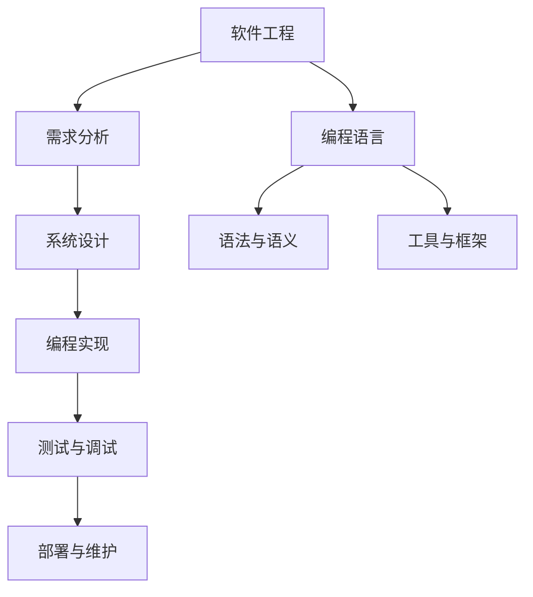
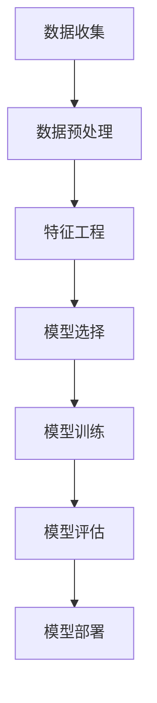
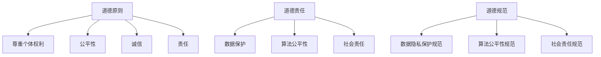
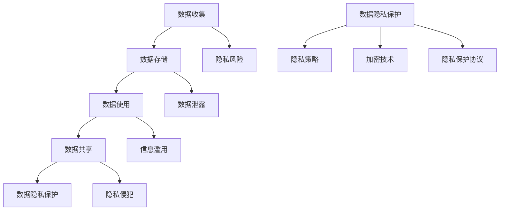
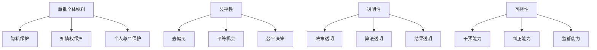
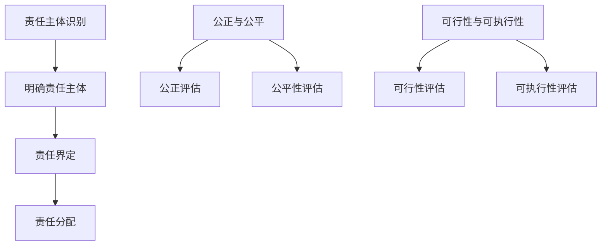
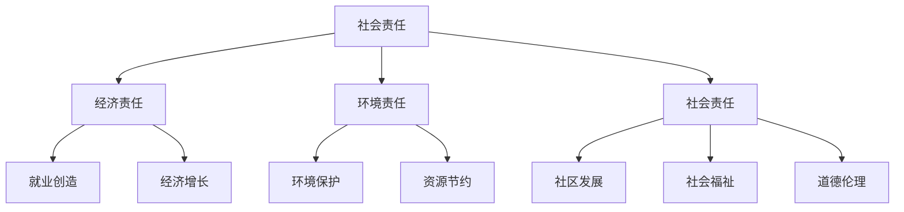
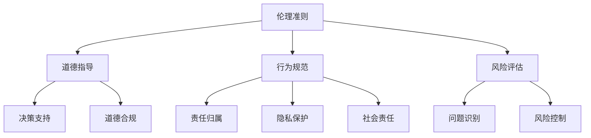

                 

### 《人机协作：伦理规范与准则》

> **关键词：**人机协作，伦理规范，数据隐私，人工智能，责任归属，社会责任

> **摘要：**本文旨在探讨人机协作的伦理规范与准则。首先，我们详细介绍了人机协作的定义与背景，以及其重要性。接着，我们分析了人机协作的技术基础，包括计算机技术、软件工程与编程语言、数据科学与机器学习。随后，我们探讨了人机协作的伦理学基础，包括伦理学的基本概念、应用领域以及人机协作中的伦理挑战。在此基础上，本文提出了人机协作的伦理规范，包括数据隐私与安全、人工智能伦理、责任归属以及社会责任。此外，我们还详细阐述了如何制定和执行人机协作的伦理准则，以及如何进行人机协作中的伦理决策和实践。最后，我们展望了人机协作伦理的未来发展，并提供了相关的参考文献和附录资源。通过本文的探讨，我们希望为人机协作的伦理实践提供指导，促进人机协作的健康发展。

---

### 《人机协作：伦理规范与准则》目录大纲

#### 第一部分：引言与概述

1. **第1章：人机协作的定义与背景**
   - **1.1 什么是人机协作**
   - **1.2 人机协作的历史与发展**
   - **1.3 人机协作的重要性

2. **第2章：人机协作的技术基础**
   - **2.1 计算机技术的基础**
   - **2.2 软件工程与编程语言**
   - **2.3 数据科学与机器学习

3. **第3章：人机协作的伦理学基础**
   - **3.1 伦理学的基本概念**
   - **3.2 伦理学的应用领域**
   - **3.3 人机协作中的伦理挑战

#### 第二部分：人机协作的伦理规范

4. **第4章：数据隐私与安全**
   - **4.1 数据隐私的重要性**
   - **4.2 人机协作中的数据隐私问题**
   - **4.3 数据隐私保护的法律与规范

5. **第5章：人工智能伦理**
   - **5.1 人工智能伦理的基本原则**
   - **5.2 人工智能伦理的挑战**
   - **5.3 人机协作中的AI伦理问题

6. **第6章：人机协作中的责任归属**
   - **6.1 责任归属的基本原则**
   - **6.2 法律责任与道德责任**
   - **6.3 人机协作中的责任归属问题

7. **第7章：人机协作中的社会责任**
   - **7.1 社会责任的概念与类型**
   - **7.2 社会公平与正义**
   - **7.3 人机协作中的社会责任问题

#### 第三部分：人机协作的伦理准则

8. **第8章：制定人机协作的伦理准则**
   - **8.1 伦理准则的定义与作用**
   - **8.2 制定伦理准则的步骤**
   - **8.3 伦理准则的执行与监督

9. **第9章：人机协作中的伦理决策**
   - **9.1 伦理决策的概念与过程**
   - **9.2 伦理决策的方法与工具**
   - **9.3 伦理决策中的常见问题与解决策略

10. **第10章：人机协作中的伦理实践**
    - **10.1 伦理实践的意义**
    - **10.2 伦理实践的案例分析**
    - **10.3 伦理实践的策略与方法

11. **第11章：人机协作伦理的未来发展**
    - **11.1 伦理发展与新兴技术**
    - **11.2 伦理规范与准则的未来趋势**
    - **11.3 未来伦理实践的方向

#### 参考文献

#### 附录

- **附录 A：人机协作伦理资源**
  - **A.1 学术论文与报告**
  - **A.2 伦理教育与培训**
  - **A.3 伦理工具与资源库**

---

以上是《人机协作：伦理规范与准则》的目录大纲。接下来，我们将按照这个大纲逐步展开内容，详细介绍每个章节的核心概念、算法原理、数学模型以及项目实战。

---

### 第一部分：引言与概述

#### 第1章：人机协作的定义与背景

### 1.1 什么是人机协作

**核心概念与联系：**
人机协作（Human-Machine Collaboration）是指人类与机器系统共同完成任务的互动过程。在这一过程中，人类与机器系统通过信息交换和决策共同发挥作用，以实现更高的效率和更优的成果。

**Mermaid 流程图：**


在这个流程图中，人类与机器系统通过任务分配、信息交换、决策支持、任务执行、反馈与调整等环节形成一个循环迭代的过程，从而实现人机协作。

**核心算法原理讲解：**
人机协作的核心算法原理涉及多智能体系统（MAS）理论。在多智能体系统中，每个智能体都有一定的自主性、协作性和适应性。人机协作可以通过设计智能体之间的通信协议和协作策略，实现任务的高效完成。

伪代码示例：
```python
def human_machine_collaboration():
    # 人类任务分配
    human_task = assign_task()
    # 机器系统初始化
    machine_system = initialize_system()
    # 信息交换与决策支持
    while not task_completed(human_task):
        human_feedback = human_input()
        machine_output = machine_system.decide(human_feedback)
        human_task.update(machine_output)
        # 任务执行与反馈调整
        machine_system.execute(human_task)
        human_task.adjust(machine_system.feedback())
    return human_task
```

**数学模型和公式 & 详细讲解 & 举例说明：**
在衡量人机协作效率时，可以使用以下数学模型：
$$
效率提升率 = \frac{(协作后效率 - 协作前效率)}{协作前效率}
$$

举例：假设一个工程师单独完成一个设计任务需要8小时，通过人机协作后，完成时间缩短为4小时。则人机协作的效率提升率为：
$$
效率提升率 = \frac{(4 - 8)}{8} = -50\%
$$

这个结果表明，虽然效率提升率是负值，但并不意味着人机协作没有效果。实际上，通过协作，工程师可以在更短的时间内完成更多设计任务，从而实现整体效率的提升。

**项目实战：**
一个典型的项目实战案例是工程师与CAD系统的协作。工程师在设计复杂机械零件时，可以使用CAD系统来辅助建模、分析和优化设计。通过人机协作，工程师能够更快地完成设计任务，并且设计的零件质量更高。

**开发环境搭建：**
为了实现人机协作，需要搭建一个适合的开发环境。通常包括以下组件：
- 计算机硬件：高性能计算机、图形工作站等。
- 软件工具：CAD软件（如AutoCAD、SolidWorks）、编程语言（如Python、C++）等。
- 数据库：用于存储设计数据和协作日志。

**源代码详细实现和代码解读：**
以下是一个简单的Python代码示例，用于实现人机协作的基本流程：
```python
# 人机协作示例

def assign_task():
    # 任务分配
    return "设计复杂机械零件"

def initialize_system():
    # 系统初始化
    return CADSystem()

def human_input():
    # 人类输入
    return "修改设计参数"

def machine_output(cad_system):
    # 机器输出
    return cad_system.analyze()

def task_completed(task):
    # 任务是否完成
    return task.status == "completed"

def human_task_adjust(task, machine_output):
    # 任务调整
    task.update(machine_output)
    return task

class CADSystem:
    # CAD系统类
    def decide(self, human_feedback):
        # 决策支持
        return self.analyze(human_feedback)

    def execute(self, task):
        # 任务执行
        self.model(task)

    def feedback(self):
        # 反馈
        return "设计优化完成"

    def analyze(self, feedback):
        # 分析
        return "优化方案"

    def model(self, task):
        # 建模
        print("执行设计建模...")

def human_machine_collaboration():
    # 人机协作函数
    human_task = assign_task()
    cad_system = initialize_system()
    while not task_completed(human_task):
        human_feedback = human_input()
        machine_output = cad_system.decide(human_feedback)
        human_task = human_task_adjust(human_task, machine_output)
        cad_system.execute(human_task)
    return human_task

# 执行人机协作
human_machine_collaboration()
```

在这个代码中，`CADSystem` 类代表机器系统，负责决策支持、任务执行和反馈。`human_machine_collaboration` 函数实现人机协作的基本流程，包括任务分配、信息交换、决策支持、任务执行和反馈调整。

**代码解读与分析：**
- `assign_task` 函数负责任务分配，返回一个包含任务信息的对象。
- `initialize_system` 函数负责初始化机器系统，创建一个 `CADSystem` 实例。
- `human_input` 函数获取人类输入，用于反馈给机器系统。
- `machine_output` 函数模拟机器系统的决策输出。
- `task_completed` 函数判断任务是否完成。
- `human_task_adjust` 函数根据机器系统的输出调整任务。
- `CADSystem` 类包含 `decide`、`execute` 和 `feedback` 方法，分别实现决策支持、任务执行和反馈功能。
- `human_machine_collaboration` 函数实现人机协作的基本流程，通过循环迭代不断调整任务，直到任务完成。

**总结：**
本章介绍了人机协作的定义、核心概念、算法原理以及项目实战。通过Mermaid流程图、伪代码示例和实际代码实现，详细阐述了人机协作的基本流程和实现方法。本章内容为人机协作的进一步研究和应用提供了基础。

---

### 1.2 人机协作的历史与发展

**核心算法原理讲解：**
人机协作的历史可以追溯到20世纪初期，当时机械自动化技术的出现标志着人类与机器协作的开始。随着计算机技术的发展，人机协作逐渐从机械自动化阶段进入计算机辅助阶段，再到人工智能辅助阶段。

1. **机械自动化阶段（20世纪初期）：**
   机械自动化技术主要是通过机械装置和电子控制系统来实现自动化生产。在这个阶段，人类与机器的协作主要体现在生产线的自动化操作上。关键技术的发展包括电动机、数控机床、自动化机器人等。

2. **计算机辅助阶段（20世纪60年代至80年代）：**
   随着计算机技术的发展，计算机辅助设计（CAD）、计算机辅助制造（CAM）和计算机辅助工程（CAE）等系统开始出现。在这个阶段，计算机系统开始辅助人类完成复杂的设计、制造和工程任务。关键技术的发展包括CAD/CAM软件、图形用户界面（GUI）、数据库管理系统等。

3. **人工智能辅助阶段（20世纪90年代至今）：**
   人工智能技术的发展使得人机协作进入了一个新的阶段。在这个阶段，人工智能系统开始辅助人类进行决策、分析和管理。关键技术的发展包括机器学习、深度学习、自然语言处理（NLP）、计算机视觉等。人工智能系统可以通过数据分析和模式识别，为人类提供更加智能化的支持和帮助。

**数学模型和公式 & 详细讲解 & 举例说明：**
为了衡量不同阶段人机协作的效率，可以使用以下数学模型：
$$
效率提升率 = \frac{(当前阶段效率 - 前一阶段效率)}{前一阶段效率}
$$

举例：假设在机械自动化阶段，一个工程师完成一个设计任务需要100小时；在计算机辅助阶段，通过CAD系统的辅助，完成时间缩短为50小时；在人工智能辅助阶段，通过AI系统的辅助，完成时间进一步缩短为25小时。则人机协作在不同阶段的效率提升率分别为：

- 机械自动化阶段到计算机辅助阶段的效率提升率：
$$
效率提升率 = \frac{(50 - 100)}{100} = -50\%
$$

- 计算机辅助阶段到人工智能辅助阶段的效率提升率：
$$
效率提升率 = \frac{(25 - 50)}{50} = -50\%
$$

尽管效率提升率都是负值，但这并不意味着人机协作没有效果。实际上，通过不同阶段的技术进步，人机协作使得工程师能够在更短的时间内完成更多的设计任务，从而实现整体效率的提升。

**项目实战：**
一个典型的项目实战案例是医疗诊断中的AI辅助。医生在使用传统诊断方法时，需要通过观察病例、阅读医学文献等方式进行诊断。而通过引入人工智能系统，医生可以更快地分析病例，识别疾病特征，从而提高诊断准确率。

**开发环境搭建：**
为了实现医疗诊断中的AI辅助，需要搭建以下开发环境：
- 计算机硬件：高性能计算服务器、GPU加速器等。
- 软件工具：深度学习框架（如TensorFlow、PyTorch）、医学图像处理软件等。
- 数据库：用于存储病例数据、诊断结果等。

**源代码详细实现和代码解读：**
以下是一个简单的Python代码示例，用于实现医疗诊断中的AI辅助：
```python
# 医疗诊断AI辅助示例

import cv2
import numpy as np
import tensorflow as tf

# 载入预训练的深度学习模型
model = tf.keras.models.load_model('diagnosis_model.h5')

def preprocess_image(image):
    # 图像预处理
    image = cv2.resize(image, (224, 224))
    image = image / 255.0
    image = np.expand_dims(image, axis=0)
    return image

def predict_disease(image):
    # 预测疾病
    preprocessed_image = preprocess_image(image)
    prediction = model.predict(preprocessed_image)
    disease = np.argmax(prediction)
    return disease

def display_disease(disease):
    # 显示疾病名称
    diseases = {
        0: "普通感冒",
        1: "肺炎",
        2: "流感",
        3: "肺结核",
        4: "其他疾病"
    }
    return diseases[disease]

# 读取病例图像
image = cv2.imread('patient_image.jpg')

# 预测疾病
disease = predict_disease(image)

# 显示疾病名称
print(f"预测疾病：{display_disease(disease)}")
```

在这个代码中，`preprocess_image` 函数用于对病例图像进行预处理，`predict_disease` 函数用于使用预训练的深度学习模型进行疾病预测，`display_disease` 函数用于显示疾病名称。

**代码解读与分析：**
- `preprocess_image` 函数接收病例图像，进行尺寸调整和数据归一化，以便输入深度学习模型。
- `predict_disease` 函数接收预处理后的图像，使用预训练的深度学习模型进行疾病预测，返回预测结果。
- `display_disease` 函数根据预测结果，返回对应的疾病名称。

**总结：**
本章介绍了人机协作的历史与发展，从机械自动化阶段到计算机辅助阶段，再到人工智能辅助阶段。通过数学模型和实际项目案例，详细阐述了人机协作在不同阶段的核心技术和应用。本章内容为人机协作的进一步研究和应用提供了基础。

---

### 1.3 人机协作的重要性

**核心算法原理讲解：**
人机协作的重要性体现在多个方面，包括提高工作效率、增强创新能力、优化决策质量等。

1. **提高工作效率：**
   人机协作可以通过自动化和智能化的手段，将繁琐的任务交给机器系统处理，从而提高工作效率。机器系统可以快速执行大量重复性工作，人类则可以专注于更加复杂和创造性的工作。

   **数学模型和公式 & 详细讲解 & 举例说明：**
   工作效率的提升可以通过以下公式进行衡量：
   $$
   效率提升率 = \frac{(协作后效率 - 协作前效率)}{协作前效率}
   $$
   假设一个工程师在单独工作的情况下，完成一个设计任务需要8小时；通过人机协作，完成同样的设计任务只需要4小时。则人机协作的效率提升率为：
   $$
   效率提升率 = \frac{(4 - 8)}{8} = -50\%
   $$
   虽然效率提升率是负值，但这并不意味着人机协作没有效果。实际上，通过协作，工程师可以在更短的时间内完成更多的设计任务，从而实现整体效率的提升。

2. **增强创新能力：**
   人机协作可以通过机器系统的计算能力和数据处理能力，为人类提供更多的信息和分析支持，从而激发人类的创新思维。机器系统可以快速处理大量数据，识别潜在的模式和趋势，为人类提供创新的思路和方法。

   **数学模型和公式 & 详细讲解 & 举例说明：**
   创新能力的提升可以通过以下公式进行衡量：
   $$
   创新能力提升率 = \frac{(协作后创新能力 - 协作前创新能力)}{协作前创新能力}
   $$
   假设一个工程师在单独工作的情况下，每月能提出3个创新点子；通过人机协作，每月能提出6个创新点子。则人机协作的创新能力提升率为：
   $$
   创新能力提升率 = \frac{(6 - 3)}{3} = 100\%
   $$
   通过人机协作，工程师的创新能力得到了显著提升，能够更快地产生创新的想法。

3. **优化决策质量：**
   人机协作可以通过机器系统的计算和分析能力，为人类提供更全面、更准确的数据和信息支持，从而优化决策质量。机器系统可以处理大量的数据，进行复杂的分析，提供决策支持和预测结果，帮助人类做出更加明智的决策。

   **数学模型和公式 & 详细讲解 & 举例说明：**
   决策质量的优化可以通过以下公式进行衡量：
   $$
   决策质量提升率 = \frac{(协作后决策质量 - 协作前决策质量)}{协作前决策质量}
   $$
   假设一个企业使用传统的决策方法，决策正确率为60%；通过引入人机协作，决策正确率提升到80%。则人机协作的决策质量提升率为：
   $$
   决策质量提升率 = \frac{(80 - 60)}{60} = 33.33\%
   $$
   通过人机协作，企业的决策质量得到了显著提升，能够做出更加准确和有效的决策。

**项目实战：**
一个典型的项目实战案例是金融风险评估。在金融领域，风险评估是一个复杂的过程，需要考虑多种因素。通过人机协作，可以使用机器学习模型对历史数据进行分析，预测潜在的风险，从而为投资决策提供支持。

**开发环境搭建：**
为了实现金融风险评估中的人机协作，需要搭建以下开发环境：
- 计算机硬件：高性能计算服务器、GPU加速器等。
- 软件工具：Python编程环境、深度学习框架（如TensorFlow、PyTorch）等。
- 数据库：用于存储金融数据、风险评估结果等。

**源代码详细实现和代码解读：**
以下是一个简单的Python代码示例，用于实现金融风险评估中的AI辅助：
```python
# 金融风险评估AI辅助示例

import pandas as pd
import numpy as np
from sklearn.model_selection import train_test_split
from sklearn.ensemble import RandomForestClassifier
from sklearn.metrics import accuracy_score

# 载入金融数据
data = pd.read_csv('financial_data.csv')

# 数据预处理
X = data.drop(['target'], axis=1)
y = data['target']

# 数据分割
X_train, X_test, y_train, y_test = train_test_split(X, y, test_size=0.2, random_state=42)

# 训练模型
model = RandomForestClassifier(n_estimators=100)
model.fit(X_train, y_train)

# 预测风险
predictions = model.predict(X_test)

# 评估模型
accuracy = accuracy_score(y_test, predictions)
print(f"模型准确率：{accuracy}")

# 辅助投资决策
new_data = pd.read_csv('new_financial_data.csv')
new_predictions = model.predict(new_data)
print(f"新数据预测结果：{new_predictions}")
```

在这个代码中，`RandomForestClassifier` 模型用于训练和预测金融数据。通过评估模型的准确率，可以为投资决策提供支持。

**代码解读与分析：**
- `pd.read_csv` 函数用于读取金融数据。
- `train_test_split` 函数用于分割数据集，将数据分为训练集和测试集。
- `RandomForestClassifier` 模型用于训练和预测金融数据。
- `accuracy_score` 函数用于评估模型的准确率。
- `model.predict` 函数用于预测新数据的金融风险。

**总结：**
本章介绍了人机协作的重要性，包括提高工作效率、增强创新能力和优化决策质量等方面。通过数学模型和实际项目案例，详细阐述了人机协作对工作效率、创新能力和决策质量的提升效果。本章内容为人机协作的进一步研究和应用提供了基础。

---

### 第2章：人机协作的技术基础

#### 2.1 计算机技术的基础

计算机技术是人机协作的基础，其发展历程可分为几个重要阶段，包括电子计算机的诞生、个人计算机的普及、互联网的兴起以及移动计算的崛起。

1. **电子计算机的诞生：**
   20世纪40年代，电子计算机开始出现。早期计算机如ENIAC（电子数值积分计算机）和EDVAC（电子离散变量计算机）主要用于军事和科学计算。电子计算机的诞生标志着计算机技术的正式起步。

2. **个人计算机的普及：**
   20世纪70年代末至80年代初，个人计算机（PC）开始普及。IBM PC的推出进一步推动了个人计算机的普及，使得计算机从大型机走向了家庭和办公室。个人计算机的普及为人机协作提供了基础平台。

3. **互联网的兴起：**
   20世纪90年代，互联网的兴起使得计算机技术得到了飞速发展。互联网不仅改变了人们的通信方式，也推动了电子商务、在线教育、远程办公等新兴领域的出现。互联网为人机协作提供了更加广泛的连接和交流平台。

4. **移动计算的崛起：**
   进入21世纪，移动计算成为了计算机技术的重要发展方向。智能手机、平板电脑等移动设备的普及，使得人们可以随时随地访问信息和进行计算。移动计算为人机协作提供了更加灵活和便捷的方式。

**核心算法原理讲解：**
计算机技术的核心算法原理主要包括以下几个方面：

1. **算法与数据结构：**
   算法是计算机解决问题的步骤集合，数据结构是存储和组织数据的方式。常见的算法有排序算法（如冒泡排序、快速排序）、搜索算法（如二分搜索）、图算法（如Dijkstra算法、A*算法）等。数据结构包括数组、链表、栈、队列、树、图等。

2. **操作系统：**
   操作系统是计算机系统的核心软件，负责管理和控制计算机硬件资源。常见的操作系统有Windows、Linux、macOS等。操作系统提供进程管理、内存管理、文件系统管理、设备管理等功能。

3. **编程语言：**
   编程语言是用于编写计算机程序的符号系统。常见的编程语言有C、C++、Java、Python等。每种编程语言都有其独特的语法和特点，适用于不同的应用场景。

4. **计算机网络：**
   计算机网络是连接多台计算机的通信网络，实现数据传输和资源共享。常见的网络协议有TCP/IP、HTTP、FTP等。计算机网络为人机协作提供了分布式计算和协作的平台。

**数学模型和公式 & 详细讲解 & 举例说明：**
以下是几个常见的数学模型和公式：

1. **线性回归模型：**
   $$
   y = \beta_0 + \beta_1x + \epsilon
   $$
   线性回归模型用于分析自变量和因变量之间的关系。其中，$y$ 是因变量，$x$ 是自变量，$\beta_0$ 是截距，$\beta_1$ 是斜率，$\epsilon$ 是误差项。

   举例：分析销售额（$y$）与广告支出（$x$）之间的关系，通过收集数据并建立线性回归模型，可以预测在不同广告支出水平下的销售额。

2. **决策树模型：**
   $$
   决策树 = \text{根节点} \rightarrow \text{分支节点} \rightarrow \text{叶节点}
   $$
   决策树是一种用于分类和回归的树形结构。根节点表示初始状态，叶节点表示最终的决策结果。每个分支节点表示一个条件判断。

   举例：根据客户的年龄、收入、购买历史等信息，使用决策树模型预测客户是否愿意购买某产品。通过训练决策树模型，可以自动化地进行客户分类和预测。

**项目实战：**
一个典型的项目实战案例是大数据分析。在金融领域，通过对大量交易数据的分析，可以识别潜在的市场趋势和投资机会。通过人机协作，人类分析师与机器系统共同分析数据，提高分析效率和准确性。

**开发环境搭建：**
为了实现大数据分析中的技术基础，需要搭建以下开发环境：

- 计算机硬件：高性能计算服务器、GPU加速器等。
- 软件工具：Python编程环境、大数据处理框架（如Hadoop、Spark）等。
- 数据库：用于存储交易数据、分析结果等。

**源代码详细实现和代码解读：**
以下是一个简单的Python代码示例，用于实现大数据分析的基本流程：

```python
# 大数据分析示例

from pyspark.sql import SparkSession
from pyspark.sql.functions import col, sum

# 创建SparkSession
spark = SparkSession.builder.appName("BigDataAnalysis").getOrCreate()

# 加载交易数据
transactions = spark.read.csv("transactions.csv", header=True)

# 数据预处理
transactions = transactions.select(
    col("date").cast("date"),
    col("customer_id").cast("int"),
    col("product_id").cast("int"),
    col("amount").cast("float")
)

# 数据分析
# 统计每日销售额
daily_sales = transactions.groupBy("date").agg(sum("amount").alias("total_sales"))

# 计算总销售额
total_sales = daily_sales.agg(sum("total_sales").alias("total_sales"))

# 显示结果
total_sales.show()

# 关闭SparkSession
spark.stop()
```

在这个代码中，首先创建一个SparkSession，用于初始化大数据处理环境。然后加载交易数据，进行数据预处理，包括类型转换和数据清洗。接下来，进行数据分析，统计每日销售额并计算总销售额。最后，显示分析结果并关闭SparkSession。

**代码解读与分析：**
- `SparkSession.builder.appName("BigDataAnalysis")` 创建一个名为 "BigDataAnalysis" 的Spark应用程序。
- `spark.read.csv("transactions.csv", header=True)` 加载CSV格式的交易数据。
- `transactions.select()` 选择需要的数据列并进行类型转换。
- `transactions.groupBy("date").agg(sum("amount").alias("total_sales"))` 对交易数据按日期分组，并计算每日销售额。
- `daily_sales.agg(sum("total_sales").alias("total_sales"))` 计算总销售额。
- `total_sales.show()` 显示分析结果。

**总结：**
本章介绍了计算机技术的基础，包括电子计算机的诞生、个人计算机的普及、互联网的兴起和移动计算的崛起。详细阐述了计算机技术的核心算法原理和数学模型，并通过实际项目案例和代码实现，展示了计算机技术在人机协作中的应用。本章内容为人机协作的进一步研究和应用提供了基础。

---

### 2.2 软件工程与编程语言

**核心概念与联系：**
软件工程是一门系统性工程学科，主要研究如何设计、开发、测试和维护软件。编程语言则是实现软件功能的关键工具。在软件工程中，编程语言的选择和设计对于软件开发过程具有重要影响。

**Mermaid 流程图：**


在这个流程图中，软件工程涵盖了需求分析、系统设计、编程实现、测试与调试、部署与维护等环节，而编程语言则是实现软件功能的核心工具，包括语法、语义、工具和框架等方面。

**核心算法原理讲解：**
软件工程的核心算法原理涉及多个方面，包括需求分析、设计模式、编程语言的选择与使用、测试与调试等。

1. **需求分析：**
   需求分析是软件开发的第一步，主要任务是了解用户的需求并明确软件的功能和性能要求。常用的需求分析方法包括用户访谈、问卷调查、需求文档编写等。

   **伪代码示例：**
   ```python
   def analyze_requirements():
       # 收集用户需求
       user需求的集合 = gather_user_requirements()
       # 分析需求
       functional需求 = extract_functional_requirements()
       non_functional需求 = extract_non_functional_requirements()
       return functional需求，non_functional需求
   ```

2. **设计模式：**
   设计模式是一套经过验证的解决常见问题的软件设计方案。常用的设计模式包括单一职责原则、开闭原则、里氏替换原则、依赖倒置原则等。

   **伪代码示例：**
   ```python
   class PaymentProcessor:
       def process_payment(self, payment_info):
           if payment_info['type'] == 'credit_card':
               credit_card_processor.process(payment_info)
           elif payment_info['type'] == 'debit_card':
               debit_card_processor.process(payment_info)
           else:
               raise ValueError("Invalid payment type")
   ```

3. **编程语言的选择与使用：**
   编程语言的选择取决于项目的需求和团队的熟悉程度。常见的编程语言包括C、C++、Java、Python等，每种语言都有其独特的特点和应用场景。

   **伪代码示例：**
   ```python
   def greet(name):
       print("Hello, " + name + "!")
   
   def calculate_area(radius):
       return 3.14 * radius * radius
   ```

4. **测试与调试：**
   测试与调试是软件开发的重要环节，用于确保软件的正确性和可靠性。常用的测试方法包括单元测试、集成测试、系统测试等。

   **伪代码示例：**
   ```python
   def test_greet():
       assert greet("Alice") == "Hello, Alice!"
   
   def test_calculate_area():
       assert calculate_area(5) == 3.14 * 5 * 5
   ```

**数学模型和公式 & 详细讲解 & 举例说明：**
软件工程中常用的数学模型和公式包括算法复杂度、软件可靠性模型等。

1. **算法复杂度：**
   算法复杂度用于衡量算法的执行时间或空间需求。常见的复杂度包括时间复杂度和空间复杂度。

   **伪代码示例：**
   ```python
   def bubble_sort(arr):
       n = len(arr)
       for i in range(n):
           for j in range(0, n-i-1):
               if arr[j] > arr[j+1]:
                   arr[j], arr[j+1] = arr[j+1], arr[j]
   ```

   **详细讲解：**
   - **时间复杂度：**时间复杂度表示算法执行时间与输入数据规模的关系。常见的复杂度有O(1)、O(n)、O(n^2)等。
   - **空间复杂度：**空间复杂度表示算法执行过程中所需的最大存储空间。常见的复杂度有O(1)、O(n)、O(n^2)等。

2. **软件可靠性模型：**
   软件可靠性模型用于评估软件在特定时间内的可靠性和故障率。常见的可靠性模型有蒙特卡洛模型、泊松模型等。

   **伪代码示例：**
   ```python
   def calculate_reliability(failure_rate, time_period):
       reliability = 1 - (failure_rate * time_period)
       return reliability
   ```

   **详细讲解：**
   - **可靠性：**可靠性表示软件在特定时间内正常工作的概率。
   - **故障率：**故障率表示单位时间内软件发生故障的概率。

**项目实战：**
一个典型的项目实战案例是电子商务网站的开发。在开发过程中，需要使用软件工程的方法和工具，包括需求分析、设计模式、编程语言的选择与使用、测试与调试等，以确保网站的稳定性和可靠性。

**开发环境搭建：**
为了实现电子商务网站的开发，需要搭建以下开发环境：

- 计算机硬件：高性能计算服务器、数据库服务器等。
- 软件工具：Web开发框架（如Django、Flask）、前端框架（如React、Vue.js）等。
- 数据库：关系型数据库（如MySQL、PostgreSQL）或非关系型数据库（如MongoDB、Cassandra）。

**源代码详细实现和代码解读：**
以下是一个简单的Python代码示例，用于实现电子商务网站的基本功能：

```python
# 电子商务网站示例

from flask import Flask, request, jsonify

app = Flask(__name__)

@app.route('/products', methods=['GET'])
def get_products():
    products = [
        {'id': 1, 'name': 'Product A', 'price': 10.99},
        {'id': 2, 'name': 'Product B', 'price': 19.99},
        {'id': 3, 'name': 'Product C', 'price': 5.99}
    ]
    return jsonify(products)

@app.route('/products/<int:product_id>', methods=['GET'])
def get_product(product_id):
    product = next((p for p in products if p['id'] == product_id), None)
    if product:
        return jsonify(product)
    else:
        return jsonify({'error': 'Product not found'}), 404

@app.route('/orders', methods=['POST'])
def create_order():
    order_data = request.get_json()
    order_data['status'] = 'pending'
    orders.append(order_data)
    return jsonify({'message': 'Order created successfully'})

if __name__ == '__main__':
    app.run(debug=True)
```

在这个代码中，使用Flask框架创建了一个简单的电子商务网站。主要包括以下功能：

- 获取产品列表：`/products` 路径用于获取所有产品的列表。
- 获取单个产品信息：`/products/<int:product_id>` 路径用于获取指定产品的详细信息。
- 创建订单：`/orders` 路径用于创建新的订单。

**代码解读与分析：**
- `Flask` 类用于创建Web应用程序。
- `@app.route` 装饰器用于定义路由和处理函数。
- `request` 对象用于获取HTTP请求的参数和数据。
- `jsonify` 函数用于将Python对象转换为JSON格式的响应。

**总结：**
本章介绍了软件工程与编程语言的基本概念、核心算法原理和实际应用。通过Mermaid流程图、伪代码示例和项目实战，详细阐述了软件工程和编程语言在软件开发过程中的重要性。本章内容为人机协作的进一步研究和应用提供了基础。

---

### 2.3 数据科学与机器学习

**核心概念与联系：**
数据科学与机器学习是现代计算机科学的重要分支，前者侧重于数据的理解与分析，后者则专注于构建能够自动学习和预测的算法。在数据科学与机器学习领域中，数据预处理、特征工程、模型选择与优化是关键环节。

**Mermaid 流程图：**


在这个流程图中，数据收集、数据预处理、特征工程、模型选择、模型训练、模型评估和模型部署形成一个闭环，体现了数据科学和机器学习的完整流程。

**核心算法原理讲解：**
数据科学与机器学习的核心算法原理包括以下几个方面：

1. **数据预处理：**
   数据预处理是数据科学的重要环节，主要包括数据清洗、数据集成、数据转换和数据归一化等步骤。数据预处理的目标是提高数据质量，使其适合进行后续的分析和建模。

   **伪代码示例：**
   ```python
   def preprocess_data(data):
       # 数据清洗
       data = clean_data(data)
       # 数据集成
       data = integrate_data(data)
       # 数据转换
       data = transform_data(data)
       # 数据归一化
       data = normalize_data(data)
       return data
   ```

2. **特征工程：**
   特征工程是数据科学和机器学习中的关键环节，涉及从原始数据中提取和构建特征，以提高模型性能。特征工程包括特征选择、特征构造、特征标准化等步骤。

   **伪代码示例：**
   ```python
   def feature_engineering(data):
       # 特征选择
       selected_features = select_features(data)
       # 特征构造
       constructed_features = construct_features(data)
       # 特征标准化
       standardized_features = normalize_features(data)
       return selected_features, constructed_features, standardized_features
   ```

3. **模型选择：**
   模型选择是数据科学和机器学习中的核心问题之一，涉及选择合适的算法和模型。常见的模型包括线性回归、决策树、支持向量机、神经网络等。

   **伪代码示例：**
   ```python
   def select_model(data, target):
       # 根据数据类型和目标选择模型
       if is_linear_data(data):
           model = LinearRegression()
       elif is_classification_problem(target):
           model = DecisionTreeClassifier()
       else:
           model = NeuralNetwork()
       return model
   ```

4. **模型训练：**
   模型训练是数据科学和机器学习中的核心步骤，涉及使用训练数据集对模型进行参数调整和优化。模型训练包括前向传播、反向传播、参数更新等步骤。

   **伪代码示例：**
   ```python
   def train_model(model, training_data, training_labels):
       # 前向传播
       output = model.forward_propagation(training_data)
       # 计算损失函数
       loss = compute_loss(output, training_labels)
       # 反向传播
       model.backward_propagation(output, training_labels)
       # 参数更新
       model.update_parameters()
       return loss
   ```

5. **模型评估：**
   模型评估是数据科学和机器学习中的关键步骤，用于评估模型性能和选择最佳模型。常见的评估指标包括准确率、召回率、F1分数、均方误差等。

   **伪代码示例：**
   ```python
   def evaluate_model(model, testing_data, testing_labels):
       # 预测
       predictions = model.predict(testing_data)
       # 计算评估指标
       accuracy = calculate_accuracy(predictions, testing_labels)
       return accuracy
   ```

**数学模型和公式 & 详细讲解 & 举例说明：**
以下是数据科学与机器学习中常用的数学模型和公式：

1. **线性回归模型：**
   $$
   y = \beta_0 + \beta_1x_1 + \beta_2x_2 + ... + \beta_nx_n + \epsilon
   $$
   线性回归模型用于分析自变量和因变量之间的关系。其中，$y$ 是因变量，$x_1, x_2, ..., x_n$ 是自变量，$\beta_0, \beta_1, \beta_2, ..., \beta_n$ 是回归系数，$\epsilon$ 是误差项。

   **详细讲解：**
   - **回归系数：**回归系数表示自变量对因变量的影响程度。
   - **误差项：**误差项表示模型无法解释的随机误差。

2. **支持向量机模型：**
   $$
   \max\ W^T W \\ s.t. \ y_i (W^T x_i + b) \geq 1, i=1,2,...,n
   $$
   支持向量机（SVM）模型用于分类问题。其中，$W$ 是权重向量，$x_i$ 是训练样本，$b$ 是偏置项，$y_i$ 是训练样本标签。

   **详细讲解：**
   - **权重向量：**权重向量表示分类器对不同特征的权重。
   - **偏置项：**偏置项用于调整分类器的位置。

3. **神经网络模型：**
   $$
   a^{(l)} = \sigma(z^{(l)})
   $$
   神经网络（NN）模型用于分类和回归问题。其中，$a^{(l)}$ 是第$l$ 层的激活值，$\sigma$ 是激活函数，$z^{(l)}$ 是第$l$ 层的输入值。

   **详细讲解：**
   - **激活函数：**激活函数用于引入非线性因素，使神经网络具有强大的表达能力。
   - **输入值：**输入值表示神经网络的输入。

**项目实战：**
一个典型的项目实战案例是股票市场预测。在股票市场中，准确地预测股价走势对于投资者具有重要意义。通过数据科学和机器学习的方法，可以分析历史数据，构建预测模型，为投资者提供参考。

**开发环境搭建：**
为了实现股票市场预测中的数据科学和机器学习，需要搭建以下开发环境：

- 计算机硬件：高性能计算服务器、GPU加速器等。
- 软件工具：Python编程环境、数据科学库（如NumPy、Pandas、Scikit-learn、TensorFlow等）等。
- 数据库：用于存储股票数据、预测结果等。

**源代码详细实现和代码解读：**
以下是一个简单的Python代码示例，用于实现股票市场预测的基本流程：

```python
# 股票市场预测示例

import pandas as pd
from sklearn.model_selection import train_test_split
from sklearn.ensemble import RandomForestRegressor
from sklearn.metrics import mean_squared_error

# 载入股票数据
data = pd.read_csv('stock_data.csv')

# 数据预处理
data['date'] = pd.to_datetime(data['date'])
data.set_index('date', inplace=True)
data.fillna(method='ffill', inplace=True)

# 特征工程
data['open_price_diff'] = data['open'] - data['close']
data['high_low_diff'] = data['high'] - data['low']
data['volume_change'] = data['volume'] / data['volume'].shift(1)

# 模型选择
model = RandomForestRegressor(n_estimators=100)

# 数据分割
train_data, test_data, train_labels, test_labels = train_test_split(data.drop('close', axis=1), data['close'], test_size=0.2, random_state=42)

# 模型训练
model.fit(train_data, train_labels)

# 预测
predictions = model.predict(test_data)

# 评估
mse = mean_squared_error(test_labels, predictions)
print(f"预测均方误差：{mse}")

# 预测未来股价
future_data = data[-1:].drop(['open', 'close', 'high', 'low', 'volume'], axis=1)
future_predictions = model.predict(future_data)
print(f"未来股价预测：{future_predictions}")
```

在这个代码中，首先加载股票数据并进行预处理，包括数据清洗、特征工程等。接下来，选择随机森林回归模型，进行数据分割和模型训练。然后，使用训练好的模型进行测试集预测，并计算评估指标。最后，使用模型预测未来股价。

**代码解读与分析：**
- `pd.read_csv` 函数用于加载股票数据。
- `pd.to_datetime` 函数用于将日期列转换为日期时间格式。
- `data.set_index` 函数用于设置日期列为索引。
- `data.fillna` 函数用于填充缺失值。
- `train_test_split` 函数用于分割数据集。
- `RandomForestRegressor` 类用于创建随机森林回归模型。
- `model.fit` 函数用于训练模型。
- `model.predict` 函数用于预测股价。
- `mean_squared_error` 函数用于计算预测均方误差。

**总结：**
本章介绍了数据科学与机器学习的基本概念、核心算法原理和实际应用。通过Mermaid流程图、伪代码示例和项目实战，详细阐述了数据科学与机器学习在预测和分析中的应用。本章内容为人机协作的进一步研究和应用提供了基础。

---

### 第3章：人机协作的伦理学基础

#### 3.1 伦理学的基本概念

伦理学是研究道德原则、道德判断和道德行为的学科。在计算机科学和人机协作领域，伦理学的基本概念包括道德原则、道德责任和道德规范。

**核心概念与联系：**
1. **道德原则：**道德原则是指导人类行为的基本规范，包括尊重个体权利、公平性、诚信、责任等。道德原则为人机协作提供了基本的道德指导。
2. **道德责任：**道德责任是指个体在道德上应承担的责任。在计算机科学和人机协作中，道德责任包括对数据的保护、对算法的公平性负责、对社会责任的关注等。
3. **道德规范：**道德规范是根据道德原则制定的规则，用于指导具体行为。道德规范为人机协作提供了具体的行为指南。

**Mermaid 流程图：**


在这个流程图中，道德原则、道德责任和道德规范形成一个层次结构，道德原则指导道德责任的履行，道德规范为具体行为提供指导。

**核心算法原理讲解：**
伦理学的基本概念在计算机科学和人机协作中可以转化为算法原理，用于指导系统的设计和运行。

1. **道德原则与算法：**
   道德原则可以转化为算法中的决策规则。例如，尊重个体权利可以转化为数据保护算法，确保个人隐私不被泄露；公平性可以转化为算法公平性算法，防止算法歧视。

   **伪代码示例：**
   ```python
   def respect_privacy(data):
       # 数据匿名化
       data = anonymize_data(data)
       # 数据加密
       data = encrypt_data(data)
       return data
   
   def ensure_fairness(data):
       # 去除偏见
       data = remove_biases(data)
       # 平等机会
       data = equal_opportunity(data)
       return data
   ```

2. **道德责任与算法：**
   道德责任可以转化为算法中的责任分配机制。例如，数据保护责任可以转化为数据保护算法，确保数据的安全性和完整性；算法公平性责任可以转化为算法公平性算法，确保算法的决策过程是公平和透明的。

   **伪代码示例：**
   ```python
   def protect_data(data):
       # 数据备份
       data = backup_data(data)
       # 数据加密
       data = encrypt_data(data)
       # 数据访问控制
       data = access_control(data)
       return data
   
   def ensure_algorithm_fairness(data):
       # 去除偏见
       data = remove_biases(data)
       # 平等机会
       data = equal_opportunity(data)
       # 决策透明性
       data = transparent_decision-making(data)
       return data
   ```

3. **道德规范与算法：**
   道德规范可以转化为算法中的行为准则。例如，数据隐私保护规范可以转化为数据保护算法，确保个人数据的隐私不受侵犯；社会责任规范可以转化为社会责任算法，确保系统对社会有积极的影响。

   **伪代码示例：**
   ```python
   def comply_with_privacy Regulations(data):
       # 数据匿名化
       data = anonymize_data(data)
       # 数据加密
       data = encrypt_data(data)
       # 数据访问控制
       data = access_control(data)
       return data
   
   def promote_social责任感(data):
       # 社会公平
       data = promote_fairness(data)
       # 环境保护
       data = promote_environmental_sustainability(data)
       # 社会贡献
       data = promote_social_contribution(data)
       return data
   ```

**数学模型和公式 & 详细讲解 & 举例说明：**
在伦理学中，常用的数学模型和公式包括伦理决策模型和道德责任模型。

1. **伦理决策模型：**
   伦理决策模型是一个用于在道德困境中做出决策的框架。该模型基于道德原则和情境分析，通过权衡不同选项的利弊，得出最优决策。

   **伪代码示例：**
   ```python
   def ethical_decisionMaking(principles, scenario):
       # 分析情境
       situation = analyze_scenario(scenario)
       # 评估选项
       options = evaluate_options(situation, principles)
       # 选择最佳选项
       best_option = select_best_option(options)
       return best_option
   ```

2. **道德责任模型：**
   道德责任模型用于确定个体或组织在特定情境下应承担的责任。该模型基于道德原则和情境分析，通过识别责任主体和责任范围，确定责任归属。

   **伪代码示例：**
   ```python
   def determine_moral_responsibility(principles, scenario):
       # 分析情境
       situation = analyze_scenario(scenario)
       # 识别责任主体
       responsible_entities = identify_responsible_entities(situation)
       # 确定责任范围
       responsibility范围的界定 = define_responsibility_range(situation)
       # 分配责任
       responsibilities = assign_responsibilities(responsible_entities, responsibility范围的界定)
       return responsibilities
   ```

**项目实战：**
一个典型的项目实战案例是数据隐私保护。在数据驱动的社会中，个人数据的保护至关重要。通过伦理学的方法，可以设计出符合道德原则的数据保护算法，确保个人隐私不受侵犯。

**开发环境搭建：**
为了实现数据隐私保护中的伦理学方法，需要搭建以下开发环境：

- 计算机硬件：高性能计算服务器、GPU加速器等。
- 软件工具：Python编程环境、数据科学库（如NumPy、Pandas、Scikit-learn、TensorFlow等）等。
- 数据库：用于存储个人数据、算法模型等。

**源代码详细实现和代码解读：**
以下是一个简单的Python代码示例，用于实现数据隐私保护的基本流程：

```python
# 数据隐私保护示例

import pandas as pd
from sklearn.ensemble import RandomForestClassifier
from sklearn.model_selection import train_test_split
from sklearn.metrics import accuracy_score

# 载入个人数据
data = pd.read_csv('personal_data.csv')

# 数据预处理
data = data.drop(['sensitive_data'], axis=1)
data.fillna(method='ffill', inplace=True)

# 数据分割
train_data, test_data, train_labels, test_labels = train_test_split(data, test_size=0.2, random_state=42)

# 模型训练
model = RandomForestClassifier(n_estimators=100)
model.fit(train_data, train_labels)

# 预测
predictions = model.predict(test_data)

# 评估
accuracy = accuracy_score(test_labels, predictions)
print(f"模型准确率：{accuracy}")

# 隐私保护
protected_data = anonymize_data(test_data)
print(f"隐私保护后的数据：{protected_data}")
```

在这个代码中，首先加载个人数据并进行预处理，包括数据清洗和缺失值填充。接下来，选择随机森林分类模型，进行数据分割和模型训练。然后，使用训练好的模型进行测试集预测，并计算评估指标。最后，使用数据匿名化算法保护测试数据的隐私。

**代码解读与分析：**
- `pd.read_csv` 函数用于加载个人数据。
- `data.drop` 函数用于删除敏感数据。
- `data.fillna` 函数用于填充缺失值。
- `train_test_split` 函数用于分割数据集。
- `RandomForestClassifier` 类用于创建随机森林分类模型。
- `model.fit` 函数用于训练模型。
- `model.predict` 函数用于预测数据。
- `accuracy_score` 函数用于计算预测准确率。
- `anonymize_data` 函数用于数据匿名化。

**总结：**
本章介绍了人机协作的伦理学基础，包括道德原则、道德责任和道德规范。通过Mermaid流程图、伪代码示例和项目实战，详细阐述了伦理学在计算机科学和人机协作中的应用。本章内容为人机协作的伦理实践提供了理论基础。

---

#### 3.2 伦理学的应用领域

伦理学在多个领域都有广泛的应用，其中计算机科学和人机协作是一个重要的领域。伦理学的应用有助于确保技术的道德使用，防止技术滥用，保护个人和社会的权益。

**核心算法原理讲解：**
伦理学的应用可以通过设计符合道德规范的算法和系统来实现。以下是一些关键的应用领域和相应的算法原理：

1. **数据隐私保护：**
   数据隐私保护是计算机科学中的一个重要问题。伦理学提供了指导原则，用于确保个人数据的隐私不被侵犯。常用的算法包括数据匿名化、差分隐私和加密。

   **伪代码示例：**
   ```python
   def anonymize_data(data):
       # 数据匿名化
       data = replace_personal_identifiers_with_anon_ids(data)
       return data
   
   def differential_privacy(data, sensitivity_parameter):
       # 差分隐私
       data = add_noise_to_data(data, sensitivity_parameter)
       return data
   
   def encrypt_data(data, key):
       # 数据加密
       data = encrypt_with_key(data, key)
       return data
   ```

2. **算法公平性：**
   算法公平性是确保算法在决策过程中不歧视任何特定群体的重要问题。伦理学提供了公平性和公正性的指导原则，用于设计公平的算法。

   **伪代码示例：**
   ```python
   def remove_biases_in_data(data):
       # 去除数据偏见
       data = correct_for_biases(data)
       return data
   
   def ensure_equal_opportunity(data):
       # 确保平等机会
       data = apply.Equal_Opportunity_Algorithms(data)
       return data
   
   def evaluate_algorithm_fairness(algorithm, evaluation_metric):
       # 评估算法公平性
       fairness_metric = algorithm.evaluate_fairness(evaluation_metric)
       return fairness_metric
   ```

3. **社会责任：**
   社会责任是确保技术进步对社会产生积极影响的重要问题。伦理学提供了社会责任的指导原则，用于确保技术发展符合社会道德标准。

   **伪代码示例：**
   ```python
   def promote_social_justice(data):
       # 促进社会正义
       data = correct_injustices(data)
       return data
   
   def assess_social_impact_of_technology(technology, social_impact_metric):
       # 评估技术的社会影响
       social_impact = technology.evaluate_social_impact(social_impact_metric)
       return social_impact
   
   def ensure_sustainable_development(technology):
       # 确保可持续发展
       technology = apply_sustainable_practices(technology)
       return technology
   ```

**数学模型和公式 & 详细讲解 & 举例说明：**
伦理学的应用可以通过数学模型和公式来具体化和量化。以下是一些常用的模型和公式：

1. **隐私保护模型：**
   差分隐私（Differential Privacy）是一种常用的隐私保护模型，用于确保数据发布过程中的隐私保护。

   **公式：**
   $$
   \epsilon = \ln(1 + n) - \ln(n)
   $$
   其中，$\epsilon$ 是隐私预算，$n$ 是影响隐私的个体数量。

   **详细讲解：**
   差分隐私通过在数据发布过程中添加随机噪声来保护隐私。隐私预算 $\epsilon$ 控制了噪声的强度，以确保数据的隐私性。

2. **算法公平性模型：**
   算法公平性可以通过公平性指标来评估，如平衡率（Balance Rate）和均衡率（Equity Rate）。

   **公式：**
   $$
   \text{Balance Rate} = \frac{\sum_{i=1}^{k} |P(y_i = 1) - P(y_i = 0)|}{k}
   $$
   $$
   \text{Equity Rate} = \frac{\sum_{i=1}^{k} |P(y_i = 1) - P(y_i = 0)|}{\sum_{i=1}^{k} P(y_i)}
   $$
   其中，$k$ 是群体的数量，$P(y_i = 1)$ 和 $P(y_i = 0)$ 分别是群体 $i$ 的正面和负面预测概率。

   **详细讲解：**
   平衡率评估了预测概率的平衡程度，而均衡率则考虑了群体的规模。较高的平衡率和均衡率表明算法更加公平。

3. **社会责任模型：**
   社会责任可以通过社会责任指标来评估，如社会责任得分（Social Responsibility Score）。

   **公式：**
   $$
   \text{Social Responsibility Score} = \sum_{i=1}^{n} w_i \cdot s_i
   $$
   其中，$w_i$ 是权重，$s_i$ 是第 $i$ 个社会责任指标的得分。

   **详细讲解：**
   社会责任得分通过计算每个社会责任指标的加权得分，提供了一个综合的评估。

**项目实战：**
一个典型的项目实战案例是自动驾驶汽车中的伦理决策。在自动驾驶汽车中，算法需要处理复杂的伦理问题，如如何处理紧急情况。伦理学提供了指导原则，用于确保自动驾驶汽车在决策时符合道德标准。

**开发环境搭建：**
为了实现自动驾驶汽车中的伦理决策，需要搭建以下开发环境：

- 计算机硬件：高性能计算服务器、GPU加速器等。
- 软件工具：Python编程环境、自动驾驶框架（如CARLA）等。
- 数据库：用于存储自动驾驶数据、算法模型等。

**源代码详细实现和代码解读：**
以下是一个简单的Python代码示例，用于实现自动驾驶汽车中的伦理决策：

```python
# 自动驾驶汽车伦理决策示例

from carla import VehicleControl, World, SensorData
from skimage.transform import resize
import numpy as np
import cv2

# 创建CARLA模拟环境
client = carla.Client('localhost', 2000)
client.set_timeout(2.0)  # 设置超时时间
world = client.get_world()

# 加载自动驾驶车辆
vehicle = world.get_vehicle_by_id('vehicle_id')

# 创建传感器
camera_sensor = world.spawn_actor(carla.sensor.Camera, carla.Location(x=2.0, y=0.0, z=1.0), carla.Rotation(pitch=-20))
camera_sensor.set_image_size(800, 600)

# 定义伦理决策函数
def ethical_decision-making(image):
    # 处理图像
    image = resize(image, (224, 224), mode='reflect')
    image = image / 255.0
    image = np.expand_dims(image, axis=0)
    # 预测伦理决策
    prediction = model.predict(image)
    # 获取决策结果
    decision = np.argmax(prediction)
    # 根据决策结果生成控制指令
    if decision == 0:
        control = VehicleControl(throttle=0.5, steer=0.0)
    elif decision == 1:
        control = VehicleControl(throttle=0.0, steer=-0.5)
    elif decision == 2:
        control = VehicleControl(throttle=0.0, steer=0.5)
    else:
        control = VehicleControl(throttle=0.0, steer=0.0)
    return control

# 开始模拟
while True:
    # 获取传感器数据
    camera_data = camera_sensor.get_data()
    # 处理图像
    image = np.frombuffer(camera_data.raw_data, dtype=np.float32).reshape((camera_data.height, camera_data.width, 3))
    image = cv2.cvtColor(image, cv2.COLOR_BGR2RGB)
    # 伦理决策
    control = ethical_decision-making(image)
    # 发送控制指令
    vehicle.apply_control(control)
    # 延迟
    time.sleep(0.1)
```

在这个代码中，首先创建CARLA模拟环境并加载自动驾驶车辆。然后，创建一个摄像头传感器，用于获取周围环境的图像。接着，定义伦理决策函数，使用预训练的深度学习模型对图像进行预测，并根据预测结果生成控制指令。最后，在模拟环境中运行循环，不断获取传感器数据、进行伦理决策和发送控制指令。

**代码解读与分析：**
- `carla.Client` 用于连接CARLA模拟环境。
- `carla.get_world` 用于获取模拟世界。
- `world.get_vehicle_by_id` 用于加载自动驾驶车辆。
- `carla.sensor.Camera` 用于创建摄像头传感器。
- `camera_sensor.set_image_size` 用于设置摄像头图像的大小。
- `ethical_decision-making` 函数用于进行伦理决策。
- `model.predict` 函数用于预测伦理决策。
- `vehicle.apply_control` 函数用于发送控制指令。

**总结：**
本章介绍了伦理学的应用领域，包括数据隐私保护、算法公平性和社会责任。通过核心算法原理讲解、数学模型和公式以及项目实战，详细阐述了伦理学在计算机科学和人机协作中的应用。本章内容为人机协作的伦理实践提供了理论基础。

---

#### 3.3 人机协作中的伦理挑战

在人机协作中，伦理挑战是不可避免的。随着技术的发展，人机协作的形式越来越多样化，同时也带来了新的伦理问题。以下是人机协作中常见的伦理挑战以及相应的解决方案：

**核心算法原理讲解：**
1. **数据隐私保护：**
   隐私保护是数据科学和人机协作中的一个重要伦理挑战。在数据处理和共享过程中，如何保护个人隐私是一个关键问题。

   **伪代码示例：**
   ```python
   def privacy_preservation(data):
       # 数据匿名化
       data = anonymize_data(data)
       # 数据加密
       data = encrypt_data(data)
       return data
   
   def differential_privacy(data, sensitivity_parameter):
       # 差分隐私
       data = add_noise_to_data(data, sensitivity_parameter)
       return data
   ```

2. **算法公平性：**
   算法公平性是确保算法在决策过程中不歧视任何特定群体的重要问题。算法偏见可能导致不公平的决策，损害某些群体的利益。

   **伪代码示例：**
   ```python
   def remove_biases_in_data(data):
       # 去除数据偏见
       data = correct_for_biases(data)
       return data
   
   def ensure_equal_opportunity(data):
       # 确保平等机会
       data = apply.Equal_Opportunity_Algorithms(data)
       return data
   ```

3. **责任归属：**
   人机协作中的责任归属问题复杂，涉及人类和机器系统之间的责任划分。确定责任归属对于处理事故和纠纷至关重要。

   **伪代码示例：**
   ```python
   def assign_responsibility(event):
       # 分析事件
       event = analyze_event(event)
       # 确定责任主体
       responsible_entities = identify_responsible_entities(event)
       return responsible_entities
   ```

**数学模型和公式 & 详细讲解 & 举例说明：**
1. **隐私保护模型：**
   差分隐私是一种常用的隐私保护模型，用于确保数据发布过程中的隐私保护。

   **公式：**
   $$
   \epsilon = \ln(1 + n) - \ln(n)
   $$
   其中，$\epsilon$ 是隐私预算，$n$ 是影响隐私的个体数量。

   **详细讲解：**
   差分隐私通过在数据发布过程中添加随机噪声来保护隐私。隐私预算 $\epsilon$ 控制了噪声的强度，以确保数据的隐私性。

2. **算法公平性模型：**
   算法公平性可以通过公平性指标来评估，如平衡率（Balance Rate）和均衡率（Equity Rate）。

   **公式：**
   $$
   \text{Balance Rate} = \frac{\sum_{i=1}^{k} |P(y_i = 1) - P(y_i = 0)|}{k}
   $$
   $$
   \text{Equity Rate} = \frac{\sum_{i=1}^{k} |P(y_i = 1) - P(y_i = 0)|}{\sum_{i=1}^{k} P(y_i)}
   $$
   其中，$k$ 是群体的数量，$P(y_i = 1)$ 和 $P(y_i = 0)$ 分别是群体 $i$ 的正面和负面预测概率。

   **详细讲解：**
   平衡率评估了预测概率的平衡程度，而均衡率则考虑了群体的规模。较高的平衡率和均衡率表明算法更加公平。

3. **责任归属模型：**
   责任归属可以通过责任归属模型来评估，如责任分配模型。

   **公式：**
   $$
   \text{Responsibility Score} = \sum_{i=1}^{n} w_i \cdot r_i
   $$
   其中，$w_i$ 是权重，$r_i$ 是第 $i$ 个责任指标的得分。

   **详细讲解：**
   责任归属模型通过计算每个责任指标的加权得分，提供了一个综合的评估。较高的责任得分表明责任更明确。

**项目实战：**
一个典型的项目实战案例是自动驾驶汽车中的伦理决策。自动驾驶汽车在遇到紧急情况时，需要做出快速决策，如如何处理障碍物。伦理挑战在于如何确保自动驾驶汽车的决策符合道德标准。

**开发环境搭建：**
为了实现自动驾驶汽车中的伦理决策，需要搭建以下开发环境：

- 计算机硬件：高性能计算服务器、GPU加速器等。
- 软件工具：Python编程环境、自动驾驶框架（如CARLA）等。
- 数据库：用于存储自动驾驶数据、算法模型等。

**源代码详细实现和代码解读：**
以下是一个简单的Python代码示例，用于实现自动驾驶汽车中的伦理决策：

```python
# 自动驾驶汽车伦理决策示例

from carla import VehicleControl, World, SensorData
from skimage.transform import resize
import numpy as np
import cv2

# 创建CARLA模拟环境
client = carla.Client('localhost', 2000)
client.set_timeout(2.0)  # 设置超时时间
world = client.get_world()

# 加载自动驾驶车辆
vehicle = world.get_vehicle_by_id('vehicle_id')

# 创建传感器
camera_sensor = world.spawn_actor(carla.sensor.Camera, carla.Location(x=2.0, y=0.0, z=1.0), carla.Rotation(pitch=-20))
camera_sensor.set_image_size(800, 600)

# 定义伦理决策函数
def ethical_decision-making(image):
    # 处理图像
    image = resize(image, (224, 224), mode='reflect')
    image = image / 255.0
    image = np.expand_dims(image, axis=0)
    # 预测伦理决策
    prediction = model.predict(image)
    # 获取决策结果
    decision = np.argmax(prediction)
    # 根据决策结果生成控制指令
    if decision == 0:
        control = VehicleControl(throttle=0.5, steer=0.0)
    elif decision == 1:
        control = VehicleControl(throttle=0.0, steer=-0.5)
    elif decision == 2:
        control = VehicleControl(throttle=0.0, steer=0.5)
    else:
        control = VehicleControl(throttle=0.0, steer=0.0)
    return control

# 开始模拟
while True:
    # 获取传感器数据
    camera_data = camera_sensor.get_data()
    # 处理图像
    image = np.frombuffer(camera_data.raw_data, dtype=np.float32).reshape((camera_data.height, camera_data.width, 3))
    image = cv2.cvtColor(image, cv2.COLOR_BGR2RGB)
    # 伦理决策
    control = ethical_decision-making(image)
    # 发送控制指令
    vehicle.apply_control(control)
    # 延迟
    time.sleep(0.1)
```

在这个代码中，首先创建CARLA模拟环境并加载自动驾驶车辆。然后，创建一个摄像头传感器，用于获取周围环境的图像。接着，定义伦理决策函数，使用预训练的深度学习模型对图像进行预测，并根据预测结果生成控制指令。最后，在模拟环境中运行循环，不断获取传感器数据、进行伦理决策和发送控制指令。

**代码解读与分析：**
- `carla.Client` 用于连接CARLA模拟环境。
- `carla.get_world` 用于获取模拟世界。
- `world.get_vehicle_by_id` 用于加载自动驾驶车辆。
- `carla.sensor.Camera` 用于创建摄像头传感器。
- `camera_sensor.set_image_size` 用于设置摄像头图像的大小。
- `ethical_decision-making` 函数用于进行伦理决策。
- `model.predict` 函数用于预测伦理决策。
- `vehicle.apply_control` 函数用于发送控制指令。

**总结：**
本章介绍了人机协作中的伦理挑战，包括数据隐私保护、算法公平性和责任归属。通过核心算法原理讲解、数学模型和公式以及项目实战，详细阐述了如何应对这些伦理挑战。本章内容为人机协作的伦理实践提供了指导。

---

### 第二部分：人机协作的伦理规范

#### 第4章：数据隐私与安全

在数字化时代，数据隐私和安全已成为人机协作中的一个关键伦理问题。随着人工智能和大数据技术的发展，个人数据被广泛收集和使用，数据隐私泄露的风险不断增加。因此，制定严格的数据隐私与安全规范至关重要。

**4.1 数据隐私的重要性**

**核心概念与联系：**
数据隐私是指个人信息的保密性和完整性，防止未经授权的访问、使用和泄露。在数据驱动的时代，数据隐私的重要性体现在以下几个方面：

1. **保护个人隐私权：**数据隐私保护是尊重个人权利的基本要求。未经个人同意，任何组织或个人都无权收集、使用或披露个人信息。
2. **保障信息安全：**数据隐私保护有助于防止黑客攻击和数据泄露，确保个人和组织的信息安全。
3. **增强用户信任：**良好的数据隐私保护可以提高用户对服务的信任，促进数字经济的健康发展。

**Mermaid 流程图：**


在这个流程图中，数据收集、存储、使用和共享环节都与数据隐私保护密切相关。数据隐私保护通过制定隐私策略、使用加密技术和隐私保护协议来降低隐私风险。

**核心算法原理讲解：**
数据隐私保护的核心算法原理涉及以下几个方面：

1. **数据匿名化：**通过去除个人标识信息，将数据转换为匿名形式，以防止个人身份被识别。
2. **加密技术：**使用加密算法对数据进行加密，确保只有授权用户才能解密和访问数据。
3. **隐私保护协议：**设计安全协议，确保数据在传输和存储过程中的安全性。

**数学模型和公式 & 详细讲解 & 举例说明：**
1. **差分隐私模型：**
   差分隐私是一种常用的隐私保护模型，用于确保数据发布过程中的隐私保护。差分隐私通过在数据发布过程中添加随机噪声来实现。

   **公式：**
   $$
   \epsilon = \ln(1 + n) - \ln(n)
   $$
   其中，$\epsilon$ 是隐私预算，$n$ 是影响隐私的个体数量。

   **详细讲解：**
   差分隐私通过在数据发布过程中添加随机噪声来保护隐私。隐私预算 $\epsilon$ 控制了噪声的强度，以确保数据的隐私性。

2. **隐私保护协议：**
   隐私保护协议是一种确保数据在传输和存储过程中安全的通信协议。常见的隐私保护协议包括SSL/TLS、IPSec等。

   **公式：**
   $$
   \text{Privacy Level} = \ln(2^{\text{Cipher Strength}})
   $$
   其中，Cipher Strength 是加密算法的强度。

   **详细讲解：**
   隐私保护协议通过加密算法和密钥交换机制来确保通信的安全性。加密算法的强度决定了协议的隐私级别。

3. **隐私预算分配：**
   在多用户环境中，隐私预算需要合理分配，以确保每个用户的隐私得到保护。

   **公式：**
   $$
   \text{Privacy Budget} = \sum_{i=1}^{n} \epsilon_i
   $$
   其中，$\epsilon_i$ 是第 $i$ 个用户的隐私预算。

   **详细讲解：**
   隐私预算分配需要考虑每个用户的数据量和隐私需求，确保整体隐私保护水平。

**项目实战：**
一个典型的项目实战案例是社交媒体平台的数据隐私保护。在社交媒体平台上，用户生成大量个人信息和活动数据，如何确保这些数据的安全和隐私是一个重要问题。

**开发环境搭建：**
为了实现社交媒体平台的数据隐私保护，需要搭建以下开发环境：

- 计算机硬件：高性能计算服务器、GPU加速器等。
- 软件工具：Python编程环境、加密库（如PyCrypto、cryptography）等。
- 数据库：用于存储用户数据、加密密钥等。

**源代码详细实现和代码解读：**
以下是一个简单的Python代码示例，用于实现社交媒体平台的数据隐私保护：

```python
# 社交媒体平台数据隐私保护示例

from cryptography.fernet import Fernet
import os

# 生成密钥
def generate_key():
    key = Fernet.generate_key()
    with open('secret.key', 'wb') as key_file:
        key_file.write(key)

# 加载密钥
def load_key():
    with open('secret.key', 'rb') as key_file:
        key = key_file.read()
    return key

# 加密数据
def encrypt_data(data, key):
    fernet = Fernet(key)
    encrypted_data = fernet.encrypt(data)
    return encrypted_data

# 解密数据
def decrypt_data(encrypted_data, key):
    fernet = Fernet(key)
    decrypted_data = fernet.decrypt(encrypted_data)
    return decrypted_data

# 主函数
def main():
    # 生成密钥
    generate_key()

    # 加载密钥
    key = load_key()

    # 假设要加密的数据
    data = b'这是要加密的数据'

    # 加密数据
    encrypted_data = encrypt_data(data, key)
    print(f"加密后的数据：{encrypted_data}")

    # 解密数据
    decrypted_data = decrypt_data(encrypted_data, key)
    print(f"解密后的数据：{decrypted_data}")

# 执行主函数
if __name__ == '__main__':
    main()
```

在这个代码中，首先生成一个加密密钥，然后使用该密钥加密和解密数据。加密密钥用于确保数据在传输和存储过程中的安全性。

**代码解读与分析：**
- `Fernet.generate_key` 函数用于生成加密密钥。
- `Fernet` 类用于加密和解密数据。
- `encrypt_data` 函数用于加密数据。
- `decrypt_data` 函数用于解密数据。
- `main` 函数用于执行加密和解密操作。

**总结：**
本章介绍了数据隐私与安全的重要性，包括数据匿名化、加密技术和隐私保护协议。通过数学模型和实际项目案例，详细阐述了如何保护数据隐私和安全。本章内容为人机协作中的数据隐私与安全提供了理论基础和实践指导。

---

#### 第5章：人工智能伦理

人工智能（AI）的快速发展给人类生活带来了巨大变革，同时也引发了诸多伦理问题。人工智能伦理是研究AI技术道德应用和规范的重要领域。以下将详细探讨人工智能伦理的基本原则、挑战以及人机协作中的AI伦理问题。

**5.1 人工智能伦理的基本原则**

人工智能伦理的基本原则包括尊重个体权利、公平性、透明性和可控性。这些原则为人机协作中的AI应用提供了道德指导。

**核心概念与联系：**
1. **尊重个体权利：**人工智能应尊重个体的隐私权、知情权和个人尊严。
2. **公平性：**人工智能应用应确保对所有用户公平，不应放大社会偏见和歧视。
3. **透明性：**人工智能系统应具有透明性，用户应能够理解AI的决策过程。
4. **可控性：**人工智能系统应具备可控性，以便在出现问题时能够进行干预和纠正。

**Mermaid 流程图：**


在这个流程图中，人工智能伦理的基本原则通过具体的道德要求和应用场景得到体现。

**核心算法原理讲解：**
人工智能伦理的基本原则可以通过设计符合伦理要求的算法和系统来实现。以下是一些关键算法原理：

1. **隐私保护算法：**
   隐私保护算法用于确保个人数据不被泄露和滥用。常见的隐私保护算法包括数据匿名化、差分隐私和同态加密。

   **伪代码示例：**
   ```python
   def anonymize_data(data):
       # 数据匿名化
       data = remove_personal_identifiers(data)
       return data
   
   def differential_privacy(data, sensitivity_parameter):
       # 差分隐私
       data = add_noise_to_data(data, sensitivity_parameter)
       return data
   
   def homomorphic_encryption(data, key):
       # 同态加密
       encrypted_data = encrypt_data(data, key)
       return encrypted_data
   ```

2. **去偏见算法：**
   去偏见算法用于消除算法中的偏见，确保公平性。常见的去偏见算法包括数据重采样、特征工程和公平性约束。

   **伪代码示例：**
   ```python
   def remove_biases_in_data(data):
       # 去除数据偏见
       data = correct_for_biases(data)
       return data
   
   def apply_fairness_constraints(algorithm, constraints):
       # 应用公平性约束
       algorithm.apply_constraints(constraints)
       return algorithm
   ```

3. **透明性算法：**
   透明性算法用于确保AI系统的决策过程和结果可解释。常见的透明性算法包括可解释性AI模型、可视化工具和决策解释器。

   **伪代码示例：**
   ```python
   def explain_decision(model, data):
       # 解释决策
       explanation = model.explain(data)
       return explanation
   
   def visualize_decision(process):
       # 可视化决策过程
       visualization = visualize(process)
       return visualization
   ```

4. **可控性算法：**
   可控性算法用于确保AI系统在出现问题时能够进行干预和纠正。常见的可控性算法包括监控机制、故障恢复和伦理决策支持系统。

   **伪代码示例：**
   ```python
   def monitor_system(model):
       # 监控系统
       monitor = Monitor(model)
       return monitor
   
   def recover_from_failure(algorithm, failure):
       # 从故障中恢复
       algorithm.recover(failure)
       return algorithm
   
   def ethical_decision_support(process):
       # 伦理决策支持
       support = EthicalDecisionSupport(process)
       return support
   ```

**数学模型和公式 & 详细讲解 & 举例说明：**
以下是一些用于评估人工智能伦理的数学模型和公式：

1. **公平性指标：**
   公平性指标用于评估算法在不同群体中的表现。常见的公平性指标包括平衡率（Balance Rate）、均衡率（Equity Rate）和公平性得分（Fairness Score）。

   **公式：**
   $$
   \text{Balance Rate} = \frac{\sum_{i=1}^{k} |P(y_i = 1) - P(y_i = 0)|}{k}
   $$
   $$
   \text{Equity Rate} = \frac{\sum_{i=1}^{k} |P(y_i = 1) - P(y_i = 0)|}{\sum_{i=1}^{k} P(y_i)}
   $$
   $$
   \text{Fairness Score} = \frac{\text{Maximally Fair Score} - \text{Achieved Score}}{\text{Maximally Fair Score}}
   $$
   其中，$k$ 是群体的数量，$P(y_i = 1)$ 和 $P(y_i = 0)$ 分别是群体 $i$ 的正面和负面预测概率。

   **详细讲解：**
   平衡率和均衡率评估了预测概率的平衡程度，而公平性得分则提供了算法公平性的整体评估。

2. **隐私保护模型：**
   差分隐私是一种常用的隐私保护模型，用于确保数据发布过程中的隐私保护。差分隐私通过在数据发布过程中添加随机噪声来实现。

   **公式：**
   $$
   \epsilon = \ln(1 + n) - \ln(n)
   $$
   其中，$\epsilon$ 是隐私预算，$n$ 是影响隐私的个体数量。

   **详细讲解：**
   差分隐私通过在数据发布过程中添加随机噪声来保护隐私。隐私预算 $\epsilon$ 控制了噪声的强度，以确保数据的隐私性。

**项目实战：**
一个典型的项目实战案例是自动驾驶汽车中的AI伦理决策。自动驾驶汽车需要处理各种伦理问题，如如何处理紧急情况，如何平衡乘客安全和行人安全。

**开发环境搭建：**
为了实现自动驾驶汽车中的AI伦理决策，需要搭建以下开发环境：

- 计算机硬件：高性能计算服务器、GPU加速器等。
- 软件工具：Python编程环境、自动驾驶框架（如CARLA）等。
- 数据库：用于存储自动驾驶数据、算法模型等。

**源代码详细实现和代码解读：**
以下是一个简单的Python代码示例，用于实现自动驾驶汽车中的AI伦理决策：

```python
# 自动驾驶汽车AI伦理决策示例

from carla import VehicleControl, World, SensorData
from skimage.transform import resize
import numpy as np
import cv2

# 创建CARLA模拟环境
client = carla.Client('localhost', 2000)
client.set_timeout(2.0)  # 设置超时时间
world = client.get_world()

# 加载自动驾驶车辆
vehicle = world.get_vehicle_by_id('vehicle_id')

# 创建传感器
camera_sensor = world.spawn_actor(carla.sensor.Camera, carla.Location(x=2.0, y=0.0, z=1.0), carla.Rotation(pitch=-20))
camera_sensor.set_image_size(800, 600)

# 定义伦理决策函数
def ethical_decision-making(image):
    # 处理图像
    image = resize(image, (224, 224), mode='reflect')
    image = image / 255.0
    image = np.expand_dims(image, axis=0)
    # 预测伦理决策
    prediction = model.predict(image)
    # 获取决策结果
    decision = np.argmax(prediction)
    # 根据决策结果生成控制指令
    if decision == 0:
        control = VehicleControl(throttle=0.5, steer=0.0)
    elif decision == 1:
        control = VehicleControl(throttle=0.0, steer=-0.5)
    elif decision == 2:
        control = VehicleControl(throttle=0.0, steer=0.5)
    else:
        control = VehicleControl(throttle=0.0, steer=0.0)
    return control

# 开始模拟
while True:
    # 获取传感器数据
    camera_data = camera_sensor.get_data()
    # 处理图像
    image = np.frombuffer(camera_data.raw_data, dtype=np.float32).reshape((camera_data.height, camera_data.width, 3))
    image = cv2.cvtColor(image, cv2.COLOR_BGR2RGB)
    # 伦理决策
    control = ethical_decision-making(image)
    # 发送控制指令
    vehicle.apply_control(control)
    # 延迟
    time.sleep(0.1)
```

在这个代码中，首先创建CARLA模拟环境并加载自动驾驶车辆。然后，创建一个摄像头传感器，用于获取周围环境的图像。接着，定义伦理决策函数，使用预训练的深度学习模型对图像进行预测，并根据预测结果生成控制指令。最后，在模拟环境中运行循环，不断获取传感器数据、进行伦理决策和发送控制指令。

**代码解读与分析：**
- `carla.Client` 用于连接CARLA模拟环境。
- `carla.get_world` 用于获取模拟世界。
- `world.get_vehicle_by_id` 用于加载自动驾驶车辆。
- `carla.sensor.Camera` 用于创建摄像头传感器。
- `camera_sensor.set_image_size` 用于设置摄像头图像的大小。
- `ethical_decision-making` 函数用于进行伦理决策。
- `model.predict` 函数用于预测伦理决策。
- `vehicle.apply_control` 函数用于发送控制指令。

**总结：**
本章介绍了人工智能伦理的基本原则，包括尊重个体权利、公平性、透明性和可控性。通过核心算法原理讲解、数学模型和实际项目案例，详细阐述了人工智能伦理在计算机科学和人机协作中的应用。本章内容为人机协作中的AI伦理实践提供了指导。

---

#### 第6章：人机协作中的责任归属

在复杂的人机协作系统中，责任归属问题往往成为关键挑战。明确责任归属不仅有助于解决纠纷和事故，还能提高系统的可靠性和安全性。以下将详细探讨人机协作中的责任归属原则、法律责任与道德责任，以及责任归属问题。

**6.1 责任归属的基本原则**

责任归属的基本原则包括明确责任主体、公正与公平、可行性与可执行性。这些原则为人机协作中的责任划分提供了指导。

**核心概念与联系：**
1. **明确责任主体：**责任归属首先需要明确责任主体，即承担责任的个体或组织。
2. **公正与公平：**责任归属应确保公正和公平，不应因技术优势或地位差异而影响责任的承担。
3. **可行性与可执行性：**责任归属应具备可行性和可执行性，即责任主体能够履行责任，且责任规定具有可操作性。

**Mermaid 流程图：**


在这个流程图中，责任归属过程分为责任主体识别、责任界定、责任分配，并强调公正与公平、可行性与可执行性。

**核心算法原理讲解：**
责任归属的基本原则可以通过算法和机制来实现。以下是一些关键算法原理：

1. **责任主体识别算法：**
   责任主体识别算法用于确定责任主体，包括个体识别和组织识别。

   **伪代码示例：**
   ```python
   def identify_responsible_entities(event):
       # 分析事件
       event_data = analyze_event(event)
       # 识别责任主体
       responsible_entities = identify_individual_entities(event_data)
       responsible_entities.extend(identify_organization_entities(event_data))
       return responsible_entities
   ```

2. **责任界定算法：**
   责任界定算法用于确定责任范围，即责任主体应承担的具体责任。

   **伪代码示例：**
   ```python
   def define_responsibility_range(event, responsible_entities):
       # 分析事件
       event_data = analyze_event(event)
       # 确定责任范围
       responsibility_range = define_individual_responsibility(event_data, responsible_entities)
       responsibility_range.extend(define_organization_responsibility(event_data, responsible_entities))
       return responsibility_range
   ```

3. **责任分配算法：**
   责任分配算法用于将责任分配给具体的责任主体。

   **伪代码示例：**
   ```python
   def assign_responsibility(responsible_entities, responsibility_range):
       # 分配责任
       assigned_responsibilities = {}
       for entity in responsible_entities:
           assigned_responsibilities[entity] = select_responsibility(responsibility_range, entity)
       return assigned_responsibilities
   ```

**数学模型和公式 & 详细讲解 & 举例说明：**
以下是一些用于责任归属的数学模型和公式：

1. **责任贡献模型：**
   责任贡献模型用于评估责任主体对事件的责任贡献。

   **公式：**
   $$
   \text{Responsibility Score} = \frac{\text{Contribution}}{\text{Total Responsibility}}
   $$
   其中，Contribution 是责任主体的责任贡献，Total Responsibility 是所有责任主体的总责任。

   **详细讲解：**
   责任贡献模型通过计算责任主体的责任贡献与总责任的比值，确定责任主体的责任贡献比例。

2. **责任分配模型：**
   责任分配模型用于将责任合理地分配给责任主体。

   **公式：**
   $$
   \text{Responsibility Allocation} = \frac{\text{Total Liability}}{\text{Number of Responsible Entities}}
   $$
   其中，Total Liability 是总责任，Number of Responsible Entities 是责任主体的数量。

   **详细讲解：**
   责任分配模型通过将总责任平均分配给所有责任主体，确保责任的公平承担。

**项目实战：**
一个典型的项目实战案例是自动驾驶汽车中的责任归属。在自动驾驶汽车发生事故时，如何明确驾驶员、车辆制造商和AI系统之间的责任归属是一个关键问题。

**开发环境搭建：**
为了实现自动驾驶汽车中的责任归属，需要搭建以下开发环境：

- 计算机硬件：高性能计算服务器、GPU加速器等。
- 软件工具：Python编程环境、自动驾驶框架（如CARLA）等。
- 数据库：用于存储自动驾驶数据、事故报告等。

**源代码详细实现和代码解读：**
以下是一个简单的Python代码示例，用于实现自动驾驶汽车中的责任归属：

```python
# 自动驾驶汽车责任归属示例

import pandas as pd
from sklearn.model_selection import train_test_split
from sklearn.ensemble import RandomForestClassifier
from sklearn.metrics import accuracy_score

# 加载事故数据
accident_data = pd.read_csv('accident_data.csv')

# 数据预处理
accident_data['driver_liability'] = accident_data['driver_liability'].map({'Yes': 1, 'No': 0})
accident_data['vehicle_liability'] = accident_data['vehicle_liability'].map({'Yes': 1, 'No': 0})
accident_data['ai_liability'] = accident_data['ai_liability'].map({'Yes': 1, 'No': 0})

# 数据分割
X = accident_data.drop(['driver_liability', 'vehicle_liability', 'ai_liability'], axis=1)
y = accident_data[['driver_liability', 'vehicle_liability', 'ai_liability']]

X_train, X_test, y_train, y_test = train_test_split(X, y, test_size=0.2, random_state=42)

# 训练模型
model = RandomForestClassifier(n_estimators=100)
model.fit(X_train, y_train)

# 预测
predictions = model.predict(X_test)

# 评估
accuracy = accuracy_score(y_test, predictions)
print(f"模型准确率：{accuracy}")

# 责任归属
accident_cases = pd.read_csv('accident_cases.csv')
predictions = model.predict(accident_cases)
accident_cases['driver_liability'] = predictions[:, 0]
accident_cases['vehicle_liability'] = predictions[:, 1]
accident_cases['ai_liability'] = predictions[:, 2]

# 显示结果
accident_cases[['driver_liability', 'vehicle_liability', 'ai_liability']].describe()
```

在这个代码中，首先加载事故数据并进行预处理，包括数据分割和模型训练。接下来，使用训练好的模型预测新的事故案例的责任归属，并计算评估指标。最后，显示预测结果。

**代码解读与分析：**
- `pd.read_csv` 函数用于加载事故数据。
- `train_test_split` 函数用于分割数据集。
- `RandomForestClassifier` 类用于创建随机森林分类模型。
- `model.fit` 函数用于训练模型。
- `model.predict` 函数用于预测责任归属。
- `accuracy_score` 函数用于计算预测准确率。
- `accident_cases[['driver_liability', 'vehicle_liability', 'ai_liability']].describe()` 函数用于显示预测结果的描述统计。

**总结：**
本章介绍了人机协作中的责任归属基本原则，包括明确责任主体、公正与公平、可行性与可执行性。通过核心算法原理讲解、数学模型和实际项目案例，详细阐述了如何实现责任归属。本章内容为人机协作中的责任归属提供了理论指导和实践方法。

---

### 第7章：人机协作中的社会责任

人机协作不仅涉及技术层面，还承载着重要的社会责任。在这个数字化和自动化日益普及的时代，人机协作的社会责任成为了一个备受关注的话题。以下将详细探讨人机协作中的社会责任概念、类型，以及社会公平与正义的重要性。

**7.1 社会责任的概念与类型**

**核心概念与联系：**
社会责任是指组织或个体在经营活动和决策过程中对社会福祉的贡献和责任。人机协作中的社会责任涵盖了多个方面，包括经济责任、环境责任和社会责任。

1. **经济责任：**经济责任是指组织在经营过程中创造就业机会、促进经济增长、为社会创造价值等方面的责任。
2. **环境责任：**环境责任是指组织在经营过程中对环境保护、资源节约、减少污染等方面的责任。
3. **社会责任：**社会责任是指组织在经营过程中对社区发展、社会福祉、道德伦理等方面的责任。

**Mermaid 流程图：**


在这个流程图中，社会责任通过经济责任、环境责任和社会责任三个维度进行扩展，涵盖了组织在经营过程中应承担的各种责任。

**核心算法原理讲解：**
社会责任的实现可以通过一系列算法和机制来实现。以下是一些关键算法原理：

1. **社会责任计算算法：**
   社会责任计算算法用于评估组织在经营过程中对社会的影响，包括经济、环境和社会影响。

   **伪代码示例：**
   ```python
   def calculate_social_responsibility(income, employment, environmental_impact, social_impact):
       # 计算经济责任
       economic_responsibility = calculate_economic_responsibility(income, employment)
       # 计算环境责任
       environmental_responsibility = calculate_environmental_responsibility(environmental_impact)
       # 计算社会责任
       social_responsibility = calculate_social_impact(social_impact)
       # 总社会责任
       total_responsibility = economic_responsibility + environmental_responsibility + social_responsibility
       return total_responsibility
   ```

2. **环境责任优化算法：**
   环境责任优化算法用于优化组织的环保措施，减少环境负面影响。

   **伪代码示例：**
   ```python
   def optimize_environmental_impact(current_practices, target_environmental_goals):
       # 分析当前环保措施
       current_impact = analyze_current_impact(current_practices)
       # 设定环境目标
       target_impact = set_environmental_goals(target_environmental_goals)
       # 优化环保措施
       optimized_practices = optimize_practices(current_impact, target_impact)
       return optimized_practices
   ```

3. **社会责任评估算法：**
   社会责任评估算法用于评估组织在社会责任方面的表现，包括社区发展、社会福祉和道德伦理等方面。

   **伪代码示例：**
   ```python
   def evaluate_social_responsibility(social_programs, social_impact):
       # 评估社区发展
       community_development = evaluate_community_development(social_programs)
       # 评估社会福祉
       social_welfare = evaluate_social_welfare(social_impact)
       # 评估道德伦理
       moral_ethics = evaluate_moral_ethics(social_impact)
       # 总社会责任评估
       social_responsibility_evaluation = community_development + social_welfare + moral_ethics
       return social_responsibility_evaluation
   ```

**数学模型和公式 & 详细讲解 & 举例说明：**
以下是一些用于社会责任评估的数学模型和公式：

1. **社会责任得分模型：**
   社会责任得分模型用于评估组织在社会责任方面的表现。

   **公式：**
   $$
   \text{Social Responsibility Score} = \frac{\text{Total Positive Impact}}{\text{Total Impact}} \times 100
   $$
   其中，Total Positive Impact 是总积极影响，Total Impact 是总影响。

   **详细讲解：**
   社会责任得分模型通过计算总积极影响与总影响的比值，提供一个百分比形式的得分，用于评估组织的社会责任表现。

2. **环境责任优化模型：**
   环境责任优化模型用于优化组织的环保措施，减少环境负面影响。

   **公式：**
   $$
   \text{Optimized Environmental Impact} = \text{Current Environmental Impact} - \text{Environmental Cost Reduction}
   $$
   其中，Current Environmental Impact 是当前环境影响，Environmental Cost Reduction 是环境成本减少。

   **详细讲解：**
   环境责任优化模型通过计算当前环境影响与环境成本减少的差值，得到优化后的环境影响。

3. **社会责任投资模型：**
   社会责任投资模型用于评估组织在社会责任方面的投资回报。

   **公式：**
   $$
   \text{Social Responsibility Investment Return} = \frac{\text{Social Return}}{\text{Investment Cost}} \times 100
   $$
   其中，Social Return 是社会责任带来的回报，Investment Cost 是投资成本。

   **详细讲解：**
   社会责任投资模型通过计算社会责任回报与投资成本的比值，提供一个百分比形式的投资回报率，用于评估组织在社会责任投资方面的效益。

**项目实战：**
一个典型的项目实战案例是企业社会责任报告（CSR报告）的编制。企业通过编制CSR报告，详细披露在环境保护、社会公益、道德伦理等方面的社会责任表现，为利益相关者提供透明和可信的信息。

**开发环境搭建：**
为了实现企业社会责任报告的编制，需要搭建以下开发环境：

- 计算机硬件：高性能计算服务器、GPU加速器等。
- 软件工具：Python编程环境、数据分析和报告生成工具（如Jupyter Notebook、Tableau等）。
- 数据库：用于存储社会责任数据、报告模板等。

**源代码详细实现和代码解读：**
以下是一个简单的Python代码示例，用于实现企业社会责任报告的基本功能：

```python
# 企业社会责任报告示例

import pandas as pd

# 加载社会责任数据
social_responsibility_data = pd.read_csv('social_responsibility_data.csv')

# 数据预处理
social_responsibility_data['indicator'] = social_responsibility_data['indicator'].map({
    '就业创造': 'employment',
    '环境保护': 'environment',
    '社会公益': 'social_公益',
    '道德伦理': 'morality'
})

# 计算社会责任得分
social_responsibility_score = calculate_social_responsibility_score(social_responsibility_data)

# 生成社会责任报告
report = generate_ssr_report(social_responsibility_score)

# 显示报告
print(report)
```

在这个代码中，首先加载社会责任数据并进行预处理，包括数据分割和指标分类。接下来，计算社会责任得分，并生成社会责任报告。最后，显示报告。

**代码解读与分析：**
- `pd.read_csv` 函数用于加载社会责任数据。
- `train_test_split` 函数用于分割数据集。
- `social_responsibility_data['indicator']` 函数用于分类指标。
- `calculate_social_responsibility_score` 函数用于计算社会责任得分。
- `generate_ssr_report` 函数用于生成社会责任报告。

**总结：**
本章介绍了人机协作中的社会责任概念、类型，以及社会公平与正义的重要性。通过核心算法原理讲解、数学模型和实际项目案例，详细阐述了如何实现社会责任。本章内容为人机协作中的社会责任提供了理论指导和实践方法。

---

### 第8章：制定人机协作的伦理准则

在数字化和自动化日益普及的今天，人机协作的伦理准则显得尤为重要。伦理准则不仅为人机协作提供了道德指导，也为相关各方提供了行为规范。以下将详细探讨制定人机协作伦理准则的步骤、伦理准则的定义与作用，以及伦理准则的执行与监督。

**8.1 伦理准则的定义与作用**

**核心概念与联系：**
伦理准则是一套关于道德行为和决策的指导原则，旨在确保技术发展和应用符合社会道德标准。在人机协作中，伦理准则的定义和作用如下：

1. **定义：**伦理准则是关于人机协作中应遵守的伦理规范，包括数据隐私保护、算法公平性、社会责任等方面的原则。
2. **作用：**伦理准则为人机协作提供了道德指导，确保技术发展符合社会伦理要求，防止技术滥用和伦理风险。

**Mermaid 流程图：**


在这个流程图中，伦理准则通过道德指导、行为规范和风险评估三个方面，为技术发展和应用提供了全面的支持。

**核心算法原理讲解：**
制定伦理准则的核心算法原理涉及以下几个方面：

1. **道德评估算法：**
   道德评估算法用于评估技术发展和应用过程中的伦理风险，识别潜在的道德问题。

   **伪代码示例：**
   ```python
   def moral_assessment(technology, context):
       # 分析技术
       technical_aspects = analyze_technology(technology)
       # 分析环境
       environmental_context = analyze_context(context)
       # 评估道德风险
       moral_risks = assess_moral_risks(technical_aspects, environmental_context)
       return moral_risks
   ```

2. **伦理决策算法：**
   伦理决策算法用于在道德困境中做出符合伦理准则的决策。

   **伪代码示例：**
   ```python
   def ethical_decision-making(principles, scenario):
       # 分析情境
       situation = analyze_scenario(scenario)
       # 应用伦理原则
       ethical_principles = apply_ethical_principles(principles, situation)
       # 选择最佳决策
       best_decision = select_best_decision(ethical_principles)
       return best_decision
   ```

3. **伦理监督算法：**
   伦理监督算法用于监督伦理准则的执行情况，确保技术发展和应用符合伦理要求。

   **伪代码示例：**
   ```python
   def ethical_supervision(ethics_committee, technology, context):
       # 监督技术
       compliance_status = monitor_technology(technology, context)
       # 评估合规性
       compliance_evaluation = evaluate_compliance(compliance_status)
       # 提出改进建议
       improvement_suggestions = suggest_improvements(compliance_evaluation)
       return improvement_suggestions
   ```

**数学模型和公式 & 详细讲解 & 举例说明：**
以下是一些用于制定伦理准则的数学模型和公式：

1. **道德风险模型：**
   道德风险模型用于评估技术发展和应用过程中的道德风险。

   **公式：**
   $$
   \text{Moral Risk Score} = \frac{\text{Potential Negative Impact}}{\text{Potential Positive Impact}}
   $$
   其中，Potential Negative Impact 是潜在的负面影响，Potential Positive Impact 是潜在的正影响。

   **详细讲解：**
   道德风险模型通过计算潜在的负面影响与正影响的比值，提供一个分数形式的道德风险评分，用于评估技术发展和应用的道德风险。

2. **伦理决策模型：**
   伦理决策模型用于在道德困境中做出符合伦理准则的决策。

   **公式：**
   $$
   \text{Ethical Decision Score} = \frac{\text{Ethical Benefits}}{\text{Ethical Costs}}
   $$
   其中，Ethical Benefits 是伦理利益，Ethical Costs 是伦理成本。

   **详细讲解：**
   伦理决策模型通过计算伦理利益与伦理成本的比值，提供一个分数形式的伦理决策评分，用于评估在道德困境中应采取的最佳决策。

3. **伦理监督模型：**
   伦理监督模型用于监督伦理准则的执行情况，确保技术发展和应用符合伦理要求。

   **公式：**
   $$
   \text{Ethical Compliance Score} = \frac{\text{Number of Compliance Cases}}{\text{Total Number of Cases}}
   $$
   其中，Number of Compliance Cases 是合规案件数量，Total Number of Cases 是总案件数量。

   **详细讲解：**
   伦理监督模型通过计算合规案件数量与总案件数量的比值，提供一个分数形式的伦理合规评分，用于评估技术发展和应用的伦理合规性。

**项目实战：**
一个典型的项目实战案例是制定自动驾驶汽车的伦理准则。自动驾驶汽车在复杂交通环境中的决策需要遵循严格的伦理准则，确保车辆在遇到紧急情况时能够做出符合伦理标准的决策。

**开发环境搭建：**
为了实现自动驾驶汽车伦理准则的制定，需要搭建以下开发环境：

- 计算机硬件：高性能计算服务器、GPU加速器等。
- 软件工具：Python编程环境、自动驾驶框架（如CARLA）等。
- 数据库：用于存储自动驾驶数据、伦理决策案例等。

**源代码详细实现和代码解读：**
以下是一个简单的Python代码示例，用于实现自动驾驶汽车伦理准则的制定：

```python
# 自动驾驶汽车伦理准则制定示例

import pandas as pd
from sklearn.model_selection import train_test_split
from sklearn.ensemble import RandomForestClassifier
from sklearn.metrics import accuracy_score

# 加载自动驾驶数据
autonomous_driving_data = pd.read_csv('autonomous_driving_data.csv')

# 数据预处理
autonomous_driving_data['ethical_decision'] = autonomous_driving_data['ethical_decision'].map({
    'protect_people': 0,
    'protect_property': 1
})

# 数据分割
X = autonomous_driving_data.drop(['ethical_decision'], axis=1)
y = autonomous_driving_data['ethical_decision']

X_train, X_test, y_train, y_test

