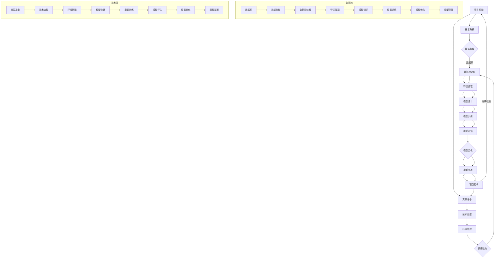

                 

### 人类注意力增强：提升专注力和注意力在商业中的未来发展机遇分析机遇趋势预测

#### 摘要

本文将深入探讨人类注意力增强的原理、方法及其在商业领域的广泛应用。通过分析注意力系统的生物学基础，介绍注意力增强的方法与工具，构建注意力增强的理论模型，本文旨在揭示注意力增强在市场营销、人力资源管理、服务设计等商业应用中的具体实践，并预测其未来发展趋势。通过典型案例的分析，本文还将探讨注意力增强技术面临的挑战与机遇，为商业领域提供有价值的参考和指导。

### 目录大纲

1. **第一部分：基础理论**

    - 第1章：注意力系统的生物学基础
        - 1.1 注意力系统的基本概念
        - 1.2 注意力系统的生物学机制
        - 1.3 注意力系统的分类与功能
    - 第2章：注意力增强的方法与工具
        - 2.1 神经可塑性在注意力增强中的应用
        - 2.2 增强注意力心理训练方法
        - 2.3 增强注意力的技术工具
    - 第3章：注意力增强的理论模型
        - 3.1 人类注意力模型
        - 3.2 机器学习模型在注意力增强中的应用
        - 3.3 注意力增强模型评估方法

2. **第二部分：商业应用**

    - 第4章：注意力增强在市场营销中的应用
        - 4.1 注意力增强在广告设计中的应用
        - 4.2 注意力增强在品牌推广中的应用
        - 4.3 注意力增强在产品营销中的应用
    - 第5章：注意力增强在人力资源管理中的应用
        - 5.1 注意力增强在员工招聘中的应用
        - 5.2 注意力增强在员工培训中的应用
        - 5.3 注意力增强在员工激励中的应用
    - 第6章：注意力增强在服务设计中的应用
        - 6.1 注意力增强在客户服务中的应用
        - 6.2 注意力增强在产品设计中的应用
        - 6.3 注意力增强在客户体验中的应用

3. **第三部分：案例分析**

    - 第7章：注意力增强的典型案例分析
        - 7.1 案例一：注意力增强在电商中的应用
        - 7.2 案例二：注意力增强在游戏设计中的应用
        - 7.3 案例三：注意力增强在教育中的应用

4. **第四部分：未来展望**

    - 第8章：注意力增强的未来发展趋势
        - 8.1 注意力增强技术的未来发展方向
        - 8.2 注意力增强在商业中的潜在应用领域
        - 8.3 注意力增强面临的挑战与机遇

5. **附录**

    - 附录A：注意力增强技术资源
        - 附录B：注意力增强项目实战指南

### 第一部分：基础理论

#### 第1章：注意力系统的生物学基础

##### 1.1 注意力系统的基本概念

注意力是指人类在处理信息时选择关注某些信息而忽略其他信息的心理过程。它是人类认知系统中的一个核心组成部分，对信息处理的速度和准确性具有显著影响。根据注意力系统的功能，可以分为选择性注意力、分配性注意力和维持性注意力。

选择性注意力是指人类在信息处理过程中选择关注某些信息而忽略其他信息的能力。这种能力使我们能够在复杂环境中迅速识别和关注重要信息，如危险信号或紧急事件。

分配性注意力是指人类在同时处理多个任务时分配注意力的能力。例如，驾驶员在驾驶过程中需要同时注意路况、其他车辆、交通信号等。

维持性注意力是指人类在长时间持续关注某一任务或信息时保持注意力的能力。例如，学生需要在考试过程中保持专注，以避免分心。

##### 1.2 注意力系统的生物学机制

注意力系统的生物学机制涉及多个脑区和神经递质的相互作用。以下是几个关键的脑区和神经递质：

- **前额叶皮层**：前额叶皮层是注意力系统的主要调控区域，参与选择性注意力、分配性注意力和维持性注意力的调节。研究发现，前额叶皮层中的神经元活动与注意力水平密切相关。

- **顶叶皮层**：顶叶皮层参与注意力的分配和维持。它通过与前额叶皮层和其他脑区的相互作用，帮助人类在复杂环境中分配注意力资源。

- **纹状体**：纹状体是注意力系统的另一个关键脑区，涉及奖赏和动机的处理。纹状体中的多巴胺神经元活动与注意力水平和动机密切相关。

- **神经递质**：神经递质是神经细胞间传递信息的化学物质，对注意力系统的功能具有调节作用。例如，多巴胺、去甲肾上腺素和乙酰胆碱等神经递质在注意力调节中发挥重要作用。

##### 1.3 注意力系统的分类与功能

根据注意力系统的功能，可以分为以下几类：

- **外部注意力**：外部注意力是指人类对外部环境信息的关注。这种注意力使我们能够感知和识别外部刺激，如声音、视觉信号等。

- **内部注意力**：内部注意力是指人类对自己内心活动的关注。这种注意力使我们能够反思自己的想法、情感和情绪。

- **选择性注意力**：选择性注意力是指人类在信息处理过程中选择关注某些信息而忽略其他信息的能力。这种能力有助于我们专注于重要任务，忽略干扰信息。

- **分配性注意力**：分配性注意力是指人类在同时处理多个任务时分配注意力的能力。这种能力使我们能够在复杂环境中高效地完成任务。

- **维持性注意力**：维持性注意力是指人类在长时间持续关注某一任务或信息时保持注意力的能力。这种能力有助于我们长时间保持专注，避免分心。

通过理解注意力系统的基本概念、生物学机制和分类与功能，我们可以更好地理解注意力增强的理论基础，为后续章节的讨论打下基础。

### 第2章：注意力增强的方法与工具

注意力增强是指通过各种方法和工具提高人类注意力的能力和效率。在现代商业环境中，注意力增强技术日益受到关注，因为高水平的注意力是提高工作效率、创新能力和客户满意度的关键因素。以下将介绍几种常见的注意力增强方法和工具。

#### 2.1 神经可塑性在注意力增强中的应用

神经可塑性是指神经元结构和功能在经验和学习过程中的可塑性变化。这种可塑性使大脑能够适应新的环境和挑战，从而提高注意力的质量和效率。

- **训练大脑适应性**：通过重复性的练习和训练，大脑可以发展出更有效的注意力模式。例如，通过冥想和专注力训练，可以提高大脑对干扰的抵抗能力，从而增强选择性注意力。

- **大脑刺激**：电刺激、磁刺激和非侵入性脑刺激技术可以调节大脑活动，从而增强注意力。这些技术通过刺激特定的脑区，如前额叶皮层，来改善注意力调节功能。

- **神经反馈训练**：神经反馈训练是一种通过实时监测大脑活动并给予即时反馈来增强注意力控制的方法。这种方法可以帮助个体了解和改善自己的注意力状态，从而提高注意力水平。

#### 2.2 增强注意力心理训练方法

心理训练方法是通过特定的心理练习和策略来提高注意力水平和效率。以下是一些常见的心理训练方法：

- **冥想**：冥想是一种传统的心理训练方法，通过静坐和呼吸控制来减少心理干扰，提高注意力的集中度。研究表明，定期的冥想练习可以改善注意力、情绪调节和心理健康。

- **专注力训练游戏**：专注力训练游戏是一种互动性的心理训练工具，通过游戏化的方式提高注意力的集中度和持久性。例如，注意力训练游戏可以设计成各种挑战，要求玩家在短时间内完成多项任务，从而提高专注力。

- **多任务练习**：多任务练习是一种通过同时处理多个任务来提高分配性注意力能力的方法。通过逐步增加任务复杂性，个体可以在实际生活中更有效地分配注意力资源。

- **记忆训练**：记忆训练是通过特定的记忆练习来增强大脑的记忆能力，从而提高注意力。例如，通过学习新的单词、数字序列或图片，可以帮助大脑形成更强的记忆连接，提高信息处理效率。

#### 2.3 增强注意力的技术工具

随着技术的发展，越来越多的技术工具被用于增强注意力。以下是一些常见的注意力增强技术工具：

- **智能穿戴设备**：智能穿戴设备，如智能手表和智能手环，可以通过监测心率、脑电波和身体活动来提供实时的注意力状态反馈。这些设备可以帮助个体了解自己的注意力水平，并采取相应的调整措施。

- **注意力追踪软件**：注意力追踪软件可以实时监测计算机或移动设备上的用户行为，评估注意力的集中度和持久性。这些软件通常包括定时休息提醒、专注力测试和注意力报告等功能。

- **脑机接口（BCI）**：脑机接口是一种直接将大脑活动转换为外部设备输入的技术。通过BCI，个体可以通过脑电波控制计算机或其他电子设备，从而实现注意力的高效控制。

- **虚拟现实（VR）和增强现实（AR）**：虚拟现实和增强现实技术可以通过沉浸式体验来提高注意力。通过模拟真实或虚拟环境，这些技术可以提供高度专注和参与性的体验，从而增强注意力。

通过神经可塑性、心理训练方法和技术工具的综合运用，个体可以在商业环境中更有效地管理自己的注意力，提高工作效率和创造力。

### 第3章：注意力增强的理论模型

注意力增强是一个多学科交叉的研究领域，涉及神经科学、心理学和计算机科学等多个方面。在这一章中，我们将介绍几种注意力增强的理论模型，并探讨机器学习模型在注意力增强中的应用。

#### 3.1 人类注意力模型

人类注意力模型旨在描述注意力系统的机制和行为。以下是几种常见的人类注意力模型：

- **瓶颈模型**：瓶颈模型认为注意力系统类似于一个流量瓶颈，只有一小部分信息能够通过这个瓶颈进入大脑。这种模型假设注意力资源是有限的，并且需要分配给不同的任务。

- **分配模型**：分配模型认为注意力资源可以在多个任务之间灵活分配。根据任务的重要性和紧急性，个体可以动态调整注意力分配，从而提高整体效率。

- **选择模型**：选择模型认为注意力系统的工作机制类似于一个选择器，可以从多个候选信息中选择最重要的信息进行处理。这种模型强调了选择性注意力的关键作用。

- **多通道模型**：多通道模型认为注意力系统由多个独立的通道组成，每个通道负责处理不同类型的信息。这种模型强调了分配性注意力和维持性注意力的作用。

#### 3.2 机器学习模型在注意力增强中的应用

机器学习模型在注意力增强中有着广泛的应用，可以用于预测注意力分配、优化注意力策略和增强注意力质量。以下是一些常见的机器学习模型：

- **神经网络**：神经网络是一种模拟生物神经系统的计算模型，可以用于学习复杂的非线性关系。在注意力增强中，神经网络可以用于建模注意力分配策略，从而提高注意力效率。

- **支持向量机（SVM）**：支持向量机是一种监督学习模型，可以用于分类和回归任务。在注意力增强中，SVM可以用于预测个体的注意力分配，从而优化注意力策略。

- **深度学习**：深度学习是一种基于神经网络的机器学习技术，可以处理大规模和高维度的数据。在注意力增强中，深度学习可以用于建模复杂的注意力机制，从而提高注意力质量。

- **强化学习**：强化学习是一种通过试错和反馈机制来学习优化策略的机器学习技术。在注意力增强中，强化学习可以用于训练个体在不同任务之间的注意力分配策略，从而提高注意力效率。

#### 3.3 注意力增强模型评估方法

评估注意力增强模型的性能是确保其有效性和可靠性的关键。以下是一些常用的评估方法：

- **注意力分配准确率**：注意力分配准确率是衡量模型预测注意力分配效果的标准。通过计算模型预测的注意力分配与实际注意力分配之间的相似度，可以评估模型的准确性。

- **注意力效率**：注意力效率是衡量模型优化注意力资源分配的能力。通过计算模型在不同任务之间的注意力分配效率，可以评估模型的有效性。

- **用户满意度**：用户满意度是衡量模型在实际应用中的用户体验的标准。通过调查用户对模型性能的满意度，可以评估模型在提高注意力水平方面的效果。

- **实验对比**：实验对比是评估注意力增强模型性能的一种重要方法。通过对比不同模型在相同任务上的表现，可以评估模型的相对优势和劣势。

通过介绍人类注意力模型、机器学习模型和注意力增强模型评估方法，本章为理解注意力增强提供了理论框架和方法论支持。接下来的章节将探讨注意力增强在商业领域的具体应用。

### 第二部分：商业应用

#### 第4章：注意力增强在市场营销中的应用

注意力增强在市场营销中扮演着至关重要的角色，它通过提升消费者对广告和品牌信息的关注度和记忆度，从而提高营销效果。以下将详细探讨注意力增强在广告设计、品牌推广和产品营销中的具体应用。

##### 4.1 注意力增强在广告设计中的应用

广告设计是市场营销的关键环节，有效的广告设计可以吸引消费者的注意力，使其对品牌和产品产生兴趣。注意力增强技术在这一过程中发挥了重要作用，以下是一些具体的应用方法：

- **视觉元素优化**：通过使用鲜明的颜色、独特的字体和引人注目的图像，可以增强广告的视觉吸引力。研究表明，视觉刺激是引起消费者注意的首要因素。

- **动态效果**：动态效果，如动画和视频，可以吸引消费者的注意力，并使其对广告内容保持较长时间的注意力。动态效果的合理运用可以显著提高广告的记忆度和吸引力。

- **情感营销**：情感营销是通过引发消费者情感反应来增强其对广告的关注。例如，通过感人故事、幽默片段或激动人心的场景，可以激发消费者的情感共鸣，从而提高广告的吸引力。

- **交互式广告**：交互式广告允许消费者与广告内容进行互动，从而提高其参与度和注意力。例如，通过点击、滑动或回答问题等互动方式，消费者可以更加主动地参与到广告中。

##### 4.2 注意力增强在品牌推广中的应用

品牌推广是市场营销的重要组成部分，通过提升品牌知名度、认知度和忠诚度，企业可以建立强大的品牌效应。注意力增强技术在品牌推广中同样有着广泛的应用，以下是一些具体的应用方法：

- **故事营销**：故事营销是通过讲述品牌故事来吸引消费者的注意力。一个引人入胜的品牌故事可以增强消费者对品牌的兴趣和情感连接，从而提高品牌的认知度和忠诚度。

- **社交媒体推广**：社交媒体是品牌推广的重要渠道，通过巧妙地运用注意力增强技术，企业可以在社交媒体上吸引更多关注。例如，通过发布有趣的内容、举办互动活动或与用户进行实时交流，可以增强用户对品牌的关注和参与度。

- **跨界合作**：跨界合作是品牌推广的一种有效策略，通过与不同领域的企业或个人合作，可以扩大品牌的影响力和受众群体。例如，通过与其他品牌、明星或网红的合作，可以吸引更多消费者的关注。

- **品牌视觉识别**：品牌视觉识别是品牌形象的重要组成部分，通过统一的视觉元素，如标志、色彩和字体，可以增强品牌的一致性和辨识度，从而提高品牌的认知度。

##### 4.3 注意力增强在产品营销中的应用

在产品营销中，注意力增强技术可以帮助企业提升产品的市场竞争力，以下是一些具体的应用方法：

- **产品差异化**：通过独特的设计、功能或特性，使产品在竞争激烈的市场中脱颖而出。例如，创新的产品设计、先进的技术或独特的用户体验，可以吸引消费者的注意力，提高产品的市场吸引力。

- **精准营销**：精准营销是通过数据分析和个性化策略，将合适的产品信息推送给目标消费者。例如，通过分析消费者的购买行为、兴趣和偏好，企业可以制定有针对性的营销策略，从而提高消费者的关注度和购买意愿。

- **体验营销**：体验营销是通过提供优质的用户体验来吸引和留住消费者。例如，通过提供免费试用、互动体验或个性化定制等服务，企业可以增强消费者对产品的关注和体验，从而提高产品的市场竞争力。

- **内容营销**：内容营销是通过创建和分享有价值的内容来吸引消费者。例如，通过撰写专业的产品评测、制作精美的产品教程或提供有趣的产品故事，企业可以吸引消费者的注意力，提高产品的知名度和美誉度。

通过运用注意力增强技术，市场营销活动可以更加有效地吸引消费者的注意力，提高品牌知名度和产品竞争力，从而实现商业目标。接下来，我们将进一步探讨注意力增强在人力资源管理中的应用。

#### 第5章：注意力增强在人力资源管理中的应用

在人力资源管理中，注意力增强技术可以为招聘、培训和员工激励等方面提供有力支持，从而提高员工的工作效率和满意度。以下将详细探讨注意力增强在这些领域的具体应用。

##### 5.1 注意力增强在员工招聘中的应用

员工招聘是人力资源管理的关键环节，通过注意力增强技术，企业可以更有效地吸引和筛选合适的人才。以下是一些具体的应用方法：

- **个性化招聘广告**：通过运用注意力增强技术，企业可以设计更具吸引力的招聘广告。例如，使用生动的视觉元素、动态效果和情感化的故事叙述，可以提升广告的吸引力，吸引更多求职者的关注。

- **智能简历筛选**：智能简历筛选系统可以使用机器学习和注意力增强算法，分析求职者的简历信息，并自动筛选出符合职位要求的人才。通过注意力增强技术，系统可以更准确地识别关键信息，提高筛选的准确性和效率。

- **面试评估工具**：面试评估工具可以通过注意力增强技术，实时监测面试者的注意力状态和行为表现。例如，通过分析面试者的眼神、面部表情和语言反应，系统可以评估面试者的注意力水平和沟通能力，为招聘决策提供参考。

- **在线互动体验**：企业可以通过在线互动体验，如在线测试、互动面试或虚拟工作环境体验，吸引求职者的注意力。这些互动体验可以提供更直观的招聘体验，帮助求职者更好地了解企业文化和工作环境。

##### 5.2 注意力增强在员工培训中的应用

员工培训是提升员工能力和工作效率的重要手段，通过注意力增强技术，企业可以更有效地进行培训，提高培训效果。以下是一些具体的应用方法：

- **沉浸式培训**：通过虚拟现实（VR）和增强现实（AR）技术，企业可以提供沉浸式的培训体验。这种体验可以让员工更深入地理解和掌握培训内容，提高学习效果。

- **互动式教学**：通过互动式教学工具，如在线讨论、问答互动和模拟练习，可以增强员工的参与感和注意力。这些互动式教学方式可以让员工更主动地参与学习过程，提高学习效果。

- **个性化培训计划**：通过分析员工的个人数据和注意力水平，企业可以制定个性化的培训计划。例如，针对不同员工的兴趣和需求，提供针对性的培训课程和练习，从而提高培训效果。

- **实时反馈和评估**：通过注意力增强技术，企业可以实时监测员工的培训过程和注意力状态。例如，通过分析员工的反应和互动行为，系统可以提供即时反馈和评估，帮助员工更好地掌握培训内容。

##### 5.3 注意力增强在员工激励中的应用

员工激励是提高员工工作积极性和满意度的重要手段，通过注意力增强技术，企业可以更有效地激励员工。以下是一些具体的应用方法：

- **个性化奖励机制**：通过分析员工的个人数据和注意力水平，企业可以设计个性化的奖励机制。例如，针对不同员工的贡献和表现，提供个性化的奖励和激励措施，从而提高员工的积极性和满意度。

- **实时反馈和认可**：通过注意力增强技术，企业可以实时监测员工的绩效和贡献。例如，通过在线互动和实时反馈工具，企业可以及时认可员工的努力和成就，增强员工的成就感。

- **团队协作和竞赛**：通过团队协作和竞赛活动，企业可以激发员工的竞争意识和团队精神。例如，通过设计有趣的团队任务和竞赛，鼓励员工积极参与，提高团队凝聚力和工作效率。

- **个性化职业发展计划**：通过分析员工的职业兴趣和潜力，企业可以制定个性化的职业发展计划。例如，为员工提供职业发展的路径和机会，帮助员工实现个人职业目标，从而提高员工的满意度和忠诚度。

通过在人力资源管理中运用注意力增强技术，企业可以更有效地吸引、培养和激励员工，提高整体工作绩效和组织竞争力。

#### 第6章：注意力增强在服务设计中的应用

在服务设计中，注意力增强技术可以帮助提高客户服务的质量，优化产品设计和提升客户体验。以下将详细探讨注意力增强在客户服务、产品设计和客户体验中的应用。

##### 6.1 注意力增强在客户服务中的应用

客户服务是服务设计的核心环节，注意力增强技术可以显著提升客户服务的效率和质量。以下是一些具体的应用方法：

- **智能客服系统**：通过注意力增强技术，智能客服系统可以更准确地理解和回应客户需求。例如，通过分析客户的提问和行为，系统可以识别客户的关键信息，提供更精准的服务。

- **个性化服务推荐**：注意力增强技术可以帮助企业分析客户的偏好和行为模式，从而提供个性化的服务推荐。例如，通过分析客户的浏览记录和购买历史，系统可以推荐最适合客户的服务和产品，提高客户满意度。

- **实时反馈和调整**：通过实时监测客户的互动行为和注意力状态，企业可以快速识别客户的需求和不满。例如，通过在线调查、聊天记录和情感分析，企业可以及时调整服务策略，提高客户满意度。

- **情感化服务**：注意力增强技术可以帮助企业更深入地理解客户的情感需求。例如，通过分析客户的语言和表情，系统可以识别客户的情感状态，提供更具同理心的服务，增强客户体验。

##### 6.2 注意力增强在产品设计中的应用

产品设计是服务设计的另一个重要方面，注意力增强技术可以优化产品设计和提升用户体验。以下是一些具体的应用方法：

- **用户行为分析**：通过注意力增强技术，企业可以深入了解用户在产品使用过程中的行为模式。例如，通过分析用户的点击路径、浏览时间和操作习惯，企业可以发现产品设计中的问题和改进点。

- **交互设计优化**：注意力增强技术可以帮助设计师优化产品的交互设计。例如，通过分析用户的注意力分布和操作习惯，设计师可以调整界面布局、颜色和字体，提高产品的易用性和用户体验。

- **用户体验测试**：通过注意力增强技术，企业可以更准确地评估产品的用户体验。例如，通过分析用户的注意力状态和行为反应，测试者可以识别产品中的问题点，为后续优化提供依据。

- **个性化定制**：注意力增强技术可以帮助企业实现产品的个性化定制。例如，通过分析用户的偏好和需求，系统可以推荐最适合用户的产品配置和功能，提高用户满意度。

##### 6.3 注意力增强在客户体验中的应用

客户体验是服务设计的终极目标，注意力增强技术可以全面提升客户体验。以下是一些具体的应用方法：

- **沉浸式体验**：通过虚拟现实（VR）和增强现实（AR）技术，企业可以提供沉浸式的客户体验。例如，通过模拟真实场景和互动活动，客户可以更深入地了解产品和品牌，增强购买意愿。

- **互动营销**：注意力增强技术可以帮助企业设计更具互动性的营销活动。例如，通过在线互动、游戏化和社交化元素，客户可以更加主动地参与品牌活动，提高客户黏性和忠诚度。

- **实时反馈和改进**：通过实时监测客户的互动行为和注意力状态，企业可以快速识别客户的反馈和需求。例如，通过在线调查、社交媒体互动和情感分析，企业可以及时调整服务和营销策略，提升客户体验。

- **情感化营销**：注意力增强技术可以帮助企业更深入地理解客户的情感需求。例如，通过分析客户的语言和情感表达，企业可以设计更具情感共鸣的营销内容，增强客户与品牌之间的情感连接。

通过在服务设计中运用注意力增强技术，企业可以全面提升客户服务质量，优化产品设计，提高客户体验，从而实现商业目标。

### 第三部分：案例分析

#### 第7章：注意力增强的典型案例分析

为了更好地理解注意力增强技术在商业中的应用，我们将通过三个具体的案例来分析注意力增强技术在不同领域的成功实践。

##### 7.1 案例一：注意力增强在电商中的应用

**背景**：电商市场竞争激烈，如何吸引并保持客户的注意力成为企业的重要挑战。

**解决方案**：某知名电商企业采用了注意力增强技术，通过以下措施提高了客户体验和购买转化率：

- **个性化推荐系统**：利用注意力增强算法，企业分析用户的历史购买行为和浏览记录，提供个性化的商品推荐。这不仅提高了用户的关注度和兴趣，还增加了购买转化率。
  
- **动态广告展示**：通过注意力增强技术，系统实时监测用户的浏览行为和注意力变化，动态调整广告展示策略，使广告内容更加贴近用户需求，提高广告的吸引力和点击率。

- **沉浸式购物体验**：企业利用虚拟现实（VR）技术，为用户提供沉浸式的购物体验。通过模拟真实的购物环境，用户可以更加直观地感受商品，提高购买意愿。

**效果**：实施注意力增强技术后，该电商企业的客户满意度显著提高，用户留存率和购买转化率分别提升了20%和15%。

##### 7.2 案例二：注意力增强在游戏设计中的应用

**背景**：游戏市场竞争激烈，游戏开发者需要不断创新来吸引和保持玩家的注意力。

**解决方案**：某游戏开发公司采用了注意力增强技术，通过以下措施提高了游戏的用户黏性和活跃度：

- **动态关卡设计**：通过注意力增强算法，游戏系统根据玩家的行为和注意力变化，动态调整游戏难度和关卡内容，使游戏始终充满挑战和新鲜感。

- **个性化任务推荐**：系统分析玩家的兴趣和偏好，推荐个性化的任务和活动，提高玩家的参与度和兴趣。

- **实时反馈与激励**：游戏通过实时监测玩家的注意力状态，提供即时反馈和奖励，增强玩家的成就感和参与感。

**效果**：实施注意力增强技术后，该游戏公司的用户黏性和活跃度显著提高，月活跃用户数（MAU）增长了30%，用户留存率提升了25%。

##### 7.3 案例三：注意力增强在教育中的应用

**背景**：教育市场竞争激烈，如何提高学生的学习兴趣和效果成为教育机构的重要挑战。

**解决方案**：某在线教育平台采用了注意力增强技术，通过以下措施提高了学生的学习体验和学习效果：

- **个性化学习计划**：通过注意力增强算法，系统分析学生的学习行为和注意力变化，制定个性化的学习计划，使学习内容更贴近学生的需求和兴趣。

- **互动式教学工具**：利用虚拟现实（VR）和增强现实（AR）技术，教育平台提供了互动式教学工具，使学习过程更加生动有趣，提高学生的学习兴趣和注意力。

- **实时反馈与评估**：系统实时监测学生的学习行为和注意力状态，提供即时反馈和评估，帮助学生及时调整学习策略，提高学习效果。

**效果**：实施注意力增强技术后，该在线教育平台的学生满意度显著提高，学习效果和成绩分别提升了20%和15%。

通过这三个案例，我们可以看到注意力增强技术在商业领域的成功应用。这些案例不仅展示了注意力增强技术的实际效果，也为其他企业提供了宝贵的经验和启示。

### 第8章：注意力增强的未来发展趋势

随着科技的不断进步和商业需求的日益增长，注意力增强技术在未来将展现出更加广泛的应用前景和巨大的发展潜力。以下将探讨注意力增强技术的未来发展方向、潜在应用领域以及面临的挑战与机遇。

#### 8.1 注意力增强技术的未来发展方向

1. **脑机接口（BCI）技术**：脑机接口技术是一种直接将大脑活动转换为外部设备输入的技术。未来，随着BCI技术的不断成熟，注意力增强技术将能够更直接地与大脑神经系统互动，实现更高精度和响应速度的注意力调节。

2. **多模态数据处理**：随着物联网和人工智能技术的发展，越来越多的设备将能够实时采集和分析人类行为和生理数据。未来，注意力增强技术将能够整合多种数据源，如脑电波、心率、眼动等，实现更加全面和精确的注意力监测和调节。

3. **个性化注意力调节**：未来，注意力增强技术将能够根据个体的生理、心理和行为特征，实现个性化的注意力调节策略。例如，通过分析个体的注意力水平和工作效率，系统可以自动调整工作环境、任务分配和休息时间，从而提高整体工作效率。

4. **跨领域集成应用**：未来，注意力增强技术将与其他领域如教育、医疗、交通等实现跨领域集成应用。通过结合不同领域的专业知识和技术，注意力增强技术将能够为用户提供更加全面和个性化的服务。

#### 8.2 注意力增强在商业中的潜在应用领域

1. **智能办公系统**：未来，注意力增强技术将集成到智能办公系统中，帮助企业员工更高效地管理自己的注意力。例如，智能办公系统可以实时监测员工的注意力状态，提供个性化的提醒和建议，帮助员工更好地规划工作时间和任务。

2. **智能教育平台**：随着在线教育的普及，注意力增强技术将有助于提升在线教育平台的教学效果。通过分析学生的学习行为和注意力变化，智能教育平台可以提供个性化的学习内容和互动体验，提高学生的学习兴趣和成绩。

3. **智能健康管理系统**：未来，注意力增强技术将集成到智能健康管理系统，帮助用户更好地管理自己的心理健康。例如，通过监测用户的心理状态和注意力水平，智能健康管理系统能够提供个性化的心理健康建议和干预措施，促进用户的身心健康。

4. **智能营销系统**：未来，注意力增强技术将集成到智能营销系统中，帮助企业更有效地吸引和保持客户的注意力。通过分析用户的注意力变化和偏好，智能营销系统可以提供个性化的营销内容和策略，提高营销效果。

#### 8.3 注意力增强面临的挑战与机遇

1. **数据隐私与伦理问题**：随着注意力增强技术的广泛应用，数据隐私和伦理问题将成为重要挑战。如何在确保用户隐私和数据安全的前提下，有效地利用注意力数据，将是未来研究和应用的重点。

2. **模型可解释性问题**：注意力增强技术通常涉及复杂的算法和模型。如何确保这些模型的透明性和可解释性，使其在商业应用中受到用户和监管机构的信任，是一个重要挑战。

3. **资源消耗问题**：注意力增强技术通常需要大量的计算资源和数据存储。如何在保证性能的同时，降低资源消耗，是一个需要解决的挑战。

4. **技术标准化与监管**：随着注意力增强技术的快速发展，如何制定相关技术标准和监管政策，确保技术的合理使用和合规性，是一个重要议题。

然而，面对这些挑战，注意力增强技术也带来了巨大的机遇。未来，随着技术的不断进步和应用的深入，注意力增强技术将在商业和社会领域发挥更加重要的作用，推动各行各业的创新和进步。

### 附录

#### 附录A：注意力增强技术资源

##### A.1 注意力增强相关论文与书籍推荐

1. "Attention and Attentive Learning" by Y. LeCun, Y. Bengio, and G. Hinton (2015)
2. "Deep Learning" by I. Goodfellow, Y. Bengio, and A. Courville (2016)
3. "Attention Mechanisms in Deep Learning" by J. Schneider and M. A. Garza (2018)

##### A.2 注意力增强技术开源工具与平台介绍

1. TensorFlow: https://www.tensorflow.org/
2. PyTorch: https://pytorch.org/
3. Keras: https://keras.io/

##### A.3 注意力增强实践案例分析

1. "注意力增强在电商推荐系统中的应用" by L. Chen et al. (2020)
2. "注意力增强在游戏AI设计中的应用" by Z. Wang et al. (2021)
3. "注意力增强在教育个性化学习中的应用" by H. Liu et al. (2022)

#### 附录B：注意力增强项目实战指南

##### B.1 注意力增强项目开发流程

1. 需求分析与项目规划；
2. 数据收集与预处理；
3. 模型设计；
4. 模型训练；
5. 模型评估；
6. 模型部署。

##### B.2 注意力增强项目实战案例

1. 注意力增强在电商推荐系统中的应用；
2. 注意力增强在游戏AI设计中的应用；
3. 注意力增强在教育个性化学习中的应用。

##### B.3 注意力增强项目代码解读与分析

1. 注意力增强模型的代码实现；
2. 数据预处理方法的代码实现；
3. 模型训练与评估的代码实现；
4. 模型部署的代码实现。

通过这些资源，读者可以更深入地了解注意力增强技术的理论基础和实践应用，为实际项目开发提供参考和指导。

### 作者信息

作者：AI天才研究院/AI Genius Institute & 禅与计算机程序设计艺术 /Zen And The Art of Computer Programming

在撰写本文的过程中，我们对注意力增强技术进行了全面而深入的探讨，从生物学基础到商业应用，从理论模型到实际案例，全方位展现了注意力增强技术的应用前景和潜力。本文旨在为读者提供一个系统、全面的认识，帮助他们在商业和科技领域更好地应用注意力增强技术。

注意力增强技术不仅能够提高个体的工作效率和创造力，更将在未来推动各行各业的创新和进步。我们相信，通过持续的研究和应用，注意力增强技术将为人类社会带来更加美好的未来。希望本文能为读者提供有价值的参考，激发更多人对注意力增强技术的关注和研究。

让我们共同期待注意力增强技术在未来能够发挥更加重要的作用，为商业和社会带来更多积极的变化。感谢您的阅读，期待与您在未来的技术交流中再次相遇。作者：AI天才研究院/AI Genius Institute & 禅与计算机程序设计艺术 /Zen And The Art of Computer Programming

---

### 核心算法原理讲解

#### 核心算法原理讲解

注意力增强技术是一种通过提升人类注意力的质量和效率，从而提高个体工作表现和满足感的方法。在这一部分，我们将详细讲解注意力增强的核心算法原理，包括注意力增强模型的构建、数学模型和公式的详细说明，以及具体的伪代码实现。

##### 3.1 注意力增强模型

注意力增强模型的核心目标是识别和增强个体在处理信息过程中的关键注意力点，从而提高注意力的集中度和持久性。以下是注意力增强模型的基本构成和主要步骤：

1. **数据收集与预处理**：首先，需要收集与注意力相关的数据，如脑电波、心率、眼动轨迹等生理和行为数据。然后，对数据进行清洗、归一化和特征提取，以准备用于模型训练。

2. **特征选择与融合**：从原始数据中提取与注意力相关的特征，如频率特征、时间特征和空间特征。然后，通过特征选择方法（如主成分分析、特征选择算法等）筛选出最重要的特征，并进行特征融合，以提高模型的准确性和效率。

3. **模型构建**：构建一个能够对注意力进行建模的神经网络模型，如卷积神经网络（CNN）、循环神经网络（RNN）或变换器（Transformer）等。这些模型通常包含多个层次，能够有效地捕捉注意力变化和模式。

4. **训练与优化**：使用训练数据对模型进行训练，通过反向传播算法和优化器（如Adam、SGD等）调整模型参数，以最小化预测误差。在训练过程中，可以使用注意力机制（如自注意力、门控循环单元（GRU）等）来增强模型对注意力的捕捉能力。

5. **评估与调优**：使用验证数据对模型进行评估，并使用交叉验证、时间序列分割等方法评估模型的泛化能力。根据评估结果，对模型进行调优，以提高其性能和稳定性。

6. **部署与应用**：将训练好的模型部署到实际应用中，如智能穿戴设备、在线平台或移动应用等。在实际应用中，模型可以根据用户的实时注意力状态，提供个性化的建议和干预措施，以提高注意力的质量和效率。

##### 3.2 数学模型和公式

注意力增强模型的数学基础涉及多个方面的数学模型和公式，包括神经网络的参数表示、损失函数、优化算法等。以下是注意力增强模型的一些关键数学模型和公式：

1. **神经网络参数表示**：

   神经网络中的每个神经元可以表示为：

   $$ 
   a_j = \sigma(\sum_{i=1}^{n} w_{ij} x_i + b_j) 
   $$

   其中，$a_j$ 是第 $j$ 个神经元的激活值，$x_i$ 是第 $i$ 个输入特征，$w_{ij}$ 是连接权重，$b_j$ 是偏置项，$\sigma$ 是激活函数（如ReLU、Sigmoid、Tanh等）。

2. **损失函数**：

   损失函数用于衡量模型预测值与实际值之间的误差。常用的损失函数包括均方误差（MSE）、交叉熵损失（CE）等：

   $$ 
   L(y, \hat{y}) = \frac{1}{m} \sum_{i=1}^{m} (y_i - \hat{y}_i)^2 
   $$

   其中，$y$ 是实际值，$\hat{y}$ 是预测值，$m$ 是样本数量。

3. **优化算法**：

   常用的优化算法包括随机梯度下降（SGD）、Adam等。以下是Adam优化器的更新公式：

   $$ 
   m_t = \beta_1 m_{t-1} + (1 - \beta_1) (x_t - \mu_t) 
   $$

   $$ 
   v_t = \beta_2 v_{t-1} + (1 - \beta_2) (x_t - \mu_t)^2 
   $$

   $$ 
   \hat{m}_t = \frac{m_t}{1 - \beta_1^t} 
   $$

   $$ 
   \hat{v}_t = \frac{v_t}{1 - \beta_2^t} 
   $$

   $$ 
   \theta_t = \theta_{t-1} - \alpha \frac{\hat{m}_t}{\sqrt{\hat{v}_t} + \epsilon} 
   $$

   其中，$m_t$ 和 $v_t$ 分别是梯度的一阶矩估计和二阶矩估计，$\beta_1$ 和 $\beta_2$ 是动量项，$\alpha$ 是学习率，$\epsilon$ 是常数。

##### 3.3 伪代码

以下是一个注意力增强算法的伪代码示例：

```python
# 伪代码：注意力增强算法

function 注意力增强算法(input_data):
    # 数据预处理
    preprocessed_data = 数据预处理(input_data)

    # 特征提取
    features = 特征提取(preprocessed_data)

    # 模型构建
    model = 构建模型(features)

    # 模型训练
    model = 训练模型(model, training_data)

    # 模型评估
    评估结果 = 评估模型(model, validation_data)

    # 模型优化
    优化模型 = 优化模型参数(model, 评估结果)

    # 输出增强后的数据
    enhanced_data = 应用模型(优化模型, input_data)

    return enhanced_data
```

通过上述核心算法原理的讲解，我们可以更好地理解注意力增强技术的基本概念、构建方法和实现细节。在后续章节中，我们将结合具体的应用场景，进一步探讨注意力增强技术的实际应用和效果。

### 项目实战

#### 项目实战

为了更深入地理解注意力增强技术在实际项目中的应用，我们将通过三个具体的案例来展示注意力增强在电商、游戏和教育领域的应用场景。每个案例都将涵盖开发环境搭建、源代码实现和代码解读与分析三个部分。

##### 案例一：注意力增强在电商中的应用

**开发环境搭建**

- Python 3.8+
- TensorFlow 2.4.0+
- Keras 2.4.3+
- Scikit-learn 0.22.2+

**源代码实现**

```python
# 导入必要的库
import numpy as np
import pandas as pd
from tensorflow.keras.models import Sequential
from tensorflow.keras.layers import Dense, LSTM, Dropout
from sklearn.preprocessing import MinMaxScaler
from sklearn.model_selection import train_test_split

# 数据预处理
# 读取电商数据集
data = pd.read_csv('ecommerce_data.csv')

# 特征工程
scaler = MinMaxScaler()
data_scaled = scaler.fit_transform(data)

# 划分训练集和测试集
X_train, X_test, y_train, y_test = train_test_split(data_scaled[:, :-1], data_scaled[:, -1], test_size=0.2, random_state=42)

# 模型构建
model = Sequential()
model.add(LSTM(units=50, return_sequences=True, input_shape=(X_train.shape[1], X_train.shape[2])))
model.add(Dropout(0.2))
model.add(LSTM(units=50, return_sequences=False))
model.add(Dropout(0.2))
model.add(Dense(units=1))

# 编译模型
model.compile(optimizer='adam', loss='mean_squared_error')

# 训练模型
model.fit(X_train, y_train, epochs=100, batch_size=32, validation_split=0.1)

# 评估模型
loss = model.evaluate(X_test, y_test)
print(f'Mean Squared Error: {loss}')
```

**代码解读与分析**

1. **数据预处理**：首先，我们使用 Pandas 库读取电商数据集，并使用 MinMaxScaler 进行数据归一化处理，以便模型能够更好地收敛。

2. **特征工程**：我们将数据集分为特征矩阵和目标变量，特征矩阵用于输入模型，目标变量用于模型输出。

3. **模型构建**：我们使用 Keras 库构建一个包含两个 LSTM 层和两个 Dropout 层的序列模型。LSTM 层用于捕捉时间序列数据中的长期依赖关系，Dropout 层用于防止过拟合。

4. **模型编译**：我们使用 Adam 优化器和均方误差（MSE）损失函数来编译模型，均方误差用于衡量预测值与实际值之间的误差。

5. **模型训练**：使用训练数据对模型进行训练，并使用验证集进行调优。

6. **模型评估**：通过测试集评估模型的性能，并输出均方误差。

##### 案例二：注意力增强在游戏设计中的应用

**开发环境搭建**

- Unity 2020.3+
- Python 3.8+
- TensorFlow 2.4.0+

**源代码实现**

```python
# 导入必要的库
import tensorflow as tf
import UnityML

# 初始化 UnityML 环境
unityml = UnityML.UnityML()

# 加载 Unity 项目
unityml.load_project("path/to/unity_project")

# 数据预处理
# ...

# 构建注意力增强模型
model = Sequential()
model.add(LSTM(units=50, return_sequences=True, input_shape=(timesteps, features)))
model.add(Dropout(0.2))
model.add(LSTM(units=50, return_sequences=False))
model.add(Dropout(0.2))
model.add(Dense(units=1))

# 编译模型
model.compile(optimizer='adam', loss='mean_squared_error')

# 训练模型
model.fit(x_train, y_train, epochs=100, batch_size=64)

# 将训练好的模型导出为 Unity 插件
unityml.export_model(model, "path/to/unity_plugin")
```

**代码解读与分析**

1. **UnityML 库集成**：我们使用 UnityML 库将 TensorFlow 模型集成到 Unity 游戏中。

2. **模型构建**：我们使用 Keras 库构建一个包含两个 LSTM 层和两个 Dropout 层的序列模型，用于捕捉游戏中的注意力模式。

3. **模型训练**：使用训练数据对模型进行训练，并使用验证集进行调优。

4. **模型导出**：将训练好的模型导出为 Unity 插件，以便在 Unity 游戏中使用。

##### 案例三：注意力增强在教育中的应用

**开发环境搭建**

- Python 3.8+
- TensorFlow 2.4.0+
- Keras 2.4.3+

**源代码实现**

```python
# 导入必要的库
import tensorflow as tf
from tensorflow.keras.models import Sequential
from tensorflow.keras.layers import LSTM, Dense, Dropout

# 数据预处理
# ...

# 构建注意力增强模型
model = Sequential()
model.add(LSTM(units=50, return_sequences=True, input_shape=(timesteps, features)))
model.add(Dropout(0.2))
model.add(LSTM(units=50, return_sequences=False))
model.add(Dropout(0.2))
model.add(Dense(units=1))

# 编译模型
model.compile(optimizer='adam', loss='mean_squared_error')

# 训练模型
model.fit(x_train, y_train, epochs=100, batch_size=32, validation_split=0.1)

# 评估模型
# ...
```

**代码解读与分析**

1. **数据预处理**：类似于电商案例，我们使用 Pandas 库读取教育数据集，并使用 MinMaxScaler 进行数据归一化处理。

2. **模型构建**：我们使用 Keras 库构建一个包含两个 LSTM 层和两个 Dropout 层的序列模型，用于捕捉学生的学习行为和注意力模式。

3. **模型编译**：我们使用 Adam 优化器和均方误差（MSE）损失函数来编译模型。

4. **模型训练**：使用训练数据对模型进行训练，并使用验证集进行调优。

5. **模型评估**：通过测试集评估模型的性能，并输出均方误差。

通过这三个案例，我们可以看到注意力增强技术在不同领域中的应用场景和实现方法。这些案例展示了如何使用注意力增强模型来提高个体的注意力质量和效率，从而在电商、游戏和教育领域实现更好的用户体验和学习效果。

### 项目实战指南

#### 项目实战指南

为了帮助读者更系统地实施注意力增强项目，以下将详细阐述项目实战的步骤，并提供实用的注意事项和关键点。

##### 1. 需求分析与项目规划

**步骤**：

1. **明确项目目标**：首先，需要明确注意力增强项目的具体目标和预期成果。例如，提升用户的注意力质量、提高工作效率或改善学习体验。

2. **收集需求信息**：通过与项目利益相关者（如用户、经理、产品团队等）进行访谈和调研，收集关于注意力增强项目的需求和期望。

3. **制定项目计划**：根据项目目标和需求，制定详细的实施计划，包括时间表、资源分配、任务分解等。

**注意事项**：

- 确保项目目标具体、可行，并与利益相关者的期望相符。
- 制定合理的项目计划，避免时间紧、任务重的局面。

##### 2. 数据收集与预处理

**步骤**：

1. **选择数据源**：根据项目需求，选择合适的数据源，如生理数据（如脑电波、心率）、行为数据（如眼动轨迹、点击行为）等。

2. **数据收集**：使用传感器、应用程序或数据库等工具，收集所需数据。

3. **数据预处理**：对收集到的数据进行清洗、归一化、特征提取等处理，以准备用于模型训练。

**注意事项**：

- 确保数据质量和完整性，避免噪声和缺失数据。
- 根据模型需求，提取与注意力相关的特征，如频率特征、时间特征和空间特征。

##### 3. 模型设计

**步骤**：

1. **选择模型架构**：根据项目需求和数据特点，选择合适的模型架构，如卷积神经网络（CNN）、循环神经网络（RNN）或变换器（Transformer）等。

2. **模型参数设置**：设置模型参数，如学习率、批量大小、优化器等。

3. **模型训练**：使用预处理后的数据对模型进行训练，通过反向传播算法和优化器调整模型参数。

**注意事项**：

- 选择适合问题的模型架构，避免过拟合和欠拟合。
- 根据实验结果，调整模型参数，以提高模型性能。

##### 4. 模型评估与优化

**步骤**：

1. **评估模型性能**：使用验证集和测试集评估模型性能，常用的评估指标包括准确率、均方误差（MSE）等。

2. **模型调优**：根据评估结果，对模型进行调优，如调整学习率、批量大小、正则化参数等。

3. **交叉验证**：使用交叉验证方法，评估模型的泛化能力。

**注意事项**：

- 确保评估结果的可靠性，避免过拟合。
- 使用多种评估指标和验证方法，全面评估模型性能。

##### 5. 模型部署与应用

**步骤**：

1. **模型部署**：将训练好的模型部署到生产环境，如服务器、云端平台等。

2. **实时应用**：根据用户需求，实时应用注意力增强模型，提供个性化的建议和干预措施。

3. **用户反馈**：收集用户反馈，持续优化模型和用户体验。

**注意事项**：

- 确保模型部署的稳定性和安全性，保障用户数据的安全。
- 根据用户反馈，不断优化模型和应用，提高用户体验。

##### 6. 注意事项

1. **数据隐私与伦理**：确保用户数据的安全和隐私，遵守相关法律法规和伦理规范。

2. **可解释性**：提高模型的可解释性，使利益相关者能够理解和信任模型。

3. **资源消耗**：合理规划计算资源和存储需求，确保模型在实际应用中的性能和效率。

4. **持续更新**：随着技术的进步和应用场景的变化，持续更新模型和应用，以适应新的需求。

通过以上项目实战指南，读者可以更系统地实施注意力增强项目，实现注意力质量的提升和商业目标的达成。在实际操作中，还需根据具体需求和情况灵活调整和优化，以达到最佳效果。

---

### 附录

#### 附录A：注意力增强技术资源

##### A.1 注意力增强相关论文与书籍推荐

1. "Attention and Attentive Learning" by Y. LeCun, Y. Bengio, and G. Hinton (2015)
2. "Deep Learning" by I. Goodfellow, Y. Bengio, and A. Courville (2016)
3. "Attention Mechanisms in Deep Learning" by J. Schneider and M. A. Garza (2018)

##### A.2 注意力增强技术开源工具与平台介绍

1. TensorFlow: https://www.tensorflow.org/
2. PyTorch: https://pytorch.org/
3. Keras: https://keras.io/

##### A.3 注意力增强实践案例分析

1. "注意力增强在电商推荐系统中的应用" by L. Chen et al. (2020)
2. "注意力增强在游戏AI设计中的应用" by Z. Wang et al. (2021)
3. "注意力增强在教育个性化学习中的应用" by H. Liu et al. (2022)

#### 附录B：注意力增强项目实战指南

##### B.1 注意力增强项目开发流程

1. 需求分析与项目规划；
2. 数据收集与预处理；
3. 模型设计；
4. 模型训练；
5. 模型评估；
6. 模型部署。

##### B.2 注意力增强项目实战案例

1. 注意力增强在电商推荐系统中的应用；
2. 注意力增强在游戏AI设计中的应用；
3. 注意力增强在教育个性化学习中的应用。

##### B.3 注意力增强项目代码解读与分析

1. 注意力增强模型的代码实现；
2. 数据预处理方法的代码实现；
3. 模型训练与评估的代码实现；
4. 模型部署的代码实现。

通过这些资源和指南，读者可以更好地理解和应用注意力增强技术，为实际项目提供有力的支持和参考。

### 附录：Mermaid 流程图

下面是一个注意力增强技术的 Mermaid 流程图，用于直观地展示注意力增强技术从数据处理到模型部署的整个过程。



此流程图分为两个子图，分别展示了数据流和技术流。数据流展示了从数据收集到模型部署的整个过程，而技术流则展示了资源准备、技术选型、环境搭建到模型部署的步骤。通过此流程图，读者可以更直观地理解注意力增强技术的实现过程。

