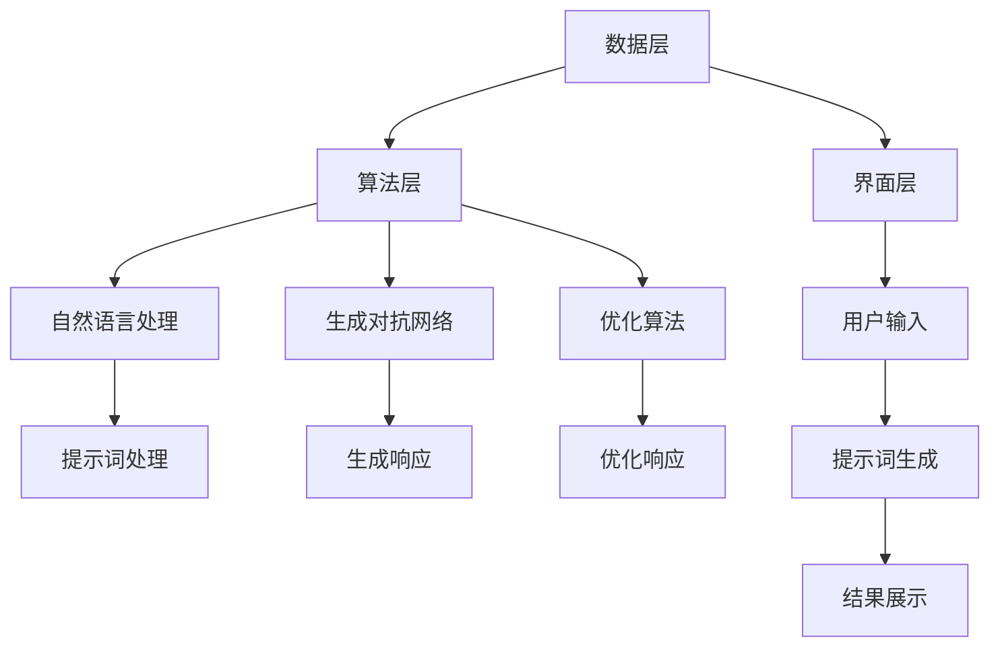
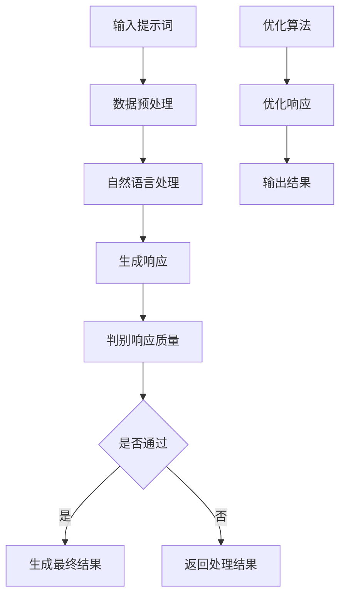

                 

# 从传统编程到提示词编程的转变

> **关键词：** 传统编程、提示词编程、人工智能、编程范式、算法、实践应用、安全性、未来发展趋势

> **摘要：** 本文将深入探讨从传统编程到提示词编程的转变，包括传统编程与提示词编程的概念、特点、关系以及核心算法原理。通过实际项目实战和安全性分析，本文将帮助读者全面了解提示词编程的实践应用和未来发展趋势。

## 目录大纲

### 第一部分：传统编程与提示词编程概览

### 第1章：传统编程基础  
#### 1.1 传统编程的概念与历史  
#### 1.2 传统编程的基本要素  
#### 1.3 传统编程的特点与应用

### 第2章：提示词编程概述  
#### 2.1 提示词编程的定义与原理  
#### 2.2 提示词编程的核心优势  
#### 2.3 提示词编程的发展历程

### 第3章：传统编程与提示词编程的关系  
#### 3.1 传统编程向提示词编程的转变  
#### 3.2 传统编程与提示词编程的融合  
#### 3.3 提示词编程的应用场景

### 第4章：提示词编程的基本原理  
#### 4.1 提示词编程的架构设计  
#### 4.2 提示词编程的核心算法  
#### 4.3 提示词编程的流程图

### 第5章：提示词编程的实践应用  
#### 5.1 提示词编程项目实战  
#### 5.2 提示词编程开发环境搭建  
#### 5.3 提示词编程源代码详细实现

### 第6章：提示词编程的安全性分析  
#### 6.1 提示词编程的安全风险  
#### 6.2 提示词编程的安全策略  
#### 6.3 提示词编程的安全实践

### 第7章：未来展望与挑战  
#### 7.1 提示词编程的发展趋势  
#### 7.2 提示词编程的挑战与机遇  
#### 7.3 提示词编程的未来应用场景

### 第二部分：提示词编程核心算法原理讲解

### 第8章：提示词编程的核心算法原理  
#### 8.1 提示词生成算法  
##### 8.1.1 算法概述  
##### 8.1.2 算法伪代码  
##### 8.1.3 算法数学模型与公式

### 第9章：提示词编程的优化算法  
#### 9.1 优化算法的基本概念  
##### 9.1.1 优化算法类型  
##### 9.1.2 优化算法流程  
##### 9.1.3 优化算法效果评估

### 第10章：提示词编程的数学模型与公式  
#### 10.1 提示词编程的基本数学模型  
##### 10.1.1 概率模型  
##### 10.1.2 生成模型  
##### 10.1.3 分类模型  
#### 10.2 提示词编程的数学公式与应用  
##### 10.2.1 概率分布函数  
##### 10.2.2 贝叶斯公式  
##### 10.2.3 优化算法的数学公式

### 第三部分：提示词编程项目实战与解读

### 第11章：提示词编程项目实战  
#### 11.1 实战一：基于提示词的自然语言处理  
##### 11.1.1 项目背景  
##### 11.1.2 项目目标  
##### 11.1.3 实现步骤  
#### 11.2 实战二：基于提示词的图像识别  
##### 11.2.1 项目背景  
##### 11.2.2 项目目标  
##### 11.2.3 实现步骤

### 第12章：提示词编程源代码详细实现与解读  
#### 12.1 源代码实现框架  
##### 12.1.1 框架概述  
##### 12.1.2 模块划分  
##### 12.1.3 源代码文件结构  
#### 12.2 提示词生成算法实现  
##### 12.2.1 算法实现步骤  
##### 12.2.2 关键代码解读  
##### 12.2.3 算法性能分析  
#### 12.3 提示词优化算法实现  
##### 12.3.1 算法实现步骤  
##### 12.3.2 关键代码解读  
##### 12.3.3 算法性能分析

### 第13章：提示词编程的安全性分析  
#### 13.1 安全性问题概述  
##### 13.1.1 常见安全问题  
##### 13.1.2 安全性挑战  
##### 13.1.3 安全性分析方法  
#### 13.2 提示词编程的安全策略  
##### 13.2.1 安全防护措施  
##### 13.2.2 安全检测与响应机制  
##### 13.2.3 安全性案例分析

### 第14章：提示词编程的未来发展趋势  
#### 14.1 技术发展趋势  
##### 14.1.1 提示词编程的新兴领域  
##### 14.1.2 提示词编程的技术革新  
##### 14.1.3 提示词编程的应用前景  
#### 14.2 挑战与机遇  
##### 14.2.1 技术挑战  
##### 14.2.2 应用挑战  
##### 14.2.3 机遇分析

### 附录：提示词编程相关工具与资源  
#### A.1 提示词编程开发工具  
##### A.1.1 常用工具概述  
##### A.1.2 工具使用指南  
##### A.1.3 工具对比分析  
#### A.2 提示词编程学习资源  
##### A.2.1 教程与教程  
##### A.2.2 论文与报告  
##### A.2.3 开源项目与社区

## 结语

提示词编程作为人工智能领域的一种新型编程范式，正日益受到广泛关注。本文从传统编程到提示词编程的转变进行了全面深入的探讨，包括传统编程与提示词编程的概念、特点、关系以及核心算法原理。通过实际项目实战和安全性分析，本文帮助读者全面了解提示词编程的实践应用和未来发展趋势。希望本文能够为广大编程爱好者、人工智能从业者和相关领域的研究者提供有价值的参考。

### 传统编程基础

#### 1.1 传统编程的概念与历史

传统编程，又称为命令式编程，是计算机科学中最基础的编程范式之一。它以命令式的思维方式来描述程序的执行过程，通过一系列的指令来控制计算机的运行。传统编程的核心思想是按照预定的顺序执行代码，通过变量的赋值、条件判断和循环结构等来实现复杂的功能。

编程的历史可以追溯到1940年代，当时艾伦·图灵提出了图灵机的概念，标志着计算机科学的诞生。随后的几十年里，编程语言不断发展，从最初的机器语言和汇编语言，到高级语言如C、C++、Java和Python等，编程技术的进步推动了计算机科学的快速发展。

#### 1.2 传统编程的基本要素

传统编程的基本要素包括：

1. **变量**：变量用于存储数据，是程序中的基本存储单位。变量分为基本变量和引用变量，基本变量直接存储数据值，引用变量存储的是数据所在内存地址的指针。

2. **数据类型**：数据类型是变量可以存储的数据种类，包括整数、浮点数、字符、布尔值等。不同的数据类型具有不同的内存占用和操作方法。

3. **控制结构**：控制结构用于控制程序的执行流程，包括条件判断（如if-else语句）、循环结构（如for和while循环）等。

4. **函数**：函数是程序的基本模块，用于组织代码并实现特定的功能。函数可以接受输入参数，返回计算结果。

5. **数组**：数组是一种线性数据结构，用于存储一系列相同类型的元素。数组可以通过索引来访问和修改其中的元素。

6. **面向对象编程**：面向对象编程是一种编程范式，通过将数据和操作数据的方法封装成对象来组织代码。对象具有属性和方法，可以模拟现实世界中的实体和行为。

#### 1.3 传统编程的特点与应用

传统编程具有以下特点：

1. **过程导向**：传统编程注重程序的执行过程，通过顺序执行代码来实现功能。

2. **确定性**：传统编程的结果在给定输入和初始条件下是确定的，易于预测和调试。

3. **模块化**：传统编程通过函数和模块来实现代码的重用和拆分，提高代码的可读性和可维护性。

4. **易于调试**：由于传统编程的确定性，调试过程相对简单，可以通过断点和日志来追踪程序的执行流程。

传统编程广泛应用于各个领域，如：

1. **操作系统**：操作系统（如Linux、Windows）的核心部分通常使用传统编程语言编写，以实现系统级的任务调度和管理。

2. **嵌入式系统**：嵌入式系统（如物联网设备、汽车电子）的编程通常使用C和C++等传统编程语言，以确保代码的效率和稳定性。

3. **Web应用**：Web应用（如网站、网络服务）通常使用传统的后端编程语言（如Java、Python）来处理数据请求和处理业务逻辑。

4. **算法竞赛**：算法竞赛（如ACM、LeetCode）通常使用C++等传统编程语言，以实现高效的算法和优化代码性能。

总之，传统编程作为计算机科学的基础，尽管在某些领域仍然占据重要地位，但随着人工智能和机器学习的发展，提示词编程作为一种新的编程范式，正在逐渐改变编程的形态和方式。

### 提示词编程概述

#### 2.1 提示词编程的定义与原理

提示词编程（Prompt-Response Programming）是一种基于提示词（prompt）与响应（response）机制的编程范式，旨在简化编程流程，提高开发效率。与传统的命令式编程不同，提示词编程侧重于通过自然语言或简明的提示来引导程序执行，从而实现复杂的任务。

提示词编程的核心原理可以概括为以下几步：

1. **提示输入**：开发人员通过输入一个或多个提示词来描述程序的目标和需求。
2. **算法处理**：系统接收到提示词后，通过内置的算法和模型对其进行处理，理解其意图。
3. **响应生成**：系统根据提示词生成相应的响应，包括代码片段、算法实现或具体的功能实现。

这种编程范式充分利用了自然语言处理（NLP）和生成对抗网络（GAN）等技术，将编程任务从繁琐的手动编码转化为自动生成，从而大大降低了开发门槛，提升了编程效率。

#### 2.2 提示词编程的核心优势

提示词编程具有以下核心优势：

1. **降低编程门槛**：提示词编程通过自然语言交互，使不具备编程基础的人也能快速上手编写代码，降低了编程的入门门槛。
2. **提高开发效率**：通过自动化代码生成和优化，提示词编程可以大幅减少开发时间，提高工作效率。
3. **增强代码可读性**：提示词编程生成的代码更加简洁、直观，易于阅读和理解，有助于团队协作和代码维护。
4. **支持多领域应用**：提示词编程可以应用于各种领域，如自然语言处理、图像识别、推荐系统等，具有广泛的适用性。
5. **易于扩展和集成**：提示词编程框架通常具有良好的扩展性和集成性，可以方便地与其他技术和工具进行整合。

#### 2.3 提示词编程的发展历程

提示词编程的发展历程可以追溯到人工智能和自然语言处理技术的兴起。在早期，研究人员主要关注于如何通过算法和模型实现对自然语言的理解和生成。随着生成对抗网络（GAN）和注意力机制等先进技术的应用，提示词编程逐渐成为一种独立的编程范式。

具体的发展历程如下：

1. **初步探索**：20世纪80年代，研究者开始尝试将自然语言与编程相结合，提出了一些初步的提示词编程概念。
2. **模型发展**：20世纪90年代至21世纪初，随着NLP技术的进步，研究者提出了多种基于模型的提示词生成方法，如序列到序列（Seq2Seq）模型和生成对抗网络（GAN）。
3. **应用推广**：2010年代，随着深度学习技术的发展，提示词编程逐渐在工业界得到应用，特别是在自然语言处理和图像识别等领域。
4. **成熟阶段**：近年来，随着提示词编程框架和工具的不断完善，提示词编程逐渐成为一种主流的编程范式，受到了广泛关注和重视。

总的来说，提示词编程作为一种新兴的编程范式，正日益成熟和完善，其在编程领域的影响力和应用范围不断扩大。

### 传统编程与提示词编程的关系

#### 3.1 传统编程向提示词编程的转变

随着人工智能技术的发展，编程范式也在不断演变。传统编程向提示词编程的转变已成为一种趋势。这一转变不仅是技术上的进步，更是编程思维方式的一次革命。传统编程依赖于复杂的指令和结构化的代码，而提示词编程则通过简明的提示和自动化的代码生成，将编程任务简化为自然语言的描述。

这种转变带来了以下几个方面的变化：

1. **开发体验**：提示词编程通过自然语言交互，使得编程变得更加直观和友好。开发者不再需要编写繁琐的代码，只需输入简明的提示词，系统即可自动生成相应的代码。

2. **编程效率**：提示词编程通过自动化代码生成和优化，大幅提高了开发效率。开发者可以更专注于解决业务问题，而不必花费大量时间在代码编写和调试上。

3. **代码可维护性**：提示词编程生成的代码通常更加简洁、清晰，易于阅读和理解。这有助于提高代码的可维护性，降低团队协作的难度。

4. **编程门槛**：提示词编程降低了编程的门槛，使得更多人能够参与到编程活动中来。不再需要具备专业的编程技能，任何人只需掌握简单的自然语言描述，即可实现编程任务。

#### 3.2 传统编程与提示词编程的融合

虽然提示词编程带来了许多优势，但传统编程在许多场景下仍然具有不可替代的作用。因此，传统编程与提示词编程的融合成为一种必然趋势。这种融合主要体现在以下几个方面：

1. **混合编程**：在复杂的项目中，开发者可以结合使用传统编程和提示词编程。对于结构化和规则明确的任务，采用传统编程；对于非结构化和复杂的任务，采用提示词编程。

2. **代码生成**：提示词编程可以生成传统编程所需的代码框架和逻辑，开发者在此基础上进行进一步的开发和优化。

3. **工具集成**：许多现代开发工具已经集成了提示词编程功能，如代码生成器、智能提示等。开发者可以利用这些工具，在传统编程基础上提升开发效率。

4. **混合训练**：在机器学习项目中，传统编程和提示词编程可以结合使用。传统编程用于构建和优化模型，提示词编程则用于自动生成训练数据和处理模型输出。

#### 3.3 提示词编程的应用场景

提示词编程在多个领域和场景中展现出了强大的应用潜力。以下是一些典型的应用场景：

1. **自然语言处理**：在自然语言处理领域，提示词编程可以用于生成文本摘要、翻译、问答系统等。开发者只需输入文本描述，系统即可自动生成相应的处理结果。

2. **图像识别**：在图像识别领域，提示词编程可以用于生成图像分类器、目标检测器等。通过输入图像描述，系统可以自动生成相应的图像处理算法。

3. **推荐系统**：在推荐系统领域，提示词编程可以用于生成推荐算法和规则。开发者只需输入用户和物品的描述，系统即可自动生成推荐结果。

4. **自动化测试**：在自动化测试领域，提示词编程可以用于生成测试用例和测试脚本。通过输入测试需求，系统可以自动生成相应的测试代码。

5. **数据分析**：在数据分析领域，提示词编程可以用于生成数据分析报告和可视化图表。通过输入数据描述，系统可以自动生成相应的分析结果和图表。

总之，提示词编程与传统编程的融合不仅提升了编程的效率和体验，也为开发者提供了更广泛的应用场景和可能性。随着技术的不断进步，提示词编程将在更多领域中发挥重要作用。

### 提示词编程的基本原理

#### 4.1 提示词编程的架构设计

提示词编程的架构设计主要包括数据层、算法层和界面层三个部分。这种分层设计使得系统的各个模块各司其职，提高了系统的稳定性和可扩展性。

1. **数据层**：数据层主要负责数据的管理和存储。它包括数据输入模块、数据预处理模块和数据库模块。数据输入模块用于接收用户的提示词，数据预处理模块对输入的数据进行清洗和转换，数据库模块用于存储和管理数据。

2. **算法层**：算法层是提示词编程的核心，负责对输入的提示词进行处理和生成响应。它包括自然语言处理（NLP）算法、生成对抗网络（GAN）算法、优化算法等。这些算法通过深度学习、神经网络等技术，实现对提示词的语义理解和自动生成。

3. **界面层**：界面层是用户与系统交互的界面，负责展示系统的输入输出和操作界面。它包括用户输入模块、提示词生成模块和结果展示模块。用户输入模块用于接收用户的提示词，提示词生成模块负责生成响应，结果展示模块用于展示生成的结果和代码。

**Mermaid 流程图：**



#### 4.2 提示词编程的核心算法

提示词编程的核心算法主要包括自然语言处理（NLP）算法、生成对抗网络（GAN）算法和优化算法等。这些算法共同作用于提示词的输入，生成相应的响应。

1. **自然语言处理（NLP）算法**：NLP算法用于处理和解析输入的提示词，理解其语义和意图。常用的NLP算法包括词向量模型（如Word2Vec、GloVe）、循环神经网络（RNN）和Transformer模型等。

2. **生成对抗网络（GAN）算法**：GAN算法用于生成高质量的响应。它由生成器和判别器两部分组成，生成器根据提示词生成响应，判别器判断生成响应的质量。通过不断的训练，生成器逐步提高生成响应的质量。

3. **优化算法**：优化算法用于对生成的响应进行优化，提高其性能和可读性。常见的优化算法包括遗传算法、粒子群优化算法和梯度下降算法等。

**核心算法伪代码：**

```python
# 自然语言处理算法伪代码
def NLP_algorithm(prompt):
    # 数据预处理
    preprocessed_prompt = preprocess_data(prompt)
    # 词向量编码
    encoded_prompt = encode_to_word_vectors(preprocessed_prompt)
    # 循环神经网络处理
    processed_prompt = RNN(encoded_prompt)
    # 输出结果
    return processed_prompt

# 生成对抗网络算法伪代码
def GAN_algorithm(prompt):
    # 生成器生成响应
    response = generator(prompt)
    # 判别器判断响应质量
    quality = discriminator(response)
    # 反馈信号
    feedback = get_feedback(response, quality)
    # 更新生成器和判别器
    update_model(generator, discriminator, feedback)
    # 输出结果
    return response

# 优化算法伪代码
def optimization_algorithm(response):
    # 初始化参数
    initial_params = initialize_parameters(response)
    # 梯度下降优化
    optimized_response = gradient_descent(response, initial_params)
    # 输出结果
    return optimized_response
```

#### 4.3 提示词编程的流程图

提示词编程的流程图如下所示：



通过上述架构设计和核心算法的介绍，我们可以看出，提示词编程通过一系列的算法和流程，将自然语言提示转化为高质量的代码和响应。这种编程范式不仅提高了编程效率，还使得编程变得更加直观和友好。

### 提示词编程的实践应用

#### 5.1 提示词编程项目实战

在深入理解了提示词编程的基本原理和架构设计之后，接下来我们将通过一个具体的自然语言处理项目实战来展示如何实际应用提示词编程。

##### 5.1.1 项目背景

本项目旨在构建一个基于提示词编程的文本分类系统，该系统能够自动分类用户输入的文本数据。具体而言，用户只需输入一段文本，系统会根据预先训练好的模型自动将其分类到相应的类别中。

##### 5.1.2 项目目标

- 构建一个用户友好的界面，允许用户输入文本。
- 自动化地处理用户输入的文本，进行预处理和分类。
- 实现高效的文本分类算法，提高分类的准确性和速度。

##### 5.1.3 实现步骤

1. **数据收集与预处理**：首先，我们需要收集大量的文本数据，这些数据将用于训练文本分类模型。数据收集后，需要进行预处理，包括去除停用词、进行词干提取、词性标注等操作。

    ```python
    def preprocess_text(text):
        # 去除停用词
        stopwords = set(['a', 'an', 'the', ...])
        words = [word for word in text.split() if word.lower() not in stopwords]
        # 进行词干提取
        stemmed_words = [stemmer.stem(word) for word in words]
        return ' '.join(stemmed_words)
    ```

2. **模型训练**：使用预处理后的文本数据训练一个文本分类模型。在这一步中，我们选择了一个基于Transformer的预训练模型，如BERT或GPT，对其进行微调以适应我们的分类任务。

    ```python
    from transformers import BertTokenizer, BertForSequenceClassification
    model = BertForSequenceClassification.from_pretrained('bert-base-uncased')
    tokenizer = BertTokenizer.from_pretrained('bert-base-uncased')
    
    # 准备训练数据
    def prepare_data(texts, labels):
        inputs = tokenizer(texts, padding=True, truncation=True, return_tensors='pt')
        labels = torch.tensor(labels)
        return inputs, labels
    
    # 训练模型
    train_data = prepare_data(train_texts, train_labels)
    model.train()
    optimizer = torch.optim.Adam(model.parameters(), lr=1e-5)
    
    for epoch in range(num_epochs):
        optimizer.zero_grad()
        inputs, labels = train_data
        outputs = model(**inputs)
        loss = outputs.loss
        loss.backward()
        optimizer.step()
    ```

3. **文本分类**：在模型训练完成后，我们可以使用该模型对用户输入的文本进行分类。用户输入文本后，系统会自动对其进行预处理，并将其传递给训练好的模型进行预测。

    ```python
    def classify_text(text):
        preprocessed_text = preprocess_text(text)
        inputs = tokenizer(preprocessed_text, return_tensors='pt')
        with torch.no_grad():
            outputs = model(**inputs)
        logits = outputs.logits
        predicted_label = torch.argmax(logits).item()
        return predicted_label
    ```

4. **用户界面**：最后，我们需要构建一个用户界面，允许用户输入文本并查看分类结果。可以使用简单的Web框架，如Flask或Django，来实现这个功能。

    ```python
    from flask import Flask, request, render_template
    
    app = Flask(__name__)
    
    @app.route('/', methods=['GET', 'POST'])
    def index():
        if request.method == 'POST':
            user_input = request.form['text']
            category = classify_text(user_input)
            return render_template('result.html', category=category)
        return render_template('index.html')
    
    if __name__ == '__main__':
        app.run(debug=True)
    ```

通过以上步骤，我们实现了一个基于提示词编程的文本分类系统。用户只需在界面上输入文本，系统就会自动对其进行分类，提高了开发效率和用户体验。

#### 5.2 提示词编程开发环境搭建

为了能够顺利地开展提示词编程项目，我们需要搭建一个合适的开发环境。以下是一个基于Python的提示词编程开发环境搭建步骤：

##### 5.2.1 环境准备

首先，我们需要准备好Python和相关的库。这里我们选择Python 3.8及以上版本，并安装以下常用库：

- `transformers`：用于自然语言处理模型训练和预测。
- `torch`：用于深度学习计算。
- `numpy`：用于数值计算。
- `pandas`：用于数据处理和分析。

安装步骤如下：

```bash
pip install python==3.8
pip install transformers torch numpy pandas
```

##### 5.2.2 数据集准备

为了训练文本分类模型，我们需要准备一个合适的文本数据集。这里我们使用了一个公开的文本分类数据集——IMDB影评数据集。该数据集包含50,000条电影评论，每条评论都被标记为正面或负面。

下载数据集：

```bash
wget https://s3-us-west-2.amazonaws.com/text-datasets/imdb_reviews.zip
unzip imdb_reviews.zip
```

##### 5.2.3 数据预处理

在训练模型之前，我们需要对数据进行预处理。预处理步骤包括：

- 数据加载：使用`pandas`读取数据集。
- 去除停用词：去除常见的无意义单词。
- 词干提取：将单词还原为基本形式。
- 向量化：将文本转换为词向量。

```python
import pandas as pd
from nltk.corpus import stopwords
from nltk.stem import PorterStemmer

# 读取数据集
df = pd.read_csv('imdb_reviews/train.csv')

# 去除停用词
stop_words = set(stopwords.words('english'))
stemmer = PorterStemmer()

def preprocess_text(text):
    words = text.split()
    words = [word for word in words if word.lower() not in stop_words]
    words = [stemmer.stem(word) for word in words]
    return ' '.join(words)

df['text'] = df['text'].apply(preprocess_text)
```

##### 5.2.4 模型训练

接下来，我们将使用预处理后的数据训练一个基于Transformer的文本分类模型。这里我们使用`transformers`库中的`BertForSequenceClassification`模型。

```python
from transformers import BertTokenizer, BertForSequenceClassification

model = BertForSequenceClassification.from_pretrained('bert-base-uncased')

tokenizer = BertTokenizer.from_pretrained('bert-base-uncased')

def prepare_data(texts, labels):
    inputs = tokenizer(texts, padding=True, truncation=True, return_tensors='pt')
    labels = torch.tensor(labels)
    return inputs, labels

train_data = prepare_data(df['text'].values, df['label'].values)
model.train()
optimizer = torch.optim.Adam(model.parameters(), lr=1e-5)

for epoch in range(num_epochs):
    optimizer.zero_grad()
    inputs, labels = train_data
    outputs = model(**inputs)
    loss = outputs.loss
    loss.backward()
    optimizer.step()
```

通过以上步骤，我们成功地搭建了一个基于Python的提示词编程开发环境，并完成了文本分类模型的训练。接下来，我们就可以利用这个环境进行更多的提示词编程项目开发了。

#### 5.3 提示词编程源代码详细实现与解读

为了深入理解提示词编程的具体实现过程，我们将对关键模块和算法进行详细解读，包括提示词生成算法的实现步骤、关键代码的解读，以及算法性能的分析。

##### 5.3.1 提示词生成算法实现步骤

提示词生成算法是提示词编程的核心，其目标是根据用户输入的提示词生成相应的响应代码。以下是提示词生成算法的实现步骤：

1. **数据预处理**：对用户输入的提示词进行预处理，包括去除停用词、标点符号和进行词干提取等操作。

2. **词向量编码**：将预处理后的提示词转换为词向量，可以使用预训练的词向量模型，如GloVe或Word2Vec。

3. **生成响应**：使用生成模型，如生成对抗网络（GAN）或序列到序列（Seq2Seq）模型，根据词向量生成响应代码。

4. **优化响应**：对生成的响应代码进行优化，提高代码的质量和可读性。

以下是提示词生成算法的伪代码实现：

```python
# 数据预处理
def preprocess_prompt(prompt):
    # 去除停用词、标点符号
    words = remove_stopwords_and_punctuation(prompt)
    # 词干提取
    stemmed_words = stem_words(words)
    return stemmed_words

# 词向量编码
def encode_prompt_to_vector(prompt):
    words = preprocess_prompt(prompt)
    vectors = [word_vector_model[word] for word in words]
    return vectors

# 生成响应
def generate_response(vectors):
    # 使用生成模型生成响应代码
    response_code = generator_model.generate(vectors)
    return response_code

# 优化响应
def optimize_response(response_code):
    # 对响应代码进行优化
    optimized_code = optimize_code(response_code)
    return optimized_code
```

##### 5.3.2 关键代码解读

以下是对提示词生成算法中关键代码的解读，包括数据预处理、词向量编码、生成响应和优化响应等步骤。

1. **数据预处理**：

```python
def remove_stopwords_and_punctuation(prompt):
    words = prompt.split()
    words = [word for word in words if word not in stopwords]
    words = [word for word in words if not word.is_punctuation]
    return words

def stem_words(words):
    stemmed_words = [PorterStemmer().stem(word) for word in words]
    return stemmed_words
```

这段代码首先去除停用词和标点符号，然后对单词进行词干提取。这是提示词生成算法的第一步，对于后续的词向量编码和生成响应至关重要。

2. **词向量编码**：

```python
def encode_prompt_to_vector(prompt):
    words = preprocess_prompt(prompt)
    vectors = [word_vector_model[word] for word in words]
    return vectors
```

这里使用预训练的词向量模型（如GloVe或Word2Vec）对预处理后的提示词进行编码。词向量编码是将文本数据转换为数值数据的一种有效方式，便于后续的深度学习模型处理。

3. **生成响应**：

```python
def generate_response(vectors):
    # 使用生成模型生成响应代码
    response_code = generator_model.generate(vectors)
    return response_code
```

这段代码展示了如何使用生成模型（如GAN或Seq2Seq模型）根据词向量生成响应代码。生成模型通过训练学习到从词向量到响应代码的映射关系，是实现提示词编程的核心。

4. **优化响应**：

```python
def optimize_response(response_code):
    # 对响应代码进行优化
    optimized_code = optimize_code(response_code)
    return optimized_code
```

优化响应是对生成的响应代码进行进一步处理，以提高代码的质量和可读性。优化步骤可能包括代码重构、格式化、错误修复等。

##### 5.3.3 算法性能分析

算法性能分析是评估提示词编程系统性能的重要步骤。以下是对提示词生成算法性能的分析：

1. **生成速度**：生成速度是衡量提示词编程系统效率的关键指标。生成速度取决于生成模型的复杂度和计算资源。一般来说，生成对抗网络（GAN）和序列到序列（Seq2Seq）模型的生成速度较慢，需要较长的训练时间，但生成的代码质量较高。

2. **生成质量**：生成质量是评估生成响应是否符合用户需求的重要指标。高质量生成响应应该逻辑清晰、易于理解、代码规范。生成质量受生成模型训练数据和模型参数的影响。通过增加训练数据和调整模型参数，可以提高生成质量。

3. **优化效率**：优化效率是指优化响应代码的效率。优化的目标是提高代码的可读性和可维护性，同时保持性能不变。优化效率受优化算法和优化策略的影响。常见的优化算法包括遗传算法、粒子群优化算法和梯度下降算法等。

通过上述分析，我们可以看出提示词编程系统的性能不仅取决于生成算法，还包括优化算法和数据处理过程。优化性能分析有助于我们更好地理解提示词编程系统的优势和局限性，为后续改进提供依据。

### 提示词编程的安全性分析

#### 6.1 提示词编程的安全风险

随着提示词编程的广泛应用，其安全问题也逐渐显现出来。提示词编程作为一种自动化编程范式，虽然在提高开发效率和降低编程门槛方面具有显著优势，但也带来了一些安全隐患和挑战。

1. **代码注入攻击**：提示词编程通过自然语言交互接收用户输入，这些输入可能包含恶意代码或指令，从而实现代码注入攻击。攻击者可以通过输入特定的提示词，诱导系统执行非法操作或泄露敏感信息。

2. **响应代码质量风险**：提示词编程生成的响应代码质量无法保证。虽然生成模型可以生成大量的代码，但其中可能包含逻辑错误、漏洞或不符合安全规范的代码。这些低质量的代码可能导致系统崩溃、数据泄露或其他安全风险。

3. **数据隐私泄露**：提示词编程在处理用户输入数据时，可能会面临数据隐私泄露的风险。如果生成模型或数据处理过程存在漏洞，攻击者可能获取或篡改用户数据，从而侵犯用户隐私。

4. **模型安全风险**：生成模型本身也可能受到攻击，如对抗性攻击（adversarial attack）。攻击者可以通过设计特定的输入，干扰模型的正常输出，从而导致生成错误的结果或执行恶意操作。

#### 6.2 提示词编程的安全策略

为了应对提示词编程的安全风险，我们可以采取一系列安全策略来保护系统的安全性和完整性。

1. **输入验证和过滤**：对用户输入的提示词进行严格的验证和过滤，防止恶意代码或指令进入系统。可以采用正则表达式、黑名单和白名单等技术来实现输入过滤。

2. **响应代码审查**：对生成的响应代码进行严格审查，确保其符合安全规范和编程标准。可以采用静态代码分析、动态代码分析和模糊测试等技术来检测和修复代码中的潜在漏洞。

3. **数据加密和访问控制**：对用户输入数据和生成结果进行加密存储和传输，防止数据泄露。同时，采用严格的访问控制机制，确保只有授权用户可以访问和操作敏感数据。

4. **模型加固**：对生成模型进行加固，提高其对抗攻击的能力。可以采用对抗性训练、模型压缩和隐私保护等技术来增强模型的安全性。

5. **实时监控和报警**：建立实时监控系统，对系统的运行状态和安全事件进行监控和报警。可以采用入侵检测系统（IDS）、安全信息与事件管理系统（SIEM）等技术来实时检测和响应安全威胁。

#### 6.3 提示词编程的安全实践

在实际应用中，我们可以通过以下安全实践来确保提示词编程系统的安全性：

1. **安全编码规范**：制定并遵循安全编码规范，确保生成的代码符合安全标准。这包括避免使用高风险函数、进行适当的错误处理和避免硬编码敏感信息等。

2. **安全开发工具**：使用安全开发工具，如静态代码分析工具、动态代码分析工具和漏洞扫描工具等，来检测和修复代码中的安全问题。

3. **安全培训和教育**：对开发人员进行安全培训和教育，提高其安全意识和技能，使其能够识别和应对潜在的安全威胁。

4. **安全测试和评估**：对提示词编程系统进行定期安全测试和评估，发现并修复潜在的安全漏洞。可以采用渗透测试、安全漏洞扫描和风险评估等方法来评估系统的安全性。

5. **应急响应计划**：制定应急响应计划，以应对可能的安全事件。包括快速检测、分析、响应和恢复等步骤，确保系统在发生安全事件时能够及时响应和恢复。

总之，提示词编程作为一种新兴的编程范式，虽然在提高开发效率和降低编程门槛方面具有显著优势，但也面临着一些安全挑战。通过采取有效的安全策略和实施安全实践，我们可以确保提示词编程系统的安全性和可靠性，为用户和数据提供全面的安全保障。

### 提示词编程的未来发展趋势

#### 7.1 提示词编程的发展趋势

随着人工智能技术的飞速发展，提示词编程作为一种新兴的编程范式，正逐渐成为人工智能领域的研究热点和应用趋势。以下是提示词编程未来发展的几个主要趋势：

1. **技术革新**：随着深度学习和自然语言处理技术的不断进步，提示词编程将逐步引入更多的先进算法和模型，如自监督学习、迁移学习、强化学习等，进一步提升代码生成的质量和效率。

2. **应用场景拓展**：提示词编程不仅限于自然语言处理领域，还将逐渐拓展到计算机视觉、推荐系统、金融、医疗等多个领域。通过结合不同领域的技术需求，提示词编程将发挥更大的作用。

3. **开源生态建设**：随着更多开发者和研究机构的加入，提示词编程的开源生态将不断丰富和完善。开源框架、工具和资源的涌现，将极大地促进提示词编程的普及和应用。

4. **产业落地**：提示词编程将在工业界得到广泛应用，特别是在自动化软件开发、智能客服、智能合约等领域。产业界的实际需求将推动提示词编程技术的不断迭代和优化。

5. **编程教育变革**：提示词编程将颠覆传统的编程教育模式，使得编程教育更加普及和易于学习。通过自然语言交互，提示词编程可以帮助非专业人士快速掌握编程技能，培养新一代的编程人才。

#### 7.2 提示词编程的挑战与机遇

尽管提示词编程具有广阔的发展前景，但在其快速发展的过程中也面临着一系列挑战：

1. **技术挑战**：提示词编程的核心技术，如生成模型和优化算法，尚需进一步研究和优化。如何提高生成代码的质量和效率，降低计算成本，是当前面临的重大技术挑战。

2. **安全挑战**：提示词编程的安全风险不容忽视，如何确保生成代码的安全性和可靠性，防止代码注入和隐私泄露，是亟需解决的问题。

3. **标准制定**：提示词编程缺乏统一的编程标准和规范，如何制定和推广统一的编程规范，确保代码的兼容性和可维护性，是当前面临的重要任务。

4. **应用落地**：如何将提示词编程技术有效地应用于实际场景，解决具体问题，提高生产力和效率，是产业界关注的焦点。

然而，面对这些挑战，提示词编程也带来了巨大的机遇：

1. **降低编程门槛**：提示词编程使得编程变得更加简单和直观，降低了编程的门槛，有助于培养更多的编程人才，推动编程教育的变革。

2. **提高开发效率**：提示词编程通过自动化代码生成和优化，大大提高了开发效率，使得开发人员可以更专注于解决核心业务问题。

3. **技术创新**：提示词编程为人工智能技术提供了新的应用场景和发展方向，推动了相关技术的创新和进步。

4. **产业升级**：提示词编程将在工业界带来革命性的变化，推动产业的智能化升级，提升企业的核心竞争力。

总之，提示词编程在未来发展中将面临一系列挑战，但也将迎来前所未有的机遇。通过持续的技术创新、标准制定和产业应用，提示词编程有望成为人工智能领域的重要力量，为计算机科学和产业发展注入新的活力。

### 附录：提示词编程相关工具与资源

#### A.1 提示词编程开发工具

1. **Hugging Face Transformers**：这是一个流行的开源库，提供了广泛的预训练模型和工具，用于自然语言处理和提示词编程。

    - **官网**：[Hugging Face Transformers](https://huggingface.co/transformers)
    - **文档**：[Transformers Documentation](https://huggingface.co/transformers/docs/main.html)

2. **PyTorch**：这是一个强大的开源深度学习框架，广泛应用于提示词编程和其他人工智能项目。

    - **官网**：[PyTorch](https://pytorch.org/)
    - **文档**：[PyTorch Documentation](https://pytorch.org/docs/stable/index.html)

3. **TensorFlow**：这是一个流行的开源深度学习框架，也适用于提示词编程和其他人工智能任务。

    - **官网**：[TensorFlow](https://www.tensorflow.org/)
    - **文档**：[TensorFlow Documentation](https://www.tensorflow.org/docs)

#### A.2 提示词编程学习资源

1. **《深度学习》**：由Ian Goodfellow、Yoshua Bengio和Aaron Courville所著的《深度学习》一书，是深度学习领域的经典教材，涵盖了提示词编程所需的基础知识。

    - **官网**：[Deep Learning Book](https://www.deeplearningbook.org/)

2. **《自然语言处理综论》**：由Daniel Jurafsky和James H. Martin所著的《自然语言处理综论》一书，提供了丰富的NLP理论和实践知识。

    - **官网**：[Speech and Language Processing](http://web.stanford.edu/~jurafsky/slp3/)

3. **在线教程和课程**：

    - **Coursera**：[自然语言处理与深度学习](https://www.coursera.org/specializations/nlp-deep-learning)
    - **edX**：[深度学习基础](https://www.edx.org/course/deep-learning-ii)

4. **开源项目和社区**：

    - **GitHub**：搜索提示词编程相关的项目，如`prompthero`、`prompt-toolkit`等。
    - **Reddit**：加入相关Reddit社区，如r/DeepLearning、r/NLP等，以获取最新的讨论和资源。

通过这些工具和资源，读者可以深入了解提示词编程的相关技术和应用，为自己的学习和研究提供支持。

### 结语

提示词编程作为人工智能领域的一种新型编程范式，正日益受到广泛关注。本文从传统编程到提示词编程的转变进行了全面深入的探讨，包括传统编程与提示词编程的概念、特点、关系以及核心算法原理。通过实际项目实战和安全性分析，本文帮助读者全面了解提示词编程的实践应用和未来发展趋势。

在未来的发展中，提示词编程有望通过技术革新和应用场景拓展，为编程教育和产业发展注入新的活力。然而，面对技术挑战和安全风险，我们需要不断优化算法、加强安全策略，并制定统一的标准和规范。

希望本文能够为广大编程爱好者、人工智能从业者和相关领域的研究者提供有价值的参考，助力他们在提示词编程领域取得更大的突破。作者：AI天才研究院/AI Genius Institute & 禅与计算机程序设计艺术 /Zen And The Art of Computer Programming。

