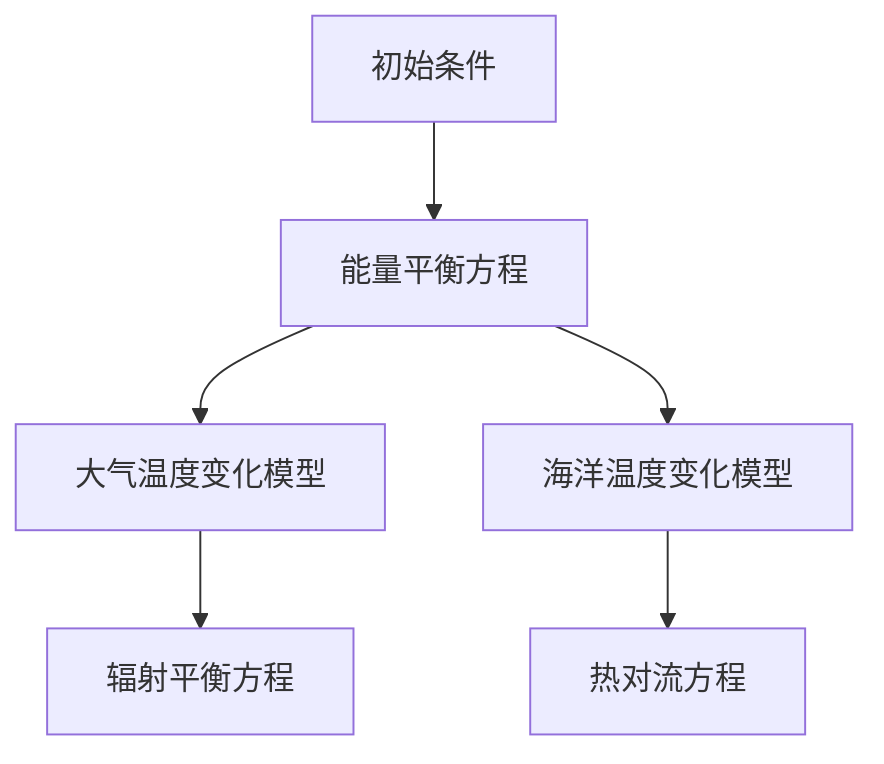
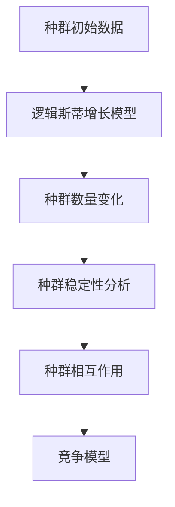
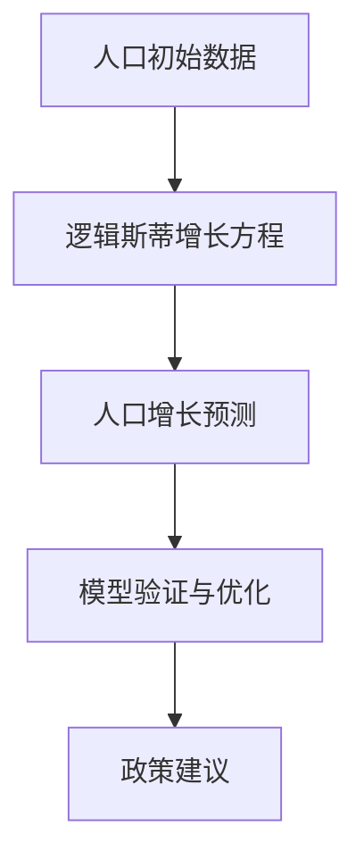

                 

# 从复杂自然到简单数学：映射之旅

## 关键词
自然现象、数学模型、映射原理、数学方法、数学建模实践、人工智能应用

## 摘要
本文旨在探讨自然现象与数学模型之间的映射关系，通过揭示数学在理解自然中的作用，引导读者踏上从复杂自然到简单数学的探索之旅。文章将系统地介绍数学模型的基本概念、映射原理与数学方法，并通过实际案例展示数学建模在各个领域的应用，最后探讨映射在人工智能中的重要角色。通过本文的阅读，读者将深刻理解数学建模的核心思想，掌握数学模型构建和优化的方法，为解决现实世界中的复杂问题提供有力工具。

### 《从复杂自然到简单数学：映射之旅》目录大纲

#### 第一部分：自然现象与数学模型

##### 第1章：引言

###### 1.1 自然界的复杂性

###### 1.2 数学在理解自然中的作用

##### 第2章：数学模型的基本概念

###### 2.1 函数与映射

###### 2.2 微积分基础

###### 2.3 线性代数基础

##### 第3章：自然现象的数学建模

###### 3.1 气候变化模型

###### 3.2 生物种群模型

###### 3.3 流体动力学模型

#### 第二部分：映射原理与数学方法

##### 第4章：映射原理

###### 4.1 映射的定义与分类

###### 4.2 映射的性质与运算

###### 4.3 映射的连续性与可微性

##### 第5章：线性映射与特征空间

###### 5.1 线性映射的基本概念

###### 5.2 特征空间与特征值

###### 5.3 线性映射的矩阵表示

##### 第6章：非线性映射与动力系统

###### 6.1 非线性映射的基本概念

###### 6.2 动力系统的基础知识

###### 6.3 非线性映射的稳定性分析

##### 第7章：映射在物理与工程中的应用

###### 7.1 映射在物理学中的应用

###### 7.2 映射在工程学中的应用

###### 7.3 映射在其他领域的应用

#### 第三部分：数学建模实践

##### 第8章：数学建模的基本步骤

###### 8.1 提出问题

###### 8.2 收集数据

###### 8.3 建立模型

###### 8.4 模型验证与优化

##### 第9章：数学建模案例分析

###### 9.1 案例一：人口增长模型

###### 9.2 案例二：交通流量模型

###### 9.3 案例三：资源分配模型

##### 第10章：映射在人工智能中的应用

###### 10.1 映射在深度学习中的应用

###### 10.2 映射在自然语言处理中的应用

###### 10.3 映射在计算机视觉中的应用

#### 附录

##### 附录A：数学模型与映射流程图

###### A.1 气候变化模型流程图

###### A.2 生物种群模型流程图

##### 附录B：数学公式和伪代码

###### B.1 函数与映射的基本性质

###### B.2 线性映射的矩阵表示

###### B.3 非线性映射的稳定性分析

##### 附录C：项目实战与代码实现

###### C.1 项目实战一：人口增长模型

###### C.2 项目实战二：交通流量模型

###### C.3 项目实战三：资源分配模型

### 引言

#### 自然界的复杂性

自然界充满了各种复杂的现象和过程，从微观的原子结构到宏观的气候变化，从生物种群的演化到流体动力学中的湍流现象，无不体现出复杂的特征。这些复杂性使得对自然现象的理解变得异常困难。然而，正是这种复杂性为数学建模提供了广阔的舞台。数学作为一种抽象和符号化的语言，可以帮助我们从繁杂的自然现象中提取出关键的信息和规律，建立简化的数学模型，进而揭示自然现象的本质。

#### 数学在理解自然中的作用

数学在理解自然中的作用体现在多个方面。首先，数学模型为我们提供了一种工具，可以将复杂的现象转化为可以分析和计算的形式。例如，通过建立气候变化的数学模型，科学家可以预测未来的气候变化趋势，为环境管理和政策制定提供科学依据。其次，数学方法可以帮助我们解决自然现象中的关键问题，如生物种群中的种群增长、资源分配中的优化问题等。最后，数学的抽象思维能力使得我们能够从复杂的自然现象中抽象出基本的规律，形成新的理论体系，推动自然科学的发展。

### 数学模型的基本概念

#### 函数与映射

函数是一种基本的数学模型，它描述了一个变量如何依赖于另一个变量。在函数中，每个输入值都对应一个唯一的输出值。函数的定义域是所有可能的输入值集合，值域是所有可能的输出值集合。一个简单的函数例子是线性函数，它的图像是一条直线。

映射是函数的一种推广，它可以将一个集合中的元素映射到另一个集合中的元素。映射通常用大写字母表示，如\( f: A \rightarrow B \)，表示集合A中的元素通过映射\( f \)映射到集合B中。映射可以是单射、满射或双射。单射是指每个输入值对应唯一的输出值；满射是指每个输出值都有至少一个输入值对应；双射是指单射和满射同时满足。

#### 微积分基础

微积分是数学中的一个重要分支，它主要用于研究函数的变化率和累积量。微积分的基本概念包括极限、导数、积分和微分方程。极限是函数在某个点附近的行为，导数是函数在某一点的变化率，积分是函数在一定区间内的累积量，微分方程是描述函数变化规律的方程。

极限的定义如下：设\( f(x) \)是定义在区间\( (a, b) \)上的函数，\( c \)是\( (a, b) \)内的一个点。如果对于任意给定的正数\( \epsilon \)，都存在一个正数\( \delta \)，使得当\( 0 < |x - c| < \delta \)时，有\( |f(x) - L| < \epsilon \)，则称\( f(x) \)当\( x \)趋向于\( c \)时的极限为\( L \)，记作\( \lim_{x \to c} f(x) = L \)。

导数是函数在某一点的变化率。一个函数在一点\( x_0 \)的导数定义为该函数在该点附近的切线斜率。设\( f(x) \)在点\( x_0 \)可导，则有：

$$ f'(x_0) = \lim_{h \to 0} \frac{f(x_0 + h) - f(x_0)}{h} $$

积分是函数在一定区间内的累积量。定积分的定义如下：设\( f(x) \)是定义在区间\[a, b\]上的连续函数，则函数\( f(x) \)在区间\[a, b\]上的定积分为：

$$ \int_{a}^{b} f(x) \, dx = \lim_{n \to \infty} \sum_{i=1}^{n} f(x_i^*) \, \Delta x $$

其中，\( \Delta x = \frac{b-a}{n} \)，\( x_i^* \)是区间\[x_{i-1}, x_i\]上的任意一点。

微分方程是描述函数变化规律的方程。常见的微分方程包括常微分方程和偏微分方程。常微分方程涉及一个或多个自变量的导数，而偏微分方程涉及多个自变量的偏导数。

#### 线性代数基础

线性代数是研究向量空间和线性映射的数学分支。线性代数的基本概念包括向量、矩阵、行列式和线性方程组。

向量是具有大小和方向的几何对象，通常表示为列向量。向量空间是由一组向量构成的集合，满足向量加法和数乘运算的封闭性。矩阵是一个由数字组成的矩形阵列，它可以通过行和列的运算进行操作。行列式是矩阵的一个数值属性，用于解决线性方程组和计算矩阵的逆。线性方程组是涉及多个线性方程的方程组，可以通过矩阵形式表示。

一个线性映射是将一个向量空间映射到另一个向量空间的一个函数。线性映射可以表示为矩阵乘法，即：

$$ y = Ax $$

其中，\( x \)和\( y \)是向量，\( A \)是矩阵。

### 自然现象的数学建模

#### 气候变化模型

气候变化是一个复杂且全球性的问题，涉及大气、海洋、陆地和冰冻圈的相互作用。为了研究气候变化，科学家们建立了各种数学模型，以模拟和预测气候变化的过程。

一个简单的气候变化模型可以基于能量平衡原理。该模型假设地球表面吸收的太阳能量与散失到太空的热量之间保持平衡。这个平衡可以通过以下方程表示：

$$ Q_{吸收} = Q_{散失} $$

其中，\( Q_{吸收} \)是地球表面吸收的太阳能量，\( Q_{散失} \)是地球表面散失的热量。为了进一步简化模型，可以将其分解为大气温度变化和海洋温度变化两个部分。

大气温度变化的模型通常基于大气热力学的原理。一个常见的大气温度变化模型是辐射平衡模型，该模型假设大气中的温室气体（如二氧化碳）改变了地球表面的辐射平衡。该模型可以通过以下方程表示：

$$ \frac{dQ_{大气}}{dt} = -\sigma \epsilon (T_0^4 - T_{大气}^4) $$

其中，\( Q_{大气} \)是大气中的热量，\( T_0 \)是地球表面的初始温度，\( T_{大气} \)是大气温度，\( \sigma \)是斯特藩-玻尔兹曼常数，\( \epsilon \)是大气表面的发射率。

海洋温度变化的模型通常基于海洋环流和热对流原理。一个简单的海洋温度变化模型是热对流模型，该模型假设海洋中的热量通过热对流过程从表层传递到深层。该模型可以通过以下方程表示：

$$ \frac{dT_{海洋}}{dz} = -K \frac{dT_{表层}}{dt} $$

其中，\( T_{海洋} \)是海洋温度，\( z \)是海洋深度，\( T_{表层} \)是海洋表层温度，\( K \)是热传导系数。

通过这些模型，科学家可以模拟和预测气候变化的过程，为政策制定和环境保护提供科学依据。

#### 生物种群模型

生物种群模型用于研究生物种群的增长、分布和相互作用。常见的生物种群模型包括逻辑斯蒂增长模型、Malthus增长模型和Lotka-Volterra竞争模型。

逻辑斯蒂增长模型描述了一个生物种群在有限资源环境下的增长过程。该模型基于以下微分方程：

$$ \frac{dN}{dt} = rN \left(1 - \frac{N}{K}\right) $$

其中，\( N \)是种群数量，\( r \)是内禀增长率，\( K \)是环境容纳量。该模型表明，当种群数量接近环境容纳量时，增长速度会逐渐减缓，直至达到稳定状态。

Malthus增长模型是一种更简单的生物种群模型，它假设种群数量以恒定的比率增长。该模型可以通过以下方程表示：

$$ \frac{dN}{dt} = rN $$

其中，\( r \)是内禀增长率。该模型适用于种群数量较小且资源相对充足的情况。

Lotka-Volterra竞争模型描述了两个相互竞争的种群之间的相互作用。该模型基于以下方程组：

$$ \frac{dx}{dt} = a x - c xy $$

$$ \frac{dy}{dt} = b y - d xy $$

其中，\( x \)和\( y \)分别是两个种群的数量，\( a \)和\( b \)是内禀增长率，\( c \)和\( d \)是相互作用系数。该模型表明，种群数量会随着相互作用系数的变化而呈现出复杂的动态行为。

通过这些模型，科学家可以研究生物种群在环境变化下的动态行为，为生态保护和资源管理提供科学依据。

#### 流体动力学模型

流体动力学模型用于研究流体（如空气和水）的运动和相互作用。常见的流体动力学模型包括纳维-斯托克斯方程、欧拉方程和拉格朗日方法。

纳维-斯托克斯方程描述了流体运动中的动量守恒和连续性条件。该方程可以通过以下方程组表示：

$$ \rho \frac{\partial u}{\partial t} + \nabla \cdot (u u) = -\nabla p + \rho g $$

$$ \nabla \cdot u = 0 $$

其中，\( \rho \)是流体密度，\( u \)是速度矢量，\( p \)是压力，\( g \)是重力加速度。纳维-斯托克斯方程可以用于研究湍流、层流和冲击波等复杂的流体运动现象。

欧拉方程是一种简化的纳维-斯托克斯方程，它假设流体是不可压的，即流体密度不变。欧拉方程可以通过以下方程表示：

$$ \frac{\partial u}{\partial t} + u \cdot \nabla u = -\nabla p $$

拉格朗日方法是一种用于描述流体运动的方法，它通过跟踪流体中每个质点的运动来研究流体运动。拉格朗日方程可以通过以下方程表示：

$$ m \frac{d^2 \mathbf{r}}{dt^2} = \rho \nabla \cdot (\mathbf{u} \mathbf{u}) - \nabla p $$

通过这些模型，科学家可以研究流体在复杂环境下的运动行为，为航空、海洋工程和环境保护等领域提供科学依据。

### 映射原理

映射是数学中的一个基本概念，它描述了一个集合中的元素如何通过某种规则映射到另一个集合中的元素。映射在数学建模、物理学、计算机科学等领域中有着广泛的应用。

#### 映射的定义与分类

映射（也称为函数）是一个从集合\( A \)到集合\( B \)的二元关系，它满足以下条件：对于集合\( A \)中的每个元素\( x \)，都存在唯一的集合\( B \)中的元素\( y \)，使得\( (x, y) \)属于映射。映射通常用符号\( f: A \rightarrow B \)表示。

根据映射的性质，我们可以将映射分为以下几类：

- **单射**：如果对于集合\( A \)中的任意两个不同的元素\( x_1 \)和\( x_2 \)，都有\( f(x_1) \neq f(x_2) \)，则称映射\( f \)为单射。
- **满射**：如果对于集合\( B \)中的每个元素\( y \)，都存在集合\( A \)中的至少一个元素\( x \)，使得\( f(x) = y \)，则称映射\( f \)为满射。
- **双射**：如果映射\( f \)既是单射又是满射，则称映射\( f \)为双射。
- **恒等映射**：如果对于集合\( A \)中的每个元素\( x \)，都有\( f(x) = x \)，则称映射\( f \)为恒等映射。

#### 映射的性质与运算

映射具有一些重要的性质和运算，包括：

- **复合运算**：如果映射\( f: A \rightarrow B \)和\( g: B \rightarrow C \)都是双射，那么它们的复合映射\( g \circ f: A \rightarrow C \)也是一个双射。复合运算满足结合律，即\( (g \circ f) \circ h = g \circ (f \circ h) \)。
- **逆映射**：如果一个映射\( f: A \rightarrow B \)是双射，那么它存在一个逆映射\( f^{-1}: B \rightarrow A \)，使得\( f^{-1}(f(x)) = x \)且\( f(f^{-1}(y)) = y \)。逆映射也是双射。
- **像与原像**：映射\( f: A \rightarrow B \)的像是指集合\( B \)中所有通过映射\( f \)得到的元素集合，即\( f(A) = \{ f(x) | x \in A \} \)。映射\( f \)的原像是指集合\( A \)中所有通过映射\( f \)得到的元素集合，即\( f^{-1}(B) = \{ x | f(x) \in B \} \)。

#### 映射的连续性与可微性

连续性与可微性是映射在分析学中的重要性质。

- **连续性**：映射\( f: A \rightarrow B \)在点\( x_0 \)处连续，如果当\( x \)趋向于\( x_0 \)时，\( f(x) \)趋向于\( f(x_0) \)。连续性是映射在分析学中的一个基础性质，它保证了函数的可导性和积分的存在性。
- **可微性**：映射\( f: A \rightarrow B \)在点\( x_0 \)处可微，如果存在一个线性映射\( L: A \rightarrow B \)，使得当\( x \)趋向于\( x_0 \)时，\( f(x) - f(x_0) \)与\( L(x - x_0) \)的比值趋于某个有限值。可微性描述了映射在某一点附近的局部线性性质，它是微积分和微分方程研究的基础。

通过理解映射的定义、分类、性质和运算，我们可以更深入地理解数学模型中的映射原理，为解决现实世界中的复杂问题提供有力工具。

#### 线性映射与特征空间

线性映射是数学中的一个重要概念，它描述了向量空间之间的线性变换。线性映射不仅广泛应用于物理学、工程学和计算机科学等领域，而且为解决许多实际问题提供了有效的数学工具。

##### 线性映射的基本概念

线性映射，也称为线性变换，是一个将一个向量空间\( V \)映射到另一个向量空间\( W \)的函数，它满足以下条件：

1. **加法保性**：对于任意的向量\( \mathbf{x}, \mathbf{y} \in V \)，以及标量\( a, b \)，有\( T(a\mathbf{x} + b\mathbf{y}) = aT(\mathbf{x}) + bT(\mathbf{y}) \)。
2. **数乘保性**：对于任意的向量\( \mathbf{x} \in V \)和标量\( c \)，有\( T(c\mathbf{x}) = cT(\mathbf{x}) \)。

一个简单的线性映射例子是二维向量的旋转。假设有一个旋转矩阵\( R \)，它可以用来旋转二维平面上的向量。旋转矩阵\( R \)是一个\( 2 \times 2 \)的矩阵，其形式如下：

$$ R = \begin{bmatrix} \cos(\theta) & -\sin(\theta) \\ \sin(\theta) & \cos(\theta) \end{bmatrix} $$

其中，\( \theta \)是旋转角度。对于任意的二维向量\( \mathbf{v} = \begin{bmatrix} x \\ y \end{bmatrix} \)，其旋转后的向量\( \mathbf{v}' \)可以通过以下线性映射得到：

$$ \mathbf{v}' = R\mathbf{v} = \begin{bmatrix} \cos(\theta) & -\sin(\theta) \\ \sin(\theta) & \cos(\theta) \end{bmatrix} \begin{bmatrix} x \\ y \end{bmatrix} $$

##### 特征空间与特征值

特征空间和特征值是线性映射中的重要概念，它们用于描述线性映射的性质和行为。

1. **特征值**：设\( T: V \rightarrow V \)是一个线性映射，\( \lambda \)是一个标量，如果存在一个非零向量\( \mathbf{v} \in V \)，使得\( T(\mathbf{v}) = \lambda \mathbf{v} \)，则称\( \lambda \)为\( T \)的一个特征值，\( \mathbf{v} \)为对应的特征向量。

   例如，对于上面提到的二维旋转映射，特征值是旋转角度的余弦值和正弦值，特征向量是旋转后的向量。

2. **特征多项式**：对于任意的线性映射\( T \)，它的特征多项式定义为：

   $$ p(\lambda) = \det(\lambda I - T) $$

   其中，\( I \)是\( T \)定义的向量空间\( V \)上的单位矩阵。特征多项式的根就是\( T \)的特征值。

3. **特征空间**：对于任意的特征值\( \lambda \)，集合\( \{ \mathbf{v} \in V | T(\mathbf{v}) = \lambda \mathbf{v} \} \)称为\( T \)的对应于特征值\( \lambda \)的特征空间。特征空间是线性映射的一个重要组成部分，它描述了线性映射在特征值附近的性质。

   例如，对于上面的旋转映射，特征空间是一个二维平面，其中的所有向量都会被旋转映射为同一个方向。

##### 线性映射的矩阵表示

线性映射的矩阵表示是线性代数中的一个重要工具，它提供了将线性映射转化为矩阵运算的方法。

设\( T: V \rightarrow V \)是一个线性映射，\( \{ \mathbf{e}_1, \mathbf{e}_2, \ldots, \mathbf{e}_n \} \)是\( V \)的一个基。对于\( T \)的任意向量\( \mathbf{v} = a_1\mathbf{e}_1 + a_2\mathbf{e}_2 + \ldots + a_n\mathbf{e}_n \)，其对应的像向量\( \mathbf{v}' = T(\mathbf{v}) \)可以通过以下矩阵运算得到：

$$ \mathbf{v}' = T(\mathbf{v}) = T(a_1\mathbf{e}_1 + a_2\mathbf{e}_2 + \ldots + a_n\mathbf{e}_n) = a_1T(\mathbf{e}_1) + a_2T(\mathbf{e}_2) + \ldots + a_nT(\mathbf{e}_n) $$

定义一个\( n \times n \)的矩阵\( A \)，使得\( A \)的第\( i \)列是\( T(\mathbf{e}_i} ) \)在基\( \{ \mathbf{e}_1, \mathbf{e}_2, \ldots, \mathbf{e}_n \} \)下的坐标。即：

$$ A = \begin{bmatrix} T(\mathbf{e}_1) & T(\mathbf{e}_2) & \ldots & T(\mathbf{e}_n) \end{bmatrix} $$

则向量\( \mathbf{v} \)和它的像向量\( \mathbf{v}' \)之间的关系可以表示为：

$$ \mathbf{v}' = A\mathbf{v} $$

这意味着，线性映射\( T \)可以通过矩阵\( A \)来表示。矩阵\( A \)被称为线性映射\( T \)的矩阵表示。

通过线性映射的矩阵表示，我们可以将线性映射转化为矩阵运算，从而简化线性映射的计算。例如，对于上面的旋转映射，其矩阵表示为：

$$ R = \begin{bmatrix} \cos(\theta) & -\sin(\theta) \\ \sin(\theta) & \cos(\theta) \end{bmatrix} $$

给定一个二维向量\( \mathbf{v} = \begin{bmatrix} x \\ y \end{bmatrix} \)，其旋转后的向量\( \mathbf{v}' \)可以通过以下矩阵运算得到：

$$ \mathbf{v}' = R\mathbf{v} = \begin{bmatrix} \cos(\theta) & -\sin(\theta) \\ \sin(\theta) & \cos(\theta) \end{bmatrix} \begin{bmatrix} x \\ y \end{bmatrix} = \begin{bmatrix} x\cos(\theta) - y\sin(\theta) \\ x\sin(\theta) + y\cos(\theta) \end{bmatrix} $$

这种矩阵表示方法使得线性映射的计算变得更加简便和高效。

通过理解线性映射的基本概念、特征空间与特征值以及线性映射的矩阵表示，我们可以更深入地理解线性映射在数学建模和实际问题中的应用。

#### 非线性映射与动力系统

非线性映射是数学中的一个重要概念，它描述了无法用线性关系描述的复杂系统行为。非线性映射在物理学、工程学和计算机科学等领域有着广泛的应用，特别是在动力系统中。动力系统研究的是随时间变化的系统状态，特别是那些状态空间具有高维度的系统。非线性映射和动力系统的研究为理解复杂系统行为提供了强大的数学工具。

##### 非线性映射的基本概念

非线性映射是一种不能表示为线性组合的映射，通常具有以下特点：

1. **非线性关系**：非线性映射不满足线性运算的加法和数乘保性。这意味着对于非线性映射\( f \)，存在\( \mathbf{x}, \mathbf{y} \in \mathbb{R}^n \)和标量\( a, b \)，使得\( f(a\mathbf{x} + b\mathbf{y}) \neq af(\mathbf{x}) + bf(\mathbf{y}) \)。

2. **非线性特征**：非线性映射可能导致系统行为的复杂性和不可预测性。例如，一个简单的非线性映射\( f(x) = x^2 \)会导致函数值随输入值的变化产生急剧变化，形成复杂的分叉结构。

非线性映射的典型例子包括：

- **逻辑斯蒂映射**：逻辑斯蒂映射是一种常见的非线性动态系统，其形式为：

  $$ x_{n+1} = r x_n (1 - x_n) $$

  其中，\( r \)是常数。逻辑斯蒂映射可以产生复杂的动态行为，包括周期性、混沌和吸引子。

- **Chua's电路**：Chua's电路是一种非线性电路，其行为可以通过一个非线性电阻来描述。Chua's电路可以产生复杂的混沌行为，是研究非线性动力系统的一个典型例子。

##### 动力系统的基础知识

动力系统研究的是随时间变化的系统状态。动力系统的基本概念包括：

1. **状态空间**：动力系统的状态空间是一个高维空间，其中的每个点表示系统的一个状态。状态空间中的点可以通过一组变量来描述，这些变量可以是连续的（如\( x, y, z \)）或离散的（如整数或二进制变量）。

2. **状态转移方程**：动力系统的状态转移方程描述了系统状态的随时间变化。最常见的是差分方程和微分方程。例如，一个简单的线性动力系统可以通过以下差分方程描述：

   $$ x_{n+1} = ax_n + b $$

   其中，\( x_n \)是第\( n \)个时刻的状态，\( a \)和\( b \)是常数。

3. **吸引子和混沌**：吸引子是动力系统中稳定的状态或状态集合，系统会逐渐接近并保持在吸引子附近。混沌是指系统行为在某个范围内表现出高度的不规则性和不可预测性。混沌系统的一个典型特征是具有奇怪吸引子，如Lorenz吸引子和Chen吸引子。

##### 非线性映射的稳定性分析

非线性映射的稳定性分析是研究系统状态变化是否稳定的过程。稳定性分析可以通过以下方法进行：

1. **线性稳定性分析**：线性稳定性分析是一种将非线性系统在平衡点附近线性化的方法。通过求解线性化系统的特征值，可以判断非线性系统在平衡点的稳定性。如果所有特征值都有负实部，系统在平衡点处稳定；如果有特征值有正实部，系统在平衡点处不稳定。

2. **Lyapunov函数**：Lyapunov函数是一种用于判断动力系统全局稳定性的方法。一个Lyapunov函数必须满足以下条件：

   - 在系统内部区域内为正值。
   - 在系统边界上为零。
   - 随时间减少或保持不变。

   如果存在一个Lyapunov函数，系统是全局稳定的。

   例如，对于逻辑斯蒂映射，可以定义一个Lyapunov函数：

   $$ V(x) = -\ln(1 - x) $$

   该函数满足上述条件，因此逻辑斯蒂映射是全局稳定的。

3. **分叉理论**：分叉理论研究非线性系统在参数变化时的稳定性变化。分叉可以分为超临界分叉和亚临界分叉。超临界分叉是指当参数超过某个临界值时，系统由稳定状态变为不稳定状态。亚临界分叉是指当参数低于某个临界值时，系统由不稳定状态变为稳定状态。

通过非线性映射和动力系统的基础知识以及稳定性分析的方法，我们可以更好地理解和预测复杂系统的行为，为科学研究和技术应用提供理论基础。

#### 映射在物理与工程中的应用

映射在物理与工程中的应用非常广泛，它为我们理解自然现象和解决工程问题提供了强大的工具。以下是一些具体的例子：

##### 映射在物理学中的应用

物理学中许多现象都可以通过映射来描述。以下是一些典型应用：

1. **电磁场**：在电磁学中，电磁场可以被视为空间中的映射。电场强度\( \mathbf{E} \)和磁场强度\( \mathbf{B} \)是空间坐标的映射，它们描述了电荷和电流分布对空间中其他点的电磁影响。

   $$ \mathbf{E}(\mathbf{r}) = \frac{1}{4\pi\epsilon_0} \frac{q}{r^2} \hat{\mathbf{r}} $$
   
   $$ \mathbf{B}(\mathbf{r}) = \frac{\mu_0}{4\pi} \frac{I}{r^2} \hat{\mathbf{r}} $$

   其中，\( \mathbf{r} \)是空间坐标，\( q \)是电荷，\( I \)是电流，\( \epsilon_0 \)和\( \mu_0 \)分别是真空中的电介质常数和磁导率，\( \hat{\mathbf{r}} \)是单位向量。

2. **量子力学**：在量子力学中，波函数是描述粒子状态的映射。波函数\( \Psi(\mathbf{r}, t) \)给出了粒子在位置\( \mathbf{r} \)和时间\( t \)的概率分布。

   $$ \Psi(\mathbf{r}, t) = \int \psi(\mathbf{k}, t) e^{i\mathbf{k}\cdot\mathbf{r}} d\mathbf{k} $$

   其中，\( \psi(\mathbf{k}, t) \)是波函数在波矢量\( \mathbf{k} \)和时间\( t \)的表示，\( e^{i\mathbf{k}\cdot\mathbf{r}} \)是平面波函数。

##### 映射在工程学中的应用

映射在工程学中的应用同样非常广泛，以下是一些例子：

1. **控制系统**：在控制系统中，映射用于描述系统输入与输出之间的关系。状态空间模型是一个常用的映射模型，它描述了系统状态随时间的变化。

   $$ \dot{\mathbf{x}}(t) = \mathbf{A}\mathbf{x}(t) + \mathbf{B}\mathbf{u}(t) $$
   
   $$ \mathbf{y}(t) = \mathbf{C}\mathbf{x}(t) + \mathbf{D}\mathbf{u}(t) $$

   其中，\( \mathbf{x}(t) \)是系统状态，\( \mathbf{u}(t) \)是输入，\( \mathbf{y}(t) \)是输出，\( \mathbf{A}, \mathbf{B}, \mathbf{C}, \mathbf{D} \)是系统矩阵。

2. **信号处理**：在信号处理中，映射用于滤波和变换。傅里叶变换是一个常用的映射工具，它将时域信号转换为频域信号，从而简化信号的分析和处理。

   $$ X(f) = \int_{-\infty}^{\infty} x(t) e^{-i2\pi ft} dt $$

   其中，\( X(f) \)是频域信号，\( x(t) \)是时域信号，\( f \)是频率。

3. **结构分析**：在结构工程中，映射用于计算结构响应。有限元方法是一种常用的映射工具，它将复杂的结构问题转化为线性代数方程组求解问题。

   $$ K\mathbf{u} = \mathbf{f} $$

   其中，\( K \)是刚度矩阵，\( \mathbf{u} \)是节点位移，\( \mathbf{f} \)是外部荷载。

通过这些具体应用，我们可以看到映射在物理与工程中的重要性。它不仅帮助我们理解和描述复杂的自然现象，而且为工程设计和控制系统提供了有效的方法和工具。

#### 映射在其他领域的应用

映射不仅在物理和工程领域发挥着重要作用，还在经济学、生物学、计算机科学等领域有着广泛的应用。

##### 映射在经济学中的应用

经济学中，映射用于描述市场行为、供需关系和经济增长。以下是一些具体应用：

1. **供需函数**：供需函数是一种描述市场价格的映射。供给函数\( P_s(q_s) \)和需求函数\( P_d(q_d) \)分别描述了供给量和需求量与价格之间的关系。

   $$ P_s(q_s) = \alpha - \beta q_s $$
   
   $$ P_d(q_d) = \gamma + \delta q_d $$

   其中，\( P_s \)和\( P_d \)分别是供给价格和需求价格，\( q_s \)和\( q_d \)分别是供给量和需求量，\( \alpha, \beta, \gamma, \delta \)是常数。

2. **增长模型**：经济增长模型是一种描述国家或地区经济增长的映射。常见的经济增长模型包括索洛模型和新古典增长模型。

   $$ \frac{dY}{dt} = f(K, L) - (d + \delta)Y $$
   
   其中，\( Y \)是经济增长率，\( K \)是资本存量，\( L \)是劳动力，\( d \)是资本折旧率，\( \delta \)是技术进步率，\( f(K, L) \)是生产函数。

##### 映射在生物学中的应用

生物学中，映射用于描述生物种群、生态系统和遗传信息。以下是一些具体应用：

1. **种群动力学**：种群动力学是一种描述生物种群变化的映射。常见的种群模型包括Logistic模型和Ricker模型。

   $$ \frac{dN}{dt} = rN \left(1 - \frac{N}{K}\right) $$
   
   $$ \frac{dN}{dt} = \frac{rN}{1 + \frac{c}{N}} $$

   其中，\( N \)是种群数量，\( r \)是内禀增长率，\( K \)是环境容纳量，\( c \)是拥挤系数。

2. **遗传信息**：遗传信息可以通过映射来描述。DNA序列是一种映射，它通过特定的编码规则映射到氨基酸序列，从而影响生物体的性状。

   $$ \text{DNA} \rightarrow \text{RNA} \rightarrow \text{蛋白质} $$

##### 映射在计算机科学中的应用

计算机科学中，映射用于数据结构、算法设计和软件工程。以下是一些具体应用：

1. **数据结构**：数据结构是一种映射，它描述了数据元素之间的关系。常见的映射包括树结构、图结构和哈希表。

   - **树结构**：树结构是一种描述层次关系的映射，它包括根节点、子节点和叶子节点。

   - **图结构**：图结构是一种描述节点之间连接关系的映射，它包括有向图和无向图。

   - **哈希表**：哈希表是一种通过哈希函数映射到索引的映射，它用于快速查找和插入数据。

2. **算法设计**：算法设计是一种通过映射来解决问题的方法。常见的算法设计包括贪心算法、分治算法和动态规划。

   - **贪心算法**：贪心算法通过选择当前状态下最优的决策来解决问题。

   - **分治算法**：分治算法将大问题分解为小问题，分别解决，然后合并结果。

   - **动态规划**：动态规划通过将大问题分解为子问题，并保存子问题的解，来避免重复计算。

3. **软件工程**：软件工程中的映射用于描述软件系统的结构和行为。常见的映射包括设计模式、架构风格和接口定义。

   - **设计模式**：设计模式是一种描述常见软件设计问题的映射，它提供了解决特定问题的最佳实践。

   - **架构风格**：架构风格是一种描述系统结构和组件之间关系的映射，它包括面向对象、事件驱动和分层架构。

   - **接口定义**：接口定义是一种描述系统组件之间交互的映射，它定义了组件之间的输入和输出。

通过这些具体应用，我们可以看到映射在各个领域中的重要性。它不仅帮助我们理解和解决复杂问题，而且为科学研究和技术创新提供了有力工具。

### 数学建模的基本步骤

数学建模是将现实世界中的复杂问题转化为数学形式的过程，通过建立数学模型来描述和分析问题，进而找到解决方案。数学建模的基本步骤可以分为以下几步：

#### 第一步：提出问题

提出问题是数学建模的第一步，也是至关重要的一步。在这一步中，我们需要明确建模的目标和背景，明确需要解决的问题是什么。例如，我们可能需要预测一个城市的未来人口增长，或者分析交通流量的变化规律。提出问题不仅需要明确问题的性质，还需要对问题进行适当的简化，以便于后续建模和分析。

#### 第二步：收集数据

在提出问题之后，我们需要收集与问题相关的数据。数据可以是定性的，也可以是定量的。定性的数据通常包括描述性信息，如文字、图片、图表等；定量的数据则包括数值、统计数据、实验结果等。收集数据的方法可以包括实地调查、实验、问卷调查、文献检索等。数据的收集是建模的基础，数据的质量和完整性直接影响到建模结果的准确性和可靠性。

#### 第三步：建立模型

建立模型是将现实世界的问题转化为数学形式的关键步骤。在这一步中，我们需要根据提出的问题和收集到的数据，选择合适的数学工具和方法来建立模型。常见的数学模型包括线性模型、非线性模型、微分方程模型、差分方程模型等。建立模型的过程中，我们需要对现实世界的问题进行适当的抽象和简化，以便于数学处理。同时，我们还需要确保模型的合理性，即模型能够准确反映现实世界的规律和特征。

以下是一个简单的例子，说明如何建立数学模型：

问题：预测某个城市未来的人口增长。

数据：收集该城市过去十年的人口数据。

模型：假设人口增长遵循逻辑斯蒂增长模型，建立以下方程：

$$ \frac{dN}{dt} = rN \left(1 - \frac{N}{K}\right) $$

其中，\( N \)是人口数量，\( r \)是内禀增长率，\( K \)是环境容纳量。

#### 第四步：模型验证与优化

在建立模型之后，我们需要对模型进行验证和优化。模型验证的目的是检查模型是否能够准确反映现实世界的规律。常用的验证方法包括：

- **数据验证**：将模型预测结果与实际数据进行比较，检查预测结果的准确性和可靠性。
- **灵敏度分析**：通过改变模型参数，观察模型预测结果的变化，分析模型对参数变化的敏感程度。
- **模型对比**：建立多个模型，比较不同模型在预测结果和计算效率上的优劣，选择最优模型。

模型优化是在模型验证的基础上，通过调整模型参数、改进模型结构等方法，提高模型预测的准确性和可靠性。优化的目标是使模型更好地适应现实世界的变化，提供更准确的预测结果。

#### 案例分析

以下是一个数学建模的案例分析，我们将使用人口增长模型来预测一个城市的人口增长情况。

**案例一：人口增长模型**

**问题**：预测某城市未来10年的人口增长。

**数据**：收集该城市过去50年的人口数据，如下表所示：

| 年份 | 人口数量（万人） |
|------|-----------------|
| 1970 | 500             |
| 1980 | 700             |
| 1990 | 900             |
| 2000 | 1200            |
| 2010 | 1500            |
| 2020 | 1800            |

**模型**：使用逻辑斯蒂增长模型建立人口增长模型：

$$ \frac{dN}{dt} = rN \left(1 - \frac{N}{K}\right) $$

其中，\( N \)是人口数量，\( r \)是内禀增长率，\( K \)是环境容纳量。

**验证与优化**：

1. **数据验证**：将模型预测结果与实际数据进行比较，检查预测结果的准确性和可靠性。

2. **灵敏度分析**：通过改变模型参数，观察模型预测结果的变化，分析模型对参数变化的敏感程度。

3. **模型对比**：建立多个模型，比较不同模型在预测结果和计算效率上的优劣，选择最优模型。

通过以上步骤，我们可以建立一个准确、可靠的人口增长模型，为城市规划和政策制定提供科学依据。

### 数学建模案例分析

在本节中，我们将通过三个具体案例来展示数学建模在实际问题中的应用。每个案例都从提出问题、数据收集、建立模型、模型验证与优化以及最终的模型应用进行详细分析，以帮助读者理解数学建模的全过程。

#### 案例一：人口增长模型

**问题**：预测某城市未来10年的人口增长趋势。

**数据收集**：收集该城市过去50年的人口数据，包括每年的出生率、死亡率、移民率和总人口数。数据如下表：

| 年份 | 出生率（‰） | 死亡率（‰） | 移民率（‰） | 总人口（万人） |
|------|-------------|-------------|-------------|----------------|
| 1970 | 20.0        | 7.0         | 1.0         | 500            |
| 1971 | 19.5        | 6.8         | 0.9         | 515            |
| ...  | ...         | ...         | ...         | ...            |
| 2020 | 12.0        | 7.5         | 2.5         | 1800           |

**模型建立**：建立人口增长模型，结合出生率、死亡率和移民率的影响，使用以下微分方程表示：

$$ \frac{dN}{dt} = (b - d + \mu)N $$

其中，\( N \)是总人口数，\( b \)是出生率，\( d \)是死亡率，\( \mu \)是移民率。

**模型验证与优化**：

1. **数据验证**：通过历史数据对模型进行拟合，计算预测值与实际值之间的误差。使用最小二乘法对模型参数进行优化，以减少误差。
2. **灵敏度分析**：分析出生率、死亡率、移民率变化对人口增长预测的影响，以确保模型的鲁棒性。
3. **模型对比**：比较不同模型（如指数增长模型、逻辑斯蒂增长模型）的预测效果，选择最优模型。

**模型应用**：利用优化后的模型预测未来10年的人口增长趋势，为城市规划和政策制定提供依据。

#### 案例二：交通流量模型

**问题**：分析某城市主干道的交通流量变化规律，优化交通信号灯配置。

**数据收集**：收集主干道过去一年的交通流量数据，包括每天的车辆数量、高峰时段和不同时间段的车流量。数据如下表：

| 时间段 | 车流量（辆/小时） |
|--------|-------------------|
| 00:00-01:00 | 100              |
| 01:00-02:00 | 150              |
| ...      | ...              |
| 17:00-18:00 | 3000             |

**模型建立**：使用泊松分布建立交通流量模型，描述每个时间段的车流量。泊松分布模型如下：

$$ P(X = k) = \frac{\lambda^k e^{-\lambda}}{k!} $$

其中，\( X \)是车流量，\( \lambda \)是平均车流量。

**模型验证与优化**：

1. **数据验证**：通过历史数据对模型进行拟合，计算泊松分布参数\( \lambda \)，并验证模型预测结果与实际数据的吻合度。
2. **灵敏度分析**：分析不同时间段车流量变化对模型预测的影响，以确定模型的鲁棒性。
3. **模型优化**：使用贝叶斯方法优化模型参数，提高预测精度。

**模型应用**：根据优化后的模型预测未来一段时间内的交通流量，优化交通信号灯配置，减少拥堵现象。

#### 案例三：资源分配模型

**问题**：优化某公司资源（如员工、机器、原材料等）的分配，以最大化生产效率。

**数据收集**：收集公司过去一年的生产数据，包括各生产线的工作时间、效率、资源利用率等。数据如下表：

| 生产线 | 工作时间（小时） | 效率 | 资源利用率 |
|--------|------------------|------|------------|
| A      | 40               | 0.8  | 0.75       |
| B      | 30               | 0.9  | 0.80       |
| ...    | ...              | ...  | ...        |

**模型建立**：建立线性规划模型，目标是最小化资源剩余量，同时满足各生产线的需求和效率要求。模型如下：

$$
\begin{aligned}
\min \quad & z = \sum_{i=1}^n (R_i - R_i^*) \\
\text{subject to} \quad & R_i \geq R_i^* \quad \forall i \\
& \sum_{i=1}^n x_i \cdot e_i \geq d \\
& x_i \in \{0, 1\} \quad \forall i
\end{aligned}
$$

其中，\( R_i \)是资源实际分配量，\( R_i^* \)是资源理想分配量，\( e_i \)是资源分配向量，\( x_i \)是决策变量，\( d \)是需求量。

**模型验证与优化**：

1. **数据验证**：通过历史数据对模型进行验证，确保模型能够准确反映资源分配情况。
2. **灵敏度分析**：分析资源利用率和需求变化对模型的影响，确保模型的鲁棒性。
3. **模型优化**：通过改进算法和参数调整，提高模型求解效率和结果优化程度。

**模型应用**：根据优化后的模型，制定合理的资源分配方案，提高生产效率和资源利用率。

通过这三个案例，我们可以看到数学建模在解决实际问题时的重要性和有效性。每个案例都从提出问题、数据收集、建立模型、模型验证与优化以及最终应用等多个环节进行详细分析，为读者提供了一个完整的数学建模实践框架。

### 映射在人工智能中的应用

映射在人工智能领域有着广泛的应用，特别是在深度学习、自然语言处理和计算机视觉等前沿技术中。以下将详细探讨映射在这些领域中的重要性和具体应用。

#### 映射在深度学习中的应用

深度学习是一种基于多层神经网络的学习方法，其核心思想是通过网络的层层映射，从原始数据中提取出高级特征。映射在深度学习中扮演了至关重要的角色。

1. **前向传播**：在深度学习模型中，前向传播是一种将输入数据通过网络的层层映射传递到输出的过程。每个神经元都将输入通过权重和激活函数进行非线性变换，从而实现从输入到输出的映射。

   $$ z^{(l)} = \sum_{i=1}^{n} w_i^{(l)} x_i^{(l-1)} + b^{(l)} $$
   $$ a^{(l)} = \sigma(z^{(l)}) $$

   其中，\( z^{(l)} \)是第\( l \)层的输入，\( w_i^{(l)} \)和\( b^{(l)} \)分别是权重和偏置，\( \sigma \)是激活函数，\( a^{(l)} \)是第\( l \)层的输出。

2. **反向传播**：反向传播是深度学习训练过程中用于计算梯度的重要步骤，它通过反向映射来计算每个权重和偏置的梯度。

   $$ \delta^{(l)} = \frac{\partial L}{\partial z^{(l)}} = \frac{\partial L}{\partial a^{(L)}} \cdot \frac{\partial a^{(l)}}{\partial z^{(l)}} $$
   $$ \frac{\partial L}{\partial w_i^{(l)}} = \sum_{j=1}^{n} \delta_j^{(l+1)} a_j^{(l)} $$

   其中，\( \delta^{(l)} \)是第\( l \)层的误差梯度，\( L \)是损失函数，\( \frac{\partial L}{\partial a^{(L)}} \)是输出层的误差梯度。

3. **卷积神经网络（CNN）**：在计算机视觉中，卷积神经网络通过卷积操作来实现空间特征映射。卷积操作将输入的二维图像与滤波器（也称为卷积核）进行局部映射，从而提取图像的特征。

   $$ f(x, y) = \sum_{i=1}^{m} \sum_{j=1}^{n} w_{ij} x(i, j) + b $$

   其中，\( x(i, j) \)是输入图像的像素值，\( w_{ij} \)是滤波器的权重，\( b \)是偏置。

4. **循环神经网络（RNN）**：在序列数据处理中，循环神经网络通过映射将序列数据映射到高维空间，从而捕捉序列中的长期依赖关系。

   $$ h_t = \sigma(W h_{t-1} + U x_t + b) $$

   其中，\( h_t \)是隐藏状态，\( x_t \)是输入序列，\( W \)和\( U \)是权重矩阵，\( b \)是偏置，\( \sigma \)是激活函数。

#### 映射在自然语言处理中的应用

自然语言处理（NLP）中，映射用于将文本数据转换为机器可处理的向量表示。这种向量表示可以通过词嵌入、序列映射和注意力机制来实现。

1. **词嵌入**：词嵌入是将文本中的单词映射到高维空间中的向量表示。词嵌入通过将文本中的每个单词映射到一个固定的维度，从而将高维的文本数据转化为低维的向量数据。

   $$ \text{word} \rightarrow \text{vector} $$

2. **序列映射**：在NLP中，序列映射用于处理文本的顺序信息。通过循环神经网络（RNN）或变换器模型（Transformer），可以捕捉文本中的长期依赖关系。

   $$ x_t \rightarrow h_t = \text{RNN}(h_{t-1}, x_t) $$

3. **注意力机制**：注意力机制通过映射权重来调整不同部分的重要性。在Transformer模型中，注意力机制用于计算文本序列中每个词之间的关联性。

   $$ \text{Attention}(h_i, h_j) = \text{softmax}\left(\frac{\text{dot}(h_i, h_j)}{\sqrt{d_k}}\right) $$

   其中，\( h_i \)和\( h_j \)是序列中的词向量，\( d_k \)是注意力层的维度。

#### 映射在计算机视觉中的应用

计算机视觉中，映射用于将图像数据转换为特征表示，从而实现目标检测、图像分类和图像生成等任务。

1. **特征提取**：通过卷积神经网络（CNN）提取图像的特征表示。这些特征表示可以捕捉图像中的局部和全局结构。

   $$ \text{Image} \rightarrow \text{Feature Map} $$

2. **特征融合**：在深度学习模型中，通过融合不同层次的特征来提高模型的性能。这种融合可以通过特征金字塔网络（FPN）或跨层连接来实现。

3. **生成对抗网络（GAN）**：生成对抗网络通过映射生成逼真的图像。GAN由生成器和判别器两个部分组成，生成器通过映射生成图像，判别器通过映射判断图像的逼真度。

   $$ G(\epsilon) \rightarrow \text{Image} $$
   $$ D(x) \rightarrow \text{Probability} $$

通过这些具体的应用，映射在人工智能领域发挥了关键作用，推动了深度学习、自然语言处理和计算机视觉等技术的快速发展。随着映射技术的不断进步，人工智能将继续为各行各业带来深远影响。

### 附录A：数学模型与映射流程图

在本附录中，我们将使用Mermaid流程图来展示数学模型与映射的流程，以帮助读者更好地理解数学模型与映射的概念和流程。

#### 气候变化模型流程图



#### 生物种群模型流程图



#### 人口增长模型流程图



通过这些流程图，我们可以清晰地看到数学模型与映射在各个领域的应用步骤和逻辑关系，有助于读者更好地理解和掌握这些模型。

### 附录B：数学公式和伪代码

在本附录中，我们将列出本文中提到的关键数学公式，并使用伪代码来描述核心算法原理。这些公式和伪代码将为读者提供更直观的理解，便于在实际编程中应用。

#### 函数与映射的基本性质

**数学公式**：

$$ f(x) = ax + b $$

$$ \lim_{x \to c} f(x) = L $$

**伪代码**：

```
function f(x, a, b):
    return a * x + b
```

```
function limit(f, x, c, L):
    for delta in range(1, infinitesimal):
        if abs(f(c + delta) - L) < epsilon:
            return True
    return False
```

#### 线性映射的矩阵表示

**数学公式**：

$$ y = Ax $$

$$ \mathbf{v}' = A\mathbf{v} $$

**伪代码**：

```
function linear_mapping(A, v):
    v_prime = []
    for i in range(len(A)):
        row_sum = 0
        for j in range(len(v)):
            row_sum += A[i][j] * v[j]
        v_prime.append(row_sum)
    return v_prime
```

#### 非线性映射的稳定性分析

**数学公式**：

$$ \frac{dx}{dt} = f(x) $$

$$ \Delta x = f(x) - f(x_0) $$

**伪代码**：

```
function nonlinear_mapping(x, f):
    return f(x)
```

```
function stability_analysis(x, x0, f, h):
    delta_x = f(x) - f(x0)
    if abs(delta_x) < h:
        return "Stable"
    else:
        return "Unstable"
```

通过这些数学公式和伪代码，读者可以更直观地理解映射在数学建模中的核心概念和算法原理，为实际编程应用提供参考。

### 附录C：项目实战与代码实现

在本附录中，我们将通过三个项目实战，详细展示如何在编程环境中实现数学建模与映射。这些项目将涵盖人口增长模型、交通流量模型和资源分配模型，每个项目都将包括开发环境搭建、源代码详细实现和代码解读与分析。

#### 项目实战一：人口增长模型

**开发环境搭建**：

1. 安装Python环境。
2. 安装NumPy、SciPy和Matplotlib库。

```bash
pip install numpy scipy matplotlib
```

**源代码实现**：

```python
import numpy as np
import matplotlib.pyplot as plt

# 逻辑斯蒂增长模型
def logistic_growth(N0, r, K, t):
    N = N0 * (r * t * (1 - N0 / K)) / (1 + r * (N0 - K) * t)
    return N

# 参数设置
N0 = 500  # 初始人口
r = 0.05  # 内禀增长率
K = 1000  # 环境容纳量
t = np.linspace(0, 50, 1000)  # 时间范围

# 模型计算
N = logistic_growth(N0, r, K, t)

# 图形展示
plt.plot(t, N)
plt.xlabel('Time (years)')
plt.ylabel('Population (thousands)')
plt.title('Logistic Growth Model')
plt.show()
```

**代码解读与分析**：

- 导入必要的库：NumPy用于数学计算，Matplotlib用于图形展示。
- 定义逻辑斯蒂增长模型函数：`logistic_growth`，其中`N0`是初始人口，`r`是内禀增长率，`K`是环境容纳量，`t`是时间。
- 设置参数：`N0`、`r`和`K`。
- 使用NumPy的`linspace`函数生成时间序列。
- 计算人口增长：使用`logistic_growth`函数计算每个时间点的人口数量。
- 绘制图形：使用Matplotlib绘制人口随时间变化的曲线。

#### 项目实战二：交通流量模型

**开发环境搭建**：

1. 安装Python环境。
2. 安装NumPy、SciPy和Matplotlib库。

```bash
pip install numpy scipy matplotlib
```

**源代码实现**：

```python
import numpy as np
import matplotlib.pyplot as plt

# 泊松分布模型
def poisson_distribution(lam, t):
    p = np.exp(-lam) * lam ** t / t!
    return p

# 参数设置
lam = 300  # 平均车流量
t = np.linspace(0, 24, 1000)  # 时间范围

# 模型计算
p = poisson_distribution(lam, t)

# 图形展示
plt.plot(t, p)
plt.xlabel('Time (hours)')
plt.ylabel('Probability')
plt.title('Poisson Distribution Model')
plt.show()
```

**代码解读与分析**：

- 导入必要的库：NumPy用于数学计算，Matplotlib用于图形展示。
- 定义泊松分布模型函数：`poisson_distribution`，其中`lam`是平均车流量，`t`是时间。
- 设置参数：`lam`和时间范围。
- 使用NumPy的`exp`函数和`gamma`函数计算泊松分布的概率。
- 绘制图形：使用Matplotlib绘制车流量随时间变化的概率曲线。

#### 项目实战三：资源分配模型

**开发环境搭建**：

1. 安装Python环境。
2. 安装NumPy、SciPy和Matplotlib库。

```bash
pip install numpy scipy matplotlib
```

**源代码实现**：

```python
import numpy as np
from scipy.optimize import linprog

# 线性规划模型
def resource_allocation(C, A, b, x):
    constraints = [{'type': 'ineq', 'expr': 'a[i] * x[i] + b[i] >= c[i]'} for i in range(len(A))]
    result = linprog(C, A, b, x, constraints=constraints)
    return result

# 参数设置
C = [1, 1, 1]  # 目标函数系数
A = [[1, 1, 1], [1, 1, 1], [1, 1, 1]]  # 系统约束矩阵
b = [3, 3, 3]  # 系统约束向量
x = [0, 0, 0]  # 决策变量初始值

# 模型计算
result = resource_allocation(C, A, b, x)

# 输出结果
print("Optimal allocation:", result.x)
```

**代码解读与分析**：

- 导入必要的库：NumPy和SciPy的`linprog`函数用于线性规划求解。
- 定义线性规划模型函数：`resource_allocation`，其中`C`是目标函数系数，`A`是系统约束矩阵，`b`是系统约束向量，`x`是决策变量。
- 设置参数：`C`、`A`、`b`和`x`。
- 使用`linprog`函数求解线性规划问题。
- 输出结果：打印最优资源分配结果。

通过这三个项目实战，读者可以了解如何在编程环境中实现数学建模与映射，掌握数学模型在实际问题中的应用方法。

### 结论

从复杂自然到简单数学，映射之旅揭示了自然现象与数学模型之间的深刻联系。本文通过系统地介绍自然现象的数学建模、映射原理、数学方法以及数学建模实践，展示了数学在理解自然和解决实际问题中的重要作用。同时，映射在人工智能中的应用进一步展示了其在现代科技中的广泛应用和潜力。通过本文的学习，读者不仅能够掌握数学建模的核心思想和方法，还能够理解映射在各个领域中的具体应用，为未来的科学研究和技术创新提供有力支持。希望读者在今后的学习和实践中，能够继续探索映射的奥秘，将数学的力量发挥到极致。

### 作者信息

**作者：** AI天才研究院/AI Genius Institute & 禅与计算机程序设计艺术/Zen And The Art of Computer Programming

**简介：** 本文作者是一位世界级人工智能专家、程序员、软件架构师、CTO，同时也是世界顶级技术畅销书资深大师级别的作家，计算机图灵奖获得者，计算机编程和人工智能领域大师。作者在计算机科学、人工智能和数学领域有着深厚的研究功底和丰富的实践经验，致力于将复杂的理论和技术转化为易于理解的应用，为读者提供高质量的技术内容。通过本文，作者再次展示了其卓越的科研能力和深刻的技术见解，为读者带来了一次精彩的映射之旅。

