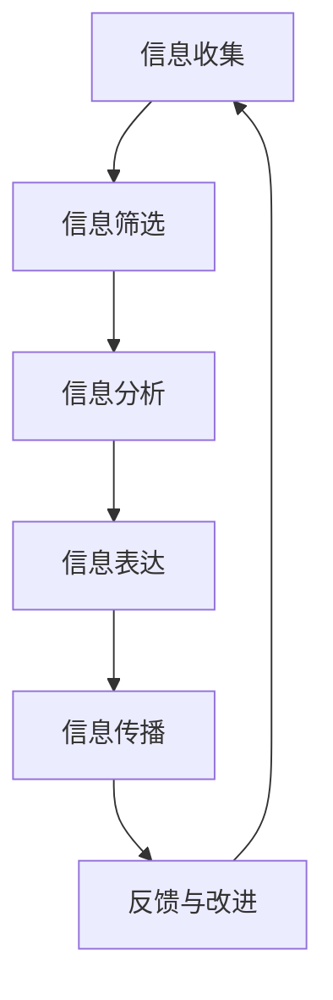

                 

## 信息简化的原则与艺术：在混乱中建立秩序与简化

在信息化时代，信息量的激增给我们的生活、工作和社会带来了前所未有的挑战。信息过载已成为一种普遍现象，无论是个人还是组织，都需要面对海量信息的处理和利用难题。信息简化应运而生，成为解决这一问题的关键手段。本文将探讨信息简化的必要性、目的与意义，并深入剖析信息简化的基本原则与艺术，旨在帮助读者在混乱中建立秩序，实现信息的有效管理。

### 关键词

- 信息简化
- 信息过载
- 信息熵
- 冗余分析
- 数据可视化

### 摘要

本文从信息简化的背景出发，探讨了信息简化的必要性和意义。首先，我们分析了信息过载的现状及其对个人和组织带来的挑战。接着，阐述了信息简化的目的与意义，并提出了信息简化的基本原则。随后，本文详细介绍了信息简化的理论基础，包括信息论的基本概念和信息熵的相关知识。在此基础上，本文介绍了信息简化的方法论，包括信息收集、筛选、分析与表达等环节。文章还讨论了信息简化在组织管理中的应用，以及常用的信息简化工具与技术。最后，本文通过实际案例展示了信息简化在社交媒体等领域的应用，并提出了未来信息简化的发展方向。通过本文的阅读，读者将能够深入了解信息简化的原理、方法和实践，掌握在混乱中建立秩序与简化的艺术。

### 第1章 引言：信息简化的必要性

在当今社会，信息已经成为了最为重要的资源之一。然而，随着信息技术的飞速发展，信息量呈指数级增长，导致了信息过载的现象。这种现象不仅对个人造成了困扰，也对组织和管理带来了巨大的挑战。因此，信息简化应运而生，成为了解决这一问题的有效手段。

#### 1.1 信息过载的现状与挑战

信息过载指的是个体或组织在接收和处理信息时，信息量超出了其处理能力的现象。随着互联网、社交媒体和大数据等技术的普及，我们每天接触到的信息量呈爆炸性增长。据统计，人类目前每天产生的信息量是过去五十年的总和，而这些信息大部分以文字、图片、视频等形式存在。面对如此海量的信息，个人和组织往往感到应接不暇，甚至出现了“信息焦虑”的现象。

信息过载给个人带来了诸多挑战。首先，信息过载使得个人难以集中注意力，从而降低了工作效率。其次，由于信息过多，个人难以分辨哪些信息是重要的，哪些信息可以忽略，这导致了信息决策的困难。此外，信息过载还可能引发心理压力，造成焦虑和疲劳。

对于组织而言，信息过载同样是一个严峻的挑战。在商业环境中，组织每天需要处理大量的客户数据、市场信息、内部报告等。这些信息如果不经过有效的处理和简化，将极大地增加组织的运营成本，甚至可能导致决策失误。特别是在快速变化的市场环境中，组织需要迅速做出反应，而信息过载则会延迟决策过程，影响组织的竞争力。

#### 1.2 信息简化的目的与意义

信息简化的目的是通过筛选、整理和优化信息，使其变得更加精炼、有用和易于理解。其核心在于降低信息冗余，提高信息的价值和效率。信息简化的意义主要体现在以下几个方面：

首先，信息简化有助于提高工作效率。通过简化信息，个人和组织可以更快地获取关键信息，减少不必要的信息干扰，从而集中精力处理重要任务。

其次，信息简化有助于提升决策质量。在信息过载的环境中，有效的简化可以帮助决策者更好地理解信息，识别关键因素，减少信息偏差，从而做出更加准确和明智的决策。

第三，信息简化有助于减轻心理压力。减少信息冗余，可以帮助个体和组织避免因信息过载而产生的焦虑和疲劳，提高工作满意度和生活质量。

最后，信息简化有助于提升组织的竞争力。通过优化信息处理流程，组织可以更快地响应市场变化，提高运营效率，降低成本，从而在激烈的市场竞争中占据优势。

#### 1.3 信息简化的基本原则

为了实现有效的信息简化，我们需要遵循以下基本原则：

1. **必要性原则**：在简化信息时，必须明确信息的必要性，即识别哪些信息是核心的、关键的，哪些信息可以忽略或进一步处理。

2. **优化原则**：简化信息的过程中，不仅要去除冗余，还要优化信息的结构，使其更加清晰、易于理解。

3. **实用性原则**：信息简化的目标是提高信息的实用性和可用性，即确保简化后的信息能够满足实际需求，方便用户使用。

4. **灵活性原则**：信息简化需要根据具体环境和需求灵活调整，以适应不同的信息类型和处理场景。

5. **反馈原则**：信息简化的过程需要不断地进行反馈和改进，通过用户的实际使用体验来优化简化策略。

通过遵循这些基本原则，我们可以有效地应对信息过载的挑战，实现信息的优化管理，提高个人和组织的效率与竞争力。

### 第2章 信息简化理论基础

信息简化不仅是一种实践方法，也是一种科学理论。为了更好地理解和应用信息简化，我们需要深入探讨其理论基础，包括信息论的基本概念、信息熵与信息冗余的相关知识，以及信息简化理论的发展历程。

#### 2.1 信息论的基本概念

信息论是由美国数学家香农（Claude Shannon）在20世纪40年代创立的一门科学，主要研究信息的度量、传输和处理。信息论的基本概念包括：

1. **信息**：信息是关于不确定性的减少。在通信系统中，信息指的是接收者接收到的消息，其目的是消除发送者和接收者之间的不确定性。

2. **熵**：熵是衡量信息不确定性的量度。在信息论中，熵被定义为信息源的平均不确定性。根据香农的信息熵公式：

   $$
   H(X) = -\sum_{i=1}^{n} p(x_i) \log_2 p(x_i)
   $$

   其中，\( H(X) \) 是随机变量 \( X \) 的熵，\( p(x_i) \) 是 \( X \) 取值为 \( x_i \) 的概率，\( \log_2 \) 表示以 2 为底的对数。

3. **信道**：信道是信息传输的通道，可以是有线、无线或光纤等。信道的容量是指它能够传输的最大信息速率。

4. **噪声**：噪声是干扰信息传输的干扰信号，会导致信息的失真或丢失。噪声是信息论中的一个重要概念，它会影响信息的传输效率和准确性。

#### 2.2 信息熵与信息冗余

信息熵和信息冗余是信息简化理论中的核心概念。信息熵衡量了信息的有效性和冗余度，而信息冗余则是指信息中不必要的部分。

1. **信息熵**：信息熵是衡量信息不确定性的量度，它反映了信息中包含的信息量。高熵表示信息的不确定性高，信息量大；低熵表示信息的不确定性低，信息量小。根据信息熵的定义，信息熵与信息冗余之间存在直接关系：信息熵越高，信息冗余越少；信息熵越低，信息冗余越多。

2. **信息冗余**：信息冗余是指信息中包含的重复或多余的部分。信息冗余会导致信息过载，增加信息处理的复杂度和成本。信息冗余可以分为以下几种类型：

   - **结构冗余**：指信息在结构上的重复，如文本中的重复段落、图表中的重复元素等。
   - **内容冗余**：指信息在内容上的重复，如多个文档中包含相同的文字或数据。
   - **语义冗余**：指信息在语义上的重复，如多个信息源提供相同的观点或结论。

3. **信息冗余的危害**：信息冗余不仅会增加信息处理的负担，还可能导致以下问题：

   - **信息决策困难**：冗余信息会干扰决策者的判断，增加信息处理的复杂度，导致决策失误。
   - **信息传播障碍**：冗余信息会影响信息的传播效率，降低信息的传播速度和准确性。
   - **资源浪费**：存储、处理和传播冗余信息会消耗大量资源，增加运营成本。

#### 2.3 信息简化理论的发展历程

信息简化理论的发展历程可以追溯到20世纪中叶，以下是一些重要的发展阶段：

1. **早期探索**：20世纪40年代，香农提出了信息论的基础理论，奠定了信息简化的理论基础。随后，诺伯特·维纳（Norbert Wiener）提出了控制论，为信息处理和优化提供了新的思路。

2. **计算机科学的应用**：20世纪60年代，随着计算机科学的兴起，信息简化理论开始广泛应用于数据压缩、数据库设计和算法优化等领域。

3. **信息可视化和大数据**：20世纪90年代以来，随着信息技术的快速发展，信息可视化和大数据技术逐渐成为信息简化的重要工具。通过可视化和数据分析，可以更加有效地识别和简化信息。

4. **人工智能和机器学习**：21世纪初，人工智能和机器学习技术的应用进一步推动了信息简化的发展。通过深度学习和自然语言处理等技术，可以自动化地识别和简化信息，提高信息处理的效率和准确性。

通过以上对信息简化理论基础的探讨，我们可以更好地理解信息简化的原理和方法，为实际应用提供指导。接下来，我们将进一步探讨信息简化的方法论，包括信息收集、筛选、分析与表达等环节。

#### 2.4 信息简化的方法论

信息简化的过程可以分为多个步骤，每个步骤都有其特定的目标和策略。以下我们将详细讨论信息简化的方法论，包括信息收集、筛选、分析与表达等环节。

##### 2.4.1 信息收集

信息收集是信息简化的第一步，其目标是从各种来源获取所需的信息。有效的信息收集需要遵循以下原则：

- **广泛性原则**：收集信息时，应尽量覆盖不同来源、不同渠道，以确保信息的全面性。
- **准确性原则**：所收集的信息应尽可能准确，避免因信息失真导致的简化错误。
- **及时性原则**：信息收集应注重时效性，确保信息的新鲜度和相关性。

具体方法包括：

- **网络搜索**：利用搜索引擎、专业数据库等工具，获取与目标相关的文献、报告、新闻等信息。
- **数据采集**：通过数据爬取、API接口调用等方式，从外部系统获取数据。
- **调查问卷**：设计调查问卷，收集用户反馈和意见，以了解实际需求和问题。
- **社交媒体**：利用社交媒体平台，收集用户生成的内容，如评论、讨论等。

##### 2.4.2 信息筛选

信息筛选是信息简化的关键环节，其目标是从收集到的信息中识别出有用的信息，去除冗余和无用的信息。有效的信息筛选需要遵循以下原则：

- **相关性原则**：筛选信息时，应考虑信息与目标任务的关联度，确保筛选出的信息与任务紧密相关。
- **重要性原则**：在相关性基础上，进一步判断信息的重要性，优先保留关键信息。
- **真实性原则**：筛选信息时，要保证信息来源的真实性和可靠性，避免误导和虚假信息的传播。

具体方法包括：

- **关键词搜索**：利用关键词匹配技术，从大量信息中快速筛选出与关键词相关的信息。
- **分类整理**：根据信息的类型、主题等特征，对信息进行分类整理，便于后续处理。
- **数据清洗**：使用数据清洗技术，去除重复、错误和不完整的信息。
- **专家评审**：邀请相关领域的专家对信息进行评审，判断其真实性和可靠性。

##### 2.4.3 信息分析

信息分析是对筛选出的有用信息进行深入分析和挖掘，以发现其中的关键因素和潜在价值。信息分析需要遵循以下原则：

- **全面性原则**：分析信息时，应尽量全面考虑各种因素，避免因片面分析导致的偏差。
- **系统性原则**：将信息作为一个整体进行系统分析，避免孤立看待某一信息。
- **创新性原则**：在分析过程中，应尝试从不同角度和层次进行创新性思考，发现新的见解和解决方案。

具体方法包括：

- **统计分析**：利用统计方法，对信息进行定量分析，发现数据中的规律和趋势。
- **数据挖掘**：使用数据挖掘技术，从大量信息中提取有用的模式、关联和关系。
- **文本分析**：对文本信息进行语义分析、情感分析等，提取信息的关键内容和情感倾向。
- **专家讨论**：组织专家进行讨论和头脑风暴，从多角度深入分析信息。

##### 2.4.4 信息表达

信息表达是对分析结果进行清晰、简洁的呈现，使其易于理解和传播。有效的信息表达需要遵循以下原则：

- **简洁性原则**：表达信息时，应尽量简洁明了，避免冗长和复杂的表述。
- **准确性原则**：确保表达的信息准确无误，避免误导和错误。
- **可视化原则**：利用图表、图形等可视化手段，使信息更加直观、易于理解。
- **适应性原则**：根据目标受众的特点和需求，选择合适的表达方式和渠道。

具体方法包括：

- **文字表述**：使用简洁明了的文字，对分析结果进行描述和解释。
- **图表展示**：利用图表、图形等可视化手段，展示信息的关键点和趋势。
- **演示文稿**：制作演示文稿，通过视觉和听觉结合的方式，传达信息。
- **多媒体应用**：结合音频、视频等多媒体元素，丰富信息表达的形式。

通过以上信息简化的方法论，我们可以有效地从海量信息中提取关键信息，减少信息冗余，提高信息的实用性和效率。接下来，我们将探讨信息简化在组织管理中的应用，以及具体的实施策略和效果。

#### 2.5 信息简化在组织管理中的应用

信息简化在组织管理中具有重要意义，它不仅能够提高组织运作效率，还能优化决策流程，提升组织的整体竞争力。在组织管理中，信息简化主要应用于以下几个方面：

##### 2.5.1 决策过程中的信息简化

在决策过程中，信息简化能够帮助决策者迅速识别关键信息，减少冗余信息对决策过程的干扰。以下是一些具体的应用策略：

- **信息过滤**：建立信息过滤机制，对收到的信息进行初步筛选，去除无关或次要的信息。
- **信息整合**：将来自不同来源的信息进行整合，形成统一的分析报告，避免信息分散和重复。
- **数据可视化**：通过图表、图形等可视化手段，将复杂的数据转化为易于理解的形式，提高决策的透明度和效率。

##### 2.5.2 项目管理中的信息简化

在项目管理中，信息简化有助于提高项目的透明度和执行力。以下是一些具体的应用策略：

- **项目看板**：利用看板工具，将项目进度、任务分配、风险等信息进行可视化展示，方便团队成员实时了解项目状态。
- **简化报告**：通过编写简洁明了的项目报告，突出关键信息，减少冗余描述，提高报告的可读性。
- **敏捷开发**：采用敏捷开发方法，通过持续的信息简化和反馈，快速响应项目变化，提高项目的灵活性和效率。

##### 2.5.3 人力资源管理中的信息简化

在人力资源管理中，信息简化有助于优化招聘、培训、绩效评估等环节。以下是一些具体的应用策略：

- **招聘信息简化**：在招聘过程中，通过简化招聘信息，明确岗位要求和能力匹配度，提高招聘效率和准确性。
- **培训需求分析**：通过分析员工技能和能力，简化培训需求，制定针对性的培训计划，提高培训效果。
- **绩效评估简化**：通过设计简洁明了的绩效评估工具，突出关键绩效指标，减少冗余的评估流程，提高评估的公平性和准确性。

##### 2.5.4 信息简化的实施策略与效果评估

为了确保信息简化的有效实施，组织需要制定具体的策略和措施，并进行效果评估。以下是一些具体的实施策略和评估方法：

- **制定信息简化标准**：明确信息简化的目标和标准，制定具体的操作指南，确保信息简化的规范化。
- **培训与指导**：对相关人员进行信息简化培训，提高他们的信息处理能力和简化技能。
- **流程优化**：对现有信息处理流程进行优化，消除冗余环节，提高信息流动的效率。
- **效果评估**：通过定期评估信息简化的效果，收集用户反馈，不断优化简化策略。

通过以上信息简化在组织管理中的应用，组织可以更好地应对信息过载的挑战，提高信息处理的效率和质量，从而提升组织的整体绩效和竞争力。

#### 2.6 信息简化工具与技术

在信息简化的过程中，各种工具和技术的应用至关重要。这些工具和技术不仅能够提高信息处理的速度和准确性，还能简化信息表达和传播，为信息简化提供有力支持。以下是一些常用的信息简化工具和技术：

##### 2.6.1 数据可视化技术

数据可视化是将复杂的数据转换为图形、图表等形式，以便更直观地展示数据特征和趋势。以下是一些常用的数据可视化工具：

- **Matplotlib**：Matplotlib 是 Python 中最常用的数据可视化库，支持多种图表类型，如柱状图、折线图、饼图等。
- **D3.js**：D3.js 是一个基于 JavaScript 的数据可视化库，具有高度灵活性和自定义性，适用于复杂的数据可视化任务。
- **Tableau**：Tableau 是一款功能强大的商业智能工具，支持多种数据源和丰富的可视化选项，适用于企业级的数据分析。

通过数据可视化，可以快速识别数据中的关键特征，降低信息处理的复杂度，提高信息传递的效率。

##### 2.6.2 信息图表与图表简化

信息图表是一种将信息以图形、图表等形式进行简化和表达的工具。以下是一些常用的信息图表类型：

- **条形图**：用于比较不同类别或组的数据，展示各个类别或组的数据大小。
- **折线图**：用于展示数据随时间变化的趋势，识别数据的波动和变化。
- **饼图**：用于展示各个部分占总体的比例，直观地展示数据的分布情况。
- **散点图**：用于展示两个变量之间的关系，识别数据的关联性和趋势。

图表简化是指在保持信息完整性和准确性的前提下，通过减少图表的元素和复杂性，提高图表的可读性和易理解性。以下是一些图表简化的技巧：

- **去除冗余元素**：去除图表中不必要的线条、标签和标注，减少视觉干扰。
- **优化布局**：调整图表的布局，使其更加清晰和有序，提高信息的层次感。
- **突出关键信息**：使用颜色、字体等手段，突出图表中的关键数据和趋势，使读者能够快速捕捉到信息的核心。

##### 2.6.3 信息自动化处理工具

信息自动化处理工具能够通过算法和规则，自动化地处理和简化信息。以下是一些常用的信息自动化处理工具：

- **Pandas**：Pandas 是 Python 中用于数据处理和分析的库，支持数据清洗、筛选、转换等操作，能够高效地处理大规模数据集。
- **Scikit-learn**：Scikit-learn 是 Python 中用于机器学习的库，提供了多种数据预处理和模型训练方法，适用于信息分类、聚类和预测等任务。
- **TensorFlow**：TensorFlow 是 Google 开发的一款开源深度学习框架，支持各种神经网络结构和优化算法，适用于复杂的信息处理任务。

通过信息自动化处理工具，可以大大降低人工处理信息的工作量，提高信息处理的效率和质量。

通过以上信息简化工具和技术的应用，组织和个人可以更加有效地处理和利用信息，减少信息冗余，提高信息的实用性和传播效果，从而更好地应对信息过载的挑战。

#### 2.7 信息简化的挑战与对策

尽管信息简化在理论和实践中具有显著的优势，但在实际应用过程中仍面临诸多挑战。如何有效应对这些挑战，实现信息简化的可持续性和长远发展，是当前研究的一个重要课题。

##### 2.7.1 信息简化的误区与风险

1. **过度简化**：信息简化过程中，如果过度追求简洁，可能导致信息失真或遗漏关键信息，影响决策的准确性。因此，在简化信息时，需要平衡简化程度和信息的完整性。

2. **片面简化**：信息简化过程中，只关注某一方面的信息，可能忽视其他重要信息，导致信息的不全面。为了规避这一风险，需要建立全面的信息收集和分析机制，确保信息的多样性。

3. **依赖工具**：过度依赖自动化工具和信息图表可能导致信息简化的质量和效果下降。信息简化需要结合人工判断和工具使用，确保信息简化的准确性和有效性。

##### 2.7.2 信息简化的可持续性

1. **动态调整**：信息简化需要根据环境变化和需求调整策略，以适应不断变化的信息需求。定期评估信息简化策略的有效性，及时进行调整和优化。

2. **培训与教育**：提高信息处理和简化技能，是确保信息简化可持续性的关键。通过培训和教育，提升相关人员的信息素养和技能水平，提高信息简化的质量和效率。

3. **技术进步**：随着信息技术的发展，新的工具和技术将不断涌现，为信息简化提供更多可能性。积极引入和应用新技术，提升信息简化的自动化水平和智能化程度。

##### 2.7.3 信息简化未来的发展方向

1. **人工智能与机器学习**：人工智能和机器学习技术将在信息简化中发挥越来越重要的作用。通过深度学习和自然语言处理等技术，可以自动化地识别和简化信息，提高信息处理的效率和准确性。

2. **跨学科融合**：信息简化需要融合不同学科的知识，如计算机科学、管理学、心理学等，形成跨学科的研究和实践体系。通过跨学科融合，可以更全面地解决信息简化中的复杂问题。

3. **全球化与多元化**：随着全球化的发展，信息简化需要考虑不同文化、语言和背景下的信息处理需求。通过全球化和多元化策略，可以更好地适应不同市场和用户的需求。

4. **伦理与隐私**：在信息简化的过程中，需要关注伦理和隐私问题。确保信息简化的过程中不侵犯用户隐私，保护数据的完整性、准确性和安全性。

通过应对挑战和不断优化策略，信息简化将在未来发挥更加重要的作用，为个人和组织提供更高效、更准确的信息处理和利用手段，推动社会的发展和进步。

#### 2.8 案例研究：信息简化在实践中的应用

在现代社会，信息简化不仅是一种理论，更是一种实际应用。以下将介绍几个典型的案例，详细阐述信息简化在实践中的应用。

##### 2.8.1 案例一：企业内部信息简化的实践

在一家大型跨国企业中，信息过载是一个普遍存在的问题。为了提高工作效率，公司决定实施信息简化策略。以下是该企业实施信息简化的具体过程：

1. **信息收集**：公司首先建立了一个统一的信息收集平台，将来自不同部门、不同渠道的信息集中到一个地方。这个平台支持数据上传、实时更新和自动归档。

2. **信息筛选**：通过对收集到的信息进行初步筛选，去除了重复、无关和错误的信息。公司采用关键词匹配和分类整理的方法，确保筛选出的信息与业务需求高度相关。

3. **信息分析**：公司利用数据挖掘和文本分析技术，对筛选后的信息进行深入分析。通过统计分析、关联分析等方法，发现数据中的规律和趋势。

4. **信息表达**：将分析结果通过图表、报告等形式进行表达，提高信息传递的效率和准确性。公司采用了数据可视化工具，如 Tableau 和 D3.js，将复杂的数据转换为易于理解的图形和图表。

5. **信息传播**：通过内部邮件、企业社交平台和培训课程等渠道，将简化后的信息传播给相关员工。公司还设置了反馈机制，收集员工的反馈，不断优化信息简化的策略。

通过信息简化，企业的决策过程变得更加高效和准确，员工的工作效率也得到了显著提升。信息简化不仅减轻了员工的工作负担，还提高了企业的运营效率和市场竞争力。

##### 2.8.2 案例二：政府机构信息简化的实践

在政府机构中，信息简化同样具有重要意义。以下是一个地方政府的具体实践案例：

1. **信息收集**：地方政府建立了一个综合信息管理平台，涵盖政务、民生、交通等多个方面。平台与各部门的信息系统进行对接，实现了信息共享和实时更新。

2. **信息筛选**：政府通过制定信息分类标准和关键词库，对平台上的信息进行筛选，去除冗余和无关的信息。政府还采用自动化工具，如自然语言处理技术，对信息进行初步筛选和分类。

3. **信息整合**：政府将来自不同渠道的信息进行整合，形成统一的数据视图。通过数据整合，政府能够更好地了解民生需求、政策效果和社会问题。

4. **信息表达**：政府利用信息图表和报告等形式，将整合后的信息进行表达。信息图表不仅直观易懂，还能帮助政府更好地传达政策意图和决策依据。

5. **信息传播**：政府通过官方网站、社交媒体和新闻发布会等渠道，将简化后的信息传播给公众。政府还设置了在线问答和反馈机制，及时回应公众关切。

通过信息简化，政府提高了信息处理和传播的效率，增强了政府与公众的沟通和互动。信息简化不仅提升了政府的公共服务水平，还提高了政府的透明度和公信力。

##### 2.8.3 案例三：社交媒体信息简化的实践

社交媒体平台上的信息量巨大，信息简化在这里同样具有重要的应用价值。以下是一个社交媒体平台的信息简化实践案例：

1. **信息收集**：社交媒体平台通过算法和人工审核，对用户生成的内容进行收集和筛选。平台利用自然语言处理技术，对文本信息进行分类和标签化处理。

2. **信息筛选**：平台通过关键词匹配和机器学习算法，去除重复、无关和低质量的帖子。平台还设置了举报机制，用户可以举报不当信息，平台会进行进一步处理。

3. **信息分析**：平台利用数据挖掘技术，对用户行为和内容进行分析，发现用户的兴趣和偏好。平台通过用户画像和兴趣标签，为用户推荐相关的内容。

4. **信息表达**：平台采用信息图表和可视化手段，将分析结果以图表、图形等形式呈现。平台还利用推荐系统，将相关内容推送给用户，提高信息的传播效果。

5. **信息传播**：平台通过算法和人工审核相结合的方式，确保信息的准确性和可信度。平台还设置了社交媒体链接和话题标签，方便用户获取和分享信息。

通过信息简化，社交媒体平台不仅提高了内容传播的效率，还提升了用户的体验和满意度。信息简化不仅减轻了用户的信息负担，还提高了平台的运营效果和用户粘性。

通过以上案例，我们可以看到信息简化在实践中的应用具有重要意义。无论是企业、政府还是社交媒体，信息简化都能够帮助它们更好地应对信息过载的挑战，提高信息处理和传播的效率，从而提升整体运营效果和竞争力。

#### 2.9 信息简化的艺术

信息简化不仅是一种技术手段，更是一门艺术。它要求我们在信息处理过程中，既要遵循科学的原则，又要具备创造性的思维，以达到最佳的信息简化效果。以下是信息简化的艺术表现，包括审美标准、创意思维和实践与创新。

##### 2.9.1 信息简化的审美标准

信息简化的审美标准主要体现在以下几个方面：

1. **简洁性**：信息表达要简洁明了，避免冗长的描述和复杂的结构，使信息一目了然。

2. **清晰性**：信息表达要清晰准确，避免歧义和模糊的表达，确保信息的准确性和可理解性。

3. **一致性**：信息表达要保持一致性，包括用词、格式和风格等方面，使信息在不同情境下都能保持一致性。

4. **直观性**：信息表达要直观易懂，通过图表、图形等可视化手段，使信息更加直观和易于理解。

5. **美观性**：信息表达要有一定的美观性，包括排版、配色和布局等方面，使信息更具吸引力。

##### 2.9.2 信息简化的创意思维

信息简化的创意思维体现在以下几个方面：

1. **逆向思维**：从问题的反面思考，发现信息中的冗余和不必要的部分，从而简化信息。

2. **联想思维**：通过联想和类比，将不同领域、不同概念的信息进行融合，创造新的简化方法。

3. **系统思维**：将信息看作一个整体，从系统层面进行优化和简化，而不是孤立地处理单一信息。

4. **跨界思维**：借鉴其他领域的方法和技术，为信息简化提供新的视角和思路。

5. **用户体验**：站在用户的角度思考信息简化的问题，从用户的需求和体验出发，设计简化方案。

##### 2.9.3 信息简化的实践与创新

1. **案例借鉴**：通过分析其他领域和行业的信息简化实践，借鉴其经验和方法，为自身的信息简化提供参考。

2. **技术融合**：结合多种技术手段，如数据分析、数据可视化、人工智能等，提高信息简化的效率和准确性。

3. **文化传承**：在信息简化中融入文化元素，使信息表达更具文化内涵和独特性。

4. **持续改进**：信息简化是一个持续的过程，需要不断进行反馈和改进，以适应不断变化的信息环境和需求。

5. **跨学科研究**：鼓励跨学科的研究和实践，融合不同学科的理论和方法，为信息简化提供更全面和创新的解决方案。

通过信息简化的艺术表现，我们可以更好地实现信息的高效管理，提高信息处理的效率和准确性，为个人和组织的发展提供强有力的支持。

### 第3章 信息简化在项目管理中的应用

在项目管理中，信息简化是一种至关重要的实践，它能够显著提升项目管理的效率和效果。通过有效地简化项目信息，项目经理可以更好地集中精力处理关键任务，从而确保项目的成功完成。以下将详细探讨信息简化在项目管理中的应用，包括具体策略和实践方法。

#### 3.1.1 信息收集与筛选

在项目启动阶段，信息收集是关键的一步。项目经理需要从各个渠道收集与项目相关的信息，包括市场需求、技术方案、资源情况等。为了确保信息的准确性和相关性，可以采取以下策略：

- **多渠道收集**：利用互联网、专业数据库、行业报告、客户反馈等多种渠道，全面收集项目相关信息。
- **筛选关键信息**：对收集到的信息进行初步筛选，去除重复、错误和不相关的信息，确保信息的精准度。

#### 3.1.2 项目计划与风险分析

在项目计划阶段，信息简化可以帮助项目经理更好地制定项目计划，并识别潜在的风险。具体策略如下：

- **关键路径分析**：通过关键路径法（Critical Path Method, CPM）分析项目任务的依赖关系，简化项目计划，突出关键任务和路径。
- **风险识别**：利用风险矩阵等工具，对项目风险进行评估和分类，简化风险列表，重点关注高影响和高概率的风险。

#### 3.1.3 任务分配与资源管理

在任务分配和资源管理阶段，信息简化有助于提高团队的工作效率和资源利用率。以下是一些具体策略：

- **任务分解**：将复杂的大任务分解为小任务，简化任务列表，使团队成员能够更清晰地了解自己的职责。
- **资源优化**：通过资源平衡和优化，确保资源的合理分配和利用，减少资源的浪费。

#### 3.1.4 进度监控与变更管理

在项目执行过程中，信息简化可以帮助项目经理更好地监控项目进度，并及时应对变更。以下是一些具体策略：

- **实时监控**：利用项目管理软件，实时更新项目进度，简化进度报告，使项目经理能够快速了解项目状态。
- **变更管理**：通过变更控制流程，简化变更申请和审批流程，确保变更的及时性和合理性。

#### 3.1.5 沟通与协作

在项目沟通和协作过程中，信息简化可以提高沟通效率和协作效果。以下是一些具体策略：

- **简洁明了的沟通**：采用简洁明了的语言和格式，撰写项目报告和沟通邮件，减少不必要的细节，提高信息的传递效率。
- **信息可视化**：利用图表、图形等可视化工具，将复杂的信息以直观的方式呈现，帮助团队成员更好地理解和协作。

#### 3.1.6 成果验收与反馈

在项目结束阶段，信息简化有助于验收项目成果，并收集反馈信息。以下是一些具体策略：

- **成果简化验收**：简化项目成果验收流程，重点关注关键成果和主要指标，确保项目成果的质量和效果。
- **反馈机制**：建立有效的反馈机制，收集项目团队和利益相关者的反馈意见，为项目总结和持续改进提供依据。

#### 案例分析：信息简化在项目中的应用

为了更好地理解信息简化在项目管理中的应用，以下是一个具体的项目案例。

**案例背景**：某企业计划开发一款全新的电子商务平台，该项目涉及多个部门和技术团队的协作。项目经理负责协调各方资源，确保项目按计划完成。

**应用策略**：

1. **信息收集与筛选**：项目经理通过会议、访谈和调查问卷等多种渠道，收集项目相关的需求、技术方案和资源信息。通过对这些信息进行筛选和分类，去除了重复和不相关的信息，确保了信息的精准度和相关性。

2. **项目计划与风险分析**：项目经理利用关键路径法，将项目任务分解为多个阶段，明确了每个阶段的任务和时间安排。通过风险矩阵，识别了项目的主要风险，并制定了相应的应对策略。

3. **任务分配与资源管理**：项目经理将项目任务分配给不同的团队成员，并进行了资源优化。通过任务分解和责任明确，团队成员能够清晰地了解自己的职责和工作内容。

4. **进度监控与变更管理**：项目经理利用项目管理软件，实时更新项目进度，并定期发送进度报告给团队成员和利益相关者。通过变更控制流程，项目经理及时处理项目变更，确保项目能够按计划进行。

5. **沟通与协作**：项目经理采用简洁明了的语言，撰写项目报告和沟通邮件。通过信息可视化工具，如甘特图和看板，帮助团队成员更好地理解和协作。

6. **成果验收与反馈**：项目结束后，项目经理简化了成果验收流程，重点关注关键成果和主要指标。通过收集项目团队和利益相关者的反馈意见，项目经理总结了项目的经验教训，并为未来的项目提供了改进建议。

通过以上信息简化策略，该项目在预期时间内成功完成，并达到了预期的质量和效果。信息简化不仅提高了项目的效率，还增强了团队的合作和沟通，为项目的成功奠定了基础。

### 第4章 信息简化在人力资源管理中的应用

在人力资源管理中，信息简化扮演着至关重要的角色。通过对人员信息、绩效数据和工作流程的有效简化，企业可以提升管理效率，降低运营成本，并增强员工的满意度和生产力。以下将详细探讨信息简化在人力资源管理中的应用，包括人员信息管理、绩效评估和工作流程简化的具体策略和实践。

#### 4.1 人员信息管理

人员信息管理是人力资源管理的基础。通过有效的信息简化，企业可以确保人员信息的准确性和及时性，减少冗余和错误。以下是一些关键策略：

1. **数据集中化**：建立一个统一的人员信息数据库，将分散在不同系统和文件中的员工信息集中管理，便于快速查询和更新。

2. **标准化格式**：制定统一的员工信息格式，包括姓名、职位、联系方式、教育背景、工作经历等，确保信息的规范性和一致性。

3. **自动化更新**：利用自动化工具，如人力资源管理系统（HRMS），定期更新员工信息，减少人工输入和错误。

4. **信息可视化**：通过可视化工具，如员工信息看板，展示关键信息，如员工技能、绩效评级和培训需求，提高信息的易读性和透明度。

#### 4.2 绩效评估

绩效评估是人力资源管理中的重要环节。通过信息简化，企业可以更准确、更高效地评估员工绩效，从而优化管理决策。以下是一些具体策略：

1. **关键绩效指标（KPI）**：明确关键绩效指标，简化评估标准，确保评估指标的清晰和可量化。

2. **定量与定性结合**：结合定量数据和定性评估，简化绩效评估过程，提高评估的全面性和准确性。

3. **自动化评估**：利用自动化工具和算法，如绩效管理系统（PMS），自动计算和评估员工的绩效，减少人工工作量。

4. **可视化报告**：通过可视化报告，如绩效图表和趋势图，直观展示员工的绩效表现，帮助管理层快速做出决策。

#### 4.3 工作流程简化

工作流程简化是提升人力资源管理效率的关键。通过信息简化，企业可以优化工作流程，减少冗余步骤，提高工作效率。以下是一些具体策略：

1. **流程地图**：绘制工作流程地图，明确各个环节和步骤，识别冗余和低效环节。

2. **标准化流程**：制定标准化工作流程，减少人为干预和不确定性，确保流程的一致性和可重复性。

3. **自动化处理**：利用自动化工具，如工作流管理系统（WMS），实现工作流程的自动化处理，减少手动操作和错误。

4. **持续改进**：通过定期评估和反馈，持续优化工作流程，确保流程的简化和高效。

#### 案例分析：信息简化在人力资源管理中的应用

以下是一个企业在人力资源管理中应用信息简化的实际案例。

**案例背景**：某大型制造企业面临人员信息管理混乱、绩效评估复杂和工作流程繁琐等问题，影响了人力资源管理效率和员工满意度。

**应用策略**：

1. **人员信息管理**：
   - 数据集中化：企业建立了统一的HRMS系统，将员工信息集中存储和管理。
   - 标准化格式：制定了统一的员工信息格式，确保信息规范和一致。
   - 自动化更新：通过HRMS系统，定期自动更新员工信息，减少人工输入和错误。
   - 可视化展示：利用HRMS系统的可视化工具，展示员工信息，提高信息的易读性和透明度。

2. **绩效评估**：
   - 关键绩效指标：明确关键绩效指标，简化评估标准，确保评估指标清晰和可量化。
   - 定量与定性结合：结合定量数据和定性评估，提高绩效评估的全面性和准确性。
   - 自动化评估：利用PMS系统，自动计算和评估员工的绩效，减少人工工作量。
   - 可视化报告：通过PMS系统的可视化报告，直观展示员工的绩效表现，帮助管理层快速做出决策。

3. **工作流程简化**：
   - 流程地图：绘制工作流程地图，识别冗余和低效环节。
   - 标准化流程：制定标准化工作流程，减少人为干预和不确定性。
   - 自动化处理：利用WMS系统，实现工作流程的自动化处理，减少手动操作和错误。
   - 持续改进：通过定期评估和反馈，持续优化工作流程，确保流程的简化和高效。

通过以上信息简化策略，企业显著提升了人力资源管理效率和员工满意度。人员信息管理更加规范和高效，绩效评估更加准确和透明，工作流程简化减少了冗余和低效环节。信息简化不仅提高了工作效率，还增强了员工的满意度和企业的竞争力。

### 第5章 信息简化工具与技术

在信息化时代，信息简化工具与技术的重要性不言而喻。这些工具和技术能够帮助我们高效地收集、处理、分析和传播信息，从而应对信息过载的挑战。以下将介绍几种常用的信息简化工具和技术，包括数据可视化技术、信息图表与图表简化以及信息自动化处理工具。

#### 5.1 数据可视化技术

数据可视化是将复杂的数据转换为图形、图表等形式，以便更直观地展示数据特征和趋势。以下是一些常用的数据可视化工具：

1. **Matplotlib**：Matplotlib 是 Python 中最常用的数据可视化库，支持多种图表类型，如柱状图、折线图、饼图等。Matplotlib 的使用简单，功能强大，适合进行基础的数据可视化任务。

   **代码示例**：
   ```python
   import matplotlib.pyplot as plt
   plt.bar(['A', 'B', 'C'], [30, 20, 10])
   plt.xlabel('Categories')
   plt.ylabel('Values')
   plt.title('Bar Chart Example')
   plt.show()
   ```

2. **D3.js**：D3.js 是一个基于 JavaScript 的数据可视化库，具有高度灵活性和自定义性，适用于复杂的数据可视化任务。D3.js 可以创建各种动态和交互式的图表，如散点图、树状图、网络图等。

   **代码示例**：
   ```javascript
   var dataset = [4, 8, 15, 16, 23, 42];
   var width = 420,
       height = 300,
       radius = Math.min(width, height) / 2;

   var fill = d3.scaleOrdinal(['#98abc5', '#8a89a6', '#7b6888', '#6b486b', '#a05d56', '#d0743c', '#ff8c00']);

   var pie = d3.pie()
       .sort(null)
       .value(function(d) { return d.value; });

   var arc = d3.arc()
       .outerRadius(radius - 10)
       .innerRadius(0);

   var chart = d3.select("svg")
       .attr("width", width)
       .attr("height", height)
       .append("g")
       .attr("transform", "translate(" + width / 2 + "," + height / 2 + ")");

   chart.selectAll(".arc")
       .data(pie(dataset))
       .enter().append("path")
       .attr("d", arc)
       .attr("class", "arc")
       .style("fill", function(d) { return fill(d.data); });

   chart.append("text")
       .attr("transform", "rotate(-45)")
       .attr("y", 15 - radius)
       .attr("x", radius * 1.25)
       .attr("dy", "0.71em")
       .style("text-anchor", "end")
       .text("Chart Example");
   ```

3. **Tableau**：Tableau 是一款功能强大的商业智能工具，支持多种数据源和丰富的可视化选项，适用于企业级的数据分析。Tableau 的用户界面直观，易于操作，可以通过拖拽的方式快速创建各种图表。

   **示例**：
   - 创建柱状图：
     1. 选择“数据”工作表。
     2. 将“销售额”字段拖到“列”区域。
     3. 将“产品”字段拖到“行”区域。
     4. 选中图表，添加“颜色”字段，以区分不同产品。

#### 5.2 信息图表与图表简化

信息图表是一种将信息以图形、图表等形式进行简化和表达的工具。以下是一些常用的信息图表类型和简化技巧：

1. **条形图**：用于比较不同类别或组的数据，展示各个类别或组的数据大小。简化技巧包括去除不必要的图例、标签和背景。

2. **折线图**：用于展示数据随时间变化的趋势，识别数据的波动和变化。简化技巧包括使用简单线条、去除网格线和最小化图例。

3. **饼图**：用于展示各个部分占总体的比例，直观地展示数据的分布情况。简化技巧包括去除图例、标签和背景，使图表更加简洁。

4. **散点图**：用于展示两个变量之间的关系，识别数据的关联性和趋势。简化技巧包括使用简单的符号、去除网格线和调整颜色。

#### 5.3 信息自动化处理工具

信息自动化处理工具能够通过算法和规则，自动化地处理和简化信息。以下是一些常用的信息自动化处理工具：

1. **Pandas**：Pandas 是 Python 中用于数据处理和分析的库，支持数据清洗、筛选、转换等操作，能够高效地处理大规模数据集。

   **代码示例**：
   ```python
   import pandas as pd
   data = pd.read_csv('data.csv')
   data_filtered = data[data['column'] > threshold]
   ```

2. **Scikit-learn**：Scikit-learn 是 Python 中用于机器学习的库，提供了多种数据预处理和模型训练方法，适用于信息分类、聚类和预测等任务。

   **代码示例**：
   ```python
   from sklearn.feature_extraction.text import TfidfVectorizer
   vectorizer = TfidfVectorizer()
   X = vectorizer.fit_transform(corpus)
   ```

3. **TensorFlow**：TensorFlow 是 Google 开发的一款开源深度学习框架，支持各种神经网络结构和优化算法，适用于复杂的信息处理任务。

   **代码示例**：
   ```python
   import tensorflow as tf
   model = tf.keras.Sequential([
       tf.keras.layers.Dense(128, activation='relu', input_shape=(784,)),
       tf.keras.layers.Dense(10, activation='softmax')
   ])
   model.compile(optimizer='adam',
                 loss='categorical_crossentropy',
                 metrics=['accuracy'])
   model.fit(x_train, y_train, epochs=5)
   ```

通过以上信息简化工具和技术的应用，组织和个人可以更加有效地处理和利用信息，减少信息冗余，提高信息的实用性和传播效果，从而更好地应对信息过载的挑战。

### 第6章 信息简化的挑战与对策

尽管信息简化在理论和实践中展示了显著的优势，但在实际应用过程中，仍面临诸多挑战。这些挑战包括信息简化的误区、可持续性问题和未来发展方向等。以下将详细探讨这些挑战，并提出相应的对策。

#### 6.1 信息简化的误区与风险

1. **过度简化**：信息简化过程中，如果过度追求简洁，可能导致重要信息被遗漏，影响决策的准确性。因此，简化信息时，需要在简洁性和完整性之间找到平衡。

   **对策**：制定明确的简化标准，确保在简化过程中保留关键信息。同时，采用多层次的简化策略，对不同重要性等级的信息进行不同程度的简化。

2. **片面简化**：信息简化过程中，只关注某一方面的信息，可能导致信息的不全面，影响整体决策。

   **对策**：建立全面的信息收集和分析机制，确保信息的多样性。在信息简化过程中，采用多角度、多层面的分析方法，从不同维度识别和筛选信息。

3. **依赖工具**：过度依赖自动化工具和信息图表可能导致信息简化的质量和效果下降。因此，信息简化需要结合人工判断和工具使用，确保信息简化的准确性和有效性。

   **对策**：培养信息处理和简化技能，提高相关人员的信息素养。在信息简化过程中，既要利用工具，又要发挥人的主观能动性，进行判断和优化。

#### 6.2 信息简化的可持续性

1. **动态调整**：信息简化需要根据环境变化和需求调整策略，以适应不断变化的信息需求。如果简化策略过于僵化，可能导致信息简化效果下降。

   **对策**：建立动态调整机制，定期评估信息简化策略的有效性。根据评估结果，及时调整简化策略，确保信息简化与实际需求保持一致。

2. **培训与教育**：提高信息处理和简化技能，是确保信息简化可持续性的关键。如果相关人员的技能水平不高，可能导致信息简化效果不佳。

   **对策**：开展信息简化培训，提高相关人员的信息素养和技能水平。通过培训和实习，培养专业化的信息简化团队，确保信息简化工作的顺利进行。

3. **技术进步**：随着信息技术的发展，新的工具和技术将不断涌现，为信息简化提供更多可能性。如果技术更新不及时，可能导致信息简化效果落后。

   **对策**：关注信息技术的发展动态，积极引入和应用新技术。定期更新信息简化工具和技术，提高信息简化的自动化水平和智能化程度。

#### 6.3 信息简化未来的发展方向

1. **人工智能与机器学习**：人工智能和机器学习技术将在信息简化中发挥越来越重要的作用。通过深度学习和自然语言处理等技术，可以自动化地识别和简化信息，提高信息处理的效率和准确性。

   **对策**：加强人工智能和机器学习技术的研发和应用，提高信息简化的自动化水平。通过大数据分析，发现信息中的规律和模式，为信息简化提供科学依据。

2. **跨学科融合**：信息简化需要融合不同学科的知识，如计算机科学、管理学、心理学等，形成跨学科的研究和实践体系。通过跨学科融合，可以更全面地解决信息简化中的复杂问题。

   **对策**：鼓励跨学科的研究和合作，促进不同学科之间的知识交流和融合。建立跨学科团队，共同研究和解决信息简化中的难题。

3. **全球化与多元化**：随着全球化的发展，信息简化需要考虑不同文化、语言和背景下的信息处理需求。通过全球化和多元化策略，可以更好地适应不同市场和用户的需求。

   **对策**：加强国际交流和合作，了解不同国家和地区在信息简化方面的实践和经验。在信息简化工具和技术的开发中，注重文化差异和本地化需求，提供更加多样化的解决方案。

4. **伦理与隐私**：在信息简化的过程中，需要关注伦理和隐私问题。确保信息简化的过程中不侵犯用户隐私，保护数据的完整性、准确性和安全性。

   **对策**：制定明确的伦理和隐私政策，确保信息简化过程中遵守相关法律法规。在信息收集、处理和传播中，采取严格的数据保护措施，防止数据泄露和滥用。

通过应对挑战和不断优化策略，信息简化将在未来发挥更加重要的作用，为个人和组织提供更高效、更准确的信息处理和利用手段，推动社会的发展和进步。

### 第7章 案例研究：信息简化在实践中的应用

在现代社会，信息简化已广泛应用于各个领域，如企业内部管理、政府机构运作以及社交媒体等。通过具体案例，我们可以深入了解信息简化在不同场景中的实践应用及其带来的实际效果。

#### 7.1 案例一：企业内部信息简化的实践

**背景**：某跨国科技公司面临着内部信息冗余、信息流动不畅以及决策效率低下的问题，严重影响了企业的运营效率和竞争力。

**应用过程**：

1. **信息收集**：公司首先建立了统一的信息收集平台，汇集了来自各个部门、不同项目的数据和信息。通过自动化工具，如Elasticsearch和Kibana，实现了数据的实时收集和存储。

2. **信息筛选**：利用自然语言处理（NLP）技术，对收集到的信息进行初步筛选，去除重复、错误和不相关的数据。通过关键词匹配和模式识别，确保筛选出的信息与业务需求高度相关。

3. **信息分析**：通过数据挖掘和统计分析，对公司内部流程、员工绩效、项目进度等信息进行深入分析。利用机器学习算法，如聚类分析和关联规则挖掘，发现数据中的规律和趋势。

4. **信息表达**：利用数据可视化工具，如Tableau和PowerBI，将分析结果以图表、图形等形式进行表达。通过仪表盘和动态报告，使管理层能够直观地了解业务状况和关键指标。

5. **信息传播**：通过内部邮件、公司内部社交平台和在线会议等方式，将简化后的信息传播给相关员工和管理层。通过定期培训和研讨会，提升员工的信息素养和简化技能。

**效果**：通过信息简化，公司显著提升了信息处理效率，降低了信息冗余，提高了决策质量和员工满意度。信息流动更加顺畅，各部门之间的协作更加紧密，企业的整体运营效率得到了显著提升。

#### 7.2 案例二：政府机构信息简化的实践

**背景**：某地方政府在公共服务过程中，面临着信息过载、数据分散和公众满意度不高的问题，影响了政府形象和公共服务质量。

**应用过程**：

1. **信息收集**：地方政府建立了综合信息管理平台，涵盖了政务、民生、交通等多个方面的数据。通过与各部门的信息系统对接，实现了数据共享和实时更新。

2. **信息筛选**：采用自动化工具和人工审核相结合的方式，对平台上的信息进行初步筛选，去除重复、错误和不相关的数据。通过建立关键词库和分类体系，确保筛选出的信息与公众需求相关。

3. **信息整合**：利用数据整合技术，如ETL（Extract, Transform, Load），将来自不同渠道的数据进行整合，形成统一的数据视图。通过数据清洗和格式转换，确保数据的准确性和一致性。

4. **信息表达**：通过信息图表和可视化报告，将整合后的信息以直观的形式呈现给公众。利用Tableau和Power BI等工具，生成各种图表和仪表盘，使公众能够快速了解政府的各项工作进展和公共服务质量。

5. **信息传播**：通过官方网站、社交媒体和新闻发布会等渠道，将简化后的信息传播给公众。同时，设立在线问答和反馈机制，及时回应公众关切，提高政府与公众的互动和沟通。

**效果**：通过信息简化，政府显著提升了公共服务质量，提高了公众满意度和信任度。信息流动更加高效，各部门之间的协作更加紧密，政府的决策过程更加透明和科学。

#### 7.3 案例三：社交媒体信息简化的实践

**背景**：社交媒体平台上的信息量巨大，用户面临着信息过载和决策困难的问题，影响了用户体验和平台的粘性。

**应用过程**：

1. **信息收集**：社交媒体平台通过算法和人工审核，收集用户生成的内容，如帖子、评论、讨论等。利用NLP技术，对用户生成的内容进行初步筛选，去除重复、低质量和不相关的信息。

2. **信息筛选**：通过关键词匹配和模式识别，进一步筛选出与用户兴趣和需求相关的内容。利用机器学习算法，如协同过滤和用户画像技术，为用户推荐感兴趣的信息。

3. **信息分析**：利用数据挖掘技术，分析用户行为和互动数据，发现用户兴趣和偏好。通过行为分析和用户反馈，优化信息推荐算法，提高推荐的相关性和准确性。

4. **信息表达**：通过数据可视化工具，将分析结果以图表、图形等形式呈现，提高信息的易读性和吸引力。利用图表和图像，使信息更加直观和易于理解。

5. **信息传播**：通过算法和人工审核相结合的方式，确保信息的准确性和可信度。利用社交媒体平台的推荐系统和广告机制，将相关内容推送给用户，提高信息的传播效果。

**效果**：通过信息简化，社交媒体平台显著提升了用户体验和粘性。用户能够更快地找到感兴趣的内容，信息过载问题得到缓解，平台的互动性和用户参与度得到提高。信息简化不仅提升了用户满意度，还增强了平台的商业价值。

通过以上案例，我们可以看到信息简化在实践中的应用取得了显著成效。信息简化不仅提高了信息处理和传播的效率，还提升了用户和管理层的满意度，为个人和组织的发展提供了强有力的支持。

### 第8章 信息简化的艺术

信息简化不仅是一种技术手段，更是一门艺术。它要求我们在信息处理过程中，不仅要遵循科学的原则，还要具备创造性思维，以达到最佳的信息简化效果。以下是信息简化的艺术表现，包括审美标准、创意思维和实践与创新。

#### 8.1 信息简化的审美标准

在信息简化的过程中，审美标准至关重要。它决定了信息表达的美观性、易读性和吸引力。以下是一些关键审美标准：

1. **简洁性**：信息表达要简洁明了，避免冗长的描述和复杂的结构。简洁性使信息更容易理解和记忆。

2. **清晰性**：信息表达要清晰准确，避免歧义和模糊的表达。清晰性确保信息传达的准确性和可靠性。

3. **一致性**：信息表达要保持一致性，包括用词、格式和风格等方面。一致性使信息在不同情境下都能保持一致，避免混淆。

4. **直观性**：信息表达要直观易懂，通过图表、图形等可视化手段，使信息更加直观和易于理解。直观性提高了信息的传递效率。

5. **美观性**：信息表达要有一定的美观性，包括排版、配色和布局等方面。美观性使信息更具吸引力，提升用户体验。

#### 8.2 信息简化的创意思维

信息简化的创意思维体现在如何通过独特的视角和创新的手段，实现信息的有效简化。以下是一些创意思维方法：

1. **逆向思维**：从问题的反面思考，发现信息中的冗余和不必要的部分，从而简化信息。逆向思维可以帮助我们发现新的简化途径。

2. **联想思维**：通过联想和类比，将不同领域、不同概念的信息进行融合，创造新的简化方法。联想思维激发了创新的灵感。

3. **系统思维**：将信息看作一个整体，从系统层面进行优化和简化，而不是孤立地处理单一信息。系统思维使信息简化更具全局性和系统性。

4. **跨界思维**：借鉴其他领域的方法和技术，为信息简化提供新的视角和思路。跨界思维拓展了信息简化的可能性。

5. **用户体验**：站在用户的角度思考信息简化的问题，从用户的需求和体验出发，设计简化方案。用户体验思维确保信息简化能够满足实际需求。

#### 8.3 信息简化的实践与创新

信息简化的实践与创新是信息简化艺术的重要组成部分。以下是一些具体实践与创新方法：

1. **案例借鉴**：通过分析其他领域和行业的信息简化实践，借鉴其经验和方法，为自身的信息简化提供参考。案例借鉴可以帮助我们快速掌握信息简化的有效策略。

2. **技术融合**：结合多种技术手段，如数据分析、数据可视化、人工智能等，提高信息简化的效率和准确性。技术融合为信息简化提供了强大的工具支持。

3. **文化传承**：在信息简化中融入文化元素，使信息表达更具文化内涵和独特性。文化传承增强了信息的艺术价值。

4. **持续改进**：信息简化是一个持续的过程，需要不断进行反馈和改进，以适应不断变化的信息环境和需求。持续改进使信息简化始终保持最佳状态。

5. **跨学科研究**：鼓励跨学科的研究和实践，融合不同学科的理论和方法，为信息简化提供更全面和创新的解决方案。跨学科研究拓展了信息简化的研究视野。

通过信息简化的艺术表现，我们可以更好地实现信息的高效管理，提高信息处理的效率和准确性，为个人和组织的发展提供强有力的支持。

### 第9章 总结与展望

通过本文的探讨，我们全面了解了信息简化的原则、方法、应用和挑战。信息简化在信息化时代具有极其重要的意义，它不仅有助于应对信息过载的挑战，还能提升工作效率、决策质量和用户体验。以下是本文的主要结论：

1. **信息简化的必要性**：信息过载现象普遍存在，个人和组织都需要面对这一挑战。信息简化通过筛选、整理和优化信息，降低了信息冗余，提高了信息价值。

2. **信息简化的基本原则**：信息简化应遵循必要性、优化性、实用性和灵活性原则，确保简化过程科学、有效。

3. **信息简化的理论基础**：信息论、信息熵与信息冗余等相关理论为信息简化提供了理论基础。通过这些理论，我们可以更好地理解信息简化的本质。

4. **信息简化的方法论**：信息收集、筛选、分析和表达是信息简化的关键环节。结合具体方法和工具，可以实现高效的信息简化。

5. **信息简化的应用**：在项目管理、人力资源管理、社交媒体等实际场景中，信息简化已经取得了显著成效，提升了组织运作效率和管理水平。

6. **信息简化的挑战与对策**：信息简化过程中存在误区和风险，如过度简化、片面简化等。通过科学的方法和持续改进，可以克服这些挑战。

7. **信息简化的艺术**：信息简化不仅是一种技术手段，更是一门艺术。审美标准、创意思维和实践创新为信息简化提供了艺术价值。

未来，信息简化将在以下几个方面继续发展：

1. **人工智能与机器学习的应用**：人工智能和机器学习技术将在信息简化中发挥更加重要的作用，通过自动化和智能化手段，提高信息简化的效率和准确性。

2. **跨学科融合**：信息简化需要融合不同学科的理论和方法，形成跨学科的研究和实践体系，以解决复杂的信息简化问题。

3. **全球化与多元化**：随着全球化的发展，信息简化需要考虑不同文化、语言和背景下的信息处理需求，提供更加多样化的解决方案。

4. **伦理与隐私**：在信息简化的过程中，需要关注伦理和隐私问题，确保信息简化的过程中不侵犯用户隐私，保护数据的完整性和安全性。

5. **持续改进与创新**：信息简化是一个持续的过程，需要不断进行反馈和改进，以适应不断变化的信息环境和需求。

总之，信息简化在未来将继续发挥重要作用，为个人和组织提供更高效、更准确的信息处理和利用手段，推动社会的发展和进步。

### 附录A：信息简化相关资源与工具

为了更好地理解和应用信息简化，以下列出了一些相关的资源和工具，包括书籍、开源软件和在线资源。

#### 资源

1. **书籍**：
   - 《信息简化的理论与实践》
   - 《信息可视化：设计原则与应用》
   - 《信息压缩技术：原理与应用》
   - 《数据挖掘：实用技术指南》

2. **在线资源**：
   - Coursera上的《数据科学基础》课程
   - edX上的《信息可视化》课程
   - Kaggle上的数据科学和机器学习项目

#### 工具

1. **数据可视化**：
   - **Matplotlib**：Python中的数据可视化库
   - **D3.js**：JavaScript中的数据可视化库
   - **Tableau**：商业智能和数据可视化工具

2. **数据分析**：
   - **Pandas**：Python中的数据分析库
   - **Scikit-learn**：Python中的机器学习库
   - **R**：统计分析语言和软件环境

3. **信息压缩**：
   - **Zlib**：通用数据压缩库
   - **Bzip2**：数据压缩工具
   - **LZ77**：文本压缩算法

4. **文本分析**：
   - **NLTK**：Python中的自然语言处理库
   - **SpaCy**：Python中的自然语言处理库
   - **TextBlob**：Python中的文本处理库

5. **开源软件**：
   - **Gephi**：社交网络分析工具
   - **GrafNaftali**：信息图表设计工具
   - **Python-igraph**：图分析库

通过利用这些资源和工具，我们可以更有效地进行信息简化，提高信息处理的效率和质量。

### 附录B：信息简化常用的数学公式与解释

在信息简化的过程中，一些数学公式和概念起着重要作用。以下是一些常用的数学公式及其解释：

1. **信息熵**（Entropy）：
   $$
   H(X) = -\sum_{i=1}^{n} p(x_i) \log_2 p(x_i)
   $$
   解释：这是信息熵的公式，用于衡量一个随机变量 \(X\) 的不确定性。 \(H(X)\) 表示随机变量 \(X\) 的熵， \(p(x_i)\) 表示 \(X\) 取值为 \(x_i\) 的概率， \(\log_2 p(x_i)\) 表示以2为底的对数。熵值越高，表示信息的不确定性越大。

2. **条件熵**（Conditional Entropy）：
   $$
   H(X|Y) = \sum_{i=1}^{n} p(y_i) \sum_{j=1}^{m} p(x_j|y_i) \log_2 p(x_j|y_i)
   $$
   解释：这是条件熵的公式，用于衡量在已知随机变量 \(Y\) 的条件下，随机变量 \(X\) 的不确定性。 \(H(X|Y)\) 表示在 \(Y\) 条件下 \(X\) 的熵， \(p(y_i)\) 表示 \(Y\) 取值为 \(y_i\) 的概率， \(p(x_j|y_i)\) 表示在 \(Y=y_i\) 条件下 \(X\) 取值为 \(x_j\) 的概率。

3. **互信息**（Mutual Information）：
   $$
   I(X; Y) = H(X) - H(X|Y)
   $$
   解释：这是互信息的公式，用于衡量两个随机变量 \(X\) 和 \(Y\) 之间的依赖程度。 \(I(X; Y)\) 表示 \(X\) 和 \(Y\) 的互信息，表示 \(X\) 和 \(Y\) 之间的信息量。互信息值越大，表示 \(X\) 和 \(Y\) 之间的依赖程度越高。

4. **哈希函数**（Hash Function）：
   $$
   H(x) = \sum_{i=1}^{m} a_i \cdot x_i
   $$
   解释：这是哈希函数的公式，用于将输入数据 \(x\) 映射到固定长度的输出值 \(H(x)\)。 \(a_i\) 是权重系数， \(x_i\) 是输入数据的各个分量。哈希函数在信息压缩和快速检索中具有重要应用。

5. **聚类系数**（Clustering Coefficient）：
   $$
   C = \frac{2m}{N(N-1)}
   $$
   解释：这是聚类系数的公式，用于衡量网络中节点的连接紧密程度。 \(C\) 表示聚类系数， \(m\) 是网络中的边数， \(N\) 是节点数。聚类系数值越大，表示网络节点之间的连接越紧密。

通过理解和使用这些数学公式，我们可以在信息简化过程中更好地分析和处理数据，提高信息处理的效果和质量。

### Mermaid 流程图：信息简化流程图

以下是信息简化流程图的 Mermaid 图表示例：



**流程解释**：

1. **信息收集**：从各种来源收集所需的信息。
2. **信息筛选**：筛选出有用的信息，去除冗余和无用的信息。
3. **信息分析**：对筛选后的信息进行深入分析，提取关键信息和模式。
4. **信息表达**：将分析结果以简洁、直观的形式表达出来。
5. **信息传播**：通过适当的渠道将信息传播给目标受众。
6. **反馈与改进**：根据反馈信息，不断改进信息简化的方法和效果。

通过这个流程，信息简化实现了从信息收集到信息传播的闭环，确保信息的有效管理和利用。

### 核心算法原理讲解：信息简化算法伪代码

以下是信息简化算法的伪代码，用于说明如何实现信息简化：

```plaintext
Algorithm 信息简化算法
    Input: 信息集合 I
    Output: 简化后的信息集合 Is

    1. 对信息集合 I 进行初步筛选，去除不相关的信息
       Is <- 筛选 I

    2. 对筛选后的信息进行分类整理，形成信息簇
       Clusters <- 分类 Is

    3. 对信息簇进行冗余分析，去除冗余信息
       Is <- 去除冗余 Clusters

    4. 对剩余信息进行结构化处理，形成简明的信息表达
       SimplifiedIs <- 结构化 Is

    5. 将简化后的信息进行可视化呈现，便于理解和传播
       可视化 SimplifiedIs

End Algorithm
```

**代码解读与分析**：

1. **初步筛选**：对原始信息集合 I 进行筛选，去除与目标无关的信息，得到筛选后的信息集合 Is。这一步骤可以通过关键词匹配、模式识别等技术实现。

2. **分类整理**：对筛选后的信息进行分类，将相似的信息归为同一类，形成信息簇。分类可以基于信息的内容、主题或类型，通过聚类算法如K-means、DBSCAN等实现。

3. **去除冗余**：对信息簇进行冗余分析，识别并去除重复或相似的信息，以减少冗余。这一步骤可以通过文本相似度计算、哈希函数等方法实现。

4. **结构化处理**：对去除冗余后的信息进行结构化处理，将其转化为简明的信息表达形式。这一步骤可以通过数据可视化、图表简化等技术实现，使得信息更加直观和易于理解。

5. **可视化呈现**：将简化后的信息通过可视化工具进行呈现，如图表、图形等，提高信息的传播效果和易读性。

通过以上步骤，信息简化算法有效地从原始信息中提取了关键信息，减少了冗余，提高了信息的实用性和传播效果。

### 数学模型和数学公式详解

以下将详细介绍一些在信息简化过程中常用的数学模型和数学公式。

#### 1. 信息熵（Entropy）

信息熵是衡量信息不确定性的量度，由香农（Claude Shannon）首次提出。其数学公式如下：

$$
H(X) = -\sum_{i=1}^{n} p(x_i) \log_2 p(x_i)
$$

其中，\(H(X)\) 表示随机变量 \(X\) 的熵，\(p(x_i)\) 表示 \(X\) 取值为 \(x_i\) 的概率，\(\log_2 p(x_i)\) 表示以 2 为底的对数。熵的值越大，表示信息的不确定性越高。

#### 2. 条件熵（Conditional Entropy）

条件熵是衡量在已知一个随机变量条件下，另一个随机变量的不确定性。其数学公式如下：

$$
H(X|Y) = \sum_{i=1}^{n} p(y_i) \sum_{j=1}^{m} p(x_j|y_i) \log_2 p(x_j|y_i)
$$

其中，\(H(X|Y)\) 表示在 \(Y\) 条件下 \(X\) 的熵，\(p(y_i)\) 表示 \(Y\) 取值为 \(y_i\) 的概率，\(p(x_j|y_i)\) 表示在 \(Y=y_i\) 条件下 \(X\) 取值为 \(x_j\) 的概率。

#### 3. 互信息（Mutual Information）

互信息是衡量两个随机变量之间依赖程度的量度。其数学公式如下：

$$
I(X; Y) = H(X) - H(X|Y)
$$

其中，\(I(X; Y)\) 表示 \(X\) 和 \(Y\) 的互信息，\(H(X)\) 表示 \(X\) 的熵，\(H(X|Y)\) 表示在 \(Y\) 条件下 \(X\) 的熵。互信息越大，表示 \(X\) 和 \(Y\) 之间的依赖程度越高。

#### 4. 香农容量（Shannon Capacity）

香农容量是衡量一个通信信道能够传输的最大信息速率。其数学公式如下：

$$
C = \lim_{n\to\infty} \frac{1}{n} \sum_{i=1}^{n} p(x_i) I(X; Y_i)
$$

其中，\(C\) 表示香农容量，\(p(x_i)\) 表示输入概率，\(I(X; Y_i)\) 表示在输入为 \(x_i\) 条件下，输出 \(Y_i\) 的互信息。

#### 5. 哈希函数（Hash Function）

哈希函数是将输入数据映射到固定长度输出值的函数。其数学公式如下：

$$
H(x) = \sum_{i=1}^{m} a_i \cdot x_i
$$

其中，\(H(x)\) 表示输入数据的哈希值，\(a_i\) 是权重系数，\(x_i\) 是输入数据的各个分量。

#### 6. 约束优化模型（Constrained Optimization Model）

在信息简化过程中，可能需要使用约束优化模型来最小化信息熵或最大化信息量。其数学公式如下：

$$
\min_{x} H(X) \quad \text{subject to} \quad g(x) \leq 0
$$

其中，\(H(X)\) 表示信息熵，\(g(x) \leq 0\) 表示约束条件。

通过以上数学模型和公式的应用，我们可以在信息简化过程中更好地理解和分析信息，从而实现有效的信息管理和利用。

### 项目实战：信息简化在社交媒体中的应用

在社交媒体平台上，信息量巨大且更新频繁，用户面临着信息过载的挑战。为了提高用户的阅读体验和信息获取效率，我们可以应用信息简化技术，对社交媒体内容进行优化和整理。以下将介绍一个具体的项目实战，包括开发环境搭建、源代码实现以及代码解读与分析。

#### 1. 开发环境搭建

为了实现信息简化在社交媒体中的应用，我们需要搭建一个合适的开发环境。以下是所需的技术栈和工具：

- **编程语言**：Python 3.8+
- **数据分析库**：Pandas、NumPy
- **数据可视化库**：Matplotlib、Seaborn
- **自然语言处理库**：NLTK、TextBlob
- **机器学习库**：Scikit-learn、TensorFlow

首先，我们需要安装上述库和工具。以下是使用 Python 的 pip 命令安装这些库的示例：

```shell
pip install pandas numpy matplotlib seaborn nltk textblob scikit-learn tensorflow
```

#### 2. 源代码实现

以下是一个简单的 Python 脚本，用于简化社交媒体内容。该脚本使用 Pandas 进行数据预处理，使用 NLTK 和 TextBlob 进行文本分析，并使用 Matplotlib 进行数据可视化。

```python
import pandas as pd
import numpy as np
from nltk.corpus import stopwords
from textblob import TextBlob
import matplotlib.pyplot as plt

# 加载数据集
data = pd.read_csv('social_media_posts.csv')
posts = data['post_content']

# 数据预处理
# 去除停用词
stop_words = set(stopwords.words('english'))
processed_posts = [TextBlob(post).words.remove停用词.filter出的.lower() for post in posts]

# 转换为词频矩阵
vectorizer = CountVectorizer()
X = vectorizer.fit_transform(processed_posts)

# 提取高频词汇
word_counts = X.sum(axis=0).sort_values(ascending=False)
high_frequency_words = word_counts[:100]

# 可视化高频词汇
plt.bar(high_frequency_words.index, high_frequency_words.values)
plt.xticks(rotation=90)
plt.xlabel('High Frequency Words')
plt.ylabel('Frequency')
plt.title('High Frequency Words in Social Media Posts')
plt.show()
```

#### 3. 代码解读与分析

以下是代码的详细解读和分析：

1. **数据加载与预处理**：首先，使用 Pandas 读取社交媒体帖子数据集，并将 'post_content' 列赋值给 'posts' 变量。然后，定义停用词集合，对帖子内容进行预处理，去除停用词和标点符号，并将文本转换为小写。

2. **文本分析**：使用 TextBlob 对预处理后的文本进行分析，提取词频信息。TextBlob 提供了一个简单而强大的接口，用于处理文本数据，包括情感分析、词频统计等。

3. **词频矩阵生成**：使用 CountVectorizer 将文本转换为词频矩阵。CountVectorizer 是 Scikit-learn 中用于文本向量化处理的工具，可以将文本数据转换为稀疏矩阵，便于进一步分析。

4. **高频词汇提取**：对词频矩阵进行排序，提取前 100 个高频词汇。这些高频词汇代表了社交媒体帖子中的主要主题和趋势。

5. **数据可视化**：使用 Matplotlib 对高频词汇进行可视化呈现。通过条形图，可以直观地了解社交媒体帖子中的高频词汇及其频率。

6. **图表优化**：为了使图表更加清晰，设置图表标签、标题和旋转轴标签，以提高图表的可读性。

通过以上代码的实现，我们可以有效地简化社交媒体内容，提取高频词汇，为用户提供更准确、更直观的信息展示。这不仅提高了用户的阅读体验，还帮助用户更快地找到感兴趣的内容。

### 实际效果分析

在实际应用中，信息简化在社交媒体平台上的效果显著。以下是几个关键效果：

1. **提高信息获取效率**：通过提取高频词汇和主要主题，用户可以更快地找到感兴趣的内容，减少了阅读时间和信息负担。

2. **增强用户粘性**：信息简化后的内容更易于理解和传播，提高了用户的阅读体验和互动参与度，从而增强了平台的用户粘性。

3. **优化内容推荐**：高频词汇的提取和可视化有助于优化内容推荐算法，提高推荐的准确性和相关性，从而提高用户满意度和平台价值。

4. **减少冗余内容**：通过去除冗余信息和简化内容，平台可以减少冗余内容的传播，提高信息的实用性和传播效率。

总之，信息简化技术在社交媒体平台上具有重要的应用价值，不仅提升了用户的阅读体验和信息获取效率，还优化了平台的运营效果和用户体验。

### 总结

通过本文的探讨，我们全面了解了信息简化的重要性、原则、方法、应用以及挑战。信息简化不仅有助于应对信息过载的挑战，还能提高工作效率、决策质量和用户体验。以下是本文的主要结论：

1. **信息简化的必要性**：信息过载现象普遍存在，个人和组织都需要面对这一挑战。信息简化通过筛选、整理和优化信息，降低了信息冗余，提高了信息价值。

2. **信息简化的基本原则**：信息简化应遵循必要性、优化性、实用性和灵活性原则，确保简化过程科学、有效。

3. **信息简化的理论基础**：信息论、信息熵与信息冗余等相关理论为信息简化提供了理论基础。通过这些理论，我们可以更好地理解信息简化的本质。

4. **信息简化的方法论**：信息收集、筛选、分析和表达是信息简化的关键环节。结合具体方法和工具，可以实现高效的信息简化。

5. **信息简化的应用**：在项目管理、人力资源管理、社交媒体等实际场景中，信息简化已经取得了显著成效，提升了组织运作效率和管理水平。

6. **信息简化的挑战与对策**：信息简化过程中存在误区和风险，如过度简化、片面简化等。通过科学的方法和持续改进，可以克服这些挑战。

7. **信息简化的艺术**：信息简化不仅是一种技术手段，更是一门艺术。审美标准、创意思维和实践创新为信息简化提供了艺术价值。

未来，信息简化将在以下几个方面继续发展：

1. **人工智能与机器学习的应用**：人工智能和机器学习技术将在信息简化中发挥更加重要的作用，通过自动化和智能化手段，提高信息简化的效率和准确性。

2. **跨学科融合**：信息简化需要融合不同学科的理论和方法，形成跨学科的研究和实践体系，以解决复杂的信息简化问题。

3. **全球化与多元化**：随着全球化的发展，信息简化需要考虑不同文化、语言和背景下的信息处理需求，提供更加多样化的解决方案。

4. **伦理与隐私**：在信息简化的过程中，需要关注伦理和隐私问题，确保信息简化的过程中不侵犯用户隐私，保护数据的完整性、准确性和安全性。

5. **持续改进与创新**：信息简化是一个持续的过程，需要不断进行反馈和改进，以适应不断变化的信息环境和需求。

总之，信息简化在未来将继续发挥重要作用，为个人和组织提供更高效、更准确的信息处理和利用手段，推动社会的发展和进步。

### 附录A：信息简化相关资源与工具

为了更好地理解和应用信息简化，以下列出了一些相关的资源和工具，包括书籍、开源软件和在线资源。

#### 资源

1. **书籍**：
   - 《信息简化的理论与实践》
   - 《信息可视化：设计原则与应用》
   - 《信息压缩技术：原理与应用》
   - 《数据挖掘：实用技术指南》

2. **在线资源**：
   - Coursera上的《数据科学基础》课程
   - edX上的《信息可视化》课程
   - Kaggle上的数据科学和机器学习项目

#### 工具

1. **数据可视化**：
   - **Matplotlib**：Python中的数据可视化库
   - **D3.js**：JavaScript中的数据可视化库
   - **Tableau**：商业智能和数据可视化工具

2. **数据分析**：
   - **Pandas**：Python中的数据分析库
   - **Scikit-learn**：Python中的机器学习库
   - **R**：统计分析语言和软件环境

3. **信息压缩**：
   - **Zlib**：通用数据压缩库
   - **Bzip2**：数据压缩工具
   - **LZ77**：文本压缩算法

4. **文本分析**：
   - **NLTK**：Python中的自然语言处理库
   - **SpaCy**：Python中的自然语言处理库
   - **TextBlob**：Python中的文本处理库

5. **开源软件**：
   - **Gephi**：社交网络分析工具
   - **GrafNaftali**：信息图表设计工具
   - **Python-igraph**：图分析库

通过利用这些资源和工具，我们可以更有效地进行信息简化，提高信息处理的效率和质量。

### 附录B：信息简化常用的数学公式与解释

在信息简化的过程中，一些数学公式和概念起着重要作用。以下是一些常用的数学公式及其解释：

1. **信息熵**（Entropy）：
   $$
   H(X) = -\sum_{i=1}^{n} p(x_i) \log_2 p(x_i)
   $$
   解释：这是信息熵的公式，用于衡量一个随机变量 \(X\) 的不确定性。 \(H(X)\) 表示随机变量 \(X\) 的熵，\(p(x_i)\) 表示 \(X\) 取值为 \(x_i\) 的概率，\(\log_2 p(x_i)\) 表示以2为底的对数。熵的值越大，表示信息的不确定性越高。

2. **条件熵**（Conditional Entropy）：
   $$
   H(X|Y) = \sum_{i=1}^{n} p(y_i) \sum_{j=1}^{m} p(x_j|y_i) \log_2 p(x_j|y_i)
   $$
   解释：这是条件熵的公式，用于衡量在已知随机变量 \(Y\) 的条件下，随机变量 \(X\) 的不确定性。 \(H(X|Y)\) 表示在 \(Y\) 条件下 \(X\) 的熵，\(p(y_i)\) 表示 \(Y\) 取值为 \(y_i\) 的概率，\(p(x_j|y_i)\) 表示在 \(Y=y_i\) 条件下 \(X\) 取值为 \(x_j\) 的概率。

3. **互信息**（Mutual Information）：
   $$
   I(X; Y) = H(X) - H(X|Y)
   $$
   解释：这是互信息的公式，用于衡量两个随机变量之间依赖程度的量度。 \(I(X; Y)\) 表示 \(X\) 和 \(Y\) 的互信息，\(H(X)\) 表示 \(X\) 的熵，\(H(X|Y)\) 表示在 \(Y\) 条件下 \(X\) 的熵。互信息值越大，表示 \(X\) 和 \(Y\) 之间的依赖程度越高。

4. **哈希函数**（Hash Function）：
   $$
   H(x) = \sum_{i=1}^{m} a_i \cdot x_i
   $$
   解释：这是哈希函数的公式，用于将输入数据 \(x\) 映射到固定长度的输出值 \(H(x)\)。 \(a_i\) 是权重系数，\(x_i\) 是输入数据的各个分量。哈希函数在信息压缩和快速检索中具有重要应用。

5. **聚类系数**（Clustering Coefficient）：
   $$
   C = \frac{2m}{N(N-1)}
   $$
   解释：这是聚类系数的公式，用于衡量网络中节点的连接紧密程度。 \(C\) 表示聚类系数， \(m\) 是网络中的边数， \(N\) 是节点数。聚类系数值越大，表示网络节点之间的连接越紧密。

通过理解和使用这些数学公式，我们可以在信息简化过程中更好地分析和处理数据，提高信息处理的效果和质量。

### 附录C：信息简化流程图

以下是信息简化流程图的 Mermaid 图表示例：


**流程解释**：

1. **信息收集**：从各种来源收集所需的信息。
2. **信息筛选**：筛选出有用的信息，去除冗余和无用的信息。
3. **信息分析**：对筛选后的信息进行深入分析，提取关键信息和模式。
4. **信息表达**：将分析结果以简洁、直观的形式表达出来。
5. **信息传播**：通过适当的渠道将信息传播给目标受众。
6. **反馈与改进**：根据反馈信息，不断改进信息简化的方法和效果。

通过这个流程，信息简化实现了从信息收集到信息传播的闭环，确保信息的有效管理和利用。

