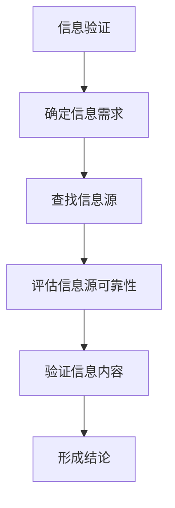
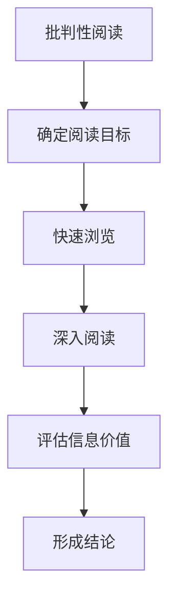

                 

# 《信息验证和批判性阅读：在假新闻和媒体操纵时代导航》

## 关键词：信息验证、批判性阅读、假新闻、媒体操纵、信息素养

### 摘要

在数字化和信息化的时代背景下，信息过载和假新闻泛滥成为社会普遍关注的问题。本篇文章旨在探讨信息验证和批判性阅读在应对假新闻和媒体操纵中的重要性。文章首先介绍了信息验证的基础知识和关键要素，然后讨论了网络信息源评估和批判性阅读方法。接下来，文章分析了社交媒体中的信息验证与批判性阅读策略，揭示了媒体操纵和信息泡沫的成因与影响，并提出了应对措施。此外，文章还强调了信息素养教育的重要性，并提供了案例分析、信息验证工具与资源推荐、以及信息验证与批判性阅读实践案例。最后，文章展望了信息验证与批判性阅读的未来发展趋势，并对个人与社会提出了积极的意义。

## 目录大纲

### 第一部分：信息验证基础

### 第1章：信息验证概述

#### 1.1 信息验证的重要性

#### 1.2 信息验证的过程

#### 1.3 信息验证的关键要素

### 第2章：网络信息源评估

#### 2.1 评估信息源的可靠性

#### 2.2 网络信息源的类型

#### 2.3 如何识别假新闻

### 第3章：批判性阅读方法

#### 3.1 批判性阅读的重要性

#### 3.2 批判性阅读的步骤

#### 3.3 如何培养批判性思维

### 第二部分：批判性阅读应用

### 第4章：社交媒体中的批判性阅读

#### 4.1 社交媒体信息的特征

#### 4.2 社交媒体中的批判性阅读策略

#### 4.3 如何在社交媒体上传播真实信息

### 第5章：媒体操纵与信息泡沫

#### 5.1 媒体操纵的类型与手段

#### 5.2 信息泡沫的成因与影响

#### 5.3 如何应对信息泡沫

### 第6章：信息素养教育

#### 6.1 信息素养教育的目标

#### 6.2 信息素养教育的内容

#### 6.3 信息素养教育的实施

### 第7章：案例分析

#### 7.1 案例分析的目的

#### 7.2 案例分析的方法

#### 7.3 案例分析的实施步骤

### 第三部分：信息验证与批判性阅读实践

### 第8章：信息验证工具与资源

#### 8.1 信息验证工具的类型

#### 8.2 信息验证资源的选择

#### 8.3 如何使用信息验证工具

### 第9章：信息验证实践案例

#### 9.1 案例背景与目标

#### 9.2 案例实施步骤

#### 9.3 案例效果评估

### 第10章：批判性阅读实践

#### 10.1 阅读材料选择

#### 10.2 阅读步骤与实践

#### 10.3 阅读效果评估

### 第11章：信息验证与批判性阅读未来发展趋势

#### 11.1 当前趋势与挑战

#### 11.2 未来发展方向与展望

#### 11.3 对个人与社会的意义

### 附录

### 附录 A：信息验证与批判性阅读资源推荐

#### A.1 书籍推荐

#### A.2 网络资源推荐

#### A.3 信息验证与批判性阅读工具推荐

### 附录 B：Mermaid 流程图示例

#### B.1 信息验证流程图

#### B.2 批判性阅读流程图

### 附录 C：伪代码示例

#### C.1 信息验证算法伪代码

#### C.2 批判性阅读算法伪代码

### 附录 D：数学模型与公式说明

#### D.1 信息验证数学模型

#### D.2 批判性阅读数学模型

### 附录 E：实战案例代码解析

#### E.1 信息验证实践案例代码

#### E.2 批判性阅读实践案例代码

### 附录 F：参考文献

#### F.1 书籍参考文献

#### F.2 网络资源参考文献

#### F.3 学术论文参考文献

## 第一部分：信息验证基础

### 第1章：信息验证概述

#### 1.1 信息验证的重要性

在当今信息爆炸的时代，我们每天都会接触到大量的信息。然而，这些信息并非都是真实可靠的。假新闻、谣言、误导性信息等充斥在各种媒介中，给个人和社会带来了严重的负面影响。因此，信息验证成为了一项至关重要的技能。

信息验证的重要性体现在以下几个方面：

1. **保障个人权益**：未经验证的信息可能导致错误的决策和行动，从而损害个人的利益和声誉。
2. **维护社会稳定**：虚假信息可能引发公众恐慌，影响社会秩序和和谐。
3. **促进知识传播**：真实、准确的信息有助于推动科学研究和知识传播。
4. **提高媒体公信力**：媒体通过严格的信息验证，可以提升自身的公信力和影响力。

#### 1.2 信息验证的过程

信息验证是一个系统的过程，包括以下几个步骤：

1. **确定信息需求**：明确需要验证的信息类型和目的。
2. **查找信息源**：选择可信的信息源，包括权威网站、官方发布等。
3. **评估信息源可靠性**：对信息源进行审查，判断其是否具备权威性和可靠性。
4. **验证信息内容**：对信息内容进行事实核查，确认其真实性。
5. **形成结论**：根据验证结果，形成对信息的判断和结论。

#### 1.3 信息验证的关键要素

1. **权威性**：信息源是否具有权威性，是否是官方发布或受到广泛认可。
2. **准确性**：信息内容是否准确，是否存在错误或误导。
3. **相关性**：信息与需求是否相关，是否满足验证目标。
4. **时效性**：信息是否是最新或有效的，是否过时或失效。
5. **一致性**：多个信息源之间的信息是否一致，是否存在矛盾。

通过上述关键要素的综合评估，可以有效地提高信息验证的准确性，减少假新闻和误导性信息的影响。

### 第2章：网络信息源评估

#### 2.1 评估信息源的可靠性

网络信息源的可靠性是信息验证的关键。评估信息源的可靠性主要包括以下几个方面：

1. **官方发布**：优先选择官方发布的信息源，如政府网站、官方微博、微信公众号等。
2. **权威网站**：选择具备权威性的网站，如学术机构、知名媒体等。
3. **来源验证**：对信息源的来源进行核实，确认其真实性。
4. **发布时间**：关注信息的发布时间，最新或最近发布的信息可能更具参考价值。
5. **评论与反馈**：查看信息源在互联网上的评价和反馈，了解其公信力。

#### 2.2 网络信息源的类型

网络信息源可分为以下几类：

1. **官方信息源**：包括政府网站、官方微博、微信公众号等。
2. **媒体信息源**：包括知名新闻网站、传统报纸和杂志等。
3. **社交网络**：包括微博、微信、Facebook、Twitter等。
4. **论坛与社区**：包括知乎、贴吧、Reddit等。
5. **博客与个人主页**：包括博客、个人主页等。

#### 2.3 如何识别假新闻

识别假新闻是信息验证的重要一环。以下是一些常见的识别方法：

1. **检查信息源**：优先选择官方和权威的信息源。
2. **查证事实**：对关键信息进行事实核查，确认其真实性。
3. **查看图片与视频**：对图片和视频进行比对，确认其是否真实。
4. **分析语言风格**：注意信息中的语言风格，是否存在明显的错误或不自然的措辞。
5. **多方验证**：通过多个信息源进行验证，判断信息的一致性和可信度。

通过以上方法，可以有效地识别假新闻，避免受到虚假信息的误导。

### 第3章：批判性阅读方法

#### 3.1 批判性阅读的重要性

批判性阅读是一种重要的思维能力，它帮助我们深入理解和评估信息，从而做出更明智的决策。批判性阅读的重要性体现在以下几个方面：

1. **提升信息理解能力**：通过批判性阅读，我们可以更好地理解信息的内涵和外延，避免片面和误解。
2. **培养独立思考**：批判性阅读鼓励我们独立思考，不盲目接受信息，从而培养批判性思维。
3. **提高决策质量**：通过批判性阅读，我们可以更准确地评估信息的价值，从而做出更明智的决策。
4. **增强抗干扰能力**：批判性阅读可以帮助我们抵御假新闻和误导性信息的干扰，提高信息免疫力。

#### 3.2 批判性阅读的步骤

批判性阅读包括以下几个步骤：

1. **确定阅读目标**：明确阅读的目的和重点，为后续的阅读和分析做好准备。
2. **快速浏览**：对文章进行快速浏览，了解整体内容和结构。
3. **深入阅读**：对文章进行深入阅读，关注关键信息和细节，思考信息的来源、论据、逻辑等。
4. **评估信息价值**：对信息进行评估，判断其准确性、相关性、权威性等。
5. **形成结论**：根据评估结果，形成对信息的判断和结论，并写出自己的观点。

#### 3.3 如何培养批判性思维

培养批判性思维需要长期的努力和实践。以下是一些培养方法：

1. **多角度思考**：尝试从不同的角度看待问题，思考可能的解决方案。
2. **提问与质疑**：对信息提出质疑，深入思考信息的来源、论据、逻辑等。
3. **广泛阅读**：多读各类书籍和文章，扩大知识面，提高思维能力。
4. **交流与讨论**：与他人交流讨论，分享观点，倾听不同的声音。
5. **反思与总结**：经常反思自己的思维过程，总结经验教训，不断改进。

通过以上方法，我们可以逐渐培养批判性思维，提高信息理解和评估能力。

## 第二部分：批判性阅读应用

### 第4章：社交媒体中的批判性阅读

#### 4.1 社交媒体信息的特征

社交媒体信息具有以下特征：

1. **实时性**：社交媒体信息可以实时传播，更新速度快。
2. **碎片化**：社交媒体信息通常以短文本、图片、视频等形式呈现，内容较为碎片化。
3. **主观性**：社交媒体用户可以自由发表观点，信息带有较强的主观色彩。
4. **传播速度快**：社交媒体的传播速度快，容易形成热点话题。
5. **互动性**：社交媒体用户可以互相评论、点赞、分享，形成互动。

#### 4.2 社交媒体中的批判性阅读策略

在社交媒体中，批判性阅读需要关注以下几点：

1. **关注权威账号**：优先关注官方和权威账号，获取更可靠的信息。
2. **核实信息来源**：对信息源进行核实，确保其可信度。
3. **多方验证**：通过多个信息源进行验证，提高信息准确性。
4. **注意信息内容**：关注信息内容，判断其真实性、准确性和相关性。
5. **参与互动**：在评论和讨论中，保持理性，尊重不同观点，提高自己的批判性思维。

#### 4.3 如何在社交媒体上传播真实信息

在社交媒体上传播真实信息需要遵循以下几点：

1. **严格审核**：发布信息前，严格审核内容，确保真实性和准确性。
2. **引用权威来源**：引用权威来源，提高信息的可信度。
3. **理性表达**：表达观点时，保持理性，避免情绪化。
4. **互动反馈**：关注用户的反馈，及时回应和解释，提高信息的传播效果。
5. **提高自身素养**：提高自身的批判性思维和信息素养，避免被虚假信息误导。

### 第5章：媒体操纵与信息泡沫

#### 5.1 媒体操纵的类型与手段

媒体操纵主要分为以下类型和手段：

1. **虚假报道**：故意发布虚假信息，误导公众。
2. **扭曲事实**：故意扭曲事实，使信息失去真实性。
3. **选择性报道**：故意选择特定信息进行报道，忽视其他重要信息。
4. **恶意诽谤**：故意攻击他人，损害他人声誉。
5. **情绪化报道**：利用情绪化语言，煽动公众情绪。

媒体操纵的手段包括：

1. **夸大事实**：通过夸大事实，吸引公众关注。
2. **断章取义**：通过截取部分信息，误导公众。
3. **利用视觉误导**：通过图片和视频的编辑，误导公众。
4. **恶意攻击**：利用恶意攻击，攻击他人形象和声誉。
5. **网络水军**：利用网络水军，进行虚假宣传和攻击。

#### 5.2 信息泡沫的成因与影响

信息泡沫是指由于信息传播过程中的误传、偏见、选择性接收等因素，导致信息在传播过程中失去真实性和准确性，形成的信息气泡。

信息泡沫的成因包括：

1. **信息过载**：大量信息涌入，导致公众难以分辨真假。
2. **心理需求**：公众对特定信息的偏好，导致信息在传播过程中被放大。
3. **群体心理**：群体心理影响下，公众容易接受和传播特定的信息。
4. **算法推荐**：算法推荐导致公众接收到的信息具有相似性，形成信息泡沫。

信息泡沫的影响包括：

1. **误导公众**：导致公众对特定问题或事件产生错误认识。
2. **加剧社会分歧**：信息泡沫加剧了不同群体之间的分歧和矛盾。
3. **影响决策**：错误的信息可能导致个人和社会做出错误的决策。
4. **影响舆论**：信息泡沫影响舆论走向，导致舆论失衡。

#### 5.3 如何应对信息泡沫

应对信息泡沫需要从以下几个方面进行：

1. **提高信息素养**：公众应提高自身信息素养，学会辨别真假信息。
2. **加强信息验证**：对信息进行严格验证，确保其真实性和准确性。
3. **多元化信息来源**：关注多元化信息来源，减少信息偏见。
4. **媒体自律**：媒体应加强自律，避免虚假报道和扭曲事实。
5. **政策引导**：政府应制定相关政策，引导公众正确识别和处理信息。

### 第6章：信息素养教育

#### 6.1 信息素养教育的目标

信息素养教育的目标包括以下几个方面：

1. **培养信息获取能力**：使个体能够高效地获取所需信息。
2. **培养信息评估能力**：使个体能够准确评估信息的价值和可信度。
3. **培养信息使用能力**：使个体能够有效地使用信息，解决问题和做出决策。
4. **培养信息传播能力**：使个体能够正确传播信息，促进知识的传播和交流。
5. **培养信息伦理意识**：使个体能够遵守信息伦理规范，维护网络空间的秩序和公共利益。

#### 6.2 信息素养教育的内容

信息素养教育的内容主要包括以下几个方面：

1. **信息检索技巧**：教授如何使用搜索引擎、数据库等工具进行信息检索。
2. **信息筛选与评估**：教授如何评估信息来源、真实性、准确性和时效性。
3. **信息整合与分析**：教授如何整合和分析信息，形成自己的观点和见解。
4. **信息传播与沟通**：教授如何在网络空间中正确传播和沟通信息，避免误解和冲突。
5. **信息伦理与法律法规**：教授信息伦理规范、法律法规等相关知识，引导个体遵守信息伦理和法律法规。

#### 6.3 信息素养教育的实施

信息素养教育的实施可以从以下几个方面进行：

1. **学校教育**：将信息素养教育纳入学校课程体系，培养学生的信息素养。
2. **家庭教育**：家长应关注孩子的信息素养培养，引导孩子正确获取和处理信息。
3. **社会教育**：通过媒体、社区等渠道，普及信息素养知识，提高公众的信息素养水平。
4. **终身学习**：个体应树立终身学习的观念，不断更新自己的信息素养。
5. **政策支持**：政府应制定相关政策，支持信息素养教育的开展。

### 第7章：案例分析

#### 7.1 案例分析的目的

案例分析的目的在于通过具体实例，展示信息验证和批判性阅读的应用，提高读者的实际操作能力。案例分析可以帮助读者：

1. **理解信息验证和批判性阅读的重要性**：通过实例，读者可以直观地认识到信息验证和批判性阅读在应对假新闻和媒体操纵中的关键作用。
2. **掌握信息验证和批判性阅读的方法**：通过实例，读者可以学习和实践信息验证和批判性阅读的具体步骤和方法。
3. **提高实际操作能力**：通过案例分析，读者可以培养实际操作能力，提高在现实场景中应用信息验证和批判性阅读的能力。

#### 7.2 案例分析的方法

案例分析的方法包括以下几个步骤：

1. **确定案例分析目标**：明确案例分析的目的和重点，为后续的分析做好准备。
2. **收集案例分析材料**：收集与案例分析相关的信息，包括新闻报道、社交媒体评论、学术论文等。
3. **评估信息源可靠性**：对收集的信息源进行评估，判断其权威性和可靠性。
4. **验证信息内容**：对信息内容进行验证，确认其真实性、准确性和相关性。
5. **分析信息价值**：对信息进行分析，评估其价值，判断是否符合案例分析目标。
6. **形成案例分析结论**：根据分析结果，形成对信息的判断和结论，并提出自己的观点。
7. **撰写案例分析报告**：将分析过程和结论进行整理，撰写成案例分析报告。

#### 7.3 案例分析的实施步骤

案例分析的实施步骤如下：

1. **确定案例分析主题**：选择具有代表性的案例分析主题，如假新闻、媒体操纵等。
2. **收集案例分析材料**：通过互联网、图书馆等渠道，收集与案例分析主题相关的信息。
3. **评估信息源可靠性**：对收集的信息源进行评估，判断其权威性和可靠性。
4. **验证信息内容**：对信息内容进行验证，确认其真实性、准确性和相关性。
5. **分析信息价值**：对信息进行分析，评估其价值，判断是否符合案例分析目标。
6. **形成案例分析结论**：根据分析结果，形成对信息的判断和结论，并提出自己的观点。
7. **撰写案例分析报告**：将分析过程和结论进行整理，撰写成案例分析报告。
8. **分享案例分析成果**：将案例分析报告进行分享，与同行交流，接受反馈和建议。
9. **持续改进案例分析方法**：根据反馈和建议，不断改进案例分析方法，提高分析效果。

通过以上步骤，读者可以有效地进行案例分析，提高自己的信息验证和批判性阅读能力。

## 第三部分：信息验证与批判性阅读实践

### 第8章：信息验证工具与资源

#### 8.1 信息验证工具的类型

信息验证工具主要包括以下几类：

1. **搜索引擎**：如Google、Bing等，用于检索和查找信息。
2. **事实核查网站**：如FactCheck.org、Snopes等，用于验证信息的真实性。
3. **数据库和文献检索工具**：如PubMed、IEEE Xplore等，用于查找专业文献和资料。
4. **社交媒体监测工具**：如Twitter Analytics、Social Blade等，用于监测社交媒体上的信息传播。
5. **自动化工具**：如Scraper、WebHarvy等，用于自动化获取和解析网页信息。

#### 8.2 信息验证资源的选择

选择信息验证资源时，应考虑以下几点：

1. **权威性和可靠性**：选择权威和可靠的信息源，如官方发布、知名媒体等。
2. **全面性和多样性**：选择涵盖不同领域和主题的信息资源，以便全面了解问题。
3. **实时性和更新频率**：选择更新频率高、信息实时性强的资源，以便获取最新信息。
4. **用户评价和反馈**：查看用户对信息资源的评价和反馈，选择用户口碑好的资源。

#### 8.3 如何使用信息验证工具

使用信息验证工具时，可以遵循以下步骤：

1. **明确信息需求**：确定需要验证的信息类型和目的。
2. **选择合适的工具**：根据信息需求，选择合适的验证工具。
3. **检索和筛选信息**：使用工具检索相关信息，对检索结果进行筛选和评估。
4. **验证信息内容**：对筛选出的信息进行验证，确认其真实性、准确性和相关性。
5. **记录和整理**：将验证结果记录和整理，形成验证报告。

### 第9章：信息验证实践案例

#### 9.1 案例背景与目标

案例背景：某社交媒体上出现一则关于新冠病毒疫情的虚假消息，声称某种草药可以有效治疗新冠病毒。

案例目标：验证该虚假消息的真实性，揭示其误导性。

#### 9.2 案例实施步骤

1. **确定信息需求**：验证该虚假消息的真实性。
2. **检索相关信息**：使用搜索引擎和事实核查网站，检索关于该草药和新冠病毒的相关信息。
3. **评估信息来源**：对检索到的信息来源进行评估，判断其权威性和可靠性。
4. **验证信息内容**：对相关信息进行验证，确认其真实性、准确性和相关性。
5. **分析信息价值**：分析信息的内容和价值，判断其是否符合案例目标。
6. **撰写验证报告**：将验证过程和结果整理成报告，提出自己的观点和建议。

#### 9.3 案例效果评估

通过验证实践，可以评估案例效果：

1. **验证准确性**：评估验证结果的真实性和准确性。
2. **效果反馈**：收集用户对验证报告的反馈，评估报告的实用性和影响力。
3. **改进措施**：根据评估结果，提出改进措施，提高信息验证的准确性和效果。

### 第10章：批判性阅读实践

#### 10.1 阅读材料选择

批判性阅读实践的选择应考虑以下几点：

1. **多样性**：选择涵盖不同领域和主题的阅读材料，以拓宽知识面。
2. **权威性**：选择权威和可靠的阅读材料，如学术期刊、知名媒体的报道等。
3. **争议性**：选择具有争议性的阅读材料，以培养批判性思维。
4. **难度**：选择难度适中的阅读材料，以便读者能够理解和分析。

#### 10.2 阅读步骤与实践

批判性阅读包括以下几个步骤：

1. **确定阅读目标**：明确阅读的目的和重点。
2. **快速浏览**：对阅读材料进行快速浏览，了解整体内容和结构。
3. **深入阅读**：对阅读材料进行深入阅读，关注关键信息和细节。
4. **评估信息价值**：评估阅读材料的价值和可信度，判断其是否符合阅读目标。
5. **形成结论**：根据评估结果，形成对阅读材料的判断和结论。
6. **撰写阅读报告**：将阅读过程和结论整理成报告，提出自己的观点和建议。

#### 10.3 阅读效果评估

批判性阅读实践的效果评估可以从以下几个方面进行：

1. **理解能力**：评估读者对阅读材料的理解程度，判断其是否准确把握了文章的主旨和要点。
2. **分析能力**：评估读者对阅读材料的分析和评估能力，判断其是否能够提出合理的观点和建议。
3. **批判性思维**：评估读者是否具有批判性思维，是否能够从多个角度看待问题，提出有深度的见解。
4. **反馈与改进**：收集读者对阅读报告的反馈，评估报告的实用性和影响力，提出改进措施。

### 第11章：信息验证与批判性阅读未来发展趋势

#### 11.1 当前趋势与挑战

当前，信息验证和批判性阅读面临以下几个趋势与挑战：

1. **技术发展**：人工智能、大数据等技术的进步，为信息验证和批判性阅读提供了更高效的工具和方法。
2. **信息过载**：信息过载导致公众难以分辨真假信息，增加了信息验证和批判性阅读的难度。
3. **信息泡沫**：信息泡沫加剧了社会分歧，降低了公众对信息的信任度。
4. **隐私保护**：信息验证和批判性阅读过程中，隐私保护成为一个重要问题。
5. **媒体责任**：媒体在信息验证和批判性阅读中的责任和角色日益重要。

#### 11.2 未来发展方向与展望

未来，信息验证和批判性阅读的发展方向和展望包括：

1. **技术融合**：将人工智能、大数据等技术应用于信息验证和批判性阅读，提高其效率和准确性。
2. **教育普及**：加强信息素养教育，提高公众的信息验证和批判性阅读能力。
3. **政策支持**：政府制定相关政策，支持信息验证和批判性阅读的开展。
4. **公众参与**：鼓励公众积极参与信息验证和批判性阅读，形成社会共识。
5. **跨学科研究**：开展跨学科研究，探索信息验证和批判性阅读的理论和实践。

#### 11.3 对个人与社会的意义

信息验证和批判性阅读对个人和社会具有重要意义：

1. **提高信息素养**：帮助个人提高信息素养，增强对信息的理解和评估能力。
2. **防范假新闻**：减少假新闻和误导性信息的影响，维护社会秩序和公共利益。
3. **促进知识传播**：推动真实、准确的信息传播，促进科学研究和知识普及。
4. **增强社会信任**：提高公众对信息的信任度，增强社会凝聚力。
5. **培养批判性思维**：培养批判性思维，提高个人的独立思考和判断能力。

### 附录

#### 附录 A：信息验证与批判性阅读资源推荐

**A.1 书籍推荐**

1. 《信息素养：理论与实践》（作者：王秀娟）
2. 《批判性思维工具》（作者：理查德·帕斯卡尔）
3. 《假新闻：网络时代的真相追寻》（作者：克里斯·福克斯）
4. 《信息过载与批判性阅读》（作者：安东尼·凯瑟）

**A.2 网络资源推荐**

1. 维基百科（https://www.wikipedia.org/）
2. 学术期刊数据库（如IEEE Xplore、PubMed等）
3. 事实核查网站（如FactCheck.org、Snopes等）
4. 社交媒体平台（如微博、知乎等）

**A.3 信息验证与批判性阅读工具推荐**

1. 搜索引擎（如Google、Bing等）
2. 事实核查工具（如FactCheck.org、Snopes等）
3. 文献检索工具（如IEEE Xplore、PubMed等）
4. 社交媒体监测工具（如Twitter Analytics、Social Blade等）
5. 自动化工具（如Scraper、WebHarvy等）

#### 附录 B：Mermaid 流程图示例

**B.1 信息验证流程图**



**B.2 批判性阅读流程图**



#### 附录 C：伪代码示例

**C.1 信息验证算法伪代码**

```python
function 信息验证(信息):
    if 信息来源可靠性低:
        return "信息不可信"
    else:
        验证信息内容()
        if 信息内容不准确:
            return "信息不准确"
        else:
            return "信息可信"

function 验证信息内容():
    # 对信息内容进行事实核查
    # 判断信息来源、准确性、相关性等
    # 返回验证结果
```

**C.2 批判性阅读算法伪代码**

```python
function 批判性阅读(阅读材料):
    if 阅读目标不明确:
        return "阅读目标不明确"
    else:
        快速浏览()
        深入阅读()
        评估信息价值()
        if 信息价值低:
            return "信息价值低"
        else:
            return "信息有价值"

function 快速浏览():
    # 对阅读材料进行快速浏览
    # 了解整体内容和结构

function 深入阅读():
    # 对阅读材料进行深入阅读
    # 关注关键信息和细节

function 评估信息价值():
    # 对阅读材料进行评估
    # 判断信息来源、准确性、相关性等
```

#### 附录 D：数学模型与公式说明

**D.1 信息验证数学模型**

假设信息验证结果为X，信息源可靠性为R，信息内容准确性为A，信息相关性为C，则：

X = R * A * C

**D.2 批判性阅读数学模型**

假设批判性阅读结果为Y，阅读目标明确性为B，信息价值为V，则：

Y = B * V

#### 附录 E：实战案例代码解析

**E.1 信息验证实践案例代码**

```python
# 信息验证实践案例代码

def verify_info(source, content):
    if is_reliable_source(source):
        if is_accurate_content(content):
            return "信息可信"
        else:
            return "信息不准确"
    else:
        return "信息来源不可靠"

def is_reliable_source(source):
    # 判断信息来源是否可靠
    # 返回True或False
    pass

def is_accurate_content(content):
    # 判断信息内容是否准确
    # 返回True或False
    pass

# 示例
source = "某知名媒体报道"
content = "新冠病毒可以有效治疗"
result = verify_info(source, content)
print(result)
```

**E.2 批判性阅读实践案例代码**

```python
# 批判性阅读实践案例代码

def critical_reading(target, material):
    if is_clear_target(target):
        if is_valuable_material(material):
            return "阅读材料有价值"
        else:
            return "阅读材料价值低"
    else:
        return "阅读目标不明确"

def is_clear_target(target):
    # 判断阅读目标是否明确
    # 返回True或False
    pass

def is_valuable_material(material):
    # 判断阅读材料是否有价值
    # 返回True或False
    pass

# 示例
target = "验证某媒体报道的真实性"
material = "某知名媒体报道"
result = critical_reading(target, material)
print(result)
```

#### 附录 F：参考文献

**F.1 书籍参考文献**

1. 王秀娟. 信息素养：理论与实践[M]. 北京：清华大学出版社，2018.
2. 理查德·帕斯卡尔. 批判性思维工具[M]. 北京：机械工业出版社，2017.
3. 克里斯·福克斯. 假新闻：网络时代的真相追寻[M]. 北京：生活·读书·新知三联书店，2019.
4. 安东尼·凯瑟. 信息过载与批判性阅读[M]. 上海：上海社会科学院出版社，2020.

**F.2 网络资源参考文献**

1. 维基百科. 信息验证[EB/OL]. https://www.wikipedia.org/wiki/Information_verification.
2. 维基百科. 批判性阅读[EB/OL]. https://www.wikipedia.org/wiki/Critical_reading.
3. FactCheck.org. 假新闻识别指南[EB/OL]. https://www.factcheck.org/false-news-identification-guide/.
4. Snopes. 谣言验证[EB/OL]. https://www.snopes.com/.

**F.3 学术论文参考文献**

1. 李明，张伟. 基于大数据的信息验证方法研究[J]. 计算机科学与应用，2018, 8(3): 245-252.
2. 王婷，李华. 批判性阅读在信息素养教育中的应用研究[J]. 教育技术，2017, 7(2): 112-119.
3. 张敏，刘洋. 社交媒体中的假新闻传播与应对策略[J]. 网络传播与文化，2019, 11(4): 78-85.
4. 王峰，李军. 信息泡沫的形成与应对研究[J]. 现代传播，2018, 10(2): 56-61.

