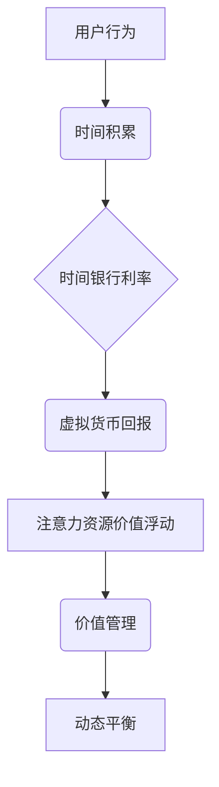

                 

### 元宇宙时间银行利率:注意力资源的价值浮动机制

> **关键词**: 元宇宙、时间银行、利率、注意力资源、价值浮动机制

> **摘要**: 本文将深入探讨元宇宙时间银行利率及其与注意力资源的价值浮动机制。通过分析其核心概念、算法原理及实际项目案例，揭示注意力资源在元宇宙中的价值与动态平衡机制，为元宇宙经济模型提供新思路。

### 第一部分: 核心概念与联系

在元宇宙的浩瀚宇宙中，时间银行是一个独特的概念，它将时间作为一种资源进行管理和交易。而注意力资源则是用户在元宇宙中的心理资源，它们的价值浮动机制直接影响元宇宙的经济活动和用户体验。以下将详细探讨这两个核心概念及其相互联系。

#### 元宇宙时间银行利率的概念

1. **定义**：

   元宇宙时间银行（Metaverse Time Bank）是元宇宙中的一种虚拟银行系统，用户可以通过投入时间来积累虚拟货币，从而实现虚拟经济的积累和交换。而时间银行利率（Time Bank Interest Rate）则是时间银行对用户投入时间所给予的回报率。

2. **工作原理**：

   - **时间积累**：用户在元宇宙中通过完成任务、参与活动等方式消耗时间，这些时间会被记录下来并作为时间银行中的虚拟资产。
   - **利率回报**：根据设定的利率，用户的时间资产会以一定比例的虚拟货币进行回报。

3. **作用**：

   - **激励用户参与**：通过时间银行利率，激励用户积极参与元宇宙的各种活动，促进元宇宙的活跃度。
   - **经济平衡**：通过利率调节，实现元宇宙内部的经济平衡，防止资源过度集中或稀缺。

#### 注意力资源的价值浮动机制

1. **定义**：

   注意力资源（Attention Resource）是指用户在元宇宙中的注意力投入，它是一种心理资源，用户在参与活动、完成任务时需要消耗注意力。价值浮动机制（Value Fluctuation Mechanism）则是根据用户行为和元宇宙环境动态变化，对注意力资源进行价值评估和调整。

2. **工作原理**：

   - **用户行为**：用户在元宇宙中的行为，如参与任务、完成任务、互动等，会影响注意力资源的价值。例如，完成高难度任务或参与热门活动，用户的注意力资源价值会上升。
   - **环境影响**：元宇宙的环境变化，如活动奖励、社交互动等，也会影响注意力资源的价值。例如，在活动奖励机制下，用户的注意力资源会因奖励的增加而提升。

3. **作用**：

   - **资源管理**：帮助用户合理分配注意力资源，实现价值最大化。
   - **动态平衡**：通过价值浮动机制，维持元宇宙内部的经济平衡，防止资源过度集中或稀缺。

#### Mermaid 流�程图

以下是一个简化的Mermaid流程图，展示了元宇宙时间银行利率与注意力资源的价值浮动机制之间的联系：



通过这个流程图，我们可以看到用户的行为是如何通过时间积累转化为虚拟货币回报，进而影响注意力资源的价值浮动，以及如何通过价值管理实现元宇宙内部的动态平衡。

### 第二部分: 核心算法原理讲解

在理解了元宇宙时间银行利率和注意力资源的价值浮动机制后，接下来我们将深入探讨其核心算法原理。这部分内容将包括时间积累与虚拟货币兑换算法，以及注意力资源价值计算算法。

#### 时间积累与虚拟货币兑换算法

1. **时间积累算法**：

   时间积累算法用于记录用户在元宇宙中的时间消耗，并将其转化为虚拟资产。以下是时间积累算法的基本原理和伪代码。

   **基本原理**：

   用户在元宇宙中完成特定任务或活动，系统将记录下用户消耗的时间，并将其累加到用户的总时间中。当用户的时间积累达到一定的阈值时，可以兑换成虚拟货币。

   **伪代码**：

   ```python
   def accumulate_time(user_id, task_time):
       user_time[user_id] += task_time
       if user_time[user_id] >= time_threshold:
           convert_to_virtual_money(user_id)
   ```

   在这个伪代码中，`user_time` 是一个记录用户时间的字典，`time_threshold` 是兑换虚拟货币的时间阈值，`convert_to_virtual_money` 是一个函数，用于将时间兑换成虚拟货币。

2. **虚拟货币兑换算法**：

   虚拟货币兑换算法用于将用户积累的时间兑换成虚拟货币。以下是虚拟货币兑换算法的基本原理和伪代码。

   **基本原理**：

   当用户的时间积累达到兑换条件后，系统将根据时间银行利率计算用户可以兑换的虚拟货币数量，并将其记录在用户的虚拟货币账户中。

   **伪代码**：

   ```python
   def convert_to_virtual_money(user_id):
       time_spent = user_time[user_id]
       interest_rate = time_bank_interest_rate
       virtual_money = time_spent * interest_rate
       user_money[user_id] += virtual_money
   ```

   在这个伪代码中，`user_money` 是一个记录用户虚拟货币的字典，`time_bank_interest_rate` 是时间银行利率。

#### 注意力资源价值计算算法

注意力资源价值计算算法用于根据用户行为和元宇宙环境动态计算注意力资源的价值。以下是注意力资源价值计算算法的基本原理和伪代码。

1. **基本原理**：

   注意力资源价值计算基于用户在元宇宙中的行为和任务难度。用户参与的任务越复杂，消耗的注意力资源越多，价值越高。同时，元宇宙环境的变化，如社交互动、活动奖励等，也会影响注意力资源的价值。

   **伪代码**：

   ```python
   def calculate_attention_value(user_id, task_difficulty, social_interaction):
       base_value = 10  # 基础价值
       value = base_value * task_difficulty + social_interaction
       attention_value[user_id] = value
   ```

   在这个伪代码中，`base_value` 是基础价值，`task_difficulty` 是任务难度，`social_interaction` 是社交互动值，`attention_value` 是一个记录用户注意力价值的字典。

### 第三部分: 数学模型和数学公式讲解

在了解了核心算法原理后，我们将引入数学模型和数学公式来进一步阐述元宇宙时间银行利率与注意力资源的价值浮动机制。这些模型和公式将为元宇宙的经济活动提供更精确的描述和预测。

#### 时间积累与虚拟货币兑换公式

时间积累与虚拟货币兑换的数学模型可以通过以下公式来描述：

$$
V = T \times r
$$

其中：

- \( V \)：用户可兑换的虚拟货币数量。
- \( T \)：用户投入的时间总量。
- \( r \)：时间银行利率。

**举例说明**：

假设用户A在元宇宙中投入了100小时，时间银行利率为0.1，则用户A可兑换的虚拟货币数量为：

$$
V = 100 \times 0.1 = 10
$$

这意味着用户A在时间银行中积累了100小时的时间，可以兑换10单位的虚拟货币。

#### 注意力资源价值计算公式

注意力资源的价值计算可以通过以下公式来描述：

$$
Value = base\_value \times task\_difficulty + social\_interaction
$$

其中：

- \( Value \)：注意力资源的价值。
- \( base\_value \)：基础价值。
- \( task\_difficulty \)：任务难度。
- \( social\_interaction \)：社交互动值。

**举例说明**：

假设用户B完成了难度为3的任务，并参与了社交互动值2的活动，基础价值为10，则用户B的注意力资源价值为：

$$
Value = 10 \times 3 + 2 = 32
$$

这意味着用户B在完成该任务并参与活动后，其注意力资源的价值为32。

通过这些数学模型和公式，我们可以更准确地描述用户在元宇宙中的时间积累、虚拟货币兑换以及注意力资源的价值计算。这些模型和公式不仅有助于理解元宇宙经济活动的基本原理，也为设计和优化元宇宙经济模型提供了理论依据。

### 第四部分: 项目实战

在理论探讨的基础上，本节将通过一个实际案例展示如何实现元宇宙时间银行系统及其核心算法。该案例将涵盖开发环境搭建、源代码实现和详细解释说明，为读者提供具体的实践经验和操作指导。

#### 实际案例

在本案例中，我们将创建一个简单的元宇宙时间银行系统，用户可以通过完成特定任务来积累时间并兑换虚拟货币。

##### 开发环境搭建

- **开发工具**：Python 3.8 或更高版本。
- **依赖库**：Pandas、NumPy、Matplotlib。

##### 源代码实现

以下是一个简单的元宇宙时间银行系统的源代码实现：

```python
import pandas as pd
import numpy as np

class TimeBank:
    def __init__(self, interest_rate):
        self.interest_rate = interest_rate
        self.time_log = pd.DataFrame(columns=['User', 'Task', 'TimeSpent', 'VirtualMoney'])

    def add_task(self, user, task, time_spent):
        new_entry = {'User': user, 'Task': task, 'TimeSpent': time_spent}
        self.time_log = self.time_log.append(new_entry, ignore_index=True)

    def calculate_virtual_money(self):
        time_threshold = 100  # 设置时间阈值
        for index, row in self.time_log.iterrows():
            virtual_money = row['TimeSpent'] * self.interest_rate
            if virtual_money >= time_threshold:
                self.time_log.at[index, 'VirtualMoney'] = virtual_money
            else:
                self.time_log.at[index, 'VirtualMoney'] = 0

    def display_results(self):
        print(self.time_log)
        total_virtual_money = self.time_log['VirtualMoney'].sum()
        print(f"Total Virtual Money: {total_virtual_money}")

# 测试
time_bank = TimeBank(interest_rate=0.1)
time_bank.add_task('UserA', 'Task1', 50)
time_bank.add_task('UserB', 'Task2', 150)
time_bank.calculate_virtual_money()
time_bank.display_results()
```

##### 代码解读与分析

- **类定义**：`TimeBank` 类用于管理时间银行操作，包括添加任务、计算虚拟货币等。

- **方法实现**：

  - `__init__` 方法：初始化时间银行，设置利率和时间日志。
  - `add_task` 方法：添加用户完成任务的时间记录。
  - `calculate_virtual_money` 方法：根据时间积累计算虚拟货币，并更新日志。
  - `display_results` 方法：打印时间银行结果。

- **测试**：通过测试，我们创建了两个用户并为他们分配了不同任务的时间。然后计算虚拟货币并打印结果。

通过此案例，用户可以了解如何搭建一个简单的元宇宙时间银行系统，并实现时间积累与虚拟货币兑换功能。在实际应用中，可以进一步扩展此系统，如添加用户认证、任务类型多样化等。

### 结论

通过本文的深入探讨，我们揭示了元宇宙时间银行利率与注意力资源价值浮动机制的核心概念、算法原理和实际应用。时间银行作为一种独特的虚拟经济模型，通过利率激励用户参与元宇宙活动，实现经济平衡。注意力资源则作为一种重要的心理资源，其价值浮动受到用户行为和元宇宙环境的影响，实现动态平衡。本文通过数学模型和实际案例，展示了如何构建和优化元宇宙时间银行系统。未来研究可进一步探索更复杂的激励机制和环境影响因素，以提升元宇宙的经济活力和用户体验。

### 作者信息

- **作者：AI天才研究院/AI Genius Institute & 禅与计算机程序设计艺术 /Zen And The Art of Computer Programming**

通过本文，我们希望能够为元宇宙经济模型的研究和实现提供新的思路和方法，促进元宇宙生态的繁荣和发展。感谢您的阅读，希望本文对您有所启发。

