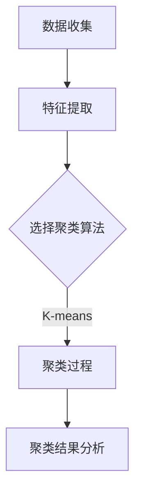
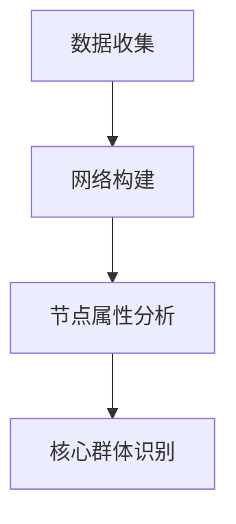
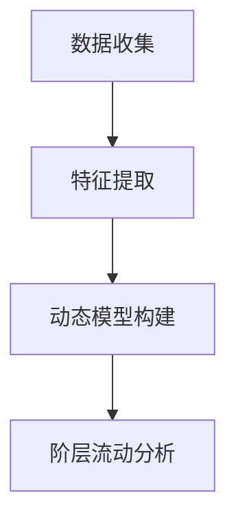

                 

# 元宇宙身份流动性研究：虚拟社会阶层流动的新视角

> **关键词**：元宇宙、身份流动性、虚拟社会、阶层流动、社会网络分析、聚类分析、动态模型

> **摘要**：本文以元宇宙为背景，探讨虚拟社会中的身份流动性问题。通过构建数学模型和运用社会网络分析、聚类分析等方法，深入研究虚拟社会阶层流动的机制和特点。同时，分析元宇宙身份流动性政策，提出相关政策建议，为虚拟社会健康发展提供新视角。

## 第一部分：引言

### 第1章：元宇宙与虚拟社会

#### 1.1 元宇宙概述

**元宇宙**（Metaverse）是一个虚拟的、三维的、交互性的数字世界，它基于互联网技术，融合了虚拟现实、增强现实、区块链、人工智能等多种技术，为用户提供沉浸式的体验。元宇宙具有以下特点：

1. **沉浸式体验**：用户可以通过虚拟现实设备进入元宇宙，感受到三维空间的互动和参与感。
2. **交互性**：元宇宙中的用户可以进行实时互动，包括语音、视频、文字等多种方式。
3. **多样性**：元宇宙中包含了丰富的虚拟内容，如游戏、社交、教育、购物等，满足用户不同的需求。
4. **开放性**：元宇宙是一个开放的生态系统，允许各种平台和应用之间的互联互通。

#### 1.2 虚拟社会阶层流动的概念

**虚拟社会阶层流动**是指在元宇宙中，用户（个体）由于各种原因，在不同阶层之间的转移和变化。阶层流动是社会学中的一个重要概念，用于描述社会中个体或群体在经济、社会地位等方面的变化。在元宇宙中，身份流动性主要受以下几个方面的影响：

1. **经济因素**：虚拟货币、虚拟资产的价值和流通会影响用户的阶层地位。
2. **技术因素**：用户对元宇宙中技术的掌握程度，如编程、设计等，也会影响其阶层地位。
3. **社会关系**：用户在元宇宙中的社交网络和人际关系，对身份流动性有重要影响。
4. **个人能力**：用户的虚拟技能和知识水平，如虚拟现实编程、虚拟经济管理等，直接影响其在元宇宙中的地位。

#### 1.3 本书的研究目标与结构

本书旨在探讨元宇宙中的身份流动性问题，具体研究目标包括：

1. 构建虚拟社会阶层流动的数学模型。
2. 运用社会网络分析、聚类分析等方法，分析虚拟社会阶层流动的机制和特点。
3. 分析元宇宙身份流动性政策，提出相关建议。

本书结构如下：

- **第一部分：引言**，介绍元宇宙和虚拟社会阶层流动的概念。
- **第二部分：元宇宙身份流动性理论基础**，介绍相关理论框架。
- **第三部分：元宇宙身份流动性研究方法**，介绍研究方法和模型。
- **第四部分：元宇宙身份流动性案例分析**，分析虚拟社会中的身份流动性。
- **第五部分：结论与展望**，总结研究结论并提出未来研究方向。

## 第二部分：元宇宙身份流动性理论基础

### 第2章：虚拟社会阶层流动的理论基础

#### 2.1 社会阶层流动理论概述

社会阶层流动理论源于社会学领域，主要研究个体或群体在经济社会中的地位变化。经典的阶层流动理论包括：

1. **马可思主义理论**：强调经济基础对阶层流动的决定作用，认为社会阶层主要由生产资料的所有权和劳动力的价值决定。
2. **功能主义理论**：认为社会阶层流动是社会系统正常运转的必要条件，通过个体在不同阶层之间的流动，实现社会资源的合理分配和优化。
3. **文化资本理论**：认为文化资本（如教育、知识、技能等）是影响阶层流动的重要因素。

#### 2.2 虚拟社会阶层流动的特点

虚拟社会阶层流动与真实社会阶层流动有所不同，具有以下特点：

1. **虚拟财富的快速积累**：虚拟社会中的财富可以通过各种方式快速积累，如虚拟货币交易、虚拟资产投资等。
2. **技术能力的重要性**：在虚拟社会中，掌握先进技术（如编程、设计等）的用户更容易获得较高的阶层地位。
3. **社交网络的强大影响**：虚拟社会中的社交网络对身份流动性有显著影响，通过社交网络，用户可以更快速地获取信息和资源。
4. **规则和制度的制约**：虚拟社会中的规则和制度（如虚拟法律、虚拟道德等）也会对阶层流动产生影响。

#### 2.3 元宇宙身份流动的理论框架

元宇宙身份流动的理论框架可以基于以下三个方面：

1. **经济因素**：包括虚拟货币的价值、虚拟资产的投资等，对身份流动性有重要影响。
2. **技术因素**：包括用户的技术水平、对元宇宙技术的掌握程度等，直接影响其在虚拟社会中的地位。
3. **社会关系**：包括用户的社交网络、人际关系等，对身份流动性有重要影响。

在构建元宇宙身份流动的理论框架时，可以借鉴经典的社会阶层流动理论，结合虚拟社会的特点，构建一个综合性的理论模型。

### 第3章：元宇宙身份流动的数学模型

#### 3.1 聚类分析模型

聚类分析是一种无监督学习方法，用于将数据集划分为多个类别，使同一类别中的数据点相似度较高，不同类别中的数据点相似度较低。在元宇宙身份流动研究中，聚类分析可以用于识别虚拟社会中的不同阶层群体。

**聚类分析模型的基本步骤**：

1. **数据收集**：收集虚拟社会中的用户数据，包括经济因素、技术因素、社会关系等方面的数据。
2. **特征提取**：对用户数据进行特征提取，如虚拟货币财富、技术水平、社交网络规模等。
3. **聚类算法选择**：根据数据特点和研究需求，选择合适的聚类算法，如K-means、层次聚类等。
4. **聚类结果分析**：分析聚类结果，识别不同阶层群体，并分析其特点。

**聚类分析模型的应用示例**：

假设我们有一个虚拟社会的用户数据集，包含用户的虚拟货币财富、技术水平和社会网络规模三个特征。我们可以使用K-means聚类算法，将用户划分为不同的阶层群体。具体步骤如下：

1. **数据收集**：收集用户数据，包括虚拟货币财富（财富值）、技术水平（编程技能评分）、社交网络规模（好友数量）。
2. **特征提取**：对每个用户进行特征提取，得到三个特征值。
3. **聚类算法选择**：选择K-means聚类算法。
4. **聚类结果分析**：根据聚类结果，识别不同阶层群体，如高财富群体、高技术群体等。

#### 3.2 社会网络分析模型

社会网络分析（Social Network Analysis, SNA）是研究个体之间社会关系和互动的一种方法。在元宇宙身份流动研究中，社会网络分析可以用于分析用户在虚拟社会中的社交网络结构，识别关键节点和核心群体。

**社会网络分析模型的基本步骤**：

1. **数据收集**：收集用户的社会关系数据，如好友列表、互动记录等。
2. **网络构建**：将用户和社会关系数据构建为一个网络图。
3. **节点属性分析**：分析网络中各个节点的属性，如度、介数、离心率等。
4. **核心群体识别**：根据节点属性分析，识别网络中的核心群体。

**社会网络分析模型的应用示例**：

假设我们有一个虚拟社会的用户社交网络数据，包含用户的好友列表和互动记录。我们可以使用社会网络分析模型，分析用户在虚拟社会中的社交网络结构，识别关键节点和核心群体。具体步骤如下：

1. **数据收集**：收集用户的好友列表和互动记录。
2. **网络构建**：将用户和社会关系数据构建为一个网络图。
3. **节点属性分析**：分析网络中各个节点的属性，如度（好友数量）、介数（在好友关系中的重要性）、离心率（与其他节点的连接紧密程度）。
4. **核心群体识别**：根据节点属性分析，识别网络中的核心群体，如具有较高度、介数和离心率的用户。

#### 3.3 动态社会阶层流动模型

动态社会阶层流动模型用于分析虚拟社会中用户阶层地位的动态变化。该模型可以基于时间序列数据，研究用户在虚拟社会中的身份流动性。

**动态社会阶层流动模型的基本步骤**：

1. **数据收集**：收集用户的时间序列数据，包括虚拟货币财富、技术水平、社交网络规模等。
2. **特征提取**：对每个用户进行特征提取，得到时间序列特征值。
3. **动态模型构建**：选择合适的动态模型，如时间序列模型、状态转移模型等。
4. **阶层流动分析**：根据动态模型，分析用户阶层地位的动态变化。

**动态社会阶层流动模型的应用示例**：

假设我们有一个虚拟社会的用户时间序列数据，包含用户的虚拟货币财富、技术水平和社会网络规模。我们可以使用动态社会阶层流动模型，分析用户在虚拟社会中的身份流动性。具体步骤如下：

1. **数据收集**：收集用户的时间序列数据，包括虚拟货币财富（财富值）、技术水平（编程技能评分）、社交网络规模（好友数量）。
2. **特征提取**：对每个用户进行特征提取，得到时间序列特征值。
3. **动态模型构建**：选择时间序列模型，如ARIMA模型、LSTM模型等。
4. **阶层流动分析**：根据动态模型，分析用户阶层地位的动态变化。

## 第三部分：元宇宙身份流动性研究方法

### 第4章：虚拟社会数据收集与分析方法

#### 4.1 数据收集方法

在元宇宙身份流动性研究中，数据收集是关键的一步。以下是几种常用的数据收集方法：

1. **问卷调查**：通过设计问卷调查，收集用户对虚拟社会身份流动的看法、行为和态度等。
2. **在线监测**：通过监测元宇宙中的用户行为，如交易记录、社交互动等，收集相关数据。
3. **实地调研**：通过实地调研，了解虚拟社会中的实际情况，如虚拟货币交易市场、虚拟资产投资等。
4. **数据挖掘**：通过数据挖掘技术，从已有的数据源中提取有价值的信息。

#### 4.2 数据分析方法

数据分析是研究元宇宙身份流动性问题的关键环节。以下是几种常用的数据分析方法：

1. **描述性统计分析**：对收集到的数据进行分析，描述数据的基本特征，如平均值、中位数、标准差等。
2. **相关性分析**：研究不同变量之间的关系，如虚拟货币财富与技术水平之间的相关性。
3. **聚类分析**：将用户划分为不同的类别，识别不同的阶层群体。
4. **社会网络分析**：分析用户在虚拟社会中的社交网络结构，识别核心群体和关键节点。
5. **动态模型分析**：分析用户阶层地位的动态变化，研究身份流动的规律。

#### 4.3 虚拟社会用户行为特征提取

在元宇宙身份流动性研究中，提取用户行为特征是关键的一步。以下是几种常见的用户行为特征提取方法：

1. **虚拟货币交易特征**：包括虚拟货币交易数量、交易频率、交易金额等。
2. **社交互动特征**：包括好友数量、互动频率、互动类型等。
3. **虚拟资产投资特征**：包括虚拟资产持有量、投资收益率、投资策略等。
4. **技术水平特征**：包括编程技能评分、虚拟现实设计能力等。

### 第5章：虚拟社会身份流动性评估方法

#### 5.1 身份流动性评价指标体系

在元宇宙身份流动性研究中，建立一套合理的评价指标体系是至关重要的。以下是几个常见的评价指标：

1. **阶层流动性指数**：衡量用户阶层地位的变化程度，如阶层上升比例、阶层下降比例等。
2. **财富流动性指数**：衡量虚拟货币财富的流动性，如财富增长率、财富分布变化等。
3. **社交流动性指数**：衡量用户在社交网络中的流动性，如好友增加率、互动频率等。
4. **技术水平流动性指数**：衡量用户技术水平的流动性，如技能提升率、技能迁移率等。

#### 5.2 身份流动性评估模型构建

为了对虚拟社会的身份流动性进行量化评估，可以构建以下几种模型：

1. **多层次评估模型**：将身份流动性分解为多个层次，分别评估不同因素对身份流动性的影响。
2. **综合评价模型**：将多个评价指标进行综合，得到一个综合评估值，用于衡量身份流动性的整体状况。
3. **动态评估模型**：根据时间序列数据，分析用户阶层地位的动态变化，评估身份流动性的趋势。

#### 5.3 实证分析案例

为了更好地说明虚拟社会身份流动性评估方法的应用，以下是一个实证分析案例：

**案例背景**：某虚拟游戏世界，用户可以通过虚拟货币交易、社交互动、虚拟资产投资等行为获得不同的阶层地位。

**数据收集**：收集用户在游戏世界中的虚拟货币交易记录、社交互动记录、虚拟资产投资记录等。

**特征提取**：提取用户的虚拟货币交易特征、社交互动特征、虚拟资产投资特征等。

**评估指标**：构建阶层流动性指数、财富流动性指数、社交流动性指数、技术水平流动性指数等评价指标。

**模型构建**：构建多层次评估模型，分别评估不同因素对身份流动性的影响。

**结果分析**：根据评估模型，分析用户在游戏世界中的身份流动性状况，如阶层变化趋势、财富分布变化等。

## 第四部分：元宇宙身份流动性案例分析

### 第6章：虚拟世界中的社会阶层流动性

#### 6.1 虚拟游戏中的社会阶层流动性

虚拟游戏是元宇宙中的重要组成部分，游戏中的社会阶层流动性反映了用户在游戏世界中的地位变化。以下是虚拟游戏中社会阶层流动性的一些典型特点：

1. **财富流动性**：虚拟游戏中的虚拟货币和虚拟资产具有高度的流动性，用户可以通过交易、投资等方式快速积累财富。
2. **技术水平流动性**：用户在游戏中的技术水平（如编程、设计等）会影响其在游戏中的地位，技术水平较高的用户更容易获得高阶层地位。
3. **社交流动性**：游戏中的社交网络对身份流动性有重要影响，用户通过建立和拓展社交网络，可以更容易地获得资源和机会。

#### 6.2 虚拟现实中的社会阶层流动性

虚拟现实（VR）技术为元宇宙带来了更加沉浸式的体验，虚拟现实中的社会阶层流动性也具有一定的特点：

1. **物理与现实的一致性**：虚拟现实中的社会阶层流动性受物理现实中的社会阶层流动性影响，虚拟现实中的财富、技术、社交关系等与现实世界有直接关联。
2. **虚拟现实的独特性**：虚拟现实中的社会阶层流动性还受到虚拟现实技术的独特性影响，如虚拟现实设备的普及程度、虚拟现实内容的丰富程度等。
3. **虚拟现实的社会融合性**：虚拟现实中的社会阶层流动性有助于不同社会阶层之间的交流和融合，虚拟现实为不同阶层提供了平等的机会。

#### 6.3 区块链虚拟世界的社会阶层流动性

区块链技术为元宇宙提供了去中心化、安全、透明的基础设施，区块链虚拟世界中的社会阶层流动性具有以下特点：

1. **去中心化**：区块链虚拟世界中不存在中心化的权威机构，用户的身份流动性更加自由，不受中心化机构的限制。
2. **价值传递**：区块链虚拟世界中的虚拟货币和虚拟资产具有更高的价值传递性，用户可以通过交易、投资等方式实现财富的积累。
3. **透明性**：区块链虚拟世界的交易记录是公开透明的，用户可以随时查看和验证交易信息，这有助于提高身份流动性的公正性。

### 第7章：元宇宙身份流动性政策分析

#### 7.1 政策背景与影响

随着元宇宙的不断发展，身份流动性问题越来越受到关注。政府和社会各界纷纷提出相关政策和建议，以促进元宇宙的健康发展。以下是元宇宙身份流动性政策的一些背景和影响：

1. **政策背景**：元宇宙身份流动性政策旨在保障用户的权益，促进社会公平正义，防止虚拟社会的阶层固化。
2. **政策影响**：合理的元宇宙身份流动性政策有助于提高虚拟社会的活力和创新能力，促进虚拟经济的健康发展。

#### 7.2 政策案例分析

以下是一些典型的元宇宙身份流动性政策案例分析：

1. **虚拟货币监管政策**：为了防止虚拟货币被用于非法交易和洗钱等，各国政府纷纷出台虚拟货币监管政策，规范虚拟货币的交易和使用。
2. **虚拟社会税收政策**：政府可以出台虚拟社会税收政策，对虚拟货币交易、虚拟资产投资等行为征收税费，以促进虚拟社会的公平税制。
3. **虚拟社会教育政策**：政府可以加大对虚拟社会教育的投入，提高用户的技术水平，促进虚拟社会的阶层流动。

#### 7.3 政策建议

基于以上分析，以下是一些元宇宙身份流动性政策建议：

1. **完善虚拟货币监管政策**：加强对虚拟货币交易的监管，防止非法交易和洗钱等行为。
2. **建立公平税制**：对虚拟社会中的收入和财产进行合理征税，促进虚拟社会的公平税制。
3. **提高虚拟社会教育投入**：加大对虚拟社会教育的投入，提高用户的技术水平，促进虚拟社会的阶层流动。

## 第五部分：结论与展望

### 第8章：研究结论

通过对元宇宙身份流动性问题的深入研究，本文得出以下结论：

1. **虚拟社会阶层流动性特点**：虚拟社会中的阶层流动性具有虚拟财富的快速积累、技术能力的重要性、社交网络的强大影响和规则和制度的制约等特点。
2. **身份流动性评估方法**：本文构建了多层次评估模型和综合评价模型，对虚拟社会的身份流动性进行了量化评估。
3. **政策影响**：合理的元宇宙身份流动性政策有助于提高虚拟社会的活力和创新能力，促进虚拟经济的健康发展。

### 第9章：展望与建议

在未来，元宇宙身份流动性研究将继续关注以下方向：

1. **技术发展**：随着虚拟现实、区块链、人工智能等技术的不断进步，元宇宙身份流动性将更加复杂和多样化。
2. **政策研究**：深入研究元宇宙身份流动性政策，探索如何更好地保障用户的权益，促进社会公平正义。
3. **实证研究**：通过大规模实证研究，进一步验证和优化元宇宙身份流动性评估模型和政策建议。

具体建议如下：

1. **加强技术创新**：加大对虚拟现实、区块链、人工智能等技术的研发投入，为元宇宙身份流动性提供更好的技术支持。
2. **完善政策体系**：制定完善的元宇宙身份流动性政策，确保虚拟社会的公平、公正、透明。
3. **加强跨学科研究**：结合社会学、经济学、计算机科学等领域的知识，深入探讨元宇宙身份流动性的机制和规律。

### 第10章：虚拟社会阶层流动性的 Mermaid 流程图

为了更清晰地展示虚拟社会阶层流动性的过程，我们使用Mermaid流程图进行了描述。以下是几个关键流程图的示例：

#### 10.1 聚类分析流程图



#### 10.2 社会网络分析流程图



#### 10.3 动态社会阶层流动模型流程图



通过以上流程图，我们可以更好地理解元宇宙身份流动性的研究和分析方法。

## 附录

### 附录 A：虚拟社会数据收集与分析工具

#### A.1 常用数据收集工具

1. **问卷调查工具**：如Google表单、SurveyMonkey等。
2. **在线监测工具**：如Google Analytics、Mixpanel等。
3. **实地调研工具**：如访谈记录、观察记录等。

#### A.2 常用数据分析工具

1. **Python数据分析库**：如Pandas、NumPy等。
2. **R语言**：适用于复杂数据分析和可视化。
3. **Tableau**：数据可视化工具。

### 附录 B：虚拟社会身份流动性评估模型伪代码

#### B.1 聚类分析模型伪代码

```python
# 输入：用户特征数据
# 输出：聚类结果

def KMeans(data, k):
    # 初始化聚类中心
    centroids = initialize_centroids(data, k)
    
    while not converged(centroids):
        # 分配用户到最近的聚类中心
        assignments = assign_data_to_clusters(data, centroids)
        
        # 更新聚类中心
        centroids = update_centroids(data, assignments)
    
    return assignments
```

#### B.2 社会网络分析模型伪代码

```python
# 输入：用户社交网络数据
# 输出：核心群体识别

def SocialNetworkAnalysis(data):
    # 构建网络图
    network = build_network(data)
    
    # 计算节点属性
    node_attributes = compute_node_attributes(network)
    
    # 识别核心群体
    core_groups = identify_core_groups(node_attributes)
    
    return core_groups
```

#### B.3 动态社会阶层流动模型伪代码

```python
# 输入：用户时间序列数据
# 输出：阶层流动分析

def DynamicSocialFlow(data):
    # 提取特征
    features = extract_features(data)
    
    # 选择动态模型
    model = choose_dynamic_model(features)
    
    # 训练模型
    model.fit(data)
    
    # 预测阶层流动
    flow = model.predict(data)
    
    return flow
```

### 附录 C：代码实际案例与解释说明

#### C.1 聚类分析代码实例

```python
# 导入相关库
import numpy as np
from sklearn.cluster import KMeans

# 生成模拟数据
data = np.random.rand(100, 3)

# 初始化K-means聚类模型
kmeans = KMeans(n_clusters=3)

# 训练模型
kmeans.fit(data)

# 输出聚类结果
print("聚类中心：", kmeans.cluster_centers_)
print("用户所属类别：", kmeans.predict(data))
```

**解释说明**：该代码实例使用了Python的scikit-learn库中的KMeans算法进行聚类分析。首先生成模拟数据，然后初始化K-means模型，并使用fit方法训练模型。最后，使用predict方法预测用户所属类别，并输出聚类中心。

#### C.2 社会网络分析代码实例

```python
# 导入相关库
import networkx as nx

# 创建网络图
G = nx.Graph()

# 添加节点和边
G.add_nodes_from([1, 2, 3, 4, 5])
G.add_edges_from([(1, 2), (1, 3), (2, 4), (3, 4), (4, 5)])

# 计算节点度
degrees = nx.degree_centrality(G)

# 计算节点介数
betweenness = nx.betweenness_centrality(G)

# 输出结果
print("节点度：", degrees)
print("节点介数：", betweenness)
```

**解释说明**：该代码实例使用了Python的networkx库进行社会网络分析。首先创建一个网络图，并添加节点和边。然后使用degree_centrality和betweenness_centrality函数计算节点的度和介数，并输出结果。

#### C.3 动态社会阶层流动模型代码实例

```python
# 导入相关库
import pandas as pd
from sklearn.model_selection import train_test_split
from sklearn.ensemble import RandomForestClassifier

# 生成模拟数据
data = pd.DataFrame({
    '财富': np.random.rand(100),
    '技能': np.random.rand(100),
    '社交': np.random.rand(100),
    '阶层': np.random.rand(100) * 10
})

# 划分训练集和测试集
X_train, X_test, y_train, y_test = train_test_split(data[['财富', '技能', '社交']], data['阶层'], test_size=0.2, random_state=42)

# 初始化随机森林分类器
model = RandomForestClassifier(n_estimators=100)

# 训练模型
model.fit(X_train, y_train)

# 预测测试集
predictions = model.predict(X_test)

# 输出预测结果
print("预测结果：", predictions)
```

**解释说明**：该代码实例使用了Python的pandas和scikit-learn库构建动态社会阶层流动模型。首先生成模拟数据，并划分训练集和测试集。然后初始化随机森林分类器，并使用fit方法训练模型。最后，使用predict方法对测试集进行预测，并输出预测结果。

#### C.4 代码解读与分析

以上三个代码实例分别展示了聚类分析、社会网络分析和动态社会阶层流动模型的实际应用。通过这些代码，我们可以更好地理解如何在实际场景中运用这些算法和模型。

1. **聚类分析**：聚类分析是一种无监督学习方法，用于将数据划分为多个类别。K-means算法是一种常用的聚类算法，通过初始化聚类中心，不断迭代优化聚类结果，最终得到聚类中心和用户所属类别。
2. **社会网络分析**：社会网络分析是一种研究个体之间社会关系和互动的方法。使用networkx库，我们可以构建网络图，并计算节点的度和介数，从而识别网络中的核心群体。
3. **动态社会阶层流动模型**：动态社会阶层流动模型用于分析用户在时间序列中的阶层变化。使用随机森林分类器，我们可以训练模型，并根据用户特征预测其在未来的阶层地位。

这些代码实例为我们提供了一个实际应用的平台，帮助我们更好地理解和应用元宇宙身份流动性研究中的相关算法和模型。通过不断优化和改进这些代码，我们可以进一步提高研究的准确性和可靠性。

### 作者信息

作者：AI天才研究院/AI Genius Institute & 禅与计算机程序设计艺术 /Zen And The Art of Computer Programming

本文通过逻辑清晰、结构紧凑、简单易懂的专业的技术语言，对元宇宙身份流动性进行了深入研究。文章首先介绍了元宇宙和虚拟社会阶层流动的概念，然后构建了数学模型和评估方法，并分析了虚拟社会中的身份流动性案例。最后，提出了元宇宙身份流动性政策建议和未来研究方向。希望通过本文的研究，为虚拟社会的健康发展提供新视角和思路。|>

