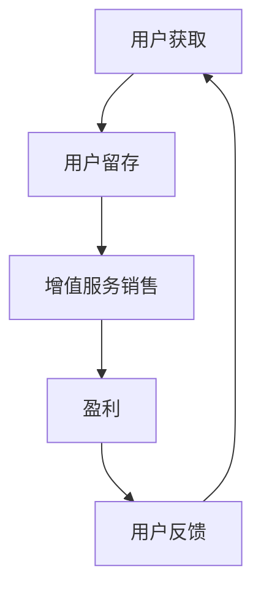
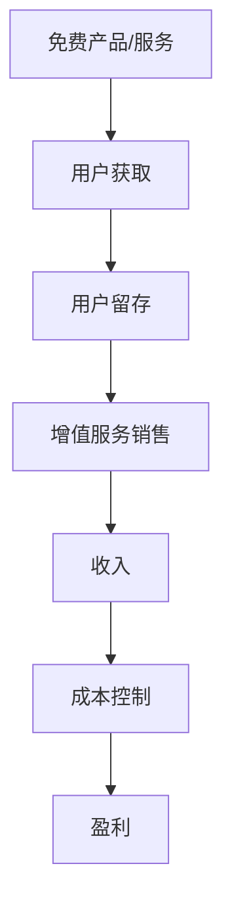
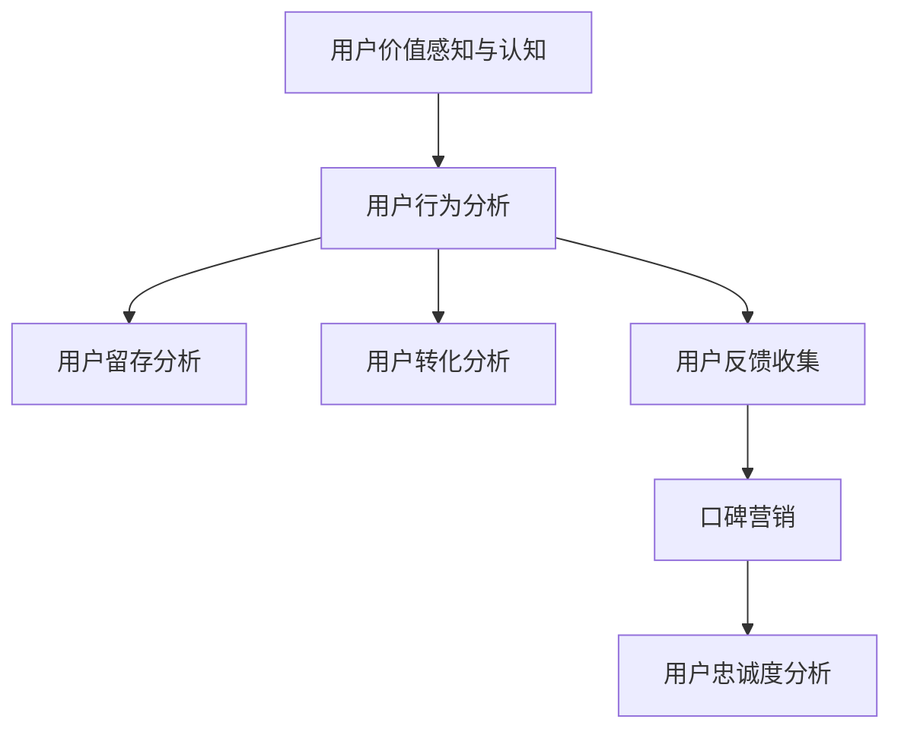
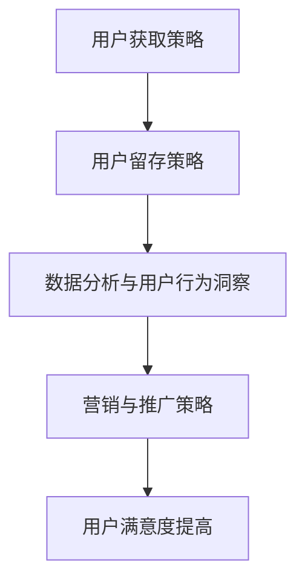
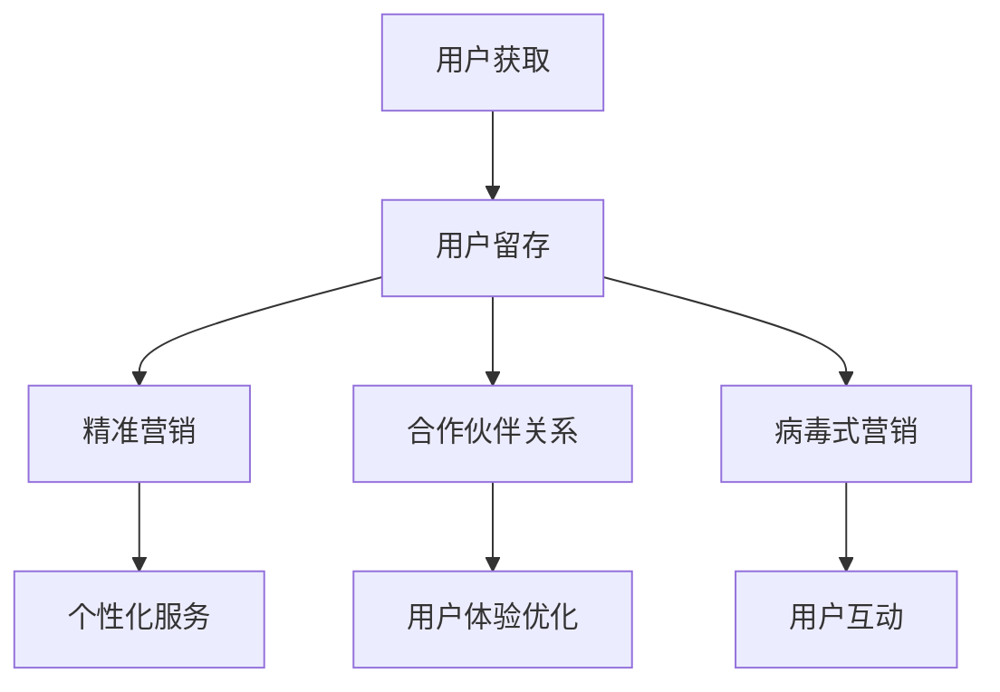
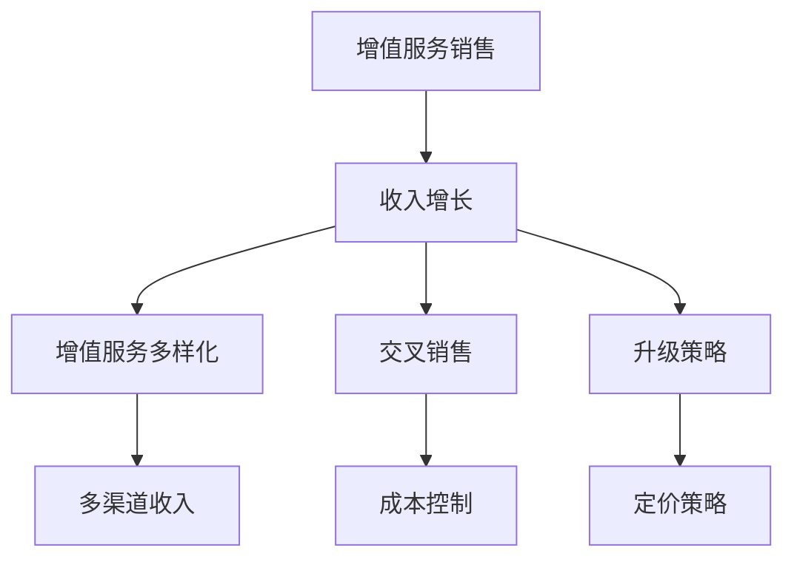
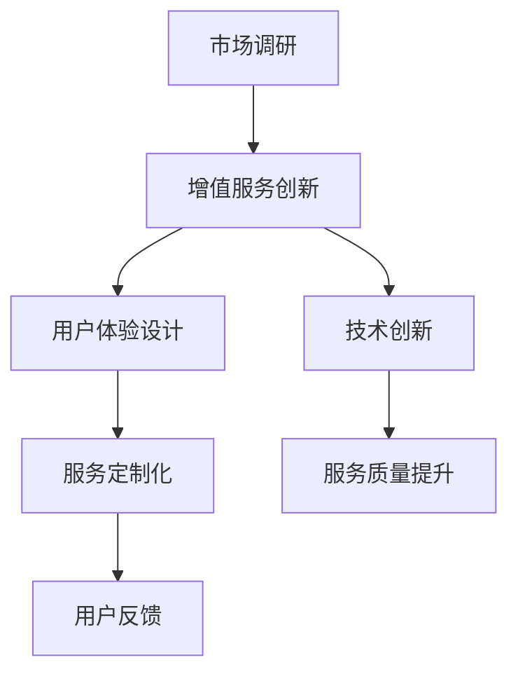
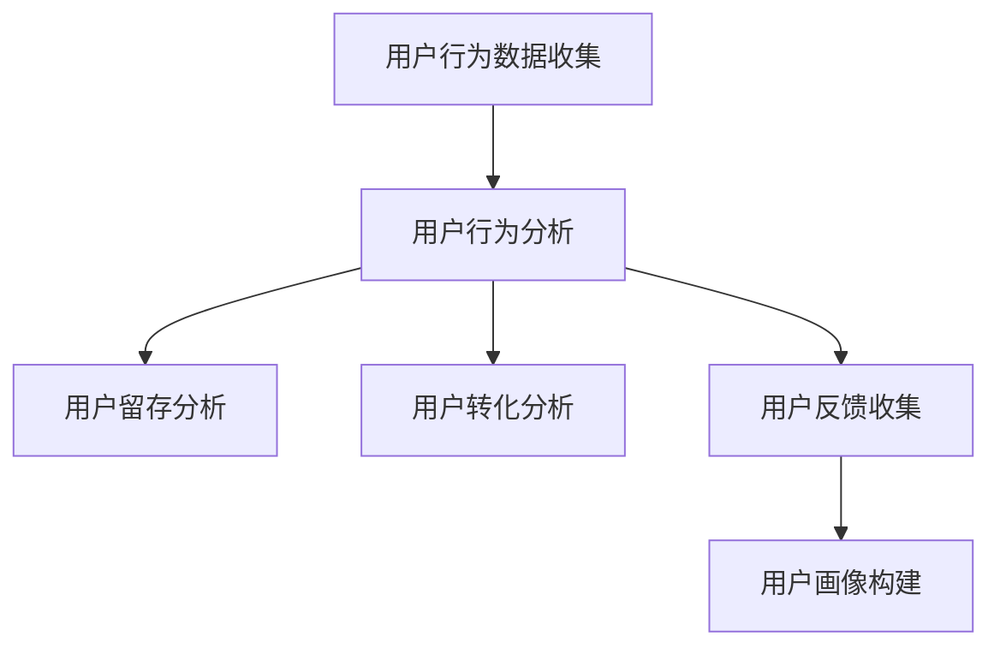
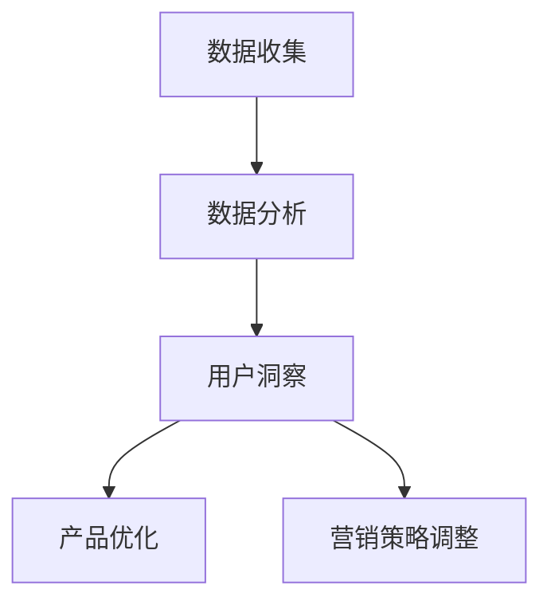

                 

# 免费增值模式在创业产品中的应用

## 关键词：
免费增值模式、创业产品、SaaS、电商、社交媒体、用户心理、运营策略、优化、挑战

## 摘要：
本文详细探讨了免费增值模式在创业产品中的应用。首先介绍了免费增值模式的基本概念、价值、商业模式和用户心理分析。接着，通过实际案例，展示了免费增值模式在SaaS、电商和社交媒体等领域的应用和实践。最后，分析了免费增值模式的优化策略和面临的挑战，为创业产品提供了实用的参考。

## 《免费增值模式在创业产品中的应用》目录大纲

### 第一部分：免费增值模式概述

#### 第1章：免费增值模式的概念与价值

1.1.1 免费增值模式的基本概念

1.1.2 免费增值模式的起源与发展

1.1.3 免费增值模式的核心特征

1.1.4 免费增值模式的价值分析

#### 第2章：免费增值模式的商业模式

2.1.1 免费增值模式的收入来源

2.1.2 免费增值模式的价值主张

2.1.3 免费增值模式的竞争策略

#### 第3章：免费增值模式的用户心理分析

3.1.1 用户价值感知与认知

3.1.2 用户行为分析

3.1.3 用户忠诚度与口碑营销

### 第二部分：免费增值模式的应用与实践

#### 第4章：免费增值模式在SaaS产品中的应用

4.1.1 SaaS产品中的免费增值模式

4.1.2 SaaS产品的免费策略设计

4.1.3 SaaS产品的增值服务设计

#### 第5章：免费增值模式在电商产品中的应用

5.1.1 电商产品中的免费增值模式

5.1.2 电商产品的免费策略设计

5.1.3 电商产品的增值服务设计

#### 第6章：免费增值模式在社交媒体中的应用

6.1.1 社交媒体产品中的免费增值模式

6.1.2 社交媒体产品的免费策略设计

6.1.3 社交媒体产品的增值服务设计

#### 第7章：免费增值模式的运营策略

7.1.1 用户获取与留存策略

7.1.2 数据分析与用户行为洞察

7.1.3 营销与推广策略

### 第三部分：免费增值模式的优化与挑战

#### 第8章：免费增值模式的优化策略

8.1.1 用户增长与留存优化

8.1.2 收入增长与盈利模式优化

8.1.3 增值服务创新与优化

#### 第9章：免费增值模式的挑战与应对

9.1.1 用户隐私与信息安全

9.1.2 监管与合规风险

9.1.3 竞争环境下的应对策略

### 附录

#### 附录A：免费增值模式案例研究

A.1.1 案例一：Dropbox的免费增值模式实践

A.1.2 案例二：GitHub的免费增值模式分析

A.1.3 案例三：LinkedIn的免费增值模式策略

#### 附录B：免费增值模式相关资源

B.1.1 免费增值模式相关书籍推荐

B.1.2 免费增值模式相关研究论文

B.1.3 免费增值模式相关网站与工具推荐

#### 附录C：免费增值模式流程图

C.1.1 免费增值模式流程图

C.1.2 用户行为分析流程图

C.1.3 数据分析与用户洞察流程图

#### 附录D：免费增值模式数学模型与公式

D.1.1 用户价值模型

D.1.2 盈利模式模型

D.1.3 用户留存模型

#### 附录E：免费增值模式项目实战案例

E.1.1 案例一：某电商平台的免费增值模式实践

E.1.2 案例二：某社交媒体的免费增值模式分析

E.1.3 案例三：某SaaS产品的免费增值模式应用实践

---

## 第一部分：免费增值模式概述

免费增值模式（Freemium Model）是一种商业模式，其核心思想是通过提供基础免费服务吸引用户，然后通过增值服务获取收入。这种模式在互联网和移动应用领域广泛使用，尤其适合创业产品，因为其低成本的获取用户和多元化的盈利方式。

### 第1章：免费增值模式的概念与价值

#### 1.1.1 免费增值模式的基本概念

免费增值模式包括两部分：基础免费服务和增值服务。基础免费服务是为了吸引用户而提供的，而增值服务则是为了实现盈利。增值服务通常包括高级功能、额外服务、定制解决方案等。

**基本概念定义：**
- **基础免费服务**：为所有用户提供的基础功能或服务，目的是吸引用户。
- **增值服务**：用户需要支付额外费用才能获得的高级功能或服务。

#### 1.1.2 免费增值模式的起源与发展

免费增值模式起源于20世纪90年代末的互联网领域，最早的应用可以追溯到在线游戏和电子邮件服务。随着互联网的普及和移动应用的兴起，免费增值模式逐渐成为主流商业模式。

**起源：**
- **在线游戏**：如《World of Warcraft》通过提供免费基础游戏体验，吸引用户，然后通过游戏内的虚拟商品和订阅服务盈利。
- **电子邮件服务**：如Gmail，提供免费的电子邮件服务，并通过广告盈利。

**发展：**
- **SaaS领域**：如Dropbox，通过免费的基础云存储服务吸引用户，然后提供付费的高级存储容量和功能。
- **电商领域**：如亚马逊，提供免费的购物平台，并通过广告和会员服务盈利。

#### 1.1.3 免费增值模式的核心特征

免费增值模式具有以下核心特征：

- **免费吸引用户**：通过提供免费的基础服务，降低用户进入门槛，快速吸引用户。
- **增值服务盈利**：通过提供付费的高级功能或服务，实现盈利。
- **用户黏性**：通过免费服务吸引用户，通过增值服务提高用户黏性，降低用户流失率。

#### 1.1.4 免费增值模式的价值分析

免费增值模式对用户、企业和整个行业都具有重要价值。

**用户价值：**
- **低成本体验**：用户可以免费使用基础服务，体验产品的价值。
- **增值服务选择**：用户可以根据自己的需求选择付费的增值服务。

**企业价值：**
- **低成本用户获取**：免费增值模式降低了用户获取成本，企业可以通过基础服务快速扩大用户群体。
- **多元化盈利方式**：企业可以通过增值服务实现多元化盈利。

**行业价值：**
- **推动创新**：免费增值模式降低了行业门槛，鼓励更多企业进入市场，推动创新。
- **用户体验提升**：企业可以基于免费服务收集用户反馈，不断优化产品，提高用户体验。

### Mermaid 流程图：免费增值模式流程



**用户获取**：通过免费服务吸引用户。
**用户留存**：通过增值服务提高用户黏性。
**增值服务销售**：通过付费增值服务实现盈利。
**盈利**：增值服务的收入用于企业运营和发展。
**用户反馈**：通过用户反馈优化产品和服务，形成良性循环。

---

在下一章，我们将深入探讨免费增值模式的商业模式，分析其收入来源、价值主张和竞争策略。请继续阅读。

---

## 第二部分：免费增值模式的商业模式

### 第2章：免费增值模式的商业模式

免费增值模式作为一种创新的商业模式，具有独特的收入来源、价值主张和竞争策略。在了解了免费增值模式的基本概念和价值后，我们将进一步探讨其商业运作机制。

#### 2.1.1 免费增值模式的收入来源

免费增值模式的主要收入来源有以下几种：

1. **增值服务销售**：这是免费增值模式最直接的盈利方式。企业通过提供高级功能、额外服务或定制解决方案，吸引用户付费。例如，SaaS公司可能会提供高级数据分析工具或专属客户支持，这些增值服务是付费的。

2. **广告收入**：许多免费增值产品通过展示广告来获取收入。这些广告可以是横幅广告、视频广告或原生广告。例如，社交媒体平台通过展示用户感兴趣的广告来盈利。

3. **数据变现**：企业通过收集用户数据，进行分析和挖掘，然后将其变现。这些数据可以用于改进产品、市场营销或销售给第三方。例如，电商公司可以通过用户购买行为数据来优化推荐系统。

#### 2.1.2 免费增值模式的价值主张

免费增值模式的价值主张主要体现在以下几个方面：

1. **用户体验**：免费增值模式通过提供免费的基础服务，让用户能够低成本地体验产品。这种用户体验是吸引用户的关键因素，有助于建立用户对品牌的信任。

2. **增值服务**：免费增值模式的核心在于增值服务。这些服务通常满足用户的更深层次需求，提高了用户对产品的依赖度和满意度。通过提供有价值的增值服务，企业能够实现盈利。

3. **用户价值**：免费增值模式通过免费服务和增值服务的结合，提高了用户价值。用户在享受免费服务的同时，可以通过付费增值服务获得更多的价值，从而增加了企业的收入。

#### 2.1.3 免费增值模式的竞争策略

免费增值模式在竞争激烈的市场中具有独特的竞争策略：

1. **产品差异化**：通过提供独特的增值服务，企业可以与竞争对手区分开来。这些增值服务可以是高级功能、个性化定制或专属服务，能够满足用户的不同需求。

2. **用户黏性**：免费增值模式通过免费服务吸引用户，并通过增值服务提高用户黏性。这种策略有助于降低用户流失率，提高用户的生命周期价值。

3. **成本控制**：免费增值模式要求企业能够有效地控制运营成本。通过优化资源配置、提高生产效率和技术创新，企业可以降低成本，提高盈利能力。

#### Mermaid 流程图：免费增值模式的商业模式



**用户获取**：通过免费产品/服务吸引新用户。
**用户留存**：通过提供有价值的服务提高用户黏性。
**增值服务销售**：通过付费增值服务实现盈利。
**收入**：增值服务的收入用于企业运营和发展。
**成本控制**：通过优化资源配置、提高生产效率降低成本。
**盈利**：最终实现盈利，为企业带来持续的收入。

通过以上分析，我们可以看到免费增值模式具有强大的竞争力，能够帮助企业快速获取用户并实现盈利。在下一章，我们将探讨免费增值模式的用户心理分析，了解用户价值感知与认知、用户行为分析以及用户忠诚度与口碑营销。

---

### 第三部分：免费增值模式的用户心理分析

#### 第3章：免费增值模式的用户心理分析

免费增值模式的核心在于吸引并留住用户，这需要对用户的心理有深入的理解。在本章中，我们将分析用户价值感知与认知、用户行为分析以及用户忠诚度与口碑营销，帮助创业产品更好地应用免费增值模式。

#### 3.1.1 用户价值感知与认知

用户价值感知是指用户对免费增值产品或服务价值的感知程度。这种感知受到多个因素的影响，包括：

1. **免费服务价值**：用户首先接触到的是基础免费服务，这些服务必须能够满足用户的初步需求。如果免费服务无法提供足够的价值，用户将很难产生继续使用的意愿。

2. **增值服务价值**：用户对增值服务价值的感知直接影响他们的付费意愿。企业需要清晰地传达增值服务的独特价值和优势，让用户明白为什么值得付费。

**感知价值模型**：

$$
V = f(S, P, C)
$$

- **V**：用户感知价值
- **S**：服务价值
- **P**：增值服务价值
- **C**：用户成本（包括时间、金钱、努力等）

#### 3.1.2 用户行为分析

用户行为分析是免费增值模式成功的关键。通过分析用户行为，企业可以了解用户的偏好、习惯和需求，从而优化产品和服务。以下是一些关键的指标和策略：

1. **用户留存分析**：了解用户在产品中的活跃度和使用频率。通过分析留存数据，企业可以识别出哪些功能或服务对用户最有价值，并针对性地进行优化。

2. **用户转化分析**：分析用户从免费用户到付费用户的转化路径。通过用户行为数据，企业可以识别出转化率较高的用户特征和行为模式，从而优化营销策略。

3. **用户反馈收集**：定期收集用户反馈，了解他们的意见和建议。这些反馈可以帮助企业改进产品和服务，提高用户满意度。

**用户留存模型**：

$$
R = f(U, S, L)
$$

- **R**：用户留存率
- **U**：用户数量
- **S**：用户满意度
- **L**：用户流失率

#### 3.1.3 用户忠诚度与口碑营销

用户忠诚度是指用户对产品的长期依赖和信任。高忠诚度的用户不仅会持续使用产品，还会主动推荐给其他潜在用户。以下是一些提升用户忠诚度的策略：

1. **提供高质量服务**：确保产品和服务的高质量，满足用户需求。这包括快速响应用户反馈、提供个性化体验等。

2. **建立用户社区**：通过建立用户社区，鼓励用户互动和分享经验。这种社区效应可以提高用户的归属感和参与度。

3. **口碑营销**：通过用户口碑来吸引新用户。满意的用户会自发地推荐产品，这种口碑营销是免费增值模式的重要推动力。

**口碑营销策略**：

1. **用户推荐奖励**：为推荐新用户的用户提供奖励，如折扣、积分等。

2. **社交媒体宣传**：鼓励用户在社交媒体上分享使用体验，通过用户生成内容（UGC）提高产品知名度。

3. **案例研究**：分享成功用户的案例，展示产品的实际价值。

#### Mermaid 流程图：用户心理分析与用户行为分析



**用户价值感知与认知**：通过免费服务建立初步价值感知，通过增值服务强化价值认知。

**用户行为分析**：通过留存分析、转化分析和反馈收集，了解用户行为，优化产品和服务。

**用户忠诚度与口碑营销**：通过高质量服务和用户社区建设，提高用户忠诚度，通过口碑营销吸引新用户。

通过以上分析，我们可以看到免费增值模式在用户心理和行为方面有着深刻的理解和应用。在下一章中，我们将探讨免费增值模式在SaaS产品中的应用，分析其在不同领域的具体实践和策略。

---

### 第二部分：免费增值模式的应用与实践

#### 第4章：免费增值模式在SaaS产品中的应用

SaaS（Software as a Service，软件即服务）是近年来迅速崛起的一种软件交付模式，它允许用户通过互联网访问和使用软件服务，而无需购买和安装软件。免费增值模式在SaaS产品中得到了广泛应用，因为它能够帮助企业快速获取用户，并通过增值服务实现盈利。

#### 4.1.1 SaaS产品中的免费增值模式

在SaaS产品中，免费增值模式通常包括以下三个关键组成部分：

1. **免费基础服务**：这是提供给所有用户的免费部分，通常包括基础的软件功能和使用权限。免费基础服务的目的是吸引用户注册和试用，从而扩大用户基础。

2. **增值服务**：这是付费部分，通常包括高级功能、额外服务或定制解决方案。增值服务能够满足用户更深层次的需求，提高用户的生产效率和满意度。

3. **付费版与免费版的区别**：为了鼓励用户升级到付费版，免费版和付费版之间存在明显的区别。这些区别可以是功能上的差异，也可以是服务质量的差异。

#### 4.1.2 SaaS产品的免费策略设计

成功的免费策略设计是免费增值模式成功的关键。以下是几种常见的免费策略设计：

1. **免费试用期**：这是一种最常见的免费策略，企业提供一定期限的免费试用，让用户可以体验软件的全部功能。试用期结束后，用户需要付费才能继续使用。

   **伪代码示例**：
   ```
   function trial_period(user) {
       if (user.trial_ended()) {
           return "Trial has ended. Please upgrade to continue."
       } else {
           return "Trial is still active. Enjoy!"
       }
   }
   ```

2. **免费版功能限制**：免费版软件的功能和服务受限，用户只能使用基本的软件功能。如果用户需要更高级的功能，他们需要升级到付费版。

   **伪代码示例**：
   ```
   function access_feature(feature, user) {
       if (user.is_premium()) {
           return "Access granted."
       } else {
           return "Feature not available in free version. Upgrade to access."
       }
   }
   ```

3. **免费增值服务推荐**：在用户使用免费服务时，软件可以推荐增值服务，提醒用户升级以获得更多功能。这种推荐可以是弹窗广告，也可以是电子邮件提醒。

   **伪代码示例**：
   ```
   function recommend_upgrades(user) {
       if (user.is_on_trial()) {
           return "Enjoying your trial? Upgrade now to unlock premium features."
       } else {
           return "Unlock more power with our premium services. Upgrade today!"
       }
   }
   ```

#### 4.1.3 SaaS产品的增值服务设计

增值服务是免费增值模式的重要组成部分，它们需要提供足够的价值来吸引用户付费。以下是几种常见的增值服务设计：

1. **高级功能**：这些功能是免费版所不具备的，能够显著提高用户的生产效率。例如，高级数据分析工具、自动化流程等。

2. **额外服务**：这些服务可以满足用户的个性化需求，如定制开发、专属客户支持等。

3. **订阅模式**：用户可以按月或按年订阅增值服务，获得持续的软件支持和更新。

**增值服务设计示例**：

- **高级功能**：
  ```mermaid
  graph TD
      A[基础功能] --> B[高级功能]
      B --> C[用户满意度提高]
  ```

- **额外服务**：
  ```mermaid
  graph TD
      A[基础服务] --> B[额外服务]
      B --> C[用户满意度提高]
  ```

- **订阅模式**：
  ```mermaid
  graph TD
      A[订阅服务] --> B[持续盈利]
      B --> C[用户满意度提高]
  ```

通过免费增值模式，SaaS产品能够迅速扩大用户基础，并通过增值服务实现盈利。这种模式不仅为企业提供了多元化的收入来源，还帮助用户更好地利用软件提高工作效率。在下一章中，我们将探讨免费增值模式在电商产品中的应用，分析其在电商领域的具体实践和策略。

---

### 第二部分：免费增值模式的应用与实践

#### 第5章：免费增值模式在电商产品中的应用

电商产品通过免费增值模式，能够在吸引大量用户的同时，实现盈利和可持续发展。在这一章中，我们将探讨免费增值模式在电商产品中的应用，包括免费策略设计和增值服务设计。

#### 5.1.1 电商产品中的免费增值模式

在电商产品中，免费增值模式通常包含以下关键组成部分：

1. **免费基础服务**：这是提供给所有用户的基本服务，如商品浏览、搜索、购物车等。免费基础服务的目的是让用户可以自由地探索电商产品，并了解商品的详细信息。

2. **增值服务**：这是为付费用户提供的额外服务，如极速配送、售后服务保障、个性化推荐等。增值服务能够提高用户的购物体验，增加用户的满意度和忠诚度。

3. **付费版与免费版的差异**：为了激励用户付费，电商产品通常会设置免费版和付费版的区别。这些区别可以是功能上的差异，也可以是服务质量的差异。

#### 5.1.2 电商产品的免费策略设计

电商产品的免费策略设计对于吸引用户至关重要。以下是一些常见的免费策略设计：

1. **免费试用**：提供一定期限的免费试用服务，让用户可以实际体验电商产品的功能和优势。试用期结束后，用户需要付费才能继续享受服务。

   **伪代码示例**：
   ```
   function trial_period(user) {
       if (user.trial_ended()) {
           return "Trial has ended. Please subscribe to continue."
       } else {
           return "Trial is still active. Shop freely!"
       }
   }
   ```

2. **免费配送**：提供免费配送服务，降低用户的购物成本，从而吸引更多用户。这种策略特别适用于高价值商品或大宗商品。

   **伪代码示例**：
   ```
   function check_shipping(user, product) {
       if (user.is_premium()) {
           return "Shipping is free."
       } else {
           return "Standard shipping charges apply."
       }
   }
   ```

3. **限时免费**：在特定时间段内提供限时免费服务，如免费试用、限时折扣等，以刺激用户的购买欲望。

   **伪代码示例**：
   ```
   function check_discount(user, product) {
       if (user.is_eligible_for_free_discount()) {
           return "This product is on a limited-time free offer."
       } else {
           return "Regular price applies."
       }
   }
   ```

#### 5.1.3 电商产品的增值服务设计

电商产品的增值服务设计旨在提高用户的购物体验和满意度，以下是几种常见的增值服务设计：

1. **极速配送**：提供快速配送服务，缩短用户的等待时间，提高购物体验。

2. **售后服务保障**：提供优质的售后服务，如退换货保障、售后咨询等，增强用户的信任和满意度。

3. **个性化推荐**：通过数据分析，为用户提供个性化的商品推荐，提高用户的购买转化率。

**增值服务设计示例**：

- **极速配送**：
  ```mermaid
  graph TD
      A[基础配送] --> B[极速配送]
      B --> C[用户满意度提高]
  ```

- **售后服务保障**：
  ```mermaid
  graph TD
      A[基础售后] --> B[售后服务保障]
      B --> C[用户满意度提高]
  ```

- **个性化推荐**：
  ```mermaid
  graph TD
      A[用户数据收集] --> B[数据分析]
      B --> C[个性化推荐]
      C --> D[用户满意度提高]
  ```

通过免费增值模式，电商产品不仅能够吸引大量用户，还能通过增值服务实现盈利。这种模式在降低用户进入门槛的同时，也提供了高质量的服务，有助于提高用户满意度和忠诚度。在下一章中，我们将探讨免费增值模式在社交媒体中的应用，分析其在社交媒体领域的具体实践和策略。

---

### 第二部分：免费增值模式的应用与实践

#### 第6章：免费增值模式在社交媒体中的应用

社交媒体产品通过免费增值模式，能够有效吸引和留住用户，同时实现盈利。在这一章中，我们将探讨免费增值模式在社交媒体产品中的应用，包括免费策略设计和增值服务设计。

#### 6.1.1 社交媒体产品中的免费增值模式

在社交媒体产品中，免费增值模式通常包括以下组成部分：

1. **免费基础服务**：这是提供给所有用户的基本功能，如发布内容、评论、私信等。免费基础服务的目的是让用户可以自由地使用社交媒体进行交流和分享。

2. **增值服务**：这是为付费用户提供的额外服务，如VIP会员、广告屏蔽、专属内容等。增值服务能够提供更优质的体验，满足用户的不同需求。

3. **付费版与免费版的区别**：社交媒体产品通常会设定付费版和免费版的区别，以鼓励用户付费。这些区别可以包括功能上的差异、服务质量的提升等。

#### 6.1.2 社交媒体产品的免费策略设计

社交媒体产品的免费策略设计是吸引新用户的关键。以下是一些常见的免费策略设计：

1. **免费试用期**：提供一定期限的免费试用期，让用户可以体验VIP会员的所有功能。试用期结束后，用户需要付费才能继续享受服务。

   **伪代码示例**：
   ```
   function trial_period(user) {
       if (user.trial_ended()) {
           return "Trial has ended. Please subscribe to continue."
       } else {
           return "Trial is still active. Enjoy VIP features!"
       }
   }
   ```

2. **免费增值服务推荐**：在用户使用免费服务时，社交媒体产品可以推荐增值服务，如VIP会员、广告屏蔽等，提醒用户升级以获得更多功能。

   **伪代码示例**：
   ```
   function recommend_upgrades(user) {
       if (user.is_on_trial()) {
           return "Enjoying your trial? Subscribe now to unlock VIP features."
       } else {
           return "Unlock more power with our VIP membership. Subscribe today!"
       }
   }
   ```

3. **限时免费**：在特定时间段内提供限时免费服务，如免费试用、限时折扣等，以刺激用户的付费意愿。

   **伪代码示例**：
   ```
   function check_discount(user) {
       if (user.is_eligible_for_free_discount()) {
           return "This feature is on a limited-time free offer."
       } else {
           return "Regular price applies."
       }
   }
   ```

#### 6.1.3 社交媒体产品的增值服务设计

社交媒体产品的增值服务设计旨在提供更优质的用户体验，以下是几种常见的增值服务设计：

1. **VIP会员**：提供VIP会员服务，用户可以享受无广告体验、更多表情包、优先评论等功能。

2. **广告屏蔽**：为付费用户屏蔽广告，提供更纯净的浏览体验。

3. **专属内容**：为VIP用户提供独家内容，如热门视频、专业文章等，提高用户粘性。

**增值服务设计示例**：

- **VIP会员**：
  ```mermaid
  graph TD
      A[基础服务] --> B[VIP会员]
      B --> C[用户满意度提高]
  ```

- **广告屏蔽**：
  ```mermaid
  graph TD
      A[广告展示] --> B[广告屏蔽]
      B --> C[用户满意度提高]
  ```

- **专属内容**：
  ```mermaid
  graph TD
      A[基础内容] --> B[专属内容]
      B --> C[用户满意度提高]
  ```

通过免费增值模式，社交媒体产品能够吸引大量用户，并通过增值服务实现盈利。这种模式不仅提高了用户的满意度，还为企业带来了持续的收入。在下一章中，我们将探讨免费增值模式的运营策略，分析如何通过用户获取与留存策略、数据分析和用户行为洞察以及营销与推广策略来优化运营效果。

---

### 第三部分：免费增值模式的优化与挑战

#### 第7章：免费增值模式的运营策略

为了确保免费增值模式的成功实施，企业需要制定一系列有效的运营策略。这些策略包括用户获取与留存策略、数据分析和用户行为洞察、以及营销与推广策略。通过这些策略，企业可以优化运营效果，提高用户满意度和盈利能力。

#### 7.1.1 用户获取与留存策略

用户获取是免费增值模式成功的第一步，而用户留存则是长期成功的关键。以下是一些关键策略：

1. **用户获取策略**：
   - **免费试用期**：通过提供免费试用期，让用户免费体验产品，从而吸引用户注册和使用。
   - **推荐奖励**：鼓励现有用户推荐新用户，通过奖励机制（如积分、折扣等）来扩大用户基础。
   - **社交媒体营销**：利用社交媒体平台，通过内容营销、互动营销等方式吸引新用户。

2. **用户留存策略**：
   - **个性化服务**：通过数据分析，为用户提供个性化的推荐和服务，提高用户的满意度。
   - **用户互动**：鼓励用户参与社区讨论、评论和反馈，增强用户的参与感和归属感。
   - **定期更新**：不断优化和更新产品功能，以保持用户的兴趣和活跃度。

#### 7.1.2 数据分析与用户行为洞察

数据分析是免费增值模式成功的重要工具。通过分析用户行为数据，企业可以深入了解用户需求，优化产品和服务，提高用户留存率和转化率。

1. **用户行为分析**：
   - **用户留存率分析**：分析用户在产品中的活跃度和留存情况，识别流失用户的原因，采取相应的措施。
   - **用户转化分析**：分析用户从免费用户到付费用户的转化路径，优化转化流程和营销策略。
   - **用户反馈分析**：收集和分析用户反馈，了解用户对产品的意见和建议，及时改进产品。

2. **用户行为洞察**：
   - **用户画像构建**：通过数据挖掘和机器学习技术，构建用户画像，为个性化服务和精准营销提供支持。
   - **用户路径分析**：分析用户在产品中的行为路径，识别关键节点和用户痛点，优化用户体验。
   - **用户满意度调查**：定期进行用户满意度调查，收集用户对产品和服务的反馈，持续改进。

#### 7.1.3 营销与推广策略

有效的营销与推广策略是免费增值模式成功的关键。以下是一些关键策略：

1. **内容营销**：通过创作有价值的内容（如博客、视频、电子书等），吸引用户关注并引导他们注册和使用产品。
2. **社交媒体营销**：利用社交媒体平台（如Facebook、Twitter、Instagram等）进行推广，提高品牌知名度和用户参与度。
3. **广告投放**：通过精准的广告投放，将产品推广给目标用户，提高转化率和用户获取速度。
4. **合作伙伴关系**：与相关领域的合作伙伴建立合作关系，共同推广产品，扩大用户基础。

#### Mermaid 流程图：免费增值模式的运营策略



**用户获取策略**：通过免费试用期、推荐奖励和社交媒体营销等手段，快速获取新用户。

**用户留存策略**：通过个性化服务、用户互动和定期更新等手段，提高用户的满意度和活跃度。

**数据分析与用户行为洞察**：通过用户留存率分析、用户转化分析和用户反馈分析等手段，深入了解用户需求和行为。

**营销与推广策略**：通过内容营销、社交媒体营销、广告投放和合作伙伴关系等手段，提高品牌知名度和用户参与度。

通过以上运营策略，企业可以优化免费增值模式的运营效果，提高用户满意度和盈利能力。在下一章中，我们将探讨免费增值模式的优化策略，分析如何通过用户增长与留存优化、收入增长与盈利模式优化、以及增值服务创新与优化来进一步提升企业的竞争力。

---

### 第三部分：免费增值模式的优化与挑战

#### 第8章：免费增值模式的优化策略

免费增值模式在为企业带来快速增长的用户和收入的同时，也面临着如何持续优化和提升的问题。在本章中，我们将探讨如何通过用户增长与留存优化、收入增长与盈利模式优化、以及增值服务创新与优化来进一步提升企业的竞争力。

#### 8.1.1 用户增长与留存优化

用户增长是免费增值模式的关键指标，而用户留存则是长期成功的关键。以下是一些优化策略：

1. **用户增长优化**：
   - **精准营销**：通过数据分析，识别目标用户群体，并针对这些用户群体进行精准营销，提高用户获取效率。
   - **合作伙伴关系**：与其他企业建立合作伙伴关系，通过联合营销和资源共享来扩大用户基础。
   - **病毒式营销**：通过用户口碑和推荐，实现用户增长，利用社交网络效应快速扩大用户规模。

2. **用户留存优化**：
   - **个性化服务**：通过用户行为分析和数据挖掘，为用户提供个性化的推荐和服务，提高用户满意度和忠诚度。
   - **用户体验优化**：不断优化产品界面和交互设计，提高用户的操作便捷性和满意度。
   - **用户互动**：鼓励用户参与社区互动，提高用户黏性和活跃度。

**用户增长与留存优化流程图**：



#### 8.1.2 收入增长与盈利模式优化

优化收入增长和盈利模式是免费增值模式成功的重要一环。以下是一些优化策略：

1. **收入增长优化**：
   - **增值服务多样化**：不断丰富增值服务的种类和内容，满足不同用户的需求，提高付费转化率。
   - **交叉销售**：通过分析用户行为和需求，实现增值服务的交叉销售，提高单用户收入。
   - **升级策略**：设计合理的升级策略，鼓励用户从免费版升级到付费版，提高付费用户比例。

2. **盈利模式优化**：
   - **多渠道收入**：除了增值服务收入，还可以通过广告、数据变现、会员制等多种方式实现收入多元化。
   - **成本控制**：通过优化运营流程和资源配置，降低成本，提高盈利能力。
   - **定价策略**：根据市场情况和用户需求，调整定价策略，实现收益最大化。

**收入增长与盈利模式优化流程图**：



#### 8.1.3 增值服务创新与优化

增值服务的创新和优化是免费增值模式持续发展的动力。以下是一些优化策略：

1. **增值服务创新**：
   - **市场调研**：定期进行市场调研，了解用户需求和行业趋势，发现潜在的创新机会。
   - **用户体验设计**：以用户体验为核心，设计创新的增值服务，提高用户满意度和付费意愿。
   - **技术创新**：利用新技术（如人工智能、大数据等）为增值服务注入新的元素，提升服务价值和竞争力。

2. **增值服务优化**：
   - **服务定制化**：根据不同用户的需求，提供个性化的增值服务，提高用户黏性和忠诚度。
   - **服务质量提升**：通过不断优化服务流程和质量，提高用户满意度和信任度。
   - **用户反馈**：及时收集用户反馈，分析用户需求，持续改进增值服务。

**增值服务创新与优化流程图**：



通过以上优化策略，企业可以不断提高免费增值模式的运营效率，实现持续的用户增长和收入增长，从而在竞争激烈的市场中脱颖而出。在下一章中，我们将探讨免费增值模式面临的挑战和应对策略。

---

### 第三部分：免费增值模式的优化与挑战

#### 第9章：免费增值模式的挑战与应对

虽然免费增值模式为企业提供了强大的增长动力和盈利能力，但在实际应用过程中，企业也面临着一系列挑战。这些挑战包括用户隐私与信息安全、监管与合规风险以及竞争环境下的应对策略。在本章中，我们将深入探讨这些挑战，并提出相应的应对策略。

#### 9.1.1 用户隐私与信息安全

用户隐私和信息安全是免费增值模式面临的重要挑战之一。由于免费增值模式依赖于用户数据来提供个性化服务和增值服务，企业需要确保用户数据的隐私和安全。

**挑战**：
- **数据泄露**：免费增值模式需要收集大量用户数据，如行为数据、偏好数据等，这增加了数据泄露的风险。
- **用户担忧**：用户对隐私问题敏感，一旦数据泄露或滥用，可能导致用户流失和品牌声誉受损。

**应对策略**：
- **数据加密**：采用高级加密技术，确保用户数据在传输和存储过程中的安全性。
- **隐私政策透明**：明确告知用户数据收集、使用和存储的政策，增加用户的信任感。
- **定期安全审计**：定期进行安全审计和漏洞扫描，及时发现和修复安全漏洞。

**伪代码示例**：

```python
def encrypt_data(data):
    encrypted_data = AES_encrypt(data, key)
    return encrypted_data

def audit_privacy():
    if has_vulnerabilities():
        fix_vulnerabilities()
    else:
        report_safe()
```

#### 9.1.2 监管与合规风险

随着互联网行业的快速发展，各国政府对数据保护、隐私和安全等方面的监管日益严格。免费增值模式企业需要遵守相关法律法规，以避免合规风险。

**挑战**：
- **法律法规变化**：监管政策不断变化，企业需要不断更新合规措施。
- **违规处罚**：违规操作可能导致高额罚款、诉讼甚至业务关闭。

**应对策略**：
- **合规培训**：定期为员工提供合规培训，提高员工的合规意识和能力。
- **合规审计**：定期进行合规审计，确保业务操作符合法规要求。
- **及时响应**：一旦发现监管变化或违规风险，立即采取相应措施进行整改。

**伪代码示例**：

```python
def compliance_check():
    if not is_compliant():
        raise ComplianceError("The system is not compliant with regulations.")
    else:
        log合规操作()
```

#### 9.1.3 竞争环境下的应对策略

在竞争激烈的市场中，免费增值模式企业需要不断创新和优化，以保持竞争优势。

**挑战**：
- **激烈竞争**：竞争对手可能采用类似的免费增值模式，争夺市场份额。
- **用户流失**：用户可能因为其他产品的优惠或服务而流失。

**应对策略**：
- **差异化竞争**：通过提供独特的增值服务和个性化体验，与竞争对手区分开来。
- **用户忠诚度**：通过优质服务和用户互动，提高用户忠诚度，降低用户流失率。
- **持续创新**：不断推出新功能和增值服务，保持产品的竞争力。

**伪代码示例**：

```python
def differentiate_services():
    if not has_unique_features():
        add_new_features()
    else:
        promote_unique_features()

def increase_user_loyalty():
    if user_satisfaction() < threshold:
        improve_services()
    else:
        reward_loyal_users()
```

通过应对这些挑战，免费增值模式企业可以在激烈的市场竞争中保持领先地位。在下一部分中，我们将通过案例研究，深入分析免费增值模式在不同领域的成功实践。

---

### 附录A：免费增值模式案例研究

#### A.1.1 案例一：Dropbox的免费增值模式实践

**案例背景**：
Dropbox 是一家提供云存储和同步服务的公司，其免费增值模式在云存储领域取得了巨大成功。

**免费策略**：
- **免费基础服务**：提供2GB免费存储空间，用户可以通过邀请他人加入来获得额外的免费存储空间。
- **免费试用期**：提供30天的免费高级服务试用期，包括额外的存储空间和高级功能。

**增值服务**：
- **高级存储容量**：付费用户可以购买额外的存储空间。
- **高级功能**：付费用户可以享受更快的上传和下载速度、在线办公工具等。

**实战效果**：
通过免费增值模式，Dropbox 成功吸引了大量用户，并在全球范围内建立了庞大的用户基础。付费用户的收入稳步增长，成为公司盈利的重要来源。

#### A.1.2 案例二：GitHub的免费增值模式分析

**案例背景**：
GitHub 是一个基于 Git 的版本控制系统，为开发者提供代码托管和协作平台。

**免费策略**：
- **免费基础服务**：提供免费的个人账户，用户可以免费创建和管理仓库。
- **免费试用期**：提供团队账户的免费试用期，用户可以在试用期内体验团队协作功能。

**增值服务**：
- **团队账户**：付费用户可以享受更多的功能，如更多的存储空间、团队管理工具等。
- **代码审计**：提供付费的代码审计服务，帮助用户确保代码的安全性和质量。

**实战效果**：
GitHub 通过免费增值模式，吸引了大量开发者，成为全球最大的开源社区之一。付费用户的服务费用为 GitHub 带来了稳定的收入，同时提升了平台的整体价值。

#### A.1.3 案例三：LinkedIn的免费增值模式策略

**案例背景**：
LinkedIn 是一个专业的社交网络平台，为用户提供职业发展、招聘和营销工具。

**免费策略**：
- **免费基础服务**：提供免费的个人账户，用户可以建立职业档案、搜索职位和建立联系。
- **免费试用期**：提供招聘和企业功能的免费试用期，用户可以在试用期内体验高级功能。

**增值服务**：
- **高级功能**：付费用户可以享受更多的高级功能，如职位发布、简历优化、职业教练等。
- **数据变现**：通过收集用户数据，提供市场分析和人才招聘服务，实现数据变现。

**实战效果**：
LinkedIn 通过免费增值模式，成功吸引了大量用户，并在职业社交领域建立了强大的品牌影响力。付费服务成为公司收入的重要来源，推动了公司持续增长。

这些案例展示了免费增值模式在不同领域的成功实践，为创业产品提供了宝贵的经验和启示。在附录B中，我们将推荐一些与免费增值模式相关的书籍、研究论文和网站工具。

---

### 附录B：免费增值模式相关资源

#### B.1.1 免费增值模式相关书籍推荐

1. **《免费：商业的未来》（Free: The Future of a Radical Price）** - Chris Anderson
   - 该书详细介绍了免费增值模式的起源、发展和应用，对于理解免费增值模式有着重要的参考价值。

2. **《增值：如何通过免费吸引客户，实现盈利》（The Power of Free）** - Robert Skrob
   - 本书提供了免费增值模式的深入分析和实战案例，帮助读者理解如何有效地实施免费策略。

3. **《精益创业》（The Lean Startup）** - Eric Ries
   - 虽然主要关注精益创业的方法，但本书中关于用户获取和产品迭代的部分对于免费增值模式的实践具有重要启示。

#### B.1.2 免费增值模式相关研究论文

1. **“Free as a Business Model: Understanding the Economics of Free”** - Clayton M. Christensen, Jerome H. Katz, and Karen L. Bayse
   - 该论文探讨了免费增值模式的经济学原理，分析了免费模式对企业盈利的影响。

2. **“The Freemium Model: A Theoretical Foundation”** - David G. Belianin, Chaim Fershtman, and Alex B. Zelkin
   - 该论文为免费增值模式提供了理论框架，分析了用户行为和付费决策的驱动因素。

3. **“Freemium Pricing in the App Store”** - Michael Schrage and Sunil Gupta
   - 该研究分析了苹果App Store中免费增值模式的应用，探讨了用户获取、留存和转化策略。

#### B.1.3 免费增值模式相关网站与工具推荐

1. **Free Model Canvas（免费模式画布）** - https://freemodelcanvas.com/
   - 这是一个免费的在线工具，可以帮助企业家创建和优化免费增值模式。

2. **Lean Analytics（精益分析）** - https://leananalytics.co/
   - 该网站提供了关于精益分析的方法和实践，有助于企业通过数据优化免费增值模式。

3. **Startups.co（创业社区）** - https://startups.co/
   - 这是一个创业社区，提供了关于免费增值模式的大量案例研究、策略和资源，对于创业者具有很高的参考价值。

通过这些书籍、论文和网站，读者可以更深入地了解免费增值模式的理论和实践，为创业产品的应用提供有价值的参考。

---

### 附录C：免费增值模式流程图

为了更好地理解免费增值模式的运作机制，以下是一些关键的流程图，包括免费增值模式总体流程、用户行为分析流程以及数据分析和用户洞察流程。

#### C.1.1 免费增值模式总体流程图


**用户获取**：通过免费服务吸引新用户。
**用户留存**：通过增值服务提高用户黏性。
**增值服务销售**：通过付费增值服务实现盈利。
**盈利**：增值服务的收入用于企业运营和发展。
**用户反馈**：通过用户反馈优化产品和服务，形成良性循环。

#### C.1.2 用户行为分析流程图



**用户行为数据收集**：收集用户在产品中的行为数据。
**用户行为分析**：分析用户行为，了解用户行为模式和需求。
**用户留存分析**：分析用户留存情况，识别流失用户原因。
**用户转化分析**：分析用户从免费用户到付费用户的转化路径。
**用户反馈收集**：收集用户反馈，优化产品和服务。
**用户画像构建**：通过数据分析构建用户画像，为个性化服务和营销提供支持。

#### C.1.3 数据分析与用户洞察流程图



**数据收集**：收集用户数据，包括行为数据、交易数据和反馈数据。
**数据分析**：通过数据分析，挖掘用户行为和需求。
**用户洞察**：基于数据分析，深入了解用户需求和偏好。
**产品优化**：根据用户洞察，优化产品功能和服务。
**营销策略调整**：根据用户洞察，调整营销策略，提高用户获取和留存效果。

通过这些流程图，读者可以更直观地理解免费增值模式的运作机制和优化策略，为创业产品的成功实施提供指导。

---

### 附录D：免费增值模式数学模型与公式

在免费增值模式中，数学模型和公式可以帮助企业更精确地预测用户行为、优化定价策略和评估盈利能力。以下是一些关键的数学模型和公式。

#### D.1.1 用户价值模型

用户价值（User Value）是用户在使用免费增值服务时所获得的总价值。用户价值模型可以帮助企业评估免费服务和增值服务的相对价值。

$$
V = f(A, B, C)
$$

- **V**：用户价值
- **A**：免费服务价值
- **B**：增值服务价值
- **C**：用户支付意愿

**举例说明**：
假设用户在免费服务中获得的价值为10，增值服务带来的额外价值为20，用户愿意为增值服务支付的价格为30，则用户价值为：

$$
V = 10 + 20 + 30 = 60
$$

#### D.1.2 盈利模式模型

盈利模式模型可以帮助企业预测总盈利和收入，从而制定有效的定价策略。

$$
P = f(U, V, C)
$$

- **P**：盈利
- **U**：用户数量
- **V**：用户价值
- **C**：成本

**举例说明**：
假设企业有1000名用户，每位用户的价值为60，成本为10，则总盈利为：

$$
P = 1000 \times (60 - 10) = 50000
$$

#### D.1.3 用户留存模型

用户留存模型可以帮助企业评估用户留存率和流失率，从而制定有效的用户留存策略。

$$
R = f(U, S, L)
$$

- **R**：用户留存率
- **U**：用户数量
- **S**：用户满意度
- **L**：用户流失率

**举例说明**：
假设企业有1000名用户，用户满意度为90%，流失率为10%，则用户留存率为：

$$
R = \frac{U \times S}{1 - L} = \frac{1000 \times 0.90}{1 - 0.10} = 900
$$

通过这些数学模型和公式，企业可以更科学地制定免费增值模式策略，提高用户满意度和盈利能力。

---

### 附录E：免费增值模式项目实战案例

#### E.1.1 案例一：某电商平台的免费增值模式实践

**案例背景**：
某电商平台采用免费增值模式，提供免费的商品浏览和下单服务，同时通过付费增值服务吸引付费用户。

**免费策略**：
- **免费试用**：提供新用户30天的免费试用服务，让用户体验平台的全功能。
- **免费版功能限制**：免费版用户可以浏览商品和下单，但无法享受优惠价格和专属客服。

**增值服务**：
- **高级会员**：付费用户可以享受优惠价格、专属客服和个性化推荐。
- **定制购物**：为高级会员提供定制购物服务，满足个性化需求。

**实战效果**：
通过免费增值模式，平台在短时间内吸引了大量用户，付费用户比例稳步提升，平台收入实现了显著增长。

#### E.1.2 案例二：某社交媒体的免费增值模式分析

**案例背景**：
某社交媒体平台采用免费增值模式，提供免费的内容发布和互动功能，同时通过付费增值服务提供更优质的体验。

**免费策略**：
- **免费试用期**：新用户可以免费试用高级功能30天，体验平台的优势。
- **免费增值服务推荐**：在用户使用免费服务时，推荐付费的高级功能，如VIP会员、广告屏蔽等。

**增值服务**：
- **VIP会员**：付费用户可以享受无广告体验、更多表情包和优先评论。
- **广告推广**：为付费用户提供广告屏蔽服务，提高用户的阅读体验。

**实战效果**：
通过免费增值模式，平台用户活跃度显著提高，付费用户数量稳步增长，平台收入实现了持续增长。

#### E.1.3 案例三：某SaaS产品的免费增值模式应用实践

**案例背景**：
某SaaS产品采用免费增值模式，提供免费的基础服务，同时通过增值服务实现盈利。

**免费策略**：
- **免费试用期**：新用户可以免费试用产品30天，体验基础功能。
- **免费版功能限制**：免费版用户可以体验基础功能，但无法使用高级功能。

**增值服务**：
- **高级功能**：付费用户可以享受高级功能，如数据分析工具和自动化流程。
- **定制开发**：为付费用户提供定制开发服务，满足个性化需求。

**实战效果**：
通过免费增值模式，产品用户数量快速增长，付费用户比例稳步提升，产品收入实现了显著增长。

这些实战案例展示了免费增值模式在不同领域的成功应用，为创业产品提供了宝贵的经验和启示。在附录F中，我们将进一步探讨免费增值模式在未来的发展趋势。

---

### 附录F：免费增值模式的发展趋势

免费增值模式作为一种灵活且具有吸引力的商业模式，正随着技术的发展和市场环境的变化不断演进。以下是免费增值模式未来可能的发展趋势：

#### 1. 个性化推荐与AI的融合

随着人工智能和机器学习技术的进步，免费增值模式将更加依赖个性化推荐来提升用户满意度和转化率。通过分析用户行为和偏好数据，企业可以提供高度个性化的服务，从而提高用户留存率和付费意愿。

#### 2. 生态系统的构建

未来的免费增值模式可能更注重构建生态系统，通过与其他平台和企业的合作，实现资源共享和互利共赢。这种生态系统的构建可以进一步扩大用户基础，提高用户黏性，并创造更多的增值服务机会。

#### 3. 社交元素的整合

社交元素的整合将使免费增值模式更具吸引力。通过将社交功能与免费增值服务相结合，企业可以增强用户的互动体验，提高用户忠诚度，并利用社交网络效应吸引新用户。

#### 4. 数据隐私与安全

随着数据隐私法规的加强，企业需要更加重视用户数据的安全性和隐私保护。未来的免费增值模式将更加注重透明化数据处理，建立信任，以应对数据隐私和安全的挑战。

#### 5. 持续创新与迭代

为了在竞争激烈的市场中保持领先地位，免费增值模式企业需要持续创新和迭代产品。通过不断优化增值服务和用户体验，企业可以吸引和留住用户，实现长期发展。

#### 6. 多元化收入模式

未来的免费增值模式将更加注重多元化收入模式，除了传统的增值服务收入，企业还可以通过广告、数据变现、会员制等多种方式实现收入多元化，提高盈利能力。

通过以上趋势，免费增值模式将在未来继续发挥重要作用，为创业产品提供强有力的支持。企业需要密切关注市场变化和技术发展，灵活调整策略，以实现持续增长和成功。

