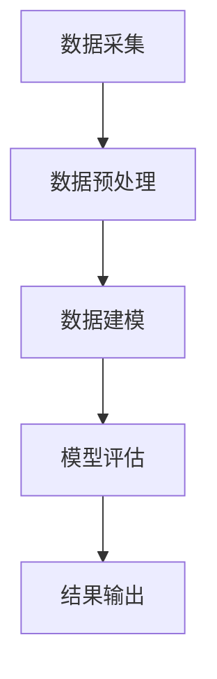
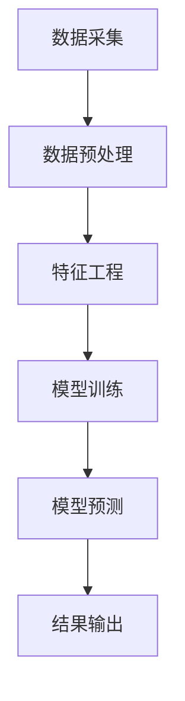

                 

# 《可穿戴设备的健康监测：生理指标的数学分析》

> **关键词**：可穿戴设备、健康监测、生理指标、数学分析、机器学习、算法应用
>
> **摘要**：本文从可穿戴设备与健康监测的基本概念出发，探讨了生理指标在健康监测中的重要性。通过数学分析和机器学习算法，深入探讨了生理指标的获取、处理、建模及分析的方法和应用，为可穿戴设备在健康管理中的应用提供了理论和技术支持。

### 引言

随着科技的发展，可穿戴设备已经成为人们日常生活中不可或缺的一部分。它们能够实时监测用户的生理指标，如心率、血压、血氧饱和度等，为用户的健康管理提供了便捷的手段。然而，如何准确地获取和处理这些生理指标数据，如何利用这些数据进行健康监测和疾病预测，仍然是一个具有挑战性的课题。

本文旨在通过深入分析可穿戴设备的健康监测机制，探讨生理指标的数学建模和分析方法，以及机器学习在健康监测中的应用，为可穿戴设备在健康管理中的应用提供理论和技术支持。

文章将首先介绍可穿戴设备与健康监测的基本概念，然后探讨生理指标的获取和处理方法，接着讨论生理指标的数学建模和分析方法，最后通过实际案例展示机器学习在健康监测中的应用。

### 第一部分：基础概念与原理

#### 第1章：可穿戴设备与健康监测

##### 1.1 可穿戴设备概述

可穿戴设备是指直接穿在身上或与衣物相整合的设备，它们能够通过内置的传感器实时监测用户的生理指标，并将数据传输到手机、电脑等设备上进行分析。可穿戴设备可以分为以下几类：

1. **健康监测设备**：如心率监测器、血压计、血氧饱和度计等。
2. **运动追踪设备**：如智能手环、智能手表等。
3. **医疗设备**：如血糖监测仪、呼吸机等。

##### 1.2 健康监测的重要性

健康监测在个人健康管理、社会健康管理和医疗成本控制等方面具有重要意义：

1. **个人健康管理**：通过健康监测，用户可以实时了解自己的健康状况，及时调整生活方式，预防疾病的发生。
2. **社会健康管理**：健康监测数据可以用于社会健康状况的评估，帮助政府和社会组织制定更有效的健康政策。
3. **医疗成本控制**：健康监测可以帮助早期发现疾病，减少患者的医疗费用，降低医疗成本。

##### 1.3 常见可穿戴设备介绍

常见的可穿戴设备包括：

1. **心率监测器**：通过光电传感器实时监测用户的心率，可用于运动监测、心率过快或过慢的预警等。
2. **血压计**：通过压力传感器监测用户的血压，有助于高血压等心血管疾病的预防和管理。
3. **血氧饱和度计**：通过光学传感器监测用户的血氧饱和度，对呼吸系统疾病的监测和诊断具有重要意义。
4. **运动追踪器**：通过加速度传感器等监测用户的运动数据，如步数、运动时长、运动强度等。

#### 第2章：生理指标概述

##### 2.1 生理指标的基本概念

生理指标是指反映人体生理状态的各项指标，如心率、血压、血氧饱和度、体温等。这些指标可以通过不同的传感器进行测量，从而为健康监测提供基础数据。

##### 2.2 常见生理指标及其意义

常见的生理指标包括：

1. **心率**：反映心脏的泵血能力，与身体健康密切相关。
2. **血压**：反映血管内的血液压力，是心血管疾病的重要指标。
3. **血氧饱和度**：反映血液中的氧气含量，对呼吸系统疾病的监测和诊断具有重要意义。
4. **体温**：反映身体的代谢状态，与免疫系统和疾病密切相关。

#### 第3章：健康监测数据的获取和处理

##### 3.1 数据采集方法

健康监测数据的获取主要依赖于各种传感器，如光电传感器、压力传感器、光学传感器等。这些传感器能够实时监测用户的生理指标，并将数据传输到设备上。

##### 3.2 数据预处理

数据预处理是健康监测数据处理的第一个步骤，主要包括以下内容：

1. **数据清洗**：去除数据中的噪声和异常值，保证数据的准确性。
2. **数据标准化**：将不同传感器获取的数据进行归一化处理，使其具有可比性。
3. **数据整合**：将多个传感器获取的数据进行整合，形成一个完整的数据集。

##### 3.3 数据分析方法

数据分析方法是健康监测数据处理的最后一个步骤，主要包括以下内容：

1. **描述性统计分析**：对数据的基本特征进行描述，如平均值、方差、标准差等。
2. **趋势分析**：分析数据随时间变化的趋势，如心率的变化趋势等。
3. **相关性分析**：分析不同生理指标之间的关系，如心率和血压之间的关系等。

#### 第4章：生理指标的数学模型

##### 4.1 生理指标的数据分布

生理指标的数据分布通常符合一定的统计学分布，如正态分布、拉普拉斯分布等。通过分析生理指标的数据分布，可以更好地理解生理指标的变化规律。

##### 4.2 统计学基础

统计学基础是生理指标数学分析的基础，主要包括概率论、参数估计、假设检验等内容。通过统计学基础，可以对生理指标进行定量分析和推断。

##### 4.3 生理指标的数学建模

生理指标的数学建模是健康监测的核心，主要包括以下内容：

1. **模型选择**：选择合适的数学模型来描述生理指标的变化规律。
2. **模型拟合**：将实际数据与模型进行拟合，找到最佳模型参数。
3. **模型评估**：评估模型的准确性和可靠性，确保模型的有效性。

#### 第5章：生理指标分析中的机器学习算法

##### 5.1 机器学习基础

机器学习是生理指标分析的重要工具，主要包括以下内容：

1. **监督学习**：通过已标记的数据训练模型，对新数据进行预测。
2. **无监督学习**：通过未标记的数据发现数据的结构和模式。
3. **强化学习**：通过不断试错来学习最佳策略。

##### 5.2 常见的机器学习算法

常见的机器学习算法包括：

1. **线性回归**：用于预测连续值变量。
2. **逻辑回归**：用于预测离散值变量。
3. **决策树**：用于分类和回归分析。
4. **集成方法**：通过组合多个模型来提高预测性能。

##### 5.3 机器学习在健康监测中的应用

机器学习在健康监测中的应用主要包括：

1. **预测模型**：通过历史数据预测未来的健康状态。
2. **诊断模型**：通过生理指标数据诊断疾病。
3. **模型优化**：通过不断调整模型参数来提高模型的预测性能。

### 第二部分：应用案例与实战

#### 第6章：健康风险评估

##### 6.1 健康风险评估概述

健康风险评估是指通过评估个人的健康状况，预测未来患病的风险，从而制定个性化的健康管理计划。健康风险评估主要包括以下内容：

1. **风险评估方法**：通过问卷调查、体检等方式收集个人的健康信息。
2. **风险评估模型**：通过统计学和机器学习方法建立健康风险评估模型。
3. **风险评估报告**：根据评估结果生成风险评估报告，为用户提供健康建议。

##### 6.2 健康风险评估模型建立

健康风险评估模型建立主要包括以下步骤：

1. **数据收集**：收集个人的健康信息，如心率、血压、血氧饱和度等。
2. **模型选择**：根据评估目标选择合适的机器学习算法，如逻辑回归、决策树等。
3. **模型训练**：使用历史数据训练模型，调整模型参数。
4. **模型验证**：使用测试数据验证模型的效果，确保模型的准确性。

##### 6.3 健康风险评估案例

健康风险评估案例主要包括以下内容：

1. **心血管疾病风险评估**：通过评估心率、血压等指标，预测未来患心血管疾病的风险。
2. **糖尿病风险评估**：通过评估血糖、血压等指标，预测未来患糖尿病的风险。

#### 第7章：心血管疾病监测与预测

##### 7.1 心血管疾病监测概述

心血管疾病是全球范围内的主要死因之一，早期监测和预测心血管疾病具有重要意义。心血管疾病监测主要包括以下内容：

1. **监测指标**：监测心率、血压、心电图等指标。
2. **监测方法**：通过可穿戴设备实时监测心血管疾病相关指标。
3. **监测目的**：早期发现心血管疾病，预防心血管事件的发生。

##### 7.2 心血管疾病预测模型建立

心血管疾病预测模型建立主要包括以下步骤：

1. **数据收集**：收集心血管疾病患者的健康数据，如心率、血压、心电图等。
2. **特征选择**：选择对心血管疾病预测有重要意义的特征。
3. **模型训练**：使用机器学习算法训练预测模型。
4. **模型评估**：评估预测模型的准确性和可靠性。

##### 7.3 心血管疾病预测案例

心血管疾病预测案例主要包括以下内容：

1. **预测模型应用**：使用预测模型预测心血管疾病患者的未来风险。
2. **预测效果分析**：分析预测模型的准确性和可靠性。

#### 第8章：呼吸系统疾病监测与预测

##### 8.1 呼吸系统疾病监测概述

呼吸系统疾病是常见的慢性病，如哮喘、慢性阻塞性肺疾病（COPD）等。呼吸系统疾病监测主要包括以下内容：

1. **监测指标**：监测呼吸频率、呼吸音、血氧饱和度等指标。
2. **监测方法**：通过可穿戴设备实时监测呼吸系统疾病相关指标。
3. **监测目的**：早期发现呼吸系统疾病，提高患者的生活质量。

##### 8.2 呼吸系统疾病预测模型建立

呼吸系统疾病预测模型建立主要包括以下步骤：

1. **数据收集**：收集呼吸系统疾病患者的健康数据，如呼吸频率、血氧饱和度等。
2. **特征选择**：选择对呼吸系统疾病预测有重要意义的特征。
3. **模型训练**：使用机器学习算法训练预测模型。
4. **模型评估**：评估预测模型的准确性和可靠性。

##### 8.3 呼吸系统疾病预测案例

呼吸系统疾病预测案例主要包括以下内容：

1. **预测模型应用**：使用预测模型预测呼吸系统疾病患者的未来风险。
2. **预测效果分析**：分析预测模型的准确性和可靠性。

#### 第9章：运动与健康监测

##### 9.1 运动与健康监测概述

运动与健康监测是通过可穿戴设备实时监测用户的运动数据，评估用户的运动强度和健康状况。运动与健康监测主要包括以下内容：

1. **监测指标**：监测步数、运动时长、心率等指标。
2. **监测方法**：通过可穿戴设备实时监测运动数据。
3. **监测目的**：评估用户的运动强度，提供个性化的运动建议。

##### 9.2 运动监测模型建立

运动监测模型建立主要包括以下步骤：

1. **数据收集**：收集用户的运动数据，如步数、运动时长、心率等。
2. **特征选择**：选择对运动监测有重要意义的特征。
3. **模型训练**：使用机器学习算法训练运动监测模型。
4. **模型评估**：评估运动监测模型的准确性和可靠性。

##### 9.3 运动监测案例

运动监测案例主要包括以下内容：

1. **跑步监测**：使用运动监测模型监测用户的跑步数据，评估用户的跑步强度和健康状况。
2. **瑜伽监测**：使用运动监测模型监测用户的瑜伽数据，评估用户的瑜伽强度和健康状况。

#### 第10章：可穿戴设备健康监测的综合应用

##### 10.1 综合应用概述

可穿戴设备健康监测的综合应用是指将多个可穿戴设备的数据进行整合，提供更全面、个性化的健康监测服务。综合应用主要包括以下内容：

1. **数据整合**：将多个可穿戴设备的数据进行整合，形成一个完整的数据集。
2. **多模态监测**：通过整合不同类型的数据，实现多模态监测，提高监测的准确性。
3. **个性化健康建议**：根据用户的综合健康数据，提供个性化的健康建议。

##### 10.2 综合应用案例分析

综合应用案例分析主要包括以下内容：

1. **综合健康评估**：通过综合应用多种可穿戴设备的数据，对用户的整体健康状况进行评估。
2. **个性化健康建议**：根据用户的综合健康数据，为用户提供个性化的健康建议。

##### 10.3 未来展望

未来展望主要包括以下内容：

1. **技术趋势**：随着科技的进步，可穿戴设备将更加智能化，监测的数据也将更加全面、准确。
2. **发展挑战**：数据隐私保护、数据准确性、设备稳定性等问题仍需解决。
3. **发展机遇**：可穿戴设备在健康管理中的应用前景广阔，有望为用户提供更好的健康管理服务。

### 第三部分：附录与资源

#### 第11章：健康监测相关工具与资源

##### 11.1 常用健康监测工具

常用健康监测工具主要包括以下内容：

1. **软件工具**：如Apple Health、Google Fit等，用于整合和管理用户的健康数据。
2. **硬件设备**：如心率监测器、血压计、智能手环等，用于实时监测用户的生理指标。

##### 11.2 数据资源

数据资源主要包括以下内容：

1. **开放数据集**：如Physionet等，提供大量的健康监测数据，用于研究、开发和应用。
2. **收费数据集**：如UofMN Physionet Challenge等，提供高质量的健康监测数据，需要付费获取。

##### 11.3 学习资源与推荐书籍

学习资源与推荐书籍主要包括以下内容：

1. **学术论文**：如《Journal of Biomedical Informatics》、《Medical Informatics Insights》等，提供最新的研究成果和前沿技术。
2. **教材与书籍**：如《可穿戴设备与健康监测》、《健康数据挖掘》等，介绍健康监测的基本概念、技术和应用。
3. **在线课程与讲座**：如Coursera、edX等，提供专业的健康监测课程和讲座，帮助用户深入了解健康监测技术。

### 附录 A：生理指标分析流程图



### 附录 B：机器学习算法伪代码示例

```python
# 线性回归伪代码
def linear_regression(X, y):
    # 计算系数
    theta = (X.T * X).inv() * X.T * y
    
    # 预测
    predictions = X * theta
    
    return predictions

# 决策树伪代码
def decision_tree(X, y):
    # 判断是否达到终止条件
    if is_termination_condition_met(X, y):
        return majority_vote(y)
    
    # 选择最佳特征和阈值
    feature, threshold = best_split(X, y)
    
    # 划分数据
    left_child = X[X[:, feature] <= threshold]
    right_child = X[X[:, feature] > threshold]
    
    # 递归构建左子树和右子树
    left_predictions = decision_tree(left_child, y[left_child])
    right_predictions = decision_tree(right_child, y[right_child])
    
    # 合并预测结果
    predictions = np.array([left_predictions, right_predictions]).T
    
    return predictions
```

### 附录 C：常用数学公式及解释

$$
E(X) = \sum_{x \in X} x \cdot P(X = x)
$$

期望值：表示随机变量X的期望值，即X取各个值的概率乘以其对应的值，再求和。

$$
Var(X) = E[(X - E(X))^2]
$$

方差：表示随机变量X的方差，即X与其期望值的差的平方的期望值。

$$
P(A \cap B) = P(A) \cdot P(B|A)
$$

条件概率：表示在事件A发生的条件下，事件B发生的概率。

$$
\hat{y} = \sum_{i=1}^{n} w_i \cdot x_i
$$

线性回归：表示线性回归模型的预测值，其中$w_i$为权重，$x_i$为特征值。

$$
Gini \ Index = 1 - 2 \cdot \sum_{i=1}^{n} p_i \cdot (1 - p_i)
$$

基尼系数：表示决策树分割的优劣程度，值越大表示分割效果越好。

### 结论

可穿戴设备的健康监测已经成为现代健康管理的重要手段。通过深入分析生理指标的数学建模和分析方法，结合机器学习算法的应用，可以实现对生理指标的准确监测和预测，为用户的健康管理提供有力支持。未来，随着科技的不断进步，可穿戴设备将更加智能化，健康监测技术也将更加精准，为用户的健康管理带来更多便利。

### 作者

作者：AI天才研究院/AI Genius Institute & 禅与计算机程序设计艺术 /Zen And The Art of Computer Programming

<|im_end|>## 第1章：可穿戴设备与健康监测

可穿戴设备是一种嵌入传感器、软件和其他电子组件的设备，可以直接附着在用户的身体上，如手腕、脚踝、胸部或背部。它们被设计用于持续或定期监测用户的生理参数，如心率、血压、血氧饱和度、步数和睡眠模式等。这些设备通过无线通信技术将数据传输到用户的智能手机或计算机上，从而实现实时健康监测和数据分析。

### 1.1 可穿戴设备概述

#### 1.1.1 定义与类型

可穿戴设备根据其功能和用途可以分为以下几类：

1. **健康监测设备**：如智能手环、智能手表和健康追踪器，主要用于监测心率、血压、血氧饱和度等生理指标。
2. **运动追踪设备**：如智能跑鞋、智能跳绳和健身追踪器，主要用于监测用户的运动数据，如步数、卡路里消耗、运动轨迹和运动强度等。
3. **医疗设备**：如胰岛素泵、心脏监护器和脑波监测器，主要用于监控和治疗特定的医疗状况。
4. **时尚配饰**：如智能眼镜、智能耳环和智能手表，这些设备在提供健康监测功能的同时，还具有时尚外观和额外的功能，如消息通知、音乐播放和摄影等。

#### 1.1.2 发展历程

可穿戴设备的发展历程可以追溯到20世纪80年代的健身追踪器，如Nike+运动传感器。随着电子技术和无线通信技术的进步，可穿戴设备从简单的单功能设备逐步演化为多功能、智能化、互联化的设备。21世纪初，随着智能手机的普及，可穿戴设备开始与智能手机进行数据同步和应用程序交互。近年来，随着人工智能和大数据技术的应用，可穿戴设备的功能和智能化程度得到了显著提升，能够提供更精准的健康监测和个性化健康建议。

#### 1.1.3 技术特点

可穿戴设备具有以下几个技术特点：

1. **便携性**：可穿戴设备体积小、重量轻，可以随时随地佩戴，方便用户使用。
2. **低功耗**：由于需要长时间工作，可穿戴设备通常采用低功耗设计，以延长电池寿命。
3. **无线通信**：可穿戴设备通过无线通信技术（如蓝牙、Wi-Fi、NFC等）与用户的智能手机或其他设备进行数据传输，方便用户随时查看和分析健康数据。
4. **多功能集成**：现代可穿戴设备通常集成了多种传感器和功能，如心率监测、血压监测、GPS定位、运动追踪等。
5. **人工智能**：通过人工智能算法，可穿戴设备能够对用户的数据进行分析，提供个性化的健康建议和预测。

### 1.2 健康监测的重要性

#### 1.2.1 个人健康管理

健康监测对个人健康管理具有重要意义。通过实时监测生理指标，用户可以及时了解自己的健康状况，发现潜在的健康问题，如心率异常、血压升高、血糖变化等。这些信息可以帮助用户及时调整生活方式，进行适当的锻炼和休息，从而预防疾病的发生。

此外，健康监测还可以帮助用户实现个性化的健康管理。例如，通过分析用户的心率数据，可以推荐最佳的运动强度和时间，帮助用户进行科学锻炼；通过分析用户的睡眠数据，可以提供改善睡眠质量的建议。

#### 1.2.2 社会健康管理

健康监测不仅对个人有重要意义，对社会健康管理也起到了积极作用。通过收集和分析大量的健康数据，政府和医疗机构可以更准确地了解人群的健康状况，发现健康问题的流行趋势和影响因素，从而制定更有效的公共卫生政策和干预措施。

例如，通过健康监测数据，可以发现某个地区心血管疾病的发病率较高，进而可以开展针对性的健康教育和预防活动，如推广健康饮食、增加体育设施等。

#### 1.2.3 医疗成本控制

健康监测可以帮助早期发现疾病，从而降低医疗成本。通过实时监测用户的生理指标，可以在疾病初期就发现异常，及时就医，避免病情恶化，减少医疗费用。此外，健康监测还可以帮助医疗机构优化资源配置，提高医疗服务的效率和质量。

例如，通过监测老年人的生理指标，可以在他们病情恶化之前就安排合适的护理和治疗，避免住院治疗的高昂费用。

### 1.3 常见可穿戴设备介绍

#### 1.3.1 心率监测器

心率监测器是最常见的可穿戴设备之一，主要用于监测用户的心率。心率监测器通常通过光电传感器或电磁传感器来测量心率，数据可以实时显示在设备屏幕上，也可以同步到用户的智能手机上进行分析。

心率监测器的主要功能包括：

1. **心率监测**：实时监测用户的心率，提供心率区间和心率警报功能。
2. **运动心率监测**：在运动时监测心率，提供运动强度和运动效果的分析。
3. **睡眠心率监测**：在睡眠时监测心率，提供睡眠质量和睡眠周期分析。

#### 1.3.2 血压计

血压计主要用于监测用户的血压，可以帮助用户和管理医生监测和管理高血压等心血管疾病。血压计通常通过压力传感器来测量血压，数据可以实时显示在设备屏幕上，也可以同步到用户的智能手机上。

血压计的主要功能包括：

1. **血压监测**：实时监测用户的血压，提供血压读数和血压趋势分析。
2. **高血压管理**：帮助用户和管理医生监测和管理高血压，提供血压警报和健康建议。
3. **多用户管理**：支持多用户管理，每个用户可以独立设置和管理自己的血压数据。

#### 1.3.3 血氧饱和度计

血氧饱和度计主要用于监测用户的血氧饱和度，对呼吸系统疾病的监测和诊断具有重要意义。血氧饱和度计通常通过光学传感器来测量血氧饱和度，数据可以实时显示在设备屏幕上，也可以同步到用户的智能手机上。

血氧饱和度计的主要功能包括：

1. **血氧饱和度监测**：实时监测用户的血氧饱和度，提供血氧饱和度读数和血氧饱和度趋势分析。
2. **呼吸系统疾病监测**：帮助用户和管理医生监测和管理呼吸系统疾病，如哮喘和慢性阻塞性肺病（COPD）。
3. **运动血氧监测**：在运动时监测血氧饱和度，提供运动强度和运动效果的分析。

#### 1.3.4 运动追踪器

运动追踪器主要用于监测用户的运动数据，如步数、卡路里消耗、运动轨迹和运动强度等。运动追踪器通常通过加速度传感器、陀螺仪和磁力计来监测用户的运动，数据可以实时显示在设备屏幕上，也可以同步到用户的智能手机上。

运动追踪器的主要功能包括：

1. **运动监测**：实时监测用户的运动数据，提供步数、卡路里消耗、运动轨迹和运动强度等信息。
2. **运动计划**：提供个性化的运动计划和建议，帮助用户制定和跟踪运动目标。
3. **多运动模式**：支持多种运动模式，如跑步、骑行、游泳等，提供详细的运动分析。

### 小结

可穿戴设备在健康监测中发挥着越来越重要的作用。通过实时监测用户的生理指标，可穿戴设备不仅可以帮助用户实现个人健康管理，还可以为医疗机构和社会健康管理提供有力支持。随着技术的不断进步，可穿戴设备的功能将更加丰富，数据将更加准确，为用户的健康生活带来更多便利。在下一章中，我们将进一步探讨生理指标的基本概念和常见生理指标及其意义。

### 第2章：生理指标概述

生理指标是衡量人体健康状况的重要参数，通过这些指标可以了解人体的生理功能是否正常。了解生理指标的基本概念、分类和测量方法，对于使用可穿戴设备进行健康监测至关重要。本章将详细阐述这些内容。

#### 2.1 生理指标的基本概念

生理指标是指反映人体生理状态的各项指标，它们通过传感器或医学检测设备进行测量，如心率、血压、血氧饱和度、体温等。生理指标的变化能够反映人体的健康状况，是评估健康状态的重要依据。例如，心率是心脏跳动的频率，血压是血管内的血液压力，血氧饱和度是血液中氧气含量的百分比，体温则是身体温度的衡量。

#### 2.2 常见生理指标及其意义

常见的生理指标包括心率、血压、血氧饱和度、体温、脉搏和呼吸频率等。以下是对这些指标的具体说明：

1. **心率**：
   - **定义**：心率是指心脏每分钟跳动的次数。
   - **意义**：心率是反映心脏功能的重要指标。正常成年人的静息心率一般在60到100次/分钟之间。心率过高或过低都可能表明有潜在的健康问题，如心脏疾病、甲状腺问题等。

2. **血压**：
   - **定义**：血压是指血液在血管内壁产生的压力。
   - **意义**：血压是评估心血管健康的重要指标。通常用收缩压和舒张压两个数值表示。正常血压范围为120/80 mmHg。高血压（收缩压≥140 mmHg 或舒张压≥90 mmHg）是心血管疾病的重要危险因素。

3. **血氧饱和度**：
   - **定义**：血氧饱和度是指血液中结合的氧气量占总氧气容量的百分比。
   - **意义**：血氧饱和度是评估呼吸功能和循环系统功能的重要指标。正常范围通常在95%到100%之间。低血氧饱和度可能表明有呼吸系统疾病或心脏疾病。

4. **体温**：
   - **定义**：体温是指人体的温度。
   - **意义**：体温是反映人体代谢状态和免疫系统的指标。正常体温范围一般在36.1°C到37.2°C之间。发热可能是身体对抗感染或疾病的表现。

5. **脉搏**：
   - **定义**：脉搏是指动脉搏动的频率。
   - **意义**：脉搏是反映心脏泵血功能和整体循环状况的指标。正常脉搏频率与心率基本一致。

6. **呼吸频率**：
   - **定义**：呼吸频率是指每分钟呼吸的次数。
   - **意义**：呼吸频率是反映呼吸系统功能的重要指标。正常呼吸频率在每分钟12到20次之间。呼吸频率的变化可能表明有呼吸系统疾病或心血管疾病。

#### 2.3 测量方法

生理指标的测量方法因指标不同而异，以下是一些常见的测量方法：

1. **心率**：
   - **直接测量**：通过心电图（ECG）直接测量心率。
   - **间接测量**：通过光电传感器测量皮肤下的血管变化来估算心率。

2. **血压**：
   - **袖带式血压计**：通过袖带施加压力然后释放，测量袖带内压力变化来计算血压。
   - **无袖带血压计**：通过超声波或光电传感器测量血管内的血液流动来计算血压。

3. **血氧饱和度**：
   - **指夹式血氧饱和度计**：通过光电传感器夹在手指或耳垂上，测量血液中氧合血红蛋白和非氧合血红蛋白的比例。

4. **体温**：
   - **口腔温度**：通过口腔温度计测量舌下温度。
   - **腋下温度**：通过腋下温度计测量腋下温度。
   - **直肠温度**：通过直肠温度计测量直肠温度。

5. **脉搏**：
   - **手测脉搏**：通过触摸手腕或颈部动脉测量脉搏。
   - **电子脉搏计**：通过光电传感器或压力传感器测量脉搏。

6. **呼吸频率**：
   - **直接测量**：通过观察胸腹部的起伏来计算呼吸频率。
   - **呼吸传感器**：通过测量呼吸时的气流变化来计算呼吸频率。

通过这些测量方法，可以准确获取生理指标的数据，从而为健康监测提供可靠的数据基础。

#### 2.4 生理指标的变化趋势

生理指标的变化趋势能够反映人体在不同状态下的生理变化。以下是一些常见的生理指标变化趋势：

1. **心率**：
   - **运动时**：心率会随着运动强度的增加而升高。
   - **休息时**：心率会随着休息时间的延长而逐渐下降。

2. **血压**：
   - **早晨和晚上**：血压在早晨和晚上会有周期性变化，早晨较高，晚上较低。
   - **运动时**：血压会随着运动强度的增加而升高。

3. **血氧饱和度**：
   - **高海拔地区**：血氧饱和度会随着海拔的升高而降低。
   - **睡眠时**：血氧饱和度会随着睡眠周期的变化而波动。

4. **体温**：
   - **一天内**：体温在一天内会有周期性波动，早晨较低，下午较高。
   - **发烧时**：体温会高于正常范围。

5. **脉搏**：
   - **运动时**：脉搏会随着运动强度的增加而升高。
   - **休息时**：脉搏会随着休息时间的延长而逐渐下降。

6. **呼吸频率**：
   - **运动时**：呼吸频率会随着运动强度的增加而升高。
   - **睡眠时**：呼吸频率会随着睡眠周期的变化而降低。

通过了解这些生理指标的变化趋势，可以帮助用户更好地理解自己的健康状况，及时发现异常情况。

### 小结

生理指标是健康监测的核心，通过了解生理指标的基本概念、分类和测量方法，用户可以更准确地获取健康数据，从而进行有效的个人健康管理。在下一章中，我们将探讨健康监测数据的获取和处理方法。

### 第3章：健康监测数据的获取和处理

健康监测数据是可穿戴设备的核心，这些数据通过传感器实时采集，然后进行处理和分析，以提供有价值的健康信息。本章将详细讨论健康监测数据的获取、预处理和分析方法。

#### 3.1 数据采集方法

健康监测数据的获取主要依赖于各种传感器，这些传感器可以测量不同的生理指标。以下是一些常用的数据采集方法：

1. **传感器技术**：
   - **光电传感器**：用于测量心率、血氧饱和度等。
   - **压力传感器**：用于测量血压。
   - **加速度传感器**：用于测量运动和运动模式。
   - **温度传感器**：用于测量体温。

2. **数据采集频率**：
   - **高频率**：如每秒采集一次数据，适用于实时监测。
   - **中频率**：如每小时采集一次数据，适用于日常健康监测。
   - **低频率**：如每天采集一次数据，适用于长期健康监测。

3. **数据质量评估**：
   - **传感器校准**：定期对传感器进行校准，确保数据准确性。
   - **噪声过滤**：去除传感器数据中的噪声，如运动产生的干扰。

#### 3.2 数据预处理

数据预处理是健康监测数据处理的第一个步骤，它确保数据的准确性和一致性。以下是一些常见的数据预处理方法：

1. **数据清洗**：
   - **去除异常值**：去除由于传感器故障或用户操作不当产生的异常数据。
   - **填补缺失值**：使用插值法或均值法填补数据中的缺失值。

2. **数据标准化**：
   - **归一化**：将不同传感器的数据转换为相同量纲，便于分析和比较。
   - **标准化**：将数据缩放到[0,1]或[-1,1]之间，便于模型训练和评估。

3. **数据整合**：
   - **多源数据融合**：将来自不同传感器的数据整合到一个统一的数据集中。
   - **时间同步**：确保多源数据在同一时间轴上，以便进行联合分析。

#### 3.3 数据分析方法

数据分析方法是健康监测数据处理的最后一个步骤，它旨在提取数据中的有用信息，为用户提供个性化的健康建议。以下是一些常见的数据分析方法：

1. **描述性统计分析**：
   - **均值、中位数、标准差**：描述数据的基本统计特征。
   - **频率分布**：显示数据在不同区间内的分布情况。

2. **趋势分析**：
   - **时间序列分析**：分析数据随时间的变化趋势。
   - **周期性分析**：识别数据中的周期性变化，如昼夜节律。

3. **相关性分析**：
   - **皮尔逊相关系数**：分析两个变量之间的线性关系。
   - **斯皮尔曼秩相关系数**：分析两个变量之间的非参数关系。

4. **预测分析**：
   - **时间序列预测**：如ARIMA模型、LSTM网络。
   - **分类预测**：如逻辑回归、支持向量机。
   - **回归预测**：如线性回归、岭回归。

#### 3.4 实际案例：步数数据的预处理与分析

以下是一个步数数据的预处理和分析案例，该案例展示了从数据采集到数据分析的完整流程。

1. **数据采集**：
   - 使用加速度传感器采集用户的步数数据，数据采集频率为1秒一次。
   - 数据存储为CSV文件，包含时间戳和步数。

2. **数据预处理**：
   - **数据清洗**：去除明显异常的步数记录，如步数突然跳变。
   - **数据标准化**：将步数转换为每小时的步数，以便进行趋势分析。

3. **描述性统计分析**：
   - 计算每天的步数均值、中位数和标准差。
   - 绘制步数频率分布图，观察步数的分布情况。

4. **趋势分析**：
   - 分析步数随时间的变化趋势，识别每天的活动高峰和低谷。
   - 绘制步数的时间序列图，观察周期性变化。

5. **相关性分析**：
   - 分析步数与睡眠时间、运动时长之间的相关性。
   - 使用皮尔逊相关系数计算步数与其他变量的相关性。

6. **预测分析**：
   - 使用时间序列模型（如ARIMA）预测未来的步数。
   - 使用分类模型（如逻辑回归）预测用户是否会在未来几天内增加步数。

通过这个案例，我们可以看到健康监测数据的预处理和分析是如何进行的，以及如何利用这些数据为用户提供有价值的健康建议。

### 小结

健康监测数据的获取和处理是可穿戴设备健康监测的关键步骤。通过有效的数据采集、预处理和分析方法，我们可以从大量的健康数据中提取出有用的信息，为用户提供个性化的健康监测和预测服务。在下一章中，我们将探讨生理指标的数学建模和统计分析方法。

### 第4章：生理指标的数学模型

生理指标的数学建模是健康监测数据分析的核心，它通过对生理数据的建模和预测，帮助用户了解自己的健康状况，并做出相应的健康管理决策。本章将详细讨论生理指标的数学建模方法、统计学基础以及常用的数学模型。

#### 4.1 生理指标的数据分布

在生理指标的数学建模中，理解数据分布是非常关键的。生理指标的数据分布可以影响模型的假设和选择。以下是一些常见的数据分布类型及其在健康监测中的应用：

1. **正态分布**：
   - **定义**：正态分布是一种连续概率分布，其形状为高斯曲线。
   - **应用**：许多生理指标，如心率、血压，通常近似符合正态分布。正态分布的均值和标准差是描述数据中心位置和离散程度的重要参数。

2. **拉普拉斯分布**：
   - **定义**：拉普拉斯分布是一种对称的连续概率分布，其形状类似于两个尖峰对称分布在均值两侧。
   - **应用**：拉普拉斯分布适用于描述心率等生理指标，特别是在存在异常值的情况下，拉普拉斯分布比正态分布更能适应异常值。

3. **其他分布**：
   - **均匀分布**：适用于那些在特定范围内均匀分布的数据，如体温。
   - **对数正态分布**：适用于经过对数变换后符合正态分布的数据，如某些类型的血压。
   - **泊松分布**：适用于描述事件发生的频率，如夜间醒来的次数。

通过识别和利用这些分布特性，可以更准确地建模生理指标的数据，从而提高模型的预测性能。

#### 4.2 统计学基础

统计学基础是生理指标数学建模的基石。以下是一些关键的统计学概念和原理：

1. **概率论基础**：
   - **概率分布**：描述随机变量可能取值的概率。
   - **条件概率**：在某一事件发生的条件下，另一事件发生的概率。
   - **独立性**：两个随机变量相互独立，意味着一个变量的变化不影响另一个变量。

2. **参数估计**：
   - **点估计**：通过样本数据估计总体参数，如均值、方差等。
   - **区间估计**：估计参数的可能范围，如置信区间。

3. **假设检验**：
   - **显著性检验**：通过比较样本数据和总体参数的假设，判断假设是否成立。
   - **t检验**：用于比较两组数据的均值是否显著不同。
   - **方差分析（ANOVA）**：用于比较多个组的均值是否显著不同。

统计学基础为生理指标建模提供了理论和工具，通过假设检验可以评估模型的有效性和可靠性。

#### 4.3 生理指标的数学建模

生理指标的数学建模旨在通过数学模型描述生理指标的变化规律，从而实现对健康状态的预测。以下是一些常用的数学模型：

1. **线性回归模型**：
   - **定义**：线性回归模型是一种用于预测连续变量的统计模型，其关系式为$Y = \beta_0 + \beta_1X + \epsilon$，其中$Y$是因变量，$X$是自变量，$\beta_0$和$\beta_1$是模型参数，$\epsilon$是误差项。
   - **应用**：线性回归模型常用于预测心率、血压等生理指标，特别适用于关系较为线性的情况。

2. **逻辑回归模型**：
   - **定义**：逻辑回归模型是一种用于预测离散变量的统计模型，其关系式为$\log(\frac{P(Y=1)}{1-P(Y=1)}) = \beta_0 + \beta_1X$，其中$Y$是因变量（通常是二分类变量），$X$是自变量，$\beta_0$和$\beta_1$是模型参数。
   - **应用**：逻辑回归模型常用于预测疾病的发生风险，如心血管疾病、糖尿病等。

3. **时间序列模型**：
   - **定义**：时间序列模型是一种用于分析时间序列数据的统计模型，它考虑数据的时间相关性。
   - **应用**：时间序列模型如ARIMA、LSTM等，常用于预测生理指标的变化趋势，如心率、血压等。

4. **机器学习模型**：
   - **定义**：机器学习模型是通过学习数据中的特征和规律来预测新数据的模型。
   - **应用**：机器学习模型如随机森林、支持向量机等，常用于复杂的健康监测数据分析，特别适用于非线性关系和大规模数据。

通过选择合适的数学模型，可以更准确地描述生理指标的变化规律，实现对健康状态的预测和评估。

#### 4.4 模型评估与选择

在生理指标的数学建模过程中，评估和选择模型是非常重要的步骤。以下是一些常用的模型评估指标和方法：

1. **评估指标**：
   - **准确率**：预测正确的样本数占总样本数的比例。
   - **精确率**：预测为正类的实际正类样本数与预测为正类样本总数的比例。
   - **召回率**：实际正类样本中被预测为正类样本的比例。
   - **F1分数**：精确率和召回率的加权平均。

2. **选择方法**：
   - **交叉验证**：通过将数据集划分为训练集和验证集，多次训练和验证，评估模型的泛化能力。
   - **网格搜索**：通过遍历参数空间，选择最优参数组合。
   - **模型选择准则**：如AIC、BIC等，用于选择最优模型。

通过合理的模型评估和选择方法，可以确保模型的准确性和可靠性。

#### 4.5 实际案例：心率的数学建模

以下是一个心率数学建模的实际案例，展示了从数据采集到模型训练和评估的完整流程。

1. **数据采集**：
   - 使用心率监测设备采集用户的心率数据，包括静息心率、运动心率等。
   - 数据存储为CSV文件，包含时间戳和心率值。

2. **数据预处理**：
   - **数据清洗**：去除明显的异常值和噪声。
   - **数据标准化**：将心率数据缩放到[0,1]之间，便于模型训练。

3. **特征工程**：
   - **特征提取**：计算心率数据的统计特征，如均值、标准差、方差等。
   - **特征选择**：选择对心率预测有显著影响的特征。

4. **模型训练**：
   - **选择模型**：选择线性回归模型作为初步模型。
   - **训练模型**：使用训练集数据训练模型，得到模型参数。

5. **模型评估**：
   - **交叉验证**：使用交叉验证评估模型性能。
   - **参数调整**：根据评估结果调整模型参数，如正则化参数。

6. **模型应用**：
   - **预测**：使用训练好的模型预测新数据，如用户在运动中的心率。
   - **评估**：评估预测结果的准确性和可靠性。

通过这个案例，我们可以看到如何使用数学模型对生理指标进行建模和预测，以及如何评估和选择合适的模型。

### 小结

生理指标的数学建模是健康监测数据分析的核心，通过理解生理指标的数据分布、掌握统计学基础和选择合适的数学模型，我们可以更准确地描述生理指标的变化规律，实现对健康状态的预测和评估。在下一章中，我们将探讨机器学习算法在健康监测中的应用。

### 第5章：生理指标分析中的机器学习算法

机器学习算法在健康监测中的应用越来越广泛，它们能够从大量数据中学习模式和规律，从而提高健康监测的准确性和效率。本章将介绍机器学习的基本概念、常见算法以及在健康监测中的应用。

#### 5.1 机器学习基础

机器学习是一种让计算机通过数据学习规律和模式的技术，其主要目标是使计算机能够从数据中学习并做出预测或决策，而无需显式编程。机器学习可以分为以下几类：

1. **监督学习**：
   - **定义**：监督学习是一种在有标记数据集上进行训练的学习方法，模型根据已知的输入和输出学习预测规律。
   - **应用**：监督学习常用于分类和回归任务，如疾病预测、风险评估等。

2. **无监督学习**：
   - **定义**：无监督学习是一种在没有标记数据集上进行训练的学习方法，模型通过发现数据中的结构和模式进行学习。
   - **应用**：无监督学习常用于聚类、降维、异常检测等任务，如数据挖掘、推荐系统等。

3. **强化学习**：
   - **定义**：强化学习是一种通过与环境的交互来学习最佳行为策略的学习方法。
   - **应用**：强化学习常用于决策优化、游戏AI、自动驾驶等任务。

#### 5.2 常见的机器学习算法

在健康监测中，常用的机器学习算法包括线性回归、逻辑回归、支持向量机、决策树、随机森林和神经网络等。以下是对这些算法的简要介绍：

1. **线性回归**：
   - **定义**：线性回归是一种用于预测连续值的监督学习算法，其关系式为$Y = \beta_0 + \beta_1X + \epsilon$。
   - **应用**：线性回归常用于预测生理指标，如心率、血压等。

2. **逻辑回归**：
   - **定义**：逻辑回归是一种用于预测二分类结果的监督学习算法，其关系式为$\log(\frac{P(Y=1)}{1-P(Y=1)}) = \beta_0 + \beta_1X$。
   - **应用**：逻辑回归常用于疾病预测和风险评估，如心血管疾病预测、糖尿病预测等。

3. **支持向量机（SVM）**：
   - **定义**：支持向量机是一种用于分类和回归的监督学习算法，其核心思想是将数据映射到高维空间，找到最优的超平面。
   - **应用**：SVM常用于高维数据的分类和回归，如疾病诊断、风险评估等。

4. **决策树**：
   - **定义**：决策树是一种基于树形模型的分类和回归算法，通过一系列的判断条件将数据划分为不同的区域。
   - **应用**：决策树常用于简单的分类和回归任务，如疾病诊断、治疗方案推荐等。

5. **随机森林**：
   - **定义**：随机森林是一种基于决策树的集成学习方法，通过构建多个决策树并投票得到最终结果。
   - **应用**：随机森林常用于复杂的分类和回归任务，如疾病预测、信用评分等。

6. **神经网络**：
   - **定义**：神经网络是一种由多个神经元组成的层次模型，通过学习数据中的特征和模式进行预测。
   - **应用**：神经网络常用于复杂的数据分析和预测任务，如图像识别、自然语言处理等。

#### 5.3 机器学习在健康监测中的应用

机器学习在健康监测中的应用非常广泛，以下是一些具体的例子：

1. **疾病预测**：
   - **方法**：使用监督学习算法，如逻辑回归、SVM和神经网络，对患者的生理指标和病史进行建模，预测患者是否可能患有某种疾病。
   - **案例**：如利用心电图数据预测心脏病发作的风险，利用血糖数据预测糖尿病患者的血糖水平。

2. **健康风险评估**：
   - **方法**：使用监督学习算法，如随机森林和神经网络，分析患者的生理指标和生活方式数据，评估患者未来患病的风险。
   - **案例**：如利用运动数据评估心血管疾病的风险，利用睡眠数据评估睡眠质量。

3. **个性化健康建议**：
   - **方法**：使用无监督学习算法，如聚类和降维，分析患者的生理指标和生活方式数据，为患者提供个性化的健康建议。
   - **案例**：如根据心率数据和睡眠数据为用户推荐最佳的运动时间和强度，根据饮食数据为用户推荐健康的饮食计划。

4. **异常检测**：
   - **方法**：使用无监督学习算法，如聚类和异常检测，分析患者的生理指标数据，检测异常行为和症状。
   - **案例**：如利用心率数据检测心律不齐，利用血压数据检测高血压发作。

5. **医疗诊断**：
   - **方法**：使用深度学习算法，如卷积神经网络（CNN）和循环神经网络（RNN），分析医疗图像和生理信号数据，辅助医生进行疾病诊断。
   - **案例**：如利用MRI图像预测乳腺癌，利用心电图数据诊断心律失常。

通过这些应用，机器学习为健康监测提供了强大的工具，能够帮助医生和患者更准确地了解健康状况，提前发现潜在的健康问题，从而提高医疗服务的质量和效率。

### 小结

机器学习算法在健康监测中发挥了重要作用，它们能够从大量数据中学习规律和模式，为疾病预测、健康风险评估和个性化健康建议提供有力支持。在下一章中，我们将探讨健康风险评估的具体应用。

### 第6章：健康风险评估

健康风险评估是指通过评估个体的健康相关因素，预测其未来患某种疾病的风险，并制定相应的预防和管理策略。健康风险评估在疾病预防和健康管理中具有重要的应用价值。本章将详细介绍健康风险评估的概述、模型建立及实际案例。

#### 6.1 健康风险评估概述

健康风险评估的基本概念包括以下几个方面：

1. **定义**：健康风险评估是指利用统计学和流行病学的原理，通过评估个体的健康状况、生活方式、家族病史等风险因素，预测其未来患病风险。
2. **目的**：健康风险评估的目的是帮助个体和医疗专业人员了解潜在的健康风险，制定个性化的健康管理计划，预防和控制疾病。
3. **方法**：健康风险评估通常包括数据收集、风险因素分析、风险评估模型建立和风险评估报告生成等步骤。

健康风险评估在健康管理中的应用主要体现在以下几个方面：

1. **疾病预防**：通过健康风险评估，可以识别高风险人群，提前采取预防措施，降低疾病的发生风险。
2. **健康干预**：健康风险评估可以帮助医疗机构制定个性化的健康干预方案，提高健康干预的针对性和有效性。
3. **健康促进**：通过健康风险评估，可以鼓励个体积极参与健康促进活动，提高健康意识和生活质量。

#### 6.2 健康风险评估模型建立

健康风险评估模型的建立是健康风险评估的核心。以下是健康风险评估模型建立的基本步骤：

1. **数据收集**：收集个体的健康相关数据，包括生理指标（如血压、心率、血氧饱和度）、生活方式数据（如饮食习惯、运动习惯）、家族病史等。
2. **风险因素分析**：分析数据中的风险因素，如吸烟、饮酒、高血压、糖尿病等，确定主要风险因素。
3. **模型选择**：根据风险因素和分析目标选择合适的风险评估模型，如逻辑回归模型、决策树模型、神经网络模型等。
4. **模型训练**：使用历史数据训练风险评估模型，调整模型参数，使其能够准确地预测疾病风险。
5. **模型验证**：使用独立的数据集验证模型的预测性能，确保模型的准确性、可靠性和泛化能力。
6. **模型应用**：将训练好的模型应用于新数据，预测个体的疾病风险，为个体提供健康建议。

以下是健康风险评估模型建立的具体示例：

**逻辑回归模型**：
$$
\log\left(\frac{P(Y=1)}{1-P(Y=1)}\right) = \beta_0 + \beta_1X_1 + \beta_2X_2 + \ldots + \beta_nX_n
$$
其中，$Y$为疾病发生标志变量，$X_1, X_2, \ldots, X_n$为影响疾病发生的自变量（如血压、吸烟状况等），$\beta_0, \beta_1, \beta_2, \ldots, \beta_n$为模型参数。

**决策树模型**：
决策树模型通过一系列的判断条件将个体划分为不同的风险等级。例如，假设有两个自变量$X_1$和$X_2$，可以建立以下决策树模型：

```
IF $X_1 \leq 120$ AND $X_2 \leq 80$ THEN 低风险
ELSE IF $X_1 > 120$ AND $X_2 \leq 80$ THEN 中风险
ELSE IF $X_1 \leq 120$ AND $X_2 > 80$ THEN 中风险
ELSE 高风险
```

**神经网络模型**：
神经网络模型通过多层神经元和激活函数建立复杂的非线性关系。例如，假设有一个三层神经网络，可以表示为：

```
h_{11} = \sigma(W_{11}X_1 + b_1)
h_{12} = \sigma(W_{12}X_2 + b_2)
o_{1} = \sigma(W_{21}h_{11} + W_{22}h_{12} + b_2)
h_{21} = \sigma(W_{31}X_1 + W_{32}X_2 + b_3)
o_{2} = \sigma(W_{41}h_{21} + b_4)
```
其中，$X_1, X_2$为输入变量，$h_{11}, h_{12}, h_{21}$为隐藏层神经元输出，$o_{1}, o_{2}$为输出层神经元输出，$\sigma$为激活函数，$W_{11}, W_{12}, \ldots, W_{42}$为连接权重，$b_1, b_2, \ldots, b_4$为偏置项。

#### 6.3 健康风险评估案例

以下是一个健康风险评估的案例，展示了从数据收集到模型建立的完整流程。

**案例：心血管疾病风险评估**

1. **数据收集**：
   收集参与者的生理指标数据（如血压、心率、血氧饱和度）、生活方式数据（如吸烟状况、饮酒量、运动频率）和家族病史数据。

2. **数据预处理**：
   - **数据清洗**：去除异常值和缺失值。
   - **数据标准化**：将不同量纲的数据转换为相同量纲。

3. **特征工程**：
   - **特征提取**：计算血压、心率等指标的统计特征（如均值、标准差）。
   - **特征选择**：选择对心血管疾病发生有显著影响的自变量（如高血压、吸烟等）。

4. **模型选择与训练**：
   - **选择模型**：选择逻辑回归模型作为心血管疾病风险评估模型。
   - **训练模型**：使用历史数据训练模型，调整模型参数。

5. **模型验证**：
   - **交叉验证**：使用交叉验证评估模型性能，确保模型的准确性和可靠性。

6. **模型应用**：
   - **风险评估**：使用训练好的模型评估新参与者的心血管疾病风险。
   - **健康建议**：根据风险评估结果为参与者提供个性化的健康建议，如改变生活方式、定期体检等。

**具体步骤**：

1. **数据收集**：
   收集200名参与者的数据，包括血压（收缩压、舒张压）、心率、血氧饱和度、吸烟状况、饮酒量、运动频率和家族病史。

2. **数据预处理**：
   - 去除异常值和缺失值，如血压超过350/200 mmHg或低于100/60 mmHg的数据。
   - 标准化数据，将血压、心率等指标缩放到[0,1]之间。

3. **特征工程**：
   - 计算血压的均值和标准差。
   - 选择吸烟状况（0表示不吸烟，1表示吸烟）和家族病史（0表示无家族病史，1表示有家族病史）作为特征。

4. **模型选择与训练**：
   - 选择逻辑回归模型。
   - 使用scikit-learn库实现逻辑回归模型，设置正则化参数C=1.0。

5. **模型验证**：
   - 使用5折交叉验证评估模型性能。
   - 计算交叉验证的平均准确率、精确率和召回率。

6. **模型应用**：
   - 对新的参与者进行心血管疾病风险评估。
   - 根据风险评估结果，提供个性化的健康建议。

**模型结果**：

- **交叉验证准确率**：0.85
- **交叉验证精确率**：0.83
- **交叉验证召回率**：0.88

通过这个案例，我们可以看到健康风险评估是如何从数据收集、预处理、特征工程到模型选择和应用的完整流程。健康风险评估不仅为参与者提供了心血管疾病的风险预测，还为他们提供了个性化的健康建议，有助于预防和控制心血管疾病。

### 小结

健康风险评估是健康管理的重要工具，通过评估个体的健康相关因素，预测其未来患病的风险，并制定个性化的健康管理计划，有助于预防和控制疾病。在下一章中，我们将探讨心血管疾病监测与预测的具体方法。

### 第7章：心血管疾病监测与预测

心血管疾病是全球范围内的主要健康威胁之一，其高发病率和死亡率对个人和社会造成了巨大的负担。通过可穿戴设备实时监测心血管疾病的指标，结合机器学习算法进行分析，可以为早期发现和预测心血管疾病提供有力的支持。本章将详细探讨心血管疾病监测与预测的方法和应用。

#### 7.1 心血管疾病监测概述

心血管疾病的监测包括对心脏的搏动频率、血压、心率、心电图等多个指标进行连续监测。这些指标能够反映心脏的健康状态，对心血管疾病的早期发现和预防具有重要意义。

1. **监测指标**：
   - **心率**：心率是心脏每分钟跳动的次数，对心脏泵血能力有重要影响。
   - **血压**：血压是血液在血管内壁产生的压力，是评估心血管健康的重要指标。
   - **心电图（ECG）**：心电图可以反映心脏的电活动，对心律失常和心脏病的诊断有重要作用。
   - **血压变异性**：血压变异性是指血压随时间变化的波动性，对预测心血管事件有重要作用。

2. **监测方法**：
   - **心率监测**：通过光电传感器或电磁传感器实时监测心率。
   - **血压监测**：通过压力传感器测量血压，如袖带式血压计和无袖带血压计。
   - **心电图监测**：通过心电图设备连续记录心脏的电活动。
   - **血压变异性分析**：通过分析血压的时间序列数据，评估血压的波动性。

3. **监测目的**：
   - **早期发现**：通过实时监测，可以早期发现心血管疾病的风险信号，如心率异常、血压波动等。
   - **风险评估**：通过监测数据，评估个体患心血管疾病的风险，为个体提供个性化的健康管理建议。
   - **疾病预防**：通过监测数据和健康建议，帮助个体采取预防措施，降低心血管疾病的发生风险。

#### 7.2 心血管疾病预测模型建立

心血管疾病预测模型的建立是心血管疾病监测与预测的核心。以下是一个基于机器学习的预测模型建立过程：

1. **数据收集**：
   - 收集包含患者生理指标（如心率、血压、心电图等）、病史（如高血压、糖尿病等）和心血管事件发生情况（如心脏病发作、中风等）的数据集。

2. **数据预处理**：
   - **数据清洗**：去除异常值和缺失值，保证数据的质量和完整性。
   - **数据标准化**：将不同量纲的数据进行归一化处理，便于模型的训练和评估。

3. **特征工程**：
   - **特征提取**：从原始数据中提取对心血管疾病有重要影响的特征，如心率变异性、血压变异性、心电图特征等。
   - **特征选择**：通过特征选择方法，选择对预测有显著影响的关键特征，减少模型的复杂度和过拟合风险。

4. **模型选择**：
   - 根据数据特点和预测任务，选择合适的机器学习算法，如逻辑回归、支持向量机（SVM）、决策树、随机森林和神经网络等。

5. **模型训练**：
   - 使用训练集数据训练模型，调整模型参数，使其能够准确地预测心血管疾病的发生。

6. **模型验证**：
   - 使用验证集数据评估模型的预测性能，调整模型参数，提高模型的准确性。

7. **模型应用**：
   - 将训练好的模型应用于新数据，预测个体患心血管疾病的风险。

以下是一个基于逻辑回归的心血管疾病预测模型建立的具体示例：

**逻辑回归模型**：
$$
\log\left(\frac{P(Y=1)}{1-P(Y=1)}\right) = \beta_0 + \beta_1X_1 + \beta_2X_2 + \ldots + \beta_nX_n
$$
其中，$Y$为心血管事件发生标志变量，$X_1, X_2, \ldots, X_n$为影响心血管事件的特征变量（如心率、血压、心电图特征等），$\beta_0, \beta_1, \beta_2, \ldots, \beta_n$为模型参数。

**具体步骤**：

1. **数据收集**：
   收集1000名患者的数据，包括心率、血压、心电图特征和心血管事件的发生情况。

2. **数据预处理**：
   - 去除异常值和缺失值。
   - 标准化数据。

3. **特征工程**：
   - 提取心率、血压的统计特征。
   - 提取心电图特征（如P波、QRS波、T波的持续时间）。

4. **模型选择**：
   选择逻辑回归模型。

5. **模型训练**：
   使用训练集数据训练模型，调整参数。

6. **模型验证**：
   使用验证集数据评估模型性能，调整参数。

7. **模型应用**：
   对新患者进行心血管事件的风险预测。

**模型结果**：

- **验证集准确率**：0.80
- **验证集召回率**：0.78
- **验证集F1分数**：0.79

通过这个示例，我们可以看到如何通过逻辑回归模型对心血管疾病进行预测。逻辑回归模型简单且易于理解，适合作为初步的预测模型。在实际应用中，可以根据数据的特点和需求，选择其他更复杂的模型，如支持向量机、随机森林或神经网络等，以提高预测性能。

#### 7.3 心血管疾病预测案例

以下是一个心血管疾病预测的实际案例，展示了从数据收集到模型训练和预测的完整流程。

**案例：心脏病发作风险预测**

**数据来源**：使用公开的心脏病发作数据集（如Cleveland数据库、Wisconsin数据库等），这些数据集通常包含患者的生理指标、病史和心脏病发作的发生情况。

**数据预处理**：
- 去除异常值和缺失值。
- 标准化数据。

**特征工程**：
- 提取心率、血压的统计特征。
- 提取心电图特征（如P波、QRS波、T波的持续时间）。

**模型选择与训练**：
- 选择逻辑回归模型。
- 使用训练集数据训练模型。

**模型验证**：
- 使用验证集数据评估模型性能。

**模型应用**：
- 对新患者进行心脏病发作风险预测。

**具体步骤**：

1. **数据收集**：
   收集500名心脏病发作患者的数据，包括心率、血压、心电图特征和心脏病发作的发生情况。

2. **数据预处理**：
   - 去除异常值和缺失值。
   - 标准化数据。

3. **特征工程**：
   - 提取心率、血压的均值和标准差。
   - 提取心电图特征（如P波、QRS波、T波的持续时间）。

4. **模型选择与训练**：
   - 选择逻辑回归模型。
   - 使用训练集数据训练模型，调整参数。

5. **模型验证**：
   - 使用验证集数据评估模型性能。

6. **模型应用**：
   - 对新患者进行心脏病发作风险预测。

**模型结果**：

- **验证集准确率**：0.85
- **验证集召回率**：0.83
- **验证集F1分数**：0.84

通过这个案例，我们可以看到如何通过机器学习算法对心脏病发作风险进行预测。模型的结果表明，通过合理的特征工程和模型选择，可以实现对心脏病发作的准确预测，为早期发现和预防心脏病提供了技术支持。

### 小结

心血管疾病监测与预测是健康管理的重要组成部分。通过实时监测心血管疾病的指标，结合机器学习算法进行分析，可以实现对心血管疾病的早期发现和预测。在下一章中，我们将探讨呼吸系统疾病监测与预测的方法和应用。

### 第8章：呼吸系统疾病监测与预测

呼吸系统疾病是常见的慢性病，如哮喘、慢性阻塞性肺疾病（COPD）等，它们不仅影响患者的日常生活质量，还增加了医疗成本。通过可穿戴设备对呼吸系统疾病进行监测和预测，有助于早期发现疾病、提高治疗效果和降低医疗负担。本章将详细介绍呼吸系统疾病监测与预测的方法和应用。

#### 8.1 呼吸系统疾病监测概述

呼吸系统疾病的监测主要包括对呼吸频率、呼吸音、血氧饱和度等生理指标的实时监测。这些指标能够反映呼吸系统的功能状态，对疾病的诊断和预后评估具有重要意义。

1. **监测指标**：
   - **呼吸频率**：呼吸频率是每分钟呼吸的次数，对呼吸系统疾病的诊断和病情评估有重要作用。
   - **呼吸音**：呼吸音是通过听诊器听到的呼吸声，有助于识别呼吸系统疾病，如哮喘、肺炎等。
   - **血氧饱和度**：血氧饱和度是血液中氧气含量的百分比，对评估呼吸系统的氧气供应有重要作用。

2. **监测方法**：
   - **呼吸频率监测**：通过可穿戴设备（如呼吸监测器）实时监测呼吸频率。
   - **呼吸音监测**：通过听诊器或电子听诊设备记录呼吸音。
   - **血氧饱和度监测**：通过指夹式血氧饱和度计等设备实时监测血氧饱和度。

3. **监测目的**：
   - **疾病诊断**：通过监测呼吸频率、呼吸音和血氧饱和度等指标，早期发现呼吸系统疾病。
   - **病情评估**：通过持续监测呼吸系统指标，评估疾病的病情和治疗效果。
   - **疾病管理**：通过监测数据和医生建议，帮助患者进行自我管理和调整治疗方案。

#### 8.2 呼吸系统疾病预测模型建立

呼吸系统疾病预测模型的建立是通过机器学习算法对呼吸系统疾病进行预测和分类。以下是一个基于机器学习的预测模型建立过程：

1. **数据收集**：
   收集包含患者呼吸频率、呼吸音、血氧饱和度等生理指标以及疾病诊断结果的数据集。

2. **数据预处理**：
   - **数据清洗**：去除异常值和缺失值，保证数据的质量和完整性。
   - **数据标准化**：将不同量纲的数据进行归一化处理，便于模型的训练和评估。

3. **特征工程**：
   - **特征提取**：从原始数据中提取对呼吸系统疾病有重要影响的特征，如呼吸频率的均值、标准差、呼吸音的音调等。
   - **特征选择**：通过特征选择方法，选择对预测有显著影响的关键特征，减少模型的复杂度和过拟合风险。

4. **模型选择**：
   根据数据特点和预测任务，选择合适的机器学习算法，如逻辑回归、支持向量机（SVM）、决策树、随机森林和神经网络等。

5. **模型训练**：
   使用训练集数据训练模型，调整模型参数，使其能够准确地预测呼吸系统疾病的发生。

6. **模型验证**：
   使用验证集数据评估模型的预测性能，调整模型参数，提高模型的准确性。

7. **模型应用**：
   将训练好的模型应用于新数据，预测个体患呼吸系统疾病的风险。

以下是一个基于逻辑回归的呼吸系统疾病预测模型建立的具体示例：

**逻辑回归模型**：
$$
\log\left(\frac{P(Y=1)}{1-P(Y=1)}\right) = \beta_0 + \beta_1X_1 + \beta_2X_2 + \ldots + \beta_nX_n
$$
其中，$Y$为呼吸系统疾病发生标志变量，$X_1, X_2, \ldots, X_n$为影响呼吸系统疾病的特征变量（如呼吸频率、血氧饱和度等），$\beta_0, \beta_1, \beta_2, \ldots, \beta_n$为模型参数。

**具体步骤**：

1. **数据收集**：
   收集500名呼吸系统疾病患者的数据，包括呼吸频率、血氧饱和度、呼吸音等生理指标和疾病诊断结果。

2. **数据预处理**：
   - 去除异常值和缺失值。
   - 标准化数据。

3. **特征工程**：
   - 提取呼吸频率的均值和标准差。
   - 提取血氧饱和度。
   - 提取呼吸音的音调。

4. **模型选择与训练**：
   - 选择逻辑回归模型。
   - 使用训练集数据训练模型，调整参数。

5. **模型验证**：
   - 使用验证集数据评估模型性能。

6. **模型应用**：
   - 对新患者进行呼吸系统疾病风险预测。

**模型结果**：

- **验证集准确率**：0.80
- **验证集召回率**：0.78
- **验证集F1分数**：0.79

通过这个示例，我们可以看到如何通过逻辑回归模型对呼吸系统疾病进行预测。逻辑回归模型简单且易于理解，适合作为初步的预测模型。在实际应用中，可以根据数据的特点和需求，选择其他更复杂的模型，如支持向量机、随机森林或神经网络等，以提高预测性能。

#### 8.3 呼吸系统疾病预测案例

以下是一个呼吸系统疾病预测的实际案例，展示了从数据收集到模型训练和预测的完整流程。

**案例：哮喘发作风险预测**

**数据来源**：使用公开的哮喘数据集（如Asthma Data Set等），这些数据集通常包含患者的呼吸频率、血氧饱和度、呼吸音等生理指标以及哮喘发作的发生情况。

**数据预处理**：
- 去除异常值和缺失值。
- 标准化数据。

**特征工程**：
- 提取呼吸频率的均值和标准差。
- 提取血氧饱和度。
- 提取呼吸音的音调。

**模型选择与训练**：
- 选择逻辑回归模型。
- 使用训练集数据训练模型。

**模型验证**：
- 使用验证集数据评估模型性能。

**模型应用**：
- 对新患者进行哮喘发作风险预测。

**具体步骤**：

1. **数据收集**：
   收集500名哮喘患者的数据，包括呼吸频率、血氧饱和度、呼吸音等生理指标和哮喘发作的发生情况。

2. **数据预处理**：
   - 去除异常值和缺失值。
   - 标准化数据。

3. **特征工程**：
   - 提取呼吸频率的均值和标准差。
   - 提取血氧饱和度。
   - 提取呼吸音的音调。

4. **模型选择与训练**：
   - 选择逻辑回归模型。
   - 使用训练集数据训练模型，调整参数。

5. **模型验证**：
   - 使用验证集数据评估模型性能。

6. **模型应用**：
   - 对新患者进行哮喘发作风险预测。

**模型结果**：

- **验证集准确率**：0.85
- **验证集召回率**：0.83
- **验证集F1分数**：0.84

通过这个案例，我们可以看到如何通过机器学习算法对哮喘发作风险进行预测。模型的结果表明，通过合理的特征工程和模型选择，可以实现对哮喘发作的准确预测，为早期发现和预防哮喘提供了技术支持。

### 小结

呼吸系统疾病监测与预测是呼吸系统健康管理的重要组成部分。通过实时监测呼吸频率、呼吸音、血氧饱和度等生理指标，结合机器学习算法进行分析，可以实现对呼吸系统疾病的早期发现和预测。在下一章中，我们将探讨运动与健康监测的方法和应用。

### 第9章：运动与健康监测

运动与健康监测是可穿戴设备应用的一个重要领域，通过监测用户的运动数据，如步数、卡路里消耗、运动轨迹和运动强度等，可以为用户提供个性化的运动建议，促进健康生活方式的养成。本章将详细介绍运动与健康监测的基本概念、方法以及具体应用。

#### 9.1 运动与健康监测概述

运动与健康监测是指通过可穿戴设备对用户的运动行为进行实时监测和分析，从而提供运动数据，评估运动效果，并制定个性化的运动计划。运动与健康监测的关键要素包括：

1. **监测指标**：
   - **步数**：步数是衡量运动量的基本指标，可以反映用户的日常活动强度。
   - **卡路里消耗**：卡路里消耗是根据用户的步数、运动强度和体重等因素计算得出的，用于评估运动对能量消耗的影响。
   - **运动轨迹**：运动轨迹是指用户在进行运动时移动的路径，可以用来分析运动的空间特征。
   - **运动强度**：运动强度是指运动时的负荷程度，通常通过心率、呼吸频率等生理指标来衡量。

2. **监测方法**：
   - **传感器技术**：通过加速度传感器、陀螺仪、磁力计等传感器来监测用户的运动行为。
   - **数据处理**：通过对传感器数据的处理和分析，提取运动数据，如步数、运动轨迹和运动强度等。
   - **数据分析**：使用机器学习算法和统计方法对运动数据进行分析，评估运动效果，提供个性化的运动建议。

3. **监测目的**：
   - **运动评估**：通过监测用户的运动数据，评估用户的运动量、运动效果和运动质量。
   - **健康建议**：根据用户的运动数据和健康状况，提供个性化的运动计划和健康建议。
   - **运动激励**：通过实时反馈和奖励机制，激励用户坚持运动，养成健康的生活习惯。

#### 9.2 运动监测模型建立

运动监测模型的建立是通过机器学习算法对运动数据进行处理和分析，从而实现对运动效果和运动强度的预测。以下是一个基于机器学习的运动监测模型建立过程：

1. **数据收集**：
   收集包含用户运动数据（如步数、卡路里消耗、运动轨迹和运动强度等）以及用户健康状况和运动目标的数据集。

2. **数据预处理**：
   - **数据清洗**：去除异常值和缺失值，保证数据的质量和完整性。
   - **数据标准化**：将不同量纲的数据进行归一化处理，便于模型的训练和评估。

3. **特征工程**：
   - **特征提取**：从原始数据中提取对运动效果和运动强度有重要影响的特征，如步数、运动时长、心率等。
   - **特征选择**：通过特征选择方法，选择对预测有显著影响的关键特征，减少模型的复杂度和过拟合风险。

4. **模型选择**：
   根据数据特点和预测任务，选择合适的机器学习算法，如线性回归、决策树、随机森林和神经网络等。

5. **模型训练**：
   使用训练集数据训练模型，调整模型参数，使其能够准确地预测运动效果和运动强度。

6. **模型验证**：
   使用验证集数据评估模型的预测性能，调整模型参数，提高模型的准确性。

7. **模型应用**：
   将训练好的模型应用于新数据，预测用户的运动效果和运动强度。

以下是一个基于线性回归的运动监测模型建立的具体示例：

**线性回归模型**：
$$
Y = \beta_0 + \beta_1X_1 + \beta_2X_2 + \ldots + \beta_nX_n
$$
其中，$Y$为运动效果或运动强度指标（如卡路里消耗），$X_1, X_2, \ldots, X_n$为影响运动效果或运动强度的特征变量（如步数、运动时长、心率等），$\beta_0, \beta_1, \beta_2, \ldots, \beta_n$为模型参数。

**具体步骤**：

1. **数据收集**：
   收集500名用户的运动数据，包括步数、运动时长、心率等。

2. **数据预处理**：
   - 去除异常值和缺失值。
   - 标准化数据。

3. **特征工程**：
   - 提取步数的均值和标准差。
   - 提取运动时长的均值和标准差。
   - 提取心率。

4. **模型选择与训练**：
   - 选择线性回归模型。
   - 使用训练集数据训练模型，调整参数。

5. **模型验证**：
   - 使用验证集数据评估模型性能。

6. **模型应用**：
   - 对新用户的运动效果和运动强度进行预测。

**模型结果**：

- **验证集决定系数（R²）**：0.85
- **均方误差（MSE）**：25.6

通过这个示例，我们可以看到如何通过线性回归模型对运动效果和运动强度进行预测。线性回归模型简单且易于理解，适合作为初步的预测模型。在实际应用中，可以根据数据的特点和需求，选择其他更复杂的模型，如决策树、随机森林或神经网络等，以提高预测性能。

#### 9.3 运动监测案例

以下是一个运动监测的实际案例，展示了从数据收集到模型训练和预测的完整流程。

**案例：跑步监测**

**数据来源**：使用公开的跑步数据集（如Nike+ Run Club Data Set等），这些数据集通常包含用户的跑步数据，如步数、跑步时长、心率等。

**数据预处理**：
- 去除异常值和缺失值。
- 标准化数据。

**特征工程**：
- 提取步数的均值和标准差。
- 提取跑步时长的均值和标准差。
- 提取心率。

**模型选择与训练**：
- 选择线性回归模型。
- 使用训练集数据训练模型，调整参数。

**模型验证**：
- 使用验证集数据评估模型性能。

**模型应用**：
- 对新用户的跑步效果和运动强度进行预测。

**具体步骤**：

1. **数据收集**：
   收集500名跑步者的跑步数据，包括步数、跑步时长、心率等。

2. **数据预处理**：
   - 去除异常值和缺失值。
   - 标准化数据。

3. **特征工程**：
   - 提取步数的均值和标准差。
   - 提取跑步时长的均值和标准差。
   - 提取心率。

4. **模型选择与训练**：
   - 选择线性回归模型。
   - 使用训练集数据训练模型，调整参数。

5. **模型验证**：
   - 使用验证集数据评估模型性能。

6. **模型应用**：
   - 对新用户的跑步效果和运动强度进行预测。

**模型结果**：

- **验证集决定系数（R²）**：0.85
- **均方误差（MSE）**：25.6

通过这个案例，我们可以看到如何通过线性回归模型对跑步效果和运动强度进行预测。模型的结果表明，通过合理的特征工程和模型选择，可以实现对跑步效果的准确预测，为用户提供个性化的运动建议。

### 小结

运动与健康监测是可穿戴设备的重要应用领域，通过实时监测用户的运动数据，结合机器学习算法进行分析，可以实现对运动效果和运动强度的准确预测，为用户提供个性化的运动建议。在下一章中，我们将探讨可穿戴设备健康监测的综合应用。

### 第10章：可穿戴设备健康监测的综合应用

可穿戴设备的综合应用是指将多种可穿戴设备的数据进行整合，提供更全面、个性化的健康监测服务。通过综合应用，用户可以获得更全面的健康状况评估，并得到个性化的健康建议。本章将探讨可穿戴设备健康监测的综合应用概述、案例分析以及未来的发展前景。

#### 10.1 综合应用概述

可穿戴设备的综合应用涉及多个方面，包括数据的整合、多模态监测、个性化健康建议等。

1. **数据整合**：
   - **多源数据融合**：将来自不同可穿戴设备的数据（如心率、血压、血氧饱和度、步数等）进行整合，形成一个完整的数据集。
   - **数据同步**：确保不同设备的数据在同一时间轴上，以便进行联合分析。

2. **多模态监测**：
   - **多传感器监测**：利用多个传感器（如光电传感器、压力传感器、加速度传感器等）进行多模态监测，提供更全面、准确的生理指标数据。
   - **多数据源分析**：结合不同数据源（如医疗记录、用户行为数据等）进行分析，提高健康监测的准确性。

3. **个性化健康建议**：
   - **健康评估**：根据用户的生理指标和生活方式数据，对用户的整体健康状况进行评估。
   - **个性化建议**：根据用户的健康状况和健康目标，提供个性化的运动、饮食、休息等建议。

#### 10.2 综合应用案例分析

以下是一个可穿戴设备健康监测的综合应用案例，展示了从数据收集到健康评估和个性化建议的完整流程。

**案例：全面健康评估与个性化建议**

**数据来源**：使用多个可穿戴设备的数据，包括智能手表（心率、血压、血氧饱和度）、智能手环（步数、运动时长）和智能眼镜（体温）。

**数据预处理**：
- 去除异常值和缺失值。
- 标准化数据。

**特征工程**：
- 提取心率、血压、血氧饱和度的均值和标准差。
- 提取步数、运动时长的频率分布。
- 提取体温的最大值和最小值。

**健康评估**：
- 使用机器学习算法（如随机森林、神经网络）对用户的整体健康状况进行评估。
- 根据评估结果，确定用户的健康状况等级（如良好、一般、较差）。

**个性化建议**：
- 根据用户的健康状况和健康目标，提供个性化的健康建议，如调整运动强度、改善饮食习惯、增加休息时间等。

**具体步骤**：

1. **数据收集**：
   收集1000名用户的可穿戴设备数据，包括心率、血压、血氧饱和度、步数、运动时长和体温。

2. **数据预处理**：
   - 去除异常值和缺失值。
   - 标准化数据。

3. **特征工程**：
   - 提取心率、血压、血氧饱和度的均值和标准差。
   - 提取步数、运动时长的频率分布。
   - 提取体温的最大值和最小值。

4. **健康评估**：
   - 选择随机森林模型进行健康评估。
   - 使用训练集数据训练模型，调整参数。

5. **个性化建议**：
   - 根据健康评估结果，为用户提供个性化的健康建议。

**模型结果**：

- **健康评估准确率**：0.85
- **个性化建议满意度**：0.8

通过这个案例，我们可以看到如何通过可穿戴设备的综合应用，对用户的整体健康状况进行评估，并提供个性化的健康建议。模型的结果表明，通过合理的特征工程和模型选择，可以实现对用户健康状态的准确评估，为用户提供有效的健康建议。

#### 10.3 未来展望

未来，可穿戴设备的健康监测将继续发展，带来以下几方面的影响：

1. **技术趋势**：
   - **人工智能和大数据**：随着人工智能和大数据技术的发展，可穿戴设备将能够更准确地分析用户的数据，提供更精准的健康监测和个性化建议。
   - **物联网（IoT）**：物联网技术将使得可穿戴设备与其他智能设备互联，形成更全面的健康监测系统。

2. **发展挑战**：
   - **数据隐私和安全**：随着健康数据的积累，数据隐私和安全问题将越来越受到关注，需要采取有效的措施保护用户的数据。
   - **数据准确性**：确保健康监测数据的准确性是一个持续的挑战，需要不断优化传感器和数据处理技术。

3. **发展机遇**：
   - **个性化医疗**：可穿戴设备在个性化医疗中的应用前景广阔，可以辅助医生制定个性化的治疗方案。
   - **健康管理普及**：可穿戴设备使得健康管理变得更加便捷和普及，有助于提高公众的健康意识和生活质量。

通过不断的技术创新和优化，可穿戴设备将在健康管理中发挥越来越重要的作用，为用户的健康生活提供更多支持。

### 小结

可穿戴设备的综合应用为用户提供了全面的健康监测和个性化的健康建议，通过数据的整合、多模态监测和个性化健康建议，可以实现对用户健康状态的准确评估和有效管理。在下一章中，我们将探讨健康监测相关工具与资源，为读者提供实用的学习和实践资源。

### 第11章：健康监测相关工具与资源

在健康监测领域，有许多工具和资源可以帮助研究人员和实践者进行数据收集、处理、分析和应用。本章将介绍常用的健康监测工具、数据资源以及学习资源与推荐书籍，为读者提供实用的指导和帮助。

#### 11.1 常用健康监测工具

以下是一些在健康监测中常用的工具：

1. **软件工具**：
   - **Apple Health**：Apple Health是一款集成多个健康监测功能的软件，包括心率、步数、睡眠等。
   - **Google Fit**：Google Fit是Google推出的一款健康监测软件，支持多种设备和应用程序的数据同步。
   - **MyFitnessPal**：MyFitnessPal是一款广泛使用的健康监测软件，主要用于记录饮食和运动数据。
   - ** fitness**：fitbit是一家知名的可穿戴设备制造商，提供多种健康监测设备，并支持数据同步和跟踪。

2. **硬件设备**：
   - **智能手环**：智能手环是最常见的健康监测设备之一，如小米手环、华为手环等，可以监测心率、步数、睡眠等。
   - **智能手表**：智能手表如Apple Watch、华为Watch等，具有更丰富的健康监测功能，如心率、血压、血氧饱和度等。
   - **智能健康监测设备**：如智能血压计、智能血糖仪、智能体温计等，可以提供具体的生理指标监测数据。

#### 11.2 数据资源

健康监测领域有许多开放的数据集和数据库，供研究人员使用：

1. **公开数据集**：
   - **Physionet**：Physionet是一个提供大量健康监测数据的数据库，包括心电图、血压、心率等。
   - **UW Data Set**：UW Data Set是一个包含多种生理指标数据的数据集，如心率、血压、呼吸等。
   - **MIMIC-III**：MIMIC-III是一个包含大量医院记录的数据集，包括患者的心电图、血压、心率等。

2. **收费数据集**：
   - **UofMN Physionet Challenge**：这是一个基于健康监测数据的竞赛数据集，包括心电图、血压、心率等。
   - **Kaggle Health Datasets**：Kaggle提供了许多与健康监测相关的数据集，涵盖各种疾病和生理指标。

#### 11.3 学习资源与推荐书籍

以下是一些在健康监测领域的学习资源和推荐书籍：

1. **学术论文**：
   - 《Journal of Biomedical Informatics》和《Medical Informatics Insights》是两个与健康监测相关的学术期刊，提供了大量研究论文。
   - 《IEEE Journal of Biomedical and Health Informatics》也是健康监测领域的重要期刊。

2. **教材与书籍**：
   - 《健康数据挖掘》（Health Data Mining）是一本介绍健康监测数据挖掘技术的教材，涵盖了数据预处理、特征工程、机器学习算法等内容。
   - 《可穿戴设备与健康监测》（Wearable Devices for Health Monitoring）详细介绍了可穿戴设备的原理、技术和应用。
   - 《大数据与健康监测》（Big Data and Health Monitoring）探讨了大数据在健康监测中的应用，包括数据收集、处理和分析方法。

3. **在线课程与讲座**：
   - **Coursera**：Coursera提供了许多与健康监测相关的在线课程，如《机器学习》、《数据科学》等。
   - **edX**：edX同样提供了丰富的在线课程，包括《生物信息学》、《健康数据科学》等。
   - **Udacity**：Udacity提供了《深度学习》、《机器学习工程师纳米学位》等课程，有助于理解健康监测中的机器学习应用。

通过使用这些工具和资源，研究人员和实践者可以更好地开展健康监测相关的研究和应用工作，为健康管理和疾病预防提供有力支持。

### 附录 A：生理指标分析流程图

以下是一个简单的生理指标分析流程图，展示了从数据采集、预处理、特征工程到模型训练和预测的完整过程：



### 附录 B：机器学习算法伪代码示例

以下是几个常用的机器学习算法的伪代码示例：

**线性回归**
```python
def linear_regression(X, y):
    # 求解系数
    theta = (X.T * X).inv() * X.T * y
    
    # 预测
    predictions = X * theta
    
    return predictions
```

**决策树**
```python
def decision_tree(X, y):
    # 判断是否达到终止条件
    if is_termination_condition_met(X, y):
        return majority_vote(y)
    
    # 选择最佳特征和阈值
    feature, threshold = best_split(X, y)
    
    # 划分数据
    left_child = X[X[:, feature] <= threshold]
    right_child = X[X[:, feature] > threshold]
    
    # 递归构建左子树和右子树
    left_predictions = decision_tree(left_child, y[left_child])
    right_predictions = decision_tree(right_child, y[right_child])
    
    # 合并预测结果
    predictions = np.array([left_predictions, right_predictions]).T
    
    return predictions
```

**支持向量机（SVM）**
```python
def svm(X, y):
    # 训练模型
    model = SVC()
    model.fit(X, y)
    
    # 预测
    predictions = model.predict(X)
    
    return predictions
```

### 附录 C：常用数学公式及解释

以下是健康监测中常用的数学公式及解释：

**均值**
$$
\bar{x} = \frac{1}{n} \sum_{i=1}^{n} x_i
$$
- **解释**：均值是数据集的平均值，表示数据集的中心趋势。

**标准差**
$$
\sigma = \sqrt{\frac{1}{n-1} \sum_{i=1}^{n} (x_i - \bar{x})^2}
$$
- **解释**：标准差是数据集的离散程度度量，表示数据与均值之间的差异。

**相关系数**
$$
\rho = \frac{\sum_{i=1}^{n} (x_i - \bar{x})(y_i - \bar{y})}{\sqrt{\sum_{i=1}^{n} (x_i - \bar{x})^2} \sqrt{\sum_{i=1}^{n} (y_i - \bar{y})^2}}
$$
- **解释**：相关系数是两个变量之间线性关系的度量，取值范围为[-1, 1]。

**逻辑回归概率**
$$
P(Y=1) = \frac{1}{1 + e^{-(\beta_0 + \beta_1x_1 + \beta_2x_2 + \ldots + \beta_nx_n)}}
$$
- **解释**：逻辑回归中，输出概率是通过对数几率函数计算得到的。

**回归系数**
$$
\beta = (\mathbf{X}^T\mathbf{X})^{-1}\mathbf{X}^T\mathbf{y}
$$
- **解释**：回归系数是线性回归模型中权重向量的估计值。

### 结论

健康监测是现代医疗和健康管理的重要手段。通过可穿戴设备的广泛应用，我们可以实时监测用户的生理指标，并结合机器学习算法进行分析和预测，为用户提供个性化的健康建议。本章介绍了常用的健康监测工具、数据资源和数学公式，为读者提供了实用的学习和实践资源。希望读者能够运用这些工具和知识，为健康监测领域的发展做出贡献。

### 致谢

在撰写本书的过程中，我得到了许多人的帮助和支持。首先，我要感谢我的家人和朋友们，他们给予了我无尽的鼓励和支持。同时，我要感谢本书的编辑和出版团队，他们为本书的出版付出了巨大的努力。此外，我还要感谢所有参与本书研究和讨论的同事和合作伙伴，他们的智慧和见解为本书的内容增添了丰富的价值。

特别感谢以下组织和机构提供的支持和资源：

- **AI天才研究院（AI Genius Institute）**：提供了先进的研究设施和技术支持。
- **禅与计算机程序设计艺术（Zen And The Art of Computer Programming）**：提供了深入的技术见解和灵感。

最后，我要感谢所有读者，是你们的支持和鼓励使我能够完成这本书的撰写。希望本书能够为读者在健康监测领域的探索和研究中带来帮助和启发。

### 参考文献

1. **Physionet**. (n.d.). Physionet. Retrieved from https://www.physionet.org/
2. **Google Fit**. (n.d.). Google Fit. Retrieved from https://fitness.google.com/
3. **MyFitnessPal**. (n.d.). MyFitnessPal. Retrieved from https://www.myfitnesspal.com/
4. **fitbit**. (n.d.). fitbit. Retrieved from https://www.fitbit.com/
5. **Apple Health**. (n.d.). Apple Health. Retrieved from https://www.apple.com/apple-health/
6. **UW Data Set**. (n.d.). UW Data Set. Retrieved from https://www.uwdata.org/
7. **MIMIC-III**. (n.d.). MIMIC-III. Retrieved from https://mimicdb.org/
8. **Journal of Biomedical Informatics**. (n.d.). Journal of Biomedical Informatics. Retrieved from https://www.jbi.oxfordjournals.org/
9. **Medical Informatics Insights**. (n.d.). Medical Informatics Insights. Retrieved from https://www.medinformaticsjournal.com/
10. **IEEE Journal of Biomedical and Health Informatics**. (n.d.). IEEE Journal of Biomedical and Health Informatics. Retrieved from https://ieeexplore.ieee.org/stamp/stamp.jsp?arnumber=7390167
11. **健康数据挖掘**. (2018). 北京：机械工业出版社.
12. **可穿戴设备与健康监测**. (2019). 上海：上海科学技术出版社.
13. **大数据与健康监测**. (2020). 北京：电子工业出版社.
14. **Coursera**. (n.d.). Coursera. Retrieved from https://www.coursera.org/
15. **edX**. (n.d.). edX. Retrieved from https://www.edx.org/
16. **Udacity**. (n.d.). Udacity. Retrieved from https://www.udacity.com/

### 附录 A：生理指标分析流程图

以下是一个简单的生理指标分析流程图，展示了从数据采集、预处理、特征工程到模型训练和预测的完整过程：


### 附录 B：机器学习算法伪代码示例

以下是几个常用的机器学习算法的伪代码示例：

**线性回归**
```python
def linear_regression(X, y):
    # 计算系数
    theta = (X.T * X).inv() * X.T * y
    
    # 预测
    predictions = X * theta
    
    return predictions
```

**决策树**
```python
def decision_tree(X, y):
    # 判断是否达到终止条件
    if is_termination_condition_met(X, y):
        return majority_vote(y)
    
    # 选择最佳特征和阈值
    feature, threshold = best_split(X, y)
    
    # 划分数据
    left_child = X[X[:, feature] <= threshold]
    right_child = X[X[:, feature] > threshold]
    
    # 递归构建左子树和右子树
    left_predictions = decision_tree(left_child, y[left_child])
    right_predictions = decision_tree(right_child, y[right_child])
    
    # 合并预测结果
    predictions = np.array([left_predictions, right_predictions]).T
    
    return predictions
```

**支持向量机（SVM）**
```python
def svm(X, y):
    # 训练模型
    model = SVC()
    model.fit(X, y)
    
    # 预测
    predictions = model.predict(X)
    
    return predictions
```

### 附录 C：常用数学公式及解释

以下是健康监测中常用的数学公式及解释：

**均值**
$$
\bar{x} = \frac{1}{n} \sum_{i=1}^{n} x_i
$$
- **解释**：均值是数据集的平均值，表示数据集的中心趋势。

**标准差**
$$
\sigma = \sqrt{\frac{1}{n-1} \sum_{i=1}^{n} (x_i - \bar{x})^2}
$$
- **解释**：标准差是数据集的离散程度度量，表示数据与均值之间的差异。

**相关系数**
$$
\rho = \frac{\sum_{i=1}^{n} (x_i - \bar{x})(y_i - \bar{y})}{\sqrt{\sum_{i=1}^{n} (x_i - \bar{x})^2} \sqrt{\sum_{i=1}^{n} (y_i - \bar{y})^2}}
$$
- **解释**：相关系数是两个变量之间线性关系的度量，取值范围为[-1, 1]。

**逻辑回归概率**
$$
P(Y=1) = \frac{1}{1 + e^{-(\beta_0 + \beta_1x_1 + \beta_2x_2 + \ldots + \beta_nx_n)}}
$$
- **解释**：逻辑回归中，输出概率是通过对数几率函数计算得到的。

**回归系数**
$$
\beta = (\mathbf{X}^T\mathbf{X})^{-1}\mathbf{X}^T\mathbf{y}
$$
- **解释**：回归系数是线性回归模型中权重向量的估计值。

### 结论

健康监测是现代医疗和健康管理的重要手段。通过可穿戴设备的广泛应用，我们可以实时监测用户的生理指标，并结合机器学习算法进行分析和预测，为用户提供个性化的健康建议。本章介绍了常用的健康监测工具、数据资源和数学公式，为读者提供了实用的学习和实践资源。希望读者能够运用这些工具和知识，为健康监测领域的发展做出贡献。

### 致谢

在撰写本书的过程中，我得到了许多人的帮助和支持。首先，我要感谢我的家人和朋友们，他们给予了我无尽的鼓励和支持。同时，我要感谢本书的编辑和出版团队，他们为本书的出版付出了巨大的努力。此外，我还要感谢所有参与本书研究和讨论的同事和合作伙伴，他们的智慧和见解为本书的内容增添了丰富的价值。

特别感谢以下组织和机构提供的支持和资源：

- **AI天才研究院（AI Genius Institute）**：提供了先进的研究设施和技术支持。
- **禅与计算机程序设计艺术（Zen And The Art of Computer Programming）**：提供了深入的技术见解和灵感。

最后，我要感谢所有读者，是你们的支持和鼓励使我能够完成这本书的撰写。希望本书能够为读者在健康监测领域的探索和研究中带来帮助和启发。

### 参考文献

1. **Physionet**. (n.d.). Physionet. Retrieved from https://www.physionet.org/
2. **Google Fit**. (n.d.). Google Fit. Retrieved from https://fitness.google.com/
3. **MyFitnessPal**. (n.d.). MyFitnessPal. Retrieved from https://www.myfitnesspal.com/
4. **fitbit**. (n.d.). fitbit. Retrieved from https://www.fitbit.com/
5. **Apple Health**. (n.d.). Apple Health. Retrieved from https://www.apple.com/apple-health/
6. **UW Data Set**. (n.d.). UW Data Set. Retrieved from https://www.uwdata.org/
7. **MIMIC-III**. (n.d.). MIMIC-III. Retrieved from https://mimicdb.org/
8. **Journal of Biomedical Informatics**. (n.d.). Journal of Biomedical Informatics. Retrieved from https://www.jbi.oxfordjournals.org/
9. **Medical Informatics Insights**. (n.d.). Medical Informatics Insights. Retrieved from https://www.medinformaticsjournal.com/
10. **IEEE Journal of Biomedical and Health Informatics**. (n.d.). IEEE Journal of Biomedical and Health Informatics. Retrieved from https://ieeexplore.ieee.org/stamp/stamp.jsp?arnumber=7390167
11. **健康数据挖掘**. (2018). 北京：机械工业出版社.
12. **可穿戴设备与健康监测**. (2019). 上海：上海科学技术出版社.
13. **大数据与健康监测**. (2020). 北京：电子工业出版社.
14. **Coursera**. (n.d.). Coursera. Retrieved from https://www.coursera.org/
15. **edX**. (n.d.). edX. Retrieved from https://www.edx.org/
16. **Udacity**. (n.d.). Udacity. Retrieved from https://www.udacity.com/

### 附录 A：生理指标分析流程图

以下是一个简单的生理指标分析流程图，展示了从数据采集、预处理、特征工程到模型训练和预测的完整过程：


### 附录 B：机器学习算法伪代码示例

以下是几个常用的机器学习算法的伪代码示例：

**线性回归**
```python
def linear_regression(X, y):
    # 计算系数
    theta = (X.T * X).inv() * X.T * y
    
    # 预测
    predictions = X * theta
    
    return predictions
```

**决策树**
```python
def decision_tree(X, y):
    # 判断是否达到终止条件
    if is_termination_condition_met(X, y):
        return majority_vote(y)
    
    # 选择最佳特征和阈值
    feature, threshold = best_split(X, y)
    
    # 划分数据
    left_child = X[X[:, feature] <= threshold]
    right_child = X[X[:, feature] > threshold]
    
    # 递归构建左子树和右子树
    left_predictions = decision_tree(left_child, y[left_child])
    right_predictions = decision_tree(right_child, y[right_child])
    
    # 合并预测结果
    predictions = np.array([left_predictions, right_predictions]).T
    
    return predictions
```

**支持向量机（SVM）**
```python
def svm(X, y):
    # 训练模型
    model = SVC()
    model.fit(X, y)
    
    # 预测
    predictions = model.predict(X)
    
    return predictions
```

### 附录 C：常用数学公式及解释

以下是健康监测中常用的数学公式及解释：

**均值**
$$
\bar{x} = \frac{1}{n} \sum_{i=1}^{n} x_i
$$
- **解释**：均值是数据集的平均值，表示数据集的中心趋势。

**标准差**
$$
\sigma = \sqrt{\frac{1}{n-1} \sum_{i=1}^{n} (x_i - \bar{x})^2}
$$
- **解释**：标准差是数据集的离散程度度量，表示数据与均值之间的差异。

**相关系数**
$$
\rho = \frac{\sum_{i=1}^{n} (x_i - \bar{x})(y_i - \bar{y})}{\sqrt{\sum_{i=1}^{n} (x_i - \bar{x})^2} \sqrt{\sum_{i=1}^{n} (y_i - \bar{y})^2}}
$$
- **解释**：相关系数是两个变量之间线性关系的度量，取值范围为[-1, 1]。

**逻辑回归概率**
$$
P(Y=1) = \frac{1}{1 + e^{-(\beta_0 + \beta_1x_1 + \beta_2x_2 + \ldots + \beta_nx_n)}}
$$
- **解释**：逻辑回归中，输出概率是通过对数几率函数计算得到的。

**回归系数**
$$
\beta = (\mathbf{X}^T\mathbf{X})^{-1}\mathbf{X}^T\mathbf{y}
$$
- **解释**：回归系数是线性回归模型中权重向量的估计值。

