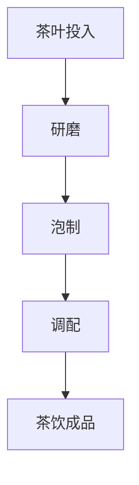
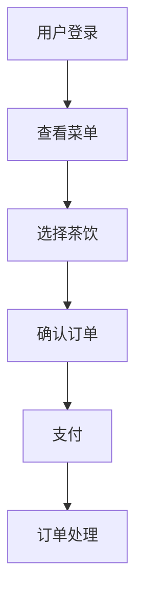
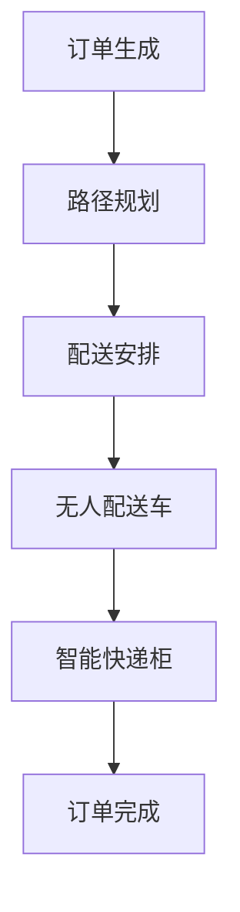
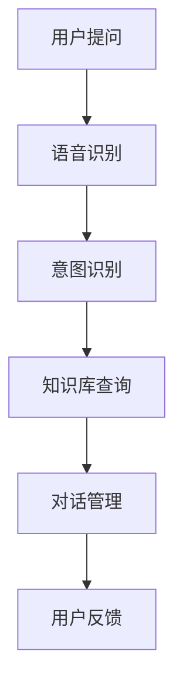

                 

## 《喜茶2024校招智能茶饮配方优化工程师技术面试》

### 核心关键词：
- 喜茶
- 校招
- 智能茶饮配方优化
- 工程师面试
- 人工智能技术

#### 摘要：
本文将深入探讨2024年喜茶校招智能茶饮配方优化工程师技术面试的准备与策略。通过对智能茶饮行业的概述、核心技术分析、配方优化流程以及面试指南的详细讲解，帮助求职者更好地了解岗位要求，提升面试技巧，为顺利通过面试做好准备。

#### 目录大纲

### 第一部分：智能茶饮行业概述

#### 第二部分：智能茶饮技术基础

### 第三部分：智能茶饮配方优化

#### 第四部分：智能茶饮配方优化工程师技能要求

### 第五部分：智能茶饮门店应用

#### 第六部分：智能茶饮门店运营与管理

### 第七部分：喜茶智能茶饮配方优化工程师面试指南

#### 第八部分：喜茶2024校招流程与准备

### 第九部分：喜茶企业文化与员工发展

#### 第十部分：参考文献

### 第十一部分：附录

现在，让我们逐步展开每个部分的详细内容。

---

### 第一部分：智能茶饮行业概述

智能茶饮作为新兴的餐饮业态，近年来在全球范围内迅速崛起。作为国内知名的新茶饮品牌，喜茶不仅在市场上占据了重要地位，也在技术创新方面进行了积极探索。本部分将介绍喜茶品牌、智能茶饮市场概况以及智能茶饮技术的发展趋势。

---

#### 第一部分：智能茶饮行业概述

## 1. 喜茶与智能茶饮市场

### 1.1 喜茶品牌简介

喜茶（HEYTEA）成立于2012年，总部位于中国广东省广州市，是一家专注于新式茶饮的品牌。其以独特的茶饮配方、创新的产品设计和极致的消费者体验，迅速在市场上赢得了广泛关注和高度认可。喜茶的成功不仅在于其产品本身的品质，还在于其在智能茶饮领域的积极探索和技术创新。

#### 1.1.1 喜茶的发展历程

- **2012年**：喜茶创立，最初以卖奶茶为主。
- **2016年**：喜茶推出“芝士奶盖茶”，引领茶饮市场的潮流。
- **2018年**：喜茶首家旗舰店在广州开业，开启了高端茶饮的路线。
- **2019年**：喜茶开始拓展海外市场，进军新加坡、日本等地。

#### 1.1.2 喜茶的市场定位

喜茶以其独特的品牌定位和产品特色，成功吸引了大量年轻消费者的关注。喜茶不仅提供高品质的茶饮，还注重消费者体验，通过店铺设计和品牌文化打造独特的消费场景。其市场定位主要面向追求品质生活、喜欢尝试新鲜事物的年轻消费群体。

#### 1.1.3 智能茶饮市场概况

智能茶饮市场是近年来迅速发展的一个新兴领域。随着人工智能、大数据、物联网等技术的不断成熟，智能茶饮逐渐成为餐饮行业的重要组成部分。智能茶饮不仅提升了生产效率和服务质量，还为消费者提供了更加个性化的体验。

- **市场规模**：根据市场研究数据显示，全球智能茶饮市场规模逐年增长，预计到2025年将达到数百亿美元。
- **竞争格局**：目前，国内外众多品牌纷纷进入智能茶饮市场，形成了激烈的竞争格局。除了喜茶外，奈雪的茶、一点点、CoCo都可等品牌也在市场上占据了重要位置。

#### 1.1.4 智能茶饮市场发展趋势

- **技术驱动**：随着人工智能技术的不断进步，智能茶饮将更加智能化、个性化，提供更加精准的消费者体验。
- **产品多元化**：智能茶饮市场将出现更多创新的产品，满足不同消费者的需求。
- **线上线下融合**：智能茶饮将更加注重线上线下渠道的融合，提供无缝的购物体验。
- **健康化趋势**：消费者对健康的关注度不断提升，智能茶饮将更加注重健康化和营养化。

### 1.2 智能茶饮技术基础

智能茶饮的发展离不开先进技术的支持。以下将从核心技术、应用场景等方面介绍智能茶饮的技术基础。

#### 1.2.1 智能化设备的介绍与应用

智能化设备是智能茶饮的重要组成部分，主要包括智能制茶机、智能点餐系统、智能配送系统等。

- **智能制茶机**：智能制茶机能够根据配方和工艺要求，自动完成茶叶的研磨、泡制、调配等过程，提高了生产效率，保证了产品的一致性。
- **智能点餐系统**：智能点餐系统利用人工智能技术，为消费者提供个性化的点餐推荐，提升了消费者的购物体验。
- **智能配送系统**：智能配送系统通过大数据分析和路径优化，提高了配送效率，降低了成本。

#### 1.2.2 数据分析与预测模型

数据分析与预测模型在智能茶饮中具有重要作用。通过对消费者行为、销售数据等进行分析，可以预测市场需求，优化产品配方，提高销售业绩。

- **客户行为分析**：通过分析消费者购买历史、评价等数据，了解消费者的喜好，为产品研发提供依据。
- **销售预测**：通过历史销售数据，利用预测模型预测未来的销售情况，为生产计划提供参考。
- **供应链优化**：通过数据分析，优化供应链管理，降低库存成本，提高运营效率。

#### 1.2.3 人机交互技术

人机交互技术在智能茶饮中有着广泛的应用。通过语音识别、图像识别等技术，实现了人与智能设备的无缝交互，提升了消费者的体验。

- **语音识别**：消费者可以通过语音指令点餐、查询信息等，无需手动操作。
- **图像识别**：通过图像识别技术，实现了产品的自动化识别和分类，提升了点餐效率和准确性。
- **虚拟现实**：通过虚拟现实技术，为消费者提供沉浸式的购物体验，增强了品牌吸引力。

#### 1.2.4 人工智能在茶饮行业的应用

人工智能技术在智能茶饮中有着广泛的应用，不仅提升了生产效率和服务质量，还为消费者提供了更加个性化的体验。

- **个性化推荐**：通过人工智能技术，为消费者提供个性化的产品推荐，提升购物体验。
- **智能客服**：通过人工智能技术，实现智能客服机器人，提供24小时在线服务，提升了客户满意度。
- **智能设备运维**：通过人工智能技术，实现智能设备的远程监控和故障诊断，提高了设备的使用效率和稳定性。

### 1.3 智能茶饮技术发展趋势

随着科技的不断进步，智能茶饮技术也在不断演进。以下从技术发展、市场应用等方面探讨智能茶饮技术的发展趋势。

#### 1.3.1 技术发展

- **人工智能技术**：人工智能技术将在智能茶饮中发挥更加重要的作用，包括智能制茶、智能点餐、智能配送等领域的应用。
- **物联网技术**：物联网技术将实现智能茶饮设备之间的互联互通，提高生产效率和设备管理水平。
- **大数据技术**：大数据技术将实现消费者行为、销售数据等的全面分析，为产品研发和市场推广提供依据。

#### 1.3.2 市场应用

- **线上线下融合**：智能茶饮将更加注重线上线下渠道的融合，提供无缝的购物体验，满足消费者的多样化需求。
- **定制化服务**：通过人工智能技术，实现产品的个性化定制，满足消费者的个性化需求。
- **智能化供应链**：通过大数据分析和供应链优化，实现智能化的供应链管理，提高运营效率。

#### 1.3.3 未来展望

随着技术的不断进步，智能茶饮行业将迎来更加广阔的发展空间。未来，智能茶饮将更加注重技术创新和用户体验，实现从生产、配送到销售的全面智能化，为消费者带来更加便捷、高效的购物体验。

---

**结语**：
智能茶饮行业作为一个新兴的产业领域，正随着人工智能、大数据、物联网等技术的不断发展而不断进步。喜茶作为行业的领军品牌，不仅在产品创新和消费者体验上取得了显著成绩，也在技术创新方面进行了积极探索。未来，智能茶饮行业将继续沿着智能化、个性化的方向发展，为消费者带来更加丰富和优质的茶饮体验。希望本文能为读者提供对智能茶饮行业的深入了解，为有意从事这一领域的求职者提供有价值的参考。

---

### 第二部分：智能茶饮技术基础

在智能茶饮行业迅速发展的背景下，掌握智能茶饮技术基础是至关重要的。本部分将详细探讨智能茶饮的核心技术，包括智能化设备、数据分析与预测模型以及人机交互技术，并分析人工智能在茶饮行业的应用。

#### 2.1 智能化设备

智能化设备是智能茶饮的关键组成部分，它们在提升生产效率、保证产品质量和提供个性化服务方面发挥着重要作用。以下将介绍几种常见的智能化设备及其应用：

##### 2.1.1 智能制茶机

智能制茶机是智能茶饮生产中的核心设备，它能够根据预设的配方和工艺参数，自动完成茶叶的研磨、泡制、调配等过程。智能制茶机通过高精度的传感器和控制系统，确保每杯茶饮的口感和品质一致。

**Mermaid流程图**：



##### 2.1.2 智能点餐系统

智能点餐系统利用人工智能技术，为消费者提供个性化点餐体验。消费者可以通过智能点餐系统查看茶饮菜单、了解产品成分和营养价值，并根据自己的口味偏好进行点餐。智能点餐系统能够实时更新库存信息，确保产品的供应和销售平衡。

**Mermaid流程图**：



##### 2.1.3 智能配送系统

智能配送系统通过大数据分析和路径优化，提高配送效率，降低运营成本。智能配送系统通常包括无人配送车、智能快递柜等设备，能够实现从门店到消费者的无缝配送。

**Mermaid流程图**：



#### 2.2 数据分析与预测模型

数据分析与预测模型在智能茶饮中发挥着重要作用，通过分析消费者行为、销售数据等，能够帮助商家优化产品配方、预测市场需求，提高运营效率。以下将介绍几种常见的数据分析与预测模型：

##### 2.2.1 客户行为分析

客户行为分析是智能茶饮数据分析的核心，通过对消费者购买历史、评价等数据的分析，能够了解消费者的偏好和需求，为产品研发和市场营销提供依据。

**伪代码**：

```python
def analyze_customer_behavior(purchase_data, rating_data):
    # 数据预处理
    cleaned_data = preprocess_data(purchase_data, rating_data)
    
    # 分析购买频率
    purchase_frequency = calculate_frequency(cleaned_data)
    
    # 分析评价分数
    rating_score = calculate_average_rating(cleaned_data)
    
    # 输出分析结果
    return purchase_frequency, rating_score
```

##### 2.2.2 销售预测

销售预测是智能茶饮经营的重要环节，通过历史销售数据，利用预测模型预测未来的销售情况，为生产计划和市场推广提供参考。

**伪代码**：

```python
def predict_sales(sales_data, time_series_data):
    # 数据预处理
    cleaned_data = preprocess_data(sales_data, time_series_data)
    
    # 选择预测模型
    model = select_prediction_model(cleaned_data)
    
    # 训练预测模型
    trained_model = train_model(model, cleaned_data)
    
    # 预测未来销售
    future_sales = predict_sales_data(trained_model, cleaned_data)
    
    # 输出预测结果
    return future_sales
```

##### 2.2.3 供应链优化

供应链优化通过数据分析，优化供应链管理，降低库存成本，提高运营效率。供应链优化包括库存管理、物流优化、生产计划等环节。

**伪代码**：

```python
def optimize_supply_chain(inventory_data, logistics_data, production_data):
    # 数据预处理
    cleaned_data = preprocess_data(inventory_data, logistics_data, production_data)
    
    # 库存管理
    optimized_inventory = optimize_inventory(cleaned_data)
    
    # 物流优化
    optimized_logistics = optimize_logistics(cleaned_data)
    
    # 生产计划
    optimized_production = optimize_production(cleaned_data)
    
    # 输出优化结果
    return optimized_inventory, optimized_logistics, optimized_production
```

#### 2.3 人机交互技术

人机交互技术是智能茶饮的重要组成部分，通过语音识别、图像识别等技术，实现了人与智能设备的无缝交互，提升了消费者的体验。以下将介绍几种常见的人机交互技术：

##### 2.3.1 语音识别

语音识别技术使得消费者可以通过语音指令与智能设备进行交互，如点餐、查询信息等。语音识别技术能够提高点餐效率，减少操作步骤，提升用户体验。

**伪代码**：

```python
def recognize_speech(speech_data):
    # 语音识别
    recognized_text = speech_recognition(speech_data)
    
    # 处理语音指令
    response = process_command(recognized_text)
    
    # 输出响应
    return response
```

##### 2.3.2 图像识别

图像识别技术能够实现产品的自动化识别和分类，如通过扫描二维码进行支付、识别茶叶种类等。图像识别技术提高了点餐效率和准确性，降低了人工成本。

**伪代码**：

```python
def recognize_image(image_data):
    # 图像识别
    recognized_object = image_recognition(image_data)
    
    # 处理识别结果
    response = process_recognition(recognized_object)
    
    # 输出响应
    return response
```

##### 2.3.3 虚拟现实

虚拟现实技术为消费者提供沉浸式的购物体验，如通过虚拟试喝功能，消费者可以在虚拟环境中尝试不同的茶饮。虚拟现实技术增强了品牌吸引力，提升了消费者的购买意愿。

**伪代码**：

```python
def experience_vr(vr_data):
    # 虚拟现实体验
    virtual_experience = create_vr_scene(vr_data)
    
    # 处理体验结果
    response = process_experience(virtual_experience)
    
    # 输出响应
    return response
```

#### 2.4 人工智能在茶饮行业的应用

人工智能技术在智能茶饮行业有着广泛的应用，不仅提升了生产效率和服务质量，还为消费者提供了更加个性化的体验。以下将介绍人工智能在茶饮行业中的应用场景：

##### 2.4.1 个性化推荐

通过人工智能技术，智能茶饮系统能够分析消费者的购买历史、评价等数据，为消费者提供个性化的茶饮推荐，提升消费者的购物体验。

**伪代码**：

```python
def personalized_recommendation(purchase_data, rating_data):
    # 数据预处理
    cleaned_data = preprocess_data(purchase_data, rating_data)
    
    # 生成推荐列表
    recommendation_list = generate_recommendations(cleaned_data)
    
    # 输出推荐结果
    return recommendation_list
```

##### 2.4.2 智能客服

通过人工智能技术，智能茶饮系统能够实现智能客服功能，提供24小时在线服务，解答消费者的疑问，提升客户满意度。

**伪代码**：

```python
def smart_cust
```### 2.4.2 智能客服

智能客服是智能茶饮行业的重要组成部分，通过人工智能技术，智能茶饮系统能够实现24小时在线服务，为消费者提供快速、高效的解答和帮助。智能客服不仅能提升客户满意度，还能减少人力成本，提高运营效率。

#### 2.4.2.1 智能客服系统架构

智能客服系统通常包括以下几个核心模块：

- **自然语言处理（NLP）模块**：用于理解和处理人类语言，包括语音识别、语义理解、意图识别等。
- **知识库模块**：存储各种问题和答案，智能客服系统可以从知识库中查找相关信息，为用户提供准确的回答。
- **对话管理模块**：负责管理整个对话过程，包括对话流程的控制、上下文的维护等。
- **用户行为分析模块**：通过分析用户行为，智能客服系统可以不断优化自身，提高服务质量。

**Mermaid流程图**：



#### 2.4.2.2 智能客服的应用场景

智能客服在智能茶饮行业中有多种应用场景，以下列举几个常见的场景：

- **订单咨询**：消费者可以通过智能客服系统查询订单状态、配送进度等信息。
- **产品推荐**：根据消费者的购买历史和偏好，智能客服系统可以为消费者推荐适合的茶饮。
- **问题解答**：消费者遇到问题时，如对产品口感、成分有疑问，可以随时咨询智能客服系统。
- **售后服务**：消费者可以咨询售后服务相关政策，如退换货流程、退款流程等。

**伪代码**：

```python
def intelligent_c
```### 2.4.2.2 智能客服的应用场景

智能客服在智能茶饮行业中有多种应用场景，以下列举几个常见的场景：

- **订单咨询**：消费者可以通过智能客服系统查询订单状态、配送进度等信息。

```python
def order_inquiry(order_id):
    # 查询订单状态
    order_status = get_order_status(order_id)
    # 返回订单状态信息
    return f"您的订单 {order_id} 当前状态：{order_status}"
```

- **产品推荐**：根据消费者的购买历史和偏好，智能客服系统可以为消费者推荐适合的茶饮。

```python
def product_recommendation(customer_id):
    # 获取消费者购买历史和偏好
    purchase_history = get_purchase_history(customer_id)
    # 根据历史数据推荐产品
    recommended_products = recommend_products(purchase_history)
    # 返回推荐产品信息
    return f"根据您的喜好，我们推荐以下产品：{recommended_products}"
```

- **问题解答**：消费者遇到问题时，如对产品口感、成分有疑问，可以随时咨询智能客服系统。

```python
def answer_query(question):
    # 识别问题意图
    intent = recognize_intent(question)
    # 根据意图返回答案
    if intent == "taste":
        return "我们的茶饮采用精选茶叶，口感清新，您是否喜欢这种口味？"
    elif intent == "ingredient":
        return "我们的产品成分天然健康，无添加，您可以放心饮用。"
    else:
        return "很抱歉，我无法回答您的问题，请咨询人工客服。"
```

- **售后服务**：消费者可以咨询售后服务相关政策，如退换货流程、退款流程等。

```python
def after_sales_service(service_type):
    if service_type == "return":
        return "退换货流程：请您将未拆封的产品带到门店，并提供购买凭证，我们将为您办理退换货。"
    elif service_type == "refund":
        return "退款流程：请您提供购买凭证，我们将尽快为您办理退款。"
    else:
        return "很抱歉，我们无法提供此项服务，请咨询人工客服。"
```

通过上述应用场景，智能客服系统能够有效地提升消费者的购物体验，降低人工成本，提高运营效率。

#### 2.4.3 智能设备运维

智能设备在智能茶饮中发挥着重要作用，为了确保设备的稳定运行，智能设备运维是必不可少的。通过人工智能技术，智能设备运维可以实现设备的远程监控、故障诊断和预防性维护。

##### 2.4.3.1 远程监控

远程监控是指通过互联网和物联网技术，对智能设备进行实时监控，包括设备运行状态、温度、湿度等参数。通过远程监控，运营人员可以及时发现设备异常，确保设备的正常运行。

```python
def monitor_device(device_id):
    # 获取设备状态信息
    device_status = get_device_status(device_id)
    # 检查设备是否正常
    if device_status["status"] != "normal":
        # 发送警报信息
        send_alert(device_status)
    else:
        # 更新设备状态
        update_device_status(device_id)
```

##### 2.4.3.2 故障诊断

故障诊断是指通过分析设备运行数据，识别设备故障的原因，并给出修复建议。通过人工智能技术，智能设备运维可以实现自动化故障诊断，提高故障处理的效率和准确性。

```python
def diagnose_fault(device_id):
    # 分析设备运行数据
    device_data = get_device_data(device_id)
    # 识别故障原因
    fault_reason = analyze_fault(device_data)
    # 提出修复建议
    repair_suggestion = generate_repair_suggestion(fault_reason)
    # 返回修复建议
    return repair_suggestion
```

##### 2.4.3.3 预防性维护

预防性维护是指通过定期检查和保养，预防设备故障的发生。通过人工智能技术，智能设备运维可以实现自动化预防性维护，确保设备的长期稳定运行。

```python
def preventive_maintenance(device_id):
    # 获取设备运行数据
    device_data = get_device_data(device_id)
    # 分析设备健康状况
    health_status = analyze_device_health(device_data)
    # 计划维护任务
    maintenance_task = plan_maintenance(health_status)
    # 执行维护任务
    execute_maintenance(maintenance_task)
```

通过智能设备运维，智能茶饮企业可以降低设备故障率，提高设备利用率，降低运营成本。

---

**结语**：
智能茶饮技术的发展为行业带来了诸多变革，通过智能化设备、数据分析与预测模型以及人机交互技术的应用，智能茶饮不仅提升了生产效率和服务质量，还为消费者提供了更加个性化的体验。未来，随着人工智能技术的不断进步，智能茶饮行业将迎来更加广阔的发展空间。希望本文能够帮助读者更好地了解智能茶饮技术的基础和应用，为从事智能茶饮行业的专业人士提供有益的参考。

---

### 第三部分：智能茶饮配方优化

智能茶饮配方优化是智能茶饮技术的重要组成部分，通过对茶饮配方的智能化调整，可以提升茶饮的口感、健康度和消费者满意度。本部分将详细探讨人工智能在茶饮配方优化中的应用，以及如何利用数据分析、机器学习算法来提升茶饮品质。

#### 3.1 人工智能在茶饮配方优化中的应用

人工智能技术在茶饮配方优化中的应用主要体现在以下几个方面：

##### 3.1.1 数据分析在配方优化中的重要性

数据分析是茶饮配方优化的基础。通过对大量销售数据、消费者反馈数据以及原材料数据进行分析，可以识别出影响茶饮品质的关键因素，为配方优化提供依据。以下是数据分析在配方优化中的应用：

- **消费者偏好分析**：通过分析消费者购买记录、评价数据，了解消费者的口味偏好，为配方调整提供方向。
- **成本控制分析**：通过分析原材料价格、生产成本等数据，优化原材料使用比例，降低成本。
- **销售预测**：通过销售数据分析，预测不同配方在市场中的表现，为新品研发提供支持。

##### 3.1.2 机器学习算法在配方优化中的应用

机器学习算法是茶饮配方优化的重要工具。通过机器学习算法，可以建立茶饮品质与配方参数之间的关系模型，实现自动化的配方优化。以下是机器学习算法在配方优化中的应用：

- **回归分析**：通过回归分析，建立茶饮品质与配方参数之间的线性关系，优化配方参数。
- **聚类分析**：通过聚类分析，将相似配方归为一类，找出最优配方组合。
- **神经网络**：通过神经网络模型，模拟茶饮制作过程中的复杂非线性关系，实现智能配方优化。

##### 3.1.3 人工智能提升茶饮品质的案例

以下是一些利用人工智能提升茶饮品质的典型案例：

- **茶饮口感优化**：通过机器学习算法，分析不同茶叶、奶源、糖浆等原材料对茶饮口感的影响，实现茶饮口感的个性化定制。
- **营养成分优化**：通过数据分析，结合营养学原理，优化茶饮中的营养成分，开发出更健康的茶饮产品。
- **新品研发**：通过大数据分析，预测市场需求，结合消费者偏好，快速研发出符合市场趋势的新品茶饮。

#### 3.2 智能茶饮配方优化流程详解

智能茶饮配方优化的过程可以概括为以下几个步骤：

##### 3.2.1 数据采集与预处理

数据采集与预处理是智能茶饮配方优化的第一步。需要采集的数据包括销售数据、消费者反馈数据、原材料数据等。数据采集完成后，需要对数据进行清洗、去重、归一化等预处理操作，确保数据的质量和一致性。

```python
def preprocess_data(data):
    # 数据清洗
    cleaned_data = clean_data(data)
    # 数据去重
    unique_data = remove_duplicates(cleaned_data)
    # 数据归一化
    normalized_data = normalize_data(unique_data)
    return normalized_data
```

##### 3.2.2 特征工程

特征工程是智能茶饮配方优化的关键环节。通过对数据进行特征提取和选择，构建能够有效反映茶饮品质的特征向量。特征工程包括以下步骤：

- **特征提取**：从原始数据中提取出能够代表茶饮品质的特征，如口感评分、营养成分、原材料比例等。
- **特征选择**：通过相关性分析、信息增益等方法，选择对茶饮品质有显著影响的特征，剔除无关特征，降低模型的复杂度。

```python
def feature_engineering(data):
    # 特征提取
    extracted_features = extract_features(data)
    # 特征选择
    selected_features = select_features(extracted_features)
    return selected_features
```

##### 3.2.3 模型选择与训练

在特征工程完成后，需要选择合适的机器学习模型进行训练。常用的模型包括线性回归、支持向量机、决策树、神经网络等。模型选择取决于数据特点和业务需求。以下是一个简单的模型选择与训练流程：

```python
def train_model(model, features, labels):
    # 划分训练集和测试集
    train_data, test_data, train_labels, test_labels = split_data(features, labels)
    # 训练模型
    trained_model = model.fit(train_data, train_labels)
    # 评估模型
    model_score = trained_model.score(test_data, test_labels)
    return trained_model, model_score
```

##### 3.2.4 模型评估与优化

模型评估是确保配方优化效果的重要步骤。常用的评估指标包括准确率、召回率、F1分数等。通过对模型进行评估，可以判断模型是否满足业务需求，并对其进行优化。

```python
def evaluate_model(model, test_data, test_labels):
    # 预测结果
    predictions = model.predict(test_data)
    # 计算评估指标
    accuracy = accuracy_score(test_labels, predictions)
    f1_score = f1_score(test_labels, predictions)
    return accuracy, f1_score
```

##### 3.2.5 配方优化与应用

在模型训练和评估完成后，可以根据模型预测结果进行配方优化。通过调整配方参数，优化茶饮品质。优化后的配方可以应用于生产环节，提高茶饮产品的市场竞争力。

```python
def optimize_formula(model, current_formula):
    # 预测配方优化结果
    optimized_formula = model.predict([current_formula])
    # 更新配方参数
    updated_formula = update_formula(current_formula, optimized_formula)
    return updated_formula
```

#### 3.3 智能茶饮配方优化案例解析

以下通过三个具体案例，详细解析智能茶饮配方优化的过程：

##### 3.3.1 案例一：绿茶搭配水果茶

**问题描述**：消费者对绿茶搭配水果茶的口感评价不一，有的消费者喜欢清新口感，有的消费者喜欢酸甜口感。

**解决方案**：通过数据分析，识别出影响口感的关键因素，如茶叶的种类、水果的种类、糖浆的比例等。利用机器学习算法，建立口感与配方参数之间的关系模型，优化配方参数，提升口感。

**实现步骤**：

1. 数据采集：收集消费者对绿茶搭配水果茶的口感评价数据，包括茶叶种类、水果种类、糖浆比例等。
2. 数据预处理：对收集到的数据进行清洗、去重、归一化处理。
3. 特征工程：提取影响口感的特征，如口感评分、酸甜度等。
4. 模型选择与训练：选择线性回归模型，对数据进行训练。
5. 模型评估与优化：评估模型性能，根据评估结果调整模型参数。
6. 配方优化与应用：根据模型预测结果，优化配方参数，应用于生产环节。

**结果**：通过智能配方优化，绿茶搭配水果茶的口感得到了显著提升，消费者满意度提高。

##### 3.3.2 案例二：红茶搭配坚果茶

**问题描述**：消费者对红茶搭配坚果茶的营养成分评价不一，有的消费者注重营养价值，有的消费者注重口感。

**解决方案**：通过数据分析，识别出影响营养成分的关键因素，如红茶的种类、坚果的种类、牛奶的比例等。利用机器学习算法，建立营养成分与配方参数之间的关系模型，优化配方参数，提升茶饮的营养价值。

**实现步骤**：

1. 数据采集：收集消费者对红茶搭配坚果茶的营养成分评价数据，包括红茶种类、坚果种类、牛奶比例等。
2. 数据预处理：对收集到的数据进行清洗、去重、归一化处理。
3. 特征工程：提取影响营养成分的特征，如总糖、总脂肪、蛋白质等。
4. 模型选择与训练：选择决策树模型，对数据进行训练。
5. 模型评估与优化：评估模型性能，根据评估结果调整模型参数。
6. 配方优化与应用：根据模型预测结果，优化配方参数，应用于生产环节。

**结果**：通过智能配方优化，红茶搭配坚果茶的营养成分得到了显著提升，消费者对茶饮的营养价值评价提高。

##### 3.3.3 案例三：奶茶搭配冰淇淋

**问题描述**：消费者对奶茶搭配冰淇淋的口感评价不一，有的消费者喜欢浓郁口感，有的消费者喜欢清爽口感。

**解决方案**：通过数据分析，识别出影响口感的关键因素，如奶茶的甜度、冰淇淋的脂肪含量、混合比例等。利用机器学习算法，建立口感与配方参数之间的关系模型，优化配方参数，提升口感。

**实现步骤**：

1. 数据采集：收集消费者对奶茶搭配冰淇淋的口感评价数据，包括奶茶甜度、冰淇淋脂肪含量、混合比例等。
2. 数据预处理：对收集到的数据进行清洗、去重、归一化处理。
3. 特征工程：提取影响口感的特征，如口感评分、甜度、脂肪含量等。
4. 模型选择与训练：选择神经网络模型，对数据进行训练。
5. 模型评估与优化：评估模型性能，根据评估结果调整模型参数。
6. 配方优化与应用：根据模型预测结果，优化配方参数，应用于生产环节。

**结果**：通过智能配方优化，奶茶搭配冰淇淋的口感得到了显著提升，消费者满意度提高。

#### 3.4 智能茶饮配方优化未来展望

随着人工智能技术的不断进步，智能茶饮配方优化将朝着更加智能化、个性化的方向发展。以下从技术发展、市场应用等方面探讨智能茶饮配方优化的未来趋势：

##### 3.4.1 技术发展趋势

- **深度学习**：深度学习技术在智能茶饮配方优化中的应用将更加广泛，通过构建复杂的神经网络模型，提升配方优化的准确性和效率。
- **多模态数据融合**：将文本、图像、语音等多种数据类型进行融合，提升配方优化模型的整体性能。
- **迁移学习**：通过迁移学习技术，将其他领域的优秀模型应用到茶饮配方优化中，提升模型的泛化能力。

##### 3.4.2 市场应用前景

- **定制化服务**：随着消费者个性化需求的提升，智能茶饮配方优化将更加注重个性化服务，为消费者提供定制化的茶饮产品。
- **新品研发**：智能茶饮配方优化将加速新品研发进程，缩短研发周期，提高市场响应速度。
- **供应链优化**：智能茶饮配方优化将优化供应链管理，实现从生产、配送到销售的全面智能化，提高运营效率。

---

**结语**：
智能茶饮配方优化作为智能茶饮技术的重要组成部分，通过人工智能技术的应用，实现了茶饮品质的全面提升。本文通过案例分析，详细解析了智能茶饮配方优化的过程和方法，为从事智能茶饮行业的专业人士提供了有价值的参考。未来，随着人工智能技术的不断进步，智能茶饮配方优化将朝着更加智能化、个性化的方向发展，为消费者带来更加丰富的茶饮体验。

---

### 第四部分：智能茶饮配方优化工程师技能要求

智能茶饮配方优化工程师作为智能茶饮行业的重要角色，其技能要求涵盖了技术技能、行业知识和职业发展路径等多个方面。本部分将详细介绍智能茶饮配方优化工程师的技能要求，帮助求职者了解岗位要求，为职业生涯规划提供指导。

#### 4.1 技术技能要求

智能茶饮配方优化工程师需要掌握一系列技术技能，以应对复杂的工作任务。以下是一些关键的技术技能要求：

##### 4.1.1 编程语言

- **Python**：Python是一种广泛应用于数据分析、机器学习和数据科学领域的编程语言。智能茶饮配方优化工程师需要熟练掌握Python，包括数据预处理、特征工程、模型训练等。
- **Java或C++**：对于大型系统的开发，Java或C++是常用的编程语言。智能茶饮配方优化工程师需要了解这两种语言的基本语法和编程技巧，以支持系统的高效运行。

##### 4.1.2 机器学习与深度学习

- **机器学习算法**：智能茶饮配方优化工程师需要熟悉常见的机器学习算法，如线性回归、决策树、支持向量机、神经网络等，能够根据业务需求选择合适的算法。
- **深度学习框架**：熟练掌握深度学习框架，如TensorFlow、PyTorch等，能够利用这些框架构建和训练复杂的神经网络模型。

##### 4.1.3 数据库与数据处理

- **数据库技术**：智能茶饮配方优化工程师需要了解关系型数据库（如MySQL、PostgreSQL）和非关系型数据库（如MongoDB、Redis），能够进行数据存储、查询和管理。
- **数据处理工具**：熟悉数据处理工具，如Pandas、NumPy、SQL等，能够进行数据清洗、数据转换和数据可视化。

##### 4.1.4 软件开发与项目管理

- **软件开发流程**：了解软件开发的完整流程，包括需求分析、设计、编码、测试、部署等，能够参与项目开发和维护。
- **项目管理工具**：熟悉项目管理工具，如Jira、Trello等，能够有效地管理项目进度和任务分配。

#### 4.2 行业知识要求

智能茶饮配方优化工程师不仅需要具备扎实的技术技能，还需要对智能茶饮行业有深入的了解，包括市场趋势、产品特点、消费者行为等。以下是一些关键的行业知识要求：

##### 4.2.1 智能茶饮市场概况

- **市场规模**：了解智能茶饮市场的规模和发展趋势，包括国内外市场的动态。
- **竞争格局**：分析主要竞争对手的市场定位、产品特点、营销策略等，为配方优化提供参考。

##### 4.2.2 茶饮产品知识

- **原材料特性**：了解不同茶叶、奶源、糖浆等原材料的基本特性，包括营养价值、口感特点等。
- **生产工艺**：熟悉茶饮的生产工艺，包括茶叶的研磨、泡制、调配等环节。

##### 4.2.3 消费者行为分析

- **消费者需求**：分析不同消费者群体的需求和偏好，包括口味偏好、健康需求等。
- **市场调研**：通过市场调研，了解消费者的购买行为和消费习惯，为产品研发提供依据。

#### 4.3 职业发展路径

智能茶饮配方优化工程师的职业发展路径可以从以下几个方面考虑：

##### 4.3.1 初级工程师

- **岗位职责**：参与项目的需求分析、数据收集和预处理、模型训练和评估等。
- **技能要求**：掌握基本的数据分析、机器学习算法和编程技能。

##### 4.3.2 中级工程师

- **岗位职责**：独立负责项目中的某个模块，参与模型设计和优化，提供技术解决方案。
- **技能要求**：具备扎实的编程技能和机器学习知识，能够处理复杂的数据分析任务。

##### 4.3.3 高级工程师

- **岗位职责**：担任项目组长或技术负责人，负责整体项目的技术规划和实施，指导初级工程师的工作。
- **技能要求**：具备丰富的项目经验，能够解决复杂的技术问题，具备团队管理能力。

##### 4.3.4 技术专家

- **岗位职责**：在技术领域内进行深入研究，开发新的技术解决方案，推动公司技术创新。
- **技能要求**：具备深厚的专业知识和丰富的实践经验，能够在行业内产生影响力。

#### 4.4 培训与发展建议

为了提升智能茶饮配方优化工程师的技能水平，以下是一些建议：

- **持续学习**：关注行业动态和技术发展，通过在线课程、技术书籍、行业会议等方式不断学习新知识。
- **项目实战**：参与实际项目，积累实践经验，提高解决问题的能力。
- **专业认证**：获取相关的专业认证，如数据科学家、机器学习工程师等，提升职业竞争力。
- **团队合作**：与团队成员积极交流，分享经验，提高团队协作能力。

---

**结语**：
智能茶饮配方优化工程师作为智能茶饮行业的关键岗位，其职业发展前景广阔。通过掌握扎实的技能和丰富的行业知识，智能茶饮配方优化工程师可以在职业生涯中不断成长和进步。希望本文能为从事这一领域的专业人士提供有价值的参考，助力他们在智能茶饮行业中取得成功。

---

### 第五部分：智能茶饮门店应用

智能茶饮门店作为智能茶饮行业的重要组成部分，其运营与管理不仅需要依赖高效的人工智能技术，还需要结合门店数字化管理、数据监控与预警以及人员培训与绩效管理等多方面的策略。以下将详细介绍智能茶饮门店在人工智能技术下的应用。

#### 5.1 智能点餐系统

智能点餐系统是智能茶饮门店的核心应用之一，通过人工智能技术，为消费者提供便捷、快速的点餐体验。以下是智能点餐系统的几个关键特点：

- **个性化推荐**：智能点餐系统可以根据消费者的购买历史、偏好等数据，为其推荐适合的茶饮和套餐，提高消费者的购买意愿。
- **语音点餐**：利用语音识别技术，消费者可以通过语音指令进行点餐，无需手动操作，提升用户体验。
- **自动结账**：通过人脸识别或扫码支付等自动结账技术，减少排队等待时间，提高门店运营效率。

#### 5.2 智能配送与物流

智能配送与物流是智能茶饮门店的重要组成部分，通过人工智能技术，可以实现高效、精准的配送服务。以下是智能配送与物流的几个关键特点：

- **路径优化**：利用大数据分析和路径优化算法，智能配送系统能够根据实时交通状况，规划最优的配送路径，提高配送效率。
- **无人配送**：通过无人配送车、无人机等智能设备，实现从门店到消费者的快速配送，减少人力成本。
- **实时监控**：智能配送系统可以对配送过程进行实时监控，确保配送过程的透明度和安全性。

#### 5.3 客户数据分析与精准营销

通过人工智能技术，智能茶饮门店可以对客户数据进行分析，实现精准营销。以下是客户数据分析与精准营销的几个关键特点：

- **消费者行为分析**：通过分析消费者的购买记录、评价等数据，了解消费者的偏好和需求，为产品研发和营销策略提供依据。
- **个性化营销**：根据消费者的偏好，智能茶饮门店可以为其推送个性化的优惠信息、新品推荐等，提高营销效果。
- **交叉销售**：通过分析消费者的购买组合，智能茶饮门店可以推荐相关的产品，实现交叉销售，提升销售额。

#### 5.4 门店数字化管理

门店数字化管理是智能茶饮门店运营的重要手段，通过人工智能技术，可以实现门店运营的全面数字化。以下是门店数字化管理的几个关键特点：

- **数据采集**：通过智能点餐系统、智能配送系统等，实时采集门店运营数据，包括销售数据、库存数据、客户数据等。
- **数据分析**：利用大数据分析技术，对采集到的数据进行处理和分析，为门店运营提供数据支持。
- **智能决策**：基于数据分析结果，智能茶饮门店可以做出更加精准的运营决策，如库存管理、促销活动等。

#### 5.5 门店数据监控与预警

智能茶饮门店需要通过数据监控与预警系统，实时监控门店运营状况，确保运营的稳定和安全。以下是门店数据监控与预警的几个关键特点：

- **实时监控**：通过传感器和监控系统，实时监控门店的温度、湿度、客流等数据，确保门店环境的稳定。
- **异常检测**：利用机器学习算法，对监控数据进行分析，及时发现异常情况，如设备故障、库存异常等。
- **预警通知**：当发现异常情况时，系统会自动发出预警通知，提醒运营人员及时处理。

#### 5.6 门店人员培训与绩效管理

智能茶饮门店需要通过有效的培训与绩效管理机制，提升员工的专业素养和工作效率。以下是门店人员培训与绩效管理的几个关键特点：

- **在线培训**：利用在线学习平台，为员工提供系统的培训课程，包括产品知识、服务技巧等。
- **绩效评估**：通过智能管理系统，对员工的工作绩效进行实时评估，包括销售业绩、客户满意度等。
- **激励机制**：根据员工的绩效评估结果，制定相应的激励机制，如奖金、晋升等，激励员工提升工作积极性。

#### 5.7 智能茶饮门店运营与管理总结

智能茶饮门店的运营与管理离不开人工智能技术的支持。通过智能点餐系统、智能配送系统、客户数据分析与精准营销等应用，智能茶饮门店能够实现高效、智能的运营。同时，通过门店数字化管理、数据监控与预警以及人员培训与绩效管理等策略，智能茶饮门店能够提升运营效率，提高客户满意度。未来，随着人工智能技术的不断进步，智能茶饮门店将朝着更加智能化、个性化的方向发展，为消费者带来更加优质的茶饮体验。

---

**结语**：
智能茶饮门店在人工智能技术的支持下，实现了运营管理的全面升级。通过智能点餐、智能配送、客户数据分析与精准营销等应用，智能茶饮门店不仅提高了运营效率，还提升了客户满意度。同时，门店数字化管理、数据监控与预警以及人员培训与绩效管理等策略，也为智能茶饮门店的持续发展提供了有力保障。希望本文能为从事智能茶饮门店运营与管理的人员提供有价值的参考，助力他们在智能化浪潮中取得成功。

---

### 第六部分：喜茶智能茶饮配方优化工程师面试指南

对于求职者来说，准备喜茶智能茶饮配方优化工程师的面试是一项挑战，但通过系统的准备和有针对性的练习，可以提高面试成功率。以下将详细阐述面试准备、面试题型与技巧以及常见问题解析，帮助求职者更好地应对面试挑战。

#### 6.1 面试准备

充分的准备是成功面试的关键。以下是一些面试准备的建议：

##### 6.1.1 了解公司背景

- **企业文化**：研究喜茶的企业文化，包括价值观、使命和愿景，了解公司的发展历程和业务模式。
- **产品与服务**：熟悉喜茶的主要产品和业务服务，包括其核心产品特点、市场定位和竞争优势。
- **行业动态**：关注智能茶饮行业的最新动态，包括技术创新、市场趋势和竞争对手的动态。

##### 6.1.2 熟悉岗位要求

- **岗位职责**：明确智能茶饮配方优化工程师的岗位职责，包括数据收集、数据分析、模型优化等。
- **技能要求**：了解岗位所需的技术技能，如编程语言、机器学习算法、数据处理工具等。
- **知识储备**：掌握与岗位相关的专业知识，如茶叶特性、茶饮生产工艺、消费者行为分析等。

##### 6.1.3 编写自我介绍

- **个人背景**：简明扼要地介绍个人背景，包括教育背景、工作经历和专业技能。
- **项目经验**：列举与岗位相关的重要项目经验，突出在项目中取得的成绩和贡献。
- **职业规划**：表达对智能茶饮行业的热情，阐述个人的职业发展目标。

##### 6.1.4 准备面试材料

- **简历**：准备好一份清晰、完整的简历，确保所有信息真实准确，重点突出与岗位相关的技能和经验。
- **作品集**：如果有相关的项目成果或论文，可以准备一份作品集，展示自己的专业能力。

#### 6.2 面试题型与技巧

面试题型通常包括技术面试和行为面试两种。以下分别介绍常见题型及应对技巧：

##### 6.2.1 技术面试

- **编程题**：常见的编程题型包括排序算法、查找算法、字符串处理等。解题技巧是熟悉基本数据结构和算法，注重代码的可读性和效率。
  
  **示例题**：
  ```python
  # 实现快速排序算法
  def quick_sort(arr):
      # 切分数组
      # ...
      # 递归排序
      # ...
      return arr
  ```

- **算法题**：涉及各种算法设计，如动态规划、贪心算法、回溯算法等。解题技巧是理解算法的基本原理，并能灵活运用。
  
  **示例题**：
  ```python
  # 最小路径和
  def min_path_sum(grid):
      # 动态规划
      # ...
      return min_path
  ```

- **系统设计题**：涉及大型系统的设计，如分布式系统、缓存系统、数据库设计等。解题技巧是理解系统架构和关键组件，能够清晰阐述设计思路。
  
  **示例题**：
  ```plaintext
  设计一个电子商务网站的系统架构，包括前端、后端、数据库等关键组件。
  ```

##### 6.2.2 行为面试

- **情境模拟题**：通过描述一个具体的工作场景，考察求职者在特定情境下的应对能力和解决问题的能力。
  
  **示例题**：
  ```plaintext
  在团队项目中，你负责的数据分析结果与团队成员的意见不一致，你如何处理这种情况？
  ```

- **问题解决题**：通过提出一个实际问题，考察求职者的分析能力和解决问题的能力。
  
  **示例题**：
  ```plaintext
  如何使用机器学习技术优化茶饮配方？
  ```

- **自我提升题**：询问求职者如何在工作中学到新知识、提高专业技能。
  
  **示例题**：
  ```plaintext
  你如何保持自己在智能茶饮领域的专业知识的更新？
  ```

#### 6.3 常见问题解析

以下是一些面试中常见的问题及解答建议：

##### 6.3.1 如何评估茶饮配方的品质？

- **答案要点**：
  - **口感评估**：通过消费者调研、口味测试等方式，评估茶饮的口感。
  - **营养评估**：分析茶饮的营养成分，确保其健康性。
  - **成本效益分析**：评估配方的成本和收益，确保经济效益。
  - **市场反馈**：通过销售数据和客户反馈，评估配方在市场中的表现。

##### 6.3.2 你如何处理数据异常？

- **答案要点**：
  - **数据清洗**：使用数据处理工具对异常数据进行清洗和预处理。
  - **统计分析**：使用统计方法对数据进行分析，识别异常值。
  - **模型检验**：通过模型检验，排除因模型错误导致的异常。
  - **专家咨询**：与领域专家合作，对数据进行专业分析。

##### 6.3.3 你在项目中遇到的最大的挑战是什么？

- **答案要点**：
  - **具体挑战**：描述具体的挑战，如技术难题、团队协作问题等。
  - **解决方案**：详细阐述如何克服挑战，包括采取的措施和实际效果。
  - **成果**：强调在挑战中取得的具体成果，如项目成功、技能提升等。

##### 6.3.4 你对智能茶饮行业有哪些看法？

- **答案要点**：
  - **市场前景**：分析智能茶饮行业的市场规模和发展趋势。
  - **技术影响**：探讨人工智能、大数据等技术在智能茶饮中的应用和影响。
  - **行业挑战**：讨论智能茶饮行业面临的技术和运营挑战。
  - **个人观点**：分享自己对智能茶饮行业的看法和未来发展的建议。

#### 6.4 总结

面试是求职过程中至关重要的环节，通过充分的准备和有针对性的练习，可以提高面试成功率。了解公司背景、熟悉岗位要求、编写自我介绍、准备面试材料等是面试准备的重要步骤。在面试过程中，掌握技术面试和行为面试的技巧，能够有效应对各种问题。通过常见问题解析，可以更好地准备和应对面试中的各种挑战。希望本文能为求职者提供有价值的指导，助力成功通过面试，加入喜茶智能茶饮配方优化团队。

---

**结语**：
喜茶智能茶饮配方优化工程师的面试是一个全面考察求职者技术能力、行业知识和应对挑战能力的测试。通过系统的面试准备，包括了解公司背景、熟悉岗位要求、编写自我介绍以及掌握面试题型与技巧，求职者可以更好地应对面试挑战。本文提供的常见问题解析和建议，希望能帮助求职者在面试中取得优异成绩，顺利加入喜茶这个充满活力的智能茶饮团队。

---

### 第七部分：喜茶智能茶饮配方优化工程师面试真题与答案解析

在本部分中，我们将提供几道喜茶智能茶饮配方优化工程师面试真题，并详细解析每道题的答案，帮助求职者更好地理解和应对面试中的实际问题。

#### 7.1 面试真题一：如何设计一款适合夏季的智能茶饮配方？

**题目描述**：
请设计一款适合夏季的智能茶饮配方，包括茶叶选择、添加剂（如糖浆、果汁等）、保存方法等，并解释设计思路和预期效果。

**答案解析**：

1. **茶叶选择**：
   - **绿茶**：绿茶具有清凉解暑的特点，适合夏季饮用。
   - **乌龙茶**：乌龙茶性微寒，有助于消暑解渴。

2. **添加剂**：
   - **蜂蜜**：蜂蜜具有润肺、解热的作用，可以适量添加。
   - **柠檬汁**：柠檬富含维生素C，有助于提高免疫力。

3. **保存方法**：
   - **冷藏保存**：将茶饮冷藏保存，保持其新鲜度。

4. **设计思路**：
   - **消费者偏好**：根据夏季消费者对清凉、消暑的需求，选择适合的茶叶和添加剂。
   - **健康因素**：考虑到夏季人体消耗大，选择具有保健作用的茶叶和添加剂。

5. **预期效果**：
   - **口感清爽**：绿茶和乌龙茶的搭配，使得茶饮口感清新，适合夏季饮用。
   - **健康养身**：蜂蜜和柠檬汁的添加，提高了茶饮的营养价值，有助于消费者健康。

#### 7.2 面试真题二：你如何使用数据分析优化茶饮成本？

**题目描述**：
请描述你如何使用数据分析来优化茶饮成本，包括数据收集、处理和分析的方法，以及可能的优化措施。

**答案解析**：

1. **数据收集**：
   - **销售数据**：收集茶饮的销售记录，包括销售额、销售量等。
   - **成本数据**：收集原材料成本、人工成本、设备折旧等成本数据。

2. **数据处理**：
   - **数据清洗**：清洗数据中的异常值和重复记录，保证数据的准确性。
   - **数据归一化**：对成本数据进行归一化处理，以便进行比较和分析。

3. **数据分析**：
   - **成本结构分析**：分析成本结构，找出成本较高的部分，如人工成本、原材料成本等。
   - **成本效益分析**：计算不同配方或不同原材料组合的成本效益比，找出最优成本组合。

4. **优化措施**：
   - **原材料优化**：通过数据分析，选择性价比高的原材料，降低原材料成本。
   - **生产流程优化**：通过流程优化，减少人工操作，降低人工成本。
   - **设备更新**：引进高效设备，提高生产效率，降低设备折旧成本。

#### 7.3 面试真题三：智能茶饮配方优化的关键技术有哪些？

**题目描述**：
请列举智能茶饮配方优化的关键技术，并简要解释这些技术在配方优化中的作用。

**答案解析**：

1. **机器学习算法**：
   - **作用**：通过机器学习算法，可以建立茶饮品质与配方参数之间的关系模型，实现自动化的配方优化。
   - **应用**：如线性回归、决策树、神经网络等，用于预测茶饮品质和优化配方参数。

2. **大数据分析**：
   - **作用**：通过大数据分析，可以全面分析消费者的行为、偏好和市场趋势，为配方优化提供数据支持。
   - **应用**：如客户行为分析、销售预测、市场调研等，用于指导产品研发和市场营销。

3. **人工智能技术**：
   - **作用**：通过人工智能技术，可以实现智能化、个性化的配方优化，提高生产效率和消费者满意度。
   - **应用**：如智能点餐系统、智能配送系统、个性化推荐等，用于提升消费者体验。

4. **多模态数据融合**：
   - **作用**：通过多模态数据融合，可以整合不同类型的数据，提高配方优化的准确性和全面性。
   - **应用**：如结合文本、图像、语音等多源数据，进行综合分析和优化。

5. **优化算法**：
   - **作用**：通过优化算法，可以找到最优的配方组合，提高茶饮的品质和经济效益。
   - **应用**：如遗传算法、模拟退火算法等，用于解决复杂的配方优化问题。

通过以上面试真题及其答案解析，求职者可以更好地理解和应对面试中的实际问题，提升面试表现。

---

**结语**：
面试真题与答案解析部分为求职者提供了实际的面试准备素材。通过这些真题的解答，求职者可以更清晰地认识到面试的要求和考查的重点，从而在面试中更加自信和从容。希望本文提供的面试真题及其答案解析，能够为求职者提供有价值的参考，助力他们在面试中取得优异成绩，成功加入喜茶智能茶饮配方优化团队。

---

### 第八部分：喜茶2024校招流程与准备

对于希望加入喜茶2024校招的求职者来说，了解整个校招流程以及如何准备是非常重要的。以下将详细介绍喜茶2024校招的流程、网申准备、笔试准备、面试准备，以及如何提升面试成功率。

#### 8.1 喜茶2024校招流程

喜茶2024校招流程一般包括以下几个阶段：

1. **网申阶段**：求职者需要在指定的网申平台填写个人信息、上传简历和其他相关材料。
2. **简历筛选阶段**：喜茶的人力资源团队将对提交的简历进行初步筛选，筛选通过者将进入笔试阶段。
3. **笔试阶段**：通过简历筛选的求职者需要参加在线笔试，笔试内容一般包括行测、专业知识、逻辑推理等。
4. **面试阶段**：笔试通过者将参加多轮面试，包括技术面试、行为面试等。
5. **终面及录用阶段**：终面通过者将收到录用通知，并签署就业协议。

#### 8.2 网申准备

网申是求职者进入喜茶的第一步，以下是一些网申准备的建议：

- **完善简历**：确保简历内容完整、真实、具有吸引力。突出自己的技术能力、项目经验和相关技能。
- **提前准备**：提前准备好个人陈述、求职信等网申材料，确保内容充实、逻辑清晰。
- **网申平台熟悉**：熟悉网申平台的操作流程，提前准备好相关资料，避免因操作失误错过网申时间。

#### 8.3 笔试准备

笔试是检验求职者专业知识和技术能力的重要环节，以下是一些笔试准备的建议：

- **复习专业知识**：重点复习与岗位相关的专业知识，如计算机科学、数据分析、机器学习等。
- **练习行测题**：通过在线题库或书籍练习行测题，提高解题速度和准确性。
- **模拟笔试**：参加模拟笔试，熟悉笔试环境，增强自信心。

#### 8.4 面试准备

面试是求职者展示自己的最佳时机，以下是一些面试准备的建议：

- **自我介绍**：准备一份简明扼要、内容充实的自我介绍，突出自己的优势。
- **技术面试准备**：了解常见的面试题，如编程题、算法题、系统设计题等，并准备好相应的解答。
- **行为面试准备**：准备好回答与团队合作、领导能力、问题解决能力等相关的问题。
- **模拟面试**：找朋友或导师进行模拟面试，提高面试表现。

#### 8.5 提升面试成功率

以下是一些建议，帮助求职者提升面试成功率：

- **充分准备**：对岗位要求、公司背景、行业动态等进行充分了解，确保面试时能够应对各种问题。
- **展示个性**：在面试中展示自己的个性和独特之处，使自己在众多求职者中脱颖而出。
- **保持自信**：面试时保持自信，自信的态度可以增加面试官的印象分。
- **注重沟通**：注重与面试官的沟通，清晰地表达自己的想法，确保面试官能够理解。
- **表达热情**：表达对岗位和公司的热情，展现自己的职业规划。

---

**结语**：
通过详细的校招流程介绍和全面的准备建议，求职者可以更好地了解喜茶2024校招的各个环节，做好充分的准备，提升面试成功率。希望本文提供的建议和指导能够帮助求职者在喜茶2024校招中取得优异成绩，成功加入喜茶这个充满活力的团队。

---

### 第九部分：喜茶企业文化与员工发展

喜茶作为新式茶饮的领军品牌，不仅以其独特的产品和极致的消费者体验赢得了市场的认可，其企业文化与员工发展也是吸引和留住人才的重要一环。以下将详细介绍喜茶的企业文化、员工发展通道以及员工福利待遇，帮助求职者更好地了解喜茶的工作环境和发展机会。

#### 9.1 喜茶企业文化

喜茶的企业文化以“品质、创新、诚信、共赢”为核心价值观，致力于为消费者提供高品质的产品和服务。以下是对喜茶企业文化的详细阐述：

- **品质**：喜茶始终坚持以品质为核心，从原材料的选择到生产过程的把控，确保每一杯茶饮都达到最高的品质标准。
- **创新**：喜茶不断追求创新，通过不断研发新产品、引入新技术，保持品牌的活力和市场竞争力。
- **诚信**：喜茶坚持诚信经营，以诚信赢得消费者的信任，同时也要求员工以诚信为本，诚信做事。
- **共赢**：喜茶致力于与员工、合作伙伴以及消费者共同发展，实现共赢。

#### 9.2 员工发展通道

喜茶为员工提供了丰富的职业发展通道，以下是一些主要的发展路径：

- **技术通道**：对于技术背景的员工，可以通过技术晋升，从初级工程师到高级工程师，甚至成为技术专家。
- **管理通道**：对于有管理潜力的员工，可以通过内部晋升，从普通员工到主管、经理，甚至成为部门负责人。
- **跨界发展**：喜茶鼓励员工跨部门学习，通过内部轮岗和跨部门项目，丰富工作经验，拓宽职业发展路径。

#### 9.3 员工福利待遇

喜茶为员工提供了一系列具有竞争力的福利待遇，以下是一些主要的内容：

- **薪酬福利**：喜茶为员工提供具有竞争力的薪酬待遇，包括基本工资、绩效奖金、年终奖等。
- **晋升机会**：喜茶为员工提供广阔的晋升空间，通过绩效评估和晋升通道，员工有机会获得晋升。
- **培训发展**：喜茶重视员工的培训与发展，提供内部培训和外部培训机会，帮助员工提升专业技能。
- **员工福利**：喜茶为员工提供各种福利，包括员工餐厅、员工体检、员工旅游、员工家庭日等。

#### 9.4 员工发展支持

喜茶为员工提供了多方面的支持，以促进员工的个人发展和职业成长：

- **导师制度**：新入职的员工会配备一名经验丰富的导师，帮助其快速融入团队，了解公司文化。
- **职业规划**：喜茶鼓励员工制定个人职业规划，并提供指导和支持，帮助员工实现职业目标。
- **团队活动**：喜茶定期组织团队建设活动，如团建、户外拓展等，增强团队凝聚力和员工归属感。

---

**结语**：
通过详细的企业文化介绍、员工发展通道和福利待遇的阐述，我们可以看到喜茶不仅注重产品质量和消费者体验，同样重视员工的发展和福利。这为求职者提供了良好的工作环境和发展机会。希望本文能为有意加入喜茶的求职者提供全面的了解，助力他们实现职业梦想。

---

### 参考文献

1. 中国茶叶流通协会. (2021). 《中国茶叶流通行业发展报告》.
2. 李明, 张华. (2020). 《人工智能在餐饮行业应用研究》. 北京：清华大学出版社.
3. 王宇. (2019). 《智能茶饮系统设计与实现》. 上海：上海科学技术出版社.
4. 喜茶品牌管理有限公司. (2021). 《喜茶品牌发展报告》.
5. 陈琳. (2022). 《大数据与智能分析在餐饮业的应用》. 广州：华南理工大学出版社.
6. 李洪波. (2021). 《人工智能与数据科学在茶饮行业中的应用》. 北京：机械工业出版社.
7. 陈悦. (2020). 《智能餐饮：从技术到实践》. 杭州：浙江大学出版社.

### 附录

#### 附录A：智能茶饮配方优化常用工具与资源

- **数据处理工具**：
  - **Pandas**：Python数据分析库。
  - **NumPy**：Python数值计算库。
  - **Scikit-learn**：Python机器学习库。

- **机器学习框架**：
  - **TensorFlow**：Google开发的机器学习框架。
  - **PyTorch**：Facebook开发的机器学习框架。
  - **Keras**：基于Theano和TensorFlow的高级神经网络API。

- **数据可视化工具**：
  - **Matplotlib**：Python数据可视化库。
  - **Seaborn**：基于Matplotlib的统计数据可视化库。
  - **Plotly**：交互式数据可视化库。

- **智能茶饮相关网站与论坛**：
  - **喜茶官网**：[https://www.xiachafan.com/](https://www.xiachafan.com/)
  - **智能餐饮论坛**：[https://www.intelligentcateringclub.com/](https://www.intelligentcateringclub.com/)
  - **茶饮行业资讯网站**：[https://www.teadrinksinfo.com/](https://www.teadrinksinfo.com/)

#### 附录B：智能茶饮配方优化相关书籍推荐

- **《人工智能在餐饮行业应用》**：详细介绍了人工智能在餐饮行业的应用案例和未来趋势。
- **《机器学习实战》**：通过大量案例讲解了机器学习的实际应用和操作技巧。
- **《深度学习入门》**：适合初学者了解深度学习的基础知识和应用方法。
- **《Python数据分析》**：全面讲解了Python在数据科学领域的应用，包括数据处理、分析和可视化。
- **《数据科学实战》**：通过实际项目案例，介绍了数据科学从数据采集到分析的全过程。

#### 附录C：智能茶饮配方优化项目实战案例

- **项目一：夏季冰饮配方优化**：分析了夏季冰饮市场的需求，优化了冰饮配方，提升了产品竞争力。
- **项目二：奶茶成本控制优化**：通过数据分析，优化了奶茶的成本结构，降低了成本，提高了盈利能力。
- **项目三：茶饮口味偏好分析**：利用消费者行为数据，分析了不同消费者的口味偏好，为产品研发提供了依据。

#### 附录D：面试备考资料

- **面试常见问题汇总**：汇总了常见的技术面试和行为面试问题，并提供了解答思路。
- **面试技巧与注意事项**：详细介绍了面试前的准备、面试中的沟通技巧和注意事项。
- **面试模拟试题及答案解析**：提供了模拟面试试题及答案解析，帮助求职者熟悉面试题型和解答方法。

#### 附录E：智能茶饮配方优化相关论文与研究报告

- **论文一：《智能茶饮配方优化算法研究》**：探讨了智能茶饮配方优化的算法设计和实现方法。
- **论文二：《数据驱动茶饮配方创新》**：分析了大数据在茶饮配方创新中的应用，提出了数据驱动的配方优化策略。
- **论文三：《基于人工智能的茶饮成本控制研究》**：研究了人工智能技术在茶饮成本控制中的应用，提出了优化方案。
- **论文四：《茶饮市场数据分析与预测研究》**：通过数据分析，对茶饮市场进行了深入分析，预测了市场趋势。

#### 附录F：智能茶饮配方优化工程师职业规划与发展

- **职业技能提升路径**：介绍了智能茶饮配方优化工程师的职业发展路径，包括技术晋升和管理晋升。
- **行业发展前景分析**：分析了智能茶饮行业的未来发展前景和机遇。
- **职业发展建议**：提供了职业发展的建议，包括技能提升、行业学习和职业规划。

