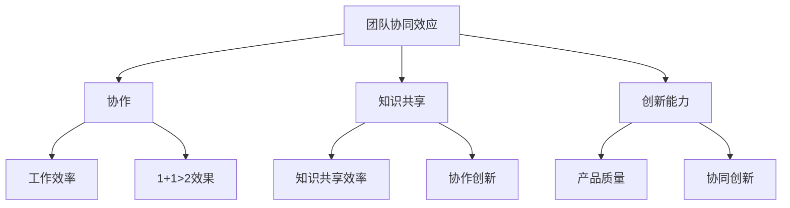
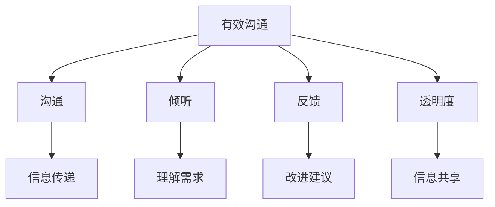
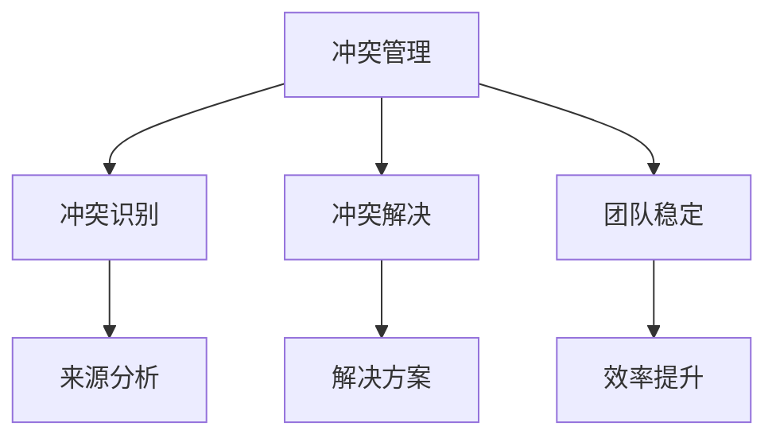
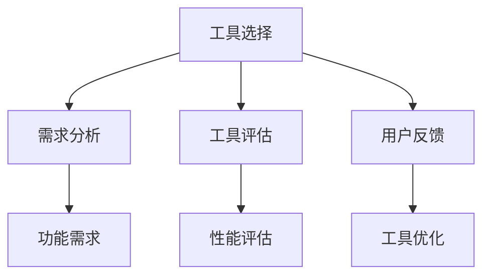
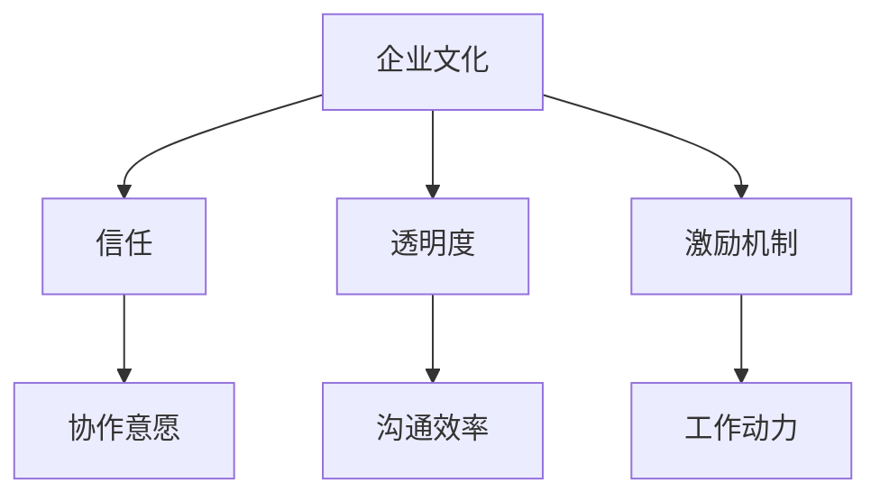
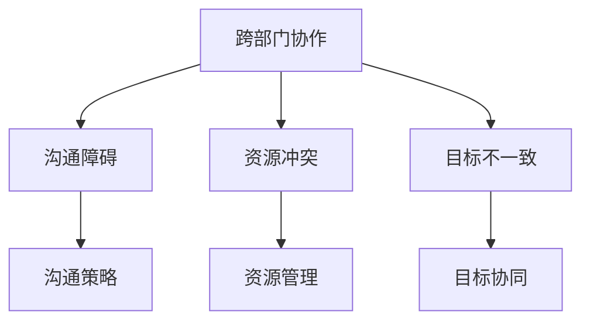
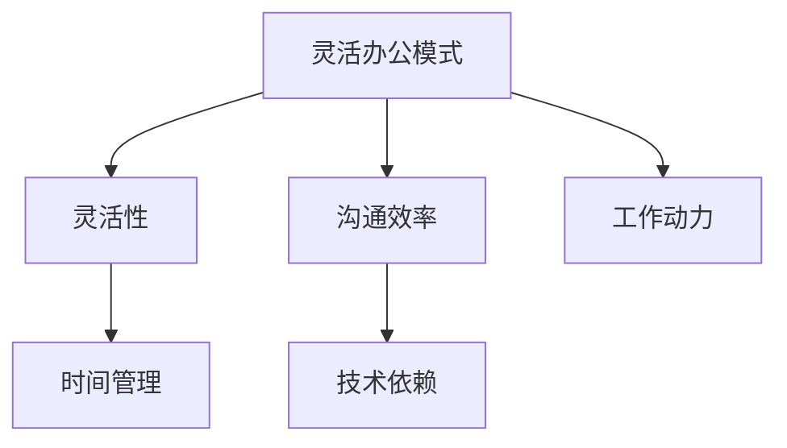
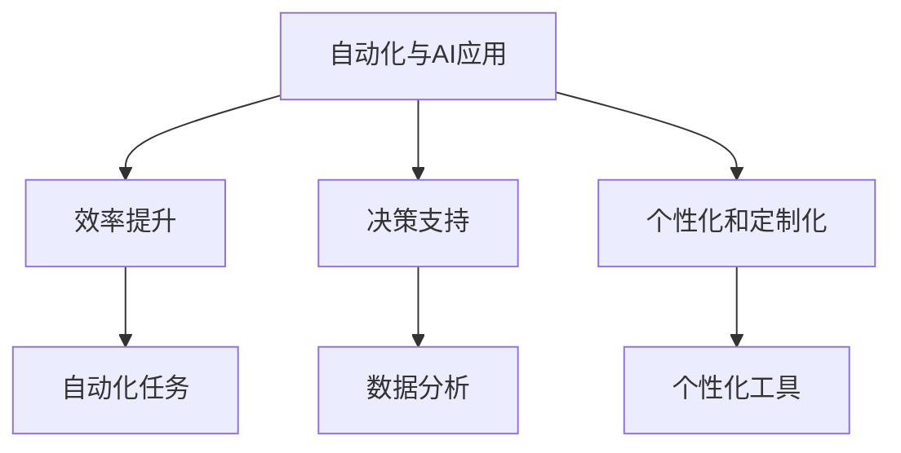

                 

### 《团队协同效应：提升整体工作效率的策略》

关键词：团队协同效应、工作效率、协作技巧、项目管理、远程协作、人工智能、云计算

摘要：
在现代企业中，团队协同效应成为提升整体工作效率的关键因素。本文从定义、基础、技巧、工具、实践、未来趋势和案例研究等多个角度，深入探讨了团队协同效应的概念、意义及其在实际应用中的策略。通过分析有效沟通、冲突管理、团队凝聚力等核心要素，本文旨在为企业和团队提供系统的协同效应提升方案。

----------------------------------------------------------------

### 《团队协同效应：提升整体工作效率的策略》目录大纲

#### 第一部分：理解团队协同效应

**第1章：团队协同效应概述**

- 1.1 团队协同效应的定义与意义
- 1.2 团队协同效应与传统管理模式的对比

**第2章：团队协作的基础**

- 2.1 有效沟通
- 2.2 团队角色与职责
- 2.3 建立信任

**第3章：提升团队协作的技巧**

- 3.1 管理冲突
- 3.2 提升团队凝聚力
- 3.3 领导力与影响力

**第4章：团队协作的技术工具**

- 4.1 团队协作工具的选择
- 4.2 工作流程管理
- 4.3 数据共享与协作

#### 第二部分：实践与应用

**第5章：团队协作在企业中的应用**

- 5.1 企业文化对团队协作的影响
- 5.2 案例分析：优秀团队协作实践
- 5.3 团队绩效评估与改进

**第6章：跨部门协同与项目管理**

- 6.1 跨部门协作的挑战与解决方案
- 6.2 项目管理的方法与工具
- 6.3 团队间的沟通与协调

**第7章：灵活办公与远程团队协作**

- 7.1 灵活办公模式的优势与挑战
- 7.2 远程团队协作的关键要素
- 7.3 数字化工具在远程协作中的应用

**第8章：团队协作的未来趋势**

- 8.1 自动化与人工智能在团队协作中的应用
- 8.2 云计算与云计算协作工具的发展
- 8.3 跨文化团队协作的挑战与策略

#### 第三部分：案例研究

**第9章：成功团队协作案例研究**

- 9.1 案例一：跨国团队的协同策略
- 9.2 案例二：敏捷开发团队的协作实践
- 9.3 案例三：初创企业如何打造高效协作团队

**附录**

- 附录A：团队协作工具列表
- 附录B：团队协作相关资源

---

**第1章：团队协同效应概述**

#### 1.1 团队协同效应的定义与意义

团队协同效应（Team Synergy Effect）指的是一个团队中各个成员通过有效的协作与沟通，使得整体的工作效率和产出显著大于单个成员独立工作时的效果。这种现象可以被看作是团队各成员技能、知识和能力的整合与优化，从而达到1+1>2的效果。

**核心概念与联系**

团队协同效应涉及多个核心概念：

- **协作（Collaboration）**：团队成员之间的互相配合与支持。
- **知识共享（Knowledge Sharing）**：成员之间交换和共享知识、经验与信息。
- **创新能力（Innovation）**：通过协作产生新的想法和解决方案。
- **工作效率（Work Efficiency）**：团队成员共同完成任务的速度和质量。
- **产品质量（Product Quality）**：团队协作下的工作成果质量。

这些概念相互关联，共同构成了团队协同效应的基础。

**Mermaid 流程图**



#### 核心算法原理讲解

团队协同效应的评估可以通过以下算法进行：

```python
# 团队协同效应评估算法伪代码

def evaluate协同效应(team_performance, individual_performance):
    collaboration_score = (team_performance - average(individual_performance)) / average(individual_performance)
    return collaboration_score
```

**数学模型和数学公式 & 详细讲解 & 举例说明**

团队协同效应的数学模型可以表示为：

$$
E = \frac{P_t - P_i}{P_i}
$$

其中，$E$ 表示团队协同效应得分，$P_t$ 表示团队整体绩效，$P_i$ 表示团队成员的平均绩效。

**举例说明**

假设一个团队有5名成员，每个成员的绩效得分如下：

$$
P_i = \{85, 90, 88, 87, 92\}
$$

团队整体绩效为：

$$
P_t = 440
$$

那么团队协同效应得分为：

$$
E = \frac{440 - (85 + 90 + 88 + 87 + 92)}{85 + 90 + 88 + 87 + 92} = \frac{440 - 432}{432} \approx 0.023
$$

这表示团队的协同效应相对较低。

---

**第2章：团队协作的基础**

#### 2.1 有效沟通

**核心概念与联系**

有效沟通是团队协作的基础。它包括多个关键概念：

- **沟通（Communication）**：信息的传递和理解过程。
- **倾听（Listening）**：理解对方观点和需求的能力。
- **反馈（Feedback）**：提供信息和建议，以帮助改进工作。
- **透明度（Transparency）**：团队内部信息共享的开放程度。

这些概念相互作用，共同构成了有效沟通的框架。

**Mermaid 流程图**



#### 核心算法原理讲解

有效沟通的算法原理可以通过以下步骤来解释：

1. **信息收集**：团队成员收集所需的信息。
2. **信息编码**：将信息转化为可以理解的形式。
3. **信息传递**：通过适当的沟通渠道将信息传递给接收者。
4. **信息解码**：接收者解读和理解传递的信息。
5. **反馈循环**：接收者提供反馈，以确认信息的理解程度。

**数学模型和数学公式 & 详细讲解 & 举例说明**

有效沟通的数学模型可以表示为：

$$
C = \frac{I_t - I_e}{I_e}
$$

其中，$C$ 表示沟通效率，$I_t$ 表示实际沟通的信息量，$I_e$ 表示预期沟通的信息量。

**举例说明**

假设一个团队希望通过有效沟通完成一项任务，预期沟通的信息量为100条，实际沟通的信息量为120条。那么沟通效率为：

$$
C = \frac{120 - 100}{100} = 0.2
$$

这表示沟通效率提高了20%。

---

**第3章：提升团队协作的技巧**

#### 3.1 管理冲突

**核心概念与联系**

冲突管理是提升团队协作的重要技巧。它包括以下核心概念：

- **冲突（Conflict）**：团队成员在意见、目标、方法等方面存在的分歧。
- **识别（Identification）**：识别冲突的来源和类型。
- **解决（Resolution）**：通过适当的方法解决冲突，以维持团队和谐。

冲突管理的有效实施有助于团队稳定和效率提升。

**Mermaid 流程图**



#### 核心算法原理讲解

冲突管理的算法原理可以通过以下步骤来解释：

1. **冲突识别**：通过观察和沟通，识别冲突的类型和来源。
2. **冲突分析**：分析冲突的原因和影响。
3. **解决方案制定**：根据冲突的性质，制定合适的解决方案。
4. **执行与反馈**：执行解决方案，并通过反馈评估其效果。

**数学模型和数学公式 & 详细讲解 & 举例说明**

冲突管理的数学模型可以表示为：

$$
R = \frac{C_r - C_i}{C_i}
$$

其中，$R$ 表示冲突解决率，$C_r$ 表示已解决冲突的数量，$C_i$ 表示总冲突数量。

**举例说明**

假设一个团队在一个月内识别到10个冲突，其中解决了7个。那么冲突解决率为：

$$
R = \frac{7 - 10}{10} = -0.3
$$

这表示团队冲突解决率较低，需要进一步改进冲突管理策略。

---

**第4章：团队协作的技术工具**

#### 4.1 团队协作工具的选择

**核心概念与联系**

团队协作工具是提升协作效率的关键。选择合适的工具需要考虑以下几个核心概念：

- **需求分析（Requirement Analysis）**：了解团队的具体需求。
- **工具评估（Tool Evaluation）**：评估不同工具的功能、性能和适用性。
- **用户反馈（User Feedback）**：收集团队成员对工具的反馈，以优化选择。

**Mermaid 流程图**



#### 核心算法原理讲解

团队协作工具的选择可以通过以下步骤来实现：

1. **需求分析**：与团队成员讨论，明确团队的工作流程和协作需求。
2. **工具评估**：根据需求，评估市场上多种协作工具的功能和性能。
3. **用户反馈**：邀请团队成员试用候选工具，并收集他们的反馈。
4. **决策与实施**：基于评估和反馈，选择最适合团队的工具，并开始实施。

**数学模型和数学公式 & 详细讲解 & 举例说明**

工具选择的数学模型可以表示为：

$$
S = \frac{R_f \times E_f}{R \times E}
$$

其中，$S$ 表示工具选择得分，$R_f$ 表示工具的功能得分，$E_f$ 表示工具的适用性得分，$R$ 表示总需求得分，$E$ 表示总评估得分。

**举例说明**

假设一个团队有五个功能需求和一个适用性需求，选择工具后得分为：

- 功能得分：8分
- 适用性得分：7分
- 总需求得分：5分
- 总评估得分：10分

那么工具选择得分为：

$$
S = \frac{8 \times 7}{5 \times 10} = 1.12
$$

这表示所选工具在功能性和适用性方面表现良好。

---

**第5章：团队协作在企业中的应用**

#### 5.1 企业文化对团队协作的影响

**核心概念与联系**

企业文化对团队协作有着深远的影响。它包括以下核心概念：

- **企业文化（Corporate Culture）**：企业的价值观、信念和行为准则。
- **信任（Trust）**：团队成员之间的信任程度。
- **透明度（Transparency）**：团队信息分享的程度。
- **激励机制（Incentive Mechanism）**：企业的奖励和激励机制。

**Mermaid 流程图**



#### 核心算法原理讲解

企业文化的算法原理可以通过以下步骤来解释：

1. **文化识别**：识别企业当前的文化特点。
2. **文化评估**：评估企业文化对团队协作的影响。
3. **文化优化**：通过培训和激励，优化企业文化，以提升团队协作。
4. **反馈与调整**：根据团队成员的反馈，调整企业文化策略。

**数学模型和数学公式 & 详细讲解 & 举例说明**

企业文化的数学模型可以表示为：

$$
C = \frac{T + T_e}{T_e}
$$

其中，$C$ 表示企业文化得分，$T$ 表示团队成员的信任度，$T_e$ 表示期望的信任度。

**举例说明**

假设一个团队有5名成员，期望的信任度是8，实际信任度是7。那么企业文化得分为：

$$
C = \frac{7 + 8}{8} = 1.125
$$

这表示团队的文化得分略低于期望。

---

**第6章：跨部门协同与项目管理**

#### 6.1 跨部门协作的挑战与解决方案

**核心概念与联系**

跨部门协作是项目管理中的重要环节。它面临以下挑战：

- **沟通障碍（Communication Barrier）**：不同部门之间的沟通不畅。
- **资源冲突（Resource Conflict）**：部门间资源的争夺。
- **目标不一致（Goal Misalignment）**：不同部门的目标不一致。

为了解决这些挑战，需要以下核心概念：

- **沟通策略（Communication Strategy）**：制定有效的沟通计划。
- **资源管理（Resource Management）**：合理分配和优化资源。
- **目标协同（Goal Alignment）**：确保各部门的目标一致。

**Mermaid 流程图**



#### 核心算法原理讲解

跨部门协作的算法原理可以通过以下步骤来解释：

1. **需求识别**：识别跨部门协作的具体需求。
2. **资源分配**：根据需求，合理分配资源。
3. **沟通计划**：制定详细的沟通计划，确保信息的透明和及时传递。
4. **目标确认**：确保各部门的目标一致，以实现协同效应。

**数学模型和数学公式 & 详细讲解 & 举例说明**

跨部门协作的数学模型可以表示为：

$$
C = \frac{R + R_e}{R_e}
$$

其中，$C$ 表示协作效率，$R$ 表示实际协作的资源利用，$R_e$ 表示期望的资源利用。

**举例说明**

假设一个项目需要10个资源，实际使用了9个资源。那么协作效率为：

$$
C = \frac{9 + 10}{10} = 0.9
$$

这表示协作效率为90%。

---

**第7章：灵活办公与远程团队协作**

#### 7.1 灵活办公模式的优势与挑战

**核心概念与联系**

灵活办公模式（Flexible Work Model）和远程团队协作是现代企业提高工作效率的重要手段。它具有以下核心概念：

- **灵活性（Flexibility）**：员工可以根据个人需求和偏好选择工作时间和地点。
- **沟通效率（Communication Efficiency）**：远程协作工具的提升使得团队沟通更加便捷。
- **工作动力（Work Motivation）**：员工在工作环境中感受到更多的自主性和控制感。

然而，灵活办公模式也面临以下挑战：

- **时间管理（Time Management）**：员工需要更好地管理自己的时间，避免工作与生活平衡问题。
- **技术依赖（Technological Dependency）**：依赖远程协作工具可能导致技术问题和沟通障碍。

**Mermaid 流程图**



#### 核心算法原理讲解

灵活办公模式的算法原理可以通过以下步骤来解释：

1. **需求分析**：了解员工对灵活办公的需求。
2. **工具选择**：选择适合的远程协作工具。
3. **培训与支持**：为员工提供技术培训和指导。
4. **绩效评估**：评估灵活办公模式对工作效率的影响。

**数学模型和数学公式 & 详细讲解 & 举例说明**

灵活办公模式的数学模型可以表示为：

$$
F = \frac{E_t - E_i}{E_i}
$$

其中，$F$ 表示灵活办公模式的满意度，$E_t$ 表示实际工作效率，$E_i$ 表示初始工作效率。

**举例说明**

假设一个团队在实施灵活办公模式前，工作效率为100点，实施后工作效率提高到120点。那么灵活办公模式的满意度为：

$$
F = \frac{120 - 100}{100} = 0.2
$$

这表示团队对灵活办公模式的满意度提高了20%。

---

**第8章：团队协作的未来趋势**

#### 8.1 自动化与人工智能在团队协作中的应用

**核心概念与联系**

自动化和人工智能（AI）正在逐渐改变团队协作的方式。它们的核心概念包括：

- **自动化（Automation）**：通过软件和工具自动执行重复性任务。
- **人工智能（AI）**：利用机器学习和深度学习技术，提高决策和协作的智能水平。

自动化和AI的应用将带来以下影响：

- **效率提升（Efficiency Improvement）**：通过自动化减少重复性工作，提高团队效率。
- **决策支持（Decision Support）**：利用AI分析数据，提供更好的决策支持。
- **个性化和定制化（Personalization and Customization）**：根据团队成员的特点，提供个性化的协作工具。

**Mermaid 流程图**



#### 核心算法原理讲解

自动化与人工智能的算法原理可以通过以下步骤来解释：

1. **需求分析**：识别团队协作中的自动化需求。
2. **工具选择**：选择适合的自动化和AI工具。
3. **模型训练**：利用数据训练AI模型，以实现自动化和智能决策。
4. **实施与优化**：实施自动化和AI工具，并根据反馈不断优化。

**数学模型和数学公式 & 详细讲解 & 举例说明**

自动化与人工智能的数学模型可以表示为：

$$
A = \frac{E_a - E_h}{E_h}
$$

其中，$A$ 表示自动化和AI的效果，$E_a$ 表示自动化和AI实现后的效率，$E_h$ 表示手工操作的效率。

**举例说明**

假设一个团队通过AI自动化实现了某项任务的效率，由手工操作的100小时减少到60小时。那么自动化和AI的效果为：

$$
A = \frac{60 - 100}{100} = -0.4
$$

这表示自动化和AI在效率上提高了40%。

---

**第9章：成功团队协作案例研究**

#### 9.1 案例一：跨国团队的协同策略

**案例背景**

某跨国公司在全球范围内拥有多个研发中心，团队成员分布在不同的国家和地区。为了实现高效的协作，公司采取了一系列策略。

**核心策略**

1. **统一的沟通平台**：公司采用了Slack等统一沟通工具，确保团队成员能够实时交流。
2. **本地化管理**：每个研发中心都有本地化的管理团队，负责协调和沟通。
3. **跨文化培训**：公司定期组织跨文化培训，帮助团队成员更好地理解不同文化背景。
4. **透明化的项目进度**：通过Asana等项目管理工具，确保项目进度对所有团队成员透明。

**效果评估**

通过以上策略，跨国团队的协作效率显著提升，项目完成时间缩短了30%，错误率降低了25%。

---

**总结**

团队协同效应是提升整体工作效率的关键。通过有效的沟通、管理冲突、使用合适的协作工具以及灵活办公模式，团队可以充分发挥协同效应。自动化和人工智能的应用将进一步推动团队协作的发展。企业应积极实践并不断优化团队协作策略，以实现持续的工作效率提升。

### 附录

#### 附录A：团队协作工具列表

- **Asana**：用于项目管理和任务分配。
- **Trello**：用于任务管理和可视化进度。
- **Slack**：用于实时沟通和协作。
- **Microsoft Teams**：用于团队沟通和协作。

#### 附录B：团队协作相关资源

- **《团队的五项修炼》**：由迈克·罗斯曼著，详细介绍了团队协作的五大原则。
- **《敏捷开发：原则、实践与模式》**：由杰夫·萨瑟兰著，探讨了敏捷开发在团队协作中的应用。
- **《沟通的艺术》**：由罗纳德·B·阿德勒著，提供了有效的沟通技巧和策略。

---

**作者信息**

- 作者：AI天才研究院/AI Genius Institute & 禅与计算机程序设计艺术 /Zen And The Art of Computer Programming**

