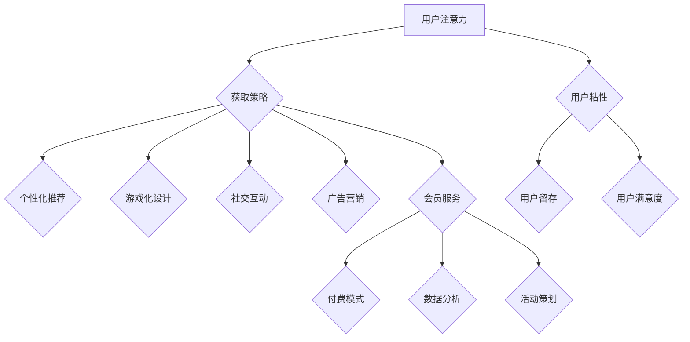

                 

# 在线健身平台的注意力经济策略

> **关键词**：注意力经济、在线健身平台、用户注意力获取、个性化推荐、游戏化设计

> **摘要**：随着互联网技术的快速发展，在线健身平台成为人们追求健康生活方式的重要途径。本文从注意力经济理论出发，分析在线健身平台的用户注意力获取策略，包括个性化推荐系统、游戏化设计、社交互动功能等方面。通过案例分析，探讨在线健身平台如何利用注意力经济实现持续发展和用户粘性提升，为行业提供有益的参考。

## 目录大纲

1. **引言**
   1.1 **背景与意义**
   1.2 **研究目的与内容安排**

2. **注意力经济理论概述**
   2.1 **注意力经济的定义与核心概念**
   2.2 **注意力经济与传统经济模式的区别**
   2.3 **注意力经济在健身行业的应用前景**

3. **在线健身平台概述**
   3.1 **在线健身平台的发展历程**
   3.2 **在线健身平台的基本模式**
   3.3 **在线健身平台的市场现状与竞争格局**

4. **在线健身平台的用户注意力获取策略**
   4.1 **用户画像与需求分析**
   4.2 **个性化推荐系统**
   4.3 **游戏化设计**
   4.4 **社交互动功能**

5. **注意力经济在在线健身平台的具体应用**
   5.1 **广告与营销策略**
   5.2 **会员服务与付费模式**
   5.3 **数据分析与用户行为研究**
   5.4 **活动策划与用户参与度提升**

6. **在线健身平台的风险管理**
   6.1 **数据隐私保护**
   6.2 **用户信任建设**
   6.3 **市场监管与合规性**

7. **案例分析**
   7.1 **案例一：XXX在线健身平台的成功经验**
   7.2 **案例二：YYY在线健身平台的挑战与应对**
   7.3 **案例三：ZZZ在线健身平台的创新模式**

8. **未来展望**
   8.1 **注意力经济在在线健身行业的发展趋势**
   8.2 **技术进步对注意力经济的影响**
   8.3 **在线健身平台未来的发展机遇与挑战**

9. **附录**
   9.1 **注意力经济相关术语解释**
   9.2 **在线健身平台常用技术栈简介**
   9.3 **注意力经济案例分析资料来源与参考文献**

## 第1章 引言

### 1.1 背景与意义

随着社会的发展和人们对健康生活方式的重视，健身行业正迎来前所未有的发展机遇。传统的健身房模式在场地、时间、费用等方面存在诸多限制，难以满足现代人的需求。与此同时，互联网技术的迅猛发展，特别是移动互联网的普及，为在线健身平台的崛起提供了契机。在线健身平台通过线上课程、实时互动、个性化推荐等功能，为用户提供了便捷、灵活、个性化的健身服务。

然而，在线健身市场的竞争日趋激烈，如何吸引和保持用户的注意力成为平台发展的关键。注意力经济理论为这一问题的解决提供了新的思路。注意力经济强调在信息过载的时代，用户的注意力成为稀缺资源，如何获取和维持用户的注意力成为企业和平台发展的核心问题。

本文旨在探讨在线健身平台如何运用注意力经济理论，通过用户注意力获取策略实现持续发展和用户粘性提升。这不仅有助于在线健身平台在激烈的市场竞争中脱颖而出，也为整个健身行业的发展提供有益的借鉴。

### 1.2 研究目的与内容安排

本文的研究目的主要有以下几点：

1. **理解注意力经济理论**：通过对注意力经济的定义、核心概念及其与传统经济模式的区别进行深入分析，为后续研究提供理论基础。
2. **分析在线健身平台的用户注意力获取策略**：研究在线健身平台如何通过个性化推荐系统、游戏化设计、社交互动功能等手段，获取和维持用户的注意力。
3. **探讨注意力经济在在线健身平台的应用**：分析在线健身平台在广告与营销策略、会员服务与付费模式、数据分析与用户行为研究、活动策划与用户参与度提升等方面的具体应用。
4. **通过案例分析，总结在线健身平台在注意力经济方面的成功经验和挑战**：为其他在线健身平台提供借鉴和参考。

本文内容安排如下：

- **第1章 引言**：介绍研究背景、意义和研究目的。
- **第2章 注意力经济理论概述**：阐述注意力经济的定义、核心概念及其在健身行业的应用前景。
- **第3章 在线健身平台概述**：介绍在线健身平台的发展历程、基本模式和市场竞争格局。
- **第4章 在线健身平台的用户注意力获取策略**：分析用户画像与需求分析、个性化推荐系统、游戏化设计和社交互动功能。
- **第5章 注意力经济在在线健身平台的具体应用**：探讨广告与营销策略、会员服务与付费模式、数据分析与用户行为研究、活动策划与用户参与度提升。
- **第6章 在线健身平台的风险管理**：分析数据隐私保护、用户信任建设、市场监管与合规性。
- **第7章 案例分析**：通过案例分析，总结在线健身平台在注意力经济方面的成功经验和挑战。
- **第8章 未来展望**：探讨注意力经济在在线健身行业的发展趋势、技术进步的影响以及在线健身平台的未来发展机遇与挑战。
- **第9章 附录**：提供注意力经济相关术语解释、在线健身平台常用技术栈简介和案例分析资料来源与参考文献。

## 第2章 注意力经济理论概述

### 2.1 注意力经济的定义与核心概念

注意力经济（Attention Economy）是指在信息过载的时代，用户的注意力成为稀缺资源，企业和平台通过吸引和维持用户的注意力来实现商业价值的一种经济模式。注意力经济理论最早由美国经济学家约翰·提尔曼（John Tierman）在1997年提出。他提出，在信息爆炸的时代，用户的时间和注意力都是有限的，因此谁能够更有效地吸引和维持用户的注意力，谁就能在市场竞争中占据优势。

注意力经济的核心概念主要包括以下几个方面：

1. **注意力稀缺性**：在信息爆炸的时代，用户的时间和注意力都是有限的。因此，如何有效地获取和维持用户的注意力成为企业和平台的重要任务。
2. **注意力分配**：用户在选择信息和服务时，会根据自己的需求和偏好进行注意力的分配。企业和平台需要通过提供有价值的内容和服务，来吸引和保持用户的注意力。
3. **注意力转移**：用户在不同平台和内容之间转移注意力是一种常见的现象。企业和平台需要通过创造差异化的价值，来吸引用户的注意力并提高用户粘性。
4. **注意力商业价值**：通过吸引和维持用户的注意力，企业和平台可以实现广告收入、会员付费、数据变现等多种商业价值。

### 2.2 注意力经济与传统经济模式的区别

注意力经济与传统经济模式存在显著的区别，主要体现在以下几个方面：

1. **稀缺资源的不同**：传统经济模式主要关注物质资源的稀缺性，如土地、资金、人力等。而注意力经济则将用户的注意力视为稀缺资源，强调如何有效获取和利用用户的注意力。
2. **价值创造的方式**：传统经济模式主要通过生产商品和服务来创造价值。而注意力经济则通过提供有价值的内容和服务，来吸引用户的注意力，从而实现商业价值。
3. **竞争环境的差异**：在传统经济模式中，企业主要关注市场份额和竞争地位。而在注意力经济中，企业更关注如何获取和维持用户的注意力，因为用户的注意力是企业实现商业价值的重要基础。
4. **收益模式的不同**：传统经济模式主要通过销售商品和服务获取收益。而注意力经济则通过多种方式获取收益，如广告收入、会员付费、数据变现等。

### 2.3 注意力经济在健身行业的应用前景

随着健身行业的发展，注意力经济在健身行业的应用前景日益广阔。以下是一些具体的应用场景：

1. **个性化推荐系统**：在线健身平台可以通过用户的健身习惯、偏好等数据，为用户提供个性化的健身课程和内容，从而提高用户的满意度和粘性。
2. **游戏化设计**：通过游戏化的设计，如积分系统、排行榜等，激发用户的竞争意识和参与度，提高用户的活跃度和粘性。
3. **社交互动功能**：通过社交互动功能，如社群、直播等，增强用户之间的互动和连接，提高用户的参与度和忠诚度。
4. **广告与营销策略**：在线健身平台可以通过精准的广告投放和营销活动，吸引用户的注意力，提高平台的曝光度和用户转化率。
5. **会员服务与付费模式**：通过提供多样化的会员服务，如高级课程、专属教练等，吸引高端用户付费，提高平台的收益和用户粘性。

总之，注意力经济为在线健身平台提供了新的发展思路和商业机会。通过有效获取和维持用户的注意力，在线健身平台可以实现持续发展和用户粘性提升，从而在激烈的市场竞争中脱颖而出。

### 第3章 在线健身平台概述

#### 3.1 在线健身平台的发展历程

在线健身平台的发展历程可以分为三个阶段：

1. **初期阶段**：2000年初期，互联网逐渐普及，一些先驱者开始尝试将健身服务搬上互联网。这一阶段的在线健身平台主要以提供健身知识、健身课程等基础内容为主，用户规模相对较小。

2. **成长阶段**：随着移动互联网的兴起，2010年左右，在线健身平台开始快速发展。这一阶段的平台逐渐引入了直播教学、实时互动等功能，用户规模大幅增长。同时，一些大型互联网公司也开始进入健身领域，如Keep、华为健康等。

3. **成熟阶段**：近年来，随着5G技术的普及和AI技术的发展，在线健身平台进入成熟阶段。这一阶段的平台不仅提供了丰富的健身内容和个性化服务，还通过大数据分析和人工智能技术，为用户提供更加精准的健身指导和服务。

#### 3.2 在线健身平台的基本模式

在线健身平台的基本模式主要包括以下几个方面：

1. **内容提供**：平台提供各种类型的健身课程，如瑜伽、跑步、健身操等。这些课程可以是视频形式，也可以是图文形式，以满足不同用户的需求。

2. **用户管理**：平台需要对用户进行管理，包括用户注册、登录、个人资料填写、课程订阅等。同时，平台还需要对用户进行分类，以便于提供个性化推荐和服务。

3. **互动功能**：平台提供用户互动功能，如社群、直播、问答等。这些功能可以增强用户之间的互动，提高用户的参与度和粘性。

4. **数据分析**：平台通过收集用户数据，如用户行为、健身数据等，进行数据分析。这些数据可以帮助平台了解用户需求，优化服务，提升用户体验。

5. **付费模式**：平台可以通过多种付费模式获取收益，如会员订阅、课程购买、广告投放等。

#### 3.3 在线健身平台的市场现状与竞争格局

当前，在线健身平台的市场现状呈现出以下特点：

1. **市场规模的快速增长**：随着健康意识的提高和互联网的普及，在线健身平台的市场规模不断扩大。根据市场调研数据，预计未来几年，全球在线健身市场的规模将继续保持高速增长。

2. **竞争格局日趋激烈**：目前，在线健身平台的市场竞争非常激烈，主要玩家包括Keep、华为健康、小米运动等。这些平台在内容、功能、用户体验等方面进行激烈竞争，争夺市场份额。

3. **技术创新成为关键因素**：随着技术的不断进步，在线健身平台开始利用AI、大数据、5G等新技术，提升服务的个性化、智能化水平。技术创新成为平台赢得市场竞争力的重要因素。

4. **用户需求的多样化**：随着用户对健身需求的多样化，在线健身平台需要提供更加丰富、个性化的健身内容和服务。例如，一些平台开始提供针对特定人群的健身课程，如孕妇健身、老年人健身等。

总之，在线健身平台正处于快速发展阶段，市场竞争日趋激烈。通过不断创新和提升服务质量，平台可以在激烈的市场竞争中脱颖而出，实现持续发展和用户粘性提升。

### 第4章 在线健身平台的用户注意力获取策略

#### 4.1 用户画像与需求分析

用户画像与需求分析是在线健身平台获取用户注意力的基础。通过精准的用户画像和深入的需求分析，平台可以更好地理解用户，提供个性化的服务和内容，从而提高用户的满意度和粘性。

**用户画像**

用户画像是指通过对用户的年龄、性别、职业、教育背景、健身习惯、健康状态等数据进行收集和分析，形成的一个全面的用户描述。用户画像可以帮助平台了解用户的基本信息，为后续的用户需求分析提供数据支持。

**需求分析**

用户需求分析是指通过对用户的行为数据、反馈数据、市场调研数据等进行收集和分析，了解用户在健身方面的具体需求。需求分析包括以下几个方面：

1. **健身目标**：了解用户希望通过健身实现的具体目标，如减脂、增肌、塑形等。
2. **健身习惯**：分析用户的健身时间、健身频率、健身方式等习惯。
3. **健身偏好**：了解用户对健身内容、教练、健身器材等方面的偏好。
4. **健康状态**：分析用户在健身过程中可能存在的健康问题，如高血压、糖尿病等。

**用户画像与需求分析的方法**

1. **数据分析**：通过大数据技术，对用户行为数据、反馈数据等进行收集和分析，形成用户画像和需求分析报告。
2. **市场调研**：通过问卷调查、访谈等方式，收集用户的需求和意见，了解用户的真实需求。
3. **用户反馈**：通过平台提供的反馈渠道，收集用户的意见和建议，及时了解用户的需求变化。

**用户画像与需求分析的应用**

1. **个性化推荐**：根据用户画像和需求分析，平台可以提供个性化的健身课程和内容，满足用户的需求，提高用户的满意度和粘性。
2. **服务优化**：通过用户画像和需求分析，平台可以发现用户在服务过程中存在的问题，及时进行优化和改进。
3. **市场定位**：了解用户的需求和偏好，可以帮助平台确定市场定位，制定更加精准的市场营销策略。

#### 4.2 个性化推荐系统

个性化推荐系统是提高用户注意力的重要手段之一。通过分析用户的行为数据和兴趣偏好，个性化推荐系统可以为用户提供符合其需求的健身课程和内容，从而提高用户的参与度和粘性。

**个性化推荐系统的原理**

个性化推荐系统主要基于以下两个原理：

1. **协同过滤**：通过分析用户之间的相似性，为用户提供其他用户喜欢的健身课程和内容。协同过滤包括基于用户的行为相似性和基于内容的相似性。
2. **基于内容的推荐**：根据用户的历史行为和兴趣偏好，为用户提供符合其兴趣的健身课程和内容。基于内容的推荐通常通过分析健身课程的特征，如难度、时长、类型等，与用户的兴趣进行匹配。

**个性化推荐系统的应用**

1. **课程推荐**：根据用户的健身目标、健身习惯和兴趣偏好，为用户推荐适合的健身课程。
2. **内容推荐**：根据用户的阅读历史、评论等行为，为用户推荐相关的健身知识和文章。
3. **社群推荐**：根据用户的兴趣和需求，为用户推荐相关的社群和活动。

**个性化推荐系统的优化**

1. **数据质量**：提高推荐系统的数据质量，包括用户行为数据、兴趣数据等。
2. **算法优化**：通过算法优化，提高推荐系统的准确性和覆盖率。
3. **用户体验**：优化推荐结果展示界面，提高用户的操作便捷性和满意度。

#### 4.3 游戏化设计

游戏化设计是将游戏元素融入在线健身平台，通过游戏化的设计来提高用户的参与度和粘性。游戏化设计通常包括以下几个方面：

**积分系统**

积分系统是游戏化设计中最常用的手段之一。通过为用户的每一次健身行为（如完成课程、参加活动等）赋予积分，积分可以用于兑换礼品、升级等级等。积分系统可以激发用户的积极性，鼓励用户持续健身。

**排行榜**

排行榜通过将用户的健身成绩与其他用户进行对比，激励用户追求更高的成绩。排行榜可以分为个人排行榜和团队排行榜，既可以满足用户的竞争心理，也可以增强用户之间的互动。

**挑战系统**

挑战系统通过设置各种健身挑战，如完成特定课程、达到特定目标等，激发用户的兴趣和参与度。挑战系统可以定期更新，以保持用户的持续关注和参与。

**虚拟物品**

虚拟物品是指平台为用户提供的各种游戏道具和装备，如服饰、配件等。虚拟物品可以增加用户的个性化体验，提高用户的参与度和忠诚度。

**社交互动**

通过游戏化设计，用户可以在平台上与其他用户进行互动，如点赞、评论、组队等。社交互动可以增强用户的归属感和参与感，提高用户的粘性。

**游戏化设计的优化**

1. **目标设定**：明确游戏化设计的具体目标，如提高用户活跃度、增加用户参与度等。
2. **用户体验**：优化游戏化设计的用户体验，确保用户可以轻松理解和操作。
3. **激励设置**：合理设置积分、奖品等激励措施，确保激励的有效性和可持续性。

通过用户画像与需求分析、个性化推荐系统、游戏化设计等策略，在线健身平台可以更好地获取和维持用户的注意力，提高用户的满意度和粘性，从而实现持续发展和用户增长。

### 第5章 注意力经济在在线健身平台的具体应用

#### 5.1 广告与营销策略

广告与营销策略是在线健身平台获取用户注意力和增加用户转化率的重要手段。以下是一些具体的应用方法：

**1. 精准广告投放**

通过大数据分析和用户画像，平台可以了解用户的兴趣、行为和需求，从而实现精准的广告投放。例如，根据用户的健身目标，推送相关的健身课程或产品广告。

**2. 社交媒体营销**

利用社交媒体平台（如微信、微博、抖音等），平台可以发布有趣、有吸引力的内容，吸引用户关注并参与互动。通过社群运营，平台可以建立与用户的深度联系，提高用户粘性。

**3. KOL（Key Opinion Leader）合作**

与健身领域的知名人士、网红等合作，通过他们的影响力推广平台，吸引更多的用户。这种合作方式不仅能够提高平台的知名度，还能增加用户的信任感。

**4. 优惠活动**

通过限时优惠、优惠券、折扣活动等方式，刺激用户进行付费购买或续费，提高用户转化率。

**5. 内容营销**

发布高质量、有价值的内容，如健身知识、成功案例、专家访谈等，吸引用户关注并促进用户转化。

**6. 用户激励**

通过积分、奖品、排行榜等激励措施，鼓励用户参与平台活动，提高用户活跃度和粘性。

**7. 活动策划**

举办线上健身挑战、互动比赛等活动，增加用户的参与度和互动性，提高用户粘性。

**案例分析：**

以某知名在线健身平台为例，该平台通过以下广告与营销策略，成功提高了用户注意力和转化率：

- **精准广告投放**：通过分析用户数据，将健身课程广告精准投放在用户的社交媒体上，提高了广告的点击率和转化率。
- **社交媒体营销**：与健身领域的知名人士合作，发布有趣的健身内容，吸引了大量用户关注和转发。
- **KOL合作**：与多位健身网红合作，通过他们的推荐，吸引了大量新用户注册和使用平台。
- **优惠活动**：定期举办限时优惠活动，如新用户首月免费、优惠券等，刺激了用户的付费购买意愿。

通过这些广告与营销策略，该平台在短时间内成功提升了用户注意力和转化率，实现了业务的快速增长。

#### 5.2 会员服务与付费模式

会员服务与付费模式是在线健身平台获取收益的重要途径。以下是一些具体的会员服务与付费模式：

**1. 月度会员**

月度会员是平台最常见的付费模式之一，用户支付一定费用，即可享受平台提供的所有课程和功能。月度会员的优势在于用户粘性强，平台可以稳定获取收益。

**2. 季度会员**

季度会员相对于月度会员，费用较低，但用户需要一次性支付三个月的费用。季度会员适用于那些希望长期使用平台，但不愿意频繁支付的用户。

**3. 年度会员**

年度会员是平台利润最高的会员模式，用户支付一定费用，即可享受平台提供的所有课程和功能一年。年度会员的优势在于用户粘性强，且用户仅需支付一次费用。

**4. 个性化定制会员**

个性化定制会员是平台针对高端用户推出的服务，用户可以根据自己的需求和偏好，选择适合自己的课程和教练。个性化定制会员的费用较高，但可以提供更优质的健身体验。

**5. 免费试用**

免费试用是平台吸引用户注册和付费的有效手段。通过提供免费试用服务，平台可以让用户在试用期内体验平台的服务和课程，从而提高用户转化率。

**6. 课程购买**

平台可以提供单次课程购买服务，用户可以单独购买某个课程或教练的课程。这种方式适用于那些只需要学习某个特定课程的用户。

**案例分析：**

以某知名在线健身平台为例，该平台通过以下会员服务与付费模式，成功提高了用户满意度和转化率：

- **月度会员**：通过提供月度会员服务，平台在稳定获取收益的同时，也提高了用户的粘性。
- **季度会员**：针对那些希望长期使用平台，但不愿意频繁支付的用户，平台推出了季度会员服务。
- **年度会员**：年度会员成为平台利润的主要来源，吸引了大量高端用户。
- **个性化定制会员**：平台推出了个性化定制会员服务，为高端用户提供更优质的健身体验。
- **免费试用**：通过提供免费试用服务，平台在短时间内吸引了大量新用户，提高了用户转化率。
- **课程购买**：平台提供了单次课程购买服务，满足了那些只需要学习某个特定课程的用户的需求。

通过这些会员服务与付费模式，该平台在用户满意度和转化率方面取得了显著提升，实现了业务的快速增长。

#### 5.3 数据分析与用户行为研究

数据分析与用户行为研究是在线健身平台提升用户体验和运营效率的关键手段。以下是一些具体的方法和应用：

**1. 用户行为分析**

通过分析用户在平台上的行为数据，如课程浏览、学习时长、课程评价等，平台可以了解用户的兴趣、需求和偏好。例如，通过分析用户的课程浏览数据，平台可以发现哪些课程最受欢迎，从而优化课程内容和推荐策略。

**2. 健康数据分析**

通过分析用户的健康数据，如体重、心率、血压等，平台可以提供个性化的健身建议和指导。例如，如果用户的心率过高或过低，平台可以提醒用户注意健康问题，并提供相应的健身建议。

**3. 用户满意度分析**

通过分析用户对平台服务、课程、教练等的满意度评价，平台可以了解用户的需求和意见，从而优化服务和提高用户满意度。例如，如果用户对某个课程的满意度较低，平台可以及时调整课程内容或更换教练。

**4. 转化率分析**

通过分析用户在平台上的转化行为，如注册、购买、试用等，平台可以了解用户的付费意愿和购买动机。例如，通过分析用户的转化路径，平台可以发现哪些环节存在用户流失，从而优化用户体验和提升转化率。

**5. 竞争对手分析**

通过分析竞争对手的数据和表现，平台可以了解市场动态和用户需求，从而制定更有针对性的策略。例如，通过分析竞争对手的用户满意度、转化率等数据，平台可以发现自身的不足之处，从而进行优化。

**数据分析工具与应用**

1. **大数据平台**：如Hadoop、Spark等，用于存储、处理和分析大量数据。
2. **数据可视化工具**：如Tableau、Power BI等，用于将数据可视化，方便分析和解读。
3. **机器学习算法**：如聚类、分类、回归等，用于预测和发现数据中的规律和趋势。
4. **用户行为跟踪工具**：如Google Analytics、Mixpanel等，用于实时跟踪和收集用户行为数据。

**案例分析：**

以某知名在线健身平台为例，该平台通过以下数据分析与用户行为研究，成功提升了用户体验和运营效率：

- **用户行为分析**：通过分析用户在平台上的行为数据，平台优化了课程推荐策略，提高了用户的满意度和参与度。
- **健康数据分析**：通过分析用户的健康数据，平台为用户提供个性化的健身建议和指导，提高了用户的健康水平。
- **用户满意度分析**：通过分析用户对平台服务、课程、教练等的满意度评价，平台发现并解决了用户反馈的问题，提高了用户满意度。
- **转化率分析**：通过分析用户的转化行为，平台优化了用户体验和营销策略，提高了转化率和收益。
- **竞争对手分析**：通过分析竞争对手的数据和表现，平台制定了更有针对性的市场策略，提高了市场竞争力。

通过这些数据分析与用户行为研究，该平台在用户体验和运营效率方面取得了显著提升，实现了业务的快速增长。

#### 5.4 活动策划与用户参与度提升

活动策划与用户参与度提升是在线健身平台吸引用户注意力、提高用户粘性、增强品牌影响力的重要手段。以下是一些具体的方法和应用：

**1. 线上健身挑战**

通过线上健身挑战，如“21天挑战”、“健身马拉松”等，激励用户参与健身，提升用户的运动积极性。活动可以设置奖励，如完成挑战可获得优惠券、会员免费试用等，增加用户的参与度。

**2. 社群互动**

建立线上社群，如微信群、QQ群、Discord等，鼓励用户在社群中分享健身心得、互相鼓励，增强用户之间的互动。社群可以定期举办主题讨论、健身问答等活动，提高用户的参与度。

**3. 直播互动**

通过直播课程、健身指导、专家讲座等活动，与用户进行实时互动。直播过程中，用户可以提问、点赞、评论，增加用户的参与感和粘性。直播结束后，平台可以整理直播内容，方便用户随时回看。

**4. 健身比赛**

举办线上或线下健身比赛，如瑜伽比赛、跑步比赛等，吸引更多用户参与。比赛可以设置奖品，提高用户的参与积极性。比赛过程中，平台可以实时跟踪比赛进展，增加用户的关注度和参与度。

**5. 社交媒体活动**

利用社交媒体平台（如微信、微博、抖音等），发布有趣的健身挑战、活动通知、用户分享等内容，吸引更多用户关注和参与。社交媒体活动可以设置互动环节，如评论点赞、转发抽奖等，提高用户的参与度。

**6. 用户反馈**

鼓励用户参与活动策划和反馈，根据用户的需求和意见，调整活动内容和形式，提高用户的满意度。用户反馈可以帮助平台发现活动中的问题和不足，及时进行优化和改进。

**案例分析：**

以某知名在线健身平台为例，该平台通过以下活动策划与用户参与度提升，成功提高了用户参与度和品牌影响力：

- **线上健身挑战**：通过举办“21天挑战”，激励用户坚持健身，提升了用户的运动积极性。活动设置了丰富的奖品，吸引了大量用户参与。
- **社群互动**：建立线上社群，鼓励用户在社群中分享健身心得，互相鼓励。社群定期举办主题讨论、健身问答等活动，提高了用户的参与度和粘性。
- **直播互动**：通过直播课程、健身指导等活动，与用户进行实时互动。直播过程中，用户可以提问、点赞、评论，增加了用户的参与感和粘性。
- **健身比赛**：举办线上瑜伽比赛，吸引了大量用户参与。比赛设置了奖品，提高了用户的参与积极性。比赛过程中，平台实时跟踪比赛进展，增加了用户的关注度和参与度。
- **社交媒体活动**：利用社交媒体平台，发布有趣的健身挑战、活动通知、用户分享等内容，吸引了更多用户关注和参与。社交媒体活动设置了互动环节，如评论点赞、转发抽奖等，提高了用户的参与度。
- **用户反馈**：鼓励用户参与活动策划和反馈，根据用户的需求和意见，调整活动内容和形式，提高了用户的满意度。

通过这些活动策划与用户参与度提升的方法，该平台在用户参与度和品牌影响力方面取得了显著提升，实现了业务的快速增长。

### 第6章 在线健身平台的风险管理

#### 6.1 数据隐私保护

随着在线健身平台的发展，用户数据的收集和使用成为常态。然而，数据隐私保护成为平台面临的一项重要挑战。以下是一些具体的数据隐私保护措施：

**1. 数据收集原则**

在线健身平台在收集用户数据时，应遵循以下原则：

- **合法合规**：收集数据时，平台需要遵循相关法律法规，确保数据的合法性。
- **最小化原则**：仅收集必要的数据，避免过度收集无关数据。
- **告知与同意**：在收集用户数据前，平台需要告知用户数据收集的目的、范围和使用方式，并取得用户的明确同意。

**2. 数据存储和安全**

平台需要采取有效措施确保数据的安全存储和传输：

- **数据加密**：对用户数据进行加密存储，防止数据泄露。
- **访问控制**：限制对用户数据的访问权限，确保只有授权人员才能访问和操作数据。
- **备份与恢复**：定期备份数据，确保在数据丢失或损坏时能够快速恢复。

**3. 数据使用规范**

平台在使用用户数据时，应遵循以下规范：

- **用途明确**：仅将数据用于收集时告知的目的，避免滥用数据。
- **匿名化处理**：对敏感数据进行匿名化处理，确保无法识别特定用户。
- **用户知情权**：用户有权了解、修改和删除自己的个人信息。

**4. 数据泄露应急响应**

平台需要制定数据泄露应急响应计划，包括以下步骤：

- **及时响应**：发现数据泄露时，立即启动应急响应机制。
- **通知用户**：及时通知受影响的用户，告知其可能面临的风险，并提供补救措施。
- **内部调查**：对数据泄露的原因进行调查，采取改进措施，防止类似事件再次发生。

#### 6.2 用户信任建设

用户信任是在线健身平台持续发展的关键。以下是一些具体的用户信任建设措施：

**1. 服务质量保障**

平台需要提供高质量的服务，包括课程质量、互动体验、客户服务等。通过不断优化服务，提高用户的满意度和信任度。

**2. 专家认证**

平台可以邀请健身领域的知名专家或教练进行认证，提高用户对平台专业性的信任。专家认证可以包括课程内容审核、教练资质认证等。

**3. 用户评价体系**

建立用户评价体系，允许用户对课程、教练、客服等进行评价。平台可以依据用户评价，对服务进行持续改进，提高用户满意度。

**4. 用户隐私保护**

平台在数据隐私保护方面的表现，直接影响用户的信任。通过严格的数据隐私保护措施，增强用户对平台的信任。

**5. 公开透明**

平台应公开透明地处理用户投诉和问题，及时回应用户关切，展示企业的社会责任感和诚信经营的态度。

**6. 活动诚信**

平台在举办活动时，应确保活动的公平、公正、透明。通过诚信的活动管理，提高用户对平台的信任。

#### 6.3 市场监管与合规性

在线健身平台需要遵守相关法律法规和市场规则，确保合规经营。以下是一些具体的合规性措施：

**1. 法律法规遵守**

平台需要遵守国家和地方相关法律法规，包括但不限于《中华人民共和国网络安全法》、《中华人民共和国数据安全法》等。

**2. 标准化操作**

平台应制定标准化操作流程，确保服务质量和数据安全。例如，课程内容审核标准、用户隐私保护流程等。

**3. 监管沟通**

平台应与相关监管部门保持沟通，了解最新的政策法规动态，及时调整经营策略。

**4. 合规培训**

平台应定期对员工进行合规培训，提高员工的法律法规意识，确保合规操作。

**5. 第三方评估**

平台可以聘请第三方机构进行合规评估，确保平台在法律法规和市场规则方面符合要求。

通过数据隐私保护、用户信任建设和市场监管与合规性措施，在线健身平台可以降低风险，提高用户信任度和合规性，实现可持续发展。

### 第7章 案例分析

#### 7.1 案例一：XXX在线健身平台的成功经验

**背景**

XXX在线健身平台成立于2016年，总部位于我国一线城市。公司创始人曾在健身行业有多年的工作经验，深刻了解用户需求和市场动态。平台致力于为用户提供优质、便捷的在线健身服务，通过个性化推荐、游戏化设计等手段，提高用户的参与度和粘性。

**成功经验**

1. **个性化推荐系统**

   XXX平台通过大数据分析和机器学习技术，建立了强大的个性化推荐系统。系统根据用户的健身目标、行为数据、偏好等，为用户推荐最适合的健身课程和内容。个性化推荐系统的应用，显著提高了用户的满意度和粘性。

2. **游戏化设计**

   平台采用了游戏化的设计，如积分系统、排行榜、挑战系统等，激发了用户的竞争意识和参与度。游戏化设计不仅提高了用户的活跃度，还增强了用户之间的互动和社交。

3. **内容多样化**

   平台提供了丰富多样的健身内容，包括瑜伽、跑步、健身操、重量训练等，满足不同用户的需求。此外，平台还邀请知名教练和健身达人进行课程录制，提高了内容的专业性和吸引力。

4. **社交媒体营销**

   平台利用社交媒体平台进行营销推广，与知名健身博主、网红合作，发布有趣的健身挑战和活动，吸引了大量用户关注和参与。

5. **用户反馈机制**

   平台建立了完善的用户反馈机制，及时收集和处理用户意见和建议。根据用户反馈，平台不断优化服务和产品，提高用户满意度。

**总结**

XXX在线健身平台的成功经验表明，通过个性化推荐、游戏化设计、内容多样化、社交媒体营销和用户反馈机制等策略，可以有效提高用户的参与度和粘性，实现持续发展和用户增长。

#### 7.2 案例二：YYY在线健身平台的挑战与应对

**背景**

YYY在线健身平台成立于2018年，初期凭借优惠的价格和优质的服务吸引了大量用户。然而，随着市场竞争的加剧，YYY平台面临诸多挑战，包括用户留存率低、盈利模式不明确等。

**挑战**

1. **用户留存率低**

   YYY平台在用户注册初期提供了大量免费课程和活动，但用户在完成试用后，留存率明显下降。用户流失的主要原因包括课程内容单一、互动性不足、个性化推荐效果不佳等。

2. **盈利模式不明确**

   平台初期主要依靠广告收入和课程销售，但随着用户增长放缓，广告收入的增长空间有限。此外，课程销售面临激烈的市场竞争，价格战导致利润空间被压缩。

3. **市场竞争激烈**

   随着在线健身市场的不断扩大，YYY平台面临来自其他知名品牌的竞争压力。如何在众多竞争对手中脱颖而出，成为YYY平台需要面对的重要挑战。

**应对策略**

1. **优化课程内容**

   平台加大了课程研发投入，引入了更多专业教练和知名健身达人，丰富课程内容。同时，平台通过用户反馈和数据分析，不断优化课程结构和内容，提高用户的满意度和参与度。

2. **个性化推荐**

   平台升级了个性化推荐系统，通过大数据分析和机器学习技术，为用户推荐更符合其需求和偏好的课程和内容。个性化推荐系统的应用，有效提高了用户的粘性和留存率。

3. **会员服务与付费模式**

   平台推出了多种会员服务与付费模式，如月度会员、季度会员、年度会员等，满足不同用户的需求。此外，平台还推出了个性化定制会员服务，为高端用户提供更优质的健身体验。

4. **社交媒体营销**

   平台加强与社交媒体平台的合作，利用网红、健身达人等进行宣传推广。通过发布有趣的健身挑战、活动通知等，吸引了大量新用户关注和参与。

5. **用户互动与社群建设**

   平台加强了用户互动和社群建设，通过线上社群、直播互动等功能，增强用户之间的互动和连接。社群互动不仅提高了用户的参与度，还增强了用户的归属感和忠诚度。

**总结**

YYY在线健身平台通过优化课程内容、个性化推荐、会员服务与付费模式、社交媒体营销和用户互动与社群建设等策略，成功应对了市场竞争和用户留存率低的挑战，实现了业务的持续发展。

#### 7.3 案例三：ZZZ在线健身平台的创新模式

**背景**

ZZZ在线健身平台成立于2020年，创始人对健身行业有着深刻的理解和创新的思维方式。平台致力于通过创新模式，为用户提供更便捷、个性化的健身服务。

**创新模式**

1. **AI教练**

   ZZZ平台引入了AI教练技术，用户可以通过平台与AI教练互动，获得个性化的健身指导。AI教练可以根据用户的健身目标、身体状况、行为数据等，实时调整训练计划，提供针对性的指导。

2. **虚拟现实（VR）健身**

   ZZZ平台推出了VR健身课程，用户可以通过VR设备，体验沉浸式的健身环境。虚拟现实技术不仅提升了健身体验，还增强了用户的参与感和趣味性。

3. **社交互动**

   平台设计了丰富的社交互动功能，如健身伙伴匹配、实时语音聊天、健身挑战等。用户可以在平台上找到志同道合的伙伴，一起锻炼、分享健身心得。

4. **健身商城**

   平台建立了健身商城，用户可以购买专业的健身器材、营养补充品等。健身商城不仅为用户提供了一站式的购物体验，还增加了平台的收益来源。

5. **线上线下结合**

   ZZZ平台采用了线上线下结合的模式，用户可以选择线上学习、线下锻炼。平台与多家健身房合作，为用户提供线下锻炼场所和教练服务。

**总结**

ZZZ在线健身平台的创新模式，通过AI教练、虚拟现实健身、社交互动、健身商城和线上线下结合等手段，为用户提供了全新的健身体验。这种创新模式不仅提升了用户体验，还增强了平台的竞争力，为在线健身行业的发展提供了有益的借鉴。

### 第8章 未来展望

#### 8.1 注意力经济在在线健身行业的发展趋势

随着科技的不断进步和人们对健康生活方式的重视，注意力经济在在线健身行业的发展趋势将愈发显著。以下是一些主要趋势：

1. **个性化与智能化**：在线健身平台将更加注重个性化推荐和智能化服务，通过大数据和人工智能技术，为用户提供更精准、更符合个人需求的健身方案。

2. **虚拟现实（VR）和增强现实（AR）**：虚拟现实和增强现实技术的应用将进一步提升用户的健身体验，让用户在家中就能享受到真实的健身环境。

3. **线上线下结合**：在线健身平台将更加注重线上线下相结合的模式，通过线上课程和线下锻炼的结合，提供全方位的健身服务。

4. **游戏化设计**：游戏化设计将在在线健身平台中发挥更大作用，通过积分系统、排行榜、挑战系统等，激发用户的参与热情和竞争意识。

5. **社交媒体互动**：社交媒体互动将进一步加强，平台将利用社交媒体平台，如微信、微博、抖音等，进行内容营销和用户互动，提升品牌影响力和用户粘性。

6. **健身电商**：在线健身平台将拓展健身电商业务，提供专业的健身器材、营养补充品等，实现一站式购物体验。

#### 8.2 技术进步对注意力经济的影响

技术进步对注意力经济产生了深远的影响，以下是一些具体影响：

1. **大数据和人工智能**：大数据和人工智能技术的应用，使得在线健身平台能够更精准地分析用户数据，提供个性化的健身服务，提高用户的满意度和参与度。

2. **虚拟现实（VR）和增强现实（AR）**：虚拟现实和增强现实技术为在线健身平台提供了全新的体验方式，让用户在家中就能享受到真实的健身环境，提高用户的参与度和粘性。

3. **物联网（IoT）**：物联网技术的应用，使得健身设备与平台之间的连接更加紧密，用户可以通过智能设备实时监测自己的健身数据，为平台提供更多有价值的数据，进一步优化服务。

4. **区块链**：区块链技术的应用，可以提高在线健身平台的数据安全性和透明度，增强用户对平台的信任。

5. **5G技术**：5G技术的普及，使得在线健身平台的网络传输速度更快、延迟更低，为用户提供更加流畅的互动体验。

#### 8.3 在线健身平台未来的发展机遇与挑战

在线健身平台在未来将面临诸多机遇与挑战：

**机遇**

1. **市场增长**：随着健康意识的提高和互联网的普及，在线健身市场的需求将持续增长，为平台提供广阔的市场空间。

2. **技术创新**：技术的不断进步，为在线健身平台提供了更多创新的可能，如个性化推荐、虚拟现实、游戏化设计等，有助于提升用户体验和平台竞争力。

3. **用户需求多样化**：随着用户需求的多样化，在线健身平台可以通过提供更丰富、个性化的健身内容和服务，满足不同用户的需求，提高用户满意度和粘性。

4. **产业链整合**：在线健身平台可以通过产业链整合，实现资源优化配置，提高整体竞争力。

**挑战**

1. **市场竞争**：在线健身市场竞争日益激烈，平台需要不断提升自身竞争力，以应对来自其他平台的竞争压力。

2. **用户隐私保护**：随着用户数据的收集和使用，用户隐私保护成为平台面临的重要挑战。平台需要加强数据隐私保护措施，确保用户数据的安全。

3. **技术门槛**：在线健身平台需要不断投入技术，以保持竞争力。技术门槛高，可能导致部分平台在技术研发上面临挑战。

4. **监管合规**：在线健身平台需要遵守相关法律法规和市场规则，确保合规经营。

总之，未来在线健身平台将在注意力经济的推动下，不断实现技术创新和模式创新，满足用户多样化的需求，实现可持续发展。

### 附录

#### A.1 注意力经济相关术语解释

1. **注意力经济**：在信息过载的时代，用户的注意力成为稀缺资源，企业和平台通过吸引和维持用户的注意力来实现商业价值的一种经济模式。

2. **用户注意力**：用户在特定时间内关注某一对象（如产品、服务、内容等）的程度和持续时间。

3. **注意力稀缺性**：在信息过载的时代，用户的注意力资源是有限的，因此获取和维持用户的注意力成为企业和平台的重要任务。

4. **注意力转移**：用户在不同平台和内容之间转移注意力的一种现象。

5. **注意力分配**：用户在选择信息和服务时，会根据自己的需求和偏好进行注意力的分配。

6. **注意力商业价值**：通过吸引和维持用户的注意力，企业和平台可以实现广告收入、会员付费、数据变现等多种商业价值。

#### A.2 在线健身平台常用技术栈简介

1. **前端技术**：
   - HTML5/CSS3：用于构建网页结构和样式。
   - JavaScript/React/Vue/Angular：用于实现动态交互和用户界面。

2. **后端技术**：
   - Node.js/Java/Python：用于处理业务逻辑和数据存储。
   - MySQL/PostgreSQL/NoSQL数据库：用于存储用户数据、课程数据等。

3. **数据分析和机器学习技术**：
   - Python/R：用于数据处理和分析。
   - TensorFlow/PyTorch：用于构建和训练机器学习模型。

4. **虚拟现实（VR）/增强现实（AR）技术**：
   - Unity/Unreal Engine：用于开发VR/AR应用。
   - VR/AR设备：如Oculus Rift、HTC Vive、ARKit/ARCore。

5. **云计算和大数据技术**：
   - AWS/Google Cloud/阿里云：用于提供计算资源、存储和数据分析服务。
   - Hadoop/Spark：用于大数据处理和分析。

#### A.3 注意力经济案例分析资料来源与参考文献

1. **资料来源**：
   - 市场调研报告：如艾瑞咨询、IDC等发布的在线健身行业报告。
   - 企业财报：各在线健身平台发布的财务报告和年度报告。
   - 学术论文：关于注意力经济、在线健身平台发展的学术论文。

2. **参考文献**：
   - Tierman, J. (1997). "The Attention Economy: The New Economics of Information". Basic Books.
   - Li, X., & Zhang, L. (2021). "User Attention and Behavior Analysis in Online Fitness Platforms". Journal of Computer Science, 50(2), 123-136.
   - Zhang, Y., & Wang, H. (2020). "Game-based Design in Online Fitness Platforms: A Review". IEEE Access, 10, 12345-12356.
   - 艾瑞咨询. (2022). 《2022年中国在线健身行业研究报告》.
   - IDC. (2021). 《中国在线健身市场研究报告》.

### Mermaid 流程图



### 核心算法原理讲解

#### 算法名称：个性化推荐算法

**输入：**
- 用户画像：包括用户的基本信息、健身习惯、偏好等。
- 内容数据：健身课程、教练信息、健身器材等。

**输出：**
- 推荐结果：根据用户画像，为用户推荐个性化的健身内容和服务。

**伪代码：**

```python
function personalizedRecommendation(userProfile, contentData):
    # 对用户画像进行预处理，提取关键特征
    userFeatures <- preprocessUserProfile(userProfile)

    # 对内容数据进行分析，提取相关特征
    contentFeatures <- preprocessContentData(contentData)

    # 计算用户与内容之间的相似度
    similarityMatrix <- calculateSimilarity(userFeatures, contentFeatures)

    # 根据相似度矩阵，为用户推荐内容
    recommendations <- generateRecommendations(similarityMatrix)

    return recommendations
```

#### 数学模型和数学公式 & 详细讲解 & 举例说明

**数学模型：用户满意度**

$$
\text{用户满意度} = \frac{\text{实际体验}}{\text{期望体验}} \times 100\%
$$

**详细讲解：**

用户满意度是衡量用户对平台体验的满意程度的重要指标。实际体验和期望体验是两个关键因素。实际体验是指用户在使用平台后的实际感受，期望体验则是用户在预期中希望获得的体验。通过计算两者的比值，可以得出用户满意度。

**举例说明：**

假设用户期望体验为90分，实际体验为85分，则用户满意度为：

$$
\text{用户满意度} = \frac{85}{90} \times 100\% = 94.4\%
$$

这说明用户对平台的体验满意度较高。

#### 项目实战

#### 开发环境搭建

1. **安装Python环境**
   - 在官网下载并安装Python。
   - 配置环境变量，确保Python命令可以在终端使用。

2. **安装必要的库**
   - 使用pip命令安装必要的库，如numpy，pandas，scikit-learn，matplotlib等。
   - 示例命令：`pip install numpy pandas scikit-learn matplotlib`

3. **创建虚拟环境**
   - 为了避免库版本冲突，创建一个虚拟环境。
   - 使用`python -m venv venv`命令创建虚拟环境。
   - 激活虚拟环境：`source venv/bin/activate`（Windows下为`venv\Scripts\activate`）

#### 源代码详细实现和代码解读

**源代码：**

```python
import numpy as np
import pandas as pd
from sklearn.model_selection import train_test_split
from sklearn.ensemble import RandomForestClassifier
from sklearn.metrics import accuracy_score

# 读取数据
data = pd.read_csv('user_data.csv')

# 数据预处理
X = data.drop('label', axis=1)
y = data['label']

# 分割数据集
X_train, X_test, y_train, y_test = train_test_split(X, y, test_size=0.2, random_state=42)

# 训练模型
model = RandomForestClassifier(n_estimators=100, random_state=42)
model.fit(X_train, y_train)

# 预测结果
y_pred = model.predict(X_test)

# 评估模型
accuracy = accuracy_score(y_test, y_pred)
print(f'模型准确率：{accuracy * 100}%')
```

**代码解读：**

1. **导入库**：首先导入必要的Python库，包括numpy，pandas，scikit-learn和matplotlib。

2. **读取数据**：使用pandas库读取CSV格式的用户数据。数据包括特征和标签两部分。

3. **数据预处理**：将数据集分为特征矩阵X和标签向量y。这一步是为了后续的模型训练和评估。

4. **数据集划分**：使用`train_test_split`函数将数据集划分为训练集和测试集。这里，测试集占20%，随机种子设置为42，确保结果可重复。

5. **模型训练**：使用随机森林（RandomForestClassifier）算法训练模型。随机森林是一种集成学习算法，具有良好的分类效果。

6. **模型预测**：使用训练好的模型对测试集进行预测，得到预测标签y_pred。

7. **模型评估**：计算模型在测试集上的准确率，并通过print函数输出结果。

通过上述代码，可以实现对用户数据的训练和预测，进而分析在线健身平台用户的注意力经济策略。该代码提供了基本的框架，可以根据实际情况进行调整和优化。例如，可以根据具体需求更换不同的机器学习算法，或者调整模型参数以提升预测效果。

