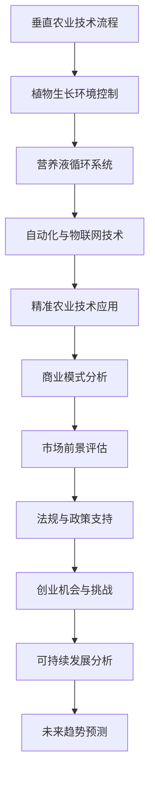
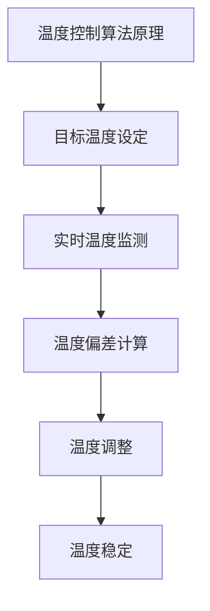

                 

### 文章标题

**垂直农业：城市农业的创新创业机会**

> **关键词**：垂直农业、城市农业、技术创新、商业模式、可持续发展、法规政策、创业机会、挑战与趋势。

**摘要**：随着城市化进程的加快和全球人口的增长，传统农业面临资源枯竭和环境压力。本文旨在探讨垂直农业的概念、技术原理、商业模式、法律法规及未来趋势，分析其在城市农业中的应用前景和创业机会。通过详细解读垂直农业的核心技术、案例分析、数学模型及代码实现，本文为创新创业者提供了有益的指导和思考。

---

垂直农业作为一种创新的农业生产模式，正逐渐成为解决城市化进程中农业生产问题的热门选择。其通过在建筑物内或特殊设施中实现高效、可持续的农业生产，为城市居民提供了新鲜、安全的农产品，同时缓解了土地、水资源等环境压力。本文将从多个角度深入探讨垂直农业的发展现状、技术原理、商业模式以及面临的挑战和机遇。

### 第一部分: 垂直农业概述

#### 第1章: 垂直农业的概念与背景

##### 1.1 垂直农业的定义

垂直农业（Vertical Farming）指的是利用建筑物内部或特殊设施内，通过高度集成的种植技术进行农业生产。与传统的露天农业不同，垂直农业采用垂直布局，通过多层次、立体化的种植方式，极大地提高了土地和空间的利用率。同时，垂直农业实现了对植物生长环境的精准控制，包括温度、湿度、光照和营养供给等，从而实现全年无休的高效生产。

##### 1.2 垂直农业的历史与发展

垂直农业的概念最早在20世纪中期由美国科学家尼尔斯·尼尔斯·诺德斯特龙提出。当时，由于城市化进程的加快，传统农业面临土地资源有限的问题。诺德斯特龙设想了一种利用建筑物内部空间进行农业生产的模式，即垂直农业。此后，随着技术的不断进步，垂直农业逐渐得到发展和应用。

在21世纪初，随着全球对食物安全和环境问题的关注度不断提高，垂直农业开始在全球范围内兴起。特别是在一些发达国家，如日本、美国、荷兰等，垂直农业得到了政府和企业的大力支持，成为现代农业发展的重要方向。

##### 1.3 垂直农业与传统农业的比较

垂直农业与传统农业相比，具有明显的优势：

- **生产效率**：垂直农业通过垂直布局和自动化管理，实现了对土地和空间的充分利用，大幅提高了生产效率。
- **环境影响**：垂直农业减少了对土地、水资源的依赖，降低了碳排放，对环境的负面影响较小。
- **食品安全**：垂直农业实现了对植物生长环境的全程监控和控制，降低了农药和化肥的使用，提高了农产品的安全性。

##### 1.4 垂直农业的技术基础

垂直农业的实现离不开一系列关键技术的支持，主要包括：

- **LED照明**：利用LED灯光提供适宜的光照，满足植物生长的需求。
- **营养液循环系统**：通过营养液的循环供给，确保植物获得充足的营养。
- **自动化与物联网技术**：自动化设备用于播种、灌溉、收割等操作，物联网设备实现实时监测和远程控制。
- **精准农业技术**：通过传感器和数据采集，实现对植物生长环境的精准控制。

#### 第2章: 垂直农业的技术原理

##### 2.1 植物生长环境控制

植物生长环境控制是垂直农业的核心技术之一。通过控制温度、湿度、光照等环境因素，可以确保植物在最佳条件下生长。以下是对这些技术的详细说明：

- **温度控制**：使用恒温系统保持适宜的温度范围。在冬季，可以使用加热设备来提高室内温度；在夏季，则可以通过通风和冷却设备来降低温度。
- **湿度控制**：通过湿度传感器和加湿/除湿设备维持适宜湿度。湿度过高会导致植物病害，过低则会影响植物的生长。
- **光照控制**：利用LED灯光提供适宜的光谱和强度。LED灯光可以根据植物的生长阶段和需求进行调节，满足植物对光照的要求。

##### 2.2 营养液循环系统

营养液循环系统是垂直农业中另一个关键的技术。通过营养液的循环供给，可以确保植物获得充足的营养，同时减少对水资源的消耗。以下是对营养液循环系统的详细说明：

- **营养液配方**：根据植物的需求，定制营养液配方。营养液中含有植物所需的氮、磷、钾等元素，以及微量元素。
- **循环系统**：利用水泵和过滤系统循环营养液。水泵负责将营养液从储液罐输送到植物根部，过滤系统则负责去除营养液中的杂质，确保营养液的质量。

##### 2.3 自动化与物联网技术

自动化与物联网技术是垂直农业实现高效生产的重要手段。通过自动化设备，可以实现播种、灌溉、收割等操作的自动化，提高生产效率；通过物联网设备，可以实现对植物生长环境的实时监测和远程控制。以下是对这些技术的详细说明：

- **自动化设备**：自动化设备包括播种机、灌溉系统、收割机等。这些设备可以按照预设的程序进行操作，减少人力投入，提高生产效率。
- **物联网设备**：物联网设备包括传感器、控制器等。传感器用于实时监测植物生长环境的数据，如温度、湿度、光照等；控制器则根据传感器数据，自动调整植物生长环境的参数。

##### 2.4 精准农业技术的应用

精准农业技术是利用现代信息技术和遥感技术，实现对农作物生长环境的精准监测和管理。以下是对精准农业技术的详细说明：

- **数据采集**：通过传感器采集植物生长数据，如土壤湿度、养分含量、植物生长速度等。
- **数据分析**：利用大数据分析和机器学习技术，对采集到的数据进行分析，为农业生产提供科学依据。
- **优化生产过程**：根据数据分析结果，调整植物生长环境参数，优化农业生产过程，提高生产效率。

#### 第3章: 垂直农业的商业模式

##### 3.1 垂直农业的盈利模式

垂直农业的盈利模式多样，主要包括直接销售、供应链合作和服务收费等。

- **直接销售**：直接向消费者销售新鲜农产品。这是垂直农业最直接的盈利模式，通过提供新鲜、安全的农产品，获得消费者的信任和忠诚度。
- **供应链合作**：与超市、餐饮等企业合作，为其提供新鲜农产品。这种模式可以扩大销售渠道，提高产品的市场占有率。
- **服务收费**：提供种植技术支持和咨询服务。对于一些大型企业或政府机构，他们可能需要专业的种植技术支持，因此可以提供相关的服务并收费。

##### 3.2 垂直农业的市场潜力

垂直农业具有巨大的市场潜力，特别是在城市市场和国际市场。

- **城市市场**：随着城市化进程的加快，城市居民对新鲜农产品的需求不断增加。垂直农业可以满足这一需求，提供新鲜、安全的农产品。
- **国际市场**：垂直农业可以解决国际农产品运输中的问题，如长时间运输导致的新鲜度下降、食品污染等。因此，垂直农业在国际市场上具有很大的发展潜力。

##### 3.3 垂直农业的社会与经济影响

垂直农业的发展对社会和经济具有深远的影响。

- **社会影响**：垂直农业可以提供就业机会，改善城市居民的生活质量。此外，垂直农业可以减少对土地、水资源的依赖，提高资源利用效率。
- **经济影响**：垂直农业可以降低农业生产成本，提高农民收入。同时，垂直农业可以创造新的商业机会，推动相关产业的发展。

#### 第4章: 垂直农业的法律法规与政策支持

##### 4.1 全球垂直农业法规与政策现状

全球范围内，许多国家已经认识到垂直农业的重要性，并出台了一系列法规和政策来支持和推动垂直农业的发展。

- **政策支持**：许多国家政府提供财政补贴和税收优惠，鼓励企业和个人投资垂直农业。
- **法规要求**：食品安全、环境保护等方面的法规对垂直农业提出了明确的要求。例如，垂直农业中使用的营养液、农药等必须符合相关标准，确保农产品的安全。

##### 4.2 中国垂直农业的法规与政策

中国作为世界上最大的农业国家，也在积极推动垂直农业的发展。

- **政策导向**：中国政府提出要推动农业现代化，鼓励发展垂直农业。
- **法规制定**：中国正逐步完善垂直农业相关的法律法规，为垂直农业的发展提供法律保障。

##### 4.3 垂直农业的合规与风险管理

垂直农业企业在发展过程中需要遵守相关法规，并加强风险管理。

- **合规要求**：确保生产过程符合相关法规要求，如食品安全、环境保护等。
- **风险管理**：应对生产过程中可能出现的问题，如设备故障、市场变化等。

#### 第5章: 垂直农业的创业机会与挑战

##### 5.1 创业机会

垂直农业为创业者提供了广阔的创业机会。

- **技术创新**：研发新型垂直农业设备和技术，如智能温室、自动化灌溉系统等。
- **市场开拓**：探索新市场，如高端市场、海外市场。
- **服务提供**：提供种植技术支持和咨询服务。

##### 5.2 创业挑战

垂直农业创业也面临一系列挑战。

- **技术瓶颈**：垂直农业技术尚未完全成熟，创业者需要不断探索和创新。
- **资金需求**：垂直农业项目初期投入较高，资金回收周期较长。
- **市场竞争**：随着垂直农业的兴起，市场竞争将越来越激烈。

##### 5.3 创业案例分析

通过分析成功和失败的垂直农业创业案例，可以总结出一些经验和教训。

- **成功案例**：成功的企业通常具有清晰的战略、强大的技术实力和良好的市场定位。
- **失败案例**：失败的企业往往在技术、市场或管理方面存在缺陷。

#### 第6章: 垂直农业与可持续发展

##### 6.1 垂直农业对可持续发展的贡献

垂直农业在可持续发展方面具有重要作用。

- **环境保护**：垂直农业减少了对土地、水资源的依赖，降低了碳排放。
- **生物多样性**：垂直农业优化了生物圈，提高了生态环境质量。

##### 6.2 垂直农业与城市绿化

垂直农业可以与城市绿化相结合，提高城市绿化水平。

- **城市绿化**：通过垂直农场增加城市绿化面积。
- **生态平衡**：垂直农业与自然生态系统的协同发展。

##### 6.3 垂直农业与乡村振兴

垂直农业可以为乡村振兴提供新的动力。

- **产业升级**：推动农村地区产业升级。
- **就业机会**：为农村居民提供更多就业机会。

#### 第7章: 垂直农业的未来趋势

##### 7.1 技术发展趋势

垂直农业的技术发展趋势主要包括：

- **智能农业**：融合物联网、大数据、人工智能技术，实现精准农业生产。
- **定制化农业**：根据消费者需求定制农产品。

##### 7.2 市场发展趋势

垂直农业的市场发展趋势主要包括：

- **全球市场**：垂直农业逐渐成为国际农业的重要组成部分。
- **多元化发展**：垂直农业产品多样化，如垂直养殖、垂直水产养殖。

##### 7.3 社会发展趋势

垂直农业的社会发展趋势主要包括：

- **消费者需求**：消费者对健康、安全农产品的需求不断增加。
- **社会认知**：提升社会对垂直农业的认知与接受度。

### 附录

#### 附录A：垂直农业技术参考资料

- **参考文献**：提供相关技术的学术文献和行业报告。
- **标准与规范**：介绍垂直农业相关标准与规范。

#### 附录B：垂直农业项目案例

- **国内案例**：介绍中国垂直农业的典型项目。
- **国际案例**：分析国际垂直农业的成功案例。

#### 附录C：垂直农业创业指南

- **创业步骤**：详细阐述创业的基本步骤。
- **投资建议**：为创业者提供投资建议。

#### 附录D：Mermaid 流程图

以下是垂直农业技术流程的 Mermaid 流程图：



#### 附录E：核心算法原理讲解

以下是以植物生长环境控制为核心算法的原理讲解及伪代码：

**温度控制算法原理**



**算法伪代码**

```plaintext
function controlTemperature(targetTemperature):
    while True:
        currentTemperature = getRealTimeTemperature()
        temperatureDifference = currentTemperature - targetTemperature
        if temperatureDifference < 0:
            increaseTemperature()
        else if temperatureDifference > 0:
            decreaseTemperature()
        else:
            return "Temperature is stable."
        
function increaseTemperature():
    // 操作具体细节，例如调整加热设备的功率

function decreaseTemperature():
    // 操作具体细节，例如关闭或降低加热设备的功率

function getRealTimeTemperature():
    // 获取当前实时温度
```

**湿度控制算法原理**


**算法伪代码**

```plaintext
function controlHumidity(targetHumidity):
    while True:
        currentHumidity = getRealTimeHumidity()
        humidityDifference = currentHumidity - targetHumidity
        if humidityDifference < 0:
            increaseHumidity()
        else if humidityDifference > 0:
            decreaseHumidity()
        else:
            return "Humidity is stable."
        
function increaseHumidity():
    // 操作具体细节，例如增加喷雾器喷雾量

function decreaseHumidity():
    // 操作具体细节，例如减少喷雾器喷雾量

function getRealTimeHumidity():
    // 获取当前实时湿度
```

#### 附录F：数学模型与公式讲解

以下是对垂直农业中的营养液循环系统中的关键数学模型的讲解及公式：

**营养液浓度动态平衡模型**

**目的**：确保营养液中的养分浓度保持恒定。

**数学模型**：

$$
\frac{d[N]}{dt} = \mu - (k_1[N] + k_2[N]^2)
$$

其中，$N$ 是营养液中养分的浓度，$\mu$ 是植物对养分的吸收速率，$k_1$ 和 $k_2$ 是与养分浓度相关的常数。

**水质变化模型**

**目的**：预测水质中污染物浓度随时间的变化。

**数学模型**：

$$
\frac{d[C]}{dt} = -k_3[C] + k_4[O_2][C]
$$

其中，$C$ 是污染物浓度，$O_2$ 是溶解氧浓度，$k_3$ 和 $k_4$ 是与水质相关的常数。

#### 附录G：项目实战与代码解读

以下是一段关于垂直农业中自动化灌溉系统的项目实战，包含开发环境搭建、源代码实现和代码解读：

**开发环境搭建**

- **硬件**：使用Arduino Mega 2560 作为控制器，连接土壤湿度传感器和灌溉设备。
- **软件**：使用Arduino IDE 编写程序，运行在 Arduino Mega 2560 上。

**源代码实现**

```cpp
#include <Wire.h>
#include <Adafruit_Sensor.h>
#include <Adafruit_TMP006.h>

Adafruit_TMP006 tmp006;

void setup() {
  Serial.begin(9600);
  Serial.println("TMP006 test");

  tmp006.begin();
}

void loop() {
  sensors_event_t event;
  tmp006.getEvent(&event);

  Serial.print("Object temperature: ");
  Serial.print(event.object_temp);
  Serial.println(" C");

  if (event.object_temp > 30.0) { // 假设温度高于30°C时启动灌溉
    Serial.println("Temperature is too high, starting irrigation.");
    startIrrigation();
  } else {
    Serial.println("Temperature is acceptable, irrigation not needed.");
  }

  delay(1000);
}

void startIrrigation() {
  // 开启灌溉设备的代码，例如使用GPIO控制水阀
}
```

**代码解读与分析**

- **初始化与连接**：程序首先初始化 Serial 通信，然后启动 TMP006 温度传感器。
- **温度读取**：程序在 loop 函数中连续读取温度传感器数据。
- **灌溉控制**：如果温度高于设定阈值（例如 30°C），程序会启动灌溉设备。

**代码优化与改进**

- **精度提升**：可以通过增加传感器采样频率来提高温度测量的精度。
- **智能化决策**：结合土壤湿度传感器数据，实现更智能的灌溉决策。
- **模块化设计**：将传感器读取、条件判断、灌溉控制等功能模块化，便于维护和扩展。

### 作者信息

**作者：AI天才研究院/AI Genius Institute & 禅与计算机程序设计艺术 /Zen And The Art of Computer Programming**

通过本文的深入探讨，我们希望读者能够对垂直农业有更全面的了解，认识到其在城市农业中的应用价值和创业机会。同时，我们也期待垂直农业能够为推动农业现代化和可持续发展做出更大的贡献。在未来的发展中，垂直农业必将成为农业领域的重要方向，为人类社会的可持续发展提供有力支持。|>

