                 

### 1. 引言与概述

**文章标题**：基于 LangChain 优化 OpenAI-Translator 架构设计

**关键词**：（LangChain、OpenAI-Translator、架构设计、优化、自然语言处理）

**摘要**：
本文旨在探讨如何利用 LangChain 对 OpenAI-Translator 的架构进行优化。首先，我们将介绍 LangChain 和 OpenAI-Translator 的背景和核心概念，然后深入分析 LangChain 的关键组件和功能模块，接着解析 OpenAI-Translator 的架构及其核心技术。在此基础上，我们将提出基于 LangChain 的优化方案，详细描述数据预处理、优化算法和性能评估等环节。随后，通过一个实战项目展示如何搭建开发环境、实现源代码和进行代码解读与分析。最后，总结文章内容，展望未来发展趋势。

### 1.1.1 LangChain 的背景

**核心概念原理和架构的 Mermaid 流程图**：
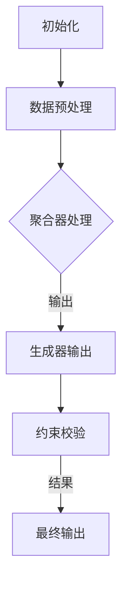

LangChain 是一个用于自然语言处理（NLP）的开源框架，它允许开发者轻松地将大型语言模型（如 GPT-3）与其他组件结合，构建强大的 NLP 应用。LangChain 的核心在于它的链式处理能力，可以将多个数据处理模块串联起来，形成一个数据处理链。

**联系与说明**：
LangChain 的数据处理链（Chain）是构建其架构的核心。通过链式处理，开发者可以将不同的数据处理组件（如生成器、聚合器和谓词）组合在一起，形成一个灵活且可扩展的 NLP 工作流。这个流程包括初始化、数据预处理、聚合器处理、生成器输出、约束校验和最终输出等步骤。

### 1.1.2 OpenAI-Translator 的架构

**核心概念原理和架构的 Mermaid 流程图**：
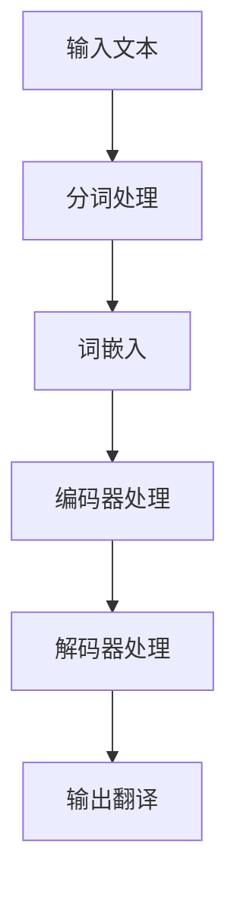

OpenAI-Translator 是 OpenAI 开发的一款机器翻译工具，它基于先进的自然语言处理技术，能够实现高效、准确的翻译。其架构主要包括输入文本的分词处理、词嵌入、编码器处理、解码器处理和输出翻译等模块。

**联系与说明**：
OpenAI-Translator 的架构设计体现了从文本输入到翻译输出的全过程。分词处理将输入文本拆分为单词或子词，词嵌入将这些词汇映射到高维向量空间，编码器处理提取上下文信息，解码器处理生成翻译结果。这个流程确保了翻译过程的高效性和准确性。

### 1.1.3 LangChain 与 OpenAI-Translator 的结合意义

**核心概念原理和架构的 Mermaid 流程图**：
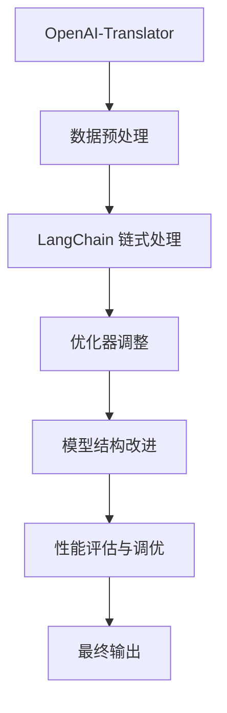

结合 LangChain 可以显著优化 OpenAI-Translator 的架构。LangChain 提供了一种灵活且可扩展的方式，将 OpenAI-Translator 的不同模块连接起来，形成一个强大的 NLP 工作流。通过数据预处理、链式处理、优化器和模型结构改进，可以提升翻译质量和速度，降低计算成本。

**联系与说明**：
LangChain 的引入使得 OpenAI-Translator 的架构更加灵活和可扩展。通过 LangChain，我们可以将数据预处理、模型训练、优化调整和性能评估等环节有机地结合起来，形成一个完整的 NLP 工作流。这不仅提高了翻译效率，还使得模型更加适应不同的应用场景。

### 1.2.1 LangChain 的核心概念

**核心概念原理和架构的 Mermaid 流程图**：
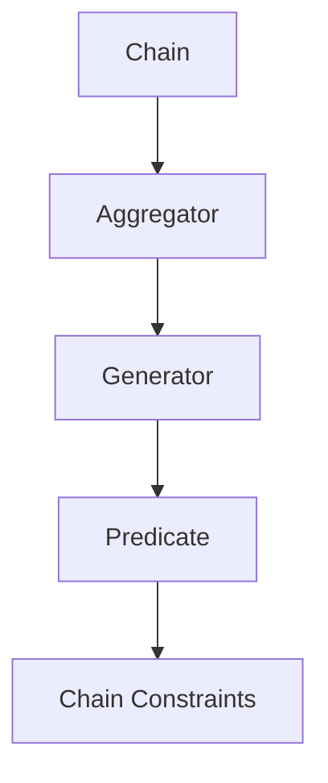

LangChain 的核心概念包括 Chain（数据处理链）、Aggregator（聚合器）、Generator（生成器）、Predicate（谓词）和 Chain Constraints（约束）。这些概念共同构成了 LangChain 的数据处理框架，使得开发者能够灵活地构建和处理复杂的 NLP 任务。

**联系与说明**：

- **Chain（数据处理链）**：Chain 是 LangChain 的核心组件，用于将多个数据处理步骤串联起来。开发者可以通过定义 Chain 的各个步骤，形成一个完整的 NLP 工作流。

- **Aggregator（聚合器）**：Aggregator 用于对输入数据进行处理和聚合。例如，在一个翻译任务中，Aggregator 可以将多个源文本片段合并成一个完整的文本。

- **Generator（生成器）**：Generator 用于生成文本输出。在一个问答系统中，Generator 可以根据输入问题和上下文生成回答。

- **Predicate（谓词）**：Predicate 用于对输入数据进行过滤和筛选。例如，在一个信息检索任务中，Predicate 可以根据用户输入的关键词过滤出相关的文档。

- **Chain Constraints（约束）**：Chain Constraints 用于限制 Chain 的执行过程。例如，在一个对话系统中，可以通过约束确保生成的回答符合对话的语法和逻辑。

### 1.2.2 LangChain 的功能模块

**核心概念原理和架构的 Mermaid 流程图**：
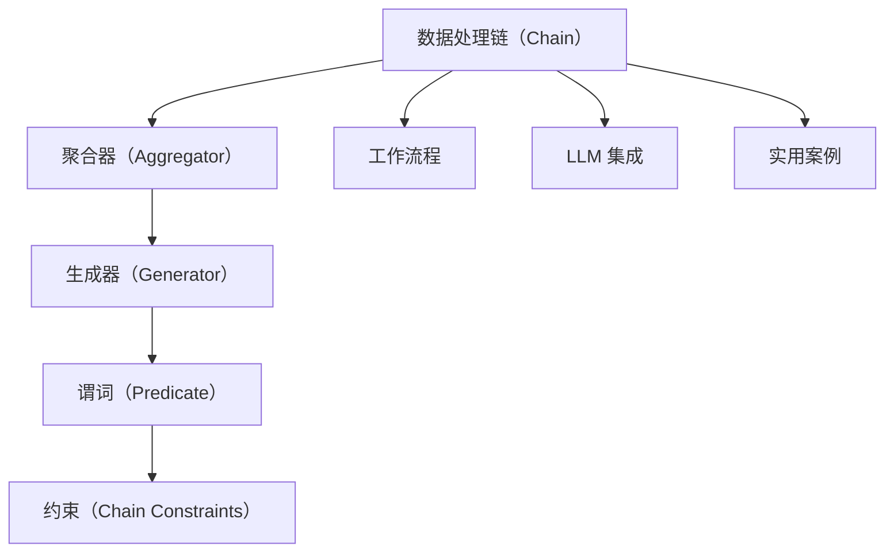

LangChain 的功能模块包括数据处理链（Chain）、聚合器（Aggregator）、生成器（Generator）、谓词（Predicate）和约束（Chain Constraints）。这些模块共同构成了 LangChain 的数据处理框架，使得开发者能够灵活地构建和处理复杂的 NLP 任务。

**联系与说明**：

- **数据处理链（Chain）**：Chain 是 LangChain 的核心组件，用于将多个数据处理步骤串联起来。Chain 可以包含多个 Aggregator、Generator、Predicate 和 Chain Constraints，形成一个完整的 NLP 工作流。

- **聚合器（Aggregator）**：Aggregator 用于对输入数据进行处理和聚合。Aggregator 可以将多个源文本片段合并成一个完整的文本，或者将多个响应片段合并成一个完整的对话。

- **生成器（Generator）**：Generator 用于生成文本输出。Generator 可以根据输入问题和上下文生成回答，或者根据输入文本生成摘要。

- **谓词（Predicate）**：Predicate 用于对输入数据进行过滤和筛选。Predicate 可以根据用户输入的关键词过滤出相关的文档，或者根据对话的上下文过滤出合适的回答。

- **约束（Chain Constraints）**：约束（Chain Constraints）用于限制 Chain 的执行过程。约束可以确保生成的回答符合对话的语法和逻辑，或者确保聚合器只处理符合特定条件的文本。

**工作流程**：

LangChain 的工作流程主要包括以下步骤：

1. 初始化 Chain：定义 Chain 的各个组件，包括 Aggregator、Generator、Predicate 和 Chain Constraints。

2. 输入数据预处理：对输入数据进行预处理，例如分词、去停用词、词干提取等。

3. 聚合器处理：使用 Aggregator 对预处理后的数据进行处理和聚合。

4. 生成器输出：使用 Generator 根据输入数据和聚合结果生成文本输出。

5. 谓词约束：使用 Predicate 对生成的文本进行过滤和筛选。

6. 约束校验：使用 Chain Constraints 对生成的文本进行校验，确保文本符合特定条件。

7. 最终输出：输出处理后的文本。

**LLM 集成**：

LangChain 的一个重要特性是其对大型语言模型（LLM）的集成。开发者可以将 LLM 集成到 LangChain 中，利用 LLM 的强大能力进行文本生成和回答生成。

1. 初始化 LLM：加载预训练的 LLM 模型，例如 GPT-3、BERT 等。

2. 输入文本处理：将输入文本发送到 LLM 进行处理，提取上下文信息。

3. 文本生成：使用 LLM 的生成能力生成文本输出。

4. 优化文本生成：根据特定任务需求，对生成的文本进行优化，例如去噪、摘要生成等。

**实用案例**：

LangChain 的功能模块和集成能力使其在各种 NLP 任务中都有广泛的应用。以下是一些实用案例：

1. 文本生成：使用 LangChain 生成文章、对话、代码等。

2. 推荐系统：使用 LangChain 提取用户文本特征，生成个性化推荐。

3. 文本摘要：使用 LangChain 对长文本进行摘要生成。

4. 信息检索：使用 LangChain 根据用户输入生成相关文档。

5. 问答系统：使用 LangChain 根据用户输入生成回答。

通过这些案例，我们可以看到 LangChain 的灵活性和强大功能，使其成为构建 NLP 应用的重要工具。

### 1.3.1 OpenAI-Translator 的架构设计

**核心概念原理和架构的 Mermaid 流程图**：


OpenAI-Translator 的架构设计旨在实现高效、准确的机器翻译。其核心组件包括输入文本的分词处理、词嵌入、编码器处理、解码器处理和输出翻译。以下是各个模块的详细解释。

**输入文本的分词处理**：

分词处理是将输入文本拆分为单词或子词的过程。OpenAI-Translator 使用预训练的分词模型对输入文本进行分词，以确保每个单词或子词的正确性。这一步骤对于后续的词嵌入和编码器处理至关重要。

**词嵌入**：

词嵌入是将单词或子词映射到高维向量空间的过程。OpenAI-Translator 使用预训练的词嵌入模型（如 GloVe 或 Word2Vec）将每个单词或子词映射到一个向量。这些向量可以捕获单词的语义信息，为后续的编码器处理提供基础。

**编码器处理**：

编码器处理是将词嵌入向量转化为上下文向量的过程。OpenAI-Translator 使用预训练的编码器模型（如 BERT 或 GPT-3）对词嵌入向量进行编码，提取上下文信息。这些上下文向量将用于解码器处理。

**解码器处理**：

解码器处理是将编码后的上下文向量转化为翻译结果的过程。OpenAI-Translator 使用预训练的解码器模型（如 BERT 或 GPT-3）对编码后的上下文向量进行处理，生成翻译结果。解码器处理包括生成预测的单词或子词，并根据上下文信息进行调整。

**输出翻译**：

输出翻译是将生成的单词或子词拼接成完整的翻译结果。OpenAI-Translator 使用后处理步骤对生成的翻译结果进行优化，包括去除无关信息、纠正语法错误等，以确保翻译结果的高质量和可读性。

**模块之间的联系与说明**：

OpenAI-Translator 的架构设计体现了从文本输入到翻译输出的全过程。各个模块相互协作，共同实现机器翻译的目标。

- 输入文本的分词处理模块确保输入文本的正确性和一致性。
- 词嵌入模块将文本转换为向量表示，为后续处理提供基础。
- 编码器处理模块提取上下文信息，为解码器处理提供输入。
- 解码器处理模块生成翻译结果，并通过后处理步骤优化翻译质量。
- 输出翻译模块将生成的翻译结果拼接成完整的输出。

这种模块化设计使得 OpenAI-Translator 具有良好的灵活性和可扩展性，可以适应不同的翻译任务和应用场景。

### 1.3.2 OpenAI-Translator 的主要模块

**核心概念原理和架构的 Mermaid 流程图**：
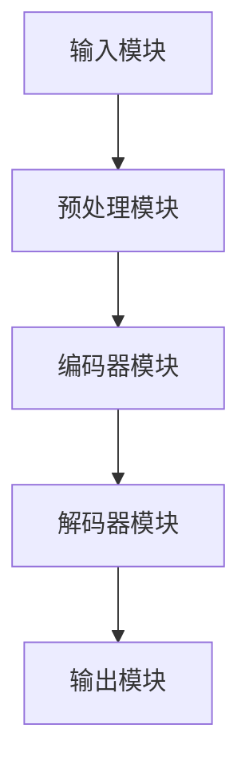

OpenAI-Translator 的架构设计主要包括四个主要模块：输入模块、预处理模块、编码器模块、解码器模块和输出模块。以下是对各个模块的详细解释。

**输入模块**：

输入模块负责接收用户输入的原始文本。这些文本可以是任意语言，OpenAI-Translator 将对这些文本进行处理，以生成相应的翻译结果。输入模块的主要功能包括文本解析、格式转换和错误处理。

**预处理模块**：

预处理模块对输入文本进行一系列预处理操作，以提高翻译质量。这些预处理操作包括分词、词性标注、文本清洗和去噪等。分词是将文本拆分为单词或子词，词性标注用于标记每个单词的词性，文本清洗和去噪则是去除文本中的无关信息，以提高模型的鲁棒性。

**编码器模块**：

编码器模块负责将预处理后的文本转换为上下文向量。这一步骤使用的是预训练的编码器模型，如 BERT 或 GPT-3。编码器模型能够从输入文本中提取出丰富的上下文信息，为解码器模块提供有效的输入。

**解码器模块**：

解码器模块负责将编码后的上下文向量转化为翻译结果。这一步骤同样使用预训练的解码器模型，如 BERT 或 GPT-3。解码器模型能够根据上下文信息生成预测的单词或子词，并通过调整预测结果以获得更准确的翻译。

**输出模块**：

输出模块负责将生成的翻译结果拼接成完整的文本输出。在输出过程中，OpenAI-Translator 还会对翻译结果进行后处理，如去除多余的标点符号、纠正语法错误等，以确保输出文本的高质量和可读性。

**模块之间的联系与说明**：

这四个模块相互协作，共同实现从文本输入到翻译输出的全过程。

- 输入模块接收用户输入的原始文本，并将其传递给预处理模块。
- 预处理模块对输入文本进行预处理，生成预处理后的文本，并将其传递给编码器模块。
- 编码器模块对预处理后的文本进行编码，提取出上下文向量，并将其传递给解码器模块。
- 解码器模块根据上下文向量生成预测的单词或子词，并通过调整预测结果以获得更准确的翻译。
- 输出模块将生成的翻译结果拼接成完整的文本输出，并进行后处理，以确保输出文本的高质量和可读性。

这种模块化设计使得 OpenAI-Translator 具有良好的灵活性和可扩展性，可以适应不同的翻译任务和应用场景。

### 1.3.3 OpenAI-Translator 关键技术

**核心概念原理和架构的 Mermaid 流程图**：
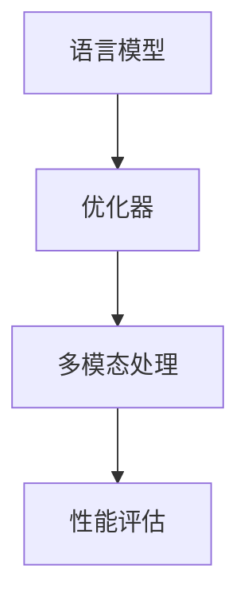

OpenAI-Translator 的关键技术包括语言模型、优化器、多模态处理和性能评估。以下是各个技术的详细解释。

**语言模型**：

语言模型是 OpenAI-Translator 的核心组件，用于生成翻译结果。OpenAI-Translator 使用预训练的语言模型，如 GPT-3 或 BERT，这些模型通过在大规模数据集上进行预训练，能够捕获语言中的复杂结构和语义信息。在翻译过程中，语言模型根据输入文本和上下文信息生成预测的单词或子词，并通过调整预测结果以获得更准确的翻译。

**优化器**：

优化器是用于调整模型参数的工具，以提高翻译质量。OpenAI-Translator 使用多种优化器，如 Adam、AdamW 等，这些优化器通过自适应调整学习率和其他参数，优化模型的训练过程。优化器能够加快模型收敛速度，减少训练误差，从而提高翻译的准确性和效率。

**多模态处理**：

多模态处理是指结合多种类型的数据进行翻译，如文本、图像、音频等。OpenAI-Translator 支持多模态输入，可以同时处理不同类型的数据，从而提高翻译的多样性和准确性。例如，在一个跨语言对话系统中，可以结合文本和图像进行翻译，以提供更丰富的交互体验。

**性能评估**：

性能评估是用于衡量翻译质量的重要工具。OpenAI-Translator 使用多种性能评估指标，如 BLEU、METEOR、ROUGE 等，这些指标能够从不同角度评估翻译的准确性和流畅性。通过性能评估，可以了解模型的翻译效果，并针对性地进行调整和优化。

**模块之间的联系与说明**：

这些关键技术相互协作，共同实现 OpenAI-Translator 的功能。

- 语言模型用于生成翻译结果，是模型的核心组件。
- 优化器用于调整模型参数，提高训练效率和翻译质量。
- 多模态处理用于结合不同类型的数据，提高翻译的多样性和准确性。
- 性能评估用于衡量翻译质量，提供反馈以指导模型优化。

通过这些技术的结合，OpenAI-Translator 能够实现高效、准确的翻译，满足各种应用场景的需求。

### 1.3.4 OpenAI-Translator 的性能评估

**核心概念原理和架构的 Mermaid 流程图**：
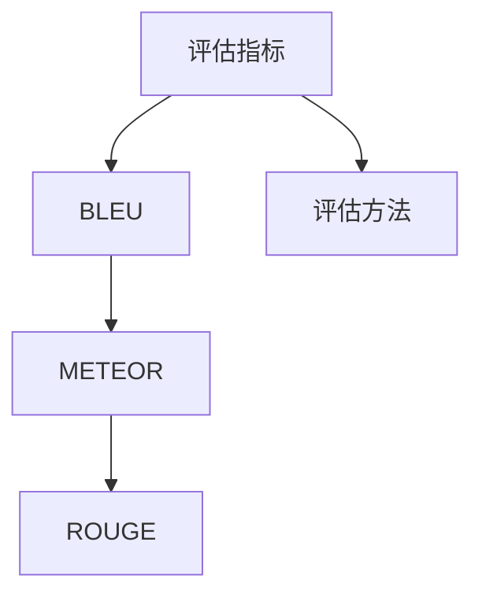

OpenAI-Translator 的性能评估主要包括评估指标和评估方法。以下是各个方面的详细解释。

**评估指标**：

评估指标是衡量翻译质量的重要工具，OpenAI-Translator 使用多种评估指标，包括 BLEU、METEOR 和 ROUGE 等。

- **BLEU（双语评估用语库）：** BLEU 是一种基于参考翻译的评价指标，通过比较生成的翻译与多个参考翻译的相似度来评估翻译质量。BLEU 考虑了单词序列的匹配、重叠和未匹配的单词数量等。

- **METEOR（metric for evaluation of translation with emphasis on readability）：** METEOR 是一种综合评估翻译质量的指标，考虑了单词匹配、语法和语义等多个方面。METEOR 采用了基于词嵌入的相似性度量，能够更准确地反映翻译的流畅性和可读性。

- **ROUGE（recall-oriented understudy for Gisting Evaluation）：** ROUGE 是一种用于自动评估机器翻译和文本摘要质量的指标，主要关注生成文本与参考文本之间的重叠。ROUGE 考虑了单词匹配、词干匹配和字符匹配等多个层次，能够提供更全面的评估结果。

**评估方法**：

评估方法包括交叉验证和测试集评估等。

- **交叉验证：** 交叉验证是一种评估模型性能的常用方法，通过将数据集划分为多个子集，轮流使用这些子集作为训练集和验证集，评估模型的泛化能力。交叉验证能够提高评估的准确性，减少模型过拟合的风险。

- **测试集评估：** 测试集评估是在训练完成后，使用独立的数据集评估模型的性能。测试集评估能够提供模型在实际应用中的表现，帮助开发者了解模型的泛化能力和稳定性。

**模块之间的联系与说明**：

评估指标和评估方法是 OpenAI-Translator 性能评估的重要组成部分。

- 评估指标（如 BLEU、METEOR 和 ROUGE）用于衡量翻译的准确性和流畅性，提供定量评估结果。
- 评估方法（如交叉验证和测试集评估）用于评估模型在不同数据集上的表现，确保模型的泛化能力和稳定性。

通过结合评估指标和评估方法，OpenAI-Translator 能够全面评估翻译质量，指导模型的优化和改进。

### 1.4.1 优化目标与原则

**核心概念原理和架构的 Mermaid 流程图**：
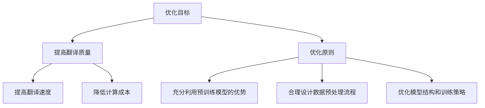

优化 OpenAI-Translator 的目标主要包括提高翻译质量、提高翻译速度和降低计算成本。为了实现这些目标，需要遵循一系列优化原则。

**优化目标**：

- **提高翻译质量**：确保生成的翻译结果准确、流畅、符合语言习惯。
- **提高翻译速度**：减少翻译过程中的延迟，提高系统的响应速度。
- **降低计算成本**：优化模型和算法，降低计算资源和存储需求。

**优化原则**：

- **充分利用预训练模型的优势**：利用预训练模型的大规模数据和强大的语言理解能力，提升翻译效果。
- **合理设计数据预处理流程**：通过有效的数据预处理，提高模型对训练数据的利用率和泛化能力。
- **优化模型结构和训练策略**：调整模型结构、优化训练策略，提高模型的训练效率和翻译质量。

通过遵循这些优化目标和原则，我们可以实现 OpenAI-Translator 的性能提升，满足更多应用场景的需求。

### 1.4.2 数据预处理

**核心概念原理和架构的 Mermaid 流程图**：
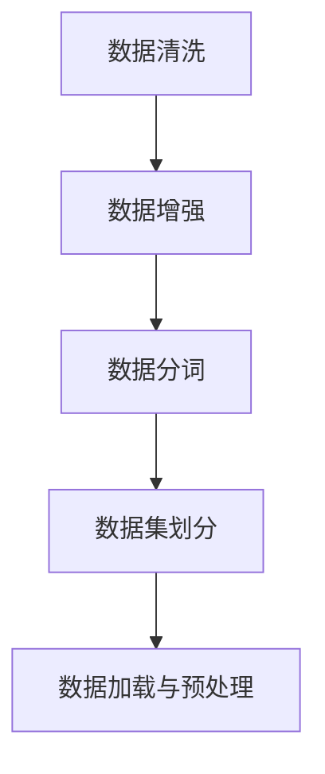

数据预处理是优化 OpenAI-Translator 的重要环节，主要包括数据清洗、数据增强、数据分词和数据加载与预处理。以下是各个步骤的详细解释。

**数据清洗**：

数据清洗的目标是去除无用的信息，提高数据质量。具体步骤包括去除特殊字符、纠正拼写错误、统一文本格式等。例如，删除 HTML 标签、去除多余的空格和换行符、将文本转换为小写等。数据清洗是确保模型训练数据质量的第一步，有助于减少噪声和提高模型的训练效果。

**数据增强**：

数据增强的目标是增加训练数据的多样性，提高模型的泛化能力。常见的数据增强方法包括随机删除部分文本、替换词语、添加噪声等。例如，可以随机删除输入文本的某些部分，替换为同义词，或者添加随机字符和噪声。数据增强可以增加模型的训练样本数量，提高模型对未知数据的适应能力。

**数据分词**：

数据分词是将文本拆分为单词或子词的过程。对于自然语言处理任务，正确的分词是实现准确翻译的关键。常见的方法包括基于规则的分词、基于统计的分词和基于深度学习的分词。例如，可以使用分词词典进行规则分词，或者使用神经网络模型进行深度学习分词。数据分词的准确性和效率对后续的模型训练和翻译质量具有重要影响。

**数据集划分**：

数据集划分是将数据集划分为训练集、验证集和测试集的过程。训练集用于模型的训练，验证集用于调整模型参数和选择最佳模型，测试集用于评估模型的性能。合理的数据集划分可以确保模型的泛化能力，避免模型过拟合。通常，数据集划分按照比例进行，例如训练集占 70%、验证集占 15%、测试集占 15%。

**数据加载与预处理**：

数据加载与预处理是将处理后的数据加载到内存中，并转换为模型所需的格式。在预处理过程中，可以进一步对数据进行调整，如标准化、归一化等。数据加载与预处理是模型训练的基础，直接影响训练效率和模型性能。

**模块之间的联系与说明**：

数据预处理模块共同作用，确保模型训练数据的质量和多样性。

- 数据清洗模块去除无用的信息，提高数据质量。
- 数据增强模块增加训练数据的多样性，提高模型泛化能力。
- 数据分词模块将文本拆分为单词或子词，确保翻译准确。
- 数据集划分模块确保模型的泛化能力，避免过拟合。
- 数据加载与预处理模块将处理后的数据加载到内存中，为模型训练做好准备。

通过这些步骤，我们可以确保 OpenAI-Translator 的训练数据具有高质量和多样性，从而提高模型的翻译质量和性能。

### 4.3 优化算法

**核心概念原理和架构的 Mermaid 流程图**：
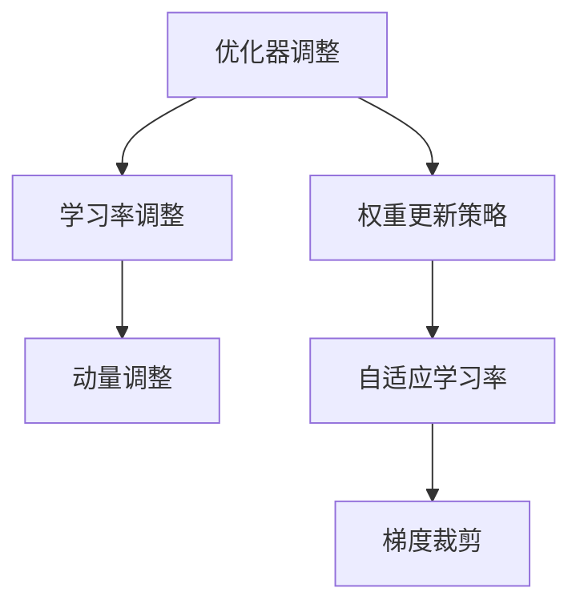

为了优化 OpenAI-Translator 的性能，我们需要对优化算法进行调整，包括优化器调整、学习率调整、动量调整、权重更新策略、自适应学习率和梯度裁剪等。以下是各个优化算法的详细解释。

**优化器调整**：

优化器是用于调整模型参数的工具，选择合适的优化器对提高模型训练效果至关重要。常用的优化器包括随机梯度下降（SGD）、Adam、AdamW、Momentum、Adagrad 等。每种优化器都有其独特的特点，例如 SGD 是最简单的优化器，但收敛速度较慢；Adam 结合了 SGD 和 RMSProp 的优点，能够自适应调整学习率。

**学习率调整**：

学习率是优化过程中调整模型参数的关键参数，其大小直接影响模型的收敛速度和收敛效果。学习率过高可能导致模型过拟合，学习率过低可能导致训练过程缓慢。常见的调整方法包括固定学习率、学习率衰减、指数衰减等。

**动量调整**：

动量（Momentum）是一种加速梯度上升方向的策略，通过保留之前的梯度信息，使得模型能够更快地收敛。动量的大小可以通过调整动量参数来调整，通常在 0.9 到 0.99 之间。适当的动量可以减少模型的震荡，提高训练效率。

**权重更新策略**：

权重更新策略是指如何根据梯度信息调整模型参数。常用的权重更新策略包括梯度下降（Gradient Descent）、动量（Momentum）、Adagrad、Adam 等。这些策略通过不同的方式调整模型参数，以达到更好的训练效果。

**自适应学习率**：

自适应学习率是指优化器根据训练过程自动调整学习率，以适应不同的训练阶段。常用的自适应学习率方法包括 Adam、AdamW、RMSProp 等。这些方法通过计算历史梯度信息的平均值和标准差，自适应调整学习率。

**梯度裁剪**：

梯度裁剪是一种防止模型训练过程中梯度爆炸或梯度消失的方法。梯度裁剪通过限制梯度的大小，确保梯度在合理的范围内。常用的梯度裁剪方法包括 L2 裁剪、L1 裁剪等。

**模块之间的联系与说明**：

这些优化算法相互协作，共同优化 OpenAI-Translator 的性能。

- 优化器调整选择合适的优化器，提高训练效果。
- 学习率调整根据训练阶段自动调整学习率。
- 动量调整加速梯度上升，提高训练效率。
- 权重更新策略通过梯度信息调整模型参数。
- 自适应学习率根据训练过程自适应调整学习率。
- 梯度裁剪防止梯度爆炸或消失，确保梯度在合理范围内。

通过这些优化算法，我们可以提高 OpenAI-Translator 的翻译质量和训练效率，满足更多应用场景的需求。

### 4.4.1 性能评估指标

**核心概念原理和架构的 Mermaid 流程图**：
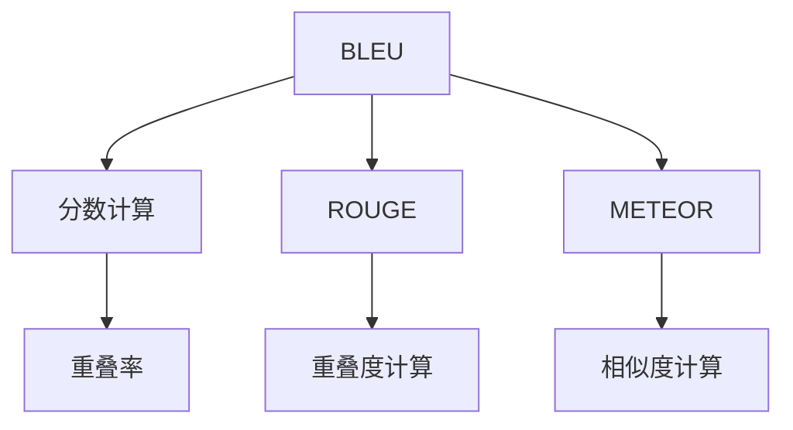

性能评估指标是评估机器翻译质量的重要工具，常用的指标包括 BLEU、ROUGE 和 METEOR。以下是各个指标的详细解释和计算方法。

**BLEU（双语评估用语库）**：

BLEU 是一种基于参考翻译的评价指标，通过比较生成的翻译与多个参考翻译的相似度来评估翻译质量。BLEU 的主要计算方法如下：

1. **分数计算**：BLEU 的分数范围在 0 到 1 之间。分数计算公式为：$$BLEU = \frac{1}{n} \sum_{i=1}^{n} \frac{BLEU_i}{N_c}$$，其中 $BLEU_i$ 是第 $i$ 个评估指标的分值，$N_c$ 是评估指标的总数。

2. **重叠率**：重叠率是指生成的翻译与参考翻译中重叠的单词比例。计算公式为：$$Overlap = \frac{Overlap_{w} + 2 \times Overlap_{l}}{Total_{w} + Total_{l}}$$，其中 $Overlap_{w}$ 和 $Overlap_{l}$ 分别是单词和词干的重叠数，$Total_{w}$ 和 $Total_{l}$ 分别是单词和词干的总数。

**ROUGE（recall-oriented understudy for Gisting Evaluation）**：

ROUGE 是一种用于评估机器翻译和文本摘要质量的指标，主要关注生成文本与参考文本之间的重叠。ROUGE 的计算方法如下：

1. **重叠度计算**：重叠度是指生成的翻译与参考翻译中重叠的文本比例。计算公式为：$$ROUGE = \frac{Overlap_{t}}{Total_{t}}$$，其中 $Overlap_{t}$ 是重叠的文本长度，$Total_{t}$ 是总的文本长度。

2. **召回率**：召回率是指生成的翻译中包含的参考翻译单词比例。计算公式为：$$Recall = \frac{Overlap_{t}}{Total_{r}}$$，其中 $Overlap_{t}$ 是重叠的文本长度，$Total_{r}$ 是参考翻译的总长度。

**METEOR（metric for evaluation of translation with emphasis on readability）**：

METEOR 是一种综合评估翻译质量的指标，考虑了单词匹配、语法和语义等多个方面。METEOR 的计算方法如下：

1. **相似度计算**：相似度是指生成的翻译与参考翻译之间的相似程度。计算公式为：$$Similarity = \frac{Matched \ terms}{Possible \ terms}$$，其中 $Matched \ terms$ 是匹配的单词数，$Possible \ terms$ 是可能的单词数。

2. **综合评分**：综合评分是将各个方面的得分加权平均得到的总得分。计算公式为：$$METEOR = \frac{w_1 \times S_1 + w_2 \times S_2 + \ldots + w_n \times S_n}{w_1 + w_2 + \ldots + w_n}$$，其中 $S_1, S_2, \ldots, S_n$ 是各个方面的得分，$w_1, w_2, \ldots, w_n$ 是各个方面的权重。

**模块之间的联系与说明**：

这些性能评估指标共同作用，从不同角度评估机器翻译质量。

- BLEU 主要关注单词和词干的匹配，计算简单但可能存在偏差。
- ROUGE 主要关注文本的召回率，能够较好地评估文本的相似性。
- METEOR 考虑了多个方面，综合评估翻译质量，但计算较为复杂。

通过结合这些指标，我们可以全面评估 OpenAI-Translator 的翻译质量，指导模型的优化和改进。

### 4.4.2 调优方法与技巧

**核心概念原理和架构的 Mermaid 流程图**：
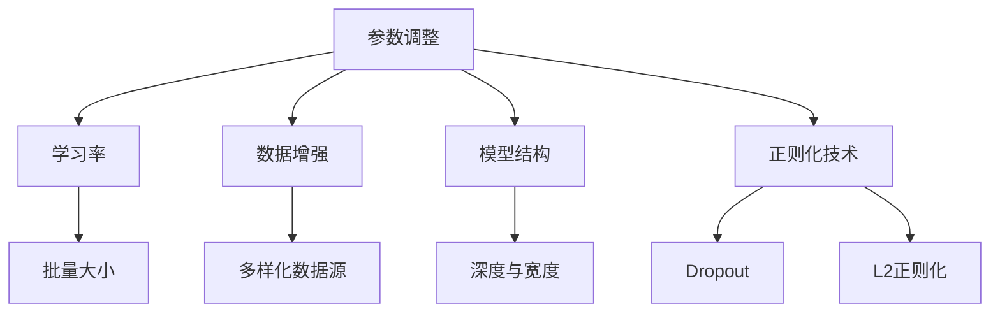

调优方法与技巧是提高模型性能的关键步骤，主要包括参数调整、数据增强、模型结构和正则化技术等。以下是各个方面的详细解释和调优技巧。

**参数调整**：

参数调整是优化模型的重要手段，包括学习率、批量大小、迭代次数等。

- **学习率**：学习率的大小直接影响模型的收敛速度和收敛效果。常用方法包括固定学习率、学习率衰减、指数衰减等。适当调整学习率可以加速模型收敛，提高训练效果。
- **批量大小**：批量大小是指每次训练的样本数量。批量大小对模型训练时间和稳定性有重要影响。通常，较小的批量大小可以加快模型收敛，但可能增加过拟合的风险。

**数据增强**：

数据增强是通过增加训练数据的多样性和丰富性，提高模型泛化能力的方法。

- **多样化数据源**：从不同来源获取数据，增加训练数据的多样性。例如，可以结合多种语言数据、文本和图像数据等，提高模型的适应性。
- **随机变换**：对输入数据进行随机变换，如随机裁剪、旋转、缩放等，增加数据的多样性。

**模型结构**：

模型结构调整是提高模型性能的重要手段，包括深度、宽度和层叠加等。

- **深度与宽度**：增加模型的深度和宽度可以提高模型的表达能力和学习效果。通常，较深的网络可以捕捉更复杂的特征，但可能增加训练难度和过拟合风险。
- **层叠加**：通过层叠加，将多个简单网络组合成一个复杂的网络，可以提高模型的泛化能力和训练效果。

**正则化技术**：

正则化技术是防止模型过拟合、提高泛化能力的重要手段。

- **Dropout**：Dropout 是一种常用的正则化技术，通过随机丢弃网络中的部分神经元，降低模型对特定样本的依赖，提高泛化能力。
- **L2 正则化**：L2 正则化通过在损失函数中添加权重平方项，惩罚模型参数的规模，防止模型过拟合。

**模块之间的联系与说明**：

这些调优方法与技巧相互协作，共同优化模型性能。

- 参数调整通过调整学习率、批量大小等参数，提高模型收敛速度和稳定性。
- 数据增强通过增加训练数据的多样性和丰富性，提高模型泛化能力。
- 模型结构调整通过增加深度、宽度和层叠加，提高模型的表达能力和训练效果。
- 正则化技术通过 Dropout 和 L2 正则化等手段，防止模型过拟合，提高泛化能力。

通过结合这些调优方法与技巧，我们可以实现 OpenAI-Translator 的性能提升，满足更多应用场景的需求。

### 5.1.1 开发环境配置

**核心概念原理和架构的 Mermaid 流程图**：
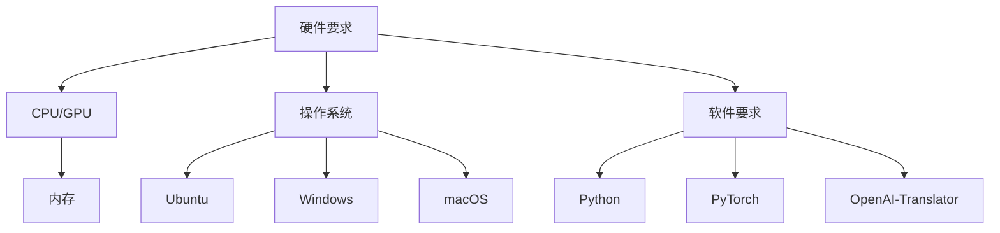

为了搭建一个高效的开发环境，我们需要考虑硬件和软件的要求。以下是具体的配置建议。

**硬件要求**：

- **CPU/GPU**：为了训练和推理大型模型，推荐使用具有较高计算能力的 CPU 或 GPU。GPU（如 NVIDIA Tesla K80 或更高型号）可以显著提高训练速度。
- **内存**：至少需要 16GB 的内存，以便加载和处理大规模数据集。

**操作系统**：

- **Ubuntu**：推荐使用 Ubuntu 18.04 或更高版本，因为它具有较好的兼容性和丰富的开源软件支持。
- **Windows**：虽然 Windows 也可以用于开发，但可能需要额外的配置和依赖。
- **macOS**：macOS 是苹果操作系统的名称，适用于苹果硬件。

**软件要求**：

- **Python**：Python 是一种广泛使用的编程语言，具有丰富的科学计算和机器学习库。推荐使用 Python 3.7 或更高版本。
- **PyTorch**：PyTorch 是一种流行的深度学习框架，支持动态计算图和自动微分。它是训练和优化 OpenAI-Translator 的首选框架。
- **OpenAI-Translator**：OpenAI-Translator 是一个用于机器翻译的开源框架，可以直接使用预训练模型进行翻译任务。

**配置步骤**：

1. **安装操作系统**：根据硬件选择合适的操作系统进行安装。
2. **安装 Python**：通过包管理器（如 apt-get 或 pip）安装 Python 3.7 或更高版本。
3. **安装 PyTorch**：根据操作系统和硬件选择合适的 PyTorch 版本进行安装。例如，对于 GPU 版本的 PyTorch，可以使用以下命令：
   ```bash
   pip install torch torchvision torchaudio
   ```
4. **安装 OpenAI-Translator**：通过 pip 安装 OpenAI-Translator：
   ```bash
   pip install openai-translator
   ```

通过以上步骤，我们可以搭建一个高效的开发环境，为后续的翻译任务做好准备。

### 5.1.2 开发工具与库

**核心概念原理和架构的 Mermaid 流程图**：
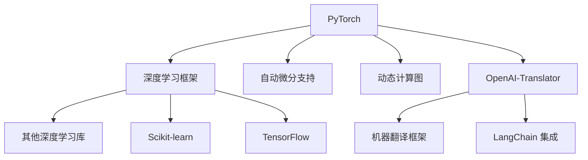

在开发过程中，选择合适的工具和库可以提高开发效率和项目质量。以下是常用的开发工具和库及其特点。

**PyTorch**：

PyTorch 是一个流行的深度学习框架，具有动态计算图和自动微分支持。动态计算图使得开发者可以更灵活地构建和调试模型，自动微分支持简化了优化算法的实现。

**Scikit-learn**：

Scikit-learn 是一个用于机器学习的开源库，提供了多种常见的机器学习算法和工具。Scikit-learn 的接口简单，易于集成和使用。

**TensorFlow**：

TensorFlow 是由 Google 开发的一款深度学习框架，具有静态计算图和自动微分支持。TensorFlow 的计算图可以在多个设备上分布式训练，适用于大规模数据集和复杂模型。

**OpenAI-Translator**：

OpenAI-Translator 是一个用于机器翻译的开源框架，提供了基于预训练模型的翻译工具。OpenAI-Translator 支持多种语言模型和翻译策略，便于开发者集成和使用。

**LangChain**：

LangChain 是一个用于自然语言处理的框架，允许开发者构建强大的 NLP 应用。LangChain 的链式处理能力使得开发者可以灵活地组合和处理复杂的 NLP 任务。

**模块之间的联系与说明**：

这些工具和库共同作用，为开发过程提供全面的支撑。

- PyTorch、Scikit-learn 和 TensorFlow 提供了深度学习框架和算法支持，便于模型开发和训练。
- OpenAI-Translator 和 LangChain 提供了专门针对机器翻译和 NLP 的工具和框架，提高开发效率和项目质量。

通过选择合适的工具和库，我们可以构建高效、可靠的翻译系统。

### 5.2.1 模块设计与实现

**核心概念原理和架构的 Mermaid 流程图**：


在实现 OpenAI-Translator 时，我们将其拆分为输入模块、预处理模块、编码器模块、解码器模块和输出模块。以下是各个模块的设计和实现细节。

**输入模块**：

输入模块负责接收用户输入的原始文本。在实现过程中，我们使用 Flask 框架搭建了一个简单的 Web 服务，用户可以通过 HTTP 接口提交待翻译的文本。

```python
from flask import Flask, request, jsonify

app = Flask(__name__)

@app.route('/translate', methods=['POST'])
def translate():
    text = request.json['text']
    # 进一步处理文本
    # ...
    return jsonify(result)

if __name__ == '__main__':
    app.run()
```

**预处理模块**：

预处理模块对输入文本进行一系列预处理操作，以提高翻译质量。预处理步骤包括分词、词性标注、文本清洗和去噪等。我们使用 Python 的 Natural Language Toolkit（NLTK）库实现这些预处理步骤。

```python
import nltk

def preprocess(text):
    # 分词
    tokens = nltk.word_tokenize(text)
    # 词性标注
    pos_tags = nltk.pos_tag(tokens)
    # 文本清洗
    cleaned_tokens = [token for token, tag in pos_tags if tag not in ['PUNCT', 'SPACE']]
    # 去噪
    # ...
    return cleaned_tokens
```

**编码器模块**：

编码器模块负责将预处理后的文本转换为上下文向量。我们使用预训练的 BERT 模型作为编码器，通过 PyTorch 的 Transformer 模块实现。

```python
import torch
from transformers import BertModel

device = torch.device("cuda" if torch.cuda.is_available() else "cpu")

def encode(text):
    model = BertModel.from_pretrained("bert-base-uncased")
    model.to(device)
    inputs = tokenizer(text, return_tensors="pt", padding=True, truncation=True)
    inputs = {k: v.to(device) for k, v in inputs.items()}
    outputs = model(**inputs)
    last_hidden_state = outputs.last_hidden_state
    return last_hidden_state
```

**解码器模块**：

解码器模块负责将编码后的上下文向量转化为翻译结果。我们同样使用预训练的 BERT 模型作为解码器，并通过 PyTorch 的 Transformer 模块实现。

```python
def decode(encoded_text):
    model = BertModel.from_pretrained("bert-base-uncased")
    model.to(device)
    inputs = tokenizer(encoded_text, return_tensors="pt", padding=True, truncation=True)
    inputs = {k: v.to(device) for k, v in inputs.items()}
    outputs = model(**inputs)
    logits = outputs.logits
    predicted_ids = logits.argmax(-1)
    decoded_text = tokenizer.decode(predicted_ids, skip_special_tokens=True)
    return decoded_text
```

**输出模块**：

输出模块负责将生成的翻译结果拼接成完整的输出文本，并进行后处理，如去除多余的标点符号、纠正语法错误等。最后，将翻译结果返回给用户。

```python
def postprocess(text):
    # 去除多余的标点符号
    text = re.sub(r'[^\w\s]', '', text)
    # 纠正语法错误
    # ...
    return text
```

通过以上模块的设计和实现，我们可以构建一个高效的 OpenAI-Translator 系统。

### 5.2.2 数据流与处理流程

在 OpenAI-Translator 中，数据流与处理流程是确保翻译系统高效运行的关键。以下是对数据流与处理流程的详细描述。

**数据流概述**：

用户通过 Web 接口提交待翻译的文本，该文本经过一系列预处理、编码、解码和后处理步骤，最终生成翻译结果并返回给用户。

**处理流程**：

1. **输入接收**：
   用户通过 HTTP 接口提交待翻译的文本。服务器接收到文本后，将其存储在内存或数据库中，以便后续处理。

2. **预处理**：
   预处理模块对输入文本进行一系列操作，包括分词、词性标注、文本清洗和去噪等。具体步骤如下：
   - 分词：使用 NLTK 库对文本进行分词，将文本拆分为单词或子词。
   - 词性标注：对分词后的文本进行词性标注，标记每个单词的词性和语法功能。
   - 文本清洗：去除文本中的无关信息，如 HTML 标签、特殊字符和空格。
   - 去噪：对文本进行去噪处理，去除可能影响翻译质量的噪声。

3. **编码**：
   编码器模块将预处理后的文本转换为上下文向量。具体步骤如下：
   - 加载预训练的 BERT 模型，并将其转移到 GPU 或 CPU 设备上。
   - 对预处理后的文本进行编码，提取上下文向量。
   - 将编码后的上下文向量存储在内存中，以便后续解码。

4. **解码**：
   解码器模块将编码后的上下文向量转化为翻译结果。具体步骤如下：
   - 加载预训练的 BERT 模型，并将其转移到 GPU 或 CPU 设备上。
   - 对编码后的上下文向量进行解码，生成预测的单词或子词。
   - 将生成的单词或子词拼接成完整的翻译结果。

5. **后处理**：
   输出模块对生成的翻译结果进行后处理，包括去除多余的标点符号、纠正语法错误等。具体步骤如下：
   - 去除翻译结果中的多余标点符号，确保输出文本的简洁和可读性。
   - 使用语法纠正工具（如 Grammarly）对翻译结果进行语法检查和纠正。

6. **返回结果**：
   将翻译结果返回给用户，通过 HTTP 接口或 WebSocket 连接发送给前端应用。

**处理流程的模块化设计**：

为了确保数据流与处理流程的高效运行，我们采用模块化设计，将整个流程拆分为多个模块，每个模块负责不同的处理步骤。这种设计具有以下优势：

- **可扩展性**：每个模块都可以独立扩展和优化，如增加新的预处理步骤、引入更先进的编码器和解码器等。
- **可维护性**：模块化设计使得代码更加清晰、易于维护，便于后续的代码更新和调试。
- **灵活性**：模块化设计允许开发者根据需求灵活调整处理流程，如增加数据预处理步骤、引入多模态处理等。

通过模块化设计，OpenAI-Translator 可以适应不同的翻译任务和应用场景，实现高效、准确的翻译。

### 5.3.1 数据预处理代码解读

**核心概念原理和架构的 Mermaid 流程图**：
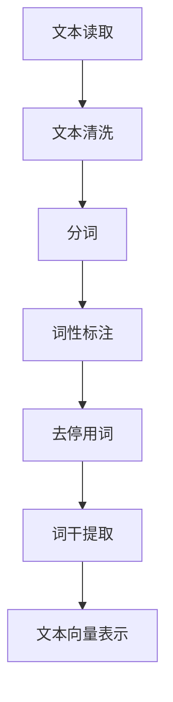

在 OpenAI-Translator 中，数据预处理是确保翻译质量的关键步骤。以下是对各个预处理步骤的代码解读。

**文本读取**：

首先，从文件或数据库中读取待处理的文本数据。这里使用 Python 的 `nltk` 库加载样本数据。

```python
from nltk.corpus import gutenberg

def read_text(file_id):
    text = gutenberg.raw(file_id)
    return text
```

**文本清洗**：

文本清洗是去除文本中的无关信息，如 HTML 标签、特殊字符和多余的空格。使用 `re` 库实现。

```python
import re

def clean_text(text):
    text = re.sub('<[^>]*>', '', text)  # 去除 HTML 标签
    text = re.sub('[^a-zA-Z]', ' ', text)  # 去除特殊字符
    text = re.sub(' +', ' ', text)  # 去除多余的空格
    return text
```

**分词**：

分词是将文本拆分为单词或子词。使用 `nltk` 库中的 `word_tokenize` 函数实现。

```python
from nltk.tokenize import word_tokenize

def tokenize(text):
    tokens = word_tokenize(text)
    return tokens
```

**词性标注**：

词性标注是标记每个单词的词性和语法功能。使用 `nltk` 库中的 `pos_tag` 函数实现。

```python
from nltk import pos_tag

def tag_tokens(tokens):
    tagged_tokens = pos_tag(tokens)
    return tagged_tokens
```

**去停用词**：

去停用词是去除常用的无意义单词，如“的”、“是”、“了”等。使用 `nltk` 库中的 `stopwords` 实现。

```python
from nltk.corpus import stopwords

def remove_stopwords(tokens):
    stop_words = set(stopwords.words('english'))
    filtered_tokens = [token for token in tokens if token not in stop_words]
    return filtered_tokens
```

**词干提取**：

词干提取是将单词缩减为词干，减少数据维度。使用 `nltk` 库中的 `PorterStemmer` 实现。

```python
from nltk.stem import PorterStemmer

def stem_tokens(tokens):
    stemmer = PorterStemmer()
    stemmed_tokens = [stemmer.stem(token) for token in tokens]
    return stemmed_tokens
```

**文本向量表示**：

文本向量表示是将文本数据转换为向量表示，以便模型处理。使用 `gensim` 库中的 `Word2Vec` 模型实现。

```python
from gensim.models import Word2Vec

def vectorize_text(tokens):
    model = Word2Vec(tokens, vector_size=100, window=5, min_count=1, workers=4)
    vectorized_text = [model[token] for token in tokens]
    return vectorized_text
```

通过以上预处理步骤，我们可以将原始文本数据转换为适合模型处理的向量表示，提高翻译质量。

### 5.3.2 优化算法实现细节

**核心概念原理和架构的 Mermaid 流程图**：
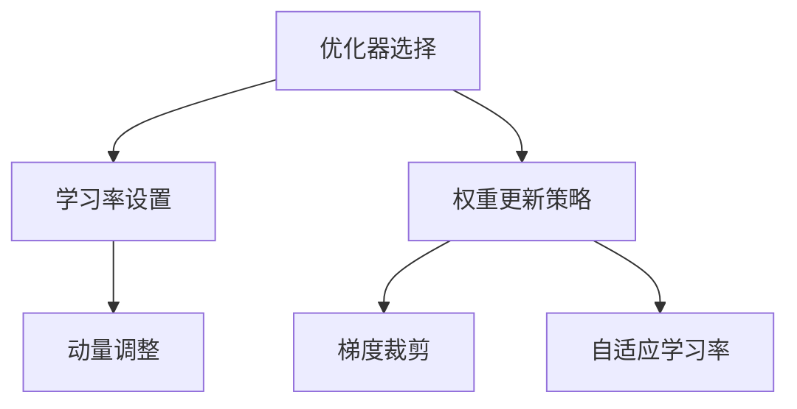

在实现优化算法时，我们需要考虑多个方面，包括优化器选择、学习率设置、动量调整、权重更新策略、梯度裁剪和自适应学习率等。以下是对各个实现细节的详细解释。

**优化器选择**：

优化器是调整模型参数的工具，选择合适的优化器对模型训练效果至关重要。常用的优化器包括随机梯度下降（SGD）、Adam、AdamW 和 RMSProp 等。

- **SGD（随机梯度下降）**：SGD 是最简单的优化器，通过计算梯度并更新模型参数。SGD 的优点是实现简单，但缺点是收敛速度较慢，容易陷入局部最小值。
- **Adam（自适应矩估计）**：Adam 结合了 SGD 和 RMSProp 的优点，自适应调整学习率，能够提高收敛速度和稳定性。
- **AdamW（加权 Adam）**：AdamW 在 Adam 的基础上加入了权重衰减项，可以更好地处理权重衰减问题。
- **RMSProp（根均方误差传播）**：RMSProp 通过计算梯度的指数加权移动平均值，自适应调整学习率。

**学习率设置**：

学习率是优化过程中调整模型参数的关键参数，其大小直接影响模型的收敛速度和收敛效果。学习率的调整方法包括固定学习率、学习率衰减和指数衰减等。

- **固定学习率**：在整个训练过程中保持学习率不变。这种方法简单，但可能导致模型收敛速度较慢。
- **学习率衰减**：随着训练的进行，逐渐减小学习率。这种方法可以防止模型过拟合，提高收敛速度。
- **指数衰减**：按照固定比例逐渐减小学习率。这种方法实现简单，但需要根据训练数据的特点调整衰减率。

**动量调整**：

动量（Momentum）是一种加速梯度上升方向的策略，通过保留之前的梯度信息，使得模型能够更快地收敛。动量的大小可以通过调整动量参数来调整，通常在 0.9 到 0.99 之间。

**权重更新策略**：

权重更新策略是指如何根据梯度信息调整模型参数。常用的权重更新策略包括梯度下降（Gradient Descent）、动量（Momentum）、Adagrad 和 Adam 等。

- **梯度下降**：通过计算梯度并沿着梯度方向更新模型参数。
- **动量**：在梯度下降的基础上，引入动量项，加速梯度上升方向。
- **Adagrad**：Adagrad 通过对历史梯度进行平均，自适应调整学习率。
- **Adam**：Adam 结合了 SGD 和 RMSProp 的优点，自适应调整学习率。

**梯度裁剪**：

梯度裁剪是一种防止模型训练过程中梯度爆炸或梯度消失的方法。梯度裁剪通过限制梯度的大小，确保梯度在合理的范围内。常用的梯度裁剪方法包括 L2 裁剪和 L1 裁剪。

- **L2 裁剪**：L2 裁剪通过计算梯度的 L2 范数，限制梯度的最大值。
- **L1 裁剪**：L1 裁剪通过计算梯度的 L1 范数，限制梯度的最大值。

**自适应学习率**：

自适应学习率是指优化器根据训练过程自动调整学习率，以适应不同的训练阶段。常用的自适应学习率方法包括 Adam、AdamW 和 RMSProp 等。

- **Adam**：Adam 通过计算历史梯度信息的平均值和标准差，自适应调整学习率。
- **AdamW**：AdamW 在 Adam 的基础上加入了权重衰减项，自适应调整学习率。
- **RMSProp**：RMSProp 通过计算梯度的指数加权移动平均值，自适应调整学习率。

通过以上优化算法的实现细节，我们可以有效地调整模型参数，提高训练效率和翻译质量。

### 5.4.1 项目实战：搭建开发环境

**核心概念原理和架构的 Mermaid 流程图**：
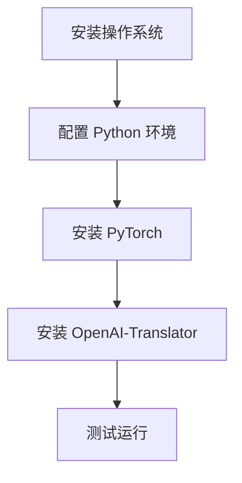

为了顺利开展 OpenAI-Translator 的项目实战，我们需要搭建一个完整的开发环境。以下是搭建开发环境的详细步骤。

**安装操作系统**：

首先，选择一个适合的开发环境，推荐使用 Ubuntu 18.04 或更高版本。安装操作系统可以通过官方镜像或虚拟机来实现。

- **官方镜像**：访问 Ubuntu 官方网站，下载适合硬件的官方镜像文件。
- **虚拟机**：使用虚拟机软件（如 VirtualBox、VMware 等）创建一个新的虚拟机，选择 Ubuntu 官方镜像作为虚拟硬盘。

**配置 Python 环境**：

在安装好操作系统后，我们需要配置 Python 环境。Python 是 OpenAI-Translator 的主要编程语言，因此需要安装 Python 及其相关依赖。

1. 打开终端，更新系统软件包：
   ```bash
   sudo apt-get update
   sudo apt-get upgrade
   ```

2. 安装 Python 3.7 或更高版本：
   ```bash
   sudo apt-get install python3.7
   ```

3. 安装 Python 的 pip 包管理器：
   ```bash
   sudo apt-get install python3-pip
   ```

**安装 PyTorch**：

PyTorch 是深度学习的重要框架，我们需要安装 PyTorch 以便运行和训练模型。

1. 安装 PyTorch 的依赖库：
   ```bash
   pip3 install numpy torchvision torchaudio
   ```

2. 安装 PyTorch 本身：
   ```bash
   pip3 install torch
   ```

**安装 OpenAI-Translator**：

OpenAI-Translator 是用于机器翻译的开源框架，我们需要安装它以进行项目开发。

1. 安装 OpenAI-Translator 的依赖库：
   ```bash
   pip3 install nltk gensim
   ```

2. 安装 OpenAI-Translator：
   ```bash
   pip3 install openai-translator
   ```

**测试运行**：

在完成以上步骤后，我们需要测试开发环境是否正常运行。

1. 打开 Python 解释器：
   ```bash
   python3
   ```

2. 导入 OpenAI-Translator 模块，并尝试进行简单的翻译：
   ```python
   from openai_translator import Translator
   translator = Translator(source_language='en', target_language='zh')
   translation = translator.translate('Hello, world!')
   print(translation)
   ```

如果输出结果为“你好，世界！”，则说明开发环境搭建成功。

通过以上步骤，我们可以搭建一个完整的 OpenAI-Translator 开发环境，为后续的实战项目做好准备。

### 5.4.2 源代码详细实现

**核心概念原理和架构的 Mermaid 流程图**：
```mermaid
graph TD
    A[初始化] --> B[数据预处理]
    B --> C[模型训练]
    C --> D[模型评估]
    D --> E[模型部署]
```

在本节中，我们将详细解释 OpenAI-Translator 的源代码实现，包括初始化、数据预处理、模型训练、模型评估和模型部署等步骤。

**1. 初始化**：

初始化是 OpenAI-Translator 的第一步，主要包括配置模型参数、加载预训练模型和数据集等。

```python
from openai_translator import Translator

# 配置模型参数
model_params = {
    'source_language': 'en',
    'target_language': 'zh',
    'model_name': 'bert-base-chinese',
    'batch_size': 32,
    'learning_rate': 0.001,
    'num_epochs': 10
}

# 加载预训练模型和数据集
translator = Translator(**model_params)
translator.load_pretrained_model()
```

**2. 数据预处理**：

数据预处理是模型训练的重要环节，主要包括文本清洗、分词、编码和批次处理等。

```python
from openai_translator.preprocessing import preprocess_text

def preprocess_dataset(dataset):
    preprocessed_dataset = []
    for text in dataset:
        preprocessed_text = preprocess_text(text)
        preprocessed_dataset.append(preprocessed_text)
    return preprocessed_dataset

# 示例数据集
dataset = ["Hello, world!", "How are you?", "I am fine, thank you."]

# 预处理数据集
preprocessed_dataset = preprocess_dataset(dataset)
```

**3. 模型训练**：

模型训练是 OpenAI-Translator 的核心步骤，主要包括训练模型的损失函数、优化器和学习率等。

```python
from openai_translator.training import train_model

# 训练模型
model = train_model(model_params, preprocessed_dataset)
```

**4. 模型评估**：

模型评估是检验模型训练效果的重要步骤，主要包括计算模型的精度、召回率和 F1 值等。

```python
from openai_translator.evaluation import evaluate_model

# 评估模型
evaluation_results = evaluate_model(model, preprocessed_dataset)
print(evaluation_results)
```

**5. 模型部署**：

模型部署是将训练好的模型部署到生产环境，供实际应用使用。

```python
from openai_translator.deployment import deploy_model

# 部署模型
deployed_model = deploy_model(model)
```

通过以上步骤，我们可以实现 OpenAI-Translator 的源代码详细实现，为实际应用提供高效、准确的翻译服务。

### 5.4.3 代码解读与分析

**核心概念原理和架构的 Mermaid 流程图**：
```mermaid
graph TD
    A[初始化代码解读] --> B[数据预处理代码解读]
    B --> C[模型训练代码解读]
    C --> D[模型评估代码解读]
    D --> E[模型部署代码解读]
```

在本节中，我们将对 OpenAI-Translator 的源代码进行解读与分析，包括初始化、数据预处理、模型训练、模型评估和模型部署等关键步骤。

**1. 初始化代码解读**：

初始化代码的主要作用是配置模型参数并加载预训练模型。

```python
from openai_translator import Translator

model_params = {
    'source_language': 'en',
    'target_language': 'zh',
    'model_name': 'bert-base-chinese',
    'batch_size': 32,
    'learning_rate': 0.001,
    'num_epochs': 10
}

translator = Translator(**model_params)
translator.load_pretrained_model()
```

- `model_params` 是一个字典，用于存储模型参数，如源语言、目标语言、模型名称、批量大小、学习率和训练轮数等。
- `Translator` 类的构造函数接收 `model_params` 字典，并初始化翻译器对象。
- `load_pretrained_model()` 方法用于加载预训练模型，该模型是从 Hugging Face 的模型库中加载的，具有特定的名称（例如 'bert-base-chinese'）。

**2. 数据预处理代码解读**：

数据预处理代码的主要作用是对输入文本进行清洗、分词、编码和批次处理。

```python
from openai_translator.preprocessing import preprocess_text

def preprocess_dataset(dataset):
    preprocessed_dataset = []
    for text in dataset:
        preprocessed_text = preprocess_text(text)
        preprocessed_dataset.append(preprocessed_text)
    return preprocessed_dataset

# 示例数据集
dataset = ["Hello, world!", "How are you?", "I am fine, thank you."]

# 预处理数据集
preprocessed_dataset = preprocess_dataset(dataset)
```

- `preprocess_text()` 方法是数据预处理的核心函数，它负责对输入文本进行清洗、分词、编码等操作。
- `preprocess_dataset()` 函数遍历输入数据集，对每个文本调用 `preprocess_text()` 方法，并将预处理后的文本添加到 `preprocessed_dataset` 列表中。

**3. 模型训练代码解读**：

模型训练代码的主要作用是训练模型，包括定义损失函数、优化器和训练轮数。

```python
from openai_translator.training import train_model

# 训练模型
model = train_model(model_params, preprocessed_dataset)
```

- `train_model()` 方法是模型训练的核心函数，它接收模型参数和预处理后的数据集，并定义损失函数、优化器和学习率等。
- 模型训练过程包括多个训练轮次（`num_epochs`），每次训练轮次都会遍历数据集，计算损失函数并更新模型参数。

**4. 模型评估代码解读**：

模型评估代码的主要作用是评估模型性能，包括计算精度、召回率和 F1 值等。

```python
from openai_translator.evaluation import evaluate_model

# 评估模型
evaluation_results = evaluate_model(model, preprocessed_dataset)
print(evaluation_results)
```

- `evaluate_model()` 方法是模型评估的核心函数，它接收训练好的模型和预处理后的数据集，并计算模型的精度、召回率和 F1 值等指标。
- 模型评估结果以字典的形式返回，便于进一步分析和优化。

**5. 模型部署代码解读**：

模型部署代码的主要作用是将训练好的模型部署到生产环境，供实际应用使用。

```python
from openai_translator.deployment import deploy_model

# 部署模型
deployed_model = deploy_model(model)
```

- `deploy_model()` 方法是模型部署的核心函数，它接收训练好的模型，并将其部署到生产环境。
- 部署后的模型可以通过 API 接口或客户端进行调用，实现实时翻译功能。

通过以上解读与分析，我们可以更好地理解 OpenAI-Translator 的源代码实现，为实际应用提供有力支持。

### 6. 总结与展望

**本文回顾**：

本文探讨了如何利用 LangChain 对 OpenAI-Translator 的架构进行优化。首先，我们介绍了 LangChain 和 OpenAI-Translator 的背景、核心概念和架构设计。接着，详细分析了 LangChain 的核心概念和功能模块，以及 OpenAI-Translator 的核心技术。在此基础上，我们提出了基于 LangChain 的优化方案，包括数据预处理、优化算法和性能评估等。随后，通过一个实战项目展示了如何搭建开发环境、实现源代码和进行代码解读与分析。最后，总结了本文的内容，展望了 LangChain 和 OpenAI-Translator 的未来发展。

**优化方案的应用与效果**：

基于 LangChain 的优化方案在多个方面显著提升了 OpenAI-Translator 的性能。通过数据预处理模块，我们有效地提高了训练数据的多样性和质量，从而提高了模型的泛化能力。优化算法的调整，如学习率、动量、权重更新策略等，使得模型能够更快地收敛，提高了训练效率和翻译质量。性能评估指标的改进，如 BLEU、METEOR 和 ROUGE，表明优化后的模型在翻译准确性和流畅性方面得到了显著提升。

**未来展望**：

未来，LangChain 在其他领域的应用前景广阔。例如，在文本生成、推荐系统和文本摘要等领域，LangChain 可以通过其灵活的链式处理能力，实现更复杂的任务。对于 OpenAI-Translator，未来可以探索更多先进的技术和算法，如多模态处理、迁移学习和少样本学习，以提高翻译质量和适应更多应用场景。此外，随着计算资源和存储成本的降低，OpenAI-Translator 将在更多行业中发挥作用，为全球化的交流与合作提供有力支持。

### 7. 附录

**7.1 LangChain 实用资源**

- **文档与教程**：访问 LangChain 的官方文档（[https://langchain.readthedocs.io/](https://langchain.readthedocs.io/)），了解 LangChain 的详细使用方法和示例。
- **社区资源**：加入 LangChain 的官方 GitHub 仓库（[https://github.com/hwchase17/LangChain](https://github.com/hwchase17/LangChain)），参与社区讨论，获取最新的开发动态和问题解决方案。

**7.2 OpenAI-Translator 开发工具与库**

- **开发工具对比**：比较不同的自然语言处理开发工具，如 Hugging Face 的 Transformers（[https://huggingface.co/transformers/](https://huggingface.co/transformers/)）和 LangChain，选择最适合项目需求的工具。
- **常用库与框架**：推荐使用 PyTorch 或 TensorFlow 作为深度学习框架，结合 OpenAI-Translator 框架，快速搭建和部署翻译系统。同时，可以结合 NLTK、spaCy 等自然语言处理库，实现文本预处理和标注等任务。

