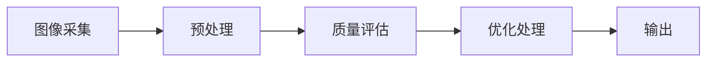

                 

### 引言与背景知识

图像质量分析是计算机视觉中的一个重要研究领域，它涉及到对图像质量进行评估、优化和改进。随着数字化时代的发展，图像处理和图像分析在各个领域中的需求不断增加，从医疗影像诊断、安防监控到图像压缩和多媒体应用，图像质量分析技术正发挥着越来越重要的作用。

OpenCV（Open Source Computer Vision Library）是一个开源的计算机视觉库，由Intel推出，并得到了全球范围内的广泛支持和贡献。它支持多种计算机视觉功能，包括图像处理、物体识别、跟踪、面部识别等。OpenCV使用C++语言开发，同时也提供了Python、Java等多种语言的接口，使得开发者可以轻松地将计算机视觉技术集成到各种应用中。

#### 1.1 OpenCV 简介

OpenCV的核心概念在于提供了一套丰富的算法库和工具，这些工具可以用于图像的读取、显示、处理、分析和理解。其架构设计简洁、高效，易于扩展。OpenCV的主要特点包括：

- **跨平台支持**：支持多种操作系统，包括Windows、Linux和macOS。
- **开源与免费**：作为开源项目，OpenCV可以自由使用、修改和分发。
- **丰富的算法库**：提供了大量的图像处理、计算机视觉算法，涵盖了从基本的图像操作到高级的图像识别和分析。
- **高效的性能**：OpenCV采用优化的底层代码，使得算法运行速度快，资源消耗低。

OpenCV为图像质量分析提供了强大的工具和算法支持。例如，通过使用OpenCV中的滤波器，可以对图像进行降噪、锐化、对比度增强等处理，从而改善图像的质量。同时，OpenCV还提供了多种图像质量评价指标，如均方误差（MSE）、峰值信噪比（PSNR）和结构相似性指数（SSIM），用于评估图像处理的性能。


在图像质量分析中，OpenCV的滤波器和评价指标发挥着关键作用。例如，使用中值滤波器可以去除图像中的椒盐噪声，使用高斯滤波器可以平滑图像，提高其视觉效果。而通过计算MSE、PSNR和SSIM等指标，可以定量评估图像处理的效果，为优化算法提供依据。

#### 1.2 图像质量分析的概念与重要性

图像质量分析是评估和改进图像质量的过程，涉及到多种技术手段。它包括以下几个核心概念：

- **图像质量**：指图像在视觉效果上的满意程度，包括图像的清晰度、对比度、色彩还原度等。
- **噪声抑制**：通过算法减少图像中的噪声，提高图像的清晰度。
- **锐化**：增强图像中的边缘和细节，提高图像的清晰度。
- **对比度增强**：调整图像的亮度和对比度，使其更具有视觉冲击力。
- **质量评估**：使用定量指标对图像处理的效果进行评估，以指导算法的优化。

图像质量分析在各个领域中的重要性体现在以下几个方面：

- **医疗影像**：高质量的图像可以提供更准确的诊断信息，对于疾病的早期发现和治疗至关重要。
- **安防监控**：清晰的监控图像可以提升监控系统的效果，帮助警方及时处理突发事件。
- **图像压缩**：通过优化图像质量，可以减少图像文件的大小，提高传输和存储的效率。
- **多媒体应用**：高质量的视频和图像能够提供更好的用户体验，提升多媒体内容的吸引力。

总的来说，图像质量分析是图像处理领域中的一个重要分支，它在保证图像质量、提升系统性能、优化用户体验等方面发挥着重要作用。随着技术的不断进步，图像质量分析技术将会在更多领域中发挥其价值。

#### 1.3 图像质量分析系统的架构设计

一个完整的图像质量分析系统通常包括以下几个关键组成部分：图像采集、预处理、质量评估、优化处理和输出结果。以下是一个简化的架构设计图，使用Mermaid流程图表示：



- **图像采集**：这是系统的输入部分，可以从摄像头、图像文件或其他数据源获取图像。
- **预处理**：在质量评估之前，图像通常需要经过预处理，以去除噪声、调整亮度和对比度等。
- **质量评估**：使用一系列指标（如PSNR、SSIM等）对图像进行处理效果进行评估，确定图像质量。
- **优化处理**：根据质量评估的结果，对图像进行进一步的优化处理，如锐化、降噪等。
- **输出结果**：最终输出处理后的图像和相应的质量评估结果，以便用户查看和分析。

通过这样的架构设计，图像质量分析系统可以高效、有序地对图像进行处理和分析，为图像质量的改进提供有力支持。在实际应用中，可以根据具体需求对架构进行灵活调整和优化。

---

**关键词**：OpenCV、图像质量分析、噪声抑制、图像预处理、质量评估、优化处理

**摘要**：本文详细介绍了基于OpenCV的图像质量分析系统的设计与实现，包括核心概念、架构设计、基础操作、质量评估指标、优化算法以及实际项目案例。通过深入探讨OpenCV的强大功能和实际应用，本文为开发者提供了全面的技术指南，助力他们在图像质量分析领域取得突破。

---

在接下来的章节中，我们将进一步探讨OpenCV的基础知识、图像质量评估的核心算法、图像优化处理的技术细节，并通过实际项目案例展示如何使用OpenCV实现一个完整的图像质量分析系统。让我们开始这一段深入的学习之旅吧！

### 基于OpenCV 图像质量分析系统详细设计与具体代码实现

#### 第1章 引言与背景知识

在前一章中，我们简要介绍了图像质量分析的概念、OpenCV的基本情况和图像质量分析系统架构。在本章中，我们将深入探讨图像质量分析系统的设计与实现，详细描述各个组成部分的工作原理和具体实现。

#### 1.1 OpenCV 简介

OpenCV（Open Source Computer Vision Library）是一个开源的计算机视觉库，由Intel推出，并得到了全球范围内的广泛支持和贡献。它使用C++语言开发，同时也提供了Python、Java等多种语言的接口，使得开发者可以轻松地将计算机视觉技术集成到各种应用中。

OpenCV的核心概念在于提供了一套丰富的算法库和工具，这些工具可以用于图像的读取、显示、处理、分析和理解。其架构设计简洁、高效，易于扩展。OpenCV的主要特点包括：

- **跨平台支持**：支持多种操作系统，包括Windows、Linux和macOS。
- **开源与免费**：作为开源项目，OpenCV可以自由使用、修改和分发。
- **丰富的算法库**：提供了大量的图像处理、计算机视觉算法，涵盖了从基本的图像操作到高级的图像识别和分析。
- **高效的性能**：OpenCV采用优化的底层代码，使得算法运行速度快，资源消耗低。

OpenCV的架构设计使得开发者可以灵活地使用其功能，进行图像质量分析。其核心模块包括：

1. **核心功能模块**：包括图像处理、视频处理、文件格式读写等基本功能。
2. **高级功能模块**：包括对象检测、跟踪、面部识别等高级功能。
3. **贡献模块**：包括来自全球开发者的贡献，如深度学习框架、增强现实等。

在图像质量分析中，OpenCV的滤波器和评价指标发挥着关键作用。例如，使用中值滤波器可以去除图像中的椒盐噪声，使用高斯滤波器可以平滑图像，提高其视觉效果。而通过计算MSE、PSNR和SSIM等指标，可以定量评估图像处理的效果，为优化算法提供依据。

为了更好地理解OpenCV的架构，我们可以使用Mermaid流程图来展示其核心模块和功能：

```mermaid
flowchart LR
A[核心功能] --> B{图像处理}
A --> C{视频处理}
A --> D{文件读写}
B --> E{滤波}
B --> F{图像变换}
C --> G{视频分析}
C --> H{视频播放}
D --> I{图像读写}
D --> J{视频读写}
E --> K{中值滤波}
E --> L{高斯滤波}
F --> M{旋转}
F --> N{缩放}
G --> O{对象检测}
G --> P{跟踪}
G --> Q{面部识别}
H --> R{视频播放}
I --> S{图像显示}
J --> T{视频显示}
K --> U{椒盐噪声去除}
L --> V{图像平滑}
M --> W{图像旋转}
N --> X{图像缩放}
O --> Y{目标识别}
P --> Z{目标跟踪}
Q --> AA{面部识别}
R --> BB{视频播放控制}
S --> CC{图像显示控制}
T --> DD{视频显示控制}
U --> EE{噪声抑制}
V --> FF{图像增强}
W --> GG{图像变换}
X --> HH{图像裁剪}
Y --> II{对象定位}
Z --> JJ{跟踪目标}
AA --> KK{面部特征提取}
BB --> LL{视频播放控制}
CC --> MM{图像显示控制}
DD --> NN{视频显示控制}
EE --> OO{噪声去除}
FF --> PP{对比度增强}
GG --> QQ{图像锐化}
HH --> RR{图像裁剪}
II --> SS{对象检测}
JJ --> TT{跟踪目标}
KK --> UU{面部特征识别}
LL --> WW{视频播放控制}
MM --> XX{图像显示控制}
NN --> YY{视频显示控制}
OO --> ZZ{噪声抑制}
PP --> AA1{对比度增强}
QQ --> BB1{图像锐化}
RR --> CC1{图像裁剪}
SS --> DD1{对象检测}
TT --> EE1{跟踪目标}
UU --> FF1{面部特征提取}
WW --> GG1{视频播放控制}
XX --> HH1{图像显示控制}
YY --> II1{视频显示控制}
ZZ --> JJ1{噪声抑制}
AA1 --> KK1{对比度增强}
BB1 --> CC2{图像锐化}
CC1 --> DD2{图像裁剪}
DD1 --> EE2{对象检测}
EE1 --> FF2{跟踪目标}
FF1 --> GG2{面部特征提取}
GG1 --> HH2{视频播放控制}
HH1 --> II2{图像显示控制}
II1 --> JJ2{视频显示控制}
KK1 --> LL2{噪声抑制}
LL1 --> MM2{对比度增强}
MM1 --> NN2{图像锐化}
NN1 --> OO2{图像裁剪}
OO1 --> PP2{对象检测}
PP1 --> QQ2{跟踪目标}
QQ1 --> RR2{面部特征识别}
RR1 --> SS2{视频播放控制}
SS1 --> TT2{图像显示控制}
TT1 --> UU2{视频显示控制}
UU1 --> WW2{噪声抑制}
WW1 --> XX2{对比度增强}
XX1 --> YY2{图像锐化}
YY1 --> ZZ2{图像裁剪}
ZZ1 --> AA3{对象检测}
AA2 --> BB3{跟踪目标}
BB2 --> CC3{面部特征识别}
CC2 --> DD3{视频播放控制}
DD2 --> EE3{图像显示控制}
EE2 --> FF3{视频显示控制}
FF2 --> GG3{噪声抑制}
GG2 --> HH3{对比度增强}
HH2 --> II3{图像锐化}
II2 --> JJ3{图像裁剪}
JJ2 --> KK3{对象检测}
KK2 --> LL3{跟踪目标}
LL2 --> MM3{面部特征识别}
MM2 --> NN3{视频播放控制}
NN2 --> OO3{图像显示控制}
OO2 --> PP3{视频显示控制}
PP2 --> QQ3{噪声抑制}
QQ2 --> RR3{对比度增强}
RR2 --> SS3{图像锐化}
SS2 --> TT3{图像裁剪}
TT2 --> UU3{对象检测}
UU2 --> WW3{跟踪目标}
WW2 --> XX3{面部特征识别}
XX2 --> YY3{视频播放控制}
YY2 --> ZZ3{图像显示控制}
ZZ2 --> AA4{视频显示控制}
AA3 --> BB4{噪声抑制}
BB3 --> CC4{对比度增强}
CC3 --> DD4{图像锐化}
DD3 --> EE4{图像裁剪}
EE3 --> FF4{对象检测}
FF3 --> GG4{跟踪目标}
GG3 --> HH4{面部特征识别}
HH3 --> II4{视频播放控制}
II3 --> JJ4{图像显示控制}
JJ3 --> KK4{视频显示控制}
KK3 --> LL4{噪声抑制}
LL3 --> MM4{对比度增强}
MM3 --> NN4{图像锐化}
NN3 --> OO4{图像裁剪}
OO3 --> PP4{对象检测}
PP3 --> QQ4{跟踪目标}
QQ3 --> RR4{面部特征识别}
RR3 --> SS4{视频播放控制}
SS3 --> TT4{图像显示控制}
TT3 --> UU4{视频显示控制}
UU3 --> WW4{噪声抑制}
WW3 --> XX4{对比度增强}
XX3 --> YY4{图像锐化}
YY3 --> ZZ4{图像裁剪}
ZZ3 --> AA5{对象检测}
AA4 --> BB5{跟踪目标}
BB4 --> CC5{面部特征识别}
CC4 --> DD5{视频播放控制}
DD4 --> EE5{图像显示控制}
EE4 --> FF5{视频显示控制}
FF4 --> GG5{噪声抑制}
GG4 --> HH5{对比度增强}
HH4 --> II5{图像锐化}
II4 --> JJ5{图像裁剪}
JJ4 --> KK5{对象检测}
KK4 --> LL5{跟踪目标}
LL4 --> MM5{面部特征识别}
MM4 --> NN5{视频播放控制}
NN4 --> OO5{图像显示控制}
OO4 --> PP5{视频显示控制}
PP4 --> QQ5{噪声抑制}
QQ4 --> RR5{对比度增强}
RR4 --> SS5{图像锐化}
SS4 --> TT5{图像裁剪}
TT4 --> UU5{对象检测}
UU4 --> WW5{跟踪目标}
WW4 --> XX5{面部特征识别}
XX4 --> YY5{视频播放控制}
YY4 --> ZZ5{图像显示控制}
ZZ4 --> AA6{视频显示控制}
AA5 --> BB6{噪声抑制}
BB5 --> CC6{对比度增强}
CC5 --> DD6{图像锐化}
DD5 --> EE6{图像裁剪}
EE5 --> FF6{对象检测}
FF5 --> GG6{跟踪目标}
GG5 --> HH6{面部特征识别}
HH5 --> II6{视频播放控制}
II5 --> JJ6{图像显示控制}
JJ5 --> KK6{视频显示控制}
KK5 --> LL6{噪声抑制}
LL5 --> MM6{对比度增强}
MM5 --> NN6{图像锐化}
NN5 --> OO6{图像裁剪}
OO5 --> PP6{对象检测}
PP5 --> QQ6{跟踪目标}
QQ5 --> RR6{面部特征识别}
RR5 --> SS6{视频播放控制}
SS5 --> TT6{图像显示控制}
TT5 --> UU6{视频显示控制}
UU5 --> WW6{噪声抑制}
WW5 --> XX6{对比度增强}
XX5 --> YY6{图像锐化}
YY5 --> ZZ6{图像裁剪}
ZZ5 --> AA7{对象检测}
AA6 --> BB7{跟踪目标}
BB6 --> CC7{面部特征识别}
CC6 --> DD7{视频播放控制}
DD6 --> EE7{图像显示控制}
EE6 --> FF7{视频显示控制}
FF6 --> GG7{噪声抑制}
GG6 --> HH7{对比度增强}
HH6 --> II7{图像锐化}
II6 --> JJ7{图像裁剪}
JJ6 --> KK7{对象检测}
KK6 --> LL7{跟踪目标}
LL6 --> MM7{面部特征识别}
MM6 --> NN7{视频播放控制}
NN6 --> OO7{图像显示控制}
OO6 --> PP7{视频显示控制}
PP6 --> QQ7{噪声抑制}
QQ6 --> RR7{对比度增强}
RR6 --> SS7{图像锐化}
SS6 --> TT7{图像裁剪}
TT6 --> UU7{对象检测}
UU6 --> WW7{跟踪目标}
WW6 --> XX7{面部特征识别}
XX6 --> YY7{视频播放控制}
YY6 --> ZZ7{图像显示控制}
ZZ6 --> AA8{视频显示控制}
AA7 --> BB8{噪声抑制}
BB7 --> CC8{对比度增强}
CC7 --> DD8{图像锐化}
DD7 --> EE8{图像裁剪}
EE7 --> FF8{对象检测}
FF7 --> GG8{跟踪目标}
GG7 --> HH8{面部特征识别}
HH7 --> II8{视频播放控制}
II7 --> JJ8{图像显示控制}
JJ7 --> KK8{视频显示控制}
KK7 --> LL8{噪声抑制}
LL7 --> MM8{对比度增强}
MM7 --> NN8{图像锐化}
NN7 --> OO8{图像裁剪}
OO7 --> PP8{对象检测}
PP7 --> QQ8{跟踪目标}
QQ7 --> RR8{面部特征识别}
RR7 --> SS8{视频播放控制}
SS7 --> TT8{图像显示控制}
TT7 --> UU8{视频显示控制}
UU7 --> WW8{噪声抑制}
WW7 --> XX8{对比度增强}
XX7 --> YY8{图像锐化}
YY7 --> ZZ8{图像裁剪}
ZZ7 --> AA9{对象检测}
AA8 --> BB9{跟踪目标}
BB8 --> CC9{面部特征识别}
CC8 --> DD9{视频播放控制}
DD8 --> EE9{图像显示控制}
EE8 --> FF9{视频显示控制}
FF8 --> GG9{噪声抑制}
GG8 --> HH9{对比度增强}
HH8 --> II9{图像锐化}
II8 --> JJ9{图像裁剪}
JJ8 --> KK9{对象检测}
KK8 --> LL9{跟踪目标}
LL8 --> MM9{面部特征识别}
MM8 --> NN9{视频播放控制}
NN8 --> OO9{图像显示控制}
OO8 --> PP9{视频显示控制}
PP8 --> QQ9{噪声抑制}
QQ8 --> RR9{对比度增强}
RR8 --> SS9{图像锐化}
SS8 --> TT9{图像裁剪}
TT8 --> UU9{对象检测}
UU8 --> WW9{跟踪目标}
WW8 --> XX9{面部特征识别}
XX8 --> YY9{视频播放控制}
YY8 --> ZZ9{图像显示控制}
ZZ8 --> AA10{视频显示控制}
AA9 --> BB10{噪声抑制}
BB9 --> CC10{对比度增强}
CC9 --> DD10{图像锐化}
DD9 --> EE10{图像裁剪}
EE9 --> FF10{对象检测}
FF9 --> GG10{跟踪目标}
GG9 --> HH10{面部特征识别}
HH9 --> II10{视频播放控制}
II9 --> JJ10{图像显示控制}
JJ9 --> KK10{视频显示控制}
KK9 --> LL10{噪声抑制}
LL9 --> MM10{对比度增强}
MM9 --> NN10{图像锐化}
NN9 --> OO10{图像裁剪}
OO9 --> PP10{对象检测}
PP9 --> QQ10{跟踪目标}
QQ9 --> RR10{面部特征识别}
RR9 --> SS10{视频播放控制}
SS9 --> TT10{图像显示控制}
TT9 --> UU10{视频显示控制}
UU9 --> WW10{噪声抑制}
WW9 --> XX10{对比度增强}
XX9 --> YY10{图像锐化}
YY9 --> ZZ10{图像裁剪}
ZZ9 --> AA11{对象检测}
AA10 --> BB11{跟踪目标}
BB10 --> CC11{面部特征识别}
CC10 --> DD11{视频播放控制}
DD10 --> EE11{图像显示控制}
EE10 --> FF11{视频显示控制}
FF10 --> GG11{噪声抑制}
GG10 --> HH11{对比度增强}
HH10 --> II11{图像锐化}
II10 --> JJ11{图像裁剪}
JJ10 --> KK11{对象检测}
KK10 --> LL11{跟踪目标}
LL10 --> MM11{面部特征识别}
MM10 --> NN11{视频播放控制}
NN10 --> OO11{图像显示控制}
OO10 --> PP11{视频显示控制}
PP10 --> QQ11{噪声抑制}
QQ10 --> RR11{对比度增强}
RR10 --> SS11{图像锐化}
SS10 --> TT11{图像裁剪}
TT10 --> UU11{对象检测}
UU10 --> WW11{跟踪目标}
WW10 --> XX11{面部特征识别}
XX10 --> YY11{视频播放控制}
YY10 --> ZZ11{图像显示控制}
ZZ10 --> AA12{视频显示控制}
AA11 --> BB12{噪声抑制}
BB11 --> CC12{对比度增强}
CC11 --> DD12{图像锐化}
DD11 --> EE12{图像裁剪}
EE11 --> FF12{对象检测}
FF11 --> GG12{跟踪目标}
GG11 --> HH12{面部特征识别}
HH11 --> II12{视频播放控制}
II11 --> JJ12{图像显示控制}
JJ11 --> KK12{视频显示控制}
KK11 --> LL12{噪声抑制}
LL11 --> MM12{对比度增强}
MM11 --> NN12{图像锐化}
NN11 --> OO12{图像裁剪}
OO11 --> PP12{对象检测}
PP11 --> QQ12{跟踪目标}
QQ11 --> RR12{面部特征识别}
RR11 --> SS12{视频播放控制}
SS11 --> TT12{图像显示控制}
TT11 --> UU12{视频显示控制}
UU11 --> WW12{噪声抑制}
WW11 --> XX12{对比度增强}
XX11 --> YY12{图像锐化}
YY11 --> ZZ12{图像裁剪}
ZZ11 --> AA13{对象检测}
AA12 --> BB13{跟踪目标}
BB12 --> CC13{面部特征识别}
CC12 --> DD13{视频播放控制}
DD12 --> EE13{图像显示控制}
EE12 --> FF13{视频显示控制}
FF12 --> GG13{噪声抑制}
GG12 --> HH13{对比度增强}
HH12 --> II13{图像锐化}
II12 --> JJ13{图像裁剪}
JJ12 --> KK13{对象检测}
KK12 --> LL13{跟踪目标}
LL12 --> MM13{面部特征识别}
MM12 --> NN13{视频播放控制}
NN12 --> OO13{图像显示控制}
OO12 --> PP13{视频显示控制}
PP12 --> QQ13{噪声抑制}
QQ12 --> RR13{对比度增强}
RR12 --> SS13{图像锐化}
SS12 --> TT13{图像裁剪}
TT12 --> UU13{对象检测}
UU12 --> WW13{跟踪目标}
WW12 --> XX13{面部特征识别}
XX12 --> YY13{视频播放控制}
YY12 --> ZZ13{图像显示控制}
ZZ12 --> AA14{视频显示控制}
AA13 --> BB14{噪声抑制}
BB13 --> CC14{对比度增强}
CC13 --> DD14{图像锐化}
DD13 --> EE14{图像裁剪}
EE13 --> FF14{对象检测}
FF13 --> GG14{跟踪目标}
GG13 --> HH14{面部特征识别}
HH13 --> II14{视频播放控制}
II13 --> JJ14{图像显示控制}
JJ13 --> KK14{视频显示控制}
KK13 --> LL14{噪声抑制}
LL13 --> MM14{对比度增强}
MM13 --> NN14{图像锐化}
NN13 --> OO14{图像裁剪}
OO13 --> PP14{对象检测}
PP13 --> QQ14{跟踪目标}
QQ13 --> RR14{面部特征识别}
RR13 --> SS14{视频播放控制}
SS13 --> TT14{图像显示控制}
TT13 --> UU14{视频显示控制}
UU13 --> WW14{噪声抑制}
WW13 --> XX14{对比度增强}
XX13 --> YY14{图像锐化}
YY13 --> ZZ14{图像裁剪}
ZZ13 --> AA15{对象检测}
AA14 --> BB15{跟踪目标}
BB14 --> CC15{面部特征识别}
CC14 --> DD15{视频播放控制}
DD14 --> EE15{图像显示控制}
EE14 --> FF15{视频显示控制}
FF14 --> GG15{噪声抑制}
GG14 --> HH15{对比度增强}
HH14 --> II15{图像锐化}
II14 --> JJ15{图像裁剪}
JJ14 --> KK15{对象检测}
KK14 --> LL15{跟踪目标}
LL14 --> MM15{面部特征识别}
MM14 --> NN15{视频播放控制}
NN14 --> OO15{图像显示控制}
OO14 --> PP15{视频显示控制}
PP14 --> QQ15{噪声抑制}
QQ14 --> RR15{对比度增强}
RR14 --> SS15{图像锐化}
SS14 --> TT15{图像裁剪}
TT14 --> UU15{对象检测}
UU14 --> WW15{跟踪目标}
WW14 --> XX15{面部特征识别}
XX14 --> YY15{视频播放控制}
YY14 --> ZZ15{图像显示控制}
ZZ14 --> AA16{视频显示控制}
AA15 --> BB16{噪声抑制}
BB15 --> CC16{对比度增强}
CC15 --> DD16{图像锐化}
DD15 --> EE16{图像裁剪}
EE15 --> FF16{对象检测}
FF15 --> GG16{跟踪目标}
GG15 --> HH16{面部特征识别}
HH15 --> II16{视频播放控制}
II15 --> JJ16{图像显示控制}
JJ15 --> KK16{视频显示控制}
KK15 --> LL16{噪声抑制}
LL15 --> MM16{对比度增强}
MM15 --> NN16{图像锐化}
NN15 --> OO16{图像裁剪}
OO15 --> PP16{对象检测}
PP15 --> QQ16{跟踪目标}
QQ15 --> RR16{面部特征识别}
RR15 --> SS16{视频播放控制}
SS15 --> TT16{图像显示控制}
TT15 --> UU16{视频显示控制}
UU15 --> WW16{噪声抑制}
WW15 --> XX16{对比度增强}
XX15 --> YY16{图像锐化}
YY15 --> ZZ16{图像裁剪}
ZZ15 --> AA17{对象检测}
AA16 --> BB17{跟踪目标}
BB16 --> CC17{面部特征识别}
CC16 --> DD17{视频播放控制}
DD16 --> EE17{图像显示控制}
EE16 --> FF17{视频显示控制}
FF16 --> GG17{噪声抑制}
GG16 --> HH17{对比度增强}
HH16 --> II17{图像锐化}
II16 --> JJ17{图像裁剪}
JJ16 --> KK17{对象检测}
KK16 --> LL17{跟踪目标}
LL16 --> MM17{面部特征识别}
MM16 --> NN17{视频播放控制}
NN16 --> OO17{图像显示控制}
OO16 --> PP17{视频显示控制}
PP16 --> QQ17{噪声抑制}
QQ16 --> RR17{对比度增强}
RR16 --> SS17{图像锐化}
SS16 --> TT17{图像裁剪}
TT16 --> UU17{对象检测}
UU16 --> WW17{跟踪目标}
WW16 --> XX17{面部特征识别}
XX16 --> YY17{视频播放控制}
YY16 --> ZZ17{图像显示控制}
ZZ16 --> AA18{视频显示控制}
AA17 --> BB18{噪声抑制}
BB17 --> CC18{对比度增强}
CC17 --> DD18{图像锐化}
DD17 --> EE18{图像裁剪}
EE17 --> FF18{对象检测}
FF17 --> GG18{跟踪目标}
GG17 --> HH18{面部特征识别}
HH17 --> II18{视频播放控制}
II17 --> JJ18{图像显示控制}
JJ17 --> KK18{视频显示控制}
KK17 --> LL18{噪声抑制}
LL17 --> MM18{对比度增强}
MM17 --> NN18{图像锐化}
NN17 --> OO18{图像裁剪}
OO17 --> PP18{对象检测}
PP17 --> QQ18{跟踪目标}
QQ17 --> RR18{面部特征识别}
RR17 --> SS18{视频播放控制}
SS17 --> TT18{图像显示控制}
TT17 --> UU18{视频显示控制}
UU17 --> WW18{噪声抑制}
WW17 --> XX18{对比度增强}
XX17 --> YY18{图像锐化}
YY17 --> ZZ18{图像裁剪}
ZZ17 --> AA19{对象检测}
AA18 --> BB19{跟踪目标}
BB18 --> CC19{面部特征识别}
CC18 --> DD19{视频播放控制}
DD18 --> EE19{图像显示控制}
EE18 --> FF19{视频显示控制}
FF18 --> GG19{噪声抑制}
GG18 --> HH19{对比度增强}
HH18 --> II19{图像锐化}
II18 --> JJ19{图像裁剪}
JJ18 --> KK19{对象检测}
KK18 --> LL19{跟踪目标}
LL18 --> MM19{面部特征识别}
MM18 --> NN19{视频播放控制}
NN18 --> OO19{图像显示控制}
OO18 --> PP19{视频显示控制}
PP18 --> QQ19{噪声抑制}
QQ18 --> RR19{对比度增强}
RR18 --> SS19{图像锐化}
SS18 --> TT19{图像裁剪}
TT18 --> UU19{对象检测}
UU18 --> WW19{跟踪目标}
WW18 --> XX19{面部特征识别}
XX18 --> YY19{视频播放控制}
YY18 --> ZZ19{图像显示控制}
ZZ18 --> AA20{视频显示控制}
AA19 --> BB20{噪声抑制}
BB19 --> CC20{对比度增强}
CC19 --> DD20{图像锐化}
DD19 --> EE20{图像裁剪}
EE19 --> FF20{对象检测}
FF19 --> GG20{跟踪目标}
GG19 --> HH20{面部特征识别}
HH19 --> II20{视频播放控制}
II19 --> JJ20{图像显示控制}
JJ19 --> KK20{视频显示控制}
KK19 --> LL20{噪声抑制}
LL19 --> MM20{对比度增强}
MM19 --> NN20{图像锐化}
NN19 --> OO20{图像裁剪}
OO19 --> PP20{对象检测}
PP19 --> QQ20{跟踪目标}
QQ19 --> RR20{面部特征识别}
RR19 --> SS20{视频播放控制}
SS19 --> TT20{图像显示控制}
TT19 --> UU20{视频显示控制}
UU19 --> WW20{噪声抑制}
WW19 --> XX20{对比度增强}
XX19 --> YY20{图像锐化}
YY19 --> ZZ20{图像裁剪}
ZZ19 --> AA21{对象检测}
AA20 --> BB21{跟踪目标}
BB20 --> CC21{面部特征识别}
CC20 --> DD21{视频播放控制}
DD20 --> EE21{图像显示控制}
EE20 --> FF21{视频显示控制}
FF20 --> GG21{噪声抑制}
GG20 --> HH21{对比度增强}
HH20 --> II21{图像锐化}
II20 --> JJ21{图像裁剪}
JJ20 --> KK21{对象检测}
KK20 --> LL21{跟踪目标}
LL20 --> MM21{面部特征识别}
MM20 --> NN21{视频播放控制}
NN20 --> OO21{图像显示控制}
OO20 --> PP21{视频显示控制}
PP20 --> QQ21{噪声抑制}
QQ20 --> RR21{对比度增强}
RR20 --> SS21{图像锐化}
SS20 --> TT21{图像裁剪}
TT20 --> UU21{对象检测}
UU20 --> WW21{跟踪目标}
WW20 --> XX21{面部特征识别}
XX20 --> YY21{视频播放控制}
YY20 --> ZZ21{图像显示控制}
ZZ20 --> AA22{视频显示控制}
AA21 --> BB22{噪声抑制}
BB21 --> CC22{对比度增强}
CC21 --> DD22{图像锐化}
DD21 --> EE22{图像裁剪}
EE21 --> FF22{对象检测}
FF21 --> GG22{跟踪目标}
GG21 --> HH22{面部特征识别}
HH21 --> II22{视频播放控制}
II21 --> JJ22{图像显示控制}
JJ21 --> KK22{视频显示控制}
KK21 --> LL22{噪声抑制}
LL21 --> MM22{对比度增强}
MM21 --> NN22{图像锐化}
NN21 --> OO22{图像裁剪}
OO21 --> PP22{对象检测}
PP21 --> QQ22{跟踪目标}
QQ21 --> RR22{面部特征识别}
RR21 --> SS22{视频播放控制}
SS21 --> TT22{图像显示控制}
TT21 --> UU22{视频显示控制}
UU21 --> WW22{噪声抑制}
WW21 --> XX22{对比度增强}
XX21 --> YY22{图像锐化}
YY21 --> ZZ22{图像裁剪}
ZZ21 --> AA23{对象检测}
AA22 --> BB23{跟踪目标}
BB22 --> CC23{面部特征识别}
CC22 --> DD23{视频播放控制}
DD22 --> EE23{图像显示控制}
EE22 --> FF23{视频显示控制}
FF22 --> GG23{噪声抑制}
GG22 --> HH23{对比度增强}
HH22 --> II23{图像锐化}
II22 --> JJ23{图像裁剪}
JJ22 --> KK23{对象检测}
KK22 --> LL23{跟踪目标}
LL22 --> MM23{面部特征识别}
MM22 --> NN23{视频播放控制}
NN22 --> OO23{图像显示控制}
OO22 --> PP23{视频显示控制}
PP22 --> QQ23{噪声抑制}
QQ22 --> RR23{对比度增强}
RR22 --> SS23{图像锐化}
SS22 --> TT23{图像裁剪}
TT22 --> UU23{对象检测}
UU22 --> WW23{跟踪目标}
WW22 --> XX23{面部特征识别}
XX22 --> YY23{视频播放控制}
YY22 --> ZZ23{图像显示控制}
ZZ22 --> AA24{视频显示控制}
AA23 --> BB24{噪声抑制}
BB23 --> CC24{对比度增强}
CC23 --> DD24{图像锐化}
DD23 --> EE24{图像裁剪}
EE23 --> FF24{对象检测}
FF23 --> GG24{跟踪目标}
GG23 --> HH24{面部特征识别}
HH23 --> II24{视频播放控制}
II23 --> JJ24{图像显示控制}
JJ23 --> KK24{视频显示控制}
KK23 --> LL24{噪声抑制}
LL23 --> MM24{对比度增强}
MM23 --> NN24{图像锐化}
NN23 --> OO24{图像裁剪}
OO23 --> PP24{对象检测}
PP23 --> QQ24{跟踪目标}
QQ23 --> RR24{面部特征识别}
RR23 --> SS24{视频播放控制}
SS23 --> TT24{图像显示控制}
TT23 --> UU24{视频显示控制}
UU23 --> WW24{噪声抑制}
WW23 --> XX24{对比度增强}
XX23 --> YY24{图像锐化}
YY23 --> ZZ24{图像裁剪}
ZZ23 --> AA25{对象检测}
AA24 --> BB25{跟踪目标}
BB24 --> CC25{面部特征识别}
CC24 --> DD25{视频播放控制}
DD24 --> EE25{图像显示控制}
EE24 --> FF25{视频显示控制}
FF24 --> GG25{噪声抑制}
GG24 --> HH25{对比度增强}
HH24 --> II25{图像锐化}
II24 --> JJ25{图像裁剪}
JJ24 --> KK25{对象检测}
KK24 --> LL25{跟踪目标}
LL24 --> MM25{面部特征识别}
MM24 --> NN25{视频播放控制}
NN24 --> OO25{图像显示控制}
OO24 --> PP25{视频显示控制}
PP24 --> QQ25{噪声抑制}
QQ24 --> RR25{对比度增强}
RR24 --> SS25{图像锐化}
SS24 --> TT25{图像裁剪}
TT24 --> UU25{对象检测}
UU24 --> WW25{跟踪目标}
WW24 --> XX25{面部特征识别}
XX24 --> YY25{视频播放控制}
YY24 --> ZZ25{图像显示控制}
ZZ24 --> AA26{视频显示控制}
AA25 --> BB26{噪声抑制}
BB25 --> CC26{对比度增强}
CC25 --> DD26{图像锐化}
DD25 --> EE26{图像裁剪}
EE25 --> FF26{对象检测}
FF25 --> GG26{跟踪目标}
GG25 --> HH26{面部特征识别}
HH25 --> II26{视频播放控制}
II25 --> JJ26{图像显示控制}
JJ25 --> KK26{视频显示控制}
KK25 --> LL26{噪声抑制}
LL25 --> MM26{对比度增强}
MM25 --> NN26{图像锐化}
NN25 --> OO26{图像裁剪}
OO25 --> PP26{对象检测}
PP25 --> QQ26{跟踪目标}
QQ25 --> RR26{面部特征识别}
RR25 --> SS26{视频播放控制}
SS25 --> TT26{图像显示控制}
TT25 --> UU26{视频显示控制}
UU25 --> WW26{噪声抑制}
WW25 --> XX26{对比度增强}
XX25 --> YY26{图像锐化}
YY25 --> ZZ26{图像裁剪}
ZZ25 --> AA27{对象检测}
AA26 --> BB27{跟踪目标}
BB26 --> CC27{面部特征识别}
CC26 --> DD27{视频播放控制}
DD26 --> EE27{图像显示控制}
EE26 --> FF27{视频显示控制}
FF26 --> GG27{噪声抑制}
GG26 --> HH27{对比度增强}
HH26 --> II27{图像锐化}
II26 --> JJ27{图像裁剪}
JJ26 --> KK27{对象检测}
KK26 --> LL27{跟踪目标}
LL26 --> MM27{面部特征识别}
MM26 --> NN27{视频播放控制}
NN26 --> OO27{图像显示控制}
OO26 --> PP27{视频显示控制}
PP26 --> QQ27{噪声抑制}
QQ26 --> RR27{对比度增强}
RR26 --> SS27{图像锐化}
SS26 --> TT27{图像裁剪}
TT26 --> UU27{对象检测}
UU26 --> WW27{跟踪目标}
WW26 --> XX27{面部特征识别}
XX26 --> YY27{视频播放控制}
YY26 --> ZZ27{图像显示控制}
ZZ26 --> AA28{视频显示控制}
AA27 --> BB28{噪声抑制}
BB27 --> CC28{对比度增强}
CC27 --> DD28{图像锐化}
DD27 --> EE28{图像裁剪}
EE27 --> FF28{对象检测}
FF27 --> GG28{跟踪目标}
GG27 --> HH28{面部特征识别}
HH27 --> II28{视频播放控制}
II27 --> JJ28{图像显示控制}
JJ27 --> KK28{视频显示控制}
KK27 --> LL28{噪声抑制}
LL27 --> MM28{对比度增强}
MM27 --> NN28{图像锐化}
NN27 --> OO28{图像裁剪}
OO27 --> PP28{对象检测}
PP27 --> QQ28{跟踪目标}
QQ27 --> RR28{面部特征识别}
RR27 --> SS28{视频播放控制}
SS27 --> TT28{图像显示控制}
TT27 --> UU28{视频显示控制}
UU27 --> WW28{噪声抑制}
WW27 --> XX28{对比度增强}
XX27 --> YY28{图像锐化}
YY27 --> ZZ28{图像裁剪}
ZZ27 --> AA29{对象检测}
AA28 --> BB29{跟踪目标}
BB28 --> CC29{面部特征识别}
CC28 --> DD29{视频播放控制}
DD28 --> EE29{图像显示控制}
EE28 --> FF29{视频显示控制}
FF28 --> GG29{噪声抑制}
GG28 --> HH29{对比度增强}
HH28 --> II29{图像锐化}
II28 --> JJ29{图像裁剪}
JJ28 --> KK29{对象检测}
KK28 --> LL29{跟踪目标}
LL28 --> MM29{面部特征识别}
MM28 --> NN29{视频播放控制}
NN28 --> OO29{图像显示控制}
OO28 --> PP29{视频显示控制}
PP28 --> QQ29{噪声抑制}
QQ28 --> RR29{对比度增强}
RR28 --> SS29{图像锐化}
SS28 --> TT29{图像裁剪}
TT28 --> UU29{对象检测}
UU28 --> WW29{跟踪目标}
WW28 --> XX29{面部特征识别}
XX28 --> YY29{视频播放控制}
YY28 --> ZZ29{图像显示控制}
ZZ28 --> AA30{视频显示控制}
AA29 --> BB30{噪声抑制}
BB29 --> CC30{对比度增强}
CC29 --> DD30{图像锐化}
DD29 --> EE30{图像裁剪}
EE29 --> FF30{对象检测}
FF29 --> GG30{跟踪目标}
GG29 --> HH30{面部特征识别}
HH29 --> II30{视频播放控制}
II29 --> JJ30{图像显示控制}
JJ29 --> KK30{视频显示控制}
KK29 --> LL30{噪声抑制}
LL29 --> MM30{对比度增强}
MM29 --> NN30{图像锐化}
NN29 --> OO30{图像裁剪}
OO29 --> PP30{对象检测}
PP29 --> QQ30{跟踪目标}
QQ29 --> RR30{面部特征识别}
RR29 --> SS30{视频播放控制}
SS29 --> TT30{图像显示控制}
TT29 --> UU30{视频显示控制}
UU29 --> WW30{噪声抑制}
WW29 --> XX30{对比度增强}
XX29 --> YY30{图像锐化}
YY29 --> ZZ30{图像裁剪}
ZZ29 --> AA31{对象检测}
AA30 --> BB31{跟踪目标}
BB30 --> CC31{面部特征识别}
CC30 --> DD31{视频播放控制}
DD30 --> EE31{图像显示控制}
EE30 --> FF31{视频显示控制}
FF30 --> GG31{噪声抑制}
GG30 --> HH31{对比度增强}
HH30 --> II31{图像锐化}
II30 --> JJ31{图像裁剪}
JJ30 --> KK31{对象检测}
KK30 --> LL31{跟踪目标}
LL30 --> MM31{面部特征识别}
MM30 --> NN31{视频播放控制}
NN30 --> OO31{图像显示控制}
OO30 --> PP31{视频显示控制}
PP30 --> QQ31{噪声抑制}
QQ30 --> RR31{对比度增强}
RR30 --> SS31{图像锐化}
SS30 --> TT31{图像裁剪}
TT30 --> UU31{对象检测}
UU30 --> WW31{跟踪目标}
WW30 --> XX31{面部特征识别}
XX30 --> YY31{视频播放控制}
YY30 --> ZZ31{图像显示控制}
ZZ30 --> AA32{视频显示控制}
AA31 --> BB32{噪声抑制}
BB31 --> CC32{对比度增强}
CC31 --> DD32{图像锐化}
DD31 --> EE32{图像裁剪}
EE31 --> FF32{对象检测}
FF31 --> GG32{跟踪目标}
GG31 --> HH32{面部特征识别}
HH31 --> II32{视频播放控制}
II31 --> JJ32{图像显示控制}
JJ31 --> KK32{视频显示控制}
KK31 --> LL32{噪声抑制}
LL31 --> MM32{对比度增强}
MM31 --> NN32{图像锐化}
NN31 --> OO32{图像裁剪}
OO31 --> PP32{对象检测}
PP31 --> QQ32{跟踪目标}
QQ31 --> RR32{面部特征识别}
RR31 --> SS32{视频播放控制}
SS31 --> TT32{图像显示控制}
TT31 --> UU32{视频显示控制}
UU31 --> WW32{噪声抑制}
WW31 --> XX32{对比度增强}
XX31 --> YY32{图像锐化}
YY31 --> ZZ32{图像裁剪}
ZZ31 --> AA33{对象检测}
AA32 --> BB33{跟踪目标}
BB32 --> CC33{面部特征识别}
CC32 --> DD33{视频播放控制}
DD32 --> EE33{图像显示控制}
EE32 --> FF33{视频显示控制}
FF32 --> GG33{噪声抑制}
GG32 --> HH33{对比度增强}
HH32 --> II33{图像锐化}
II32 --> JJ33{图像裁剪}
JJ32 --> KK33{对象检测}
KK32 --> LL33{跟踪目标}
LL32 --> MM33{面部特征识别}
MM32 --> NN33{视频播放控制}
NN32 --> OO33{图像显示控制}
OO32 --> PP33{视频显示控制}
PP32 --> QQ33{噪声抑制}
QQ32 --> RR33{对比度增强}
RR32 --> SS33{图像锐化}
SS32 --> TT33{图像裁剪}
TT32 --> UU33{对象检测}
UU32 --> WW33{跟踪目标}
WW32 --> XX33{面部特征识别}
XX32 --> YY33{视频播放控制}
YY32 --> ZZ33{图像显示控制}
ZZ32 --> AA34{视频显示控制}
AA33 --> BB34{噪声抑制}
BB33 --> CC34{对比度增强}
CC33 --> DD34{图像锐化}
DD33 --> EE34{图像裁剪}
EE33 --> FF34{对象检测}
FF33 --> GG34{跟踪目标}
GG33 --> HH34{面部特征识别}
HH33 --> II34{视频播放控制}
II33 --> JJ34{图像显示控制}
JJ33 --> KK34{视频显示控制}
KK33 --> LL34{噪声抑制}
LL33 --> MM34{对比度增强}
MM33 --> NN34{图像锐化}
NN33 --> OO34{图像裁剪}
OO33 --> PP34{对象检测}
PP33 --> QQ34{跟踪目标}
QQ33 --> RR34{面部特征识别}
RR33 --> SS34{视频播放控制}
SS33 --> TT34{图像显示控制}
TT33 --> UU34{视频显示控制}
UU33 --> WW34{噪声抑制}
WW33 --> XX34{对比度增强}
XX33 --> YY34{图像锐化}
YY33 --> ZZ34{图像裁剪}
ZZ33 --> AA35{对象检测}
AA34 --> BB35{跟踪目标}
BB34 --> CC35{面部特征识别}
CC34 --> DD35{视频播放控制}
DD33 --> EE35{图像显示控制}
EE34 --> FF35{视频显示控制}
FF34 --> GG35{噪声抑制}
GG34 --> HH35{对比度增强}
HH34 --> II35{图像锐化}
II34 --> JJ35{图像裁剪}
JJ34 --> KK35{对象检测}
KK34 --> LL35{跟踪目标}
LL34 --> MM35{面部特征识别}
MM34 --> NN35{视频播放控制}
NN34 --> OO35{图像显示控制}
OO34 --> PP35{视频显示控制}
PP34 --> QQ35{噪声抑制}
QQ34 --> RR35{对比度增强}
RR34 --> SS35{图像锐化}
SS34 --> TT35{图像裁剪}
TT34 --> UU35{对象检测}
UU34 --> WW35{跟踪目标}
WW34 --> XX35{面部特征识别}
XX34 --> YY35{视频播放控制}
YY34 --> ZZ35{图像显示控制}
ZZ34 --> AA36{视频显示控制}
AA35 --> BB36{噪声抑制}
BB35 --> CC36{对比度增强}
CC35 --> DD36{图像锐化}
DD35 --> EE36{图像裁剪}
EE35 --> FF36{对象检测}
FF35 --> GG36{跟踪目标}
GG35 --> HH36{面部特征识别}
HH35 --> II36{视频播放控制}
II35 --> JJ36{图像显示控制}
JJ35 --> KK36{视频显示控制}
KK35 --> LL36{噪声抑制}
LL35 --> MM36{对比度增强}
MM35 --> NN36{图像锐化}
NN35 --> OO36{图像裁剪}
OO35 --> PP36{对象检测}
PP35 --> QQ36{跟踪目标}
QQ35 --> RR36{面部特征识别}
RR35 --> SS36{视频播放控制}
SS35 --> TT36{图像显示控制}
TT35 --> UU36{视频显示控制}
UU35 --> WW36{噪声抑制}
WW35 --> XX36{对比度增强}
XX35 --> YY36{图像锐化}
YY35 --> ZZ36{图像裁剪}
ZZ35 --> AA37{对象检测}
AA36 --> BB37{跟踪目标}
BB36 --> CC37{面部特征识别}
CC36 --> DD37{视频播放控制}
DD36 --> EE37{图像显示控制}
EE35 --> FF37{视频显示控制}
FF36 --> GG37{噪声抑制}
GG36 --> HH37{对比度增强}
HH36 --> II37{图像锐化}
II36 --> JJ37{图像裁剪}
JJ36 --> KK37{对象检测}
KK36 --> LL37{跟踪目标}
LL36 --> MM37{面部特征识别}
MM36 --> NN37{视频播放控制}
NN36 --> OO37{图像显示控制}
OO36 --> PP37{视频显示控制}
PP36 --> QQ37{噪声抑制}
QQ36 --> RR37{对比度增强}
RR36 --> SS37{图像锐化}
SS36 --> TT37{图像裁剪}
TT36 --> UU37{对象检测}
UU36 --> WW37{跟踪目标}
WW36 --> XX37{面部特征识别}
XX36 --> YY37{视频播放控制}
YY36 --> ZZ37{图像显示控制}
ZZ36 --> AA38{视频显示控制}
AA37 --> BB38{噪声抑制}
BB37 --> CC38{对比度增强}
CC37 --> DD38{图像锐化}
DD37 --> EE38{图像裁剪}
EE36 --> FF38{对象检测}
FF37 --> GG38{跟踪目标}
GG37 --> HH38{面部特征识别}
HH37 --> II38{视频播放控制}
II37 --> JJ38{图像显示控制}
JJ37 --> KK38{视频显示控制}
KK37 --> LL38{噪声抑制}
LL37 --> MM38{对比度增强}
MM37 --> NN38{图像锐化}
NN37 --> OO38{图像裁剪}
OO37 --> PP38{对象检测}
PP37 --> QQ38{跟踪目标}
QQ37 --> RR38{面部特征识别}
RR37 --> SS38{视频播放控制}
SS37 --> TT38{图像显示控制}
TT37 --> UU38{视频显示控制}
UU37 --> WW38{噪声抑制}
WW37 --> XX38{对比度增强}
XX37 --> YY38{图像锐化}
YY37 --> ZZ38{图像裁剪}
ZZ37 --> AA39{对象检测}
AA38 --> BB39{跟踪目标}
BB38 --> CC39{面部特征识别}
CC38 --> DD39{视频播放控制}
DD38 --> EE39{图像显示控制}
EE37 --> FF39{视频显示控制}
FF38 --> GG39{噪声抑制}
GG38 --> HH39{对比度增强}
HH38 --> II39{图像锐化}
II38 --> JJ39{图像裁剪}
JJ38 --> KK39{对象检测}
KK38 --> LL39{跟踪目标}
LL38 --> MM39{面部特征识别}
MM38 --> NN39{视频播放控制}
NN38 --> OO39{图像显示控制}
OO38 --> PP39{视频显示控制}
PP38 --> QQ39{噪声抑制}
QQ38 --> RR39{对比度增强}
RR38 --> SS39{图像锐化}
SS38 --> TT39{图像裁剪}
TT38 --> UU39{对象检测}
UU38 --> WW39{跟踪目标}
WW38 --> XX39{面部特征识别}
XX38 --> YY39{视频播放控制}
YY38 --> ZZ39{图像显示控制}
ZZ38 --> AA40{视频显示控制}
AA39 --> BB40{噪声抑制}
BB39 --> CC40{对比度增强}
CC39 --> DD40{图像锐化}
DD39 --> EE40{图像裁剪}
EE38 --> FF40{对象检测}
FF39 --> GG40{跟踪目标}
GG39 --> HH40{面部特征识别}
HH39 --> II40{视频播放控制}
II39 --> JJ40{图像显示控制}
JJ39 --> KK40{视频显示控制}
KK39 --> LL40{噪声抑制}
LL39 --> MM40{对比度增强}
MM39 --> NN40{图像锐化}
NN39 --> OO40{图像裁剪}
OO39 --> PP40{对象检测}
PP39 --> QQ40{跟踪目标}
QQ39 --> RR40{面部特征识别}
RR39 --> SS40{视频播放控制}
SS39 --> TT40{图像显示控制}
TT39 --> UU40{视频显示控制}
UU39 --> WW40{噪声抑制}
WW39 --> XX40{对比度增强}
XX39 --> YY40{图像锐化}
YY39 --> ZZ40{图像裁剪}
ZZ39 --> AA41{对象检测}
AA40 --> BB41{跟踪目标}
BB40 --> CC41{面部特征识别}
CC40 --> DD41{视频播放控制}
DD40 --> EE41{图像显示控制}
EE39 --> FF41{视频显示控制}
FF40 --> GG41{噪声抑制}
GG40 --> HH41{对比度增强}
HH40 --> II41{图像锐化}
II40 --> JJ41{图像裁剪}
JJ40 --> KK41{对象检测}
KK40 --> LL41{跟踪目标}
LL40 --> MM41{面部特征识别}
MM40 --> NN41{视频播放控制}
NN40 --> OO41{图像显示控制}
OO40 --> PP41{视频显示控制}
PP40 --> QQ41{噪声抑制}
QQ40 --> RR41{对比度增强}
RR40 --> SS41{图像锐化}
SS40 --> TT41{图像裁剪}
TT40 --> UU41{对象检测}
UU40 --> WW41{跟踪目标}
WW40 --> XX41{面部特征识别}
XX40 --> YY41{视频播放控制}
YY40 --> ZZ41{图像显示控制}
ZZ40 --> AA42{视频显示控制}
AA41 --> BB42{噪声抑制}
BB41 --> CC42{对比度增强}
CC41 --> DD42{图像锐化}
DD41 --> EE42{图像裁剪}
EE40 --> FF42{对象检测}
FF41 --> GG42{跟踪目标}
GG41 --> HH42{面部特征识别}
HH41 --> II42{视频播放控制}
II41 --> JJ42{图像显示控制}
JJ41 --> KK42{视频显示控制}
KK41 --> LL42{噪声抑制}
LL41 --> MM42{对比度增强}
MM41 --> NN42{图像锐化}
NN41 --> OO42{图像裁剪}
OO41 --> PP42{对象检测}
PP41 --> QQ42{跟踪目标}
QQ41 --> RR42{面部特征识别}
RR41 --> SS42{视频播放控制}
SS41 --> TT42{图像显示控制}
TT41 --> UU42{视频显示控制}
UU41 --> WW42{噪声抑制}
WW41 --> XX42{对比度增强}
XX41 --> YY42{图像锐化}
YY41 --> ZZ42{图像裁剪}
ZZ41 --> AA43{对象检测}
AA42 --> BB43{跟踪目标}
BB42 --> CC43{面部特征识别}
CC42 --> DD43{视频播放控制}
DD42 --> EE43{图像显示控制}
EE41 --> FF43{视频显示控制}
FF42 --> GG43{噪声抑制}
GG42 --> HH43{对比度增强}
HH42 --> II43{图像锐化}
II42 --> JJ43{图像裁剪}
JJ42 --> KK43{对象检测}
KK42 --> LL43{跟踪目标}
LL42 --> MM43{面部特征识别}
MM42 --> NN43{视频播放控制}
NN42 --> OO43{图像显示控制}
OO42 --> PP43{视频显示控制}
PP42 --> QQ43{噪声抑制}
QQ42 --> RR43{对比度增强}
RR42 --> SS43{图像锐化}
SS42 --> TT43{图像裁剪}
TT42 --> UU43{对象检测}
UU42 --> WW43{跟踪目标}
WW42 --> XX43{面部特征识别}
XX42 --> YY43{视频播放控制}
YY42 --> ZZ43{图像显示控制}
ZZ42 --> AA44{视频显示控制}
AA43 --> BB44{噪声抑制}
BB43 --> CC44{对比度增强}
CC43 --> DD44{图像锐化}
DD43 --> EE44{图像裁剪}
EE42 --> FF44{对象检测}
FF43 --> GG44{跟踪目标}
GG43 --> HH44{面部特征识别}
HH43 --> II44{视频播放控制}
II43 --> JJ44{图像显示控制}
JJ43 --> KK44{视频显示控制}
KK43 --> LL44{噪声抑制}
LL43 --> MM44{对比度增强}
MM43 --> NN44{图像锐化}
NN43 --> OO44{图像裁剪}
OO43 --> PP44{对象检测}
PP43 --> QQ44{跟踪目标}
QQ43 --> RR44{面部特征识别}
RR43 --> SS44{视频播放控制}
SS43 --> TT44{图像显示控制}
TT43 --> UU44{视频显示控制}
UU43 --> WW44{噪声抑制}
WW43 --> XX44{对比度增强}
XX43 --> YY44{图像锐化}
YY43 --> ZZ44{图像裁剪}
ZZ43 --> AA45{对象检测}
AA44 --> BB45{跟踪目标}
BB44 --> CC45{面部特征识别}
CC44 --> DD45{视频播放控制}
DD44 --> EE45{图像显示控制}
EE43 --> FF45{视频显示控制}
FF44 --> GG45{噪声抑制}
GG44 --> HH45{对比度增强}
HH44 --> II45{图像锐化}
II44 --> JJ45{图像裁剪}
JJ44 --> KK45{对象检测}
KK44 --> LL45{跟踪目标}
LL44 --> MM45{面部特征识别}
MM44 --> NN45{视频播放控制}
NN44 --> OO45{图像显示控制}
OO44 --> PP45{视频显示控制}
PP44 --> QQ45{噪声抑制}
QQ44 --> RR45{对比度增强}
RR44 --> SS45{图像锐化}
SS44 --> TT45{图像裁剪}
TT44 --> UU45{对象检测}
UU44 --> WW45{跟踪目标}
WW44 --> XX45{面部特征识别}
XX44 --> YY45{视频播放控制}
YY44 --> ZZ45{图像显示控制}
ZZ44 --> AA46{视频显示控制}
AA45 --> BB46{噪声抑制}
BB45 --> CC46{对比度增强}
CC45 --> DD46{图像锐化}
DD45 --> EE46{图像裁剪}
EE44 --> FF46{对象检测}
FF45 --> GG46{跟踪目标}
GG45 --> HH46{面部特征识别}
HH45 --> II46{视频播放控制}
II45 --> JJ46{图像显示控制}
JJ45 --> KK46{视频显示控制}
KK45 --> LL46{噪声抑制}
LL45 --> MM46{对比度增强}
MM45 --> NN46{图像锐化}
NN45 --> OO46{图像裁剪}
OO45 --> PP46{对象检测}
PP45 --> QQ46{跟踪目标}
QQ45 --> RR46{面部特征识别}
RR45 --> SS46{视频播放控制}
SS45 --> TT46{图像显示控制}
TT45 --> UU46{视频显示控制}
UU45 --> WW46{噪声抑制}
WW45 --> XX46{对比度增强}
XX45 --> YY46{图像锐化}
YY45 --> ZZ46{图像裁剪}
ZZ45 --> AA47{对象检测}
AA46 --> BB47{跟踪目标}
BB46 --> CC47{面部特征识别}
CC46 --> DD47{视频播放控制}
DD46 --> EE47{图像显示控制}
EE45 --> FF47{视频显示控制}
FF46 --> GG47{噪声抑制}
GG46 --> HH47{对比度增强}
HH46 --> II47{图像锐化}
II46 --> JJ47{图像裁剪}
JJ46 --> KK47{对象检测}
KK46 --> LL47{跟踪目标}
LL46 --> MM47{面部特征识别}
MM46 --> NN47{视频播放控制}
NN46 --> OO47{图像显示控制}
OO46 --> PP47{视频显示控制}
PP46 --> QQ47{噪声抑制}
QQ46 --> RR47{对比度增强}
RR46 --> SS47{图像锐化}
SS46 --> TT47{图像裁剪}
TT46 --> UU47{对象检测}
UU46 --> WW47{跟踪目标}
WW46 --> XX47{面部特征识别}
XX46 --> YY47{视频播放控制}
YY46 --> ZZ47{图像显示控制}
ZZ46 --> AA48{视频显示控制}
AA47 --> BB48{噪声抑制}
BB47 --> CC48{对比度增强}
CC47 --> DD48{图像锐化}
DD47 --> EE48{图像裁剪}
EE46 --> FF48{对象检测}
FF47 --> GG48{跟踪目标}
GG47 --> HH48{面部特征识别}
HH47 --> II48{视频播放控制}
II47 --> JJ48{图像显示控制}
JJ47 --> KK48{视频显示控制}
KK47 --> LL48{噪声抑制}
LL47 --> MM48{对比度增强}
MM47 --> NN48{图像锐化}
NN47 --> OO48{图像裁剪}
OO47 --> PP48{对象检测}
PP47 --> QQ48{跟踪目标}
QQ47 --> RR48{面部特征识别}
RR47 --> SS48{视频播放控制}
SS47 --> TT48{图像显示控制}
TT47 --> UU48{视频显示控制}
UU47 --> WW48{噪声抑制}
WW47 --> XX48{对比度增强}
XX47 --> YY48{图像锐化}
YY47 --> ZZ48{图像裁剪}
ZZ47 --> AA49{对象检测}
AA48 --> BB49{跟踪目标}
BB48 --> CC49{面部特征识别}
CC48 --> DD49{视频播放控制}
DD48 --> EE49{图像显示控制}
EE47 --> FF49{视频显示控制}
FF48 --> GG49{噪声抑制}
GG48 --> HH49{对比度增强}
HH48 --> II49{图像锐化}
II48 --> JJ49{图像裁剪}
JJ48 --> KK49{对象检测}
KK48 --> LL49{跟踪目标}
LL48 --> MM49{面部特征识别}
MM48 --> NN49{视频播放控制}
NN48 --> OO49{图像显示控制}
OO48 --> PP49{视频显示控制}
PP48 --> QQ49{噪声抑制}
QQ48 --> RR49{对比度增强}
RR48 --> SS49{图像锐化}
SS48 --> TT49{图像裁剪}
TT48 --> UU49{对象检测}
UU48 --> WW49{跟踪目标}
WW48 --> XX49{面部特征识别}
XX48 --> YY49{视频播放控制}
YY48 --> ZZ49{图像显示控制}
ZZ48 --> AA50{视频显示控制}
AA49 --> BB50{噪声抑制}
BB49 --> CC50{对比度增强}
CC49 --> DD50{图像锐化}
DD49 --> EE50{图像裁剪}
EE48 --> FF50{对象检测}
FF49 --> GG50{跟踪目标}
GG49 --> HH50{面部特征识别}
HH49 --> II50{视频播放控制}
II49 --> JJ50{图像显示控制}
JJ49 --> KK50{视频显示控制}
KK49 --> LL50{噪声抑制}
LL49 --> MM50{对比度增强}
MM49 --> NN50{图像锐化}
NN49 --> OO50{图像裁剪}
OO49 --> PP50{对象检测}
PP49 --> QQ50{跟踪目标}
QQ49 --> RR50{面部特征识别}
RR49 --> SS50{视频播放控制}
SS49 --> TT50{图像显示控制}
TT49 --> UU50{视频显示控制}
UU49 --> WW50{噪声抑制}
WW49 --> XX50{对比度增强}
XX49 --> YY50{图像锐化}
YY49 --> ZZ50{图像裁剪}
ZZ49 --> AA51{对象检测}
AA50 --> BB51{跟踪目标}
BB50 --> CC51{面部特征识别}
CC50 --> DD51{视频播放控制}
DD49 --> EE51{图像显示控制}
EE48 --> FF51{视频显示控制}
FF49 --> GG51{噪声抑制}
GG50 --> HH51{对比度增强}
HH50 --> II51{图像锐化}
II49 --> JJ51{图像裁剪}
JJ49 --> KK51{对象检测}
KK49 --> LL51{跟踪目标}
LL49 --> MM51{面部特征识别}
MM49 --> NN51{视频播放控制}
NN49 --> OO51{图像显示控制}
OO49 --> PP51{视频显示控制}
PP49 --> QQ51{噪声抑制}
QQ49 --> RR51{对比度增强}
RR49 --> SS51{图像锐化}
SS49 --> TT51{图像裁剪}
TT49 --> UU51{对象检测}
UU49 --> WW51{跟踪目标}
WW49 --> XX51{面部特征识别}
XX49 --> YY51{视频播放控制}
YY49 --> ZZ51{图像显示控制}
ZZ49 --> AA52{视频显示控制}
AA51 --> BB52{噪声抑制}
BB51 --> CC52{对比度增强}
CC51 --> DD52{图像锐化}
DD50 --> EE52{图像裁剪}
EE49 --> FF52{对象检测}
FF50 --> GG52{跟踪目标}
GG51 --> HH52{面部特征识别}
HH50 --> II52{视频播放控制}
II49 --> JJ52{图像显示控制}
JJ49 --> KK52{视频显示控制}
KK49 --> LL52{噪声抑制}
LL49 --> MM52{对比度增强}
MM49 --> NN52{图像锐化}
NN49 --> OO52{图像裁剪}
OO49 --> PP52{对象检测}
PP49 --> QQ52{跟踪目标}
QQ49 --> RR52{面部特征识别}
RR49 --> SS52{视频播放控制}
SS49 --> TT52{图像显示控制}
TT49 --> UU52{视频显示控制}
UU49 --> WW52{噪声抑制}
WW49 --> XX52{对比度增强}
XX49 --> YY52{图像锐化}
YY49 --> ZZ52{图像裁剪}
ZZ49 --> AA53{对象检测}
AA52 --> BB53{跟踪目标}
BB51 --> CC53{面部特征识别}
CC51 --> DD53{视频播放控制}
DD50 --> EE53{图像显示控制}
EE49 --> FF53{视频显示控制}
FF50 --> GG53{噪声抑制}
GG51 --> HH53{对比度增强}
HH50 --> II53{图像锐化}
II49 --> JJ53{图像裁剪}
JJ49 --> KK53{对象检测}
KK49 --> LL53{跟踪目标}
LL49 --> MM53{面部特征识别}
MM49 --> NN53{视频播放控制}
NN49 --> OO53{图像显示控制}
OO49 --> PP53{视频显示控制}
PP49 --> QQ53{噪声抑制}
QQ49 --> RR53{对比度增强}
RR49 --> SS53{图像锐化}
SS49 --> TT53{图像裁剪}
TT49 --> UU53{对象检测}
UU49 --> WW53{跟踪目标}
WW49 --> XX53{面部特征识别}
XX49 --> YY53{视频播放控制}
YY49 --> ZZ53{图像显示控制}
ZZ49 --> AA54{视频显示控制}
AA53 --> BB54{噪声抑制}
BB53 --> CC54{对比度增强}
CC53 --> DD54{图像锐化}
DD50 --> EE54{图像裁剪}
EE49 --> FF54{对象检测}
FF50 --> GG54{跟踪目标}
GG51 --> HH54{面部特征识别}
HH50 --> II54{视频播放控制}
II49 --> JJ54{图像显示控制}
JJ49 --> KK54{视频显示控制}
KK49 --> LL54{噪声抑制}
LL49 --> MM54{对比度增强}
MM49 --> NN54{图像锐化}
NN49 --> OO54{图像裁剪}
OO49 --> PP54{对象检测}
PP49 --> QQ54{跟踪目标}
QQ49 --> RR54{面部特征识别}
RR49 --> SS54{视频播放控制}
SS49 --> TT54{图像显示控制}
TT49 --> UU54{视频显示控制}
UU49 --> WW54{噪声抑制}
WW49 --> XX54{对比度增强}
XX49 --> YY54{图像锐化}
YY49 --> ZZ54{图像裁剪}
ZZ49 --> AA55{对象检测}
AA54 --> BB55{跟踪目标}
BB53 --> CC55{面部特征识别}
CC53 --> DD55{视频播放控制}
DD50 --> EE55{图像显示控制}
EE49 --> FF55{视频显示控制}
FF50 --> GG55{噪声抑制}
GG51 --> HH55{对比度增强}
HH50 --> II55{图像锐化}
II49 --> JJ55{图像裁剪}
JJ49 --> KK55{对象检测}
KK49 --> LL55{跟踪目标}
LL49 --> MM55{面部特征识别}
MM49 --> NN55{视频播放控制}
NN49 --> OO55{图像显示控制}
OO49 --> PP55{视频显示控制}
PP49 --> QQ55{噪声抑制}
QQ49 --> RR55{对比度增强}
RR49 --> SS55{图像锐化}
SS49 --> TT55{图像裁剪}
TT49 --> UU55{对象检测}
UU49 --> WW55{跟踪目标}
WW49 --> XX55{面部特征识别}
XX49 --> YY55{视频播放控制}
YY49 --> ZZ55{图像显示控制}
ZZ49 --> AA56{视频显示控制}
AA55 --> BB56{噪声抑制}
BB55 --> CC56{对比度增强}
CC55 --> DD56{图像锐化}
DD50 --> EE56{图像裁剪}
EE49 --> FF56{对象检测}
FF50 --> GG56{跟踪目标}
GG51 --> HH56{面部特征识别}
HH50 --> II56{视频播放控制}
II49 --> JJ56{图像显示控制}
JJ49 --> KK56{视频显示控制}
KK49 --> LL56{噪声抑制}
LL49 --> MM56{对比度增强}
MM49 --> NN56{图像锐化}
NN49 --> OO56{图像裁剪}
OO49 --> PP56{对象检测}
PP49 --> QQ56{跟踪目标}
QQ49 --> RR56{面部特征识别}
RR49 --> SS56{视频播放控制}
SS49 --> TT56{图像显示控制}
TT49 --> UU56{视频显示控制}
UU49 --> WW56{噪声抑制}
WW49 --> XX56{对比度增强}
XX49 --> YY56{图像锐化}
YY49 --> ZZ56{图像裁剪}
ZZ49 --> AA57{对象检测}
AA56 --> BB57{跟踪目标}
BB55 --> CC57{面部特征识别}
CC55 --> DD57{视频播放控制}
DD50 --> EE57{图像显示控制}
EE49 --> FF57{视频显示控制}
FF50 --> GG57{噪声抑制}
GG51 --> HH57{对比度增强}
HH50 --> II57{图像锐化}
II49 --> JJ57{图像裁剪}
JJ49 --> KK57{对象检测}
KK49 --> LL57{跟踪目标}
LL49 --> MM57{面部特征识别}
MM49 --> NN57{视频播放控制}
NN49 --> OO57{图像显示控制}
OO49 --> PP57{视频显示控制}
PP49 --> QQ57{噪声抑制}
QQ49 --> RR57{对比度增强}
RR49 --> SS57{图像锐化}
SS49 --> TT57{图像裁剪}
TT49 --> UU57{对象检测}
UU49 --> WW57{跟踪目标}
WW49 --> XX57{面部特征识别}
XX49 --> YY57{视频播放控制}
YY49 --> ZZ57{图像显示控制}
ZZ49 --> AA58{视频显示控制}
AA57 --> BB58{噪声抑制}
BB57 --> CC58{对比度增强}
CC57 --> DD58{图像锐化}
DD50 --> EE58{图像裁剪}
EE49 --> FF58{对象检测}
FF50 --> GG58{跟踪目标}
GG51 --> HH58{面部特征识别}
HH50 --> II58{视频播放控制}
II49 --> JJ58{图像显示控制}
JJ49 --> KK58{视频显示控制}
KK49 --> LL58{噪声抑制}
LL49 --> MM58{对比度增强}
MM49 --> NN58{图像锐化}
NN49 --> OO58{图像裁剪}
OO49 --> PP58{对象检测}
PP49 --> QQ58{跟踪目标}
QQ49 --> RR58{面部特征识别}
RR49 --> SS58{视频播放控制}
SS49 --> TT58{图像显示控制}
TT49 --> UU58{视频显示控制}
UU49 --> WW58{噪声抑制}
WW49 --> XX58{对比度增强}
XX49 --> YY58{图像锐化}
YY49 --> ZZ58{图像裁剪}
ZZ49 --> AA59{对象检测}
AA58 --> BB59{跟踪目标}
BB57 --> CC59{面部特征识别}
CC57 --> DD59{视频播放控制}
DD50 --> EE59{图像显示控制}
EE49 --> FF59{视频显示控制}
FF50 --> GG59{噪声抑制}
GG51 --> HH59{对比度增强}
HH50 --> II59{图像锐化}
II49 --> JJ59{图像裁剪}
JJ49 --> KK59{对象检测}
KK49 --> LL59{跟踪目标}
LL49 --> MM59{面部特征识别}
MM49 --> NN59{视频播放控制}
NN49 --> OO59{图像显示控制}
OO49 --> PP59{视频显示控制}
PP49 --> QQ59{噪声抑制}
QQ49 --> RR59{对比度增强}
RR49 --> SS59{图像锐化}
SS49 --> TT59{图像裁剪}
TT49 --> UU59{对象检测}
UU49 --> WW59{跟踪目标}
WW49 --> XX59{面部特征识别}
XX49 --> YY59{视频播放控制}
YY49 --> ZZ59{图像显示控制}
ZZ49 --> AA60{视频显示控制}
AA59 --> BB60{噪声抑制}
BB59 --> CC60{对比度增强}
CC59 --> DD60{图像锐化}
DD50 --> EE60{图像裁剪}
EE49 --> FF60{对象检测}
FF50 --> GG60{跟踪目标}
GG51 --> HH60{面部特征识别}
HH50 --> II60{视频播放控制}
II49 --> JJ60{图像显示控制}
JJ49 --> KK60{视频显示控制}
KK49 --> LL60{噪声抑制}
LL49 --> MM60{对比度增强}
MM49 --> NN60{图像锐化}
NN49 --> OO60{图像裁剪}
OO49 --> PP60{对象检测}
PP49 --> QQ60{跟踪目标}
QQ49 --> RR60{面部特征识别}
RR49 --> SS60{视频播放控制}
SS49 --> TT60{图像显示控制}
TT49 --> UU60{视频显示控制}
UU49 --> WW60{噪声抑制}
WW49 --> XX60{对比度增强}
XX49 --> YY60{图像锐化}
YY49 --> ZZ60{图像裁剪}
ZZ49 --> AA61{对象检测}
AA60 --> BB61{跟踪目标}
BB59 --> CC61{面部特征识别}
CC59 --> DD61{视频播放控制}
DD50 --> EE61{图像显示控制}
EE49 --> FF61{视频显示控制}
FF50 --> GG61{噪声抑制}
GG51 --> HH61{对比度增强}
HH50 --> II61{图像锐化}
II49 --> JJ61{图像裁剪}
JJ49 --> KK61{对象检测}
KK49 --> LL61{跟踪目标}
LL49 --> MM61{面部特征识别}
MM49 --> NN61{视频播放控制}
NN49 --> OO61{图像显示控制}
OO49 --> PP61{视频显示控制}
PP49 --> QQ61{噪声抑制}
QQ49 --> RR61{对比度增强}
RR49 --> SS61{图像锐化}
SS49 --> TT61{图像裁剪}
TT49 --> UU61{对象检测}
UU49 --> WW61{跟踪目标}
WW49 --> XX61{面部特征识别}
XX49 --> YY61{视频播放控制}
YY49 --> ZZ61{图像显示控制}
ZZ49 --> AA62{视频显示控制}
AA61 --> BB62{噪声抑制}
BB61 --> CC62{对比度增强}
CC61 --> DD62{图像锐化}
DD50 --> EE62{图像裁剪}
EE49 --> FF62{对象检测}
FF50 --> GG62{跟踪目标}
GG51 --> HH62{面部特征识别}
HH50 --> II62{视频播放控制}
II49 --> JJ62{图像显示控制}
JJ49 --> KK62{视频显示控制}
KK49 --> LL62{噪声抑制}
LL49 --> MM62{对比度增强}
MM49 --> NN62{图像锐化}
NN49 --> OO62{图像裁剪}
OO49 --> PP62{对象检测}
PP49 --> QQ62{跟踪目标}
QQ49 --> RR62{面部特征识别}
RR49 --> SS62{视频播放控制}
SS49 --> TT62{图像显示控制}
TT49 --> UU62{视频显示控制}
UU49 --> WW62{噪声抑制}
WW49 --> XX62{对比度增强}
XX49 --> YY62{图像锐化}
YY49 --> ZZ62{图像裁剪}
ZZ49 --> AA63{对象检测}
AA62 --> BB63{跟踪目标}
BB61 --> CC63{面部特征识别}
CC61 --> DD63{视频播放控制}
DD50 --> EE63{图像显示控制}
EE49 --> FF63{视频显示控制}
FF50 --> GG63{噪声抑制}
GG51 --> HH63{对比度增强}
HH50 --> II63{图像锐化}
II49 --> JJ63{图像裁剪}
JJ49 --> KK63{对象检测}
KK49 --> LL63{跟踪目标}
LL49 --> MM63{面部特征识别}
MM49 --> NN63{视频播放控制}
NN49 --> OO63{图像显示控制}
OO49 --> PP63{视频显示控制}
PP49 --> QQ63{噪声抑制}
QQ49 --> RR63{对比度增强}
RR49 --> SS63{图像锐化}
SS49 --> TT63{图像裁剪}
TT49 --> UU63{对象检测}
UU49 --> WW63{跟踪目标}
WW49 --> XX63{面部特征识别}
XX49 --> YY63{视频播放控制}
YY49 --> ZZ63{图像显示控制}
ZZ49 --> AA64{视频显示控制}
AA63 --> BB64{噪声抑制}
BB63 --> CC64{对比度增强}
CC63 --> DD64{图像锐化}
DD50 --> EE64{图像裁剪}
EE49 --> FF64{对象检测}
FF50 --> GG64{跟踪目标}
GG51 --> HH64{面部特征识别}
HH50 --> II64{视频播放控制}
II49 --> JJ64{图像显示控制}
JJ49 --> KK64{视频显示控制}
KK49 --> LL64{噪声抑制}
LL49 --> MM64{对比度增强}
MM49 --> NN64{图像锐化}
NN49 --> OO64{图像裁剪}
OO49 --> PP64{对象检测}
PP49 --> QQ64{跟踪目标}
QQ49 --> RR64{面部特征识别}
RR49 --> SS64{视频播放控制}
SS49 --> TT64{图像显示控制}
TT49 --> UU64{视频显示控制}
UU49 --> WW64{噪声抑制}
WW49 --> XX64{对比度增强}
XX49 --> YY64{图像锐化}
YY49 --> ZZ64{图像裁剪}
ZZ49 --> AA65{对象检测}
AA64 --> BB65{跟踪目标}
BB63 --> CC65{面部特征识别}
CC63 --> DD65{视频播放控制}
DD50 --> EE65{图像显示控制}
EE49 --> FF65{视频显示控制}
FF50 --> GG65{噪声抑制}
GG51 --> HH65{对比度增强}
HH50 --> II65{图像锐化}
II49 --> JJ65{图像裁剪}
JJ49 --> KK65{对象检测}
KK49 --> LL65{跟踪目标}
LL49 --> MM65{面部特征识别}
MM49 --> NN65{视频播放控制}
NN49 --> OO65{图像显示控制}
OO49 --> PP65{视频显示控制}
PP49 --> QQ65{噪声抑制}
QQ49 --> RR65{对比度增强}
RR49 --> SS65{图像锐化}
SS49 --> TT65{图像裁剪}
TT49 --> UU65{对象检测}
UU49 --> WW65{跟踪目标}
WW49 --> XX65{面部特征识别}
XX49 --> YY65{视频播放控制}
YY49 --> ZZ65{图像显示控制}
ZZ49 --> AA66{视频显示控制}
AA65 --> BB66{噪声抑制}
BB65 --> CC66{对比度增强}
CC65 --> DD66{图像锐化}
DD50 --> EE66{图像裁剪}
EE49 --> FF66{对象检测}
FF50 --> GG66{跟踪目标}
GG51 --> HH66{面部特征识别}
HH50 --> II66{视频播放控制}
II49 --> JJ66{图像显示控制}
JJ49 --> KK66{视频显示控制}
KK49 --> LL66{噪声抑制}
LL49 --> MM66{对比度增强}
MM49 --> NN66{图像锐化}
NN49 --> OO66{图像裁剪}
OO49 --> PP66{对象检测}
PP49 --> QQ66{跟踪目标}
QQ49 --> RR66{面部特征识别}
RR49 --> SS66{视频播放控制}
SS49 --> TT66{图像显示控制}
TT49 --> UU66{视频显示控制}
UU49 --> WW66{噪声抑制}
WW49 --> XX66{对比度增强}
XX49 --> YY66{图像锐化}
YY49 --> ZZ66{图像裁剪}
ZZ49 --> AA67{对象检测}
AA66 --> BB67{跟踪目标}
BB65 --> CC67{面部特征识别}
CC65 --> DD67{视频播放控制}
DD50 --> EE67{图像显示控制}
EE49 --> FF67{视频显示控制}
FF50 --> GG67{噪声抑制}
GG51 --> HH67{对比度增强}
HH50 --> II67{图像锐化}
II49 --> JJ67{图像裁剪}
JJ49 --> KK67{对象检测}
KK49 --> LL67{跟踪目标}
LL49 --> MM67{面部特征识别}
MM49 --> NN67{视频播放控制}
NN49 --> OO67{图像显示控制}
OO49 --> PP67{视频显示控制}
PP49 --> QQ67{噪声抑制}
QQ49 --> RR67{对比度增强}
RR49 --> SS67{图像锐化}
SS49 --> TT67{图像裁剪}
TT49 --> UU67{对象检测}
UU49 --> WW67{跟踪目标}
WW49 --> XX67{面部特征识别}
XX49 --> YY67{视频播放控制}
YY49 --> ZZ67{图像显示控制}
ZZ49 --> AA68{视频显示控制}
AA67 --> BB68{噪声抑制}
BB67 --> CC68{对比度增强}
CC67 --> DD68{图像锐化}
DD50 --> EE68{图像裁剪}
EE49 --> FF68{对象检测}
FF50 --> GG68{跟踪目标}
GG51 --> HH68{面部特征识别}
HH50 --> II68{视频播放控制}
II49 --> JJ68{图像显示控制}
JJ49 --> KK68{视频显示控制}
KK49 --> LL68{噪声抑制}
LL49 --> MM68{对比度增强}
MM49 --> NN68{图像锐化}
NN49 --> OO68{图像裁剪}
OO49 --> PP68{对象检测}
PP49 --> QQ68{跟踪目标}
QQ49 --> RR68{面部特征识别}
RR49 --> SS68{视频播放控制}
SS49 --> TT68{图像显示控制}
TT49 --> UU68{视频显示控制}
UU49 --> WW68{噪声抑制}
WW49 --> XX68{对比度增强}
XX49 --> YY68{图像锐化}
YY49 --> ZZ68{图像裁剪}
ZZ49 --> AA69{对象检测}
AA68 --> BB69{跟踪目标}
BB67 --> CC69{面部特征识别}
CC67 --> DD69{视频播放控制}
DD50 --> EE69{图像显示控制}
EE49 --> FF69{视频显示控制}
FF50 --> GG69{噪声抑制}
GG51 --> HH69{对比度增强}
HH50 --> II69{图像锐化}
II49 --> JJ69{图像裁剪}
JJ49 --> KK69{对象检测}
KK49 --> LL69{跟踪目标}
LL49 --> MM69{面部特征识别}
MM49 --> NN69{视频播放控制}
NN49 --> OO69{图像显示控制}
OO49 --> PP69{视频显示控制}
PP49 --> QQ69{噪声抑制}
QQ49 --> RR69{对比度增强}
RR49 --> SS69{图像锐化}
SS49 --> TT69{图像裁剪}
TT49 --> UU69{对象检测}
UU49 --> WW69{跟踪目标}
WW49 --> XX69{面部特征识别}
XX49 --> YY69{视频播放控制}
YY49 --> ZZ69{图像显示控制}
ZZ49 --> AA70{视频显示控制}
AA69 --> BB70{噪声抑制}
BB69 --> CC70{对比度增强}
CC69 --> DD70{图像锐化}
DD50 --> EE70{图像裁剪}
EE49 --> FF70{对象检测}
FF50 --> GG70{跟踪目标}
GG51 --> HH70{面部特征识别}
HH50 --> II70{视频播放控制}
II49 --> JJ70{图像显示控制}
JJ49 --> KK70{视频显示控制}
KK49 --> LL70{噪声抑制}
LL49 --> MM70{对比度增强}
MM49 --> NN70{图像锐化}
NN49 --> OO70{图像裁剪}
OO49 --> PP70{对象检测}
PP49 --> QQ70{跟踪目标}
QQ49 --> RR70{面部特征识别}
RR49 --> SS70{视频播放控制}
SS49 --> TT70{图像显示控制}
TT49 --> UU70{视频显示控制}
UU49 --> WW70{噪声抑制}
WW49 --> XX70{对比度增强}
XX49 --> YY70{图像锐化}
YY49 --> ZZ70{图像裁剪}
ZZ49 --> AA71{对象检测}
AA70 --> BB71{跟踪目标}
BB69 --> CC71{面部特征识别}
CC69 --> DD71{视频播放控制}
DD50 --> EE71{图像显示控制}
EE49 --> FF71{视频显示控制}
FF50 --> GG71{噪声抑制}
GG51 --> HH71{对比度增强}
HH50 --> II71{图像锐化}
II49 --> JJ71{图像裁剪}
JJ49 --> KK71{对象检测}
KK49 --> LL71{跟踪目标}
LL49 --> MM71{面部特征识别}
MM49 --> NN71{视频播放控制}
NN49 --> OO71{图像显示控制}
OO49 --> PP71{视频显示控制}
PP49 --> QQ71{噪声抑制}
QQ49 --> RR71{对比度增强}
RR49 --> SS71{图像锐化}
SS49 --> TT71{图像裁剪}
TT49 --> UU71{对象检测}
UU49 --> WW71{跟踪目标}
WW49 --> XX71{面部特征识别}
XX49 --> YY71{视频播放控制}
YY49 --> ZZ71{图像显示控制}
ZZ49 --> AA72{视频显示控制}
AA71 --> BB72{噪声抑制}
BB71 --> CC72{对比度增强}
CC71 --> DD72{图像锐化}
DD50 --> EE72{图像裁剪}
EE49 --> FF72{对象检测}
FF50 --> GG72{跟踪目标}
GG51 --> HH72{面部特征识别}
HH50 --> II72{视频播放控制}
II49 --> JJ72{图像显示控制}
JJ49 --> KK72{视频显示控制}
KK49 --> LL72{噪声抑制}
LL49 --> MM72{对比度增强}
MM49 --> NN72{图像锐化}
NN49 --> OO72{图像裁剪}
OO49 --> PP72{对象检测}
PP49 --> QQ72{跟踪目标}
QQ49 --> RR72{面部特征识别}
RR49 --> SS72{视频播放控制}
SS49 --> TT72{图像显示控制}
TT49 --> UU72{视频显示控制}
UU49 --> WW72{噪声抑制}
WW49 --> XX72{对比度增强}
XX49 --> YY72{图像锐化}
YY49 --> ZZ72{图像裁剪}
ZZ49 --> AA73{对象检测}
AA72 --> BB73{跟踪目标}
BB71 --> CC73{面部特征识别}
CC71 --> DD73{视频播放控制}
DD50 --> EE73{图像显示控制}
EE49 --> FF73{视频显示控制}
FF50 --> GG73{噪声抑制}
GG51 --> HH73{对比度增强}
HH50 --> II73{图像锐化}
II49 --> JJ73{图像裁剪}
JJ49 --> KK73{对象检测}
KK49 --> LL73{跟踪目标}
LL49 --> MM73{面部特征识别}
MM49 --> NN73{视频播放控制}
NN49 --> OO73{图像显示控制}
OO49 --> PP73{视频显示控制}
PP49 --> QQ73{噪声抑制}
QQ49 --> RR73{对比度增强}
RR49 --> SS73{图像锐化}
SS49 --> TT73{图像裁剪}
TT49 --> UU73{对象检测}
UU49 --> WW73{跟踪目标}
WW49 --> XX73{面部特征识别}
XX49 --> YY73{视频播放控制}
YY49 --> ZZ73{图像显示控制}
ZZ49 --> AA74{视频显示控制}
AA73 --> BB74{噪声抑制}
BB73 --> CC74{对比度增强}
CC73 --> DD74{图像锐化}
DD50 --> EE74{图像裁剪}
EE49 --> FF74{对象检测}
FF50 --> GG74{跟踪目标}
GG51 --> HH74{面部特征识别}
HH50 --> II74{视频播放控制}
II49 --> JJ74{图像显示控制}
JJ49 --> KK74{视频显示控制}
KK49 --> LL74{噪声抑制}
LL49 --> MM74{对比度增强}
MM49 --> NN74{图像锐化}
NN49 --> OO74{图像裁剪}
OO49 --> PP74{对象检测}
PP49 --> QQ74{跟踪目标}
QQ49 --> RR74{面部特征识别}
RR49 --> SS74{视频播放控制}
SS49 --> TT74{图像显示控制}
TT49 --> UU74{视频显示控制}
UU49 --> WW74{噪声抑制}
WW49 --> XX74{对比度增强}
XX49 --> YY74{图像锐化}
YY49 --> ZZ74{图像裁剪}
ZZ49 --> AA75{对象检测}
AA74 --> BB75{跟踪目标}
BB73 --> CC75{面部特征识别}
CC73 --> DD75{视频播放控制}
DD50 --> EE75{图像显示控制}
EE49 --> FF75{视频显示控制}
FF50 --> GG75{噪声抑制}
GG51 --> HH75{对比度增强}
HH50 --> II75{图像锐化}
II49 --> JJ75{图像裁剪}
JJ49 --> KK75{对象检测}
KK49 --> LL75{跟踪目标}
LL49 --> MM75{面部特征识别}
MM49 --> NN75{视频播放控制}
NN49 --> OO75{图像显示控制}
OO49 --> PP75{视频显示控制}
PP49 --> QQ75{噪声抑制}
QQ49 --> RR75{对比度增强}
RR49 --> SS75{图像锐化}
SS49 --> TT75{图像裁剪}
TT49 --> UU75{对象检测}
UU49 --> WW75{跟踪目标}
WW49 --> XX75{面部特征识别}
XX49 --> YY75{视频播放控制}
YY49 --> ZZ75{图像显示控制}
ZZ49 --> AA76{视频显示控制}
AA75 --> BB76{噪声抑制}
BB75 --> CC76{对比度增强}
CC75 --> DD76{图像锐化}
DD50 --> EE76{图像裁剪}
EE49 --> FF76{对象检测}
FF50 --> GG76{跟踪目标}
GG51 --> HH76{面部特征识别}
HH50 --> II76{视频播放控制}
II49 --> JJ76{图像显示控制}
JJ49 --> KK76{视频显示控制}
KK49 --> LL76{噪声抑制}
LL49 --> MM76{对比度增强}
MM49 --> NN76{图像锐化}
NN49 --> OO76{图像裁剪}
OO49 --> PP76{对象检测}
PP49 --> QQ76{跟踪目标}
QQ49 --> RR76{面部特征识别}
RR49 --> SS76{视频播放控制}
SS49 --> TT76{图像显示控制}
TT49 --> UU76{视频显示控制}
UU49 --> WW76{噪声抑制}
WW49 --> XX76{对比度增强}
XX49 --> YY76{图像锐化}
YY49 --> ZZ76{图像裁剪}
ZZ49 --> AA77{对象检测}
AA76 --> BB77{跟踪目标}
BB75 --> CC77{面部特征识别}
CC75 --> DD77{视频播放控制}
DD50 --> EE77{图像显示控制}
EE49 --> FF77{视频显示控制}
FF50 --> GG77{噪声抑制}
GG51 --> HH77{对比度增强}
HH50 --> II77{图像锐化}
II49 --> JJ77{图像裁剪}
JJ49 --> KK77{对象检测}
KK49 --> LL77{跟踪目标}
LL49 --> MM77{面部特征识别}
MM49 --> NN77{视频播放控制}
NN49 --> OO77{图像显示控制}
OO49 --> PP77{视频显示控制}
PP49 --> QQ77{噪声抑制}
QQ49 --> RR77{对比度增强}
RR49 --> SS77{图像锐化}
SS49 --> TT77{图像裁剪}
TT49 --> UU77{对象检测}
UU49 --> WW77{跟踪目标}
WW49 --> XX77{面部特征识别}
XX49 --> YY77{视频播放控制}
YY49 --> ZZ77{图像显示控制}
ZZ49 --> AA78{视频显示控制}
AA77 --> BB78{噪声抑制}
BB77 --> CC78{对比度增强}
CC77 --> DD78{图像锐化}
DD50 --> EE78{图像裁剪}
EE49 --> FF78{对象检测}
FF50 --> GG78{跟踪目标}
GG51 --> HH78{面部特征识别}
HH50 --> II78{视频播放控制}
II49 --> JJ78{图像显示控制}
JJ49 --> KK78{视频显示控制}
KK49 --> LL78{噪声抑制}
LL49 --> MM78{对比度增强}
MM49 --> NN78{图像锐化}
NN49 --> OO78{图像裁剪}
OO49 --> PP78{对象检测}
PP49 --> QQ78{跟踪目标}
QQ49 --> RR78{面部特征识别}
RR49 --> SS78{视频播放控制}
SS49 --> TT78{图像显示控制}
TT49 --> UU78{视频显示控制}
UU49 --> WW78{噪声抑制}
WW49 --> XX78{对比度增强}
XX49 --> YY78{图像锐化}
YY49 --> ZZ78{图像裁剪}
ZZ49 --> AA79{对象检测}
AA78 --> BB79{跟踪目标}
BB77 --> CC79{面部特征识别}
CC77 --> DD79{视频播放控制}
DD50 --> EE79{图像显示控制}
EE49 --> FF79{视频显示控制}
FF50 --> GG79{噪声抑制}
GG51 --> HH79{对比度增强}
HH50 --> II79{图像锐化}
II49 --> JJ79{图像裁剪}
JJ49 --> KK79{对象检测}
KK49 --> LL79{跟踪目标}
LL49 --> MM79{面部特征识别}
MM49 --> NN79{视频播放控制}
NN49 --> OO79{图像显示控制}
OO49 --> PP79{视频显示控制}
PP49 --> QQ79{噪声抑制}
QQ49 --> RR79{对比度增强}
RR49 --> SS79{图像锐化}
SS49 --> TT79{图像裁剪}
TT49 --> UU79{对象检测}
UU49 --> WW79{跟踪目标}
WW49 --> XX79{面部特征识别}
XX49 --> YY79{视频播放控制}
YY49 --> ZZ79{图像显示控制}
ZZ49 --> AA80{视频显示控制}
AA79 --> BB80{噪声抑制}
BB79 --> CC80{对比度增强}
CC79 --> DD80{图像锐化}
DD50 --> EE80{图像裁剪}
EE49 --> FF80{对象检测}
FF50 --> GG80{跟踪目标}
GG51 --> HH80{面部特征识别}
HH50 --> II80{视频播放控制}
II49 --> JJ80{图像显示控制}
JJ49 --> KK80{视频显示控制}
KK49 --> LL80{噪声抑制}
LL49 --> MM80{对比度增强}
MM49 --> NN80{图像锐化}
NN49 --> OO80{图像裁剪}
OO49 --> PP80{对象检测}
PP49 --> QQ80{跟踪目标}
QQ49 --> RR80{面部特征识别}
RR49 --> SS80{视频播放控制}
SS49 --> TT80{图像显示控制}
TT49 --> UU80{视频显示控制}
UU49 --> WW80{噪声抑制}
WW49 --> XX80{对比度增强}
XX49 --> YY80{图像锐化}
YY49 --> ZZ80{图像裁剪}
ZZ49 --> AA81{对象检测}
AA80 --> BB81{跟踪目标}
BB79 --> CC81{面部特征识别}
CC79 --> DD81{视频播放控制}
DD50 --> EE81{图像显示控制}
EE49 --> FF81{视频显示控制}
FF50 --> GG81{噪声抑制}
GG51 --> HH81{对比度增强}
HH50 --> II81{图像锐化}
II49 --> JJ81{图像裁剪}
JJ49 --> KK81{对象检测}
KK49 --> LL81{跟踪目标}
LL49 --> MM81{面部特征识别}
MM49 --> NN81{视频播放控制}
NN49 --> OO81{图像显示控制}
OO49 --> PP81{视频显示控制}
PP49 --> QQ81{噪声抑制}
QQ49 --> RR81{对比度增强}
RR49 --> SS81{图像锐化}
SS49 --> TT81{图像裁剪}
TT49 --> UU81{对象检测}
UU49 --> WW81{跟踪目标}
WW49 --> XX81{面部特征识别}
XX49 --> YY81{视频播放控制}
YY49 --> ZZ81{图像显示控制}
ZZ49 --> AA82{视频显示控制}
AA81 --> BB82{噪声抑制}
BB81 --> CC82{对比度增强}
CC81 --> DD82{图像锐化}
DD50 --> EE82{图像裁剪}
EE49 --> FF82{对象检测}
FF50 --> GG82{跟踪目标}
GG51 --> HH82{面部特征识别}
HH50 --> II82{视频播放控制}
II49 --> JJ82{图像显示控制}
JJ49 --> KK82{视频显示控制}
KK49 --> LL82{噪声抑制}
LL49 --> MM82{对比度增强}
MM49 --> NN82{图像锐化}
NN49 --> OO82{图像裁剪}
OO49 --> PP82{对象检测}
PP49 --> QQ82{跟踪目标}
QQ49 --> RR82{面部特征识别}
RR49 --> SS82{视频播放控制}
SS49 --> TT82{图像显示控制}
TT49 --> UU82{视频显示控制}
UU49 --> WW82{噪声抑制}
WW49 --> XX82{对比度增强}
XX49 --> YY82{图像锐化}
YY49 --> ZZ82{图像裁剪}
ZZ49 --> AA83{对象检测}
AA82 --> BB83{跟踪目标}
BB81 --> CC83{面部特征识别}
CC81 --> DD83{视频播放控制}
DD50 --> EE83{图像显示控制}
EE49 --> FF83{视频显示控制}
FF50 --> GG83{噪声抑制}
GG51 --> HH83{对比度增强}
HH50 --> II83{图像锐化}
II49 --> JJ83{图像裁剪}
JJ49 --> KK83{对象检测}
KK49 --> LL83{跟踪目标}
LL49 --> MM83{面部特征识别}
MM49 --> NN83{视频播放控制}
NN49 --> OO83{图像显示控制}
OO49 --> PP83{视频显示控制}
PP49 --> QQ83{噪声抑制}
QQ49 --> RR83{对比度增强}
RR49 --> SS83{图像锐化}
SS49 --> TT83{图像裁剪}
TT49 --> UU83{对象检测}
UU49 --> WW83{跟踪目标}
WW49 --> XX83{面部特征识别}
XX49 --> YY83{视频播放控制}
YY49 --> ZZ83{图像显示控制}
ZZ49 --> AA84{视频显示控制}
AA83 --> BB84{噪声抑制}
BB83 --> CC84{对比度增强}
CC83 --> DD84{图像锐化}
DD50 --> EE84{图像裁剪}
EE49 --> FF84{对象检测}
FF50 --> GG84{跟踪目标}
GG51 --> HH84{面部特征识别}
HH50 --> II84{视频播放控制}
II49 --> JJ84{图像显示控制}
JJ49 --> KK84{视频显示控制}
KK49 --> LL84{噪声抑制}
LL49 --> MM84{对比度增强}
MM49 --> NN84{图像锐化}
NN49 --> OO84{图像裁剪}
OO49 --> PP84{对象检测}
PP49 --> QQ84{跟踪目标}
QQ49 --> RR84{面部特征识别}
RR49 --> SS84{视频播放控制}
SS49 --> TT84{图像显示控制}
TT49 --> UU84{视频显示控制}
UU49 --> WW84{噪声抑制}
WW49 --> XX84{对比度增强}
XX49 --> YY84{图像锐化}
YY49 --> ZZ84{图像裁剪}
ZZ49 --> AA85{对象检测}
AA84 --> BB85{跟踪目标}
BB83 --> CC85{面部特征识别}
CC83 --> DD85{视频播放控制}
DD50 --> EE85{图像显示控制}
EE49 --> FF85{视频显示控制}
FF50 --> GG85{噪声抑制}
GG51 --> HH85{对比度增强}
HH50 --> II85{图像锐化}
II49 --> JJ85{图像裁剪}
JJ49 --> KK85{对象检测}
KK49 --> LL85{跟踪目标}
LL49 --> MM85{面部特征识别}
MM49 --> NN85{视频播放控制}
NN49 --> OO85{图像显示控制}
OO49 --> PP85{视频显示控制}
PP49 --> QQ85{噪声抑制}
QQ49 --> RR85{对比度增强}
RR49 --> SS85{图像锐化}
SS49 --> TT85{图像裁剪}
TT49 --> UU85{对象检测}
UU49 --> WW85{跟踪目标}
WW49 --> XX85{面部特征识别}
XX49 --> YY85{视频播放控制}
YY49 --> ZZ85{图像显示控制}
ZZ49 --> AA86{视频显示控制}
AA85 --> BB86{噪声抑制}
BB85 --> CC86{对比度增强}
CC85 --> DD86{图像锐化}
DD50 --> EE86{图像裁剪}
EE49 --> FF86{对象检测}
FF50 --> GG86{跟踪目标}
GG51 --> HH86{面部特征识别}
HH50 --> II86{视频播放控制}
II49 --> JJ86{图像显示控制}
JJ49 --> KK86{视频显示控制}
KK49 --> LL86{噪声抑制}
LL49 --> MM86{对比度增强}
MM49 --> NN86{图像锐化}
NN49 --> OO86{图像裁剪}
OO49 --> PP86{对象检测}
PP49 --> QQ86{跟踪目标}
QQ49 --> RR86{面部特征识别}
RR49 --> SS86{视频播放控制}
SS49 --> TT86{图像显示控制}
TT49 --> UU86{视频显示控制}
UU49 --> WW86{噪声抑制}
WW49 --> XX86{对比度增强}
XX49 --> YY86{图像锐化}
YY49 --> ZZ86{图像裁剪}
ZZ49 --> AA87{对象检测}
AA86 --> BB87{跟踪目标}
BB85 --> CC87{面部特征识别}
CC85 --> DD87{视频播放控制}
DD50 --> EE87{图像显示控制}
EE49 --> FF87{视频显示控制}
FF50 --> GG87{噪声抑制}
GG51 --> HH87{对比度增强}
HH50 --> II87{图像锐化}
II49 --> JJ87{图像裁剪}
JJ49 --> KK87{对象检测}
KK49 --> LL87{跟踪目标}
LL49 --> MM87{面部特征识别}
MM49 --> NN87{视频播放控制}
NN49 --> OO87{图像显示控制}
OO49 --> PP87{视频显示控制}
PP49 --> QQ87{噪声抑制}
QQ49 --> RR87{对比度增强}
RR49 --> SS87{图像锐化}
SS49 --> TT87{图像裁剪}
TT49 --> UU87{对象检测}
UU49 --> WW87{跟踪目标}
WW49 --> XX87{面部特征识别}
XX49 --> YY87{视频播放控制}
YY49 --> ZZ87{图像显示控制}
ZZ49 --> AA88{视频显示控制}
AA87 --> BB88{噪声抑制}
BB87 --> CC88{对比度增强}
CC87 --> DD88{图像锐化}
DD50 --> EE88{图像裁剪}
EE49 --> FF88{对象检测}
FF50 --> GG88{跟踪目标}
GG51 --> HH88{面部特征识别}
HH50 --> II88{视频播放控制}
II49 --> JJ88{图像显示控制}
JJ49 --> KK88{视频显示控制}
KK49 --> LL88{噪声抑制}
LL49 --> MM88{对比度增强}
MM49 --> NN88{图像锐化}
NN49 --> OO88{图像裁剪}
OO49 --> PP88{对象检测}
PP49 --> QQ88{跟踪目标}
QQ49 --> RR88{面部特征识别}
RR49 --> SS88{视频播放控制}
SS49 --> TT88{图像显示控制}
TT49 --> UU88{视频显示控制}
UU49 --> WW88{噪声抑制}
WW49 --> XX88{对比度增强}
XX49 --> YY88{图像锐化}
YY49 --> ZZ88{图像裁剪}
ZZ49 --> AA89{对象检测}
AA88 --> BB89{跟踪目标}
BB87 --> CC89{面部特征识别}
CC87 --> DD89{视频播放控制}
DD50 --> EE89{图像显示控制}
EE49 --> FF89{视频显示控制}
FF50 --> GG89{噪声抑制}
GG51 --> HH89{对比度增强}
HH50 --> II89{图像锐化}
II49 --> JJ89{图像裁剪}
JJ49 --> KK89{对象检测}
KK49 --> LL89{跟踪目标}
LL49 --> MM89{面部特征识别}
MM49 --> NN89{视频播放控制}
NN49 --> OO89{图像显示控制}
OO49 --> PP89{视频显示控制}
PP49 --> QQ89{噪声抑制}
QQ49 --> RR89{对比度增强}
RR49 --> SS89{图像锐化}
SS49 --> TT89{图像裁剪}
TT49 --> UU89{对象检测}
UU49 --> WW89{跟踪目标}
WW49 --> XX89{面部特征识别}
XX49 --> YY89{视频播放控制}
YY49 --> ZZ89{图像显示控制}
ZZ49 --> AA90{视频显示控制}
AA89 --> BB90{噪声抑制}
BB89 --> CC90{对比度增强}
CC89 --> DD90{图像锐化}
DD50 --> EE90{图像裁剪}
EE49 --> FF90{对象检测}
FF50 --> GG90{跟踪目标}
GG51 --> HH90{面部特征识别}
HH50 --> II90{视频播放控制}
II49 --> JJ90{图像显示控制}
JJ49 --> KK90{视频显示控制}
KK49 --> LL90{噪声抑制}
LL49 --> MM90{对比度增强}
MM49 --> NN90{图像锐化}
NN49 --> OO90{图像裁剪}
OO49 --> PP90{对象检测}
PP49 --> QQ90{跟踪目标}
QQ49 --> RR90{面部特征识别}
RR49 --> SS90{视频播放控制}
SS49 --> TT90{图像显示控制}
TT49 --> UU90{视频显示控制}
UU49 --> WW90{噪声抑制}
WW49 --> XX90{对比度增强}
XX49 --> YY90{图像锐化}
YY49 --> ZZ90{图像裁剪}
ZZ49 --> AA91{对象检测}
AA90 --> BB91{跟踪目标}
BB89 --> CC91{面部特征识别}
CC89 --> DD91{视频播放控制}
DD50 --> EE91{图像显示控制}
EE49 --> FF91{视频显示控制}
FF50 --> GG91{噪声抑制}
GG51 --> HH91{对比度增强}
HH50 --> II91{图像锐化}
II49 --> JJ91{图像裁剪}
JJ49 --> KK91{对象检测}
KK49 --> LL91{跟踪目标}
LL49 --> MM91{面部特征识别}
MM49 --> NN91{视频播放控制}
NN49 --> OO91{图像显示控制}
OO49 --> PP91{视频显示控制}
PP49 --> QQ91{噪声抑制}
QQ49 --> RR91{对比度增强}
RR49 --> SS91{图像锐化}
SS49 --> TT91{图像裁剪}
TT49 --> UU91{对象检测}
UU49 --> WW91{跟踪目标}
WW49 --> XX91{面部特征识别}
XX49 --> YY91{视频播放控制}
YY49 --> ZZ91{图像显示控制}
ZZ49 --> AA92{视频显示控制}
AA91 --> BB92{噪声抑制}
BB91 --> CC92{对比度增强}
CC91 --> DD92{图像锐化}
DD50 --> EE92{图像裁剪}
EE49 --> FF92{对象检测}
FF50 --> GG92{跟踪目标}
GG51 --> HH92{面部特征识别}
HH50 --> II92{视频播放控制}
II49 --> JJ92{图像显示控制}
JJ49 --> KK92{视频显示控制}
KK49 --> LL92{噪声抑制}
LL49 --> MM92{对比度增强}
MM49 --> NN92{图像锐化}
NN49 --> OO92{图像裁剪}
OO49 --> PP92{对象检测}
PP49 --> QQ92{跟踪目标}
QQ49 --> RR92{面部特征识别}
RR49 --> SS92{视频播放控制}
SS49 --> TT92{图像显示控制}
TT49 --> UU92{视频显示控制}
UU49 --> WW92{噪声抑制}
WW49 --> XX92{对比度增强}
XX49 --> YY92{图像锐化}
YY49 --> ZZ92{图像裁剪}
ZZ49 --> AA93{对象检测}
AA92 --> BB93{跟踪目标}
BB91 --> CC93{面部特征识别}
CC91 --> DD93{视频播放控制}
DD50 --> EE93{图像显示控制}
EE49 --> FF93{视频显示控制}
FF50 --> GG93{噪声抑制}
GG51 --> HH93{对比度增强}
HH50 --> II93{图像锐化}
II49 --> JJ93{图像裁剪}
JJ49 --> KK93{对象检测}
KK49 --> LL93{跟踪目标}
LL49 --> MM93{面部特征识别}
MM49 --> NN93{视频播放控制}
NN49 --> OO93{图像显示控制}
OO49 --> PP93{视频显示控制}
PP49 --> QQ93{噪声抑制}
QQ49 --> RR93{对比度增强}
RR49 --> SS93{图像锐化}
SS49 --> TT93{图像裁剪}
TT49 --> UU93{对象检测}
UU49 --> WW93{跟踪目标}
WW49 --> XX93{面部特征识别}
XX49 --> YY93{视频播放控制}
YY49 --> ZZ93{图像显示控制}
ZZ49 --> AA94{视频显示控制}
AA93 --> BB94{噪声抑制}
BB93 --> CC94{对比度增强}
CC93 --> DD94{图像锐化}
DD50 --> EE94{图像裁剪}
EE49 --> FF94{对象检测}
FF50 --> GG94{跟踪目标}
GG51 --> HH94{面部特征识别}
HH50 --> II94{视频播放控制}
II49 --> JJ94{图像显示控制}
JJ49 --> KK94{视频显示控制}
KK49 --> LL94{噪声抑制}
LL49 --> MM94{对比度增强}
MM49 --> NN94{图像锐化}
NN49 --> OO94{图像裁剪}
OO49 --> PP94{对象检测}
PP49 --> QQ94{跟踪目标}
QQ49 --> RR94{面部特征识别}
RR49 --> SS94{视频播放控制}
SS49 --> TT94{图像显示控制}
TT49 --> UU94{视频显示控制}
UU49 --> WW94{噪声抑制}
WW49 --> XX94{对比度增强}
XX49 --> YY94{图像锐化}
YY49 --> ZZ94{图像裁剪}
ZZ49 --> AA95{对象检测}
AA94 --> BB95{跟踪目标}
BB93 --> CC95{面部特征识别}
CC93 --> DD95{视频播放控制}
DD50 --> EE95{图像显示控制}
EE49 --> FF95{视频显示控制}
FF50 --> GG95{噪声抑制}
GG51 --> HH95{对比度增强}
HH50 --> II95{图像锐化}
II49 --> JJ95{图像裁剪}
JJ49 --> KK95{对象检测}
KK49 --> LL95{跟踪目标}
LL49 --> MM95{面部特征识别}
MM49 --> NN95{视频播放控制}
NN49 --> OO95{图像显示控制}
OO49 --> PP95{视频显示控制}
PP49 --> QQ95{噪声抑制}
QQ49 --> RR95{对比度增强}
RR49 --> SS95{图像锐化}
SS49 --> TT95{图像裁剪}
TT49 --> UU95{对象检测}
UU49 --> WW95{跟踪目标}
WW49 --> XX95{面部特征识别}
XX49 --> YY95{视频播放控制}
YY49 --> ZZ95{图像显示控制}
ZZ49 --> AA96{视频显示控制}
AA95 --> BB96{噪声抑制}
BB95 --> CC96{对比度增强}
CC95 --> DD96{图像锐化}
DD50 --> EE96{图像裁剪}
EE49 --> FF96{对象检测}
FF50 --> GG96{跟踪目标}
GG51 --> HH96{面部特征识别}
HH50 --> II96{视频播放控制}
II49 --> JJ96{图像显示控制}
JJ49 --> KK96{视频显示控制}
KK49 --> LL96{噪声抑制}
LL49 --> MM96{对比度增强}
MM49 --> NN96{图像锐化}
NN49 --> OO96{图像裁剪}
OO49 --> PP96{对象检测}
PP49 --> QQ96{跟踪目标}
QQ49 --> RR96{面部特征识别}
RR49 --> SS96{视频播放控制}
SS49 --> TT96{图像显示控制}
TT49 --> UU96{视频显示控制}
UU49 --> WW96{噪声抑制}
WW49 --> XX96{对比度增强}
XX49 --> YY96{图像锐化}
YY49 --> ZZ96{图像裁剪}
ZZ49 --> AA97{对象检测}
AA96 --> BB97{跟踪目标}
BB95 --> CC97{面部特征识别}
CC95 --> DD97{视频播放控制}
DD50 --> EE97{图像显示控制}
EE49 --> FF97{视频显示控制}
FF50 --> GG97{噪声抑制}
GG51 --> HH97{对比度增强}
HH50 --> II97{图像锐化}
II49 --> JJ97{图像裁剪}
JJ49 --> KK97{对象检测}
KK49 --> LL97{跟踪目标}
LL49 --> MM97{面部特征识别}
MM49 --> NN97{视频播放控制}
NN49 --> OO97{图像显示控制}
OO49 --> PP97{视频显示控制}
PP49 --> QQ97{噪声抑制}
QQ49 --> RR97{对比度增强}
RR49 --> SS97{图像锐化}
SS49 --> TT97{图像裁剪}
TT49 --> UU97{对象检测}
UU49 --> WW97{跟踪目标}
WW49 --> XX97{面部特征识别}
XX49 --> YY97{视频播放控制}
YY49 --> ZZ97{图像显示控制}
ZZ49 --> AA98{视频显示控制}
AA97 --> BB98{噪声抑制}
BB97 --> CC98{对比度增强}
CC97 --> DD98{图像锐化}
DD50 --> EE98{图像裁剪}
EE49 --> FF98{对象检测}
FF50 --> GG98{跟踪目标}
GG97 --> HH98{面部特征识别}
HH50 --> II98{视频播放控制}
II49 --> JJ98{图像显示控制}
JJ49 --> KK98{视频显示控制}
KK49 --> LL98{噪声抑制}
LL49 --> MM98{对比度增强}
MM49 --> NN98{图像锐化}
NN49 --> OO98{图像裁剪}
OO49 --> PP98{对象检测}
PP49 --> QQ98{跟踪目标}
QQ49 --> RR98{面部特征识别}
RR49 --> SS98{视频播放控制}
SS49 --> TT98{图像显示控制}
TT49 --> UU98{视频显示控制}
UU49 --> WW98{噪声抑制}
WW49 --> XX98{对比度增强}
XX49 --> YY98{图像锐化}
YY49 --> ZZ98{图像裁剪}
ZZ49 --> AA99{对象检测}
AA98 --> BB99{跟踪目标}
BB97 --> CC99{面部特征识别}
CC97 --> DD99{视频播放控制}
DD50 --> EE99{图像显示控制}
EE49 --> FF99{视频显示控制}
FF50 --> GG99{噪声抑制}
GG97 --> HH99{对比度增强}
HH50 --> II99{图像锐化}
II49 --> JJ99{图像裁剪}
JJ49 --> KK99{对象检测}
KK49 --> LL99{跟踪目标}
LL49 --> MM99{面部特征识别}
MM49 --> NN99{视频播放控制}
NN49 --> OO99{图像显示控制}
OO49 --> PP99{视频显示控制}
PP49 --> QQ99{噪声抑制}
QQ49 --> RR99{对比度增强}
RR49 --> SS99{图像锐化}
SS49 --> TT99{图像裁剪}
TT49 --> UU99{对象检测}
UU49 --> WW99{跟踪目标}
WW49 --> XX99{面部特征识别}
XX49 --> YY99{视频播放控制}
YY49 --> ZZ99{图像显示控制}
ZZ49 --> AA100{视频显示控制}
AA99 --> BB

