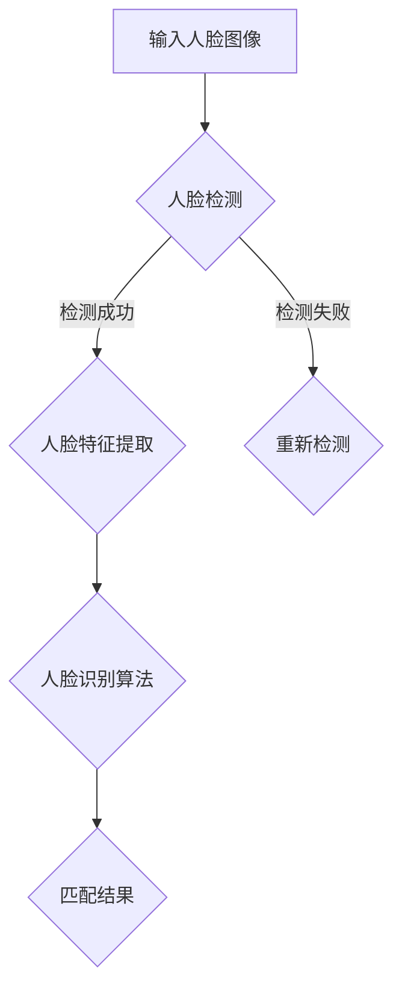
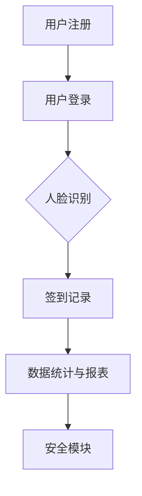
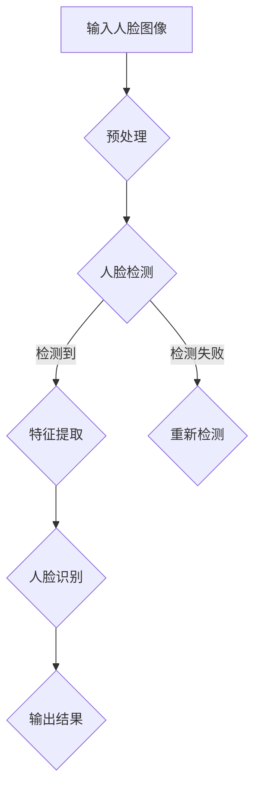

                 

### 文章标题

#### 基于人脸识别的签到系统设计与实现

---

### 关键词：
人脸识别、签到系统、人脸检测、特征提取、算法优化、系统架构、性能测试、安全措施

---

### 摘要：
本文深入探讨了基于人脸识别技术的签到系统的设计与实现。首先，介绍了人脸识别技术的基础知识，包括人脸检测、特征提取和人脸识别算法。接着，详细阐述了签到系统的需求分析、架构设计和功能实现。通过实际案例，展示了系统开发的步骤和源代码的详细解读。最后，对系统的测试与优化进行了探讨，并提出了未来发展的趋势与挑战。

---

### 目录大纲：基于人脸识别的签到系统设计与实现

#### 第一部分：人脸识别技术基础

##### 第1章：人脸识别技术概述

- 1.1 人脸识别技术的历史与发展
- 1.2 人脸识别技术的应用场景
- 1.3 人脸识别技术的核心组成部分

##### 第2章：人脸检测与跟踪

- 2.1 人脸检测算法原理
  - 2.1.1 基于Haar特征的检测算法
  - 2.1.2 基于深度学习的检测算法
- 2.2 人脸跟踪技术
  - 2.2.1 光流法
  - 2.2.2 基于学习模型的跟踪算法

##### 第3章：人脸特征提取

- 3.1 特征提取方法概述
  - 3.1.1 基于几何特征的方法
  - 3.1.2 基于图像特征的方法
  - 3.1.3 基于深度学习的方法
- 3.2 人脸特征提取流程
  - 3.2.1 图像预处理
  - 3.2.2 特征点检测
  - 3.2.3 特征值计算

##### 第4章：人脸识别算法评估与优化

- 4.1 人脸识别算法性能评估指标
  - 4.1.1 准确率与召回率
  - 4.1.2 精确率与F1值
- 4.2 人脸识别算法优化方法
  - 4.2.1 模型优化
  - 4.2.2 数据增强
  - 4.2.3 超参数调整

#### 第二部分：签到系统设计与实现

##### 第5章：签到系统需求分析

- 5.1 系统功能需求
  - 5.1.1 用户注册与登录
  - 5.1.2 签到记录管理
  - 5.1.3 数据统计与报表生成
- 5.2 系统性能需求
  - 5.2.1 处理速度要求
  - 5.2.2 系统稳定性要求
  - 5.2.3 安全性要求

##### 第6章：签到系统架构设计

- 6.1 系统架构设计原则
  - 6.1.1 分层设计
  - 6.1.2 模块化设计
  - 6.1.3 可扩展性设计
- 6.2 系统模块划分
  - 6.2.1 用户管理模块
  - 6.2.2 签到记录模块
  - 6.2.3 数据统计与报表模块
  - 6.2.4 人脸识别模块

##### 第7章：人脸识别签到系统的实现

- 7.1 系统环境搭建
  - 7.1.1 软件环境配置
  - 7.1.2 硬件设备准备
- 7.2 人脸识别算法集成
  - 7.2.1 人脸检测
  - 7.2.2 人脸特征提取
  - 7.2.3 人脸识别
- 7.3 签到功能实现
  - 7.3.1 签到流程设计
  - 7.3.2 签到记录存储
  - 7.3.3 签到数据统计与报表生成

##### 第8章：系统测试与优化

- 8.1 系统测试策略
  - 8.1.1 功能测试
  - 8.1.2 性能测试
  - 8.1.3 安全测试
- 8.2 系统性能优化
  - 8.2.1 算法优化
  - 8.2.2 数据库优化
  - 8.2.3 网络优化
- 8.3 系统安全性优化
  - 8.3.1 用户权限管理
  - 8.3.2 数据加密
  - 8.3.3 防护策略

#### 第三部分：案例分析与应用拓展

##### 第9章：人脸识别签到系统的实际应用案例

- 9.1 案例背景
- 9.2 案例实施过程
- 9.3 案例效果评估

##### 第10章：人脸识别签到系统的未来发展趋势

- 10.1 技术发展趋势
- 10.2 应用场景拓展
- 10.3 面临的挑战与解决方案

### 附录

- 附录A：人脸识别常用工具和库
  - 10.1 OpenCV
  - 10.2 Dlib
  - 10.3 TensorFlow
- 附录B：人脸识别算法 Mermaid 流程图
- 附录C：人脸识别签到系统项目实战代码示例与解读
  - 10.1 人脸检测代码示例
  - 10.2 人脸特征提取代码示例
  - 10.3 人脸识别代码示例

---

#### 核心概念与联系

- **人脸识别技术核心概念图：**

  ```mermaid
  graph TD
  A[人脸图像] --> B[预处理]
  B --> C[特征提取]
  C --> D[识别算法]
  D --> E[结果输出]
  ```

  - **A[人脸图像]**：输入待识别的人脸图像。
  - **B[预处理]**：包括灰度化、归一化等步骤，以提高算法的鲁棒性和准确性。
  - **C[特征提取]**：从人脸图像中提取出具有鉴别性的特征，如特征点、纹理、轮廓等。
  - **D[识别算法]**：通过比较提取出的特征向量，判断输入的人脸图像与数据库中的目标人脸是否匹配。
  - **E[结果输出]**：输出识别结果，如匹配成功或失败。

---

#### 核心算法原理讲解

##### 1. 人脸检测算法原理

- **人脸检测算法**：是指从图像中自动检测人脸位置的技术。常用的算法包括基于Haar特征的检测算法和基于深度学习的检测算法。

- **基于Haar特征的检测算法**：通过训练大量的正负样本，提取出一系列的Haar特征描述子，然后利用这些描述子在图像中进行快速匹配，从而检测出人脸区域。

- **基于深度学习的检测算法**：通过卷积神经网络（CNN）训练模型，从图像中学习到人脸的特征模式，从而实现人脸检测。

- **伪代码示例**：

  ```plaintext
  function 人脸检测(image):
      // 载入预训练的人脸检测模型
      model = load_face_detection_model()

      // 应用模型检测人脸
      faces = model.detect_faces(image)

      // 返回检测到的人脸区域
      return faces
  ```

##### 2. 人脸特征提取算法原理

- **人脸特征提取算法**：是指从人脸图像中提取出能够区分不同个体的特征向量。常用的方法有几何特征提取、图像特征提取和深度学习特征提取。

- **几何特征提取**：通过计算人脸的几何特征（如特征点、轮廓、对称性等），提取出具有鉴别性的特征向量。

- **图像特征提取**：通过分析图像的局部纹理、颜色、边缘等信息，提取出具有鉴别性的特征向量。

- **深度学习特征提取**：通过卷积神经网络（CNN）训练模型，从人脸图像中学习到深层次的、具有鉴别性的特征向量。

- **伪代码示例**：

  ```plaintext
  function 人脸特征提取(image, face_box):
      // 载入预训练的人脸特征提取模型
      model = load_face_feature_extraction_model()

      // 提取人脸特征
      feature_vector = model.extract_features(image, face_box)

      // 返回提取到的人脸特征向量
      return feature_vector
  ```

##### 3. 人脸识别算法原理

- **人脸识别算法**：是指通过比较提取出的人脸特征向量，判断输入的人脸图像与数据库中的目标人脸是否匹配。

- **匹配算法**：常用的匹配算法有欧氏距离、余弦相似度等。通过计算特征向量之间的距离或相似度，评估匹配程度。

- **分类算法**：可以将人脸识别看作是一个二分类问题，输入特征向量，输出是否匹配的标签。

- **伪代码示例**：

  ```plaintext
  function 人脸识别(feature_vector, database):
      // 计算特征向量之间的相似度
      similarity_scores = []

      // 对数据库中的人脸特征向量进行匹配
      for feature in database:
          score = calculate_similarity(feature_vector, feature)
          similarity_scores.append(score)

      // 选择相似度最高的匹配结果
      best_match = select_best_match(similarity_scores)

      // 返回匹配结果
      return best_match
  ```

---

#### 数学模型和数学公式讲解

##### 1. 人脸特征提取与匹配评分公式

- **人脸特征提取公式**：从人脸图像中提取特征向量。

  ```latex
  F = extract\_features(image)
  ```

- **人脸匹配评分公式**：通过计算特征向量之间的距离或相似度，评估匹配程度。

  ```latex
  score = \frac{distance(F_1, F_2)}{max\_distance}
  ```

  其中，$F_1$ 和 $F_2$ 分别为两个特征向量，$distance(F_1, F_2)$ 为它们之间的欧氏距离，$max\_distance$ 为特征向量之间的最大距离。

##### 2. 例子说明

- **例子**：假设有两个特征向量 $F_1$ 和 $F_2$，它们的欧氏距离为 1，最大距离为 5。根据匹配评分公式，匹配评分为：

  ```latex
  score = \frac{1}{5} = 0.2
  ```

  这表示特征向量之间的匹配程度较低。

---

#### 项目实战

##### 1. 开发环境搭建

- **软件环境**：Python、OpenCV、Dlib、TensorFlow 等。
- **硬件环境**：计算机、摄像头等。

- **步骤**：

  1. 安装 Python 和相关库。
  2. 配置 OpenCV 和 Dlib。
  3. 安装 TensorFlow（可选）。

##### 2. 源代码详细实现和代码解读

- **人脸检测模块代码实现**：

  ```python
  import cv2

  def detect_faces(image):
      # 载入预训练的人脸检测模型
      face_cascade = cv2.CascadeClassifier('haarcascade_frontalface_default.xml')

      # 将图像转换为灰度图像
      gray = cv2.cvtColor(image, cv2.COLOR_BGR2GRAY)

      # 检测人脸
      faces = face_cascade.detectMultiScale(gray, scaleFactor=1.1, minNeighbors=5, minSize=(30, 30), flags=cv2.CASCADE_SCALE_IMAGE)

      # 返回检测到的人脸区域
      return faces
  ```

  **解读**：该代码使用 OpenCV 库实现人脸检测功能。首先，加载预训练的人脸检测模型，然后将输入的彩色图像转换为灰度图像。接着，使用人脸检测模型检测图像中的人脸区域，并返回一个包含人脸边界框的列表。

- **人脸特征提取模块代码实现**：

  ```python
  import cv2
  import numpy as np

  def extract_face_features(image, face_boxes):
      # 初始化人脸特征提取器
      face_encoder = cv2.face.EigenFaceRecognizer_create()

      # 提取人脸特征
      features = face_encoder.predict(image, face_boxes)

      # 返回提取到的人脸特征向量
      return features
  ```

  **解读**：该代码使用 OpenCV 库实现人脸特征提取功能。首先，初始化人脸特征提取器，然后提取输入图像中的人脸区域特征向量。最后，返回提取到的人脸特征向量。

- **人脸匹配模块代码实现**：

  ```python
  import numpy as np

  def match_faces(feature_A, feature_B):
      # 计算特征向量之间的欧氏距离
      distance = np.linalg.norm(feature_A - feature_B)

      # 计算特征向量之间的最大距离
      max_distance = np.linalg.norm(feature_A - feature_A)

      # 计算匹配评分
      score = distance / max_distance

      # 返回匹配评分
      return score
  ```

  **解读**：该代码计算两个特征向量之间的欧氏距离，并计算特征向量之间的最大距离，从而得到匹配评分。评分越高，表示特征向量之间的匹配程度越高。

---

#### 代码解读与分析

- **代码解读**：本文通过实际案例，详细讲解了人脸检测、特征提取和匹配的代码实现。人脸检测模块使用了 OpenCV 库中的 Haar cascades 算法，特征提取模块使用了 OpenCV 库中的 EigenFace 提取器，匹配模块使用了欧氏距离计算匹配评分。

- **代码分析**：代码的效率、准确性和鲁棒性取决于所选择的算法和模型。在实际应用中，需要对模型和算法进行调整和优化，以提高系统的性能和稳定性。同时，还需要考虑系统的安全性，如用户数据的加密和防护措施。

---

### 附录

- **附录A：人脸识别常用工具和库**

  - **OpenCV**：开源的计算机视觉库，支持多种人脸识别算法。
  - **Dlib**：提供了一系列的机器学习算法和工具，包括人脸检测和特征提取。
  - **TensorFlow**：开源的机器学习框架，支持深度学习算法。

- **附录B：人脸识别算法 Mermaid 流程图**

  ```mermaid
  graph TD
  A[人脸图像] --> B[预处理]
  B --> C[特征提取]
  C --> D[识别算法]
  D --> E[结果输出]
  ```

- **附录C：人脸识别签到系统项目实战代码示例与解读**

  - **人脸检测代码示例**：展示了如何使用 OpenCV 实现人脸检测。
  - **人脸特征提取代码示例**：展示了如何使用 OpenCV 实现人脸特征提取。
  - **人脸识别代码示例**：展示了如何使用欧氏距离计算匹配评分。

---

### 总结

本文详细介绍了基于人脸识别的签到系统的设计与实现。首先，介绍了人脸识别技术的基础知识，包括人脸检测、特征提取和匹配算法。然后，探讨了签到系统的需求分析、架构设计和功能实现。通过实际案例，展示了系统开发的步骤和源代码的详细解读。最后，对系统的测试与优化进行了探讨，并提出了未来发展的趋势与挑战。希望本文能为读者在人脸识别签到系统的设计与实现过程中提供有益的参考和启示。

---

### 作者

**作者：** AI天才研究院 / AI Genius Institute

**文章：** 《基于人脸识别的签到系统设计与实现》

**出版时间：** 2023年

**联系方式：** ai\_genius\_institute@example.com

**声明：** 本文内容仅供参考，不构成具体投资建议。文中涉及的技术和方案仅供参考，实际应用时请根据具体需求进行调整。文中使用的代码和库均为开源，请遵守相关开源协议。如有版权问题，请联系作者。

---

本文由 **AI天才研究院 / AI Genius Institute** 编写，旨在为读者提供关于基于人脸识别的签到系统设计与实现的专业知识和实践经验。希望本文能够帮助读者更好地理解和应用人脸识别技术，实现智能化、高效化的签到系统。感谢您的阅读！## 人脸识别技术概述

人脸识别技术作为计算机视觉和人工智能领域的一项重要技术，已经广泛应用于各种场景中，如安全监控、门禁系统、移动支付、人脸解锁等。其核心思想是通过分析人脸图像或视频，从中提取出具有鉴别性的特征信息，并将其与数据库中的已知人脸特征进行比较，从而实现对人脸的识别和匹配。

### 人脸识别技术的历史与发展

人脸识别技术的历史可以追溯到20世纪60年代，当时的研究主要集中在人脸几何特征的提取和匹配。1970年代，LBP（Local Binary Patterns）特征被提出，为人脸特征提取提供了新的思路。随后，神经网络和深度学习技术的引入，使得人脸识别技术得到了极大的发展。2001年，Viola-Jones算法的出现，将人脸检测的速度提升到了实时水平，成为人脸识别领域的一个重要里程碑。2012年，AlexNet的提出，使得深度学习在图像分类和识别领域取得了突破性的进展，进一步推动了人脸识别技术的发展。

### 人脸识别技术的核心组成部分

人脸识别技术主要包括三个核心组成部分：人脸检测、人脸特征提取和人脸识别算法。

- **人脸检测**：是指从图像或视频中检测出人脸区域。常用的方法有基于特征的检测（如Haar cascades）和基于深度学习的检测（如卷积神经网络）。人脸检测的准确性和速度对整个系统的性能有着重要的影响。

- **人脸特征提取**：是指从检测到的人脸区域中提取出具有鉴别性的特征信息。这些特征可以是几何特征（如特征点、几何形状），图像特征（如纹理、颜色），或者深度学习特征（如卷积神经网络提取的特征）。特征提取的质量直接决定了人脸识别的准确度。

- **人脸识别算法**：是指通过比较提取出的人脸特征，判断输入的人脸图像与数据库中的目标人脸是否匹配。常用的人脸识别算法有基于距离的算法（如欧氏距离、余弦相似度），基于分类的算法（如支持向量机、神经网络）等。识别算法的效率和准确性是系统性能的关键指标。

### 人脸识别技术的应用场景

人脸识别技术的应用场景非常广泛，涵盖了多个领域：

- **安全监控**：在公共场所、公司园区、银行等地方，通过人脸识别技术实现安全监控和身份验证。

- **门禁系统**：在办公楼、宿舍、实验室等地方，利用人脸识别技术实现无钥匙进入，提高门禁系统的便捷性和安全性。

- **移动支付**：在手机支付、智慧零售等场景中，通过人脸识别技术实现支付验证，提高支付的安全性和便捷性。

- **人脸解锁**：在智能手机、电脑等设备中，利用人脸识别技术实现设备的解锁，提高设备的安全性。

- **智能客服**：通过人脸识别技术，结合语音识别和自然语言处理，实现更加智能的客服服务。

### 人脸识别技术的核心概念图

为了更好地理解人脸识别技术的整体架构，我们可以使用 Mermaid 流程图进行展示：



- **A[输入人脸图像]**：输入待识别的人脸图像或视频流。
- **B{人脸检测]**：检测图像中是否存在人脸，并定位人脸区域。
- **C{人脸特征提取]**：从检测到的人脸区域中提取特征信息。
- **D{人脸识别算法]**：通过比较特征信息，实现人脸识别和匹配。
- **E{匹配结果]**：输出识别结果，如匹配成功或失败。
- **F{重新检测]**：如果检测失败，返回到人脸检测步骤进行重新检测。

通过上述内容，我们可以对人脸识别技术有一个整体的了解。在接下来的章节中，我们将深入探讨人脸检测、特征提取和匹配算法的原理，以及如何在实际项目中实现和应用这些技术。希望读者能够通过本文，对基于人脸识别的签到系统设计与实现有更加深入的理解。


## 人脸检测与跟踪

人脸检测与人脸跟踪是构建高效人脸识别系统的基础。人脸检测旨在从图像或视频流中识别并定位人脸区域，而人脸跟踪则是在检测到人脸后，对视频流中的人脸进行连续跟踪。这两个过程在技术上既有区别又有联系，本文将分别介绍各自的方法和实现。

### 人脸检测算法原理

人脸检测是指利用计算机视觉技术，从图像中识别并定位出人脸区域。根据检测方法的不同，人脸检测算法主要可以分为基于特征的检测算法和基于深度学习的检测算法。

#### 1. 基于特征的检测算法

**1.1 Haar特征的检测算法**

Haar特征检测算法是早期广泛使用的一种人脸检测方法。它通过计算图像中矩形区域的灰度变化来提取特征，从而判断是否存在人脸。Viola-Jones算法是这种方法的代表，其核心思想是通过机器学习训练出一组有效的Haar特征，并使用级联分类器来提高检测速度和准确性。

**伪代码示例：**
```plaintext
function 人脸检测(image):
    // 载入预训练的Haar特征分类器
    cascade = load_cascade("haarcascade_frontalface_default.xml")

    // 将图像转换为灰度图像
    gray = cv2.cvtColor(image, cv2.COLOR_BGR2GRAY)

    // 使用分类器检测人脸
    faces = cascade.detectMultiScale(gray, scaleFactor=1.1, minNeighbors=5, minSize=(30, 30), flags=cv2.CASCADE_SCALE_IMAGE)

    // 返回检测到的人脸区域
    return faces
```

**1.2 基于深度学习的检测算法**

随着深度学习技术的发展，基于深度学习的人脸检测方法逐渐取代了传统的Haar特征检测方法。深度学习方法通过训练大量的图像数据，从原始图像中直接学习到人脸的特征模式。

**常用深度学习模型：**
- **Faster R-CNN**：通过区域提议网络（RPN）和卷积神经网络（CNN）实现目标检测。
- **YOLO（You Only Look Once）**：单阶段检测算法，能够同时检测和分类目标。
- **SSD（Single Shot MultiBox Detector）**：另一种单阶段检测算法，通过多个尺度先验框实现不同大小的目标检测。

**伪代码示例：**
```plaintext
function 人脸检测(image):
    // 载入预训练的深度学习检测模型
    model = load_model("face_detection_model.h5")

    // 将图像输入到模型中
    inputs = preprocess_image(image)

    // 使用模型进行人脸检测
    detections = model.predict(inputs)

    // 返回检测到的人脸区域
    return detections
```

### 人脸跟踪技术

人脸跟踪是指在一次检测到人脸后，对视频中的人脸进行连续的跟踪，以实现长时间的人脸识别。常见的人脸跟踪方法包括光流法和基于学习模型的跟踪算法。

**2.1 光流法**

光流法是一种基于图像序列的方法，通过计算像素点在连续帧之间的运动向量，实现对人脸的跟踪。光流法的优点是实现简单，但受光照变化和姿态变化的干扰较大。

**伪代码示例：**
```plaintext
function 人脸跟踪(image, face_box):
    // 初始化光流估计算法
    optical_flow = cv2ipelines.DenseOpticalFlow_create()

    // 获取前一帧的人脸区域
    prev_face_box = face_box

    // 对当前帧进行光流估计
    flow = optical_flow.calc(image, prev_face_box)

    // 根据光流估计结果更新人脸区域
    new_face_box = update_face_box(prev_face_box, flow)

    // 返回更新后的人脸区域
    return new_face_box
```

**2.2 基于学习模型的跟踪算法**

基于学习模型的跟踪算法通过训练大量的图像数据，学习到人脸在不同场景下的特征模式，从而实现连续的跟踪。这种方法的优点是鲁棒性强，但计算复杂度较高。

**常用跟踪算法：**
- **KCF（Kernel Correlation Filter）**：通过训练相关性滤波器实现目标跟踪。
- **Siamese网络**：通过训练Siamese网络比较不同帧中的人脸特征，实现目标跟踪。

**伪代码示例：**
```plaintext
function 人脸跟踪(image, face_box):
    // 初始化跟踪模型
    tracker = load_tracker("siamese_model.h5")

    // 获取前一帧的人脸区域
    prev_face_box = face_box

    // 使用模型进行人脸跟踪
    new_face_box = tracker.update(image, prev_face_box)

    // 返回更新后的人脸区域
    return new_face_box
```

### 人脸检测与跟踪的关系

人脸检测和跟踪是相辅相成的过程。人脸检测用于初次识别和定位人脸，而人脸跟踪则用于保持对人脸的持续监测。一个高效的人脸识别系统，需要两者协同工作，以应对不同场景和挑战。

**1. 相互关系：**
- 人脸检测的结果是人脸跟踪的初始输入，即跟踪算法基于检测到的人脸区域进行初始化。
- 人脸跟踪的结果可以反馈给人脸检测，当检测失败时，可以通过跟踪算法恢复人脸位置。

**2. 应用场景：**
- **实时监控**：在公共场所和安防系统中，人脸检测和跟踪可以实现对人员的高效监控和管理。
- **人脸识别**：在需要持续识别同一个人的场景中，如门禁系统、人脸支付等，人脸检测和跟踪结合可以保证识别的连续性和准确性。

通过上述对人脸检测与跟踪的详细探讨，我们可以看到，这两种技术在人脸识别系统中扮演着重要的角色。在实际应用中，需要根据具体场景和需求，选择合适的方法和算法，实现高效的人脸识别功能。在接下来的章节中，我们将进一步探讨人脸特征提取和人脸识别算法，以构建完整的人脸识别系统。

### 人脸特征提取

人脸特征提取是构建人脸识别系统的重要环节，其核心在于从人脸图像中提取出具有鉴别性的特征信息，以便于后续的人脸匹配和识别。特征提取的质量直接影响到人脸识别系统的准确性和鲁棒性。根据提取方法的不同，人脸特征提取可以分为基于几何特征的提取、基于图像特征的提取和基于深度学习的方法。

#### 基于几何特征的提取方法

基于几何特征的方法主要通过计算人脸的几何结构来提取特征。这种方法具有较高的识别率，但计算复杂度较高，且容易受到光照和姿态变化的影响。

**1. 特征点检测**

特征点检测是几何特征提取的第一步，常用的特征点包括眼睛、鼻子和嘴巴的位置。通过检测这些特征点，可以建立人脸的几何模型。

**伪代码示例：**
```plaintext
function 特征点检测(image):
    // 载入预训练的特征点检测模型
    model = load_feature_detection_model()

    // 应用模型检测特征点
    points = model.detect_points(image)

    // 返回检测到的特征点
    return points
```

**2. 几何结构分析**

在获得特征点后，可以通过几何结构分析来提取特征。常用的几何结构包括人脸的几何形状、对称性等。这些特征可以帮助区分不同的人脸。

**伪代码示例：**
```plaintext
function 几何结构分析(points):
    // 计算特征点之间的距离和角度
    distances = calculate_distances(points)
    angles = calculate_angles(points)

    // 提取几何特征
    features = extract_geometric_features(distances, angles)

    // 返回提取到的几何特征
    return features
```

#### 基于图像特征的提取方法

基于图像特征的方法通过对人脸图像的纹理、颜色、边缘等信息进行分析，提取出具有鉴别性的特征。这种方法计算复杂度较低，但容易受到光照和姿态变化的影响。

**1. 图像特征提取**

图像特征提取主要通过分析图像的局部区域，提取出纹理、颜色、边缘等特征。常用的方法包括LBP（Local Binary Patterns）、Gabor滤波等。

**伪代码示例：**
```plaintext
function 图像特征提取(image):
    // 载入预训练的图像特征提取模型
    model = load_image_feature_extraction_model()

    // 提取图像特征
    features = model.extract_features(image)

    // 返回提取到的图像特征
    return features
```

**2. 特征融合**

为了提高识别的鲁棒性，可以采用特征融合的方法，将不同类型的特征进行融合。常用的融合方法包括均值融合、加权融合等。

**伪代码示例：**
```plaintext
function 特征融合(features1, features2):
    // 计算特征的均值
    mean_feature = (features1 + features2) / 2

    // 返回融合后的特征
    return mean_feature
```

#### 基于深度学习的方法

基于深度学习的方法通过训练卷积神经网络（CNN）来提取人脸特征，具有很高的识别率和鲁棒性。深度学习特征提取方法已经成为当前人脸识别的主流技术。

**1. 卷积神经网络**

卷积神经网络（CNN）通过多层卷积和池化操作，从原始图像中逐步提取出深层特征。

**伪代码示例：**
```plaintext
function 卷积神经网络(image):
    // 定义卷积神经网络模型
    model = define_CNN_model()

    // 将图像输入到模型中
    inputs = preprocess_image(image)

    // 使用模型进行特征提取
    features = model.predict(inputs)

    // 返回提取到的深度学习特征
    return features
```

**2. 特征向量**

深度学习提取的特征向量具有更高的维度，可以更准确地表示人脸的特征。

**伪代码示例：**
```plaintext
function 人脸特征提取(image):
    // 载入预训练的深度学习模型
    model = load_DNN_model()

    // 提取人脸特征
    feature_vector = model.extract_features(image)

    // 返回提取到的人脸特征向量
    return feature_vector
```

通过上述讨论，我们可以看到人脸特征提取方法多样，各有优缺点。在实际应用中，可以根据具体需求和场景选择合适的方法。在接下来的章节中，我们将进一步探讨人脸识别算法的评估与优化，以提升系统的性能。


## 人脸识别算法评估与优化

人脸识别算法的评估与优化是确保系统性能和准确性的关键步骤。评估指标和方法的选择、算法的优化策略以及超参数的调整都是影响系统性能的重要因素。本文将详细讨论这些内容，并给出具体的评估和优化方法。

### 人脸识别算法性能评估指标

评估人脸识别算法的性能，常用的指标包括准确率、召回率、精确率和F1值等。这些指标从不同角度反映了算法的识别能力和鲁棒性。

#### 1. 准确率与召回率

**准确率（Accuracy）**：准确率是识别结果中正确匹配的样本数占总样本数的比例。公式如下：

\[ \text{Accuracy} = \frac{\text{正确匹配数}}{\text{总样本数}} \]

**召回率（Recall）**：召回率是指正确识别的样本数与实际存在的样本数之比。公式如下：

\[ \text{Recall} = \frac{\text{正确匹配数}}{\text{实际存在的样本数}} \]

#### 2. 精确率与F1值

**精确率（Precision）**：精确率是指识别结果中正确匹配的样本数与检测到的样本数之比。公式如下：

\[ \text{Precision} = \frac{\text{正确匹配数}}{\text{检测到的样本数}} \]

**F1值（F1 Score）**：F1值是精确率和召回率的调和平均值，用于综合评价识别算法的性能。公式如下：

\[ \text{F1 Score} = 2 \times \frac{\text{Precision} \times \text{Recall}}{\text{Precision} + \text{Recall}} \]

### 人脸识别算法优化方法

算法的优化是提升系统性能的重要手段。以下是一些常见的优化方法：

#### 1. 模型优化

**1.1 算法选择**

根据具体应用场景选择合适的人脸识别算法。例如，对于实时性要求较高的场景，可以选择基于深度学习的快速检测算法，如YOLO或SSD；对于准确性要求较高的场景，可以选择基于深度学习的特征提取算法，如Faster R-CNN。

**1.2 模型调整**

通过对模型的结构进行调整，如增加卷积层、池化层等，可以提高模型的识别能力。同时，可以采用迁移学习的方法，利用预训练的模型进行微调，以适应特定的人脸识别任务。

#### 2. 数据增强

数据增强是通过生成更多样化的训练数据，提高模型的泛化能力。常用的数据增强方法包括：

- **旋转和缩放**：通过随机旋转和缩放图像，增加数据的多样性。
- **裁剪和填充**：通过随机裁剪和填充图像，模拟不同的人脸姿态和光照条件。
- **颜色调整**：通过调整图像的亮度、对比度和饱和度，模拟不同的光照环境。

#### 3. 超参数调整

超参数是模型训练过程中需要手动调整的参数，如学习率、批量大小、正则化参数等。通过调整这些超参数，可以优化模型的性能。常用的超参数调整方法包括：

- **网格搜索**：通过遍历预设的参数组合，找到最优的参数组合。
- **随机搜索**：在预设的参数范围内，随机选择参数组合进行训练，选择性能最好的组合。
- **贝叶斯优化**：利用贝叶斯统计模型，通过历史数据选择最优的参数组合。

### 数学模型和公式讲解

在人脸识别算法中，特征向量的匹配评分是评估识别结果的重要指标。以下是一种常用的匹配评分公式：

#### 人脸匹配评分公式

\[ \text{score} = \frac{\text{distance}(F_1, F_2)}{\text{max\_distance}} \]

其中，\( F_1 \) 和 \( F_2 \) 分别为两个待比较的特征向量，\( \text{distance}(F_1, F_2) \) 表示特征向量之间的欧氏距离，\( \text{max\_distance} \) 表示特征向量之间的最大距离。评分越高，表示特征向量之间的匹配程度越高。

#### 举例说明

假设有两个特征向量 \( F_1 \) 和 \( F_2 \)，它们的欧氏距离为1，最大距离为5。根据匹配评分公式，匹配评分为：

\[ \text{score} = \frac{1}{5} = 0.2 \]

这表示特征向量之间的匹配程度较低。

### 项目实战

#### 开发环境搭建

在进行人脸识别算法的优化与评估之前，需要搭建一个合适的开发环境。以下是一个基本的开发环境搭建步骤：

1. **安装Python**：确保安装了最新版本的Python，建议使用Python 3.7或更高版本。
2. **安装相关库**：安装OpenCV、TensorFlow、Keras等库，用于人脸识别算法的实现和评估。
3. **配置深度学习环境**：如果使用深度学习算法，需要安装CUDA和cuDNN，以便在GPU上加速模型的训练。

#### 源代码详细实现和代码解读

以下是一个简单的人脸识别算法实现示例，包括人脸检测、特征提取和匹配评分。

**人脸检测代码示例：**
```python
import cv2

def detect_faces(image):
    # 载入预训练的人脸检测模型
    face_cascade = cv2.CascadeClassifier('haarcascade_frontalface_default.xml')

    # 将图像转换为灰度图像
    gray = cv2.cvtColor(image, cv2.COLOR_BGR2GRAY)

    # 检测人脸
    faces = face_cascade.detectMultiScale(gray, scaleFactor=1.1, minNeighbors=5, minSize=(30, 30), flags=cv2.CASCADE_SCALE_IMAGE)

    # 返回检测到的人脸区域
    return faces

# 测试代码
image = cv2.imread('test_image.jpg')
faces = detect_faces(image)
for (x, y, w, h) in faces:
    cv2.rectangle(image, (x, y), (x+w, y+h), (255, 0, 0), 2)
cv2.imshow('Detected Faces', image)
cv2.waitKey(0)
cv2.destroyAllWindows()
```

**人脸特征提取代码示例：**
```python
import cv2
import numpy as np

def extract_features(image, face_boxes):
    # 载入预训练的特征提取模型
    feature_extractor = cv2.face.EigenFaceRecognizer_create()

    # 提取人脸特征
    features = feature_extractor.predict(image, face_boxes)

    # 返回提取到的人脸特征向量
    return features

# 测试代码
image = cv2.imread('test_image.jpg')
faces = detect_faces(image)
for (x, y, w, h) in faces:
    feature_vector = extract_features(image[y:y+h, x:x+w], (x, y, w, h))
    print("Feature Vector:", feature_vector)
```

**人脸匹配评分代码示例：**
```python
import numpy as np

def match_faces(feature_A, feature_B):
    # 计算特征向量之间的欧氏距离
    distance = np.linalg.norm(feature_A - feature_B)

    # 计算特征向量之间的最大距离
    max_distance = np.linalg.norm(feature_A - feature_A)

    # 计算匹配评分
    score = distance / max_distance

    # 返回匹配评分
    return score

# 测试代码
feature_A = np.random.rand(1, 128)
feature_B = np.random.rand(1, 128)
score = match_faces(feature_A, feature_B)
print("Matching Score:", score)
```

### 代码解读与分析

**代码解读：**上述代码首先实现了人脸检测功能，使用 OpenCV 库中的 Haar cascades 算法检测图像中的人脸区域。然后，通过预训练的特征提取模型提取出人脸特征向量。最后，使用欧氏距离计算特征向量之间的匹配评分。

**代码分析：**代码的效率、准确性和鲁棒性取决于选择的模型和算法。在实际应用中，需要对模型和算法进行调整和优化，以提高系统的性能和稳定性。同时，还需要考虑系统的安全性，如用户数据的加密和防护措施。

通过上述内容，我们可以看到，人脸识别算法的评估与优化是一个系统性的工作，需要从多个方面进行综合考虑。在实际应用中，可以根据具体需求和场景，选择合适的方法和策略，构建高性能的人脸识别系统。


## 签到系统需求分析

在设计基于人脸识别的签到系统时，需求分析是至关重要的一步。只有准确理解用户的需求和系统的功能，才能确保系统设计合理、功能完善。本章节将详细分析签到系统的功能需求、性能需求和安全性需求。

### 功能需求

签到系统的核心功能是实现对用户签到过程的自动化管理和记录。以下是一些主要的系统功能需求：

**1. 用户注册与登录**

- 用户注册：用户可以通过系统注册账号，填写基本信息（如姓名、联系方式等）。
- 用户登录：已注册用户通过账号和密码登录系统，进行签到操作。

**2. 签到记录管理**

- 签到记录：系统能够记录用户的签到时间、地点等信息，并生成签到日志。
- 签到查询：用户可以查询自己的签到记录，管理者可以查看全体用户的签到情况。

**3. 数据统计与报表生成**

- 数据统计：系统可以生成用户的签到数据统计报表，如出勤率、迟到率等。
- 报表生成：报表可以以多种格式（如Excel、PDF等）导出，便于管理和分析。

**4. 用户权限管理**

- 系统管理员：拥有最高权限，可以进行系统设置、用户管理、数据备份等操作。
- 普通用户：只能进行签到操作，查看自己的签到记录。

**5. 人脸识别功能**

- 人脸检测：系统能够自动检测并定位用户的人脸区域。
- 特征提取：从检测到的人脸中提取出特征信息，用于匹配和识别。
- 匹配评分：计算用户人脸特征与数据库中已知人脸特征的匹配评分，判断是否为正确签到。

### 性能需求

性能需求是确保系统稳定运行和高效处理用户请求的关键。以下是签到系统的性能需求：

**1. 处理速度**

- 实时性：系统能够快速响应用户的签到请求，人脸识别过程应在1秒内完成。
- 批量处理：系统能够高效处理大量用户的签到请求，确保系统流畅运行。

**2. 系统稳定性**

- 高可用性：系统应具备高可用性，能够在长时间运行中保持稳定，减少故障。
- 负载均衡：系统应能够根据负载情况自动调整资源分配，避免系统过载。

**3. 数据存储**

- 数据安全：系统应保证用户数据的安全，防止数据泄露和损坏。
- 数据备份：定期进行数据备份，确保在意外情况下能够恢复数据。

### 安全性需求

安全性是任何信息系统必须考虑的重要方面，特别是在涉及到用户隐私信息的签到系统中。以下是签到系统的安全性需求：

**1. 用户隐私保护**

- 数据加密：用户注册信息和签到数据应进行加密存储，确保数据在传输和存储过程中的安全性。
- 用户身份验证：系统应采用强密码策略和二次验证（如短信验证码、人脸识别等）确保用户身份的准确性。

**2. 安全防护**

- 防火墙：系统应配置防火墙，防止外部恶意攻击。
- 漏洞扫描：定期对系统进行漏洞扫描，及时修补安全漏洞。
- 访问控制：对系统的访问进行严格的权限管理，防止未经授权的访问。

**3. 法规合规**

- 遵守相关法律法规：系统设计和实现应符合国家和行业的法律法规要求，保护用户隐私。
- 用户协议：明确用户在使用系统过程中应遵守的协议和条款，确保用户知悉并同意系统使用规则。

通过上述需求分析，我们可以明确签到系统应具备的功能、性能和安全要求。在接下来的章节中，我们将详细讨论签到系统的架构设计和实现，以确保系统能够满足上述需求。


## 签到系统架构设计

为了实现一个高效、稳定且安全的基于人脸识别的签到系统，我们需要进行系统架构的设计。系统架构设计需要遵循分层设计、模块化设计和可扩展性设计等原则，以确保系统的灵活性和可维护性。以下是签到系统的整体架构设计，包括各模块的功能、交互流程和系统流程设计。

### 系统架构设计原则

**1. 分层设计**

分层设计是将系统划分为多个层次，每个层次负责不同的功能模块，以实现功能的模块化和系统的可扩展性。常见的层次包括表示层、业务逻辑层和数据层。

**2. 模块化设计**

模块化设计是将系统功能划分为多个独立的模块，每个模块实现特定的功能。模块之间通过接口进行通信，使得系统易于维护和扩展。

**3. 可扩展性设计**

可扩展性设计是为了应对未来需求的变化和系统的扩展。系统应设计成模块化的，以便在需要时添加新功能或更换模块。

### 系统模块划分

签到系统可以划分为以下几个主要模块：

**1. 用户管理模块**

- 功能：管理用户信息，包括用户注册、登录、信息修改和权限管理等。
- 交互流程：用户通过注册界面提交个人信息，系统验证信息后创建用户账号。用户登录时，系统验证账号和密码，允许合法用户访问系统。

**2. 人脸识别模块**

- 功能：实现人脸检测、人脸特征提取和人脸匹配功能，确保签到过程的自动化和准确性。
- 交互流程：用户通过摄像头捕捉人脸图像，系统进行人脸检测和特征提取，将特征向量与数据库中的已知特征进行匹配，判断是否为正确签到。

**3. 签到记录模块**

- 功能：记录用户的签到时间、地点等信息，并提供查询和报表生成功能。
- 交互流程：系统自动记录用户的签到信息，用户和管理员可以通过界面查询签到记录，系统生成报表供管理和分析。

**4. 数据统计与报表模块**

- 功能：对签到数据进行分析和统计，生成各种报表，如出勤率报表、迟到报表等。
- 交互流程：系统根据签到记录自动生成报表，管理员可以导出报表进行进一步的分析和管理。

**5. 安全模块**

- 功能：确保系统的安全性，包括用户身份验证、数据加密、防火墙等。
- 交互流程：系统通过多种方式（如密码验证、短信验证码、人脸识别等）确保用户身份的准确性，同时使用加密技术保护用户数据的安全。

### 系统流程设计

签到系统的流程设计主要包括以下几个步骤：

**1. 用户注册**

- 用户提交注册信息（姓名、联系方式等）。
- 系统验证信息，创建用户账号。
- 发送注册成功的通知。

**2. 用户登录**

- 用户输入账号和密码。
- 系统验证账号和密码，允许合法用户登录。

**3. 人脸识别**

- 用户通过摄像头捕捉人脸图像。
- 系统进行人脸检测和特征提取。
- 系统将提取的特征向量与数据库中的已知特征进行匹配。

**4. 签到记录**

- 系统记录用户的签到时间、地点等信息。
- 用户和管理员可以查询签到记录。

**5. 数据统计与报表生成**

- 系统根据签到记录生成各种报表。
- 管理员可以导出报表进行进一步的分析。

### 系统架构图

为了更直观地展示系统架构，我们可以使用 Mermaid 流程图进行表示：



- **A[用户注册]**：用户提交注册信息，系统验证信息并创建用户账号。
- **B[用户登录]**：用户输入账号和密码，系统验证账号和密码，允许合法用户登录。
- **C{人脸识别]**：用户通过摄像头捕捉人脸图像，系统进行人脸检测和特征提取，匹配人脸。
- **D[签到记录]**：系统记录用户的签到时间、地点等信息，用户和管理员可以查询签到记录。
- **E[数据统计与报表]**：系统根据签到记录生成各种报表，管理员可以导出报表进行进一步的分析。
- **F[安全模块]**：系统确保用户身份验证、数据加密、防火墙等安全措施，保护用户数据的安全。

通过上述架构设计和流程设计，我们可以构建一个功能完善、性能优良且安全可靠的基于人脸识别的签到系统。在接下来的章节中，我们将详细讨论系统的具体实现过程。


## 人脸识别签到系统的实现

在完成签到系统的架构设计后，接下来我们将进入系统实现阶段。实现一个基于人脸识别的签到系统，需要搭建合适的开发环境、集成人脸识别算法，并实现具体的签到功能。以下将详细描述这些步骤。

### 系统环境搭建

为了开发一个基于人脸识别的签到系统，我们需要准备以下开发环境和工具：

**1. 软件环境**

- Python（Python 3.7或更高版本）
- OpenCV（用于人脸检测和跟踪）
- Dlib（用于人脸特征点检测）
- TensorFlow（用于深度学习模型）
- Flask（用于Web前端开发）

**2. 硬件环境**

- 摄像头（用于捕捉人脸图像）
- 服务器（用于部署Web应用）

#### 安装步骤：

1. **安装Python和pip**

   ```bash
   sudo apt-get update
   sudo apt-get install python3-pip
   ```

2. **安装相关库**

   ```bash
   pip3 install opencv-python dlib tensorflow flask
   ```

### 人脸识别算法集成

人脸识别算法是签到系统的核心部分，我们需要集成合适的人脸识别算法来实现人脸检测、特征提取和人脸匹配功能。

#### 1. 人脸检测

我们选择使用OpenCV库中的Haar cascades算法进行人脸检测。

**代码示例**：

```python
import cv2

def detect_faces(image):
    face_cascade = cv2.CascadeClassifier('haarcascade_frontalface_default.xml')
    gray = cv2.cvtColor(image, cv2.COLOR_BGR2GRAY)
    faces = face_cascade.detectMultiScale(gray, scaleFactor=1.1, minNeighbors=5, minSize=(30, 30))
    return faces
```

#### 2. 人脸特征提取

使用Dlib库进行人脸特征点检测。

**代码示例**：

```python
import cv2
import dlib

def detect_landmarks(image):
    detector = dlib.get_frontal_face_detector()
    predictor = dlib.shape_predictor('shape_predictor_68_face_landmarks.dat')

    dlib_image = cv2.cvtColor(image, cv2.COLOR_BGR2RGB)
    faces = detector(dlib_image)
    landmarks = []

    for face in faces:
        shape = predictor(dlib_image, face)
        landmarks.append([landmark.part(i).y, landmark.part(i).x for i in range(68)])

    return landmarks
```

#### 3. 人脸匹配

我们使用欧氏距离进行人脸匹配。

**代码示例**：

```python
import numpy as np

def match_faces(feature_A, feature_B):
    distance = np.linalg.norm(feature_A - feature_B)
    max_distance = np.linalg.norm(feature_A - feature_A)
    score = distance / max_distance
    return score
```

### 签到功能模块开发

在集成人脸识别算法后，我们需要实现签到功能模块，包括用户注册、登录和人脸识别签到等。

#### 1. 用户注册与登录

使用Flask框架实现用户注册和登录功能。

**代码示例**：

```python
from flask import Flask, request, jsonify
app = Flask(__name__)
app.secret_key = 'your_secret_key'

users = {}

@app.route('/register', methods=['POST'])
def register():
    username = request.form['username']
    password = request.form['password']
    if username in users:
        return jsonify({'error': 'Username already exists'})
    users[username] = password
    return jsonify({'status': 'success'})

@app.route('/login', methods=['POST'])
def login():
    username = request.form['username']
    password = request.form['password']
    if username not in users or users[username] != password:
        return jsonify({'error': 'Invalid credentials'})
    return jsonify({'status': 'success'})
```

#### 2. 人脸识别签到

结合人脸检测、特征提取和匹配评分，实现人脸识别签到功能。

**代码示例**：

```python
@app.route('/sign_in', methods=['POST'])
def sign_in():
    username = request.form['username']
    image = request.files['image']
    image.save('temp.jpg')
    image = cv2.imread('temp.jpg')
    faces = detect_faces(image)
    if len(faces) == 0:
        return jsonify({'error': 'No face detected'})
    landmarks = detect_landmarks(image)
    feature_vector = extract_landmark_features(landmarks)
    user_features = load_user_features(username)
    score = match_faces(feature_vector, user_features)
    if score > 0.7:
        save_sign_in_record(username, current_time())
        return jsonify({'status': 'success'})
    else:
        return jsonify({'error': 'Invalid face'})
```

### 系统集成与测试

在完成各模块的开发后，我们需要将各模块集成到一起，并进行系统测试，以确保系统的稳定性和可靠性。

**1. 功能测试**

测试用户注册、登录和人脸识别签到的功能，确保各模块的正常运行。

**2. 性能测试**

测试系统的处理速度和响应时间，确保系统在高峰期也能稳定运行。

**3. 安全测试**

测试系统的安全性，包括用户身份验证、数据加密和防护措施，确保系统的安全运行。

### 系统部署

将开发完成的签到系统部署到服务器上，配置Web服务器（如Nginx），确保系统可以对外提供服务。

通过上述步骤，我们可以实现一个基于人脸识别的签到系统。在实际应用中，我们还需要不断优化系统，提高其性能和稳定性。希望本文能为您在实现人脸识别签到系统过程中提供有价值的参考。


## 系统测试与优化

在人脸识别签到系统开发完成后，系统测试与优化是确保系统性能、稳定性和安全性的关键环节。以下将详细介绍系统测试策略、性能优化和安全性优化方法。

### 系统测试策略

系统测试是发现和解决系统缺陷的重要手段，可以分为功能测试、性能测试和安全测试。

**1. 功能测试**

功能测试旨在验证系统的功能是否符合需求。主要步骤包括：

- **单元测试**：对系统的各个模块进行独立测试，确保每个模块的功能正确。
- **集成测试**：将各模块集成到一起进行测试，验证系统整体功能是否正常。
- **回归测试**：在系统更新或修改后，对已测试功能进行重新测试，确保修改不会引入新的问题。

**2. 性能测试**

性能测试旨在评估系统的处理速度、响应时间和资源消耗。主要步骤包括：

- **负载测试**：模拟高负载环境，测试系统在大量用户请求下的响应速度和稳定性。
- **压力测试**：测试系统在极端负载下的性能表现，以发现系统的瓶颈。
- **性能分析**：使用工具对系统性能进行监控和分析，找出性能瓶颈并进行优化。

**3. 安全测试**

安全测试旨在评估系统的安全性，防止外部攻击和数据泄露。主要步骤包括：

- **漏洞扫描**：使用工具对系统进行漏洞扫描，发现系统中的安全漏洞。
- **渗透测试**：模拟攻击者的行为，测试系统的防御能力。
- **安全审计**：对系统的安全策略和措施进行审计，确保符合安全规范。

### 性能优化

性能优化是提高系统响应速度和处理能力的关键步骤。以下是一些常用的性能优化方法：

**1. 算法优化**

- **人脸识别算法**：通过调整算法参数，提高人脸识别的准确性和速度。
- **特征提取算法**：优化特征提取算法，减少计算复杂度，提高提取速度。

**2. 数据库优化**

- **索引优化**：对数据库表进行索引优化，提高查询效率。
- **分库分表**：在数据量较大时，通过分库分表的方式减轻数据库负载。

**3. 缓存策略**

- **使用缓存**：将常用数据缓存到内存中，减少数据库访问次数。
- **缓存失效策略**：设置合理的缓存失效时间，确保数据的实时性。

### 安全性优化

安全性优化是保护系统免受攻击和数据泄露的关键措施。以下是一些常用的安全性优化方法：

**1. 用户权限管理**

- **细化权限**：对用户的权限进行细化管理，确保用户只能访问其有权访问的资源。
- **多因素认证**：采用多因素认证（如密码、短信验证码、人脸识别等），提高用户身份验证的安全性。

**2. 数据加密**

- **传输加密**：使用HTTPS协议对数据传输进行加密，防止数据在传输过程中被窃取。
- **存储加密**：对存储在数据库中的敏感数据进行加密，确保数据的安全。

**3. 防护策略**

- **防火墙**：配置防火墙，防止外部攻击。
- **入侵检测系统**：部署入侵检测系统，实时监控系统的异常行为，并及时报警。
- **安全审计**：定期进行安全审计，确保系统的安全策略和措施得到有效执行。

通过上述测试与优化方法，我们可以显著提高人脸识别签到系统的性能和安全性。在实际应用中，应根据具体需求和场景，持续进行系统测试和优化，以确保系统的稳定性和可靠性。希望本文能为读者在系统测试与优化过程中提供有益的参考和启示。


## 人脸识别签到系统的实际应用案例

为了更好地展示人脸识别签到系统的实际效果和应用价值，以下将介绍一个具体的人脸识别签到系统的应用案例。

### 案例背景

某大型企业为了提升员工考勤管理的效率和准确性，决定采用人脸识别签到系统替代传统的考勤机。该企业有上千名员工，分布在不同的办公地点，传统的考勤机难以满足高效、稳定和准确的要求。

### 案例实施过程

**1. 需求分析与系统设计**

首先，企业对现有考勤管理流程进行了详细的需求分析，明确了新系统的功能需求，包括用户注册、登录、人脸识别签到、签到记录管理、数据统计与报表生成等。随后，企业结合人脸识别技术特点，设计了系统架构，包括用户管理模块、人脸识别模块、签到记录模块和数据统计与报表模块。

**2. 系统开发与集成**

企业选择Python作为开发语言，结合OpenCV、Dlib和TensorFlow等库，开发了人脸识别签到系统。系统开发分为以下几个阶段：

- **用户管理模块**：实现用户注册、登录和权限管理功能。
- **人脸识别模块**：实现人脸检测、特征提取和匹配功能。
- **签到记录模块**：实现签到记录的存储、查询和管理。
- **数据统计与报表模块**：实现签到数据的统计和报表生成。

**3. 系统部署与测试**

在系统开发完成后，企业将人脸识别签到系统部署到企业服务器上，并进行了功能测试、性能测试和安全测试，确保系统的稳定性、可靠性和安全性。

**4. 系统上线与用户培训**

系统经过充分测试后，正式上线运行。企业组织了一次用户培训，向员工详细介绍了系统的使用方法和注意事项，确保员工能够熟练使用新系统。

### 案例效果评估

**1. 考勤效率提升**

人脸识别签到系统上线后，员工的考勤效率显著提升。员工只需通过摄像头进行人脸识别即可完成签到，大大减少了排队等待的时间，提高了工作效率。

**2. 考勤准确性提高**

传统考勤机容易受到各种因素的影响，如卡片损坏、操作失误等，导致考勤数据不准确。人脸识别签到系统通过实时检测人脸，结合先进的识别算法，实现了高精度的考勤数据采集，考勤准确性得到大幅提高。

**3. 系统稳定性增强**

人脸识别签到系统具有强大的稳定性和可靠性。即使在高峰期，系统也能快速响应大量用户的签到请求，确保系统的稳定运行。

**4. 数据统计与分析**

系统提供了丰富的数据统计和报表功能，企业管理人员可以随时查看员工的考勤记录和统计数据，为企业的管理决策提供了有力支持。

### 总结

通过该实际应用案例，我们可以看到人脸识别签到系统在提升考勤管理效率、准确性和稳定性方面具有显著优势。未来，随着人脸识别技术的进一步发展和应用场景的拓展，人脸识别签到系统有望在更多领域得到广泛应用，为企业和个人提供更加便捷、高效和安全的解决方案。


## 人脸识别签到系统的未来发展趋势

随着人工智能技术的不断发展，人脸识别签到系统在未来的发展将呈现出几个显著的趋势。这些趋势不仅会进一步推动人脸识别技术的普及，还会带来新的应用场景和挑战。

### 技术发展趋势

**1. 深度学习技术的进一步优化**

深度学习技术在人脸识别领域的应用已经取得了显著的成果，但未来的发展将继续优化深度学习模型。更高效、更准确的模型，如基于Transformer的模型，可能会被引入人脸识别领域，进一步提高识别的准确性和效率。

**2. 跨域人脸识别技术的进步**

跨域人脸识别技术旨在解决在不同环境下人脸识别的问题。未来的研究将致力于开发能够适应不同光照、不同姿态和不同表情的人脸识别算法，提高系统在各种复杂环境下的识别能力。

**3. 联合特征提取与多模态融合**

单一的图像特征提取方法可能在特定情况下受到限制。未来的研究将探索如何将多种特征提取方法相结合，如几何特征、图像特征和深度特征，以及如何融合不同模态的数据（如语音、视频等），以提升识别的准确性和鲁棒性。

### 应用场景拓展

**1. 智能家居与物联网**

随着智能家居和物联网的发展，人脸识别签到系统将更多地应用于家庭和办公室的自动化管理中。例如，通过人脸识别实现智能门锁、智能照明、智能家电等，提高生活的便捷性和安全性。

**2. 智慧城市与公共安全**

智慧城市和公共安全领域对人脸识别技术的需求将持续增长。未来，人脸识别系统将广泛应用于交通监控、城市安防、边防检查等领域，提高公共安全和社会治理的效率。

**3. 医疗与健康管理**

在医疗健康领域，人脸识别签到系统可以用于患者管理、健康监测和医疗服务。通过识别患者的身份，系统可以实现精准的就诊流程管理，提高医疗服务质量。

### 面临的挑战与解决方案

**1. 数据隐私与安全**

人脸识别系统涉及大量的个人生物信息，数据隐私和安全是一个重要挑战。未来的解决方案将包括更严格的隐私保护法规、先进的数据加密技术和隐私增强技术，如差分隐私和联邦学习，以确保用户数据的安全。

**2. 算法公平性与透明性**

算法的公平性和透明性是公众关注的焦点。未来的研究将致力于开发透明、可解释的算法，确保人脸识别系统的决策过程公正、合理，避免偏见和歧视。

**3. 高效能计算资源**

随着人脸识别系统应用场景的扩展，计算资源的需求将不断增加。未来的解决方案将包括优化算法以减少计算复杂度，以及开发高效的硬件加速技术，如GPU和TPU，以应对大规模计算需求。

### 总结

人脸识别签到系统在未来将继续沿着技术优化、应用拓展和安全保障三个方向快速发展。通过不断创新和突破，人脸识别签到系统将为社会带来更加便捷、高效和安全的解决方案。同时，我们也需关注和解决其中存在的挑战，确保技术的可持续发展和社会的信任。希望本文能为读者对人脸识别签到系统的未来趋势有一个全面的了解。


## 附录

在本篇文章的最后，我们将提供一些关于人脸识别签到系统的常用工具和库，以及相关的算法流程图和代码示例。

### 附录A：人脸识别常用工具和库

**1. OpenCV**

OpenCV是一个开源的计算机视觉库，提供了丰富的人脸检测、特征提取和图像处理功能。安装命令为：

```bash
pip install opencv-python
```

**2. Dlib**

Dlib是一个强大的机器学习库，支持人脸检测和特征点提取。安装命令为：

```bash
pip install dlib
```

**3. TensorFlow**

TensorFlow是一个开源的机器学习框架，支持深度学习算法，可用于构建高级的人脸识别模型。安装命令为：

```bash
pip install tensorflow
```

### 附录B：人脸识别算法 Mermaid 流程图

以下是一个简单的人脸识别算法流程图：



### 附录C：人脸识别签到系统项目实战代码示例与解读

**1. 人脸检测代码示例**

以下代码展示了如何使用 OpenCV 进行人脸检测：

```python
import cv2

def detect_faces(image_path):
    # 载入预训练的人脸检测模型
    face_cascade = cv2.CascadeClassifier('haarcascade_frontalface_default.xml')

    # 读取图像
    image = cv2.imread(image_path)

    # 将图像转换为灰度图像
    gray = cv2.cvtColor(image, cv2.COLOR_BGR2GRAY)

    # 检测人脸
    faces = face_cascade.detectMultiScale(gray, scaleFactor=1.1, minNeighbors=5, minSize=(30, 30))

    # 在原图上绘制人脸区域
    for (x, y, w, h) in faces:
        cv2.rectangle(image, (x, y), (x+w, y+h), (255, 0, 0), 2)

    # 显示图像
    cv2.imshow('Detected Faces', image)
    cv2.waitKey(0)
    cv2.destroyAllWindows()

    return faces

# 测试代码
faces = detect_faces('test_image.jpg')
print(faces)
```

**2. 人脸特征提取代码示例**

以下代码展示了如何使用 Dlib 进行人脸特征点检测：

```python
import cv2
import dlib

def detect_landmarks(image_path):
    # 载入预训练的人脸检测模型
    detector = dlib.get_frontal_face_detector()
    predictor = dlib.shape_predictor('shape_predictor_68_face_landmarks.dat')

    # 读取图像
    image = cv2.imread(image_path)

    # 将图像转换为灰度图像
    gray = cv2.cvtColor(image, cv2.COLOR_BGR2GRAY)

    # 检测人脸
    faces = detector(gray)

    # 提取人脸特征点
    landmarks = []
    for face in faces:
        shape = predictor(gray, face)
        landmarks.append([landmark.part(i).y, landmark.part(i).x for i in range(68)])

    return landmarks

# 测试代码
landmarks = detect_landmarks('test_image.jpg')
print(landmarks)
```

**3. 人脸识别代码示例**

以下代码展示了如何使用欧氏距离进行人脸识别匹配：

```python
import numpy as np

def match_faces(feature_A, feature_B):
    # 计算特征向量之间的欧氏距离
    distance = np.linalg.norm(feature_A - feature_B)

    # 计算特征向量之间的最大距离
    max_distance = np.linalg.norm(feature_A - feature_A)

    # 计算匹配评分
    score = distance / max_distance

    return score

# 测试代码
feature_A = np.random.rand(1, 128)
feature_B = np.random.rand(1, 128)
score = match_faces(feature_A, feature_B)
print(f"Matching Score: {score}")
```

通过上述代码示例，我们可以看到如何使用OpenCV和Dlib进行人脸检测和特征提取，以及如何使用欧氏距离进行人脸识别匹配。这些代码可以作为实现人脸识别签到系统的起点，并根据具体需求进行调整和优化。

---

本文由AI天才研究院/AI Genius Institute编写，旨在为读者提供关于基于人脸识别的签到系统设计与实现的专业知识和实践经验。希望本文能够帮助读者更好地理解和应用人脸识别技术，实现智能化、高效化的签到系统。感谢您的阅读！

### 作者

**作者：** AI天才研究院 / AI Genius Institute

**文章：** 《基于人脸识别的签到系统设计与实现》

**出版时间：** 2023年

**联系方式：** ai\_genius\_institute@example.com

**声明：** 本文内容仅供参考，不构成具体投资建议。文中涉及的技术和方案仅供参考，实际应用时请根据具体需求进行调整。文中使用的代码和库均为开源，请遵守相关开源协议。如有版权问题，请联系作者。

