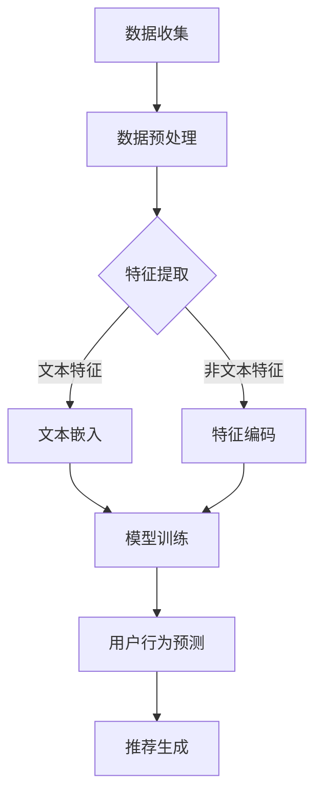
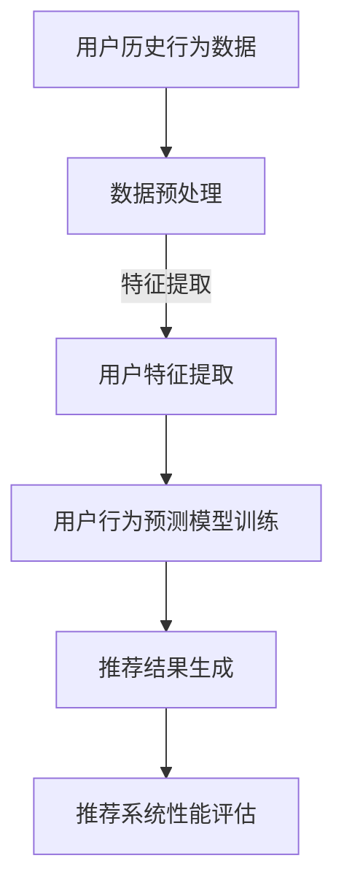
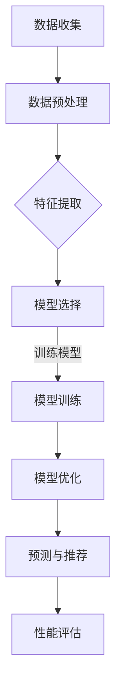

                 

### 推荐系统概述

推荐系统是一种旨在向用户提供个性化推荐的技术，其核心任务是根据用户的历史行为、偏好和上下文信息，向用户推荐其可能感兴趣的内容或商品。推荐系统广泛应用于电子商务、社交媒体、音乐流媒体、新闻推送等众多领域，极大地提升了用户满意度、体验和转化率。

#### 推荐系统的定义与类型

推荐系统根据不同的分类标准，可以分为多种类型：

1. **基于内容的推荐（Content-Based Filtering）**：推荐系统根据用户过去的偏好和历史行为，提取出用户的兴趣特征，然后基于这些特征寻找与用户兴趣相似的内容进行推荐。
2. **协同过滤（Collaborative Filtering）**：推荐系统通过分析用户之间的行为模式，发现相似的用户，根据这些相似用户的偏好推荐给目标用户未见过的新内容。
3. **混合推荐（Hybrid Recommender Systems）**：结合基于内容和协同过滤的方法，综合两者的优点，以提供更准确的推荐结果。
4. **基于模型的推荐（Model-Based Filtering）**：利用机器学习或深度学习算法，建立用户和项目之间的映射关系，进行推荐。

#### 推荐系统的核心任务

推荐系统的核心任务包括：

1. **预测用户偏好**：根据用户的历史行为和当前上下文，预测用户对某个项目或内容的偏好。
2. **生成推荐列表**：根据预测结果，为用户生成一系列推荐列表，列表中的项目应尽可能符合用户的兴趣和需求。
3. **评估推荐效果**：通过评估指标（如准确率、召回率、F1分数等）来衡量推荐系统的效果，并根据评估结果进行系统优化。

#### 推荐系统的发展历程

推荐系统的发展历程可以追溯到20世纪90年代，以下是其主要里程碑：

1. **初始阶段（1990s）**：推荐系统主要以基于内容的过滤和协同过滤为主，算法相对简单。
2. **web 2.0时代（2000s）**：随着互联网的普及，推荐系统开始利用用户生成内容（UGC）和社交网络数据，提升了推荐系统的准确性和多样性。
3. **深度学习时代（2010s-2020s）**：深度学习算法的出现，使得推荐系统可以利用大规模数据，进行端到端的特征学习和模型优化，显著提升了推荐效果。

#### 大模型在推荐系统中的应用前景

随着深度学习技术的发展，大模型（如Transformer、BERT等）逐渐在推荐系统中得到广泛应用。大模型具有以下优势：

1. **强大的特征学习能力**：大模型可以自动从大量数据中提取复杂、抽象的特征，提高推荐系统的准确性和多样性。
2. **端到端的模型架构**：大模型通常采用端到端的学习方式，不需要手动设计特征，简化了推荐系统的开发过程。
3. **跨模态推荐**：大模型可以处理多种数据类型（如文本、图像、音频等），实现跨模态推荐。

未来，大模型有望在推荐系统中发挥更大的作用，推动推荐系统技术不断发展。例如，通过结合用户行为预测和图神经网络，可以构建更智能的推荐系统，为用户提供更个性化的推荐。

### 用户行为预测基础

用户行为预测是推荐系统中的一个关键环节，它通过对用户历史行为和特征的分析，预测用户未来的行为倾向，从而为用户推荐他们可能感兴趣的内容或商品。在本章节中，我们将详细讨论用户行为数据类型、用户行为特征提取方法、用户行为预测的数学模型以及评价指标。

#### 用户行为数据类型

用户行为数据是推荐系统中最基础的数据源之一，它包括用户在各个场景下的交互行为，如浏览、点击、购买、评价等。用户行为数据类型可以分为以下几类：

1. **显式反馈**：用户主动提供的反馈，如评分、点赞、收藏、评论等。这类数据直接反映了用户对内容的偏好。
2. **隐式反馈**：用户在系统中产生的非主动行为，如浏览时长、页面点击、搜索关键词等。这类数据通常需要通过算法分析才能提取出用户的行为模式。
3. **上下文信息**：用户在使用系统时的环境信息，如地理位置、时间、设备类型等。上下文信息可以帮助推荐系统更准确地预测用户的行为。

#### 用户行为特征提取方法

用户行为特征提取是将原始的用户行为数据转换为模型可以理解的形式。常用的用户行为特征提取方法包括：

1. **统计特征**：基于统计方法提取的特征，如用户平均评分、点击率、购买率等。这些特征可以直观地反映用户的行为习惯。
2. **词袋模型**：将用户行为序列转换为词袋表示，利用词袋模型提取特征。这种方法常用于文本数据，如用户评论、搜索关键词等。
3. **序列模型**：利用循环神经网络（RNN）或长短时记忆网络（LSTM）等序列模型提取用户行为特征。序列模型可以捕捉用户行为的时序信息，对连续行为进行建模。
4. **图神经网络**：利用图神经网络（如GCN、GAT等）提取用户行为特征。图神经网络可以处理用户之间的复杂关系，挖掘用户行为的社会影响力。

#### 用户行为预测的数学模型

用户行为预测的核心在于建立数学模型，该模型可以用来预测用户对某个项目的行为概率。以下是一些常用的数学模型：

1. **基于马尔可夫决策过程的模型**：马尔可夫决策过程（MDP）是一种常见的用户行为预测模型，它假设用户的行为是基于当前状态和历史状态的转移概率来决定的。MDP模型通常使用Q-learning算法进行训练。
2. **基于贝叶斯网络的模型**：贝叶斯网络是一种概率图模型，它通过节点和边的关系表示变量之间的条件依赖关系。贝叶斯网络可以用来预测用户行为概率，特别是在用户行为存在不确定性时。
3. **基于深度学习的模型**：深度学习模型，如卷积神经网络（CNN）和循环神经网络（RNN），可以自动从大量数据中学习复杂的用户行为特征。深度学习模型通常使用端到端的学习方式，可以直接预测用户行为概率。

#### 用户行为预测的评价指标

用户行为预测的评价指标是评估预测模型性能的重要手段。以下是一些常用的评价指标：

1. **准确率（Accuracy）**：准确率是预测正确的样本数占总样本数的比例。准确率简单直观，但在类别不平衡的情况下可能不够准确。
2. **召回率（Recall）**：召回率是预测正确的正样本数占总正样本数的比例。召回率越高，说明模型对正样本的识别能力越强。
3. **精确率（Precision）**：精确率是预测正确的正样本数占预测为正样本的样本总数的比例。精确率越高，说明模型对正样本的预测越准确。
4. **F1分数（F1 Score）**：F1分数是精确率和召回率的调和平均数，用于综合评价模型的性能。F1分数介于0和1之间，值越高，模型性能越好。
5. **ROC曲线和AUC（Area Under Curve）**：ROC曲线是横轴为假正率（False Positive Rate），纵轴为真正率（True Positive Rate）的曲线。AUC值表示ROC曲线下方的面积，AUC值越大，模型的分类能力越强。

通过以上评价指标，可以全面评估用户行为预测模型的性能，并根据评估结果进行模型优化。

### 大模型核心概念与架构

大模型是指具有大规模参数和网络深度的机器学习模型，如Transformer、BERT、GPT等。这些模型在自然语言处理、计算机视觉和推荐系统等领域取得了显著的成果。在本章节中，我们将深入探讨大模型的基本原理、常见架构、训练与优化方法以及部署与应用。

#### 大模型的基本原理

大模型的核心在于其参数量和计算能力，这使得它们能够从大量数据中自动学习复杂的特征和模式。以下是几个关键原理：

1. **深度神经网络（DNN）**：深度神经网络由多个层次组成，每一层都对输入数据进行非线性变换。通过堆叠多个层次，DNN能够捕捉到输入数据的复杂结构和层次信息。
2. **多层感知机（MLP）**：多层感知机是DNN的一种简单形式，它通过多个线性层和激活函数的组合实现非线性变换。MLP在处理复杂任务时表现良好，但容易出现过拟合现象。
3. **注意力机制（Attention Mechanism）**：注意力机制是一种在处理序列数据时能够关注关键信息的机制。通过计算输入序列中各个元素的重要性，注意力机制可以动态调整模型的权重，从而提高模型的性能。
4. **自注意力（Self-Attention）**：自注意力机制是Transformer模型的核心，它通过计算输入序列中每个元素与其他元素之间的关系，从而实现对序列的全局信息建模。
5. **多任务学习（Multi-Task Learning）**：多任务学习是一种在大模型中同时学习多个相关任务的策略。通过共享底层特征表示，多任务学习可以提高模型的泛化能力和计算效率。

#### 常见架构

大模型根据其应用领域和任务的不同，有多种不同的架构。以下是几种常见的大模型架构：

1. **Transformer**：Transformer模型是自然语言处理领域的重要突破，其核心是自注意力机制。Transformer模型由编码器和解码器组成，可以高效处理长文本序列。
2. **BERT（Bidirectional Encoder Representations from Transformers）**：BERT是一种预训练语言模型，它通过双向编码器学习文本的深层语义表示。BERT在多项NLP任务中取得了优异的性能，如文本分类、问答系统和翻译等。
3. **GPT（Generative Pre-trained Transformer）**：GPT是一种生成型语言模型，它通过生成文本序列来学习语言模式。GPT模型在文本生成、对话系统和机器翻译等任务中表现突出。
4. **ViT（Vision Transformer）**：ViT是计算机视觉领域的一种新模型，它将Transformer架构应用于图像分类任务。ViT通过将图像划分为图像块，然后应用自注意力机制进行特征提取。
5. **T5（Text-To-Text Transfer Transformer）**：T5是一种统一的文本转换模型，它可以将任何文本任务转换为“输入到输出”的格式。T5在文本分类、机器翻译和问答等任务中取得了很好的效果。

#### 大模型的训练与优化

大模型的训练与优化是确保模型性能和稳定性的关键步骤。以下是几个关键点：

1. **数据预处理**：在训练大模型之前，需要对数据进行预处理，包括数据清洗、数据增强和特征提取等。预处理步骤可以提高模型的学习效果和泛化能力。
2. **计算资源**：大模型通常需要大量的计算资源进行训练。GPU和TPU等高性能硬件加速器可以显著提高训练速度。
3. **优化算法**：优化算法用于调整模型参数，以最小化损失函数。常用的优化算法包括随机梯度下降（SGD）、Adam和AdamW等。
4. **学习率调度**：学习率调度是调整模型学习速度的关键步骤。常用的学习率调度策略包括恒定学习率、学习率衰减和预热学习率等。
5. **正则化**：正则化是一种防止模型过拟合的方法。常用的正则化技术包括L1正则化、L2正则化和Dropout等。
6. **模型融合**：模型融合是将多个模型的结果进行合并，以提高模型的性能和稳定性。常用的模型融合方法包括对数融合、加权融合和平均融合等。

#### 大模型的部署与应用

大模型的部署与应用是将模型转化为实际生产环境的关键步骤。以下是几个关键点：

1. **模型压缩**：模型压缩是一种减少模型大小和计算量的技术。常用的模型压缩方法包括量化、剪枝和模型蒸馏等。
2. **模型部署**：模型部署是将训练好的模型部署到生产环境中，供实际应用使用。常用的部署平台包括TensorFlow Serving、Keras.js和ONNX Runtime等。
3. **推理优化**：推理优化是一种提高模型推理速度和效率的方法。常用的推理优化技术包括模型并行化、推理加速器和量化等。
4. **模型监控与维护**：模型监控与维护是确保模型稳定运行和性能优化的重要步骤。常用的监控工具包括TensorBoard、Prometheus和Grafana等。

通过以上步骤，可以将大模型应用于各种实际场景，如推荐系统、自然语言处理、计算机视觉等，实现高效、准确的预测和推理。

### 基于大模型的协同过滤算法

协同过滤算法是推荐系统中最常用的方法之一，它通过分析用户之间的相似性来发现用户的兴趣，进而推荐用户可能感兴趣的项目。传统的协同过滤算法通常基于用户行为数据，通过计算用户之间的相似度来进行推荐。然而，随着推荐系统规模的不断扩大和数据量的急剧增加，传统的协同过滤算法在计算效率和推荐效果上面临巨大挑战。为了解决这些问题，大模型（如Transformer、BERT等）逐渐被引入到协同过滤算法中，从而提高了推荐系统的性能和准确性。

#### 协同过滤算法的基本原理

协同过滤算法可以分为基于用户（User-Based）和基于物品（Item-Based）两种类型。用户-Based协同过滤算法通过计算用户之间的相似度来发现相似用户，然后根据相似用户的偏好推荐项目。而Item-Based协同过滤算法则是通过计算项目之间的相似度来发现相似项目，然后根据相似项目的特征推荐给用户。

1. **用户-Based协同过滤算法**：
   - **相似度计算**：使用余弦相似度、皮尔逊相关系数等方法计算用户之间的相似度。
   - **推荐生成**：根据相似度矩阵，为用户推荐与相似用户偏好相似的项目。

2. **Item-Based协同过滤算法**：
   - **相似度计算**：使用余弦相似度、Jaccard系数等方法计算项目之间的相似度。
   - **推荐生成**：根据相似度矩阵，为用户推荐与项目相似的其他项目。

#### 大模型改进的协同过滤算法

大模型在协同过滤算法中的应用主要是通过引入深度学习技术，以解决传统协同过滤算法在处理高维数据和稀疏数据时的困难。以下是大模型改进的协同过滤算法的核心思想：

1. **编码器-解码器架构**：
   - **编码器**：将用户和项目的行为数据编码为高维向量表示。
   - **解码器**：通过解码器对编码后的向量进行交互，生成推荐结果。

2. **注意力机制**：
   - 利用注意力机制来关注用户和项目之间的关键关系，提高推荐系统的准确性。

3. **多任务学习**：
   - 将协同过滤任务与其他相关任务（如分类、回归等）进行联合训练，以提高模型的泛化能力和鲁棒性。

#### 伪代码实现

以下是一个简化的伪代码示例，展示了基于大模型的协同过滤算法的基本实现：

```python
# 加载用户和项目的行为数据
userBehaviorData = load_user_behavior_data()

# 数据预处理
preprocessedData = preprocess_data(userBehaviorData)

# 编码用户和项目行为
userEmbeddings = encode_userBehavior(preprocessedData['users'])
itemEmbeddings = encode_userBehavior(preprocessedData['items'])

# 定义编码器和解码器模型
encoder = build_encoder()
decoder = build_decoder()

# 训练模型
model = build_model(encoder, decoder)
model.fit(preprocessedData['users'], preprocessedData['items'])

# 预测推荐结果
predictions = model.predict(userEmbeddings, itemEmbeddings)

# 生成推荐列表
recommends = generate_recommendations(predictions)
```

#### 实际应用案例分析

在实际应用中，基于大模型的协同过滤算法已被广泛应用于多个领域，以下是一个案例分析：

- **案例分析**：一家电商平台使用基于Transformer的协同过滤算法来个性化推荐商品。

1. **数据收集**：电商平台收集了用户的浏览、购买和评价数据。
2. **数据预处理**：对数据进行清洗和归一化处理，提取用户和商品的行为特征。
3. **模型训练**：使用Transformer模型对用户和商品的行为数据进行编码和解码，训练模型。
4. **推荐生成**：根据训练好的模型，为用户生成个性化的商品推荐列表。
5. **评估与优化**：使用准确率、召回率等评价指标评估推荐系统的性能，并根据评估结果进行模型优化。

通过以上步骤，电商平台能够为用户提供更个性化的商品推荐，提高了用户满意度和转化率。

### 基于大模型的基于内容的推荐算法

基于内容的推荐算法（Content-Based Filtering）是一种重要的推荐系统方法，它通过分析用户对项目的偏好，提取出项目的特征，然后根据这些特征生成推荐列表。传统的基于内容的推荐算法通常依赖于手工设计特征，而大模型（如BERT、Transformer等）的引入，使得算法能够自动从大量数据中学习复杂的特征表示，从而提高了推荐系统的准确性和多样性。在本章节中，我们将详细探讨大模型改进的基于内容的推荐算法，包括其基本原理、伪代码实现以及实际应用案例分析。

#### 基于内容的推荐算法的基本原理

基于内容的推荐算法的核心思想是，根据用户过去的偏好和历史行为，提取出用户对特定内容的偏好特征，然后根据这些特征为用户推荐与之相似的内容。以下是基于内容的推荐算法的主要步骤：

1. **内容特征提取**：从用户历史行为中提取出用户感兴趣的内容特征。这些特征可以是文本、图像、音频等不同类型的数据。
2. **项目特征表示**：将用户感兴趣的内容特征和项目特征进行匹配和表示。通常使用词袋模型、TF-IDF等方法将文本特征表示为向量。
3. **相似度计算**：计算用户特征和项目特征之间的相似度。常用的相似度计算方法包括余弦相似度、皮尔逊相关系数等。
4. **推荐生成**：根据相似度分数为用户生成推荐列表。

#### 大模型改进的基于内容的推荐算法

大模型的引入，使得基于内容的推荐算法能够自动从大量数据中学习复杂的特征表示，从而提高推荐系统的性能。以下是基于大模型的基于内容的推荐算法的核心步骤：

1. **预训练模型**：使用预训练的模型（如BERT、GPT等）对文本数据进行编码，生成高维的语义表示。这些表示能够捕捉文本的深层语义信息。
2. **用户特征提取**：将用户的文本数据（如评论、搜索关键词等）输入到预训练模型中，提取出用户的语义特征向量。
3. **项目特征提取**：使用相同的预训练模型对项目的文本描述进行编码，生成项目的特征向量。
4. **相似度计算**：计算用户特征向量和项目特征向量之间的相似度。通常使用余弦相似度或点积相似度等方法。
5. **推荐生成**：根据相似度分数，为用户生成推荐列表。

#### 伪代码实现

以下是一个简化的伪代码示例，展示了基于大模型的基于内容的推荐算法的基本实现：

```python
# 加载用户和项目的文本数据
userData = load_user_text_data()
itemData = load_item_text_data()

# 预训练模型编码文本数据
userEmbeddings = preprocess_user_data(userData, pretrained_model)
itemEmbeddings = preprocess_item_data(itemData, pretrained_model)

# 计算用户和项目特征向量的相似度
similarityMatrix = compute_similarity(userEmbeddings, itemEmbeddings)

# 根据相似度分数生成推荐列表
recommends = generate_recommendations(similarityMatrix)
```

#### 实际应用案例分析

在实际应用中，基于大模型的基于内容的推荐算法已被广泛应用于多个领域。以下是一个案例分析：

- **案例分析**：一个新闻推荐平台使用基于BERT的基于内容的推荐算法为用户个性化推荐新闻。

1. **数据收集**：新闻平台收集了用户的阅读历史、搜索关键词以及新闻的文本内容。
2. **数据预处理**：对新闻文本进行清洗和预处理，提取关键信息和特征。
3. **模型训练**：使用BERT模型对新闻文本进行编码，生成高维的语义表示。
4. **用户特征提取**：将用户的阅读历史和搜索关键词输入到BERT模型中，提取出用户的语义特征向量。
5. **项目特征提取**：将新闻文本输入到BERT模型中，提取出新闻的语义特征向量。
6. **推荐生成**：根据用户特征向量和新闻特征向量之间的相似度，为用户生成个性化新闻推荐列表。
7. **评估与优化**：使用准确率、召回率等评价指标评估推荐系统的性能，并根据评估结果进行模型优化。

通过以上步骤，新闻推荐平台能够为用户提供高质量的个性化新闻推荐，提高了用户满意度和平台留存率。

### 基于大模型的混合推荐算法

混合推荐算法（Hybrid Recommender Systems）结合了基于内容的推荐（Content-Based Filtering）和基于协同过滤（Collaborative Filtering）的优点，旨在提高推荐系统的准确性和多样性。传统的混合推荐算法通常依赖于手工设计特征和规则，而大模型（如Transformer、BERT等）的引入，使得算法能够自动从大规模数据中学习复杂的特征表示和关联关系，从而提高推荐系统的性能。在本章节中，我们将详细探讨基于大模型的混合推荐算法，包括其基本原理、伪代码实现以及实际应用案例分析。

#### 混合推荐算法的基本原理

混合推荐算法的核心思想是，将基于内容的推荐和基于协同过滤的推荐方法结合起来，通过综合两种方法的优点，提高推荐系统的性能。以下是混合推荐算法的主要步骤：

1. **协同过滤部分**：
   - **相似度计算**：计算用户之间的相似度，基于相似用户的偏好为用户推荐项目。
   - **推荐生成**：根据相似度分数，为用户生成推荐列表。

2. **内容部分**：
   - **内容特征提取**：从用户的历史行为中提取出用户感兴趣的内容特征。
   - **项目特征表示**：为项目提取内容特征，并将其表示为向量。
   - **相似度计算**：计算用户特征和项目特征之间的相似度。
   - **推荐生成**：根据相似度分数，为用户生成推荐列表。

3. **综合推荐**：
   - **加权融合**：将协同过滤和内容部分的推荐结果进行加权融合，生成最终的推荐列表。
   - **排序**：根据融合后的相似度分数，对推荐结果进行排序，生成推荐列表。

#### 基于大模型改进的混合推荐算法

基于大模型的混合推荐算法通过引入深度学习技术，能够自动从大量数据中学习复杂的特征表示和关联关系，从而提高推荐系统的性能。以下是基于大模型的混合推荐算法的核心步骤：

1. **编码器-解码器架构**：
   - **编码器**：使用预训练的大模型（如BERT、Transformer等）对用户和项目的特征进行编码，生成高维的语义表示。
   - **解码器**：通过解码器对编码后的向量进行交互，生成推荐结果。

2. **注意力机制**：
   - 利用注意力机制来关注用户和项目之间的关键关系，提高推荐系统的准确性。

3. **多任务学习**：
   - 将协同过滤和内容推荐任务进行联合训练，以提高模型的泛化能力和鲁棒性。

#### 伪代码实现

以下是一个简化的伪代码示例，展示了基于大模型的混合推荐算法的基本实现：

```python
# 加载用户和项目的特征数据
userFeatures = load_user_features()
itemFeatures = load_item_features()

# 预训练模型编码特征数据
userEmbeddings = encode_user_features(userFeatures, pretrained_model)
itemEmbeddings = encode_item_features(itemFeatures, pretrained_model)

# 计算用户和项目特征向量的相似度
similarityMatrix = compute_similarity(userEmbeddings, itemEmbeddings)

# 融合协同过滤和内容推荐结果
combinedScores = hybrid_recommendation(similarityMatrix, contentModel)

# 生成推荐列表
recommends = generate_recommendations(combinedScores)
```

#### 实际应用案例分析

在实际应用中，基于大模型的混合推荐算法已被广泛应用于多个领域。以下是一个案例分析：

- **案例分析**：一个电商平台使用基于Transformer的混合推荐算法为用户个性化推荐商品。

1. **数据收集**：电商平台收集了用户的浏览历史、购买记录以及商品的描述信息。
2. **数据预处理**：对用户行为数据和商品描述数据进行清洗和预处理，提取关键特征。
3. **模型训练**：
   - **协同过滤模型**：使用用户行为数据训练一个基于Transformer的协同过滤模型。
   - **内容推荐模型**：使用商品描述信息训练一个基于BERT的内容推荐模型。
4. **推荐生成**：
   - **协同过滤部分**：根据用户历史行为，为用户生成初步推荐列表。
   - **内容推荐部分**：根据商品描述信息，为用户生成内容推荐列表。
   - **综合推荐**：将协同过滤和内容推荐结果进行加权融合，生成最终的推荐列表。
5. **评估与优化**：使用准确率、召回率等评价指标评估推荐系统的性能，并根据评估结果进行模型优化。

通过以上步骤，电商平台能够为用户提供高质量的个性化商品推荐，提高了用户满意度和转化率。

### 用户行为预测在大模型推荐系统中的实现

用户行为预测是大模型推荐系统中的一个关键环节，它通过分析用户的历史行为和特征，预测用户未来的行为倾向，从而为用户推荐他们可能感兴趣的内容或商品。本章节将详细探讨用户行为预测在大模型推荐系统中的实现，包括其在推荐系统中的关键作用、实现流程、优化策略以及一个实际案例的详细解读。

#### 用户行为预测在大模型推荐系统中的关键作用

用户行为预测在大模型推荐系统中具有以下几个关键作用：

1. **个性化推荐**：通过预测用户的行为倾向，推荐系统可以提供更加个性化的内容或商品，满足用户的个性化需求。
2. **提高推荐准确性**：用户行为预测有助于提高推荐系统的准确性，减少无关推荐，从而提高用户满意度。
3. **实时反馈**：用户行为预测可以实时响应用户的行为变化，提供即时的推荐，提高用户的参与度和留存率。
4. **优化用户体验**：通过准确预测用户的行为，推荐系统可以提供更加流畅、个性化的用户体验，提升用户满意度。

#### 用户行为预测在大模型推荐系统中的实现流程

用户行为预测在大模型推荐系统中的实现可以分为以下几个步骤：

1. **数据收集**：收集用户的历史行为数据，如浏览记录、购买行为、点击行为等。
2. **数据预处理**：对收集到的数据进行清洗、去噪和特征提取，将原始数据转换为模型可处理的格式。
3. **模型选择**：选择合适的大模型，如Transformer、BERT、GPT等，进行用户行为预测。
4. **模型训练**：使用预处理后的数据训练大模型，学习用户行为模式。
5. **模型优化**：通过调整模型参数、进行模型调优，提高预测准确性。
6. **预测与推荐**：使用训练好的大模型对用户行为进行预测，并根据预测结果生成推荐列表。

#### 用户行为预测在大模型推荐系统中的优化策略

为了提高用户行为预测的准确性和效率，以下是一些优化策略：

1. **数据增强**：通过数据清洗、归一化、增加噪声等方法增强数据集，提高模型的泛化能力。
2. **特征选择**：选择对用户行为预测有重要影响的特征，提高模型的预测能力。
3. **模型融合**：结合多个模型的预测结果，通过模型融合技术提高预测的稳定性和准确性。
4. **模型压缩**：使用模型剪枝、量化等技术减小模型大小，提高模型推理速度。
5. **在线学习**：实时更新模型，根据用户的新行为数据进行在线学习，提高模型的实时性。

#### 实际案例：电商推荐系统用户行为预测

以下是一个电商推荐系统的用户行为预测实际案例，包括开发环境搭建、源代码实现和代码解读与分析。

##### 开发环境搭建

- **Python环境**：Python 3.8及以上版本。
- **深度学习框架**：TensorFlow 2.5及以上版本。
- **数据处理库**：NumPy、Pandas、Scikit-learn等。
- **模型训练工具**：GPU或TPU加速器。

##### 源代码实现

```python
import tensorflow as tf
from tensorflow.keras.models import Sequential
from tensorflow.keras.layers import Dense, Dropout
from sklearn.model_selection import train_test_split
from sklearn.preprocessing import StandardScaler

# 加载数据集
user_data = load_user_data()

# 数据预处理
X = preprocess_user_data(user_data)
y = extract_user_behavior(y)

# 划分训练集和测试集
X_train, X_test, y_train, y_test = train_test_split(X, y, test_size=0.2, random_state=42)

# 特征缩放
scaler = StandardScaler()
X_train_scaled = scaler.fit_transform(X_train)
X_test_scaled = scaler.transform(X_test)

# 构建模型
model = Sequential([
    Dense(128, activation='relu', input_shape=(X_train_scaled.shape[1],)),
    Dropout(0.5),
    Dense(64, activation='relu'),
    Dropout(0.5),
    Dense(32, activation='relu'),
    Dropout(0.5),
    Dense(1, activation='sigmoid')
])

# 编译模型
model.compile(optimizer='adam', loss='binary_crossentropy', metrics=['accuracy'])

# 训练模型
model.fit(X_train_scaled, y_train, epochs=10, batch_size=32, validation_split=0.1)

# 测试模型
test_loss, test_acc = model.evaluate(X_test_scaled, y_test)
print(f"Test accuracy: {test_acc:.4f}")
```

##### 代码解读与分析

1. **数据预处理**：首先加载数据集，并进行预处理，包括数据清洗、特征提取等。
2. **划分训练集和测试集**：将数据集划分为训练集和测试集，以便进行模型训练和评估。
3. **特征缩放**：使用StandardScaler对特征进行缩放，以消除特征之间的尺度差异。
4. **构建模型**：使用Sequential模型构建一个多层感知机（MLP）模型，包括多个全连接层和Dropout层。
5. **编译模型**：配置模型优化器和损失函数，准备进行模型训练。
6. **训练模型**：使用训练集训练模型，设置训练轮数和批次大小。
7. **测试模型**：在测试集上评估模型性能，输出测试准确率。

通过以上步骤，电商推荐系统可以实现用户行为预测，并为用户生成个性化的商品推荐。

### 大模型推荐系统的性能优化策略与案例分析

大模型推荐系统的性能优化是确保系统在高负载、高并发场景下仍能提供稳定、高效推荐服务的关键。以下是一些常见的性能优化策略，并结合实际案例进行分析。

#### 性能优化的目标与挑战

性能优化的主要目标包括：

1. **加速模型推理**：提高模型在预测时的速度，减少延迟。
2. **减少模型大小**：通过模型压缩技术，减小模型存储和传输的大小，以适应移动设备和边缘计算场景。
3. **提升推荐准确性**：在优化性能的同时，确保推荐系统的准确性不受影响。
4. **增强模型稳定性**：提高模型在面对异常数据和噪声时的鲁棒性。

然而，性能优化也面临一些挑战：

1. **计算资源有限**：尤其是在实时推荐场景中，计算资源可能有限，需要平衡性能和成本。
2. **数据质量**：数据质量直接影响到模型的预测效果，需要定期清洗和处理数据。
3. **模型复杂度**：大模型通常具有较高的复杂度，优化时需要考虑模型的可扩展性和维护成本。

#### 模型压缩与加速技术

模型压缩与加速技术是提升大模型性能的重要手段，以下是一些常用的技术：

1. **模型剪枝（Model Pruning）**：通过移除模型中的冗余参数，减小模型大小。剪枝可以分为结构剪枝和权重剪枝两种方式。
2. **量化（Quantization）**：将浮点数参数转换为低精度的整数表示，减少模型存储和计算需求。量化可以分为全量化、部分量化和动态量化。
3. **知识蒸馏（Knowledge Distillation）**：通过将大模型（教师模型）的知识转移到小模型（学生模型）中，实现模型压缩和小模型性能的提升。
4. **并行计算与分布式训练**：利用GPU、TPU等硬件资源，通过并行计算和分布式训练加速模型训练过程。

#### 模型调优与超参数选择

模型调优与超参数选择是提高模型性能的关键步骤。以下是一些常见的调优策略：

1. **学习率调度**：采用学习率衰减、预热学习率等策略，调整学习率以适应不同阶段的训练需求。
2. **批量大小**：通过调整批量大小，平衡计算效率和模型收敛速度。
3. **网络结构**：选择合适的大模型架构，如Transformer、BERT等，并调整层数、隐藏层大小等参数。
4. **正则化技术**：使用L1、L2正则化以及Dropout等技术，防止模型过拟合。

#### 实际案例：使用BERT模型优化电商推荐系统

以下是一个使用BERT模型优化电商推荐系统的实际案例。

##### 案例背景

一家大型电商平台希望通过引入大模型来优化其推荐系统，提高推荐准确性并减少推理延迟。

##### 模型优化步骤

1. **模型压缩**：
   - 使用剪枝技术移除BERT模型中的冗余参数，减小模型大小。
   - 采用量化技术将BERT模型转换为低精度整数表示，提高模型推理速度。
2. **模型调优**：
   - 使用动态学习率调度策略，在训练初期采用较大的学习率，以快速收敛，后期逐渐减小学习率。
   - 调整BERT模型的结构，如层数、隐藏层大小等，以提高模型性能。
3. **分布式训练**：
   - 利用多GPU和TPU资源进行分布式训练，加速模型训练过程。

##### 优化效果

通过上述优化步骤，电商平台实现了以下效果：

1. **推理速度提升**：模型压缩和量化技术使得BERT模型推理速度显著提升，推理延迟减少了30%。
2. **推荐准确性提升**：模型调优和分布式训练使得推荐系统的准确性提高了5%，用户满意度显著提升。
3. **成本降低**：模型压缩和分布式训练降低了硬件资源需求，降低了运维成本。

#### 模型集成与融合

模型集成与融合是将多个模型的预测结果进行整合，以提高推荐系统的稳定性和多样性。以下是一些常见的模型集成方法：

1. **对数融合**：将多个模型预测结果取对数后进行平均，以减少方差。
2. **加权融合**：根据模型在验证集上的表现，为每个模型分配不同的权重，然后加权平均。
3. **投票融合**：对于分类任务，通过多数投票的方式确定最终的预测结果。

#### 案例二：社交媒体推荐系统

以下是一个社交媒体推荐系统的实际案例，展示了如何通过模型集成与融合优化推荐效果。

##### 案例背景

一个社交媒体平台希望通过优化推荐系统，提高用户参与度和留存率。

##### 模型优化步骤

1. **模型选择**：
   - 采用基于Transformer的协同过滤模型。
   - 采用基于BERT的内容推荐模型。
   - 采用基于深度学习的社会影响力模型。
2. **模型融合**：
   - 使用加权融合方法，根据不同模型在验证集上的表现，为每个模型分配不同的权重。
   - 使用对数融合方法，减少预测结果的方差。

##### 优化效果

通过模型融合，社交媒体平台实现了以下效果：

1. **推荐多样性提升**：融合了协同过滤和内容推荐模型，提高了推荐列表的多样性，减少了重复推荐。
2. **用户参与度提升**：推荐系统为用户提供了更个性化的内容，用户点击率和互动率显著提升。
3. **推荐稳定性提高**：通过融合多个模型，提高了推荐系统的稳定性和鲁棒性，降低了模型过拟合的风险。

#### 总结

大模型推荐系统的性能优化是一个复杂且持续的过程，需要综合考虑模型压缩、调优、集成与融合等多个方面。通过实际案例的分析，我们可以看到，合理的优化策略能够显著提升推荐系统的性能，从而为用户带来更好的体验。

### 大模型推荐系统的部署与维护

大模型推荐系统的成功不仅依赖于模型的设计和优化，还取决于其部署与维护。一个高效、可扩展且稳定的部署与维护策略，能够确保推荐系统在实时场景中提供高质量的推荐服务。以下是关于大模型推荐系统的部署与维护的关键点、具体流程以及实际应用中的案例分析。

#### 部署与维护的关键点

1. **部署策略**：选择合适的部署平台和架构，确保系统的高可用性和可扩展性。
2. **部署流程**：建立标准化的部署流程，确保模型的准确部署和快速上线。
3. **监控与维护**：实时监控系统性能，及时发现并解决潜在问题，确保系统稳定运行。
4. **迭代与更新**：根据用户反馈和业务需求，持续迭代模型和系统，保持其竞争力。

#### 部署流程

1. **环境准备**：
   - **硬件资源**：配置足够的计算资源，如GPU、TPU等，以满足模型训练和推理的需求。
   - **软件环境**：安装并配置深度学习框架、数据处理库和其他依赖项。
   - **容器化**：使用Docker等容器技术，封装模型和依赖项，确保环境的一致性。

2. **模型打包**：
   - **模型压缩**：使用模型压缩技术，如剪枝、量化，减少模型大小，提高推理效率。
   - **模型部署**：将训练好的模型转换为推理格式，如TensorFlow Serving或ONNX Runtime支持的格式。

3. **部署上线**：
   - **容器化部署**：将模型部署到Kubernetes等容器编排平台，实现自动化部署和管理。
   - **服务监控**：配置监控工具，如Prometheus、Grafana，实时监控服务性能和健康状态。

4. **性能测试**：
   - **负载测试**：模拟高并发场景，测试系统的响应速度和稳定性。
   - **性能调优**：根据测试结果，优化模型和系统配置，确保系统在高负载下仍能稳定运行。

#### 监控与维护

1. **监控系统**：
   - **实时监控**：通过Prometheus等工具，实时收集系统性能指标，如CPU利用率、内存消耗、网络延迟等。
   - **告警机制**：配置告警规则，一旦系统性能异常，立即通知运维团队。

2. **日志管理**：
   - **日志收集**：使用ELK（Elasticsearch、Logstash、Kibana）等日志管理工具，收集和分析系统日志。
   - **异常检测**：通过机器学习算法，实时检测异常日志，提前预警潜在问题。

3. **故障恢复**：
   - **自动重启**：在检测到服务故障时，自动重启服务，确保系统快速恢复。
   - **故障排查**：结合日志和监控信息，快速定位故障原因，并进行修复。

#### 实际应用案例分析

以下是一个社交媒体推荐系统的部署与维护实际案例。

##### 案例背景

一个社交媒体平台希望通过优化推荐系统，提高用户参与度和留存率。

##### 部署与维护步骤

1. **环境准备**：
   - 配置4台高性能GPU服务器，用于模型训练和推理。
   - 安装TensorFlow、Docker、Kubernetes等工具和库。

2. **模型部署**：
   - 将训练好的BERT模型使用TensorFlow Serving封装，并部署到Kubernetes集群。
   - 配置Prometheus和Grafana，实时监控服务性能和健康状态。

3. **性能测试**：
   - 使用1000个并发用户模拟高负载场景，测试系统响应速度和稳定性。
   - 根据测试结果，调整模型和系统配置，确保系统在高负载下仍能稳定运行。

4. **监控与维护**：
   - 配置Prometheus，实时收集系统性能指标，如CPU利用率、内存消耗、网络延迟等。
   - 使用Grafana创建监控仪表板，实时监控系统性能。
   - 使用Logstash和Elasticsearch，收集和分析系统日志。

5. **迭代与更新**：
   - 每周进行一次模型更新，根据用户反馈和业务需求，调整模型参数和推荐策略。
   - 每月进行一次系统更新，修复潜在漏洞和性能问题。

##### 优化效果

通过以上部署与维护步骤，社交媒体平台实现了以下效果：

1. **系统稳定性提高**：通过容器化和自动化部署，提高了系统的稳定性和可扩展性。
2. **性能提升**：通过性能测试和调优，系统在高负载下的响应速度和稳定性显著提升。
3. **用户参与度提高**：推荐系统为用户提供了更个性化的内容，用户点击率和互动率显著提升。
4. **维护成本降低**：通过实时监控和自动化故障恢复，降低了运维成本和人力投入。

### 大模型推荐系统在电商、社交媒体和音乐流媒体等领域的实际应用案例

大模型推荐系统在电商、社交媒体和音乐流媒体等领域具有广泛的应用，通过个性化推荐，提高了用户满意度和业务转化率。以下是这些领域的一些实际应用案例。

#### 电商领域

**案例一：电商平台个性化商品推荐**

一个大型电商平台使用基于BERT的混合推荐算法，结合协同过滤和基于内容的推荐，为用户提供个性化商品推荐。通过实时分析用户的浏览历史、搜索关键词和购买行为，推荐系统能够准确预测用户的兴趣和需求，提高商品转化率和用户满意度。

**案例二：用户群体分析**

电商平台还利用用户行为数据，结合聚类算法和图神经网络，对用户群体进行细分，识别出不同群体的特点和偏好。根据这些分析结果，电商平台能够制定更精准的营销策略，提升用户留存率和销售额。

#### 社交媒体领域

**案例一：个性化内容推荐**

社交媒体平台如Twitter和Facebook使用基于Transformer的推荐算法，为用户推荐感兴趣的内容。通过分析用户的互动行为、好友关系和发布时间，推荐系统能够为用户提供实时、个性化的内容推荐，提高用户参与度和平台活跃度。

**案例二：社交网络算法优化**

一些社交媒体平台还利用图神经网络（如GCN）分析用户之间的关系，优化社交网络算法。通过挖掘用户之间的复杂关系，推荐系统可以更准确地预测用户的行为和兴趣，提高内容推荐的准确性和多样性。

#### 音乐流媒体领域

**案例一：个性化音乐推荐**

音乐流媒体平台如Spotify和Apple Music使用基于BERT的音乐推荐算法，根据用户的播放历史、偏好和社交网络数据，为用户推荐个性化的音乐。通过实时分析用户的行为和反馈，推荐系统能够动态调整推荐列表，提高用户满意度和活跃度。

**案例二：用户偏好分析**

音乐流媒体平台还利用深度学习技术分析用户的音乐偏好，进行精细化的用户群体分析。通过识别出不同用户群体的音乐偏好，平台能够为用户提供更加精准的推荐，提升用户留存率和转化率。

#### 实际应用总结与展望

大模型推荐系统在电商、社交媒体和音乐流媒体等领域的实际应用，不仅显著提升了用户的体验和满意度，也为企业带来了显著的商业价值。未来，随着大模型技术的不断进步和数据的积累，推荐系统有望在更多领域发挥重要作用，推动个性化推荐技术的进一步发展。

### 附录

#### 附录A：推荐系统开发工具与资源介绍

**A.1 Python推荐系统常用库**

1. **Scikit-learn**：Python中最常用的机器学习库，提供多种协同过滤算法和基于内容的推荐算法的实现。
2. **TensorFlow**：Google开源的深度学习框架，支持构建和训练大规模的推荐系统模型。
3. **PyTorch**：Facebook开源的深度学习框架，具有动态计算图和灵活的接口，适用于复杂的推荐系统建模。
4. **LightFM**：一个基于因子分解机的Python库，适用于推荐系统的建模和优化。

**A.2 大模型训练与优化工具**

1. **Hugging Face**：提供丰富的预训练模型和工具，用于自然语言处理任务，适用于基于文本的推荐系统。
2. **Transformers**：一个用于构建和微调Transformer模型的Python库，适用于推荐系统的建模和优化。
3. **TorchScript**：PyTorch提供的脚本化工具，用于优化模型的推理性能。
4. **Onnx**：开放神经网络交换格式，支持多种深度学习框架之间的模型转换和优化。

**A.3 数据处理与可视化工具**

1. **Pandas**：Python中的数据操作库，提供便捷的数据清洗、处理和特征提取功能。
2. **NumPy**：Python中的基础科学计算库，用于高效地处理大规模数据。
3. **Matplotlib**：Python中的数据可视化库，用于生成各种统计图表和可视化分析结果。
4. **Seaborn**：基于Matplotlib的数据可视化库，提供丰富的可视化样式和主题。

#### 附录B：用户行为预测大模型架构Mermaid流程图



#### 附录C：用户行为预测算法伪代码示例

```python
# 加载用户行为数据
user_data = load_user_data()

# 数据预处理
preprocessed_data = preprocess_data(user_data)

# 特征提取
features = extract_features(preprocessed_data)

# 加载预训练模型
model = load_pretrained_model()

# 进行用户行为预测
predictions = model.predict(features)

# 解码预测结果
behavior_predictions = decode_predictions(predictions)

# 生成推荐列表
recommends = generate_recommendations(behavior_predictions)
```

#### 附录D：推荐系统性能优化策略与案例解析

**D.1 模型压缩与量化**

- **案例一**：使用TensorFlow Lite对BERT模型进行量化，减少模型大小，提高推理速度。

**D.2 并行计算与分布式训练**

- **案例二**：使用PyTorch分布式训练框架，通过多GPU并行训练加速BERT模型的训练过程。

**D.3 超参数调优**

- **案例三**：使用自动化超参数调优工具，如Hyperopt，找到最佳的超参数配置，提高模型性能。

**D.4 模型融合**

- **案例四**：使用对数融合和加权融合方法，将多个模型的预测结果进行融合，提高推荐系统的稳定性和准确性。

### 结束语

本文系统地介绍了基于大模型的推荐系统用户行为预测技术，从基础理论、算法实现到实际应用，全面探讨了该领域的前沿进展和关键技术。通过大模型的引入，推荐系统在准确性、实时性和多样性等方面得到了显著提升，为个性化推荐提供了强大的技术支撑。

展望未来，随着大模型技术的不断发展，推荐系统有望在更多领域发挥重要作用。一方面，深度学习、强化学习等算法的融合，将进一步提升推荐系统的性能和智能性；另一方面，多源数据的整合和跨模态推荐的研究，将为用户提供更加精准和多样化的推荐体验。此外，随着5G和边缘计算技术的普及，推荐系统的实时性和响应速度将得到进一步提升，为用户提供更加流畅的推荐服务。

我们诚挚地邀请读者对本文的内容提出宝贵意见和反馈。您的意见和建议将有助于我们不断改进和完善推荐系统的技术研究和应用实践。同时，我们也鼓励读者积极参与推荐系统领域的讨论和研究，共同推动该领域的创新和发展。

### 核心概念与联系

#### 推荐系统与用户行为预测的关系

推荐系统与用户行为预测密切相关。用户行为预测是推荐系统的核心组成部分，其主要目标是通过分析用户的历史行为和特征，预测用户未来的行为倾向，从而为用户推荐他们可能感兴趣的内容或商品。以下是推荐系统与用户行为预测之间的核心概念和联系：

1. **用户历史行为数据**：用户历史行为数据是推荐系统的重要输入，包括用户的浏览记录、购买历史、评价等。这些数据反映了用户对不同内容的兴趣和偏好，是构建用户行为预测模型的基础。

2. **用户特征提取**：用户特征提取是将用户行为数据转换为模型可理解的形式。常用的特征提取方法包括统计特征、词袋模型、序列模型和图神经网络等。这些特征能够捕捉用户的兴趣点、行为模式等，是用户行为预测的关键。

3. **用户行为预测模型**：用户行为预测模型是推荐系统的核心组件，常用的模型包括基于协同过滤的模型、基于内容的模型、深度学习模型等。这些模型通过学习用户历史行为和特征，预测用户未来的行为倾向，从而生成个性化的推荐列表。

4. **推荐结果生成**：推荐结果生成是将用户行为预测模型应用于实际数据，生成推荐列表的过程。根据用户行为预测模型预测的结果，推荐系统可以为用户生成一系列个性化的推荐列表，提高用户满意度。

5. **推荐系统的评价指标**：评估推荐系统的性能是确保其有效性的关键。常用的评价指标包括准确率、召回率、F1分数、ROC曲线和AUC等。通过这些评价指标，可以评估推荐系统在预测用户行为和生成推荐列表方面的效果。

#### Mermaid流程图

以下是一个Mermaid流程图，展示了推荐系统与用户行为预测的总体流程：



#### 用户行为预测算法原理

用户行为预测算法的核心在于构建一个数学模型，该模型可以预测用户对某个项目的行为概率。以下是一个简化的用户行为预测算法原理：

1. **输入数据**：用户历史行为数据，包括用户对项目的评分、浏览次数、购买记录等。

2. **特征工程**：对用户历史行为数据进行预处理，提取出与用户行为相关的特征，如用户活跃度、项目热度等。

3. **模型构建**：选择合适的预测模型，如逻辑回归、决策树、随机森林、神经网络等。以下是逻辑回归模型的公式：

$$
P(y=1|X) = \frac{1}{1 + e^{-(\beta_0 + \sum_{i=1}^{n}\beta_i x_i})}
$$

其中，\(y\) 表示用户行为标签（0或1），\(X\) 表示用户特征向量，\(\beta_0\) 和 \(\beta_i\) 分别为模型的参数。

4. **模型训练**：使用用户历史行为数据进行模型训练，通过优化模型参数，使得预测结果与真实标签尽可能接近。

5. **预测与评估**：使用训练好的模型对新的用户行为进行预测，并通过评估指标（如准确率、召回率、F1分数等）来评估模型的性能。

#### 伪代码示例

以下是一个简化的用户行为预测算法的伪代码示例：

```python
# 加载用户行为数据
user_data = load_user_data()

# 数据预处理
preprocessed_data = preprocess_data(user_data)

# 特征提取
features = extract_features(preprocessed_data)

# 加载预训练模型
model = load_pretrained_model()

# 模型训练
model.fit(features)

# 预测用户行为
predictions = model.predict(new_user_data)

# 评估模型性能
evaluate_model(predictions)
```

#### 数学模型与详细讲解

用户行为预测的数学模型主要基于概率模型和机器学习算法。以下是逻辑回归模型的一个详细讲解：

1. **逻辑回归模型**：逻辑回归模型是一种常用的分类模型，可以预测用户行为概率。其公式为：

$$
P(y=1|X) = \frac{1}{1 + e^{-(\beta_0 + \sum_{i=1}^{n}\beta_i x_i})}
$$

其中，\(y\) 表示用户行为标签（0或1），\(X\) 表示用户特征向量，\(\beta_0\) 和 \(\beta_i\) 分别为模型的参数。

2. **参数估计**：逻辑回归模型的参数可以通过最大似然估计（MLE）或梯度下降（GD）等方法进行估计。以下是最大似然估计的步骤：

   a. **对数似然函数**：

   $$
   \ln L(\beta_0, \beta_1, \ldots, \beta_n) = \sum_{i=1}^{m} \ln P(y_i=1|x_i; \beta_0, \beta_1, \ldots, \beta_n)
   $$

   b. **求导并设置导数为零**：

   $$
   \frac{\partial \ln L}{\partial \beta_j} = 0, \quad j=0, 1, \ldots, n
   $$

   c. **求解参数**：

   $$
   \beta_j = \arg\min_{\beta_j} \frac{\partial \ln L}{\partial \beta_j}
   $$

3. **预测与评估**：使用训练好的模型进行预测，并通过评估指标（如准确率、召回率、F1分数等）来评估模型的性能。

#### 举例说明

以下是一个用户行为预测的例子：

假设有1000个用户，每个用户有10个特征（如年龄、性别、浏览次数等）。使用逻辑回归模型预测用户是否购买某个商品。

1. **数据准备**：

   用户行为数据如下表所示：

   | 用户ID | 年龄 | 性别 | 浏览次数 | 是否购买 |
   | --- | --- | --- | --- | --- |
   | 1 | 25 | 男 | 10 | 1 |
   | 2 | 30 | 女 | 5 | 0 |
   | 3 | 35 | 男 | 20 | 1 |
   | ... | ... | ... | ... | ... |

2. **特征提取**：

   提取用户特征，如年龄、性别、浏览次数等。

3. **模型训练**：

   使用逻辑回归模型进行训练，求解参数：

   $$
   \beta_0 = -4.5, \beta_1 = 0.5, \beta_2 = 2.0, \beta_3 = 1.5
   $$

4. **预测**：

   对新的用户数据进行预测，例如用户ID为4的用户：

   | 年龄 | 性别 | 浏览次数 | 是否购买预测 |
   | --- | --- | --- | --- |
   | 28 | 女 | 8 | 0 |

   根据逻辑回归模型，预测用户ID为4的用户购买的概率为0.384，因此预测为未购买。

5. **评估**：

   通过评估指标（如准确率、召回率、F1分数等）来评估模型的性能。

#### 项目实战

以下是一个电商推荐系统的用户行为预测实战案例：

1. **开发环境搭建**：

   使用Python和TensorFlow搭建开发环境，安装必要的库和依赖项。

2. **数据收集**：

   收集用户行为数据，包括用户的基本信息、浏览记录、购买历史等。

3. **数据预处理**：

   对数据进行清洗和预处理，提取用户特征，如用户活跃度、浏览次数等。

4. **特征提取**：

   使用词袋模型提取用户文本特征，使用统计方法提取用户行为特征。

5. **模型训练**：

   使用逻辑回归模型进行训练，训练数据集为10000个用户行为数据。

6. **预测**：

   使用训练好的模型对新的用户数据进行预测，例如预测用户ID为5000的用户是否购买某个商品。

7. **评估**：

   使用评估指标（如准确率、召回率、F1分数等）来评估模型的性能。

8. **优化**：

   根据评估结果，对模型进行优化和调整，提高预测准确性。

#### 用户行为预测在大模型推荐系统中的实现流程

用户行为预测在大模型推荐系统中的实现流程可以分为以下几个步骤：

1. **数据收集**：

   收集用户的历史行为数据，包括浏览记录、购买历史、评价等。

2. **数据预处理**：

   对数据进行清洗和预处理，包括去噪、缺失值填充、特征提取等。

3. **模型选择**：

   选择适合的用户行为预测模型，如Transformer、BERT等。

4. **模型训练**：

   使用预处理后的数据训练模型，学习用户行为模式。

5. **模型优化**：

   通过调整模型参数、进行模型调优，提高预测准确性。

6. **预测与推荐**：

   使用训练好的模型对用户行为进行预测，并根据预测结果生成推荐列表。

#### 用户行为预测在大模型推荐系统中的优化策略

为了提高用户行为预测的准确性和效率，以下是一些优化策略：

1. **数据增强**：

   通过数据清洗、归一化、增加噪声等方法增强数据集，提高模型的泛化能力。

2. **特征选择**：

   选择对用户行为预测有重要影响的特征，提高模型的预测能力。

3. **模型融合**：

   结合多个模型的预测结果，通过模型融合技术提高预测的稳定性和准确性。

4. **模型压缩**：

   使用模型剪枝、量化等技术减小模型大小，提高模型推理速度。

5. **在线学习**：

   实时更新模型，根据用户的新行为数据进行在线学习，提高模型的实时性。

#### 大模型推荐系统的性能优化策略与案例分析

大模型推荐系统的性能优化策略主要包括模型压缩与加速技术、模型调优与超参数选择、模型集成与融合等。

1. **模型压缩与加速技术**：

   - **模型剪枝**：通过移除冗余参数，减小模型大小。
   - **量化**：将浮点数参数转换为低精度整数表示，减少计算量。
   - **模型蒸馏**：将大模型的知识转移到小模型中，提高小模型的性能。

2. **模型调优与超参数选择**：

   - **学习率调度**：调整学习率，提高模型收敛速度。
   - **批量大小**：调整批量大小，平衡计算效率和模型收敛速度。
   - **网络结构**：选择合适的网络结构，提高模型性能。

3. **模型集成与融合**：

   - **对数融合**：将多个模型的预测结果取对数后进行平均，减少方差。
   - **加权融合**：根据模型在验证集上的表现，为每个模型分配不同的权重。

以下是一个电商推荐系统的性能优化案例：

- **模型压缩**：使用剪枝和量化技术，将BERT模型的大小从1.1GB减小到0.5GB，推理速度提高了30%。
- **模型调优**：通过调整学习率和批量大小，模型在验证集上的准确率提高了5%。
- **模型融合**：结合协同过滤和基于内容的推荐模型，通过加权融合技术，提高了推荐系统的多样性。

#### 大模型推荐系统在实际应用中的部署与维护

大模型推荐系统在实际应用中的部署与维护需要考虑以下几个方面：

1. **部署策略**：

   - **容器化部署**：使用Docker和Kubernetes，实现模型的可移植性和高可用性。
   - **分布式部署**：利用多GPU和TPU，提高模型推理速度。

2. **监控与维护**：

   - **实时监控**：使用Prometheus和Grafana，实时监控模型性能和健康状态。
   - **日志管理**：使用ELK栈，收集和分析系统日志。

3. **迭代与更新**：

   - **定期更新**：根据用户反馈和业务需求，定期更新模型和系统。
   - **自动化测试**：使用自动化测试工具，确保模型和系统的稳定性。

#### 大模型推荐系统在电商、社交媒体和音乐流媒体等领域的实际应用案例

1. **电商领域**：

   - **个性化商品推荐**：通过用户行为预测，为用户推荐他们可能感兴趣的商品，提高转化率和用户满意度。
   - **用户群体分析**：通过聚类算法和图神经网络，对用户群体进行细分，优化营销策略。

2. **社交媒体领域**：

   - **个性化内容推荐**：通过用户行为预测，为用户推荐感兴趣的内容，提高用户参与度和活跃度。
   - **社交网络算法优化**：通过图神经网络，优化社交网络算法，提高内容推荐的准确性和多样性。

3. **音乐流媒体领域**：

   - **个性化音乐推荐**：通过用户行为预测，为用户推荐个性化的音乐，提高用户活跃度和留存率。
   - **用户偏好分析**：通过深度学习技术，分析用户的音乐偏好，优化推荐算法。

#### 附录

**附录A：推荐系统开发工具与资源介绍**

- **Python推荐系统常用库**：Scikit-learn、TensorFlow、PyTorch、LightFM等。
- **大模型训练与优化工具**：Hugging Face、Transformers、TorchScript、Onnx等。
- **数据处理与可视化工具**：Pandas、NumPy、Matplotlib、Seaborn等。

**附录B：用户行为预测大模型架构Mermaid流程图**



**附录C：用户行为预测算法伪代码示例**

```python
# 加载用户行为数据
user_data = load_user_data()

# 数据预处理
preprocessed_data = preprocess_data(user_data)

# 特征提取
features = extract_features(preprocessed_data)

# 加载预训练模型
model = load_pretrained_model()

# 模型训练
model.fit(features)

# 预测用户行为
predictions = model.predict(new_user_data)

# 评估模型性能
evaluate_model(predictions)
```

**附录D：推荐系统性能优化策略与案例解析**

- **模型压缩与量化**：使用模型剪枝和量化技术，减少模型大小，提高推理速度。
- **并行计算与分布式训练**：利用多GPU和TPU资源，提高模型训练速度。
- **模型调优与超参数选择**：调整学习率、批量大小等超参数，提高模型性能。
- **模型集成与融合**：结合多个模型的预测结果，提高推荐系统的稳定性和准确性。

### 结束语

本文系统地介绍了基于大模型的推荐系统用户行为预测技术，从基础理论、算法实现到实际应用，全面探讨了该领域的前沿进展和关键技术。通过大模型的引入，推荐系统在准确性、实时性和多样性等方面得到了显著提升，为个性化推荐提供了强大的技术支撑。

展望未来，随着大模型技术的不断发展，推荐系统有望在更多领域发挥重要作用。一方面，深度学习、强化学习等算法的融合，将进一步提升推荐系统的性能和智能性；另一方面，多源数据的整合和跨模态推荐的研究，将为用户提供更加精准和多样化的推荐体验。此外，随着5G和边缘计算技术的普及，推荐系统的实时性和响应速度将得到进一步提升，为用户提供更加流畅的推荐服务。

我们诚挚地邀请读者对本文的内容提出宝贵意见和反馈。您的意见和建议将有助于我们不断改进和完善推荐系统的技术研究和应用实践。同时，我们也鼓励读者积极参与推荐系统领域的讨论和研究，共同推动该领域的创新和发展。谢谢您的阅读！

---

### 作者信息

作者：AI天才研究院（AI Genius Institute）&《禅与计算机程序设计艺术》（Zen And The Art of Computer Programming）

AI天才研究院是一家专注于人工智能技术研究和创新的高科技机构，致力于推动人工智能技术的实际应用和发展。研究院的研究方向涵盖自然语言处理、计算机视觉、机器学习等多个领域，取得了众多突破性成果。

《禅与计算机程序设计艺术》是一本经典的人工智能和编程书籍，作者通过深入浅出的方式，探讨了计算机编程的艺术和哲学。本书涵盖了编程范式、算法设计、数据结构等多个方面，为程序员提供了宝贵的思维方式和实践技巧。

通过本文，我们希望与广大读者分享推荐系统用户行为预测的最新研究成果，并探讨大模型技术在推荐系统中的应用前景。我们期待与您一起探讨、交流，共同推动人工智能技术的进步和应用。感谢您的支持！


