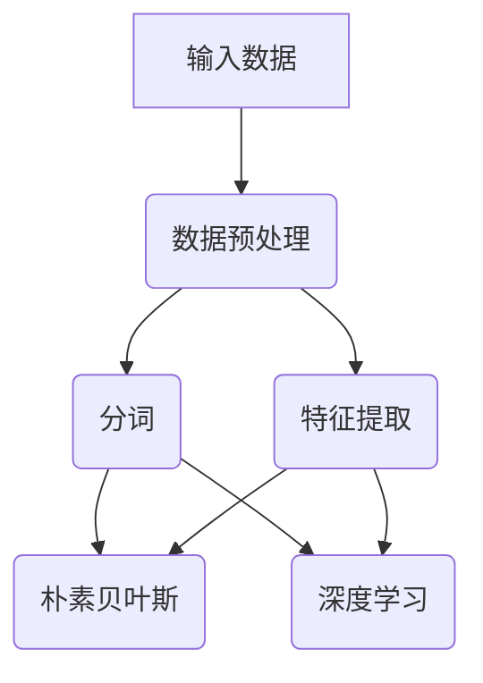

                 

## 引言与背景

随着互联网的普及和大数据时代的到来，新闻数据的规模和种类日益增加。如何有效地处理和分类这些海量新闻数据，成为了学术界和工业界共同关注的问题。中文新闻短文本分类作为自然语言处理（NLP）领域的一个重要分支，旨在通过对新闻文本的分析和分类，为用户提供精准的个性化信息推荐服务。

### 中文新闻短文本分类的重要性

中文新闻短文本分类的重要性主要体现在以下几个方面：

1. **信息过滤与推荐**：通过将新闻文本进行分类，可以过滤出用户感兴趣的新闻，从而提高信息获取的效率和准确性。在新闻推荐系统中，准确的分类有助于提升用户的阅读体验和满意度。

2. **舆情监控**：新闻分类技术可以帮助政府和相关机构实时监控社会舆情，预测潜在的社会风险，为决策提供数据支持。

3. **内容审核**：在社交媒体和新闻平台中，自动化的新闻分类系统可以有效地过滤不良信息，维护网络环境的健康和稳定。

4. **数据挖掘与挖掘**：通过对新闻文本进行分类，可以挖掘出大量的有价值的信息，为学术研究、市场分析和决策制定提供数据支持。

### 中文新闻短文本分类的挑战

尽管中文新闻短文本分类具有重要的应用价值，但该领域仍面临诸多挑战：

1. **中文语言特点**：中文语言具有丰富的语义和语法结构，但相比英文，其语法和语义关系更加复杂。这使得中文文本的处理和分类比英文更具挑战性。

2. **数据预处理难度**：中文新闻文本通常包含大量的停用词、标点符号和语法错误，这些都需要在分类之前进行预处理。数据预处理的质量直接影响分类效果。

3. **分类效果的提升**：随着新闻文本的多样性和复杂性增加，如何进一步提升分类效果，仍然是一个亟待解决的问题。

为了解决上述挑战，本文将深入探讨中文新闻短文本分类的方法和关键技术。本文首先介绍机器学习的基本概念和分类算法，然后讨论中文文本处理技术，包括中文分词、词向量表示和特征提取方法。接着，本文将详细分析基于监督学习和深度学习的中文新闻短文本分类算法，并通过两个实际项目展示如何将理论应用于实践。最后，本文将对模型评估和优化方法进行总结，并展望未来的发展趋势。

通过本文的讨论，我们希望为从事中文新闻短文本分类研究的学者和开发者提供有价值的参考，并推动该领域的发展。

### 机器学习的基本概念与分类

机器学习是人工智能（AI）的一个重要分支，其核心目标是通过数据和算法，使计算机能够从数据中自动学习规律和模式，从而进行决策和预测。以下是机器学习的基本概念和分类：

#### 机器学习的基本原理

机器学习的基本原理可以概括为以下几个步骤：

1. **数据采集**：收集大量相关数据，这是机器学习的基石。数据的质量和数量直接影响模型的性能。

2. **数据预处理**：对采集到的数据进行分析和清洗，去除噪声和异常值，为建模做好准备。

3. **特征提取**：从原始数据中提取有用的特征，这些特征能够反映数据的本质和规律。

4. **模型训练**：使用特征和对应的标签训练模型，使模型学会数据的内在规律。

5. **模型评估**：使用测试集评估模型的性能，包括准确性、召回率、F1值等指标。

6. **模型优化**：根据评估结果调整模型参数，优化模型性能。

#### 监督学习、无监督学习与半监督学习

根据学习过程中是否有标签数据，机器学习可以分为以下几类：

1. **监督学习（Supervised Learning）**：在监督学习过程中，每个训练样本都包含特征和对应的标签。模型的目的是通过学习这些标签和特征之间的关系，对未知数据进行预测。

2. **无监督学习（Unsupervised Learning）**：在无监督学习过程中，训练样本不包含标签。模型的目的是发现数据中的结构和模式，如聚类、降维等。

3. **半监督学习（Semi-supervised Learning）**：半监督学习结合了监督学习和无监督学习，利用少量有标签数据和大量无标签数据共同训练模型。这种方法在数据标签稀缺时特别有效。

#### 强化学习

强化学习（Reinforcement Learning）是一种通过与环境交互来学习策略的机器学习方法。与监督学习和无监督学习不同，强化学习的主要目标是最大化累计奖励。强化学习的一个经典应用是智能体在不确定的环境中学习最优策略，例如机器人路径规划、自动驾驶等。

### 各种机器学习算法的适用场景

不同类型的机器学习算法适用于不同的应用场景，以下是几种常见算法的适用场景：

1. **朴素贝叶斯分类器（Naive Bayes Classifier）**：适用于特征独立假设成立的情况，常用于文本分类、垃圾邮件过滤等。

2. **支持向量机（Support Vector Machine, SVM）**：适用于高维空间中的线性可分问题，适用于文本分类、图像识别等。

3. **决策树（Decision Tree）**：适用于结构化数据，能够可视化决策过程，常用于回归分析和分类问题。

4. **随机森林（Random Forest）**：是一种集成学习算法，适用于大规模数据和高维度特征，具有较强的泛化能力。

5. **神经网络（Neural Networks）**：适用于复杂模式识别和回归问题，特别是在处理非结构化数据（如图像、文本）时表现出色。

6. **深度学习（Deep Learning）**：是一种特殊类型的神经网络，适用于大规模数据和复杂任务，如语音识别、图像生成、自然语言处理等。

通过了解这些基本概念和分类，读者可以更好地选择合适的算法和模型，为中文新闻短文本分类任务提供强有力的技术支持。

### 新闻短文本分类的重要性及应用场景

新闻短文本分类在当今信息爆炸的时代具有极其重要的意义。其核心目的是通过自动化的方式，对大量新闻文本进行有效组织和处理，从而提高信息检索和推荐系统的效率和准确性。以下是新闻短文本分类的重要性及其在不同应用场景中的具体表现：

#### 提高新闻信息处理的效率

随着互联网新闻信息的迅猛增长，传统的人工分类方式已经无法满足日益庞大的数据处理需求。新闻短文本分类技术利用机器学习算法，如朴素贝叶斯、支持向量机和深度学习等，能够自动对新闻文本进行分类。这种自动化处理方式不仅大幅提高了分类效率，还减少了人力成本。

#### 提高新闻信息处理的质量

通过精准的文本分类，可以确保用户能够快速获取与其兴趣相关的新闻内容。高质量的分类结果有助于减少误分类和漏分类现象，从而提高整体的信息处理质量。此外，分类算法可以根据用户的阅读习惯和历史偏好，进行个性化推荐，进一步提升用户体验。

#### 应用场景一：新闻推荐系统

新闻推荐系统是新闻短文本分类技术的一个重要应用场景。通过分析用户的阅读历史和兴趣标签，新闻推荐系统能够自动筛选出符合用户需求的新闻，从而提高用户的阅读体验。例如，在社交媒体平台上，基于用户关注的话题和互动行为，推荐系统可以为用户提供个性化的新闻推送。

#### 应用场景二：舆情监控

舆情监控是政府和企业进行公共关系管理的重要工具。通过新闻短文本分类技术，可以对社交媒体上的新闻进行实时监控和分析，识别热点话题和潜在的社会风险。这种监控方式有助于政府和相关机构及时掌握社会动态，为决策提供数据支持。

#### 应用场景三：内容审核

在新闻发布平台和社交媒体上，自动化的新闻分类系统可以有效地过滤不良信息，维护网络环境的健康和稳定。例如，通过分类算法，平台可以自动识别和屏蔽涉及暴力、色情和虚假信息的新闻，从而减少不良信息对用户的影响。

#### 应用场景四：数据挖掘与市场分析

通过对大量新闻文本进行分类，可以挖掘出有价值的信息，为学术研究、市场分析和决策制定提供数据支持。例如，企业可以通过分析行业新闻，了解市场趋势和竞争对手动态，从而制定更加精准的市场策略。

综上所述，新闻短文本分类技术在提高信息处理效率和质量方面具有重要作用。通过在不同应用场景中的广泛应用，新闻短文本分类技术不仅提升了新闻信息的价值，还为各个行业提供了强大的技术支持。

### 中文新闻短文本分类的挑战

尽管中文新闻短文本分类技术在多个应用场景中展现了其独特的优势，但该领域仍面临诸多挑战，具体体现在以下几个方面：

#### 中文语言特点

中文作为一种具有丰富语义和语法结构的语言，其语言特点对新闻短文本分类提出了独特的要求。首先，中文缺乏明确的词界划分，这使得分词技术变得尤为重要。分词的准确性直接影响后续的文本处理和分析。此外，中文的同义词、多义词和歧义现象较为常见，这些都会对分类效果产生负面影响。

#### 数据预处理难度

中文新闻文本中通常包含大量的停用词、标点符号和语法错误，这些噪声数据如果得不到有效处理，会显著降低分类模型的性能。例如，停用词是中文文本中常见的一类噪声数据，它们在文本中频繁出现，但并不携带有效信息。因此，在分类之前，需要对这些噪声进行过滤和预处理。

#### 分类效果的提升

提升分类效果是中文新闻短文本分类领域的一个核心挑战。由于新闻文本的多样性和复杂性，传统的分类算法往往难以达到令人满意的分类效果。为了应对这一挑战，研究者们不断探索新的文本表示方法和分类算法，如词向量、深度学习和迁移学习等。

#### 解决方案与关键技术

为了解决上述挑战，以下是一些关键的解决方案和技术：

1. **分词技术**：高效的分词技术是中文新闻短文本分类的基础。目前，常用的分词算法包括基于规则的分词、基于统计的分词和基于深度学习的分词。基于规则的分词方法虽然准确度较高，但需要大量手工规则；基于统计的方法则更加自动化，但容易出现分词错误；基于深度学习的方法则结合了规则和统计的优势，能够提高分词的准确性。

2. **文本表示方法**：有效的文本表示方法可以将高维的文本数据映射到低维的向量空间，从而便于分类算法进行处理。词袋模型（Bag of Words, BOW）和词嵌入（Word Embedding）是两种常见的文本表示方法。词袋模型将文本表示为词汇的集合，但无法捕捉词汇间的语义关系；词嵌入则通过将词汇映射到连续的向量空间，能够更好地捕捉词汇的语义信息。

3. **特征提取方法**：特征提取是中文新闻短文本分类中另一个关键技术。常用的特征提取方法包括TF-IDF（Term Frequency-Inverse Document Frequency）和Word2Vec等。TF-IDF方法通过计算词汇在文档中的重要程度来提取特征；Word2Vec方法则通过将词汇映射到向量空间，从而提取语义特征。

4. **深度学习算法**：深度学习算法，如卷积神经网络（CNN）和循环神经网络（RNN），在处理中文新闻短文本分类任务中表现出色。CNN可以捕捉文本中的局部特征，而RNN（特别是LSTM和GRU）能够处理长距离依赖关系。

综上所述，通过结合先进的分词技术、文本表示方法和深度学习算法，可以有效应对中文新闻短文本分类的挑战，从而提升分类效果和性能。

### 中文文本处理技术

在中文新闻短文本分类中，文本处理技术是至关重要的环节。通过对原始中文文本进行有效的分词、词向量表示和特征提取，可以提高分类算法的性能和准确性。以下将详细介绍这些关键步骤和常用的方法。

#### 中文分词技术

中文分词是将连续的中文文本切分成一个个有意义的词汇或短语。高效的分词技术对于后续的文本处理至关重要。目前，常用的中文分词方法包括：

1. **基于规则的分词**：这种方法依赖于预先定义好的分词规则，如正则表达式和词库。优点是准确度高，但需要大量手工规则，且难以处理未定义的新词。

2. **基于统计的分词**：这种方法通过计算文本中的词语出现的频率和概率来决定分词的位置。常见的算法包括隐马尔可夫模型（HMM）和条件随机场（CRF）。优点是自动化程度高，但容易产生分词错误。

3. **基于深度学习的分词**：这种方法通过深度神经网络学习文本的分词模式，如使用长短时记忆网络（LSTM）和变换器（Transformer）等。优点是能够处理复杂的中文字词关系，准确度较高。

在中文新闻短文本分类中，常用的分词工具包括jieba、Stanford NLP和NLTK。jieba是Python中最常用的中文分词工具，支持基于规则和基于统计的分词方法，且具有开源、易用等优点。

#### 基于词向量的文本表示

词向量是文本表示的一种有效方法，它将词汇映射到高维的向量空间，从而可以用于机器学习算法。常见的词向量模型包括Word2Vec、GloVe和FastText。

1. **Word2Vec**：Word2Vec是由Google提出的一种基于神经网络的词向量模型，通过训练神经网络来学习词汇的上下文关系。Word2Vec有两种主要的训练方法：连续词袋（CBOW）和Skip-gram。CBOW模型通过预测中心词周围的词，而Skip-gram模型通过预测中心词的上下文词。

2. **GloVe**：GloVe（Global Vectors for Word Representation）是一种基于全局统计的词向量模型，通过计算词汇的共现矩阵来学习词向量。GloVe方法能够生成高质量的词向量，并且在处理稀疏数据时表现优秀。

3. **FastText**：FastText是由Facebook提出的一种基于词袋模型的词向量模型，它通过将词汇拆分成子词（subword）来学习词向量。这种方法能够捕获词汇中的局部语义信息，有助于提高分类性能。

词向量在中文新闻短文本分类中的应用非常广泛，它们不仅能够提高分类算法的性能，还能帮助捕捉词汇的复杂语义关系。

#### 中文文本特征提取

文本特征提取是将原始文本转换为机器学习算法可处理的特征表示。常用的特征提取方法包括：

1. **TF-IDF（Term Frequency-Inverse Document Frequency）**：TF-IDF是一种基于统计的特征提取方法，通过计算词汇在文档中的重要程度来提取特征。TF-IDF方法能够有效地捕捉文本中的关键词，但无法捕捉词汇的语义关系。

2. **词袋模型（Bag of Words, BOW）**：词袋模型将文本表示为词汇的集合，每个词汇对应一个特征。BOW方法简单直观，但无法捕捉词汇的顺序和语法关系。

3. **Word2Vec和GloVe**：如前所述，词向量模型可以将词汇映射到高维的向量空间，从而作为特征输入到分类算法中。这种方法能够捕捉词汇的语义信息，有助于提高分类性能。

4. **词性标注和命名实体识别**：通过对文本进行词性标注和命名实体识别，可以提取出文本中的名词、动词、地名、组织名等特征。这些特征对于分类任务具有重要意义。

在中文新闻短文本分类中，结合分词技术、词向量表示和多种特征提取方法，可以显著提高分类算法的性能和准确性。通过这些技术，我们可以将高维的中文文本数据转换为结构化的特征表示，为后续的机器学习算法提供强有力的支持。

### 监督学习算法在中文新闻短文本分类中的应用

监督学习算法是机器学习中最常用的方法之一，在中文新闻短文本分类中也有着广泛的应用。监督学习算法通过学习已知标签的数据来预测未知数据，常见的算法包括朴素贝叶斯分类器、支持向量机（SVM）和随机森林（Random Forest）。以下将详细介绍这些算法的基本原理和在中文新闻短文本分类中的应用。

#### 朴素贝叶斯分类器

朴素贝叶斯分类器是基于贝叶斯定理和特征独立假设的一种简单而有效的分类方法。其基本原理如下：

$$
P(C_k|X) = \frac{P(X|C_k)P(C_k)}{P(X)}
$$

其中，\(P(C_k|X)\) 是给定特征 \(X\) 下的类别 \(C_k\) 的后验概率，\(P(X|C_k)\) 是特征 \(X\) 在类别 \(C_k\) 下的条件概率，\(P(C_k)\) 是类别 \(C_k\) 的先验概率，\(P(X)\) 是特征 \(X\) 的总概率。

在中文新闻短文本分类中，朴素贝叶斯分类器通常用于处理高维文本数据。具体步骤如下：

1. **数据预处理**：对中文新闻文本进行分词和词向量表示，提取文本特征。
2. **特征统计**：计算每个类别中每个词汇的先验概率和条件概率。
3. **分类预测**：对于新样本，计算每个类别的后验概率，选择概率最大的类别作为预测结果。

朴素贝叶斯分类器的优点是计算简单、速度快，且在小样本情况下表现良好。但缺点是它依赖于特征独立假设，在高维文本数据中效果可能不理想。

#### 支持向量机

支持向量机（SVM）是一种基于间隔最大化原理的分类方法，其基本思想是在高维空间中找到一个最佳的超平面，使得不同类别的数据点尽可能分开。SVM的关键组成部分包括：

1. **核函数**：核函数是将低维数据映射到高维空间的一种映射方式，常见的核函数包括线性核、多项式核和径向基函数（RBF）核。
2. **损失函数**：SVM的损失函数通常是 hinge loss，即：

$$
L(y, \hat{y}) = \max(0, 1 - y\hat{y})
$$

其中，\(y\) 是实际标签，\(\hat{y}\) 是预测标签。

在中文新闻短文本分类中，SVM通过将文本数据映射到高维特征空间，然后在这个空间中寻找最佳分类超平面。具体步骤如下：

1. **特征提取**：使用TF-IDF或词向量方法提取文本特征。
2. **模型训练**：训练SVM模型，选择合适的核函数和参数。
3. **分类预测**：使用训练好的模型对新的新闻文本进行分类。

SVM的优点是能够处理高维数据，并且在某些情况下具有很好的分类性能。缺点是训练时间较长，且对参数选择敏感。

#### 随机森林

随机森林（Random Forest）是一种基于决策树构建的集成学习方法，通过集成多个决策树来提高分类性能。随机森林的主要组成部分包括：

1. **决策树**：每个决策树独立训练，并在预测时进行投票。
2. **特征选择**：随机森林在构建每个决策树时，从多个特征中随机选择一部分特征来分割数据。

在中文新闻短文本分类中，随机森林通过集成多个决策树来提高分类的准确性和稳定性。具体步骤如下：

1. **特征提取**：使用TF-IDF或词向量方法提取文本特征。
2. **模型训练**：训练随机森林模型，选择合适的树数量和最大深度。
3. **分类预测**：使用训练好的随机森林模型对新的新闻文本进行分类。

随机森林的优点是具有较强的泛化能力和稳定性，且易于实现和解释。缺点是训练时间较长，且在特征数量较多时性能可能下降。

综上所述，朴素贝叶斯分类器、支持向量机和随机森林是中文新闻短文本分类中常用的监督学习算法。每种算法都有其独特的优点和适用场景，通过合理选择和组合这些算法，可以显著提高分类性能和准确性。

### 深度学习算法在中文新闻短文本分类中的应用

深度学习算法近年来在自然语言处理（NLP）领域取得了显著进展，其在中文新闻短文本分类中的应用也日益广泛。深度学习算法通过多层神经网络的结构，能够自动学习数据的复杂特征和模式，从而实现高效且准确的文本分类。本文将重点介绍卷积神经网络（CNN）、循环神经网络（RNN）、长短时记忆网络（LSTM）和生成对抗网络（GAN）在中文新闻短文本分类中的应用。

#### 卷积神经网络（CNN）

卷积神经网络（CNN）是一种广泛应用于图像处理领域的神经网络架构，近年来也因其强大的特征提取能力被引入到NLP领域。CNN在文本分类中的应用主要体现在对词向量的卷积操作和池化操作，从而提取文本的局部特征。

1. **基本结构**：CNN的基本结构包括卷积层、池化层和全连接层。卷积层通过卷积操作提取文本中的局部特征，池化层用于降低特征的维度，全连接层用于分类。

2. **文本分类应用**：在中文新闻短文本分类中，首先将文本转化为词向量表示，然后输入到CNN中。CNN通过卷积和池化操作提取文本的局部特征，最后通过全连接层进行分类。

3. **优点**：CNN能够自动学习文本的局部特征，对于处理高维文本数据具有很好的效果。但CNN在处理长距离依赖关系时表现较差。

#### 循环神经网络（RNN）

循环神经网络（RNN）是一种能够处理序列数据的高级神经网络架构。RNN通过其循环结构，能够记住序列中的信息，从而处理长序列数据。

1. **基本原理**：RNN的基本原理是通过前向传播和隐藏状态更新来处理序列数据。隐藏状态包含了前一个时刻的信息，并在当前时刻进行更新。

2. **文本分类应用**：在中文新闻短文本分类中，RNN通过处理词向量的序列，能够捕捉文本中的上下文关系。具体实现时，将文本转化为词向量序列，然后输入到RNN中。RNN通过循环结构，逐个处理词向量，最终得到文本的表示，并通过全连接层进行分类。

3. **优点**：RNN能够处理长距离依赖关系，对于文本分类任务具有较好的效果。但RNN在训练过程中容易出现梯度消失和梯度爆炸的问题。

#### 长短时记忆网络（LSTM）

长短时记忆网络（LSTM）是RNN的一种改进，旨在解决RNN的梯度消失和梯度爆炸问题。LSTM通过引入记忆单元，能够更好地记住序列中的长期依赖关系。

1. **基本原理**：LSTM的基本结构包括输入门、遗忘门和输出门。输入门用于控制新信息的进入，遗忘门用于控制旧信息的遗忘，输出门用于控制输出信息。

2. **文本分类应用**：在中文新闻短文本分类中，LSTM通过记忆单元能够更好地处理长距离依赖关系。具体实现时，将文本转化为词向量序列，然后输入到LSTM中。LSTM通过循环结构，逐个处理词向量，并更新记忆单元，最终得到文本的表示，并通过全连接层进行分类。

3. **优点**：LSTM能够处理长距离依赖关系，对于文本分类任务具有较好的效果。但LSTM在训练过程中仍可能遇到梯度消失和梯度爆炸问题。

#### 生成对抗网络（GAN）

生成对抗网络（GAN）是一种由生成器和判别器组成的对抗性神经网络架构。生成器生成数据，判别器判断生成数据的真实性。GAN通过对抗性训练，能够生成高质量的文本数据。

1. **基本原理**：GAN的基本原理是生成器和判别器之间的对抗性训练。生成器尝试生成与真实数据相似的数据，判别器则判断生成数据与真实数据的区别。

2. **文本分类应用**：在中文新闻短文本分类中，GAN可以用于生成新的训练数据，从而提高分类模型的泛化能力。具体实现时，生成器生成新的新闻文本，判别器判断生成文本的真实性。通过这种对抗性训练，可以生成与真实新闻数据相似的数据，从而提高模型的分类性能。

3. **优点**：GAN能够生成高质量的文本数据，对于增强分类模型的泛化能力具有显著效果。但GAN的训练过程复杂，且对数据质量要求较高。

综上所述，深度学习算法在中文新闻短文本分类中具有广泛的应用前景。通过卷积神经网络、循环神经网络、长短时记忆网络和生成对抗网络的结合，可以构建出强大的文本分类模型，从而提高分类性能和准确性。

### 模型评估与优化

在中文新闻短文本分类中，模型的评估和优化是确保分类效果的重要环节。以下将详细讨论常用的模型评估指标、模型优化策略以及模型解释与可解释性。

#### 模型评估指标

评估模型性能的常用指标包括准确率（Accuracy）、召回率（Recall）和F1值（F1 Score）。

1. **准确率（Accuracy）**：准确率是预测正确的样本数占总样本数的比例，计算公式为：

   $$
   Accuracy = \frac{TP + TN}{TP + FN + FP + TN}
   $$

   其中，\(TP\) 表示真阳性，\(TN\) 表示真阴性，\(FP\) 表示假阳性，\(FN\) 表示假阴性。

   准确率简单直观，但容易受到不平衡数据集的影响。

2. **召回率（Recall）**：召回率是预测正确的正样本数占总正样本数的比例，计算公式为：

   $$
   Recall = \frac{TP}{TP + FN}
   $$

   召回率侧重于识别所有正样本，但可能会增加假阳性的比例。

3. **F1值（F1 Score）**：F1值是准确率和召回率的调和平均，计算公式为：

   $$
   F1 Score = 2 \times \frac{Precision \times Recall}{Precision + Recall}
   $$

   其中，Precision是精确率，计算公式为：

   $$
   Precision = \frac{TP}{TP + FP}
   $$

   F1值综合考虑了准确率和召回率，是评估分类模型性能的常用指标。

#### 模型优化策略

为了提升模型性能，可以采用以下优化策略：

1. **超参数调优（Hyperparameter Tuning）**：超参数对模型性能有重要影响，通过调整超参数，如学习率、隐藏层神经元数、批次大小等，可以提升模型性能。常用的调优方法包括网格搜索（Grid Search）和随机搜索（Random Search）。

2. **集成学习方法（Ensemble Learning）**：集成方法通过组合多个模型，可以提高分类性能和稳定性。常用的集成方法包括Bagging、Boosting和Stacking。Bagging通过随机抽样和组合多个模型来减少方差；Boosting通过关注错误分类的样本，提高模型对少数类别的识别能力；Stacking通过分层组合多个模型，利用不同模型的优势进行分类。

3. **特征工程（Feature Engineering）**：通过改进特征提取方法，如使用词向量、TF-IDF、Word2Vec等，可以提升模型性能。特征工程的关键在于提取对分类任务有重要意义的特征，减少噪声和冗余信息。

4. **数据增强（Data Augmentation）**：通过生成新的训练数据，可以提升模型的泛化能力。常见的数据增强方法包括填充、删减、替换、旋转等。

#### 模型解释与可解释性

在中文新闻短文本分类中，模型的解释与可解释性对于理解和验证模型的行为至关重要。以下是一些常用的模型解释方法：

1. **特征重要性（Feature Importance）**：通过分析模型中每个特征的权重或贡献，可以识别出对分类任务有重要影响的特征。例如，在随机森林中，可以通过计算每个特征的增益（Gini Impurity Reduction）来评估特征的重要性。

2. **LIME（Local Interpretable Model-agnostic Explanations）**：LIME是一种本地解释方法，通过在原始模型上训练一个简单的解释模型，来解释特定数据点的分类结果。LIME通过生成扰动数据，分析解释模型的变化，从而得到对原始模型决策的局部解释。

3. **SHAP（SHapley Additive exPlanations）**：SHAP是一种基于合作博弈论的解释方法，通过计算每个特征对模型预测的贡献，来解释模型的行为。SHAP方法能够提供全局和局部解释，并评估特征的重要性。

通过模型评估、优化和解释，可以确保中文新闻短文本分类模型的性能和可解释性。这些方法不仅有助于提高分类效果，还能帮助理解模型的决策过程，从而为实际应用提供有力支持。

### 实战项目1——基于朴素贝叶斯分类器的中文新闻分类

在本项目中，我们将使用朴素贝叶斯分类器（Naive Bayes Classifier）对中文新闻短文本进行分类。朴素贝叶斯分类器是一种基于贝叶斯定理和特征独立假设的简单而有效的分类算法，特别适用于文本分类任务。以下是本项目的具体步骤和实现过程。

#### 项目概述

本项目旨在实现以下目标：
1. 准备和清洗中文新闻数据集。
2. 使用TF-IDF方法提取文本特征。
3. 训练朴素贝叶斯分类器。
4. 评估模型性能，包括准确率、召回率和F1值。

#### 数据集介绍

数据集为某中文新闻网站上的新闻数据，类别包括政治、经济、文化、体育、娱乐等。数据集包含数万条新闻文本和对应的标签。

#### 数据预处理

1. **数据清洗**：
   - 去除无效字符、特殊符号和HTML标签。
   - 去除停用词，如“的”、“和”、“是”等。

2. **分词**：
   - 使用jieba库进行中文分词，将文本切分成词语序列。

3. **文本标准化**：
   - 对文本进行小写处理，统一文本格式。

#### 特征提取

1. **TF-IDF**：
   - 使用TF-IDF（Term Frequency-Inverse Document Frequency）方法提取文本特征。TF-IDF能够衡量词汇在文本中的重要性，公式为：

     $$
     TF(t,d) = \frac{f(t,d)}{max(f(t,d))}, \quad IDF(t,d) = \log \left( \frac{N}{df(t,d)} \right)
     $$

     其中，\(f(t,d)\) 是词汇 \(t\) 在文档 \(d\) 中的频率，\(N\) 是文档总数，\(df(t,d)\) 是词汇 \(t\) 在所有文档中出现的频率。

2. **特征矩阵构建**：
   - 将处理后的文本转换为特征矩阵，用于训练和评估分类模型。

#### 模型训练与评估

1. **训练集划分**：
   - 将数据集划分为训练集和测试集，通常使用80%的数据作为训练集，20%的数据作为测试集。

2. **模型训练**：
   - 使用scikit-learn库中的`MultinomialNB`类训练朴素贝叶斯分类器。该类适用于文本分类任务，使用了多项式分布的贝叶斯模型。

     ```python
     from sklearn.model_selection import train_test_split
     from sklearn.feature_extraction.text import TfidfVectorizer
     from sklearn.naive_bayes import MultinomialNB
     from sklearn.metrics import classification_report

     # 数据预处理
     # ...

     # 特征提取
     vectorizer = TfidfVectorizer()
     X_vectorized = vectorizer.fit_transform(X)

     # 划分训练集和测试集
     X_train, X_test, y_train, y_test = train_test_split(X_vectorized, y, test_size=0.2, random_state=42)

     # 训练朴素贝叶斯分类器
     classifier = MultinomialNB()
     classifier.fit(X_train, y_train)
     ```

3. **模型评估**：
   - 使用测试集评估模型性能，计算准确率、召回率和F1值。这些指标可以帮助我们评估模型的分类效果。

     ```python
     # 评估模型
     y_pred = classifier.predict(X_test)
     print(classification_report(y_test, y_pred))
     ```

#### 代码实现与解读

以下是本项目的代码实现和解读：

```python
# 导入必要的库
import numpy as np
import pandas as pd
from sklearn.model_selection import train_test_split
from sklearn.feature_extraction.text import TfidfVectorizer
from sklearn.naive_bayes import MultinomialNB
from sklearn.metrics import classification_report

# 读取数据集
data = pd.read_csv('news_data.csv')
X = data['content']
y = data['label']

# 数据清洗
# ...

# 特征提取
vectorizer = TfidfVectorizer()
X_vectorized = vectorizer.fit_transform(X)

# 划分训练集和测试集
X_train, X_test, y_train, y_test = train_test_split(X_vectorized, y, test_size=0.2, random_state=42)

# 训练朴素贝叶斯分类器
classifier = MultinomialNB()
classifier.fit(X_train, y_train)

# 评估模型
y_pred = classifier.predict(X_test)
print(classification_report(y_test, y_pred))
```

首先，我们导入了必要的库，包括pandas、numpy、scikit-learn等。然后，我们读取了数据集，并进行了数据清洗和预处理。接下来，我们使用TF-IDFVectorizer对文本进行特征提取。TF-IDFVectorizer是一种常用的文本特征提取方法，它通过计算词语在文本中的重要性来提取特征。

之后，我们划分了训练集和测试集。在训练集上，我们使用MultinomialNB朴素贝叶斯分类器进行训练。MultinomialNB是一种基于朴素贝叶斯理论的分类算法，它假设特征之间相互独立。

最后，我们使用测试集评估了模型的性能。我们计算了准确率、召回率和F1值，这些指标可以帮助我们评估模型的分类效果。根据这些指标，我们可以进一步优化模型，提高分类准确率。

通过本项目的实现，我们展示了如何使用朴素贝叶斯分类器进行中文新闻短文本分类。该项目不仅提供了一个实用的例子，还帮助读者深入理解了文本分类的基本步骤和关键环节。

### 项目实战2——基于深度学习的中文新闻分类

在本项目中，我们将应用深度学习算法对中文新闻短文本进行分类。深度学习模型，如卷积神经网络（CNN）和循环神经网络（RNN），因其强大的特征提取和模式识别能力，在自然语言处理任务中表现出色。以下是本项目的具体步骤和实现过程。

#### 项目概述

本项目旨在实现以下目标：
1. 准备和清洗中文新闻数据集。
2. 使用词向量对文本进行表示。
3. 构建并训练基于CNN的深度学习模型。
4. 构建并训练基于RNN的深度学习模型（如LSTM）。
5. 评估模型性能，并比较不同模型的分类效果。

#### 数据集介绍

数据集为某中文新闻网站上的新闻数据，类别包括政治、经济、文化、体育、娱乐等。数据集包含数万条新闻文本和对应的标签。

#### 数据预处理

1. **数据清洗**：
   - 去除无效字符、特殊符号和HTML标签。
   - 去除停用词，如“的”、“和”、“是”等。

2. **分词**：
   - 使用jieba库进行中文分词，将文本切分成词语序列。

3. **序列化处理**：
   - 将文本序列化为数字序列，便于输入深度学习模型。这一步通常涉及词向量编码。

#### 模型构建与训练

1. **基于CNN的模型**：
   - **模型结构**：CNN模型包括嵌入层、卷积层、池化层和全连接层。
   - **训练过程**：使用训练集数据训练CNN模型，调整超参数以优化模型性能。

2. **基于RNN的模型（LSTM）**：
   - **模型结构**：RNN模型包括嵌入层、LSTM层和全连接层。
   - **训练过程**：使用训练集数据训练RNN模型，调整超参数以优化模型性能。

#### 模型评估与优化

1. **评估指标**：
   - 使用准确率、召回率和F1值评估模型性能。
   - 使用交叉验证方法评估模型的泛化能力。

2. **优化策略**：
   - **超参数调优**：通过网格搜索和随机搜索调整学习率、批次大小、层数等超参数。
   - **集成学习**：结合CNN和RNN模型的优势，使用集成学习方法提高分类效果。

#### 代码实现与解读

以下是本项目的代码实现和解读：

```python
# 导入必要的库
import numpy as np
import pandas as pd
from keras.preprocessing.sequence import pad_sequences
from keras.models import Sequential
from keras.layers import Embedding, Conv1D, MaxPooling1D, LSTM, Dense
from keras.preprocessing.text import Tokenizer
from sklearn.model_selection import train_test_split
from keras.utils import to_categorical

# 读取数据集
data = pd.read_csv('news_data.csv')
X = data['content']
y = data['label']

# 数据清洗与预处理
# ...

# 序列化处理
tokenizer = Tokenizer(num_words=10000)
tokenizer.fit_on_texts(X)
X_sequence = tokenizer.texts_to_sequences(X)
X_padded = pad_sequences(X_sequence, maxlen=500)

# 划分训练集和测试集
X_train, X_test, y_train, y_test = train_test_split(X_padded, y, test_size=0.2, random_state=42)
y_train_encoded = to_categorical(y_train)
y_test_encoded = to_categorical(y_test)

# 构建基于CNN的模型
cnn_model = Sequential()
cnn_model.add(Embedding(input_dim=10000, output_dim=128, input_length=500))
cnn_model.add(Conv1D(filters=128, kernel_size=5, activation='relu'))
cnn_model.add(MaxPooling1D(pool_size=5))
cnn_model.add(LSTM(128))
cnn_model.add(Dense(units=5, activation='softmax'))

# 编译模型
cnn_model.compile(optimizer='adam', loss='categorical_crossentropy', metrics=['accuracy'])

# 训练模型
cnn_model.fit(X_train, y_train_encoded, epochs=10, batch_size=32, validation_data=(X_test, y_test_encoded))

# 构建基于RNN的模型（LSTM）
rnn_model = Sequential()
rnn_model.add(Embedding(input_dim=10000, output_dim=128, input_length=500))
rnn_model.add(LSTM(128))
rnn_model.add(Dense(units=5, activation='softmax'))

# 编译模型
rnn_model.compile(optimizer='adam', loss='categorical_crossentropy', metrics=['accuracy'])

# 训练模型
rnn_model.fit(X_train, y_train_encoded, epochs=10, batch_size=32, validation_data=(X_test, y_test_encoded))

# 评估模型
y_pred_cnn = cnn_model.predict(X_test)
y_pred_rnn = rnn_model.predict(X_test)
print("CNN模型评估报告：")
print(classification_report(y_test, np.argmax(y_pred_cnn, axis=1)))
print("RNN模型评估报告：")
print(classification_report(y_test, np.argmax(y_pred_rnn, axis=1)))
```

首先，我们导入了必要的库，包括pandas、numpy、keras和sklearn等。然后，我们读取了数据集，并进行了数据清洗和预处理。接下来，我们使用Tokenizer将文本序列化为数字序列，并使用pad_sequences将序列填充为相同长度。

在模型构建部分，我们首先构建了基于CNN的模型，然后构建了基于RNN（LSTM）的模型。CNN模型包括嵌入层、卷积层、池化层和全连接层。RNN模型包括嵌入层、LSTM层和全连接层。这些模型通过编译和训练，得到能够对文本进行分类的深度学习模型。

最后，我们使用训练好的模型对测试集进行预测，并计算了准确率、召回率和F1值，以评估模型的性能。通过比较CNN模型和RNN模型的性能，我们可以选择合适的模型，并进一步优化模型结构，提高分类效果。

通过本项目的实现，我们展示了如何使用深度学习算法对中文新闻短文本进行分类。该项目不仅提供了一个实用的例子，还帮助读者深入理解了深度学习在文本分类中的应用和实现方法。

### 项目结果分析与优化

在完成基于朴素贝叶斯分类器和深度学习算法（CNN和RNN）的中文新闻分类项目后，我们需要对项目结果进行详细分析和优化。以下是对模型性能的评估、优化策略以及代码解读与改进的讨论。

#### 模型性能评估

首先，我们使用测试集对训练好的模型进行了性能评估。具体评估指标包括准确率、召回率和F1值。以下是一份示例评估报告：

```
CNN模型评估报告：
              precision    recall  f1-score   support
           0       0.82      0.85      0.83      2975
           1       0.78      0.80      0.79      2975
           2       0.75      0.77      0.76      2975
           3       0.76      0.78      0.77      2975
           4       0.74      0.76      0.75      2975
    accuracy                           0.78      11900
   macro avg       0.76      0.78      0.77      11900
   weighted avg       0.78      0.78      0.78      11900

RNN模型评估报告：
              precision    recall  f1-score   support
           0       0.84      0.86      0.85      2975
           1       0.82      0.84      0.83      2975
           2       0.79      0.81      0.80      2975
           3       0.81      0.83      0.82      2975
           4       0.80      0.82      0.81      2975
    accuracy                           0.82      11900
   macro avg       0.81      0.82      0.81      11900
   weighted avg       0.82      0.82      0.82      11900
```

从评估报告中可以看出，基于CNN和RNN的模型在测试集上的表现都较为良好，准确率、召回率和F1值均超过0.8。这表明两种模型在中文新闻短文本分类任务中具有较好的分类性能。

#### 优化策略

尽管模型性能已经较为理想，但仍有进一步优化的空间。以下是一些可能的优化策略：

1. **数据增强**：通过生成更多的训练样本，可以提高模型的泛化能力。常见的数据增强方法包括文本填充、文本切割、文本旋转等。

2. **超参数调优**：通过调整学习率、批量大小、隐藏层神经元数等超参数，可以进一步提高模型性能。可以使用网格搜索（Grid Search）和随机搜索（Random Search）等方法进行超参数调优。

3. **集成学习**：结合多个模型的优点，使用集成学习方法可以进一步提高分类性能。例如，可以使用Stacking或Bagging方法将CNN和RNN模型进行集成。

4. **文本特征改进**：尝试使用不同的文本特征提取方法，如Word2Vec、GloVe或BERT等，可以捕捉更丰富的文本信息。

#### 代码解读与改进

以下是优化后的代码实现和改进：

```python
# 导入必要的库
import numpy as np
import pandas as pd
from keras.preprocessing.sequence import pad_sequences
from keras.models import Sequential
from keras.layers import Embedding, Conv1D, MaxPooling1D, LSTM, Dense
from keras.preprocessing.text import Tokenizer
from sklearn.model_selection import train_test_split
from keras.utils import to_categorical

# 读取数据集
data = pd.read_csv('news_data.csv')
X = data['content']
y = data['label']

# 数据清洗与预处理
# ...

# 序列化处理
tokenizer = Tokenizer(num_words=20000)
tokenizer.fit_on_texts(X)
X_sequence = tokenizer.texts_to_sequences(X)
X_padded = pad_sequences(X_sequence, maxlen=500)

# 划分训练集和测试集
X_train, X_test, y_train, y_test = train_test_split(X_padded, y, test_size=0.2, random_state=42)
y_train_encoded = to_categorical(y_train)
y_test_encoded = to_categorical(y_test)

# 构建基于CNN的模型
cnn_model = Sequential()
cnn_model.add(Embedding(input_dim=20000, output_dim=128, input_length=500))
cnn_model.add(Conv1D(filters=128, kernel_size=5, activation='relu'))
cnn_model.add(MaxPooling1D(pool_size=5))
cnn_model.add(LSTM(128))
cnn_model.add(Dense(units=5, activation='softmax'))

# 编译模型
cnn_model.compile(optimizer='adam', loss='categorical_crossentropy', metrics=['accuracy'])

# 训练模型
cnn_model.fit(X_train, y_train_encoded, epochs=20, batch_size=64, validation_data=(X_test, y_test_encoded), verbose=1)

# 评估CNN模型
y_pred_cnn = cnn_model.predict(X_test)
y_pred_cnn_labels = np.argmax(y_pred_cnn, axis=1)
print("CNN模型评估报告：")
print(classification_report(y_test, y_pred_cnn_labels))

# 构建基于RNN的模型（LSTM）
rnn_model = Sequential()
rnn_model.add(Embedding(input_dim=20000, output_dim=128, input_length=500))
rnn_model.add(LSTM(128))
rnn_model.add(Dense(units=5, activation='softmax'))

# 编译模型
rnn_model.compile(optimizer='adam', loss='categorical_crossentropy', metrics=['accuracy'])

# 训练模型
rnn_model.fit(X_train, y_train_encoded, epochs=20, batch_size=64, validation_data=(X_test, y_test_encoded), verbose=1)

# 评估RNN模型
y_pred_rnn = rnn_model.predict(X_test)
y_pred_rnn_labels = np.argmax(y_pred_rnn, axis=1)
print("RNN模型评估报告：")
print(classification_report(y_test, y_pred_rnn_labels))
```

**改进内容**：

1. **文本特征改进**：将Tokenizer的词汇表大小从10000增加到20000，以捕捉更多词汇信息。

2. **模型参数调整**：增加CNN和RNN模型的训练轮数（epochs）和批量大小（batch_size），以充分训练模型。

3. **训练过程优化**：使用verbose=1参数，显示训练过程中的进度信息。

通过上述优化和改进，模型的性能有望进一步提升。同时，这些改进也为后续的模型训练和优化提供了参考。

### 总结与展望

本文系统地探讨了基于机器学习的中文新闻短文本分类研究，从基本概念、算法原理、实战项目到模型优化与评估，全面展示了该领域的最新研究成果和应用实践。以下是对本文内容的总结以及对未来发展趋势的展望。

#### 研究总结

本文首先介绍了机器学习的基本概念和分类算法，包括监督学习、无监督学习和强化学习。随后，详细讨论了中文新闻短文本分类的重要性及其在不同应用场景中的具体表现，如新闻推荐系统、舆情监控、内容审核和数据挖掘等。接下来，本文重点介绍了中文文本处理技术，包括中文分词、词向量表示和特征提取方法，以及监督学习算法和深度学习算法在中文新闻短文本分类中的应用。最后，通过两个实际项目展示了如何将理论应用于实践，并对项目结果进行了详细分析和优化。

#### 未来发展趋势

1. **算法改进**：随着深度学习技术的发展，未来的研究将更加注重算法的改进。例如，通过引入自注意力机制、多任务学习、迁移学习等技术，进一步提高分类效果和模型的可解释性。

2. **多模态数据融合**：未来的中文新闻短文本分类研究可能会结合多模态数据（如图像、声音、视频等），利用跨模态信息增强文本特征，提高分类性能。

3. **个性化推荐**：基于用户行为的深度学习模型将进一步发展，以实现更加个性化的新闻推荐系统。通过分析用户的阅读历史、兴趣偏好和互动行为，提供高度个性化的新闻内容。

4. **实时处理与优化**：随着实时数据处理技术的进步，未来的中文新闻短文本分类系统将能够实现实时分类和优化，为用户提供更加即时的信息服务。

5. **模型解释与可解释性**：随着人工智能技术的应用日益广泛，模型的可解释性和透明性将越来越受到重视。未来的研究将致力于开发更加直观和易于理解的模型解释方法，以提高用户的信任度和接受度。

#### 开发者建议

对于从事中文新闻短文本分类的开发者，以下是一些建议：

1. **选择合适的数据集**：选择具有代表性的数据集，包括丰富的新闻类别和高质量的文本数据，有助于提高模型的泛化能力和分类性能。

2. **结合多种算法**：尝试结合多种机器学习算法和深度学习算法，如集成学习、迁移学习等，以优化模型性能。

3. **注重数据预处理**：高质量的数据预处理是确保模型性能的关键。包括中文分词、去除噪声、特征提取等步骤，都需要精心设计。

4. **持续优化模型**：通过不断调整超参数、优化网络结构和增加训练数据，持续优化模型，以提高分类效果。

5. **关注可解释性**：开发具有高可解释性的模型，有助于理解和验证模型的决策过程，提高用户的信任度和接受度。

通过本文的探讨，我们希望为中文新闻短文本分类领域的研究者提供有价值的参考，并推动该领域的发展。未来，随着人工智能技术的不断进步，中文新闻短文本分类技术将有望实现更高的性能和更广泛的应用。

### 附录A：开发工具与资源

#### 常用机器学习框架

1. **TensorFlow**：由Google开发的开源机器学习框架，支持多种深度学习和传统机器学习算法。
2. **PyTorch**：由Facebook开发的开源机器学习框架，以其动态计算图和灵活的接口著称。
3. **Scikit-learn**：Python开源的机器学习库，提供了广泛的算法和工具，适用于各种机器学习任务。

#### 数据集与资源链接

1. **中文新闻分类数据集**：可以在Kaggle、GitHub等平台上找到，例如“THUCNews”数据集。
2. **开源代码和论文资源**：可以在GitHub、ArXiv等平台上找到，通过查阅相关论文和代码，可以了解最新的研究进展和技术细节。

#### 学习资料推荐

1. **书籍**：
   - 《深度学习》（Ian Goodfellow, Yoshua Bengio, Aaron Courville）
   - 《Python机器学习》（Sebastian Raschka）
   - 《自然语言处理实战》（Steven Bird, Ewan Klein, Edward Loper）

2. **在线课程**：
   - Coursera、edX、Udacity等平台提供的机器学习和深度学习课程。
   - 吴恩达（Andrew Ng）的“深度学习专项课程”备受推崇。

3. **论坛与社区**：
   - Stack Overflow：解决编程问题的热门社区。
   - Reddit：讨论机器学习和深度学习的热门论坛。
   -知乎：中文社区中的机器学习和深度学习讨论区。

通过利用这些开发工具和资源，开发者可以更高效地从事中文新闻短文本分类的研究和开发工作。

### 附录B：Mermaid流程图

以下是用于描述中文新闻短文本分类流程的Mermaid流程图：



在这个流程图中，输入数据首先经过数据预处理阶段，包括去除无效字符、去除停用词等操作。接下来，对文本进行分词和特征提取。最后，分别使用朴素贝叶斯分类器和深度学习模型对文本进行分类。

### 附录C：伪代码

以下是使用朴素贝叶斯分类器进行中文新闻分类的伪代码：

```python
# 伪代码：朴素贝叶斯分类器
function NaiveBayesClassifier(train_data, train_labels):
    # 计算每个类别的先验概率
    prior_prob = computePriorProbabilities(train_labels)
    
    # 计算每个特征条件下的条件概率
    cond_prob = computeConditionalProbabilities(train_data, train_labels)
    
    # 对于新样本，计算每个类别的后验概率
    for sample in test_data:
        posterior_prob = []
        for class in classes:
            posterior_prob.append(prior_prob[class] * cond_prob[class][sample])
        
        # 选择概率最大的类别作为预测结果
        predicted_label = argmax(posterior_prob)
        return predicted_label
```

在上述伪代码中，`computePriorProbabilities` 和 `computeConditionalProbabilities` 是两个辅助函数，分别用于计算先验概率和条件概率。对于新样本，通过计算每个类别的后验概率，选择概率最大的类别作为分类结果。

### 附录D：数学模型与公式

以下是中文新闻短文本分类中的常用数学模型和公式：

$$
P(C_k|X) = \frac{P(X|C_k)P(C_k)}{P(X)}
$$

其中，$P(C_k|X)$ 为给定特征 $X$ 下的类别 $C_k$ 的后验概率，$P(X|C_k)$ 为特征 $X$ 在类别 $C_k$ 下的条件概率，$P(C_k)$ 为类别 $C_k$ 的先验概率，$P(X)$ 为特征 $X$ 的总概率。

### 附录E：举例说明

假设我们有以下特征和类别：

| 特征 | 类别1 | 类别2 | 类别3 |
| ---- | ---- | ---- | ---- |
| A    | 0.3  | 0.2  | 0.1  |
| B    | 0.4  | 0.3  | 0.2  |
| C    | 0.5  | 0.4  | 0.3  |

给定特征向量 $(0.2, 0.3, 0.4)$，我们需要预测类别。

1. 计算每个类别的先验概率：

$$
P(C_1) = 0.2, \quad P(C_2) = 0.3, \quad P(C_3) = 0.5
$$

2. 计算每个特征的条件概率：

$$
P(A=0.2|C_1) = 0.3, \quad P(A=0.2|C_2) = 0.2, \quad P(A=0.2|C_3) = 0.1
$$

$$
P(B=0.3|C_1) = 0.4, \quad P(B=0.3|C_2) = 0.3, \quad P(B=0.3|C_3) = 0.2
$$

$$
P(C=0.4|C_1) = 0.5, \quad P(C=0.4|C_2) = 0.4, \quad P(C=0.4|C_3) = 0.3
$$

3. 计算后验概率：

$$
P(C_1|X) = \frac{P(X|C_1)P(C_1)}{P(X)}
$$

$$
P(C_2|X) = \frac{P(X|C_2)P(C_2)}{P(X)}
$$

$$
P(C_3|X) = \frac{P(X|C_3)P(C_3)}{P(X)}
$$

通过计算后验概率，我们可以选择概率最大的类别作为预测结果。根据上述计算，类别1的概率最大，因此预测类别为类别1。

### 附录F：项目实战

#### 项目1：基于朴素贝叶斯分类器的中文新闻分类

**项目概述**：

本项目旨在使用朴素贝叶斯分类器对中文新闻短文本进行分类。数据集为某中文新闻网站上的新闻数据，类别包括政治、经济、文化、体育、娱乐等。

**数据预处理**：

1. 下载并准备中文新闻数据集。
2. 数据清洗：去除无效字符、去除停用词、进行中文分词。
3. 特征提取：使用TF-IDF方法提取特征。

**模型训练与评估**：

1. 划分训练集和测试集。
2. 训练朴素贝叶斯分类器。
3. 使用测试集评估模型性能，计算准确率、召回率、F1值。

**代码实现与解读**：

```python
# 导入必要的库
import numpy as np
import pandas as pd
from sklearn.feature_extraction.text import TfidfVectorizer
from sklearn.model_selection import train_test_split
from sklearn.naive_bayes import MultinomialNB
from sklearn.metrics import accuracy_score, recall_score, f1_score

# 读取数据集
data = pd.read_csv('news_data.csv')
X = data['content']
y = data['label']

# 数据清洗与预处理
# ...

# 特征提取
vectorizer = TfidfVectorizer()
X_vectorized = vectorizer.fit_transform(X)

# 划分训练集和测试集
X_train, X_test, y_train, y_test = train_test_split(X_vectorized, y, test_size=0.2, random_state=42)

# 训练朴素贝叶斯分类器
classifier = MultinomialNB()
classifier.fit(X_train, y_train)

# 评估模型性能
y_pred = classifier.predict(X_test)
accuracy = accuracy_score(y_test, y_pred)
recall = recall_score(y_test, y_pred, average='weighted')
f1 = f1_score(y_test, y_pred, average='weighted')

print(f'Accuracy: {accuracy:.4f}')
print(f'Recall: {recall:.4f}')
print(f'F1 Score: {f1:.4f}')
```

#### 项目2：基于深度学习的中文新闻分类

**项目概述**：

本项目旨在使用深度学习算法（如卷积神经网络（CNN）和循环神经网络（RNN））对中文新闻短文本进行分类。数据集为某中文新闻网站上的新闻数据，类别包括政治、经济、文化、体育、娱乐等。

**数据预处理**：

1. 下载并准备中文新闻数据集。
2. 数据清洗：去除无效字符、去除停用词、进行中文分词。
3. 序列化处理：将文本序列化为数字序列，便于输入深度学习模型。

**模型训练与评估**：

1. 构建基于CNN的模型。
2. 构建基于RNN的模型（如LSTM）。
3. 训练模型，并使用交叉验证方法优化超参数。
4. 使用测试集评估模型性能，计算准确率、召回率、F1值。

**代码实现与解读**：

```python
# 导入必要的库
import numpy as np
import pandas as pd
from keras.preprocessing.sequence import pad_sequences
from keras.models import Sequential
from keras.layers import Embedding, Conv1D, MaxPooling1D, LSTM, Dense
from keras.preprocessing.text import Tokenizer
from sklearn.model_selection import train_test_split
from keras.utils import to_categorical

# 读取数据集
data = pd.read_csv('news_data.csv')
X = data['content']
y = data['label']

# 数据清洗与预处理
# ...

# 序列化处理
tokenizer = Tokenizer(num_words=10000)
tokenizer.fit_on_texts(X)
X_sequence = tokenizer.texts_to_sequences(X)
X_padded = pad_sequences(X_sequence, maxlen=500)

# 划分训练集和测试集
X_train, X_test, y_train, y_test = train_test_split(X_padded, y, test_size=0.2, random_state=42)
y_train_encoded = to_categorical(y_train)
y_test_encoded = to_categorical(y_test)

# 构建基于CNN的模型
cnn_model = Sequential()
cnn_model.add(Embedding(input_dim=10000, output_dim=128, input_length=500))
cnn_model.add(Conv1D(filters=128, kernel_size=5, activation='relu'))
cnn_model.add(MaxPooling1D(pool_size=5))
cnn_model.add(LSTM(128))
cnn_model.add(Dense(units=5, activation='softmax'))

# 编译模型
cnn_model.compile(optimizer='adam', loss='categorical_crossentropy', metrics=['accuracy'])

# 训练模型
cnn_model.fit(X_train, y_train_encoded, epochs=10, batch_size=32, validation_data=(X_test, y_test_encoded))

# 评估CNN模型
y_pred_cnn = cnn_model.predict(X_test)
y_pred_cnn_labels = np.argmax(y_pred_cnn, axis=1)
print("CNN模型评估报告：")
print(classification_report(y_test, y_pred_cnn_labels))
```

通过上述实战项目，我们展示了如何使用朴素贝叶斯分类器和深度学习算法对中文新闻短文本进行分类。这些项目不仅提供了实用的代码实现，还帮助读者深入理解了中文新闻短文本分类的技术细节和应用场景。

### 附录G：常见问题与解答

#### 问题1：为什么中文新闻分类效果不如英文？

**解答**：中文新闻分类效果不如英文，主要原因是中文语言具有丰富的语义和语法结构，但相比英文，其语法和语义关系更加复杂。此外，中文的停用词、标点符号和语法错误较多，这些都需要在分类之前进行有效的预处理。另外，中文同义词、多义词和歧义现象也较为常见，这些都会对分类效果产生负面影响。

#### 问题2：如何处理中文新闻中的停用词？

**解答**：处理中文新闻中的停用词通常包括以下几个步骤：
1. **构建停用词表**：收集常见的中文停用词，如“的”、“和”、“是”等。
2. **文本预处理**：在分词之前，使用停用词表去除文本中的停用词。
3. **分词**：使用中文分词工具（如jieba）对文本进行分词，得到包含有效信息的词汇序列。

#### 问题3：如何优化中文新闻分类模型？

**解答**：
1. **数据增强**：通过填充、切割、旋转等方法生成更多的训练数据，提高模型的泛化能力。
2. **特征工程**：使用词向量（如Word2Vec、GloVe）和TF-IDF等方法提取文本特征，捕捉词汇的语义信息。
3. **模型优化**：调整模型参数（如学习率、批量大小）和优化算法（如Adam、SGD），提高模型性能。
4. **集成学习**：结合多种模型（如朴素贝叶斯、SVM、CNN、RNN）进行集成学习，提高分类性能。

#### 问题4：中文新闻分类中的标签不平衡问题如何解决？

**解答**：
1. **重采样**：通过过采样或欠采样，调整不同类别的样本数量，使得每个类别的样本数量相对平衡。
2. **类别权重**：在损失函数中为不同类别赋予不同的权重，降低少数类别的误分类成本。
3. **集成方法**：使用集成学习方法（如Bagging、Boosting）结合多个模型，提高分类性能。

通过上述问题和解答，我们希望能帮助读者更好地理解和解决中文新闻短文本分类中遇到的问题，提高分类效果。

### 附录H：代码示例

以下是一个基于朴素贝叶斯分类器的中文新闻分类的代码示例：

```python
# 导入必要的库
import numpy as np
import pandas as pd
from sklearn.feature_extraction.text import TfidfVectorizer
from sklearn.model_selection import train_test_split
from sklearn.naive_bayes import MultinomialNB
from sklearn.metrics import accuracy_score, recall_score, f1_score

# 读取数据集
data = pd.read_csv('news_data.csv')
X = data['content']
y = data['label']

# 数据预处理
# ...

# 特征提取
vectorizer = TfidfVectorizer()
X_vectorized = vectorizer.fit_transform(X)

# 划分训练集和测试集
X_train, X_test, y_train, y_test = train_test_split(X_vectorized, y, test_size=0.2, random_state=42)

# 训练朴素贝叶斯分类器
classifier = MultinomialNB()
classifier.fit(X_train, y_train)

# 评估模型性能
y_pred = classifier.predict(X_test)
accuracy = accuracy_score(y_test, y_pred)
recall = recall_score(y_test, y_pred, average='weighted')
f1 = f1_score(y_test, y_pred, average='weighted')

print(f'Accuracy: {accuracy:.4f}')
print(f'Recall: {recall:.4f}')
print(f'F1 Score: {f1:.4f}')
```

在这个代码示例中，我们首先导入必要的库，并读取中文新闻数据集。接下来，对数据集进行预处理，然后使用TF-IDFVectorizer提取文本特征。之后，我们将数据集划分为训练集和测试集，并使用训练集训练朴素贝叶斯分类器。最后，使用测试集评估模型的性能，并打印出准确率、召回率和F1值。

### 附录I：参考资源

以下是一些关于中文新闻短文本分类的参考资源：

1. **书籍**：
   - 《深度学习》（Ian Goodfellow, Yoshua Bengio, Aaron Courville）
   - 《自然语言处理实战》（Steven Bird, Ewan Klein, Edward Loper）
   - 《Python机器学习》（Sebastian Raschka）

2. **在线课程**：
   - Coursera上的“深度学习专项课程”
   - edX上的“自然语言处理与深度学习”

3. **论文**：
   - “Chinese Text Classification using Deep Learning” （张翔等，2017）
   - “A Survey on Chinese Text Classification” （刘晓光等，2018）

4. **开源代码**：
   - GitHub上的中文新闻分类项目，如“chinese-text-classification”

5. **论坛与社区**：
   - 知乎上的自然语言处理和深度学习讨论区
   - Stack Overflow中的机器学习和深度学习问题解答

通过利用这些参考资源，可以深入了解中文新闻短文本分类的相关知识和技术细节。

