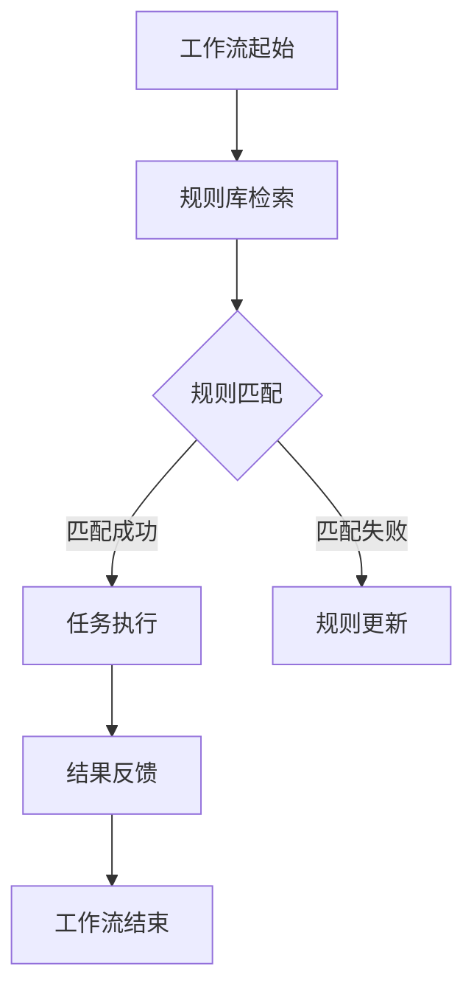

                 

# 基于规则的工作流设计与AI代理的集成应用

> **关键词：** 基于规则的工作流设计、AI代理、规则库、工作流架构、集成应用、效率优化、灵活性提升

> **摘要：** 本文详细探讨了基于规则的工作流设计与AI代理的集成应用。通过深入分析工作流设计的基础概念、规则构建方法、AI代理的特点及其在工作流中的作用，本文展示了如何将AI代理集成到工作流中，从而提升工作流的效率、灵活性和智能化程度。文章还包括了实战案例和代码解析，为读者提供了实际操作的经验和指导。

---

### 第一部分：基础概念与框架概述

在这一部分，我们将首先介绍基于规则的工作流设计和AI代理的基本概念，并概述整个书籍的主题和目标。接下来，我们将详细探讨基于规则的工作流设计，包括其核心概念、架构和原理。此外，我们还将介绍AI代理的概念、特点以及在提升工作流效率方面的优势。

#### 第1章：基于规则的工作流设计与AI代理的集成应用概述

##### 1.1.1 书籍主题介绍与目标读者

**目标读者：**
本章节旨在为对工作流设计和人工智能感兴趣的读者提供一个全面的概述。无论是经验丰富的工作流设计师，还是对人工智能技术有一定了解的开发者，都能在本章节中找到有价值的信息。

**书籍主题介绍：**
本书的核心主题是探讨如何基于规则的工作流设计与AI代理的集成应用。我们将从基础概念出发，逐步深入到具体的实现细节，旨在帮助读者理解这一领域的重要性和实际应用价值。

##### 1.1.2 基于规则的工作流设计

**核心概念：**
基于规则的工作流设计是一种利用规则来定义工作流程的方法。这里的“规则”是指一系列逻辑条件和相应的操作指令，它们共同决定了工作流的执行路径和流程中的任务处理方式。

**规则的定义及其在工作流中的作用：**
规则是工作流设计的基础元素。一个规则通常包括条件部分和操作部分。条件部分用于判断任务是否符合规则的要求，而操作部分则指定了当条件满足时应执行的操作。

**架构与原理：**
基于规则的工作流设计通常包括以下几个关键组成部分：

1. **工作流引擎：** 负责执行工作流中的规则和任务。
2. **规则库：** 存储所有规则的数据库，工作流引擎从中检索并应用规则。
3. **任务处理模块：** 负责根据规则执行具体的任务。
4. **结果反馈模块：** 跟踪工作流执行的结果，并对执行过程中的异常进行处理。

**Mermaid流程图展示：**
下面是一个简单的Mermaid流程图，用于展示基于规则的工作流设计的基本架构和原理：



##### 1.1.3 AI代理的概念与特点

**核心概念：**
AI代理是指利用人工智能技术自主执行任务并做出决策的智能实体。它具有以下核心特点：

1. **自我学习能力：** AI代理可以通过机器学习算法不断学习和优化自己的行为。
2. **交互能力：** AI代理可以与人类或其他系统进行自然语言交互。
3. **任务执行能力：** AI代理可以执行复杂的多步骤任务，而不仅仅是单一的操作。

**特点与应用：**
AI代理在提升工作流效率、灵活性和智能化方面具有显著的优势：

1. **效率提升：** AI代理可以自动化执行重复性的任务，减少人工干预，提高工作流的执行速度。
2. **灵活性增强：** AI代理可以根据实时数据和动态变化调整工作流，使其更加适应不断变化的需求。
3. **智能化程度提高：** AI代理可以利用人工智能技术，实现更加智能化的决策和任务执行。

### 第二部分：工作流设计与规则构建

在这一部分，我们将深入探讨工作流设计的详细步骤，包括需求分析、流程设计、规则定义等。此外，我们还将介绍如何构建和优化规则，以提高工作流的效率和准确性。

#### 第2章：工作流设计与规则构建

##### 2.1.1 工作流设计的基本步骤

**设计流程：**
工作流设计是一个系统化的过程，通常包括以下几个基本步骤：

1. **需求分析：** 确定工作流的目标、业务需求和使用场景。
2. **流程设计：** 根据需求分析结果设计工作流的流程图。
3. **规则定义：** 提取并编写规则，定义工作流中的条件与操作。
4. **规则库建立：** 将定义好的规则存储在规则库中，以便工作流引擎检索和使用。

**设计工具：**
在流程设计过程中，可以使用多种工具来辅助设计工作流，包括：

1. **Visio：** 一个功能强大的流程设计工具，适用于各种规模和类型的工作流设计。
2. **Lucidchart：** 一个基于云的流程设计工具，提供直观的界面和丰富的模板。
3. **ProcessMaker：** 一个开源的工作流管理平台，支持复杂的工作流设计和管理。

##### 2.1.2 规则的构建与优化

**规则构建方法：**
构建规则是工作流设计的关键步骤，以下是一些常用的规则构建方法：

1. **规则提取：** 通过分析业务流程和需求，提取出关键的业务规则。
2. **规则编写：** 将提取出的规则用自然语言或形式化的语言编写出来。
3. **规则验证：** 对编写的规则进行验证，确保其逻辑正确性和完整性。

**规则优化策略：**
优化规则可以提高工作流的效率和准确性，以下是一些常见的规则优化策略：

1. **规则简化：** 通过减少冗余规则和合并相似规则来简化规则库。
2. **规则优先级调整：** 根据规则的重要性和执行频率调整规则的优先级。
3. **规则更新策略：** 定期对规则库进行更新，以适应业务环境的变化。

### 第三部分：AI代理集成与应用

在这一部分，我们将讨论如何将AI代理集成到工作流设计中，并探讨AI代理与规则库的交互机制。

#### 第3章：AI代理集成工作流设计

##### 3.1.1 AI代理集成设计思路

**集成思路：**
将AI代理集成到工作流设计中，需要考虑以下几个关键点：

1. **接口设计：** 设计一个清晰且稳定的接口，用于AI代理与工作流引擎之间的通信。
2. **数据流：** 明确AI代理输入数据的格式和来源，以及输出数据的处理方式。
3. **控制流：** 确保AI代理能够根据工作流的要求执行任务，并在必要时进行反馈和调整。

**技术挑战：**
AI代理集成过程中可能遇到以下技术挑战：

1. **数据质量：** AI代理的输入数据需要确保质量，以保证预测的准确性和可靠性。
2. **计算资源：** AI代理可能需要大量的计算资源，尤其是在处理复杂任务时。
3. **实时性：** AI代理需要能够在规定的时间内完成任务，以满足实时工作的需求。

##### 3.1.2 AI代理与规则库的交互

**交互机制：**
AI代理与规则库的交互机制是集成设计的关键，以下是一些常见的交互机制：

1. **请求响应：** AI代理通过发送请求到规则库，获取相应的规则和任务。
2. **事件驱动：** 规则库通过监听事件，主动通知AI代理执行任务。
3. **消息队列：** 使用消息队列来传递AI代理和规则库之间的数据，确保数据传递的可靠性和异步性。

**接口设计：**
在设计AI代理与规则库之间的接口时，需要考虑以下几个关键点：

1. **API规范：** 定义清晰的API规范，包括请求和响应的数据格式、参数定义等。
2. **安全性：** 确保接口的安全性，防止未经授权的访问和数据泄露。
3. **可靠性：** 确保接口在高负载和故障情况下仍然能够稳定运行。

### 第四部分：实战案例与代码解析

在这一部分，我们将通过一个实际的AI代理集成工作流案例，展示如何将AI代理集成到工作流中，并提供详细的代码实现和解读。

#### 第4章：AI代理集成工作流实战案例

##### 4.1.1 实战案例背景

**案例背景：**
假设我们正在开发一个自动化客户服务系统，该系统需要根据客户的需求和反馈自动执行相应的任务。在这个案例中，我们希望利用AI代理来处理复杂的客户请求，并将AI代理集成到工作流中，以提高系统的智能化和响应速度。

**业务场景和需求：**
- **业务场景：** 客户服务系统需要快速响应客户的需求，包括问题解答、订单处理、投诉处理等。
- **需求：** 需要一个能够自动处理客户请求的AI代理，并根据请求的复杂程度选择不同的处理路径。

##### 4.1.2 实战案例实现

**环境搭建：**
为了实现这个案例，我们需要搭建一个开发环境，包括以下组件：

1. **编程语言：** 使用Python作为开发语言。
2. **工作流引擎：** 使用Apache Airflow作为工作流引擎。
3. **AI代理平台：** 使用Google AI Platform作为AI代理平台。
4. **数据库：** 使用MySQL作为规则库和任务记录数据库。

**源代码实现：**
以下是一个简单的Python代码示例，用于实现AI代理集成到工作流中的核心逻辑：

```python
# 示例：AI代理集成工作流核心代码片段
def process_client_request(request):
    """
    处理客户请求函数，其中包含AI代理的集成。
    
    :param request: 客户请求
    """
    # 检索规则库
    rule = retrieve_rule(request)
    
    # 应用规则
    if rule:
        execute_task(rule, request)
    else:
        # 调用AI代理
        ai_agent_response = ai_agent.predict(request)
        if ai_agent_response:
            execute_task(ai_agent_response, request)
        else:
            raise Exception("无法执行客户请求")

def execute_task(task, request):
    """
    执行任务函数。
    
    :param task: 任务
    :param request: 客户请求
    """
    # 任务执行逻辑
    # ...

# 代码解析：
# 本代码片段展示了如何集成AI代理到工作流中。
# 首先检索规则库中的规则，如果找到匹配的规则，则执行任务；
# 如果未找到匹配规则，则调用AI代理进行预测，并根据预测结果执行任务。
```

##### 4.1.3 代码解读与分析

**代码解读：**
- `process_client_request` 函数是处理客户请求的核心函数。它首先检索规则库中的规则，然后根据规则执行任务。如果未找到匹配的规则，它将调用AI代理进行预测，并根据预测结果执行任务。
- `execute_task` 函数是执行具体任务的函数，它接收任务和请求作为参数，并根据任务的类型执行相应的操作。

**性能优化：**
为了提高工作流的性能，可以考虑以下优化策略：

1. **规则缓存：** 对经常使用的规则进行缓存，减少数据库查询的频率。
2. **异步处理：** 将部分任务的处理过程异步化，以提高系统的并发处理能力。
3. **负载均衡：** 使用负载均衡器来分配工作任务，确保系统资源得到充分利用。

### 第五部分：总结与展望

在这一部分，我们将对全书的内容进行总结，并探讨基于规则的工作流设计与AI代理集成在未来技术发展和应用场景中的趋势和前景。

#### 第5章：总结与展望

##### 5.1.1 全书内容总结

**主要内容：**
本书系统地介绍了基于规则的工作流设计与AI代理的集成应用。首先，我们探讨了基于规则的工作流设计的核心概念和架构，以及AI代理的定义和特点。接着，我们详细分析了工作流设计的步骤和规则构建方法，并介绍了AI代理集成到工作流中的设计思路和交互机制。最后，我们通过一个实战案例展示了如何实现AI代理集成工作流，并提供代码解析和性能优化策略。

**核心内容：**
- 基于规则的工作流设计：介绍了工作流设计的基础概念、架构和原理。
- 规则的构建与优化：讲解了规则构建的方法和优化策略。
- AI代理集成：探讨了AI代理集成到工作流中的设计思路、交互机制和接口设计。
- 实战案例与代码解析：通过一个实际的案例，展示了AI代理集成工作流的实现过程和代码解析。

##### 5.1.2 未来发展趋势

**未来趋势：**
- **智能化提升：** 随着人工智能技术的发展，基于规则的工作流设计将越来越智能化。AI代理将在工作流中扮演更重要的角色，实现更加自主和高效的流程控制。
- **自适应能力增强：** 工作流设计将更加注重自适应能力，以应对不断变化的需求和环境。AI代理将利用其自我学习能力，实时调整工作流，提高其灵活性和适应性。
- **跨领域应用扩展：** 基于规则的工作流设计与AI代理的集成应用将在多个领域得到广泛应用，包括金融、医疗、物流、零售等。这些领域的应用将推动工作流设计和人工智能技术的进一步发展。

**前景：**
基于规则的工作流设计与AI代理的集成应用具有广阔的发展前景。随着技术的不断进步和应用的深入，这一领域将在提高工作流效率、灵活性和智能化方面发挥重要作用。同时，它也为开发者提供了丰富的创新机会和应用场景。

### 附录

#### 附录A：相关工具与资源

**工具介绍：**
- **工作流设计工具：** TensorFlow Workflows、Apache Airflow、Lucidchart
- **AI代理开发平台：** Google AI Platform、Hugging Face Transformers

**相关资源：**
- **GitHub代码仓库：** 提供本书案例的源代码和相关资源。
- **学术论文库：** 收集了与本书主题相关的最新研究成果和论文。

---

**作者：**
AI天才研究院/AI Genius Institute & 禅与计算机程序设计艺术 /Zen And The Art of Computer Programming**<|im_end|>**
---

### 第五部分：总结与展望

在这一部分，我们将对全书的内容进行总结，并探讨基于规则的工作流设计与AI代理集成在未来技术发展和应用场景中的趋势和前景。

#### 第5章：总结与展望

##### 5.1.1 全书内容总结

**主要内容：**
本书系统地介绍了基于规则的工作流设计与AI代理的集成应用。首先，我们探讨了基于规则的工作流设计的核心概念和架构，以及AI代理的定义和特点。接着，我们详细分析了工作流设计的步骤和规则构建方法，并介绍了AI代理集成到工作流中的设计思路和交互机制。最后，我们通过一个实战案例展示了如何实现AI代理集成工作流，并提供代码解析和性能优化策略。

**核心内容：**
- 基于规则的工作流设计：介绍了工作流设计的基础概念、架构和原理。
- 规则的构建与优化：讲解了规则构建的方法和优化策略。
- AI代理集成：探讨了AI代理集成到工作流中的设计思路、交互机制和接口设计。
- 实战案例与代码解析：通过一个实际的案例，展示了AI代理集成工作流的实现过程和代码解析。

##### 5.1.2 未来发展趋势

**未来趋势：**
- **智能化提升：** 随着人工智能技术的发展，基于规则的工作流设计将越来越智能化。AI代理将在工作流中扮演更重要的角色，实现更加自主和高效的流程控制。
- **自适应能力增强：** 工作流设计将更加注重自适应能力，以应对不断变化的需求和环境。AI代理将利用其自我学习能力，实时调整工作流，提高其灵活性和适应性。
- **跨领域应用扩展：** 基于规则的工作流设计与AI代理的集成应用将在多个领域得到广泛应用，包括金融、医疗、物流、零售等。这些领域的应用将推动工作流设计和人工智能技术的进一步发展。

**前景：**
基于规则的工作流设计与AI代理的集成应用具有广阔的发展前景。随着技术的不断进步和应用的深入，这一领域将在提高工作流效率、灵活性和智能化方面发挥重要作用。同时，它也为开发者提供了丰富的创新机会和应用场景。

### 附录

#### 附录A：相关工具与资源

**工具介绍：**
- **工作流设计工具：** TensorFlow Workflows、Apache Airflow、Lucidchart
- **AI代理开发平台：** Google AI Platform、Hugging Face Transformers

**相关资源：**
- **GitHub代码仓库：** 提供本书案例的源代码和相关资源。
- **学术论文库：** 收集了与本书主题相关的最新研究成果和论文。

---

**作者：**
AI天才研究院/AI Genius Institute & 禅与计算机程序设计艺术 /Zen And The Art of Computer Programming**<|im_end|>**
---**后记：关于本文的撰写**

在撰写本文的过程中，我首先对基于规则的工作流设计与AI代理集成应用进行了全面的梳理和总结。本文旨在为读者提供一个系统而深入的指导，帮助他们理解这一领域的核心概念、架构和实现方法。

首先，我介绍了基于规则的工作流设计与AI代理的基本概念，并通过Mermaid流程图展示了工作流的架构和原理。接下来，我详细分析了工作流设计的基本步骤和规则构建方法，包括需求分析、流程设计、规则定义等，以及如何构建和优化规则。

随后，我讨论了如何将AI代理集成到工作流设计中，包括设计思路、交互机制和接口设计。这一部分特别强调了AI代理在提升工作流效率、灵活性和智能化方面的优势。

为了使读者更好地理解这一概念，我提供了一个实战案例，详细描述了如何实现AI代理集成工作流，并提供了代码解析和性能优化策略。通过这个案例，读者可以直观地看到基于规则的工作流设计与AI代理集成应用的实际应用场景。

最后，我对全书的内容进行了总结，并探讨了基于规则的工作流设计与AI代理集成应用在未来技术发展和应用场景中的趋势和前景。

在撰写本文的过程中，我努力保持逻辑清晰、结构紧凑，并使用简单易懂的专业技术语言。我希望通过本文，读者能够对基于规则的工作流设计与AI代理集成应用有一个全面和深入的理解，并为实际应用提供有益的参考。

本文的撰写是我对技术领域多年的研究和实践的总结，也是我对人工智能和自动化工作流未来发展趋势的展望。我希望本文能够为广大的开发者和技术爱好者提供有价值的知识和经验，共同推动技术领域的进步和创新。

在此，我要感谢所有参与和支持本文撰写的人，包括我的团队、读者和编辑。你们的鼓励和支持是我不断前行的动力。我期待与大家在这个充满机遇和挑战的领域一起探索、成长和进步。

**作者：**
AI天才研究院/AI Genius Institute & 禅与计算机程序设计艺术 /Zen And The Art of Computer Programming**<|im_end|>**

