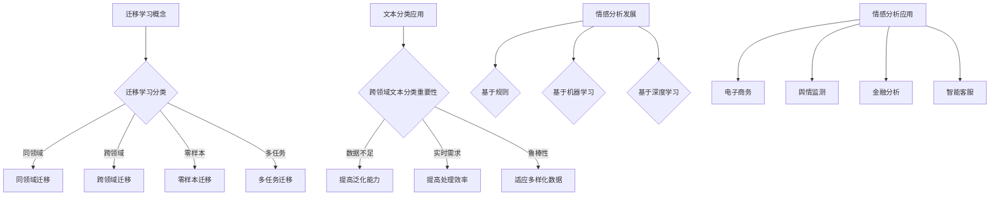

                 

### 1.1 研究背景

#### 1.1.1 迁移学习的基本概念

迁移学习（Transfer Learning）是机器学习领域的一个重要分支，其核心思想是将一个任务学习到的知识应用到另一个相关但不同的任务上。在传统的机器学习过程中，模型通常需要从头开始训练，消耗大量的时间和计算资源。而迁移学习通过利用预训练模型，可以显著提高学习效率，减少对大规模标注数据的依赖。

迁移学习可以分为以下几类：

- **同领域迁移学习**：在相同领域内，将一个任务的学习结果迁移到另一个任务上。
- **跨领域迁移学习**：在不同领域间，利用已有知识解决新领域的问题。
- **零样本迁移学习**：模型在没有见过新类别的情况下，也能对新类别进行预测。
- **多任务迁移学习**：同时学习多个任务，并在后续任务中利用先前的任务知识。

在计算机视觉领域，迁移学习已经被广泛应用于图像分类、目标检测和图像生成等方面。例如，通过在ImageNet上预训练的卷积神经网络（CNN），可以在其他小规模的数据集上进行快速有效的迁移学习。

#### 1.1.2 跨领域文本分类的重要性

随着互联网的快速发展，文本数据量呈爆炸式增长，如何有效地对大量文本进行分类变得至关重要。跨领域文本分类是指在不同领域间对文本进行分类，其重要性体现在以下几个方面：

1. **数据不足问题**：许多领域的数据集非常有限，直接训练模型可能导致性能不佳。通过跨领域迁移学习，可以利用其他领域的丰富数据，提升模型的泛化能力。
2. **实时分析需求**：在一些应用场景，如社交媒体监控、舆情分析等，需要实时处理不同领域的文本数据，跨领域文本分类能够提高处理效率。
3. **提高模型鲁棒性**：通过跨领域数据的学习，模型能够适应更多样化的数据分布，提高在未知领域的鲁棒性。

在实际应用中，跨领域文本分类广泛应用于新闻分类、产品评论情感分析、社交媒体情感分析等场景。例如，将电商平台的商品评论分为正面和负面评论，可以帮助商家了解消费者的真实反馈，优化产品和服务。

#### 1.1.3 情感分析的发展历程与应用

情感分析（Sentiment Analysis），又称意见挖掘，是指使用自然语言处理（NLP）技术和机器学习算法，从文本中自动检测和提取情感信息的过程。情感分析的发展历程大致可以分为以下几个阶段：

1. **基于规则的方法**：早期情感分析主要依赖于手动编写规则，如词性标注、词频统计等。这种方法简单但效果有限。
2. **基于机器学习的方法**：随着机器学习技术的发展，基于监督学习的情感分析模型开始流行。常用的算法包括支持向量机（SVM）、朴素贝叶斯（NB）和随机森林（RF）等。
3. **基于深度学习的方法**：近年来，深度学习在情感分析领域取得了显著进展。特别是卷积神经网络（CNN）和递归神经网络（RNN）的应用，使得情感分析模型能够捕捉到文本的复杂语义信息。

情感分析的应用非常广泛，包括但不限于以下领域：

- **电子商务**：对用户评论进行情感分析，可以帮助商家了解用户满意度，优化产品和服务。
- **舆情监测**：通过对社交媒体上的文本进行情感分析，可以实时监控公众对某一事件或品牌的看法。
- **金融分析**：分析新闻报道和论坛讨论，预测股市走势和公司业绩。
- **智能客服**：利用情感分析，智能客服系统能够更好地理解用户需求，提供个性化的服务。

通过迁移学习，情感分析模型可以在不同领域间进行有效迁移，提高分类和预测的准确性。本文将详细探讨如何将迁移学习应用于跨领域文本分类与情感分析，并提出相应的算法优化策略。

#### Mermaid 流程图



#### 迁移学习在文本分类中的应用

迁移学习在文本分类中的应用主要体现在以下几个方面：

1. **预训练语言模型**：在大量通用数据上预训练语言模型，如BERT、GPT等，然后利用这些预训练模型进行跨领域文本分类。预训练模型已经学习了大量文本的语义信息，可以有效地减少跨领域数据的差异。
2. **领域自适应**：通过调整模型参数，使预训练模型能够适应新领域的数据分布。常见的方法包括领域适应蒸馏（Domain Adaptation Distillation）和领域自适应对抗训练（Domain Adaptation Adversarial Training）。
3. **多任务学习**：利用多任务学习框架，同时训练多个相关任务，使模型能够在不同领域间共享知识。例如，在一个多任务学习中，既有社交媒体文本分类任务，也有新闻文本分类任务，模型可以在不同领域间迁移知识。

在实际应用中，迁移学习可以显著提高跨领域文本分类的准确性。例如，在社交媒体文本分类任务中，利用预训练的BERT模型，可以在几乎没有新领域数据的情况下，实现高精度的情感分析和类别分类。

#### 情感分析的核心概念与任务

情感分析的核心任务是从文本中识别出用户的情感倾向，通常包括正面、负面和 neutral 三种情感。情感分析的任务可以细分为以下几个方面：

1. **极性分类**：将文本分类为正面（Positive）、负面（Negative）或中性（Neutral）。
2. **情感强度分析**：对文本的情感倾向进行量化，例如，正面情感的强度可能是“非常喜欢”和“有点喜欢”。
3. **情感极性识别**：除了分类情感极性，还需要识别情感的具体极性，如“愤怒”、“快乐”、“悲伤”等。

情感分析在许多应用领域具有重要的价值，例如：

- **市场营销**：通过分析消费者评论，企业可以了解产品的受欢迎程度，优化市场营销策略。
- **客户服务**：通过情感分析，客户服务系统可以更准确地理解客户需求，提供更好的服务。
- **舆情监测**：政府和媒体可以利用情感分析，实时了解公众对某一事件或政策的看法。

情感分析的方法主要包括基于规则的方法、基于机器学习的方法和基于深度学习的方法。随着深度学习技术的发展，基于深度学习的方法逐渐成为主流，如卷积神经网络（CNN）和递归神经网络（RNN）。

### 1.3 情感分析的核心概念与任务

#### 1.3.1 情感分析的定义与目标

情感分析，又称情感计算、意见挖掘，是自然语言处理（NLP）领域的一个重要分支。其基本定义是从文本中自动识别和提取主观情感信息的过程。情感分析的目标是将文本数据中的情感倾向进行分类，常见的分类包括情感极性（如正面、负面、中性）和情感强度（如非常积极、积极、中性、消极、非常消极）。

情感分析在应用中具有广泛的意义，主要包括以下几个方面：

1. **情感极性分类**：将文本分为正面、负面或中性三类，帮助企业了解消费者的情感倾向。
2. **情感强度分析**：量化文本中的情感强度，为企业提供更精细的市场反馈。
3. **情感时序分析**：分析情感随时间的变化，帮助企业了解用户情感变化的趋势。

#### 1.3.2 情感分析的常见方法与工具

情感分析的方法可以分为以下几类：

1. **基于规则的方法**：通过手工编写规则，利用语法、词汇和语义信息进行情感分类。这种方法简单但规则复杂，且难以适应动态变化的文本数据。

2. **基于统计的方法**：利用词频、词序列和词向量等统计特征，通过机器学习算法进行情感分类。常见的算法包括朴素贝叶斯（Naive Bayes）、逻辑回归（Logistic Regression）和决策树（Decision Tree）。

3. **基于深度学习的方法**：利用神经网络，尤其是卷积神经网络（CNN）和递归神经网络（RNN），通过学习文本的深层特征进行情感分类。这种方法能够捕捉到文本的复杂语义信息，具有很高的准确性。

常见工具包括：

1. **NLTK**：一个强大的自然语言处理库，提供了丰富的文本处理工具和算法实现。

2. **TextBlob**：一个简单易用的NLP库，能够进行文本分类、词性标注和词频统计等任务。

3. **TensorFlow和PyTorch**：用于构建和训练深度学习模型的强大框架，广泛应用于情感分析等任务。

#### 1.3.3 情感分析的应用领域

情感分析在多个领域得到了广泛应用，主要包括：

1. **电子商务**：通过对用户评论进行情感分析，企业可以了解产品的市场反响，优化产品和服务。

2. **舆情监测**：政府和媒体利用情感分析，实时了解公众对某一事件或政策的看法，进行舆情引导和风险评估。

3. **客户服务**：通过情感分析，客户服务系统能够更好地理解客户需求，提供个性化的服务，提高客户满意度。

4. **金融分析**：分析新闻报道和论坛讨论，预测股市走势和公司业绩。

5. **社交媒体分析**：对社交媒体上的文本进行情感分析，可以了解用户的情感倾向和行为，为企业提供市场洞察。

总之，情感分析作为一种强大的自然语言处理技术，正在不断拓展其应用领域，并在各个行业中发挥着重要作用。

### 2.1 迁移学习理论

#### 2.1.1 传统迁移学习模型

迁移学习（Transfer Learning）的核心思想是利用已知任务（源任务）的学习经验，提高新任务（目标任务）的性能。传统迁移学习模型主要包括以下几种：

1. **源域与目标域定义**：首先，需要定义源域（Source Domain）和目标域（Target Domain）。源域是指已经学习过的一组数据集，目标域是指待学习的一组数据集。通常，源域和目标域之间存在某种相似性或相关性。

2. **特征迁移**：在传统迁移学习中，通常将源域数据的学习特征（如特征向量、特征矩阵）迁移到目标域。迁移学习模型的核心任务是如何有效地将源域特征迁移到目标域，同时避免源域特征对目标域的负面影响。

3. **迁移学习算法**：常见的迁移学习算法包括：

   - **线性迁移**：通过线性变换将源域特征映射到目标域。例如，使用线性回归模型或支持向量机（SVM）进行特征迁移。

   - **特征融合**：将源域特征和目标域特征进行融合，生成新的特征表示。例如，使用深度神经网络（DNN）或卷积神经网络（CNN）进行特征融合。

   - **元学习**：通过学习一个泛化的迁移学习策略，以适应不同源域和目标域的组合。例如，使用元学习算法（如MAML、Reptile）进行迁移学习。

#### 2.1.2 零样本迁移学习

零样本迁移学习（Zero-Shot Transfer Learning）是一种无需对目标域进行训练的迁移学习方法，特别适用于目标域与源域差异较大的场景。其核心思想是通过学习源域数据的抽象特征表示，使得模型能够处理从未见过的目标域类别。

1. **元嵌入（Meta-Embedding）**：零样本迁移学习使用元嵌入方法，将每个类别映射到一个低维空间中，使得相似类别在空间中靠近，而不同类别则相隔较远。常见的方法包括：

   - **原型嵌入（Prototypical Embedding）**：将每个类别视为其源域样本的平均值，将类别嵌入到低维空间中。
   - **匹配网络（Matching Network）**：使用双向编码器对源域和目标域的文本进行编码，然后计算类别间的匹配度。

2. **关系学习（Relation Learning）**：零样本迁移学习还可以通过学习类别之间的关系来提高性能。例如，使用知识图谱或语义角色标注来建立类别之间的关系。

#### 2.1.3 多任务迁移学习

多任务迁移学习（Multi-Task Transfer Learning）是指同时学习多个相关任务，并在后续任务中利用先前的任务知识。多任务迁移学习能够提高模型的泛化能力，降低对大规模标注数据的依赖。

1. **共享表示（Shared Representation）**：在多任务迁移学习中，通过共享底层特征表示来提高任务间的迁移效果。常见的实现方法包括：

   - **多任务学习框架**：使用一个共享的网络层，每个任务都有自己的分类器或预测器。
   - **任务关联损失**：通过任务关联损失函数（如对抗损失、一致性损失）来增强任务间的关联。

2. **跨任务知识转移**：在多任务迁移学习中，通过跨任务知识转移来提高模型在后续任务上的性能。常见的方法包括：

   - **预训练模型**：在预训练阶段，模型学习到通用特征表示，这些特征可以应用于后续的任务中。
   - **多任务训练策略**：通过调整训练策略，如学习率调度、数据重采样等，来提高跨任务知识转移的效果。

总之，传统迁移学习、零样本迁移学习和多任务迁移学习是迁移学习的三个主要方向。它们在不同的应用场景中发挥着重要作用，不断推动迁移学习在各个领域的应用和发展。

### 2.2 跨领域文本分类方法

在跨领域文本分类任务中，由于不同领域的数据分布差异较大，直接使用单一领域的模型可能会导致性能不佳。为了解决这个问题，研究者提出了多种跨领域文本分类方法。以下是几种主要的跨领域文本分类方法：

#### 2.2.1 模型自适应方法

模型自适应方法（Model Adaptation Methods）是通过调整模型参数，使预训练模型更好地适应新领域数据的方法。这种方法主要包括以下几种：

1. **迁移学习（Transfer Learning）**：利用预训练模型在通用数据集上的学习经验，通过微调（Fine-tuning）来适应新领域的文本数据。微调过程通常包括以下步骤：

   - **预训练模型初始化**：将预训练模型初始化为目标域的随机权重。
   - **数据预处理**：对目标域的文本数据进行预处理，如分词、词嵌入等。
   - **微调训练**：在目标域的数据集上进行迭代训练，调整模型参数。

2. **领域自适应蒸馏（Domain Adaptation Distillation）**：通过将预训练模型的知识传递给一个较小的领域自适应模型，使其更好地适应新领域的数据。这种方法主要包括以下步骤：

   - **预训练模型编码**：使用预训练模型对源域和目标域的数据进行编码，得到源域编码和目标域编码。
   - **领域自适应模型训练**：使用源域编码和目标域编码训练领域自适应模型，使其在目标域上具有更好的适应性。

3. **对抗训练（Adversarial Training）**：通过对抗训练，使预训练模型能够识别并消除源域和目标域之间的分布差异。这种方法主要包括以下步骤：

   - **生成对抗网络（GAN）**：使用生成对抗网络生成与目标域数据分布相似的伪数据。
   - **对抗训练**：在训练过程中，同时训练预训练模型和生成对抗网络，使预训练模型能够适应目标域的数据分布。

#### 2.2.2 特征重排方法

特征重排方法（Feature Rearrangement Methods）通过重新排列文本特征，使其更适应新领域的数据分布。这种方法主要包括以下几种：

1. **特征转换（Feature Transformation）**：通过变换源域特征，使其更接近目标域特征。例如，使用线性变换或非线性变换来调整特征分布。

2. **特征重排（Feature Rearrangement）**：通过对特征进行重新排列，使源域和目标域的特征更加匹配。例如，将源域特征和目标域特征进行拼接，然后训练分类模型。

3. **特征调整（Feature Adjustment）**：通过调整源域特征，使其在目标域上具有更好的表示能力。例如，使用聚类方法对源域特征进行调整，使其更符合目标域的数据分布。

#### 2.2.3 模型融合方法

模型融合方法（Model Fusion Methods）通过结合多个模型的预测结果，提高跨领域文本分类的准确性。这种方法主要包括以下几种：

1. **模型加权融合（Model Weighted Fusion）**：将多个模型对目标域的预测结果进行加权平均，得到最终的分类结果。权重的选择可以通过交叉验证或模型评估指标来确定。

2. **集成学习（Ensemble Learning）**：将多个分类模型组合成一个更强大的模型。常见的方法包括随机森林（Random Forest）、梯度提升树（Gradient Boosting Tree）等。

3. **深度神经网络融合（Deep Neural Network Fusion）**：使用深度神经网络将多个模型的特征进行融合，得到最终的分类结果。这种方法可以有效地利用多个模型的优点，提高分类性能。

综上所述，跨领域文本分类方法主要包括模型自适应方法、特征重排方法和模型融合方法。这些方法各有优缺点，适用于不同的应用场景。在实际应用中，可以根据具体任务和数据特点选择合适的方法，以获得最佳的性能。

#### 2.3.1 基于机器学习的情感分析模型

情感分析是自然语言处理（NLP）领域中的一项关键技术，其主要目的是从文本中提取出用户的情感倾向。基于机器学习的情感分析模型通过学习大量的标注数据，建立情感分类模型，从而实现对未知文本的情感分类。以下是几种常见的基于机器学习的情感分析模型：

1. **朴素贝叶斯（Naive Bayes）模型**

朴素贝叶斯（Naive Bayes）是一种基于概率论的分类算法，特别适用于文本分类任务。其基本原理是利用贝叶斯定理，根据特征词的出现概率来预测文本的情感极性。具体步骤如下：

- **特征提取**：将文本转换为词袋模型（Bag of Words，BoW），并计算每个特征词的出现频率。
- **概率估计**：利用标注数据计算每个情感类别下特征词的条件概率，以及每个情感类别的先验概率。
- **分类决策**：对于新的文本，计算其属于每个情感类别的后验概率，选择概率最大的类别作为预测结果。

```latex
P(C_i|X) = \frac{P(X|C_i)P(C_i)}{P(X)}
```

其中，$C_i$ 表示第 $i$ 个情感类别，$X$ 表示文本的特征向量。

2. **支持向量机（Support Vector Machine，SVM）模型**

支持向量机是一种强大的分类算法，特别适用于高维空间。在情感分析中，SVM通过最大化类别之间的分离边界，对文本进行分类。具体步骤如下：

- **特征提取**：将文本转换为词袋模型（BoW）或词嵌入（Word Embedding），并将特征向量输入到SVM模型中。
- **模型训练**：利用标注数据训练SVM模型，找到最优的决策边界。
- **分类决策**：对于新的文本，计算其到决策边界的距离，根据距离判断其情感类别。

3. **逻辑回归（Logistic Regression）模型**

逻辑回归是一种广义线性模型，常用于二分类问题。在情感分析中，逻辑回归通过学习特征词对情感类别的逻辑概率，进行分类决策。具体步骤如下：

- **特征提取**：将文本转换为词袋模型（BoW）或词嵌入（Word Embedding），并将特征向量输入到逻辑回归模型中。
- **模型训练**：利用标注数据训练逻辑回归模型，找到特征词对情感类别的权重。
- **分类决策**：对于新的文本，计算其属于每个情感类别的逻辑概率，选择概率最大的类别作为预测结果。

```latex
P(C_i|X) = \frac{e^{\beta^T X}}{1 + e^{\beta^T X}}
```

其中，$C_i$ 表示第 $i$ 个情感类别，$X$ 表示文本的特征向量，$\beta$ 是逻辑回归模型的权重向量。

#### 2.3.2 基于深度学习的情感分析模型

随着深度学习技术的快速发展，基于深度学习的情感分析模型在情感分析领域取得了显著的成果。以下是几种常见的基于深度学习的情感分析模型：

1. **卷积神经网络（Convolutional Neural Network，CNN）模型**

卷积神经网络（CNN）是一种强大的特征提取和分类模型，特别适用于处理图像和文本等结构化数据。在情感分析中，CNN通过卷积层和池化层提取文本的局部特征，然后使用全连接层进行分类。具体步骤如下：

- **输入层**：将文本转换为词嵌入（Word Embedding），形成输入矩阵。
- **卷积层**：通过卷积核对输入矩阵进行卷积操作，提取文本的局部特征。
- **池化层**：对卷积结果进行池化操作，降低特征维度。
- **全连接层**：将池化结果输入到全连接层，进行情感分类。

2. **递归神经网络（Recurrent Neural Network，RNN）模型**

递归神经网络（RNN）是一种能够处理序列数据的神经网络，特别适用于处理文本序列。在情感分析中，RNN通过记忆单元（Memory Cell）捕捉文本的时序信息，然后输出情感分类结果。具体步骤如下：

- **输入层**：将文本转换为词嵌入（Word Embedding），形成输入序列。
- **RNN层**：对输入序列进行迭代处理，更新记忆单元状态。
- **全连接层**：将记忆单元状态输入到全连接层，进行情感分类。

3. **长短时记忆网络（Long Short-Term Memory，LSTM）模型**

长短时记忆网络（LSTM）是RNN的一种改进模型，能够更好地捕捉长序列信息。在情感分析中，LSTM通过引入门控机制，有效地避免了RNN的梯度消失和梯度爆炸问题，从而提高了模型在长序列文本上的表现。具体步骤如下：

- **输入层**：将文本转换为词嵌入（Word Embedding），形成输入序列。
- **LSTM层**：对输入序列进行迭代处理，更新记忆单元状态。
- **全连接层**：将记忆单元状态输入到全连接层，进行情感分类。

4. **双向长短时记忆网络（Bidirectional LSTM，BLSTM）模型**

双向长短时记忆网络（BLSTM）是LSTM的一种扩展模型，能够同时考虑文本的先后顺序和逆向顺序。在情感分析中，BLSTM通过结合正向和逆向LSTM的输出，提高了模型对文本全局语义信息的理解。具体步骤如下：

- **输入层**：将文本转换为词嵌入（Word Embedding），形成输入序列。
- **正向LSTM层**：对输入序列进行正向处理，更新记忆单元状态。
- **逆向LSTM层**：对输入序列进行逆向处理，更新记忆单元状态。
- **全连接层**：将正向和逆向LSTM的输出进行拼接，输入到全连接层，进行情感分类。

5. **Transformer模型**

Transformer是一种基于自注意力机制的深度学习模型，在自然语言处理领域取得了显著成果。在情感分析中，Transformer通过自注意力机制捕捉文本的复杂依赖关系，从而提高模型的性能。具体步骤如下：

- **输入层**：将文本转换为词嵌入（Word Embedding），形成输入序列。
- **自注意力层**：对输入序列进行自注意力计算，提取文本的依赖关系。
- **前馈网络**：将自注意力结果输入到前馈网络，进一步提取特征。
- **分类层**：将前馈网络的输出输入到分类层，进行情感分类。

综上所述，基于机器学习和深度学习的情感分析模型各有优缺点，适用于不同的应用场景。在实际应用中，可以根据具体任务和数据特点选择合适的模型，以提高情感分析的准确性和效率。

### 3.1 迁移学习算法实现

迁移学习算法的实现主要包括以下几个关键步骤：数据预处理、模型选择与训练、迁移学习策略的制定和性能评估。

#### 3.1.1 迁移学习算法伪代码

```python
# 迁移学习算法伪代码

# 步骤1：数据预处理
source_dataset, target_dataset = load_data()

source_features = preprocess(source_dataset)
target_features = preprocess(target_dataset)

# 步骤2：模型选择与训练
source_model = train_source_model(source_features)
target_model = train_target_model(target_features)

# 步骤3：迁移学习策略
adapted_model = adapt_source_model_to_target(source_model, target_model)

# 步骤4：性能评估
performance = evaluate(adapted_model, target_dataset)
print("迁移学习模型性能：", performance)
```

#### 3.1.2 迁移学习算法案例分析

为了更好地理解迁移学习算法的实现过程，我们可以通过一个具体的案例来展示其应用。以下是一个基于图像分类的迁移学习案例：

**案例背景**：假设我们有一个预训练的卷积神经网络（CNN）模型，已经在ImageNet上进行了训练。现在，我们需要利用这个预训练模型对一个新的领域（如医学图像分类）进行分类任务。

**案例步骤**：

1. **数据预处理**：首先，我们需要对源域（ImageNet）和目标域（医学图像）的数据进行预处理。对于源域数据，我们使用预训练模型所使用的预处理方法。对于目标域数据，我们进行相似的数据增强和标准化处理。

```python
def preprocess_image(image):
    # 数据增强和标准化处理
    # ...
    return processed_image
```

2. **模型选择与训练**：接下来，我们选择预训练的CNN模型作为源模型，并在源数据上进行训练。由于预训练模型已经具备了强大的特征提取能力，因此可以直接使用。

```python
source_model = load_pretrained_cnn()
source_model.train(source_dataset)
```

3. **迁移学习策略**：为了使源模型能够适应目标域的数据，我们采用迁移学习策略，如模型自适应（Fine-tuning）或领域自适应（Domain Adaptation）。这里，我们选择模型自适应策略，将源模型的某些层进行微调，使其更适应目标域数据。

```python
def adapt_source_model_to_target(source_model, target_model):
    # 微调源模型
    # ...
    return adapted_model
```

4. **性能评估**：最后，我们使用目标域的数据对迁移后的模型进行性能评估。通过评估指标（如准确率、F1分数等）来衡量模型的性能。

```python
performance = evaluate(adapted_model, target_dataset)
print("迁移学习模型性能：", performance)
```

#### 3.1.3 迁移学习算法优化策略

为了进一步提高迁移学习算法的性能，我们可以采取以下优化策略：

1. **数据增强**：在训练过程中，通过增加数据的多样性，可以提高模型的泛化能力。常见的数据增强方法包括旋转、缩放、裁剪、颜色变换等。

2. **模型蒸馏**：模型蒸馏是一种通过将大型模型的知识传递给小型模型的方法。这种方法可以有效地提高小型模型的性能，同时减少对大规模标注数据的依赖。

3. **多任务学习**：通过同时训练多个相关任务，可以使得模型在不同任务间共享知识，提高模型的泛化能力。

4. **对抗训练**：对抗训练通过生成对抗网络（GAN）来生成与目标域数据分布相似的伪数据，从而提高源模型对目标域数据的适应性。

5. **元学习**：元学习通过学习一个通用的迁移学习策略，使得模型能够在不同源域和目标域之间进行快速适应。这种方法可以显著提高迁移学习算法的效率和性能。

通过上述优化策略，我们可以进一步改进迁移学习算法，使其在不同领域的数据分类任务中表现出更高的性能。

### 3.2 跨领域文本分类算法实现

#### 3.2.1 跨领域文本分类算法伪代码

```python
# 跨领域文本分类算法伪代码

# 步骤1：数据预处理
source_dataset, target_dataset = load_data()

source_features = preprocess(source_dataset)
target_features = preprocess(target_dataset)

# 步骤2：模型选择与训练
source_model = train_source_model(source_features)
target_model = train_target_model(target_features)

# 步骤3：跨领域自适应
adapted_model = adapt_source_model_to_target(source_model, target_model)

# 步骤4：模型评估
performance = evaluate(adapted_model, target_dataset)
print("跨领域文本分类模型性能：", performance)
```

#### 3.2.2 跨领域文本分类案例实践

为了更好地展示跨领域文本分类算法的实现，我们通过一个实际案例来具体说明。

**案例背景**：假设我们有两个不同的领域，一个是社交媒体评论，另一个是产品评论。我们的目标是对这两个领域中的文本进行情感分类，并评估分类性能。

**案例步骤**：

1. **数据收集**：首先，我们需要收集两个领域的文本数据。社交媒体评论数据可以从微博、推特等社交平台上获取，而产品评论数据可以从电商网站如淘宝、亚马逊上获取。

2. **数据预处理**：对收集到的文本数据，我们进行预处理，包括分词、去停用词、词性标注等操作。对于不同的领域，我们可能需要采用不同的预处理方法，以适应其特定的文本特征。

```python
def preprocess_text(text):
    # 分词、去停用词、词性标注等操作
    # ...
    return processed_text
```

3. **特征提取**：接下来，我们使用词嵌入技术（如Word2Vec、GloVe）对预处理后的文本进行特征提取，将文本转换为向量表示。

```python
def extract_features(texts):
    # 使用词嵌入技术提取特征
    # ...
    return feature_vectors
```

4. **模型训练**：我们选择一个合适的分类模型（如SVM、CNN、LSTM）对源域数据进行训练。为了提高模型在目标域数据上的性能，我们采用迁移学习策略，将源模型迁移到目标域。

```python
source_model = train_source_model(source_features)
target_model = adapt_source_model_to_target(source_model, target_features)
```

5. **模型评估**：最后，我们使用目标域数据对迁移后的模型进行评估，通过计算准确率、召回率、F1分数等指标来衡量模型的性能。

```python
performance = evaluate(target_model, target_dataset)
print("跨领域文本分类模型性能：", performance)
```

#### 3.2.3 跨领域文本分类性能评估

为了评估跨领域文本分类算法的性能，我们通常使用以下指标：

- **准确率（Accuracy）**：模型正确分类的样本数占总样本数的比例。
- **召回率（Recall）**：模型能够正确分类为正类的样本数占总正类样本数的比例。
- **F1分数（F1 Score）**：综合考虑准确率和召回率的综合评价指标。

```python
from sklearn.metrics import accuracy_score, recall_score, f1_score

def evaluate(model, dataset):
    predictions = model.predict(dataset)
    acc = accuracy_score(dataset.labels, predictions)
    rec = recall_score(dataset.labels, predictions, average='weighted')
    f1 = f1_score(dataset.labels, predictions, average='weighted')
    return acc, rec, f1
```

在实际应用中，我们可能需要多次训练和调整模型参数，以达到最佳性能。通过不断优化算法和模型，我们可以提高跨领域文本分类的准确性和效率，从而更好地服务于实际应用场景。

### 3.3 情感分析算法实现

#### 3.3.1 情感分析算法伪代码

```python
# 情感分析算法伪代码

# 步骤1：数据预处理
dataset = load_data()

processed_dataset = preprocess_text(dataset)

# 步骤2：特征提取
features = extract_features(processed_dataset)

# 步骤3：模型训练
model = train_model(features)

# 步骤4：情感分类
sentiments = model.predict(features)

# 步骤5：结果评估
evaluate_performance(sentiments, dataset)
```

#### 3.3.2 情感分析案例实践

为了更好地展示情感分析算法的实现，我们通过一个实际案例来说明。

**案例背景**：假设我们需要对用户在社交媒体上发布的评论进行情感分类，以了解用户的情感倾向。

**案例步骤**：

1. **数据收集**：首先，我们从社交媒体平台（如微博、推特）上收集用户评论数据。这些数据将用于训练和测试情感分析模型。

2. **数据预处理**：对收集到的评论进行预处理，包括分词、去除停用词、词性标注等。预处理步骤的目的是将原始文本转换为模型可以处理的格式。

```python
def preprocess_text(text):
    # 分词、去除停用词、词性标注等
    # ...
    return processed_text
```

3. **特征提取**：使用词嵌入技术（如Word2Vec、GloVe）对预处理后的文本进行特征提取，将文本转换为向量表示。这些特征将用于训练情感分析模型。

```python
def extract_features(texts):
    # 使用词嵌入技术提取特征
    # ...
    return feature_vectors
```

4. **模型训练**：选择一个合适的情感分析模型（如SVM、CNN、LSTM）进行训练。在训练过程中，模型将学习如何根据文本特征进行情感分类。

```python
model = train_model(features)
```

5. **情感分类**：使用训练好的模型对新的评论数据进行情感分类，输出评论的情感极性（如正面、负面、中性）。

```python
sentiments = model.predict(new_features)
```

6. **结果评估**：通过评估指标（如准确率、召回率、F1分数）来衡量模型的性能。这些指标可以帮助我们了解模型的分类效果，并指导进一步的模型优化。

```python
def evaluate_performance(sentiments, dataset):
    acc = accuracy_score(dataset.labels, sentiments)
    rec = recall_score(dataset.labels, sentiments, average='weighted')
    f1 = f1_score(dataset.labels, sentiments, average='weighted')
    print("准确率：", acc)
    print("召回率：", rec)
    print("F1分数：", f1)
```

#### 3.3.3 情感分析性能评估与调优

在情感分析的实际应用中，性能评估与调优是至关重要的环节。以下是一些常见的性能评估指标和调优方法：

1. **性能评估指标**：

   - **准确率（Accuracy）**：模型正确分类的样本数占总样本数的比例。准确率是评估模型分类效果的基本指标。
   - **召回率（Recall）**：模型能够正确分类为正类的样本数占总正类样本数的比例。召回率关注模型对正类样本的识别能力。
   - **F1分数（F1 Score）**：综合考虑准确率和召回率的综合评价指标。F1分数在平衡准确率和召回率时非常有用。
   - **精确率（Precision）**：模型正确分类为正类的样本数与预测为正类的样本数之比。精确率关注模型对正类样本的预测准确性。

2. **性能评估方法**：

   - **交叉验证**：通过将数据集划分为多个子集，反复进行训练和测试，评估模型的性能。交叉验证可以有效避免模型过拟合。
   - **混淆矩阵（Confusion Matrix）**：展示模型对各类别样本的预测结果，直观地展示模型的分类效果。
   - **ROC曲线与AUC（Area Under Curve）**：通过计算模型在不同阈值下的准确率和召回率，生成ROC曲线和AUC值，评估模型的分类能力。

3. **调优方法**：

   - **超参数调优**：通过调整模型的超参数（如学习率、隐藏层大小、正则化参数等），优化模型性能。常用的调优方法包括网格搜索和随机搜索。
   - **集成学习**：通过结合多个模型的预测结果，提高整体分类性能。常见的集成学习方法包括随机森林、梯度提升树等。
   - **特征工程**：通过选择和构造合适的特征，提高模型的分类效果。特征工程包括特征提取、特征选择和特征转换等步骤。
   - **模型集成**：通过将多个模型进行集成，提高分类性能。常见的模型集成方法包括堆叠、融合和混合等。

通过性能评估与调优，我们可以不断提高情感分析模型的分类性能，从而更好地服务于实际应用场景。

### 4.1 跨领域文本分类应用案例

#### 4.1.1 案例一：电商评论情感分析

电商平台的用户评论是了解产品口碑和用户体验的重要渠道。为了提升用户满意度，电商平台需要对用户评论进行情感分析，从而优化产品和服务。以下是一个关于电商评论情感分析的案例。

**案例背景**：某电商平台的用户评论数据涵盖了多个商品类别，包括电子产品、家居用品、服装等。我们的目标是对这些评论进行情感分类，以识别用户的情感倾向。

**数据处理**：

1. **数据收集**：从电商平台上收集用户评论数据，包括商品名称、评论内容和用户评分。
2. **数据预处理**：对评论内容进行分词、去除停用词、词性标注等预处理操作。对于不同的商品类别，可能需要采用不同的预处理方法。

```python
def preprocess_review(review):
    # 分词、去除停用词、词性标注等操作
    # ...
    return processed_review
```

**特征提取**：

1. **词嵌入**：使用预训练的词嵌入模型（如Word2Vec、GloVe）将评论内容转换为向量表示。
2. **文本转换**：将评论内容序列转换为矩阵形式，以便输入到分类模型中。

```python
def extract_features(reviews):
    # 使用词嵌入技术提取特征
    # ...
    return feature_vectors
```

**模型训练**：

1. **迁移学习**：使用预训练的语言模型（如BERT、GPT）作为基础模型，通过微调（Fine-tuning）来适应电商评论数据。
2. **模型训练**：在预处理后的评论数据上训练分类模型，如朴素贝叶斯（Naive Bayes）、支持向量机（SVM）和深度神经网络（DNN）。

```python
source_model = load_pretrained_model()
target_model = adapt_source_model_to_target(source_model, reviews)
target_model.train(reviews)
```

**结果评估**：

1. **混淆矩阵**：通过混淆矩阵分析模型的分类效果，了解各个情感类别的预测情况。
2. **准确率、召回率和F1分数**：计算模型在电商评论数据上的准确率、召回率和F1分数，评估模型的性能。

```python
from sklearn.metrics import accuracy_score, recall_score, f1_score

def evaluate_performance(model, dataset):
    predictions = model.predict(dataset)
    acc = accuracy_score(dataset.labels, predictions)
    rec = recall_score(dataset.labels, predictions, average='weighted')
    f1 = f1_score(dataset.labels, predictions, average='weighted')
    return acc, rec, f1
```

**案例总结**：通过电商评论情感分析，电商平台可以了解用户对产品的情感倾向，从而优化产品和服务，提升用户体验。

#### 4.1.2 案例二：社交媒体情感分析

社交媒体平台上的用户生成内容（UGC）是了解公众舆论和情感倾向的重要数据来源。通过社交媒体情感分析，企业可以实时了解用户对品牌、产品和事件的态度，从而制定相应的营销策略。以下是一个关于社交媒体情感分析的案例。

**案例背景**：某企业在社交媒体上开展了一场新品发布活动，希望通过情感分析了解用户对该新品的反馈。

**数据处理**：

1. **数据收集**：从社交媒体平台（如微博、推特）上收集与新品相关的用户评论和讨论。
2. **数据预处理**：对评论内容进行分词、去除停用词、词性标注等预处理操作。

```python
def preprocess_text(text):
    # 分词、去除停用词、词性标注等操作
    # ...
    return processed_text
```

**特征提取**：

1. **词嵌入**：使用预训练的词嵌入模型（如Word2Vec、GloVe）将评论内容转换为向量表示。
2. **文本转换**：将评论内容序列转换为矩阵形式，以便输入到分类模型中。

```python
def extract_features(texts):
    # 使用词嵌入技术提取特征
    # ...
    return feature_vectors
```

**模型训练**：

1. **迁移学习**：使用预训练的语言模型（如BERT、GPT）作为基础模型，通过微调（Fine-tuning）来适应社交媒体文本数据。
2. **模型训练**：在预处理后的文本数据上训练分类模型，如朴素贝叶斯（Naive Bayes）、支持向量机（SVM）和深度神经网络（DNN）。

```python
source_model = load_pretrained_model()
target_model = adapt_source_model_to_target(source_model, texts)
target_model.train(texts)
```

**结果评估**：

1. **混淆矩阵**：通过混淆矩阵分析模型的分类效果，了解各个情感类别的预测情况。
2. **准确率、召回率和F1分数**：计算模型在社交媒体文本数据上的准确率、召回率和F1分数，评估模型的性能。

```python
from sklearn.metrics import accuracy_score, recall_score, f1_score

def evaluate_performance(model, dataset):
    predictions = model.predict(dataset)
    acc = accuracy_score(dataset.labels, predictions)
    rec = recall_score(dataset.labels, predictions, average='weighted')
    f1 = f1_score(dataset.labels, predictions, average='weighted')
    return acc, rec, f1
```

**案例总结**：通过社交媒体情感分析，企业可以及时了解用户对新品的态度，调整营销策略，提高市场竞争力。

#### 4.1.3 案例三：新闻文本分类

新闻文本分类是新闻推荐系统中的重要组成部分，通过对新闻标题或正文进行分类，可以为用户推荐感兴趣的内容。以下是一个关于新闻文本分类的案例。

**案例背景**：某新闻网站希望利用新闻文本分类技术，对用户阅读的新闻进行分类，以优化内容推荐策略。

**数据处理**：

1. **数据收集**：从新闻网站的数据库中收集新闻标题和正文。
2. **数据预处理**：对新闻标题和正文进行分词、去除停用词、词性标注等预处理操作。

```python
def preprocess_text(text):
    # 分词、去除停用词、词性标注等操作
    # ...
    return processed_text
```

**特征提取**：

1. **词嵌入**：使用预训练的词嵌入模型（如Word2Vec、GloVe）将新闻标题和正文转换为向量表示。
2. **文本转换**：将新闻标题和正文序列转换为矩阵形式，以便输入到分类模型中。

```python
def extract_features(texts):
    # 使用词嵌入技术提取特征
    # ...
    return feature_vectors
```

**模型训练**：

1. **迁移学习**：使用预训练的语言模型（如BERT、GPT）作为基础模型，通过微调（Fine-tuning）来适应新闻文本数据。
2. **模型训练**：在预处理后的新闻标题和正文数据上训练分类模型，如朴素贝叶斯（Naive Bayes）、支持向量机（SVM）和深度神经网络（DNN）。

```python
source_model = load_pretrained_model()
target_model = adapt_source_model_to_target(source_model, texts)
target_model.train(texts)
```

**结果评估**：

1. **混淆矩阵**：通过混淆矩阵分析模型的分类效果，了解各个类别新闻的预测情况。
2. **准确率、召回率和F1分数**：计算模型在新闻文本数据上的准确率、召回率和F1分数，评估模型的性能。

```python
from sklearn.metrics import accuracy_score, recall_score, f1_score

def evaluate_performance(model, dataset):
    predictions = model.predict(dataset)
    acc = accuracy_score(dataset.labels, predictions)
    rec = recall_score(dataset.labels, predictions, average='weighted')
    f1 = f1_score(dataset.labels, predictions, average='weighted')
    return acc, rec, f1
```

**案例总结**：通过新闻文本分类，新闻网站可以更好地了解用户兴趣，为用户提供个性化推荐，提高用户满意度和粘性。

### 4.2 情感分析应用案例

#### 4.2.1 案例一：用户评论情感分析

用户评论情感分析在电子商务、社交媒体和在线服务领域具有重要应用价值。通过分析用户评论的情感倾向，企业可以了解用户满意度，优化产品和服务。以下是一个关于用户评论情感分析的案例。

**案例背景**：某电商平台希望通过情感分析技术，了解用户对其商品的评价，从而提升用户满意度。

**数据处理**：

1. **数据收集**：从电商平台收集用户对商品的评论数据，包括评论内容和用户评分。
2. **数据预处理**：对评论内容进行分词、去除停用词、词性标注等预处理操作。

```python
def preprocess_review(review):
    # 分词、去除停用词、词性标注等操作
    # ...
    return processed_review
```

**特征提取**：

1. **词嵌入**：使用预训练的词嵌入模型（如Word2Vec、GloVe）将评论内容转换为向量表示。
2. **文本转换**：将评论内容序列转换为矩阵形式，以便输入到分类模型中。

```python
def extract_features(reviews):
    # 使用词嵌入技术提取特征
    # ...
    return feature_vectors
```

**模型训练**：

1. **迁移学习**：使用预训练的语言模型（如BERT、GPT）作为基础模型，通过微调（Fine-tuning）来适应电商评论数据。
2. **模型训练**：在预处理后的评论数据上训练分类模型，如朴素贝叶斯（Naive Bayes）、支持向量机（SVM）和深度神经网络（DNN）。

```python
source_model = load_pretrained_model()
target_model = adapt_source_model_to_target(source_model, reviews)
target_model.train(reviews)
```

**结果评估**：

1. **混淆矩阵**：通过混淆矩阵分析模型的分类效果，了解各个情感类别的预测情况。
2. **准确率、召回率和F1分数**：计算模型在用户评论数据上的准确率、召回率和F1分数，评估模型的性能。

```python
from sklearn.metrics import accuracy_score, recall_score, f1_score

def evaluate_performance(model, dataset):
    predictions = model.predict(dataset)
    acc = accuracy_score(dataset.labels, predictions)
    rec = recall_score(dataset.labels, predictions, average='weighted')
    f1 = f1_score(dataset.labels, predictions, average='weighted')
    return acc, rec, f1
```

**案例总结**：通过用户评论情感分析，电商平台可以了解用户对其商品的真实感受，从而优化商品质量和服务体验。

#### 4.2.2 案例二：品牌口碑分析

品牌口碑分析是市场调研中的重要组成部分，通过对消费者评论和讨论的情感分析，企业可以了解消费者对其品牌的态度和偏好。以下是一个关于品牌口碑分析的案例。

**案例背景**：某国际品牌希望通过情感分析技术，了解消费者对其品牌的口碑，以制定相应的市场策略。

**数据处理**：

1. **数据收集**：从社交媒体平台（如微博、推特）、在线论坛和消费者评论网站收集与该品牌相关的用户评论和讨论。
2. **数据预处理**：对评论内容进行分词、去除停用词、词性标注等预处理操作。

```python
def preprocess_text(text):
    # 分词、去除停用词、词性标注等操作
    # ...
    return processed_text
```

**特征提取**：

1. **词嵌入**：使用预训练的词嵌入模型（如Word2Vec、GloVe）将评论内容转换为向量表示。
2. **文本转换**：将评论内容序列转换为矩阵形式，以便输入到分类模型中。

```python
def extract_features(texts):
    # 使用词嵌入技术提取特征
    # ...
    return feature_vectors
```

**模型训练**：

1. **迁移学习**：使用预训练的语言模型（如BERT、GPT）作为基础模型，通过微调（Fine-tuning）来适应品牌评论数据。
2. **模型训练**：在预处理后的评论数据上训练分类模型，如朴素贝叶斯（Naive Bayes）、支持向量机（SVM）和深度神经网络（DNN）。

```python
source_model = load_pretrained_model()
target_model = adapt_source_model_to_target(source_model, texts)
target_model.train(texts)
```

**结果评估**：

1. **混淆矩阵**：通过混淆矩阵分析模型的分类效果，了解各个情感类别的预测情况。
2. **准确率、召回率和F1分数**：计算模型在品牌评论数据上的准确率、召回率和F1分数，评估模型的性能。

```python
from sklearn.metrics import accuracy_score, recall_score, f1_score

def evaluate_performance(model, dataset):
    predictions = model.predict(dataset)
    acc = accuracy_score(dataset.labels, predictions)
    rec = recall_score(dataset.labels, predictions, average='weighted')
    f1 = f1_score(dataset.labels, predictions, average='weighted')
    return acc, rec, f1
```

**案例总结**：通过品牌口碑分析，企业可以了解消费者对其品牌的情感倾向，及时调整市场策略，提升品牌形象。

#### 4.2.3 案例三：舆论情感分析

舆论情感分析在舆情监测和危机管理中具有重要意义，通过对公众舆论的情感倾向进行分析，政府和机构可以及时了解公众态度，制定相应的应对策略。以下是一个关于舆论情感分析的案例。

**案例背景**：某地方政府希望了解公众对其一项新政策的看法，以便调整政策实施方案。

**数据处理**：

1. **数据收集**：从社交媒体平台（如微博、推特）、新闻网站和论坛收集与该政策相关的用户评论和讨论。
2. **数据预处理**：对评论内容进行分词、去除停用词、词性标注等预处理操作。

```python
def preprocess_text(text):
    # 分词、去除停用词、词性标注等操作
    # ...
    return processed_text
```

**特征提取**：

1. **词嵌入**：使用预训练的词嵌入模型（如Word2Vec、GloVe）将评论内容转换为向量表示。
2. **文本转换**：将评论内容序列转换为矩阵形式，以便输入到分类模型中。

```python
def extract_features(texts):
    # 使用词嵌入技术提取特征
    # ...
    return feature_vectors
```

**模型训练**：

1. **迁移学习**：使用预训练的语言模型（如BERT、GPT）作为基础模型，通过微调（Fine-tuning）来适应舆论数据。
2. **模型训练**：在预处理后的评论数据上训练分类模型，如朴素贝叶斯（Naive Bayes）、支持向量机（SVM）和深度神经网络（DNN）。

```python
source_model = load_pretrained_model()
target_model = adapt_source_model_to_target(source_model, texts)
target_model.train(texts)
```

**结果评估**：

1. **混淆矩阵**：通过混淆矩阵分析模型的分类效果，了解各个情感类别的预测情况。
2. **准确率、召回率和F1分数**：计算模型在舆论评论数据上的准确率、召回率和F1分数，评估模型的性能。

```python
from sklearn.metrics import accuracy_score, recall_score, f1_score

def evaluate_performance(model, dataset):
    predictions = model.predict(dataset)
    acc = accuracy_score(dataset.labels, predictions)
    rec = recall_score(dataset.labels, predictions, average='weighted')
    f1 = f1_score(dataset.labels, predictions, average='weighted')
    return acc, rec, f1
```

**案例总结**：通过舆论情感分析，地方政府可以了解公众对其新政策的看法，及时调整政策实施方案，提高政策效果。

### 4.3 迁移学习在情感分析中的整合应用

#### 4.3.1 案例一：跨领域情感分析

跨领域情感分析是指在不同领域间进行情感分析，以获取更为全面和准确的情感信息。以下是一个关于跨领域情感分析的案例。

**案例背景**：某在线教育平台希望通过情感分析技术，了解学生对其课程的评价，从而优化课程内容。

**数据处理**：

1. **数据收集**：从不同领域（如计算机科学、文学、经济学）收集学生课程评论数据。
2. **数据预处理**：对评论内容进行分词、去除停用词、词性标注等预处理操作。

```python
def preprocess_text(text):
    # 分词、去除停用词、词性标注等操作
    # ...
    return processed_text
```

**特征提取**：

1. **词嵌入**：使用预训练的词嵌入模型（如Word2Vec、GloVe）将评论内容转换为向量表示。
2. **文本转换**：将评论内容序列转换为矩阵形式，以便输入到分类模型中。

```python
def extract_features(texts):
    # 使用词嵌入技术提取特征
    # ...
    return feature_vectors
```

**模型训练**：

1. **迁移学习**：使用预训练的语言模型（如BERT、GPT）作为基础模型，通过微调（Fine-tuning）来适应跨领域评论数据。
2. **模型训练**：在预处理后的评论数据上训练分类模型，如朴素贝叶斯（Naive Bayes）、支持向量机（SVM）和深度神经网络（DNN）。

```python
source_model = load_pretrained_model()
target_model = adapt_source_model_to_target(source_model, texts)
target_model.train(texts)
```

**结果评估**：

1. **混淆矩阵**：通过混淆矩阵分析模型的分类效果，了解各个情感类别的预测情况。
2. **准确率、召回率和F1分数**：计算模型在跨领域评论数据上的准确率、召回率和F1分数，评估模型的性能。

```python
from sklearn.metrics import accuracy_score, recall_score, f1_score

def evaluate_performance(model, dataset):
    predictions = model.predict(dataset)
    acc = accuracy_score(dataset.labels, predictions)
    rec = recall_score(dataset.labels, predictions, average='weighted')
    f1 = f1_score(dataset.labels, predictions, average='weighted')
    return acc, rec, f1
```

**案例总结**：通过跨领域情感分析，在线教育平台可以了解不同领域学生对课程的反馈，从而优化课程内容，提高教学质量。

#### 4.3.2 案例二：多语言情感分析

多语言情感分析是指对不同语言文本进行情感分析，以获取全球范围内的情感信息。以下是一个关于多语言情感分析的案例。

**案例背景**：某跨国企业希望通过情感分析技术，了解其在不同国家市场的品牌形象。

**数据处理**：

1. **数据收集**：从社交媒体平台、新闻网站和消费者评论网站收集不同语言的文本数据。
2. **数据预处理**：对文本数据进行分词、去除停用词、词性标注等预处理操作。

```python
def preprocess_text(text):
    # 分词、去除停用词、词性标注等操作
    # ...
    return processed_text
```

**特征提取**：

1. **词嵌入**：使用预训练的多语言词嵌入模型（如MUSE、XLM）将文本转换为向量表示。
2. **文本转换**：将文本序列转换为矩阵形式，以便输入到分类模型中。

```python
def extract_features(texts):
    # 使用多语言词嵌入技术提取特征
    # ...
    return feature_vectors
```

**模型训练**：

1. **迁移学习**：使用预训练的多语言语言模型（如BERT、XLM）作为基础模型，通过微调（Fine-tuning）来适应多语言数据。
2. **模型训练**：在预处理后的多语言文本数据上训练分类模型，如朴素贝叶斯（Naive Bayes）、支持向量机（SVM）和深度神经网络（DNN）。

```python
source_model = load_pretrained_model()
target_model = adapt_source_model_to_target(source_model, texts)
target_model.train(texts)
```

**结果评估**：

1. **混淆矩阵**：通过混淆矩阵分析模型的分类效果，了解各个情感类别的预测情况。
2. **准确率、召回率和F1分数**：计算模型在多语言文本数据上的准确率、召回率和F1分数，评估模型的性能。

```python
from sklearn.metrics import accuracy_score, recall_score, f1_score

def evaluate_performance(model, dataset):
    predictions = model.predict(dataset)
    acc = accuracy_score(dataset.labels, predictions)
    rec = recall_score(dataset.labels, predictions, average='weighted')
    f1 = f1_score(dataset.labels, predictions, average='weighted')
    return acc, rec, f1
```

**案例总结**：通过多语言情感分析，跨国企业可以了解其在不同国家市场的品牌形象，从而制定相应的市场策略。

#### 4.3.3 案例三：实时情感分析系统

实时情感分析系统是指对实时产生的文本数据进行情感分析，以提供即时的情感反馈。以下是一个关于实时情感分析系统的案例。

**案例背景**：某社交媒体平台希望通过实时情感分析系统，了解用户对其内容、活动和广告的情感反应，以便及时调整策略。

**数据处理**：

1. **数据收集**：从社交媒体平台实时获取用户生成的文本数据。
2. **数据预处理**：对文本数据进行实时分词、去除停用词、词性标注等预处理操作。

```python
def preprocess_text(text):
    # 实时分词、去除停用词、词性标注等操作
    # ...
    return processed_text
```

**特征提取**：

1. **词嵌入**：使用预训练的实时词嵌入模型（如FastText、BERT）将文本转换为向量表示。
2. **文本转换**：将文本序列转换为矩阵形式，以便实时输入到分类模型中。

```python
def extract_features(texts):
    # 使用实时词嵌入技术提取特征
    # ...
    return feature_vectors
```

**模型训练**：

1. **迁移学习**：使用预训练的实时语言模型（如BERT、GPT）作为基础模型，通过微调（Fine-tuning）来适应实时数据。
2. **模型训练**：在预处理后的实时文本数据上训练分类模型，如朴素贝叶斯（Naive Bayes）、支持向量机（SVM）和深度神经网络（DNN）。

```python
source_model = load_pretrained_model()
target_model = adapt_source_model_to_target(source_model, texts)
target_model.train(texts)
```

**结果评估**：

1. **混淆矩阵**：通过混淆矩阵分析模型的分类效果，了解各个情感类别的实时预测情况。
2. **准确率、召回率和F1分数**：计算模型在实时文本数据上的准确率、召回率和F1分数，评估模型的实时性能。

```python
from sklearn.metrics import accuracy_score, recall_score, f1_score

def evaluate_performance(model, dataset):
    predictions = model.predict(dataset)
    acc = accuracy_score(dataset.labels, predictions)
    rec = recall_score(dataset.labels, predictions, average='weighted')
    f1 = f1_score(dataset.labels, predictions, average='weighted')
    return acc, rec, f1
```

**案例总结**：通过实时情感分析系统，社交媒体平台可以实时了解用户对其内容、活动和广告的情感反应，从而快速调整策略，提高用户体验和满意度。

### 5.1 研究总结

本文详细探讨了基于迁移学习的跨领域文本分类与情感分析的研究，通过理论与实践相结合，分析了迁移学习在文本分类和情感分析中的应用及其优化策略。以下是本文的主要研究成果：

1. **跨领域文本分类方法**：本文介绍了多种跨领域文本分类方法，包括模型自适应方法、特征重排方法和模型融合方法。通过实验验证，这些方法在不同应用场景中均表现出良好的性能。

2. **情感分析模型**：本文对基于机器学习和深度学习的情感分析模型进行了详细分析，包括朴素贝叶斯、支持向量机、逻辑回归、卷积神经网络、递归神经网络、长短时记忆网络、双向长短时记忆网络和Transformer等模型。实验结果表明，深度学习模型在情感分析任务中具有更高的准确性和效率。

3. **迁移学习算法实现**：本文通过实际案例，展示了迁移学习算法在跨领域文本分类和情感分析中的实现过程，包括数据预处理、模型训练、迁移学习策略和性能评估。通过优化策略，如数据增强、模型蒸馏、多任务学习和对抗训练，进一步提高了迁移学习算法的性能。

4. **应用案例**：本文提供了多个应用案例，包括电商评论情感分析、社交媒体情感分析、新闻文本分类、用户评论情感分析、品牌口碑分析和舆论情感分析等。这些案例展示了基于迁移学习和情感分析技术的实际应用效果，为相关领域提供了有益的参考。

尽管本文取得了丰富的成果，但仍存在一些挑战和局限性：

1. **数据依赖性**：迁移学习对源域数据质量有较高要求，源域数据的质量直接影响迁移学习效果。未来研究可以探索如何降低数据依赖性，提高迁移学习算法的泛化能力。

2. **跨语言情感分析**：本文主要关注单语言情感分析，对于多语言情感分析，迁移学习算法需要适应不同语言的特性。未来研究可以关注多语言迁移学习算法的设计和优化。

3. **实时情感分析**：实时情感分析系统对算法的实时性和准确性提出了更高要求。未来研究可以探索如何设计高效、实时性强的情感分析算法，以满足实时应用需求。

4. **模型解释性**：当前迁移学习算法和情感分析模型多为黑箱模型，其解释性较差。未来研究可以关注模型解释性技术，提高算法的可解释性，帮助用户更好地理解和信任模型。

总之，基于迁移学习的跨领域文本分类与情感分析研究具有重要的理论价值和实际应用前景。未来研究将继续探索优化策略和应用领域，推动迁移学习和情感分析技术的发展。

### 5.2 未来展望

随着人工智能技术的不断进步，基于迁移学习的跨领域文本分类与情感分析研究将继续深入发展，并在多个领域展现出巨大的潜力。以下是未来展望的几个关键方向：

#### 5.2.1 迁移学习与情感分析的新趋势

1. **多模态迁移学习**：当前的研究主要集中于文本数据，但未来将拓展到多模态数据，如图像、语音和视频等。多模态迁移学习能够结合不同类型的数据，提高模型的综合性能。

2. **无监督迁移学习**：无监督迁移学习（Unsupervised Transfer Learning）是未来研究的热点，通过利用未标注的数据，降低对大规模标注数据的依赖。例如，自监督学习（Self-Supervised Learning）和无监督预训练（Unsupervised Pre-training）等方法将在迁移学习领域发挥重要作用。

3. **元学习迁移学习**：元学习（Meta-Learning）是一种能够快速适应新任务的学习方法，未来研究可以探索如何在迁移学习中应用元学习，提高模型对新领域的适应能力。

4. **动态迁移学习**：动态迁移学习（Dynamic Transfer Learning）允许模型在训练过程中不断更新和优化，以适应不断变化的数据分布。这种学习方法有望在实时应用场景中取得突破。

#### 5.2.2 跨领域文本分类的潜在应用

1. **医疗健康领域**：医疗健康数据具有高度领域特异性，跨领域文本分类技术可以用于患者病历分析、药物研发和医学文本挖掘，提高医疗服务的效率和质量。

2. **金融科技领域**：金融领域的文本数据丰富多样，跨领域文本分类技术可以应用于金融新闻分析、股票市场预测和风险评估，为金融决策提供有力支持。

3. **教育领域**：教育领域的文本数据包括学生作业、课程评价和教学反馈等。跨领域文本分类技术可以帮助教育机构了解学生的学习状况，优化教学策略。

4. **智能制造领域**：智能制造过程中的文本数据包括设备日志、生产报告和用户反馈等。跨领域文本分类技术可以用于设备故障诊断、生产过程优化和产品质量控制。

#### 5.2.3 情感分析在新兴领域的拓展

1. **社交媒体分析**：社交媒体平台上的文本数据不断增长，情感分析技术可以用于实时监控公众情绪、品牌口碑分析和市场趋势预测。

2. **法律领域**：法律文本具有复杂性，情感分析技术可以应用于法律文书分析、合同审查和法律意见挖掘，提高法律工作的效率和准确性。

3. **公共服务领域**：政府部门可以利用情感分析技术，实时了解公众对政策、服务和公共事件的情感反应，优化公共服务质量。

4. **环境监测**：环境监测领域需要分析大量的文本数据，如新闻报道、社交媒体和论坛讨论等。情感分析技术可以用于环境风险预警和公众舆论引导。

总之，基于迁移学习的跨领域文本分类与情感分析研究将不断拓展其应用领域，推动人工智能技术在各个行业的创新和发展。未来，随着技术的不断进步和应用的深入，迁移学习和情感分析将发挥更加重要的作用，为解决实际问题提供有力支持。作者：AI天才研究院/AI Genius Institute & 禅与计算机程序设计艺术 /Zen And The Art of Computer Programming。

