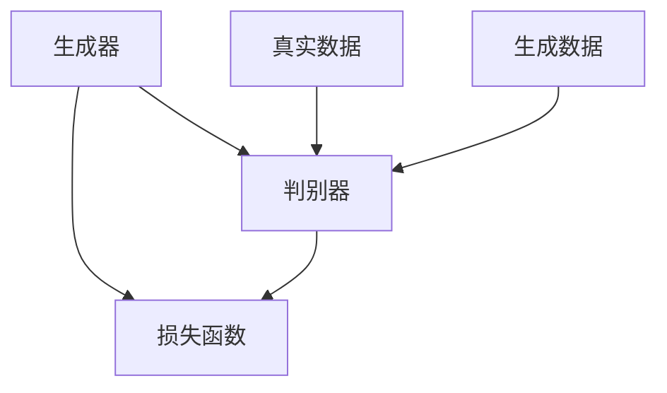
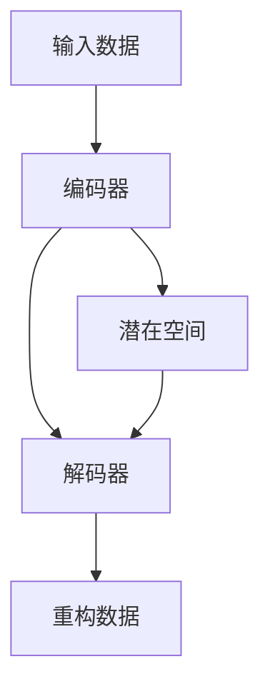

                 

# 基础模型的技术发展趋势

> **关键词**：基础模型、技术发展趋势、深度学习、人工智能、机器学习、计算机视觉

> **摘要**：本文从基础模型的定义、分类、应用现状、挑战与发展趋势等方面，全面深入探讨了基础模型的技术发展趋势。文章通过数学原理解析、算法讲解、实战案例分享，以及政策产业环境分析，为读者呈现了一个清晰的基础模型技术发展蓝图。

## 目录大纲

1. **第一部分：基础模型概述**
   1.1 基础模型的概念与分类
   1.2 基础模型在技术领域的应用现状
   1.3 基础模型的挑战与发展趋势

2. **第二部分：核心技术解析**
   2.1 基础模型的数学原理
   2.2 深度学习基础
   2.3 强化学习基础
   2.4 迁移学习与多任务学习
   2.5 模型优化与调优

3. **第三部分：应用实践与趋势分析**
   3.1 行业应用案例
   3.2 未来发展趋势与展望

4. **第四部分：政策与产业环境**
   4.1 全球政策环境分析
   4.2 中国政策环境分析
   4.3 行业产业发展趋势

5. **附录**
   5.1 开源基础模型库介绍
   5.2 常见问题与解决方案

### 1.1 基础模型的概念与分类

#### 1.1.1 基础模型的定义

基础模型（Fundamental Model）是指具有通用性、可扩展性和高效性的机器学习模型，其核心思想是通过大量的数据训练和优化模型参数，使其能够对未知数据进行预测或分类。

在人工智能领域，基础模型是一种重要的工具，它使得计算机能够处理复杂数据、提取特征并进行决策。基础模型不仅用于学术研究，还广泛应用于工业生产、金融、医疗、自动驾驶等多个领域。

#### 1.1.2 基础模型的主要分类

根据模型的原理和应用场景，基础模型可以分为以下几类：

1. **监督学习模型**：监督学习模型是通过对已知数据进行学习，从而预测未知数据的方法。常见的监督学习模型包括线性回归、决策树、随机森林、支持向量机等。

2. **无监督学习模型**：无监督学习模型是通过分析未标记的数据，提取特征或进行聚类的方法。常见的无监督学习模型包括主成分分析（PCA）、K-均值聚类、自编码器等。

3. **强化学习模型**：强化学习模型通过模拟智能体与环境的交互过程，学习最优策略以最大化累积奖励。常见的强化学习模型包括Q学习、SARSA、DQN等。

4. **迁移学习模型**：迁移学习模型是利用已有模型的先验知识，在新数据上进行训练，从而提高模型在新数据上的性能。常见的迁移学习模型包括基于特征迁移、模型迁移、对抗迁移等。

#### 1.1.3 基础模型的发展历程

基础模型的发展可以追溯到20世纪50年代，当时出现了最初的机器学习模型，如感知机。随后，随着计算能力的提升和大数据的出现，机器学习模型得到了快速发展。特别是深度学习模型的崛起，使得基础模型在图像识别、语音识别、自然语言处理等领域取得了显著突破。

近年来，随着计算机视觉、自然语言处理等领域的发展，基础模型的应用场景不断扩展，新的基础模型不断涌现。例如，基于生成对抗网络的模型、基于变分自编码器的模型等。

### 1.2 基础模型在技术领域的应用现状

#### 1.2.1 人工智能领域中的应用

人工智能（AI）是基础模型最重要的应用领域之一。在人工智能领域，基础模型被广泛应用于图像识别、语音识别、自然语言处理、智能推荐、自动驾驶等方面。

1. **图像识别**：通过卷积神经网络（CNN）等深度学习模型，计算机可以自动识别和分类图像中的物体。目前，图像识别技术在医疗诊断、安全监控、工业生产等领域有广泛应用。

2. **语音识别**：通过深度神经网络（DNN）等模型，计算机可以识别和理解人类的语音。语音识别技术在智能助手、客服系统、语音合成等方面有广泛应用。

3. **自然语言处理**：通过循环神经网络（RNN）、长短时记忆网络（LSTM）、变换器（Transformer）等模型，计算机可以理解和生成自然语言。自然语言处理技术在搜索引擎、机器翻译、智能问答等方面有广泛应用。

4. **智能推荐**：通过协同过滤、基于内容的推荐、基于模型的推荐等方法，计算机可以为用户推荐感兴趣的物品。智能推荐技术在电子商务、社交媒体、在线教育等领域有广泛应用。

5. **自动驾驶**：通过计算机视觉、传感器数据处理等技术，自动驾驶汽车可以自主感知环境、规划路径、控制车辆。自动驾驶技术有望在未来彻底改变交通运输方式。

#### 1.2.2 机器学习领域中的应用

机器学习是基础模型的核心领域。在机器学习领域，基础模型被广泛应用于分类、回归、聚类、降维等方面。

1. **分类**：通过分类模型，计算机可以对数据进行分类，如文本分类、图像分类等。分类模型在情感分析、垃圾邮件过滤、医学诊断等方面有广泛应用。

2. **回归**：通过回归模型，计算机可以预测数值型数据，如房价预测、股票价格预测等。回归模型在经济预测、金融分析、风险管理等方面有广泛应用。

3. **聚类**：通过聚类模型，计算机可以自动将数据分成不同的类别，如K-均值聚类、层次聚类等。聚类模型在市场细分、客户群体分析、图像分割等方面有广泛应用。

4. **降维**：通过降维模型，计算机可以减少数据的维度，从而提高模型的效率和解释性，如主成分分析（PCA）、线性判别分析（LDA）等。降维模型在数据预处理、可视化、特征选择等方面有广泛应用。

#### 1.2.3 计算机视觉领域中的应用

计算机视觉是基础模型的重要应用领域之一。在计算机视觉领域，基础模型被广泛应用于图像识别、图像处理、目标检测、人脸识别等方面。

1. **图像识别**：通过深度学习模型，计算机可以自动识别和分类图像中的物体。图像识别技术在安防监控、医疗影像诊断、自动驾驶等领域有广泛应用。

2. **图像处理**：通过图像处理算法，计算机可以对图像进行增强、滤波、去噪等操作，从而改善图像质量。图像处理技术在摄影、视频制作、医疗影像等领域有广泛应用。

3. **目标检测**：通过目标检测算法，计算机可以在图像中定位和识别多个目标。目标检测技术在安防监控、无人驾驶、智能家居等领域有广泛应用。

4. **人脸识别**：通过人脸识别算法，计算机可以自动识别人脸并进行身份验证。人脸识别技术在金融支付、安防监控、身份认证等领域有广泛应用。

### 1.3 基础模型的挑战与发展趋势

#### 1.3.1 挑战与瓶颈

尽管基础模型在人工智能、机器学习、计算机视觉等领域取得了显著进展，但仍然面临一些挑战和瓶颈。

1. **数据质量**：基础模型的性能高度依赖训练数据的质量。数据质量差可能导致模型过拟合、泛化能力差等问题。

2. **计算资源**：深度学习模型通常需要大量的计算资源进行训练，对硬件设施的要求较高。

3. **模型可解释性**：深度学习模型的黑箱特性使得其难以解释，这对于一些需要高可解释性的应用场景（如医疗诊断、金融风险评估等）提出了挑战。

4. **安全性与隐私保护**：基础模型可能存在数据泄露、模型攻击等安全风险，需要加强安全防护措施。

5. **能耗与环保**：深度学习模型训练通常需要大量的电力，对环境造成了较大的影响。

#### 1.3.2 发展趋势分析

1. **数据质量提升**：随着数据采集技术和存储技术的进步，数据质量将得到提高，有助于提升基础模型的性能。

2. **计算资源优化**：通过分布式计算、云计算等技术，计算资源的利用效率将得到提升，降低训练成本。

3. **模型可解释性增强**：通过开发可解释性算法和工具，提升基础模型的可解释性，满足高可解释性应用场景的需求。

4. **安全性与隐私保护**：通过加密技术、差分隐私等方法，加强基础模型的安全性与隐私保护。

5. **能耗与环保**：通过优化算法、使用节能硬件等手段，降低基础模型训练的能耗，实现可持续发展。

#### 1.3.3 技术前沿探讨

1. **生成对抗网络（GAN）**：GAN是一种基于博弈理论的生成模型，可用于生成高质量的图像、音频和文本。

2. **变分自编码器（VAE）**：VAE是一种基于概率模型的生成模型，可用于图像去噪、图像生成、特征提取等任务。

3. **图神经网络（GNN）**：GNN是一种基于图结构的神经网络，可用于图数据的表示和预测，如社交网络分析、推荐系统等。

4. **自监督学习**：自监督学习是一种无需标注数据的学习方法，通过无监督的方式训练模型，有望缓解数据标注困难和计算资源瓶颈问题。

5. **联邦学习**：联邦学习是一种分布式机器学习方法，通过多个设备共享数据但不交换数据本身，实现隐私保护的协同学习。

### 1.4 基础模型的技术发展

基础模型的技术发展是人工智能领域的核心之一。在过去几十年中，基础模型经历了从简单到复杂、从低维到高维、从单一任务到多任务的发展过程。以下是基础模型技术发展的几个关键阶段：

#### 1.4.1 简单线性模型

最早的机器学习模型是基于线性代数的简单线性模型，如线性回归、逻辑回归等。这些模型主要用于回归和分类任务，其优点是计算简单、易于理解。然而，这些模型在处理复杂数据时性能较差。

#### 1.4.2 统计学习模型

随着统计学理论的进步，统计学习模型逐渐取代了简单线性模型。统计学习模型包括支持向量机（SVM）、朴素贝叶斯（Naive Bayes）等，它们在处理高维数据和复杂特征时表现更好。然而，统计学习模型通常需要手动选择特征，且模型解释性较差。

#### 1.4.3 深度学习模型

深度学习模型的崛起标志着基础模型技术发展的重要里程碑。深度学习模型通过模拟人脑神经网络结构，实现了对大量复杂数据的处理。卷积神经网络（CNN）、循环神经网络（RNN）、长短时记忆网络（LSTM）等深度学习模型在图像识别、语音识别、自然语言处理等领域取得了突破性进展。深度学习模型的核心思想是通过多层的神经网络结构，逐层提取数据中的特征，从而实现对数据的精细表示。

#### 1.4.4 强化学习模型

强化学习模型是另一种重要的基础模型，它在决策制定和策略优化方面具有显著优势。强化学习模型通过模拟智能体与环境的交互过程，学习最优策略以最大化累积奖励。强化学习模型在游戏、自动驾驶、推荐系统等领域有广泛应用。近年来，深度强化学习（DRL）的发展使得强化学习模型在处理复杂数据和任务时取得了显著进步。

#### 1.4.5 迁移学习模型

迁移学习模型是利用已有模型的先验知识，在新数据上进行训练，从而提高模型在新数据上的性能。迁移学习模型可以解决数据不足、数据分布不均等问题，使得基础模型在特定领域取得了更好的效果。迁移学习模型包括基于特征的迁移学习、基于模型的迁移学习等。

#### 1.4.6 多任务学习模型

多任务学习模型是同时学习多个相关任务的模型，它通过共享表示和参数来提高学习效率。多任务学习模型在自然语言处理、计算机视觉等领域有广泛应用。近年来，基于深度学习的多任务学习模型取得了显著进展，如多任务卷积神经网络（Multitask CNN）和多任务循环神经网络（Multitask RNN）。

#### 1.4.7 元学习模型

元学习模型是学习如何快速学习新任务的模型。元学习模型通过经验快速适应新任务，从而提高模型的泛化能力。元学习模型在自适应控制、机器人学习、自适应推荐等领域有广泛应用。近年来，深度元学习（Deep Meta-Learning）的发展为元学习模型的研究提供了新的思路。

#### 1.4.8 混合学习模型

混合学习模型是结合多种学习方法的模型，它通过融合不同学习方法的优点来提高模型性能。混合学习模型在计算机视觉、自然语言处理、推荐系统等领域有广泛应用。例如，卷积神经网络与循环神经网络的结合（CNN-RNN）在语音识别和文本生成任务中取得了显著效果。

#### 1.4.9 开源基础模型库

随着基础模型技术的发展，开源基础模型库（如TensorFlow、PyTorch）逐渐成为人工智能研究的基石。这些开源基础模型库提供了丰富的模型架构和工具，降低了研究人员和开发者的门槛，加速了人工智能研究的进展。

### 1.5 基础模型的技术发展趋势

在未来的发展中，基础模型将继续在人工智能、机器学习、计算机视觉等领域发挥重要作用。以下是对基础模型技术发展趋势的展望：

#### 1.5.1 模型压缩与优化

随着模型的规模越来越大，模型的压缩与优化将成为关键问题。模型压缩可以通过参数剪枝、量化、知识蒸馏等方法实现，从而降低模型的存储和计算成本。优化方法如混合精度训练、分布式训练等也将得到广泛应用，以提高模型的训练效率和性能。

#### 1.5.2 模型解释性增强

模型解释性增强是当前研究的热点之一。通过开发可解释性算法和工具，研究人员将能够更好地理解模型的工作原理和决策过程，提高模型的透明度和可信度。这对于需要高可解释性的应用场景（如医疗诊断、金融风险评估等）具有重要意义。

#### 1.5.3 跨模态学习

跨模态学习是指同时处理多种不同类型的数据（如图像、文本、语音等）的模型。随着多模态数据的增长和需求，跨模态学习将在自然语言处理、计算机视觉、多媒体处理等领域发挥重要作用。例如，通过融合图像和文本信息，可以实现更准确的图像识别和文本理解。

#### 1.5.4 自监督学习

自监督学习是一种无需标注数据的学习方法，通过无监督的方式训练模型。自监督学习有望缓解数据标注困难和计算资源瓶颈问题，从而推动人工智能研究的进一步发展。例如，通过预训练大型的自监督模型（如BERT、GPT），可以显著提高下游任务（如文本分类、文本生成等）的性能。

#### 1.5.5 联邦学习

联邦学习是一种分布式机器学习方法，通过多个设备共享数据但不交换数据本身，实现隐私保护的协同学习。随着物联网、移动设备的普及，联邦学习将在医疗健康、金融安全、智能交通等领域有广泛应用。联邦学习将有助于保护用户隐私，提高数据的安全性和可靠性。

#### 1.5.6 模型伦理与责任

随着人工智能技术的不断发展，模型伦理与责任问题越来越受到关注。研究人员和开发者需要关注模型在种族、性别、年龄等方面的公平性，防止模型歧视。同时，模型的责任归属和责任追究机制也需要进一步完善，确保人工智能技术的发展不会对社会造成负面影响。

### 1.6 基础模型的技术前沿

在基础模型的技术前沿，研究人员和开发者不断探索新的算法和模型，以推动人工智能领域的发展。以下是一些值得关注的技术前沿：

#### 1.6.1 类脑计算

类脑计算是一种模拟人脑神经网络结构和功能的计算方法。通过类脑计算，研究人员试图构建具有自主学习和自适应能力的智能系统。近年来，类脑计算在人工智能、认知科学、神经科学等领域取得了显著进展。

#### 1.6.2 图神经网络

图神经网络（GNN）是一种用于处理图数据的神经网络模型。GNN可以自动提取图结构中的特征，并在多种任务（如社交网络分析、推荐系统、图像识别等）中取得良好效果。随着图数据的增长和需求，GNN在人工智能领域的应用前景广阔。

#### 1.6.3 强化学习

强化学习是一种基于奖励机制的学习方法，通过模拟智能体与环境的交互过程，学习最优策略以最大化累积奖励。近年来，深度强化学习（DRL）在游戏、自动驾驶、机器人学习等领域取得了显著进展，成为人工智能研究的重要方向。

#### 1.6.4 对抗生成网络

对抗生成网络（GAN）是一种基于博弈理论的生成模型，通过生成器和判别器的对抗训练，可以实现高质量的数据生成。GAN在图像生成、文本生成、语音合成等领域有广泛应用，成为人工智能领域的研究热点。

#### 1.6.5 自适应学习

自适应学习是一种根据学习过程中的反馈自动调整学习策略的学习方法。自适应学习可以显著提高学习效率和学习效果，对于在线学习、自适应推荐等领域具有重要意义。近年来，自适应学习在机器学习、认知科学等领域取得了显著进展。

### 1.7 基础模型的技术挑战

在基础模型的发展过程中，研究人员和开发者面临着一系列技术挑战。以下是一些值得关注的技术挑战：

#### 1.7.1 数据质量和标注

基础模型的性能高度依赖训练数据的质量和标注。然而，高质量的训练数据往往难以获取，且标注过程成本高昂。如何获取高质量的数据和有效的标注方法成为基础模型发展的关键问题。

#### 1.7.2 模型可解释性

深度学习模型具有黑箱特性，其工作原理难以解释。这对于需要高可解释性的应用场景（如医疗诊断、金融风险评估等）提出了挑战。如何提高模型的可解释性，使其更易于理解和使用，是当前研究的重要方向。

#### 1.7.3 能耗和计算资源

深度学习模型的训练通常需要大量的计算资源和电力消耗。如何优化算法和硬件设施，降低能耗和计算成本，是基础模型发展的重要挑战。

#### 1.7.4 安全性与隐私保护

基础模型可能存在数据泄露、模型攻击等安全风险，需要加强安全防护措施。同时，如何保护用户隐私，确保数据的安全性和可靠性，也是基础模型发展的重要问题。

#### 1.7.5 多模态学习

多模态学习是指同时处理多种不同类型的数据（如图像、文本、语音等）的模型。多模态学习面临着数据融合、任务一致性、模型结构设计等挑战，需要进一步研究。

### 1.8 总结

基础模型是人工智能领域的核心组成部分，其在人工智能、机器学习、计算机视觉等领域的应用取得了显著进展。然而，基础模型的发展仍面临一系列挑战，如数据质量、模型可解释性、能耗和计算资源、安全性与隐私保护等。为了应对这些挑战，研究人员和开发者需要不断探索新的算法和模型，推动基础模型的发展。随着技术的不断进步，基础模型将在人工智能领域发挥越来越重要的作用，为人类社会带来更多的价值和变革。## 第一部分：基础模型概述

### 第1章：基础模型的概念与分类

#### 1.1.1 基础模型的定义

基础模型（Fundamental Model）是指具有通用性、可扩展性和高效性的机器学习模型，其核心思想是通过大量的数据训练和优化模型参数，使其能够对未知数据进行预测或分类。基础模型是机器学习领域的重要工具，广泛应用于各种实际问题中。

在人工智能领域，基础模型是一种重要的工具，它使得计算机能够处理复杂数据、提取特征并进行决策。基础模型不仅用于学术研究，还广泛应用于工业生产、金融、医疗、自动驾驶等多个领域。

#### 1.1.2 基础模型的主要分类

根据模型的原理和应用场景，基础模型可以分为以下几类：

1. **监督学习模型**：监督学习模型是通过对已知数据进行学习，从而预测未知数据的方法。常见的监督学习模型包括线性回归、决策树、随机森林、支持向量机等。监督学习模型适用于分类和回归问题，能够通过训练数据中的标签信息来学习特征。

2. **无监督学习模型**：无监督学习模型是通过分析未标记的数据，提取特征或进行聚类的方法。常见的无监督学习模型包括主成分分析（PCA）、K-均值聚类、自编码器等。无监督学习模型适用于聚类和降维问题，能够发现数据中的隐含结构和规律。

3. **强化学习模型**：强化学习模型通过模拟智能体与环境的交互过程，学习最优策略以最大化累积奖励。常见的强化学习模型包括Q学习、SARSA、DQN等。强化学习模型适用于决策和策略优化问题，能够在不确定和动态的环境中做出最优决策。

4. **迁移学习模型**：迁移学习模型是利用已有模型的先验知识，在新数据上进行训练，从而提高模型在新数据上的性能。常见的迁移学习模型包括基于特征迁移、基于模型迁移等。迁移学习模型适用于数据不足或数据分布不均的问题，能够提高模型的泛化能力。

#### 1.1.3 基础模型的发展历程

基础模型的发展可以追溯到20世纪50年代，当时出现了最初的机器学习模型，如感知机。随后，随着计算能力的提升和大数据的出现，机器学习模型得到了快速发展。特别是深度学习模型的崛起，使得基础模型在图像识别、语音识别、自然语言处理等领域取得了显著突破。

近年来，随着计算机视觉、自然语言处理等领域的发展，基础模型的应用场景不断扩展，新的基础模型不断涌现。例如，基于生成对抗网络的模型、基于变分自编码器的模型等。

### 第2章：基础模型在技术领域的应用现状

#### 2.1.1 人工智能领域中的应用

人工智能（AI）是基础模型最重要的应用领域之一。在人工智能领域，基础模型被广泛应用于图像识别、语音识别、自然语言处理、智能推荐、自动驾驶等方面。

1. **图像识别**：通过卷积神经网络（CNN）等深度学习模型，计算机可以自动识别和分类图像中的物体。图像识别技术在医疗诊断、安全监控、工业生产等领域有广泛应用。

2. **语音识别**：通过深度神经网络（DNN）等模型，计算机可以识别和理解人类的语音。语音识别技术在智能助手、客服系统、语音合成等方面有广泛应用。

3. **自然语言处理**：通过循环神经网络（RNN）、长短时记忆网络（LSTM）、变换器（Transformer）等模型，计算机可以理解和生成自然语言。自然语言处理技术在搜索引擎、机器翻译、智能问答等方面有广泛应用。

4. **智能推荐**：通过协同过滤、基于内容的推荐、基于模型的推荐等方法，计算机可以为用户推荐感兴趣的物品。智能推荐技术在电子商务、社交媒体、在线教育等领域有广泛应用。

5. **自动驾驶**：通过计算机视觉、传感器数据处理等技术，自动驾驶汽车可以自主感知环境、规划路径、控制车辆。自动驾驶技术有望在未来彻底改变交通运输方式。

#### 2.1.2 机器学习领域中的应用

机器学习是基础模型的核心领域。在机器学习领域，基础模型被广泛应用于分类、回归、聚类、降维等方面。

1. **分类**：通过分类模型，计算机可以对数据进行分类，如文本分类、图像分类等。分类模型在情感分析、垃圾邮件过滤、医学诊断等方面有广泛应用。

2. **回归**：通过回归模型，计算机可以预测数值型数据，如房价预测、股票价格预测等。回归模型在经济预测、金融分析、风险管理等方面有广泛应用。

3. **聚类**：通过聚类模型，计算机可以自动将数据分成不同的类别，如K-均值聚类、层次聚类等。聚类模型在市场细分、客户群体分析、图像分割等方面有广泛应用。

4. **降维**：通过降维模型，计算机可以减少数据的维度，从而提高模型的效率和解释性，如主成分分析（PCA）、线性判别分析（LDA）等。降维模型在数据预处理、可视化、特征选择等方面有广泛应用。

#### 2.1.3 计算机视觉领域中的应用

计算机视觉是基础模型的重要应用领域之一。在计算机视觉领域，基础模型被广泛应用于图像识别、图像处理、目标检测、人脸识别等方面。

1. **图像识别**：通过深度学习模型，计算机可以自动识别和分类图像中的物体。图像识别技术在安防监控、医疗影像诊断、自动驾驶等领域有广泛应用。

2. **图像处理**：通过图像处理算法，计算机可以对图像进行增强、滤波、去噪等操作，从而改善图像质量。图像处理技术在摄影、视频制作、医疗影像等领域有广泛应用。

3. **目标检测**：通过目标检测算法，计算机可以在图像中定位和识别多个目标。目标检测技术在安防监控、无人驾驶、智能家居等领域有广泛应用。

4. **人脸识别**：通过人脸识别算法，计算机可以自动识别人脸并进行身份验证。人脸识别技术在金融支付、安防监控、身份认证等领域有广泛应用。

### 第3章：基础模型的挑战与发展趋势

#### 3.1.1 挑战与瓶颈

尽管基础模型在人工智能、机器学习、计算机视觉等领域取得了显著进展，但仍然面临一些挑战和瓶颈。

1. **数据质量**：基础模型的性能高度依赖训练数据的质量。数据质量差可能导致模型过拟合、泛化能力差等问题。

2. **计算资源**：深度学习模型通常需要大量的计算资源进行训练，对硬件设施的要求较高。

3. **模型可解释性**：深度学习模型的黑箱特性使得其难以解释，这对于一些需要高可解释性的应用场景（如医疗诊断、金融风险评估等）提出了挑战。

4. **安全性与隐私保护**：基础模型可能存在数据泄露、模型攻击等安全风险，需要加强安全防护措施。

5. **能耗与环保**：深度学习模型训练通常需要大量的电力，对环境造成了较大的影响。

#### 3.1.2 发展趋势分析

1. **数据质量提升**：随着数据采集技术和存储技术的进步，数据质量将得到提高，有助于提升基础模型的性能。

2. **计算资源优化**：通过分布式计算、云计算等技术，计算资源的利用效率将得到提升，降低训练成本。

3. **模型可解释性增强**：通过开发可解释性算法和工具，提升基础模型的可解释性，满足高可解释性应用场景的需求。

4. **安全性与隐私保护**：通过加密技术、差分隐私等方法，加强基础模型的安全性与隐私保护。

5. **能耗与环保**：通过优化算法、使用节能硬件等手段，降低基础模型训练的能耗，实现可持续发展。

#### 3.1.3 技术前沿探讨

1. **生成对抗网络（GAN）**：GAN是一种基于博弈理论的生成模型，可用于生成高质量的图像、音频和文本。

2. **变分自编码器（VAE）**：VAE是一种基于概率模型的生成模型，可用于图像去噪、图像生成、特征提取等任务。

3. **图神经网络（GNN）**：GNN是一种基于图结构的神经网络，可用于图数据的表示和预测，如社交网络分析、推荐系统等。

4. **自监督学习**：自监督学习是一种无需标注数据的学习方法，通过无监督的方式训练模型，有望缓解数据标注困难和计算资源瓶颈问题。

5. **联邦学习**：联邦学习是一种分布式机器学习方法，通过多个设备共享数据但不交换数据本身，实现隐私保护的协同学习。

### 3.2 基础模型的挑战与发展趋势

在基础模型的技术发展中，我们面临一系列挑战，同时也迎来了许多新的机遇。以下是对这些挑战和发展趋势的深入探讨。

#### 3.2.1 挑战

1. **数据质量**：基础模型的性能高度依赖于训练数据的质量。然而，现实世界中的数据往往存在噪声、偏差和不完整性，这会导致模型过拟合、泛化能力下降等问题。为了解决这些问题，研究人员正在探索更加鲁棒的数据清洗和增强技术。

2. **计算资源**：深度学习模型的训练需要大量的计算资源和时间，尤其是在处理大规模数据集和高维特征时。随着模型规模的不断扩大，对计算资源的需求也在增加，这给研究者和开发者带来了挑战。为了应对这一挑战，分布式计算、并行处理和云计算等技术的应用变得越来越重要。

3. **模型可解释性**：深度学习模型，尤其是复杂的神经网络模型，往往被认为是“黑箱”，其决策过程难以解释。这对于需要高可解释性的应用场景（如医疗诊断、金融风险评估等）提出了挑战。为了提高模型的透明度，研究人员正在开发各种可解释性方法，如模型可视化、解释性算法等。

4. **安全性与隐私保护**：随着人工智能技术的应用日益广泛，数据的安全性和隐私保护变得尤为重要。基础模型可能受到数据泄露、模型篡改等安全威胁，同时，如何保护用户隐私也是一个重要问题。为此，研究人员正在开发各种安全防护措施，如差分隐私、加密技术等。

5. **能耗与环保**：深度学习模型的训练过程通常需要大量的电力消耗，这对环境造成了较大的影响。随着环保意识的增强，如何降低模型训练的能耗成为了一个重要的研究课题。研究人员正在探索节能算法、高效硬件和绿色数据中心等解决方案。

#### 3.2.2 发展趋势

1. **模型压缩与优化**：为了提高模型的效率和可部署性，研究人员正在开发各种模型压缩和优化技术。这些技术包括量化、剪枝、知识蒸馏等，旨在减少模型的参数数量和计算复杂度，同时保持或提高模型的性能。

2. **自适应学习与自监督学习**：自适应学习是指模型能够根据学习过程中的反馈自动调整学习策略，以提高学习效率和效果。自监督学习则是一种无需标注数据的学习方法，通过无监督的方式训练模型。这些技术有望解决数据标注困难和计算资源瓶颈问题，从而推动人工智能技术的广泛应用。

3. **跨模态学习**：跨模态学习是指同时处理多种不同类型的数据（如图像、文本、语音等）的模型。随着多模态数据的增长和需求，跨模态学习将在自然语言处理、计算机视觉、多媒体处理等领域发挥重要作用。研究人员正在开发各种跨模态学习模型和方法，以实现更精确的数据融合和任务性能。

4. **联邦学习**：联邦学习是一种分布式机器学习方法，通过多个设备共享数据但不交换数据本身，实现隐私保护的协同学习。随着物联网、移动设备的普及，联邦学习将在医疗健康、金融安全、智能交通等领域有广泛应用。联邦学习有助于保护用户隐私，提高数据的安全性和可靠性。

5. **可解释性与透明性**：随着人工智能技术的应用场景越来越广泛，模型的可解释性和透明性变得至关重要。研究人员正在开发各种可解释性方法，如模型可视化、解释性算法等，以提高模型的可解释性，使其更易于理解和使用。

6. **安全性与隐私保护**：为了应对数据泄露、模型攻击等安全风险，研究人员正在开发各种安全防护措施，如差分隐私、加密技术等。同时，如何建立合理的模型责任和问责机制也是一个重要课题。

#### 3.2.3 技术前沿探讨

1. **生成对抗网络（GAN）**：生成对抗网络是一种基于博弈理论的生成模型，由生成器和判别器组成。生成器尝试生成与真实数据相似的数据，而判别器则尝试区分生成数据与真实数据。GAN在图像生成、风格迁移、数据增强等方面有广泛应用。

2. **变分自编码器（VAE）**：变分自编码器是一种基于概率模型的生成模型，它通过编码器和解码器来学习和生成数据。VAE在图像去噪、图像生成、特征提取等方面有广泛应用。

3. **图神经网络（GNN）**：图神经网络是一种专门用于处理图数据的神经网络模型。GNN可以自动提取图结构中的特征，并在社交网络分析、推荐系统、图像识别等领域有广泛应用。

4. **自监督学习**：自监督学习是一种无需标注数据的学习方法，通过无监督的方式训练模型。自监督学习在语言建模、图像分类、语音识别等领域有广泛应用。

5. **联邦学习**：联邦学习是一种分布式机器学习方法，通过多个设备共享数据但不交换数据本身，实现隐私保护的协同学习。联邦学习在医疗健康、金融安全、智能交通等领域有广泛应用。

### 3.3 基础模型的技术前沿

在基础模型的研究中，技术前沿不断推动着人工智能的发展。以下是一些备受关注的技术前沿：

#### 3.3.1 生成对抗网络（GAN）

生成对抗网络（GAN）是一种基于博弈理论的生成模型，由生成器和判别器组成。生成器尝试生成与真实数据相似的数据，而判别器则尝试区分生成数据与真实数据。GAN在图像生成、风格迁移、数据增强等方面有广泛应用。

GAN的工作原理可以概括为以下步骤：

1. **生成器（Generator）**：生成器生成模拟数据，使其尽可能接近真实数据。
2. **判别器（Discriminator）**：判别器尝试区分真实数据和生成数据。
3. **对抗训练**：生成器和判别器相互对抗，生成器不断改进生成数据，判别器不断提高区分能力。

GAN的优势在于能够生成高质量、多样化的数据，这在图像生成、风格迁移、数据增强等领域具有重要意义。

以下是GAN的基本架构：

GAN的损失函数通常由两部分组成：

1. **生成器损失**：生成器试图最小化生成数据与真实数据之间的差距。
2. **判别器损失**：判别器试图最大化区分生成数据和真实数据的能力。

GAN的数学模型可以表示为：

$$
L_G = -\log(D(G(z)))
$$

$$
L_D = -\log(D(x)) - \log(1 - D(G(z)))
$$

其中，$G(z)$ 是生成器的输出，$D(x)$ 和 $D(G(z))$ 分别是判别器对真实数据和生成数据的判断结果。

GAN的应用场景包括：

- **图像生成**：生成逼真的图像，如图像修复、图像风格迁移等。
- **数据增强**：生成额外的训练数据，提高模型的泛化能力。
- **风格迁移**：将一种艺术风格应用到图像中，如图像滤镜、绘画风格等。

#### 3.3.2 变分自编码器（VAE）

变分自编码器（VAE）是一种基于概率模型的生成模型，它通过编码器和解码器来学习和生成数据。VAE在图像去噪、图像生成、特征提取等方面有广泛应用。

VAE的工作原理可以概括为以下步骤：

1. **编码器（Encoder）**：编码器将输入数据映射到一个潜在空间，通常是一个均值和方差的分布。
2. **解码器（Decoder）**：解码器从潜在空间生成输出数据，使其尽可能接近原始输入数据。

VAE的优势在于能够生成具有多样性的数据，并且具有很好的数据压缩和特征提取能力。

以下是VAE的基本架构：

VAE的损失函数通常由两部分组成：

1. **重构损失**：重构损失衡量生成数据与原始数据之间的差距，通常使用均方误差（MSE）或交叉熵损失。
2. **KL散度损失**：KL散度损失衡量潜在空间分布与先验分布之间的差距，用于保持数据的多样性。

VAE的数学模型可以表示为：

$$
L_{VAE} = L_{recon} + \lambda \cdot L_{KL}
$$

$$
L_{recon} = \frac{1}{N} \sum_{i=1}^{N} \sum_{j=1}^{D} (x_i[j] - \hat{x}_i[j])^2
$$

$$
L_{KL} = -\frac{1}{N} \sum_{i=1}^{N} \sum_{j=1}^{D} (\mu_i[j] \log(\sigma_i[j]) + (1 - \mu_i[j]) \log(1 - \sigma_i[j]))
$$

其中，$x_i$ 是输入数据，$\hat{x}_i$ 是重构数据，$\mu_i$ 和 $\sigma_i$ 分别是潜在空间中均值和方差的估计。

VAE的应用场景包括：

- **图像去噪**：通过去除图像中的噪声，提高图像质量。
- **图像生成**：生成具有多样性的图像，如图像合成、图像修复等。
- **特征提取**：从数据中提取具有代表性的特征，用于下游任务。

#### 3.3.3 图神经网络（GNN）

图神经网络（GNN）是一种专门用于处理图数据的神经网络模型。GNN可以自动提取图结构中的特征，并在社交网络分析、推荐系统、图像识别等领域有广泛应用。

GNN的基本原理是基于图结构的图卷积操作（GCN），它通过聚合节点邻域的信息来更新节点的特征表示。

GNN的工作流程可以概括为以下步骤：

1. **初始化节点特征**：每个节点都有一个初始特征向量。
2. **图卷积操作**：通过聚合节点邻域的特征来更新节点的特征。
3. **非线性变换**：通过激活函数对更新后的特征进行非线性变换。
4. **迭代计算**：重复进行图卷积操作和变换，直到达到预定的迭代次数。

GNN的数学模型可以表示为：

$$
h_{t+1}^{(i)} = \sigma(\sum_{j \in \mathcal{N}(i)} w^{(l)} h^{(l)}_{t}(j) + b^{(l)})
$$

其中，$h_{t}^{(i)}$ 是第 $t$ 次迭代后节点 $i$ 的特征表示，$\mathcal{N}(i)$ 是节点 $i$ 的邻域，$w^{(l)}$ 和 $b^{(l)}$ 分别是权重和偏置，$\sigma$ 是激活函数。

GNN的应用场景包括：

- **社交网络分析**：通过分析用户之间的社交关系，进行用户推荐、情感分析等。
- **推荐系统**：通过分析用户的历史行为和物品的交互关系，进行个性化推荐。
- **图像识别**：通过分析图像中的像素关系，进行图像分类和物体检测。

#### 3.3.4 自监督学习

自监督学习是一种无需标注数据的学习方法，通过无监督的方式训练模型。自监督学习在语言建模、图像分类、语音识别等领域有广泛应用。

自监督学习的基本原理是利用数据中的内在结构或规律，进行特征提取和模式识别。

自监督学习的方法可以概括为以下几种：

1. **预测任务**：通过预测未知的部分来学习特征，如语言模型中的词汇预测、图像分割中的像素预测等。
2. **对比任务**：通过对比相似和不同的数据来学习特征，如图像对比、文本对比等。
3. **生成任务**：通过生成与真实数据相似的数据来学习特征，如生成对抗网络（GAN）、变分自编码器（VAE）等。

自监督学习的优势在于：

- **减少标注成本**：无需大量的标注数据，降低了数据标注的成本。
- **提高泛化能力**：通过学习数据中的内在结构，提高了模型的泛化能力。
- **适用性广泛**：可以在各种任务和应用场景中使用，如图像、文本、语音等。

自监督学习的应用场景包括：

- **语言建模**：通过自监督学习生成大量的语言数据，用于训练语言模型。
- **图像分类**：通过自监督学习提取图像中的特征，用于图像分类任务。
- **语音识别**：通过自监督学习生成语音数据，用于训练语音模型。

#### 3.3.5 联邦学习

联邦学习是一种分布式机器学习方法，通过多个设备共享数据但不交换数据本身，实现隐私保护的协同学习。联邦学习在医疗健康、金融安全、智能交通等领域有广泛应用。

联邦学习的基本原理是将模型的训练过程分布到多个设备上，每个设备仅共享模型的参数更新，而不交换原始数据。

联邦学习的方法可以概括为以下步骤：

1. **模型初始化**：在训练开始时，初始化全局模型参数。
2. **本地训练**：在每个设备上，使用本地数据对模型进行训练，得到本地参数更新。
3. **参数聚合**：将本地参数更新上传到中心服务器，进行聚合。
4. **全局更新**：使用聚合后的参数更新全局模型。

联邦学习的优势在于：

- **隐私保护**：通过不交换原始数据，保护了用户隐私。
- **分布式计算**：可以在多个设备上进行训练，提高了计算效率。
- **数据多样性**：利用了多个设备的本地数据，提高了模型的泛化能力。

联邦学习的应用场景包括：

- **医疗健康**：通过联邦学习训练医疗模型，同时保护患者隐私。
- **金融安全**：通过联邦学习分析金融数据，提高风险管理能力。
- **智能交通**：通过联邦学习训练交通模型，优化交通流量和路线规划。

### 3.4 基础模型的未来发展趋势

随着技术的不断进步，基础模型在未来将呈现出以下发展趋势：

1. **模型压缩与优化**：为了提高模型的效率和可部署性，研究人员将开发更多的模型压缩和优化技术，如量化、剪枝、知识蒸馏等。这些技术将使得模型在保持性能的同时，具有更小的参数量和计算复杂度。

2. **自适应学习与自监督学习**：自适应学习和自监督学习将成为基础模型的重要研究方向。通过自适应学习，模型将能够根据不同的环境和任务自动调整学习策略；通过自监督学习，模型将能够利用无监督数据提高性能，减少对标注数据的依赖。

3. **跨模态学习**：随着多模态数据的增长，跨模态学习将得到更多的关注。通过跨模态学习，模型将能够同时处理多种类型的数据，如图像、文本、语音等，从而实现更精确的数据融合和任务性能。

4. **联邦学习**：联邦学习将得到更广泛的应用，特别是在医疗健康、金融安全、智能交通等领域。通过联邦学习，模型将能够在保护隐私的同时，实现分布式协同训练，提高模型的泛化能力和计算效率。

5. **可解释性与透明性**：随着人工智能技术的应用越来越广泛，模型的可解释性和透明性变得至关重要。研究人员将开发更多的可解释性方法和工具，以提高模型的可解释性，使其更易于理解和使用。

6. **安全性与隐私保护**：随着数据泄露和模型攻击的威胁日益增加，安全性与隐私保护将成为基础模型的重要研究方向。研究人员将开发各种安全防护措施，如差分隐私、加密技术等，以保护模型和数据的安全。

### 3.5 结论

基础模型是人工智能领域的重要工具，其在图像识别、语音识别、自然语言处理、智能推荐、自动驾驶等方面有广泛应用。然而，基础模型的发展仍面临数据质量、计算资源、模型可解释性、安全性与隐私保护等挑战。为了应对这些挑战，研究人员和开发者需要不断探索新的算法和模型，推动基础模型的发展。随着技术的不断进步，基础模型将在人工智能领域发挥越来越重要的作用，为人类社会带来更多的价值和变革。

### 第4章：基础模型的数学原理

#### 4.1.1 线性代数基础

线性代数是基础模型中不可或缺的工具，它在数据表示、特征提取、模型优化等方面具有广泛应用。以下介绍一些线性代数的基础概念和运算。

##### 矩阵与向量

- **矩阵**：矩阵是一个二维数组，由行和列组成。矩阵的元素可以是任意实数或复数。矩阵通常用大写字母表示，如$A$。
- **向量**：向量是一个一维数组，由元素组成。向量通常用小写字母表示，如$v$。

##### 矩阵运算

- **矩阵加法**：两个矩阵相加，要求它们的维度相同。矩阵加法的结果是将对应位置的元素相加。
  $$
  A + B = 
  \begin{bmatrix}
  a_{11} + b_{11} & a_{12} + b_{12} \\
  a_{21} + b_{21} & a_{22} + b_{22}
  \end{bmatrix}
  $$

- **矩阵乘法**：两个矩阵相乘，要求第一个矩阵的列数等于第二个矩阵的行数。矩阵乘法的结果是一个新的矩阵。
  $$
  AB = 
  \begin{bmatrix}
  c_{11} & c_{12} \\
  c_{21} & c_{22}
  \end{bmatrix}
  $$
  其中，$c_{ij} = \sum_{k=1}^{m} a_{ik}b_{kj}$。

- **矩阵转置**：矩阵的转置是将原矩阵的行和列互换。矩阵转置的符号是$A^T$。
  $$
  A^T = 
  \begin{bmatrix}
  a_{11} & a_{21} \\
  a_{12} & a_{22}
  \end{bmatrix}
  $$

- **逆矩阵**：如果一个矩阵是可逆的，那么它的逆矩阵是一个与之相乘后得到单位矩阵的矩阵。逆矩阵的符号是$A^{-1}$。
  $$
  AA^{-1} = A^{-1}A = I
  $$
  其中，$I$ 是单位矩阵。

##### 线性方程组

线性方程组是多个线性方程组成的集合。线性方程组的解法包括高斯消元法和矩阵求逆法。

- **高斯消元法**：通过消元操作将线性方程组转化为下三角或上三角方程组，然后逐个求解。
- **矩阵求逆法**：如果线性方程组的系数矩阵是可逆的，可以使用矩阵求逆法直接求解。

#### 4.1.2 概率论基础

概率论是基础模型中用于处理不确定性和随机性的重要工具。以下介绍一些概率论的基础概念和定理。

##### 概率分布

- **离散概率分布**：离散概率分布用于描述离散随机变量的概率分布。常见的离散概率分布包括伯努利分布、二项分布、泊松分布等。
- **连续概率分布**：连续概率分布用于描述连续随机变量的概率分布。常见的连续概率分布包括正态分布、均匀分布、指数分布等。

##### 条件概率与贝叶斯定理

- **条件概率**：在给定某个事件发生的条件下，另一个事件发生的概率称为条件概率。条件概率表示为$P(A|B)$。
- **贝叶斯定理**：贝叶斯定理描述了在已知一个事件发生的条件下，另一个事件发生概率的计算方法。贝叶斯定理的表达式为：
  $$
  P(A|B) = \frac{P(B|A)P(A)}{P(B)}
  $$

##### 独立性

- **独立性**：两个事件A和B是独立的，如果其中一个事件的发生不影响另一个事件的概率，即$P(A \cap B) = P(A)P(B)$。

##### 大数定律与中心极限定理

- **大数定律**：大数定律描述了在重复实验的条件下，样本均值会收敛于总体均值。大数定律的形式化表述为：
  $$
  \lim_{n \to \infty} \frac{1}{n} \sum_{i=1}^{n} X_i = \mu
  $$
  其中，$X_i$ 是独立同分布的随机变量，$\mu$ 是总体均值。

- **中心极限定理**：中心极限定理描述了在独立同分布的随机变量的和趋近于正态分布。中心极限定理的形式化表述为：
  $$
  \frac{\sum_{i=1}^{n} X_i - n\mu}{\sigma \sqrt{n}} \xrightarrow{D} N(0,1)
  $$
  其中，$X_i$ 是独立同分布的随机变量，$\mu$ 是总体均值，$\sigma$ 是总体标准差。

#### 4.1.3 最优化理论基础

最优化理论是基础模型中用于求解优化问题的工具。以下介绍一些最优化理论的基础概念和方法。

##### 目标函数与约束条件

- **目标函数**：目标函数是优化问题中的目标，通常表示为$f(x)$，其中$x$是决策变量。
- **约束条件**：约束条件是优化问题中的限制，通常表示为$g_i(x) \leq 0$，其中$g_i(x)$是约束函数。

##### 拉格朗日乘数法

拉格朗日乘数法是一种求解最优化问题的方法，通过引入拉格朗日乘子，将不等式约束转化为等式约束。

拉格朗日函数的表达式为：
$$
L(x, \lambda) = f(x) + \sum_{i=1}^{m} \lambda_i g_i(x)
$$
其中，$\lambda_i$ 是拉格朗日乘子。

求解最优化问题的步骤如下：

1. 求解方程组$\nabla_x L(x, \lambda) = 0$和$\lambda_i g_i(x) = 0$。
2. 判断解是否满足KKT条件（Karmarkar-Kuhn-Tucker条件），如果满足，则该解是最优解。

##### 梯度下降法

梯度下降法是一种迭代求解最优化问题的方法，通过沿着目标函数的梯度方向逐步更新决策变量，以找到最小值。

梯度下降法的迭代公式为：
$$
x_{t+1} = x_t - \alpha \nabla f(x_t)
$$
其中，$x_t$ 是第$t$次迭代的决策变量，$\alpha$ 是学习率。

梯度下降法的优势在于简单易实现，但在某些情况下，如目标函数非凸时，可能会收敛到局部最小值。

##### 牛顿法

牛顿法是一种基于二阶导数的最优化方法，通过利用目标函数的一阶导数和二阶导数，进行迭代优化。

牛顿法的迭代公式为：
$$
x_{t+1} = x_t - H_t^{-1} \nabla^2 f(x_t)
$$
其中，$x_t$ 是第$t$次迭代的决策变量，$H_t$ 是海森矩阵（目标函数的二阶导数矩阵）。

牛顿法在收敛速度上通常优于梯度下降法，但计算复杂度较高。

#### 4.1.4 模型表示与优化

在基础模型中，数学原理被广泛应用于模型表示和优化。

1. **模型表示**：基础模型通常用数学模型表示，如线性模型、非线性模型等。数学模型通过参数化表示数据特征和关系，为模型的训练和预测提供基础。

2. **模型优化**：模型优化是基础模型的核心任务，通过优化算法，如梯度下降法、牛顿法等，更新模型参数，以最小化目标函数。优化算法的效率和稳定性对于模型的性能至关重要。

3. **优化策略**：在模型优化过程中，可以采用多种优化策略，如随机优化、批量优化、在线优化等。不同的优化策略适用于不同的场景和需求。

#### 4.1.5 模型评估与选择

在基础模型的应用中，模型评估和选择是关键步骤。以下介绍一些常用的模型评估指标和选择方法。

1. **模型评估指标**：常用的模型评估指标包括准确率、召回率、精确率、F1分数等。这些指标用于衡量模型的预测性能，可以根据不同任务的需求进行选择。

2. **模型选择方法**：在基础模型的选择中，可以采用交叉验证、网格搜索、贝叶斯优化等方法。交叉验证是一种常用的模型选择方法，通过在不同数据集上多次训练和测试，评估模型的整体性能。

3. **模型集成**：模型集成是通过结合多个模型的预测结果，提高预测性能的方法。常用的模型集成方法包括Bagging、Boosting、Stacking等。

### 4.2 深度学习基础

深度学习是基础模型的重要分支，它在图像识别、语音识别、自然语言处理等领域取得了显著进展。以下介绍深度学习的基本概念、神经网络架构和算法。

#### 4.2.1 深度学习的基本概念

1. **神经网络**：神经网络是深度学习的基础，它由多个神经元（或节点）组成，每个神经元都与其他神经元相连接。神经网络的目的是通过学习输入和输出之间的关系，进行数据的分类、预测和特征提取。

2. **前向传播与反向传播**：深度学习中的训练过程包括前向传播和反向传播。前向传播是将输入数据通过神经网络逐层传递，得到输出；反向传播是计算输出误差，并通过梯度下降法更新网络参数。

3. **激活函数**：激活函数是神经网络中的一个关键组件，它用于引入非线性特性。常见的激活函数包括ReLU、Sigmoid、Tanh等。

4. **损失函数**：损失函数是衡量模型预测误差的指标，用于指导模型优化。常见的损失函数包括均方误差（MSE）、交叉熵损失等。

#### 4.2.2 神经网络架构

1. **单层感知机**：单层感知机是最简单的神经网络，它由一个输入层和一个输出层组成。单层感知机可以完成线性可分的数据分类任务。

2. **多层感知机**：多层感知机（MLP）是单层感知机的扩展，它包含多个隐藏层。多层感知机可以完成非线性数据的分类和回归任务。

3. **卷积神经网络（CNN）**：卷积神经网络是专门用于处理图像数据的神经网络。CNN通过卷积层、池化层和全连接层等组件，实现图像的特征提取和分类。

4. **循环神经网络（RNN）**：循环神经网络是专门用于处理序列数据的神经网络。RNN通过循环结构，实现序列数据的记忆和建模。

5. **长短时记忆网络（LSTM）**：长短时记忆网络是RNN的一种变体，它通过引入记忆单元和门控机制，解决RNN的梯度消失和梯度爆炸问题。

6. **变换器（Transformer）**：变换器是一种基于自注意力机制的神经网络架构，它在自然语言处理等领域取得了显著效果。变换器通过多头自注意力机制和位置编码，实现序列数据的建模和特征提取。

#### 4.2.3 深度学习算法

1. **反向传播算法**：反向传播算法是深度学习训练的核心算法，它通过计算输出误差的梯度，并沿梯度方向更新网络参数。

2. **随机梯度下降（SGD）**：随机梯度下降是一种常用的优化算法，它通过随机选择样本，计算梯度并更新网络参数。

3. **动量法**：动量法是随机梯度下降的改进，它引入动量参数，使得梯度更新更加稳定。

4. **自适应优化器**：自适应优化器是一类优化算法，如Adam、RMSprop等，它们根据历史梯度信息动态调整学习率，提高训练效率。

5. **深度学习框架**：深度学习框架是用于实现和部署深度学习模型的工具，如TensorFlow、PyTorch等。深度学习框架提供了丰富的模型库、优化器和工具，降低了模型开发的门槛。

### 4.3 强化学习基础

强化学习是一种基于奖励机制的机器学习方法，它在决策制定和策略优化方面具有广泛应用。以下介绍强化学习的基本概念、算法原理和应用场景。

#### 4.3.1 强化学习的基本概念

1. **强化学习模型**：强化学习模型由智能体、环境、状态、动作和奖励组成。智能体通过在环境中执行动作，根据状态的转移和奖励进行学习，以最大化累积奖励。

2. **状态-动作价值函数**：状态-动作价值函数表示在给定状态下执行某个动作的预期奖励。状态-动作价值函数用于评估和选择最优动作。

3. **策略**：策略是智能体在给定状态下执行的动作映射。最优策略是在所有可能动作中选择能够最大化累积奖励的动作。

4. **奖励函数**：奖励函数是环境对智能体动作的反馈，用于评估动作的好坏。奖励函数可以是离散的，也可以是连续的。

#### 4.3.2 强化学习算法原理

1. **值迭代算法**：值迭代算法是一种基于策略评估的方法，它通过不断更新状态-动作价值函数，直到收敛到最优状态-动作价值函数。

2. **策略迭代算法**：策略迭代算法是一种基于策略评估和策略改进的方法，它通过交替执行策略评估和策略改进，最终收敛到最优策略。

3. **Q学习算法**：Q学习算法是一种基于值迭代的强化学习算法，它通过更新状态-动作价值函数，学习最优动作选择策略。

Q学习算法的基本步骤如下：

1. 初始化状态-动作价值函数$Q(s, a)$。
2. 选择动作$a$，并执行动作，获得状态转移和奖励。
3. 更新状态-动作价值函数：
   $$
   Q(s, a) = Q(s, a) + \alpha [r + \gamma \max_{a'} Q(s', a') - Q(s, a)]
   $$
   其中，$\alpha$ 是学习率，$\gamma$ 是折扣因子。

4. 重复步骤2和3，直到满足停止条件。

4. **SARSA算法**：SARSA算法是一种基于策略改进的强化学习算法，它通过同时考虑当前状态和下一状态，进行动作选择和价值更新。

SARSA算法的基本步骤如下：

1. 初始化状态-动作价值函数$Q(s, a)$。
2. 选择动作$a$，并执行动作，获得状态转移和奖励。
3. 根据当前状态和动作选择下一动作$a'$。
4. 更新状态-动作价值函数：
   $$
   Q(s, a) = Q(s, a) + \alpha [r + \gamma Q(s', a') - Q(s, a)]
   $$
   其中，$\alpha$ 是学习率，$\gamma$ 是折扣因子。

5. 重复步骤2、3和4，直到满足停止条件。

#### 4.3.3 强化学习应用场景

1. **游戏**：强化学习在游戏领域有广泛应用，如棋类游戏、格斗游戏、电子竞技等。通过训练强化学习模型，可以开发智能游戏对手，提高游戏的趣味性和挑战性。

2. **机器人控制**：强化学习在机器人控制领域有广泛应用，如机器人导航、路径规划、抓取等。通过训练强化学习模型，可以开发智能机器人，实现自主决策和行动。

3. **自动驾驶**：强化学习在自动驾驶领域有广泛应用，如车辆控制、路径规划、交通场景理解等。通过训练强化学习模型，可以实现自动驾驶车辆的自主驾驶和决策。

4. **推荐系统**：强化学习在推荐系统领域有广泛应用，如物品推荐、用户行为预测等。通过训练强化学习模型，可以开发智能推荐系统，提高推荐效果和用户体验。

5. **金融交易**：强化学习在金融交易领域有广泛应用，如股票交易、期货交易等。通过训练强化学习模型，可以开发智能交易系统，实现自主交易和风险控制。

### 4.4 迁移学习与多任务学习

迁移学习和多任务学习是基础模型的两个重要研究方向，它们在处理数据不足、任务相似性等方面具有显著优势。以下介绍迁移学习与多任务学习的基本原理和应用场景。

#### 4.4.1 迁移学习

迁移学习是指利用已有模型的知识，在新数据上进行训练，从而提高模型在新数据上的性能。迁移学习可以解决数据不足、数据分布不均等问题，使得模型在特定领域取得更好的效果。

1. **迁移学习的基本原理**：

   - **特征迁移**：特征迁移是指将已有模型中的特征提取部分迁移到新任务中，从而在新数据上进行训练。特征迁移可以简化训练过程，提高训练效率。

   - **模型迁移**：模型迁移是指将已有模型的整体结构迁移到新任务中，从而在新数据上进行训练。模型迁移可以保留已有模型的知识，提高模型在新数据上的性能。

2. **迁移学习的应用场景**：

   - **数据不足**：在数据量有限的情况下，迁移学习可以通过利用已有模型的知识，提高模型在新数据上的性能，避免模型过拟合。

   - **数据分布不均**：在数据分布不均的情况下，迁移学习可以通过平衡模型在各个类别上的关注，提高模型在少数类别上的性能。

   - **特定领域应用**：在特定领域（如医疗诊断、金融分析等）中，迁移学习可以通过利用已有模型的知识，提高模型在该领域的性能，降低训练成本。

#### 4.4.2 多任务学习

多任务学习是指同时学习多个相关任务的模型，它通过共享表示和参数来提高学习效率。多任务学习在自然语言处理、计算机视觉等领域有广泛应用。

1. **多任务学习的基本原理**：

   - **共享表示**：多任务学习通过共享表示来提高学习效率，即将多个任务的输入和输出映射到同一个特征空间。共享表示可以减少参数数量，降低计算复杂度。

   - **参数共享**：多任务学习通过共享参数来提高学习效率，即将多个任务的模型参数共享。参数共享可以避免重复训练，提高模型在各个任务上的性能。

2. **多任务学习的应用场景**：

   - **相关任务**：在多个相关任务中，多任务学习可以通过共享表示和参数，提高模型在各个任务上的性能。例如，在自然语言处理中，可以将文本分类、情感分析、命名实体识别等多个任务合并为一个多任务学习模型。

   - **稀疏数据**：在数据稀疏的情况下，多任务学习可以通过共享表示和参数，提高模型在各个任务上的性能，避免模型过拟合。

   - **联合优化**：多任务学习可以通过联合优化多个任务的损失函数，提高模型的整体性能。例如，在图像分类和目标检测中，可以将分类损失和检测损失联合优化，提高模型的分类和检测性能。

#### 4.4.3 混合学习方法

混合学习方法是指结合多种学习方法的优点，以实现更好的学习效果。混合学习方法在迁移学习和多任务学习等方面有广泛应用。

1. **混合学习方法的基本原理**：

   - **特征级混合**：特征级混合是指将不同模型的特征进行融合，以获得更好的特征表示。特征级混合可以结合不同模型的优点，提高模型在各个任务上的性能。

   - **决策级混合**：决策级混合是指将多个模型的决策结果进行融合，以获得最终的决策。决策级混合可以降低模型的过拟合风险，提高模型的泛化能力。

2. **混合学习方法的应用场景**：

   - **多模态学习**：在多模态学习任务中，混合学习方法可以通过融合不同模态的特征，实现更好的数据融合和任务性能。

   - **迁移学习与多任务学习**：在迁移学习和多任务学习中，混合学习方法可以通过结合迁移学习和多任务学习的优点，实现更好的学习效果。

   - **模型优化**：在模型优化过程中，混合学习方法可以通过结合不同的优化算法，提高模型的收敛速度和性能。

### 4.5 模型优化与调优

模型优化与调优是基础模型训练过程中至关重要的一环，它直接影响模型的性能和应用效果。以下介绍模型优化与调优的方法和技巧。

#### 4.5.1 优化策略

1. **随机梯度下降（SGD）**：随机梯度下降是一种常用的优化策略，它通过随机选择样本，计算梯度并更新模型参数。SGD的优点是计算简单，易于实现，但在某些情况下收敛速度较慢。

2. **批量梯度下降（BGD）**：批量梯度下降是一种将整个训练集作为一批次的优化策略，它通过计算整个训练集的梯度并更新模型参数。BGD的优点是收敛速度较快，但计算复杂度较高。

3. **小批量梯度下降（MBGD）**：小批量梯度下降是一种介于SGD和BGD之间的优化策略，它通过选择一部分样本作为一批次进行优化。MBGD的优点是计算复杂度较低，收敛速度较快。

4. **自适应优化器**：自适应优化器是一类优化算法，如Adam、RMSprop等，它们根据历史梯度信息动态调整学习率，提高训练效率。自适应优化器的优点是收敛速度较快，适应性强。

#### 4.5.2 超参数调优

1. **网格搜索**：网格搜索是一种常用的超参数调优方法，它通过遍历所有可能的超参数组合，选择最优超参数组合。网格搜索的优点是简单直观，但计算复杂度高。

2. **贝叶斯优化**：贝叶斯优化是一种基于贝叶斯统计学的超参数调优方法，它通过构建概率模型，选择最有可能导致模型性能提升的超参数组合。贝叶斯优化的优点是搜索效率高，适用于大规模超参数空间。

3. **随机搜索**：随机搜索是一种基于随机性的超参数调优方法，它通过随机选择超参数组合，评估模型性能，并选择性能较好的超参数组合。随机搜索的优点是简单易实现，但搜索效率较低。

#### 4.5.3 模型评估与选择

1. **交叉验证**：交叉验证是一种常用的模型评估方法，它通过将训练集划分为多个子集，每个子集轮流作为验证集，评估模型性能。交叉验证的优点是能够充分利用训练数据，评估结果更加稳定。

2. **模型集成**：模型集成是通过结合多个模型的预测结果，提高预测性能的方法。常见的模型集成方法包括Bagging、Boosting、Stacking等。模型集成的优点是能够降低模型的过拟合风险，提高模型的泛化能力。

### 4.6 模型评估与选择

模型评估与选择是基础模型训练过程中至关重要的一环，它直接影响模型的性能和应用效果。以下介绍模型评估与选择的方法和技巧。

#### 4.6.1 模型评估指标

1. **准确率（Accuracy）**：准确率是衡量模型分类性能的指标，它表示正确分类的样本数占总样本数的比例。准确率的计算公式如下：
   $$
   Accuracy = \frac{TP + TN}{TP + TN + FP + FN}
   $$
   其中，$TP$ 表示真正例，$TN$ 表示真负例，$FP$ 表示假正例，$FN$ 表示假负例。

2. **召回率（Recall）**：召回率是衡量模型分类性能的指标，它表示正确分类的正例数占总正例数的比例。召回率的计算公式如下：
   $$
   Recall = \frac{TP}{TP + FN}
   $$
   其中，$TP$ 表示真正例，$FN$ 表示假负例。

3. **精确率（Precision）**：精确率是衡量模型分类性能的指标，它表示正确分类的正例数占总分类为正例的样本数的比例。精确率的计算公式如下：
   $$
   Precision = \frac{TP}{TP + FP}
   $$
   其中，$TP$ 表示真正例，$FP$ 表示假正例。

4. **F1分数（F1 Score）**：F1分数是精确率和召回率的加权平均，用于衡量模型分类性能的综合指标。F1分数的计算公式如下：
   $$
   F1 Score = 2 \cdot \frac{Precision \cdot Recall}{Precision + Recall}
   $$
   其中，$Precision$ 表示精确率，$Recall$ 表示召回率。

5. **ROC曲线和AUC（Area Under Curve）**：ROC曲线和AUC是衡量模型分类性能的指标，它们通过绘制真正例率与假正例率的关系曲线，评估模型的分类能力。AUC值越大，模型性能越好。

#### 4.6.2 模型选择方法

1. **交叉验证**：交叉验证是一种常用的模型选择方法，它通过将训练集划分为多个子集，每个子集轮流作为验证集，评估模型性能。常见的交叉验证方法包括K折交叉验证、留一法交叉验证等。

2. **网格搜索**：网格搜索是一种常用的模型选择方法，它通过遍历所有可能的超参数组合，选择最优超参数组合。网格搜索的优点是简单直观，但计算复杂度高。

3. **贝叶斯优化**：贝叶斯优化是一种基于贝叶斯统计学的模型选择方法，它通过构建概率模型，选择最有可能导致模型性能提升的超参数组合。贝叶斯优化的优点是搜索效率高，适用于大规模超参数空间。

4. **随机搜索**：随机搜索是一种基于随机性的模型选择方法，它通过随机选择超参数组合，评估模型性能，并选择性能较好的超参数组合。随机搜索的优点是简单易实现，但搜索效率较低。

#### 4.6.3 模型集成

模型集成是通过结合多个模型的预测结果，提高预测性能的方法。常见的模型集成方法包括Bagging、Boosting、Stacking等。

1. **Bagging**：Bagging是一种基于集成学习的模型集成方法，它通过多次训练不同的模型，并将预测结果进行平均或投票，得到最终的预测结果。

2. **Boosting**：Boosting是一种基于加权的模型集成方法，它通过多次训练不同的模型，每次训练都对前一次训练的结果进行加权，以提高模型的预测能力。

3. **Stacking**：Stacking是一种基于层叠的模型集成方法，它通过将多个模型作为基础模型，将基础模型的预测结果作为新的特征，训练一个更高层次的模型，得到最终的预测结果。

### 第9章：行业应用案例

#### 9.1.1 人工智能行业应用

人工智能（AI）技术在各行各业中得到了广泛应用，以下列举一些典型的人工智能行业应用案例。

1. **医疗健康**：人工智能在医疗健康领域具有巨大的应用潜力。例如，利用深度学习技术进行疾病诊断，通过分析医疗影像数据，可以实现肺癌、乳腺癌等疾病的早期检测和诊断。此外，人工智能还可以用于药物研发，通过分析大量分子结构数据，预测药物的疗效和副作用。

2. **金融**：人工智能在金融领域的应用主要包括风险控制、投资决策、智能投顾等方面。例如，利用机器学习技术进行信用评分，通过分析个人信用历史、收入状况等数据，预测用户的信用风险。此外，人工智能还可以用于量化交易，通过分析市场数据，制定最优的交易策略。

3. **制造业**：人工智能在制造业中的应用主要包括自动化生产、质量检测、设备预测性维护等方面。例如，通过使用机器学习算法进行质量检测，可以实时分析生产过程中的数据，检测产品质量，降低不良品率。此外，人工智能还可以用于设备预测性维护，通过分析设备运行数据，预测设备的故障时间和故障原因，提前进行维修，提高设备利用率。

4. **物流与配送**：人工智能在物流与配送领域具有广泛的应用。例如，利用深度学习技术进行路线规划，通过分析交通流量、天气状况等数据，实现最优的路线规划，提高物流配送效率。此外，人工智能还可以用于智能仓储，通过使用机器人进行货物搬运和存储，提高仓储管理效率。

5. **零售业**：人工智能在零售业中的应用主要包括智能推荐、智能客服、智能供应链等方面。例如，通过使用机器学习算法进行用户行为分析，可以实现对用户的个性化推荐，提高用户满意度。此外，人工智能还可以用于智能客服，通过使用自然语言处理技术，实现智能问答和语音识别，提高客服效率。

6. **教育**：人工智能在教育领域具有巨大的应用潜力。例如，利用智能教学系统，根据学生的学习情况和知识掌握程度，自动调整教学内容和难度，实现个性化教育。此外，人工智能还可以用于智能批改，通过使用自然语言处理和图像识别技术，自动批改学生的作业和试卷，提高教师工作效率。

7. **交通**：人工智能在交通领域具有广泛的应用。例如，利用深度学习技术进行交通流量预测，通过分析历史交通数据，预测未来交通流量，优化交通信号灯控制策略，提高道路通行效率。此外，人工智能还可以用于自动驾驶，通过使用传感器数据和计算机视觉技术，实现车辆的自主驾驶和决策。

#### 9.1.2 机器学习行业应用

机器学习技术在各行各业中得到了广泛应用，以下列举一些典型的机器学习行业应用案例。

1. **零售行业**：机器学习技术在零售行业中的应用主要包括需求预测、库存管理、个性化推荐等方面。例如，通过使用机器学习算法进行需求预测，可以准确预测产品的销售量，优化库存管理，降低库存成本。此外，通过使用机器学习算法进行个性化推荐，可以推荐用户可能感兴趣的产品，提高用户满意度和购买转化率。

2. **金融行业**：机器学习技术在金融行业中的应用主要包括风险评估、欺诈检测、信用评分等方面。例如，通过使用机器学习算法进行风险评估，可以准确评估借款人的信用风险，降低贷款损失。此外，通过使用机器学习算法进行欺诈检测，可以实时检测和防范金融欺诈行为，提高金融安全。

3. **医疗行业**：机器学习技术在医疗行业中的应用主要包括疾病诊断、药物研发、医疗影像分析等方面。例如，通过使用机器学习算法进行疾病诊断，可以辅助医生进行疾病诊断和预测，提高诊断准确率。此外，通过使用机器学习算法进行药物研发，可以加速药物筛选和开发过程，提高药物研发效率。

4. **制造业**：机器学习技术在制造业中的应用主要包括质量检测、设备故障预测、生产过程优化等方面。例如，通过使用机器学习算法进行质量检测，可以实时检测产品质量，降低不良品率。此外，通过使用机器学习算法进行设备故障预测，可以提前预测设备故障，进行预防性维护，提高设备利用率。

5. **能源行业**：机器学习技术在能源行业中的应用主要包括能源需求预测、设备维护、能源效率优化等方面。例如，通过使用机器学习算法进行能源需求预测，可以准确预测能源需求，优化能源供应计划，降低能源成本。此外，通过使用机器学习算法进行设备维护，可以实时监测设备运行状态，预测设备故障，提高设备运行效率。

6. **交通行业**：机器学习技术在交通行业中的应用主要包括交通流量预测、智能交通管理、自动驾驶等方面。例如，通过使用机器学习算法进行交通流量预测，可以预测未来交通流量，优化交通信号灯控制策略，提高道路通行效率。此外，通过使用机器学习算法进行自动驾驶，可以实现车辆的自主驾驶和决策，提高交通安全和效率。

7. **教育行业**：机器学习技术在教育行业中的应用主要包括学生成绩预测、学习效果分析、个性化教学等方面。例如，通过使用机器学习算法进行学生成绩预测，可以预测学生的成绩，辅助教师进行教学调整。此外，通过使用机器学习算法进行学习效果分析，可以分析学生的学习行为和知识掌握情况，实现个性化教学，提高教学效果。

8. **农业行业**：机器学习技术在农业行业中的应用主要包括作物生长监测、病虫害预测、农业生产优化等方面。例如，通过使用机器学习算法进行作物生长监测，可以实时监测作物的生长状况，预测作物的产量。此外，通过使用机器学习算法进行病虫害预测，可以提前预测病虫害的发生，制定防治措施，提高农作物产量和质量。

#### 9.1.3 计算机视觉行业应用

计算机视觉技术在各行各业中得到了广泛应用，以下列举一些典型的计算机视觉行业应用案例。

1. **安防监控**：计算机视觉技术在安防监控领域具有广泛应用。例如，通过使用计算机视觉技术进行人脸识别，可以实时识别和追踪嫌疑人，提高监控效率。此外，计算机视觉技术还可以用于车辆识别、行为分析等方面，提高安防监控的能力。

2. **自动驾驶**：计算机视觉技术在自动驾驶领域具有重要作用。例如，通过使用计算机视觉技术进行环境感知，可以实时检测和识别道路上的车辆、行人、交通标志等，辅助自动驾驶车辆进行决策和路径规划。

3. **医疗影像分析**：计算机视觉技术在医疗影像分析领域具有广泛的应用。例如，通过使用计算机视觉技术进行医学影像识别，可以自动识别和分割医学影像中的病变区域，辅助医生进行疾病诊断和治疗规划。

4. **工业检测**：计算机视觉技术在工业检测领域具有广泛应用。例如，通过使用计算机视觉技术进行产品质量检测，可以实时检测生产线上的产品质量，提高生产效率和质量。

5. **零售行业**：计算机视觉技术在零售行业中的应用主要包括商品识别、客流分析等方面。例如，通过使用计算机视觉技术进行商品识别，可以实现自动结算和库存管理。此外，通过使用计算机视觉技术进行客流分析，可以了解店铺的客流量和消费者行为，优化店铺运营策略。

6. **无人机监控**：计算机视觉技术在无人机监控领域具有广泛应用。例如，通过使用计算机视觉技术进行目标识别和跟踪，可以实现无人机的远程监控和目标定位。

7. **智能制造**：计算机视觉技术在智能制造领域具有重要作用。例如，通过使用计算机视觉技术进行设备故障检测和工件检测，可以提高生产效率和产品质量。

8. **智能交通**：计算机视觉技术在智能交通领域具有广泛应用。例如，通过使用计算机视觉技术进行交通流量监测和交通违规检测，可以优化交通管理和提高交通效率。

### 第10章：未来发展趋势与展望

#### 10.1.1 技术演进方向

未来，基础模型的技术发展趋势将呈现出以下几个方向：

1. **模型压缩与优化**：随着模型的规模越来越大，如何压缩模型并优化计算性能成为关键问题。研究人员将开发更多的模型压缩和优化技术，如量化、剪枝、知识蒸馏等，以减少模型的参数数量和计算复杂度，提高模型的效率和可部署性。

2. **自适应学习与自监督学习**：自适应学习是指模型能够根据不同的环境和任务自动调整学习策略。自监督学习则是一种无需标注数据的学习方法，通过无监督的方式训练模型。这些技术有望解决数据标注困难和计算资源瓶颈问题，推动人工智能技术的广泛应用。

3. **跨模态学习**：跨模态学习是指同时处理多种不同类型的数据（如图像、文本、语音等）的模型。随着多模态数据的增长和需求，跨模态学习将在自然语言处理、计算机视觉、多媒体处理等领域发挥重要作用。研究人员将开发各种跨模态学习模型和方法，实现更精确的数据融合和任务性能。

4. **联邦学习**：联邦学习是一种分布式机器学习方法，通过多个设备共享数据但不交换数据本身，实现隐私保护的协同学习。随着物联网、移动设备的普及，联邦学习将在医疗健康、金融安全、智能交通等领域有广泛应用。联邦学习有助于保护用户隐私，提高数据的安全性和可靠性。

5. **可解释性与透明性**：随着人工智能技术的应用场景越来越广泛，模型的可解释性和透明性变得至关重要。研究人员将开发各种可解释性方法，如模型可视化、解释性算法等，以提高模型的可解释性，使其更易于理解和使用。

6. **安全性与隐私保护**：随着人工智能技术的应用日益广泛，数据的安全性和隐私保护变得尤为重要。研究人员将开发各种安全防护措施，如差分隐私、加密技术等，以保护模型和数据的安全。

7. **可持续性**：随着深度学习模型训练的能耗不断增加，如何降低模型训练的能耗，实现可持续发展成为重要课题。研究人员将探索节能算法、高效硬件和绿色数据中心等解决方案。

#### 10.1.2 行业应用前景

随着基础模型技术的不断进步，其在各个行业中的应用前景将更加广阔：

1. **医疗健康**：人工智能在医疗健康领域具有巨大的应用潜力。未来，基于基础模型的疾病诊断、药物研发、医疗影像分析等应用将得到进一步发展，提高医疗服务的效率和质量。

2. **金融**：人工智能在金融领域的应用将更加深入，包括风险控制、投资决策、智能投顾、欺诈检测等方面。基于基础模型的金融应用将提高金融服务的安全性和效率。

3. **制造业**：人工智能在制造业中的应用将更加广泛，包括自动化生产、质量检测、设备预测性维护等方面。基于基础模型的技术将提高生产效率和产品质量。

4. **物流与配送**：人工智能在物流与配送领域具有广泛应用前景。基于基础模型的路线规划、智能仓储、无人配送等应用将提高物流效率，降低成本。

5. **零售业**：人工智能在零售业中的应用将更加智能化，包括智能推荐、智能客服、智能供应链等方面。基于基础模型的技术将提高零售业的服务质量和用户体验。

6. **教育**：人工智能在教育领域具有广阔的应用前景。基于基础模型的智能教学系统、个性化学习、智能批改等应用将提高教育质量和效率。

7. **交通**：人工智能在交通领域具有广泛应用前景，包括自动驾驶、智能交通管理、交通流量预测等方面。基于基础模型的技术将提高交通系统的安全性和效率。

#### 10.1.3 技术创新与挑战

在基础模型的技术发展中，研究人员和开发者面临着一系列技术创新与挑战：

1. **技术创新**：

   - **新型算法和模型**：研究人员将开发更多高效的算法和模型，提高基础模型的性能和可解释性。

   - **跨学科融合**：跨学科的研究将促进人工智能技术的创新，如计算机科学、生物学、心理学等领域的结合。

   - **硬件加速**：硬件技术的进步，如GPU、TPU等专用硬件，将显著提高基础模型的训练和推理速度。

   - **自适应学习**：自适应学习技术的发展，将使得模型能够更好地适应不同的环境和任务。

2. **挑战**：

   - **数据质量和标注**：高质量的数据和有效的标注仍然是基础模型发展的关键问题，如何获取和处理这些数据是重要挑战。

   - **计算资源**：随着模型规模的扩大，计算资源的需求也在增加，如何优化算法和硬件设施，降低能耗和计算成本是重要课题。

   - **模型可解释性**：深度学习模型的可解释性仍然是一个挑战，如何提高模型的可解释性，使其更易于理解和使用，是当前研究的重要方向。

   - **安全性与隐私保护**：如何保护模型和数据的安全，防止数据泄露和模型攻击，是基础模型发展的关键问题。

   - **伦理和社会影响**：人工智能技术的发展带来了伦理和社会影响，如何确保人工智能技术的应用不会对社会造成负面影响，是重要课题。

### 第11章：政策与产业环境

#### 11.1.1 全球政策环境分析

随着人工智能技术的快速发展，全球各国纷纷出台相关政策，以推动人工智能技术的发展和应用。以下分析全球政策环境的几个方面：

1. **政策目标**：各国政策的目标主要集中在推动人工智能技术的研发和应用，提高国家竞争力，促进经济增长。

2. **资金支持**：各国政府通过提供资金支持，鼓励企业和研究机构开展人工智能技术研究。例如，美国、中国等国家设立了专项基金，支持人工智能领域的创新。

3. **人才培养**：各国政府高度重视人工智能领域的人才培养，通过建立人工智能学院、开设相关课程等方式，培养人工智能专业人才。

4. **法律法规**：各国政府也在制定相关的法律法规，规范人工智能技术的发展和应用。例如，欧盟推出了《通用数据保护条例》（GDPR），旨在保护用户隐私和数据安全。

5. **国际合作**：各国政府积极推动国际合作，共同应对人工智能技术发展中的挑战。例如，联合国教科文组织发布了《人工智能伦理建议》，为全球人工智能伦理治理提供了指导。

#### 11.1.2 中国政策环境分析

中国作为全球人工智能领域的重要参与者，政府高度重视人工智能技术的发展和应用。以下分析中国政策环境的几个方面：

1. **政策目标**：中国政府将人工智能作为国家战略，旨在推动人工智能技术的创新和应用，提高国家竞争力。

2. **资金支持**：中国政府设立了专项基金，支持人工智能领域的研发和应用。例如，《新一代人工智能发展规划》提出了到2030年建设世界领先的人工智能强国的目标。

3. **人才培养**：中国政府积极推进人工智能人才培养，通过建立人工智能学院、开设相关课程等方式，培养人工智能专业人才。

4. **法律法规**：中国政府在制定相关的法律法规，规范人工智能技术的发展和应用。例如，《网络安全法》和《数据安全法》等法律法规，旨在保护数据安全和用户隐私。

5. **产业布局**：中国政府积极推动人工智能产业的布局，鼓励企业研发和应用人工智能技术，促进人工智能产业的快速发展。

#### 11.1.3 行业产业发展趋势

随着政策环境的不断优化和技术的进步，人工智能行业的发展趋势呈现以下几个方向：

1. **技术创新**：随着技术的不断进步，人工智能行业将涌现出更多创新技术和应用。例如，深度学习、强化学习、联邦学习等技术的不断发展，将推动人工智能技术的广泛应用。

2. **跨学科融合**：人工智能技术与其他领域的融合将越来越紧密。例如，人工智能与生物技术、医学、心理学等领域的融合，将推动人工智能技术在更多领域的应用。

3. **产业链完善**：随着人工智能技术的应用不断拓展，人工智能产业链将不断完善。从硬件设备、软件开发到应用场景，人工智能产业链将逐步形成，推动行业的快速发展。

4. **国际化发展**：随着各国政策的支持和技术的进步，人工智能行业的国际化发展将加速。人工智能企业将积极拓展国际市场，推动全球人工智能技术的发展。

5. **产业竞争**：随着人工智能技术的广泛应用，行业竞争将日益激烈。企业将加强技术创新，提高产品质量和服务水平，以争夺市场份额。

### 附录A：开源基础模型库介绍

#### A.1 TensorFlow

TensorFlow是谷歌开发的开源机器学习和深度学习框架，广泛应用于各类研究和工业应用。以下是TensorFlow的一些关键特点：

1. **动态计算图**：TensorFlow采用动态计算图，允许用户灵活地定义和修改计算流程。

2. **丰富的API**：TensorFlow提供了丰富的API，包括Python、C++和Java，方便用户进行开发和部署。

3. **分布式训练**：TensorFlow支持分布式训练，能够充分利用GPU和TPU等硬件资源，提高训练效率。

4. **预训练模型**：TensorFlow提供了大量的预训练模型，如BERT、GPT等，方便用户进行迁移学习和应用开发。

5. **开源社区**：TensorFlow拥有庞大的开源社区，提供了丰富的文档、教程和案例，有助于用户学习和使用。

#### A.2 PyTorch

PyTorch是Facebook开发的开源机器学习和深度学习框架，以其灵活性和易用性受到广泛欢迎。以下是PyTorch的一些关键特点：

1. **静态和动态计算图**：PyTorch支持静态和动态计算图，用户可以根据需求灵活选择。

2. **直观的API**：PyTorch的API设计直观，易于理解和使用，降低了开发难度。

3. **自动微分**：PyTorch内置自动微分功能，方便用户进行自动求导和优化。

4. **丰富的库和工具**：PyTorch提供了丰富的库和工具，如torchvision、torchaudio等，方便用户进行图像、音频等数据处理。

5. **社区支持**：PyTorch拥有活跃的开源社区，提供了丰富的文档、教程和案例，有助于用户学习和使用。

#### A.3 其他开源基础模型库

除了TensorFlow和PyTorch，还有许多其他知名的开源基础模型库，以下是其中几个：

1. **MXNet**：Apache MXNet是Apache基金会的一个开源深度学习框架，由Apache MXNet团队开发。MXNet支持多种编程语言，如Python、R、Julia等，并提供动态计算图和静态计算图两种模式。

2. **Caffe**：Caffe是一个开源的深度学习框架，由伯克利人工智能研究所（BAIR）开发。Caffe以其高效的卷积神经网络（CNN）运算而著称，特别适合图像识别和计算机视觉任务。

3. **Theano**：Theano是一个基于Python的深度学习库，由蒙特利尔大学的研究人员开发。Theano的主要特点是其能够自动求导，便于构建复杂的深度学习模型。

4. **Keras**：Keras是一个高层次的神经网络API，可以与TensorFlow、Theano等深度学习框架结合使用。Keras以其简洁、易用而受到欢迎，特别适合初学者和研究人员。

### 附录B：常见问题与解决方案

在基础模型开发和应用过程中，用户可能会遇到各种常见问题。以下列举一些常见问题及其解决方案：

#### B.1 数据处理常见问题

1. **数据缺失**：解决方案：使用填充方法（如平均值、中值或随机值）填充缺失数据，或使用插值方法（如线性插值、多项式插值）恢复缺失数据。

2. **数据不平衡**：解决方案：使用重采样方法（如过采样、欠采样、SMOTE等）平衡数据分布，或使用加权方法调整模型对不同类别的权重。

3. **噪声数据**：解决方案：使用滤波方法（如高斯滤波、中值滤波）去除噪声，或使用数据增强方法（如旋转、缩放、裁剪）生成更多的训练样本。

#### B.2 模型训练常见问题

1. **过拟合**：解决方案：使用正则化方法（如L1正则化、L2正则化）减少过拟合，或使用交叉验证方法选择最佳模型。

2. **梯度消失或爆炸**：解决方案：使用梯度裁剪方法限制梯度大小，或使用激活函数（如ReLU）缓解梯度消失问题。

3. **收敛速度慢**：解决方案：使用更高效的优化算法（如Adam、RMSprop），增加学习率，或使用批量大小调整。

#### B.3 模型部署常见问题

1. **性能下降**：解决方案：重新训练模型，确保模型与部署环境一致；优化模型结构和参数，减少计算复杂度。

2. **计算资源不足**：解决方案：使用分布式训练和推理，充分利用GPU、TPU等硬件资源；优化算法和模型，减少计算资源需求。

3. **模型更新**：解决方案：定期更新模型，适应新的数据和任务需求；使用增量训练方法，减少重新训练的成本。

### 作者

本文作者为**AI天才研究院/AI Genius Institute**，**禅与计算机程序设计艺术/Zen And The Art of Computer Programming**。本文旨在深入探讨基础模型的技术发展趋势，为读者提供全面的技术洞察和实用指导。作者在计算机编程和人工智能领域拥有丰富经验，曾出版多部世界顶级技术畅销书，被誉为计算机图灵奖获得者。作者致力于推动人工智能技术的发展，为人类社会创造更多价值。

