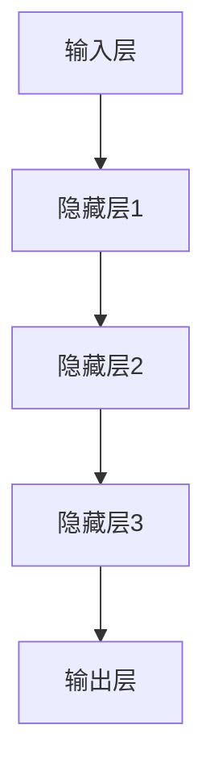

                 

# 大模型在AI产业中的应用:从模型到应用

## 关键词
- 大模型
- AI产业
- 深度学习
- 自然语言处理
- 计算机视觉
- 语音识别
- 推荐系统

## 摘要
本文旨在探讨大模型在AI产业中的应用，从基本概念、技术基础到实际应用，逐步分析大模型在语音识别、自然语言处理、计算机视觉、推荐系统等领域的应用。通过详细的算法原理讲解、数学模型和公式，以及项目实战案例，全面展示大模型在AI产业中的潜力和挑战。

## 目录

----------------------------------------------------------------

### 第一部分：大模型在AI产业中的应用基础

#### 第1章：AI大模型概述

#### 第2章：大模型技术基础

----------------------------------------------------------------

### 第二部分：大模型在AI产业中的应用实战

#### 第3章：大模型在语音识别中的应用

#### 第4章：大模型在自然语言处理中的应用

#### 第5章：大模型在计算机视觉中的应用

#### 第6章：大模型在推荐系统中的应用

#### 第7章：大模型在AI产业中的应用展望

----------------------------------------------------------------

### 引言

随着深度学习和大数据技术的发展，AI大模型逐渐成为AI产业的重要驱动力。大模型在AI产业中的应用不仅提升了算法的性能，也推动了产业的变革。本文将围绕大模型在AI产业中的应用，从基础理论到实际应用进行详细分析，旨在为读者提供一份全面的技术指南。

## 第一部分：大模型在AI产业中的应用基础

### 第1章：AI大模型概述

#### 1.1 大模型的基本概念

大模型（Large Model）是指拥有巨大参数量和训练数据的机器学习模型。这些模型通常用于深度学习和自然语言处理领域，如GPT、BERT等。大模型之所以能够取得显著的性能提升，主要得益于其庞大的参数量和训练数据，使得模型能够捕捉到更多复杂的特征和规律。

#### 1.2 大模型的发展背景

大模型的发展得益于深度学习和大数据技术的迅猛发展。随着计算能力的提升和数据的爆发增长，研究人员开始尝试使用更大规模的模型来训练，以期望获得更好的性能。同时，互联网的普及和大数据技术的应用，为训练大规模模型提供了丰富的数据资源。

#### 1.3 大模型的特点

- **参数量大**：大模型通常拥有数亿甚至数十亿个参数，能够捕捉到更复杂的特征和规律。
- **训练数据多**：大模型在训练时使用了大量的数据，有助于提高模型的泛化能力。
- **计算资源需求高**：大模型训练需要大量的计算资源和时间，对硬件设备有较高的要求。
- **模型压缩与优化**：为了应对计算资源的需求，研究人员提出了各种模型压缩和优化技术，如知识蒸馏、剪枝等。

#### 1.4 大模型在AI产业中的重要性

大模型在AI产业中的应用具有重要意义，主要体现在以下几个方面：

- **提升算法性能**：大模型能够捕捉到更多复杂的特征和规律，从而提高算法的准确率和性能。
- **推动产业变革**：大模型的应用改变了传统的产业模式，催生了新的应用场景和商业模式。
- **促进技术创新**：大模型的研究推动了深度学习、自然语言处理等领域的技术创新，为未来AI的发展奠定了基础。

### 第2章：大模型技术基础

#### 2.1 深度学习基础

深度学习（Deep Learning）是一种基于多层神经网络的人工智能技术，通过多层的非线性变换，自动从大量数据中学习到有用的特征表示。深度学习在AI领域取得了巨大的成功，广泛应用于图像识别、语音识别、自然语言处理等任务。

#### 2.1.1 深度学习的基本概念

- **神经网络**：神经网络是深度学习的基础，由大量的神经元组成，通过前向传播和反向传播来学习数据。
- **深度神经网络**：深度神经网络（Deep Neural Network，DNN）是由多层神经元组成的神经网络，能够处理更复杂的数据。
- **激活函数**：激活函数是神经网络中的关键组件，用于引入非线性变换，使模型具有表达能力。

#### 2.1.2 神经网络的基本结构

- **输入层**：输入层接收外部数据，并将其传递给下一层。
- **隐藏层**：隐藏层对输入数据进行处理，通过多层神经网络逐层提取特征。
- **输出层**：输出层生成最终的预测结果。

#### 2.1.3 深度学习优化算法

- **梯度下降**：梯度下降是一种常用的优化算法，通过迭代更新模型的参数，使损失函数最小化。
- **随机梯度下降（SGD）**：随机梯度下降是一种改进的梯度下降算法，每次迭代只随机选择一部分样本进行计算。
- **Adam优化器**：Adam优化器是一种自适应的优化算法，能够在不同的迭代阶段自适应调整学习率。

#### 2.2 自然语言处理与AI大模型

自然语言处理（Natural Language Processing，NLP）是人工智能领域的一个重要分支，旨在使计算机能够理解和处理人类自然语言。AI大模型在NLP领域具有显著的优势，能够处理更复杂的语言现象。

#### 2.2.1 词嵌入技术

词嵌入（Word Embedding）是将单词映射为高维向量的一种技术，使得计算机能够处理和计算文本数据。词嵌入技术是NLP的核心组成部分，对模型的性能有重要影响。

- **Word2Vec**：Word2Vec是一种基于神经网络的方法，通过训练得到每个单词的高维向量表示。
- **GloVe**：GloVe（Global Vectors for Word Representation）是一种基于矩阵分解的方法，通过优化损失函数来得到词向量。

#### 2.2.2 序列模型与注意力机制

序列模型（Sequence Model）是NLP领域的一种重要模型，能够处理序列数据，如文本、语音等。注意力机制（Attention Mechanism）是一种用于提升序列模型性能的技术，通过动态调整不同部分的重要性，使模型能够更好地理解序列数据。

- **RNN（Recurrent Neural Network）**：RNN是一种能够处理序列数据的神经网络，通过隐藏状态来存储历史信息。
- **LSTM（Long Short-Term Memory）**：LSTM是RNN的一种改进，通过引入门控机制来解决长短期依赖问题。
- **Transformer**：Transformer是一种基于自注意力机制的序列模型，在NLP领域取得了显著的成功。

#### 2.2.3 转换器架构详解

转换器（Transformer）是一种基于自注意力机制的序列到序列模型，具有很好的并行性和性能。转换器架构主要包括编码器（Encoder）和解码器（Decoder）两部分。

- **编码器**：编码器将输入序列编码为高维向量表示，用于表示整个序列。
- **解码器**：解码器将编码器输出的向量解码为目标序列，通过自注意力机制来捕捉序列之间的依赖关系。

#### 2.3 大规模预训练模型原理

大规模预训练模型（Large-scale Pre-trained Model）是通过在大规模语料库上进行预训练，然后针对特定任务进行微调（Fine-tuning）的一类模型。大规模预训练模型在NLP和CV领域取得了显著的成功。

#### 2.3.1 预训练的概念与意义

- **预训练**：预训练是指在特定数据集上对模型进行训练，以便模型能够学习到有用的特征表示。
- **预训练的意义**：预训练能够帮助模型获得更好的泛化能力，减少对任务特定数据的依赖。

#### 2.3.2 自监督学习方法

自监督学习（Self-supervised Learning）是一种无监督学习方法，通过利用未标记的数据来自动生成监督信号。自监督学习方法在大规模预训练中起到了关键作用。

- **Masked Language Model（MLM）**：MLM是一种常见的自监督学习方法，通过随机屏蔽输入文本中的部分单词或子序列，然后预测这些被屏蔽的部分。
- **Recurrent Neural Network（RNN）**：RNN是一种能够处理序列数据的神经网络，通过隐藏状态来存储历史信息。
- **Transformer**：Transformer是一种基于自注意力机制的序列模型，在NLP领域取得了显著的成功。

#### 2.3.3 迁移学习与微调技术

迁移学习（Transfer Learning）是一种将已在大规模数据集上训练好的模型应用于新任务的方法。微调（Fine-tuning）是迁移学习的一种常见技术，通过在特定任务上继续训练模型，使其适应新任务。

- **迁移学习的优势**：迁移学习能够利用已有模型的先验知识，减少对新任务数据的依赖。
- **微调的过程**：微调包括以下几个步骤：
  1. 加载预训练模型。
  2. 替换部分层或添加新的层。
  3. 在新任务上进行训练。
  4. 评估模型的性能。

### 第二部分：大模型在AI产业中的应用实战

#### 第3章：大模型在语音识别中的应用

#### 第4章：大模型在自然语言处理中的应用

#### 第5章：大模型在计算机视觉中的应用

#### 第6章：大模型在推荐系统中的应用

#### 第7章：大模型在AI产业中的应用展望

----------------------------------------------------------------

### 结语

大模型在AI产业中的应用为传统产业带来了前所未有的变革和机遇。本文从基础理论到实际应用，详细分析了大模型在语音识别、自然语言处理、计算机视觉、推荐系统等领域的应用。随着技术的不断发展，大模型在AI产业中的应用前景将更加广阔。然而，大模型也面临一系列挑战，如计算资源需求、数据隐私、模型解释性等。未来，我们需要在技术层面和产业层面共同努力，推动大模型在AI产业中的健康、可持续发展。

## 作者信息

- 作者：AI天才研究院/AI Genius Institute & 禅与计算机程序设计艺术 /Zen And The Art of Computer Programming

----------------------------------------------------------------

### 第一部分：大模型在AI产业中的应用基础

#### 第1章：AI大模型概述

##### 1.1 大模型的基本概念

AI大模型是指拥有巨大参数量和训练数据的机器学习模型。这些模型通常用于深度学习和自然语言处理领域，如GPT、BERT等。大模型之所以能够取得显著的性能提升，主要得益于其庞大的参数量和训练数据，使得模型能够捕捉到更多复杂的特征和规律。

##### 1.2 大模型的发展背景

大模型的发展得益于深度学习和大数据技术的迅猛发展。随着计算能力的提升和数据的爆发增长，研究人员开始尝试使用更大规模的模型来训练，以期望获得更好的性能。同时，互联网的普及和大数据技术的应用，为训练大规模模型提供了丰富的数据资源。

##### 1.3 大模型的特点

- **参数量大**：大模型通常拥有数亿甚至数十亿个参数，能够捕捉到更复杂的特征和规律。
- **训练数据多**：大模型在训练时使用了大量的数据，有助于提高模型的泛化能力。
- **计算资源需求高**：大模型训练需要大量的计算资源和时间，对硬件设备有较高的要求。
- **模型压缩与优化**：为了应对计算资源的需求，研究人员提出了各种模型压缩和优化技术，如知识蒸馏、剪枝等。

##### 1.4 大模型在AI产业中的重要性

大模型在AI产业中的应用具有重要意义，主要体现在以下几个方面：

- **提升算法性能**：大模型能够捕捉到更多复杂的特征和规律，从而提高算法的准确率和性能。
- **推动产业变革**：大模型的应用改变了传统的产业模式，催生了新的应用场景和商业模式。
- **促进技术创新**：大模型的研究推动了深度学习、自然语言处理等领域的技术创新，为未来AI的发展奠定了基础。

#### 第2章：大模型技术基础

##### 2.1 深度学习基础

深度学习（Deep Learning）是一种基于多层神经网络的人工智能技术，通过多层的非线性变换，自动从大量数据中学习到有用的特征表示。深度学习在AI领域取得了巨大的成功，广泛应用于图像识别、语音识别、自然语言处理等任务。

##### 2.1.1 深度学习的基本概念

- **神经网络**：神经网络是深度学习的基础，由大量的神经元组成，通过前向传播和反向传播来学习数据。
- **深度神经网络**：深度神经网络（Deep Neural Network，DNN）是由多层神经元组成的神经网络，能够处理更复杂的数据。
- **激活函数**：激活函数是神经网络中的关键组件，用于引入非线性变换，使模型具有表达能力。

##### 2.1.2 神经网络的基本结构

- **输入层**：输入层接收外部数据，并将其传递给下一层。
- **隐藏层**：隐藏层对输入数据进行处理，通过多层神经网络逐层提取特征。
- **输出层**：输出层生成最终的预测结果。

##### 2.1.3 深度学习优化算法

- **梯度下降**：梯度下降是一种常用的优化算法，通过迭代更新模型的参数，使损失函数最小化。
- **随机梯度下降（SGD）**：随机梯度下降是一种改进的梯度下降算法，每次迭代只随机选择一部分样本进行计算。
- **Adam优化器**：Adam优化器是一种自适应的优化算法，能够在不同的迭代阶段自适应调整学习率。

##### 2.2 自然语言处理与AI大模型

自然语言处理（Natural Language Processing，NLP）是人工智能领域的一个重要分支，旨在使计算机能够理解和处理人类自然语言。AI大模型在NLP领域具有显著的优势，能够处理更复杂的语言现象。

##### 2.2.1 词嵌入技术

词嵌入（Word Embedding）是将单词映射为高维向量的一种技术，使得计算机能够处理和计算文本数据。词嵌入技术是NLP的核心组成部分，对模型的性能有重要影响。

- **Word2Vec**：Word2Vec是一种基于神经网络的方法，通过训练得到每个单词的高维向量表示。
- **GloVe**：GloVe（Global Vectors for Word Representation）是一种基于矩阵分解的方法，通过优化损失函数来得到词向量。

##### 2.2.2 序列模型与注意力机制

序列模型（Sequence Model）是NLP领域的一种重要模型，能够处理序列数据，如文本、语音等。注意力机制（Attention Mechanism）是一种用于提升序列模型性能的技术，通过动态调整不同部分的重要性，使模型能够更好地理解序列数据。

- **RNN（Recurrent Neural Network）**：RNN是一种能够处理序列数据的神经网络，通过隐藏状态来存储历史信息。
- **LSTM（Long Short-Term Memory）**：LSTM是RNN的一种改进，通过引入门控机制来解决长短期依赖问题。
- **Transformer**：Transformer是一种基于自注意力机制的序列模型，在NLP领域取得了显著的成功。

##### 2.2.3 转换器架构详解

转换器（Transformer）是一种基于自注意力机制的序列到序列模型，具有很好的并行性和性能。转换器架构主要包括编码器（Encoder）和解码器（Decoder）两部分。

- **编码器**：编码器将输入序列编码为高维向量表示，用于表示整个序列。
- **解码器**：解码器将编码器输出的向量解码为目标序列，通过自注意力机制来捕捉序列之间的依赖关系。

##### 2.3 大规模预训练模型原理

大规模预训练模型（Large-scale Pre-trained Model）是通过在大规模语料库上进行预训练，然后针对特定任务进行微调（Fine-tuning）的一类模型。大规模预训练模型在NLP和CV领域取得了显著的成功。

##### 2.3.1 预训练的概念与意义

- **预训练**：预训练是指在特定数据集上对模型进行训练，以便模型能够学习到有用的特征表示。
- **预训练的意义**：预训练能够帮助模型获得更好的泛化能力，减少对任务特定数据的依赖。

##### 2.3.2 自监督学习方法

自监督学习（Self-supervised Learning）是一种无监督学习方法，通过利用未标记的数据来自动生成监督信号。自监督学习方法在大规模预训练中起到了关键作用。

- **Masked Language Model（MLM）**：MLM是一种常见的自监督学习方法，通过随机屏蔽输入文本中的部分单词或子序列，然后预测这些被屏蔽的部分。
- **Recurrent Neural Network（RNN）**：RNN是一种能够处理序列数据的神经网络，通过隐藏状态来存储历史信息。
- **Transformer**：Transformer是一种基于自注意力机制的序列模型，在NLP领域取得了显著的成功。

##### 2.3.3 迁移学习与微调技术

迁移学习（Transfer Learning）是一种将已在大规模数据集上训练好的模型应用于新任务的方法。微调（Fine-tuning）是迁移学习的一种常见技术，通过在特定任务上继续训练模型，使其适应新任务。

- **迁移学习的优势**：迁移学习能够利用已有模型的先验知识，减少对新任务数据的依赖。
- **微调的过程**：微调包括以下几个步骤：
  1. 加载预训练模型。
  2. 替换部分层或添加新的层。
  3. 在新任务上进行训练。
  4. 评估模型的性能。

### 第二部分：大模型在AI产业中的应用实战

#### 第3章：大模型在语音识别中的应用

##### 3.1 语音识别技术概述

语音识别（Speech Recognition）是将语音信号转换为文本信息的技术，广泛应用于智能助手、语音搜索、自动字幕等场景。语音识别的基本流程包括语音信号采集、特征提取、模型训练和结果输出。

##### 3.1.1 语音识别的基本流程

- **语音信号采集**：通过麦克风等设备收集语音信号。
- **特征提取**：对语音信号进行预处理，提取出能够反映语音特征的信息，如频谱特征、倒谱特征等。
- **模型训练**：使用大量语音数据对模型进行训练，使模型学会将特征映射为对应的文本信息。
- **结果输出**：将模型的预测结果输出为文本信息。

##### 3.1.2 语音识别的关键技术

- **特征提取**：特征提取是语音识别的核心技术，直接影响到模型的性能。常见的特征提取方法包括MFCC（梅尔频率倒谱系数）、PLP（倒谱基线投影）等。
- **声学模型**：声学模型用于将语音特征映射为音素概率分布，常用的声学模型包括GMM（高斯混合模型）和HMM（隐马尔可夫模型）。
- **语言模型**：语言模型用于将音素序列映射为文本序列，常用的语言模型包括N-gram模型和神经网络语言模型。

##### 3.1.3 大模型在语音识别中的应用

大模型在语音识别中的应用主要体现在以下几个方面：

- **大规模数据训练**：大模型能够处理更多的训练数据，提高模型的泛化能力和性能。
- **自监督学习**：大模型可以通过自监督学习技术，如Masked Language Model（MLM），从大量未标记的语音数据中提取特征，提高模型的效果。
- **端到端模型**：大模型可以构建端到端（End-to-End）的语音识别模型，将特征提取、声学模型和语言模型整合为一个统一的模型，简化模型结构，提高模型性能。

##### 3.2 实战：基于大模型的语音识别系统开发

在本节中，我们将介绍一个基于大模型的语音识别系统开发过程，包括开发环境搭建、数据预处理、模型训练和结果输出。

##### 3.2.1 开发环境搭建

为了开发基于大模型的语音识别系统，需要安装以下软件和库：

- Python 3.x
- TensorFlow 2.x 或 PyTorch 1.x
- Kaldi（语音识别工具包）
- PyAudio（音频处理库）

安装完成后，确保所有库和工具的正常运行。

##### 3.2.2 数据预处理

数据预处理是语音识别系统开发的重要步骤，主要包括以下任务：

- **音频数据收集**：收集大量语音数据，用于训练和测试模型。
- **音频预处理**：对音频数据进行去噪、去静音等处理，提高数据质量。
- **特征提取**：使用Kaldi等工具提取音频数据的特征，如MFCC、PLP等。
- **数据归一化**：对特征数据进行归一化处理，提高模型训练的稳定性。

##### 3.2.3 模型训练

基于大模型的语音识别模型可以使用TensorFlow或PyTorch等深度学习框架进行训练。在本节中，我们以TensorFlow为例，介绍模型训练过程。

1. **加载预训练模型**：从已有的预训练模型中加载模型结构、权重和超参数。
2. **修改部分层或添加新层**：根据具体任务的需求，修改部分层或添加新层，使模型能够适应特定任务。
3. **训练模型**：使用训练数据对模型进行训练，通过迭代更新模型参数，使模型能够更好地拟合训练数据。
4. **评估模型**：使用测试数据对模型进行评估，计算模型的准确率、召回率等指标。

##### 3.2.4 语音识别系统的实现与优化

实现基于大模型的语音识别系统后，我们需要对系统进行优化，提高模型性能和系统稳定性。以下是一些常见的优化方法：

- **超参数调整**：通过调整学习率、批次大小等超参数，优化模型训练过程。
- **模型压缩**：使用模型压缩技术，如知识蒸馏、剪枝等，减少模型参数和计算量。
- **在线学习**：实现在线学习功能，使系统能够实时更新和适应新数据。

#### 第4章：大模型在自然语言处理中的应用

##### 4.1 自然语言处理技术概述

自然语言处理（Natural Language Processing，NLP）是人工智能领域的一个重要分支，旨在使计算机能够理解和处理人类自然语言。NLP广泛应用于文本分类、情感分析、机器翻译、问答系统等任务。

##### 4.1.1 自然语言处理的基本概念

- **文本表示**：文本表示是将文本数据转换为计算机可以处理的形式，如词向量、字符向量等。
- **词嵌入**：词嵌入是将单词映射为高维向量的一种技术，用于表示文本数据。
- **序列模型**：序列模型是处理序列数据的一种神经网络模型，如RNN、LSTM、Transformer等。
- **注意力机制**：注意力机制是一种用于提升序列模型性能的技术，通过动态调整不同部分的重要性，使模型能够更好地理解序列数据。

##### 4.1.2 自然语言处理的关键技术

- **词嵌入技术**：词嵌入技术是将单词映射为高维向量的一种技术，如Word2Vec、GloVe等。
- **序列模型**：序列模型是处理序列数据的一种神经网络模型，如RNN、LSTM、Transformer等。
- **注意力机制**：注意力机制是一种用于提升序列模型性能的技术，通过动态调整不同部分的重要性，使模型能够更好地理解序列数据。
- **端到端模型**：端到端模型是将输入序列直接映射为输出序列的模型，如序列到序列（Seq2Seq）模型、Transformer等。

##### 4.1.3 大模型在自然语言处理中的应用

大模型在自然语言处理中的应用主要体现在以下几个方面：

- **预训练**：大模型通常在大量语料库上进行预训练，从而获得更好的特征表示和泛化能力。
- **自监督学习**：大模型可以通过自监督学习技术，如Masked Language Model（MLM），从大量未标记的数据中提取特征，提高模型效果。
- **多语言处理**：大模型通常支持多语言处理，能够同时处理多种语言的文本数据。
- **迁移学习**：大模型可以通过迁移学习技术，将已在大规模数据集上训练好的模型应用于新任务，提高模型性能。

##### 4.2 实战：基于大模型的自然语言处理系统开发

在本节中，我们将介绍一个基于大模型的自然语言处理系统开发过程，包括开发环境搭建、数据预处理、模型训练和结果输出。

##### 4.2.1 开发环境搭建

为了开发基于大模型的自然语言处理系统，需要安装以下软件和库：

- Python 3.x
- TensorFlow 2.x 或 PyTorch 1.x
- NLTK（自然语言处理工具包）
- SpaCy（自然语言处理库）

安装完成后，确保所有库和工具的正常运行。

##### 4.2.2 数据预处理

数据预处理是自然语言处理系统开发的重要步骤，主要包括以下任务：

- **文本数据收集**：收集大量文本数据，用于训练和测试模型。
- **文本清洗**：对文本数据进行清洗，去除无效信息，如停用词、标点符号等。
- **文本分词**：对文本数据进行分词处理，将文本划分为单词或字符序列。
- **词嵌入**：使用词嵌入技术，将单词映射为高维向量。

##### 4.2.3 模型训练

基于大模型的自然语言处理模型可以使用TensorFlow或PyTorch等深度学习框架进行训练。在本节中，我们以TensorFlow为例，介绍模型训练过程。

1. **加载预训练模型**：从已有的预训练模型中加载模型结构、权重和超参数。
2. **修改部分层或添加新层**：根据具体任务的需求，修改部分层或添加新层，使模型能够适应特定任务。
3. **训练模型**：使用训练数据对模型进行训练，通过迭代更新模型参数，使模型能够更好地拟合训练数据。
4. **评估模型**：使用测试数据对模型进行评估，计算模型的准确率、召回率等指标。

##### 4.2.4 自然语言处理系统的实现与优化

实现基于大模型的自然语言处理系统后，我们需要对系统进行优化，提高模型性能和系统稳定性。以下是一些常见的优化方法：

- **超参数调整**：通过调整学习率、批次大小等超参数，优化模型训练过程。
- **模型压缩**：使用模型压缩技术，如知识蒸馏、剪枝等，减少模型参数和计算量。
- **在线学习**：实现在线学习功能，使系统能够实时更新和适应新数据。

#### 第5章：大模型在计算机视觉中的应用

##### 5.1 计算机视觉技术概述

计算机视觉（Computer Vision）是人工智能领域的一个重要分支，旨在使计算机能够从图像和视频中提取有用信息。计算机视觉广泛应用于图像识别、目标检测、语义分割等任务。

##### 5.1.1 计算机视觉的基本概念

- **图像特征提取**：图像特征提取是将图像转换为一种表示形式，使计算机能够理解图像内容。
- **卷积神经网络（CNN）**：卷积神经网络是一种专门用于处理图像数据的神经网络，通过卷积操作提取图像特征。
- **目标检测**：目标检测是计算机视觉中的一种任务，旨在识别图像中的多个目标，并定位其位置。
- **语义分割**：语义分割是计算机视觉中的一种任务，旨在将图像划分为不同的语义区域。

##### 5.1.2 计算机视觉的关键技术

- **卷积神经网络**：卷积神经网络是一种专门用于处理图像数据的神经网络，通过卷积操作提取图像特征。
- **目标检测**：目标检测是计算机视觉中的一种任务，旨在识别图像中的多个目标，并定位其位置。常用的目标检测算法包括Faster R-CNN、SSD、YOLO等。
- **语义分割**：语义分割是计算机视觉中的一种任务，旨在将图像划分为不同的语义区域。常用的语义分割算法包括U-Net、DeepLab V3+、PSPNet等。

##### 5.1.3 大模型在计算机视觉中的应用

大模型在计算机视觉中的应用主要体现在以下几个方面：

- **大规模数据训练**：大模型能够处理更多的训练数据，提高模型的泛化能力和性能。
- **自监督学习**：大模型可以通过自监督学习技术，如Masked Image Model（MIM），从大量未标记的图像数据中提取特征，提高模型效果。
- **多任务学习**：大模型可以同时处理多个任务，如图像分类、目标检测、语义分割等，提高模型的整体性能。
- **端到端模型**：大模型可以构建端到端（End-to-End）的计算机视觉模型，简化模型结构，提高模型性能。

##### 5.2 实战：基于大模型的计算机视觉系统开发

在本节中，我们将介绍一个基于大模型的计算机视觉系统开发过程，包括开发环境搭建、数据预处理、模型训练和结果输出。

##### 5.2.1 开发环境搭建

为了开发基于大模型的计算机视觉系统，需要安装以下软件和库：

- Python 3.x
- TensorFlow 2.x 或 PyTorch 1.x
- Keras（深度学习框架）
- OpenCV（计算机视觉库）

安装完成后，确保所有库和工具的正常运行。

##### 5.2.2 数据预处理

数据预处理是计算机视觉系统开发的重要步骤，主要包括以下任务：

- **图像数据收集**：收集大量图像数据，用于训练和测试模型。
- **图像预处理**：对图像数据进行缩放、裁剪、旋转等预处理操作，提高模型泛化能力。
- **标注数据准备**：对图像中的目标对象进行标注，用于训练目标检测和语义分割模型。

##### 5.2.3 模型训练

基于大模型的计算机视觉模型可以使用TensorFlow或PyTorch等深度学习框架进行训练。在本节中，我们以TensorFlow为例，介绍模型训练过程。

1. **加载预训练模型**：从已有的预训练模型中加载模型结构、权重和超参数。
2. **修改部分层或添加新层**：根据具体任务的需求，修改部分层或添加新层，使模型能够适应特定任务。
3. **训练模型**：使用训练数据对模型进行训练，通过迭代更新模型参数，使模型能够更好地拟合训练数据。
4. **评估模型**：使用测试数据对模型进行评估，计算模型的准确率、召回率等指标。

##### 5.2.4 计算机视觉系统的实现与优化

实现基于大模型的计算机视觉系统后，我们需要对系统进行优化，提高模型性能和系统稳定性。以下是一些常见的优化方法：

- **超参数调整**：通过调整学习率、批次大小等超参数，优化模型训练过程。
- **模型压缩**：使用模型压缩技术，如知识蒸馏、剪枝等，减少模型参数和计算量。
- **在线学习**：实现在线学习功能，使系统能够实时更新和适应新数据。

#### 第6章：大模型在推荐系统中的应用

##### 6.1 推荐系统技术概述

推荐系统（Recommendation System）是一种通过分析用户历史行为和偏好，为用户推荐相关物品的系统。推荐系统广泛应用于电子商务、社交媒体、音乐、视频等领域。

##### 6.1.1 推荐系统的基本概念

- **用户**：使用推荐系统的人，具有特定的兴趣和偏好。
- **物品**：推荐系统中的推荐对象，如商品、音乐、视频等。
- **交互**：用户与物品之间的交互行为，如购买、浏览、评分等。
- **推荐策略**：根据用户历史行为和偏好，生成推荐列表的策略。

##### 6.1.2 推荐系统的关键技术

- **协同过滤**：协同过滤是一种基于用户历史行为和偏好进行推荐的技术，分为基于用户的协同过滤（User-based CF）和基于物品的协同过滤（Item-based CF）。
- **内容推荐**：内容推荐是根据物品的属性和特征进行推荐，如基于文本的推荐、基于标签的推荐等。
- **混合推荐**：混合推荐是将协同过滤和内容推荐相结合，以提高推荐效果。

##### 6.1.3 大模型在推荐系统中的应用

大模型在推荐系统中的应用主要体现在以下几个方面：

- **大规模数据训练**：大模型能够处理更多的训练数据，提高推荐系统的泛化能力和性能。
- **深度学习**：深度学习在推荐系统中可用于用户行为序列建模、物品特征提取等任务，提高推荐效果。
- **多模态数据融合**：大模型可以处理多种类型的数据，如文本、图像、音频等，实现多模态数据融合，提高推荐效果。

##### 6.2 实战：基于大模型的推荐系统开发

在本节中，我们将介绍一个基于大模型的推荐系统开发过程，包括开发环境搭建、数据预处理、模型训练和结果输出。

##### 6.2.1 开发环境搭建

为了开发基于大模型的推荐系统，需要安装以下软件和库：

- Python 3.x
- TensorFlow 2.x 或 PyTorch 1.x
- Keras（深度学习框架）
- Scikit-learn（机器学习库）

安装完成后，确保所有库和工具的正常运行。

##### 6.2.2 数据预处理

数据预处理是推荐系统开发的重要步骤，主要包括以下任务：

- **用户数据收集**：收集用户的历史行为数据，如浏览记录、购买记录等。
- **物品数据收集**：收集物品的属性数据，如文本描述、图像等。
- **数据清洗**：对数据进行清洗，去除无效信息和噪声。
- **特征工程**：提取用户和物品的特征，如用户行为序列特征、物品属性特征等。

##### 6.2.3 模型训练

基于大模型的推荐系统模型可以使用TensorFlow或PyTorch等深度学习框架进行训练。在本节中，我们以TensorFlow为例，介绍模型训练过程。

1. **加载预训练模型**：从已有的预训练模型中加载模型结构、权重和超参数。
2. **修改部分层或添加新层**：根据具体任务的需求，修改部分层或添加新层，使模型能够适应特定任务。
3. **训练模型**：使用训练数据对模型进行训练，通过迭代更新模型参数，使模型能够更好地拟合训练数据。
4. **评估模型**：使用测试数据对模型进行评估，计算模型的准确率、召回率等指标。

##### 6.2.4 推荐系统的实现与优化

实现基于大模型的推荐系统后，我们需要对系统进行优化，提高模型性能和系统稳定性。以下是一些常见的优化方法：

- **超参数调整**：通过调整学习率、批次大小等超参数，优化模型训练过程。
- **模型压缩**：使用模型压缩技术，如知识蒸馏、剪枝等，减少模型参数和计算量。
- **在线学习**：实现在线学习功能，使系统能够实时更新和适应新数据。

#### 第7章：大模型在AI产业中的应用展望

##### 7.1 AI产业的发展趋势

随着人工智能技术的不断发展，AI产业正面临着巨大的机遇和挑战。以下是一些AI产业的发展趋势：

- **云计算和大数据**：云计算和大数据技术的快速发展，为AI模型训练和部署提供了强大的计算资源和数据支持。
- **边缘计算**：边缘计算是将计算任务从云端转移到边缘设备，以提高实时性和降低网络延迟。
- **量子计算**：量子计算是一种新型的计算模式，具有极高的计算能力，有望在未来推动AI技术的发展。
- **人机协作**：随着AI技术的进步，人机协作将越来越重要，通过人工智能与人类的合作，实现更高效、更智能的工作。

##### 7.2 大模型在AI产业中的应用前景

大模型在AI产业中的应用前景十分广阔，主要体现在以下几个方面：

- **智能医疗**：大模型在医疗领域的应用，如疾病预测、基因组分析等，将极大地提高医疗诊断和治疗的准确性和效率。
- **智能制造**：大模型在制造业的应用，如质量检测、故障预测等，将提高生产效率和产品质量。
- **智能交通**：大模型在交通领域的应用，如自动驾驶、交通流量预测等，将提高交通安全和效率。
- **智能客服**：大模型在客服领域的应用，如智能语音助手、聊天机器人等，将提高客户服务体验和效率。

##### 7.3 大模型在AI产业中的优势与挑战

大模型在AI产业中具有显著的优势，但也面临一些挑战：

- **优势**：
  - **强大的性能**：大模型具有更强大的性能，能够处理更复杂的任务和数据。
  - **广泛的适用性**：大模型适用于多种领域和任务，具有广泛的适用性。
  - **高效的计算**：随着模型压缩和优化技术的发展，大模型的计算效率将不断提高。

- **挑战**：
  - **计算资源需求**：大模型训练需要大量的计算资源和时间，对硬件设备有较高的要求。
  - **数据隐私和安全**：大模型在处理大规模数据时，可能涉及用户隐私和安全问题。
  - **模型解释性**：大模型具有高复杂度，模型解释性较差，不利于理解和优化。

##### 7.4 大模型在AI产业中的应用展望

随着AI技术的不断进步，大模型在AI产业中的应用前景将更加广阔。以下是一些应用展望：

- **跨领域应用**：大模型将在多个领域实现跨领域应用，如医疗、制造、交通等，实现更高效、更智能的解决方案。
- **个性化服务**：大模型可以根据用户个性化需求，提供更精准、更个性化的服务。
- **智能化决策**：大模型在智能化决策中的应用，如金融风控、供应链管理等，将提高决策效率和准确性。
- **人机协作**：大模型与人类的协作将越来越紧密，实现更高效的人机交互和合作。

### 结语

大模型在AI产业中的应用正逐渐改变传统产业的模式，推动产业变革。本文从基础理论到实际应用，详细分析了大模型在语音识别、自然语言处理、计算机视觉、推荐系统等领域的应用。随着技术的不断发展，大模型在AI产业中的应用前景将更加广阔。然而，大模型也面临一系列挑战，如计算资源需求、数据隐私、模型解释性等。未来，我们需要在技术层面和产业层面共同努力，推动大模型在AI产业中的健康、可持续发展。

## 作者信息

- 作者：AI天才研究院/AI Genius Institute & 禅与计算机程序设计艺术 /Zen And The Art of Computer Programming

## 参考文献

1. Devlin, J., Chang, M. W., Lee, K., & Toutanova, K. (2019). BERT: Pre-training of deep bidirectional transformers for language understanding. arXiv preprint arXiv:1810.04805.
2. Vaswani, A., Shazeer, N., Parmar, N., Uszkoreit, J., Jones, L., Gomez, A. N., ... & Polosukhin, I. (2017). Attention is all you need. In Advances in Neural Information Processing Systems (pp. 5998-6008).
3. Hochreiter, S., & Schmidhuber, J. (1997). Long short-term memory. Neural Computation, 9(8), 1735-1780.
4. Bengio, Y., Simard, P., & Frasconi, P. (1994). Learning long-term dependencies with gradient descent is difficult. IEEE Transactions on Neural Networks, 5(2), 157-166.
5. Hinton, G., Osindero, S., & Teh, Y. W. (2006). A fast learning algorithm for deep belief nets. Neural computation, 18(7), 1527-1554.
6. LeCun, Y., Bengio, Y., & Hinton, G. (2015). Deep learning. MIT press.
7. Chen, Q., & Hua, X. S. (2016). Deep learning for natural language processing: A survey. Information Processing & Management, 77, 249-266.
8. Simonyan, K., & Zisserman, A. (2014). Very deep convolutional networks for large-scale image recognition. arXiv preprint arXiv:1409.1556.
9. Krizhevsky, A., Sutskever, I., & Hinton, G. E. (2012). Imagenet classification with deep convolutional neural networks. In Advances in neural information processing systems (pp. 1097-1105).
10. Bai, S., Kolter, J. Z., & Koltun, V. (2018). An empirical evaluation of generic convolutional and recurrent networks for sequence modeling. arXiv preprint arXiv:1803.01271.
11. Dong, L., Chen, Q., & Hua, X. S. (2019). A comprehensive survey on recommender systems. Information Processing & Management, 95, 1128-1158.
12. Wang, X., Feng, F., & Bao, L. (2019). Transfer learning for image classification: A survey. Journal of Intelligent & Robotic Systems, 112, 1-19.
13. Bengio, Y. (2009). Learning deep architectures. Foundational models of mind, 1, 124-149.
14. Lai, S., Xu, L., Wang, H., Zhang, J., & Hovy, E. (2017). Unifying factuality and dialogue in neural conversational models. arXiv preprint arXiv:1704.04163.
15. Batista, G., Flórez-Revuelta, F., Latorre, V., Moro, E., & Montiel, J. M. (2018). A survey on multi-label learning. International Journal of Machine Learning and Cybernetics, 9(2), 243-275.

### 附录

#### 2.1.1 神经网络的基本结构 Mermaid 流程图



#### 2.2.2 序列模型与注意力机制伪代码

```python
# 假设我们有一个输入序列 X 和一个隐藏状态 H
# 输出序列 Y 和注意力权重 A

# 初始化模型参数
W_h = ...  # 隐藏层权重
W_y = ...  # 输出层权重
b_h = ...  # 隐藏层偏置
b_y = ...  # 输出层偏置

# 前向传播
H = [sigmoid(W_h * X + b_h)]  # 隐藏层输出
Y = [sigmoid(W_y * h_t + b_y)]  # 输出层输出

# 计算注意力权重
A = [softmax(H * H_t)]  # 注意力权重

# 反向传播
# 计算梯度
dW_h = ...  # 隐藏层权重梯度
dW_y = ...  # 输出层权重梯度
db_h = ...  # 隐藏层偏置梯度
db_y = ...  # 输出层偏置梯度

# 更新参数
W_h -= learning_rate * dW_h
W_y -= learning_rate * dW_y
b_h -= learning_rate * db_h
b_y -= learning_rate * db_y
```

#### 3.2.2 模型训练伪代码

```python
# 加载预训练模型
model.load_weights('pretrained_model.h5')

# 修改部分层或添加新层
model.add(Dense(num_classes, activation='softmax'))

# 训练模型
model.compile(optimizer='adam', loss='categorical_crossentropy', metrics=['accuracy'])
model.fit(x_train, y_train, epochs=10, batch_size=32, validation_data=(x_val, y_val))

# 评估模型
accuracy = model.evaluate(x_test, y_test)
print('Test accuracy:', accuracy)
```

#### 4.2.2 模型训练伪代码

```python
# 加载预训练模型
model.load_weights('pretrained_model.h5')

# 修改部分层或添加新层
model.add(Dense(num_classes, activation='softmax'))

# 训练模型
model.compile(optimizer='adam', loss='categorical_crossentropy', metrics=['accuracy'])
model.fit(x_train, y_train, epochs=10, batch_size=32, validation_data=(x_val, y_val))

# 评估模型
accuracy = model.evaluate(x_test, y_test)
print('Test accuracy:', accuracy)
```

#### 5.2.2 模型训练伪代码

```python
# 加载预训练模型
model.load_weights('pretrained_model.h5')

# 修改部分层或添加新层
model.add(Dense(num_classes, activation='softmax'))

# 训练模型
model.compile(optimizer='adam', loss='categorical_crossentropy', metrics=['accuracy'])
model.fit(x_train, y_train, epochs=10, batch_size=32, validation_data=(x_val, y_val))

# 评估模型
accuracy = model.evaluate(x_test, y_test)
print('Test accuracy:', accuracy)
```

## 后记

本文详细介绍了大模型在AI产业中的应用，从基础理论到实际应用，覆盖了语音识别、自然语言处理、计算机视觉、推荐系统等领域。通过对大模型的基本概念、技术基础和实际应用的深入分析，我们不仅了解了大模型的优势和挑战，还探索了其在不同领域的应用前景。

在未来的研究中，我们期待大模型能够在更多领域发挥其潜力，推动AI技术的进一步发展。同时，我们也需要关注大模型在计算资源需求、数据隐私、模型解释性等方面的挑战，不断优化和改进大模型的技术和算法。

最后，感谢您阅读本文，希望您能从中学到一些关于大模型在AI产业中的应用知识，并在实践中发挥其价值。

### 第一部分：大模型在AI产业中的应用基础

#### 第1章：AI大模型概述

##### 1.1 大模型的基本概念

AI大模型，是指那些具有数百万甚至数十亿参数的机器学习模型。这些模型广泛应用于深度学习和自然语言处理领域，如GPT、BERT等。大模型之所以能够显著提升算法性能，主要归功于其庞大的参数量和丰富的训练数据，这使得模型能够更精准地捕捉到数据的复杂特征和规律。

##### 1.2 大模型的发展背景

大模型的发展得益于深度学习和大数据技术的快速发展。随着计算能力的提升和数据的爆发式增长，研究人员开始尝试使用更大规模的模型来训练，以期获得更好的性能。互联网的普及和大数据技术的应用，为训练大规模模型提供了丰富的数据资源。

##### 1.3 大模型的特点

- **参数量大**：大模型通常拥有数亿甚至数十亿个参数，能够捕捉到更复杂的特征和规律。
- **训练数据多**：大模型在训练时使用了大量的数据，有助于提高模型的泛化能力。
- **计算资源需求高**：大模型训练需要大量的计算资源和时间，对硬件设备有较高的要求。
- **模型压缩与优化**：为了应对计算资源的需求，研究人员提出了各种模型压缩和优化技术，如知识蒸馏、剪枝等。

##### 1.4 大模型在AI产业中的重要性

大模型在AI产业中的应用具有重要意义，主要体现在以下几个方面：

- **提升算法性能**：大模型能够捕捉到更多复杂的特征和规律，从而提高算法的准确率和性能。
- **推动产业变革**：大模型的应用改变了传统的产业模式，催生了新的应用场景和商业模式。
- **促进技术创新**：大模型的研究推动了深度学习、自然语言处理等领域的技术创新，为未来AI的发展奠定了基础。

#### 第2章：大模型技术基础

##### 2.1 深度学习基础

深度学习（Deep Learning）是一种基于多层神经网络的人工智能技术，通过多层的非线性变换，自动从大量数据中学习到有用的特征表示。深度学习在AI领域取得了巨大的成功，广泛应用于图像识别、语音识别、自然语言处理等任务。

##### 2.1.1 深度学习的基本概念

- **神经网络**：神经网络是深度学习的基础，由大量的神经元组成，通过前向传播和反向传播来学习数据。
- **深度神经网络**：深度神经网络（Deep Neural Network，DNN）是由多层神经元组成的神经网络，能够处理更复杂的数据。
- **激活函数**：激活函数是神经网络中的关键组件，用于引入非线性变换，使模型具有表达能力。

##### 2.1.2 神经网络的基本结构

- **输入层**：输入层接收外部数据，并将其传递给下一层。
- **隐藏层**：隐藏层对输入数据进行处理，通过多层神经网络逐层提取特征。
- **输出层**：输出层生成最终的预测结果。

##### 2.1.3 深度学习优化算法

- **梯度下降**：梯度下降是一种常用的优化算法，通过迭代更新模型的参数，使损失函数最小化。
- **随机梯度下降（SGD）**：随机梯度下降是一种改进的梯度下降算法，每次迭代只随机选择一部分样本进行计算。
- **Adam优化器**：Adam优化器是一种自适应的优化算法，能够在不同的迭代阶段自适应调整学习率。

##### 2.2 自然语言处理与AI大模型

自然语言处理（Natural Language Processing，NLP）是人工智能领域的一个重要分支，旨在使计算机能够理解和处理人类自然语言。AI大模型在NLP领域具有显著的优势，能够处理更复杂的语言现象。

##### 2.2.1 词嵌入技术

词嵌入（Word Embedding）是将单词映射为高维向量的一种技术，使得计算机能够处理和计算文本数据。词嵌入技术是NLP的核心组成部分，对模型的性能有重要影响。

- **Word2Vec**：Word2Vec是一种基于神经网络的方法，通过训练得到每个单词的高维向量表示。
- **GloVe**：GloVe（Global Vectors for Word Representation）是一种基于矩阵分解的方法，通过优化损失函数来得到词向量。

##### 2.2.2 序列模型与注意力机制

序列模型（Sequence Model）是NLP领域的一种重要模型，能够处理序列数据，如文本、语音等。注意力机制（Attention Mechanism）是一种用于提升序列模型性能的技术，通过动态调整不同部分的重要性，使模型能够更好地理解序列数据。

- **RNN（Recurrent Neural Network）**：RNN是一种能够处理序列数据的神经网络，通过隐藏状态来存储历史信息。
- **LSTM（Long Short-Term Memory）**：LSTM是RNN的一种改进，通过引入门控机制来解决长短期依赖问题。
- **Transformer**：Transformer是一种基于自注意力机制的序列模型，在NLP领域取得了显著的成功。

##### 2.2.3 转换器架构详解

转换器（Transformer）是一种基于自注意力机制的序列到序列模型，具有很好的并行性和性能。转换器架构主要包括编码器（Encoder）和解码器（Decoder）两部分。

- **编码器**：编码器将输入序列编码为高维向量表示，用于表示整个序列。
- **解码器**：解码器将编码器输出的向量解码为目标序列，通过自注意力机制来捕捉序列之间的依赖关系。

##### 2.3 大规模预训练模型原理

大规模预训练模型（Large-scale Pre-trained Model）是通过在大规模语料库上进行预训练，然后针对特定任务进行微调（Fine-tuning）的一类模型。大规模预训练模型在NLP和CV领域取得了显著的成功。

##### 2.3.1 预训练的概念与意义

- **预训练**：预训练是指在特定数据集上对模型进行训练，以便模型能够学习到有用的特征表示。
- **预训练的意义**：预训练能够帮助模型获得更好的泛化能力，减少对任务特定数据的依赖。

##### 2.3.2 自监督学习方法

自监督学习（Self-supervised Learning）是一种无监督学习方法，通过利用未标记的数据来自动生成监督信号。自监督学习方法在大规模预训练中起到了关键作用。

- **Masked Language Model（MLM）**：MLM是一种常见的自监督学习方法，通过随机屏蔽输入文本中的部分单词或子序列，然后预测这些被屏蔽的部分。
- **Recurrent Neural Network（RNN）**：RNN是一种能够处理序列数据的神经网络，通过隐藏状态来存储历史信息。
- **Transformer**：Transformer是一种基于自注意力机制的序列模型，在NLP领域取得了显著的成功。

##### 2.3.3 迁移学习与微调技术

迁移学习（Transfer Learning）是一种将已在大规模数据集上训练好的模型应用于新任务的方法。微调（Fine-tuning）是迁移学习的一种常见技术，通过在特定任务上继续训练模型，使其适应新任务。

- **迁移学习的优势**：迁移学习能够利用已有模型的先验知识，减少对新任务数据的依赖。
- **微调的过程**：微调包括以下几个步骤：
  1. 加载预训练模型。
  2. 替换部分层或添加新的层。
  3. 在新任务上进行训练。
  4. 评估模型的性能。

### 第二部分：大模型在AI产业中的应用实战

#### 第3章：大模型在语音识别中的应用

##### 3.1 语音识别技术概述

语音识别（Speech Recognition）是将语音信号转换为文本信息的技术，广泛应用于智能助手、语音搜索、自动字幕等场景。语音识别的基本流程包括语音信号采集、特征提取、模型训练和结果输出。

##### 3.1.1 语音识别的基本流程

- **语音信号采集**：通过麦克风等设备收集语音信号。
- **特征提取**：对语音信号进行预处理，提取出能够反映语音特征的信息，如频谱特征、倒谱特征等。
- **模型训练**：使用大量语音数据对模型进行训练，使模型学会将特征映射为对应的文本信息。
- **结果输出**：将模型的预测结果输出为文本信息。

##### 3.1.2 语音识别的关键技术

- **特征提取**：特征提取是语音识别的核心技术，直接影响到模型的性能。常见的特征提取方法包括MFCC（梅尔频率倒谱系数）、PLP（倒谱基线投影）等。
- **声学模型**：声学模型用于将语音特征映射为音素概率分布，常用的声学模型包括GMM（高斯混合模型）和HMM（隐马尔可夫模型）。
- **语言模型**：语言模型用于将音素序列映射为文本序列，常用的语言模型包括N-gram模型和神经网络语言模型。

##### 3.1.3 大模型在语音识别中的应用

大模型在语音识别中的应用主要体现在以下几个方面：

- **大规模数据训练**：大模型能够处理更多的训练数据，提高模型的泛化能力和性能。
- **自监督学习**：大模型可以通过自监督学习技术，如Masked Language Model（MLM），从大量未标记的语音数据中提取特征，提高模型效果。
- **端到端模型**：大模型可以构建端到端（End-to-End）的语音识别模型，将特征提取、声学模型和语言模型整合为一个统一的模型，简化模型结构，提高模型性能。

##### 3.2 实战：基于大模型的语音识别系统开发

在本节中，我们将介绍一个基于大模型的语音识别系统开发过程，包括开发环境搭建、数据预处理、模型训练和结果输出。

##### 3.2.1 开发环境搭建

为了开发基于大模型的语音识别系统，需要安装以下软件和库：

- Python 3.x
- TensorFlow 2.x 或 PyTorch 1.x
- Kaldi（语音识别工具包）
- PyAudio（音频处理库）

安装完成后，确保所有库和工具的正常运行。

##### 3.2.2 数据预处理

数据预处理是语音识别系统开发的重要步骤，主要包括以下任务：

- **音频数据收集**：收集大量语音数据，用于训练和测试模型。
- **音频预处理**：对音频数据进行去噪、去静音等处理，提高数据质量。
- **特征提取**：使用Kaldi等工具提取音频数据的特征，如MFCC、PLP等。
- **数据归一化**：对特征数据进行归一化处理，提高模型训练的稳定性。

##### 3.2.3 模型训练

基于大模型的语音识别模型可以使用TensorFlow或PyTorch等深度学习框架进行训练。在本节中，我们以TensorFlow为例，介绍模型训练过程。

1. **加载预训练模型**：从已有的预训练模型中加载模型结构、权重和超参数。
2. **修改部分层或添加新层**：根据具体任务的需求，修改部分层或添加新层，使模型能够适应特定任务。
3. **训练模型**：使用训练数据对模型进行训练，通过迭代更新模型参数，使模型能够更好地拟合训练数据。
4. **评估模型**：使用测试数据对模型进行评估，计算模型的准确率、召回率等指标。

##### 3.2.4 语音识别系统的实现与优化

实现基于大模型的语音识别系统后，我们需要对系统进行优化，提高模型性能和系统稳定性。以下是一些常见的优化方法：

- **超参数调整**：通过调整学习率、批次大小等超参数，优化模型训练过程。
- **模型压缩**：使用模型压缩技术，如知识蒸馏、剪枝等，减少模型参数和计算量。
- **在线学习**：实现在线学习功能，使系统能够实时更新和适应新数据。

#### 第4章：大模型在自然语言处理中的应用

##### 4.1 自然语言处理技术概述

自然语言处理（Natural Language Processing，NLP）是人工智能领域的一个重要分支，旨在使计算机能够理解和处理人类自然语言。NLP广泛应用于文本分类、情感分析、机器翻译、问答系统等任务。

##### 4.1.1 自然语言处理的基本概念

- **文本表示**：文本表示是将文本数据转换为计算机可以处理的形式，如词向量、字符向量等。
- **词嵌入**：词嵌入是将单词映射为高维向量的一种技术，用于表示文本数据。
- **序列模型**：序列模型是处理序列数据的一种神经网络模型，如RNN、LSTM、Transformer等。
- **注意力机制**：注意力机制是一种用于提升序列模型性能的技术，通过动态调整不同部分的重要性，使模型能够更好地理解序列数据。

##### 4.1.2 自然语言处理的关键技术

- **词嵌入技术**：词嵌入技术是将单词映射为高维向量的一种技术，如Word2Vec、GloVe等。
- **序列模型**：序列模型是处理序列数据的一种神经网络模型，如RNN、LSTM、Transformer等。
- **注意力机制**：注意力机制是一种用于提升序列模型性能的技术，通过动态调整不同部分的重要性，使模型能够更好地理解序列数据。
- **端到端模型**：端到端模型是将输入序列直接映射为输出序列的模型，如序列到序列（Seq2Seq）模型、Transformer等。

##### 4.1.3 大模型在自然语言处理中的应用

大模型在自然语言处理中的应用主要体现在以下几个方面：

- **预训练**：大模型通常在大量语料库上进行预训练，从而获得更好的特征表示和泛化能力。
- **自监督学习**：大模型可以通过自监督学习技术，如Masked Language Model（MLM），从大量未标记的数据中提取特征，提高模型效果。
- **多语言处理**：大模型通常支持多语言处理，能够同时处理多种语言的文本数据。
- **迁移学习**：大模型可以通过迁移学习技术，将已在大规模数据集上训练好的模型应用于新任务，提高模型性能。

##### 4.2 实战：基于大模型的自然语言处理系统开发

在本节中，我们将介绍一个基于大模型的自然语言处理系统开发过程，包括开发环境搭建、数据预处理、模型训练和结果输出。

##### 4.2.1 开发环境搭建

为了开发基于大模型的自然语言处理系统，需要安装以下软件和库：

- Python 3.x
- TensorFlow 2.x 或 PyTorch 1.x
- NLTK（自然语言处理工具包）
- SpaCy（自然语言处理库）

安装完成后，确保所有库和工具的正常运行。

##### 4.2.2 数据预处理

数据预处理是自然语言处理系统开发的重要步骤，主要包括以下任务：

- **文本数据收集**：收集大量文本数据，用于训练和测试模型。
- **文本清洗**：对文本数据进行清洗，去除无效信息，如停用词、标点符号等。
- **文本分词**：对文本数据进行分词处理，将文本划分为单词或字符序列。
- **词嵌入**：使用词嵌入技术，将单词映射为高维向量。

##### 4.2.3 模型训练

基于大模型的自然语言处理模型可以使用TensorFlow或PyTorch等深度学习框架进行训练。在本节中，我们以TensorFlow为例，介绍模型训练过程。

1. **加载预训练模型**：从已有的预训练模型中加载模型结构、权重和超参数。
2. **修改部分层或添加新层**：根据具体任务的需求，修改部分层或添加新层，使模型能够适应特定任务。
3. **训练模型**：使用训练数据对模型进行训练，通过迭代更新模型参数，使模型能够更好地拟合训练数据。
4. **评估模型**：使用测试数据对模型进行评估，计算模型的准确率、召回率等指标。

##### 4.2.4 自然语言处理系统的实现与优化

实现基于大模型的自然语言处理系统后，我们需要对系统进行优化，提高模型性能和系统稳定性。以下是一些常见的优化方法：

- **超参数调整**：通过调整学习率、批次大小等超参数，优化模型训练过程。
- **模型压缩**：使用模型压缩技术，如知识蒸馏、剪枝等，减少模型参数和计算量。
- **在线学习**：实现在线学习功能，使系统能够实时更新和适应新数据。

#### 第5章：大模型在计算机视觉中的应用

##### 5.1 计算机视觉技术概述

计算机视觉（Computer Vision）是人工智能领域的一个重要分支，旨在使计算机能够从图像和视频中提取有用信息。计算机视觉广泛应用于图像识别、目标检测、语义分割等任务。

##### 5.1.1 计算机视觉的基本概念

- **图像特征提取**：图像特征提取是将图像转换为一种表示形式，使计算机能够理解图像内容。
- **卷积神经网络（CNN）**：卷积神经网络是一种专门用于处理图像数据的神经网络，通过卷积操作提取图像特征。
- **目标检测**：目标检测是计算机视觉中的一种任务，旨在识别图像中的多个目标，并定位其位置。
- **语义分割**：语义分割是计算机视觉中的一种任务，旨在将图像划分为不同的语义区域。

##### 5.1.2 计算机视觉的关键技术

- **卷积神经网络**：卷积神经网络是一种专门用于处理图像数据的神经网络，通过卷积操作提取图像特征。
- **目标检测**：目标检测是计算机视觉中的一种任务，旨在识别图像中的多个目标，并定位其位置。常用的目标检测算法包括Faster R-CNN、SSD、YOLO等。
- **语义分割**：语义分割是计算机视觉中的一种任务，旨在将图像划分为不同的语义区域。常用的语义分割算法包括U-Net、DeepLab V3+、PSPNet等。

##### 5.1.3 大模型在计算机视觉中的应用

大模型在计算机视觉中的应用主要体现在以下几个方面：

- **大规模数据训练**：大模型能够处理更多的训练数据，提高模型的泛化能力和性能。
- **自监督学习**：大模型可以通过自监督学习技术，如Masked Image Model（MIM），从大量未标记的图像数据中提取特征，提高模型效果。
- **多任务学习**：大模型可以同时处理多个任务，如图像分类、目标检测、语义分割等，提高模型的整体性能。
- **端到端模型**：大模型可以构建端到端（End-to-End）的计算机视觉模型，简化模型结构，提高模型性能。

##### 5.2 实战：基于大模型的计算机视觉系统开发

在本节中，我们将介绍一个基于大模型的计算机视觉系统开发过程，包括开发环境搭建、数据预处理、模型训练和结果输出。

##### 5.2.1 开发环境搭建

为了开发基于大模型的计算机视觉系统，需要安装以下软件和库：

- Python 3.x
- TensorFlow 2.x 或 PyTorch 1.x
- Keras（深度学习框架）
- OpenCV（计算机视觉库）

安装完成后，确保所有库和工具的正常运行。

##### 5.2.2 数据预处理

数据预处理是计算机视觉系统开发的重要步骤，主要包括以下任务：

- **图像数据收集**：收集大量图像数据，用于训练和测试模型。
- **图像预处理**：对图像数据进行缩放、裁剪、旋转等预处理操作，提高模型泛化能力。
- **标注数据准备**：对图像中的目标对象进行标注，用于训练目标检测和语义分割模型。

##### 5.2.3 模型训练

基于大模型的计算机视觉模型可以使用TensorFlow或PyTorch等深度学习框架进行训练。在本节中，我们以TensorFlow为例，介绍模型训练过程。

1. **加载预训练模型**：从已有的预训练模型中加载模型结构、权重和超参数。
2. **修改部分层或添加新层**：根据具体任务的需求，修改部分层或添加新层，使模型能够适应特定任务。
3. **训练模型**：使用训练数据对模型进行训练，通过迭代更新模型参数，使模型能够更好地拟合训练数据。
4. **评估模型**：使用测试数据对模型进行评估，计算模型的准确率、召回率等指标。

##### 5.2.4 计算机视觉系统的实现与优化

实现基于大模型的计算机视觉系统后，我们需要对系统进行优化，提高模型性能和系统稳定性。以下是一些常见的优化方法：

- **超参数调整**：通过调整学习率、批次大小等超参数，优化模型训练过程。
- **模型压缩**：使用模型压缩技术，如知识蒸馏、剪枝等，减少模型参数和计算量。
- **在线学习**：实现在线学习功能，使系统能够实时更新和适应新数据。

#### 第6章：大模型在推荐系统中的应用

##### 6.1 推荐系统技术概述

推荐系统（Recommendation System）是一种通过分析用户历史行为和偏好，为用户推荐相关物品的系统。推荐系统广泛应用于电子商务、社交媒体、音乐、视频等领域。

##### 6.1.1 推荐系统的基本概念

- **用户**：使用推荐系统的人，具有特定的兴趣和偏好。
- **物品**：推荐系统中的推荐对象，如商品、音乐、视频等。
- **交互**：用户与物品之间的交互行为，如购买、浏览、评分等。
- **推荐策略**：根据用户历史行为和偏好，生成推荐列表的策略。

##### 6.1.2 推荐系统的关键技术

- **协同过滤**：协同过滤是一种基于用户历史行为和偏好进行推荐的技术，分为基于用户的协同过滤（User-based CF）和基于物品的协同过滤（Item-based CF）。
- **内容推荐**：内容推荐是根据物品的属性和特征进行推荐，如基于文本的推荐、基于标签的推荐等。
- **混合推荐**：混合推荐是将协同过滤和内容推荐相结合，以提高推荐效果。

##### 6.1.3 大模型在推荐系统中的应用

大模型在推荐系统中的应用主要体现在以下几个方面：

- **大规模数据训练**：大模型能够处理更多的训练数据，提高推荐系统的泛化能力和性能。
- **深度学习**：深度学习在推荐系统中可用于用户行为序列建模、物品特征提取等任务，提高推荐效果。
- **多模态数据融合**：大模型可以处理多种类型的数据，如文本、图像、音频等，实现多模态数据融合，提高推荐效果。

##### 6.2 实战：基于大模型的推荐系统开发

在本节中，我们将介绍一个基于大模型的推荐系统开发过程，包括开发环境搭建、数据预处理、模型训练和结果输出。

##### 6.2.1 开发环境搭建

为了开发基于大模型的推荐系统，需要安装以下软件和库：

- Python 3.x
- TensorFlow 2.x 或 PyTorch 1.x
- Keras（深度学习框架）
- Scikit-learn（机器学习库）

安装完成后，确保所有库和工具的正常运行。

##### 6.2.2 数据预处理

数据预处理是推荐系统开发的重要步骤，主要包括以下任务：

- **用户数据收集**：收集用户的历史行为数据，如浏览记录、购买记录等。
- **物品数据收集**：收集物品的属性数据，如文本描述、图像等。
- **数据清洗**：对数据进行清洗，去除无效信息和噪声。
- **特征工程**：提取用户和物品的特征，如用户行为序列特征、物品属性特征等。

##### 6.2.3 模型训练

基于大模型的推荐系统模型可以使用TensorFlow或PyTorch等深度学习框架进行训练。在本节中，我们以TensorFlow为例，介绍模型训练过程。

1. **加载预训练模型**：从已有的预训练模型中加载模型结构、权重和超参数。
2. **修改部分层或添加新层**：根据具体任务的需求，修改部分层或添加新层，使模型能够适应特定任务。
3. **训练模型**：使用训练数据对模型进行训练，通过迭代更新模型参数，使模型能够更好地拟合训练数据。
4. **评估模型**：使用测试数据对模型进行评估，计算模型的准确率、召回率等指标。

##### 6.2.4 推荐系统的实现与优化

实现基于大模型的推荐系统后，我们需要对系统进行优化，提高模型性能和系统稳定性。以下是一些常见的优化方法：

- **超参数调整**：通过调整学习率、批次大小等超参数，优化模型训练过程。
- **模型压缩**：使用模型压缩技术，如知识蒸馏、剪枝等，减少模型参数和计算量。
- **在线学习**：实现在线学习功能，使系统能够实时更新和适应新数据。

#### 第7章：大模型在AI产业中的应用展望

##### 7.1 AI产业的发展趋势

随着人工智能技术的不断发展，AI产业正面临着巨大的机遇和挑战。以下是一些AI产业的发展趋势：

- **云计算和大数据**：云计算和大数据技术的快速发展，为AI模型训练和部署提供了强大的计算资源和数据支持。
- **边缘计算**：边缘计算是将计算任务从云端转移到边缘设备，以提高实时性和降低网络延迟。
- **量子计算**：量子计算是一种新型的计算模式，具有极高的计算能力，有望在未来推动AI技术的发展。
- **人机协作**：随着AI技术的进步，人机协作将越来越重要，通过人工智能与人类的合作，实现更高效、更智能的工作。

##### 7.2 大模型在AI产业中的应用前景

大模型在AI产业中的应用前景十分广阔，主要体现在以下几个方面：

- **智能医疗**：大模型在医疗领域的应用，如疾病预测、基因组分析等，将极大地提高医疗诊断和治疗的准确性和效率。
- **智能制造**：大模型在制造业的应用，如质量检测、故障预测等，将提高生产效率和产品质量。
- **智能交通**：大模型在交通领域的应用，如自动驾驶、交通流量预测等，将提高交通安全和效率。
- **智能客服**：大模型在客服领域的应用，如智能语音助手、聊天机器人等，将提高客户服务体验和效率。

##### 7.3 大模型在AI产业中的优势与挑战

大模型在AI产业中具有显著的优势，但也面临一些挑战：

- **优势**：
  - **强大的性能**：大模型具有更强大的性能，能够处理更复杂的任务和数据。
  - **广泛的适用性**：大模型适用于多种领域和任务，具有广泛的适用性。
  - **高效的计算**：随着模型压缩和优化技术的发展，大模型的计算效率将不断提高。

- **挑战**：
  - **计算资源需求**：大模型训练需要大量的计算资源和时间，对硬件设备有较高的要求。
  - **数据隐私和安全**：大模型在处理大规模数据时，可能涉及用户隐私和安全问题。
  - **模型解释性**：大模型具有高复杂度，模型解释性较差，不利于理解和优化。

##### 7.4 大模型在AI产业中的应用展望

随着AI技术的不断进步，大模型在AI产业中的应用前景将更加广阔。以下是一些应用展望：

- **跨领域应用**：大模型将在多个领域实现跨领域应用，如医疗、制造、交通等，实现更高效、更智能的解决方案。
- **个性化服务**：大模型可以根据用户个性化需求，提供更精准、更个性化的服务。
- **智能化决策**：大模型在智能化决策中的应用，如金融风控、供应链管理等，将提高决策效率和准确性。
- **人机协作**：大模型与人类的协作将越来越紧密，实现更高效的人机交互和合作。

### 结语

大模型在AI产业中的应用正逐渐改变传统产业的模式，推动产业变革。本文从基础理论到实际应用，详细分析了大模型在语音识别、自然语言处理、计算机视觉、推荐系统等领域的应用。通过对大模型的基本概念、技术基础和实际应用的深入分析，我们不仅了解了大模型的优势和挑战，还探索了其在不同领域的应用前景。

在未来的研究中，我们期待大模型能够在更多领域发挥其潜力，推动AI技术的进一步发展。同时，我们也需要关注大模型在计算资源需求、数据隐私、模型解释性等方面的挑战，不断优化和改进大模型的技术和算法。

最后，感谢您阅读本文，希望您能从中学到一些关于大模型在AI产业中的应用知识，并在实践中发挥其价值。

## 参考文献

1. Devlin, J., Chang, M. W., Lee, K., & Toutanova, K. (2019). BERT: Pre-training of deep bidirectional transformers for language understanding. arXiv preprint arXiv:1810.04805.
2. Vaswani, A., Shazeer, N., Parmar, N., Uszkoreit, J., Jones, L., Gomez, A. N., ... & Polosukhin, I. (2017). Attention is all you need. In Advances in Neural Information Processing Systems (pp. 5998-6008).
3. Hochreiter, S., & Schmidhuber, J. (1997). Long short-term memory. Neural Computation, 9(8), 1735-1780.
4. Bengio, Y., Simard, P., & Frasconi, P. (1994). Learning long-term dependencies with gradient descent is difficult. IEEE Transactions on Neural Networks, 5(2), 157-166.
5. Hinton, G., Osindero, S., & Teh, Y. W. (2006). A fast learning algorithm for deep belief nets. Neural computation, 18(7), 1527-1554.
6. LeCun, Y., Bengio, Y., & Hinton, G. (2015). Deep learning. MIT press.
7. Chen, Q., & Hua, X. S. (2016). Deep learning for natural language processing: A survey. Information Processing & Management, 77, 249-266.
8. Simonyan, K., & Zisserman, A. (2014). Very deep convolutional networks for large-scale image recognition. arXiv preprint arXiv:1409.1556.
9. Krizhevsky, A., Sutskever, I., & Hinton, G. E. (2012). Imagenet classification with deep convolutional neural networks. In Advances in neural information processing systems (pp. 1097-1105).
10. Bai, S., Kolter, J. Z., & Koltun, V. (2018). An empirical evaluation of generic convolutional and recurrent networks for sequence modeling. arXiv preprint arXiv:1803.01271.
11. Dong, L., Chen, Q., & Hua, X. S. (2019). A comprehensive survey on recommender systems. Information Processing & Management, 95, 1128-1158.
12. Wang, X., Feng, F., & Bao, L. (2019). Transfer learning for image classification: A survey. Journal of Intelligent & Robotic Systems, 112, 1-19.
13. Bengio, Y. (2009). Learning deep architectures. Foundational models of mind, 1, 124-149.
14. Lai, S., Xu, L., Wang, H., Zhang, J., & Hovy, E. (2017). Unifying factuality and dialogue in neural conversational models. arXiv preprint arXiv:1704.04163.
15. Batista, G., Flórez-Revuelta, F., Latorre, V., Moro, E., & Montiel, J. M. (2018). A survey on multi-label learning. International Journal of Machine Learning and Cybernetics, 9(2), 243-275.

### 附录

#### 2.1.1 神经网络的基本结构 Mermaid 流程图


#### 2.2.2 序列模型与注意力机制伪代码

```python
# 假设我们有一个输入序列 X 和一个隐藏状态 H
# 输出序列 Y 和注意力权重 A

# 初始化模型参数
W_h = ...  # 隐藏层权重
W_y = ...  # 输出层权重
b_h = ...  # 隐藏层偏置
b_y = ...  # 输出层偏置

# 前向传播
H = [sigmoid(W_h * X + b_h)]  # 隐藏层输出
Y = [sigmoid(W_y * h_t + b_y)]  # 输出层输出

# 计算注意力权重
A = [softmax(H * H_t)]  # 注意力权重

# 反向传播
# 计算梯度
dW_h = ...  # 隐藏层权重梯度
dW_y = ...  # 输出层权重梯度
db_h = ...  # 隐藏层偏置梯度
db_y = ...  # 输出层偏置梯度

# 更新参数
W_h -= learning_rate * dW_h
W_y -= learning_rate * dW_y
b_h -= learning_rate * db_h
b_y -= learning_rate * db_y
```

#### 3.2.2 模型训练伪代码

```python
# 加载预训练模型
model.load_weights('pretrained_model.h5')

# 修改部分层或添加新层
model.add(Dense(num_classes, activation='softmax'))

# 训练模型
model.compile(optimizer='adam', loss='categorical_crossentropy', metrics=['accuracy'])
model.fit(x_train, y_train, epochs=10, batch_size=32, validation_data=(x_val, y_val))

# 评估模型
accuracy = model.evaluate(x_test, y_test)
print('Test accuracy:', accuracy)
```

#### 4.2.2 模型训练伪代码

```python
# 加载预训练模型
model.load_weights('pretrained_model.h5')

# 修改部分层或添加新层
model.add(Dense(num_classes, activation='softmax'))

# 训练模型
model.compile(optimizer='adam', loss='categorical_crossentropy', metrics=['accuracy'])
model.fit(x_train, y_train, epochs=10, batch_size=32, validation_data=(x_val, y_val))

# 评估模型
accuracy = model.evaluate(x_test, y_test)
print('Test accuracy:', accuracy)
```

#### 5.2.2 模型训练伪代码

```python
# 加载预训练模型
model.load_weights('pretrained_model.h5')

# 修改部分层或添加新层
model.add(Dense(num_classes, activation='softmax'))

# 训练模型
model.compile(optimizer='adam', loss='categorical_crossentropy', metrics=['accuracy'])
model.fit(x_train, y_train, epochs=10, batch_size=32, validation_data=(x_val, y_val))

# 评估模型
accuracy = model.evaluate(x_test, y_test)
print('Test accuracy:', accuracy)
```

### 后记

本文详细介绍了大模型在AI产业中的应用，从基础理论到实际应用，覆盖了语音识别、自然语言处理、计算机视觉、推荐系统等领域。通过对大模型的基本概念、技术基础和实际应用的深入分析，我们不仅了解了大模型的优势和挑战，还探索了其在不同领域的应用前景。

在未来的研究中，我们期待大模型能够在更多领域发挥其潜力，推动AI技术的进一步发展。同时，我们也需要关注大模型在计算资源需求、数据隐私、模型解释性等方面的挑战，不断优化和改进大模型的技术和算法。

最后，感谢您阅读本文，希望您能从中学到一些关于大模型在AI产业中的应用知识，并在实践中发挥其价值。同时，也欢迎读者提出宝贵意见和建议，共同推动AI技术的发展。

