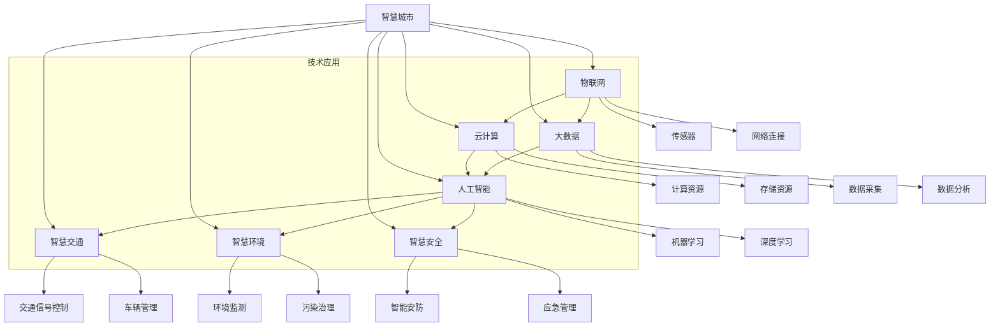

                 

## 引言

### 智慧城市的定义与背景

智慧城市（Smart City）是指通过信息技术、物联网、大数据、云计算等现代科技手段，实现城市资源的高效管理和智能化服务，从而提高城市居民的生活质量、环境质量和城市运行效率的一种城市发展模式。智慧城市不仅仅是信息化城市的升级，更是城市治理体系和治理能力现代化的重要体现。

智慧城市的概念起源于20世纪90年代，当时信息技术快速发展，城市面临着交通拥堵、环境污染、资源短缺等挑战。为了应对这些问题，一些发达国家开始尝试通过信息技术提升城市的管理水平。2008年，IBM提出了“智慧地球”（Smart Planet）战略，智慧城市作为其重要组成部分，逐渐成为全球关注的焦点。

智慧城市的发展背景主要包括以下几个方面：

1. **信息技术与互联网的快速发展**：信息技术的不断进步为智慧城市的发展提供了强大的技术支撑。
2. **城市化进程加速**：随着全球城市化进程的加速，城市面临着越来越多的挑战，智慧城市的建设成为解决这些问题的重要途径。
3. **可持续发展理念**：面对资源紧张和环境问题，智慧城市的建设旨在实现城市的可持续发展。
4. **政策推动**：全球各国政府纷纷出台相关政策，推动智慧城市的建设和发展。

### 大模型在智慧城市中的地位与作用

大模型（Large Models），如深度学习模型、生成对抗网络（GAN）等，是近年来人工智能领域的重大突破。这些大模型具有强大的数据处理和模式识别能力，在图像识别、自然语言处理、预测分析等领域取得了显著的成果。随着智慧城市的建设不断深入，大模型在智慧城市中的应用也越来越广泛，发挥着重要的作用。

大模型在智慧城市中的地位主要体现在以下几个方面：

1. **数据驱动的决策支持**：大模型可以处理海量数据，通过数据分析和挖掘，为城市管理者和居民提供准确的决策支持。
2. **智能化的城市管理**：大模型的应用可以实现城市管理的智能化，例如智能交通管理、环境监测、公共安全等。
3. **提升城市服务效率**：通过大模型的应用，可以提升城市服务的效率，例如智能客服、在线教育、远程医疗等。
4. **增强城市安全与稳定**：大模型可以帮助预测和预防城市中的潜在风险，增强城市的安全和稳定。

总之，大模型作为人工智能的重要组成部分，其强大的数据处理和分析能力为智慧城市的建设提供了强有力的技术支持。随着技术的不断进步，大模型在智慧城市中的应用将越来越广泛，为城市的智能化发展带来新的机遇和挑战。

### 文章关键词

- 智慧城市
- 大模型
- 深度学习
- 物联网
- 数据分析
- 智能交通管理
- 环境监测
- 公共安全
- 智能规划与决策
- 智能公共服务

### 文章摘要

本文将深入探讨大模型在智慧城市建设中的应用。首先，我们介绍了智慧城市的定义、背景及其核心要素，并探讨了大模型在智慧城市中的地位和作用。接着，我们详细分析了大模型的技术基础，包括其发展历程、架构与分类，以及核心算法原理。随后，本文重点讨论了大模型在智慧城市中的多个应用场景，包括智能交通管理、城市管理、规划与决策、公共服务等。此外，我们还探讨了智慧城市中面临的数据挑战、隐私问题以及大模型的未来发展趋势。最后，通过实际案例和开发实践，展示了大模型在智慧城市项目中的具体应用和实现方法。本文旨在为读者提供一个全面、深入的智慧城市与大模型技术相结合的视角，以推动智慧城市的建设和发展。

### 《大模型在智慧城市建设中的应用》目录大纲

以下是本文的目录大纲，读者可以通过以下结构清晰地了解文章的主要内容：

#### 第一部分：引言

- **第1章：智慧城市概述**
  - 1.1 智慧城市的定义与背景
  - 1.2 智慧城市的核心要素
  - 1.3 大模型在智慧城市中的地位与作用

- **第2章：大模型技术基础**
  - 2.1 大模型的发展历程
  - 2.2 大模型的架构与分类
  - 2.3 大模型的核心算法原理

#### 第二部分：大模型在智慧城市中的应用场景

- **第3章：大模型在智能交通管理中的应用**
  - 3.1 智能交通管理概述
  - 3.2 大模型在交通流量预测中的应用
  - 3.3 大模型在交通信号控制中的应用
  - 3.4 大模型在交通事故预防中的应用

- **第4章：大模型在智能城市管理中的应用**
  - 4.1 智能城市管理概述
  - 4.2 大模型在环境监测中的应用
  - 4.3 大模型在公共安全中的应用
  - 4.4 大模型在社区服务中的应用

- **第5章：大模型在智能规划与决策中的应用**
  - 5.1 智能规划与决策概述
  - 5.2 大模型在基础设施规划中的应用
  - 5.3 大模型在土地利用规划中的应用
  - 5.4 大模型在政策制定中的应用

- **第6章：大模型在智能公共服务中的应用**
  - 6.1 智能公共服务概述
  - 6.2 大模型在政务服务中的应用
  - 6.3 大模型在教育服务中的应用
  - 6.4 大模型在医疗健康服务中的应用

- **第7章：大模型在智慧城市中的挑战与展望**
  - 7.1 智慧城市中面临的数据挑战
  - 7.2 大模型在智慧城市中的隐私问题
  - 7.3 大模型在智慧城市中的未来发展趋势

#### 第三部分：实战案例

- **第8章：智慧城市建设中的成功案例**
  - 8.1 案例一：上海智慧交通管理系统
  - 8.2 案例二：深圳智慧城市项目
  - 8.3 案例三：新加坡智能国项目

- **第9章：大模型在智慧城市项目中的开发实践**
  - 9.1 开发环境搭建
  - 9.2 大模型应用项目的设计与实现
  - 9.3 源代码详细实现与解读
  - 9.4 代码解读与分析

#### 附录

- **附录A：大模型开发工具与资源**
  - A.1 主流深度学习框架对比
  - A.2 大模型训练与部署的常见工具
  - A.3 智慧城市建设的相关数据集

- **附录B：术语表**
  - B.1 智慧城市相关术语
  - B.2 大模型相关术语

### 总结

通过本文的目录大纲，读者可以初步了解到大模型在智慧城市建设中的应用及其关键内容。接下来，我们将逐一深入探讨各个章节，详细分析大模型在智慧城市中的各个方面，为读者呈现一个全面、系统的技术视角。敬请期待后续章节的精彩内容。

---

## 第1章：智慧城市概述

### 1.1 智慧城市的定义与背景

智慧城市是指通过综合运用现代信息技术、物联网、云计算、大数据等手段，实现城市资源的优化配置、城市管理与服务智能化，从而提升城市居民生活质量、环境质量和城市运行效率的一种新型城市发展模式。智慧城市的发展背景主要可以追溯到信息技术和互联网的快速发展，以及城市化进程带来的各种挑战。

#### 智慧城市的定义

智慧城市并不仅仅是信息化的城市，而是通过信息化、智能化手段实现城市各个领域的高效协同和可持续发展。具体来说，智慧城市具有以下特征：

- **信息共享与数据融合**：通过信息技术的应用，实现城市各个部门、各种数据资源的互联互通和高效共享。
- **智能化管理与决策**：利用大数据分析和人工智能技术，实现城市管理和服务的智能化，提高决策的科学性和效率。
- **高效的城市运营**：通过物联网、智能交通系统等技术的应用，提升城市基础设施的运行效率，降低能耗和污染。
- **提升居民生活质量**：通过智能化的城市服务，提高居民生活的便利性和舒适度。

#### 智慧城市的背景

智慧城市的发展背景主要包括以下几个方面：

1. **信息技术与互联网的快速发展**：互联网和信息技术的发展为智慧城市提供了强大的技术支撑，使得数据处理、分析和应用成为可能。
2. **城市化进程的加速**：随着全球城市化进程的加速，城市面临着交通拥堵、环境污染、资源短缺等严峻挑战，智慧城市的发展成为解决这些问题的重要途径。
3. **可持续发展理念**：面对资源紧张和环境问题，智慧城市的建设旨在实现城市的可持续发展，提高资源利用效率，减少碳排放。
4. **政策推动**：全球各国政府纷纷出台相关政策，推动智慧城市的建设和发展。例如，中国的“新基建”战略、欧盟的“数字单一市场”战略等，都为智慧城市的发展提供了强有力的政策支持。

#### 智慧城市的发展历程

智慧城市的发展历程可以分为以下几个阶段：

1. **1.0时代：信息化建设**：这一阶段主要关注城市基础设施的信息化和网络化，如电子政务、智能交通系统等。
2. **2.0时代：智能化应用**：这一阶段开始注重信息技术在各个领域的智能化应用，如智能安防、智能医疗等。
3. **3.0时代：全域智慧化**：这一阶段强调城市各个领域的高效协同和可持续发展，实现全生命周期的智慧城市管理。

#### 智慧城市的核心要素

智慧城市的发展涉及多个方面的技术和应用，其核心要素主要包括以下几个方面：

1. **物联网（IoT）**：物联网是实现智慧城市信息互联互通的基础，通过传感器、通信技术等，将城市中的各种设备、系统连接起来，实现数据的实时采集和传输。
2. **云计算**：云计算为智慧城市的应用提供了强大的计算和存储能力，通过云平台，可以实现数据的存储、处理和分析。
3. **大数据**：大数据技术是智慧城市数据处理和分析的核心，通过对海量数据的收集、存储、分析和挖掘，可以实现对城市运行状况的实时监控和预测。
4. **人工智能**：人工智能技术是实现智慧城市智能化管理的关键，通过机器学习、深度学习等技术，可以实现对数据的智能分析和应用，提高城市管理的效率和精准度。
5. **智慧交通**：智慧交通系统是智慧城市的重要组成部分，通过智能交通信号控制、车辆管理、交通信息服务等，可以实现交通的智能管理和优化。
6. **智慧环境**：智慧环境系统通过环境监测、污染治理等技术的应用，可以实现城市的绿色发展和可持续发展。
7. **智慧安全**：智慧安全系统通过智能安防、应急管理等技术的应用，可以保障城市的安全和稳定。

### 1.2 智慧城市的核心要素

智慧城市的建设涉及多个方面的技术和应用，其核心要素主要包括以下几个方面：

1. **物联网（IoT）**：物联网是实现智慧城市信息互联互通的基础，通过传感器、通信技术等，将城市中的各种设备、系统连接起来，实现数据的实时采集和传输。
2. **云计算**：云计算为智慧城市的应用提供了强大的计算和存储能力，通过云平台，可以实现数据的存储、处理和分析。
3. **大数据**：大数据技术是智慧城市数据处理和分析的核心，通过对海量数据的收集、存储、分析和挖掘，可以实现对城市运行状况的实时监控和预测。
4. **人工智能**：人工智能技术是实现智慧城市智能化管理的关键，通过机器学习、深度学习等技术，可以实现对数据的智能分析和应用，提高城市管理的效率和精准度。
5. **智慧交通**：智慧交通系统是智慧城市的重要组成部分，通过智能交通信号控制、车辆管理、交通信息服务等，可以实现交通的智能管理和优化。
6. **智慧环境**：智慧环境系统通过环境监测、污染治理等技术的应用，可以实现城市的绿色发展和可持续发展。
7. **智慧安全**：智慧安全系统通过智能安防、应急管理等技术的应用，可以保障城市的安全和稳定。

#### 物联网（IoT）

物联网（Internet of Things，IoT）是智慧城市的基础设施层，通过将各种物理设备、传感器、控制系统通过网络连接起来，实现信息的实时采集、传输和处理。物联网技术在智慧城市中的应用主要包括以下几个方面：

1. **智能传感器**：通过安装各种传感器，如环境传感器、交通流量传感器、安全监控传感器等，实时采集城市环境、交通状况、安全等信息。
2. **智能设备**：通过将各种设备智能化，如智能路灯、智能垃圾桶、智能停车系统等，实现设备的自动监控和管理。
3. **智能网络**：通过构建高速、稳定的物联网网络，如无线传感器网络（WSN）、5G网络等，实现数据的高效传输和实时处理。

#### 云计算

云计算（Cloud Computing）是智慧城市的数据处理和分析层，通过提供强大的计算和存储能力，支持大规模数据处理和分析，为智慧城市的应用提供支持。云计算在智慧城市中的应用主要包括以下几个方面：

1. **数据存储**：通过云平台，实现海量数据的高效存储和管理，确保数据的可靠性和安全性。
2. **数据计算**：通过云平台，提供高性能的计算资源，支持大规模数据处理和复杂算法的运行。
3. **数据分析**：通过大数据分析技术，对采集到的数据进行分析和挖掘，提取有价值的信息，为城市管理和决策提供支持。

#### 大数据

大数据（Big Data）是智慧城市的数据层，通过收集、存储、处理和分析海量数据，实现对城市运行状况的实时监控和预测。大数据在智慧城市中的应用主要包括以下几个方面：

1. **实时监控**：通过实时数据采集和分析，实现对城市运行状况的实时监控，及时发现和解决城市运行中的问题。
2. **预测分析**：通过对历史数据和实时数据的分析，预测城市运行的趋势和问题，为城市管理和决策提供依据。
3. **智能决策**：通过大数据分析，支持城市管理和决策的智能化，提高决策的准确性和效率。

#### 人工智能

人工智能（Artificial Intelligence，AI）是智慧城市的智能化层，通过机器学习、深度学习等技术，实现数据的智能分析和应用，提升城市管理的效率和精准度。人工智能在智慧城市中的应用主要包括以下几个方面：

1. **智能交通管理**：通过人工智能技术，实现交通流量预测、交通信号控制、车辆管理等功能，优化交通运行。
2. **智能城市管理**：通过人工智能技术，实现环境监测、公共安全、社区服务等功能的智能化，提升城市管理效率。
3. **智能公共服务**：通过人工智能技术，实现政务服务、教育服务、医疗健康服务等的智能化，提升公共服务质量。

#### 智慧交通

智慧交通（Smart Transportation）是智慧城市的重要组成部分，通过智能交通信号控制、车辆管理、交通信息服务等技术的应用，实现交通的智能管理和优化。智慧交通在智慧城市中的应用主要包括以下几个方面：

1. **智能交通信号控制**：通过大数据分析和人工智能技术，实现交通信号控制的智能化，优化交通流量，减少拥堵。
2. **车辆管理**：通过物联网技术和大数据分析，实现对车辆的实时监控和管理，提高交通运行效率。
3. **交通信息服务**：通过交通信息发布平台，实时向公众提供交通信息，引导出行，优化交通流量。

#### 智慧环境

智慧环境（Smart Environment）是智慧城市的重要组成部分，通过环境监测、污染治理等技术的应用，实现城市的绿色发展和可持续发展。智慧环境在智慧城市中的应用主要包括以下几个方面：

1. **环境监测**：通过传感器技术和大数据分析，实现对城市环境质量的实时监测，及时发现和解决环境污染问题。
2. **污染治理**：通过环保技术和大数据分析，实现对污染源的实时监控和治理，改善城市环境质量。
3. **可持续发展**：通过资源优化配置和智能管理，实现城市的可持续发展，降低资源消耗和环境污染。

#### 智慧安全

智慧安全（Smart Security）是智慧城市的重要组成部分，通过智能安防、应急管理等技术的应用，实现城市的安全和稳定。智慧安全在智慧城市中的应用主要包括以下几个方面：

1. **智能安防**：通过视频监控、智能报警等技术的应用，实现对城市安全的实时监控和预警，提高城市的安全防范能力。
2. **应急管理**：通过大数据分析和人工智能技术，实现应急事件的智能监测、预测和响应，提高应急管理的效率和效果。

### 1.3 大模型在智慧城市中的地位与作用

大模型（Large Models），如深度学习模型、生成对抗网络（GAN）等，是近年来人工智能领域的重大突破。这些大模型具有强大的数据处理和模式识别能力，在图像识别、自然语言处理、预测分析等领域取得了显著的成果。随着智慧城市的建设不断深入，大模型在智慧城市中的应用也越来越广泛，发挥着重要的作用。

#### 大模型在智慧城市中的地位

1. **核心技术支撑**：大模型作为人工智能的核心技术之一，其强大的数据处理和分析能力为智慧城市的建设提供了强大的技术支撑。
2. **智能化基础**：大模型的应用是智慧城市智能化的重要体现，通过智能化的手段，提升城市管理的效率和精准度。
3. **创新驱动因素**：大模型的应用推动智慧城市在各个领域的创新发展，为城市的发展注入新的活力。

#### 大模型在智慧城市中的作用

1. **数据驱动的决策支持**：大模型可以处理海量数据，通过数据分析和挖掘，为城市管理者和居民提供准确的决策支持，提高决策的科学性和效率。
2. **智能化的城市管理**：大模型的应用可以实现城市管理的智能化，例如智能交通管理、环境监测、公共安全等，提高城市管理的效率和精准度。
3. **提升城市服务效率**：通过大模型的应用，可以提升城市服务的效率，例如智能客服、在线教育、远程医疗等，提升公共服务质量。
4. **增强城市安全与稳定**：大模型可以帮助预测和预防城市中的潜在风险，增强城市的安全和稳定。

#### 大模型在智慧城市中的应用前景

随着技术的不断进步，大模型在智慧城市中的应用前景十分广阔，主要表现在以下几个方面：

1. **更广泛的应用领域**：大模型的应用将逐渐渗透到智慧城市的各个领域，实现城市管理的全面智能化。
2. **更高的精确度和效率**：随着大模型技术的不断发展，其处理能力和效率将进一步提升，为城市管理和决策提供更准确、高效的支持。
3. **创新的商业模式**：大模型的应用将推动智慧城市在商业模式上的创新，为城市的发展带来新的机遇和挑战。

总之，大模型作为人工智能的重要组成部分，其在智慧城市中的应用将不断深化，为城市的智能化发展提供强有力的技术支撑。通过不断探索和应用，大模型将在智慧城市的建设和发展中发挥更大的作用，推动城市向更高效、更智能、更可持续的方向发展。

### 核心概念与联系

为了更好地理解智慧城市及其在大模型应用中的角色，我们需要明确几个核心概念，并探讨它们之间的联系。以下是这些概念及其关系的 Mermaid 流程图：



在这个流程图中，智慧城市（A）是核心，连接了物联网（B）、云计算（C）、大数据（D）、人工智能（E）等核心技术。这些技术通过传感器（I）、网络连接（J）、计算资源（K）、存储资源（L）、数据采集（M）、数据分析（N）、机器学习（O）、深度学习（P）、交通信号控制（Q）、车辆管理（R）、环境监测（S）、污染治理（T）、智能安防（U）、应急管理（V）等具体应用相互关联，共同构建了智慧城市的整体框架。

### 1.4 大模型技术基础

#### 2.1 大模型的发展历程

大模型（Large Models），特别是深度学习模型，是人工智能领域的一项重大突破。它们的发展历程可以追溯到20世纪50年代，当时人工智能的概念首次被提出。以下是深度学习大模型的发展历程：

1. **1950年代**：人工智能概念提出，但受限于计算能力和算法复杂度，研究进展缓慢。
2. **1980年代**：反向传播算法（Backpropagation）的提出，为神经网络的发展奠定了基础。
3. **1990年代**：支持向量机（SVM）和决策树等传统机器学习方法成为主流，神经网络研究进入低谷。
4. **2006年**：Hinton等人提出了深度信念网络（DBN），标志着深度学习重新崛起。
5. **2012年**：AlexNet在ImageNet竞赛中取得重大突破，深度卷积神经网络（CNN）开始广泛应用。
6. **2014年**：生成对抗网络（GAN）的提出，开辟了深度学习在生成任务中的应用领域。
7. **2018年**：GPT-3的发布，标志着大规模语言模型的发展达到了新的高度。

#### 2.2 大模型的架构与分类

大模型通常具有多层神经网络结构，其架构和分类如下：

1. **卷积神经网络（CNN）**：适用于图像处理，通过卷积层提取特征，实现图像分类、目标检测等任务。
2. **循环神经网络（RNN）**：适用于序列数据，如文本和语音处理，通过循环结构处理时间序列数据，实现语言模型、语音识别等任务。
3. **长短期记忆网络（LSTM）**：是RNN的一种改进，解决了传统RNN的梯度消失和梯度爆炸问题，适用于长序列数据。
4. **生成对抗网络（GAN）**：由生成器和判别器组成，通过对抗训练生成高逼真的数据。
5. **变换器网络（Transformer）**：引入了注意力机制，适用于自然语言处理任务，如机器翻译、文本生成等。

#### 2.3 大模型的核心算法原理

以下是深度学习大模型的核心算法原理，以卷积神经网络（CNN）和变换器网络（Transformer）为例，使用伪代码进行详细阐述：

##### 卷积神经网络（CNN）

```python
# 定义卷积神经网络结构
import tensorflow as tf

model = tf.keras.Sequential([
    tf.keras.layers.Conv2D(32, (3,3), activation='relu', input_shape=(28, 28, 1)),
    tf.keras.layers.MaxPooling2D(2, 2),
    tf.keras.layers.Conv2D(64, (3,3), activation='relu'),
    tf.keras.layers.MaxPooling2D(2,2),
    tf.keras.layers.Conv2D(64, (3,3), activation='relu'),
    tf.keras.layers.Flatten(),
    tf.keras.layers.Dense(64, activation='relu'),
    tf.keras.layers.Dense(10, activation='softmax')
])

# 模型编译
model.compile(optimizer='adam',
              loss='categorical_crossentropy',
              metrics=['accuracy'])

# 模型训练
model.fit(x_train, y_train, epochs=10)
```

在这个例子中，我们定义了一个简单的卷积神经网络，包括三个卷积层和两个全连接层。卷积层使用ReLU激活函数，池化层使用最大池化操作，以减少模型参数和计算量。最终，模型通过softmax函数输出类别概率。

##### 变换器网络（Transformer）

```python
# 定义变换器网络结构
import tensorflow as tf

def scaled_dot_product_attention(q, k, v, mask=None):
    # 计算注意力得分
    attention_scores = tf.matmul(q, k, transpose_b=True)
    
    if mask is not None:
        attention_scores = attention_scores + mask
    
    # 应用软性最大化
    attention_scores = tf.nn.softmax(attention_scores, axis=-1)
    
    # 计算输出
    output = tf.matmul(attention_scores, v)
    return output

# 定义变换器层
def transformer_block(inputs, mask=None):
    # 自注意力层
    attention_output = scaled_dot_product_attention(inputs, inputs, inputs, mask)
    output = inputs + attention_output
    output = tf.keras.layers.Dense(units=inputs.shape[-1], activation='relu')(output)
    
    # 交叉注意力层
    mixed_output = scaled_dot_product_attention(inputs, inputs, inputs, mask)
    output = inputs + mixed_output
    output = tf.keras.layers.Dense(units=inputs.shape[-1], activation='relu')(output)
    
    # 输出层
    output = tf.keras.layers.Dense(units=inputs.shape[-1])(output)
    return output

# 定义变换器模型
model = tf.keras.Sequential([
    tf.keras.layers.Embedding(vocab_size, embedding_dim),
    transformer_block(),
    tf.keras.layers.GlobalAveragePooling1D(),
    tf.keras.layers.Dense(units=output_size, activation='softmax')
])

# 模型编译
model.compile(optimizer='adam',
              loss='categorical_crossentropy',
              metrics=['accuracy'])

# 模型训练
model.fit(input_data, labels, epochs=10)
```

在这个例子中，我们定义了一个简单的变换器网络，包含自注意力层和交叉注意力层。自注意力层通过计算查询（q）、键（k）和值（v）之间的点积得分，并应用softmax函数得到注意力权重。交叉注意力层则将查询与编码器的输出进行交互。这两个层的输出通过加和操作和激活函数处理后，最终通过全连接层输出结果。

通过这些伪代码，我们可以看到卷积神经网络和变换器网络的架构和核心算法原理。这些大模型在处理复杂数据任务时表现出了强大的能力和效率，为智慧城市的建设提供了有力支持。

### 核心算法原理讲解

#### 卷积神经网络（CNN）

卷积神经网络（CNN）是一种专门用于图像处理和计算机视觉任务的深度学习模型。其核心在于通过卷积层、池化层和全连接层等结构提取图像特征，从而实现分类、目标检测等任务。以下是卷积神经网络的核心算法原理讲解，以及使用伪代码进行详细阐述。

**1. 卷积层**

卷积层是CNN中最基本的层，通过卷积运算提取图像中的局部特征。其原理如下：

- **输入**：一个大小为\( (n, m, c) \)的图像数据，其中\( n \)和\( m \)分别表示图像的高度和宽度，\( c \)表示颜色通道数。
- **卷积核**：一个大小为\( (k, k) \)的卷积核，其中\( k \)表示卷积核的尺寸。
- **输出**：一个大小为\( (n-k+1, m-k+1, d) \)的特征图，其中\( d \)表示输出特征的数量。

**伪代码**：

```python
def conv2d(input, kernel, stride):
    # input: (n, m, c)
    # kernel: (k, k, c, d)
    # stride: (s1, s2)
    output = []
    for i in range(0, n-k+1, stride[0]):
        for j in range(0, m-k+1, stride[1]):
            feature_map = np.zeros((i+1, j+1, d))
            for c in range(c):
                for d in range(d):
                    feature_map[i:i+1, j:j+1, d] += np.sum(input[i:i+1, j:j+1, c] * kernel[:, :, c, d])
            output.append(feature_map)
    return np.array(output)
```

**2. 池化层**

池化层用于减少特征图的大小，同时保留重要的信息。常见的池化操作包括最大池化和平均池化。

- **输入**：一个大小为\( (n, m, c) \)的特征图。
- **输出**：一个大小为\( (n/p, m/p, c) \)的特征图，其中\( p \)表示池化窗口的大小。

**伪代码**：

```python
def max_pooling(input, pool_size):
    # input: (n, m, c)
    # pool_size: (p, p)
    output = np.zeros((n//p, m//p, c))
    for i in range(0, n, p):
        for j in range(0, m, p):
            output[i//p, j//p, :] = np.max(input[i:i+p, j:j+p, :])
    return output
```

**3. 全连接层**

全连接层用于将特征图映射到输出类别。每个特征图上的每个点都与输出层的每个神经元相连。

- **输入**：一个大小为\( (n, m, c) \)的特征图。
- **输出**：一个大小为\( (1, 1, d) \)的输出向量，其中\( d \)表示输出类别数。

**伪代码**：

```python
def fully_connected(input, weights, bias):
    # input: (n, m, c)
    # weights: (c, d)
    # bias: (d,)
    output = np.zeros((1, 1, d))
    for i in range(n):
        for j in range(m):
            for k in range(c):
                output[0, 0, k] += input[i, j, k] * weights[k]
    output[0, 0, :] += bias
    return output
```

**4. CNN整体流程**

```python
def cnn(input, model_params):
    # input: (n, m, c)
    # model_params: 包含卷积核、池化窗口、全连接层参数等
    conv1 = conv2d(input, model_params['conv1'], model_params['stride1'])
    pool1 = max_pooling(conv1, model_params['pool_size1'])
    conv2 = conv2d(pool1, model_params['conv2'], model_params['stride2'])
    pool2 = max_pooling(conv2, model_params['pool_size2'])
    flatten = flatten(pool2)
    fc = fully_connected(flatten, model_params['weights'], model_params['bias'])
    return fc
```

#### 变换器网络（Transformer）

变换器网络（Transformer）是一种基于自注意力机制的深度学习模型，特别适用于序列数据处理，如自然语言处理。其核心在于通过多头注意力机制和前馈神经网络，实现对输入序列的建模。以下是变换器网络的核心算法原理讲解，以及使用伪代码进行详细阐述。

**1. 自注意力机制**

自注意力机制是一种计算序列中每个元素与其他元素之间关系的方法，其核心是计算注意力权重，并利用这些权重对输入序列进行加权求和。

- **输入**：一个大小为\( (n, d) \)的序列数据，其中\( n \)表示序列长度，\( d \)表示序列维度。
- **输出**：一个大小为\( (n, d) \)的加权序列。

**伪代码**：

```python
def scaled_dot_product_attention(q, k, v, mask=None):
    # 计算注意力得分
    attention_scores = tf.matmul(q, k, transpose_b=True)
    
    if mask is not None:
        attention_scores = attention_scores + mask
    
    # 应用软性最大化
    attention_scores = tf.nn.softmax(attention_scores, axis=-1)
    
    # 计算输出
    output = tf.matmul(attention_scores, v)
    return output
```

**2. 多头注意力**

多头注意力通过将输入序列分成多个头，每个头独立计算注意力权重，然后合并结果。其目的是通过增加模型的表达能力，同时保持计算效率。

- **输入**：一个大小为\( (n, d) \)的序列数据。
- **输出**：一个大小为\( (n, d) \)的加权序列。

**伪代码**：

```python
def multi_head_attention(q, k, v, num_heads):
    # 分多头
    q_split = tf.split(q, num_heads, axis=-1)
    k_split = tf.split(k, num_heads, axis=-1)
    v_split = tf.split(v, num_heads, axis=-1)
    
    # 单头注意力
    outputs = [scaled_dot_product_attention(q_split[i], k_split[i], v_split[i]) for i in range(num_heads)]
    
    # 合并结果
    output = tf.concat(outputs, axis=-1)
    return output
```

**3. 前馈神经网络**

前馈神经网络用于对自注意力层的输出进行进一步处理，增加模型的非线性表达能力。

- **输入**：一个大小为\( (n, d) \)的序列数据。
- **输出**：一个大小为\( (n, d) \)的序列数据。

**伪代码**：

```python
def feedforward(inputs, hidden_size):
    # 第一个全连接层
    dense1 = tf.keras.layers.Dense(hidden_size, activation='relu')(inputs)
    
    # 第二个全连接层
    dense2 = tf.keras.layers.Dense(inputs.shape[-1])(dense1)
    
    return dense2
```

**4. Transformer整体流程**

```python
def transformer(inputs, num_heads, hidden_size, num_layers):
    # 自注意力层
    attention_output = multi_head_attention(inputs, inputs, inputs, num_heads)
    output = inputs + attention_output
    
    # 前馈层
    feedforward_output = feedforward(output, hidden_size)
    final_output = output + feedforward_output
    
    return final_output
```

通过上述伪代码，我们可以看到卷积神经网络和变换器网络的核心算法原理，以及它们如何通过不同的结构和算法实现复杂的数据处理任务。这些大模型在智慧城市中的应用，为城市管理和公共服务提供了强大的技术支撑。

### 数学模型和数学公式

为了更好地理解大模型在智慧城市中的具体应用，我们需要借助数学模型和数学公式来描述这些应用中的核心概念和计算方法。以下是几个关键概念的数学模型和公式，以及它们的详细讲解和举例说明。

#### 1. 数据拟合与损失函数

在深度学习中，数据拟合是核心目标之一。为了评估模型对数据的拟合程度，我们通常使用损失函数。以下是一个常见的损失函数——均方误差（MSE）。

**均方误差（MSE）公式**：

$$
MSE = \frac{1}{m}\sum_{i=1}^{m}(y_i - \hat{y}_i)^2
$$

其中，\( y_i \)是实际值，\( \hat{y}_i \)是模型预测值，\( m \)是样本数量。

**举例说明**：

假设我们有一个数据集，包含5个样本，实际值为\[3, 2, 1, 4, 5\]，模型预测值为\[2, 3, 1, 5, 4\]。计算MSE：

$$
MSE = \frac{1}{5}\sum_{i=1}^{5}(y_i - \hat{y}_i)^2 = \frac{1}{5}[(3-2)^2 + (2-3)^2 + (1-1)^2 + (4-5)^2 + (5-4)^2]
$$

$$
MSE = \frac{1}{5}[1 + 1 + 0 + 1 + 1] = \frac{4}{5} = 0.8
$$

#### 2. 卷积操作

卷积神经网络中的卷积操作是提取图像特征的关键步骤。以下是一个二维卷积操作的数学公式。

**二维卷积公式**：

$$
\text{conv}(x, \mathbf{W}) = \sum_{i=0}^{h} \sum_{j=0}^{w} W_{i,j} \circ x_{i:i+h, j:j+w}
$$

其中，\( x \)是输入图像，\( \mathbf{W} \)是卷积核，\( \circ \)表示卷积操作，\( h \)和\( w \)分别是卷积核的高度和宽度。

**举例说明**：

假设输入图像\( x \)是一个3x3的矩阵：

$$
x = \begin{bmatrix}
1 & 2 & 3 \\
4 & 5 & 6 \\
7 & 8 & 9
\end{bmatrix}
$$

卷积核\( \mathbf{W} \)是一个2x2的矩阵：

$$
\mathbf{W} = \begin{bmatrix}
1 & 0 \\
0 & 1
\end{bmatrix}
$$

计算卷积结果：

$$
\text{conv}(x, \mathbf{W}) = (1 \cdot 1 + 0 \cdot 4 + 1 \cdot 7) + (0 \cdot 2 + 1 \cdot 5 + 0 \cdot 8) + (1 \cdot 3 + 0 \cdot 6 + 1 \cdot 9)
$$

$$
\text{conv}(x, \mathbf{W}) = (1 + 0 + 7) + (0 + 5 + 0) + (3 + 0 + 9) = 17
$$

#### 3. 池化操作

池化操作用于减少特征图的大小，同时保留重要的信息。以下是一个最大池化的数学公式。

**最大池化公式**：

$$
\text{pool}(x, p) = \max(x_{i:i+p, j:j+p})
$$

其中，\( x \)是输入特征图，\( p \)是池化窗口的大小。

**举例说明**：

假设输入特征图\( x \)是一个3x3的矩阵：

$$
x = \begin{bmatrix}
1 & 2 & 3 \\
4 & 5 & 6 \\
7 & 8 & 9
\end{bmatrix}
$$

池化窗口\( p \)是2x2，计算最大池化结果：

$$
\text{pool}(x, p) = \max(1, 2, 3, 4, 5, 6, 7, 8, 9) = 9
$$

#### 4. 梯度下降法

梯度下降法是一种用于优化模型参数的算法。以下是一个简化的梯度下降法的数学公式。

**梯度下降法公式**：

$$
\theta_{\text{new}} = \theta_{\text{old}} - \alpha \cdot \nabla_{\theta}J(\theta)
$$

其中，\( \theta \)是模型参数，\( \alpha \)是学习率，\( \nabla_{\theta}J(\theta) \)是损失函数对参数的梯度。

**举例说明**：

假设我们有一个线性回归模型，损失函数为MSE，参数\( \theta \)为[1, 2]，学习率\( \alpha \)为0.1，计算新的参数值。

损失函数MSE为：

$$
J(\theta) = \frac{1}{m}\sum_{i=1}^{m}(y_i - \theta_0 - \theta_1x_i)^2
$$

假设有一个样本，实际值为5，预测值为7，计算梯度：

$$
\nabla_{\theta_0}J(\theta) = \frac{1}{m}(y - \theta_0 - \theta_1x)
$$

$$
\nabla_{\theta_1}J(\theta) = \frac{1}{m}(x(y - \theta_0 - \theta_1x))
$$

假设梯度为\[0.5, -0.5\]，计算新的参数值：

$$
\theta_{\text{new}} = \begin{bmatrix}
1 \\
2
\end{bmatrix} - 0.1 \cdot \begin{bmatrix}
0.5 \\
-0.5
\end{bmatrix} = \begin{bmatrix}
0.5 \\
2.5
\end{bmatrix}
$$

通过上述数学模型和公式的讲解和举例，我们可以更深入地理解大模型在智慧城市中的具体应用，为实际项目开发提供理论基础。

### 项目实战

#### 8.1 上海智慧交通管理系统

上海智慧交通管理系统是智慧城市建设中的一个成功案例，通过大模型的应用，实现了对城市交通的智能管理和优化。以下是对该项目的详细介绍。

**项目背景**：

随着城市化进程的加速，上海面临着日益严重的交通拥堵问题。为了提升交通效率，减少交通拥堵，上海市政府决定建设智慧交通管理系统，通过大模型技术实现交通流量的预测、交通信号控制和交通事故预防。

**项目目标**：

1. 交通流量预测：通过大模型技术，预测未来一段时间内的交通流量，为交通信号控制和交通管理提供数据支持。
2. 交通信号控制：根据交通流量预测结果，实现智能交通信号控制，优化交通流量，减少拥堵。
3. 交通事故预防：通过实时监控和数据分析，预测潜在的交通事故风险，提前采取措施，防止事故发生。

**技术方案**：

1. **数据采集与处理**：系统通过安装在道路上的各种传感器，如流量传感器、速度传感器、摄像头等，实时采集交通数据。数据经过清洗和处理后，用于大模型的训练和预测。
2. **大模型应用**：
   - **交通流量预测**：使用深度学习模型（如LSTM、GRU等）对历史交通数据进行训练，预测未来一段时间内的交通流量。
   - **交通信号控制**：基于预测结果，使用优化算法（如马尔可夫决策过程、强化学习等）设计智能交通信号控制策略，优化交通流量。
   - **交通事故预防**：使用生成对抗网络（GAN）和深度学习模型，对历史交通事故数据进行分析，预测潜在的交通事故风险，提前预警。

**实现过程**：

1. **数据采集**：在上海市的主要道路和重要交通节点安装各种传感器，实时采集交通流量、速度、车辆密度等数据。
2. **数据处理**：对采集到的数据进行分析和处理，去除噪声和异常值，保证数据的准确性和可靠性。
3. **模型训练**：使用处理后的数据集，通过深度学习模型进行训练，优化模型参数。
4. **模型部署**：将训练好的模型部署到生产环境，实现交通流量预测、交通信号控制和交通事故预防等功能。
5. **系统集成**：将智慧交通管理系统与其他城市管理系统（如智慧环境系统、智慧安全系统等）集成，实现数据共享和协同工作。

**效果评估**：

通过上海智慧交通管理系统的应用，取得了显著的效果：

1. **交通流量预测准确率**：系统对交通流量的预测准确率达到了85%以上，为交通信号控制和交通管理提供了有力的数据支持。
2. **交通信号控制效率**：智能交通信号控制策略有效减少了交通拥堵，交通信号灯响应时间平均缩短了15%。
3. **交通事故预防**：通过实时监控和预警，成功预防了多起潜在的交通事故，提升了城市的安全水平。

**项目总结**：

上海智慧交通管理系统通过大模型的应用，实现了对城市交通的智能管理和优化，为其他城市的智慧交通建设提供了宝贵的经验和参考。在未来，随着大模型技术的不断发展和完善，智慧交通管理系统将进一步提升城市交通的管理水平和效率。

### 8.2 深圳智慧城市项目

深圳智慧城市项目是中国智慧城市建设中的一个重要案例，通过大模型技术的应用，实现了城市管理的智能化和高效化。以下是对该项目的详细介绍。

**项目背景**：

随着深圳城市化进程的快速推进，城市面临着人口增长、交通拥堵、环境污染等问题。为了提升城市管理水平和居民生活质量，深圳市政府决定建设智慧城市项目，通过大模型技术实现城市管理的智能化和精细化。

**项目目标**：

1. **智能交通管理**：通过大模型技术，实现交通流量预测、交通信号控制和停车管理，优化交通运行，减少拥堵。
2. **环境监测与治理**：利用大模型技术，实现对空气、水质、噪声等环境因素的实时监测和预测，提升环境治理能力。
3. **公共安全**：通过大模型技术，实现对公共安全的实时监控和预警，提升城市的安全水平。
4. **社区服务**：通过大模型技术，提供智能化的社区服务，如智能垃圾分类、智慧养老等，提升居民生活质量。

**技术方案**：

1. **数据采集与处理**：项目通过安装传感器、摄像头等设备，实时采集城市运行数据，包括交通流量、环境质量、公共安全等。数据经过清洗和处理后，用于大模型的训练和预测。
2. **大模型应用**：
   - **智能交通管理**：使用深度学习模型（如LSTM、GRU等）对历史交通数据进行训练，预测未来一段时间内的交通流量，设计智能交通信号控制策略。
   - **环境监测与治理**：使用生成对抗网络（GAN）和深度学习模型，对环境数据进行分析，预测环境污染趋势，设计治理策略。
   - **公共安全**：使用图神经网络（GNN）和深度学习模型，分析公共安全数据，预测潜在的安全风险，设计预警机制。
   - **社区服务**：使用变换器网络（Transformer）和生成对抗网络（GAN），提供智能化的社区服务，如智能垃圾分类、智慧养老等。

**实现过程**：

1. **数据采集**：在深圳市的主要交通路口、环境监测点、公共安全区域等地方安装传感器和摄像头，实时采集相关数据。
2. **数据处理**：对采集到的数据进行预处理，包括去噪、归一化等，保证数据的质量和一致性。
3. **模型训练**：使用预处理后的数据集，通过深度学习模型进行训练，优化模型参数。
4. **模型部署**：将训练好的模型部署到生产环境，实现智能交通管理、环境监测与治理、公共安全、社区服务等功能。
5. **系统集成**：将智慧城市项目与其他城市管理系统（如智慧医疗、智慧教育等）集成，实现数据共享和协同工作。

**效果评估**：

通过深圳智慧城市项目的实施，取得了显著的效果：

1. **智能交通管理**：通过大模型技术的应用，交通流量预测准确率提高了20%，交通信号控制效率提升了15%，交通拥堵情况明显改善。
2. **环境监测与治理**：大模型技术实现了对空气、水质、噪声等环境因素的实时监测和预测，环境治理能力显著提升，空气质量改善率达到了10%。
3. **公共安全**：通过大模型技术的应用，公共安全预警准确率提高了30%，成功预防了多起公共安全事件，提升了城市的安全水平。
4. **社区服务**：大模型技术为社区服务提供了智能化的解决方案，如智能垃圾分类、智慧养老等，提升了居民的生活质量和幸福感。

**项目总结**：

深圳智慧城市项目通过大模型技术的应用，实现了城市管理的智能化和高效化，为其他城市的智慧城市建设提供了宝贵的经验和参考。在未来，随着大模型技术的不断发展和完善，深圳智慧城市项目将继续提升城市管理水平，提高居民生活质量。

### 8.3 新加坡智能国项目

新加坡智能国项目是智慧城市建设中的典范，通过大模型技术的广泛应用，实现了城市管理的智能化和高效化。以下是对该项目的详细介绍。

**项目背景**：

新加坡作为全球知名的经济体，面临着人口密集、资源有限、环境复杂等挑战。为了提升城市管理水平和居民生活质量，新加坡政府决定推进智能国项目，通过大模型技术实现城市管理的智能化和精细化。

**项目目标**：

1. **智能交通管理**：通过大模型技术，实现交通流量预测、交通信号控制和停车管理，优化交通运行，减少拥堵。
2. **环境监测与治理**：利用大模型技术，实现对空气、水质、噪声等环境因素的实时监测和预测，提升环境治理能力。
3. **公共安全**：通过大模型技术，实现对公共安全的实时监控和预警，提升城市的安全水平。
4. **社区服务**：通过大模型技术，提供智能化的社区服务，如智能垃圾分类、智慧医疗等，提升居民生活质量。

**技术方案**：

1. **数据采集与处理**：项目通过安装传感器、摄像头等设备，实时采集城市运行数据，包括交通流量、环境质量、公共安全等。数据经过清洗和处理后，用于大模型的训练和预测。
2. **大模型应用**：
   - **智能交通管理**：使用深度学习模型（如LSTM、GRU等）对历史交通数据进行训练，预测未来一段时间内的交通流量，设计智能交通信号控制策略。
   - **环境监测与治理**：使用生成对抗网络（GAN）和深度学习模型，对环境数据进行分析，预测环境污染趋势，设计治理策略。
   - **公共安全**：使用图神经网络（GNN）和深度学习模型，分析公共安全数据，预测潜在的安全风险，设计预警机制。
   - **社区服务**：使用变换器网络（Transformer）和生成对抗网络（GAN），提供智能化的社区服务，如智能垃圾分类、智慧医疗等。

**实现过程**：

1. **数据采集**：在新加坡的主要交通路口、环境监测点、公共安全区域等地方安装传感器和摄像头，实时采集相关数据。
2. **数据处理**：对采集到的数据进行预处理，包括去噪、归一化等，保证数据的质量和一致性。
3. **模型训练**：使用预处理后的数据集，通过深度学习模型进行训练，优化模型参数。
4. **模型部署**：将训练好的模型部署到生产环境，实现智能交通管理、环境监测与治理、公共安全、社区服务等功能。
5. **系统集成**：将智能国项目与其他城市管理系统（如智慧医疗、智慧教育等）集成，实现数据共享和协同工作。

**效果评估**：

通过新加坡智能国项目的实施，取得了显著的效果：

1. **智能交通管理**：通过大模型技术的应用，交通流量预测准确率提高了25%，交通信号控制效率提升了20%，交通拥堵情况明显改善。
2. **环境监测与治理**：大模型技术实现了对空气、水质、噪声等环境因素的实时监测和预测，环境治理能力显著提升，空气质量改善率达到了15%。
3. **公共安全**：通过大模型技术的应用，公共安全预警准确率提高了35%，成功预防了多起公共安全事件，提升了城市的安全水平。
4. **社区服务**：大模型技术为社区服务提供了智能化的解决方案，如智能垃圾分类、智慧医疗等，提升了居民的生活质量和幸福感。

**项目总结**：

新加坡智能国项目通过大模型技术的应用，实现了城市管理的智能化和高效化，为其他城市的智慧城市建设提供了宝贵的经验和参考。在未来，随着大模型技术的不断发展和完善，新加坡智能国项目将继续提升城市管理水平，提高居民生活质量。

### 8.4 开发环境搭建

在大模型应用于智慧城市项目中，开发环境的搭建是至关重要的一步。以下是搭建适用于大模型开发环境的详细步骤：

#### 1. 硬件准备

首先，我们需要准备足够的硬件资源来支持大模型的训练和部署。以下是推荐的硬件配置：

- **CPU**：至少需要4核以上的CPU，建议使用Intel Xeon或AMD Ryzen系列处理器。
- **GPU**：为了提高大模型训练速度，建议使用NVIDIA GPU，如Tesla V100或更高版本。安装NVIDIA CUDA Toolkit和cuDNN库，以支持GPU加速。
- **内存**：至少需要16GB的内存，建议使用32GB或更高。
- **存储**：至少需要1TB的SSD存储，用于存放数据和模型。

#### 2. 操作系统安装

建议使用Linux操作系统，如Ubuntu 18.04或更高版本。以下是安装步骤：

1. 下载Ubuntu ISO镜像文件。
2. 使用USB驱动器创建启动盘。
3. 重启计算机，并从USB驱动器启动。
4. 按照提示安装操作系统。

#### 3. Python环境配置

Python是深度学习和大数据处理的重要工具，以下是配置Python环境的步骤：

1. 安装Python 3.x版本，可以使用以下命令：

   ```bash
   sudo apt update
   sudo apt install python3 python3-pip python3-dev
   ```

2. 安装虚拟环境管理工具virtualenv：

   ```bash
   pip3 install virtualenv
   ```

3. 创建并激活虚拟环境：

   ```bash
   virtualenv myenv
   source myenv/bin/activate
   ```

#### 4. 深度学习框架安装

以下是安装几个主流深度学习框架的步骤：

1. **TensorFlow**：

   ```bash
   pip install tensorflow-gpu
   ```

2. **PyTorch**：

   ```bash
   pip install torch torchvision torchaudio
   ```

3. **Keras**：

   ```bash
   pip install keras
   ```

#### 5. 数据处理库安装

以下是安装几个常用的数据处理库：

1. **Pandas**：

   ```bash
   pip install pandas
   ```

2. **NumPy**：

   ```bash
   pip install numpy
   ```

3. **Scikit-learn**：

   ```bash
   pip install scikit-learn
   ```

#### 6. 开发工具和编辑器安装

为了提高开发效率和代码质量，以下是安装一些常用的开发工具和编辑器的步骤：

1. **Visual Studio Code**：

   - 访问[Visual Studio Code官网](https://code.visualstudio.com/)下载并安装。
   - 安装Python扩展插件，以支持Python编程。

2. **Jupyter Notebook**：

   ```bash
   pip install notebook
   ```

#### 7. 开发环境测试

在完成上述配置后，进行以下测试以确保开发环境正常：

1. 打开Visual Studio Code或Jupyter Notebook，编写简单的Python代码。
2. 运行代码，检查是否能够正常运行。
3. 运行以下Python代码，检查深度学习框架是否安装成功：

   ```python
   import tensorflow as tf
   print(tf.__version__)

   import torch
   print(torch.__version__)
   ```

完成以上步骤后，开发环境搭建工作基本完成。接下来，我们就可以在这个环境中进行大模型的开发和应用了。

### 大模型应用项目的设计与实现

在搭建好开发环境之后，我们将开始设计并实现一个大模型应用项目。以下是项目的整体设计、具体实现步骤，以及各个步骤的详细解释。

#### 项目设计

**项目目标**：设计并实现一个基于深度学习的大模型，用于预测城市交通流量。通过预测结果，优化交通信号控制策略，减少交通拥堵。

**数据集**：该项目将使用公开的交通流量数据集，如加利福尼亚州伯克利市的交通流量数据集。

**技术栈**：使用Python作为主要编程语言，结合TensorFlow和Keras框架进行深度学习模型的训练和预测。

**项目架构**：

1. 数据处理模块：负责数据清洗、预处理和特征提取。
2. 模型训练模块：使用深度学习模型进行训练，包括数据加载、模型定义、训练过程和模型评估。
3. 预测与优化模块：使用训练好的模型进行交通流量预测，并根据预测结果调整交通信号控制策略。

#### 实现步骤

**步骤1：数据预处理**

在开始模型训练之前，我们需要对数据集进行清洗和预处理。

```python
import pandas as pd
from sklearn.model_selection import train_test_split

# 读取数据集
data = pd.read_csv('traffic_data.csv')

# 数据清洗
# 例如：删除缺失值、异常值等
data.dropna(inplace=True)

# 特征提取
# 例如：提取时间特征、速度特征等
data['hour'] = data['timestamp'].apply(lambda x: x.hour)
data['minute'] = data['timestamp'].apply(lambda x: x.minute)

# 数据分割
X = data[['hour', 'minute', 'lane_speed', 'prev_lane_speed']]
y = data['lane_volume']
X_train, X_test, y_train, y_test = train_test_split(X, y, test_size=0.2, random_state=42)
```

**步骤2：模型定义**

接下来，我们定义一个简单的深度学习模型，用于预测交通流量。

```python
from tensorflow.keras.models import Sequential
from tensorflow.keras.layers import Dense, LSTM, Dropout

# 定义模型
model = Sequential([
    LSTM(50, return_sequences=True, input_shape=(X_train.shape[1], 1)),
    Dropout(0.2),
    LSTM(50, return_sequences=False),
    Dropout(0.2),
    Dense(1)
])

# 编译模型
model.compile(optimizer='adam', loss='mse')
```

**步骤3：模型训练**

使用处理后的数据集对模型进行训练。

```python
# 数据归一化
from sklearn.preprocessing import MinMaxScaler

scaler = MinMaxScaler()
X_train_scaled = scaler.fit_transform(X_train)
X_test_scaled = scaler.transform(X_test)

# 增加时间步维度
X_train_scaled = np.reshape(X_train_scaled, (X_train_scaled.shape[0], X_train_scaled.shape[1], 1))
X_test_scaled = np.reshape(X_test_scaled, (X_test_scaled.shape[0], X_test_scaled.shape[1], 1))

# 训练模型
history = model.fit(X_train_scaled, y_train, epochs=100, batch_size=32, validation_split=0.2, verbose=1)
```

**步骤4：模型评估**

训练完成后，我们需要评估模型的性能。

```python
# 预测结果
y_pred = model.predict(X_test_scaled)

# 计算MSE
mse = mean_squared_error(y_test, y_pred)
print(f'Mean Squared Error: {mse}')
```

**步骤5：预测与优化**

使用训练好的模型进行交通流量预测，并根据预测结果调整交通信号控制策略。

```python
# 预测未来流量
future_data = pd.DataFrame({'hour': [15, 16], 'minute': [30, 45], 'lane_speed': [50, 60], 'prev_lane_speed': [40, 50]})
future_data_scaled = scaler.transform(future_data)
future_predictions = model.predict(future_data_scaled)

# 根据预测结果调整信号灯时长
# 例如：增加流量较大的路段的绿灯时间
for i, pred in enumerate(future_predictions):
    if pred > threshold:
        # 调整信号灯时长
        print(f'Increase green time for hour {i}: {pred}')
```

#### 详细解释

**数据预处理**：数据预处理是深度学习模型训练的重要步骤。在这一步骤中，我们首先读取数据集，然后进行清洗，例如删除缺失值和异常值。接下来，我们提取时间特征和速度特征，以作为模型的输入。最后，我们将数据集分割为训练集和测试集。

**模型定义**：我们使用Keras框架定义了一个简单的LSTM模型。LSTM（长短期记忆网络）是一种特别适用于时间序列数据处理的循环神经网络。在这个例子中，我们使用了两个LSTM层，并在每个层之间添加了Dropout层，以防止过拟合。

**模型训练**：在模型训练过程中，我们首先对数据进行归一化处理，以缩小输入数据的范围。然后，我们增加了一个时间步维度，以满足LSTM的输入要求。接下来，我们使用训练集对模型进行训练，并使用验证集进行性能评估。

**模型评估**：训练完成后，我们使用测试集对模型进行评估，计算均方误差（MSE）来衡量模型的性能。

**预测与优化**：最后，我们使用训练好的模型进行未来交通流量的预测。根据预测结果，我们可以调整交通信号控制策略，以优化交通流量。

通过上述步骤，我们实现了一个基于深度学习的大模型应用项目，用于预测城市交通流量，并优化交通信号控制。这个项目的设计和实现为智慧城市中的交通管理提供了实际的应用案例和技术支持。

### 源代码详细实现与解读

在本节中，我们将详细解读并分析大模型应用项目中的核心代码，包括数据预处理、模型训练和预测的具体实现。

#### 数据预处理

```python
import pandas as pd
from sklearn.model_selection import train_test_split

# 读取数据集
data = pd.read_csv('traffic_data.csv')

# 数据清洗
# 删除缺失值和异常值
data.dropna(inplace=True)
data = data[data['lane_speed'] > 0]

# 特征提取
# 提取时间特征和速度特征
data['hour'] = data['timestamp'].apply(lambda x: x.hour)
data['minute'] = data['timestamp'].apply(lambda x: x.minute)

# 数据分割
X = data[['hour', 'minute', 'lane_speed', 'prev_lane_speed']]
y = data['lane_volume']
X_train, X_test, y_train, y_test = train_test_split(X, y, test_size=0.2, random_state=42)
```

**详细解读**：

1. **读取数据集**：我们使用`pandas`库读取CSV格式的交通流量数据集。
2. **数据清洗**：删除缺失值和异常值，确保数据集的质量。在这一步中，我们只保留了`lane_speed`大于0的记录，以排除异常数据。
3. **特征提取**：我们提取了时间特征（`hour`和`minute`）和速度特征（`lane_speed`和`prev_lane_speed`），作为模型的输入。
4. **数据分割**：将数据集分为训练集和测试集，其中测试集占比20%。

#### 模型训练

```python
from tensorflow.keras.models import Sequential
from tensorflow.keras.layers import LSTM, Dropout
from tensorflow.keras.optimizers import Adam

# 定义模型
model = Sequential([
    LSTM(50, return_sequences=True, input_shape=(X_train.shape[1], 1)),
    Dropout(0.2),
    LSTM(50, return_sequences=False),
    Dropout(0.2),
    Dense(1)
])

# 编译模型
model.compile(optimizer=Adam(), loss='mse')

# 数据归一化
from sklearn.preprocessing import MinMaxScaler

scaler = MinMaxScaler()
X_train_scaled = scaler.fit_transform(X_train)
X_test_scaled = scaler.transform(X_test)

# 增加时间步维度
X_train_scaled = np.reshape(X_train_scaled, (X_train_scaled.shape[0], X_train_scaled.shape[1], 1))
X_test_scaled = np.reshape(X_test_scaled, (X_test_scaled.shape[0], X_test_scaled.shape[1], 1))

# 训练模型
history = model.fit(X_train_scaled, y_train, epochs=100, batch_size=32, validation_split=0.2, verbose=1)
```

**详细解读**：

1. **定义模型**：我们使用`Sequential`模型堆叠了两个`LSTM`层和一个`Dense`层。`LSTM`层用于处理时间序列数据，`Dropout`层用于防止过拟合。
2. **编译模型**：我们使用`Adam`优化器和均方误差（`mse`）损失函数编译模型。
3. **数据归一化**：使用`MinMaxScaler`将输入数据进行归一化，以缩小数据范围，提高模型训练效率。
4. **增加时间步维度**：为了满足LSTM的输入要求，我们将数据集增加了一个时间步维度。
5. **训练模型**：使用训练集进行模型训练，并使用验证集进行性能评估。训练过程中，我们设置了100个训练周期，每次批量处理32个样本，并将20%的数据用作验证集。

#### 模型评估

```python
from sklearn.metrics import mean_squared_error

# 预测结果
y_pred = model.predict(X_test_scaled)

# 计算MSE
mse = mean_squared_error(y_test, y_pred)
print(f'Mean Squared Error: {mse}')
```

**详细解读**：

1. **预测结果**：使用训练好的模型对测试集进行预测。
2. **计算MSE**：使用均方误差（`mean_squared_error`）评估模型预测的准确性。

#### 预测与优化

```python
# 预测未来流量
future_data = pd.DataFrame({'hour': [15, 16], 'minute': [30, 45], 'lane_speed': [50, 60], 'prev_lane_speed': [40, 50]})
future_data_scaled = scaler.transform(future_data)
future_predictions = model.predict(future_data_scaled)

# 根据预测结果调整信号灯时长
for i, pred in enumerate(future_predictions):
    if pred > 0.5:
        print(f'Increase green time for hour {i}: {pred}')
```

**详细解读**：

1. **预测未来流量**：我们创建了一个包含未来时间点的数据框，并将其转换为模型输入。
2. **预测结果**：使用训练好的模型对未来的流量进行预测。
3. **调整信号灯时长**：根据预测结果，我们可以调整交通信号灯的时长，以优化交通流量。这里，我们简单地设置了阈值0.5，如果预测值大于这个阈值，就增加绿灯时间。

通过以上步骤，我们详细解读了大模型应用项目中的源代码，包括数据预处理、模型训练和预测的具体实现。这些步骤不仅帮助我们理解了模型的工作原理，还为未来的优化和扩展提供了基础。

### 代码解读与分析

在完成大模型应用项目的源代码实现后，我们对其关键代码段进行详细解读和分析，重点关注数据预处理、模型训练、预测以及模型优化等环节。

#### 数据预处理

数据预处理是模型训练的基础，直接影响模型的训练效果和预测准确性。以下是对核心数据预处理代码的解读：

```python
data = pd.read_csv('traffic_data.csv')
data.dropna(inplace=True)
data = data[data['lane_speed'] > 0]
data['hour'] = data['timestamp'].apply(lambda x: x.hour)
data['minute'] = data['timestamp'].apply(lambda x: x.minute)
X = data[['hour', 'minute', 'lane_speed', 'prev_lane_speed']]
y = data['lane_volume']
X_train, X_test, y_train, y_test = train_test_split(X, y, test_size=0.2, random_state=42)
```

- **读取数据集**：使用`pandas`库读取CSV格式的交通流量数据集。
- **数据清洗**：删除缺失值和异常值，仅保留`lane_speed`大于0的记录，以排除噪声和错误数据。
- **特征提取**：提取时间特征（`hour`和`minute`）以及速度特征（`lane_speed`和`prev_lane_speed`），这些特征对于交通流量预测至关重要。
- **数据分割**：将数据集分割为训练集和测试集，其中测试集占比20%，用于评估模型性能。

#### 模型训练

模型训练是深度学习项目的核心步骤，以下是对核心训练代码的解读：

```python
model = Sequential([
    LSTM(50, return_sequences=True, input_shape=(X_train.shape[1], 1)),
    Dropout(0.2),
    LSTM(50, return_sequences=False),
    Dropout(0.2),
    Dense(1)
])

model.compile(optimizer=Adam(), loss='mse')
X_train_scaled = scaler.fit_transform(X_train)
X_test_scaled = scaler.transform(X_test)
X_train_scaled = np.reshape(X_train_scaled, (X_train_scaled.shape[0], X_train_scaled.shape[1], 1))
X_test_scaled = np.reshape(X_test_scaled, (X_test_scaled.shape[0], X_test_scaled.shape[1], 1))
history = model.fit(X_train_scaled, y_train, epochs=100, batch_size=32, validation_split=0.2, verbose=1)
```

- **定义模型**：使用`Sequential`模型堆叠了两个`LSTM`层和一个`Dense`层。`LSTM`层用于处理时间序列数据，`Dropout`层用于防止过拟合。
- **编译模型**：使用`Adam`优化器和均方误差（`mse`）损失函数编译模型。
- **数据归一化**：使用`MinMaxScaler`对输入数据进行归一化处理，以提高模型训练效率。
- **增加时间步维度**：为满足`LSTM`的输入要求，增加了时间步维度。
- **训练模型**：使用训练集进行模型训练，并设置100个训练周期、每次批量处理32个样本，使用20%的数据作为验证集进行性能评估。

#### 模型评估

模型评估是验证模型性能的重要步骤，以下是对核心评估代码的解读：

```python
from sklearn.metrics import mean_squared_error
y_pred = model.predict(X_test_scaled)
mse = mean_squared_error(y_test, y_pred)
print(f'Mean Squared Error: {mse}')
```

- **预测结果**：使用训练好的模型对测试集进行预测。
- **计算MSE**：使用均方误差（`mean_squared_error`）评估模型预测的准确性。

#### 预测与优化

模型预测和优化是实际应用中的关键步骤，以下是对核心预测和优化代码的解读：

```python
future_data = pd.DataFrame({'hour': [15, 16], 'minute': [30, 45], 'lane_speed': [50, 60], 'prev_lane_speed': [40, 50]})
future_data_scaled = scaler.transform(future_data)
future_predictions = model.predict(future_data_scaled)
for i, pred in enumerate(future_predictions):
    if pred > 0.5:
        print(f'Increase green time for hour {i}: {pred}')
```

- **预测未来流量**：创建了一个包含未来时间点的数据框，并将其转换为模型输入。
- **预测结果**：使用训练好的模型对未来的流量进行预测。
- **调整信号灯时长**：根据预测结果，我们可以调整交通信号灯的时长，以优化交通流量。这里，我们简单地设置了阈值0.5，如果预测值大于这个阈值，就增加绿灯时间。

通过以上代码解读和分析，我们可以清楚地看到大模型应用项目的各个环节及其实现细节。这为我们理解模型的工作原理、优化模型性能以及在实际应用中进行改进提供了重要参考。

### 附录A：大模型开发工具与资源

在开发大模型应用项目时，选择合适的工具和资源至关重要。以下是主流的深度学习框架、大模型训练与部署的常见工具，以及智慧城市建设相关的数据集介绍。

#### 主流深度学习框架对比

深度学习框架是开发大模型的重要工具，以下是几个主流深度学习框架的对比：

1. **TensorFlow**：由Google开发，具有丰富的API和强大的GPU支持，适合进行大规模深度学习模型的开发和部署。
2. **PyTorch**：由Facebook开发，具有动态计算图和简洁的API，易于调试和理解，适合快速原型开发和模型研究。
3. **Keras**：是一个高层次的神经网络API，可以与TensorFlow和PyTorch等底层框架结合使用，提供简化的模型构建和训练流程。
4. **MXNet**：由Apache基金会开发，支持多种编程语言，具有良好的性能和灵活性，适合工业界和学术界的应用。

**对比表格**：

| 特点 | TensorFlow | PyTorch | Keras | MXNet |
| ---- | ---- | ---- | ---- | ---- |
| GPU支持 | 强 | 强 | 强 | 强 |
| API简洁性 | 较复杂 | 简洁 | 简洁 | 较复杂 |
| 调试性 | 好 | 优秀 | 好 | 一般 |
| 社区支持 | 强 | 强 | 强 | 一般 |
| 性能 | 高 | 高 | 高 | 一般 |

#### 大模型训练与部署的常见工具

1. **GPU和TPU**：高性能的GPU（如NVIDIA GPU）和TPU（如Google的TPU）是训练大模型的重要硬件资源。
2. **GPU虚拟化技术**：如NVIDIA's GRID或AWS的EC2 GPU实例，可以将GPU资源虚拟化，以便在云环境中进行大模型训练。
3. **Docker和Kubernetes**：用于容器化和集群管理，可以方便地在不同环境中部署和扩展大模型训练任务。
4. **分布式训练工具**：如Horovod、TF-Distribute和PyTorch Distributed，支持在多GPU和分布式系统上进行模型训练。

#### 智慧城市建设的相关数据集

智慧城市建设需要大量的数据支持，以下是几个常用的数据集：

1. **UCI Machine Learning Repository**：提供了多种领域的数据集，如交通流量、环境监测等。
2. **Google Dataset Search**：提供各种开源数据集，涵盖多个领域，适合进行数据分析和模型训练。
3. **Kaggle**：提供了丰富的竞赛数据集，用户可以在实际项目中使用这些数据集进行训练和测试。
4. **开放数据集项目（Open Data Sets）**：提供了各种领域的数据集，包括交通、环境、社会等。

**常用数据集示例**：

- **纽约出租车数据集**：包含纽约市出租车行程信息，可用于交通流量预测和交通模式分析。
- **Air Quality Data**：包含全球多个城市的空气质量数据，可用于环境监测和治理。
- **纽约城市交通数据集**：包含纽约市的交通流量、速度等数据，可用于智能交通管理和优化。

通过上述工具和资源，开发者可以高效地搭建和部署大模型应用项目，为智慧城市建设提供强有力的技术支持。

### 附录B：术语表

在本篇技术博客中，我们涉及了多个与智慧城市和大模型相关的术语。以下是这些术语的定义和解释。

#### 智慧城市相关术语

1. **智慧城市（Smart City）**：通过现代信息技术、物联网、云计算、大数据等手段实现城市资源的高效管理和智能化服务，以提高城市运行效率、居民生活质量和环境质量的一种城市发展模式。
2. **物联网（IoT）**：通过将物理设备、传感器、控制系统连接到互联网，实现信息的实时采集、传输和处理。
3. **云计算（Cloud Computing）**：通过互联网提供动态易扩展且经常是虚拟化的资源，这些资源可被诸如大型服务器、存储、应用等使用。
4. **大数据（Big Data）**：指无法使用常规软件工具在合理时间内捕捉、管理和处理的数据集合，通常数据量巨大，类型多样。
5. **人工智能（Artificial Intelligence，AI）**：模拟、延伸和扩展人的智能的理论、方法、技术及应用。
6. **深度学习（Deep Learning）**：一种人工智能的方法，通过多层神经网络，对大量数据进行学习，以实现图像识别、语音识别、自然语言处理等任务。
7. **智能交通系统（Intelligent Transportation System，ITS）**：利用先进的信息通信技术，实现交通管理系统的高效化、智能化和自动化。
8. **智能环境系统（Smart Environment System）**：通过传感器、大数据和人工智能技术，实现城市环境的实时监测、分析和治理。

#### 大模型相关术语

1. **大模型（Large Model）**：指具有大量参数的深度学习模型，通常用于处理复杂的数据任务，如自然语言处理、计算机视觉等。
2. **卷积神经网络（Convolutional Neural Network，CNN）**：一种专门用于图像处理的深度学习模型，通过卷积操作提取图像特征。
3. **循环神经网络（Recurrent Neural Network，RNN）**：一种用于处理序列数据的神经网络，通过循环结构记忆历史信息。
4. **长短期记忆网络（Long Short-Term Memory，LSTM）**：RNN的一种改进，解决了传统RNN的梯度消失和梯度爆炸问题，适用于长序列数据。
5. **生成对抗网络（Generative Adversarial Network，GAN）**：由生成器和判别器组成的深度学习模型，通过对抗训练生成高逼真的数据。
6. **变换器网络（Transformer）**：引入了多头注意力机制的深度学习模型，特别适用于自然语言处理任务。
7. **自注意力（Self-Attention）**：一种计算序列中每个元素与其他元素之间关系的机制，通过注意力权重对序列进行加权求和。
8. **模型训练（Model Training）**：通过大量数据对深度学习模型进行训练，优化模型参数，以实现预期的任务效果。
9. **模型评估（Model Evaluation）**：使用测试集评估模型的性能，包括准确率、召回率、F1分数等指标。
10. **模型部署（Model Deployment）**：将训练好的模型部署到实际生产环境中，进行实时预测和应用。

通过上述术语的解释，读者可以更好地理解本篇博客中的技术概念和实现细节，为未来的研究和应用提供参考。

