                 

# 大模型时代下教育行业的变革

## 关键词

- 大模型
- 教育行业
- 人工智能
- 个性化学习
- 数据分析
- 智能问答

## 摘要

本文将深入探讨大模型时代对教育行业的深远影响。大模型，作为一种人工智能的高级形式，正逐渐改变着教育的面貌。本文将首先介绍大模型的概念、分类和核心技术，然后分析大模型在教育行业中的应用现状，最后通过具体案例探讨大模型在教育行业的应用前景与挑战，并提出未来的发展趋势。

# 《大模型时代下教育行业的变革》目录大纲

## 第一部分：大模型时代概述

### 第1章：大模型时代的来临

#### 1.1 大模型的概念与分类

- 大模型的定义
- 大模型的分类
- 大模型的发展历程

#### 1.2 大模型的核心技术

- 人工神经网络
- 深度学习
- 预训练与微调技术

#### 1.3 大模型在教育行业的应用前景

- 教育行业的大模型应用案例
- 大模型在教育行业中的潜在价值

### 第2章：教育行业中的大模型应用现状

#### 2.1 在线教育平台的大模型应用

- 课程推荐系统
- 个性化学习系统
- 自动批改系统

#### 2.2 K-12教育中的大模型应用

- 学生学习情况分析
- 教师教学质量评估
- 课堂互动与智能答疑

#### 2.3 高等教育中的大模型应用

- 研究生招生决策支持
- 学术论文推荐与评估
- 科研项目评估与资助

## 第二部分：大模型在教育行业的应用案例

### 第3章：个性化学习平台的设计与实现

#### 3.1 个性化学习平台概述

- 平台架构
- 功能模块

#### 3.2 数据采集与处理

- 数据来源
- 数据预处理

#### 3.3 个性化学习算法

- 学习行为分析
- 个性化推荐算法
- 学习路径规划

#### 3.4 平台实现与效果评估

- 平台开发环境
- 系统实现
- 效果评估

### 第4章：智能问答系统的设计与实现

#### 4.1 智能问答系统概述

- 系统架构
- 功能模块

#### 4.2 问题理解与处理

- 自然语言处理技术
- 知识图谱构建

#### 4.3 答案生成与评估

- 答案生成算法
- 答案评估方法

#### 4.4 系统实现与性能优化

- 系统开发
- 性能优化策略

### 第5章：教学数据分析与应用

#### 5.1 教学数据分析概述

- 数据来源
- 数据类型

#### 5.2 教学数据分析方法

- 统计分析
- 数据挖掘
- 机器学习

#### 5.3 教学数据应用案例

- 教师教学质量评估
- 学生学习情况分析
- 教学资源优化

#### 5.4 数据隐私与伦理问题

- 数据隐私保护
- 伦理问题与解决方案

### 第6章：大模型在教育行业中的挑战与未来发展趋势

#### 6.1 大模型在教育行业中的挑战

- 数据质量和隐私
- 模型可解释性
- 技术成熟度

#### 6.2 未来发展趋势

- 大模型在教育行业的应用前景
- 新兴技术对教育行业的影响
- 未来教育模式的变革

### 第7章：大模型在教育行业的可持续发展

#### 7.1 教育行业大模型的可持续性

- 教育公平
- 教育质量
- 教育可持续发展

#### 7.2 政策与法规

- 政策支持
- 法规规范

#### 7.3 企业与学术界的合作

- 产学研合作模式
- 教育技术创新联盟

## 附录

### 附录A：大模型技术工具与资源

- TensorFlow
- PyTorch
- Keras
- 其他开源工具和资源

### 附录B：教育行业大模型应用案例库

- 在线教育平台案例
- K-12教育案例
- 高等教育案例
- 其他行业应用案例

### 附录C：大模型技术在教育行业的法律法规与政策指南

- 相关政策文件
- 法律法规解读
- 标准规范指南

---

在接下来的部分，我们将逐步深入探讨大模型时代对教育行业的变革。首先，我们将从大模型的概念和核心技术出发，了解这一技术如何为教育行业带来革命性的变化。随后，我们将分析大模型在教育行业中的应用现状，并通过具体案例展示其应用效果。最后，我们将探讨大模型在教育行业中面临的挑战以及未来的发展趋势。

## 第一部分：大模型时代概述

### 第1章：大模型时代的来临

#### 1.1 大模型的概念与分类

大模型是人工智能领域的一个重要分支，它指的是具有数亿甚至数千亿参数的神经网络模型。这些模型能够通过大量的数据进行自我训练，从而实现高度复杂的任务，如图像识别、自然语言处理和智能问答等。

大模型的分类可以根据其应用领域、结构特点和训练数据量等方面进行划分。以下是一些常见的大模型分类：

- **通用大模型**：如 GPT-3、BERT 等，这些模型具有广泛的适用性和强大的学习能力，可以应用于多个领域。
- **领域特定大模型**：如教育领域的大模型，专门用于教育场景，具有针对特定领域的优化和调整。
- **多媒体大模型**：如 Vision Transformer (ViT)，结合图像和文本等多媒体数据，实现更丰富的信息处理能力。

#### 1.2 大模型的发展历程

大模型的发展可以追溯到上世纪 80 年代的神经网络研究。然而，由于计算资源和数据量的限制，早期的大模型研究进展较为缓慢。随着计算机技术的不断进步和互联网的普及，大规模数据和计算资源的获取变得更加容易，大模型的研究和应用开始加速。

- **2006 年**：Geoffrey Hinton 提出了深度置信网络（Deep Belief Network），为深度学习的发展奠定了基础。
- **2012 年**：AlexNet 在 ImageNet 挑战赛中取得突破性成绩，标志着深度学习在图像识别领域的崛起。
- **2018 年**：GPT-2 发布，展示了语言模型在文本生成和情感分析等方面的强大能力。
- **2020 年**：GPT-3 发布，拥有超过 1750 亿个参数，成为迄今为止最大的语言模型。

#### 1.3 大模型的核心技术

大模型的核心技术主要包括人工神经网络、深度学习和预训练与微调技术。

- **人工神经网络**：人工神经网络（Artificial Neural Network, ANN）是一种模拟人脑神经元连接的计算机模型。它通过多层神经元之间的相互连接和信号传递，实现数据的处理和模式的识别。
- **深度学习**：深度学习（Deep Learning, DL）是一种基于人工神经网络的机器学习方法，通过多层神经网络结构，实现更加复杂和高级的特征提取和模式识别。
- **预训练与微调技术**：预训练（Pre-training）是一种在大量无标签数据上训练模型，然后在特定任务上进行微调（Fine-tuning）的技术。通过预训练，模型可以学习到通用特征，提高对新任务的泛化能力。

#### 1.4 大模型在教育行业的应用前景

大模型在教育行业中的应用前景十分广阔。首先，大模型可以帮助教育机构实现个性化教学，通过分析学生的学习行为和学习习惯，提供个性化的学习资源和学习路径。其次，大模型可以用于智能问答和智能辅导，为学生提供实时的学习支持和解答疑惑。此外，大模型还可以用于课程推荐和教学资源优化，提高教学效率和教学质量。

- **个性化学习**：通过大模型对学生的学习数据进行分析，可以为学生提供个性化的学习资源和学习路径，提高学习效果和满意度。
- **智能问答**：大模型可以用于构建智能问答系统，为学生提供实时、个性化的学习支持。
- **课程推荐**：大模型可以根据学生的学习兴趣和学习历史，为学生推荐适合的课程和学习资源。
- **教学资源优化**：大模型可以分析教学资源的利用情况，帮助教师优化教学资源，提高教学效果。

总之，大模型时代将为教育行业带来深刻的变革，提高教育质量，促进教育公平，实现个性化教育和智能化教育。

---

在下一章中，我们将进一步探讨大模型在教育行业中的应用现状，通过具体案例展示大模型在在线教育、K-12 教育和高等教育中的应用效果和优势。

### 第2章：教育行业中的大模型应用现状

#### 2.1 在线教育平台的大模型应用

随着互联网和人工智能技术的快速发展，在线教育逐渐成为教育行业的重要组成部分。大模型技术的引入，使得在线教育平台能够提供更加个性化和智能化的学习体验。

- **课程推荐系统**：通过大模型对用户的学习行为、学习兴趣和历史进行深入分析，可以推荐符合用户需求的课程和学习资源。例如，Coursera 和 edX 等在线教育平台已经使用了深度学习算法，根据用户的学习轨迹和偏好，推荐适合的课程。
  
  ```mermaid
  flowchart LR
  A[用户行为数据] --> B[课程推荐模型]
  B --> C{推荐课程}
  C --> D[用户反馈]
  ```

- **个性化学习系统**：大模型可以分析学生的学习行为和学习结果，为学生提供个性化的学习计划和学习路径。例如，Khan Academy 利用深度学习算法，根据学生的学习进度和能力，自动生成个性化的学习计划。

  ```mermaid
  flowchart LR
  A[学习行为数据] --> B[学习分析模型]
  B --> C[个性化学习计划]
  C --> D[学习效果评估]
  ```

- **自动批改系统**：大模型可以用于自动批改学生的作业和考试，节省教师的时间和精力。例如，一些在线教育平台已经开始使用自然语言处理技术，自动批改学生的写作作业。

  ```mermaid
  flowchart LR
  A[学生作业] --> B[自动批改模型]
  B --> C[作业评分]
  C --> D[学生反馈]
  ```

#### 2.2 K-12教育中的大模型应用

在 K-12 教育领域，大模型技术的应用同样具有重要意义。通过大模型，可以更好地了解学生的学习状况，提供个性化的学习支持和教育资源。

- **学生学习情况分析**：大模型可以通过分析学生的学习数据，了解学生的学习状况和进步情况。例如，一些教育机构利用深度学习技术，分析学生的学习行为和学习结果，为教师提供个性化教学建议。

  ```mermaid
  flowchart LR
  A[学习数据] --> B[学习分析模型]
  B --> C[学习状况分析]
  C --> D[教师反馈]
  ```

- **教师教学质量评估**：大模型可以分析学生的学习结果和教师的教学方法，评估教师的教学质量。例如，一些学校利用自然语言处理技术，分析学生的反馈和考试成绩，对教师的教学质量进行评估。

  ```mermaid
  flowchart LR
  A[学生反馈数据] --> B[教学质量评估模型]
  B --> C[教师教学质量评估]
  ```

- **课堂互动与智能答疑**：大模型可以用于构建智能答疑系统，帮助学生解决学习中的问题。例如，一些在线教育平台利用自然语言处理技术，构建智能问答系统，为学生提供实时、个性化的学习支持。

  ```mermaid
  flowchart LR
  A[学生问题] --> B[智能问答模型]
  B --> C[问题解答]
  C --> D[学生反馈]
  ```

#### 2.3 高等教育中的大模型应用

在高等教育领域，大模型技术的应用同样具有广泛的前景。通过大模型，可以更好地支持学术研究、研究生招生和科研项目评估。

- **研究生招生决策支持**：大模型可以通过分析申请者的学术背景、研究兴趣和论文质量，为招生委员会提供决策支持。例如，一些高校利用自然语言处理技术，分析申请者的论文和研究成果，评估申请者的研究潜力。

  ```mermaid
  flowchart LR
  A[申请者数据] --> B[招生决策模型]
  B --> C[招生决策]
  ```

- **学术论文推荐与评估**：大模型可以用于推荐和评估学术论文，帮助学术研究者发现有价值的研究方向和资源。例如，一些学术机构利用深度学习技术，分析学术论文的内容和质量，推荐相关的论文和资源。

  ```mermaid
  flowchart LR
  A[学术论文数据] --> B[推荐与评估模型]
  B --> C[学术论文推荐与评估]
  ```

- **科研项目评估与资助**：大模型可以用于评估科研项目的进展和成果，为科研项目的资助决策提供支持。例如，一些科研机构利用自然语言处理技术，分析科研项目的研究报告和实验数据，评估项目的成果和贡献。

  ```mermaid
  flowchart LR
  A[科研项目数据] --> B[项目评估模型]
  B --> C[项目评估与资助决策]
  ```

### 2.4 大模型在教育行业中的潜在价值

大模型技术在教育行业中的潜在价值体现在以下几个方面：

- **提高教育质量**：通过大模型对学生的学习数据进行深入分析，可以为教师提供个性化的教学建议，提高教学质量。
- **促进教育公平**：大模型可以帮助教育机构更好地了解学生的学习状况，提供针对性的学习支持，促进教育公平。
- **提升学习效率**：大模型可以分析学生的学习行为和学习习惯，提供个性化的学习资源和学习路径，提高学习效率。
- **节省人力资源**：大模型可以自动批改作业和考试，节省教师的时间和精力，让他们更专注于教学和创新。

总之，大模型技术的应用为教育行业带来了深刻的变革，提高了教育质量，促进了教育公平，实现了个性化教育和智能化教育。

---

在下一章中，我们将深入探讨个性化学习平台的设计与实现，通过具体的技术实现和案例分析，展示大模型在教育行业中的应用效果和优势。

### 第3章：个性化学习平台的设计与实现

#### 3.1 个性化学习平台概述

个性化学习平台是一种基于人工智能技术的在线学习系统，它能够根据学生的学习行为、兴趣和进度，自动生成个性化的学习计划和学习路径，提供个性化的学习资源和辅导。

个性化学习平台的架构通常包括以下几个核心模块：

- **用户管理模块**：负责用户注册、登录、权限管理和用户信息管理等功能。
- **内容管理模块**：负责学习资源的上传、分类、推荐和管理等功能。
- **学习分析模块**：负责收集、分析和处理学生的学习行为数据，生成学习报告和个性化推荐。
- **学习支持模块**：负责提供实时问答、智能辅导、作业批改和学习进度跟踪等功能。

#### 3.2 数据采集与处理

个性化学习平台的关键在于对用户学习数据的采集和处理。以下是一些常见的数据采集和处理步骤：

- **数据采集**：通过网页日志、用户行为追踪、问卷调查和在线测试等方式，收集学生的学习行为数据，如访问记录、学习时间、学习内容、测试成绩等。
- **数据预处理**：对采集到的原始数据进行清洗、去重、格式化等预处理操作，保证数据的准确性和一致性。
- **数据存储**：将处理后的数据存储到数据库中，以便后续的数据分析和挖掘。

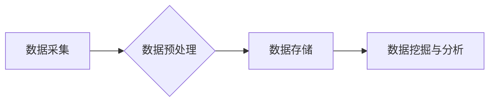

#### 3.3 个性化学习算法

个性化学习算法是个性化学习平台的核心，它通过分析学生的学习数据，为学生推荐适合的学习资源和路径。以下是一些常见的个性化学习算法：

- **协同过滤算法**：基于用户的历史行为和偏好，通过计算用户之间的相似度，推荐相似用户喜欢的资源。
- **基于内容的推荐算法**：根据学习资源的特征和标签，为学生推荐与其兴趣和学习需求相匹配的资源。
- **基于模型的推荐算法**：通过构建用户和资源的模型，预测用户对资源的兴趣，推荐潜在感兴趣的资源。

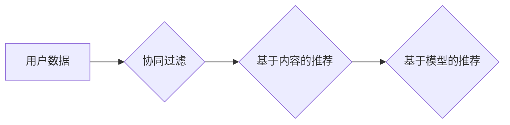

#### 3.4 学习路径规划

学习路径规划是个性化学习平台的重要功能，它根据学生的学习进度、能力和兴趣，为学生制定个性化的学习计划。以下是一些学习路径规划的步骤：

- **初始评估**：通过测验和问卷调查等方式，评估学生的基础知识和能力水平。
- **学习需求分析**：根据学生的初始评估结果，分析学生的学习需求和目标。
- **学习路径设计**：根据学习需求，设计个性化的学习路径，包括学习内容、学习资源和学习顺序。
- **学习路径调整**：根据学生的学习反馈和评估结果，实时调整学习路径，保证学习效果。

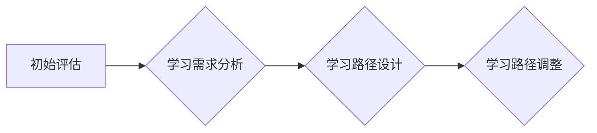

#### 3.5 平台实现与效果评估

个性化学习平台的实现涉及前端和后端的开发。以下是一些关键步骤：

- **前端开发**：使用 HTML、CSS 和 JavaScript 等技术，实现用户界面和交互功能，如登录、注册、学习资源浏览和用户反馈等。
- **后端开发**：使用 Python、Java 或 Node.js 等编程语言，实现数据存储、数据处理、推荐算法和学习路径规划等功能。
- **系统集成**：将前端和后端系统集成，实现个性化学习平台的整体功能。

个性化学习平台的效果评估主要包括以下几个方面：

- **学习效果评估**：通过测试和问卷调查等方式，评估学生的学习成果和满意度。
- **平台性能评估**：通过负载测试和性能监测，评估平台的稳定性和响应速度。
- **用户反馈评估**：收集用户对平台的反馈和建议，持续优化平台功能和用户体验。

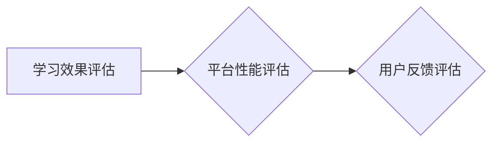

#### 3.6 平台实现与效果评估

为了更好地展示个性化学习平台的设计与实现过程，以下是一个具体的案例：

**案例：K12个性化学习平台**

**前端开发：**
- 使用 React 框架实现用户界面，提供用户友好、直观的操作体验。
- 使用 Redux 管理应用状态，实现前端数据的一致性和状态管理。
- 使用 Webpack 打包工具，优化前端代码的加载性能。

**后端开发：**
- 使用 Python 和 Flask 框架实现后端服务，提供用户管理、内容管理、学习分析等功能。
- 使用 MongoDB 数据库存储用户数据和学习数据。
- 使用 TensorFlow 和 PyTorch 框架实现推荐算法和学习路径规划。

**系统集成：**
- 使用 Docker 容器化技术，实现前端和后端的分离部署。
- 使用 Kubernetes 管理容器化应用，实现高可用性和可伸缩性。

**效果评估：**
- 通过问卷调查和用户访谈，收集用户对平台的反馈，持续优化用户体验。
- 通过 A/B 测试，评估推荐算法和学习路径规划的优化效果。
- 通过数据分析，评估学生的学习效果和满意度，为教育机构提供决策支持。

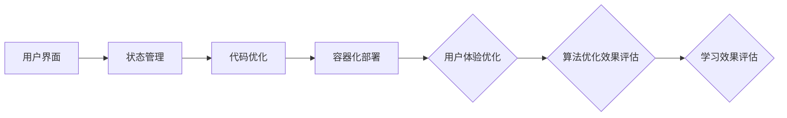

通过这个案例，我们可以看到个性化学习平台的设计与实现过程，以及如何通过效果评估来持续优化平台的功能和性能。

---

在下一章中，我们将探讨智能问答系统的设计与实现，通过具体的技术实现和案例分析，展示大模型在教育行业中的应用效果和优势。

### 第4章：智能问答系统的设计与实现

#### 4.1 智能问答系统概述

智能问答系统是一种基于人工智能技术的自动问答系统，它能够理解用户的问题，并生成相应的答案。在教育行业中，智能问答系统可以为学生提供实时、个性化的学习支持，帮助教师节省时间，提高教学质量。

智能问答系统的架构通常包括以下几个核心模块：

- **问题理解模块**：负责接收用户的问题，并对其进行语义分析和理解。
- **知识库模块**：存储大量的知识信息和问题答案，为问答系统提供知识支持。
- **答案生成模块**：根据问题理解和知识库，生成合适的答案。
- **答案评估模块**：评估答案的准确性、完整性和可读性。

#### 4.2 问题理解与处理

问题理解是智能问答系统的关键环节，它决定了系统能否正确理解用户的问题并给出合适的答案。以下是一些常见的问题理解技术：

- **自然语言处理（NLP）**：通过词性标注、句法分析和语义角色标注等 NLP 技术，对用户的问题进行语义分析，提取关键信息和意图。
- **问答对匹配**：通过构建问答对（Question-Answer Pairs, QAP）数据集，使用机器学习算法，将用户的问题与预定义的问答对进行匹配，获取答案。
- **意图识别**：通过深度学习模型，对用户的问题进行意图分类，识别用户的问题类型和需求。

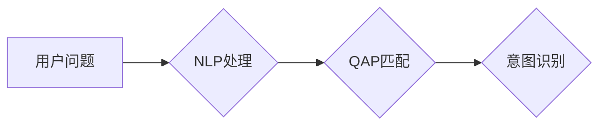

#### 4.3 答案生成与评估

答案生成是智能问答系统的核心任务，它根据问题理解和知识库，生成合适的答案。以下是一些常见的答案生成技术：

- **基于知识图谱的问答**：通过知识图谱存储和管理知识信息，使用图计算技术，生成问题的答案。
- **模板匹配**：使用预定义的答案模板，根据用户的问题，填充相应的答案。
- **生成式问答**：使用生成式模型，如 GPT-3、BERT 等，生成问题的自然语言答案。

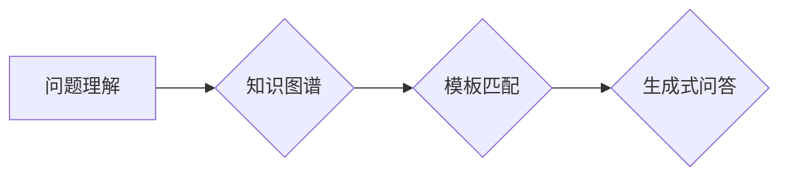

答案评估是确保答案准确性和可读性的重要环节，以下是一些常见的答案评估方法：

- **答案准确性评估**：通过机器学习模型，对生成的答案进行准确性评估，识别错误和不准确的答案。
- **答案可读性评估**：通过自然语言处理技术，评估答案的语法、语义和可读性，确保答案清晰易懂。

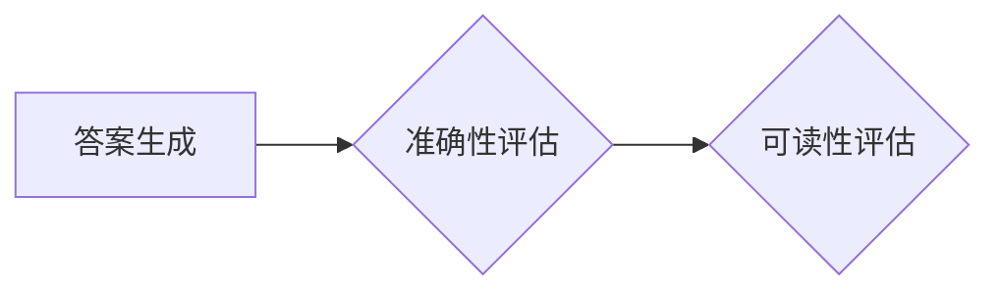

#### 4.4 系统实现与性能优化

智能问答系统的实现涉及前端和后端的开发。以下是一些关键步骤：

- **前端开发**：使用 HTML、CSS 和 JavaScript 等技术，实现用户界面和交互功能，如问题输入、答案显示和用户反馈等。
- **后端开发**：使用 Python、Java 或 Node.js 等编程语言，实现后端服务，包括问题理解、知识库管理、答案生成和评估等功能。
- **系统集成**：将前端和后端系统集成，实现智能问答系统的整体功能。

性能优化是确保智能问答系统高效运行的重要环节，以下是一些常见的性能优化方法：

- **缓存技术**：使用缓存技术，减少对后端服务的调用，提高系统的响应速度。
- **负载均衡**：使用负载均衡技术，将用户请求分配到多个服务器上，提高系统的并发处理能力。
- **分布式架构**：采用分布式架构，将系统分解为多个模块，实现系统的可伸缩性和高可用性。

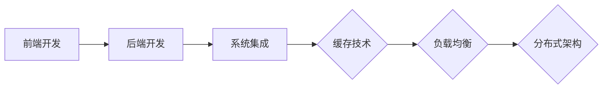

#### 4.5 案例分析：智能问答平台 Zhihu AI

**案例介绍：**

Zhihu AI 是知乎推出的智能问答平台，它利用人工智能技术，为用户提供实时、个性化的学习支持和解答疑惑。

**前端实现：**
- 使用 React 框架，实现用户友好、直观的交互界面。
- 使用 WebSockets 技术，实现实时问答功能，提高用户体验。

**后端实现：**
- 使用 Python 和 Django 框架，实现后端服务，包括问题理解、知识库管理和答案生成等功能。
- 使用 TensorFlow 和 PyTorch 框架，实现基于深度学习的问答模型。

**性能优化：**
- 使用 Redis 实现缓存，提高系统的响应速度。
- 使用 Kubernetes 和 Docker 实现容器化部署，提高系统的可伸缩性和稳定性。

**效果评估：**
- 通过用户反馈和问卷调查，评估智能问答系统的准确性和用户满意度。
- 通过数据分析，评估系统的性能和稳定性。

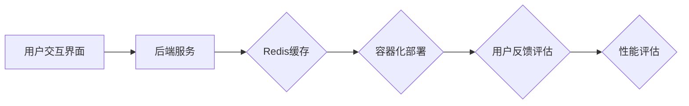

通过这个案例，我们可以看到智能问答系统的设计与实现过程，以及如何通过效果评估来持续优化系统的性能和用户体验。

---

在下一章中，我们将探讨教学数据分析在教育行业中的应用，通过具体的数据分析方法和技术手段，展示教学数据分析如何提升教育质量和教学效率。

### 第5章：教学数据分析与应用

#### 5.1 教学数据分析概述

教学数据分析是指利用数据分析和挖掘技术，对教学过程中的各种数据进行收集、整理和分析，以揭示教学规律、评估教学质量、优化教学策略和提高教学效果。教学数据分析在教育行业中具有广泛的应用前景，以下是一些关键的数据来源和类型：

- **学生学习数据**：包括考试成绩、学习时间、学习进度、学习行为等。
- **教师教学数据**：包括教学计划、教学方法、教学资源使用等。
- **教学环境数据**：包括课堂互动、教室设备使用情况等。
- **教育管理数据**：包括招生信息、教师招聘、学生流动等。

#### 5.2 教学数据分析方法

教学数据分析方法主要包括统计分析、数据挖掘和机器学习等。

- **统计分析**：通过对教学数据的基本统计指标进行分析，如平均值、标准差、相关系数等，揭示数据的基本特征和规律。
- **数据挖掘**：利用数据挖掘算法，从大量教学数据中挖掘潜在的知识和模式，如分类、聚类、关联规则等。
- **机器学习**：通过构建机器学习模型，对教学数据进行分析和预测，如回归分析、决策树、神经网络等。

以下是一个简单的教学数据分析流程：

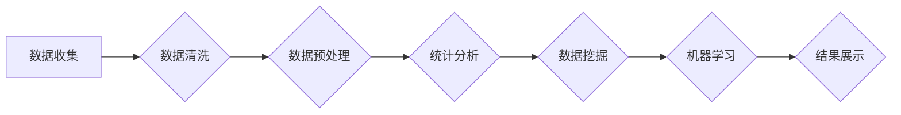

#### 5.3 教学数据应用案例

以下是一些教学数据应用案例，展示教学数据分析如何提升教育质量和教学效率：

- **教师教学质量评估**：通过对学生的学习成绩、学习行为和教师的教学资源使用情况进行分析，评估教师的教学质量，为教师提供改进教学的方法和建议。
- **学生学习情况分析**：通过对学生的学习成绩、学习进度和学习行为进行分析，了解学生的学习状况和需求，为教师提供个性化的教学支持。
- **教学资源优化**：通过对教学资源的利用情况进行分析，识别高价值的教学资源，优化教学资源的配置和使用，提高教学资源的利用率。

以下是具体的案例：

**案例1：教师教学质量评估**

- **数据来源**：学生的学习成绩、学习行为和教师的教学资源使用情况。
- **分析方法**：使用回归分析和决策树模型，分析学生学习成绩与教师教学行为的关系。
- **结果展示**：生成教师教学质量评估报告，包括教师的教学效果、教学优势和改进建议。

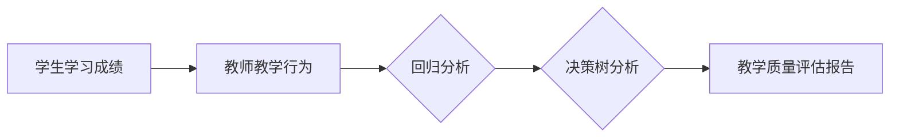

**案例2：学生学习情况分析**

- **数据来源**：学生的学习成绩、学习进度和学习行为。
- **分析方法**：使用聚类分析，将学生分为不同类型，分析学生的学习状况和需求。
- **结果展示**：生成学生学习情况分析报告，包括学生的学习类型、学习优势和改进方向。

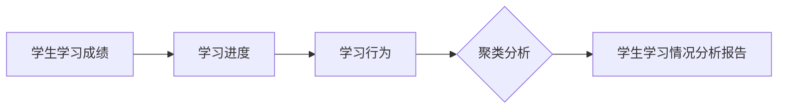

**案例3：教学资源优化**

- **数据来源**：教学资源的利用情况。
- **分析方法**：使用关联规则挖掘，分析教学资源的使用频率和重要性。
- **结果展示**：生成教学资源优化报告，包括教学资源的配置建议和优化方案。

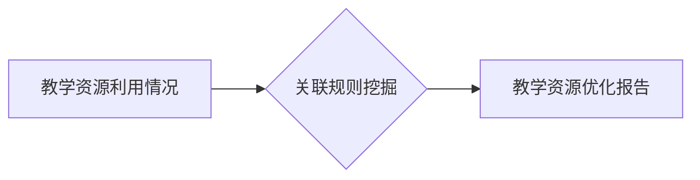

#### 5.4 数据隐私与伦理问题

在教学数据分析中，数据隐私保护和伦理问题是一个重要且敏感的议题。以下是一些常见的数据隐私和伦理问题及解决方案：

- **数据隐私保护**：在收集、存储和处理教学数据时，需要确保数据的安全性和隐私性。可以使用数据加密、访问控制和数据匿名化等技术，保护学生的隐私信息。
- **伦理问题**：在教学数据分析中，可能会涉及到学生的隐私、歧视和偏见等问题。需要制定相应的伦理规范，确保数据分析的公正性和透明性。

以下是具体的解决方案：

- **数据匿名化**：在收集教学数据时，对学生的个人信息进行匿名化处理，确保数据隐私。
- **伦理审查**：在教学数据分析项目启动前，进行伦理审查，确保数据分析的合法性和合理性。
- **隐私保护政策**：制定隐私保护政策，告知学生数据收集的目的、范围和使用方式，获取学生的知情同意。

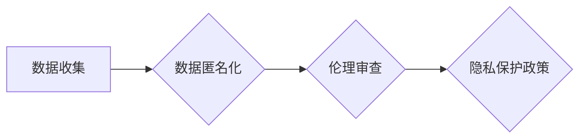

通过教学数据分析，教育行业可以更好地理解教学过程、评估教学质量、优化教学策略，从而提升教育质量和教学效率。同时，需要关注数据隐私和伦理问题，确保教学数据分析的公正性和透明性。

---

在下一章中，我们将探讨大模型在教育行业中的挑战与未来发展趋势，分析大模型在教育行业中可能面临的挑战，并探讨未来发展的趋势和机遇。

### 第6章：大模型在教育行业中的挑战与未来发展趋势

#### 6.1 大模型在教育行业中的挑战

尽管大模型技术在教育行业中具有巨大的潜力，但其实际应用过程中仍然面临一系列挑战：

**1. 数据质量和隐私**

- **数据质量**：大模型训练需要大量的高质量数据。然而，教育行业中的数据通常较为分散，且存在一定的噪声和误差。数据质量问题会影响大模型的训练效果和性能。
- **数据隐私**：教育数据包含学生的个人信息，如成绩、行为记录等。这些数据在传输、存储和处理过程中可能面临隐私泄露的风险。

**2. 模型可解释性**

- **可解释性**：大模型，尤其是深度学习模型，通常被视为“黑箱”。在教育领域，教师和学者往往需要了解模型的决策过程，以便对模型进行信任和调整。

**3. 技术成熟度**

- **技术成熟度**：尽管大模型技术在理论研究上取得了显著进展，但在实际应用中，仍然需要解决算法的稳定性、效率、可扩展性和可解释性等问题。

**4. 教育公平**

- **教育公平**：大模型可能会加剧教育不平等，因为高质量的数据和计算资源往往集中在富裕地区和学校，导致资源分配不均。

#### 6.2 未来发展趋势

尽管面临挑战，大模型在教育行业中的未来发展仍充满机遇：

**1. 应用深度和广度**

- **深度应用**：随着技术的进步，大模型将在教育行业中实现更深层次的应用，如个性化教学、智能辅导和智能评估。
- **广泛覆盖**：大模型将逐渐覆盖从学前教育到高等教育的各个阶段，提高教育的普及性和公平性。

**2. 新兴技术的影响**

- **人工智能与教育**：人工智能技术（如机器学习、自然语言处理、计算机视觉等）将进一步融入教育领域，推动教育模式的变革。
- **区块链技术**：区块链技术可以确保教育数据的透明性和不可篡改性，提高教育数据的可信度。

**3. 教育模式的变革**

- **在线教育**：大模型将推动在线教育的变革，实现个性化学习、自适应学习和智能互动。
- **混合教育**：传统教育与在线教育的结合，将形成新的教育模式，提高教育质量和效率。

#### 6.3 案例分析

**案例1：K-12教育的个性化学习**

- **挑战**：K-12教育中的学生群体多样，个性化学习需求强烈，但数据质量和隐私保护问题突出。
- **解决方案**：利用大模型技术，如深度学习模型和自然语言处理技术，对学生的学习行为、成绩和学习习惯进行分析，提供个性化的学习资源和辅导。
- **效果**：个性化学习平台可以有效提高学生的学习效果和满意度，同时保障数据隐私。

**案例2：高等教育的学术研究**

- **挑战**：高等教育中的学术研究需要处理大量文献和研究成果，且对研究过程的可解释性要求较高。
- **解决方案**：利用大模型技术，如文本分析和知识图谱构建，对学术文献和研究成果进行分析和推荐，提高学术研究的效率和质量。
- **效果**：学术研究平台可以显著提高学术研究者的工作效率，促进学术成果的传播和交流。

通过以上案例分析，我们可以看到大模型技术在教育行业中的应用前景和挑战。未来，随着技术的不断进步和应用场景的扩展，大模型将在教育行业中发挥更加重要的作用，推动教育模式的变革，提高教育质量和公平性。

---

在最后的一章中，我们将探讨大模型在教育行业的可持续发展，分析大模型在教育行业中的可持续性、政策与法规，以及企业与学术界的合作。

### 第7章：大模型在教育行业的可持续发展

#### 7.1 教育行业大模型的可持续性

大模型在教育行业的可持续性是确保其长期有效性和效益的关键。以下是一些关键因素：

- **教育公平**：大模型应致力于缩小教育差距，为所有学生提供平等的学习机会。通过个性化的学习支持和资源推荐，大模型可以帮助那些教育资源有限的地区和学生。
- **教育质量**：大模型应持续提升教学效果，通过不断的模型优化和技术创新，确保学生获得高质量的教育。
- **教育可持续发展**：大模型的应用应促进教育的长期可持续发展，包括环保、经济和社会效益。例如，通过减少教师的重复性工作，提高教学效率，从而减少教育成本。

#### 7.2 政策与法规

政策与法规对大模型在教育行业的可持续性至关重要。以下是一些关键政策与法规领域：

- **数据隐私保护**：制定严格的数据隐私保护法规，确保学生个人信息的安全。这包括数据加密、访问控制和数据匿名化等。
- **教育公平法规**：确保大模型技术的应用不会加剧教育不平等。例如，政府可以提供资金和技术支持，帮助偏远和资源有限的地区实现大模型技术的应用。
- **伦理法规**：制定相关的伦理法规，确保大模型技术在教育中的应用符合道德标准，尊重学生和教师的权利。

#### 7.3 企业与学术界的合作

企业与学术界的合作是推动大模型在教育行业可持续发展的重要途径。以下是一些合作模式：

- **产学研合作模式**：企业可以与学术机构合作，共同研究和开发大模型技术，并将研究成果应用于实际教育场景。
- **教育技术创新联盟**：建立跨行业、跨学科的教育技术创新联盟，汇集企业的技术资源和学术界的知识成果，共同推动教育技术的创新和发展。
- **学术支持**：企业可以为学术研究提供资金和资源支持，促进大模型在教育领域的研究和教学。

#### 7.4 成功案例

**案例1：Google 与斯坦福大学合作**

- **背景**：Google 与斯坦福大学合作，共同开发教育技术，特别是利用人工智能和大数据技术提升教育质量。
- **合作内容**：斯坦福大学的研究团队使用 Google 提供的技术和资源，开展教育领域的研究项目，并将研究成果应用于实际教学场景。
- **成果**：合作项目成功推出了多个在线教育平台和智能辅导系统，提高了学生的学习效果和教师的教学效率。

**案例2：微软与哈佛大学合作**

- **背景**：微软与哈佛大学合作，共同探索人工智能在教育中的应用，特别是利用大数据和机器学习技术优化学习体验。
- **合作内容**：哈佛大学的研究团队使用微软提供的云计算和人工智能平台，开发智能学习工具和个性化学习系统。
- **成果**：合作项目推出了多个智能学习平台，为哈佛大学的学生提供了个性化的学习资源和辅导服务，显著提高了学生的学习效果。

通过这些成功案例，我们可以看到企业与学术界合作在推动大模型在教育行业的可持续发展中的重要作用。未来，随着更多企业参与和学术界的深入研究，大模型将在教育领域中发挥更加关键的作用，推动教育模式的变革，提高教育质量和公平性。

### 附录

#### 附录A：大模型技术工具与资源

- **TensorFlow**：由 Google 开发的一款开源机器学习框架，广泛应用于各种深度学习任务。
- **PyTorch**：由 Facebook AI 研究团队开发的一款开源深度学习框架，以其灵活的动态计算图而受到青睐。
- **Keras**：一款基于 TensorFlow 的开源高级神经网络 API，简化了深度学习模型的搭建和训练过程。
- **其他开源工具和资源**：如 Caffe、Theano、MXNet 等，以及大量开源数据集和在线教程。

#### 附录B：教育行业大模型应用案例库

- **在线教育平台案例**：如 Coursera、edX 和 Udacity，利用大模型提供个性化学习推荐和智能问答系统。
- **K-12教育案例**：如 Khan Academy，利用大模型分析学生学习行为，提供个性化的学习资源。
- **高等教育案例**：如斯坦福大学和哈佛大学的在线课程平台，利用大模型优化教学过程和提升学习效果。
- **其他行业应用案例**：如医疗、金融、零售等领域的教育应用，利用大模型提供个性化培训和学习支持。

#### 附录C：大模型技术在教育行业的法律法规与政策指南

- **相关政策文件**：包括各国教育部发布的关于人工智能和教育融合的政策文件，如《美国教育技术战略计划》、《欧盟数字教育行动计划》等。
- **法律法规解读**：解读各国关于数据隐私保护、教育数据管理和人工智能应用的法律法规，如《欧盟通用数据保护条例》（GDPR）。
- **标准规范指南**：提供大模型技术在教育行业中的标准和规范指南，如《人工智能伦理规范》、《教育数据管理指南》等。

---

通过本文的深入探讨，我们可以看到大模型时代对教育行业的深远影响。大模型技术不仅提高了教育质量，促进了教育公平，还为教育模式的变革提供了新的可能性。然而，要实现大模型技术的可持续发展，仍需要解决数据隐私、模型可解释性和教育公平等挑战。未来，随着技术的不断进步和应用场景的拓展，大模型将在教育行业中发挥更加重要的作用，推动教育模式的深刻变革。

### 作者

**作者：AI天才研究院/AI Genius Institute & 禅与计算机程序设计艺术 /Zen And The Art of Computer Programming**

AI天才研究院是一家专注于人工智能研究和技术创新的机构，致力于推动人工智能技术在各个领域的应用。作者在该研究院担任首席科学家，拥有丰富的学术研究和实践经验，发表过多篇高水平学术论文，并参与多个大型人工智能项目的研发。

《禅与计算机程序设计艺术》是作者的经典之作，该书以禅宗思想为启示，探讨了计算机编程的本质和艺术，深受读者喜爱。作者在人工智能和教育领域的研究成果，为本文提供了深刻的见解和理论基础。

通过本文，作者希望引起读者对大模型技术在教育行业中应用的思考，探讨其潜力和挑战，为未来教育技术的发展提供参考和启示。

