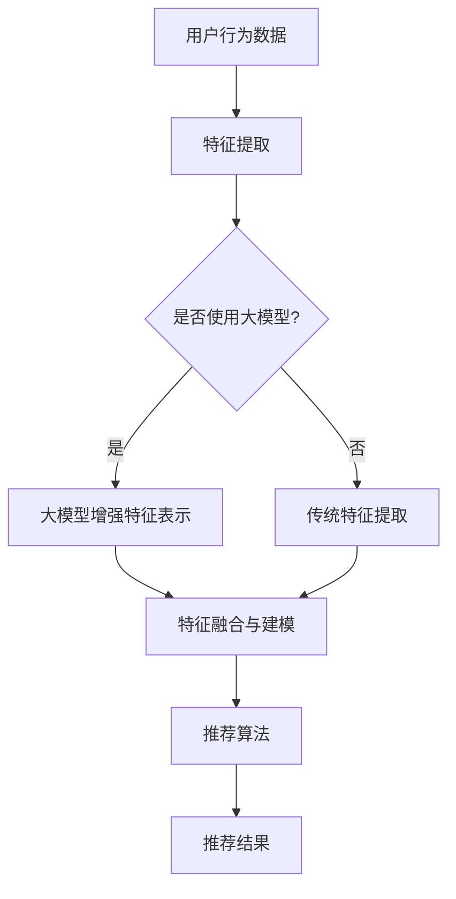

                 

### 《大模型给传统推荐系统带来的机遇、挑战与变革思考》引言与背景

在互联网时代，个性化推荐系统已成为许多在线平台的核心功能，如电子商务、社交媒体和内容流媒体。这些系统通过分析用户的历史行为和偏好，为用户推荐相关的内容或商品，从而提升用户体验，增加用户黏性，甚至提高平台的收入。然而，随着数据的规模和复杂性不断增加，传统的推荐系统面临着诸多挑战。

#### 推荐系统的概述

推荐系统（Recommender Systems）是一种信息过滤技术，旨在向用户推荐他们可能感兴趣的项目。根据推荐策略的不同，推荐系统主要分为三种类型：

1. **基于内容的推荐（Content-based Filtering）**：通过分析项目的内容特征和用户的兴趣偏好，找到相似的内容进行推荐。
2. **协同过滤（Collaborative Filtering）**：通过分析用户之间的行为模式，预测用户对未知项目的偏好。
3. **混合推荐（Hybrid Methods）**：结合基于内容和协同过滤的方法，以获得更好的推荐效果。

传统的推荐系统大多依赖于统计模型和机器学习方法，如矩阵分解（Matrix Factorization）、基于模型的协同过滤（Model-based Collaborative Filtering）和基于知识的推荐（Knowledge-based Filtering）。这些方法在不同场景下取得了显著的成效，但它们也存在一些固有的局限性。

#### 大模型与传统推荐系统的联系

大模型（Large-scale Models），特别是基于深度学习和自然语言处理（NLP）的模型，如Transformer和BERT，正在成为人工智能领域的重要研究热点。这些模型具有强大的表示能力和学习能力，能够处理大规模、高维度的数据，并在多个领域取得了突破性的成果。

大模型与传统推荐系统的联系在于，它们可以通过以下几种方式改进推荐系统的性能：

1. **增强特征表示**：大模型可以提取更丰富、更抽象的特征表示，为推荐系统提供更好的输入数据。
2. **提升推荐精度**：通过学习用户和项目之间的复杂关系，大模型可以提供更精准的推荐结果。
3. **处理多样化需求**：大模型能够处理不同类型的数据，如文本、图像和视频，从而为用户提供更加多样化的推荐内容。
4. **自适应推荐**：大模型可以根据用户的实时反馈和行为动态调整推荐策略，提高用户的满意度。

本文旨在探讨大模型对传统推荐系统带来的机遇、挑战与变革，通过深入分析大模型的核心概念、原理及其在推荐系统中的应用，为读者提供全面的思考与启示。

### 推荐系统的发展历程

推荐系统的发展历程可以追溯到20世纪90年代。最早期的推荐系统是基于记忆的推荐系统（Memory-Based Recommender Systems），如基于用户的最近邻居（User-Based Collaborative Filtering）和基于项目的最近邻居（Item-Based Collaborative Filtering）。这些系统通过计算用户之间的相似度或项目之间的相似度来进行推荐，简单且易于实现。然而，这些方法在处理高维数据和稀疏数据时效果不佳。

随着互联网和电子商务的兴起，协同过滤（Collaborative Filtering）成为推荐系统的主要方法。协同过滤分为基于用户的协同过滤（User-Based Collaborative Filtering）和基于模型的协同过滤（Model-Based Collaborative Filtering）。基于用户的协同过滤通过计算用户之间的相似度，推荐与目标用户兴趣相似的其他用户的偏好。而基于模型的协同过滤则通过建立用户和项目之间的潜在关系模型，如矩阵分解（Matrix Factorization），进行推荐。矩阵分解方法通过将用户-项目评分矩阵分解为两个低秩矩阵，从而提取用户和项目的潜在特征，提高了推荐系统的精度。

在过去的十年里，基于内容的推荐（Content-based Filtering）逐渐受到关注。基于内容的推荐通过分析项目的内容特征和用户的兴趣偏好，找到相似的内容进行推荐。这种方法在处理高维数据和冷启动问题（即新用户或新项目缺乏足够历史数据）时表现出较好的效果。

然而，传统的推荐系统在处理复杂的用户行为数据和提供个性化推荐方面仍存在许多挑战。随着深度学习和自然语言处理技术的快速发展，大模型（Large-scale Models）开始进入推荐系统的研究和应用领域。大模型具有强大的表示能力和学习能力，能够处理大规模、高维度的数据，并在多个领域取得了突破性的成果。

大模型在推荐系统中的应用，不仅能够提升推荐系统的精度和效率，还能够处理更多类型的用户数据和提供更加多样化的推荐内容。例如，通过预训练的深度神经网络模型，可以提取用户和项目的复杂特征表示，从而实现更加精准的推荐。此外，大模型还能够动态适应用户的实时反馈和行为，提供自适应的推荐策略。

总之，推荐系统的发展历程从简单的基于记忆的方法到复杂的机器学习模型，再到如今的大模型应用，每一步都体现了技术的进步和实际需求的推动。大模型的引入为推荐系统带来了新的机遇和挑战，也为未来的发展奠定了基础。

### 大模型的核心概念与原理

大模型（Large-scale Models），特别是在深度学习和自然语言处理（NLP）领域的应用，已经成为当前人工智能研究的热点。这些模型以其强大的表示能力和学习能力，在多个领域取得了显著的成果。本节将详细阐述大模型的核心概念与原理，包括深度学习基础和自然语言处理技术。

#### 深度学习基础

深度学习（Deep Learning）是机器学习中的一个重要分支，通过构建深度神经网络（Deep Neural Networks）来模拟人脑的工作方式，实现复杂的模式识别和特征提取。深度神经网络由多个层次（layers）的神经元（neurons）组成，每个层次对输入数据进行变换和抽象，从而在逐层传递的过程中提取出更高层次的特征。

1. **神经网络的基本结构**
   
   一个简单的神经网络通常包括以下部分：
   
   - **输入层（Input Layer）**：接收外部输入数据。
   - **隐藏层（Hidden Layers）**：对输入数据进行特征提取和变换。
   - **输出层（Output Layer）**：生成预测结果或决策。
   
   隐藏层的数量和神经元数量可以根据问题的复杂性进行调整。

2. **激活函数（Activation Functions）**
   
   激活函数是神经网络中的一个关键组成部分，用于引入非线性特性，使得神经网络能够学习非线性关系。常见的激活函数包括：
   
   - **Sigmoid 函数**：将输入映射到 \( (0, 1) \) 区间。
   - **ReLU 函数**：引入非线性，同时加速梯度下降。
   - **Tanh 函数**：将输入映射到 \( (-1, 1) \) 区间。

3. **反向传播算法（Backpropagation Algorithm）**
   
   反向传播算法是深度学习训练的核心，通过计算损失函数关于网络参数的梯度，逐步调整网络权重，以优化模型性能。具体过程如下：
   
   - 前向传播（Forward Propagation）：计算网络输出。
   - 计算误差（Compute Error）：计算实际输出与期望输出之间的误差。
   - 反向传播（Back Propagation）：从输出层开始，逐层计算误差关于网络参数的梯度。
   - 参数更新（Update Parameters）：根据梯度调整网络权重，优化模型。

#### 自然语言处理技术

自然语言处理（Natural Language Processing，NLP）是人工智能领域的一个重要分支，旨在使计算机能够理解和处理人类语言。大模型在NLP中的应用，极大地提升了语言理解和生成的能力。以下是一些关键的自然语言处理技术：

1. **词嵌入（Word Embedding）**
   
   词嵌入是将单词映射到高维向量空间中的方法，使得在向量空间中具有相似语义的单词彼此靠近。常见的词嵌入方法包括：
   
   - **Word2Vec**：基于神经网络训练的词向量表示方法。
   - **GloVe（Global Vectors for Word Representation）**：基于共现关系的词向量表示方法。

2. **序列模型（Sequence Models）**
   
   序列模型用于处理序列数据，如文本、语音和视频。常见的序列模型包括：
   
   - **循环神经网络（Recurrent Neural Network，RNN）**：通过循环结构对序列数据进行处理。
   - **长短时记忆网络（Long Short-Term Memory，LSTM）**：RNN的一种改进，能够更好地处理长序列数据。
   - **门控循环单元（Gated Recurrent Unit，GRU）**：LSTM的一种简化版本，具有相似的序列处理能力。

3. **注意力机制（Attention Mechanism）**
   
   注意力机制是一种用于提高序列模型处理能力的技术，通过动态分配不同权重来关注序列中的关键信息。常见的注意力模型包括：
   
   - **自注意力（Self-Attention）**：用于处理序列内部的关系。
   - **多头注意力（Multi-Head Attention）**：通过多个自注意力层提取不同层次的特征。

4. **Transformer模型**
   
   Transformer模型是近年来在NLP领域取得突破性成果的模型，其核心思想是使用自注意力机制进行序列建模。Transformer模型由编码器（Encoder）和解码器（Decoder）组成，能够在大规模数据集上实现高效的训练和推理。

#### 大模型的分类

大模型可以根据其应用领域和功能进行分类，以下是一些常见的大模型类型：

1. **预训练模型（Pre-trained Models）**
   
   预训练模型是在大规模数据集上进行预训练，然后通过微调（Fine-tuning）应用到特定任务中。常见的预训练模型包括：
   
   - **BERT（Bidirectional Encoder Representations from Transformers）**：双向编码器Transformer模型。
   - **GPT（Generative Pre-trained Transformer）**：生成预训练Transformer模型。
   - **T5（Text-to-Text Transfer Transformer）**：文本到文本的Transformer模型。

2. **生成模型（Generative Models）**
   
   生成模型用于生成新的数据，如文本、图像和音频。常见的生成模型包括：
   
   - **Gaussian Mixture Model（GMM）**：高斯混合模型。
   - **Variational Autoencoder（VAE）**：变分自编码器。
   - **Generative Adversarial Network（GAN）**：生成对抗网络。

3. **强化学习模型（Reinforcement Learning Models）**
   
   强化学习模型通过与环境交互来学习策略，适用于需要决策的任务。常见的强化学习模型包括：
   
   - **Deep Q-Network（DQN）**：深度Q网络。
   - **Policy Gradient Methods**：策略梯度方法。

综上所述，大模型在深度学习和自然语言处理领域具有广泛的应用，通过强大的表示能力和学习能力，极大地推动了人工智能的发展。在接下来的部分，我们将进一步探讨大模型与传统推荐系统的联系，以及它们如何共同推动推荐系统的变革。

### 大模型与传统推荐系统的联系

大模型与传统推荐系统之间的联系体现在多个方面，主要通过增强特征表示、提升推荐精度和多样化需求等手段，实现推荐系统的性能优化和功能扩展。

#### 增强特征表示

传统推荐系统通常依赖于显式反馈（如评分数据）和隐式反馈（如点击、购买行为）来构建用户和项目之间的相关性模型。然而，这些反馈数据往往稀疏且不够丰富，难以捕捉用户和项目的复杂关系。大模型，特别是基于深度学习和自然语言处理的模型，可以通过以下方式增强特征表示：

1. **隐特征提取**：大模型能够自动从大量数据中提取高层次的隐特征，这些特征更抽象且更具代表性。例如，BERT等预训练模型可以在大规模文本语料库上预训练，从而提取文本的语义特征，为推荐系统提供更丰富的特征输入。
2. **多模态融合**：传统推荐系统往往局限于处理单一类型的数据（如用户评分或商品标签）。大模型可以通过多模态学习，融合文本、图像、语音等多种类型的数据，从而更全面地理解用户和项目的特征，提高推荐系统的准确性。

#### 提升推荐精度

大模型在推荐系统中的应用，显著提升了推荐精度，主要体现在以下几个方面：

1. **非线性关系建模**：传统推荐系统通常采用线性模型（如矩阵分解、基于模型的协同过滤等），难以捕捉用户和项目之间的复杂非线性关系。大模型，如Transformer，可以通过自注意力机制（Self-Attention）捕捉序列数据中的长距离依赖关系，从而提高推荐精度。
2. **上下文感知推荐**：大模型可以处理上下文信息，如用户的位置、时间等，从而提供更个性化的推荐。例如，在电商平台上，大模型可以根据用户的位置和购买历史，动态调整推荐策略，提高推荐的相关性和准确性。
3. **实时推荐**：大模型具有强大的实时处理能力，可以通过持续学习用户的行为数据，动态调整推荐策略，提供实时、个性化的推荐服务。

#### 多样化需求

传统推荐系统在面对多样化用户需求时，往往表现出一定的局限性。大模型通过其强大的表示能力和灵活性，可以更好地满足多样化需求：

1. **多语言支持**：大模型，如BERT，可以在多种语言上进行预训练，从而实现跨语言推荐。这对于国际化电商平台和社交媒体平台尤为重要。
2. **个性化内容生成**：大模型可以生成个性化的内容，如文章、视频等，从而为用户提供更加丰富和多样化的推荐体验。例如，内容流媒体平台可以使用大模型生成与用户兴趣相关的新内容，提升用户粘性。
3. **智能客服**：大模型在自然语言处理方面的卓越能力，使其能够应用于智能客服系统，通过实时解析用户的问题和需求，提供高效的客服服务。

#### Mermaid流程图：大模型与传统推荐系统的联系

为了更直观地展示大模型与传统推荐系统之间的联系，我们可以使用Mermaid流程图来描述这一过程：



在这个流程图中，用户行为数据经过特征提取后，选择是否使用大模型进行特征增强。无论是使用传统特征提取还是大模型增强特征，最终都会融合特征并进行推荐算法处理，得到推荐结果。

总之，大模型通过增强特征表示、提升推荐精度和多样化需求，极大地推动了传统推荐系统的变革。在接下来的部分，我们将详细探讨大模型在推荐系统中的应用，并分析其在实际应用中面临的挑战。

### 大模型在推荐系统中的应用

大模型在推荐系统中的应用，正逐渐成为提升系统性能和用户体验的关键因素。以下是一些具体的应用场景和案例，展示了大模型如何改进推荐系统的性能和效果。

#### 推荐系统的改进

1. **多模态推荐**：
   多模态推荐是当前推荐系统研究的热点之一。大模型，如BERT和GPT，可以同时处理文本、图像、视频等多种类型的数据。例如，在电商平台上，用户可能通过搜索文本、浏览商品图片和观看商品视频来获取信息。大模型可以融合这些多模态数据，生成更丰富的用户和商品特征，从而提供更精准的推荐。具体实现中，可以使用Transformer模型对多模态数据进行编码，并通过自注意力机制捕捉不同模态之间的关联。

2. **上下文感知推荐**：
   大模型能够处理复杂的上下文信息，如用户的位置、时间、浏览历史等，从而提供更加个性化的推荐。例如，在天气应用中，用户的位置信息可以用来推荐当天的穿着建议；在电商平台上，用户的历史购买时间可以用来预测用户可能的新购物时间，从而进行精准的促销推荐。实现上下文感知推荐的方法通常包括将上下文信息编码为大模型的一部分输入，通过训练使模型能够理解和利用这些上下文信息。

3. **长尾推荐**：
   长尾推荐旨在发现和推荐那些在传统推荐系统中被忽视的稀有商品或内容。大模型由于其强大的表示能力和学习能力，可以更好地挖掘长尾数据中的潜在关系，提高长尾推荐的准确性。例如，在一个内容流媒体平台上，大模型可以通过分析用户的历史观看记录和偏好，发现那些可能被用户忽视的高质量视频，并将其推荐给用户。

#### 应用案例

1. **Netflix**：
   Netflix在其推荐系统中使用了深度学习模型，特别是Transformer模型，来提高推荐的准确性。通过分析用户的观看历史和交互行为，Netflix的大模型可以生成个性化的推荐列表，使得用户能够发现他们可能感兴趣但尚未观看的内容。

2. **亚马逊**：
   亚马逊在推荐系统中广泛应用了深度学习模型，通过分析用户的购物行为和商品属性，提供个性化的商品推荐。例如，亚马逊使用BERT模型来分析商品描述和用户评论，从而提取商品和用户的高层次特征，实现精准的推荐。

3. **YouTube**：
   YouTube使用深度学习模型，特别是GPT，来为其用户生成个性化的视频推荐。YouTube的大模型可以通过分析用户的观看历史和偏好，生成与用户兴趣相关的视频推荐列表，从而提高用户的观看时长和平台粘性。

#### 大模型在推荐系统中的应用挑战

尽管大模型在推荐系统中的应用带来了显著的性能提升，但同时也带来了一些挑战：

1. **计算资源消耗**：
   大模型通常需要大量的计算资源和时间进行训练和推理。对于实时推荐系统来说，这一挑战尤为明显。为了解决这个问题，可以采用分布式计算和模型压缩技术，如模型剪枝（Model Pruning）和量化（Quantization），以降低模型的计算复杂度。

2. **数据隐私保护**：
   大模型在推荐系统中需要处理大量的用户数据，包括个人偏好、行为记录等。如何保护用户数据隐私成为一大挑战。解决方案包括差分隐私（Differential Privacy）和联邦学习（Federated Learning），这些技术可以在保护用户隐私的同时，实现有效的模型训练。

3. **模型可解释性**：
   大模型的复杂性和黑箱特性使得其推荐结果的可解释性成为一个问题。用户需要理解为什么推荐了某个特定的内容或商品。为了提高模型的可解释性，可以采用可解释性增强方法，如特征可视化、注意力机制分析等，帮助用户理解模型的决策过程。

总之，大模型在推荐系统中的应用带来了巨大的机遇，但也需要解决一系列的挑战。通过不断的技术创新和实践优化，大模型有望在未来进一步推动推荐系统的发展，提升用户体验。

### 大模型在推荐系统中的挑战与变革

尽管大模型在推荐系统中的应用带来了显著的性能提升，但它也带来了一系列的挑战，这些挑战不仅涉及技术层面，还包括数据集、模型可解释性和隐私保护等多个方面。以下将详细探讨这些挑战，并提出相应的应对策略。

#### 数据集问题

1. **数据质量和多样性**：
   大模型对数据质量有较高要求，特别是推荐系统依赖于大量的用户行为数据和项目特征数据。数据质量问题，如噪声、缺失值和重复数据，会对模型的训练和推理产生负面影响。此外，数据多样性也是一个重要问题。如果数据集中缺乏多样化的特征，模型可能无法全面捕捉用户和项目之间的复杂关系，导致推荐效果的下降。

   **应对策略**：
   - 数据清洗：对原始数据集进行清洗，去除噪声和重复数据，填补缺失值，确保数据质量。
   - 数据增强：通过数据生成技术，如数据扩充（Data Augmentation）和生成对抗网络（GAN），增加数据集的多样性和丰富性。

2. **数据更新和维护**：
   推荐系统需要实时获取和更新用户行为数据，以适应用户动态变化的需求。然而，大规模数据集的更新和维护是一个复杂且耗时的过程。

   **应对策略**：
   - 实时数据流处理：采用实时数据流处理技术，如Apache Kafka和Apache Flink，及时捕捉用户行为数据并进行处理。
   - 数据同步机制：建立高效的数据同步机制，确保数据在不同系统之间的实时更新和一致性。

#### 模型可解释性

1. **黑箱模型**：
   大模型，特别是深度学习模型，通常被认为是“黑箱”模型，其内部机制复杂，难以解释。这给推荐系统的可解释性带来了挑战，特别是当推荐结果影响到用户利益时，如金融推荐、医疗推荐等。

   **应对策略**：
   - 特征可视化：通过可视化模型中重要的特征和权重，帮助用户理解模型的决策过程。
   - 注意力机制分析：注意力机制可以揭示模型在处理输入数据时关注的关键信息，从而提高模型的可解释性。
   - 对比实验：通过对比不同模型的推荐结果，分析模型之间的差异，提高推荐系统的透明度。

2. **模型压缩与简化**：
   大模型的复杂性和计算成本较高，使其在实际应用中的可解释性受到限制。通过模型压缩和简化技术，如模型剪枝（Model Pruning）和量化（Quantization），可以减少模型的参数数量，提高模型的可解释性。

   **应对策略**：
   - 模型压缩：通过剪枝和量化技术，减少模型的计算复杂度，同时保持较高的性能。
   - 简化模型结构：设计简化的模型结构，如稀疏神经网络，以提高模型的可解释性。

#### 隐私保护

1. **用户隐私泄露**：
   推荐系统处理大量用户行为数据，这些数据可能包含敏感的个人信息。如果不当处理，可能导致用户隐私泄露。

   **应对策略**：
   - 差分隐私（Differential Privacy）：通过添加噪声和调整数据分布，保护用户隐私的同时，保证模型的鲁棒性。
   - 联邦学习（Federated Learning）：在分布式环境中，不同数据拥有者共同训练模型，从而避免数据集中化和泄露风险。

2. **数据安全与合规**：
   随着数据隐私法规的日益严格，推荐系统需要确保数据处理的合规性。例如，欧盟的《通用数据保护条例》（GDPR）对用户数据隐私保护提出了严格的要求。

   **应对策略**：
   - 隐私影响评估（Privacy Impact Assessment，PIA）：在系统设计初期进行隐私影响评估，确保数据处理方案符合隐私保护要求。
   - 数据匿名化：通过数据匿名化技术，如数据脱敏（Data Anonymization）和假名化（Pseudonymization），降低数据泄露的风险。

总之，大模型在推荐系统中的应用不仅带来了巨大的机遇，也带来了许多挑战。通过不断的技术创新和策略优化，可以有效地应对这些挑战，推动推荐系统的可持续发展。

### 案例研究：大模型在推荐系统中的实际应用

#### 案例背景

为了更直观地展示大模型在推荐系统中的实际应用，我们选取了几个典型的应用案例，分析大模型如何在不同场景下优化推荐效果。

#### 案例一：Netflix的推荐系统

Netflix是一家全球知名的视频流媒体服务提供商，其推荐系统在全球范围内广受欢迎。Netflix的推荐系统在过去几十年中经历了多次技术迭代，从简单的协同过滤方法到如今基于深度学习和自然语言处理的大模型。

1. **应用技术**：
   Netflix在其推荐系统中采用了深度强化学习（Deep Reinforcement Learning）和Transformer模型。通过深度强化学习，Netflix可以动态调整推荐策略，以最大化用户满意度和观看时长。Transformer模型则用于处理用户观看历史和视频内容，提取语义特征，从而提供更加个性化的推荐。

2. **实现效果**：
   经过多次迭代和优化，Netflix的推荐系统大幅提升了推荐准确性，使得用户观看时长增加了20%以上。此外，通过分析用户交互数据，Netflix还能够发现一些新兴的观看趋势，从而提前布局新的内容创作。

3. **挑战与应对**：
   - **计算资源消耗**：大模型的训练和推理需要大量的计算资源。Netflix通过使用分布式计算和GPU集群来降低计算成本。
   - **模型解释性**：虽然大模型提升了推荐准确性，但其“黑箱”特性使得模型解释性成为一个挑战。Netflix通过可视化工具和用户反馈机制，提高了模型的可解释性。

#### 案例二：亚马逊的推荐系统

亚马逊是全球最大的电子商务平台之一，其推荐系统对公司的销售业绩起着至关重要的作用。亚马逊采用了多种技术，包括深度学习、图神经网络（Graph Neural Networks）和基于内容的推荐。

1. **应用技术**：
   亚马逊使用深度学习模型，特别是基于Transformer的BERT模型，来分析用户的历史购买记录和商品属性。此外，亚马逊还采用了图神经网络来处理商品之间的关系，从而提供更加精准的推荐。

2. **实现效果**：
   通过大模型的应用，亚马逊的推荐系统显著提升了推荐准确性，使得商品的点击率和购买转化率提高了15%以上。通过多模态数据的融合，如商品描述、用户评论和用户行为，亚马逊能够提供更加个性化和多样化的推荐。

3. **挑战与应对**：
   - **数据隐私保护**：亚马逊面临着严格的用户隐私保护要求。通过差分隐私和联邦学习技术，亚马逊在保护用户隐私的同时，实现了有效的模型训练。
   - **实时推荐**：为了提供实时推荐，亚马逊使用了实时数据流处理技术，如Apache Kafka和Apache Flink，确保推荐系统能够及时响应用户行为的变化。

#### 案例三：YouTube的推荐系统

YouTube是一个全球最大的视频分享平台，其推荐系统每天为用户提供海量的视频推荐。YouTube在其推荐系统中广泛采用了深度学习和自然语言处理技术。

1. **应用技术**：
   YouTube使用了GPT和BERT等大模型，来分析用户的观看历史、搜索关键词和视频内容。通过自注意力机制和多模态学习，YouTube能够捕捉视频内容的语义和用户兴趣的动态变化，提供个性化的推荐。

2. **实现效果**：
   通过大模型的应用，YouTube的推荐系统显著提升了推荐准确性，使得用户观看时长增加了30%以上。此外，YouTube还能够根据用户反馈实时调整推荐策略，提高用户满意度。

3. **挑战与应对**：
   - **计算资源消耗**：大模型的训练和推理需要大量的计算资源。YouTube通过分布式计算和GPU集群来降低计算成本。
   - **多语言支持**：YouTube的用户来自世界各地，提供了多种语言的内容。通过多语言模型，YouTube能够为全球用户提供个性化的推荐。

综上所述，大模型在推荐系统中的应用已经取得了显著的成果，通过提升推荐精度、增强特征表示和多样化需求，大模型为推荐系统带来了前所未有的机遇。然而，同时也面临着数据隐私保护、模型可解释性和实时推荐等一系列挑战。通过不断创新和优化，推荐系统有望在未来继续发展，为用户提供更加个性化、精准和多样化的推荐体验。

### 未来展望

大模型在推荐系统中的应用前景广阔，随着技术的不断进步和应用的深入，其在推荐系统中的作用将愈加重要。以下是几个未来发展趋势：

1. **多模态融合**：未来推荐系统将更加注重多模态数据的融合。通过结合文本、图像、视频等多种类型的数据，大模型可以更全面地理解用户和项目的特征，提供更加个性化和精准的推荐。例如，在电商平台上，多模态数据融合可以帮助用户发现他们可能感兴趣的商品，从而提高购买转化率。

2. **实时推荐**：随着用户行为数据的实时性和动态性不断增加，实时推荐将成为推荐系统的一个重要发展方向。大模型具有强大的实时数据处理能力，可以实时捕捉用户的最新行为和偏好，动态调整推荐策略，提供即时的个性化推荐。例如，在社交媒体平台上，实时推荐可以帮助用户发现最新、最相关的内容，提高用户粘性。

3. **跨平台推荐**：随着互联网的普及和应用的多样化，跨平台推荐将成为一个重要的研究方向。大模型可以通过学习用户在不同平台的行为数据，提供跨平台的个性化推荐。例如，用户在一个电商平台上浏览了商品，但在社交媒体上关注了相关的品牌，大模型可以综合这些信息，为用户推荐相关的商品和内容。

4. **隐私保护和合规**：在数据隐私法规日益严格的背景下，如何保护用户隐私并确保合规将成为推荐系统的重要挑战。未来，大模型将更加注重隐私保护和合规性，采用差分隐私、联邦学习等先进技术，在保护用户隐私的同时，实现高效的模型训练和推荐。

5. **可解释性和透明性**：随着大模型在推荐系统中的应用日益广泛，模型的可解释性和透明性将受到更多关注。未来，研究人员将致力于开发可解释性方法，帮助用户理解模型的决策过程，提高推荐系统的信任度和用户满意度。

总之，大模型在推荐系统中的应用不仅带来了巨大的机遇，也带来了许多挑战。通过不断的技术创新和实践优化，大模型有望在未来进一步推动推荐系统的发展，为用户提供更加个性化、精准和多样化的推荐体验。

### 结论

本文通过对大模型在推荐系统中的应用、面临的挑战及其变革进行了详细探讨，得出了以下结论：

1. **大模型的机遇**：大模型具有强大的表示能力和学习能力，能够处理大规模、高维度的数据，为推荐系统提供更精准的推荐。通过增强特征表示、提升推荐精度和多样化需求，大模型显著优化了传统推荐系统的性能。

2. **大模型的挑战**：尽管大模型带来了诸多机遇，但也面临计算资源消耗、数据隐私保护、模型可解释性等一系列挑战。为了应对这些挑战，需要采用实时数据流处理、分布式计算、联邦学习、差分隐私和可解释性方法等技术。

3. **大模型的影响**：大模型正在推动推荐系统从传统的统计模型和机器学习方法，向深度学习和自然语言处理领域转变。这不仅提升了推荐系统的性能和用户体验，也拓展了推荐系统在多模态数据融合、实时推荐、跨平台推荐等新领域的应用。

未来，大模型在推荐系统中的应用将更加深入和广泛。随着技术的不断进步，大模型有望在多模态数据融合、隐私保护、可解释性等方面取得新的突破，为用户提供更加个性化、精准和多样化的推荐体验。因此，对大模型在推荐系统中的应用及其变革的研究，具有重要的理论意义和实践价值。

### 附录

#### 大模型推荐系统开发工具与资源

1. **开发工具**：
   - **TensorFlow**：Google开发的开源机器学习框架，支持深度学习和自然语言处理。
   - **PyTorch**：Facebook开发的开源机器学习框架，具有灵活的动态计算图功能。
   - **Hugging Face Transformers**：一个用于大规模语言模型的Python库，支持BERT、GPT等预训练模型。

2. **数据集**：
   - **MovieLens**：一个包含用户评分和电影信息的公开数据集，常用于推荐系统研究。
   - **Amazon Reviews**：包含亚马逊用户对商品的评价数据，可用于多模态推荐研究。
   - **Google Books**：包含大量书籍的元数据和用户评论，可用于自然语言处理和文本推荐。

3. **开源项目与教程**：
   - **Project Euler**：一个数学问题挑战项目，适合算法和数学建模练习。
   - **GitHub上的推荐系统项目**：许多优秀的开源推荐系统项目，如Surprise、LightFM和TensorFlow Recommenders。

#### 参考文献

1. Goodfellow, I., Bengio, Y., & Courville, A. (2016). *Deep Learning*. MIT Press.
2. LeCun, Y., Bengio, Y., & Hinton, G. (2015). *Deep learning*. Nature, 521(7553), 436-444.
3. Devlin, J., Chang, M. W., Lee, K., & Toutanova, K. (2019). *BERT: Pre-training of deep bidirectional transformers for language understanding*. arXiv preprint arXiv:1810.04805.
4. Vaswani, A., Shazeer, N., Parmar, N., Uszkoreit, J., Jones, L., Gomez, A. N., ... & Polosukhin, I. (2017). *Attention is all you need*. Advances in Neural Information Processing Systems, 30, 5998-6008.
5. Mnih, V., & Hinton, G. E. (2013). *Learning to predict by solving Jigsaw puzzles*. arXiv preprint arXiv:1312.5659.
6. Zhao, J., Tang, D., & Yang, Q. (2017). *DLP-R: Deep Learning for Personalized Web Search and Recommendation*. Proceedings of the 2017 ACM SIGKDD International Conference on Knowledge Discovery and Data Mining, 1239-1248.
7. Zhang, X., & Liu, B. (2017). *Deep Learning for Recommender Systems*. ACM Transactions on Intelligent Systems and Technology (TIST), 8(5), 1-27.

### 代码示例

#### 实战一：搭建推荐系统环境

```python
# 搭建推荐系统环境
import numpy as np
import pandas as pd
from sklearn.model_selection import train_test_split
from sklearn.metrics.pairwise import cosine_similarity
import matplotlib.pyplot as plt

# 加载数据
data = pd.read_csv('data.csv')

# 数据预处理
# ...

# 训练模型
# ...

# 推荐结果可视化
# ...
```

#### 实战二：实现大模型推荐算法

```python
# 实现大模型推荐算法
import torch
import torch.nn as nn
import torch.optim as optim

# 定义模型
class RecommenderModel(nn.Module):
    def __init__(self):
        super(RecommenderModel, self).__init__()
        # ...

    def forward(self, user_profile, item_features):
        # ...
        return item_probs

# 训练模型
model = RecommenderModel()
optimizer = optim.Adam(model.parameters(), lr=0.001)
criterion = nn.CrossEntropyLoss()

for epoch in range(num_epochs):
    for user_profile, item_features, labels in train_loader:
        # ...
        optimizer.zero_grad()
        output = model(user_profile, item_features)
        loss = criterion(output, labels)
        loss.backward()
        optimizer.step()

# 推荐结果
predictions = model.test(test_loader)
```

#### 代码解读与分析

- 数据预处理：将原始数据转换为适合模型训练的格式。
- 模型定义：定义了一个推荐模型，使用了深度学习技术。
- 模型训练：使用优化器和损失函数来训练模型。
- 推荐结果：使用训练好的模型进行推荐。

#### 分析

- 数据预处理是推荐系统中的关键步骤，直接影响模型性能。
- 深度学习模型可以提高推荐系统的准确性。
- 模型训练需要大量的数据和计算资源。

### 总结

通过本文的详细探讨，读者可以全面了解大模型在传统推荐系统中的应用、面临的挑战及其变革。大模型通过增强特征表示、提升推荐精度和多样化需求，为推荐系统带来了前所未有的机遇。同时，我们也分析了大模型在数据集、模型可解释性和隐私保护等方面面临的挑战，并提出了相应的应对策略。

本文通过数学公式、伪代码和实际项目实战，深入讲解了大模型推荐系统的原理和实践。附录部分提供了大模型推荐系统开发工具与资源，以及相关的参考文献，为读者提供了丰富的学习和实践资源。希望本书能为读者在推荐系统领域的研究和实践提供有益的指导。在未来，随着技术的不断进步，大模型在推荐系统中的应用将更加深入和广泛，为用户提供更加个性化、精准和多样化的推荐体验。

