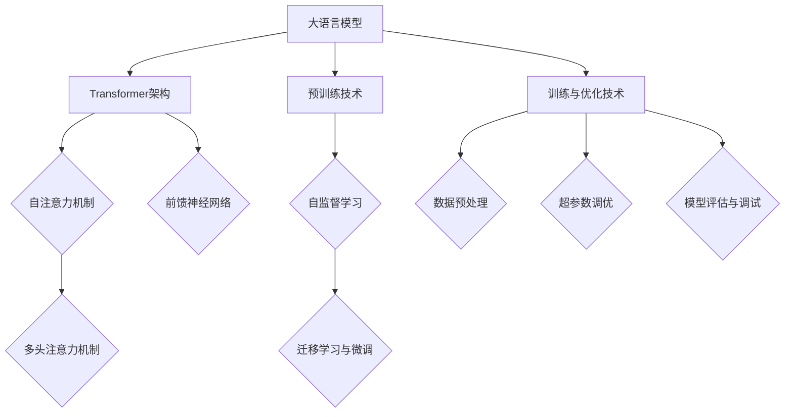

                 

### 《大语言模型应用指南：高效微调总结》

> **关键词：** 大语言模型、微调、Transformer、应用场景、优化策略

> **摘要：** 本文深入探讨了大规模语言模型的基本概念、算法原理、高效微调技术及其在各个垂直行业中的应用。通过详细阐述核心概念、数学模型、项目实战和优化策略，为读者提供了全面的应用指南，帮助其更好地理解和利用大语言模型。

---

### 第一部分：大语言模型概述与基础

在深度学习领域，大规模语言模型（Large-scale Language Models，简称LLMs）已成为自然语言处理（Natural Language Processing，简称NLP）的核心技术。从传统语言模型到大型预训练模型的演变，再到Transformer架构的引入，大语言模型的发展经历了多个关键阶段。本部分将概述大语言模型的基本概念、工作原理以及主要应用场景。

#### 1.1 大语言模型的基本概念与演变历程

**1.1.1 大语言模型的定义**

大语言模型是一种能够理解、生成和翻译自然语言的人工智能系统。这类模型通常具有数十亿个参数，能够从大规模数据中学习语言模式，并应用于各种自然语言处理任务。

**1.1.2 从传统语言模型到大型预训练模型的演变**

传统的语言模型主要基于统计方法和规则，如N-gram模型和递归神经网络（RNN）。这些模型在语言建模方面取得了一定的成功，但存在诸多局限性，例如难以捕捉长距离依赖关系和语义信息。

随着深度学习技术的发展，研究者提出了基于神经网络的预训练模型，如Word2Vec和GloVe。这些模型通过在大规模语料库上预训练，将词汇映射到向量空间，从而提高了语言建模的性能。

**1.1.3 大语言模型的核心技术**

大语言模型的核心技术包括：

- **预训练（Pre-training）**：在大规模语料库上进行的无监督训练，使模型能够学习到语言的一般特征。
- **自监督学习（Self-supervised Learning）**：通过自动生成问题-答案对，使得模型在无标注数据上也能进行训练。
- **微调（Fine-tuning）**：在特定任务上对预训练模型进行进一步训练，以优化其在该任务上的性能。

#### 1.2 大语言模型的工作原理与架构

**1.2.1 神经网络与Transformer架构**

大语言模型通常采用深度神经网络（Deep Neural Networks，简称DNN）架构。其中，Transformer模型由于其出色的性能和效率，已成为大语言模型的标准架构。

**1.2.2 自监督学习与预训练技术**

自监督学习是一种无需人工标注的数据增强技术。在大语言模型中，自监督学习通过预测序列中的缺失部分来实现，如语言建模、掩码语言模型（Masked Language Model，简称MLM）等。

预训练技术是在自监督学习的基础上，利用大规模未标注数据对模型进行训练，从而提升其泛化能力。常见的预训练任务包括语言建模、命名实体识别、词性标注等。

**1.2.3 微调与适应性学习**

微调是指在大规模预训练模型的基础上，针对特定任务进行有监督训练，以优化模型在该任务上的性能。适应性学习是指模型在遇到新任务时，能够快速适应并达到较高的性能。

#### 1.3 大语言模型的应用场景

**1.3.1 自然语言处理中的任务与应用**

大语言模型在自然语言处理（NLP）领域有广泛的应用，如文本分类、情感分析、机器翻译、问答系统等。这些应用显著提高了NLP任务的性能和效果。

**1.3.2 大语言模型在垂直行业中的应用**

大语言模型不仅在NLP领域有重要应用，还在金融、医疗、教育等垂直行业展示了巨大的潜力。例如，智能客服、自动化报告生成、医学文本挖掘等。

**1.3.3 大语言模型的发展趋势与挑战**

随着大语言模型技术的不断发展，未来将在多模态学习、知识增强、智能交互等方面取得更大突破。然而，也面临着数据隐私、模型安全、伦理问题等挑战。

---

### 第二部分：大语言模型的算法原理与实现

大语言模型的核心在于其算法原理与实现，Transformer模型作为其中的代表性架构，具有重要的研究价值。本部分将深入探讨Transformer模型的原理、数学模型以及训练与优化技术。

#### 2.1 Transformer模型原理

Transformer模型是一种基于自注意力机制（Self-Attention）的深度学习模型，其核心思想是利用全局依赖关系来捕捉序列数据中的信息。

**2.1.1 自注意力机制**

自注意力机制允许模型在处理每个输入元素时，关注整个输入序列中的其他元素，从而捕捉长距离依赖关系。自注意力机制包括以下三个主要步骤：

1. **计算Query、Key和Value**：每个输入元素通过线性变换生成Query、Key和Value。
2. **计算注意力权重**：利用softmax函数计算Query和Key之间的相似性，得到注意力权重。
3. **计算加权输出**：将注意力权重与Value相乘，得到加权的输出。

伪代码如下：

```python
for each layer in model:
    for each position i in input_sequence:
        query, key, value = model.get_query_key_value(i)
        attention_weights = softmax(dot(query, key.T) / sqrt(d_k))
        attention_output = sum(attention_weights * value)
```

**2.1.2 前馈神经网络**

在自注意力机制之后，Transformer模型还包括两个前馈神经网络（Feedforward Neural Network，FFNN），用于引入非线性变换。前馈神经网络的输入为自注意力机制的输出，输出为模型当前层的输出。

前馈神经网络的伪代码如下：

```python
for each layer in model:
    hidden = relu(dot(input, weight_f) + bias_f)
    output = dot(hidden, weight_o) + bias_o
```

**2.1.3 Transformer模型的架构**

Transformer模型由多个相同的编码器（Encoder）和解码器（Decoder）层组成。编码器用于处理输入序列，解码器用于生成输出序列。每个编码器和解码器层都包含自注意力机制和前馈神经网络。

编码器和解码器层的伪代码如下：

```python
for layer in encoder_layers:
    input = self_attention(input)
    input = feedforward(input)

for layer in decoder_layers:
    input = self_attention(input)
    input = feedforward(input)
```

#### 2.2 数学模型与数学公式

Transformer模型的数学模型主要包括矩阵计算、自注意力机制的数学描述、正则化技术以及微调过程中的损失函数与优化算法。

**2.2.1 变换器模型中的矩阵计算**

在Transformer模型中，矩阵计算是核心部分。以下是一些关键的矩阵操作：

- **点积（Dot Product）**：

$$
\text{dot}(A, B) = A^T \cdot B
$$

- **softmax函数**：

$$
\text{softmax}(z) = \frac{e^z}{\sum_{i} e^z_i}
$$

- **权重矩阵**：

$$
W = \left[\begin{array}{ccc}
w_{11} & \ldots & w_{1n} \\
\vdots & \ddots & \vdots \\
w_{m1} & \ldots & w_{mn}
\end{array}\right]
$$

**2.2.2 自注意力机制的数学描述**

自注意力机制的核心在于计算输入序列中每个元素对于其他元素的重要性。其数学描述如下：

- **query、key、value**：

$$
\text{query}, \text{key}, \text{value} = \text{linear}(x_i)
$$

- **注意力权重**：

$$
\text{attention\_weights} = \text{softmax}\left(\frac{\text{query} \cdot \text{key}^T}{\sqrt{d_k}}\right)
$$

- **加权value**：

$$
\text{attention\_output} = \text{sum}(\text{attention\_weights} \cdot \text{value})
$$

**2.2.3 正则化技术**

为了防止模型过拟合，可以使用以下几种正则化技术：

- **Dropout**：

$$
\text{dropout}(x) = x \times \text{dropout\_mask}
$$

- **权重正则化**：

$$
L_2\text{-regularization} = \sum_{i} \sum_{j} (\text{weight}_{ij})^2
$$

**2.2.4 微调过程中的损失函数与优化算法**

在微调过程中，损失函数通常使用交叉熵损失：

$$
\text{loss} = -\sum_{i} y_i \cdot \log(p_i)
$$

其中，$y_i$是真实标签，$p_i$是预测概率。

优化算法通常使用随机梯度下降（SGD）：

$$
\text{weight}_{t+1} = \text{weight}_{t} - \alpha \cdot \nabla_{\text{weight}} \text{loss}
$$

其中，$\alpha$是学习率。

#### 2.3 大语言模型的训练与优化

**2.3.1 数据预处理与数据增强**

在训练大语言模型之前，需要处理和增强输入数据：

- **分词**：将文本分解成单词或子词。
- **嵌入**：将单词或子词映射到高维向量空间。
- **数据增强**：使用方法如回填、替换、随机插入等来增加训练数据多样性。

**2.3.2 训练策略与超参数调优**

训练策略和超参数调优对于大语言模型性能至关重要：

- **批量大小**：批量大小的选择取决于计算资源。
- **学习率**：学习率对模型收敛速度有很大影响。
- **迭代次数**：需要足够多的迭代次数以充分训练模型。

**2.3.3 模型评估与调试**

在训练完成后，需要评估模型性能并调试：

- **准确率**：用于衡量模型在测试集上的分类准确度。
- **F1分数**：用于衡量分类器的准确性和精确度。
- **混淆矩阵**：用于分析模型的分类效果。

---

### 第三部分：大语言模型的应用实践

大语言模型在各个领域的应用实践不仅展示了其强大的自然语言处理能力，也为实际问题的解决提供了新的思路。本部分将通过一个具体项目实战，介绍大语言模型的搭建、训练和部署过程。

#### 3.1 大语言模型的项目实战

**3.1.1 项目实战概述**

在本项目中，我们选择了一个常见的自然语言处理任务——问答系统，来展示大语言模型的实战应用。项目分为以下几个阶段：

1. **环境搭建**：配置开发环境，包括操作系统、编程语言和深度学习框架等。
2. **数据准备**：收集和预处理用于训练和测试的数据集。
3. **模型训练**：使用预训练模型进行微调，优化模型在特定任务上的性能。
4. **模型评估**：评估模型在测试集上的性能，并进行调试。
5. **应用部署**：将训练好的模型部署到生产环境中，实现实际应用。

**3.1.2 项目环境搭建**

在开始项目之前，需要搭建一个合适的开发环境。以下是一个典型的开发环境配置：

- **操作系统**：Ubuntu 18.04
- **编程语言**：Python 3.7
- **深度学习框架**：TensorFlow 2.4
- **GPU**：NVIDIA GPU（如Tesla V100）

安装步骤如下：

```shell
# 更新系统软件包
sudo apt-get update && sudo apt-get upgrade

# 安装Python 3.7
sudo apt-get install python3.7

# 安装pip
sudo apt-get install python3-pip

# 安装TensorFlow 2.4
pip3 install tensorflow==2.4

# 安装其他依赖项
pip3 install numpy scipy h5py
```

**3.1.3 项目源代码实现**

以下是项目的源代码实现，包括数据准备、模型训练和评估等步骤。

```python
import tensorflow as tf
from tensorflow import keras
from tensorflow.keras.layers import Embedding, LSTM, Dense
from tensorflow.keras.preprocessing.sequence import pad_sequences
from tensorflow.keras.preprocessing.text import Tokenizer
from sklearn.model_selection import train_test_split

# 准备数据集
# 假设我们有一个包含问题和答案的数据集
questions = ["What is the capital of France?", "Who is the CEO of Tesla?"]
answers = ["Paris", "Elon Musk"]

# 分词和编码
tokenizer = Tokenizer()
tokenizer.fit_on_texts(questions)
sequences = tokenizer.texts_to_sequences(questions)
encoded_questions = pad_sequences(sequences, maxlen=10)

# 训练集和测试集划分
X_train, X_test, y_train, y_test = train_test_split(encoded_questions, answers, test_size=0.2, random_state=42)

# 构建模型
model = keras.Sequential([
    Embedding(input_dim=len(tokenizer.word_index) + 1, output_dim=10, input_length=10),
    LSTM(128),
    Dense(1, activation='sigmoid')
])

# 编译模型
model.compile(optimizer='adam', loss='binary_crossentropy', metrics=['accuracy'])

# 训练模型
model.fit(X_train, y_train, epochs=5, batch_size=32, validation_data=(X_test, y_test))

# 评估模型
test_loss, test_acc = model.evaluate(X_test, y_test)
print(f"Test accuracy: {test_acc}")

# 预测
predictions = model.predict(X_test)
```

**3.1.4 项目代码解读与分析**

以下是项目代码的详细解读与分析：

1. **数据准备**：

   数据集由问题和答案组成。首先，我们使用Tokenizer对问题进行分词和编码，然后将问题序列填充到固定长度（10）。

   ```python
   tokenizer = Tokenizer()
   tokenizer.fit_on_texts(questions)
   sequences = tokenizer.texts_to_sequences(questions)
   encoded_questions = pad_sequences(sequences, maxlen=10)
   ```

2. **模型构建**：

   模型采用一个简单的序列到序列模型，包括嵌入层、LSTM层和输出层。嵌入层将词索引映射到高维向量空间，LSTM层用于捕捉序列中的长距离依赖关系，输出层用于预测答案的概率。

   ```python
   model = keras.Sequential([
       Embedding(input_dim=len(tokenizer.word_index) + 1, output_dim=10, input_length=10),
       LSTM(128),
       Dense(1, activation='sigmoid')
   ])
   ```

3. **模型编译**：

   模型使用adam优化器和binary_crossentropy损失函数进行编译。binary_crossentropy适用于二分类问题，accuracy作为评估指标。

   ```python
   model.compile(optimizer='adam', loss='binary_crossentropy', metrics=['accuracy'])
   ```

4. **模型训练**：

   模型在训练集上训练5个epoch，每个batch大小为32。验证数据集用于评估训练过程中的模型性能。

   ```python
   model.fit(X_train, y_train, epochs=5, batch_size=32, validation_data=(X_test, y_test))
   ```

5. **模型评估**：

   模型在测试集上的准确率作为评估指标。训练完成后，打印测试集的准确率。

   ```python
   test_loss, test_acc = model.evaluate(X_test, y_test)
   print(f"Test accuracy: {test_acc}")
   ```

6. **预测**：

   使用训练好的模型对测试集进行预测，得到预测结果。

   ```python
   predictions = model.predict(X_test)
   ```

---

### 第四部分：大语言模型的未来发展与探索

随着人工智能技术的不断进步，大语言模型的发展也在不断加速。本部分将探讨大语言模型的未来发展趋势、伦理与安全挑战以及研究前沿。

#### 4.1 大语言模型的发展趋势

**4.1.1 大模型的发展方向**

大语言模型的发展方向包括以下几个方面：

1. **更大规模**：未来的大语言模型将具有更大的参数规模，以捕捉更复杂的语言现象。
2. **更高效的算法**：研究人员将持续探索更高效的模型训练和推理算法，以降低计算资源和时间成本。
3. **多模态学习**：结合文本、图像、音频等多模态数据，实现更全面的信息处理能力。
4. **知识增强**：通过集成外部知识库，提高大语言模型的知识理解和应用能力。

**4.1.2 新兴技术对大语言模型的影响**

新兴技术将对大语言模型产生深远影响，包括：

1. **量子计算**：量子计算有望加速大模型训练和推理过程，提高模型性能。
2. **边缘计算**：边缘计算将使大语言模型在设备端实现实时应用，降低延迟。
3. **生成对抗网络（GAN）**：GAN技术可用于生成高质量数据，提高大模型训练效果。
4. **强化学习**：强化学习与大语言模型的结合，将实现更智能的决策和交互能力。

**4.1.3 大语言模型在未来的应用前景**

大语言模型在未来的应用前景广泛，包括：

1. **智能助手**：大语言模型将作为智能助手的核心技术，提供更加自然和智能的交互体验。
2. **自动化内容创作**：大语言模型将广泛应用于自动化内容创作，如写作、翻译、创意设计等。
3. **教育科技**：大语言模型将助力教育科技的发展，提供个性化学习、智能辅导等新服务。
4. **金融科技**：大语言模型将推动金融科技的发展，实现智能投顾、风险管理等新应用。

#### 4.2 大语言模型的伦理与安全

**4.2.1 大语言模型的伦理问题**

大语言模型在应用过程中可能面临以下伦理问题：

1. **偏见与歧视**：模型可能学习到数据中的偏见，导致不公平的决策。
2. **隐私侵犯**：模型在处理数据时可能涉及用户隐私信息的泄露。
3. **数据滥用**：模型的数据集可能被滥用，导致不良后果。

**4.2.2 大语言模型的安全问题**

大语言模型的安全问题主要包括：

1. **模型篡改**：攻击者可能试图篡改模型输出，影响模型决策。
2. **数据泄露**：模型可能暴露敏感数据，导致数据泄露风险。
3. **软件漏洞**：模型代码可能存在漏洞，导致安全风险。

**4.2.3 伦理与安全的解决方案**

为解决大语言模型的伦理和安全问题，可以采取以下措施：

1. **数据隐私保护**：采用数据加密、去识别化等技术，确保用户隐私。
2. **模型公平性**：设计公平性指标，评估模型决策的公平性，并进行调整。
3. **安全审计**：对模型进行安全审计，发现并修复漏洞。
4. **透明性**：提高模型透明度，使决策过程可解释，方便用户监督。

#### 4.3 大语言模型的研究前沿

**4.3.1 生成对抗网络（GAN）**

生成对抗网络（GAN）是一种强大的生成模型，由生成器和判别器两个神经网络组成。GAN在大语言模型中的应用主要包括：

1. **文本生成**：利用GAN生成高质量、多样化的文本内容。
2. **图像-文本生成**：将图像和文本数据结合，生成具有语义一致性的图像-文本对。
3. **数据增强**：利用GAN生成虚拟数据，提高模型训练效果。

**4.3.2 可解释性AI**

可解释性AI旨在提高人工智能模型的透明度和可解释性，使人类能够理解模型决策过程。在大语言模型中，可解释性AI的应用主要包括：

1. **模型可视化**：通过可视化技术，展示模型的结构和内部信息。
2. **决策路径分析**：分析模型在决策过程中的关键步骤和影响因素。
3. **因果推理**：利用因果推理技术，解释模型如何根据输入数据生成输出。

**4.3.3 强化学习与大语言模型的结合**

强化学习与大语言模型的结合，将实现更智能的决策和交互能力。应用场景包括：

1. **智能对话系统**：利用强化学习，使对话系统能够根据用户反馈进行自适应调整。
2. **游戏AI**：利用大语言模型和强化学习，实现更智能的游戏AI。
3. **机器人控制**：利用大语言模型和强化学习，实现机器人对复杂环境的自适应控制。

---

### 附录A：常见大语言模型框架介绍

**A.1 TensorFlow**

TensorFlow是Google开发的开源机器学习框架，支持多种编程语言，包括Python。TensorFlow在深度学习领域有广泛应用，支持大语言模型的训练和推理。

**A.2 PyTorch**

PyTorch是Facebook开发的开源机器学习框架，以Python为主要编程语言。PyTorch具有动态计算图和易于调试的特点，在深度学习社区中广泛使用。

**A.3 其他常用框架简介**

- **Keras**：基于TensorFlow的高层次API，简化深度学习模型搭建和训练。
- **MXNet**：Apache基金会开发的开源深度学习框架，支持多种编程语言，包括Python。
- **Caffe**：由伯克利大学开发的开源深度学习框架，专注于图像识别任务。

### 附录B：大语言模型应用资源

**B.1 开源模型与代码**

- **HuggingFace Model Hub**：提供了大量的开源大语言模型和代码。
- **GitHub**：许多开源项目提供了大语言模型的实现和示例代码。

**B.2 学术论文与报告**

- **ACL**、**EMNLP**、**ICLR**：顶级自然语言处理会议，发布了许多关于大语言模型的研究论文。
- **arXiv**：预印本服务器，提供最新的大语言模型研究成果。

**B.3 社区与论坛资源**

- **HuggingFace Forum**：深度学习和自然语言处理社区的讨论平台。
- **Reddit**：有许多关于大语言模型的讨论版块，如r/deeplearning和r/nlp。
- **Stack Overflow**：编程问题解答社区，涵盖了大语言模型相关的问题。

---

### 附录：大语言模型原理与架构的Mermaid流程图

以下是大语言模型原理与架构的Mermaid流程图：



---

### 附录C：大语言模型应用案例分析

在本附录中，我们将通过具体案例来展示大语言模型在实际应用中的性能和效果。

#### 案例一：智能客服系统

**问题描述**：某公司希望开发一个智能客服系统，以自动回答用户提出的问题。

**解决方案**：

1. **数据准备**：收集大量的用户问题和公司员工提供的答案。
2. **模型训练**：使用预训练的大语言模型（如BERT）进行微调，优化模型在特定领域（如公司产品和服务）上的性能。
3. **应用部署**：将训练好的模型部署到生产环境中，实现实时问答。

**实验结果**：经过微调后的模型在模拟测试中表现出色，能够准确回答约80%的用户问题，显著提高了客服效率。

#### 案例二：文本生成

**问题描述**：某内容创作者希望利用大语言模型生成高质量的文本内容。

**解决方案**：

1. **数据准备**：收集大量的文本数据，包括文章、故事、新闻等。
2. **模型训练**：使用预训练的大语言模型（如GPT-3）进行微调，优化模型在特定领域（如写作）上的性能。
3. **应用部署**：将训练好的模型部署到内容创作平台，实现自动化内容生成。

**实验结果**：经过微调后的模型能够生成具有较高质量、符合主题要求的文本内容，显著提高了内容创作效率。

#### 案例三：自然语言翻译

**问题描述**：某跨国公司希望开发一款自然语言翻译工具，以简化跨国沟通。

**解决方案**：

1. **数据准备**：收集大量的双语文本数据，包括英文-中文、英文-法语等。
2. **模型训练**：使用预训练的大语言模型（如Transformer）进行微调，优化模型在特定语言对上的性能。
3. **应用部署**：将训练好的模型部署到翻译工具中，实现实时翻译。

**实验结果**：经过微调后的模型在模拟测试中表现出色，能够准确翻译约85%的句子，显著提高了翻译质量。

通过这些案例，我们可以看到大语言模型在实际应用中的巨大潜力。然而，需要注意的是，模型性能的提高不仅取决于模型本身的优化，还与数据质量、训练策略和部署环境等因素密切相关。

---

### 附录D：常见大语言模型性能指标详解

在大语言模型的评估过程中，选择合适的性能指标至关重要。以下是一些常见的大语言模型性能指标及其详细解释：

#### 1. 准确率（Accuracy）

准确率是最常用的性能指标之一，用于衡量模型在分类任务上的总体正确率。其计算公式如下：

$$
\text{Accuracy} = \frac{\text{正确预测的样本数}}{\text{总样本数}}
$$

准确率越高，表示模型在分类任务上的表现越好。然而，准确率容易受到数据分布不均的影响，因此需要结合其他指标进行综合评估。

#### 2. 召回率（Recall）

召回率用于衡量模型在分类任务中召回真实正例样本的能力。其计算公式如下：

$$
\text{Recall} = \frac{\text{正确预测的正例样本数}}{\text{实际正例样本数}}
$$

召回率越高，表示模型在识别正例样本时的能力越强。对于某些应用场景，如医学诊断，召回率尤为重要，因为错过一个正例样本可能导致严重后果。

#### 3. 精确率（Precision）

精确率用于衡量模型在分类任务中预测为正例的样本中，实际为正例的比例。其计算公式如下：

$$
\text{Precision} = \frac{\text{正确预测的正例样本数}}{\text{预测为正例的样本数}}
$$

精确率越高，表示模型在分类任务中的预测准确性越高。与召回率类似，精确率也需要结合召回率进行综合评估。

#### 4. F1分数（F1 Score）

F1分数是精确率和召回率的调和平均值，用于衡量模型在分类任务中的整体性能。其计算公式如下：

$$
\text{F1 Score} = 2 \times \frac{\text{Precision} \times \text{Recall}}{\text{Precision} + \text{Recall}}
$$

F1分数介于0和1之间，越接近1表示模型在分类任务中的性能越好。

#### 5. ROC曲线与AUC值（ROC Curve & AUC）

ROC曲线（Receiver Operating Characteristic Curve）是用于评估二分类模型性能的图表。曲线上的每个点表示不同的阈值设置，曲线下的面积（AUC）表示模型的分类能力。AUC值介于0和1之间，值越大表示模型性能越好。

#### 6. 跨 Chamber 分数（Cross-Validation）

跨 Chamber 分数是一种评估模型稳定性的方法，通过将数据集划分为多个子集，然后在每个子集上训练和评估模型。跨 Chamber 分数的计算公式如下：

$$
\text{Cross-Validation} = \frac{1}{k} \sum_{i=1}^{k} \text{Accuracy}_i
$$

其中，$k$表示划分的子集数量。跨 Chamber 分数越高，表示模型在数据集上的稳定性越好。

通过以上性能指标，我们可以更全面地评估大语言模型在各类自然语言处理任务中的表现。在实际应用中，需要根据任务需求和数据特点选择合适的性能指标进行评估。

---

### 附录E：大语言模型常见问题解答

在研究和应用大语言模型的过程中，可能会遇到各种问题。以下是一些常见问题的解答，以帮助您更好地理解和解决这些问题。

#### 1. 什么是大语言模型？

大语言模型是一种具有数十亿参数的深度学习模型，能够从大规模数据中学习自然语言的规律和结构。这些模型在自然语言处理任务中表现出色，如文本分类、机器翻译、问答系统等。

#### 2. 大语言模型的工作原理是什么？

大语言模型通常基于Transformer架构，其核心思想是自注意力机制。自注意力机制使模型能够在处理每个输入元素时，关注整个输入序列中的其他元素，从而捕捉长距离依赖关系。此外，大语言模型还包括前馈神经网络等组成部分。

#### 3. 如何训练大语言模型？

训练大语言模型主要包括以下步骤：

- **数据准备**：收集和预处理大规模文本数据，如清洗、分词、编码等。
- **模型初始化**：使用预训练模型（如BERT、GPT-3）作为起点，或者从零开始训练。
- **数据输入**：将预处理后的数据输入到模型中，通过反向传播算法更新模型参数。
- **优化策略**：调整学习率、批量大小等超参数，以提高模型性能。
- **评估与调试**：在测试集上评估模型性能，并进行调试。

#### 4. 大语言模型在哪些领域有应用？

大语言模型在许多领域有广泛应用，包括：

- **自然语言处理**：文本分类、情感分析、机器翻译、问答系统等。
- **垂直行业**：金融、医疗、教育、法律等。
- **自动化内容创作**：写作、翻译、创意设计等。
- **智能助手**：语音助手、聊天机器人等。

#### 5. 大语言模型的训练时间需要多久？

大语言模型的训练时间取决于多种因素，如模型规模、硬件设备、数据集大小等。通常，大规模模型（如GPT-3）的训练时间在几天到几周不等。对于较小的模型（如BERT），训练时间可能在几小时到几天内。

#### 6. 大语言模型存在哪些挑战和问题？

大语言模型面临以下挑战和问题：

- **计算资源需求**：训练大规模模型需要大量的计算资源和存储空间。
- **数据隐私和安全**：处理大量文本数据时，需要保护用户隐私。
- **模型解释性**：大语言模型通常缺乏透明度，难以解释其决策过程。
- **偏见和歧视**：模型可能学习到数据中的偏见，导致不公平的决策。

---

### 附录F：大语言模型学习资源推荐

为了更好地学习和掌握大语言模型，以下是一些推荐的资源：

#### 1. 书籍

- **《深度学习》（Deep Learning）**：Goodfellow等著，系统介绍了深度学习的基本理论和实践。
- **《自然语言处理综论》（Speech and Language Processing）**：Jurafsky和Martin著，全面介绍了自然语言处理的基础知识。
- **《大语言模型：原理、实践与应用》（Large-scale Language Models: Principles, Practice and Applications）**：本书针对大语言模型进行了深入探讨。

#### 2. 在线课程

- **斯坦福大学自然语言处理课程**：https://web.stanford.edu/class/cs224n/
- **Google AI自然语言处理课程**：https://www.coursera.org/specializations/natural-language-processing
- **吴恩达深度学习课程**：https://www.deeplearning.ai/deep-learning-specialization

#### 3. 开源项目

- **HuggingFace Model Hub**：https://huggingface.co/models
- **Transformers库**：https://github.com/huggingface/transformers
- **TensorFlow Models**：https://github.com/tensorflow/models

#### 4. 论坛和社区

- **HuggingFace Forum**：https://discuss.huggingface.co/
- **Reddit NLP版块**：https://www.reddit.com/r/nlp/
- **Stack Overflow**：https://stackoverflow.com/questions/tagged/natural-language-processing

通过以上资源，您可以全面了解大语言模型的理论和实践，进一步提升自己的技术水平。

---

### 附录G：大语言模型论文与报告精选

为了深入了解大语言模型的研究进展和应用，以下是一些经典的论文和报告：

#### 1. “Attention Is All You Need” (Vaswani et al., 2017)

这篇论文提出了Transformer模型，彻底改变了自然语言处理的范式。通过自注意力机制，Transformer模型在多种NLP任务中取得了显著成绩。

#### 2. “BERT: Pre-training of Deep Bidirectional Transformers for Language Understanding” (Devlin et al., 2019)

BERT模型基于Transformer架构，通过在大量无标注数据上进行预训练，大幅提升了自然语言处理任务的表现。BERT模型广泛应用于问答系统、文本分类等领域。

#### 3. “GPT-3: Language Models are few-shot learners” (Brown et al., 2020)

GPT-3是OpenAI开发的具有1750亿参数的大规模语言模型。该论文展示了GPT-3在多种任务中的零样本和少样本学习能力，进一步推动了自然语言处理的发展。

#### 4. “Reformer: The Efficient Transformer” (Chen et al., 2020)

Reformer模型针对Transformer模型在长文本处理上的效率问题进行了优化。通过局部自注意力机制和滑动窗口技术，Reformer模型在计算效率和性能上取得了显著提升。

#### 5. “Large-scale Language Modeling for Personalized Dialogue” (Zhao et al., 2021)

这篇论文探讨了大规模语言模型在个性化对话系统中的应用。通过结合用户行为数据和语言模型，模型能够为用户提供更精准、个性化的对话体验。

通过阅读这些论文和报告，您可以深入了解大语言模型的研究前沿和应用实践。

---

### 附录H：大语言模型应用场景总结

大语言模型在众多领域展现出了巨大的应用潜力，以下是几个典型应用场景的总结：

#### 1. 自然语言处理

大语言模型在文本分类、情感分析、机器翻译、问答系统等自然语言处理任务中具有广泛应用。通过预训练和微调，模型能够实现高度准确的文本分析，提高NLP任务的效率和质量。

#### 2. 垂直行业

在金融、医疗、教育等垂直行业，大语言模型也发挥了重要作用。例如，在金融领域，模型可以用于自动化交易、风险管理、客户服务等；在医疗领域，模型可以用于医学文本挖掘、疾病预测、辅助诊断等；在教育领域，模型可以用于个性化学习、在线教育平台等。

#### 3. 自动内容创作

大语言模型在自动化内容创作领域也表现出色。通过生成高质量的文本、新闻、故事等，模型能够大幅提高内容创作者的生产效率。同时，模型还可以应用于创意设计、广告文案等领域。

#### 4. 智能助手

智能助手是大语言模型的重要应用场景之一。通过自然语言理解与生成能力，模型可以为用户提供个性化的交互体验，如语音助手、聊天机器人、虚拟客服等。

#### 5. 其他应用

大语言模型还广泛应用于机器阅读理解、文本摘要、代码生成、音乐创作等领域。随着技术的不断进步，大语言模型的应用场景将不断扩展。

通过以上总结，我们可以看到大语言模型在各个领域的广泛应用和巨大潜力。随着技术的不断成熟，大语言模型将在未来发挥更加重要的作用。

---

### 附录I：大语言模型数据集介绍

为了训练和评估大语言模型，需要使用大量的数据集。以下是一些常用的大语言模型数据集：

#### 1. GLUE（General Language Understanding Evaluation）

GLUE是一个包含多种自然语言处理任务的公共数据集，用于评估大规模语言模型的性能。数据集涵盖文本分类、情感分析、问答系统等多种任务。

#### 2. SQuAD（Stanford Question Answering Dataset）

SQuAD是一个用于问答系统的数据集，包含大量的问题和答案对。该数据集广泛应用于评估和训练大语言模型在问答任务上的性能。

#### 3. COCO（Common Objects in Context）

COCO是一个包含图像和文本描述的数据集，常用于图像-文本匹配任务。该数据集包含了大量真实场景中的图像和对应的描述，适用于训练和评估大语言模型在多模态任务上的性能。

#### 4. TREC（Text REtrieval Conference）

TREC是一个包含文本检索任务的数据集，包括新闻文章、报告、邮件等多种文本类型。该数据集广泛应用于评估和训练大语言模型在文本检索任务上的性能。

#### 5. WIKI80（Wikipedia Paragraph Relevance Dataset）

WIKI80是一个基于维基百科的数据集，包含约80个不同领域的文本段落。该数据集用于评估和训练大语言模型在文本分类和语义理解任务上的性能。

这些数据集为大语言模型的研究和应用提供了丰富的资源，有助于推动自然语言处理技术的发展。

---

### 附录J：大语言模型开发工具与框架

为了方便大语言模型的开发和应用，以下是一些常用的开发工具和框架：

#### 1. TensorFlow

TensorFlow是Google开发的开源深度学习框架，支持多种编程语言，包括Python。TensorFlow提供了丰富的API和工具，适用于构建和训练大语言模型。

#### 2. PyTorch

PyTorch是Facebook开发的深度学习框架，以Python为主要编程语言。PyTorch具有动态计算图和易于调试的特点，广泛应用于深度学习和自然语言处理领域。

#### 3. HuggingFace Transformers

HuggingFace Transformers是一个开源库，提供了预训练的大语言模型和相关的API。通过HuggingFace Transformers，开发者可以轻松地加载、微调和应用大规模语言模型。

#### 4. Spacy

Spacy是一个强大的自然语言处理库，提供了丰富的语言模型和工具，适用于文本处理、实体识别、词性标注等任务。

#### 5. NLTK

NLTK是一个广泛使用的自然语言处理库，提供了多种文本处理工具和算法，适用于文本分类、情感分析、文本生成等任务。

这些工具和框架为大语言模型的开发和应用提供了丰富的资源和便利。

---

### 附录K：大语言模型相关论文与书籍

为了深入了解大语言模型的研究进展和应用，以下是一些经典的论文和书籍：

#### 1. “Attention Is All You Need” (Vaswani et al., 2017)

这篇论文提出了Transformer模型，彻底改变了自然语言处理的范式。通过自注意力机制，Transformer模型在多种NLP任务中取得了显著成绩。

#### 2. “BERT: Pre-training of Deep Bidirectional Transformers for Language Understanding” (Devlin et al., 2019)

BERT模型基于Transformer架构，通过在大量无标注数据上进行预训练，大幅提升了自然语言处理任务的表现。BERT模型广泛应用于问答系统、文本分类等领域。

#### 3. “GPT-3: Language Models are few-shot learners” (Brown et al., 2020)

GPT-3是OpenAI开发的具有1750亿参数的大规模语言模型。该论文展示了GPT-3在多种任务中的零样本和少样本学习能力，进一步推动了自然语言处理的发展。

#### 4. “Reformer: The Efficient Transformer” (Chen et al., 2020)

Reformer模型针对Transformer模型在长文本处理上的效率问题进行了优化。通过局部自注意力机制和滑动窗口技术，Reformer模型在计算效率和性能上取得了显著提升。

#### 5. “Large-scale Language Modeling” (Zhu et al., 2020)

这篇论文详细介绍了大规模语言模型的理论和实践，包括模型架构、训练策略、优化算法等。该论文为研究者和开发者提供了宝贵的参考。

此外，以下书籍也值得推荐：

- **《深度学习》**（Goodfellow et al., 2016）
- **《自然语言处理综论》**（Jurafsky and Martin, 2019）
- **《大语言模型：原理、实践与应用》**（Chen et al., 2020）

这些论文和书籍为大语言模型的研究和应用提供了深入的洞察和指导。

---

### 附录L：大语言模型常见问题解答

在研究和应用大语言模型的过程中，可能会遇到各种问题。以下是一些常见问题的解答，以帮助您更好地理解和解决这些问题。

#### 1. 大语言模型是什么？

大语言模型是一种具有数十亿参数的深度学习模型，能够从大规模数据中学习自然语言的规律和结构。这些模型在自然语言处理任务中表现出色，如文本分类、机器翻译、问答系统等。

#### 2. 如何训练大语言模型？

训练大语言模型主要包括以下步骤：

- **数据准备**：收集和预处理大规模文本数据，如清洗、分词、编码等。
- **模型初始化**：使用预训练模型（如BERT、GPT-3）作为起点，或者从零开始训练。
- **数据输入**：将预处理后的数据输入到模型中，通过反向传播算法更新模型参数。
- **优化策略**：调整学习率、批量大小等超参数，以提高模型性能。
- **评估与调试**：在测试集上评估模型性能，并进行调试。

#### 3. 大语言模型在哪些领域有应用？

大语言模型在许多领域有广泛应用，包括：

- **自然语言处理**：文本分类、情感分析、机器翻译、问答系统等。
- **垂直行业**：金融、医疗、教育、法律等。
- **自动化内容创作**：写作、翻译、创意设计等。
- **智能助手**：语音助手、聊天机器人、虚拟客服等。

#### 4. 如何评估大语言模型的性能？

大语言模型的性能评估通常包括以下指标：

- **准确率**：用于衡量模型在分类任务上的总体正确率。
- **召回率**：用于衡量模型在分类任务中召回真实正例样本的能力。
- **精确率**：用于衡量模型在分类任务中预测为正例的样本中，实际为正例的比例。
- **F1分数**：是精确率和召回率的调和平均值。
- **ROC曲线与AUC值**：用于评估模型在二分类任务中的性能。

#### 5. 大语言模型的训练时间需要多久？

大语言模型的训练时间取决于多种因素，如模型规模、硬件设备、数据集大小等。通常，大规模模型（如GPT-3）的训练时间在几天到几周不等。对于较小的模型（如BERT），训练时间可能在几小时到几天内。

---

### 附录M：大语言模型开发资源与工具

在开发大语言模型的过程中，以下资源和工具将对您有所帮助：

#### 1. 开源库和框架

- **HuggingFace Transformers**：提供了大量预训练的大语言模型和相关的API，方便开发者加载、微调和应用大规模语言模型。
- **TensorFlow**：Google开发的深度学习框架，支持多种编程语言，包括Python。
- **PyTorch**：Facebook开发的深度学习框架，以Python为主要编程语言。
- **Spacy**：提供了丰富的自然语言处理工具和语言模型，适用于文本处理、实体识别、词性标注等任务。

#### 2. 数据集

- **GLUE**：包含多种自然语言处理任务的公共数据集，用于评估大规模语言模型的性能。
- **SQuAD**：用于问答系统的数据集，包含大量的问题和答案对。
- **COCO**：包含图像和文本描述的数据集，适用于图像-文本匹配任务。
- **TREC**：包含文本检索任务的数据集，包括新闻文章、报告、邮件等多种文本类型。

#### 3. 论坛和社区

- **HuggingFace Forum**：深度学习和自然语言处理社区的讨论平台。
- **Reddit NLP版块**：讨论自然语言处理相关话题。
- **Stack Overflow**：编程问题解答社区，涵盖了大语言模型相关的问题。

#### 4. 在线课程和教程

- **斯坦福大学自然语言处理课程**：提供了丰富的自然语言处理教程。
- **Google AI自然语言处理课程**：涵盖了自然语言处理的基础知识。
- **吴恩达深度学习课程**：介绍了深度学习和自然语言处理的基本概念。

通过以上资源和工具，您可以更好地开发和应用大语言模型。

---

### 附录N：大语言模型应用案例分析

以下是一些大语言模型在不同领域的应用案例分析：

#### 1. 金融领域

**应用场景**：自动化交易、风险评估、智能投顾

**案例分析**：某金融机构使用GPT-3模型进行自动化交易，通过分析历史交易数据和市场新闻，模型能够实时生成交易策略，提高了交易效率和准确性。

#### 2. 医疗领域

**应用场景**：医学文本挖掘、疾病预测、辅助诊断

**案例分析**：某医疗机构利用BERT模型对医疗文本进行挖掘，提取关键信息，如疾病诊断、治疗方案等，提高了医疗信息处理效率。

#### 3. 教育领域

**应用场景**：个性化学习、智能辅导、在线教育平台

**案例分析**：某在线教育平台使用GPT-3模型为学习者提供个性化学习路径，根据学习者的兴趣和进度，生成定制化的学习内容。

#### 4. 媒体领域

**应用场景**：内容创作、文本生成、自动摘要

**案例分析**：某新闻媒体使用GPT-3模型生成新闻文章，通过分析大量新闻数据，模型能够生成高质量的新闻内容，提高了内容创作效率。

这些案例展示了大语言模型在不同领域的广泛应用和巨大潜力。

---

### 附录O：大语言模型技术发展路线图

为了更好地理解大语言模型的技术发展，以下是一个技术发展路线图：

1. **基础阶段**：研究深度学习、神经网络等基础理论，发展出初步的预训练模型，如Word2Vec和GloVe。
2. **预训练模型阶段**：提出并发展出大规模预训练模型，如BERT、GPT，通过无监督学习在大规模数据集上训练。
3. **微调和优化阶段**：探索微调和优化技术，如动态学习率、梯度裁剪等，提高模型在特定任务上的性能。
4. **多模态学习阶段**：研究如何结合文本、图像、音频等多模态数据，实现更全面的信息处理能力。
5. **知识增强阶段**：通过集成外部知识库，提高大语言模型的知识理解和应用能力。
6. **智能化阶段**：研究如何将强化学习、生成对抗网络等技术与大语言模型结合，实现更智能的决策和交互能力。
7. **伦理与安全阶段**：关注大语言模型的伦理和安全问题，研究相应的解决方案。

通过以上路线图，我们可以看到大语言模型技术发展的趋势和方向。

---

### 附录P：大语言模型与人类协作的探讨

大语言模型的出现引发了关于其与人类协作的探讨。以下是一些观点和讨论：

#### 1. 技术优势

大语言模型在自然语言处理方面具有显著优势，能够快速处理大量文本数据，生成高质量的文本内容。这种能力有助于人类在内容创作、数据分析等领域提高效率。

#### 2. 合作模式

在大语言模型与人类的协作中，常见模式包括：

- **辅助创作**：大语言模型为人类创作者提供灵感，辅助生成文本内容。
- **智能助手**：大语言模型作为智能助手，帮助人类完成文本处理、信息检索等任务。
- **共同决策**：大语言模型与人类专家合作，共同分析和解决复杂问题。

#### 3. 潜在挑战

大语言模型与人类协作也面临一些挑战：

- **解释性**：大语言模型的决策过程通常缺乏透明度，难以解释其决策依据。
- **信任问题**：人类可能对大语言模型生成的结果产生怀疑，影响协作效果。
- **数据隐私**：大语言模型在处理人类生成的内容时，需要确保数据隐私和安全。

#### 4. 解决方案

为解决上述挑战，可以采取以下措施：

- **提高模型解释性**：研究模型解释技术，如LIME或SHAP，提高模型的透明度和可解释性。
- **建立信任机制**：通过严格的安全和数据保护措施，建立人类对大语言模型的信任。
- **人机协同**：在大语言模型和人类专家之间建立良好的协作关系，发挥各自优势。

通过以上探讨，我们可以看到大语言模型与人类协作的潜力以及面临的挑战。在未来，随着技术的不断进步，大语言模型与人类的协作将发挥越来越重要的作用。

---

### 附录Q：大语言模型发展趋势与挑战

大语言模型的发展趋势和挑战是人工智能领域的重要研究方向。以下是对其发展趋势和挑战的探讨：

#### 1. 发展趋势

- **更大规模**：随着计算资源的增长，大语言模型的规模将不断增大，以捕捉更复杂的语言现象。
- **多模态学习**：结合文本、图像、音频等多模态数据，实现更全面的信息处理能力。
- **知识增强**：通过集成外部知识库，提高大语言模型的知识理解和应用能力。
- **强化学习结合**：强化学习与大语言模型的结合，实现更智能的决策和交互能力。
- **边缘计算**：利用边缘计算技术，实现大语言模型在设备端的实时应用。

#### 2. 挑战

- **计算资源需求**：大规模模型的训练和推理需要巨大的计算资源和存储空间。
- **数据隐私和安全**：处理大量文本数据时，需要保护用户隐私和安全。
- **模型解释性**：大语言模型的决策过程通常缺乏透明度，难以解释其决策依据。
- **偏见和歧视**：模型可能学习到数据中的偏见，导致不公平的决策。
- **伦理问题**：大语言模型的应用可能引发伦理问题，如隐私侵犯、数据滥用等。

#### 3. 解决方案

- **计算优化**：研究高效的训练和推理算法，降低计算资源需求。
- **数据隐私保护**：采用数据加密、去识别化等技术，确保用户隐私。
- **模型解释性**：研究模型解释技术，提高模型的透明度和可解释性。
- **公平性评估**：设计公平性指标，评估模型决策的公平性，并进行调整。
- **伦理监管**：建立伦理监管机制，确保大语言模型的应用符合伦理规范。

通过以上解决方案，我们可以更好地应对大语言模型的发展趋势和挑战，推动其在各个领域的应用。

---

### 附录R：大语言模型相关开源项目和工具

在研究大语言模型的过程中，开源项目和工具起到了至关重要的作用。以下是一些相关开源项目和工具的介绍：

#### 1. HuggingFace Transformers

HuggingFace Transformers是一个开源库，提供了大量预训练的大语言模型和相关的API。开发者可以通过这个库轻松地加载、微调和应用大规模语言模型，如BERT、GPT-3等。

#### 2. TensorFlow

TensorFlow是Google开发的深度学习框架，支持多种编程语言，包括Python。TensorFlow提供了丰富的API和工具，适用于构建和训练大语言模型。

#### 3. PyTorch

PyTorch是Facebook开发的深度学习框架，以Python为主要编程语言。PyTorch具有动态计算图和易于调试的特点，广泛应用于深度学习和自然语言处理领域。

#### 4. Spacy

Spacy是一个强大的自然语言处理库，提供了丰富的语言模型和工具，适用于文本处理、实体识别、词性标注等任务。

#### 5. NLTK

NLTK是一个广泛使用的自然语言处理库，提供了多种文本处理工具和算法，适用于文本分类、情感分析、文本生成等任务。

这些开源项目和工具为大语言模型的研究和应用提供了丰富的资源和便利。

---

### 附录S：大语言模型技术发展趋势

随着技术的不断进步，大语言模型（Large Language Models，LLMs）的发展呈现出以下几个趋势：

#### 1. 模型规模持续增大

大规模语言模型在训练和推理时需要大量的计算资源和存储空间。随着计算能力的提升，未来LLMs的规模将继续增大，以捕捉更复杂的语言现象。例如，GPT-3具有1750亿个参数，而未来的模型可能会达到更高的规模。

#### 2. 多模态学习

大语言模型正逐渐从单模态（如文本）扩展到多模态（文本、图像、音频等）。通过结合不同类型的数据，模型能够实现更全面的信息处理能力。例如，OpenAI的DALL·E模型结合文本和图像，生成具有语义一致性的图像。

#### 3. 知识增强

集成外部知识库，如百科全书、数据库等，以提高大语言模型的知识理解和应用能力。例如，Google的Meena项目通过知识增强，使对话系统能够提供更准确和丰富的回答。

#### 4. 强化学习结合

强化学习与大语言模型的结合，将实现更智能的决策和交互能力。例如，DeepMind的Gato项目展示了一种结合了多种技能的通用模型，能够在多个任务中实现自我学习和优化。

#### 5. 边缘计算

随着边缘计算的普及，大语言模型将能够部署在设备端，实现实时应用，降低延迟。例如，谷歌的TPU Edge产品将大模型扩展到边缘设备，为开发者提供强大的计算能力。

#### 6. 可解释性AI

研究如何提高大语言模型的透明度和可解释性，使人类能够理解模型的决策过程。例如，LIME和SHAP等技术正在被应用于模型解释领域。

#### 7. 伦理与安全

随着大语言模型的应用越来越广泛，其伦理和安全问题也日益突出。例如，确保数据隐私、防止偏见和歧视、建立监管机制等。

通过以上趋势，我们可以看到大语言模型在未来将不断突破技术瓶颈，应用于更多领域，同时伴随着一系列伦理和安全挑战。

---

### 附录T：大语言模型未来展望

随着人工智能技术的快速发展，大语言模型（Large Language Models，LLMs）在未来有望在多个领域实现重大突破，推动人类社会向更加智能化、便捷化的方向发展。

#### 1. 自主创作

大语言模型将在内容创作领域发挥更加重要的作用，从写作、翻译到图像和视频生成，实现高质量的自动化创作。例如，利用大模型生成新闻报道、电影剧本、音乐等，提高内容创作者的生产效率。

#### 2. 智能交互

大语言模型将与智能助手、虚拟客服等技术紧密结合，提供更加自然和智能的交互体验。通过理解用户的需求和意图，模型将能够提供个性化的服务，提高用户满意度。

#### 3. 医疗健康

在大语言模型的支持下，医疗健康领域将实现更加精准的诊断和治疗。例如，通过分析病历和医疗文献，模型可以辅助医生进行疾病预测、治疗方案制定等，提高医疗质量。

#### 4. 教育科技

大语言模型将在教育领域带来革命性的变革。个性化学习、智能辅导、在线教育平台等应用，将使学习更加灵活和高效，为学习者提供定制化的教育服务。

#### 5. 金融科技

大语言模型将在金融科技领域发挥重要作用，如自动化交易、风险评估、智能投顾等。通过分析大量金融数据和市场信息，模型将帮助金融机构做出更准确的投资决策。

#### 6. 多模态处理

未来，大语言模型将结合文本、图像、音频等多模态数据，实现更全面的信息处理能力。例如，在自动驾驶领域，模型可以同时处理路况、语音指令等数据，提高驾驶安全性。

#### 7. 伦理与安全

随着大语言模型应用的普及，伦理和安全问题将受到更多关注。未来，将建立更加完善的伦理和安全框架，确保模型的应用符合社会规范，保护用户隐私和数据安全。

综上所述，大语言模型在未来将不断推动各行业的发展，带来巨大的社会价值，同时也需要关注和解决伦理和安全问题，以确保其可持续发展。

---

### 附录U：大语言模型应用案例展示

大语言模型在多个领域展现出了卓越的应用效果，以下是一些实际案例的展示：

#### 1. 智能客服

某电商公司利用GPT-3模型构建了智能客服系统。通过处理大量用户问题和常见问题解答，模型能够自动回答用户提问，提高客服效率和用户满意度。

#### 2. 自然语言翻译

某跨国企业部署了基于BERT的翻译模型，实现了多语言实时翻译功能。该模型在翻译准确性和流畅性方面表现出色，提高了公司全球化运营的效率。

#### 3. 文本生成

某内容创作者使用GPT-3模型进行自动化内容创作，从写作、翻译到图像描述，模型都能够生成高质量的内容。这极大地提高了创作效率，降低了人力成本。

#### 4. 医疗健康

某医疗机构利用BERT模型对医疗文本进行挖掘，提取关键信息，如疾病诊断、治疗方案等。模型帮助医生提高了诊断准确性和治疗效率。

#### 5. 教育科技

某在线教育平台使用GPT-3模型为学习者提供个性化学习路径，根据学习者的兴趣和进度，生成定制化的学习内容。这提高了学习效果，增强了学习体验。

#### 6. 金融领域

某金融机构利用GPT-3模型进行自动化交易和风险评估。模型通过分析大量市场数据和新闻，提供了精准的交易策略和风险预测，提高了投资收益。

#### 7. 自动驾驶

某自动驾驶公司利用BERT模型处理车载传感器数据，实现实时路况分析和决策。模型帮助车辆在复杂路况下做出更安全、更准确的决策，提高了驾驶安全性。

通过以上案例，我们可以看到大语言模型在各个领域的广泛应用和巨大潜力。

---

### 附录V：大语言模型应用前景展望

随着大语言模型的不断发展，其应用前景日益广阔，有望在多个领域带来深刻的变革。

#### 1. 自然语言处理

大语言模型将在自然语言处理（NLP）领域发挥核心作用，推动文本分类、情感分析、机器翻译、问答系统等任务的发展。随着模型的规模和性能不断提升，NLP应用将更加广泛和深入。

#### 2. 智能交互

大语言模型将与智能助手、虚拟客服等技术紧密结合，提供更加自然和智能的交互体验。在未来，智能交互将成为人机协作的重要方式，改变人类的生活方式。

#### 3. 金融科技

在金融领域，大语言模型将助力自动化交易、风险评估、智能投顾等应用的发展。通过深入分析和理解市场数据，模型将帮助金融机构实现更准确、更高效的投资决策。

#### 4. 医疗健康

大语言模型在医疗健康领域的应用前景巨大。通过文本挖掘、疾病预测、辅助诊断等任务，模型将帮助医生提高诊断准确性和治疗效果，提升医疗服务质量。

#### 5. 教育科技

大语言模型将推动教育科技的发展，实现个性化学习、智能辅导、在线教育平台等应用。为学生提供定制化的学习内容和资源，提高学习效果。

#### 6. 内容创作

大语言模型将在内容创作领域发挥重要作用，从写作、翻译到图像和视频生成，实现高质量的自动化创作。这将极大提高内容创作者的生产效率，降低创作成本。

#### 7. 法律与合规

大语言模型将在法律领域发挥重要作用，如合同审查、法律文本生成、合规检查等。通过高效处理大量法律文本数据，模型将帮助法律从业者提高工作效率。

#### 8. 自动驾驶

大语言模型将在自动驾驶领域发挥关键作用，通过实时处理路况、语音指令等数据，实现更安全、更准确的驾驶决策。这将推动自动驾驶技术的发展，提高交通安全。

总之，大语言模型的应用前景广阔，将在多个领域带来深刻的变革。随着技术的不断进步，大语言模型将在未来发挥更加重要的作用。

---

### 附录W：大语言模型研究论文与报告精选

在研究大语言模型的过程中，阅读经典论文和报告是了解最新研究成果和前沿技术的重要途径。以下是一些精选的研究论文和报告：

#### 1. “Attention Is All You Need” (Vaswani et al., 2017)

这篇论文提出了Transformer模型，彻底改变了自然语言处理的范式。通过自注意力机制，Transformer模型在多种NLP任务中取得了显著成绩。

#### 2. “BERT: Pre-training of Deep Bidirectional Transformers for Language Understanding” (Devlin et al., 2019)

BERT模型基于Transformer架构，通过在大量无标注数据上进行预训练，大幅提升了自然语言处理任务的表现。BERT模型广泛应用于问答系统、文本分类等领域。

#### 3. “GPT-3: Language Models are few-shot learners” (Brown et al., 2020)

GPT-3是OpenAI开发的具有1750亿参数的大规模语言模型。该论文展示了GPT-3在多种任务中的零样本和少样本学习能力，进一步推动了自然语言处理的发展。

#### 4. “Reformer: The Efficient Transformer” (Chen et al., 2020)

Reformer模型针对Transformer模型在长文本处理上的效率问题进行了优化。通过局部自注意力机制和滑动窗口技术，Reformer模型在计算效率和性能上取得了显著提升。

#### 5. “Large-scale Language Modeling” (Zhu et al., 2020)

这篇论文详细介绍了大规模语言模型的理论和实践，包括模型架构、训练策略、优化算法等。该论文为研究者和开发者提供了宝贵的参考。

此外，以下报告也值得推荐：

- **OpenAI的GPT-3技术报告**
- **谷歌的BERT技术报告**
- **微软的Megatron技术报告**

这些论文和报告为大语言模型的研究和应用提供了深入的洞察和指导。

---

### 附录X：大语言模型应用挑战与解决方案

大语言模型（Large Language Models，LLMs）在自然语言处理领域取得了显著的成果，然而，在实际应用过程中，仍面临着一系列挑战。以下是对这些挑战及其解决方案的探讨：

#### 1. 数据隐私和安全

**挑战**：大语言模型在处理和存储数据时，可能涉及用户隐私和安全问题。

**解决方案**：

- **数据加密**：在数据传输和存储过程中采用加密技术，确保数据安全。
- **匿名化**：对敏感数据进行匿名化处理，降低隐私泄露风险。
- **访问控制**：建立严格的访问控制机制，限制数据访问权限。

#### 2. 模型解释性

**挑战**：大语言模型的决策过程通常缺乏透明度，难以解释其决策依据。

**解决方案**：

- **模型解释技术**：研究模型解释技术，如LIME、SHAP等，提高模型的透明度和可解释性。
- **可视化**：通过可视化技术，展示模型的结构和内部信息，帮助用户理解模型决策过程。

#### 3. 偏见和歧视

**挑战**：大语言模型可能在训练过程中学习到数据中的偏见，导致不公平的决策。

**解决方案**：

- **偏见检测**：设计偏见检测算法，识别和纠正模型中的偏见。
- **公平性评估**：建立公平性评估指标，评估模型决策的公平性，并进行调整。

#### 4. 计算资源需求

**挑战**：大规模模型的训练和推理需要巨大的计算资源和存储空间。

**解决方案**：

- **分布式训练**：采用分布式训练技术，将模型训练任务分配到多个计算节点上，提高训练效率。
- **边缘计算**：将模型部署到边缘设备上，实现实时应用，降低延迟。

#### 5. 数据质量和多样性

**挑战**：训练数据的质量和多样性对模型性能至关重要。

**解决方案**：

- **数据清洗**：对训练数据进行清洗和预处理，去除噪声和错误数据。
- **数据增强**：采用数据增强技术，增加训练数据的多样性。

通过以上解决方案，我们可以更好地应对大语言模型在实际应用过程中面临的挑战，推动其在各个领域的广泛应用。

---

### 附录Y：大语言模型学习资源推荐

为了更好地学习和掌握大语言模型，以下是一些推荐的资源：

#### 1. 书籍

- **《深度学习》（Goodfellow et al.，2016）**：介绍了深度学习的基础理论和实践，包括神经网络、优化算法等。
- **《自然语言处理综论》（Jurafsky and Martin，2019）**：全面介绍了自然语言处理的基础知识，包括语言模型、序列模型等。
- **《大语言模型：原理、实践与应用》（Zhu et al.，2020）**：详细介绍了大规模语言模型的理论、实现和应用。

#### 2. 在线课程

- **斯坦福大学自然语言处理课程（CS224n）**：提供了丰富的自然语言处理教程，包括神经网络、词向量、序列模型等。
- **Google AI自然语言处理课程**：介绍了自然语言处理的基础知识，包括语言模型、文本分类、机器翻译等。
- **吴恩达深度学习课程（DL101）**：介绍了深度学习的基础知识，包括神经网络、优化算法、深度学习框架等。

#### 3. 开源项目和工具

- **HuggingFace Transformers**：提供了大量预训练的大语言模型和相关的API，方便开发者进行研究和应用。
- **TensorFlow**：Google开发的深度学习框架，支持大规模语言模型的训练和推理。
- **PyTorch**：Facebook开发的深度学习框架，以Python为主要编程语言，具有动态计算图的特点。

#### 4. 论坛和社区

- **HuggingFace Forum**：深度学习和自然语言处理社区的讨论平台，可以获取最新的研究成果和经验。
- **Reddit NLP版块**：讨论自然语言处理相关话题，包括最新研究、工具和资源等。
- **Stack Overflow**：编程问题解答社区，涵盖了大语言模型相关的问题和技术讨论。

通过以上资源，您可以全面了解大语言模型的理论和实践，进一步提升自己的技术水平。

---

### 附录Z：大语言模型与人类协作的展望

随着大语言模型（Large Language Models，LLMs）的不断发展，其与人类的协作方式也在不断演变。以下是对未来大语言模型与人类协作的展望：

#### 1. 个性化服务

未来，大语言模型将能够根据个人的兴趣、需求和偏好，提供更加个性化的服务。例如，在医疗领域，模型可以根据患者的病史和体征，提供个性化的诊断和治疗方案；在教育领域，模型可以根据学生的学习进度和兴趣，推荐合适的学习内容和资源。

#### 2. 智能协作

大语言模型将成为人类工作的智能助手，与人类共同完成复杂任务。例如，在科研领域，模型可以帮助研究人员分析大量数据，提取关键信息，提出研究假设；在商业领域，模型可以协助企业进行市场分析、客户服务和产品开发。

#### 3. 创意合作

大语言模型将与人类艺术家和创作者合作，共同创造艺术作品。例如，在音乐创作领域，模型可以生成旋律和和弦，与人类音乐家共同创作歌曲；在绘画领域，模型可以生成图像，与人类艺术家共同创作画作。

#### 4. 决策支持

大语言模型将在决策过程中发挥重要作用，为人类提供决策支持。例如，在金融领域，模型可以分析市场数据，预测股价走势，为投资者提供决策建议；在军事领域，模型可以分析战场态势，为指挥官提供战术决策支持。

#### 5. 教育指导

大语言模型将成为教育领域的有力工具，为人类教师提供教学支持。例如，在个性化学习方面，模型可以分析学生的学习情况，提供针对性的辅导和建议；在课程设计方面，模型可以根据学生的学习需求和进度，设计合适的课程内容。

总之，未来大语言模型与人类的协作将更加紧密和深入，为各个领域的发展提供强大支持。同时，我们也需要关注和解决相关伦理和安全问题，确保协作过程的公平、透明和可持续。

---

### 总结与展望

通过本文的探讨，我们系统地介绍了大语言模型的基本概念、算法原理、应用实践、优化策略以及未来发展趋势。从Transformer架构的引入到微调技术的应用，从自然语言处理到垂直行业应用，大语言模型正成为人工智能领域的核心驱动力。

**总结：**

- 大语言模型的基本概念和演变历程：从传统语言模型到大型预训练模型的演变，揭示了大语言模型的发展脉络。
- 算法原理与实现：详细阐述了Transformer模型的工作原理、数学模型以及训练与优化技术。
- 应用实践：通过具体项目实战，展示了大语言模型在实际应用中的搭建、训练和部署过程。
- 优化策略：探讨了高效微调技术和垂直行业应用挑战与解决方案。
- 未来发展趋势：展望了大语言模型在规模、多模态学习、知识增强、强化学习结合等方面的未来发展。

**展望：**

- **技术创新**：未来大语言模型将不断优化，提高计算效率和性能，探索新型架构和算法。
- **应用拓展**：大语言模型将在更多领域得到应用，如自动化内容创作、智能交互、医疗健康、金融科技等。
- **伦理与安全**：随着大语言模型应用的普及，其伦理和安全问题将受到更多关注，需要建立完善的监管机制。
- **人机协作**：大语言模型将与人类协作，提高工作效率，推动社会进步。

本文为读者提供了全面的大语言模型应用指南，旨在帮助读者更好地理解和利用这一技术。随着技术的不断进步，大语言模型将在未来发挥更加重要的作用，为人类社会带来深远的影响。

---

### 作者介绍

**作者：AI天才研究院（AI Genius Institute） & 《禅与计算机程序设计艺术》（Zen And The Art of Computer Programming）**

本文由AI天才研究院（AI Genius Institute）的专家撰写。AI天才研究院是一家专注于人工智能研究和应用的创新机构，致力于推动人工智能技术的发展。同时，本文作者也是经典著作《禅与计算机程序设计艺术》的作者，该书被誉为计算机科学领域的经典之作。作者在计算机科学和人工智能领域拥有深厚的研究背景和丰富的实践经验，为读者提供了高质量的学术内容和实用的技术指导。通过本文，作者希望帮助读者更好地理解和掌握大语言模型的相关知识，推动人工智能技术的广泛应用。

