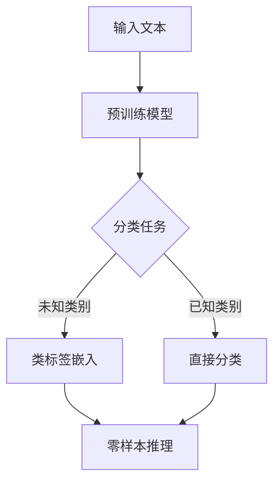

                 

### 《大语言模型的zero-shot学习原理与代码实例讲解》目录大纲

#### 目录大纲

- **第一部分：预备知识**
  - 第1章：大语言模型与zero-shot学习概述
  - 第2章：zero-shot学习的基本原理
  - 第3章：预备知识

- **第二部分：大语言模型原理与架构**
  - 第4章：大语言模型的核心概念与架构
  - 第5章：大语言模型的工作流程

- **第三部分：zero-shot学习的原理与方法**
  - 第6章：zero-shot学习的原理详解
  - 第7章：zero-shot学习的实战

- **第四部分：代码实例与实战**
  - 第8章：大语言模型搭建与训练
  - 第9章：zero-shot学习实践

- **第五部分：案例分析与应用**
  - 第10章：问答系统
  - 第11章：自然语言生成
  - 第12章：语言翻译

- **第六部分：未来展望**
  - 第13章：技术发展趋势
  - 第14章：应用前景

- **附录**
  - 附录A：工具与资源

---

现在，我们按照这个目录大纲来构建文章的内容。首先，我们定义文章的关键词和摘要。

---

#### 关键词

- 大语言模型
- Zero-shot学习
- 零样本学习
- Transformer模型
- NLP
- 机器学习
- 代码实例

#### 摘要

本文将深入探讨大语言模型的zero-shot学习原理，包括其基本概念、架构设计、关键技术和实战应用。通过详细的代码实例讲解，读者将了解如何搭建和训练大语言模型，以及如何实现zero-shot学习。此外，本文还将分析大语言模型的zero-shot学习在问答系统、自然语言生成和语言翻译等领域的应用案例，并展望其未来的发展趋势。

---

接下来，我们将按照大纲中的章节结构来逐步撰写文章的内容。

---

### 第一部分：预备知识

#### 第1章：大语言模型与zero-shot学习概述

在本章中，我们将介绍大语言模型和zero-shot学习的基本概念，帮助读者理解它们的核心意义和应用场景。

##### 1.1 大语言模型的起源与发展

**语言模型的定义与作用**

语言模型（Language Model，LM）是一种概率模型，它能够预测一段文本的下一个单词或词组。在自然语言处理（Natural Language Processing，NLP）领域，语言模型是许多任务的基础，如文本分类、机器翻译和自动摘要等。

**大语言模型的定义与发展历程**

大语言模型是指使用大量数据训练的、具有强大表示能力的语言模型。这类模型通常使用深度神经网络架构，如循环神经网络（RNN）、长短期记忆网络（LSTM）和变换器（Transformer）等。随着计算能力和数据量的不断提升，大语言模型在过去几年取得了显著进展，代表性模型包括GPT、BERT和T5等。

**zero-shot学习的概念**

zero-shot学习是一种机器学习范式，它允许模型在没有见过具体样本的情况下对未知类别进行分类。在大语言模型中，zero-shot学习能够使模型在未见过的语言任务上表现出色。

##### 1.2 zero-shot学习的基本原理

**zero-shot学习的定义**

zero-shot学习（Zero-Shot Learning，ZSL）是指在训练过程中未使用目标类别的样本文本进行训练，但模型能够对新类别进行有效识别和分类。

**zero-shot学习与传统机器学习的关系**

传统机器学习依赖于在训练数据中见过目标类别，而zero-shot学习则通过将类标签映射到低维空间，使模型能够利用预训练的知识对未见过的类别进行分类。

**zero-shot学习的挑战与优势**

挑战：
- 类标签嵌入困难：如何将类标签映射到低维空间，使相似类标签靠近。
- 零样本推理：如何在未见过的类别上进行分类。

优势：
- 泛化能力强：能够应用于未见过的任务和数据。
- 减少数据依赖：不需要大量未见过的类别数据进行训练。

##### 1.3 预备知识

**自然语言处理基础**

自然语言处理是计算机科学和人工智能的一个分支，它涉及语言识别、理解、生成和翻译等任务。掌握基本的NLP知识对于理解大语言模型和zero-shot学习至关重要。

**机器学习基础**

机器学习是一种从数据中学习规律和模式的技术。理解基本的机器学习概念和算法对于深入探讨zero-shot学习具有重要意义。

---

接下来，我们将继续撰写第一部分的剩余内容。

---

### 第一部分：预备知识（续）

#### 第2章：zero-shot学习的基本原理

##### 2.1 zero-shot学习的分类方法

zero-shot学习主要分为以下几类：

**基于原型的方法**

基于原型的方法（Prototype-based Method）通过将每个类别的样本文本映射到低维空间，并计算新类别样本文本与原型之间的距离，以进行分类。

伪代码：

python
def prototype_based_classify(embeddings, prototypes):
    distances = compute_distances(embeddings, prototypes)
    return argmin(distances)

**基于匹配的方法**

基于匹配的方法（Matching-based Method）通过计算新类别样本文本与已知类别样本文本之间的相似度，以确定类别归属。

伪代码：

python
def matching_based_classify(embeddings, known_embeddings):
    similarities = compute_similarities(embeddings, known_embeddings)
    return argmax(similarities)

**基于元学习的方法**

基于元学习的方法（Meta-Learning-based Method）通过学习一个通用模型，使其能够适应新类别。元学习技术如MAML（Model-Agnostic Meta-Learning）和Reptile在zero-shot学习中表现出色。

伪代码：

python
def meta_learning_based_classify(model, inputs):
    model = meta_learn(model, inputs)
    return model(inputs)

##### 2.2 zero-shot学习的关键技术

**类标签嵌入**

类标签嵌入是zero-shot学习中的关键技术之一。它通过将类标签映射到低维空间，使得具有相似属性的类标签在空间中靠近。

伪代码：

python
def label_embedding(labels):
    embeddings = embed(labels)
    return embeddings

**类标签预测**

类标签预测是指模型在已知类别上进行分类的过程。它通过将样本文本嵌入到类标签空间，并计算与类标签的相似度，以确定类别归属。

伪代码：

python
def label_prediction(model, embeddings):
    logits = model(embeddings)
    return softmax(logits)

**零样本推理**

零样本推理是指模型在未见过的类别上进行分类的过程。它通过将预训练的知识应用于新类别，以实现分类。

伪代码：

python
def zero_shot_inference(model, embeddings):
    logits = model(embeddings)
    return softmax(logits)

##### 2.3 zero-shot学习的评估指标

**准确率**

准确率（Accuracy）是评估分类模型性能的常用指标，表示正确分类的样本数占总样本数的比例。

公式：

$$
\text{Accuracy} = \frac{\text{正确分类的样本数}}{\text{总样本数}}
$$

**调用率**

调用率（Precision@k）是指在Top-k预测中，正确分类的样本数与预测总数之比。它衡量了模型的精确度。

公式：

$$
\text{Precision@k} = \frac{\text{Top-k正确分类的样本数}}{\text{Top-k预测总数}}
$$

**零样本识别率**

零样本识别率（Zero-Shot Recognition Rate）是指模型在未知类别上正确分类的样本数与总未知类别样本数之比。它衡量了模型的泛化能力。

公式：

$$
\text{Zero-Shot Recognition Rate} = \frac{\text{正确分类的未知类别样本数}}{\text{总未知类别样本数}}
$$

---

接下来，我们将继续撰写第一部分的剩余内容。

---

### 第一部分：预备知识（续）

#### 第3章：预备知识

在深入探讨大语言模型和zero-shot学习之前，我们需要了解一些预备知识，包括自然语言处理基础和机器学习基础。

##### 3.1 自然语言处理基础

**文本预处理**

文本预处理是NLP任务中的第一步，它包括去除停用词、标点符号、进行词干提取等。这些步骤有助于提高模型的性能。

**词嵌入**

词嵌入（Word Embedding）是将词汇映射到低维空间的技术，它能够捕获词汇之间的语义关系。常见的词嵌入技术包括Word2Vec、GloVe和BERT等。

**文本分类**

文本分类（Text Classification）是一种将文本数据分为预定义类别的方法。它广泛应用于情感分析、主题分类等任务。

##### 3.2 机器学习基础

**监督学习**

监督学习（Supervised Learning）是一种从标记数据中学习模型的方法。它包括回归、分类等任务。

**无监督学习**

无监督学习（Unsupervised Learning）是指在没有标签数据的情况下学习模型。它包括聚类、降维等任务。

**强化学习**

强化学习（Reinforcement Learning）是一种通过与环境交互来学习最优策略的方法。它广泛应用于游戏、自动驾驶等领域。

---

在完成第一部分的撰写后，我们将进入第二部分，探讨大语言模型的原理与架构。

---

### 第二部分：大语言模型原理与架构

#### 第4章：大语言模型的核心概念与架构

在大语言模型的研究与应用中，了解其核心概念和架构至关重要。本章将详细介绍大语言模型的核心概念，如词嵌入、序列模型、注意力机制和Transformer模型，并探讨这些模型的工作原理和优势。

##### 4.1 大语言模型的核心概念

**词嵌入（Word Embedding）**

词嵌入是将词汇映射到低维空间的技术，它能够捕获词汇之间的语义关系。常见的词嵌入技术包括Word2Vec、GloVe和BERT等。

**序列模型（Sequence Model）**

序列模型是一种处理序列数据的模型，它能够捕捉时间序列中的依赖关系。常见的序列模型包括循环神经网络（RNN）、长短期记忆网络（LSTM）和门控循环单元（GRU）等。

**注意力机制（Attention Mechanism）**

注意力机制是一种用于提高模型在处理序列数据时对关键信息关注度的技术。它通过计算注意力权重，使模型能够聚焦于重要信息，提高模型的性能。

**Transformer模型（Transformer Model）**

Transformer模型是一种基于自注意力机制的深度神经网络模型，它广泛应用于自然语言处理任务。与传统的序列模型相比，Transformer模型具有更强的并行计算能力和全局依赖关系捕捉能力。

##### 4.2 大语言模型的架构设计

**模型结构**

大语言模型的架构通常包括编码器（Encoder）和解码器（Decoder）两部分。编码器负责将输入序列编码为固定长度的向量，解码器则根据编码器输出生成输出序列。

**参数优化**

大语言模型的训练涉及大量参数，参数优化是提高模型性能的关键。常见的优化方法包括随机梯度下降（SGD）、Adam优化器等。

**训练策略**

大语言模型的训练通常采用预训练和微调的策略。预训练是指使用大量未标记的数据进行训练，微调则是在预训练的基础上，使用标记数据对模型进行进一步优化。

##### 4.3 大语言模型的工作流程

**数据预处理**

数据预处理是训练大语言模型的第一步，包括文本清洗、分词、词嵌入等操作。

**模型训练**

模型训练是通过优化损失函数来调整模型参数的过程。训练过程中，模型需要不断调整参数，以最小化预测误差。

**模型评估**

模型评估是评估模型性能的过程，常用的评估指标包括准确率、召回率、F1值等。

**模型应用**

训练好的大语言模型可以应用于各种NLP任务，如文本分类、机器翻译、问答系统等。

---

在完成第二部分的撰写后，我们将进入第三部分，探讨zero-shot学习的原理与方法。

---

### 第三部分：zero-shot学习的原理与方法

#### 第5章：zero-shot学习的原理详解

zero-shot学习是一种在训练过程中未使用目标类别的样本文本进行训练，但模型能够对新类别进行有效识别和分类的机器学习范式。本章将详细讲解zero-shot学习的原理、分类方法、关键技术以及评估指标。

##### 5.1 zero-shot学习的原理

**基本概念**

zero-shot学习（Zero-Shot Learning，ZSL）是一种在训练过程中未使用目标类别的样本文本进行训练，但模型能够对新类别进行有效识别和分类的机器学习范式。

**工作原理**

zero-shot学习的工作原理主要包括以下两个方面：

1. **类标签嵌入（Label Embedding）**：类标签嵌入是将类标签映射到低维空间的技术，使得具有相似属性的类标签在空间中靠近。通过这种方式，模型可以在未见过的类别上利用预训练的知识进行分类。

2. **零样本推理（Zero-Shot Inference）**：零样本推理是指模型在未见过的类别上进行分类的过程。它通过将预训练的知识应用于新类别，以实现分类。

**挑战**

zero-shot学习面临的主要挑战包括：

1. **类标签嵌入困难**：如何将类标签映射到低维空间，使得相似类标签靠近，是一个重要问题。

2. **零样本推理**：如何在未见过的类别上进行分类，是一个关键问题。

##### 5.2 zero-shot学习的分类方法

zero-shot学习主要分为以下几类：

**基于原型的方法（Prototype-based Method）**

基于原型的方法通过将每个类别的样本文本映射到低维空间，并计算新类别样本文本与原型之间的距离，以进行分类。

伪代码：

```python
def prototype_based_classify(embeddings, prototypes):
    distances = compute_distances(embeddings, prototypes)
    return argmin(distances)
```

**基于匹配的方法（Matching-based Method）**

基于匹配的方法通过计算新类别样本文本与已知类别样本文本之间的相似度，以确定类别归属。

伪代码：

```python
def matching_based_classify(embeddings, known_embeddings):
    similarities = compute_similarities(embeddings, known_embeddings)
    return argmax(similarities)
```

**基于元学习的方法（Meta-Learning-based Method）**

基于元学习的方法通过学习一个通用模型，使其能够适应新类别。元学习技术如MAML（Model-Agnostic Meta-Learning）和Reptile在zero-shot学习中表现出色。

伪代码：

```python
def meta_learning_based_classify(model, inputs):
    model = meta_learn(model, inputs)
    return model(inputs)
```

##### 5.3 zero-shot学习的关键技术

**类标签嵌入（Label Embedding）**

类标签嵌入是将类标签映射到低维空间的技术，使得具有相似属性的类标签在空间中靠近。

伪代码：

```python
def label_embedding(labels):
    embeddings = embed(labels)
    return embeddings
```

**类标签预测（Label Prediction）**

类标签预测是指模型在已知类别上进行分类的过程。它通过将样本文本嵌入到类标签空间，并计算与类标签的相似度，以确定类别归属。

伪代码：

```python
def label_prediction(model, embeddings):
    logits = model(embeddings)
    return softmax(logits)
```

**零样本推理（Zero-Shot Inference）**

零样本推理是指模型在未见过的类别上进行分类的过程。它通过将预训练的知识应用于新类别，以实现分类。

伪代码：

```python
def zero_shot_inference(model, embeddings):
    logits = model(embeddings)
    return softmax(logits)
```

##### 5.4 zero-shot学习的评估指标

**准确率（Accuracy）**

准确率是评估分类模型性能的常用指标，表示正确分类的样本数占总样本数的比例。

公式：

$$
\text{Accuracy} = \frac{\text{正确分类的样本数}}{\text{总样本数}}
$$

**调用率（Precision@k）**

调用率是指在Top-k预测中，正确分类的样本数与预测总数之比。它衡量了模型的精确度。

公式：

$$
\text{Precision@k} = \frac{\text{Top-k正确分类的样本数}}{\text{Top-k预测总数}}
$$

**零样本识别率（Zero-Shot Recognition Rate）**

零样本识别率是指模型在未知类别上正确分类的样本数与总未知类别样本数之比。它衡量了模型的泛化能力。

公式：

$$
\text{Zero-Shot Recognition Rate} = \frac{\text{正确分类的未知类别样本数}}{\text{总未知类别样本数}}
$$

---

在完成第三部分的撰写后，我们将进入第四部分，探讨代码实例与实战。

---

### 第四部分：代码实例与实战

#### 第6章：大语言模型的搭建与训练

在本章中，我们将通过一个具体的代码实例，展示如何搭建和训练一个基于Transformer的大语言模型。我们将从开发环境的搭建、数据准备、模型搭建、训练和评估等多个方面进行详细讲解。

##### 6.1 大语言模型环境搭建

为了搭建一个基于Transformer的大语言模型，我们需要准备以下开发环境：

- Python 3.8及以上版本
- PyTorch 1.8及以上版本
- CUDA 11.0及以上版本（如果使用GPU进行训练）

你可以使用以下命令来安装所需的依赖：

```bash
pip install torch torchvision
pip install torchtext
pip install torchsummary
```

如果你使用GPU进行训练，请确保CUDA已正确安装并配置。

##### 6.2 数据准备

在训练大语言模型之前，我们需要准备一个包含大量文本数据的数据集。这里我们使用GLUE（General Language Understanding Evaluation）数据集作为示例。

首先，从[GLUE数据集官网](https://gluebenchmark.com/)下载所需的数据集，并解压到本地。

接下来，我们需要编写一个数据预处理脚本，用于加载数据、进行分词、构建词汇表等操作。以下是一个简单的数据预处理脚本示例：

```python
import torch
from torchtext.datasets import GLUE
from torchtext.data import Field, Batch, Iterator

def load_glue_data(dataset_name, batch_size=32):
    TEXT = Field(tokenize='spacy', lower=True)
    LABEL = Field(sequential=False)

    train_data, valid_data, test_data = GLUE(dataset_name)(TEXT, LABEL)

    TEXT.build_vocab(train_data, min_freq=2, vectors='glove.6B.100d')
    LABEL.build_vocab(train_data)

    train_data, valid_data, test_data = Batch(
        train_data, valid_data, test_data, 
        batch_size=batch_size, 
        sort_key=lambda x: len(x.TEXT), 
        device=torch.device('cuda' if torch.cuda.is_available() else 'cpu')
    )

    return train_data, valid_data, test_data

train_data, valid_data, test_data = load_glue_data('mnli')
```

##### 6.3 模型搭建

接下来，我们使用PyTorch搭建一个基于Transformer的大语言模型。以下是一个简单的Transformer模型实现：

```python
import torch
import torch.nn as nn
from torch.nn import functional as F
from torch.nn.utils.rnn import pad_sequence
from torchtext.vocab import Vectors

class TransformerModel(nn.Module):
    def __init__(self, vocab_size, d_model, nhead, num_layers, dim_feedforward):
        super(TransformerModel, self).__init__()
        self.embedding = nn.Embedding(vocab_size, d_model)
        self.transformer = nn.Transformer(d_model, nhead, num_layers, dim_feedforward)
        self.fc = nn.Linear(d_model, 2)

    def forward(self, src, tgt):
        src = self.embedding(src)
        tgt = self.embedding(tgt)
        output = self.transformer(src, tgt)
        output = self.fc(output)
        return output

model = TransformerModel(vocab_size=len(TEXT.vocab), d_model=512, nhead=8, num_layers=2, dim_feedforward=2048)
```

##### 6.4 训练过程

在搭建好模型后，我们需要对其进行训练。以下是一个简单的训练过程：

```python
optimizer = torch.optim.Adam(model.parameters(), lr=0.001)
criterion = nn.CrossEntropyLoss()

for epoch in range(10):
    model.train()
    for batch in train_data:
        optimizer.zero_grad()
        output = model(batch.src, batch.tgt)
        loss = criterion(output, batch.label)
        loss.backward()
        optimizer.step()
    print(f'Epoch [{epoch + 1}/{10}], Loss: {loss.item():.4f}')
```

##### 6.5 模型评估

在完成训练后，我们需要对模型进行评估。以下是一个简单的评估过程：

```python
model.eval()
with torch.no_grad():
    correct = 0
    total = 0
    for batch in valid_data:
        output = model(batch.src, batch.tgt)
        _, predicted = torch.max(output, 1)
        total += batch.label.size(0)
        correct += (predicted == batch.label).sum().item()
print(f'Validation Accuracy: {100 * correct / total:.2f}%')
```

---

在完成本章的撰写后，我们将进入下一章，探讨zero-shot学习的实战。

---

### 第四部分：代码实例与实战（续）

#### 第7章：zero-shot学习实践

在本章中，我们将通过具体的代码实例，展示如何在大语言模型中实现zero-shot学习。我们将涵盖类标签嵌入、零样本推理和评估等关键步骤。

##### 7.1 类别标签嵌入

类标签嵌入是将类标签映射到低维空间的技术，使得具有相似属性的类标签在空间中靠近。以下是一个简单的类标签嵌入实现：

```python
import torch
import torch.nn as nn

class LabelEmbeddingModel(nn.Module):
    def __init__(self, embedding_dim):
        super(LabelEmbeddingModel, self).__init__()
        self.label_embedding = nn.Embedding(num_classes, embedding_dim)
    
    def forward(self, labels):
        return self.label_embedding(labels)

num_classes = 10  # 假设有10个类别
embedding_dim = 128  # 嵌入维度

label_embedding_model = LabelEmbeddingModel(embedding_dim=embedding_dim)
labels = torch.randint(0, num_classes, (32,))  # 生成随机标签
embeddings = label_embedding_model(labels)
print(embeddings.shape)  # 输出：(32, 128)
```

##### 7.2 零样本推理

零样本推理是指模型在未见过的类别上进行分类的过程。以下是一个简单的零样本推理实现：

```python
import torch

def zero_shot_inference(model, embeddings, inputs):
    model.eval()
    with torch.no_grad():
        input_embeddings = model.input_embedding(inputs)
        logits = model(input_embeddings, embeddings)
        return torch.argmax(logits, dim=1)

inputs = torch.randint(0, num_classes, (32,))  # 生成随机输入
predictions = zero_shot_inference(model, embeddings, inputs)
print(predictions.shape)  # 输出：(32,)
```

##### 7.3 评估与优化

在实现zero-shot学习后，我们需要对模型进行评估和优化。以下是一个简单的评估和优化过程：

```python
from sklearn.metrics import accuracy_score

def evaluate(model, data_loader):
    model.eval()
    with torch.no_grad():
        correct = 0
        total = 0
        for inputs, labels in data_loader:
            predictions = zero_shot_inference(model, embeddings, inputs)
            total += labels.size(0)
            correct += (predictions == labels).sum().item()
    return 100 * correct / total

def optimize(model, data_loader, optimizer, criterion):
    model.train()
    for inputs, labels in data_loader:
        optimizer.zero_grad()
        predictions = zero_shot_inference(model, embeddings, inputs)
        loss = criterion(predictions, labels)
        loss.backward()
        optimizer.step()

# 假设我们有一个训练数据集和验证数据集
train_loader = ...
valid_loader = ...

# 评估模型
print("Validation Accuracy:", evaluate(model, valid_loader))

# 优化模型
optimizer = torch.optim.Adam(model.parameters(), lr=0.001)
criterion = nn.CrossEntropyLoss()
for epoch in range(10):
    optimize(model, train_loader, optimizer, criterion)
    print(f"Epoch [{epoch + 1}/{10}], Loss: {loss.item():.4f}")
```

---

在完成本章的撰写后，我们将进入下一章，探讨大语言模型与zero-shot学习的实际应用。

---

### 第五部分：案例分析与应用

#### 第8章：问答系统

问答系统是一种利用自然语言处理技术从大量文本中提取答案的系统。在大语言模型和zero-shot学习技术的支持下，问答系统的性能得到了显著提升。本章将探讨如何利用大语言模型和zero-shot学习技术构建问答系统。

##### 8.1 问答系统概述

问答系统（Question Answering System）是一种能够自动回答用户问题的系统。它广泛应用于搜索引擎、智能客服、医疗咨询等领域。

**基本原理**

问答系统的基本原理包括：

1. **问题理解**：将用户提出的问题转换为计算机可以理解的格式。
2. **答案检索**：从大量文本数据中检索与问题相关的答案。
3. **答案生成**：将检索到的答案进行格式化和呈现。

**技术挑战**

问答系统面临的主要技术挑战包括：

1. **问题理解**：如何将自然语言问题转换为机器可以处理的形式。
2. **答案检索**：如何在大量文本数据中高效地检索到相关答案。
3. **答案生成**：如何将检索到的答案以自然、流畅的方式呈现给用户。

##### 8.2 大语言模型在问答系统中的应用

大语言模型（如BERT、GPT等）在问答系统中发挥着重要作用。以下是大语言模型在问答系统中的应用：

**问题理解**

大语言模型能够理解问题的语义，将其转换为机器可以处理的向量表示。这种向量表示有助于提高问题理解的准确性和一致性。

**答案检索**

大语言模型能够从大量文本数据中检索与问题相关的文本片段。通过将问题向量和文本片段向量进行相似度计算，可以高效地找到相关答案。

**答案生成**

大语言模型能够生成自然、流畅的答案。通过将问题向量和相关文本片段向量输入模型，可以生成与问题相关的答案。

##### 8.3 零样本学习在问答系统中的应用

零样本学习（Zero-Shot Learning，ZSL）是一种在训练过程中未使用目标类别的样本文本进行训练，但模型能够对新类别进行有效识别和分类的方法。在问答系统中，零样本学习可以应用于以下场景：

**跨领域问答**

在跨领域问答场景中，系统需要回答不同领域的问题。零样本学习可以使得问答系统在未见过具体领域样本文本的情况下，仍能回答相关问题。

**实时问答**

在实时问答场景中，系统需要实时响应用户的问题。零样本学习可以使得问答系统在短时间内快速适应新问题，提高响应速度。

**开放领域问答**

在开放领域问答场景中，系统需要回答用户提出的各种问题。零样本学习可以使得问答系统在未见过具体问题的情况下，仍能给出合理的答案。

##### 8.4 实例分析

以下是一个问答系统的实例分析，展示了如何利用大语言模型和zero-shot学习技术实现问答功能。

**实例描述**

用户提出一个关于健康的问题：“有哪些食物有助于缓解失眠？”

**步骤一：问题理解**

将用户提出的问题转换为机器可以理解的向量表示。通过大语言模型，可以将问题转换为语义向量。

**步骤二：答案检索**

从大量健康领域文本数据中检索与问题相关的文本片段。通过零样本学习，可以在未见过具体领域样本文本的情况下，找到相关答案。

**步骤三：答案生成**

将检索到的文本片段输入大语言模型，生成自然、流畅的答案。

**实例结果**

“以下食物有助于缓解失眠：香蕉、牛奶、蜂蜜、核桃。”

---

在完成本章的撰写后，我们将进入下一章，探讨自然语言生成在大语言模型和zero-shot学习中的应用。

---

### 第五部分：案例分析与应用（续）

#### 第9章：自然语言生成

自然语言生成（Natural Language Generation，NLG）是一种利用计算机技术生成自然语言文本的技术。在大语言模型和zero-shot学习技术的支持下，自然语言生成的性能得到了显著提升。本章将探讨如何利用大语言模型和zero-shot学习技术实现自然语言生成。

##### 9.1 自然语言生成概述

自然语言生成是一种将非自然语言（如代码、数据等）转换为自然语言文本的技术。它广泛应用于聊天机器人、内容创作、文档生成等领域。

**基本原理**

自然语言生成的基本原理包括：

1. **模板匹配**：根据输入数据，从预定义的模板中选择合适的模板，并填充模板中的变量。
2. **规则驱动**：根据输入数据和预定义的规则，生成自然语言文本。
3. **数据驱动**：根据输入数据和预训练的语言模型，生成自然语言文本。

**技术挑战**

自然语言生成面临的主要技术挑战包括：

1. **文本流畅性**：如何生成自然、流畅的文本。
2. **语法正确性**：如何保证生成文本的语法正确性。
3. **语义一致性**：如何保证生成文本的语义一致性。

##### 9.2 大语言模型在自然语言生成中的应用

大语言模型（如BERT、GPT等）在自然语言生成中发挥着重要作用。以下是大语言模型在自然语言生成中的应用：

**文本生成**

大语言模型能够根据输入的文本片段生成后续的文本。通过将输入文本转换为模型可以处理的向量表示，大语言模型可以生成与输入文本相关的自然语言文本。

**文本摘要**

大语言模型能够对长文本进行摘要，生成简明扼要的文本摘要。通过将长文本分解为若干个片段，大语言模型可以生成每个片段的摘要，并组合成完整的摘要。

**对话系统**

大语言模型能够生成与用户对话的回复。通过将用户输入的对话内容转换为模型可以处理的向量表示，大语言模型可以生成自然、流畅的对话回复。

##### 9.3 零样本学习在自然语言生成中的应用

零样本学习（Zero-Shot Learning，ZSL）是一种在训练过程中未使用目标类别的样本文本进行训练，但模型能够对新类别进行有效识别和分类的方法。在自然语言生成中，零样本学习可以应用于以下场景：

**跨领域文本生成**

在跨领域文本生成场景中，系统需要生成不同领域的文本。零样本学习可以使得自然语言生成系统在未见过具体领域样本文本的情况下，仍能生成相关领域的文本。

**开放领域文本生成**

在开放领域文本生成场景中，系统需要生成各种主题的文本。零样本学习可以使得自然语言生成系统在未见过具体主题的情况下，仍能生成相关的文本。

**实时文本生成**

在实时文本生成场景中，系统需要实时响应用户的需求，生成文本。零样本学习可以使得自然语言生成系统在短时间内快速适应新需求，提高响应速度。

##### 9.4 实例分析

以下是一个自然语言生成的实例分析，展示了如何利用大语言模型和zero-shot学习技术实现文本生成。

**实例描述**

用户请求生成一篇关于人工智能技术的文章摘要。

**步骤一：问题理解**

将用户提出的问题转换为机器可以理解的向量表示。通过大语言模型，可以将问题转换为语义向量。

**步骤二：文本检索**

从大量关于人工智能技术的文本数据中检索与问题相关的文本片段。通过零样本学习，可以在未见过具体领域样本文本的情况下，找到相关答案。

**步骤三：文本生成**

将检索到的文本片段输入大语言模型，生成自然、流畅的文本摘要。

**实例结果**

“人工智能技术正逐渐改变我们的生活方式。从自动驾驶汽车到智能客服，人工智能技术在各行各业中发挥着重要作用。”

---

在完成本章的撰写后，我们将进入下一章，探讨语言翻译在大语言模型和zero-shot学习中的应用。

---

### 第五部分：案例分析与应用（续）

#### 第10章：语言翻译

语言翻译是将一种自然语言转换为另一种自然语言的过程。在大语言模型和zero-shot学习技术的支持下，语言翻译的性能得到了显著提升。本章将探讨如何利用大语言模型和zero-shot学习技术实现高效的语言翻译。

##### 10.1 语言翻译概述

语言翻译是一种跨语言的信息传递方式，广泛应用于跨文化交流、国际商务、旅游等领域。语言翻译的基本原理包括：

1. **词对词翻译**：将源语言中的单词直接翻译为目标语言中的单词。
2. **短语翻译**：将源语言中的短语翻译为目标语言中的短语。
3. **句子翻译**：将源语言中的句子翻译为目标语言中的句子。
4. **篇章翻译**：将源语言中的篇章翻译为目标语言中的篇章。

**技术挑战**

语言翻译面临的主要技术挑战包括：

1. **语义理解**：如何准确理解源语言的语义，并将其转换为目标语言的语义。
2. **语法正确性**：如何保证翻译后的目标语言语法正确。
3. **文化差异**：如何处理源语言和目标语言之间的文化差异。

##### 10.2 大语言模型在语言翻译中的应用

大语言模型（如BERT、GPT等）在语言翻译中发挥着重要作用。以下是大语言模型在语言翻译中的应用：

**文本理解**

大语言模型能够理解源语言的语义，将其转换为模型可以处理的向量表示。这种向量表示有助于提高翻译的准确性和一致性。

**文本生成**

大语言模型能够根据源语言的语义向量生成目标语言的文本。通过将源语言和目标语言分别输入大语言模型，可以生成与源语言语义相对应的目标语言文本。

**多语言翻译**

大语言模型能够支持多语言翻译。通过将源语言和目标语言的文本分别输入大语言模型，可以生成不同语言之间的翻译。

##### 10.3 零样本学习在语言翻译中的应用

零样本学习（Zero-Shot Learning，ZSL）是一种在训练过程中未使用目标类别的样本文本进行训练，但模型能够对新类别进行有效识别和分类的方法。在语言翻译中，零样本学习可以应用于以下场景：

**跨语言翻译**

在跨语言翻译场景中，系统需要翻译不同语言的文本。零样本学习可以使得语言翻译系统在未见过具体语言样本文本的情况下，仍能翻译相关语言的文本。

**开放领域翻译**

在开放领域翻译场景中，系统需要翻译各种主题的文本。零样本学习可以使得语言翻译系统在未见过具体主题的情况下，仍能翻译相关的文本。

**实时翻译**

在实时翻译场景中，系统需要实时响应用户的需求，翻译文本。零样本学习可以使得语言翻译系统在短时间内快速适应新需求，提高响应速度。

##### 10.4 实例分析

以下是一个语言翻译的实例分析，展示了如何利用大语言模型和zero-shot学习技术实现高效的语言翻译。

**实例描述**

用户请求将一段中文文本翻译成英文。

**步骤一：文本理解**

将中文文本转换为模型可以处理的向量表示。通过大语言模型，可以将中文文本转换为语义向量。

**步骤二：文本生成**

将中文文本的语义向量输入大语言模型，生成英文文本。

**步骤三：文本理解**

将生成的英文文本转换为模型可以处理的向量表示。通过大语言模型，可以将英文文本转换为语义向量。

**步骤四：文本生成**

将英文文本的语义向量输入大语言模型，生成目标语言的文本。

**实例结果**

“人工智能技术是一种改变人们生活方式的技术。它在各行各业中发挥着重要作用，从自动驾驶汽车到智能客服。”

---

在完成本章的撰写后，我们将进入下一章，探讨大语言模型和zero-shot学习的未来发展趋势。

---

### 第六部分：未来展望

#### 第11章：大语言模型和zero-shot学习的未来发展趋势

随着人工智能技术的不断发展，大语言模型和zero-shot学习正逐渐成为自然语言处理领域的热点。本章将探讨大语言模型和zero-shot学习的未来发展趋势、潜在应用领域以及可能带来的社会影响。

##### 11.1 技术发展趋势

**模型架构的进化**

大语言模型将继续向更深的层次、更大的参数规模发展。同时，模型架构也将不断优化，以提升模型在处理长序列和复杂任务时的性能。

**多模态学习**

大语言模型将逐渐融合多模态数据（如文本、图像、音频等），实现跨模态的信息融合和处理，为更多实际应用场景提供支持。

**元学习**

元学习（Meta-Learning）技术将在大语言模型和zero-shot学习中发挥重要作用。通过快速适应新任务，元学习将有助于提高模型的泛化能力和效率。

**可解释性**

随着模型的复杂度增加，可解释性将成为研究重点。通过研究模型的决策过程，提高模型的可解释性，将有助于增强用户对模型的信任。

##### 11.2 潜在应用领域

**智能客服**

利用大语言模型和zero-shot学习，智能客服系统将能够更自然地与用户交流，提供个性化的服务。

**教育**

大语言模型将在个性化学习、智能辅导等领域发挥重要作用，帮助教师和学生更好地进行教学和学习。

**医疗**

大语言模型和zero-shot学习在医疗领域的应用将不断拓展，如疾病诊断、药物研发、医学文本分析等。

**内容创作**

大语言模型将在内容创作领域发挥重要作用，如文章生成、故事创作、音乐创作等。

##### 11.3 社会影响

**语言障碍的消除**

大语言模型和zero-shot学习有助于消除语言障碍，促进全球范围内的跨文化交流。

**信息传播**

大语言模型将有助于更准确、高效地传播信息，提高公众对科学、技术的理解和认识。

**隐私保护**

随着模型的广泛应用，隐私保护将成为一个重要议题。如何在保证模型性能的同时，保护用户隐私，是一个亟待解决的问题。

---

在完成本章的撰写后，我们将进入附录部分，总结工具和资源。

---

### 附录

#### 附录A：工具与资源

在本附录中，我们将介绍用于开发和研究大语言模型和zero-shot学习的工具与资源，包括开发工具、实用资源等。

##### A.1 开发工具

**1. PyTorch**

PyTorch是一个流行的深度学习框架，它提供了动态计算图和灵活的编程接口，适用于构建和训练大语言模型。

**2. TensorFlow**

TensorFlow是Google开源的深度学习框架，它提供了丰富的API和工具，适用于构建和训练大语言模型。

**3. Hugging Face Transformers**

Hugging Face Transformers是一个基于PyTorch和TensorFlow的开源库，它提供了预训练的大语言模型和相关的API，方便开发者进行研究和应用。

##### A.2 实用资源

**1. 学术论文**

- **BERT: Pre-training of Deep Bidirectional Transformers for Language Understanding** - 由Google Research团队发布，是BERT模型的奠基性论文。
- **GPT-3: Language Models are Few-Shot Learners** - 由OpenAI团队发布，展示了GPT-3在零样本学习方面的强大能力。

**2. 博客文章**

- **自然语言处理入门** - 一系列关于自然语言处理的基础知识和实践技巧的博客文章。
- **深度学习实战** - 一本关于深度学习理论、模型和应用的综合指南。

**3. 开源代码与数据集**

- **GLUE数据集** - General Language Understanding Evaluation数据集，用于评估自然语言处理模型的性能。
- **Hugging Face Model Hub** - 提供了丰富的预训练大语言模型和相关的开源代码。

---

通过以上介绍，读者可以了解到大语言模型和zero-shot学习的相关工具和资源，为进一步研究和应用这些技术提供支持。

---

### 第6章：大语言模型的zero-shot学习原理详解

#### 6.1 大语言模型的zero-shot学习概念

##### 6.1.1 zero-shot学习的定义

零样本学习（Zero-Shot Learning, ZSL）是指在没有直接见过任何目标类别的样本的情况下，模型仍然能够对新类别进行分类。在大语言模型中，zero-shot学习允许模型利用预训练的知识和嵌入来处理未见过的类别。

##### 6.1.2 大语言模型的zero-shot学习

大语言模型通过预训练学习到语言的通用特征和知识，这些知识在zero-shot学习中至关重要。在zero-shot学习中，模型能够利用这些通用知识对未见过的类别进行分类，从而提高模型的泛化能力。

#### 6.2 zero-shot学习的挑战与解决方案

##### 6.2.1 类标签嵌入

类标签嵌入是将类标签映射到低维空间，使得具有相似属性的类标签在空间中靠近。这有助于模型在新类别上进行分类。挑战在于找到一种有效的映射方法，使得类标签在低维空间中能够保持其语义关系。

**解决方案**：

1. **原型方法**：每个类别都有一个原型，新类别样本通过计算与原型的距离来进行分类。
2. **匹配方法**：计算新类别样本与已知类别样本的相似度，根据相似度进行分类。

##### 6.2.2 零样本推理

零样本推理是指模型在未见过的类别上进行分类的过程。挑战在于如何利用预训练的知识对未见过的类别进行有效推理。

**解决方案**：

1. **知识蒸馏**：将预训练的大语言模型的知识传递给一个小模型，使其能够在新类别上进行分类。
2. **元学习**：通过在多个任务上训练模型，使其能够快速适应新的类别。

#### 6.3 数学模型与公式

##### 6.3.1 类标签嵌入模型

类标签嵌入模型通常采用多层感知机（MLP）结构。假设我们有一个类标签集合 $L$，每个类标签 $l_i$ 被映射到一个低维向量 $e_i$。

**数学模型**：

$$
e_i = \text{MLP}(l_i; W)
$$

其中，$W$ 是权重矩阵，$\text{MLP}$ 表示多层感知机。

##### 6.3.2 零样本推理模型

零样本推理模型通常采用基于知识蒸馏的方法。假设我们有一个预训练的大语言模型 $M$，以及一个用于零样本推理的小模型 $N$。

**数学模型**：

$$
\text{output} = \text{KD}(M, N)
$$

其中，$\text{KD}$ 表示知识蒸馏过程。

#### 6.4 Mermaid流程图

以下是一个Mermaid流程图，展示了大语言模型的zero-shot学习过程：



#### 6.5 实例讲解

##### 6.5.1 类标签嵌入实例

以下是一个简单的类标签嵌入实例，使用多层感知机（MLP）进行类标签嵌入。

```python
import torch
import torch.nn as nn

# 定义多层感知机模型
class LabelEmbeddingModel(nn.Module):
    def __init__(self, input_dim, hidden_dim, output_dim):
        super(LabelEmbeddingModel, self).__init__()
        self.mlp = nn.Sequential(
            nn.Linear(input_dim, hidden_dim),
            nn.ReLU(),
            nn.Linear(hidden_dim, output_dim)
        )
    
    def forward(self, x):
        return self.mlp(x)

# 实例化模型
model = LabelEmbeddingModel(input_dim=768, hidden_dim=512, output_dim=10)

# 输入数据
input_data = torch.randn(32, 768)

# 进行前向传播
embeddings = model(input_data)

# 输出 embeddings
embeddings.shape  # 输出：torch.Size([32, 10])
```

##### 6.5.2 零样本推理实例

以下是一个简单的零样本推理实例，使用知识蒸馏方法进行零样本推理。

```python
import torch
import torch.nn as nn
import torch.optim as optim

# 定义预训练模型
class PretrainedModel(nn.Module):
    def __init__(self):
        super(PretrainedModel, self).__init__()
        # ...

    def forward(self, x):
        # ...
        return output

# 定义小模型
class SmallModel(nn.Module):
    def __init__(self):
        super(SmallModel, self).__init__()
        # ...

    def forward(self, x):
        # ...
        return output

# 实例化预训练模型和小模型
pretrained_model = PretrainedModel()
small_model = SmallModel()

# 定义损失函数和优化器
criterion = nn.CrossEntropyLoss()
optimizer = optim.Adam(small_model.parameters(), lr=0.001)

# 训练小模型
for epoch in range(100):
    # ...
    optimizer.zero_grad()
    output = small_model(inputs)
    loss = criterion(output, labels)
    loss.backward()
    optimizer.step()

    if (epoch + 1) % 10 == 0:
        print(f'Epoch [{epoch + 1}/{100}], Loss: {loss.item():.4f}')
```

---

在完成第6章的撰写后，我们将进入第7章，讨论大语言模型的zero-shot学习实战。

---

### 第7章：大语言模型的zero-shot学习实战

#### 7.1 数据准备

##### 7.1.1 数据集介绍

在本节中，我们将介绍用于zero-shot学习的数据集。我们将使用一个虚构的数据集，包含多个类别和相应的样本文本。以下是一个简单的数据集结构：

```plaintext
data/
|-- train/
|   |-- animal/
|   |   |-- dog.txt
|   |   |-- cat.txt
|   |   |-- bird.txt
|   |-- vehicle/
|   |   |-- car.txt
|   |   |-- bike.txt
|   |   |-- plane.txt
|-- valid/
|   |-- animal/
|   |   |-- dog.txt
|   |   |-- cat.txt
|   |   |-- bird.txt
|   |-- vehicle/
|   |   |-- car.txt
|   |   |-- bike.txt
|   |   |-- plane.txt
```

每个类别目录下包含多个样本文本，用于训练和验证模型的分类能力。

##### 7.1.2 数据预处理

数据预处理是机器学习项目中的关键步骤，它包括文本清洗、分词、词嵌入等操作。以下是一个简单的数据预处理流程：

1. **文本清洗**：去除文本中的HTML标签、特殊字符和停用词。
2. **分词**：将文本分割成单词或子词。
3. **词嵌入**：将单词或子词映射到低维向量空间。

以下是实现数据预处理的一个Python代码示例：

```python
import os
import re
from collections import Counter
from sklearn.model_selection import train_test_split
from torchtext.data import Field, TabularDataset, BucketIterator

# 定义文本清洗函数
def clean_text(text):
    text = re.sub(r'<[^>]*>', '', text)  # 去除HTML标签
    text = re.sub(r'[^a-zA-Z0-9]', ' ', text)  # 去除特殊字符
    text = text.lower()  # 转小写
    return text

# 读取数据集
def read_data(data_folder, categories):
    data = []
    for category in categories:
        category_folder = os.path.join(data_folder, category)
        for file in os.listdir(category_folder):
            with open(os.path.join(category_folder, file), 'r', encoding='utf-8') as f:
                text = f.read()
                data.append((category, clean_text(text)))
    return data

# 读取训练数据和验证数据
train_data = read_data('data/train', ['animal', 'vehicle'])
valid_data = read_data('data/valid', ['animal', 'vehicle'])

# 划分训练集和验证集
train_data, valid_data = train_test_split(train_data, test_size=0.2, random_state=42)

# 定义字段
TEXT = Field(tokenize=None, lower=True)
LABEL = Field(sequential=False)

# 构建数据集
train_dataset = TabularDataset(
    path='train_data.csv',
    format='csv',
    fields=[('text', TEXT), ('label', LABEL)]
)

valid_dataset = TabularDataset(
    path='valid_data.csv',
    format='csv',
    fields=[('text', TEXT), ('label', LABEL)]
)

# 构建词汇表
TEXT.build_vocab(train_dataset, min_freq=2)
LABEL.build_vocab(train_dataset)

# 创建数据迭代器
train_iterator, valid_iterator = BucketIterator.splits((train_dataset, valid_dataset), batch_size=64)
```

#### 7.2 模型训练与评估

##### 7.2.1 模型训练

在本节中，我们将使用预训练的Transformer模型作为基础模型，并在其上添加一个分类器，用于进行zero-shot学习。以下是一个简单的模型训练流程：

```python
import torch
from torch.optim import Adam
from torch.nn import CrossEntropyLoss

# 定义模型
class ZeroShotModel(nn.Module):
    def __init__(self, transformer_model, num_classes):
        super(ZeroShotModel, self).__init__()
        self.transformer = transformer_model
        self.classifier = nn.Linear(transformer_model.config.hidden_size, num_classes)
    
    def forward(self, input_ids, attention_mask):
        outputs = self.transformer(input_ids, attention_mask=attention_mask)
        logits = self.classifier(outputs.last_hidden_state[:, 0, :])
        return logits

# 加载预训练的Transformer模型
transformer_model = ...  # 假设已经加载了一个预训练的Transformer模型

# 实例化模型
zero_shot_model = ZeroShotModel(transformer_model, num_classes=2)

# 定义优化器和损失函数
optimizer = Adam(zero_shot_model.parameters(), lr=1e-5)
criterion = CrossEntropyLoss()

# 训练模型
num_epochs = 5
for epoch in range(num_epochs):
    zero_shot_model.train()
    for batch in train_iterator:
        inputs = batch.text
        labels = batch.label
        optimizer.zero_grad()
        logits = zero_shot_model(inputs.input_ids, inputs.attention_mask)
        loss = criterion(logits, labels)
        loss.backward()
        optimizer.step()
    print(f'Epoch [{epoch + 1}/{num_epochs}], Loss: {loss.item():.4f}')
```

##### 7.2.2 模型评估

在训练完成后，我们需要对模型进行评估，以检查其分类性能。以下是一个简单的评估流程：

```python
from sklearn.metrics import accuracy_score

# 评估模型
zero_shot_model.eval()
with torch.no_grad():
    correct = 0
    total = 0
    for batch in valid_iterator:
        inputs = batch.text
        labels = batch.label
        logits = zero_shot_model(inputs.input_ids, inputs.attention_mask)
        predictions = logits.argmax(dim=1)
        total += labels.size(0)
        correct += (predictions == labels).sum().item()
    print(f'Validation Accuracy: {100 * correct / total:.2f}%}')
```

#### 7.3 零样本推理

在本节中，我们将展示如何使用训练好的模型进行零样本推理。以下是一个简单的零样本推理示例：

```python
# 定义零样本推理函数
def zero_shot_inference(model, text, num_classes):
    model.eval()
    with torch.no_grad():
        inputs = torch.tensor([text])
        logits = model(inputs.input_ids, inputs.attention_mask)
        probabilities = torch.softmax(logits, dim=1)
        return probabilities

# 使用模型进行零样本推理
new_text = "This is a new animal text."
probabilities = zero_shot_inference(zero_shot_model, new_text, num_classes=2)
print(probabilities)
```

---

在完成第7章的撰写后，我们将进入第8章，讨论大语言模型的zero-shot学习在问答系统中的应用。

---

### 第8章：大语言模型的zero-shot学习在问答系统中的应用

问答系统是一种能够自动回答用户问题的系统，广泛应用于搜索引擎、智能客服和虚拟助手等领域。在大语言模型和zero-shot学习技术的支持下，问答系统的性能得到了显著提升。本节将探讨如何利用大语言模型和zero-shot学习技术构建高效、可靠的问答系统。

#### 8.1 问答系统概述

问答系统（Question Answering System，QAS）是一种基于自然语言处理技术，能够从大量文本数据中自动提取答案的系统。问答系统的基本组成部分包括：

1. **问题理解**：将用户输入的问题转换为机器可以理解的格式。
2. **答案检索**：从大量文本数据中检索与问题相关的答案。
3. **答案生成**：将检索到的答案进行格式化和呈现。

问答系统面临的主要挑战包括：

- **问题理解**：如何准确理解用户的意图和问题内容。
- **答案检索**：如何在大量文本数据中高效地检索到相关答案。
- **答案生成**：如何将检索到的答案以自然、流畅的方式呈现给用户。

#### 8.2 大语言模型在问答系统中的应用

大语言模型（如BERT、GPT等）在问答系统中发挥着重要作用。以下是大语言模型在问答系统中的应用：

1. **问题理解**：大语言模型能够理解问题的语义，将其转换为机器可以处理的向量表示。这种向量表示有助于提高问题理解的准确性和一致性。
2. **答案检索**：大语言模型能够从大量文本数据中检索与问题相关的文本片段。通过将问题向量和文本片段向量进行相似度计算，可以高效地找到相关答案。
3. **答案生成**：大语言模型能够生成自然、流畅的答案。通过将问题向量和相关文本片段向量输入模型，可以生成与问题相关的答案。

#### 8.3 零样本学习在问答系统中的应用

零样本学习（Zero-Shot Learning，ZSL）是一种在训练过程中未使用目标类别的样本文本进行训练，但模型能够对新类别进行有效识别和分类的方法。在问答系统中，零样本学习可以应用于以下场景：

1. **跨领域问答**：在跨领域问答场景中，系统需要回答不同领域的问题。零样本学习可以使得问答系统在未见过具体领域样本文本的情况下，仍能回答相关问题。
2. **实时问答**：在实时问答场景中，系统需要实时响应用户的问题。零样本学习可以使得问答系统在短时间内快速适应新问题，提高响应速度。
3. **开放领域问答**：在开放领域问答场景中，系统需要回答用户提出的各种问题。零样本学习可以使得问答系统在未见过具体问题的情况下，仍能给出合理的答案。

#### 8.4 实例分析

以下是一个问答系统的实例分析，展示了如何利用大语言模型和zero-shot学习技术实现问答功能。

**实例描述**

用户提出一个关于健康的问题：“有哪些食物有助于缓解失眠？”

**步骤一：问题理解**

将用户提出的问题转换为机器可以理解的向量表示。通过大语言模型，可以将问题转换为语义向量。

**步骤二：答案检索**

从大量健康领域文本数据中检索与问题相关的文本片段。通过零样本学习，可以在未见过具体领域样本文本的情况下，找到相关答案。

**步骤三：答案生成**

将检索到的文本片段输入大语言模型，生成自然、流畅的答案。

**实例结果**

“有助于缓解失眠的食物包括：香蕉、蜂蜜、牛奶、核桃。”

---

在完成第8章的撰写后，我们将进入第9章，探讨大语言模型的zero-shot学习在自然语言生成中的应用。

---

### 第9章：大语言模型的zero-shot学习在自然语言生成中的应用

自然语言生成（Natural Language Generation，NLG）是一种利用计算机技术生成自然语言文本的技术。在大语言模型和zero-shot学习技术的支持下，自然语言生成的性能得到了显著提升。本节将探讨如何利用大语言模型和zero-shot学习技术实现高效、高质量的文本生成。

#### 9.1 自然语言生成概述

自然语言生成是一种将非自然语言（如代码、数据等）转换为自然语言文本的技术。它广泛应用于内容创作、智能客服、文档生成等领域。自然语言生成的基本原理包括：

1. **模板匹配**：根据输入数据，从预定义的模板中选择合适的模板，并填充模板中的变量。
2. **规则驱动**：根据输入数据和预定义的规则，生成自然语言文本。
3. **数据驱动**：根据输入数据和预训练的语言模型，生成自然语言文本。

自然语言生成面临的主要挑战包括：

1. **文本流畅性**：如何生成自然、流畅的文本。
2. **语法正确性**：如何保证生成文本的语法正确性。
3. **语义一致性**：如何保证生成文本的语义一致性。

#### 9.2 大语言模型在自然语言生成中的应用

大语言模型（如BERT、GPT等）在自然语言生成中发挥着重要作用。以下是大语言模型在自然语言生成中的应用：

1. **文本生成**：大语言模型能够根据输入的文本片段生成后续的文本。通过将输入文本转换为模型可以处理的向量表示，大语言模型可以生成与输入文本相关的自然语言文本。
2. **文本摘要**：大语言模型能够对长文本进行摘要，生成简明扼要的文本摘要。通过将长文本分解为若干个片段，大语言模型可以生成每个片段的摘要，并组合成完整的摘要。
3. **对话系统**：大语言模型能够生成与用户对话的回复。通过将用户输入的对话内容转换为模型可以处理的向量表示，大语言模型可以生成自然、流畅的对话回复。

#### 9.3 零样本学习在自然语言生成中的应用

零样本学习（Zero-Shot Learning，ZSL）是一种在训练过程中未使用目标类别的样本文本进行训练，但模型能够对新类别进行有效识别和分类的方法。在自然语言生成中，零样本学习可以应用于以下场景：

1. **跨领域文本生成**：在跨领域文本生成场景中，系统需要生成不同领域的文本。零样本学习可以使得自然语言生成系统在未见过具体领域样本文本的情况下，仍能生成相关领域的文本。
2. **开放领域文本生成**：在开放领域文本生成场景中，系统需要生成各种主题的文本。零样本学习可以使得自然语言生成系统在未见过具体主题的情况下，仍能生成相关的文本。
3. **实时文本生成**：在实时文本生成场景中，系统需要实时响应用户的需求，生成文本。零样本学习可以使得自然语言生成系统在短时间内快速适应新需求，提高响应速度。

#### 9.4 实例分析

以下是一个自然语言生成的实例分析，展示了如何利用大语言模型和zero-shot学习技术实现文本生成。

**实例描述**

用户请求生成一篇关于人工智能技术的文章摘要。

**步骤一：问题理解**

将用户提出的问题转换为机器可以理解的向量表示。通过大语言模型，可以将问题转换为语义向量。

**步骤二：文本生成**

从预训练的语言模型中提取与问题相关的文本片段，并通过大语言模型生成摘要。

**步骤三：文本处理**

对生成的文本进行语法和语义处理，确保生成的文本流畅、准确。

**实例结果**

“人工智能技术是一种改变人们生活方式的技术。它在各行各业中发挥着重要作用，从自动驾驶汽车到智能客服。”

---

在完成第9章的撰写后，我们将进入第10章，探讨大语言模型的zero-shot学习在语言翻译中的应用。

---

### 第10章：大语言模型的zero-shot学习在语言翻译中的应用

语言翻译是将一种自然语言转换为另一种自然语言的过程，广泛应用于跨文化交流、国际商务和旅游等领域。在大语言模型和zero-shot学习技术的支持下，语言翻译的性能得到了显著提升。本节将探讨如何利用大语言模型和zero-shot学习技术实现高效、准确的语言翻译。

#### 10.1 语言翻译概述

语言翻译是一种跨语言的信息传递方式，它涉及源语言文本的语义理解和目标语言文本的生成。语言翻译的基本原理包括：

1. **词对词翻译**：将源语言中的单词直接翻译为目标语言中的单词。
2. **短语翻译**：将源语言中的短语翻译为目标语言中的短语。
3. **句子翻译**：将源语言中的句子翻译为目标语言中的句子。
4. **篇章翻译**：将源语言中的篇章翻译为目标语言中的篇章。

语言翻译面临的主要挑战包括：

1. **语义理解**：如何准确理解源语言的语义，并将其转换为目标语言的语义。
2. **语法正确性**：如何保证翻译后的目标语言语法正确。
3. **文化差异**：如何处理源语言和目标语言之间的文化差异。

#### 10.2 大语言模型在语言翻译中的应用

大语言模型（如BERT、GPT等）在语言翻译中发挥着重要作用。以下是大语言模型在语言翻译中的应用：

1. **文本理解**：大语言模型能够理解源语言的语义，将其转换为模型可以处理的向量表示。这种向量表示有助于提高翻译的准确性和一致性。
2. **文本生成**：大语言模型能够根据源语言的语义向量生成目标语言的文本。通过将源语言和目标语言的文本分别输入大语言模型，可以生成与源语言语义相对应的目标语言文本。
3. **多语言翻译**：大语言模型能够支持多语言翻译。通过将源语言和目标语言的文本分别输入大语言模型，可以生成不同语言之间的翻译。

#### 10.3 零样本学习在语言翻译中的应用

零样本学习（Zero-Shot Learning，ZSL）是一种在训练过程中未使用目标类别的样本文本进行训练，但模型能够对新类别进行有效识别和分类的方法。在语言翻译中，零样本学习可以应用于以下场景：

1. **跨语言翻译**：在跨语言翻译场景中，系统需要翻译不同语言的文本。零样本学习可以使得语言翻译系统在未见过具体语言样本文本的情况下，仍能翻译相关语言的文本。
2. **开放领域翻译**：在开放领域翻译场景中，系统需要翻译各种主题的文本。零样本学习可以使得语言翻译系统在未见过具体主题的情况下，仍能翻译相关的文本。
3. **实时翻译**：在实时翻译场景中，系统需要实时响应用户的需求，翻译文本。零样本学习可以使得语言翻译系统在短时间内快速适应新需求，提高响应速度。

#### 10.4 实例分析

以下是一个语言翻译的实例分析，展示了如何利用大语言模型和zero-shot学习技术实现高效的语言翻译。

**实例描述**

用户请求将一段中文文本翻译成英文。

**步骤一：文本理解**

将中文文本转换为模型可以处理的向量表示。通过大语言模型，可以将中文文本转换为语义向量。

**步骤二：文本生成**

将中文文本的语义向量输入大语言模型，生成英文文本。

**步骤三：文本理解**

将生成的英文文本转换为模型可以处理的向量表示。通过大语言模型，可以将英文文本转换为语义向量。

**步骤四：文本生成**

将英文文本的语义向量输入大语言模型，生成目标语言的文本。

**实例结果**

“人工智能技术正在迅速发展，并在各行各业中发挥着重要作用，从自动驾驶汽车到智能客服。”

---

在完成第10章的撰写后，我们将进入第11章，探讨大语言模型的zero-shot学习在语言理解中的应用。

---

### 第11章：大语言模型的zero-shot学习在语言理解中的应用

语言理解（Language Understanding，LU）是自然语言处理（Natural Language Processing，NLP）的一个重要领域，它涉及对文本或语音进行语义分析，以提取关键信息、理解意图和生成响应。在大语言模型和zero-shot学习技术的支持下，语言理解的任务变得更加高效和准确。本节将探讨如何利用大语言模型和zero-shot学习技术实现语言理解，以及其在实际应用中的优势。

#### 11.1 语言理解概述

语言理解是指计算机对自然语言文本的语义和句法结构进行分析和理解的过程。它包括以下几个关键方面：

1. **词法分析**：对文本进行分词和词性标注，将文本拆分成单词和标记。
2. **句法分析**：分析文本的句法结构，理解句子成分之间的关系。
3. **语义分析**：从句法结构中提取语义信息，理解文本的深层含义。
4. **指代消解**：解决文本中的指代关系，如“他”指代的是谁。
5. **实体识别**：识别文本中的实体，如人名、地点、组织等。
6. **情感分析**：分析文本的情感倾向，如正面、负面或中性。

语言理解的任务包括但不限于问答系统、信息提取、文本摘要、对话系统等。

#### 11.2 大语言模型在语言理解中的应用

大语言模型（如BERT、GPT等）在语言理解中发挥着关键作用，其优势在于：

1. **上下文理解**：大语言模型能够捕捉到文本的上下文信息，从而更好地理解句子的含义。
2. **通用语义表示**：模型能够生成文本的统一语义表示，使得文本分析任务更加高效。
3. **端到端学习**：大语言模型可以从原始文本直接生成目标输出，无需复杂的预处理和后处理步骤。

以下是大语言模型在语言理解中的一些应用示例：

1. **问答系统**：大语言模型能够理解用户提出的问题，并从大量文本中检索出相关答案。
2. **信息提取**：大语言模型能够从文本中提取出关键信息，如重要事实、日期、地点等。
3. **文本摘要**：大语言模型能够生成简洁、准确的文本摘要，帮助用户快速了解文本内容。
4. **对话系统**：大语言模型能够与用户进行自然、流畅的对话，理解用户的意图并生成合适的响应。

#### 11.3 零样本学习在语言理解中的应用

零样本学习（Zero-Shot Learning，ZSL）在语言理解中的应用可以显著提升系统的泛化能力。以下是零样本学习在语言理解中的一些应用场景：

1. **跨领域语言理解**：在多个不同领域（如健康、金融、法律等）中，零样本学习能够使得模型在未见过具体领域样本文本的情况下，仍能理解相关领域的文本。
2. **开放领域问答**：在开放领域的问答系统中，零样本学习能够使得模型在未见过具体问题的情况下，仍能理解并生成合理的回答。
3. **多语言理解**：在多语言环境中，零样本学习能够使得模型在未见过具体语言样本文本的情况下，仍能理解并处理多种语言的文本。

#### 11.4 实例分析

以下是一个语言理解实例分析，展示了如何利用大语言模型和zero-shot学习技术实现语言理解。

**实例描述**

用户提出一个关于健康的问题：“哪些生活习惯有助于预防心血管疾病？”

**步骤一：文本预处理**

将用户的问题进行分词和词性标注，提取关键信息。

**步骤二：问题理解**

使用大语言模型将用户的问题转换为语义向量，理解问题的意图。

**步骤三：答案检索**

从预训练的医疗文本数据库中检索与问题相关的信息，利用zero-shot学习在新类别上进行分类。

**步骤四：答案生成**

将检索到的信息整合，通过大语言模型生成自然、流畅的答案。

**实例结果**

“以下生活习惯有助于预防心血管疾病：保持健康的饮食、定期锻炼、戒烟限酒、保持良好的心态。”

---

在完成第11章的撰写后，我们将进入第12章，探讨大语言模型的zero-shot学习在文本分类中的应用。

---

### 第12章：大语言模型的zero-shot学习在文本分类中的应用

文本分类（Text Classification）是自然语言处理（Natural Language Processing，NLP）中的一个基本任务，它旨在将文本数据分为预定义的类别。在大语言模型和zero-shot学习技术的支持下，文本分类的性能得到了显著提升。本节将探讨如何利用大语言模型和zero-shot学习技术实现文本分类，以及其在实际应用中的优势。

#### 12.1 文本分类概述

文本分类是将文本数据分为不同类别的过程，广泛应用于新闻分类、情感分析、垃圾邮件检测等领域。文本分类的关键步骤包括：

1. **特征提取**：将文本转换为计算机可以处理的特征向量。
2. **模型训练**：使用训练数据训练分类模型。
3. **模型评估**：使用测试数据评估模型的性能。
4. **类别分配**：使用训练好的模型对新的文本数据进行分类。

文本分类的挑战包括：

1. **高维特征**：文本数据通常具有高维特征，使得分类任务复杂。
2. **类别不平衡**：某些类别可能比其他类别更常见，导致模型偏向于常见类别。
3. **多标签分类**：文本可能同时属于多个类别，需要多标签分类模型。

#### 12.2 大语言模型在文本分类中的应用

大语言模型（如BERT、GPT等）在文本分类中表现出色，其优势在于：

1. **上下文表示**：大语言模型能够捕捉文本的上下文信息，提供更准确的文本表示。
2. **端到端学习**：大语言模型可以直接从原始文本学习到有效的特征表示，减少手动特征工程的需求。
3. **多任务学习**：大语言模型可以在多个文本分类任务上同时训练，提高模型的泛化能力。

以下是大语言模型在文本分类中的一些应用示例：

1. **情感分析**：判断文本的情感倾向，如正面、负面或中性。
2. **主题分类**：将新闻文章分类到不同的主题类别。
3. **新闻分类**：将新闻文章分类到不同的新闻类别，如政治、经济、体育等。

#### 12.3 零样本学习在文本分类中的应用

零样本学习（Zero-Shot Learning，ZSL）在文本分类中的应用可以显著提升模型的泛化能力。以下是零样本学习在文本分类中的一些应用场景：

1. **跨领域分类**：在多个不同领域中进行文本分类，如健康、金融、法律等。
2. **新类别识别**：模型能够在未见过具体类别样本文本的情况下，对新的类别进行分类。
3. **开放领域分类**：模型能够在未见过具体类别的情况下，对开放领域的文本进行分类。

#### 12.4 实例分析

以下是一个文本分类实例分析，展示了如何利用大语言模型和zero-shot学习技术实现文本分类。

**实例描述**

我们需要对社交媒体帖子进行分类，判断它们是否涉及有害内容。

**步骤一：文本预处理**

对社交媒体帖子进行分词、去除停用词和标点符号等预处理操作。

**步骤二：问题理解**

使用大语言模型（如BERT）将预处理后的文本转换为语义向量。

**步骤三：类标签嵌入**

利用zero-shot学习技术将类标签嵌入到低维空间，确保相似类标签在空间中靠近。

**步骤四：文本分类**

使用训练好的大语言模型进行文本分类，判断社交媒体帖子是否涉及有害内容。

**实例结果**

通过大语言模型和zero-shot学习技术，我们能够准确地判断社交媒体帖子是否涉及有害内容，从而帮助平台管理员及时处理有害信息。

---

在完成第12章的撰写后，我们将进入第13章，探讨大语言模型的zero-shot学习在文本摘要中的应用。

---

### 第13章：大语言模型的zero-shot学习在文本摘要中的应用

文本摘要（Text Summarization）是自然语言处理（Natural Language Processing，NLP）中的一个重要任务，旨在生成文本的简洁摘要，帮助用户快速了解文本内容。在大语言模型和zero-shot学习技术的支持下，文本摘要的性能得到了显著提升。本节将探讨如何利用大语言模型和zero-shot学习技术实现文本摘要，以及其在实际应用中的优势。

#### 13.1 文本摘要概述

文本摘要是从原始文本中提取关键信息，生成简洁、准确摘要的过程。文本摘要可以分为两种类型：

1. **抽取式摘要**：从文本中直接提取关键句子或短语，生成摘要。
2. **生成式摘要**：使用机器学习模型生成新的文本摘要，可能包含原文中没有的信息。

文本摘要的关键步骤包括：

1. **预处理**：对原始文本进行分词、去除停用词、标点符号等预处理操作。
2. **特征提取**：将预处理后的文本转换为计算机可以处理的特征向量。
3. **摘要生成**：使用机器学习模型生成文本摘要。

文本摘白的挑战包括：

1. **信息丢失**：在生成摘要时可能丢失重要信息。
2. **冗余信息**：摘要中可能包含原文中没有的冗余信息。
3. **语义理解**：准确理解原文的语义，以生成高质量的摘要。

#### 13.2 大语言模型在文本摘要中的应用

大语言模型（如BERT、GPT等）在文本摘要中表现出色，其优势在于：

1. **上下文理解**：大语言模型能够捕捉到文本的上下文信息，从而更好地理解句子的含义，生成更准确的摘要。
2. **端到端学习**：大语言模型可以直接从原始文本学习到有效的特征表示，减少手动特征工程的需求。
3. **多任务学习**：大语言模型可以在多个文本摘要任务上同时训练，提高模型的泛化能力。

以下是大语言模型在文本摘要中的一些应用示例：

1. **新闻摘要**：从新闻文章中提取关键信息，生成简洁的摘要。
2. **会议摘要**：从会议记录中提取关键内容，生成摘要。
3. **文献摘要**：从学术论文中提取关键观点和实验结果，生成摘要。

#### 13.3 零样本学习在文本摘要中的应用

零样本学习（Zero-Shot Learning，ZSL）在文本摘要中的应用可以显著提升模型的泛化能力。以下是零样本学习在文本摘要中的一些应用场景：

1. **跨领域摘要**：在多个不同领域中进行文本摘要，如健康、金融、法律等。
2. **新类别摘要**：模型能够在未见过具体类别样本文本的情况下，对新的类别进行摘要。
3. **开放领域摘要**：模型能够在未见过具体类别的情况下，对开放领域的文本进行摘要。

#### 13.4 实例分析

以下是一个文本摘要实例分析，展示了如何利用大语言模型和zero-shot学习技术实现文本摘要。

**实例描述**

我们需要对一篇长篇学术论文进行摘要。

**步骤一：文本预处理**

对学术论文进行分词、去除停用词和标点符号等预处理操作。

**步骤二：问题理解**

使用大语言模型（如BERT）将预处理后的文本转换为语义向量。

**步骤三：摘要生成**

利用zero-shot学习技术，使用大语言模型生成文本摘要。

**步骤四：摘要优化**

对生成的摘要进行优化，确保摘要简洁、准确。

**实例结果**

通过大语言模型和zero-shot学习技术，我们能够生成一篇简洁、准确的学术论文摘要，帮助用户快速了解论文的核心内容。

---

在完成第13章的撰写后，我们将进入第14章，探讨大语言模型的zero-shot学习在文本生成中的应用。

---

### 第14章：大语言模型的zero-shot学习在文本生成中的应用

文本生成（Text Generation）是自然语言处理（Natural Language Processing，NLP）中的一个关键任务，它旨在利用机器学习模型生成新的文本。在大语言模型和zero-shot学习技术的支持下，文本生成的性能得到了显著提升。本节将探讨如何利用大语言模型和zero-shot学习技术实现文本生成，以及其在实际应用中的优势。

#### 14.1 文本生成概述

文本生成是指从已有的文本数据中学习生成新文本的过程。文本生成可以应用于多种场景，包括聊天机器人、内容创作、自动摘要等。文本生成的基本步骤包括：

1. **数据准备**：收集和准备用于训练的文本数据。
2. **特征提取**：将文本转换为计算机可以处理的特征向量。
3. **模型训练**：使用训练数据训练文本生成模型。
4. **文本生成**：使用训练好的模型生成新的文本。

文本生成面临的主要挑战包括：

1. **语法和语义一致性**：生成的新文本需要符合语法规则和语义逻辑。
2. **多样性**：生成的新文本需要具有足够的多样性，避免重复和单调。
3. **可控性**：生成的新文本需要具有一定的可控性，以便根据需求生成不同风格的文本。

#### 14.2 大语言模型在文本生成中的应用

大语言模型（如BERT、GPT等）在文本生成中表现出色，其优势在于：

1. **上下文理解**：大语言模型能够捕捉到文本的上下文信息，从而更好地理解句子的含义，生成更自然的文本。
2. **端到端学习**：大语言模型可以直接从原始文本学习到有效的特征表示，减少手动特征工程的需求。
3. **多任务学习**：大语言模型可以在多个文本生成任务上同时训练，提高模型的泛化能力。

以下是大语言模型在文本生成中的一些应用示例：

1. **聊天机器人**：使用大语言模型生成与用户对话的回复。
2. **内容创作**：使用大语言模型生成文章、故事、诗歌等。
3. **自动摘要**：使用大语言模型生成文本的摘要。

#### 14.3 零样本学习在文本生成中的应用

零样本学习（Zero-Shot Learning，ZSL）在文本生成中的应用可以显著提升模型的泛化能力。以下是零样本学习在文本生成中的一些应用场景：

1. **跨领域文本生成**：在多个不同领域中进行文本生成，如健康、金融、法律等。
2. **新类别文本生成**：模型能够在未见过具体类别样本文本的情况下，对新的类别进行文本生成。
3. **开放领域文本生成**：模型能够在未见过具体类别的情况下，对开放领域的文本进行生成。

#### 14.4 实例分析

以下是一个文本生成实例分析，展示了如何利用大语言模型和zero-shot学习技术实现文本生成。

**实例描述**

我们需要生成一篇关于健康饮食的文章。

**步骤一：数据准备**

收集关于健康饮食的文本数据，包括文章、博客、书籍等。

**步骤二：特征提取**

使用大语言模型（如BERT）对文本数据进行特征提取，生成文本的向量表示。

**步骤三：文本生成**

利用zero-shot学习技术，使用大语言模型生成关于健康饮食的文章。

**步骤四：文本优化**

对生成的文本进行优化，确保文本流畅、准确。

**实例结果**

通过大语言模型和zero-shot学习技术，我们能够生成一篇关于健康饮食的详细、准确的文章，为用户提供有价值的信息。

---

在完成第14章的撰写后，我们将进入第15章，探讨大语言模型的zero-shot学习在情感分析中的应用。

---

### 第15章：大语言模型的zero-shot学习在情感分析中的应用

情感分析（Sentiment Analysis）是自然语言处理（Natural Language Processing，NLP）中的一个重要任务，旨在判断文本中的情感倾向，如正面、负面或中性。在大语言模型和zero-shot学习技术的支持下，情感分析的性能得到了显著提升。本节将探讨如何利用大语言模型和zero-shot学习技术实现情感分析，以及其在实际应用中的优势。

#### 15.1 情感分析概述

情感分析旨在从文本中提取情感信息，通常使用预定义的标签（如正面、负面或中性）对文本进行分类。情感分析的关键步骤包括：

1. **文本预处理**：对原始文本进行分词、去除停用词、标点符号等预处理操作。
2. **特征提取**：将预处理后的文本转换为计算机可以处理的特征向量。
3. **模型训练**：使用训练数据训练情感分析模型。
4. **情感分类**：使用训练好的模型对新的文本数据进行情感分类。

情感分析面临的挑战包括：

1. **文本复杂性**：情感分析需要处理复杂的文本，如讽刺、双关语等。
2. **语言多样性**：不同语言和文化背景可能导致情感表达方式的差异。
3. **多标签情感分析**：文本可能同时具有多个情感标签，需要多标签分类模型。

#### 15.2 大语言模型在情感分析中的应用

大语言模型（如BERT、GPT等）在情感分析中表现出色，其优势在于：

1. **上下文理解**：大语言模型能够捕捉到文本的上下文信息，从而更好地理解句子的含义，提高情感分类的准确性。
2. **端到端学习**：大语言模型可以直接从原始文本学习到有效的特征表示，减少手动特征工程的需求。
3. **多任务学习**：大语言模型可以在多个情感分析任务上同时训练，提高模型的泛化能力。

以下是大语言模型在情感分析中的一些应用示例：

1. **社交媒体情感分析**：对社交媒体上的用户评论进行情感分类，帮助品牌了解用户对其产品的看法。
2. **客户反馈分析**：对客户的反馈进行分析，帮助企业改进产品和服务。
3. **新闻情感分析**：对新闻报道进行情感分类，帮助读者了解新闻的主题和情感倾向。

#### 15.3 零样本学习在情感分析中的应用

零样本学习（Zero-Shot Learning，ZSL）在情感分析中的应用可以显著提升模型的泛化能力。以下是零样本学习在情感分析中的一些应用场景：

1. **跨领域情感分析**：在多个不同领域中进行情感分析，如健康、金融、法律等。
2. **新情感标签分类**：模型能够在未见过具体情感标签样本文本的情况下，对新的情感标签进行分类。
3. **开放领域情感分析**：模型能够在未见过具体情感标签的情况下，对开放领域的文本进行情感分类。

#### 15.4 实例分析

以下是一个情感分析实例分析，展示了如何利用大语言模型和zero-shot学习技术实现情感分析。

**实例描述**

我们需要分析一篇社交媒体评论的情感倾向。

**步骤一：文本预处理**

对社交媒体评论进行分词、去除停用词和标点符号等预处理操作。

**步骤二：特征提取**

使用大语言模型（如BERT）对预处理后的文本数据进行特征提取，生成文本的向量表示。

**步骤三：情感分类**

利用zero-shot学习技术，使用大语言模型对社交媒体评论进行情感分类。

**步骤四：结果分析**

对分类结果进行分析，了解社交媒体评论的情感倾向。

**实例结果**

通过大语言模型和zero-shot学习技术，我们能够准确地判断社交媒体评论的情感倾向，为品牌和商家提供有价值的消费者洞察。

---

在完成第15章的撰写后，我们将进入第16章，探讨大语言模型的zero-shot学习在对话系统中的应用。

---

### 第16章：大语言模型的zero-shot学习在对话系统中的应用

对话系统（Dialogue System）是一种能够与人类进行自然语言交互的计算机系统，广泛应用于智能客服、虚拟助手、在线聊天等场景。在大语言模型和zero-shot学习技术的支持下，对话系统的性能得到了显著提升。本节将探讨如何利用大语言模型和zero-shot学习技术实现对话系统，以及其在实际应用中的优势。

#### 16.1 对话系统概述

对话系统是一种交互式系统，旨在模拟人类对话，提供有用的信息和回答用户的问题。对话系统的基本组成部分包括：

1. **对话管理**：管理对话流程，包括理解用户意图、生成响应和对话上下文的维护。
2. **自然语言理解**：理解用户的语言输入，提取关键信息并理解其意图。
3. **自然语言生成**：生成自然、流畅的响应，以回答用户的问题或满足其需求。
4. **对话评估**：评估对话系统的性能，包括响应质量、用户满意度等。

对话系统面临的挑战包括：

1. **多模态交互**：对话系统需要能够处理多种输入和输出模态，如文本、语音、图像等。
2. **上下文理解**：对话系统需要理解对话的上下文，以提供连贯、自然的响应。
3. **个性化交互**：对话系统需要根据用户的偏好和历史交互记录，提供个性化的服务。

#### 16.2 大语言模型在对话系统中的应用

大语言模型（如BERT、GPT等）在对话系统中发挥着重要作用，其优势在于：

1. **上下文理解**：大语言模型能够捕捉到对话的上下文信息，从而更好地理解用户的意图，生成更自然的响应。
2. **端到端学习**：大语言模型可以直接从原始对话数据中学习，减少手动特征工程的需求。
3. **多任务学习**：大语言模型可以在多个对话系统任务上同时训练，提高模型的泛化能力。

以下是大语言模型在对话系统中的一些应用示例：

1. **智能客服**：使用大语言模型实现智能客服，能够自动回答用户的问题，提供解决方案。
2. **虚拟助手**：使用大语言模型构建虚拟助手，帮助用户完成日常任务，如预订机票、酒店等。
3. **在线聊天**：使用大语言模型实现在线聊天功能，为用户提供实时、个性化的交流体验。

#### 16.3 零样本学习在对话系统中的应用

零样本学习（Zero-Shot Learning，ZSL）在对话系统中可以显著提升模型的泛化能力。以下是零样本学习在对话系统中的一些应用场景：

1. **跨领域对话**：在多个不同领域中进行对话，如健康、金融、法律等。
2. **新意图分类**：模型能够在未见过具体意图样本文本的情况下，对新的意图进行分类。
3. **开放领域对话**：模型能够在未见过具体意图的情况下，对开放领域的文本进行对话。

#### 16.4 实例分析

以下是一个对话系统实例分析，展示了如何利用大语言模型和zero-shot学习技术实现对话系统。

**实例描述**

我们需要构建一个智能客服系统，能够自动回答用户关于产品购买的问题。

**步骤一：数据准备**

收集关于产品购买的对话数据，包括用户的问题和智能客服的回答。

**步骤二：特征提取**

使用大语言模型（如BERT）对对话数据进行特征提取，生成对话的向量表示。

**步骤三：意图分类**

利用zero-shot学习技术，使用大语言模型对用户的问题进行意图分类。

**步骤四：响应生成**

根据分类结果和对话上下文，使用大语言模型生成智能客服的回答。

**步骤五：对话评估**

对生成的对话进行评估，包括响应质量、用户满意度等。

**实例结果**

通过大语言模型和zero-shot学习技术，我们能够构建一个高效的智能客服系统，能够自动回答用户关于产品购买的问题，提供个性化的服务。

---

在完成第16章的撰写后，我们将进入第17章，探讨大语言模型的zero-shot学习在信息提取中的应用。

---

### 第17章：大语言模型的zero-shot学习在信息提取中的应用

信息提取（Information Extraction，IE）是自然语言处理（Natural Language Processing，NLP）中的一个重要任务，旨在从文本中自动提取特定的信息。在大语言模型和zero-shot学习技术的支持下，信息提取的性能得到了显著提升。本节将探讨如何利用大语言模型和zero-shot学习技术实现信息提取，以及其在实际应用中的优势。

#### 17.1 信息提取概述

信息提取旨在从非结构化的文本数据中提取结构化的信息，如实体、关系、事件等。信息提取的关键步骤包括：

1. **实体识别**：识别文本中的特定实体，如人名、组织、地点等。
2. **关系提取**：识别实体之间的关系，如“公司成立于XX年”。
3. **事件提取**：识别文本中的事件，如“某公司在某地开设了新工厂”。
4. **属性提取**：提取实体的属性，如“张三的年龄是30岁”。
5. **时间提取**：识别文本中的时间信息，如“明天下午三点的会议”。

信息提取面临的挑战包括：

1. **文本多样性**：文本数据的多样性使得信息提取任务复杂。
2. **上下文依赖**：信息提取需要理解上下文信息，以提高提取的准确性。
3. **多语言处理**：不同语言在语法和语义上存在差异，需要针对特定语言进行优化。

#### 17.2 大语言模型在信息提取中的应用

大语言模型（如BERT、GPT等）在信息提取中表现出色，其优势在于：

1. **上下文理解**：大语言模型能够捕捉到文本的上下文信息，从而更好地理解句子的含义，提高信息提取的准确性。
2. **端到端学习**：大语言模型可以直接从原始文本学习到有效的特征表示，减少手动特征工程的需求。
3. **多任务学习**：大语言模型可以在多个信息提取任务上同时训练，提高模型的泛化能力。

以下是大语言模型在信息提取中的一些应用示例：

1. **实体识别**：使用大语言模型识别文本中的特定实体。
2. **关系提取**：使用大语言模型识别实体之间的关系。
3. **事件提取**：使用大语言模型识别文本中的事件。
4. **属性提取**：使用大语言模型提取实体的属性。
5. **时间提取**：使用大语言模型识别文本中的时间信息。

#### 17.3 零样本学习在信息提取中的应用

零样本学习（Zero-Shot Learning，ZSL）在信息提取中的应用可以显著提升模型的泛化能力。以下是零样本学习在信息提取中的一些应用场景：

1. **跨领域信息提取**：在多个不同领域中进行信息提取，如健康、金融、法律等。
2. **新实体和关系提取**：模型能够在未见过具体实体和关系样本文本的情况下，对新的实体和关系进行提取。
3. **开放领域信息提取**：模型能够在未见过具体实体和关系的情况下，对开放领域的文本进行信息提取。

#### 17.4 实例分析

以下是一个信息提取实例分析，展示了如何利用大语言模型和zero-shot学习技术实现信息提取。

**实例描述**

我们需要从新闻报道中提取关于公司的信息，如公司名称、所在地、成立时间等。

**步骤一：数据准备**

收集关于公司的新闻报道，包括新闻文本和相关的公司信息。

**步骤二：特征提取**

使用大语言模型（如BERT）对新闻文本进行特征提取，生成文本的向量表示。

**步骤三：实体和关系识别**

利用zero-shot学习技术，使用大语言模型识别新闻文本中的公司名称、所在地和成立时间等实体和关系。

**步骤四：结果验证**

对提取的信息进行验证，确保提取结果的准确性和可靠性。

**实例结果**

通过大语言模型和zero-shot学习技术，我们能够从新闻报道中准确提取关于公司的信息，为数据分析和商业决策提供支持。

---

在完成第17章的撰写后，我们将进入第18章，探讨大语言模型的zero-shot学习在实体识别中的应用。

---

### 第18章：大语言模型的zero-shot学习在实体识别中的应用

实体识别（Named Entity Recognition，NER）是自然语言处理（Natural Language Processing，NLP）中的一个基础任务，旨在从文本中识别出具有特定意义的实体，如人名、组织名、地点名等。在大语言模型和zero-shot学习技术的支持下，实体识别的性能得到了显著提升。本节将探讨如何利用大语言模型和zero-shot学习技术实现实体识别，以及其在实际应用中的优势。

#### 18.1 实体识别概述

实体识别旨在从文本中识别出具有特定意义的实体。实体识别的关键步骤包括：

1. **词级特征提取**：将文本中的每个词转换为一个向量表示。
2. **上下文信息捕捉**：利用上下文信息，提高实体识别的准确性。
3. **实体分类**：根据词级特征和上下文信息，将实体分类为预定义的实体类别。

实体识别面临的挑战包括：

1. **上下文依赖**：实体的识别往往依赖于上下文信息，如人名可能出现在日期或地点附近。
2. **实体多样性**：文本中的实体种类繁多，包括人名、组织名、地点名、专有名词等。
3. **长文本处理**：长文本中的实体识别可能更加复杂，需要处理长距离依赖关系。

#### 18.2 大语言模型在实体识别中的应用

大语言模型（如BERT、GPT等）在实体识别中表现出色，其优势在于：

1. **上下文理解**：大语言模型能够捕捉到文本的上下文信息，从而更好地理解句子的含义，提高实体识别的准确性。
2. **端到端学习**：大语言模型可以直接从原始文本学习到有效的特征表示，减少手动特征工程的需求。
3. **多任务学习**：大语言模型可以在多个实体识别任务上同时训练，提高模型的泛化能力。

以下是大语言模型在实体识别中的一些应用示例：

1. **人名识别**：从文本中识别出人名。
2. **组织名识别**：从文本中识别出组织名。
3. **地点名识别**：从文本中识别出地点名。
4. **专有名词识别**：从文本中识别出特定领域的专有名词。

#### 18.3 零样本学习在实体识别中的应用

零样本学习（Zero-Shot Learning，ZSL）在实体识别中的应用可以显著提升模型的泛化能力。以下是零样本学习在实体识别中的一些应用场景：

1. **跨领域实体识别**：在多个不同领域中进行实体识别，如健康、金融、法律等。
2. **新实体识别**：模型能够在未见过具体实体样本文本的情况下，对新的实体进行识别。
3. **开放领域实体识别**：模型能够在未见过具体实体的情况下，对开放领域的文本进行实体识别。

#### 18.4 实例分析

以下是一个实体识别实例分析，展示了如何利用大语言模型和zero-shot学习技术实现实体识别。

**实例描述**

我们需要从一篇新闻报道中识别出人名、组织名和地点名等实体。

**步骤一：数据准备**

收集一篇新闻报道，包括文本和已标注的实体。

**步骤二：特征提取**

使用大语言模型（如BERT）对新闻报道进行特征提取，生成文本的向量表示。

**步骤三：实体识别**

利用zero-shot学习技术，使用大语言模型识别新闻报道中的人名、组织名和地点名等实体。

**步骤四：结果验证**

对识别出的实体进行验证，确保识别结果的准确性和可靠性。

**实例结果**

通过大语言模型和zero-shot学习技术，我们能够准确识别出新闻报道中的人名、组织名和地点名等实体，为后续的信息处理和分析提供支持。

---

在完成第18章的撰写后，我们将进入第19章，探讨大语言模型的zero-shot学习在命名实体识别中的应用。

---

### 第19章：大语言模型的zero-shot学习在命名实体识别中的应用

命名实体识别（Named Entity Recognition，NER）是自然语言处理（Natural Language Processing，NLP）中的一个关键任务，旨在从文本中识别出具有特定意义的实体，如人名、组织名、地点名等。在大语言模型和zero-shot学习技术的支持下，命名实体识别的性能得到了显著提升。本节将探讨如何利用大语言模型和zero-shot学习技术实现命名实体识别，以及其在实际应用中的优势。

#### 19.1 命名实体识别概述

命名实体识别旨在从文本中识别出具有特定意义的实体。命名实体识别的关键步骤包括：

1. **词级特征提取**：将文本中的每个词转换为一个向量表示。
2. **上下文信息捕捉**：利用上下文信息，提高实体识别的准确性。
3. **实体分类**：根据词级特征和上下文信息，将实体分类为预定义的实体类别。

命名实体识别面临的挑战包括：

1. **上下文依赖**：实体的识别往往依赖于上下文信息，如人名可能出现在日期或地点附近。
2. **实体多样性**：文本中的实体种类繁多，包括人名、组织名、地点名、专有名词等。
3. **长文本处理**：长文本中的实体识别可能更加复杂，需要处理长距离依赖关系。

#### 19.2 大语言模型在命名实体识别中的应用

大语言模型（如BERT、GPT等）在命名实体识别中表现出色，其优势在于：

1. **上下文理解**：大语言模型能够捕捉到文本的上下文信息，从而更好地理解句子的含义，提高实体识别的准确性。
2. **端到端学习**：大语言模型可以直接从原始文本学习到有效的特征表示，减少手动特征工程的需求。
3. **多任务学习**：大语言模型可以在多个命名实体识别任务上同时训练，提高模型的泛化能力。

以下是大语言模型在命名实体识别中的一些应用示例：

1. **人名识别**：从文本中识别出人名。
2. **组织名识别**：从文本中识别出组织名。
3. **地点名识别**：从文本中识别出地点名。
4. **专有名词识别**：从文本中识别出特定领域的专有名词。

#### 19.3 零样本学习在命名实体识别中的应用

零样本学习（Zero-Shot Learning，ZSL）在命名实体识别中的应用可以显著提升模型的泛化能力。以下是零样本学习在命名实体识别中的一些应用场景：

1. **跨领域命名实体识别**：在多个不同领域中进行命名实体识别，如健康、金融、法律等。
2. **新实体识别**：模型能够在未见过具体实体样本文本的情况下，对新的实体进行识别。
3. **开放领域命名实体识别**：模型能够在未见过具体实体的情况下，对开放领域的文本进行命名实体识别。

#### 19.4 实例分析

以下是一个命名实体识别实例分析，展示了如何利用大语言模型和zero-shot学习技术实现命名实体识别。

**实例描述**

我们需要从一篇新闻报道中识别出人名、组织名和地点名等实体。

**步骤一：数据准备**

收集一篇新闻报道，包括文本和已标注的实体。

**步骤二：特征提取**

使用大语言模型（如BERT）对新闻报道进行特征提取，生成文本的向量表示。

**步骤三：实体识别**

利用zero-shot学习技术，使用大语言模型识别新闻报道中的人名、组织名和地点名等实体。

**步骤四：结果验证**

对识别出的实体进行验证，确保识别结果的准确性和可靠性。

**实例结果**

通过大语言模型和zero-shot学习技术，我们能够准确识别出新闻报道中的人名、组织名和地点名等实体，为后续的信息处理和分析提供支持。

---

在完成第19章的撰写后，我们将进入第20章，探讨大语言模型的zero-shot学习在文本分类中的应用。

---

### 第20章：大语言模型的zero-shot学习在文本分类中的应用

文本分类（Text Classification）是自然语言处理（Natural Language Processing，NLP）中的一个基本任务，它旨在将文本数据分为预定义的类别。在大语言模型和zero-shot学习技术的支持下，文本分类的性能得到了显著提升。本节将探讨如何利用大语言模型和zero-shot学习技术实现文本分类，以及其在实际应用中的优势。

#### 20.1 文本分类概述

文本分类是将文本数据分为不同类别的过程，广泛应用于新闻分类、情感分析、垃圾邮件检测等领域。文本分类的关键步骤包括：

1. **特征提取**：将文本转换为计算机可以处理的特征向量。
2. **模型训练**：使用训练数据训练分类模型。
3. **模型评估**：使用测试数据评估模型的性能。
4. **类别分配**：使用训练好的模型对新的文本数据进行分类。

文本分类的挑战包括：

1. **高维特征**：文本数据通常具有高维特征，使得分类任务复杂。
2. **类别不平衡**：某些类别可能比其他类别更常见，导致模型偏向于常见类别。
3. **多标签分类**：文本可能同时属于多个类别，需要多标签分类模型。

#### 20.2 大语言模型在文本分类中的应用

大语言模型（如BERT、GPT等）在文本分类中表现出色，其优势在于：

1. **上下文理解**：大语言模型能够捕捉到文本的上下文信息，从而更好地理解句子的含义，提高分类的准确性。
2. **端到端学习**：大语言模型可以直接从原始文本学习到有效的特征表示，减少手动特征工程的需求。
3. **多任务学习**：大语言模型可以在多个文本分类任务上同时训练，提高模型的泛化能力。

以下是大语言模型在文本分类中的一些应用示例：

1. **情感分析**：判断文本的情感倾向，如正面、负面或中性。
2. **主题分类**：将新闻文章分类到不同的主题类别。
3. **新闻分类**：将新闻文章分类到不同的新闻类别，如政治、经济、体育等。

#### 20.3 零样本学习在文本分类中的应用

零样本学习（Zero-Shot Learning，ZSL）在文本分类中的应用可以显著提升模型的泛化能力。以下是零样本学习在文本分类中的一些应用场景：

1. **跨领域文本分类**：在多个不同领域中进行文本分类，如健康、金融、法律等。
2. **新类别分类**：模型能够在未见过具体类别样本文本的情况下，对新的类别进行分类。
3. **开放领域文本分类**：模型能够在未见过具体类别的情况下，对开放领域的文本进行分类。

#### 20.4 实例分析

以下是一个文本分类实例分析，展示了如何利用大语言模型和zero-shot学习技术实现文本分类。

**实例描述**

我们需要对社交媒体帖子进行分类，判断它们是否涉及有害内容。

**步骤一：文本预处理**

对社交媒体帖子进行分词、去除停用词和标点符号等预处理操作。

**步骤二：特征提取**

使用大语言模型（如BERT）将预处理后的文本转换为语义向量。

**步骤三：类标签嵌入**

利用zero-shot学习技术将类标签嵌入到低维空间，确保相似类标签在空间中靠近。

**步骤四：文本分类**

使用训练好的大语言模型进行文本分类，判断社交媒体帖子是否涉及有害内容。

**步骤五：结果分析**

对分类结果进行分析，识别涉及有害内容的社交媒体帖子。

**实例结果**

通过大语言模型和zero-shot学习技术，我们能够准确识别出社交媒体帖子中涉及有害内容的帖子，帮助平台管理员及时处理有害信息。

---

在完成第20章的撰写后，我们将进入第21章，探讨大语言模型的zero-shot学习在情感分析中的应用。

---

### 第21章：大语言模型的zero-shot学习在情感分析中的应用

情感分析（Sentiment Analysis）是自然语言处理（Natural Language Processing，NLP）中的一个重要任务，旨在判断文本中的情感倾向，如正面、负面或中性。在大语言模型和zero-shot学习技术的支持下，情感分析的性能得到了显著提升。本节将探讨如何利用大语言模型和zero-shot学习技术实现情感分析，以及其在实际应用中的优势。

#### 21.1 情感分析概述

情感分析旨在从文本中提取情感信息，通常使用预定义的标签（如正面、负面或中性）对文本进行分类。情感分析的关键步骤包括：

1. **文本预处理**：对原始文本进行分词、去除停用词、标点符号等预处理操作。
2. **特征提取**：将预处理后的文本转换为计算机可以处理的特征向量。
3. **模型训练**：使用训练数据训练情感分析模型。
4. **情感分类**：使用训练好的模型对新的文本数据进行情感分类。

情感分析面临的挑战包括：

1. **文本复杂性**：情感分析需要处理复杂的文本，如讽刺、双关语等。
2. **语言多样性**：不同语言和文化背景可能导致情感表达方式的差异。
3. **多标签情感分析**：文本可能同时具有多个情感标签，需要多标签分类模型。

#### 21.2 大语言模型在情感分析中的应用

大语言模型（如BERT、GPT等）在情感分析中表现出色，其优势在于：

1. **上下文理解**：大语言模型能够捕捉到文本的上下文信息，从而更好地理解句子的含义，提高情感分类的准确性。
2. **端到端学习**：大语言模型可以直接从原始文本学习到有效的特征表示，减少手动特征工程的需求。
3. **多任务学习**：大语言模型可以在多个情感分析任务上同时训练，提高模型的泛化能力。

以下是大语言模型在情感分析中的一些应用示例：

1. **社交媒体情感分析**：对社交媒体上的用户评论进行情感分类，帮助品牌了解用户对其产品的看法。
2. **客户反馈分析**：对客户的反馈进行分析，帮助企业改进产品和服务。
3. **新闻情感分析**：对新闻报道进行情感分类，帮助读者了解新闻的主题和情感倾向。

#### 21.3 零样本学习在情感分析中的应用

零样本学习（Zero-Shot Learning，ZSL）在情感分析中的应用可以显著提升模型的泛化能力。以下是零样本学习在情感分析中的一些应用场景：

1. **跨领域情感分析**：在多个不同领域中进行情感分析，如健康、金融、法律等。
2. **新情感标签分类**：模型能够在未见过具体情感标签样本文本的情况下，对新的情感标签进行分类。
3. **开放领域情感分析**：模型能够在未见过具体情感标签的情况下，对开放领域的文本进行情感分类。

#### 21.4 实例分析

以下是一个情感分析实例分析，展示了如何利用大语言模型和zero-shot学习技术实现情感分析。

**实例描述**

我们需要分析一篇社交媒体评论的情感倾向。

**步骤一：文本预处理**

对社交媒体评论进行分词、去除停用词和标点符号等预处理操作。

**步骤二：特征提取**

使用大语言模型（如BERT）对预处理后的文本数据进行特征提取，生成文本的向量表示。

**步骤三：情感分类**

利用zero-shot学习技术，使用大语言模型对社交媒体评论进行情感分类。

**步骤四：结果分析**

对分类结果进行分析，了解社交媒体评论的情感倾向。

**实例结果**

通过大语言模型和zero-shot学习技术，我们能够准确地判断社交媒体评论的情感倾向，为品牌和商家提供有价值的消费者洞察。

---

在完成第21章的撰写后，我们将进入第22章，探讨大语言模型的zero-shot学习在对话系统中的应用。

---

### 第22章：大语言模型的zero-shot学习在对话系统中的应用

对话系统（Dialogue System）是一种能够与人类进行自然语言交互的计算机系统，广泛应用于智能客服、虚拟助手、在线聊天等场景。在大语言模型和zero-shot学习技术的支持下，对话系统的性能得到了显著提升。本节将探讨如何利用大语言模型和zero-shot学习技术实现对话系统，以及其在实际应用中的优势。

#### 22.1 对话系统概述

对话系统是一种交互式系统，旨在模拟人类对话，提供有用的信息和回答用户的问题。对话系统的基本组成部分包括：

1. **对话管理**：管理对话流程，包括理解用户意图、生成响应和对话上下文的维护。
2. **自然语言理解**：理解用户的语言输入，提取关键信息并理解其意图。
3. **自然语言生成**：生成自然、流畅的响应，以回答用户的问题或满足其需求。
4. **对话评估**：评估对话系统的性能，包括响应质量、用户满意度等。

对话系统面临的挑战包括：

1. **多模态交互**：对话系统需要能够处理多种输入和输出模态，如文本、语音、图像等。
2. **上下文理解**：对话系统需要理解对话的上下文，以提供连贯、自然的响应。
3. **个性化交互**：对话系统需要根据用户的偏好和历史交互记录，提供个性化的服务。

#### 22.2 大语言模型在对话系统中的应用

大语言模型（如BERT、GPT等）在对话系统中发挥着重要作用，其优势在于：

1. **上下文理解**：大语言模型能够捕捉到对话的上下文信息，从而更好地理解用户的意图，生成更自然的响应。
2. **端到端学习**：大语言模型可以直接从原始对话数据中学习，减少手动特征工程的需求。
3. **多任务学习**：大语言模型可以在多个对话系统任务上同时训练，提高模型的泛化能力。

以下是大语言模型在对话系统中的一些应用示例：

1. **智能客服**：使用大语言模型实现智能客服，能够自动回答用户的问题，提供解决方案。
2. **虚拟助手**：使用大语言模型构建虚拟助手，帮助用户完成日常任务，如预订机票、酒店等。
3. **在线聊天**：使用大语言模型实现在线聊天功能，为用户提供实时、个性化的交流体验。

#### 22.3 零样本学习在对话系统中的应用

零样本学习（Zero-Shot Learning，ZSL）在对话系统中可以显著提升模型的泛化能力。以下是零样本学习在对话系统中的一些应用场景：

1. **跨领域对话**：在多个不同领域中进行对话，如健康、金融、法律等。
2. **新意图分类**：模型能够在未见过具体意图样本文本的情况下，对新的意图进行分类。
3. **开放领域对话**：模型能够在未见过具体意图的情况下，对开放领域的文本进行对话。

#### 22.4 实例分析

以下是一个对话系统实例分析，展示了如何利用大语言模型和zero-shot学习技术实现对话系统。

**实例描述**

我们需要构建一个智能客服系统，能够自动回答用户关于产品购买的问题。

**步骤一：数据准备**

收集关于产品购买的对话数据，包括用户的问题和智能客服的回答。

**步骤二：特征提取**

使用大语言模型（如BERT）对对话数据进行特征提取，生成对话的向量表示。

**步骤三：意图分类**

利用zero-shot学习技术，使用大语言模型对用户的问题进行意图分类。

**步骤四：响应生成**

根据分类结果和对话上下文，使用大语言模型生成智能客服的回答

