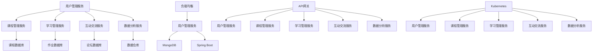

                 

### 文章标题

> **关键词**：（此处列出文章的5-7个核心关键词）

> **摘要**：（此处给出文章的核心内容和主题思想）

**“如何利用云计算技术构建创业数字化平台”** 是一篇深入探讨云计算在创业数字化平台建设中应用的指导性技术文章。本文将围绕云计算技术基础、数字化平台概述、云计算架构设计、容器化与微服务架构、数字化平台项目实战、测试与部署、运营与优化等七个方面展开，旨在帮助创业者和技术团队理解云计算的优势，掌握构建数字化平台的核心技能和策略。文章通过理论讲解、实际案例、算法分析和代码解读等多种形式，提供全面的实践指南，助力创业者快速搭建并优化数字化平台。

### 《如何利用云计算技术构建创业数字化平台》目录大纲

#### 第一部分：云计算与数字化平台概述

##### 第1章：云计算技术基础

- **1.1 云计算简介**
  - **云计算的定义与历史**
  - **云计算的三大服务模式**
    - **IaaS**
    - **PaaS**
    - **SaaS**
  - **云计算的优点与挑战**

- **1.2 数字化平台的概念与重要性**
  - **数字化平台的基本概念**
  - **数字化平台在创业中的作用**
  - **数字化平台的架构与组成部分**

##### 第2章：云计算技术在创业中的应用场景

- **2.1 云计算在创业公司中的优势**
  - **成本效益**
  - **灵活性与可扩展性**
  - **安全性**

- **2.2 数字化平台建设的关键步骤**
  - **需求分析**
  - **平台规划与设计**
  - **技术选型与架构设计**
  - **开发与实施**
  - **测试与部署**
  - **运维与管理**

#### 第二部分：云计算架构设计

##### 第3章：云计算基础架构

- **3.1 云服务模型**
  - **公有云**
  - **私有云**
  - **混合云**

- **3.2 云服务提供商**
  - **AWS**
  - **Azure**
  - **Google Cloud Platform**

- **3.3 云存储解决方案**
  - **对象存储**
  - **块存储**
  - **文件存储**

##### 第4章：云计算网络与安全性

- **4.1 云网络设计**
  - **虚拟网络**
  - **负载均衡**
  - **云间连接**

- **4.2 云安全策略**
  - **身份认证与访问控制**
  - **数据加密与保护**
  - **网络安全与监控**

##### 第5章：容器化与微服务架构

- **5.1 容器化技术**
  - **Docker**
  - **Kubernetes**

- **5.2 微服务架构设计**
  - **微服务优势与挑战**
  - **微服务开发与部署**
  - **服务发现与负载均衡**

#### 第三部分：数字化平台项目实战

##### 第6章：创业数字化平台案例分析

- **6.1 平台需求分析**
  - **业务目标与用户需求**
  - **功能模块设计**

- **6.2 技术选型与架构设计**
  - **选择合适的云计算服务**
  - **设计高可用与可扩展的架构**

- **6.3 项目实施与开发**
  - **环境搭建与工具选择**
  - **开发流程与版本控制**
  - **代码分析与解读**

##### 第7章：数字化平台测试与部署

- **7.1 测试策略与流程**
  - **功能测试**
  - **性能测试**
  - **安全测试**

- **7.2 部署与上线**
  - **持续集成与持续部署**
  - **部署策略与监控**
  - **故障处理与恢复**

#### 第四部分：数字化平台的运营与优化

##### 第8章：数字化平台的运营管理

- **8.1 运维策略**
  - **自动化运维**
  - **监控与报警**

- **8.2 性能优化**
  - **缓存策略**
  - **数据库优化**

##### 第9章：数字化平台的可持续发展

- **9.1 数据分析与BI**
  - **用户行为分析**
  - **业务智能应用**

- **9.2 创新与迭代**
  - **用户反馈与迭代**
  - **技术趋势与前瞻**

#### 附录

##### 附录A：云计算资源与工具

- **A.1 云服务提供商资源**
  - **AWS**
  - **Azure**
  - **Google Cloud Platform**

- **A.2 开发工具与框架**
  - **Docker**
  - **Kubernetes**
  - **其他常用工具**

##### 附录B：Mermaid 流程图

- **B.1 云计算架构图**
- **B.2 微服务架构图**

##### 附录C：核心算法与数学模型

- **C.1 云计算中的调度算法**
  - **伪代码与解释**

- **C.2 数字化平台性能优化算法**
  - **伪代码与解释**

### 第一部分：云计算与数字化平台概述

#### 第1章：云计算技术基础

##### 1.1 云计算简介

**云计算** 是一种通过网络提供动态易扩展且经常是虚拟化的资源，如计算服务、存储服务、网络服务、安全服务和应用程序服务，这些资源可动态地提供给终端用户。云计算的历史可以追溯到20世纪60年代，当时计算机科学家约翰·麦克卡锡（John McCarthy）首次提出了“计算即服务”（Compute as a Service）的概念。

**云计算的定义与历史**

云计算的核心定义是“通过网络以服务的形式提供资源”。具体来说，云计算包括以下三个方面：

1. **计算资源池化**：云计算将硬件资源（如服务器、存储设备、网络等）虚拟化，形成一个资源池，用户可以根据需要动态分配和释放资源。

2. **按需自助服务**：用户可以自行管理和配置所需的服务，无需与云服务提供商进行人工交互。

3. **弹性伸缩**：云计算系统可以根据用户的实际需求自动调整资源配置，从而实现高效利用和成本优化。

云计算的发展经历了几个重要阶段：

- **基础设施即服务（IaaS）**：早期云计算模型，用户租用虚拟机、存储和网络资源。

- **平台即服务（PaaS）**：为开发者提供开发和部署应用程序的平台，用户无需管理底层基础设施。

- **软件即服务（SaaS）**：用户通过互联网使用应用程序服务，无需安装和配置软件。

- **混合云**：将公有云和私有云结合使用，以满足不同业务需求。

**云计算的三大服务模式**

云计算的主要服务模式包括基础设施即服务（IaaS）、平台即服务（PaaS）和软件即服务（SaaS）。

1. **基础设施即服务（IaaS）**

IaaS 提供计算资源（如虚拟机、存储、网络等）作为服务，用户可以根据需求配置和管理这些资源。典型的 IaaS 提供商包括 AWS、Azure、Google Cloud Platform 等。

- **优点**：
  - **灵活性**：用户可以根据需要灵活配置资源。
  - **成本效益**：用户只需为使用的资源付费。
  - **可扩展性**：可以轻松扩展资源以应对业务增长。

- **缺点**：
  - **管理复杂性**：用户需要自行管理虚拟机、网络和安全等。
  - **性能瓶颈**：当资源需求巨大时，可能会出现性能问题。

2. **平台即服务（PaaS）**

PaaS 为开发者提供开发、测试和部署应用程序的平台，用户无需管理底层基础设施。PaaS 通常包括数据库、应用程序框架、开发工具等。

- **优点**：
  - **简化开发**：开发者可以专注于应用程序开发，无需关注底层基础设施。
  - **快速部署**：应用程序可以在几分钟内部署到生产环境。
  - **成本效益**：降低了开发和部署成本。

- **缺点**：
  - **锁定**：应用程序可能会依赖特定的 PaaS 提供商，迁移困难。
  - **性能限制**：PaaS 平台可能会限制应用程序的性能。

3. **软件即服务（SaaS）**

SaaS 提供通过互联网访问的应用程序服务，用户无需安装和配置软件。SaaS 应用程序通常包括企业资源规划（ERP）、客户关系管理（CRM）等。

- **优点**：
  - **易用性**：用户只需通过浏览器即可访问应用程序。
  - **低维护成本**：服务提供商负责应用程序的维护和更新。
  - **可扩展性**：可以轻松扩展服务以适应业务需求。

- **缺点**：
  - **依赖服务提供商**：服务中断或性能问题可能会影响业务。
  - **数据安全问题**：用户需要信任服务提供商保护其数据。

**云计算的优点与挑战**

云计算的优点包括：

- **成本效益**：用户只需为使用的资源付费，无需购买和维护硬件。
- **灵活性与可扩展性**：用户可以根据需求动态调整资源配置。
- **高可用性**：云服务提供商通常提供高可用性保障。
- **快速部署**：云服务可以帮助用户快速部署应用程序。
- **数据存储与备份**：云服务提供便捷的数据存储和备份解决方案。

云计算的挑战包括：

- **安全性**：用户需要确保云环境中的数据安全。
- **数据隐私**：用户需要关注数据在云服务提供商之间的传输和处理。
- **管理复杂性**：用户需要管理虚拟机、网络和安全等。
- **依赖性**：用户可能过度依赖云服务提供商。

通过理解云计算的基础知识，创业者和技术团队可以更好地利用云计算技术，为数字化平台建设奠定坚实的基础。

### 1.2 数字化平台的概念与重要性

**数字化平台的概念**

数字化平台是一种基于云计算技术，通过整合多种服务、工具和资源，为用户提供全方位数字化解决方案的系统架构。它不仅包括传统的IT基础设施，如服务器、存储和网络，还包括应用程序、数据、流程和各种服务组件。数字化平台的核心理念是“一站式服务”，旨在为用户提供从数据采集、处理到分析、应用的全方位支持。

**数字化平台在创业中的作用**

数字化平台在创业公司中扮演着至关重要的角色，主要体现在以下几个方面：

1. **提高效率**：数字化平台通过自动化和智能化的手段，可以显著提高业务流程的效率。例如，自动化的数据采集和处理可以减少人为错误，提升数据处理速度。

2. **降低成本**：数字化平台可以帮助创业公司实现资源的有效利用，降低运营成本。通过云计算技术，创业公司可以按需获取所需资源，避免购买和维护大量硬件设备。

3. **增强灵活性**：数字化平台支持快速的业务调整和扩展。创业公司可以根据市场变化和业务需求，灵活调整平台的功能和架构，快速响应市场变化。

4. **提升用户体验**：数字化平台通过提供个性化的服务和体验，可以增强用户粘性，提高用户满意度。例如，通过数据分析，平台可以为用户提供个性化的推荐和内容。

5. **支持创新**：数字化平台为创业公司提供了丰富的技术资源和开发环境，支持创新业务模式的探索。创业公司可以利用平台提供的各种工具和服务，快速开发和部署创新产品。

**数字化平台的架构与组成部分**

数字化平台的架构通常包括以下几个关键组成部分：

1. **基础设施层**：包括云计算资源（如虚拟机、存储、网络等），以及相关的硬件设备和基础设施。

2. **平台层**：提供开发、部署和管理应用程序的平台，包括开发工具、中间件、数据库等。

3. **应用层**：包括各种业务应用程序和服务，如企业资源规划（ERP）、客户关系管理（CRM）、数据分析工具等。

4. **数据层**：包括数据存储、处理和分析的组件，如数据库、数据仓库、大数据平台等。

5. **用户界面层**：提供用户交互的前端应用程序，如Web应用、移动应用等。

通过理解数字化平台的概念和重要性，创业公司可以更好地规划和构建数字化平台，为业务发展提供强有力的支持。

### 第2章：云计算技术在创业中的应用场景

#### 2.1 云计算在创业公司中的优势

云计算技术为创业公司带来了诸多优势，使其在资源获取、成本控制、灵活性和安全性等方面受益匪浅。

**成本效益**

云计算的按需付费模式使创业公司能够根据实际需求获取资源，避免了大量前期投资和后期维护成本。传统IT基础设施的建设和维护需要大量的资金投入，而云计算提供了可扩展的资源池，创业公司只需为使用的资源付费，从而大大降低了初始成本和运营成本。此外，云计算服务提供商通常提供多种计费模式，如按需计费、预留实例等，创业公司可以根据自身需求选择最合适的计费方案。

**灵活性与可扩展性**

云计算技术具有高度的灵活性和可扩展性，创业公司可以根据业务需求快速调整资源规模。云计算平台支持自动化的资源管理，用户可以轻松地增加或减少计算资源，以应对短期内的资源波动。此外，云计算提供了丰富的服务类型和组件，如容器化技术、微服务架构等，这些技术使得创业公司能够快速开发和部署应用程序，灵活应对市场变化。

**安全性**

云计算服务提供商通常会提供一系列安全措施，如数据加密、访问控制、网络安全等，保障用户数据的安全性。创业公司可以利用这些安全服务，降低自身在数据保护和网络安全方面的风险。此外，云计算平台通常具有高可用性和容灾能力，即使某个数据中心发生故障，业务也可以快速切换到其他可用区域，确保业务连续性。

**云计算在创业中的应用场景**

1. **数据处理与分析**：创业公司可以利用云计算平台进行大规模数据处理和分析，通过大数据技术和机器学习算法，提取有价值的信息，支持业务决策。

2. **应用程序开发与部署**：云计算提供了丰富的开发工具和服务，如容器化技术（Docker、Kubernetes）、平台即服务（PaaS）等，创业公司可以快速搭建开发环境，实现敏捷开发。

3. **客户关系管理**：通过云计算平台，创业公司可以部署客户关系管理（CRM）系统，实现对客户信息的集中管理和分析，提高客户满意度。

4. **供应链管理**：云计算平台可以帮助创业公司实现供应链管理的数字化，通过实时数据分析和预测，优化库存和物流管理。

5. **电子商务**：创业公司可以利用云计算平台搭建电子商务平台，提供在线销售、支付和物流服务，满足多样化的客户需求。

**实际案例**

1. **创业公司X的数字化转型**：创业公司X利用AWS云服务，搭建了大数据分析和机器学习平台，通过对用户数据的深入分析，实现了精准营销和用户行为的预测，大幅提高了业务效率和客户满意度。

2. **创业公司Y的电子商务平台**：创业公司Y利用Azure云服务，搭建了全功能的电子商务平台，实现了在线销售、支付和物流的一体化，通过云服务的弹性扩展能力，成功应对了节假日高峰期的订单量激增。

通过这些实际案例，我们可以看到云计算技术在创业中的应用场景非常广泛，不仅为创业公司提供了强大的技术支持，还帮助其在激烈的市场竞争中脱颖而出。

#### 2.2 数字化平台建设的关键步骤

构建一个成功的数字化平台需要系统化的规划和实施。以下是建设数字化平台的关键步骤：

**需求分析**

需求分析是数字化平台建设的第一步，其目的是明确平台的目标和功能需求。需求分析通常包括以下几个方面：

1. **业务目标**：明确平台建设的业务目标，如提升运营效率、增强客户体验、优化供应链管理等。
2. **用户需求**：收集和分析用户的需求，包括现有用户和潜在用户，确保平台能够满足用户的核心需求。
3. **功能模块设计**：根据业务目标和用户需求，设计平台的功能模块，如用户管理、订单管理、数据分析等。

**平台规划与设计**

平台规划与设计是构建数字化平台的核心环节，它决定了平台的技术架构和功能模块。以下是平台规划与设计的关键步骤：

1. **技术选型**：根据业务需求和资源情况，选择合适的技术栈和工具，如云计算平台（AWS、Azure、Google Cloud Platform）、开发框架（Django、Spring Boot）等。
2. **架构设计**：设计平台的整体架构，包括基础设施层、平台层和应用层。架构设计应考虑高可用性、可扩展性和安全性。
3. **数据库设计**：根据功能需求设计数据库架构，包括数据表结构、关系设计、索引优化等。

**技术选型与架构设计**

技术选型和架构设计是数字化平台建设的重要环节，直接影响平台的性能、可扩展性和维护成本。以下是技术选型和架构设计的关键步骤：

1. **云计算平台选择**：选择合适的云计算平台，如 AWS、Azure、Google Cloud Platform 等，根据业务需求和成本效益进行评估。
2. **容器化技术**：使用容器化技术（如 Docker）来简化应用程序的部署和管理，提高开发效率。
3. **微服务架构**：采用微服务架构，将应用程序拆分为多个独立的服务，提高系统的可扩展性和可维护性。
4. **缓存和数据库优化**：使用缓存技术（如 Redis）和数据库优化策略，提高系统的性能和响应速度。
5. **安全设计**：确保平台的安全设计，包括身份认证、访问控制、数据加密和网络安全。

**开发与实施**

开发与实施是数字化平台建设的关键步骤，包括以下环节：

1. **环境搭建**：搭建开发环境和测试环境，包括服务器、数据库、开发工具等。
2. **代码开发**：根据设计文档进行代码开发，包括前端、后端和数据库。
3. **版本控制**：使用版本控制工具（如 Git）进行代码管理，确保代码质量和协作效率。
4. **测试与集成**：进行功能测试、性能测试和安全测试，确保平台的质量和稳定性。

**测试与部署**

测试与部署是数字化平台建设的重要环节，确保平台在上线后的稳定运行。以下是测试与部署的关键步骤：

1. **测试策略**：制定测试策略，包括功能测试、性能测试、安全测试等。
2. **测试环境**：搭建测试环境，模拟生产环境进行测试。
3. **持续集成与持续部署**（CI/CD）：使用 CI/CD 工具（如 Jenkins、Travis CI）实现自动化测试和部署，提高开发效率。
4. **上线与监控**：上线平台并进行实时监控，确保平台在上线后的稳定运行。

**运维与管理**

运维与管理是数字化平台长期运行的关键环节，确保平台的稳定性和可持续性。以下是运维与管理的关键步骤：

1. **自动化运维**：使用自动化工具（如 Ansible、Puppet）进行环境配置、监控和故障处理。
2. **监控与报警**：使用监控工具（如 Prometheus、Grafana）进行系统性能监控和报警。
3. **性能优化**：定期进行性能优化，包括缓存优化、数据库优化、网络优化等。
4. **数据备份与恢复**：制定数据备份策略，确保数据的完整性和安全性。

通过以上关键步骤，创业公司可以系统地构建和运营一个高效的数字化平台，为业务发展提供强有力的支持。

### 第二部分：云计算架构设计

#### 第3章：云计算基础架构

云计算基础架构是构建数字化平台的关键，涵盖了云服务模型、服务提供商和存储解决方案。在这一章中，我们将深入探讨这些核心概念，为创业公司提供构建数字化平台的技术基础。

##### 3.1 云服务模型

云服务模型是云计算技术的基础，根据云资源的管理方式和访问模式，主要分为公有云、私有云和混合云三种类型。

1. **公有云（Public Cloud）**

公有云是由第三方服务提供商提供的云计算资源，用户可以按需租用。公有云的主要特点是资源共享、成本低、高可用性和弹性伸缩。

- **优点**：
  - **成本效益**：用户无需购买和维护硬件，只需为使用的资源付费。
  - **高可用性**：公有云通常提供多个数据中心，保障业务的连续性。
  - **弹性伸缩**：可以按需增加或减少资源，满足业务变化需求。

- **缺点**：
  - **数据安全**：由于资源共享，用户需要特别注意数据的安全和隐私。
  - **性能瓶颈**：在资源高峰期，性能可能会受到影响。

2. **私有云（Private Cloud）**

私有云是专为企业内部使用的云计算资源，由企业自己管理。私有云的主要特点是资源隔离、安全性和可控性。

- **优点**：
  - **数据安全**：资源完全隔离，数据安全有更高保障。
  - **性能稳定**：资源由企业自己控制，可以确保性能稳定。
  - **定制化**：可以根据企业的特定需求进行定制化配置。

- **缺点**：
  - **成本较高**：需要投入大量资金购买和管理硬件。
  - **扩展性有限**：扩展资源需要额外的硬件投资。

3. **混合云（Hybrid Cloud）**

混合云是将公有云和私有云结合使用的一种云服务模式，企业可以根据不同业务需求，将部分应用和数据部署在公有云上，部分部署在私有云上。

- **优点**：
  - **灵活性**：可以根据业务需求灵活调整资源部署。
  - **成本效益**：结合了公有云和私有云的优点，实现资源的最优利用。
  - **扩展性**：可以通过公有云快速扩展资源，满足业务增长需求。

- **缺点**：
  - **管理复杂度**：需要同时管理公有云和私有云，增加了管理复杂度。

**云服务提供商**

目前市场上有多个云服务提供商，如 AWS、Azure、Google Cloud Platform 等，它们各自提供了丰富的云计算服务，为创业公司提供了多种选择。

1. **AWS（Amazon Web Services）**

AWS 是全球最大的云计算服务提供商，提供了广泛的服务，包括计算、存储、数据库、网络、人工智能等。AWS 的优势在于其丰富的服务和强大的生态系统。

- **优点**：
  - **服务丰富**：提供多种云计算服务，满足不同业务需求。
  - **生态强大**：有大量的合作伙伴和开发工具，支持快速开发和应用。

- **缺点**：
  - **成本较高**：AWS 的价格相对较高，需要精细管理成本。

2. **Azure（Microsoft Azure）**

Azure 是微软的云计算服务，提供了与 AWS 类似的服务，包括计算、存储、网络、数据库等。Azure 的优势在于其与微软其他产品的集成。

- **优点**：
  - **集成优势**：与微软的产品（如 Office、SQL Server）无缝集成。
  - **成本效益**：价格相对较为合理。

- **缺点**：
  - **生态系统相对较小**：与 AWS 相比，Azure 的生态系统较小。

3. **Google Cloud Platform（GCP）**

GCP 是谷歌的云计算服务，提供了强大的计算、存储、机器学习服务。GCP 的优势在于其强大的机器学习和人工智能服务。

- **优点**：
  - **机器学习优势**：提供丰富的机器学习和人工智能服务。
  - **成本效益**：在某些服务上具有价格优势。

- **缺点**：
  - **生态系统相对较小**：与 AWS 相比，GCP 的生态系统较小。

**云存储解决方案**

云存储是云计算的重要组成部分，提供了灵活、可靠和可扩展的数据存储服务。云存储解决方案主要分为对象存储、块存储和文件存储。

1. **对象存储（Object Storage）**

对象存储是一种基于文件的存储方式，适用于大规模的数据存储和共享。对象存储的主要特点是高扩展性和高可靠性。

- **优点**：
  - **高扩展性**：可以轻松扩展存储容量。
  - **高可靠性**：数据通过冗余存储和复制保障安全。

- **缺点**：
  - **访问速度较慢**：由于数据分散存储，访问速度可能较慢。

2. **块存储（Block Storage）**

块存储是将数据分成块进行存储，适用于需要高性能和低延迟的场景。块存储通常用于数据库、虚拟机等。

- **优点**：
  - **高性能**：提供了快速的数据读写速度。
  - **可扩展性**：可以按需增加存储容量。

- **缺点**：
  - **管理复杂度较高**：需要单独管理每个块存储。

3. **文件存储（File Storage）**

文件存储是一种基于文件系统的存储方式，适用于需要高吞吐量和共享访问的场景。文件存储通常用于文件共享、Web服务器等。

- **优点**：
  - **高吞吐量**：提供了高吞吐量的数据访问。
  - **共享访问**：支持多个用户同时访问文件。

- **缺点**：
  - **扩展性有限**：在扩展存储容量时可能需要更换硬件。

通过了解云计算基础架构的不同模型、服务提供商和存储解决方案，创业公司可以更好地选择适合自己业务需求的云计算资源，为数字化平台的构建奠定坚实的基础。

### 第4章：云计算网络与安全性

在云计算环境中，网络和安全性是构建数字化平台的关键组成部分。一个稳定且安全的网络架构能够确保平台的高可用性和数据保护。本章将探讨云计算网络设计、安全策略以及如何通过技术手段保障平台的安全。

#### 4.1 云网络设计

云网络设计是构建数字化平台的基础，涉及到虚拟网络、负载均衡和云间连接等方面。

**虚拟网络（VPC）**

虚拟网络（VPC）是云服务提供商提供的一种虚拟网络环境，允许用户在云中创建一个隔离的、自定义的虚拟网络。VPC 具有以下优点：

- **隔离性**：用户可以在 VPC 中创建多个子网，实现网络隔离，保障不同应用之间的安全。
- **自定义性**：用户可以自定义网络设置，包括 IP 地址分配、路由策略等。
- **扩展性**：VPC 支持按需扩展，可以轻松增加子网和资源。

**负载均衡**

负载均衡是将流量分配到多个服务器或实例的技术，以确保平台的高可用性和性能。云服务提供商提供了多种负载均衡服务，如 AWS 的 Elastic Load Balancing、Azure 的 Azure Load Balancer、GCP 的 Google Cloud Load Balancing。

- **优点**：
  - **高可用性**：负载均衡可以自动将流量分配到健康的实例，确保应用的高可用性。
  - **性能优化**：通过将流量分配到多个实例，可以减少单个实例的负载，提高性能。
  - **弹性伸缩**：负载均衡可以根据流量动态调整实例数量，实现自动扩展。

**云间连接**

云间连接是指将不同的云环境（如公有云、私有云）或云服务提供商之间的网络连接起来。云间连接的目的是实现跨云环境的资源调度和业务集成。

- **优点**：
  - **灵活性**：用户可以在不同的云环境中部署应用，实现资源的最优利用。
  - **成本效益**：通过跨云连接，用户可以选择性价比最高的云服务提供商。

**云网络设计策略**

在进行云网络设计时，应考虑以下策略：

- **网络隔离**：通过 VPC 和子网实现网络隔离，保障不同应用之间的安全性。
- **流量管理**：使用负载均衡管理流量，提高平台的性能和可用性。
- **网络监控**：使用网络监控工具（如 AWS CloudWatch、Azure Monitor）实时监控网络性能和流量。

#### 4.2 云安全策略

云安全策略是保障数字化平台安全的关键，涉及到身份认证、访问控制、数据加密和网络安全等方面。

**身份认证与访问控制**

身份认证是确保只有授权用户能够访问平台的关键。云服务提供商提供了多种身份认证方式，如密码认证、多因素认证（MFA）和基于角色的访问控制（RBAC）。

- **优点**：
  - **安全性**：多因素认证和 RBAC 可以有效防止未经授权的访问。
  - **灵活性**：可以根据不同的用户角色设置访问权限，实现细粒度的权限管理。

**数据加密与保护**

数据加密是保障数据安全的重要手段，包括数据传输加密和数据存储加密。

- **数据传输加密**：使用 SSL/TLS 协议对数据进行加密传输，防止数据在传输过程中被窃取。
- **数据存储加密**：使用加密算法对存储在云中的数据进行加密，确保数据在存储时的安全。

**网络安全与监控**

网络安全是保障平台安全的关键，包括防火墙、入侵检测系统和网络安全监控。

- **防火墙**：设置防火墙规则，防止未经授权的访问和攻击。
- **入侵检测系统**：实时监测网络流量和系统日志，发现潜在的安全威胁。
- **网络安全监控**：使用安全监控工具（如 AWS Security Hub、Azure Security Center）实时监控网络安全状态。

**云安全最佳实践**

- **定期安全审计**：定期进行安全审计，发现并修复潜在的安全漏洞。
- **安全培训**：对员工进行安全培训，提高安全意识和防范能力。
- **数据备份与恢复**：制定数据备份策略，确保数据的安全性和可恢复性。

通过合理的云网络设计和有效的云安全策略，创业公司可以构建一个安全可靠的数字化平台，保障业务的稳定运行。

### 第5章：容器化与微服务架构

容器化和微服务架构是现代云计算环境中的重要技术，为数字化平台的构建提供了灵活性和可扩展性。本章将深入探讨容器化技术（如 Docker）、容器编排工具（如 Kubernetes）以及微服务架构的设计与部署，帮助创业者和技术团队理解并应用这些技术，以提升数字化平台的性能和可维护性。

#### 5.1 容器化技术

容器化是一种轻量级的虚拟化技术，通过将应用程序及其依赖环境打包到一个独立的容器中，实现应用程序的隔离和可移植性。容器化的核心组件包括 Docker 和 Kubernetes。

**Docker**

Docker 是最流行的容器化平台，它通过将应用程序及其依赖环境封装在一个独立的容器中，确保应用程序在不同环境中的一致性。Docker 的主要特点如下：

- **轻量级**：Docker 容器非常轻量，启动速度快，资源消耗低。
- **隔离性**：容器提供了良好的隔离性，每个容器独立运行，互不干扰。
- **可移植性**：容器可以轻松地在不同的操作系统和云环境中迁移。
- **自动化部署**：Docker 支持自动化部署和运维，提高开发效率。

**Docker 架构**

Docker 架构主要包括以下组件：

- **Docker Engine**：Docker 的核心组件，负责容器创建、运行和管理。
- **Dockerfile**：定义容器构建过程的脚本文件，用于描述容器的镜像和配置。
- **Docker Hub**：Docker 的官方镜像仓库，提供丰富的公共镜像。

**Docker 容器生命周期**

Docker 容器的生命周期包括以下阶段：

- **构建**：通过 Dockerfile 创建容器镜像。
- **启动**：启动容器并运行应用程序。
- **运行**：容器在运行状态，执行应用程序任务。
- **停止**：停止容器运行。
- **删除**：删除容器及其镜像。

**Docker 实际案例**

例如，要创建一个基于 Python 的 Web 应用程序容器，可以使用以下 Dockerfile：

```Dockerfile
# 指定基础镜像
FROM python:3.8

# 设置工作目录
WORKDIR /app

# 将应用程序代码复制到容器中
COPY . .

# 安装依赖
RUN pip install -r requirements.txt

# 暴露容器端口
EXPOSE 8000

# 运行应用程序
CMD ["python", "app.py"]
```

通过构建和运行此 Dockerfile，可以创建并启动一个包含 Python Web 应用程序的容器。

**Kubernetes**

Kubernetes 是一个开源的容器编排工具，用于自动化容器化应用程序的部署、扩展和管理。Kubernetes 的主要特点如下：

- **自动化部署**：Kubernetes 提供了自动化部署功能，通过 Kubernetes 部署应用程序，无需手动管理容器。
- **弹性伸缩**：Kubernetes 可以根据需求自动扩展或缩小应用程序的规模，确保系统的稳定性。
- **高可用性**：Kubernetes 提供了故障转移和自愈机制，确保应用程序的持续运行。
- **服务发现与负载均衡**：Kubernetes 提供了服务发现和负载均衡功能，简化了应用程序的部署和管理。

**Kubernetes 架构**

Kubernetes 架构主要包括以下组件：

- **Master**：Kubernetes 集群的控制平面，负责管理集群状态和调度任务。
  - **API Server**：接收并处理集群管理的所有请求。
  - **Controller Manager**：负责维护集群状态。
  - **Scheduler**：负责调度容器到集群中的节点。
- **Node**：Kubernetes 集群的计算节点，负责运行容器和应用程序。
  - **Kubelet**：Node 上的守护进程，负责容器运行状态监控和容器管理。
  - **Kube-Proxy**：负责网络代理和服务发现。

**Kubernetes 实际案例**

例如，要部署一个简单的 Web 应用程序，可以使用以下 Kubernetes 配置文件（YAML 格式）：

```yaml
apiVersion: apps/v1
kind: Deployment
metadata:
  name: web-app
spec:
  replicas: 3
  selector:
    matchLabels:
      app: web-app
  template:
    metadata:
      labels:
        app: web-app
    spec:
      containers:
      - name: web-app
        image: python:3.8
        ports:
        - containerPort: 8000

---
apiVersion: v1
kind: Service
metadata:
  name: web-app-service
spec:
  selector:
    app: web-app
  ports:
    - protocol: TCP
      port: 80
      targetPort: 8000
  type: LoadBalancer
```

此配置文件定义了一个包含三个容器的 Deployment，以及一个暴露 80 端口的 LoadBalancer 类型的 Service。通过应用此配置文件，Kubernetes 将自动部署和管理 Web 应用程序。

#### 5.2 微服务架构设计

微服务架构是将应用程序拆分为多个独立的服务，每个服务负责不同的功能，通过 API 进行通信和协作。微服务架构具有以下优势：

- **高可用性**：通过将应用程序拆分为多个服务，可以确保某个服务的故障不会影响整个应用程序。
- **可扩展性**：可以单独扩展某个服务，而不需要扩展整个应用程序。
- **灵活性**：可以独立开发和部署服务，适应不同的开发需求和团队。

**微服务优势与挑战**

**优势**

- **独立性**：每个服务都是独立的，可以独立开发和部署。
- **可扩展性**：可以根据服务需求独立扩展，提升性能。
- **容错性**：单个服务的故障不会影响整个应用程序。
- **灵活性**：可以采用不同的技术栈和开发语言。

**挑战**

- **分布式系统复杂性**：需要处理分布式系统的协调和通信问题。
- **服务治理**：需要管理大量服务，包括版本控制、依赖管理和服务监控。
- **数据一致性**：在分布式系统中保证数据的一致性是一个挑战。

**微服务开发与部署**

**开发**

- **服务划分**：根据业务需求将应用程序划分为多个服务。
- **API 设计**：设计清晰的服务 API，确保服务之间的高效通信。
- **服务隔离**：确保每个服务都运行在独立的容器中，避免服务之间的干扰。

**部署**

- **容器化**：使用容器化技术（如 Docker）将服务打包为容器。
- **自动化部署**：使用容器编排工具（如 Kubernetes）实现自动化部署和管理。
- **服务发现**：使用服务发现机制（如 Kubernetes Service）发现和访问服务。

**服务发现与负载均衡**

**服务发现** 是指在分布式系统中，服务可以动态地发现其他服务的位置和状态。服务发现有助于简化服务之间的通信，提高系统的灵活性和可扩展性。

- **服务注册**：服务启动时向服务注册中心注册自己的信息。
- **服务查询**：客户端通过服务注册中心查询所需服务的地址。

**负载均衡** 是指在多个服务实例之间分配流量，确保系统的性能和可用性。

- **客户端负载均衡**：客户端根据负载均衡策略选择服务实例。
- **服务端负载均衡**：服务注册中心根据负载均衡策略分配服务实例。

通过合理设计和部署容器化与微服务架构，创业公司可以实现高效、灵活和可扩展的数字化平台，为业务的快速发展提供技术支持。

### 第6章：创业数字化平台案例分析

本章节将通过一个实际案例，展示如何利用云计算技术构建创业数字化平台，并提供详细的平台需求分析、技术选型与架构设计、项目实施与开发等步骤，帮助创业者和技术团队更好地理解和应用这些技术。

#### 6.1 平台需求分析

**业务目标与用户需求**

假设我们是一家初创公司，专注于提供在线教育服务。我们的业务目标是打造一个功能强大、用户体验优良的在线学习平台，满足用户多样化的学习需求。用户需求包括：

- **课程学习**：用户可以在线浏览和选择课程，学习课程内容。
- **作业提交与批改**：用户可以提交作业，老师可以进行批改和反馈。
- **互动交流**：用户可以在论坛、聊天室中与其他用户互动。
- **个人中心**：用户可以查看学习进度、考试成绩等个人信息。

**功能模块设计**

根据用户需求，我们将数字化平台划分为以下功能模块：

1. **用户管理模块**：负责用户的注册、登录、权限管理和个人信息管理。
2. **课程管理模块**：负责课程的创建、发布、分类和搜索。
3. **学习管理模块**：负责用户的课程学习进度、作业提交和成绩管理。
4. **互动交流模块**：负责论坛、聊天室等互动功能的实现。
5. **数据分析模块**：负责收集用户数据，进行数据分析，为业务决策提供支持。

#### 6.2 技术选型与架构设计

**云计算服务提供商选择**

为了确保平台的高可用性和灵活性，我们选择了 AWS 作为云计算服务提供商。AWS 提供了丰富的云计算服务和强大的生态系统，可以满足我们的业务需求。

**技术选型**

1. **容器化技术**：为了实现高效的应用程序部署和管理，我们选择了 Docker 作为容器化技术，将应用程序打包为容器，实现平台的高可用性和可移植性。
2. **容器编排工具**：为了自动化容器的部署和管理，我们选择了 Kubernetes 作为容器编排工具，通过 Kubernetes 进行集群管理和自动化部署。
3. **数据库选型**：根据业务需求，我们选择了 PostgreSQL 作为关系型数据库，用于存储用户数据、课程信息和作业数据。
4. **缓存技术**：为了提高系统的性能和响应速度，我们选择了 Redis 作为缓存技术，用于缓存用户数据、课程内容和作业结果。
5. **消息队列**：为了实现分布式系统的异步通信，我们选择了 Kafka 作为消息队列，用于处理用户互动、作业提交等消息传递。

**架构设计**

我们的数字化平台架构设计如下：

1. **基础设施层**：使用 AWS EC2 和 EBS 提供计算和存储资源，使用 VPC 和子网实现网络隔离和流量管理。
2. **容器编排层**：使用 Kubernetes 进行容器编排，实现应用程序的自动化部署、扩展和管理。
3. **服务层**：包含用户管理模块、课程管理模块、学习管理模块、互动交流模块和数据分析模块，每个模块作为一个独立的服务运行在 Kubernetes 集群中。
4. **数据存储层**：使用 PostgreSQL 作为关系型数据库，用于存储用户数据、课程信息和作业数据。
5. **缓存层**：使用 Redis 作为缓存技术，用于缓存用户数据、课程内容和作业结果。
6. **消息队列层**：使用 Kafka 作为消息队列，用于处理用户互动、作业提交等消息传递。

#### 6.3 项目实施与开发

**环境搭建**

1. **搭建 Kubernetes 集群**：使用 AWS 的 Elastic Kubernetes Service（EKS）搭建 Kubernetes 集群，确保集群的高可用性和扩展性。
2. **配置 CI/CD 流程**：使用 Jenkins 和 Docker Hub 配置持续集成和持续部署（CI/CD）流程，实现自动化构建和部署。

**代码开发**

1. **开发用户管理模块**：实现用户注册、登录、权限管理和个人信息管理功能，使用 Spring Boot 和 Spring Security 进行开发。
2. **开发课程管理模块**：实现课程创建、发布、分类和搜索功能，使用 Spring Boot 和 Spring Data JPA 进行开发。
3. **开发学习管理模块**：实现课程学习进度、作业提交和成绩管理功能，使用 Spring Boot 和 Spring Data JPA 进行开发。
4. **开发互动交流模块**：实现论坛、聊天室等互动功能，使用 Spring Boot 和 WebSocket 进行开发。
5. **开发数据分析模块**：实现用户数据分析、业务智能应用功能，使用 Spring Boot 和 Spark 进行开发。

**测试与部署**

1. **功能测试**：对各个功能模块进行功能测试，确保功能的正确性和完整性。
2. **性能测试**：对平台进行性能测试，确保系统的响应速度和稳定性。
3. **安全测试**：对系统进行安全测试，确保用户数据和平台的安全性。
4. **部署**：使用 Kubernetes 进行自动化部署，确保平台的持续运行和扩展。

通过以上步骤，我们成功地构建了一个功能强大、用户体验优良的在线学习平台。这个案例展示了如何利用云计算技术构建创业数字化平台，为创业者和技术团队提供了实用的指导和建议。

### 第7章：数字化平台测试与部署

测试与部署是数字化平台建设的重要环节，直接关系到平台的质量和稳定性。本章将详细介绍数字化平台的测试策略与流程，以及持续集成与持续部署（CI/CD）的实施方法，确保平台在上线后的稳定运行。

#### 7.1 测试策略与流程

**测试策略**

测试策略是确保数字化平台质量的关键，主要包括以下方面：

- **功能测试**：验证平台的功能是否满足需求，包括用户管理、课程管理、学习管理、互动交流等模块的功能。
- **性能测试**：评估平台在高并发、大流量情况下的性能，包括响应时间、吞吐量、系统稳定性等。
- **安全测试**：检查平台的安全性，包括身份认证、访问控制、数据加密、网络安全等。
- **兼容性测试**：验证平台在不同操作系统、浏览器、设备上的兼容性。

**测试流程**

测试流程包括以下步骤：

1. **需求分析**：分析平台功能需求，制定测试计划。
2. **环境搭建**：搭建测试环境，包括开发环境、测试环境和预生产环境。
3. **测试设计**：设计测试用例，包括功能测试用例、性能测试用例和安全测试用例。
4. **测试执行**：执行测试用例，记录测试结果，发现和报告缺陷。
5. **缺陷跟踪**：跟踪缺陷修复情况，确保所有缺陷得到解决。
6. **测试验收**：进行测试验收，确保平台达到预期质量标准。

**测试工具**

- **功能测试**：使用 Selenium、JMeter 等工具进行自动化功能测试。
- **性能测试**：使用 JMeter、LoadRunner 等工具进行性能测试。
- **安全测试**：使用 OWASP ZAP、Nessus 等工具进行安全测试。
- **兼容性测试**：使用 BrowserStack、LambdaTest 等工具进行兼容性测试。

#### 7.2 持续集成与持续部署（CI/CD）

**CI/CD 概述**

持续集成（CI）和持续部署（CD）是一种现代化的软件开发和部署方法，旨在通过自动化流程提高软件开发和交付的效率和质量。CI/CD 的核心思想是将代码频繁地集成到主干分支，通过自动化测试和部署确保代码质量和交付速度。

**CI/CD 实施方法**

1. **配置管理**：使用 Git 等版本控制工具进行代码管理，确保代码的版本控制和协作开发。
2. **构建与测试**：使用 Jenkins、Travis CI 等工具进行自动化构建和测试，确保每次代码提交都经过测试。
3. **部署管道**：使用 Jenkins、GitLab CI 等工具构建部署管道，实现自动化部署。

**部署策略**

- **蓝绿部署**：通过部署新的版本到备用环境，然后切换流量到新版本，确保新版本的稳定性。
- **金丝雀部署**：将新版本部署到一部分用户，观察其性能和稳定性，再逐步推广到所有用户。
- **滚动更新**：逐步更新实例，确保系统的高可用性。

**部署监控**

- **监控与报警**：使用 Prometheus、Grafana 等工具进行系统性能监控和报警，确保系统在异常情况下的快速响应。

通过实施 CI/CD 策略，数字化平台可以实现快速迭代和稳定交付，提高开发效率和系统质量。

### 第四部分：数字化平台的运营与优化

#### 第8章：数字化平台的运营管理

数字化平台的运营管理是确保平台稳定运行和持续优化的重要环节。通过科学的运维策略和有效的性能优化，可以最大化平台的资源利用率和服务质量。

**8.1 运维策略**

**自动化运维**

自动化运维通过脚本和工具实现平台的自动化管理，提高运维效率和降低人工成本。以下是一些常见的自动化运维工具和策略：

- **自动化部署**：使用 CI/CD 工具（如 Jenkins、Docker）实现自动化部署，确保平台快速响应业务需求。
- **自动化监控**：使用监控工具（如 Prometheus、Zabbix）对平台进行实时监控，及时发现和解决问题。
- **自动化备份与恢复**：使用自动化脚本定期备份系统数据，确保数据的安全性和可恢复性。
- **自动化扩容与缩容**：使用自动化脚本根据负载情况自动调整资源规模，提高资源利用率。

**监控与报警**

监控与报警是确保平台稳定运行的关键，通过实时监控和及时报警，可以快速发现和解决潜在问题。以下是一些常见的监控与报警策略：

- **系统性能监控**：监控 CPU、内存、磁盘使用率等关键指标，确保系统资源得到充分利用。
- **应用程序监控**：监控应用程序的运行状态、响应时间等指标，确保应用程序的性能和稳定性。
- **日志监控**：收集和分析系统日志，及时发现异常情况和错误日志。
- **报警策略**：设置报警阈值和通知方式，确保关键指标异常时能够及时通知相关人员。

**8.2 性能优化**

**缓存策略**

缓存策略是通过将频繁访问的数据存储在内存中，减少对后端系统的访问，提高系统性能。以下是一些常见的缓存策略：

- **页面缓存**：通过浏览器缓存或服务器缓存，减少页面的重新加载时间。
- **数据库缓存**：使用 Redis、Memcached 等缓存数据库，减少数据库的访问次数。
- **对象缓存**：使用 Redis、Ehcache 等缓存框架，缓存对象和查询结果。

**数据库优化**

数据库优化是提高系统性能的关键，以下是一些常见的数据库优化策略：

- **索引优化**：合理设计索引，提高数据查询速度。
- **查询优化**：优化 SQL 查询语句，减少查询时间和资源消耗。
- **分库分表**：根据业务需求和数据量，合理划分数据库和表，提高系统性能和可扩展性。
- **读写分离**：通过主从复制，实现读请求的负载均衡，提高系统并发能力。

**网络优化**

网络优化是通过优化网络架构和配置，提高数据传输速度和网络稳定性。以下是一些常见的网络优化策略：

- **负载均衡**：使用负载均衡器（如 Nginx、HAProxy）实现流量分发，提高系统并发能力。
- **链路优化**：优化数据中心之间的链路，减少数据传输延迟。
- **网络监控**：实时监控网络流量和性能，及时发现和解决网络问题。

通过实施有效的运维策略和性能优化，数字化平台可以实现高效稳定的运行，为业务的快速发展提供有力支持。

#### 第9章：数字化平台的可持续发展

数字化平台的可持续发展是创业公司长期成功的关键。通过数据分析和 BI（业务智能）技术，可以深入了解用户行为和业务趋势，从而实现持续创新和优化。以下将详细探讨数据分析和 BI 在数字化平台中的应用，以及如何通过创新与迭代实现平台的可持续发展。

**9.1 数据分析与 BI**

数据分析与 BI 是数字化平台的重要组成部分，通过收集、处理和分析用户数据，可以提供深刻的业务洞察，支持决策制定。

**用户行为分析**

用户行为分析是了解用户需求和行为的重要手段。通过分析用户的浏览记录、购买行为、点击路径等数据，可以识别用户偏好和潜在需求，为产品优化提供依据。以下是一些常见的用户行为分析方法：

- **用户画像**：通过分析用户的性别、年龄、地域、职业等信息，创建用户画像，了解用户特征和需求。
- **行为轨迹分析**：分析用户在平台上的行为路径，识别用户的兴趣点和痛点。
- **留存率分析**：监测用户在一定时间内的留存情况，评估用户满意度和忠诚度。

**业务智能应用**

业务智能应用是将数据分析结果应用于业务场景，实现业务优化和决策支持。以下是一些常见的业务智能应用：

- **营销策略优化**：通过分析用户行为数据，优化营销策略，提高转化率和用户参与度。
- **库存管理优化**：通过分析销售数据，预测需求变化，优化库存管理，减少库存积压。
- **客户服务优化**：通过分析客户反馈和投诉数据，优化客户服务流程，提高客户满意度。

**数据可视化**

数据可视化是将数据分析结果以图表、报表等形式展示，便于理解和分析。以下是一些常用的数据可视化工具：

- **Tableau**：提供丰富的图表和报表功能，支持多源数据整合。
- **Power BI**：与 Microsoft Office 系列产品集成，方便数据分析和报表生成。
- **Google Data Studio**：提供简单易用的数据可视化工具，支持自定义报表设计。

**9.2 创新与迭代**

数字化平台的可持续发展离不开持续的创新与迭代。通过不断优化产品功能和用户体验，可以保持平台的竞争力和用户粘性。

**用户反馈与迭代**

用户反馈是平台迭代的重要来源。通过收集用户的反馈和建议，可以识别产品中的不足和改进机会。以下是一些常见的用户反馈渠道：

- **在线问卷调查**：通过问卷调查收集用户意见，了解用户对产品的满意度。
- **用户论坛**：建立用户论坛，鼓励用户分享使用体验和建议。
- **用户访谈**：定期进行用户访谈，深入了解用户需求和痛点。

**技术趋势与前瞻**

跟踪技术趋势和前瞻是保持平台创新能力的重要途径。以下是一些当前的技术趋势：

- **人工智能与机器学习**：通过 AI 技术实现个性化推荐、智能客服和自动化决策。
- **区块链**：利用区块链技术实现数据安全、透明和去中心化。
- **物联网（IoT）**：通过 IoT 技术，实现设备联网和数据采集，支持智能业务应用。

通过数据分析和 BI 技术的应用，以及持续的创新与迭代，数字化平台可以实现可持续发展，为创业公司创造长期价值。

### 附录

#### 附录 A：云计算资源与工具

**A.1 云服务提供商资源**

- **AWS（Amazon Web Services）**：提供了广泛的服务，包括计算、存储、数据库、机器学习等。网址：[https://aws.amazon.com/](https://aws.amazon.com/)

- **Azure（Microsoft Azure）**：提供了丰富的云计算服务，与微软产品无缝集成。网址：[https://azure.microsoft.com/](https://azure.microsoft.com/)

- **Google Cloud Platform（GCP）**：提供了强大的计算、存储、机器学习服务，特别适合数据分析和人工智能应用。网址：[https://cloud.google.com/](https://cloud.google.com/)

**A.2 开发工具与框架**

- **Docker**：用于容器化应用程序，网址：[https://www.docker.com/](https://www.docker.com/)

- **Kubernetes**：用于容器编排和管理，网址：[https://kubernetes.io/](https://kubernetes.io/)

- **Spring Boot**：用于构建微服务应用程序，网址：[https://spring.io/projects/spring-boot](https://spring.io/projects/spring-boot)

- **PostgreSQL**：用于关系型数据库，网址：[https://www.postgresql.org/](https://www.postgresql.org/)

- **Redis**：用于缓存，网址：[https://redis.io/](https://redis.io/)

- **Kafka**：用于消息队列，网址：[https://kafka.apache.org/](https://kafka.apache.org/)

#### 附录 B：Mermaid 流程图

**B.1 云计算架构图**

```mermaid
graph TB
    A[云服务模型] --> B[基础设施即服务]
    A --> C[平台即服务]
    A --> D[软件即服务]
    B --> E[公有云]
    B --> F[私有云]
    B --> G[混合云]
    C --> H[IaaS]
    C --> J[PaaS]
    C --> K[SaaS]
    E --> AWS
    F --> Azure
    G --> AWS & Azure
    AWS --> EC2
    AWS --> S3
    AWS --> RDS
    Azure --> VM
    Azure --> Blob Storage
    Azure --> Azure SQL
    GCP --> GCE
    GCP --> GCS
    GCP --> Bigtable
```

**B.2 微服务架构图**



#### 附录 C：核心算法与数学模型

**C.1 云计算中的调度算法**

**调度算法** 是云计算中的重要算法，用于优化资源分配，提高资源利用率。以下是一个简单的调度算法的伪代码：

```python
Algorithm ScheduleResources(Allocations, ResourceDemand):
    Initialize: available_resources = copy(Allocations)
    for each instance in ResourceDemand:
        if available_resources[instance.type] >= instance.requested_resources:
            Allocate instance to available_resources
            available_resources[instance.type] -= instance.requested_resources
        else:
            Reject instance
    return available_resources
```

**C.2 数字化平台性能优化算法**

**缓存策略** 是数字化平台性能优化的重要手段。以下是一个简单的缓存算法的伪代码：

```python
Algorithm CacheData(data, cache_limit):
    if cache_limit == 0:
        return "Cache limit reached"
    else:
        Cache data in memory
        cache_limit -= 1
        return "Data cached successfully"
```

这些算法和数学模型在云计算和数字化平台中扮演着关键角色，通过合理的应用，可以显著提高系统的性能和效率。

