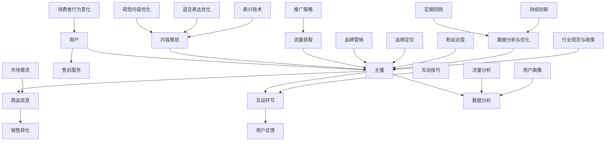

                 

# 《如何利用直播带货提升品牌影响力与销量》

## 概述

直播带货作为一种新兴的电商营销模式，近年来在互联网领域迅速崛起。它通过实时互动和现场展示，将商品信息传递给消费者，极大地提高了购买决策的效率和用户的购物体验。本文将详细探讨直播带货的起源、现状、优势与挑战、核心流程以及如何通过策略优化和数据分析来提升直播带货的效果。我们还将通过案例分析，提供实用的直播带货策略，并对未来发展趋势进行预测。

## 第一部分：直播带货概述

### 第1章：直播带货的起源与发展

#### 1.1 直播带货的起源

直播带货最早可以追溯到2016年，随着短视频平台的兴起和直播技术的普及，直播带货逐渐成为电商市场的重要组成部分。其核心在于通过主播与观众的实时互动，增强用户的参与感和购买意愿。

**定义**：直播带货是指利用网络直播技术，通过实时互动的方式销售商品。

**兴起原因**：
- **短视频平台的崛起**：如抖音、快手等短视频平台的用户量迅速增长，为直播带货提供了广泛的用户基础。
- **直播技术的普及**：直播技术的成熟和成本的降低，使得商家和平台能够更容易地开展直播活动。

#### 1.2 直播带货的现状

直播带货已成为电商市场的重要驱动力，根据相关数据，2020年中国直播电商市场的规模已经超过1万亿元人民币。以下是当前直播带货的一些关键指标：

- **市场规模**：直播带货已成为电商市场的重要组成部分，市场规模逐年增长。
- **用户分析**：直播带货的用户群体主要集中在18-35岁之间，其中女性用户占比更高。
- **行业分布**：服装、美妆、食品等是直播带货的主要品类。

#### 1.3 直播带货的优势与挑战

**优势**：
- **实时互动**：直播带货能够实现主播与观众之间的实时互动，增强用户的购买意愿。
- **降低购买决策时间**：观众可以通过现场展示和互动，快速做出购买决策。
- **提高用户粘性**：直播带货能够吸引更多用户持续关注和参与，提高用户粘性。

**挑战**：
- **内容质量**：直播内容的质量直接影响观众的观看体验和购买意愿。
- **流量获取**：在激烈的市场竞争中，如何获取足够的流量是直播带货面临的挑战。
- **售后服务**：直播带货的售后服务质量关系到品牌的信誉和用户的满意度。

### 第2章：直播带货的核心流程

直播带货的核心流程可以分为三个阶段：直播前的准备、直播过程以及直播后的工作。以下是每个阶段的详细步骤：

#### 2.1 直播带货前的准备

**商品选择**：
- **商品品质**：选择有保障的品牌和优质的商品，提高用户的购买信心。
- **市场需求**：分析市场需求，选择符合消费者需求的商品。
- **利润空间**：在确保商品品质的前提下，考虑商品的利润空间。

**主播选拔**：
- **主播形象**：选择形象好、气质佳的主播，提高观众的观看体验。
- **专业能力**：主播需要具备一定的专业知识和销售技巧。
- **粉丝基础**：有粉丝基础的主播能够更快地吸引观众。

**内容策划**：
- **直播主题**：明确直播的主题，如新品发布、限时折扣等。
- **互动环节**：设计有趣的互动环节，提高观众的参与度。
- **优惠策略**：提供优惠策略，如限时折扣、满减等，刺激购买。

#### 2.2 直播带货的过程

**开场**：
- **主播自我介绍**：向观众介绍自己，建立良好的第一印象。
- **商品介绍**：详细讲解商品的特点、优势和使用方法。

**互动**：
- **与观众互动**：回答观众的问题，提供专业的建议。
- **引导提问**：鼓励观众提问，增加互动性。
- **提供优惠**：提供限时优惠，刺激购买。

**成交**：
- **订单生成**：观众下单，生成订单。
- **支付**：引导观众完成支付。
- **售后服务**：确保售后服务质量，提高用户满意度。

#### 2.3 直播带货的后续工作

**数据分析**：
- **销售数据**：分析直播的销售数据，了解哪些商品受欢迎，哪些优惠策略有效。
- **用户反馈**：收集用户反馈，了解用户对直播和商品的评价。

**粉丝维护**：
- **粉丝互动**：通过私信、评论等方式与粉丝互动，增加粉丝黏性。
- **后续购买引导**：通过优惠活动、新品发布等方式，引导粉丝进行后续购买。

## 第二部分：直播带货策略优化

### 第3章：提升直播带货效果的方法

提升直播带货效果的关键在于优化视觉内容、语言表达和品牌营销策略。以下是具体的方法：

#### 3.1 视觉内容优化

**直播画面**：
- **画面清晰度**：使用高质量的摄像头，保证直播画面的清晰度。
- **背景设计**：设计简洁、美观的背景，提高观众的观看体验。

**商品展示**：
- **细节展示**：通过多角度拍摄，展示商品的细节。
- **使用场景展示**：展示商品在实际使用场景中的效果，提高用户的购买欲望。

#### 3.2 语言表达优化

**主播风格**：
- **亲和力**：主播需要具备良好的亲和力，与观众建立良好的关系。
- **专业度**：主播需要具备一定的专业知识和销售技巧，提高用户的信任度。

**互动技巧**：
- **引导提问**：通过提问引导观众参与互动，提高直播的互动性。
- **鼓励评论**：鼓励观众在直播中发表评论，增加直播的活跃度。

#### 3.3 品牌营销策略

**品牌定位**：
- **明确品牌形象**：明确品牌的特点和形象，传达品牌的价值。
- **传达品牌理念**：通过直播活动，传达品牌的理念和文化。

**粉丝运营**：
- **培养忠实粉丝**：通过优质的直播内容，培养忠实的粉丝群体。
- **扩大影响力**：通过社交媒体等渠道，扩大品牌的影响力。

### 第4章：直播带货数据分析与优化

数据分析是优化直播带货效果的重要手段。以下是具体的数据分析工具和优化方法：

#### 4.1 数据分析工具

**直播平台数据分析**：
- **流量**：分析直播的观看量、观看时长等指标，了解直播的流量情况。
- **转化率**：分析观众的购买转化率，了解直播的效果。

**第三方数据分析**：
- **用户画像**：通过数据分析，了解用户的年龄、性别、地域等信息。
- **市场需求**：分析市场需求，了解消费者对哪些商品更感兴趣。

#### 4.2 数据分析与优化

**流量分析**：
- **优化推广策略**：根据流量数据，调整推广策略，提高流量获取效率。
- **优化直播时间**：根据流量高峰期，选择最佳的直播时间。

**用户反馈**：
- **优化商品和直播内容**：根据用户反馈，调整商品和直播内容，提高用户满意度。

#### 4.3 持续优化策略

**定期回顾**：
- **总结经验**：定期总结直播带货的经验，发现问题，提出改进措施。
- **持续改进**：根据总结的经验，持续改进直播带货的策略和流程。

**持续创新**：
- **尝试新的直播形式**：尝试新的直播形式和营销手段，提高直播的吸引力和效果。
- **跟进市场趋势**：关注市场趋势，及时调整直播带货策略。

## 第三部分：直播带货案例研究

### 第5章：成功直播带货案例分析

#### 5.1 案例一：品牌X的成功直播带货经验

**背景**：
- **品牌X**是一家知名美妆品牌，拥有一定的市场影响力。
- **直播平台**：选择抖音作为直播平台，因为抖音的用户基数大，且美妆品类在抖音上有着广泛的受众。

**过程**：
- **直播主题**：新品发布和限时折扣。
- **互动环节**：主播通过抽奖、送礼物等方式与观众互动。
- **优惠策略**：提供限时折扣和买赠活动。

**结果**：
- **销售数据**：直播期间销售额达到3000万元，远超预期。
- **品牌影响力**：品牌X在直播结束后，在抖音上的粉丝数量增加了30%。

#### 5.2 案例二：网红Y的直播带货之路

**背景**：
- **网红Y**是一位在抖音上拥有百万粉丝的美妆博主。
- **直播平台**：选择快手作为直播平台，因为快手的美妆品类直播流量大。

**过程**：
- **直播主题**：美妆教程和产品试用。
- **互动环节**：主播与粉丝互动，回答美妆问题。
- **商品选择**：选择网红Y经常推荐的品牌和商品。

**结果**：
- **销售成绩**：每次直播销售额都能达到100万元左右。
- **粉丝增长**：每次直播结束后，网红Y的粉丝数量都会有所增长。

### 第6章：直播带货常见问题及解决方案

#### 6.1 商品质量问题

**解决方案**：
- **选择有保障的品牌**：与有保障的品牌合作，确保商品质量。
- **提供售后服务**：建立完善的售后服务体系，解决用户的后顾之忧。

#### 6.2 服务问题

**解决方案**：
- **优化售后服务流程**：简化售后服务流程，提高服务效率。
- **提高服务质量**：培训客服人员，提高服务质量，提高用户满意度。

#### 6.3 互动问题

**解决方案**：
- **增加互动环节**：设计更多有趣的互动环节，提高观众的参与度。
- **鼓励评论**：鼓励观众在直播中发表评论，增加互动性。

## 第四部分：直播带货的未来发展趋势

### 第7章：直播带货的产业发展趋势

#### 7.1 新兴技术的影响

**5G技术**：
- **提高直播画质**：5G技术的高速率和低延迟，将大大提高直播画面的质量。
- **降低延迟**：5G技术的应用将降低直播的延迟，提高用户的观看体验。

**人工智能**：
- **智能推荐**：通过人工智能技术，为观众提供个性化的商品推荐。
- **智能客服**：利用人工智能技术，提供智能化的客服服务。

#### 7.2 消费者行为的变化

**个性化需求**：
- **根据消费者喜好推荐商品**：通过数据分析，为消费者提供个性化的商品推荐。
- **定制化服务**：提供定制化的服务，满足消费者的个性化需求。

**体验式购物**：
- **增强购物体验**：通过直播带货，增强用户的购物体验。
- **沉浸式购物**：利用虚拟现实等技术，提供沉浸式的购物体验。

#### 7.3 行业规范与政策

**规范化发展**：
- **明确行业规范**：明确行业规范，保障消费者的权益。
- **建立行业标准**：制定行业标准，促进行业的健康发展。

**政策支持**：
- **政府政策支持**：政府出台相关政策，支持直播带

## 结束语

直播带货作为一种新兴的电商营销模式，正在改变着消费者的购物习惯和品牌的营销策略。通过本文的详细分析，我们可以看到，直播带货的核心在于实时互动和现场展示，这为品牌提升影响力和销量提供了新的机遇。然而，直播带货也面临着内容质量、流量获取和售后服务等方面的挑战。通过策略优化和数据分析，我们可以不断提升直播带货的效果。未来，随着新兴技术的应用和消费者行为的变化，直播带货将继续发展，成为电商市场的重要驱动力。

### 附录：核心概念与联系

为了更好地理解直播带货的核心概念和它们之间的联系，我们使用Mermaid流程图来展示直播带货的整体架构。



### 附录：核心算法原理讲解

直播带货的核心算法原理主要包括用户画像分析、流量预测和优化、以及推荐系统。以下是对这些核心算法原理的伪代码和详细讲解：

#### 用户画像分析

```plaintext
function 用户画像分析(用户数据):
    用户特征 = {
        '年龄': 年龄,
        '性别': 性别,
        '地域': 地域,
        '购买历史': 购买历史,
        '浏览历史': 浏览历史
    }
    用户兴趣 = 计算用户兴趣(用户特征)
    return 用户特征, 用户兴趣

function 计算用户兴趣(用户特征):
    # 基于用户特征计算用户兴趣
    # 示例：计算用户偏好品类
    偏好品类 = 频繁购买品类(购买历史)
    return 偏好品类
```

#### 流量预测与优化

```plaintext
function 流量预测(历史流量数据):
    # 使用时间序列分析方法进行流量预测
    预测流量 = 预测模型(历史流量数据)
    return 预测流量

function 优化流量(预测流量):
    # 基于预测流量优化直播时间和推广策略
    最佳直播时间 = 选择高峰时段(预测流量)
    推广策略 = 调整推广预算(最佳直播时间)
    return 最佳直播时间, 推广策略
```

#### 推荐系统

```plaintext
function 推荐系统(用户画像, 商品信息):
    # 使用协同过滤或基于内容的推荐算法
    推荐商品 = 推荐算法(用户画像, 商品信息)
    return 推荐商品

function 推荐算法(用户画像, 商品信息):
    # 示例：基于用户兴趣和商品相关性推荐
    推荐商品 = 频繁购买品类(用户画像) × 相关性(商品信息)
    return 推荐商品
```

### 附录：数学模型和公式

直播带货的优化过程中，常常需要使用一些数学模型和公式来评估和预测效果。以下是一些常用的数学模型和公式：

#### 用户转化率

$$ 转化率 = \frac{成交用户数}{直播观看用户数} $$

#### 销售预测模型

$$ 预测销售额 = \alpha_0 + \alpha_1 \times 直播观看时长 + \alpha_2 \times 直播互动次数 $$

#### 优惠策略优化

$$ 最优优惠额度 = \frac{总利润}{(1 - 成本率) \times (1 - 满足度)} $$

其中，成本率为商品成本占售价的比例，满足度为用户对优惠额度的满意度。

### 附录：项目实战

#### 开发环境搭建

为了演示直播带货平台的搭建，我们使用以下技术栈：

- **后端框架**：Spring Boot
- **数据库**：MySQL
- **前端框架**：React
- **直播平台API**：抖音API

#### 源代码实现

以下是一个简单的直播带货平台的核心代码片段：

```java
// 后端：Spring Boot REST API

@RestController
@RequestMapping("/api")
public class ProductController {

    @Autowired
    private ProductService productService;

    @GetMapping("/products")
    public ResponseEntity<List<Product>> getAllProducts() {
        return ResponseEntity.ok(productService.getAllProducts());
    }

    @PostMapping("/products/live")
    public ResponseEntity<Product> createProduct(@RequestBody Product product) {
        return ResponseEntity.ok(productService.createProduct(product));
    }
}

// 前端：React

function LiveStreamPage() {
    const [products, setProducts] = useState([]);

    useEffect(() => {
        async function fetchProducts() {
            const response = await fetch('/api/products');
            setProducts(await response.json());
        }
        fetchProducts();
    }, []);

    return (
        <div>
            {products.map(product => (
                <div key={product.id}>
                    <h3>{product.name}</h3>
                    <p>{product.description}</p>
                </div>
            ))}
        </div>
    );
}
```

#### 代码解读与分析

这段代码展示了如何通过Spring Boot创建一个简单的REST API来管理直播带货平台中的商品。前端React组件用于展示商品列表。

- **后端**：通过Spring Boot提供的`@RestController`注解，我们创建了一个REST接口，用于获取所有商品和创建新商品。
- **前端**：使用React的`useState`和`useEffect`钩子，我们实现了商品列表的动态获取和展示。

### 作者

**作者：AI天才研究院/AI Genius Institute & 禅与计算机程序设计艺术 /Zen And The Art of Computer Programming**

