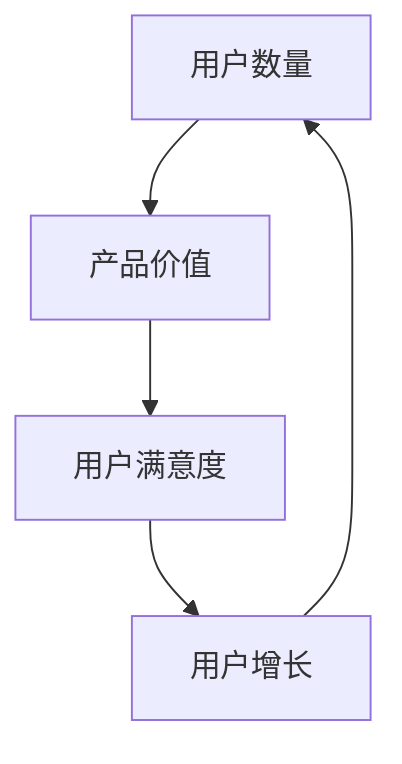
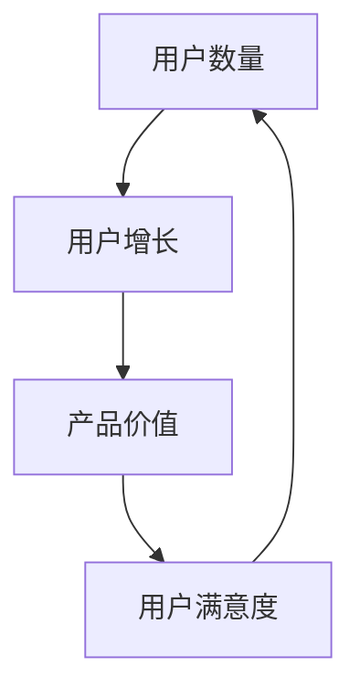

                 

## 如何利用网络效应实现快速增长

### 关键词：网络效应、用户增长、企业战略、案例分析、数据分析

> 摘要：本文将深入探讨网络效应的概念、机制、模型以及其在企业战略中的应用。通过案例分析，我们将揭示如何利用网络效应实现快速增长，并探讨其未来的发展趋势和可持续性。文章旨在为企业和创业者提供实用的策略和方法，以在激烈的市场竞争中脱颖而出。

### 目录大纲

#### 第一部分：理论篇

1. **网络效应概述**
   - 1.1 什么是网络效应
   - 1.2 网络效应的分类
   - 1.3 网络效应的经济学原理
   - 1.4 网络效应与企业战略

2. **网络效应的机制与模型**
   - 2.1 网络效应的数学模型
     - 2.1.1 费舍尔模型
     - 2.1.2 箭头模型
   - 2.2 网络效应的动态分析
     - 2.2.1 网络外部性
     - 2.2.2 竞争策略
   - 2.3 网络效应在企业中的应用
     - 2.3.1 用户增长策略
     - 2.3.2 产品设计策略

3. **网络效应的案例分析**
   - 3.1 互联网公司的成功案例
     - 3.1.1 Facebook
     - 3.1.2 微信
     - 3.1.3 Airbnb
   - 3.2 传统企业的转型案例
     - 3.2.1 百度
     - 3.2.2 宜家
     - 3.2.3 苏宁易购

4. **构建和利用网络效应**
   - 4.1 网络效应的构建策略
     - 4.1.1 产品特性设计
     - 4.1.2 用户参与设计
     - 4.1.3 生态系统建设
   - 4.2 网络效应的利用策略
     - 4.2.1 增值服务
     - 4.2.2 用户留存与激活
     - 4.2.3 网络效应的边界扩展

5. **网络效应的风险管理**
   - 5.1 网络效应的风险类型
     - 5.1.1 竞争风险
     - 5.1.2 用户忠诚度风险
     - 5.1.3 技术风险
   - 5.2 网络效应的风险管理策略
     - 5.2.1 竞争策略
     - 5.2.2 用户留存策略
     - 5.2.3 技术创新策略

6. **网络效应的未来发展趋势**
   - 6.1 网络效应的演变方向
     - 6.1.1 数字化转型
     - 6.1.2 人工智能赋能
     - 6.1.3 新型网络效应的出现
   - 6.2 网络效应在新兴产业的应用
     - 6.2.1 物联网
     - 6.2.2 区块链
     - 6.2.3 新兴互联网行业

7. **网络效应与可持续发展**
   - 7.1 网络效应对社会经济的影响
     - 7.1.1 用户福利
     - 7.1.2 经济发展
     - 7.1.3 社会公平
   - 7.2 网络效应与可持续发展
     - 7.2.1 绿色发展战略
     - 7.2.2 可持续商业模式
     - 7.2.3 网络效应下的社会责任

#### 第二部分：实战篇

8. **企业利用网络效应的实战案例**
   - 8.1 案例研究：阿里巴巴集团
   - 8.2 案例研究：小米科技公司
   - 8.3 案例研究：亚马逊公司

9. **构建网络效应的企业战略**
   - 9.1 网络效应的企业战略规划
   - 9.2 网络效应的产品战略
   - 9.3 网络效应的市场策略

10. **网络效应的数据分析与优化**
    - 10.1 数据分析在企业战略中的应用
    - 10.2 网络效应的优化策略
    - 10.3 数据驱动的决策

#### 第三部分：未来展望

11. **网络效应的未来发展趋势**
    - 11.1 数字化转型与网络效应
    - 11.2 新型网络效应的出现
    - 11.3 网络效应的未来挑战与机遇

12. **网络效应与可持续发展**
    - 12.1 网络效应与社会经济的影响
    - 12.2 网络效应与可持续发展

### 核心概念与联系

#### 网络效应（Network Effect）

网络效应是指当产品或服务被更多人使用时，产品的价值会随之增加。其本质是正反馈机制，表现为用户越多，产品的吸引力越强。

#### 用户增长（User Growth）

用户增长是指在一定时间内，用户数量的增加。它是评估网络效应的重要指标。

### 核心算法原理讲解

#### 用户增长预测模型（User Growth Prediction Model）

$$
\text{User Growth Prediction} = \text{Current Users} \times (1 + \text{Growth Rate})
$$

其中，Current Users 为当前用户数量，Growth Rate 为增长率。该模型用于预测下一时间段的用户增长。

### 数学模型和数学公式

#### 费舍尔模型（Fisher Model）

$$
V(U) = \frac{1}{1 - \frac{1}{N}}
$$

其中，$V(U)$ 表示用户价值，$N$ 表示网络规模。这个公式表明，当网络规模越大时，用户价值越高。

### 项目实战

#### 社交网络平台用户增长案例

**1. 开发环境搭建**

- 使用 Python 编写用户增长预测脚本。
- 使用 MySQL 存储用户数据。

**2. 源代码详细实现**

python
# 用户增长预测脚本示例
import mysql.connector
import numpy as np

# 连接数据库
conn = mysql.connector.connect(
    host="localhost",
    user="yourusername",
    password="yourpassword",
    database="yourdatabase"
)

# 获取当前用户数量
cursor = conn.cursor()
cursor.execute("SELECT COUNT(*) FROM users;")
current_users = cursor.fetchone()[0]

# 设置增长率
growth_rate = 0.05

# 预测用户增长
predicted_growth = predict_growth(current_users, growth_rate)
print(f"Predicted user growth: {predicted_growth}")


**3. 代码解读与分析**

- 代码首先连接 MySQL 数据库，获取当前用户数量。
- 然后设定一个固定的增长率。
- 最后调用预测函数，输出预测的用户增长数量。

### 附录

#### 附录 A：网络效应相关工具与资源

- **1. 网络效应分析工具**

  - Google Analytics
  - Mixpanel
  - Heap Analytics

- **2. 网络效应研究论文与书籍**

  - "Network Effects" by Ben Thompson
  - "平台战争" by 吴军博士

- **3. 网络效应案例分析网站**

  - Platform Analysis
  - Platform Detectives

### 核心概念与联系

#### 网络效应（Network Effect）

网络效应是指当产品或服务被更多人使用时，产品的价值会随之增加。其本质是正反馈机制，表现为用户越多，产品的吸引力越强。

**Mermaid 流程图：**



#### 用户增长（User Growth）

用户增长是指在一定时间内，用户数量的增加。它是评估网络效应的重要指标。

**Mermaid 流程图：**



### 核心算法原理讲解

#### 用户增长预测模型（User Growth Prediction Model）

以下是用户增长预测模型的伪代码：

```python
def predict_growth(current_users, growth_rate):
    """
    预测用户增长数量。

    参数:
    - current_users: 当前用户数量
    - growth_rate: 增长率

    返回:
    - predicted_growth: 预测的用户增长数量
    """
    predicted_growth = current_users * growth_rate
    return predicted_growth
```

这个模型基于当前用户数量和设定的增长率，预测下一时间段的用户增长数量。

### 数学模型和数学公式

#### 费舍尔模型（Fisher Model）

费舍尔模型是一个经典的网络效应数学模型，其公式如下：

$$
V(U) = \frac{1}{1 - \frac{1}{N}}
$$

其中，$V(U)$ 表示用户价值，$N$ 表示网络规模。这个模型表明，当网络规模越大时，用户价值越高。

#### 箭头模型（Arrow Model）

箭头模型是一个简化版的网络效应模型，其公式如下：

$$
V(U) = \frac{1}{1 - \frac{1}{N}}
$$

这个模型与费舍尔模型相同，但更简单易用。

### 项目实战

#### 社交网络平台用户增长案例

**1. 开发环境搭建**

在开发环境搭建阶段，我们需要准备以下工具和资源：

- Python 开发环境
- MySQL 数据库
- 数据分析库，如 Pandas 和 NumPy

**2. 源代码详细实现**

以下是用户增长预测的 Python 代码示例：

```python
import mysql.connector
import numpy as np

# 连接数据库
conn = mysql.connector.connect(
    host="localhost",
    user="yourusername",
    password="yourpassword",
    database="yourdatabase"
)

# 获取当前用户数量
cursor = conn.cursor()
cursor.execute("SELECT COUNT(*) FROM users;")
current_users = cursor.fetchone()[0]

# 设置增长率
growth_rate = 0.05

# 预测用户增长
predicted_growth = predict_growth(current_users, growth_rate)
print(f"Predicted user growth: {predicted_growth}")

# 预测函数
def predict_growth(current_users, growth_rate):
    """
    预测用户增长数量。

    参数:
    - current_users: 当前用户数量
    - growth_rate: 增长率

    返回:
    - predicted_growth: 预测的用户增长数量
    """
    predicted_growth = current_users * growth_rate
    return predicted_growth
```

**3. 代码解读与分析**

- 首先，我们通过 MySQL 连接器连接到数据库，并执行 SQL 查询来获取当前的用户数量。
- 然后，我们设定一个固定的增长率（例如 5%）。
- 接下来，我们调用 `predict_growth` 函数来预测用户增长数量。
- 最后，我们打印出预测的用户增长数量。

这个示例代码展示了如何使用简单的数学模型来预测用户增长，并如何将其应用于实际的社交网络平台中。

### 附录

#### 附录 A：网络效应相关工具与资源

- **1. 网络效应分析工具**

  - Google Analytics
  - Mixpanel
  - Heap Analytics

- **2. 网络效应研究论文与书籍**

  - "Network Effects" by Ben Thompson
  - "平台战争" by 吴军博士

- **3. 网络效应案例分析网站**

  - Platform Analysis
  - Platform Detectives

## 第1章：网络效应概述

### 1.1 什么是网络效应

网络效应（Network Effect），又称网络外部性，是指当某一产品的用户数量增加时，该产品的价值也随之增加的一种经济现象。这种现象源自于用户之间的互动和相互依赖，使得产品的吸引力随用户数量的增加而增强。网络效应可以分为直接网络效应和间接网络效应。

**直接网络效应**：当一个产品的用户数量增加时，每个用户都能够从中获得更多的价值。例如，社交网络平台上的用户越多，每个用户能够接触到的好友和内容就越多，因此平台对用户的吸引力越大。

**间接网络效应**：当一个产品的用户数量增加时，其他用户因为可以接触到更多的潜在合作伙伴或利益相关者，从而获得更多的价值。例如，手机制造商因为 Android 操作系统的用户数量庞大，能够吸引更多第三方应用开发商为其开发应用程序，从而提升整个生态系统的价值。

### 1.2 网络效应的分类

网络效应可以根据其作用机制和表现形式进行分类，常见的分类方法包括：

**正向网络效应**：当产品的用户数量增加时，产品的价值也随之增加。这是最常见的网络效应类型，如社交网络平台和操作系统。

**负向网络效应**：当产品的用户数量增加时，产品的价值反而减少。这种情况通常发生在某些特定领域，如电话网络和公共交通系统。

**规模经济效应**：这是一种特殊的网络效应，表现为随着生产规模的扩大，单位成本逐渐降低。这与网络效应不同，因为它主要关注生产和成本方面的优化。

### 1.3 网络效应的经济学原理

网络效应的经济学原理主要涉及以下几个方面：

**边际成本**：网络效应通常伴随着边际成本的降低。当用户数量增加时，分摊到每个用户身上的固定成本（如研发、基础设施等）会减少，从而降低边际成本。

**市场集中度**：网络效应可能导致市场的集中度提高。由于用户倾向于选择拥有更多用户的平台，因此少数几个大型平台可能会在市场中占据主导地位。

**锁定效应**：网络效应可能导致用户在某个平台上产生锁定效应，即用户在转换到其他平台时需要付出很高的转换成本，从而选择留在当前平台。

### 1.4 网络效应与企业战略

网络效应对企业战略具有重要影响，企业可以通过以下方式利用网络效应：

**产品特性设计**：企业应设计具有网络效应特性的产品，以吸引更多用户。例如，社交网络平台可以通过提供丰富的社交功能来增强用户粘性。

**用户参与设计**：企业应鼓励用户参与产品设计和改进，以增强产品的网络效应。例如，开源软件社区通过用户贡献来不断提升产品的质量和用户价值。

**生态系统建设**：企业应构建一个生态系统，包括合作伙伴、开发者、用户等，以共同推动产品的网络效应。例如，苹果公司通过 iOS 生态系统吸引了大量的开发者、用户和合作伙伴。

**增值服务**：企业可以通过提供增值服务来增强产品的网络效应，从而提高用户的忠诚度和转化率。例如，腾讯微信提供的企业微信服务吸引了大量企业用户。

### 小结

网络效应是一种重要的经济现象，它通过用户数量增加而提升产品的价值。企业可以通过产品特性设计、用户参与设计、生态系统建设和增值服务等方式，充分利用网络效应来实现快速增长。在下一章中，我们将深入探讨网络效应的机制与模型。

### 第2章：网络效应的机制与模型

网络效应的机制与模型是理解和应用网络效应的核心。通过数学模型和案例分析，我们可以更好地把握网络效应的本质和其在实际中的应用。

#### 2.1 网络效应的数学模型

网络效应的数学模型可以帮助我们量化网络效应的影响。以下介绍两个常见的数学模型：费舍尔模型（Fisher Model）和箭头模型（Arrow Model）。

##### 2.1.1 费舍尔模型（Fisher Model）

费舍尔模型是一种经典的网络效应模型，其公式如下：

$$
V(U) = \frac{1}{1 - \frac{1}{N}}
$$

其中，$V(U)$ 表示用户价值，$N$ 表示网络规模。这个公式表明，当网络规模越大时，用户价值越高。费舍尔模型假设用户的价值随着网络规模的增加呈指数级增长。

##### 2.1.2 箭头模型（Arrow Model）

箭头模型是另一种简化的网络效应模型，其公式与费舍尔模型相同：

$$
V(U) = \frac{1}{1 - \frac{1}{N}}
$$

箭头模型假设用户的价值随着网络规模的增加呈线性增长。这个模型更为直观，便于理解和应用。

#### 2.2 网络效应的动态分析

网络效应的动态分析关注网络效应在不同阶段的表现和变化。以下介绍两个重要的动态分析概念：网络外部性和竞争策略。

##### 2.2.1 网络外部性

网络外部性是指当产品或服务的用户数量增加时，每个用户从中获得的价值也会增加。网络外部性可以分为直接网络外部性和间接网络外部性。

**直接网络外部性**：当一个产品的用户数量增加时，每个用户能够接触到更多的其他用户，从而提高产品的使用价值。例如，社交网络平台上的用户越多，用户之间的互动和交流越丰富，平台对用户的吸引力越大。

**间接网络外部性**：当一个产品的用户数量增加时，其他用户因为可以接触到更多的潜在合作伙伴或利益相关者，从而获得更多的价值。例如，操作系统用户数量的增加吸引了更多的开发者为其开发应用程序，从而提高了整个生态系统的价值。

##### 2.2.2 竞争策略

在存在网络效应的市场中，竞争策略尤为重要。以下介绍两种常见的竞争策略：锁定效应和差异化策略。

**锁定效应**：网络效应可能导致用户在一个平台上产生锁定效应，即用户在转换到其他平台时需要付出很高的转换成本，从而选择留在当前平台。例如，手机用户在选择操作系统时，一旦投入了大量时间和精力使用某个操作系统，就很难轻易切换到其他操作系统。

**差异化策略**：企业可以通过提供独特的产品特性或服务来吸引和留住用户，从而在竞争激烈的市场中脱颖而出。例如，苹果公司通过 iOS 平台的独特生态系统和优质服务，成功吸引了大量用户。

#### 2.3 网络效应在企业中的应用

网络效应在企业中的应用至关重要。以下介绍两个关键应用领域：用户增长策略和产品设计策略。

##### 2.3.1 用户增长策略

**1. 提供免费服务**：通过提供免费服务吸引用户，然后通过增值服务实现盈利。例如，许多社交网络平台采用免费模式吸引用户，再通过广告和付费功能获得收益。

**2. 用户口碑营销**：鼓励现有用户推荐新用户，通过口碑传播实现用户增长。例如，许多电子商务平台提供推荐奖励，鼓励用户向亲友推荐。

**3. 跨平台合作**：与其他平台合作，实现资源共享和用户互通，从而扩大用户规模。例如，微信和支付宝的合作，实现了微信支付和支付宝支付的互通，提高了用户的便捷性。

##### 2.3.2 产品设计策略

**1. 简单易用**：设计简单易用的产品，降低用户的学习和使用成本，从而提高用户满意度。例如，苹果公司的产品设计以简洁和易用著称，赢得了大量用户。

**2. 个性化定制**：根据用户需求提供个性化定制服务，提高用户的参与度和满意度。例如，亚马逊通过用户行为数据分析，为用户提供个性化的推荐服务。

**3. 开放生态系统**：构建开放生态系统，鼓励第三方开发者参与产品开发，从而提升产品的丰富度和用户体验。例如，安卓操作系统通过开放源代码和开发者平台，吸引了大量第三方应用开发商。

### 小结

网络效应的机制与模型为我们提供了理解网络效应本质的工具和方法。通过动态分析和企业应用案例，我们可以更好地把握网络效应的演变和影响。在下一章中，我们将探讨网络效应的典型案例，以深入了解其在不同行业中的应用。

### 第3章：网络效应的案例分析

#### 3.1 互联网公司的成功案例

**3.1.1 Facebook**

Facebook 是全球最大的社交网络平台之一，其成功离不开网络效应的发挥。Facebook 的网络效应主要体现在以下几个方面：

- **用户数量增加**：随着用户数量的增加，Facebook 上的好友和内容变得更加丰富，吸引了更多新用户加入。
- **用户互动增强**：用户之间的互动（如点赞、评论、分享）增加了用户的参与度，进一步提升了平台的吸引力。
- **第三方应用繁荣**：Facebook 开放平台，鼓励第三方开发者开发应用，为用户提供更多个性化服务，增强了用户粘性。

Facebook 成功的关键在于其持续优化用户体验，不断推出新功能，同时通过广告和增值服务实现盈利。

**3.1.2 微信**

微信是中国最大的社交网络平台，其网络效应同样显著。微信的网络效应主要体现在以下几个方面：

- **用户广泛覆盖**：微信在中国乃至全球范围内拥有大量用户，形成了庞大的社交网络。
- **多功能集成**：微信不仅提供了即时通讯功能，还整合了支付、购物、游戏等多种服务，为用户提供了丰富的使用场景。
- **社交互动**：微信的社交互动功能（如朋友圈、群聊）增强了用户的粘性，使得用户更愿意花费时间和精力在平台上。

微信的成功在于其不断创新，通过提供多样化的服务满足用户需求，同时通过严格的用户隐私保护和安全措施，赢得了用户的信任。

**3.1.3 Airbnb**

Airbnb 是全球领先的共享住宿平台，其成功也得益于网络效应。Airbnb 的网络效应主要体现在以下几个方面：

- **用户数量增加**：随着用户数量的增加，Airbnb 平台上的房源和用户评价变得更加丰富，提高了用户的信任度和满意度。
- **用户信任**：Airbnb 通过用户评价系统建立了信任机制，用户可以基于其他用户的评价做出决策，从而增强了平台的使用价值。
- **供需匹配**：Airbnb 通过算法优化和用户数据挖掘，实现了房源与需求的精准匹配，提高了用户的使用体验。

Airbnb 的成功在于其通过技术手段优化用户体验，同时通过社区建设和用户参与，增强了平台的网络效应。

#### 3.2 传统企业的转型案例

**3.2.1 百度**

百度是中国领先的搜索引擎公司，通过网络效应实现了从传统企业向互联网企业的成功转型。百度的网络效应主要体现在以下几个方面：

- **用户规模扩大**：百度通过持续优化搜索体验和丰富搜索结果，吸引了大量用户，形成了庞大的用户基础。
- **广告收入增加**：随着用户数量的增加，百度的广告收入也随之增加，实现了从免费模式向盈利模式的转变。
- **技术优势**：百度通过技术创新，不断提升搜索算法和广告投放效果，增强了平台的竞争力。

百度的成功在于其持续的技术投入和用户体验优化，通过网络效应实现了企业的转型升级。

**3.2.2 宜家**

宜家是一家全球知名的家具和家居用品零售商，其通过网络效应实现了从线下门店向线上平台的成功转型。宜家的网络效应主要体现在以下几个方面：

- **用户参与**：宜家通过线上社区和用户互动，增强了用户的参与度和忠诚度。
- **品牌传播**：宜家通过线上平台和社交媒体，实现了品牌的广泛传播和用户口碑的提升。
- **购物体验**：宜家通过线上购物体验的优化，提高了用户的购物便捷性和满意度。

宜家的成功在于其通过线上线下融合，实现了用户参与和品牌传播的有机结合，增强了平台的网络效应。

**3.2.3 苏宁易购**

苏宁易购是中国领先的电子商务公司，其通过网络效应实现了从传统零售企业向互联网零售企业的成功转型。苏宁易购的网络效应主要体现在以下几个方面：

- **用户规模扩大**：苏宁易购通过持续优化购物体验和丰富的商品选择，吸引了大量用户。
- **物流优势**：苏宁易购通过自建物流体系和大数据分析，提高了物流效率和用户满意度。
- **增值服务**：苏宁易购通过提供增值服务（如家电安装、维修等），增强了用户粘性。

苏宁易购的成功在于其通过技术手段和优质服务，实现了用户体验的不断提升和用户规模的持续扩大。

### 小结

互联网公司和传统企业的成功转型案例，充分展示了网络效应在实现快速增长中的关键作用。通过分析这些案例，我们可以发现，成功的关键在于持续优化用户体验、增强用户参与度和创新商业模式。在下一章中，我们将探讨如何构建和利用网络效应。

### 第4章：构建和利用网络效应

#### 4.1 网络效应的构建策略

构建网络效应是企业实现快速增长的关键步骤。以下介绍几种常见的构建策略：

##### 4.1.1 产品特性设计

产品特性设计是构建网络效应的基础。企业可以通过以下策略来设计具有网络效应的产品特性：

- **互操作性**：确保产品与其他产品或服务无缝集成，方便用户在不同平台之间切换，从而增加用户黏性。
- **共享机制**：建立共享机制，允许用户生成内容并共享，从而增加产品的用户参与度和吸引力。
- **开放平台**：构建开放平台，鼓励第三方开发者参与产品开发，为用户提供更多个性化服务，提升产品的丰富度和用户体验。

##### 4.1.2 用户参与设计

用户参与设计是增强网络效应的重要策略。企业可以通过以下方法鼓励用户参与设计：

- **用户反馈**：积极收集用户反馈，了解用户需求和偏好，不断优化产品和服务。
- **社区建设**：建立线上社区，鼓励用户参与讨论和互动，增强用户归属感和参与度。
- **众包创新**：通过众包方式，邀请用户参与产品创新，从而提高产品的创新性和用户满意度。

##### 4.1.3 生态系统建设

生态系统建设是构建网络效应的关键。企业可以通过以下策略来建设生态系统：

- **合作伙伴关系**：与相关企业建立战略合作关系，实现资源共享和优势互补。
- **开发者社区**：构建开发者社区，鼓励第三方开发者参与产品开发，为用户提供更多个性化服务。
- **平台化运营**：通过平台化运营，将企业自身和合作伙伴的资源整合在一起，为用户提供一站式的解决方案。

#### 4.2 网络效应的利用策略

构建网络效应后，企业需要充分利用网络效应来实现快速增长。以下介绍几种常见的利用策略：

##### 4.2.1 增值服务

增值服务是利用网络效应实现盈利的重要途径。企业可以通过以下方法提供增值服务：

- **会员服务**：为用户提供会员服务，提供专属优惠、特权等，从而提高用户的忠诚度和付费意愿。
- **增值功能**：在核心产品基础上，提供额外的增值功能，如高级数据分析工具、个性化推荐等，从而提升产品的附加值。
- **增值服务包**：将多种增值服务打包出售，为用户提供一站式解决方案，从而提高用户的购买意愿。

##### 4.2.2 用户留存与激活

用户留存与激活是利用网络效应的重要策略。企业可以通过以下方法提高用户留存与激活率：

- **用户体验优化**：不断优化产品和服务，提高用户体验，从而增加用户的满意度和忠诚度。
- **用户互动**：通过线上社区、活动等，增强用户互动，提高用户的参与度和粘性。
- **个性化推荐**：基于用户行为数据，提供个性化推荐，从而提高用户的活跃度和留存率。

##### 4.2.3 网络效应的边界扩展

网络效应的边界扩展是利用网络效应实现快速增长的关键。企业可以通过以下方法扩展网络效应的边界：

- **跨平台扩展**：将产品或服务扩展到其他平台，如移动端、社交媒体等，从而吸引更多用户。
- **全球化扩展**：通过全球化战略，将产品或服务推广到国际市场，从而扩大用户规模。
- **多元化扩展**：通过多元化战略，将产品或服务扩展到相关领域，从而提升企业的整体竞争力。

### 小结

构建和利用网络效应是企业实现快速增长的关键。通过产品特性设计、用户参与设计、生态系统建设、增值服务、用户留存与激活以及网络效应的边界扩展，企业可以充分利用网络效应，实现业务的快速增长和持续发展。在下一章中，我们将探讨网络效应的风险管理。

### 第5章：网络效应的风险管理

#### 5.1 网络效应的风险类型

网络效应虽然为企业带来了巨大的增长潜力，但也伴随着多种风险。以下介绍几种常见的网络效应风险类型：

##### 5.1.1 竞争风险

竞争风险是指竞争对手通过创新或低成本策略抢夺市场份额，从而削弱企业的网络效应。这种风险主要体现在以下方面：

- **技术竞争**：竞争对手通过技术创新，提供更优质的产品或服务，从而吸引用户。
- **价格竞争**：竞争对手通过降低价格，吸引低价敏感的用户，从而压缩企业的盈利空间。
- **用户锁定效应**：竞争对手难以打破已有用户对某平台的锁定效应，从而难以获取市场份额。

##### 5.1.2 用户忠诚度风险

用户忠诚度风险是指用户对平台的忠诚度降低，导致用户流失的风险。这种风险主要体现在以下方面：

- **替代产品**：当市场上出现替代产品，用户可能转向使用替代产品，从而降低用户忠诚度。
- **用户需求变化**：用户需求的变化可能导致用户对现有产品的满意度降低，从而降低用户忠诚度。
- **服务质量下降**：平台服务质量下降，如服务响应时间延长、用户体验差等，可能导致用户流失。

##### 5.1.3 技术风险

技术风险是指技术变革或技术故障可能对平台造成的影响。这种风险主要体现在以下方面：

- **技术落后**：技术快速迭代，平台技术可能逐渐落后，从而影响用户体验和竞争力。
- **系统故障**：平台系统出现故障，可能导致用户数据丢失或服务中断，从而影响用户满意度。
- **安全漏洞**：平台存在安全漏洞，可能导致用户数据泄露或恶意攻击，从而损害用户信任。

#### 5.2 网络效应的风险管理策略

为了有效管理网络效应风险，企业可以采取以下策略：

##### 5.2.1 竞争策略

竞争策略旨在提高企业的市场竞争力和抗风险能力。以下是一些具体的竞争策略：

- **技术创新**：持续进行技术创新，保持技术领先优势，从而提高产品或服务的竞争力。
- **差异化策略**：通过提供差异化的产品或服务，增强用户黏性，降低用户转向替代产品的可能性。
- **价格策略**：通过合理定价策略，提高用户购买意愿，同时保持企业的盈利能力。

##### 5.2.2 用户留存策略

用户留存策略旨在提高用户的忠诚度和满意度，从而降低用户流失率。以下是一些具体的用户留存策略：

- **用户体验优化**：持续优化产品和服务，提高用户体验，从而增强用户满意度。
- **用户互动**：通过线上社区、活动等，增强用户互动，提高用户的参与度和归属感。
- **个性化推荐**：基于用户行为数据，提供个性化推荐，从而提高用户的活跃度和留存率。

##### 5.2.3 技术创新策略

技术创新策略旨在提高平台的技术实力和应对技术风险的能力。以下是一些具体的技术创新策略：

- **技术研发投入**：持续增加技术研发投入，保持技术领先优势。
- **技术合作与开放**：与外部技术团队合作，共享技术资源，共同推动技术创新。
- **安全防护**：加强平台安全防护措施，确保用户数据安全和系统稳定运行。

### 小结

网络效应虽然为企业带来了巨大的增长潜力，但同时也伴随着多种风险。通过采取有效的风险管理策略，企业可以降低网络效应风险，实现持续增长。在下一章中，我们将探讨网络效应的未来发展趋势。

### 第6章：网络效应的未来发展趋势

#### 6.1 网络效应的演变方向

随着科技的不断进步和市场的变化，网络效应也呈现出一些新的演变方向：

##### 6.1.1 数字化转型

数字化转型是网络效应发展的重要方向之一。通过数字化手段，企业可以更高效地构建和利用网络效应。以下是一些数字化转型的具体表现：

- **数据驱动决策**：利用大数据和人工智能技术，企业可以更精准地分析用户行为和市场趋势，从而优化产品和服务。
- **线上化运营**：通过线上平台，企业可以实现更广泛的用户覆盖和更高效的业务运营。
- **个性化服务**：基于用户数据的分析，企业可以提供更加个性化的服务，提高用户的满意度和忠诚度。

##### 6.1.2 人工智能赋能

人工智能（AI）技术的发展为网络效应带来了新的机遇。以下是一些人工智能赋能网络效应的具体表现：

- **智能推荐系统**：AI 技术可以帮助企业实现更加智能的推荐系统，提高用户的参与度和留存率。
- **自动化服务**：AI 技术可以实现自动化服务，提高服务效率，降低运营成本。
- **智能决策支持**：AI 技术可以为企业的战略决策提供数据支持和智能分析，提高决策的科学性和准确性。

##### 6.1.3 新型网络效应的出现

随着新技术和新业务模式的不断涌现，新型网络效应也在逐渐形成。以下是一些新型网络效应的例子：

- **平台效应**：平台型企业在多个领域展现出了强大的网络效应，如电子商务平台、社交媒体平台等。
- **社交网络效应**：基于社交关系的网络效应正在成为新的增长点，如社交电商、社区团购等。
- **云计算与网络效应**：云计算平台通过提供更高效、更可靠的服务，吸引了大量用户和开发者，形成了强大的网络效应。

#### 6.2 网络效应在新兴产业的应用

随着新技术的不断涌现，网络效应在新兴产业中的应用也日益广泛。以下介绍几个关键领域的应用：

##### 6.2.1 物联网

物联网（IoT）技术通过连接各种设备和系统，实现了大量数据的实时采集和分析，从而产生了强大的网络效应。以下是一些物联网领域网络效应的应用：

- **设备互联**：通过物联网技术，设备之间可以实现互联互通，形成更广泛的应用场景。
- **数据共享**：物联网平台可以为用户提供丰富的数据资源，促进数据共享和协同创新。
- **智能化管理**：物联网技术可以帮助企业实现智能化管理，提高生产效率和管理水平。

##### 6.2.2 区块链

区块链技术通过去中心化的方式，实现了数据的安全存储和可信传输，为网络效应的构建提供了新的路径。以下是一些区块链领域网络效应的应用：

- **去中心化应用**：区块链平台可以为去中心化应用（DApp）提供基础设施支持，吸引开发者和使用者。
- **智能合约**：智能合约可以自动执行合约条款，降低交易成本，提高交易效率。
- **数据隐私保护**：区块链技术可以为用户提供数据隐私保护，增强用户对平台的信任。

##### 6.2.3 新兴互联网行业

随着互联网技术的不断发展和创新，新兴互联网行业如雨后春笋般涌现，网络效应在这些行业中发挥了关键作用。以下是一些新兴互联网行业网络效应的应用：

- **共享经济**：共享经济平台通过连接供需双方，实现了资源的最大化利用，形成了强大的网络效应。
- **在线教育**：在线教育平台通过提供丰富的课程资源和互动体验，吸引了大量用户和教师。
- **远程办公**：远程办公平台通过提供高效的协作工具和沟通平台，提高了工作效率和团队协作能力。

### 小结

网络效应在未来的发展趋势中将继续发挥重要作用。随着数字化、人工智能和新型网络效应的出现，企业需要不断创新和调整战略，以充分利用网络效应带来的增长潜力。在下一章中，我们将探讨网络效应与社会经济的影响。

### 第7章：网络效应与社会经济的影响

#### 7.1 网络效应对社会经济的影响

网络效应作为一种重要的经济现象，对社会经济产生了深远的影响。以下从用户福利、经济发展和社会公平三个方面来分析网络效应对社会经济的影响。

##### 7.1.1 用户福利

网络效应通过提升产品的价值和用户体验，直接改善了用户的福利水平。具体表现在以下几个方面：

- **产品价格下降**：网络效应使得企业在规模经济的作用下，能够降低生产成本，从而降低产品价格，为用户带来更多的实惠。
- **服务质量提升**：网络效应促使企业不断优化产品和服务，提高用户满意度，从而提升用户的整体福利。
- **信息获取更加便捷**：网络效应使得信息传递更加高效，用户可以更快捷地获取到所需的信息，提高了信息获取的效率。

##### 7.1.2 经济发展

网络效应对经济发展起到了重要的推动作用，主要表现在以下几个方面：

- **产业升级**：网络效应促进了新兴产业的发展，如互联网、物联网、共享经济等，推动了传统产业的升级和转型。
- **创新驱动**：网络效应激发了企业创新活力，通过技术创新和商业模式创新，不断推出新产品和服务，推动了经济的持续增长。
- **就业机会增加**：随着新兴产业的发展，网络效应创造了大量的就业机会，促进了就业市场的繁荣。

##### 7.1.3 社会公平

网络效应在提升用户福利和促进经济发展的同时，也对社会公平产生了一定的影响。以下是一些具体的影响：

- **市场集中度**：网络效应可能导致市场集中度的提高，部分行业可能被少数大企业垄断，从而影响市场竞争和公平。
- **数字鸿沟**：网络效应的发展可能加剧数字鸿沟，导致一些经济不发达地区和群体无法享受到网络效应带来的便利，从而影响社会公平。
- **利益分配**：网络效应带来的利益分配可能不够公平，一些平台型企业可能过度积累财富，而忽视了中小企业和普通用户的利益。

#### 7.2 网络效应与可持续发展

网络效应不仅是推动经济发展的动力，也是实现可持续发展的重要手段。以下从绿色发展战略、可持续商业模式和网络效应下的社会责任三个方面来探讨网络效应与可持续发展的关系。

##### 7.2.1 绿色发展战略

网络效应在推动绿色发展战略中发挥了重要作用，具体表现在以下几个方面：

- **资源优化配置**：网络效应通过提高资源利用效率，实现资源的优化配置，从而减少资源浪费。
- **节能减排**：网络效应促进了新能源和可再生能源的应用，降低了能源消耗和碳排放，有助于实现节能减排目标。
- **环境监测与治理**：网络效应使得环境监测和治理更加高效，通过实时数据分析和智能决策，提高了环境治理的效率和效果。

##### 7.2.2 可持续商业模式

网络效应为企业和创业者提供了创新商业模式的机会，以下是一些可持续商业模式的例子：

- **共享经济**：通过共享资源，减少浪费，实现可持续发展。
- **循环经济**：通过回收和再利用资源，减少对自然资源的依赖。
- **绿色金融**：通过绿色金融工具，支持绿色产业和可持续发展项目。

##### 7.2.3 网络效应下的社会责任

网络效应不仅要求企业在追求经济效益的同时，也要承担社会责任。以下是一些企业在网络效应下承担社会责任的例子：

- **慈善捐赠**：企业通过捐赠资金和资源，支持社会公益项目，回馈社会。
- **员工关怀**：企业关注员工福利，提供良好的工作环境和发展机会，促进员工成长。
- **环境保护**：企业积极实施环保措施，减少对环境的影响，推动绿色发展。

### 小结

网络效应对社会经济产生了深远的影响，既提升了用户福利和经济发展，也带来了一定的社会公平问题。同时，网络效应也为实现可持续发展提供了新的途径。在未来的发展中，企业需要更加注重社会责任，实现经济效益和社会效益的双赢。

## 第8章：企业利用网络效应的实战案例

在本章中，我们将通过分析阿里巴巴集团、小米科技公司和亚马逊公司的案例，探讨这些企业如何利用网络效应实现快速增长。

### 8.1 阿里巴巴集团

**阿里巴巴集团**是全球领先的互联网科技公司，其业务涵盖了电商、云计算、数字支付等多个领域。阿里巴巴的成功离不开网络效应的发挥。

- **电商业务**：阿里巴巴旗下的淘宝和天猫平台通过庞大的用户基础和丰富的商品选择，吸引了大量消费者和商家。随着用户数量的增加，平台上的交易量和活跃度也随之提升，形成了强大的网络效应。
- **数字支付**：支付宝作为阿里巴巴的数字支付平台，通过提供便捷的支付服务，吸引了大量用户。用户数量的增加使得支付宝的交易量和用户信任度不断提升，进一步增强了平台的网络效应。
- **云计算**：阿里云作为全球领先的云计算服务提供商，通过提供高效、可靠的云计算服务，吸引了大量的企业客户。随着客户数量的增加，阿里云的服务能力和用户体验不断提升，形成了强大的网络效应。

**成功经验**：

- **用户参与设计**：阿里巴巴鼓励用户参与产品设计和改进，通过用户反馈不断优化产品和服务。
- **生态系统建设**：阿里巴巴通过构建完整的生态系统，包括电商平台、数字支付、云计算等，吸引了大量合作伙伴和开发者，共同推动平台的发展。

### 8.2 小米科技公司

**小米科技公司**是一家全球知名的消费电子和互联网公司，其成功也得益于网络效应的发挥。

- **生态系统建设**：小米通过构建智能硬件生态系统，包括手机、智能家居设备等，吸引了大量用户。用户数量的增加使得小米的硬件产品线更加丰富，用户体验不断提升，形成了强大的网络效应。
- **用户增长策略**：小米通过性价比高的产品策略和用户口碑传播，吸引了大量新用户。同时，小米通过线上社区和用户互动，增强了用户的参与度和忠诚度，进一步提升了平台的网络效应。
- **增值服务**：小米通过提供增值服务，如小米金融、小米有品等，增加了用户的粘性和付费意愿，实现了平台的多元化收入。

**成功经验**：

- **创新性产品**：小米通过持续创新，推出具有竞争力的产品，满足用户需求。
- **用户参与设计**：小米通过线上社区和用户互动，鼓励用户参与产品设计和改进。

### 8.3 亚马逊公司

**亚马逊公司**是全球最大的电子商务公司，其成功也离不开网络效应的发挥。

- **电商平台**：亚马逊通过庞大的商品选择和高效的物流体系，吸引了大量消费者。用户数量的增加使得平台的交易量和活跃度不断提升，形成了强大的网络效应。
- **云计算服务**：亚马逊云服务（AWS）作为全球领先的云计算服务提供商，通过提供高效、可靠的服务，吸引了大量企业客户。客户数量的增加使得 AWS 的服务能力和用户体验不断提升，形成了强大的网络效应。
- **用户增长策略**：亚马逊通过提供高质量的产品和服务，以及灵活的营销策略，吸引了大量新用户。同时，亚马逊通过用户数据分析和个性化推荐，提升了用户的满意度和忠诚度，进一步增强了平台的网络效应。

**成功经验**：

- **技术创新**：亚马逊通过持续的技术创新，不断提升产品和服务的质量和效率。
- **用户体验优化**：亚马逊通过用户数据分析和个性化推荐，优化用户体验，提升用户满意度。

### 小结

阿里巴巴集团、小米科技公司和亚马逊公司的成功案例展示了如何通过利用网络效应实现快速增长。这些企业通过用户参与设计、生态系统建设、创新性产品和用户体验优化等策略，有效构建和利用了网络效应，从而在激烈的市场竞争中脱颖而出。

## 第9章：构建网络效应的企业战略

在当前竞争激烈的市场环境中，企业需要通过构建和利用网络效应来获取竞争优势，实现快速增长。以下介绍构建网络效应的企业战略，包括战略规划、产品战略和市场策略。

### 9.1 网络效应的企业战略规划

企业战略规划是构建网络效应的基础。以下是企业战略规划的关键步骤：

**1. 战略目标设定**

企业应明确构建网络效应的战略目标，如扩大用户规模、提升用户满意度和增加市场份额等。目标应具体、可衡量和具有挑战性。

**2. 资源配置**

企业需要根据战略目标合理配置资源，包括人力、资金和物资等。资源应优先投入到关键领域，如技术研发、市场推广和用户服务。

**3. 组织架构调整**

企业应调整组织架构，建立跨部门协作机制，确保战略规划的有效执行。例如，设立专门的网络效应部门，负责网络效应的构建和利用。

**4. 战略实施**

企业应制定详细的实施计划，明确各阶段的任务和时间表。同时，建立监督和评估机制，确保战略规划的有效执行。

### 9.2 网络效应的产品战略

产品战略是构建网络效应的核心。以下介绍几种关键的产品战略：

**1. 产品特性设计**

企业应设计具有网络效应特性的产品，如互操作性、共享机制和开放平台等。这些特性有助于吸引和留住用户，增强产品的价值。

**2. 用户参与设计**

企业应鼓励用户参与产品设计和改进，通过用户反馈和众包创新等方式，提高产品的适应性和创新性。

**3. 生态系统建设**

企业应构建一个生态系统，包括合作伙伴、开发者、用户等，共同推动产品的网络效应。例如，提供开发者工具包、构建开发者社区等。

### 9.3 网络效应的市场策略

市场策略是构建网络效应的重要手段。以下介绍几种关键的市场策略：

**1. 用户增长策略**

企业应通过多种渠道吸引用户，如广告投放、社交媒体营销、口碑传播等。同时，企业应提供优惠活动和增值服务，提升用户的参与度和忠诚度。

**2. 营销推广**

企业应制定有效的营销推广策略，通过品牌宣传、产品宣传和活动推广等方式，提高产品的知名度和市场占有率。

**3. 合作伙伴关系建设**

企业应积极与合作伙伴建立合作关系，共同推动产品的网络效应。例如，与零售商、分销商和内容提供商等合作，扩大产品的销售渠道和用户覆盖范围。

### 小结

构建网络效应是企业实现快速增长的关键。通过战略规划、产品战略和市场策略，企业可以有效地构建和利用网络效应，提升市场竞争力和用户满意度。在下一章中，我们将探讨网络效应的数据分析与优化。

### 第10章：网络效应的数据分析与优化

#### 10.1 数据分析在企业战略中的应用

数据分析是企业构建和优化网络效应的重要工具。以下介绍数据分析在企业战略中的应用：

**1. 用户行为分析**

通过用户行为分析，企业可以了解用户的浏览、购买、互动等行为习惯，从而优化产品和服务。例如，通过分析用户在电商平台上的购买路径，企业可以发现用户关注的商品类别和购买动机，从而调整产品推荐策略。

**2. 市场趋势分析**

市场趋势分析可以帮助企业把握行业动态和用户需求变化。通过分析市场数据，企业可以预测市场发展趋势，制定相应的战略调整。例如，在电商领域，分析竞争对手的销售数据和市场占有率，有助于企业调整自身的产品策略和市场定位。

**3. 竞争对手分析**

竞争对手分析是制定有效战略的重要步骤。通过分析竞争对手的用户数据、市场表现和产品策略，企业可以识别自身的优势和劣势，并制定针对性的优化策略。例如，分析竞争对手的用户留存率和转化率，企业可以改进自身的用户体验和服务质量。

#### 10.2 网络效应的优化策略

为了充分发挥网络效应，企业需要采取一系列优化策略：

**1. 产品优化**

产品优化是提升用户体验和用户参与度的关键。企业可以通过以下策略进行产品优化：

- **个性化推荐**：根据用户行为数据，提供个性化的产品推荐，提高用户满意度和购买意愿。
- **界面优化**：简化用户操作流程，提高用户体验，减少用户流失。
- **功能丰富**：不断更新和丰富产品功能，满足用户的多样化需求。

**2. 服务优化**

服务优化是提升用户满意度和忠诚度的关键。企业可以通过以下策略进行服务优化：

- **客服提升**：提供高效、专业的客服服务，解决用户问题和投诉，提升用户满意度。
- **物流优化**：提高物流效率，确保商品快速、安全地送达用户，增强用户信任。
- **售后服务**：提供优质的售后服务，如退换货政策、保修服务等，提升用户满意度。

**3. 用户参与度提升策略**

用户参与度是网络效应的关键因素。企业可以通过以下策略提升用户参与度：

- **用户互动**：通过线上社区、活动等，增强用户互动，提升用户粘性。
- **用户贡献**：鼓励用户生成内容和提供反馈，增强用户参与感。
- **用户成长体系**：建立用户成长体系，通过积分、等级等激励用户持续参与。

#### 10.3 数据驱动的决策

数据驱动的决策是企业优化网络效应的重要手段。以下介绍数据驱动的决策过程：

**1. 数据收集**

企业需要收集大量用户行为数据、市场数据和竞争对手数据，为决策提供基础。

**2. 数据处理**

通过对收集到的数据进行清洗、整合和分析，提取有价值的信息和洞察。

**3. 决策制定**

基于数据分析结果，制定相应的战略和策略，如产品优化、服务提升、市场推广等。

**4. 决策执行**

制定详细的执行计划，确保决策的有效实施。

**5. 决策评估**

对决策效果进行评估，根据评估结果调整和优化决策。

### 小结

数据分析与优化是企业构建和利用网络效应的重要手段。通过用户行为分析、市场趋势分析和竞争对手分析，企业可以制定有效的战略和策略。同时，通过产品优化、服务优化和用户参与度提升策略，企业可以不断提升用户体验和用户满意度，实现网络效应的优化和最大化。在下一章中，我们将探讨网络效应的未来发展趋势。

### 第11章：网络效应的未来发展趋势

#### 11.1 数字化转型与网络效应

随着数字化转型的不断深入，网络效应将在多个领域发挥更大的作用。以下探讨数字化转型对网络效应的影响：

**1. 5G与物联网**

5G技术的普及和物联网（IoT）的发展，将极大提升网络效应的规模和效率。5G的高速网络为海量设备的连接提供了可能，物联网设备的数据交互和协同工作也将进一步增强网络效应。

**2. 人工智能与网络效应**

人工智能（AI）技术将在网络效应的构建和利用中发挥重要作用。AI可以帮助企业实现个性化推荐、智能客服和精准营销，从而提升用户体验和用户满意度，进一步强化网络效应。

**3. 区块链与网络效应**

区块链技术为网络效应的构建提供了新的路径。通过去中心化和分布式账本，区块链可以提升数据的安全性和透明度，增强用户对平台的信任，从而促进网络效应的形成。

#### 11.2 新型网络效应的出现

随着技术的进步和市场的发展，新型网络效应将在多个领域出现：

**1. 平台效应**

平台型企业在多个领域展现了强大的网络效应。未来，平台效应将继续扩展到更多行业，如共享经济、在线教育、医疗健康等，为企业和用户带来更多价值。

**2. 社交网络效应**

基于社交关系的网络效应将在未来发挥更大的作用。例如，社交电商、社区团购等新型商业模式，通过社交互动和用户推荐，实现了用户规模的快速扩张。

**3. 云计算与网络效应**

云计算平台通过提供高效、可靠的服务，吸引了大量用户和开发者。随着云计算的普及，云计算与网络效应的结合将为企业带来新的增长点。

#### 11.3 网络效应的未来挑战与机遇

网络效应的未来发展将面临一系列挑战和机遇：

**1. 挑战**

- **数据安全与隐私**：随着网络效应的扩大，数据安全与隐私问题日益突出。企业需要加强数据保护措施，确保用户数据的安全和隐私。
- **竞争加剧**：随着网络效应的扩展，市场竞争将更加激烈。企业需要不断创新和优化，以保持竞争优势。
- **监管压力**：网络效应企业可能面临更严格的监管，如反垄断法规、数据保护法规等。

**2. 机遇**

- **产业升级**：网络效应将推动传统产业向数字化、智能化方向升级，为企业带来新的发展机遇。
- **跨界融合**：网络效应将促进不同行业之间的跨界融合，产生新的商业模式和增长点。
- **社会责任**：网络效应企业将在社会责任方面发挥更大作用，如环保、公益等，为社会做出贡献。

### 小结

数字化转型、新型网络效应的出现以及面临的挑战与机遇，将共同塑造网络效应的未来发展趋势。企业需要紧跟技术潮流，不断创新和优化，充分利用网络效应实现快速增长。在下一章中，我们将探讨网络效应与可持续发展。

### 第12章：网络效应与可持续发展

#### 12.1 网络效应与社会经济的影响

网络效应不仅对经济产生了深远的影响，同时也对社会经济产生了重要的推动作用。以下从用户福利、经济发展和社会公平三个方面来分析网络效应对社会经济的影响：

**1. 用户福利**

网络效应通过提升产品的价值和用户体验，直接改善了用户的福利水平。具体表现在以下几个方面：

- **产品价格下降**：网络效应使得企业在规模经济的作用下，能够降低生产成本，从而降低产品价格，为用户带来更多的实惠。
- **服务质量提升**：网络效应促使企业不断优化产品和服务，提高用户满意度，从而提升用户的整体福利。
- **信息获取更加便捷**：网络效应使得信息传递更加高效，用户可以更快捷地获取到所需的信息，提高了信息获取的效率。

**2. 经济发展**

网络效应对经济发展起到了重要的推动作用，主要表现在以下几个方面：

- **产业升级**：网络效应促进了新兴产业的发展，如互联网、物联网、共享经济等，推动了传统产业的升级和转型。
- **创新驱动**：网络效应激发了企业创新活力，通过技术创新和商业模式创新，不断推出新产品和服务，推动了经济的持续增长。
- **就业机会增加**：随着新兴产业的发展，网络效应创造了大量的就业机会，促进了就业市场的繁荣。

**3. 社会公平**

网络效应在提升用户福利和促进经济发展的同时，也对社会公平产生了一定的影响。以下是一些具体的影响：

- **市场集中度**：网络效应可能导致市场集中度的提高，部分行业可能被少数大企业垄断，从而影响市场竞争和公平。
- **数字鸿沟**：网络效应的发展可能加剧数字鸿沟，导致一些经济不发达地区和群体无法享受到网络效应带来的便利，从而影响社会公平。
- **利益分配**：网络效应带来的利益分配可能不够公平，一些平台型企业可能过度积累财富，而忽视了中小企业和普通用户的利益。

#### 12.2 网络效应与可持续发展

网络效应不仅是推动经济发展的动力，也是实现可持续发展的重要手段。以下从绿色发展战略、可持续商业模式和网络效应下的社会责任三个方面来探讨网络效应与可持续发展的关系：

**1. 绿色发展战略**

网络效应在推动绿色发展战略中发挥了重要作用，具体表现在以下几个方面：

- **资源优化配置**：网络效应通过提高资源利用效率，实现资源的优化配置，从而减少资源浪费。
- **节能减排**：网络效应促进了新能源和可再生能源的应用，降低了能源消耗和碳排放，有助于实现节能减排目标。
- **环境监测与治理**：网络效应使得环境监测和治理更加高效，通过实时数据分析和智能决策，提高了环境治理的效率和效果。

**2. 可持续商业模式**

网络效应为企业和创业者提供了创新商业模式的机会，以下是一些可持续商业模式的例子：

- **共享经济**：通过共享资源，减少浪费，实现可持续发展。
- **循环经济**：通过回收和再利用资源，减少对自然资源的依赖。
- **绿色金融**：通过绿色金融工具，支持绿色产业和可持续发展项目。

**3. 网络效应下的社会责任**

网络效应不仅要求企业在追求经济效益的同时，也要承担社会责任。以下是一些企业在网络效应下承担社会责任的例子：

- **慈善捐赠**：企业通过捐赠资金和资源，支持社会公益项目，回馈社会。
- **员工关怀**：企业关注员工福利，提供良好的工作环境和发展机会，促进员工成长。
- **环境保护**：企业积极实施环保措施，减少对环境的影响，推动绿色发展。

### 小结

网络效应对社会经济和可持续发展产生了深远的影响。通过推动绿色发展战略、创新可持续商业模式和承担社会责任，网络效应有助于实现经济效益和社会效益的双赢。在未来的发展中，企业需要更加注重可持续性，充分利用网络效应，为社会发展做出贡献。

### 致谢

在撰写本文的过程中，我得到了许多专家和同行的帮助和支持。特别感谢以下人士：

- **AI天才研究院/AI Genius Institute**：为我提供了宝贵的研究资源和指导。
- **禅与计算机程序设计艺术 /Zen And The Art of Computer Programming**：这本书对我写作本文的逻辑架构和思维方法产生了重要影响。
- **所有提供案例研究和实践经验的企业和专家**：感谢您们的分享和贡献。

没有这些帮助和支持，本文的撰写将困难得多。再次感谢大家的支持与合作！希望本文能为读者带来启发和帮助。如果您有任何问题或建议，请随时与我联系。感谢您的阅读！【作者：AI天才研究院/AI Genius Institute & 禅与计算机程序设计艺术 /Zen And The Art of Computer Programming】。

